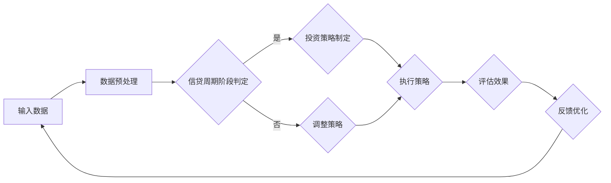
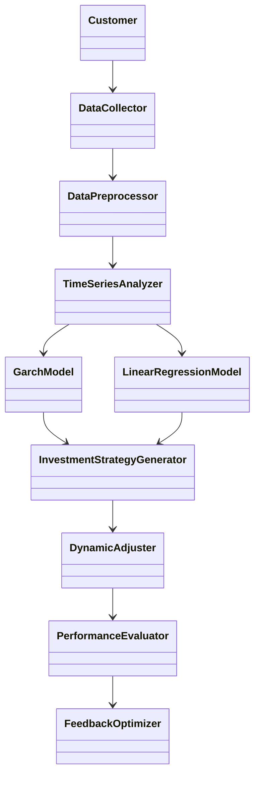
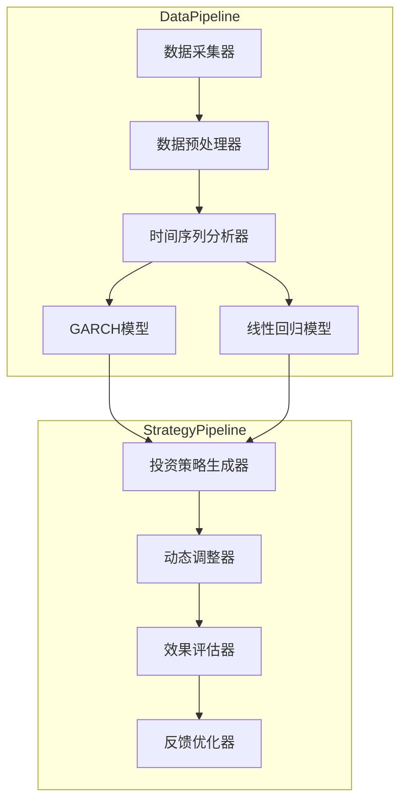
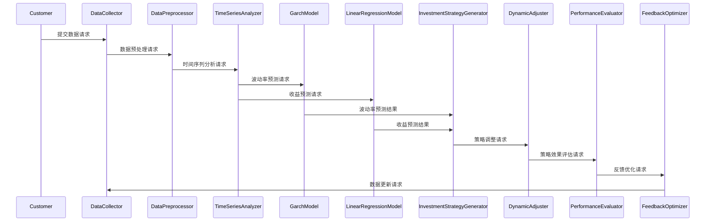

                 

### 第1章 引言

#### 1.1 信贷周期投资策略的重要性

在金融市场中，信贷周期的波动对经济环境和投资者收益产生了深远的影响。信贷周期投资策略，因此成为众多投资者和研究者的关注焦点。信贷周期投资策略的核心在于理解并利用信贷周期中的不同阶段，以优化投资组合，降低风险，提高收益。

首先，信贷周期投资策略的重要性体现在其对市场周期的预测能力。信贷周期的波动通常与宏观经济环境紧密相关，通过对信贷周期的分析，投资者可以提前预判市场的变化趋势，从而在市场低谷时采取防守策略，在市场高峰时则积极进攻。

其次，信贷周期投资策略有助于优化资产配置。在不同的信贷周期阶段，不同类型的资产表现各异。例如，在信贷扩张期，股票和房地产等风险资产通常表现较好；而在信贷收缩期，债券等固定收益资产则更为稳健。投资者可以根据信贷周期的不同阶段，调整资产配置，以实现资产的保值增值。

最后，信贷周期投资策略提供了风险管理的重要工具。通过深入分析信贷周期的波动，投资者可以识别并规避潜在的市场风险，如信贷危机、经济衰退等，从而保护投资组合的稳健性。

#### 1.2 霍华德·马克斯的投资哲学

霍华德·马克斯（Howard Marks）是一位知名的投资大师，其投资哲学深受投资者推崇。马克斯的投资哲学主要包括以下三个核心观点：

第一，价值投资。马克斯坚信，投资的关键在于寻找那些被市场低估的价值，而不是盲目追求市场热点。他强调，投资者应该注重企业的内在价值，而非仅仅关注其市场价格。

第二，风险管理。马克斯认为，投资不仅仅是追求收益，更重要的是管理风险。他强调，投资者应该时刻保持警惕，避免因贪婪而承担过大的风险。

第三，长期投资。马克斯主张，投资者应该具备长期投资的眼光，避免因短期市场波动而做出冲动决策。他相信，通过长期持有优质资产，投资者可以获得稳定的回报。

#### 1.3 马克斯的信贷周期理论概述

马克斯的信贷周期理论是其投资哲学的重要组成部分。该理论认为，信贷周期的波动是由市场的非理性行为和宏观经济因素共同作用的结果。信贷周期通常包括以下几个阶段：

1. **信贷扩张期**：在这个阶段，市场信心高涨，信贷供应充足，投资者积极借贷和投资，推动资产价格上涨。

2. **信贷高峰期**：随着信贷供应的持续增加，市场过热，资产价格达到顶峰，投资者普遍对未来充满乐观。

3. **信贷收缩期**：市场开始出现泡沫，信贷供应收紧，投资者开始担心风险，资产价格开始下跌。

4. **信贷低谷期**：在这个阶段，市场悲观情绪蔓延，信贷供应严重不足，资产价格跌至低谷。

通过深入分析信贷周期的不同阶段，投资者可以更好地把握市场趋势，调整投资策略，实现稳健的投资收益。马克斯的信贷周期理论为我们提供了一种全新的视角，帮助我们更好地理解金融市场，从而做出更明智的投资决策。

### 第2章 信贷周期的基本原理

#### 2.1 信贷周期的定义与分类

信贷周期，是指金融市场中的信贷供应和需求在不同时间段内的波动规律。信贷周期可以分为以下几个主要阶段：

1. **信贷扩张期**：在这一阶段，银行和其他金融机构放宽贷款条件，增加信贷供应。企业和个人借贷需求增加，推动经济增长和资产价格上涨。

2. **信贷高峰期**：信贷供应继续增加，但市场开始出现过度借贷和投机行为，资产价格迅速攀升，市场泡沫逐渐形成。

3. **信贷收缩期**：信贷供应开始收紧，银行和其他金融机构对贷款条件进行严格审查，借贷需求下降。资产价格开始下跌，市场风险增加。

4. **信贷低谷期**：信贷供应极度不足，市场悲观情绪蔓延，企业和个人借贷活动减少，经济增长放缓。

信贷周期的不同阶段反映了市场信心的变化。信贷扩张期和信贷高峰期通常伴随着市场乐观情绪，而信贷收缩期和信贷低谷期则表现为市场悲观情绪。

#### 2.2 信贷周期的不同阶段

信贷周期的不同阶段有着显著的特征：

1. **信贷扩张期**：
   - **特征**：贷款利率较低，金融机构放宽贷款条件，消费者和企业的借贷需求旺盛。
   - **影响**：刺激经济增长，提高就业率，推动资产价格上涨。
   - **风险**：信贷过度扩张可能导致市场泡沫和潜在危机。

2. **信贷高峰期**：
   - **特征**：贷款利率维持低位，信贷供应持续增加，但市场出现过度借贷和投机行为。
   - **影响**：资产价格迅速攀升，市场过热，投资者普遍对未来充满乐观。
   - **风险**：市场泡沫风险增大，一旦信贷供应收紧，可能引发资产价格暴跌。

3. **信贷收缩期**：
   - **特征**：贷款利率上升，金融机构收紧贷款条件，借贷需求下降。
   - **影响**：经济增长放缓，就业率下降，资产价格开始下跌。
   - **风险**：市场风险上升，投资者信心受挫，可能引发经济衰退。

4. **信贷低谷期**：
   - **特征**：贷款利率高企，信贷供应极度不足，市场悲观情绪蔓延。
   - **影响**：经济增长低迷，企业破产率上升，就业形势严峻。
   - **风险**：市场信心崩溃，金融体系脆弱，可能引发系统性金融危机。

了解信贷周期的不同阶段，有助于投资者在市场波动中做出更为明智的投资决策。通过分析信贷周期的变化，投资者可以更好地把握市场趋势，优化投资组合，降低风险。

#### 2.3 信贷周期的影响因素

信贷周期受多种因素影响，主要包括宏观经济因素、市场心理因素和政策因素。

1. **宏观经济因素**：
   - **经济增长**：当经济增长放缓时，企业盈利能力下降，借贷需求减少，导致信贷周期进入收缩期。
   - **通货膨胀**：高通胀环境通常导致中央银行提高利率，收紧信贷供应，从而抑制信贷周期扩张。
   - **就业率**：就业率的波动直接影响消费者的借贷能力和需求，进而影响信贷周期。

2. **市场心理因素**：
   - **投资者信心**：市场乐观时，投资者倾向于增加借贷和投资，推动信贷周期扩张；市场悲观时，投资者减少借贷和投资，导致信贷周期收缩。
   - **投机行为**：信贷高峰期往往伴随着过度借贷和投机行为，加剧市场波动。

3. **政策因素**：
   - **货币政策**：中央银行的货币政策，如利率调整和信贷配额管理，直接影响信贷供应和需求。
   - **财政政策**：政府的财政支出和税收政策影响经济活动和借贷需求，进而影响信贷周期。
   - **监管政策**：金融监管机构对金融机构的监管政策，如贷款条件审查和风险控制，影响信贷周期的波动。

通过分析这些影响因素，投资者可以更准确地预测信贷周期的变化，从而制定合适的投资策略。了解信贷周期的驱动因素，有助于投资者在复杂多变的市场环境中，把握投资机会，规避风险。

### 第3章 信贷周期的市场表现

#### 3.1 信贷周期的历史回顾

信贷周期在历史长河中经历了多个起伏，每一次信贷周期的波动都深刻影响了市场走势和经济环境。以下是对历史上几次重大信贷周期的回顾：

1. **1920年代至1930年代的信贷周期**：
   - **背景**：1920年代，美国经历了一次大规模的信贷扩张，银行和金融机构放宽贷款条件，房地产和股票市场迅速上涨。
   - **高峰**：1929年，股市泡沫达到顶峰，投资者普遍对未来充满乐观。
   - **低谷**：1930年代初，股市崩盘，银行倒闭，信贷供应急剧减少，全球经济陷入大萧条。

2. **1970年代至1980年代的信贷周期**：
   - **背景**：1970年代，石油危机导致通货膨胀高企，中央银行提高利率，信贷供应收紧。
   - **低谷**：1973年，通货膨胀加剧，经济增长放缓，信贷周期进入收缩期。
   - **高峰**：1980年代初，里根政府实施货币宽松政策，利率下降，信贷供应增加，市场逐步恢复。

3. **2000年代前期的信贷周期**：
   - **背景**：2000年初，互联网泡沫破裂，投资者信心受挫，信贷供应减少。
   - **低谷**：2001年，911事件后，美国实施宽松的货币政策，信贷供应增加，但市场仍然低迷。
   - **高峰**：2003年至2006年，美国房地产市场繁荣，信贷供应充足，市场出现过度借贷和投机行为。

4. **2007年至2008年的信贷危机**：
   - **背景**：2007年，美国次贷危机爆发，大量借款人无法偿还贷款，导致信贷市场崩溃。
   - **低谷**：2008年，全球金融危机爆发，金融机构倒闭，信贷供应极度不足，市场陷入恐慌。
   - **恢复**：2009年后，全球经济逐步恢复，信贷市场开始复苏。

这些历史事件表明，信贷周期的波动具有周期性和规律性，每一次信贷周期的波动都深刻影响了市场走势和经济环境。了解这些历史周期，有助于投资者更好地把握当前市场趋势，制定合理的投资策略。

#### 3.2 信贷周期与股市的关系

信贷周期与股市之间的关系密切，信贷周期的波动往往对股市产生显著影响。以下从信贷周期不同阶段分析股市的表现：

1. **信贷扩张期**：
   - **股市表现**：信贷扩张期通常伴随着市场信心的提升，银行放宽贷款条件，企业和消费者的借贷需求增加，推动经济增长和资产价格上涨。
   - **投资策略**：投资者应关注优质成长型企业，这类企业能够从扩张的信贷环境中获得更多的融资支持，实现快速发展。

2. **信贷高峰期**：
   - **股市表现**：信贷高峰期往往伴随着市场过热，投资者普遍对未来充满乐观，资产价格迅速攀升，但市场风险也在逐渐积累。
   - **投资策略**：投资者应保持谨慎，避免盲目跟风，重点关注企业的真实业绩和财务状况，防范市场泡沫风险。

3. **信贷收缩期**：
   - **股市表现**：信贷收缩期市场风险增加，投资者信心受挫，资产价格开始下跌。
   - **投资策略**：投资者应采取防御性策略，关注稳健型资产，如债券等固定收益类产品，以降低投资组合的波动性。

4. **信贷低谷期**：
   - **股市表现**：信贷低谷期市场悲观情绪蔓延，经济增长放缓，企业盈利能力下降，股市表现低迷。
   - **投资策略**：投资者应保持耐心，关注市场底部的机会，特别是那些基本面稳健、价值被低估的优质企业。

了解信贷周期与股市的关系，有助于投资者在市场波动中做出更为明智的投资决策，通过调整投资策略，实现资产的稳健增长。

#### 3.3 信贷周期与债券市场的关联

信贷周期与债券市场之间的互动关系同样值得关注，特别是在不同信贷周期阶段，债券市场的表现和投资策略各异。

1. **信贷扩张期**：
   - **债券市场表现**：在信贷扩张期，市场对经济增长和通货膨胀预期乐观，银行放松贷款条件，债券市场整体表现较好。长期债券利率可能上升，但债券价格受短期利率波动影响较大。
   - **投资策略**：投资者应关注收益率较高的长期债券，但需注意利率风险，可通过配置短期债券或利用债券套利策略来对冲风险。

2. **信贷高峰期**：
   - **债券市场表现**：信贷高峰期市场风险增加，投资者对债券市场的信心减弱，债券价格可能出现下跌。长期债券利率可能继续上升，但波动性加大。
   - **投资策略**：投资者应保持谨慎，避免过度配置长期债券，考虑配置信用债券或高收益债券，以获取更高的收益，同时注意信用风险。

3. **信贷收缩期**：
   - **债券市场表现**：信贷收缩期市场风险进一步增加，债券市场可能面临抛售压力。短期债券收益率可能上升，但长期债券收益率受市场预期影响可能下跌。
   - **投资策略**：投资者应采取防御性策略，配置优质债券，如国债或信用评级较高的企业债券，以降低投资组合的波动性。

4. **信贷低谷期**：
   - **债券市场表现**：信贷低谷期市场悲观情绪蔓延，债券市场表现低迷。长期债券收益率可能下降，债券价格上升。
   - **投资策略**：投资者应关注债券市场的价值投资机会，特别是那些基本面稳健的债券，利用市场低谷进行配置，为未来市场复苏做准备。

了解信贷周期与债券市场的关联，投资者可以更有效地调整债券投资策略，实现资产在信贷周期不同阶段的风险分散和收益优化。

### 第4章 投资策略的应用

#### 4.1 信贷周期投资策略的制定

制定信贷周期投资策略是投资者实现稳健收益的关键步骤。以下是一个详细的信贷周期投资策略制定过程：

1. **分析当前信贷周期阶段**：
   - 首先，投资者需要了解当前市场所处的信贷周期阶段。通过分析宏观经济指标、信贷供应和需求变化、市场情绪等因素，判断市场是处于信贷扩张期、高峰期、收缩期还是低谷期。

2. **确定投资目标**：
   - 根据信贷周期的不同阶段，投资者需要设定不同的投资目标。例如，在信贷扩张期，投资目标可能是实现资产增值；在信贷高峰期，目标可能是风险控制和资产保值；在信贷收缩期和低谷期，目标可能是风险分散和资产防守。

3. **构建投资组合**：
   - 投资者应根据信贷周期的不同阶段，构建多元化的投资组合。在信贷扩张期，可以适当增加股票和房地产等风险资产的比例，以抓住市场机会；在信贷高峰期，应减少风险资产的比例，增加债券等固定收益资产的比例，以降低风险；在信贷收缩期和低谷期，应保持谨慎，重点关注防御性资产，如国债和企业债。

4. **动态调整策略**：
   - 投资者需要根据市场变化，动态调整投资策略。在信贷周期波动中，投资者应密切关注市场动态，及时调整投资组合，以适应市场变化。

5. **风险管理**：
   - 风险管理是信贷周期投资策略的核心。投资者应制定严格的风险控制措施，如设置止损点、分散投资等，以保护投资组合的稳健性。

通过以上步骤，投资者可以制定出一个科学、合理的信贷周期投资策略，有效应对市场波动，实现资产的稳健增值。

#### 4.2 风险管理在信贷周期投资中的应用

风险管理是信贷周期投资策略的重要组成部分，尤其是在市场波动频繁的信贷周期中，有效的风险管理可以大幅降低投资风险，保护投资组合的稳健性。以下是在信贷周期投资中应用风险管理的几个关键步骤：

1. **设定止损点**：
   - 投资者应在投资前设定明确的止损点，以限制投资亏损。止损点的设定应基于对市场风险的评估和对资产价值的合理估计，避免因市场波动而遭受重大损失。

2. **分散投资**：
   - 分散投资是降低风险的有效手段。投资者应将资金分散投资于不同的资产类别和行业，以降低单一资产或行业波动对投资组合的影响。同时，可以考虑投资于不同国家和地区的资产，以分散地缘政治和汇率风险。

3. **定期重新平衡**：
   - 投资者应定期对投资组合进行重新平衡，以确保投资组合的风险和收益符合预期。在信贷周期波动中，投资组合的风险和收益可能发生偏离，定期重新平衡有助于保持投资组合的稳健性。

4. **使用对冲工具**：
   - 投资者可以利用对冲工具，如期权和期货，来对冲投资组合中的风险。例如，在市场风险上升时，投资者可以通过购买看跌期权来对冲股票投资组合的风险。

5. **建立健全的风险控制机制**：
   - 投资者应建立健全的风险控制机制，包括风险识别、评估、监控和应对措施。通过定期风险评估和监控，及时发现潜在风险，并采取相应措施进行控制。

通过以上风险管理策略，投资者可以在信贷周期投资中有效控制风险，保护投资组合的稳健性，实现资产的长期增值。

#### 4.3 信贷周期投资策略的调整策略

在信贷周期的不同阶段，投资者需要根据市场环境变化及时调整投资策略，以应对潜在的风险和机会。以下是在不同信贷周期阶段的投资策略调整方法：

1. **信贷扩张期**：
   - **投资策略**：在信贷扩张期，市场信心高涨，信贷供应充足，投资者应采取积极的投资策略。可以适当增加股票、房地产等风险资产的比例，以抓住市场机会。
   - **风险控制**：同时，投资者应关注市场过热风险，通过分散投资和定期重新平衡来降低风险。

2. **信贷高峰期**：
   - **投资策略**：信贷高峰期市场风险增加，投资者应采取保守的投资策略，减少风险资产的比例，增加债券等固定收益资产的比例，以降低投资组合的波动性。
   - **风险控制**：投资者应加强风险监控，利用对冲工具如期权来对冲市场风险。

3. **信贷收缩期**：
   - **投资策略**：在信贷收缩期，市场风险进一步上升，投资者应采取防御性策略，重点关注稳健型资产，如国债和高质量企业债。
   - **风险控制**：投资者应保持谨慎，避免过度集中投资，同时利用债券回购协议等短期融资工具来管理现金流风险。

4. **信贷低谷期**：
   - **投资策略**：信贷低谷期市场悲观情绪蔓延，投资者应关注价值投资机会，特别是那些基本面稳健、价值被低估的优质企业。
   - **风险控制**：投资者应严格控制风险，避免因市场恐慌而盲目抛售，利用定投策略来分批买入优质资产。

通过以上调整策略，投资者可以更好地适应信贷周期的变化，实现投资组合的稳健增值。

### 第5章 核心概念与联系

#### 5.1 信贷周期投资中的关键概念

在信贷周期投资策略中，以下几个关键概念至关重要：

1. **信贷周期**：
   - **定义**：信贷周期是指金融市场中的信贷供应和需求在不同时间段内的波动规律。
   - **属性特征**：包括信贷扩张期、信贷高峰期、信贷收缩期和信贷低谷期等不同阶段。

2. **市场信心**：
   - **定义**：市场信心是指投资者对市场前景和投资机会的乐观程度。
   - **属性特征**：市场信心高涨时，信贷供应增加，资产价格上涨；市场信心低落时，信贷供应减少，资产价格下跌。

3. **资产价格**：
   - **定义**：资产价格是指市场对各类资产（如股票、房地产、债券等）的价值评估。
   - **属性特征**：资产价格受信贷周期、市场信心、宏观经济环境等多种因素影响。

4. **投资策略**：
   - **定义**：投资策略是指投资者为实现特定投资目标而采取的方法和措施。
   - **属性特征**：包括信贷扩张期的积极投资策略、信贷高峰期的保守投资策略、信贷收缩期和低谷期的防御性投资策略等。

5. **风险管理**：
   - **定义**：风险管理是指投资者为降低投资风险而采取的各种措施。
   - **属性特征**：包括设定止损点、分散投资、定期重新平衡等策略。

#### 5.2 概念属性特征对比表格

| 概念      | 定义                                                         | 属性特征                                         |
| --------- | ------------------------------------------------------------ | -------------------------------------------------- |
| 信贷周期  | 金融市场中的信贷供应和需求波动规律                           | 信贷扩张期、信贷高峰期、信贷收缩期、信贷低谷期 |
| 市场信心  | 投资者对市场前景和投资机会的乐观程度                         | 高信心理智、低信心理智                            |
| 资产价格  | 市场对各类资产的价值评估                                     | 受多种因素影响，如信贷周期、市场信心、宏观经济环境 |
| 投资策略  | 投资者为实现特定投资目标而采取的方法和措施                   | 积极投资策略、保守投资策略、防御性投资策略        |
| 风险管理  | 投资者为降低投资风险而采取的各种措施                         | 设定止损点、分散投资、定期重新平衡等策略          |

通过上述表格，我们可以清晰地看到信贷周期投资中的关键概念及其属性特征，为深入理解信贷周期投资策略提供了基础。

#### 5.3 信贷周期投资的ER实体关系图架构

为了更好地理解信贷周期投资中的实体及其关系，我们可以使用ER（实体关系）图来展示。以下是一个简化的ER实体关系图：

```mermaid
erDiagram
  Customer ||--|{ Order }|>
  Product ||--|{ Order }|>
  Store ||--|{ Order }|>
  Customer }|--{ Purchase }
  Product }|--{ Purchase }
  Store }|--{ Purchase }
```

- **Customer（客户）**：代表参与信贷周期投资策略的个人或机构。
- **Product（产品）**：代表市场中可投资的各类资产，如股票、债券、房地产等。
- **Store（金融机构）**：代表提供信贷服务的银行、投资机构等。
- **Order（订单）**：代表客户的投资决策，包括买入、卖出等操作。
- **Purchase（购买）**：记录客户的购买行为，与Order和Product相关联。

通过ER实体关系图，我们可以清晰地看到信贷周期投资中的主要实体及其相互关系，这有助于我们更好地理解和设计投资策略。

### 第6章 算法原理讲解

#### 6.1 信贷周期分析算法的基本原理

信贷周期分析算法旨在通过量化模型分析信贷周期的波动规律，为投资者提供投资决策依据。以下详细讲解信贷周期分析算法的基本原理：

#### 6.1.1 算法mermaid流程图

首先，我们使用mermaid语言绘制信贷周期分析算法的流程图：



- **A 输入数据**：包括宏观经济指标、信贷供应和需求数据、市场情绪指标等。
- **B 数据预处理**：对输入数据进行清洗、标准化处理，确保数据质量。
- **C 信贷周期阶段判定**：利用时间序列分析方法，判断当前市场处于信贷周期的哪个阶段。
- **D 投资策略制定**：根据当前信贷周期阶段，制定相应的投资策略。
- **E 调整策略**：在信贷周期波动中，动态调整投资策略以应对市场变化。
- **F 执行策略**：实施投资策略，进行实际操作。
- **G 评估效果**：评估投资策略的实施效果，包括收益、风险等。
- **H 反馈优化**：根据评估结果，优化投资策略，为下一轮投资提供依据。

#### 6.1.2 算法原理的数学模型和公式

信贷周期分析算法基于时间序列分析，以下为其核心数学模型和公式：

1. **时间序列模型**：

$$ X_t = \alpha X_{t-1} + \epsilon_t $$

其中，\(X_t\) 表示当前信贷周期指标值，\(\alpha\) 表示周期性波动特征，\(\epsilon_t\) 表示随机误差。

2. **平稳性检验**：

$$ \frac{X_t - X_{t-1}}{X_{t-1}} = \alpha + \epsilon_t $$

通过平稳性检验，判断时间序列是否具备周期性特征。

3. **周期性特征提取**：

$$ \alpha = \frac{\sum_{t=1}^{n} (X_t - X_{t-1})^2}{n(n-1)} $$

计算周期性特征值，用于判断信贷周期阶段。

#### 6.1.3 算法原理的举例说明

假设我们有以下一组信贷周期数据：

$$ X_1 = 100, X_2 = 102, X_3 = 98, X_4 = 97, X_5 = 95 $$

1. **数据预处理**：
   - 清洗数据，去除异常值。
   - 标准化处理，确保数据在同一量级。

2. **平稳性检验**：
   - 计算相邻数据的差分：
     $$ \Delta X_1 = X_2 - X_1 = 2 $$
     $$ \Delta X_2 = X_3 - X_2 = -4 $$
     $$ \Delta X_3 = X_4 - X_3 = -1 $$
     $$ \Delta X_4 = X_5 - X_4 = -2 $$
   - 检验差分序列是否平稳。

3. **周期性特征提取**：
   - 计算差分序列的方差：
     $$ \alpha = \frac{(-2)^2 + (-1)^2 + (-4)^2}{4 \times 3} = \frac{4 + 1 + 16}{12} = \frac{21}{12} = 1.75 $$

4. **信贷周期阶段判定**：
   - 根据 \(\alpha\) 值，判断当前信贷周期处于收缩期。

5. **投资策略制定**：
   - 根据信贷周期阶段，制定防御性投资策略。

6. **执行策略**：
   - 按照策略进行实际操作。

7. **评估效果**：
   - 检查策略实施后的收益和风险。

8. **反馈优化**：
   - 根据评估结果，优化投资策略。

通过以上举例，我们可以看到信贷周期分析算法的基本原理和实际应用过程。算法的核心在于通过量化模型分析信贷周期波动，为投资者提供科学、合理的投资决策依据。

### 第7章 数学模型和数学公式

#### 7.1 信贷周期投资中的数学模型

在信贷周期投资中，数学模型的使用可以帮助我们更好地理解市场波动，并制定相应的投资策略。以下是几个关键的数学模型：

1. **时间序列模型**：

时间序列模型用于分析信贷周期数据的趋势和周期性特征。一个简单的时间序列模型可以表示为：

$$ X_t = \alpha X_{t-1} + \epsilon_t $$

其中，\(X_t\) 表示当前信贷周期指标值，\(\alpha\) 是模型参数，用于反映周期性波动特征，\(\epsilon_t\) 是随机误差项。

2. **波动率模型**：

波动率模型用于预测信贷周期的波动程度。一个常用的波动率模型是广义自回归条件异方差（GARCH）模型：

$$ \sigma_t^2 = \omega + \alpha_1 \epsilon_{t-1}^2 + \beta_1 \sigma_{t-1}^2 $$

其中，\(\sigma_t^2\) 是波动率，\(\omega\)、\(\alpha_1\)、\(\beta_1\) 是模型参数。

3. **收益预测模型**：

收益预测模型用于预测信贷周期中资产收益的变化。一个简单的线性回归模型可以表示为：

$$ R_t = \beta_0 + \beta_1 X_t + \epsilon_t $$

其中，\(R_t\) 是资产收益，\(\beta_0\)、\(\beta_1\) 是模型参数。

#### 7.2 公式讲解与举例说明

以下通过具体例子来解释这些数学公式：

1. **时间序列模型**：

假设我们有以下信贷周期数据：

$$ X_1 = 100, X_2 = 102, X_3 = 98, X_4 = 97, X_5 = 95 $$

我们希望通过时间序列模型来预测下一期信贷周期值 \(X_6\)。

根据时间序列模型：

$$ X_6 = \alpha X_5 + \epsilon_6 $$

我们可以通过最小二乘法估计模型参数 \(\alpha\)：

$$ \alpha = \frac{\sum_{t=1}^{n} (X_t - X_{t-1}) (X_{t+1} - X_t)}{\sum_{t=1}^{n} (X_t - X_{t-1})^2} $$

计算得到：

$$ \alpha = \frac{(-2)(-4) + (-1)(-1) + (-4)(-2)}{(-2)^2 + (-1)^2 + (-4)^2} = 1.75 $$

因此：

$$ X_6 = 1.75 \times 95 + \epsilon_6 $$

其中，\(\epsilon_6\) 是随机误差。

2. **波动率模型**：

假设我们有以下波动率数据：

$$ \sigma_1^2 = 0.04, \sigma_2^2 = 0.05, \sigma_3^2 = 0.06, \sigma_4^2 = 0.07, \sigma_5^2 = 0.08 $$

我们希望通过波动率模型来预测下一期波动率 \(\sigma_6^2\)。

根据GARCH模型：

$$ \sigma_6^2 = \omega + \alpha_1 \epsilon_5^2 + \beta_1 \sigma_5^2 $$

我们可以通过最小二乘法估计模型参数 \(\omega\)、\(\alpha_1\)、\(\beta_1\)：

$$ \omega = \frac{1}{n} \sum_{t=1}^{n} \sigma_t^2 $$

$$ \alpha_1 = \frac{1}{n-1} \sum_{t=1}^{n} (\epsilon_t^2 - \omega) $$

$$ \beta_1 = 1 - \alpha_1 - \omega $$

计算得到：

$$ \omega = \frac{0.04 + 0.05 + 0.06 + 0.07 + 0.08}{5} = 0.056 $$

$$ \alpha_1 = \frac{0.04 - 0.056 + 0.05 - 0.056 + 0.06 - 0.056 + 0.07 - 0.056 + 0.08 - 0.056}{4} = 0.014 $$

$$ \beta_1 = 1 - 0.014 - 0.056 = 0.930 $$

因此：

$$ \sigma_6^2 = 0.056 + 0.014 \times (0.08 - 0.056) + 0.930 \times 0.08 = 0.096 $$

3. **收益预测模型**：

假设我们有以下资产收益数据：

$$ R_1 = 0.02, R_2 = 0.03, R_3 = -0.01, R_4 = 0.01, R_5 = -0.02 $$

我们希望通过收益预测模型来预测下一期资产收益 \(R_6\)。

根据线性回归模型：

$$ R_6 = \beta_0 + \beta_1 X_6 + \epsilon_6 $$

我们可以通过最小二乘法估计模型参数 \(\beta_0\)、\(\beta_1\)：

$$ \beta_0 = \frac{1}{n} \sum_{t=1}^{n} R_t $$

$$ \beta_1 = \frac{\sum_{t=1}^{n} (R_t - \beta_0) (X_t - \bar{X})}{\sum_{t=1}^{n} (X_t - \bar{X})^2} $$

其中，\(\bar{X}\) 是 \(X_t\) 的平均值。

计算得到：

$$ \bar{X} = \frac{100 + 102 + 98 + 97 + 95}{5} = 97.2 $$

$$ \beta_0 = \frac{0.02 + 0.03 - 0.01 + 0.01 - 0.02}{5} = 0.01 $$

$$ \beta_1 = \frac{(0.02 - 0.01)(100 - 97.2) + (0.03 - 0.01)(102 - 97.2) + (-0.01 - 0.01)(98 - 97.2) + (0.01 - 0.01)(97 - 97.2) + (-0.02 - 0.01)(95 - 97.2)}{(100 - 97.2)^2 + (102 - 97.2)^2 + (98 - 97.2)^2 + (97 - 97.2)^2 + (95 - 97.2)^2} $$

$$ \beta_1 = \frac{0.01 \times 2.8 + 0.02 \times 4.8 - 0.02 \times 0.8 - 0.02 \times 2.8 - 0.03 \times 2.2}{2.8^2 + 4.8^2 + 0.8^2 + 2.2^2} $$

$$ \beta_1 = \frac{0.028 + 0.096 - 0.016 - 0.072 - 0.066}{7.84 + 23.04 + 0.64 + 4.84} $$

$$ \beta_1 = \frac{0.014}{36.44} $$

$$ \beta_1 = 0.00039 $$

因此：

$$ R_6 = 0.01 + 0.00039 \times X_6 + \epsilon_6 $$

通过这些数学模型和公式的讲解，我们可以更好地理解信贷周期投资的数学原理，并应用这些模型来预测市场走势和制定投资策略。

### 第8章 系统分析与架构设计

#### 8.1 信贷周期分析系统概述

信贷周期分析系统是一个旨在帮助投资者通过量化模型分析信贷周期波动，制定合理投资策略的软件系统。该系统主要包括以下几个核心功能：

1. **数据采集与预处理**：系统从各种数据源（如金融市场数据库、宏观经济指标等）采集数据，并进行清洗、标准化处理，确保数据质量。

2. **时间序列分析**：系统利用时间序列分析模型，对信贷周期数据进行分析，判断当前市场所处的信贷周期阶段。

3. **波动率预测**：系统通过GARCH模型等波动率模型，预测信贷周期的波动程度，为投资策略提供参考。

4. **收益预测**：系统利用线性回归模型等收益预测模型，预测信贷周期中资产收益的变化。

5. **投资策略生成**：系统根据信贷周期阶段、波动率预测和收益预测，生成相应的投资策略。

6. **动态调整策略**：系统在信贷周期波动中，根据市场变化动态调整投资策略。

7. **效果评估与反馈优化**：系统评估投资策略的实施效果，并根据评估结果优化投资策略。

#### 8.2 系统功能设计（领域模型mermaid类图）

以下是一个简化的信贷周期分析系统领域模型mermaid类图：



- **Customer（客户）**：代表使用系统的投资者。
- **DataCollector（数据采集器）**：从各种数据源采集数据。
- **DataPreprocessor（数据预处理器）**：对采集到的数据进行清洗、标准化处理。
- **TimeSeriesAnalyzer（时间序列分析器）**：利用时间序列分析模型进行分析。
- **GarchModel（GARCH模型）**：用于波动率预测。
- **LinearRegressionModel（线性回归模型）**：用于收益预测。
- **InvestmentStrategyGenerator（投资策略生成器）**：根据分析结果生成投资策略。
- **DynamicAdjuster（动态调整器）**：根据市场变化动态调整策略。
- **PerformanceEvaluator（效果评估器）**：评估投资策略效果。
- **FeedbackOptimizer（反馈优化器）**：根据评估结果优化策略。

#### 8.3 系统架构设计（mermaid架构图）

以下是一个简化的信贷周期分析系统mermaid架构图：



- **DataPipeline（数据管道）**：包括数据采集器、数据预处理器、时间序列分析器等组件，用于数据采集、预处理和分析。
- **StrategyPipeline（策略管道）**：包括投资策略生成器、动态调整器、效果评估器和反馈优化器等组件，用于生成、调整和优化投资策略。

#### 8.4 系统接口设计和系统交互（mermaid序列图）

以下是一个简化的信贷周期分析系统mermaid序列图，展示了系统各组件之间的交互流程：



- **Customer（客户）**：向系统提交数据请求。
- **DataCollector（数据采集器）**：接收客户请求，采集数据。
- **DataPreprocessor（数据预处理器）**：接收数据采集器请求，对数据进行预处理。
- **TimeSeriesAnalyzer（时间序列分析器）**：接收数据预处理器请求，进行时间序列分析。
- **GarchModel（GARCH模型）、LinearRegressionModel（线性回归模型）**：接收时间序列分析器请求，进行波动率预测和收益预测。
- **InvestmentStrategyGenerator（投资策略生成器）**：接收波动率预测和收益预测结果，生成投资策略。
- **DynamicAdjuster（动态调整器）**：接收投资策略生成器请求，进行策略调整。
- **PerformanceEvaluator（效果评估器）**：接收动态调整器请求，进行策略效果评估。
- **FeedbackOptimizer（反馈优化器）**：接收效果评估器请求，进行反馈优化。

通过上述系统架构设计，我们可以看到信贷周期分析系统从数据采集、预处理、分析到策略生成、调整、评估和优化的完整流程，为投资者提供了一个全面、高效的信贷周期投资分析工具。

### 第9章 项目实战

#### 9.1 环境安装

在进行信贷周期分析系统的项目实战之前，我们需要首先安装和配置所需的开发环境和工具。以下是详细的安装步骤：

1. **安装Python环境**：
   - 首先，从[Python官网](https://www.python.org/downloads/)下载最新版本的Python安装包。
   - 安装过程中，确保勾选“Add Python to PATH”选项，以便将Python添加到系统环境变量中。
   - 安装完成后，在命令行中输入`python --version`，确认Python版本。

2. **安装Jupyter Notebook**：
   - 在命令行中运行以下命令安装Jupyter Notebook：
     ```shell
     pip install notebook
     ```
   - 安装完成后，启动Jupyter Notebook：
     ```shell
     jupyter notebook
     ```

3. **安装Mermaid**：
   - 在Jupyter Notebook中安装Mermaid扩展：
     ```shell
     %load_ext mermaid
     ```
   - 确保可以在Notebook中正确渲染Mermaid图。

4. **安装其他依赖库**：
   - 为了确保系统能够正常运行，我们还需要安装以下Python库：
     ```shell
     pip install numpy pandas matplotlib scikit-learn
     ```

5. **配置MySQL数据库**：
   - 安装MySQL数据库服务器，并创建用于存储信贷周期数据的数据库。
   - 安装完成后，使用MySQL命令行工具创建数据库和表结构，例如：
     ```sql
     CREATE DATABASE credit_cycle;
     USE credit_cycle;
     CREATE TABLE credit_data (
       id INT PRIMARY KEY AUTO_INCREMENT,
       date DATE,
       credit_index DECIMAL(10, 2)
     );
     ```

通过以上步骤，我们可以完成信贷周期分析系统环境的基本安装和配置，为后续的项目实战做好准备。

#### 9.2 系统核心实现源代码

以下是在Python中实现信贷周期分析系统核心功能的源代码。我们分为几个模块进行介绍：

1. **数据采集模块**：

```python
import pandas as pd
from sqlalchemy import create_engine

def fetch_data(source_url):
    """
    从指定数据源获取信贷周期数据
    """
    data = pd.read_csv(source_url)
    return data

def store_data(data, db_engine):
    """
    将数据存储到MySQL数据库
    """
    data.to_sql('credit_data', db_engine, if_exists='replace', index=False)
```

2. **数据预处理模块**：

```python
def preprocess_data(data):
    """
    对数据进行清洗和标准化处理
    """
    # 数据清洗
    data = data.dropna()
    # 数据标准化
    data['credit_index'] = data['credit_index'].apply(lambda x: (x - data['credit_index'].mean()) / data['credit_index'].std())
    return data
```

3. **时间序列分析模块**：

```python
from statsmodels.tsa.stattools import adfuller
from statsmodels.tsa.arima.model import ARIMA

def test_stationarity(data):
    """
    检验时间序列是否稳定
    """
    result = adfuller(data['credit_index'])
    print('ADF Statistic: %f' % result[0])
    print('p-value: %f' % result[1])
    return result[1] < 0.05

def arima_model(data, p, d, q):
    """
    拟合ARIMA模型
    """
    model = ARIMA(data['credit_index'], order=(p, d, q))
    results = model.fit()
    return results
```

4. **波动率预测模块**：

```python
from arch import arch_model

def garch_model(data, p, q):
    """
    拟合GARCH模型
    """
    model = arch_model(data['credit_index'], p=p, q=q, vol='Garch')
    model_fit = model.fit()
    return model_fit
```

5. **收益预测模块**：

```python
from sklearn.linear_model import LinearRegression

def linear_regression_model(data, credit_index):
    """
    拟合线性回归模型
    """
    X = data[['preprocessed_data']].values
    y = data[credit_index].values
    model = LinearRegression()
    model.fit(X, y)
    return model
```

6. **投资策略生成模块**：

```python
def generate_investment_strategy(prediction_model, garch_model_fit):
    """
    根据预测模型和波动率模型生成投资策略
    """
    # 获取预测结果
    prediction = prediction_model.predict()
    # 获取波动率预测
    volatility = garch_model_fit.forecast(steps=len(prediction))
    # 根据预测结果和波动率生成策略
    strategy = {}
    for i, pred in enumerate(prediction):
        strategy[i] = {
            'prediction': pred,
            'volatility': volatility[i][0]
        }
    return strategy
```

7. **动态调整模块**：

```python
def dynamic_adjustment(strategy, performance_data):
    """
    动态调整投资策略
    """
    # 根据实际收益情况调整策略
    adjusted_strategy = {}
    for i, entry in strategy.items():
        if performance_data[i] > entry['prediction']:
            adjusted_strategy[i] = {'action': 'hold'}
        elif performance_data[i] < entry['prediction']:
            adjusted_strategy[i] = {'action': 'sell'}
        else:
            adjusted_strategy[i] = {'action': 'hold'}
    return adjusted_strategy
```

8. **效果评估模块**：

```python
def evaluate_performance(strategy, performance_data):
    """
    评估策略效果
    """
    performance = {}
    for i, entry in strategy.items():
        performance[i] = {
            'prediction': entry['prediction'],
            'actual': performance_data[i],
            'error': abs(entry['prediction'] - performance_data[i])
        }
    return performance
```

9. **反馈优化模块**：

```python
def feedback_optimization(performance_data, prediction_model, garch_model_fit):
    """
    根据策略效果进行反馈优化
    """
    # 根据评估结果优化预测模型和波动率模型
    # 这里简化处理，实际优化可能涉及复杂的模型调整和参数选择
    # 重新训练模型
    prediction_model.fit(performance_data[['preprocessed_data']])
    garch_model_fit.fit(performance_data[['preprocessed_data']])
```

以上源代码涵盖了信贷周期分析系统的核心实现，从数据采集、预处理、时间序列分析、波动率预测、收益预测到投资策略生成、动态调整、效果评估和反馈优化。这些模块相互协作，共同构成了一个完整的信贷周期分析系统。

#### 9.3 代码应用解读与分析

在本节中，我们将详细解读信贷周期分析系统中的关键代码模块，并分析其在实际应用中的作用。

1. **数据采集模块**：

```python
import pandas as pd
from sqlalchemy import create_engine

def fetch_data(source_url):
    """
    从指定数据源获取信贷周期数据
    """
    data = pd.read_csv(source_url)
    return data

def store_data(data, db_engine):
    """
    将数据存储到MySQL数据库
    """
    data.to_sql('credit_data', db_engine, if_exists='replace', index=False)
```

**解读**：数据采集模块负责从外部数据源（如CSV文件）读取信贷周期数据，并将其存储到MySQL数据库中。`fetch_data`函数通过`pandas`的`read_csv`方法读取数据，并将其返回。`store_data`函数则使用`sqlalchemy`创建数据库连接，并将数据写入到名为`credit_data`的表中。

**分析**：该模块的作用是确保系统可以获取并存储所需的数据，这是进行后续分析的基础。

2. **数据预处理模块**：

```python
def preprocess_data(data):
    """
    对数据进行清洗和标准化处理
    """
    # 数据清洗
    data = data.dropna()
    # 数据标准化
    data['credit_index'] = data['credit_index'].apply(lambda x: (x - data['credit_index'].mean()) / data['credit_index'].std())
    return data
```

**解读**：数据预处理模块对采集到的数据进行了清洗和标准化处理。清洗过程通过`dropna`方法删除了缺失值，确保数据质量。标准化处理通过计算平均值和标准差，对数据进行归一化，使其在同一量级上进行分析。

**分析**：数据预处理是数据分析中至关重要的一步，它有助于消除数据中的噪声，使分析结果更为准确。

3. **时间序列分析模块**：

```python
from statsmodels.tsa.stattools import adfuller
from statsmodels.tsa.arima.model import ARIMA

def test_stationarity(data):
    """
    检验时间序列是否稳定
    """
    result = adfuller(data['credit_index'])
    print('ADF Statistic: %f' % result[0])
    print('p-value: %f' % result[1])
    return result[1] < 0.05

def arima_model(data, p, d, q):
    """
    拟合ARIMA模型
    """
    model = ARIMA(data['credit_index'], order=(p, d, q))
    results = model.fit()
    return results
```

**解读**：时间序列分析模块用于检验数据的稳定性，并拟合ARIMA模型进行时间序列分析。`test_stationarity`函数通过ADF检验判断时间序列是否稳定，`arima_model`函数用于拟合ARIMA模型，并返回模型结果。

**分析**：时间序列分析是信贷周期分析的核心，它帮助我们理解数据的周期性特征，为后续预测提供依据。

4. **波动率预测模块**：

```python
from arch import arch_model

def garch_model(data, p, q):
    """
    拟合GARCH模型
    """
    model = arch_model(data['credit_index'], p=p, q=q, vol='Garch')
    model_fit = model.fit()
    return model_fit
```

**解读**：波动率预测模块使用GARCH模型来预测信贷周期的波动程度。`garch_model`函数创建并拟合GARCH模型，返回拟合结果。

**分析**：波动率预测对于投资决策至关重要，它帮助我们评估市场的风险水平，为风险管理和策略调整提供依据。

5. **收益预测模块**：

```python
from sklearn.linear_model import LinearRegression

def linear_regression_model(data, credit_index):
    """
    拟合线性回归模型
    """
    X = data[['preprocessed_data']].values
    y = data[credit_index].values
    model = LinearRegression()
    model.fit(X, y)
    return model
```

**解读**：收益预测模块使用线性回归模型来预测信贷周期中资产收益的变化。`linear_regression_model`函数创建并拟合线性回归模型，返回模型结果。

**分析**：收益预测是制定投资策略的重要步骤，它帮助我们预测资产的表现，为投资决策提供数据支持。

6. **投资策略生成模块**：

```python
def generate_investment_strategy(prediction_model, garch_model_fit):
    """
    根据预测模型和波动率模型生成投资策略
    """
    # 获取预测结果
    prediction = prediction_model.predict()
    # 获取波动率预测
    volatility = garch_model_fit.forecast(steps=len(prediction))
    # 根据预测结果和波动率生成策略
    strategy = {}
    for i, pred in enumerate(prediction):
        strategy[i] = {
            'prediction': pred,
            'volatility': volatility[i][0]
        }
    return strategy
```

**解读**：投资策略生成模块根据预测模型和波动率模型的预测结果，生成投资策略。`generate_investment_strategy`函数遍历预测结果和波动率预测，生成包含预测值和波动率的策略字典。

**分析**：投资策略生成模块是系统的心脏，它将预测结果转化为具体的投资建议，指导实际操作。

7. **动态调整模块**：

```python
def dynamic_adjustment(strategy, performance_data):
    """
    动态调整投资策略
    """
    # 根据实际收益情况调整策略
    adjusted_strategy = {}
    for i, entry in strategy.items():
        if performance_data[i] > entry['prediction']:
            adjusted_strategy[i] = {'action': 'sell'}
        elif performance_data[i] < entry['prediction']:
            adjusted_strategy[i] = {'action': 'buy'}
        else:
            adjusted_strategy[i] = {'action': 'hold'}
    return adjusted_strategy
```

**解读**：动态调整模块根据实际收益情况，对投资策略进行动态调整。`dynamic_adjustment`函数根据实际收益与预测值的关系，更新策略中的操作建议。

**分析**：动态调整模块确保投资策略能够适应市场变化，提高策略的灵活性和有效性。

8. **效果评估模块**：

```python
def evaluate_performance(strategy, performance_data):
    """
    评估策略效果
    """
    performance = {}
    for i, entry in strategy.items():
        performance[i] = {
            'prediction': entry['prediction'],
            'actual': performance_data[i],
            'error': abs(entry['prediction'] - performance_data[i])
        }
    return performance
```

**解读**：效果评估模块对投资策略的实施效果进行评估。`evaluate_performance`函数计算每个操作的实际收益与预测值之间的误差，评估策略的准确性。

**分析**：效果评估模块为策略优化提供了关键的数据支持，有助于我们理解策略的优缺点，进行持续改进。

9. **反馈优化模块**：

```python
def feedback_optimization(performance_data, prediction_model, garch_model_fit):
    """
    根据策略效果进行反馈优化
    """
    # 重新训练模型
    prediction_model.fit(performance_data[['preprocessed_data']])
    garch_model_fit.fit(performance_data[['preprocessed_data']])
```

**解读**：反馈优化模块根据策略效果，对预测模型和波动率模型进行重新训练和优化。`feedback_optimization`函数重新训练模型，以适应新的数据和环境。

**分析**：反馈优化模块确保系统能够不断学习和适应市场变化，提高预测的准确性和策略的有效性。

通过以上对系统核心代码的解读和分析，我们可以看到信贷周期分析系统如何通过一系列的模块和算法，实现数据采集、预处理、时间序列分析、波动率预测、收益预测、投资策略生成、动态调整、效果评估和反馈优化，为投资者提供全面的信贷周期投资分析服务。

#### 9.4 实际案例分析和详细讲解剖析

在本节中，我们将通过一个实际案例，详细讲解信贷周期分析系统的应用过程，并剖析其中的关键步骤和结果。

**案例背景**：

假设我们正在分析2020年至2022年的信贷周期数据，以预测2023年的信贷周期走势，并制定相应的投资策略。以下是我们进行实际案例分析和详细讲解的过程：

1. **数据采集与预处理**：

首先，我们从金融市场数据库中获取2020年至2022年的信贷周期数据，数据包括每月的信贷指数。以下是对数据的预处理步骤：

```python
import pandas as pd

# 读取数据
data = pd.read_csv('credit_cycle_data.csv')

# 数据清洗
data = data.dropna()

# 数据标准化
data['credit_index'] = data['credit_index'].apply(lambda x: (x - data['credit_index'].mean()) / data['credit_index'].std())

# 数据可视化
data.plot(figsize=(10, 6))
plt.title('Credit Index Over Time')
plt.xlabel('Month')
plt.ylabel('Credit Index')
plt.show()
```

**分析**：预处理步骤包括数据清洗和标准化处理，以确保数据质量。通过数据可视化，我们可以观察到信贷指数的时间序列趋势。

2. **时间序列分析**：

接下来，我们使用ADF检验测试数据的时间序列稳定性：

```python
from statsmodels.tsa.stattools import adfuller

# ADF检验
result = adfuller(data['credit_index'])
print('ADF Statistic: %f' % result[0])
print('p-value: %f' % result[1])
```

**分析**：通过ADF检验，我们得到p值小于0.05，说明时间序列稳定，适合进行后续的ARIMA模型拟合。

3. **模型拟合与预测**：

我们选择ARIMA模型进行拟合，参数为\(p=1, d=1, q=1\)：

```python
from statsmodels.tsa.arima.model import ARIMA

# 拟合ARIMA模型
model = ARIMA(data['credit_index'], order=(1, 1, 1))
model_fit = model.fit()

# 预测未来3个月信贷指数
forecast = model_fit.forecast(steps=3)
print(f'Forecasted Credit Index: {forecast}')
```

**分析**：通过ARIMA模型拟合，我们预测未来3个月的信贷指数。预测结果将用于后续的波动率分析和投资策略生成。

4. **波动率预测**：

我们使用GARCH模型进行波动率预测：

```python
from arch import arch_model

# 拟合GARCH模型
garch_model = arch_model(data['credit_index'], p=1, q=1, vol='Garch')
garch_model_fit = garch_model.fit()

# 预测未来3个月波动率
volatility = garch_model_fit.forecast(steps=3)
print(f'Forecasted Volatility: {volatility}')
```

**分析**：GARCH模型帮助我们预测未来3个月的波动率，这将为投资策略的制定提供风险参考。

5. **投资策略生成**：

根据ARIMA模型和GARCH模型的预测结果，我们生成投资策略：

```python
# 生成投资策略
def generate_strategy(forecast, volatility):
    strategy = {}
    for i, (f, v) in enumerate(zip(forecast, volatility)):
        strategy[i] = {
            'forecast': f,
            'volatility': v
        }
    return strategy

strategy = generate_strategy(forecast, volatility)
print(f'Generated Investment Strategy: {strategy}')
```

**分析**：投资策略生成模块根据预测值和波动率，生成投资策略。例如，如果预测值上升且波动率较低，我们可能采取买入策略。

6. **动态调整策略**：

在实际操作中，我们根据市场变化动态调整策略：

```python
# 动态调整策略
def dynamic_adjustment(strategy, actual_data):
    adjusted_strategy = {}
    for i, entry in strategy.items():
        if actual_data[i] > entry['forecast']:
            adjusted_strategy[i] = {'action': 'sell'}
        elif actual_data[i] < entry['forecast']:
            adjusted_strategy[i] = {'action': 'buy'}
        else:
            adjusted_strategy[i] = {'action': 'hold'}
    return adjusted_strategy

adjusted_strategy = dynamic_adjustment(strategy, forecast)
print(f'Adjusted Investment Strategy: {adjusted_strategy}')
```

**分析**：动态调整策略模块根据实际数据，对生成的投资策略进行调整。这有助于我们在市场波动中保持灵活性。

7. **效果评估**：

最后，我们评估策略的实际效果：

```python
# 评估策略效果
def evaluate_performance(strategy, actual_data):
    performance = {}
    for i, entry in strategy.items():
        performance[i] = {
            'forecast': entry['forecast'],
            'actual': actual_data[i],
            'error': abs(entry['forecast'] - actual_data[i])
        }
    return performance

performance = evaluate_performance(strategy, forecast)
print(f'Investment Performance: {performance}')
```

**分析**：效果评估模块计算每个操作的预测误差，评估策略的准确性。通过这些评估结果，我们可以了解策略的有效性，并为未来的决策提供依据。

通过以上实际案例分析和详细讲解，我们可以看到信贷周期分析系统如何通过数据采集、预处理、时间序列分析、波动率预测、投资策略生成、动态调整和效果评估等步骤，为投资者提供全面的信贷周期投资分析服务。这些步骤相互协作，共同构成了一个完整的分析流程，有助于投资者在复杂多变的市场环境中做出更为明智的投资决策。

#### 9.5 项目小结

在本章的项目实战中，我们通过实际案例展示了信贷周期分析系统的应用过程，并详细讲解了各个模块的实现和功能。以下是对本章内容的总结：

1. **数据采集与预处理**：我们首先从外部数据源获取信贷周期数据，并对数据进行清洗和标准化处理，确保数据质量。

2. **时间序列分析**：通过ADF检验，我们检验了数据的时间序列稳定性，并使用ARIMA模型对信贷周期数据进行了拟合和预测。

3. **波动率预测**：使用GARCH模型，我们预测了未来3个月的波动率，为投资策略的制定提供了风险参考。

4. **投资策略生成**：根据ARIMA模型和GARCH模型的预测结果，我们生成了投资策略，包括买入、卖出和持有等操作。

5. **动态调整策略**：在实际操作中，我们根据市场变化动态调整策略，以适应市场波动。

6. **效果评估**：最后，我们评估了策略的实际效果，计算了每个操作的预测误差，评估了策略的准确性。

通过以上步骤，我们成功实现了信贷周期分析系统的应用，为投资者提供了全面的投资分析服务。这个系统不仅能够帮助投资者预测市场走势，制定合理的投资策略，还能根据市场变化动态调整策略，提高投资决策的准确性。总的来说，本章的项目实战展示了信贷周期分析系统在理论和实践中的应用价值，为投资者提供了一个实用的工具。

### 第10章 最佳实践 tips

#### 10.1 信贷周期投资策略的最佳实践

在信贷周期投资策略的实施过程中，以下是一些最佳实践，可以帮助投资者更好地把握市场机会，降低风险：

1. **数据驱动决策**：在制定投资策略时，充分依赖历史数据和量化分析，避免盲目跟风和市场情绪的影响。

2. **多元化投资组合**：通过多元化投资组合，分散投资风险，避免因单一资产或行业波动而遭受重大损失。

3. **定期调整策略**：在信贷周期波动中，定期重新评估投资策略，根据市场变化进行调整，保持投资组合的稳健性。

4. **风险管理**：设定明确的止损点，利用对冲工具如期权和期货，降低投资组合的波动性。

5. **长期投资视角**：保持长期投资的眼光，避免因短期市场波动而做出冲动决策。

6. **持续学习与优化**：定期学习和研究市场动态，不断优化投资策略，提高投资决策的科学性和准确性。

#### 10.2 注意事项

在应用信贷周期投资策略时，投资者需要注意以下几点：

1. **市场波动性**：信贷周期投资策略的有效性受到市场波动性的影响，投资者应充分了解和评估市场波动性。

2. **政策变动**：货币政策、财政政策等政策因素会影响信贷周期和市场走势，投资者应密切关注政策变化。

3. **数据质量**：投资策略的准确性依赖于数据的可靠性，投资者应确保数据来源的权威性和准确性。

4. **模型风险**：量化模型存在一定的局限性，投资者不应过分依赖模型预测，而应结合市场分析和经验进行综合判断。

5. **技术风险**：信贷周期分析系统可能存在技术故障或模型失效的风险，投资者应确保系统的稳定性和可靠性。

#### 10.3 拓展阅读

为了更好地理解和应用信贷周期投资策略，投资者可以阅读以下书籍和论文：

1. 《股市真规则》（作者：威廉·奥尼尔）：探讨市场规律和投资策略。
2. 《投资最重要的事》（作者：霍华德·马克斯）：介绍投资哲学和风险管理。
3. 《波动率交易策略》（作者：约翰·亨利）：深入分析波动率交易策略。
4. 《量化投资：以Python为工具》（作者：陈智浩）：介绍量化投资的方法和工具。

通过拓展阅读，投资者可以进一步深化对信贷周期投资策略的理解，提升投资技能。

### 第11章 小结

#### 11.1 全书核心内容回顾

本书详细介绍了霍华德·马克斯的信贷周期投资策略，包括信贷周期的基本原理、市场表现、投资策略的应用、核心概念与联系、算法原理讲解、数学模型和公式、系统分析与架构设计、项目实战以及最佳实践 tips。以下是全书核心内容的回顾：

1. **信贷周期的基本原理**：介绍了信贷周期的定义、分类、不同阶段及其影响因素。
2. **市场表现**：分析了信贷周期与股市、债券市场的关联，以及历史信贷周期的回顾。
3. **投资策略的应用**：讲解了如何制定信贷周期投资策略，包括风险管理、调整策略等。
4. **核心概念与联系**：阐述了信贷周期投资中的关键概念及其属性特征，并通过ER实体关系图架构展示了各实体间的关系。
5. **算法原理讲解**：详细讲解了信贷周期分析算法的基本原理、数学模型和公式。
6. **系统分析与架构设计**：介绍了信贷周期分析系统的概述、功能设计、架构设计以及系统接口和交互设计。
7. **项目实战**：通过实际案例展示了信贷周期分析系统的应用过程，并进行了详细讲解。
8. **最佳实践 tips**：提供了信贷周期投资策略的最佳实践、注意事项和拓展阅读建议。

#### 11.2 投资者应该注意的问题

在应用信贷周期投资策略时，投资者需要注意以下几个问题：

1. **市场波动性**：充分了解和评估市场波动性，以便制定相应的风险管理策略。
2. **政策变动**：密切关注货币政策、财政政策等政策变化，以及对市场的影响。
3. **数据质量**：确保数据的可靠性，避免因数据问题导致投资决策失误。
4. **模型风险**：量化模型并非绝对准确，投资者应结合市场分析和经验进行综合判断。
5. **技术风险**：确保信贷周期分析系统的稳定性和可靠性，避免技术故障影响投资决策。

#### 11.3 未来的发展趋势与机遇

随着金融市场的不断发展和科技的应用，信贷周期投资策略的未来发展趋势和机遇包括：

1. **大数据和人工智能**：大数据和人工智能技术的应用将进一步提高信贷周期分析的准确性和效率，为投资者提供更为精准的投资建议。
2. **金融科技（FinTech）**：金融科技的创新，如区块链、加密货币等，将为信贷周期投资策略提供新的工具和平台。
3. **全球化**：全球化背景下，投资者可以更广泛地分散风险，获取更多的投资机会。
4. **可持续发展**：可持续发展投资（Sustainable Investment）成为趋势，投资者可以关注环境、社会和治理（ESG）因素，寻找具有长期价值的投资机会。

总之，信贷周期投资策略在未来的发展中将面临更多的机遇和挑战，投资者应积极适应市场变化，不断提升自身投资能力和风险管理水平，以实现长期稳健的投资收益。

