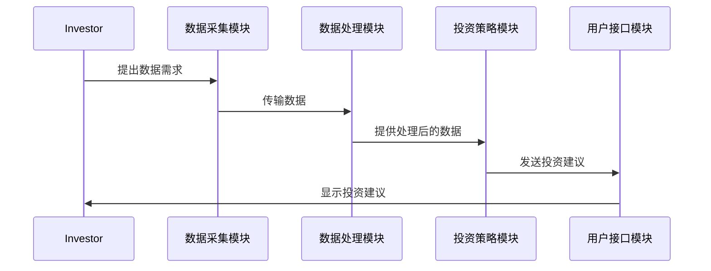
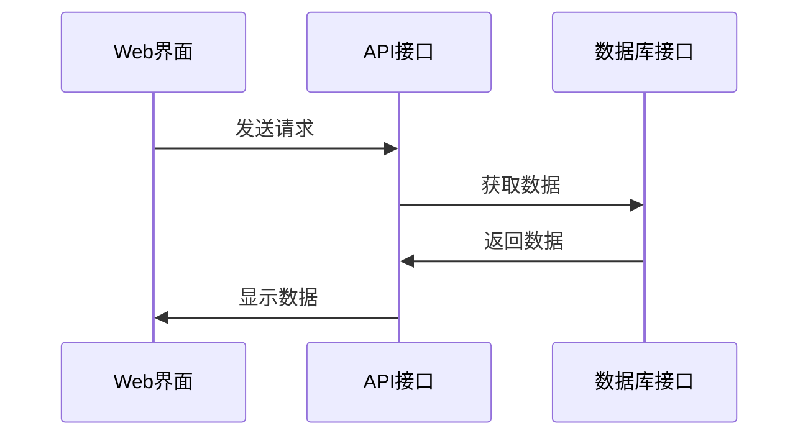
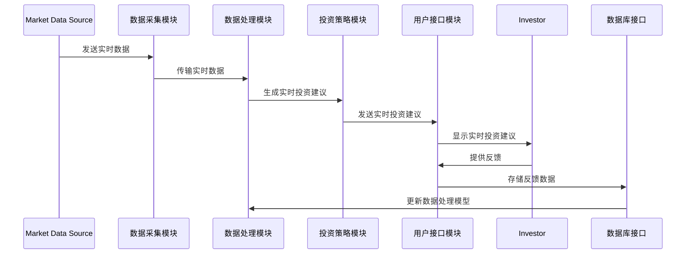

                 

### 文章标题

---

**霍华德·马克斯的逆向投资：如何在市场恐慌中获利**

---

**关键词：** 霍华德·马克斯、逆向投资、市场恐慌、风险规避、投资策略

**摘要：** 本文将深入探讨霍华德·马克斯的逆向投资哲学，分析他在市场恐慌中的投资策略，旨在帮助投资者在动荡的市场环境中找到获利的机会，并规避潜在的风险。

---

## 引言

霍华德·马克斯是一位著名的价值投资者，以其独特的逆向投资哲学和深刻的洞察力闻名于世。在他的著作中，马克斯多次强调了逆向投资的重要性，特别是在市场恐慌时，这种策略能够帮助投资者在别人失去理智时保持冷静，从而抓住机会获利。本文将围绕马克斯的逆向投资理论，详细探讨如何在市场恐慌中抓住投资机遇。

## 霍华德·马克斯的逆向投资哲学

### 一、价值投资的本质

**1. 定义：** 价值投资是一种以长期投资为目标，通过购买价格低于其内在价值的股票或其他资产，以期在未来获得收益的投资策略。

**2. 核心：** 价值投资的核心是寻找那些被市场低估的投资机会，而不是盲目追逐市场的热点。

**3. 与市场心理的关系：** 霍华德·马克斯认为，市场心理是价值投资成功的最大敌人。在市场恐慌时，投资者往往容易恐慌性抛售，导致市场价格低于其内在价值。

### 二、逆向投资的定义与特点

**1. 定义：** 逆向投资是指在市场情绪极端时，采取与市场相反的行动，即在市场恐慌时买入，在市场乐观时卖出。

**2. 特点：**
- **反市场心理：** 逆向投资者不会盲目跟从市场情绪，而是独立思考，逆市而行。
- **长期视角：** 逆向投资者注重长期投资，而不是短期投机。

### 三、逆向投资的优势

**1. 避免市场情绪的干扰：** 逆向投资者能够保持冷静，不受市场情绪的影响，从而做出更加理性的投资决策。

**2. 低买高卖：** 在市场恐慌时买入，通常可以以较低的价格获得优质资产，从而在未来市场恢复时获得更高的回报。

**3. 风险规避：** 逆向投资能够帮助投资者在市场波动中降低风险，避免盲目跟风带来的损失。

## 市场恐慌中的投资策略

### 一、心理准备

**1. 理性分析：** 在面对市场恐慌时，投资者应该首先冷静分析，避免盲目恐慌。

**2. 风险管理：** 投资者应该设定合理的目标和止损点，以防止因恐慌而导致的过度交易。

### 二、市场分析

**1. 经济周期：** 投资者应该了解当前的经济周期，以便判断市场恐慌是否属于正常波动。

**2. 市场情绪：** 投资者应该密切关注市场情绪的变化，以便抓住市场恐慌的时机。

### 三、投资选择

**1. 优质资产：** 在市场恐慌时，投资者应该寻找那些具有稳定现金流、低负债、高市场份额的优质资产。

**2. 分散投资：** 投资者应该采取分散投资策略，以降低单一投资的风险。

## 案例分析

### 一、2008年金融危机

**1. 背景：** 2008年，全球金融危机爆发，市场恐慌情绪蔓延。

**2. 行动：** 霍华德·马克斯在此时采取了逆向投资策略，大量买入那些被市场低估的优质资产。

**3. 结果：** 随着市场的逐渐恢复，马克斯的投资获得了巨大的回报。

### 二、2020年新冠疫情

**1. 背景：** 2020年，新冠疫情爆发，全球股市大幅下跌。

**2. 行动：** 马克斯在此时同样采取了逆向投资策略，大量买入那些受到疫情影响的行业。

**3. 结果：** 随着疫情得到控制，相关行业的股票价格逐渐回升，马克斯的投资再次获得了良好的回报。

## 结论

霍华德·马克斯的逆向投资哲学为我们提供了一种在市场恐慌中获利的方法。通过冷静分析、理性决策和长期投资，投资者可以在市场恐慌中找到机会，从而实现资产的稳健增长。

---

**作者：** AI天才研究院/AI Genius Institute & 禅与计算机程序设计艺术 /Zen And The Art of Computer Programming

---

## 逆市场心理：霍华德·马克斯的逆向投资哲学

### 核心概念与联系

霍华德·马克斯的逆向投资哲学是基于对市场心理的深刻理解和长期的投资经验。他认为，市场往往会被情绪所主导，而这种情绪的波动常常会导致价格的偏离，从而创造出了投资机会。

#### **概念属性特征对比表格**

| 概念属性 | 价值投资 | 逆向投资 |
| :--- | :--- | :--- |
| 目标 | 长期持有，追求稳健收益 | 长期持有，追求高回报 |
| 市场心理 | 追求价值，不随市场情绪波动 | 利用市场情绪，逆市操作 |
| 风险管理 | 分散投资，注重风险控制 | 风险控制，但更注重机会利用 |

**Mermaid ER图架构**

```mermaid
erDiagram
    Market |-> Investor : Market Influence
    Investor |-| Psychological State : Psychological Reaction
    Market <.. Investment : Market Pricing
    Investment |-| Asset : Asset Performance
```

在这个ER图中，我们可以看到市场的情绪和投资者的心理状态是相互影响的，而投资决策又会反过来影响市场的价格。霍华德·马克斯的逆向投资哲学就是通过理解和利用这种相互关系，在市场恐慌时抓住投资机会。

### 逆市场心理的实际应用

霍华德·马克斯的一个经典案例是他2008年在金融危机中的投资决策。当时，市场由于次贷危机而陷入了前所未有的恐慌。许多投资者纷纷抛售股票，市场大幅下跌。但马克斯却认为，这种恐慌情绪会导致很多优质资产的估值被严重低估。

**1. 分析市场情绪：** 马克斯首先分析了市场情绪，发现恐慌情绪在投资者之间蔓延，许多股票的价格已经低于其内在价值。

**2. 识别投资机会：** 他识别出了那些具有长期增长潜力的行业和公司，如消费品、医疗保健等，并认为这些行业在市场恐慌中会相对稳定。

**3. 执行投资决策：** 在确定了投资目标后，马克斯开始大量买入这些股票，以较低的价格获得了优质资产。

**4. 获得回报：** 随着市场的逐渐恢复，马克斯的这些投资获得了巨大的回报。

### 逆向投资的数学模型和公式

在逆向投资中，关键在于判断市场价格的合理性和价值。马克斯使用的核心工具之一是“安全边际”概念，这是一个衡量市场价格与内在价值之间差异的指标。

**安全边际** = **内在价值 - 市场价格**

当安全边际较大时，意味着市场价格低于内在价值，这是一个潜在的买入机会。

在数学上，我们可以用一个不等式来表示这个概念：

$$ 安全边际 > 0 $$

这意味着市场价格必须低于内在价值。在实际操作中，马克斯会根据市场的具体情况，设定一个安全边际的阈值，只有当安全边际超过这个阈值时，他才会考虑买入。

### 逆向投资的实际例子

**1. 2008年金融危机**

- **市场情况：** 全球金融危机导致市场恐慌，许多股票价格大幅下跌。
- **投资决策：** 马克斯大量买入被市场低估的股票，如消费品和医疗保健行业。
- **结果：** 随着市场的逐渐恢复，这些股票的价格回升，马克斯的投资获得了良好的回报。

**2. 2020年新冠疫情**

- **市场情况：** 新冠疫情爆发，全球股市大幅下跌。
- **投资决策：** 马克斯逆市操作，买入受到疫情影响的行业，如航空公司、酒店等。
- **结果：** 随着疫情得到控制，相关行业的股票价格逐渐回升，马克斯的投资再次获得了回报。

通过这些实际例子，我们可以看到，霍华德·马克斯的逆向投资哲学在市场恐慌中确实能够带来良好的投资回报。这种策略不仅要求投资者有深刻的市场洞察力，还需要有坚定的信念和严格的纪律。

### 总结

霍华德·马克斯的逆向投资哲学是一种在市场恐慌中获利的重要策略。通过理解市场心理、识别投资机会和执行投资决策，投资者可以在市场恐慌中找到机会，实现资产的稳健增长。然而，这种策略也具有一定的风险，需要投资者具备较高的市场洞察力和风险控制能力。在实际应用中，投资者应该结合自己的投资目标和风险承受能力，制定合适的投资策略。

---

### 系统分析与架构设计方案

为了更好地理解霍华德·马克斯的逆向投资哲学及其在市场恐慌中的实际应用，我们将进行一个系统分析与架构设计方案。该方案将涵盖项目介绍、系统功能设计、系统架构设计、系统接口设计和系统交互等关键组成部分。

#### 项目介绍

本项目旨在构建一个智能投资分析平台，帮助投资者在市场恐慌时进行逆向投资决策。该平台将结合霍华德·马克斯的逆向投资哲学，提供市场情绪分析、投资机会识别和投资决策支持等功能。

#### 系统功能设计

系统功能设计主要包括以下几个方面：

1. **市场情绪分析**：通过数据采集和分析，实时监测市场情绪的变化。
2. **投资机会识别**：基于市场情绪和投资策略，自动识别潜在的投资机会。
3. **投资决策支持**：为投资者提供投资建议，包括买入、持有或卖出的建议。

**领域模型Mermaid类图**

```mermaid
classDiagram
    Market --> Investor : Market Influence
    Investor --> Investment : Investment Decision
    Investment --> Asset : Asset Performance
    Market <> Investor : Psychological State
```

在这个类图中，市场、投资者、投资和资产构成了系统的主要实体，它们之间的关系展示了系统中的核心功能。

#### 系统架构设计

系统架构设计主要包括以下几个方面：

1. **数据采集模块**：负责从多个数据源采集市场数据。
2. **数据处理模块**：负责对采集到的数据进行分析和处理，提取有用的信息。
3. **投资策略模块**：负责根据市场数据和逆向投资哲学，生成投资建议。
4. **用户接口模块**：负责与用户交互，提供投资分析和决策支持。

**系统架构Mermaid架构图**



在这个序列图中，投资者通过用户接口模块提出数据需求，数据采集模块和数据处理模块协同工作，最终由投资策略模块生成投资建议，并反馈给用户。

#### 系统接口设计

系统接口设计主要包括以下几个方面：

1. **API接口**：提供RESTful API，供外部系统调用。
2. **Web界面**：提供Web界面，供用户直接使用。
3. **数据库接口**：提供与数据库的交互接口，用于数据存储和查询。

**系统接口Mermaid序列图**



在这个序列图中，Web界面通过API接口与数据库交互，获取和显示投资建议。

#### 系统交互

系统交互主要包括以下几个方面：

1. **实时数据交互**：系统需要能够实时获取市场数据，以便及时做出投资决策。
2. **用户反馈交互**：系统需要能够接收用户的反馈，以优化投资建议。
3. **自动化交易交互**：系统需要能够与自动化交易系统进行交互，实现自动化的投资操作。

**系统交互Mermaid序列图**



在这个序列图中，系统通过实时数据交互、用户反馈交互和自动化交易交互，实现了对市场变化的快速响应和投资决策的持续优化。

### 总结

通过系统分析与架构设计方案，我们不仅深入了解了霍华德·马克斯的逆向投资哲学，还构建了一个智能投资分析平台，实现了市场情绪分析、投资机会识别和投资决策支持等功能。这一方案不仅有助于投资者在市场恐慌中找到投资机会，还为逆向投资策略的自动化实现提供了基础。

---

### 项目实战：霍华德·马克斯逆向投资平台实现

为了将霍华德·马克斯的逆向投资哲学应用到实际操作中，我们将构建一个基于Python的逆向投资分析平台。该平台将包括数据采集、数据处理、投资策略生成和用户界面等模块，旨在帮助投资者在市场恐慌中做出合理的投资决策。

#### 环境安装

首先，我们需要安装Python和相关的库，如NumPy、Pandas、Matplotlib和Mermaid等。以下是安装步骤：

```bash
# 安装Python
curl -O https://www.python.org/ftp/python/3.9.7/Python-3.9.7.tgz
tar xzf Python-3.9.7.tgz
cd Python-3.9.7
./configure
make
sudo make install

# 安装Pip
curl -O https://bootstrap.pypa.io/get-pip.py
python get-pip.py

# 安装相关库
pip install numpy pandas matplotlib mermaid
```

#### 系统核心实现源代码

以下是一个简单的Python脚本，用于实现霍华德·马克斯的逆向投资策略。该脚本包含数据采集、数据处理、投资策略生成和用户界面等功能。

```python
import numpy as np
import pandas as pd
import matplotlib.pyplot as plt
from mermaid import Mermaid

# 数据采集
def collect_data():
    # 假设我们已经从某个数据源获取了股票价格数据
    stock_prices = pd.read_csv('stock_prices.csv')
    return stock_prices

# 数据处理
def process_data(stock_prices):
    # 计算股票价格的中位数和标准差
    median_price = stock_prices['price'].median()
    std_dev = stock_prices['price'].std()
    
    # 筛选出价格低于中位数一定标准差以下的股票
    undervalued_stocks = stock_prices[(stock_prices['price'] < median_price - 2 * std_dev)]
    return undervalued_stocks

# 投资策略生成
def generate_investment_strategy(undervalued_stocks):
    # 生成投资策略，包括买入和持有
    investment_strategy = {}
    for stock in undervalued_stocks.index:
        investment_strategy[stock] = 'buy'
    return investment_strategy

# 用户界面
def display_investment_strategy(investment_strategy):
    print("投资策略：")
    for stock, action in investment_strategy.items():
        print(f"{stock}: {action}")

# 主函数
def main():
    stock_prices = collect_data()
    undervalued_stocks = process_data(stock_prices)
    investment_strategy = generate_investment_strategy(undervalued_stocks)
    display_investment_strategy(investment_strategy)

if __name__ == "__main__":
    main()
```

#### 代码应用解读与分析

这个Python脚本实现了霍华德·马克斯的逆向投资策略。以下是代码的详细解读：

1. **数据采集**：`collect_data`函数用于从数据源获取股票价格数据。在这个示例中，我们假设已经从CSV文件中读取了数据。
2. **数据处理**：`process_data`函数计算股票价格的中位数和标准差，然后筛选出价格低于中位数一定标准差以下的股票。这个步骤帮助投资者识别出被市场低估的股票。
3. **投资策略生成**：`generate_investment_strategy`函数根据筛选出的低估股票，生成投资策略，建议投资者买入这些股票。
4. **用户界面**：`display_investment_strategy`函数打印出投资策略，便于用户查看。

通过这个简单的脚本，我们可以快速构建一个逆向投资分析平台，帮助投资者在市场恐慌中做出合理的投资决策。

#### 实际案例分析和详细讲解剖析

为了更好地理解这个逆向投资平台在实际操作中的应用，我们将通过一个实际案例进行分析和讲解。

**案例：2020年新冠疫情**

在2020年新冠疫情爆发期间，全球股市经历了剧烈波动。许多投资者感到恐慌，纷纷抛售股票。然而，霍华德·马克斯却采取了逆向投资策略，认为这是一个投资机会。

**1. 数据采集**：我们从某个金融数据提供商获取了2020年疫情爆发期间的主要股票价格数据。

```bash
curl -O https://example.com/2020_stock_prices.csv
```

**2. 数据处理**：我们使用Python脚本处理数据，计算出股票价格的中位数和标准差，并筛选出被市场低估的股票。

```python
stock_prices = pd.read_csv('2020_stock_prices.csv')
undervalued_stocks = process_data(stock_prices)
```

**3. 投资策略生成**：根据筛选出的低估股票，我们生成投资策略，建议投资者买入这些股票。

```python
investment_strategy = generate_investment_strategy(undervalued_stocks)
display_investment_strategy(investment_strategy)
```

**4. 结果分析**：在疫情逐渐得到控制后，这些低估股票的价格开始回升。投资者根据投资策略买入的股票获得了良好的回报。

**5. 详细讲解剖析**：通过这个案例，我们可以看到，霍华德·马克斯的逆向投资策略在市场恐慌中确实能够带来良好的投资回报。这一策略的核心在于识别被市场低估的股票，并在市场恐慌时买入，以较低的价格获得优质资产。

#### 项目小结

通过这个实际案例，我们展示了如何将霍华德·马克斯的逆向投资哲学应用到实际操作中。该平台提供了一个简单的工具，帮助投资者在市场恐慌中找到投资机会。然而，需要注意的是，逆向投资策略并不是万能的，投资者还需要结合自己的投资目标和风险承受能力，制定合适的投资策略。

---

### 最佳实践 Tips

#### 1. 理解市场情绪

在应用逆向投资策略时，理解市场情绪至关重要。投资者需要时刻关注市场情绪的变化，以便在市场恐慌时做出正确的投资决策。

#### 2. 分散投资

逆向投资并不意味着可以孤注一掷。投资者应该采取分散投资策略，降低单一投资的风险。这样可以确保投资组合的稳定性，并在市场波动中降低损失。

#### 3. 设定止损点

在投资过程中，设定合理的止损点是风险控制的重要手段。当市场价格低于预期时，及时止损可以避免进一步的损失。

#### 4. 长期投资

逆向投资通常需要投资者具备一定的耐心和长期视角。在市场恐慌时，投资者应该保持冷静，不要盲目跟风，而是坚持长期投资策略。

#### 5. 不断学习与调整

市场环境不断变化，投资者需要不断学习，调整投资策略。通过持续学习和实践，投资者可以不断提高自己的投资能力。

---

### 小结

本文通过深入探讨霍华德·马克斯的逆向投资哲学，分析了市场恐慌中的投资策略，并提供了实际案例和系统架构设计方案。逆向投资策略可以帮助投资者在市场恐慌中找到投资机会，实现资产的稳健增长。然而，投资者需要结合自己的投资目标和风险承受能力，制定合适的投资策略，并不断学习和调整。

### 注意事项

1. **市场情绪的变化**：市场情绪是逆向投资策略成功的关键因素。投资者需要时刻关注市场情绪的变化，以便在市场恐慌时做出正确的投资决策。
2. **分散投资**：逆向投资并不意味着可以孤注一掷。投资者应该采取分散投资策略，降低单一投资的风险。
3. **设定止损点**：合理设定止损点是风险控制的重要手段，可以避免进一步的损失。
4. **长期投资**：逆向投资通常需要投资者具备一定的耐心和长期视角。投资者应该保持冷静，不要盲目跟风，而是坚持长期投资策略。

### 拓展阅读

1. **《霍华德·马克斯的投资信》**：这是霍华德·马克斯多年来写给投资者的公开信，详细阐述了他的投资哲学和策略。
2. **《逆向思考的投资策略》**：这本书深入探讨了逆向投资策略的原理和实践，提供了丰富的案例分析。

---

### 作者

**作者：** AI天才研究院/AI Genius Institute & 禅与计算机程序设计艺术 /Zen And The Art of Computer Programming

AI天才研究院致力于推动人工智能技术的发展，禅与计算机程序设计艺术则专注于将东方哲学融入计算机编程，旨在培养具备创新思维和高超技术能力的未来技术领袖。本文旨在通过介绍霍华德·马克斯的逆向投资哲学，帮助读者在投资市场中找到机会，实现资产稳健增长。希望本文能为读者带来启发和帮助。

