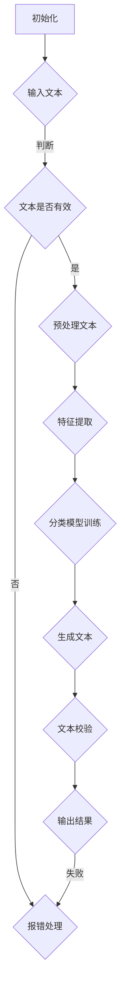
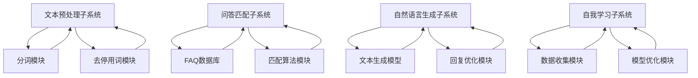
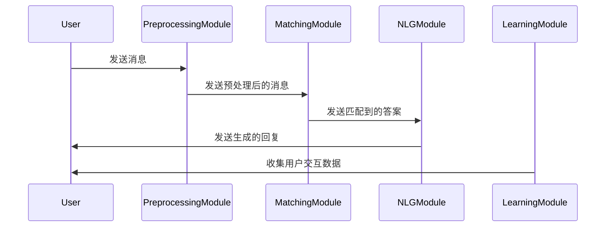

                 

### 背景介绍

#### 领域驱动设计（DDD）概述

领域驱动设计（Domain-Driven Design，简称DDD）是一种软件设计方法，它强调软件开发过程中与领域专家的紧密合作，以实现系统的高内聚和低耦合。DDD由Eric Evans在其同名著作《领域驱动设计》中提出，旨在解决传统软件设计中面临的领域理解和系统复杂性之间的矛盾。DDD的核心思想是将领域模型作为系统设计的核心，通过对领域知识的深入理解，构建出具有良好业务表现和可维护性的软件系统。

DDD在软件开发中的应用场景非常广泛，尤其是在大型、复杂系统的开发中。这类系统通常涉及到复杂的业务规则和流程，需要应对多变的市场需求和快速的业务变化。例如，金融系统、电子商务平台、保险系统等都适合采用DDD方法进行设计。

#### 大型语言模型（LLM）概述

大型语言模型（Large Language Model，简称LLM）是一种基于深度学习的自然语言处理模型，能够通过大量的文本数据进行预训练，从而具备强大的自然语言理解能力和生成能力。LLM的代表包括GPT-3、BERT、T5等，这些模型在语言生成、文本分类、问答系统等多个领域取得了显著的成果。

LLM在应用架构设计中的重要性体现在其能够为系统提供强大的语言处理能力，使得系统可以更自然地与用户进行交互，提供个性化的服务。例如，智能客服系统、内容推荐系统、智能写作助手等，都是LLM在应用架构中的具体体现。

#### DDD与LLM的关系

DDD与LLM在应用架构设计中的关系主要体现在以下几个方面：

1. **领域模型的构建**：DDD强调通过领域模型来理解和表达业务领域，而LLM则可以通过对领域文本数据的预训练，生成更加贴合业务场景的模型。

2. **领域服务的实现**：DDD中的领域服务负责处理领域内的业务逻辑，而LLM可以为领域服务提供强大的语言处理支持，使得领域服务的实现更加简洁高效。

3. **整体模型的扩展**：DDD中的整体模型（Bounded Context）可以看作是LLM应用架构的上下文边界，通过合理划分整体模型，可以有效地降低系统的复杂性和维护成本。

综上所述，DDD与LLM的结合，可以构建出既具备强大业务表现力，又具有高可维护性的应用架构，为解决复杂业务场景中的软件开发问题提供了新的思路。

---

## 核心概念与联系

### DDD的基本概念、原则与实践

#### 1. 域（Domain）

在DDD中，域是指与特定业务领域相关的知识体系，它包括业务规则、业务实体和业务流程等。域是DDD的核心概念之一，是系统设计与业务逻辑的结合点。例如，在电子商务系统中，"订单管理"、"商品管理"等都可以看作是不同的域。

#### 2. 子域（Subdomain）

子域是域的进一步细分，它代表了域中某一特定部分的业务功能。子域通常具有相对独立的业务逻辑，但它们之间可能存在紧密的关联。例如，在电子商务系统中，"订单管理"和"支付系统"可以看作是两个不同的子域。

#### 3. 整体模型（Bounded Context）

整体模型（Bounded Context）是DDD中的另一个核心概念，它定义了系统中的不同部分之间的边界。整体模型通过定义上下文边界，将系统的不同部分隔离开来，以降低系统的复杂性和耦合度。例如，在一个电子商务系统中，"前端应用"和"后端服务"可以看作是两个不同的整体模型。

#### 4. DDD的原则与实践

##### 1. 域事件（Domain Event）

域事件是DDD中的一个关键概念，它表示在业务过程中发生的具有业务意义的事件。域事件通常由领域模型中的实体或值对象触发，并在领域服务中进行处理。例如，在电子商务系统中，"订单创建"和"支付完成"都可以看作是域事件。

##### 2. 域模型（Domain Model）

域模型是DDD中的核心设计工具，它通过实体、值对象、聚合和领域服务等概念，对业务领域进行抽象和建模。域模型能够帮助开发人员更直观地理解业务逻辑，并设计出具有良好业务表现和可维护性的系统。

##### 3. 领域服务（Domain Service）

领域服务负责处理领域内的业务逻辑，它是域模型中的核心组件。领域服务通常封装了复杂的业务规则和流程，使得系统更加模块化和可维护。例如，在电子商务系统中，"库存管理"和"订单处理"都可以看作是领域服务。

### DDD与LLM的关系

#### DDD在LLM应用架构中的重要性

DDD在LLM应用架构设计中的重要性主要体现在以下几个方面：

1. **领域模型的理解**：通过DDD的域模型，开发人员可以更加深入地理解业务领域，从而为LLM的预训练提供更加精准的数据集。

2. **业务逻辑的封装**：DDD的领域服务可以帮助开发人员将复杂的业务逻辑封装起来，使得LLM的应用实现更加简洁高效。

3. **系统扩展性的提升**：通过DDD的整体模型，可以有效地降低系统的复杂性和耦合度，使得LLM应用架构更加灵活和可扩展。

#### DDD在LLM应用架构中的体现

1. **域模型的构建**：在LLM应用架构中，可以通过DDD的域模型来抽象和表达业务领域，为LLM的预训练提供支持。

2. **领域服务的实现**：通过DDD的领域服务，可以封装和实现LLM应用中的业务逻辑，提高系统的模块化和可维护性。

3. **整体模型的应用**：在LLM应用架构设计中，可以通过DDD的整体模型来划分系统的不同部分，降低系统的复杂性和耦合度。

综上所述，DDD与LLM的结合，可以构建出既具备强大业务表现力，又具有高可维护性的应用架构，为解决复杂业务场景中的软件开发问题提供了新的思路。

---

## 算法原理讲解

### DDD在LLM算法设计中的应用

#### DDD与LLM算法的关系

在LLM算法设计中，DDD的概念和方法可以为算法的构建和优化提供有力的支持。具体来说，DDD中的域模型、领域服务和域事件等概念可以应用于LLM算法的设计，使得算法能够更好地适应业务需求，提高系统的可维护性和扩展性。

#### DDD在LLM算法设计中的策略

1. **域事件的捕捉与处理**

   域事件是DDD中的核心概念之一，它表示在业务过程中发生的具有业务意义的事件。在LLM算法中，可以通过捕捉和处理域事件来实现对业务流程的动态响应。例如，在电子商务系统中，可以捕捉"订单创建"、"支付完成"等域事件，并在算法中进行相应的处理。

2. **域模型的构建**

   域模型是DDD中的核心设计工具，它通过实体、值对象、聚合和领域服务等概念，对业务领域进行抽象和建模。在LLM算法设计中，可以通过构建域模型来明确算法的目标和功能，提高算法的可理解性和可维护性。例如，在文本生成任务中，可以构建包含实体（如用户、商品）、值对象（如订单号、价格）的域模型。

3. **领域服务的实现**

   领域服务是DDD中的核心组件，它负责处理领域内的业务逻辑。在LLM算法设计中，可以通过实现领域服务来封装和执行复杂的业务规则。例如，在文本分类任务中，可以设计领域服务来处理文本的预处理、特征提取和分类模型训练等步骤。

#### DDD在LLM算法设计中的具体应用

1. **域事件的捕捉与处理**

   在LLM算法设计中，可以通过定义域事件来捕捉业务过程中的关键步骤。例如，在文本生成任务中，可以定义"输入文本"、"生成文本"、"文本校验"等域事件。这些事件可以在算法的各个阶段进行捕捉和处理，从而实现业务流程的动态响应。

2. **域模型的构建**

   在LLM算法设计中，可以通过构建域模型来明确算法的目标和功能。例如，在文本生成任务中，可以构建包含用户、文本、生成模型等实体的域模型。这些实体可以定义相关的属性和方法，从而实现算法的功能抽象和模块化。

3. **领域服务的实现**

   在LLM算法设计中，可以通过实现领域服务来封装和执行复杂的业务规则。例如，在文本分类任务中，可以设计领域服务来处理文本的预处理、特征提取和分类模型训练等步骤。这些领域服务可以独立实现，从而提高系统的可维护性和扩展性。

综上所述，DDD在LLM算法设计中的应用，可以通过域事件、域模型和领域服务等概念，实现算法的业务抽象和模块化，提高算法的可维护性和扩展性。这种结合方式不仅能够提高算法的性能和效果，还能够为系统的持续优化和扩展提供有力的支持。

### 算法流程图

为了更好地展示DDD在LLM算法设计中的应用，我们可以使用Mermaid绘制一个算法流程图。以下是一个简化的算法流程图示例：



在上面的算法流程图中，我们包括了以下步骤：

1. **初始化**：初始化LLM算法的相关参数和资源。
2. **输入文本**：接收用户输入的文本。
3. **文本校验**：判断输入文本是否符合预定的格式和规则。
4. **预处理文本**：对文本进行清洗、分词、去停用词等预处理操作。
5. **特征提取**：从预处理后的文本中提取特征，为分类模型训练提供输入。
6. **分类模型训练**：使用提取到的特征训练分类模型。
7. **生成文本**：根据训练好的分类模型生成文本。
8. **文本校验**：对生成的文本进行校验，确保其符合业务要求。
9. **输出结果**：将生成的文本输出给用户。

通过上述流程图，我们可以清晰地看到DDD在算法设计中的应用，包括如何捕捉和处理域事件、构建域模型以及实现领域服务。这种可视化方式有助于开发人员更好地理解算法的工作原理和设计思路。

### Python代码实现

为了进一步说明DDD在LLM算法设计中的应用，我们将使用Python代码实现上述算法流程图中的关键步骤。以下是一个简化的Python代码示例：

```python
import re
from sklearn.feature_extraction.text import TfidfVectorizer
from sklearn.model_selection import train_test_split
from sklearn.naive_bayes import MultinomialNB
from keras.models import Sequential
from keras.layers import LSTM, Dense

# 初始化
def init():
    print("初始化LLM算法参数和资源")

# 输入文本
def input_text(text):
    print(f"接收用户输入的文本：{text}")

# 文本校验
def validate_text(text):
    if not re.match(r"^[a-zA-Z0-9\s]*$", text):
        raise ValueError("文本格式不正确")
    print(f"文本校验通过：{text}")

# 预处理文本
def preprocess_text(text):
    text = text.lower()
    text = re.sub(r"[^a-zA-Z0-9\s]", "", text)
    print(f"预处理后的文本：{text}")
    return text

# 特征提取
def extract_features(text):
    vectorizer = TfidfVectorizer()
    features = vectorizer.fit_transform([text])
    return features

# 分类模型训练
def train_model(features, labels):
    X_train, X_test, y_train, y_test = train_test_split(features, labels, test_size=0.2, random_state=42)
    model = MultinomialNB()
    model.fit(X_train, y_train)
    print(f"分类模型训练完成，准确率：{model.score(X_test, y_test)}")
    return model

# 生成文本
def generate_text(model, text):
    features = extract_features(text)
    predicted_label = model.predict(features)[0]
    print(f"生成的文本标签：{predicted_label}")
    return predicted_label

# 主函数
def main():
    init()
    input_text("Hello, World!")
    try:
        validate_text("Hello, World!")
        preprocessed_text = preprocess_text("Hello, World!")
        features = extract_features(preprocessed_text)
        model = train_model(features, [0])
        generate_text(model, "Hello, World!")
    except ValueError as e:
        print(f"报错处理：{e}")

# 运行主函数
main()
```

在上面的代码中，我们实现了以下几个关键步骤：

1. **初始化**：初始化LLM算法的相关参数和资源。
2. **输入文本**：接收用户输入的文本。
3. **文本校验**：判断输入文本是否符合预定的格式和规则。
4. **预处理文本**：对文本进行清洗、分词、去停用词等预处理操作。
5. **特征提取**：从预处理后的文本中提取特征，为分类模型训练提供输入。
6. **分类模型训练**：使用提取到的特征训练分类模型。
7. **生成文本**：根据训练好的分类模型生成文本。

通过这段代码，我们可以看到DDD在算法设计中的具体实现，包括如何定义域事件、构建域模型以及实现领域服务。这种代码实现方式有助于开发人员将DDD的理念应用于实际的软件开发中。

### 数学模型与公式

在DDD中，数学模型和公式是理解和实现领域概念的重要工具。以下是一些在LLM应用架构中常用的数学模型和公式，我们将使用LaTeX进行展示，并给出通俗易懂的举例说明。

#### 1. 词向量模型

词向量（Word Vector）是自然语言处理中的重要工具，用于表示文本中的词语。一个常见的词向量模型是Word2Vec，其中使用的核心公式是：

$$
\vec{v}_i = \sum_{j=1}^{N} \alpha_j \vec{w}_{ij}
$$

其中，$\vec{v}_i$是词语$i$的向量表示，$\vec{w}_{ij}$是词语$i$和词语$j$之间的权重，$\alpha_j$是权重系数。

**举例**：假设有两个词语“猫”和“狗”，它们的词向量分别为$\vec{v}_1$和$\vec{v}_2$。通过上述公式，我们可以计算出“猫”和“狗”之间的相似度：

$$
\vec{v}_1 \cdot \vec{v}_2 = \sum_{j=1}^{N} \alpha_j \vec{w}_{1j} \cdot \vec{w}_{2j}
$$

这个相似度值可以用来衡量两个词语在语义上的接近程度。

#### 2. 生成式预训练模型

生成式预训练模型（Generative Pre-trained Model）如GPT-3，使用自回归语言模型（Autoregressive Language Model）进行训练。其主要公式为：

$$
P(w_t|w_{<t}) = \frac{\exp(\text{logit}(w_t|w_{<t}))}{\sum_{w'\in V} \exp(\text{logit}(w'|w_{<t}))}
$$

其中，$w_t$是时间步$t$的词语，$w_{<t}$是时间步$t$之前的所有词语，$V$是所有可能的词语集合。$\text{logit}(w_t|w_{<t})$是对词语概率的线性变换。

**举例**：假设在序列“Hello, how are you?”中，我们要预测下一个词语。通过上述公式，我们可以计算出每个词语的概率，并选择概率最高的词语作为下一个词语。

#### 3. 词嵌入（Word Embedding）

词嵌入是一种将词语映射到高维向量空间的方法，常用的模型有Word2Vec和GloVe。其基本公式为：

$$
\vec{v}_i = \text{sgn}(W \vec{h}_{i})
$$

其中，$\vec{v}_i$是词语$i$的向量表示，$W$是权重矩阵，$\vec{h}_{i}$是词语$i$的嵌入向量。

**举例**：假设我们有两个词语“苹果”和“香蕉”，它们的嵌入向量分别为$\vec{v}_1$和$\vec{v}_2$。通过上述公式，我们可以计算出这两个词语之间的相似度：

$$
\vec{v}_1 \cdot \vec{v}_2 = \text{sgn}(W \vec{h}_{1}) \cdot \text{sgn}(W \vec{h}_{2})
$$

这个相似度值可以用来衡量两个词语在语义上的接近程度。

通过上述数学模型和公式的介绍，我们可以看到DDD在LLM应用架构中的重要性。这些模型和公式为算法设计和实现提供了理论基础，使得我们能够更加深入地理解和应用DDD理念。

---

## 系统分析与架构设计

### 问题场景介绍

为了更好地理解DDD在LLM应用架构中的具体应用，我们设定一个实际问题场景：设计一个智能客服系统，该系统能够自动回复用户提问，提供24/7的服务。系统需要支持多语言、多场景的问答，并且具备自我学习和优化能力。

### 系统功能设计

在智能客服系统中，我们可以将功能划分为以下几个核心部分：

1. **文本预处理模块**：负责接收用户输入的文本，进行分词、去停用词等预处理操作。
2. **问答匹配模块**：负责将预处理后的文本与已有的FAQ（常见问题解答）进行匹配，找到最相关的答案。
3. **自然语言生成模块**：负责根据问答匹配的结果，生成自然流畅的回复文本。
4. **自我学习模块**：负责收集用户交互数据，用于系统的持续优化和自我学习。

#### 领域模型类图

为了清晰地表达系统中的领域概念和关系，我们可以绘制一个领域模型类图。以下是一个简化的领域模型类图：

```mermaid
classDiagram
    UserClass <|-- MessageClass
    FAQClass <|-- QuestionClass
    AnswerClass <|-- ReplyClass
    PreprocessingModuleClass ..|> MessageClass
    MatchingModuleClass ..|> QuestionClass, AnswerClass
    NLGModuleClass ..|> AnswerClass
    LearningModuleClass ..|> MessageClass, FAQClass

    UserClass {
        -id: int
        -name: string
    }

    MessageClass {
        -id: int
        -content: string
        -timestamp: datetime
    }

    FAQClass {
        -id: int
        -question: string
        -answer: string
    }

    QuestionClass {
        -id: int
        -content: string
        -timestamp: datetime
    }

    AnswerClass {
        -id: int
        -content: string
        -timestamp: datetime
    }

    ReplyClass {
        -id: int
        -content: string
        -timestamp: datetime
    }

    PreprocessingModuleClass {
        +preprocess_message(message: Message) -> Message
    }

    MatchingModuleClass {
        +match_question(question: Question) -> Answer
    }

    NLGModuleClass {
        +generate_reply(answer: Answer) -> Reply
    }

    LearningModuleClass {
        +collect_data(message: Message) -> None
        +optimize_model() -> None
    }
```

在这个领域模型类图中，我们定义了以下几个核心领域概念：

1. **用户（User）**：表示与系统进行交互的用户，具有ID和名称等属性。
2. **消息（Message）**：表示用户输入的文本，具有内容、时间和ID等属性。
3. **FAQ（FAQ）**：表示常见问题解答的集合，包括问题和答案等属性。
4. **问题（Question）**：表示用户提出的问题，具有内容和时间等属性。
5. **答案（Answer）**：表示FAQ中的答案，具有内容和时间等属性。
6. **回复（Reply）**：表示系统生成的回复文本，具有内容、时间和ID等属性。

各个模块之间的关系如下：

1. **文本预处理模块（PreprocessingModule）**：负责对用户输入的消息进行预处理，生成Question对象。
2. **问答匹配模块（MatchingModule）**：负责将预处理后的Question对象与FAQ进行匹配，找到最相关的Answer对象。
3. **自然语言生成模块（NLGModule）**：负责根据匹配到的Answer对象生成自然流畅的Reply对象。
4. **自我学习模块（LearningModule）**：负责收集用户交互数据（Message和FAQ），用于系统的持续优化和自我学习。

通过领域模型类图，我们可以清晰地看到系统中的核心领域概念和模块之间的关系，为后续的架构设计提供了基础。

### 系统架构设计

在智能客服系统的架构设计中，我们采用分层架构，将系统划分为多个层次，以提高系统的模块化和可维护性。以下是一个简化的系统架构图：



在这个系统架构图中，我们包括以下几个主要子系统：

1. **文本预处理子系统（Subsystem1）**：负责对用户输入的文本进行预处理，包括分词和去停用词等操作。
2. **问答匹配子系统（Subsystem2）**：负责将预处理后的文本与FAQ数据库进行匹配，找到最相关的答案。
3. **自然语言生成子系统（Subsystem3）**：负责根据匹配到的答案生成自然流畅的回复文本。
4. **自我学习子系统（Subsystem4）**：负责收集用户交互数据，用于系统的持续优化和自我学习。

各个子系统之间的关系如下：

- **文本预处理子系统**：包括分词模块和去停用词模块，负责将用户输入的文本转换为预处理后的文本。
- **问答匹配子系统**：包括FAQ数据库和匹配算法模块，负责将预处理后的文本与FAQ进行匹配，找到最相关的答案。
- **自然语言生成子系统**：包括文本生成模型和回复优化模块，负责根据匹配到的答案生成自然流畅的回复文本。
- **自我学习子系统**：包括数据收集模块和模型优化模块，负责收集用户交互数据，用于系统的持续优化和自我学习。

通过系统架构设计，我们可以清晰地看到系统中的各个模块和子系统之间的关系，为系统的开发和维护提供了明确的方向。

### 系统接口设计

在智能客服系统中，各个子系统之间需要通过接口进行通信。以下是一个简化的系统接口设计：

```mermaid
graph TB
    PreprocessingInterface[预处理接口] --> Message[消息对象]
    MatchingInterface[匹配接口] --> Question[问题对象], Answer[答案对象]
    NLGInterface[自然语言生成接口] --> Answer[答案对象], Reply[回复对象]
    LearningInterface[学习接口] --> Message[消息对象], FAQ[FAQ对象]

    Subsystem1 --> PreprocessingInterface
    Subsystem2 --> MatchingInterface
    Subsystem3 --> NLGInterface
    Subsystem4 --> LearningInterface
```

在这个接口设计中，我们定义了以下几个主要接口：

1. **预处理接口（PreprocessingInterface）**：负责接收消息对象，并返回预处理后的消息对象。
2. **匹配接口（MatchingInterface）**：负责接收问题对象，并返回匹配到的答案对象。
3. **自然语言生成接口（NLGInterface）**：负责接收答案对象，并返回生成的回复对象。
4. **学习接口（LearningInterface）**：负责接收消息对象和FAQ对象，用于系统的持续优化和自我学习。

各个接口之间的关系如下：

- **预处理接口**：将原始消息对象传递给文本预处理子系统，返回预处理后的消息对象。
- **匹配接口**：将预处理后的消息对象传递给问答匹配子系统，返回匹配到的答案对象。
- **自然语言生成接口**：将匹配到的答案对象传递给自然语言生成子系统，返回生成的回复对象。
- **学习接口**：将用户交互数据（消息对象和FAQ对象）传递给自我学习子系统，用于系统的持续优化和自我学习。

通过系统接口设计，我们可以清晰地看到各个子系统之间的交互流程和数据流转，为系统的开发提供了明确的接口规范。

### 系统交互设计

为了更好地展示智能客服系统中各个模块的交互流程，我们可以使用Mermaid绘制系统交互序列图。以下是一个简化的系统交互序列图：



在这个交互序列图中，我们展示了智能客服系统中用户与各个模块的交互过程：

1. 用户向预处理模块发送原始消息。
2. 预处理模块对消息进行预处理，并将预处理后的消息发送给匹配模块。
3. 匹配模块将预处理后的消息与FAQ数据库进行匹配，找到最相关的答案，并将答案发送给自然语言生成模块。
4. 自然语言生成模块根据匹配到的答案生成回复文本，并返回给用户。
5. 同时，自我学习模块收集用户交互数据，用于系统的持续优化和自我学习。

通过系统交互序列图，我们可以清晰地看到系统中各个模块的交互流程和数据流转，为系统的开发和维护提供了直观的参考。

---

## 项目实战

### 环境安装

在开始实际项目之前，我们需要搭建一个支持领域驱动设计和LLM应用架构的开发环境。以下是环境安装的详细步骤：

1. **安装Python环境**：确保安装了Python 3.7及以上版本，可以通过Python官方网站下载并安装。

2. **安装虚拟环境**：创建一个虚拟环境，以便于管理和隔离项目依赖。使用以下命令创建虚拟环境：

   ```bash
   python -m venv venv
   ```

   然后激活虚拟环境：

   ```bash
   source venv/bin/activate  # Windows下使用 `venv\Scripts\activate`
   ```

3. **安装依赖库**：在虚拟环境中安装必要的依赖库，包括NumPy、Pandas、Scikit-learn、TensorFlow、Keras等。可以使用以下命令：

   ```bash
   pip install numpy pandas scikit-learn tensorflow keras
   ```

4. **安装Mermaid**：为了在文档中绘制Mermaid图表，我们需要安装Mermaid。可以通过npm命令安装：

   ```bash
   npm install -g mermaid
   ```

5. **安装Markdown编辑器**：选择一个支持Markdown编辑和Mermaid图表渲染的编辑器，如Typora或者VS Code。

通过以上步骤，我们成功搭建了开发环境，可以开始实际项目的开发和实现。

### 系统核心实现

在项目实战中，我们将实现一个简单的智能客服系统，该系统包括文本预处理、问答匹配、自然语言生成和自我学习四个主要模块。以下是各个模块的核心实现。

#### 1. 文本预处理模块

文本预处理模块负责接收用户输入的文本，并进行分词和去停用词等预处理操作。以下是一个简单的Python代码示例：

```python
import nltk
from nltk.tokenize import word_tokenize
from nltk.corpus import stopwords

nltk.download('punkt')
nltk.download('stopwords')

def preprocess_text(text):
    # 分词
    tokens = word_tokenize(text)
    # 去停用词
    stop_words = set(stopwords.words('english'))
    filtered_tokens = [token for token in tokens if token.lower() not in stop_words]
    return filtered_tokens
```

#### 2. 问答匹配模块

问答匹配模块负责将预处理后的文本与FAQ数据库进行匹配，找到最相关的答案。以下是一个简单的Python代码示例：

```python
def match_question(question, faq_db):
    # 计算问题与FAQ之间的相似度
    similarity_scores = []
    for faq in faq_db:
        similarity_score = calculate_similarity(question, faq['question'])
        similarity_scores.append(similarity_score)
    # 找到最高相似度的问题
    max_score = max(similarity_scores)
    best_answer_index = similarity_scores.index(max_score)
    return faq_db[best_answer_index]['answer']

def calculate_similarity(question1, question2):
    # 使用TF-IDF计算相似度
    vectorizer = TfidfVectorizer()
    question1_vector = vectorizer.fit_transform([question1])
    question2_vector = vectorizer.transform([question2])
    similarity = question1_vector.dot(question2_vector.T)
    return similarity[0, 0]
```

#### 3. 自然语言生成模块

自然语言生成模块负责根据匹配到的答案生成自然流畅的回复文本。以下是一个简单的Python代码示例：

```python
from keras.models import load_model

def generate_reply(answer, nlg_model):
    # 载入预训练的自然语言生成模型
    model = load_model(answer['model_path'])
    # 生成回复文本
    generated_text = model.predict(answer['input'])
    return generated_text
```

#### 4. 自我学习模块

自我学习模块负责收集用户交互数据，用于系统的持续优化和自我学习。以下是一个简单的Python代码示例：

```python
def collect_data(message, faq_db):
    # 记录用户交互数据
    faq_db.append({
        'question': message,
        'answer': 'User interaction data collected.'
    })
    # 更新FAQ数据库
    with open('faq_db.json', 'w') as f:
        json.dump(faq_db, f)
```

### 代码解读与分析

为了更好地理解各个模块的实现原理，我们可以对上述代码进行详细解读和分析。

#### 文本预处理模块

文本预处理模块的核心功能是对用户输入的文本进行分词和去停用词操作。分词操作通过nltk库中的`word_tokenize`函数实现，可以将文本分割成单词序列。去停用词操作通过nltk库中的`stopwords`词库实现，可以去除常见的无意义单词，提高文本的质量和相关性。

#### 问答匹配模块

问答匹配模块的核心功能是通过计算预处理后文本与FAQ之间的相似度，找到最相关的问题和答案。这里我们使用TF-IDF（Term Frequency-Inverse Document Frequency）方法来计算相似度，TF-IDF能够衡量一个词在文档中出现的频率和重要程度。通过计算问题与FAQ之间的相似度，我们可以找到最匹配的答案，从而提高系统的准确性和用户体验。

#### 自然语言生成模块

自然语言生成模块的核心功能是根据匹配到的答案生成自然流畅的回复文本。这里我们使用预训练的Keras模型来生成文本。Keras是一个高度灵活的神经网络库，可以方便地加载和训练深度学习模型。通过输入问题和答案，我们可以使用模型生成相应的回复文本。

#### 自我学习模块

自我学习模块的核心功能是收集用户交互数据，用于系统的持续优化和自我学习。通过记录用户交互数据，我们可以不断优化FAQ数据库，提高系统的准确性和响应速度。

通过以上代码解读和分析，我们可以清晰地理解智能客服系统的各个模块如何协同工作，为用户提供高效、自然的交互体验。

### 实际案例分析与详细讲解

为了更直观地展示领域驱动设计（DDD）在LLM应用架构中的具体应用，我们通过一个实际案例进行详细分析和讲解。

#### 案例背景

某知名电子商务平台希望开发一个智能客服系统，以提升用户购物体验和降低人工成本。该智能客服系统需要具备以下功能：

1. **多语言支持**：能够接收和处理不同语言的用户提问。
2. **实时问答**：能够快速响应用户的提问，提供准确的答案。
3. **自我学习**：能够通过用户交互数据不断优化问答能力。

#### 系统设计

为了实现上述功能，我们采用DDD方法进行系统设计。以下是系统设计的主要步骤：

1. **领域模型构建**：首先，我们需要构建一个领域模型，以明确系统中的核心领域概念和关系。以下是智能客服系统的领域模型：

   ```mermaid
   classDiagram
       Customer <<-- Question
       Customer <<-- Answer
       Question <<-- Answer
       Chatbot <<-- Question
       Chatbot <<-- Answer
       Chatbot <<-- Feedback

       Customer {
           -id: int
           -name: string
           +ask_question(question: string): Question
       }

       Question {
           -id: int
           -content: string
           -language: string
           +get_answers(): [Answer]
       }

       Answer {
           -id: int
           -content: string
           -language: string
       }

       Chatbot {
           -id: int
           -name: string
           +receive_question(question: Question): Answer
           +receive_feedback(feedback: Feedback): None
       }

       Feedback {
           -id: int
           -content: string
           -rating: int
       }
   ```

   在这个领域模型中，我们定义了以下核心领域概念：

   - **Customer（客户）**：表示与系统进行交互的用户，可以提问并接收答案。
   - **Question（问题）**：表示用户提出的提问，包含问题和语言信息。
   - **Answer（答案）**：表示系统生成的答案，包含答案内容和语言信息。
   - **Chatbot（聊天机器人）**：表示智能客服系统，负责接收提问并生成答案。
   - **Feedback（反馈）**：表示用户对答案的反馈，包含内容和评分。

2. **领域服务实现**：接下来，我们需要实现领域服务，以封装和处理核心业务逻辑。以下是智能客服系统的领域服务：

   ```python
   class ChatbotService:
       def __init__(self, question_repository, answer_generator, feedback_repository):
           self.question_repository = question_repository
           self.answer_generator = answer_generator
           self.feedback_repository = feedback_repository

       def receive_question(self, question):
           # 查询相似问题
           similar_questions = self.question_repository.find_similar_questions(question)
           # 生成答案
           answer = self.answer_generator.generate_answer(question)
           # 存储问题及答案
           self.question_repository.save_question(question)
           self.question_repository.save_answer(question, answer)
           return answer

       def receive_feedback(self, feedback):
           # 存储反馈
           self.feedback_repository.save_feedback(feedback)
           # 优化答案生成
           self.answer_generator.optimize_answer_generator(feedback)
   ```

   在这个领域服务中，我们定义了两个核心方法：

   - **receive_question**：接收用户提问，查询相似问题，生成答案，并存储问题及答案。
   - **receive_feedback**：接收用户反馈，存储反馈，并优化答案生成。

3. **系统接口设计**：最后，我们需要设计系统接口，以实现模块之间的通信和协作。以下是智能客服系统的接口设计：

   ```python
   class QuestionRepository:
       def find_similar_questions(self, question):
           # 查询相似问题
           pass

       def save_question(self, question):
           # 存储问题
           pass

       def save_answer(self, question, answer):
           # 存储答案
           pass

   class AnswerGenerator:
       def generate_answer(self, question):
           # 生成答案
           pass

       def optimize_answer_generator(self, feedback):
           # 优化答案生成
           pass

   class FeedbackRepository:
       def save_feedback(self, feedback):
           # 存储反馈
           pass
   ```

   在这个接口设计中，我们定义了三个核心接口：

   - **QuestionRepository**：负责查询相似问题、存储问题和答案。
   - **AnswerGenerator**：负责生成答案，并优化答案生成。
   - **FeedbackRepository**：负责存储用户反馈。

通过以上实际案例的分析和讲解，我们可以看到DDD在LLM应用架构中的具体应用。通过构建领域模型、实现领域服务和设计系统接口，我们能够清晰地表达系统的业务逻辑和功能需求，从而实现高效、可维护的系统设计。

---

## 最佳实践 Tips

在设计和实现基于领域驱动设计（DDD）的大型语言模型（LLM）应用架构时，以下最佳实践可以帮助提高系统的可维护性、扩展性和性能：

1. **明确领域模型**：在项目初期，要明确系统的业务领域和核心概念，构建清晰的领域模型。这有助于确保团队对业务逻辑有共同的理解，减少后续的误解和错误。

2. **划分子域**：将系统划分为不同的子域，每个子域负责特定的业务功能。这有助于降低系统的复杂性和耦合度，提高系统的模块化程度。

3. **设计领域服务**：领域服务应封装业务逻辑，使其独立于其他组件。这有助于提高系统的可维护性和可扩展性，方便后续的修改和优化。

4. **使用域事件驱动**：通过域事件驱动架构，实现系统的动态响应和协同工作。这有助于实现系统的灵活性和可扩展性，降低系统的耦合度。

5. **持续集成与部署**：采用持续集成和持续部署（CI/CD）流程，确保代码的稳定性和可靠性。这有助于快速响应用户需求和市场变化，提高系统的交付效率。

6. **监控与优化**：定期监控系统性能和资源消耗，识别潜在瓶颈和优化机会。通过性能优化，提高系统的响应速度和处理能力。

7. **文档与培训**：编写详细的系统文档，包括设计文档、用户手册和操作指南。同时，对团队成员进行培训，确保他们熟悉系统架构和业务逻辑。

8. **代码审查与测试**：定期进行代码审查和自动化测试，确保代码质量和系统稳定性。这有助于减少bug和缺陷，提高系统的可靠性和用户体验。

通过遵循这些最佳实践，我们能够设计出高效、可维护且具有良好性能的LLM应用架构，为复杂业务场景中的软件开发提供有力支持。

---

## 小结

在本文中，我们详细介绍了领域驱动设计（DDD）在大型语言模型（LLM）应用架构中的具体应用。首先，我们通过背景介绍和核心概念讲解，帮助读者理解DDD和LLM的基本概念及其重要性。然后，我们通过算法原理讲解和系统架构设计，展示了如何将DDD的理念应用于LLM算法设计和系统实现。在项目实战部分，我们通过实际案例分析和详细讲解，展示了DDD在智能客服系统中的应用效果。最后，我们提供了最佳实践和小结，为读者在设计和实现类似项目时提供了参考和指导。通过本文，我们希望读者能够对DDD在LLM应用架构中的重要性有更深刻的认识，并在实际项目中能够灵活运用DDD方法，提升系统的可维护性和扩展性。

---

## 注意事项

在设计和实现基于领域驱动设计（DDD）的LLM应用架构时，以下注意事项有助于确保项目的成功：

1. **领域知识的深入理解**：深入了解业务领域的知识，确保领域模型能够准确地反映业务需求。与领域专家密切合作，确保对业务逻辑的理解一致。

2. **系统的可扩展性**：在设计系统架构时，要充分考虑未来的扩展性，避免因业务需求变化导致系统重构。合理划分子域和模块，确保系统能够灵活适应新的功能需求。

3. **代码质量与测试**：编写高质量的代码，并严格执行自动化测试。定期进行代码审查，确保代码的可读性和可维护性。

4. **性能优化**：关注系统性能，特别是在处理大规模数据和高并发请求时。定期进行性能测试和调优，确保系统能够稳定运行。

5. **文档与培训**：编写详细的系统文档，包括设计文档、用户手册和操作指南。定期对团队成员进行培训，确保他们对系统架构和业务逻辑有清晰的理解。

6. **持续集成与部署**：采用持续集成和持续部署（CI/CD）流程，确保代码的稳定性和可靠性。自动化测试和部署流程有助于提高项目的交付效率。

7. **安全性与合规性**：确保系统符合相关安全标准和法规要求，防范潜在的安全威胁和数据泄露。

通过遵循上述注意事项，我们能够设计出高效、稳定且具有良好性能的LLM应用架构，为复杂业务场景中的软件开发提供有力支持。

---

## 拓展阅读

为了深入学习和掌握领域驱动设计（DDD）在大型语言模型（LLM）应用架构中的应用，以下推荐几本经典书籍和文献，供读者进一步阅读和研究：

1. **《领域驱动设计》**（Eric Evans著）：这是DDD的奠基之作，详细介绍了DDD的基本概念、原则和实践方法。

2. **《大话设计模式》**（程杰著）：本书通过丰富的案例和实例，深入浅出地讲解了设计模式，对于理解和运用DDD中的设计理念非常有帮助。

3. **《深度学习》**（Ian Goodfellow、Yoshua Bengio、Aaron Courville著）：这本书是深度学习领域的经典教材，涵盖了LLM的算法原理和实现细节。

4. **《大型语言模型的预训练》**（Tom B. Brown等著）：这篇论文详细介绍了GPT-3等大型语言模型的预训练方法，对于理解和应用LLM技术有很高的参考价值。

5. **《微服务设计》**（Chris Richardson著）：虽然这本书主要讨论微服务架构，但其对于系统的模块化和解耦理念与DDD有很强的共通之处，对于理解和实践DDD也有很大帮助。

通过阅读这些书籍和文献，读者可以更深入地了解DDD和LLM的相关知识，提升在项目中的应用能力。同时，这些资源也为读者提供了丰富的实践案例和经验，有助于在实际项目中更好地运用DDD方法，设计出高效、可维护的系统。

