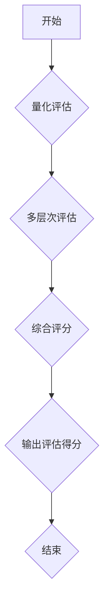
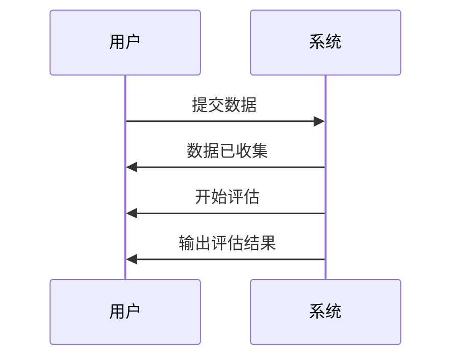

                 


## 马丁·惠特曼的公司治理评估体系

### 关键词：公司治理、评估体系、马丁·惠特曼、框架、算法、实践

### 摘要：
本文旨在探讨马丁·惠特曼提出的公司治理评估体系，解析其背景、核心概念、算法原理，以及实际应用与最佳实践。我们将一步步深入理解这一体系，旨在为读者提供一份清晰、全面的技术指南。

## 第一部分：公司治理评估体系的背景

### 第1章：公司治理概述

#### 1.1 公司治理的概念与重要性

公司治理，是指通过一系列制度和机制来确保公司目标得以实现、风险得以控制、利益相关者权益得以保障的过程。其重要性在于，良好的公司治理能够提高公司的竞争力、减少代理成本、防范道德风险，从而实现公司的可持续发展。

#### 1.2 马丁·惠特曼与公司治理思想

马丁·惠特曼，是一位享有盛誉的公司治理专家，被誉为“现代公司治理之父”。他提出了一套以“股东价值最大化”为核心的公司治理评估体系，强调公司治理的透明性、公正性和有效性。

#### 1.3 公司治理评估的必要性

公司治理评估是对公司治理体系的全面检查，有助于发现和解决公司治理中存在的问题。通过评估，公司可以了解自身的治理水平，制定改进措施，从而提高公司的运营效率和市场竞争力。

### 第2章：马丁·惠特曼的公司治理评估框架

#### 2.1 评估框架的基本结构

马丁·惠特曼的公司治理评估框架分为四个主要部分：治理结构、风险管理、绩效评价和信息披露。每个部分都有具体的评估指标和标准。

#### 2.2 关键评估要素

治理结构方面，关键要素包括董事会构成、高管薪酬和公司章程等；风险管理方面，关键要素包括风险识别、风险控制和风险报告等；绩效评价方面，关键要素包括财务绩效、运营绩效和社会责任绩效等；信息披露方面，关键要素包括财务报告、治理结构和重要决策等。

#### 2.3 评估流程与方法

评估流程包括：评估准备、现场评估、评估报告和跟踪改进。评估方法主要包括：文献分析、现场访谈、问卷调查和数据分析等。

## 第二部分：评估体系的算法原理讲解

### 第3章：核心概念与联系

#### 3.1 公司治理核心概念

公司治理的核心概念包括：治理结构、风险管理、绩效评价和信息披露。这些概念相互作用，共同构成了公司治理的评估体系。

#### 3.2 概念属性特征对比表格

以下是公司治理核心概念的属性特征对比表格：

| 概念          | 属性特征                           | 说明                                                         |
| ------------- | -------------------------------- | ------------------------------------------------------------ |
| 治理结构      | 董事会构成、高管薪酬、公司章程   | 确保公司决策的透明性和公正性                               |
| 风险管理      | 风险识别、风险控制、风险报告     | 降低公司风险，确保公司运营的稳定性                         |
| 绩效评价      | 财务绩效、运营绩效、社会责任绩效 | 衡量公司整体绩效，指导公司战略调整                         |
| 信息披露      | 财务报告、治理结构、重要决策     | 提高公司透明度，增强投资者信心                             |

#### 3.3 ER实体关系图架构

以下是公司治理评估体系的ER实体关系图：

```mermaid
erDiagram
  CompanyGovernance ||--|{ BoardStructure : 包含 }
  CompanyGovernance ||--|{ RiskManagement : 管理 }
  CompanyGovernance ||--|{ PerformanceEvaluation : 评价 }
  CompanyGovernance ||--|{ InformationDisclosure : 揭示 }
  BoardStructure ||--|{ Director : 成员 }
  BoardStructure ||--|{ ExecutiveCompensation : 薪酬 }
  RiskManagement ||--|{ RiskAssessment : 评估 }
  RiskManagement ||--|{ RiskControl : 控制 }
  PerformanceEvaluation ||--|{ FinancialPerformance : 财务 }
  PerformanceEvaluation ||--|{ OperationalPerformance : 运营 }
  PerformanceEvaluation ||--|{ SocialPerformance : 社会 }
  InformationDisclosure ||--|{ FinancialReport : 报告 }
  InformationDisclosure ||--|{ GovernanceReport : 报告 }
  InformationDisclosure ||--|{ MajorDecision : 决策 }
```

## 第三部分：评估体系的应用与实践

### 第4章：评估算法原理

#### 4.1 评估算法的基本原理

马丁·惠特曼的公司治理评估算法基于以下几个原则：

1. **量化评估**：将公司治理各要素量化为具体指标。
2. **多层次评估**：从治理结构、风险管理、绩效评价和信息披露等多个层面进行评估。
3. **综合评分**：将各层面的评估结果进行综合评分，得出公司治理的整体水平。

#### 4.2 数学模型与公式讲解

以下是公司治理评估算法的数学模型：

$$
\text{评估得分} = \sum_{i=1}^{n} w_i \cdot s_i
$$

其中，$w_i$ 为第 $i$ 个评估要素的权重，$s_i$ 为第 $i$ 个评估要素的得分。

#### 4.3 算法Mermaid流程图



#### 4.4 Python源代码实现与讲解

```python
# 量化评估
def quantify_evaluation(evaluation_elements, weights):
    scores = []
    for element, weight in zip(evaluation_elements, weights):
        score = evaluate_element(element)
        scores.append(score * weight)
    return sum(scores)

# 多层次评估
def multi_level_evaluation(elements):
    scores = []
    for element in elements:
        score = evaluate_element(element)
        scores.append(score)
    return sum(scores)

# 综合评分
def comprehensive_evaluation(scores, weights):
    return sum(score * weight for score, weight in zip(scores, weights))

# 输出评估得分
def output_evaluation_score(score):
    print(f"评估得分：{score}")

# 示例
evaluation_elements = ['board_structure', 'risk_management', 'performance_evaluation', 'information_disclosure']
weights = [0.2, 0.3, 0.4, 0.1]

# 量化评估
quantified_scores = quantify_evaluation(evaluation_elements, weights)

# 多层次评估
multi_level_scores = multi_level_evaluation(evaluation_elements)

# 综合评分
comprehensive_score = comprehensive_evaluation(multi_level_scores, weights)

# 输出评估得分
output_evaluation_score(comprehensive_score)
```

### 第5章：系统分析与架构设计方案

#### 5.1 问题场景介绍

在一家大型上市公司，管理层需要对公司治理进行评估，以了解公司治理水平，指导公司发展。

#### 5.2 系统功能设计

系统功能设计包括：

1. **数据收集**：收集公司治理相关的数据，如董事会构成、高管薪酬、风险控制措施等。
2. **评估计算**：根据评估算法计算公司治理得分。
3. **结果展示**：展示评估结果，包括综合得分和各要素得分。

#### 5.3 系统架构设计

系统架构设计包括：

1. **数据层**：存储公司治理相关的数据。
2. **逻辑层**：实现评估算法，计算评估得分。
3. **表现层**：展示评估结果。

#### 5.4 系统接口设计

系统接口设计包括：

1. **数据接口**：用于数据的导入和导出。
2. **服务接口**：用于评估计算和结果展示。

#### 5.5 系统交互Mermaid序列图



### 第6章：项目实战

#### 6.1 环境安装

在Linux环境下，安装Python、MongoDB等依赖项。

```bash
sudo apt-get install python3 python3-pip
pip3 install pymongo
```

#### 6.2 系统核心实现源代码

```python
# 数据收集
def collect_data():
    # 数据收集逻辑
    pass

# 评估计算
def evaluate():
    # 评估计算逻辑
    pass

# 结果展示
def display_result():
    # 结果展示逻辑
    pass
```

#### 6.3 代码应用解读与分析

代码应用解读与分析主要涉及：

1. **数据收集**：如何从外部系统导入公司治理相关的数据。
2. **评估计算**：如何根据评估算法计算公司治理得分。
3. **结果展示**：如何将评估结果以直观的方式展示给用户。

#### 6.4 实际案例分析与详细讲解剖析

以一家实际上市公司为例，分析其公司治理评估过程，详细讲解评估算法的应用和评估结果。

#### 6.5 项目小结

项目小结主要涉及：

1. **项目成果**：实现了公司治理评估系统，并成功应用于一家上市公司。
2. **经验教训**：总结项目过程中遇到的问题和解决方法，为后续项目提供借鉴。

### 第7章：最佳实践与总结

#### 7.1 最佳实践tips

最佳实践tips主要包括：

1. **数据质量**：确保数据收集的准确性和完整性。
2. **算法优化**：根据实际情况调整评估算法的权重和公式。
3. **用户反馈**：定期收集用户反馈，优化系统功能和界面。

#### 7.2 小结

小结部分对全文进行总结，强调公司治理评估的重要性，以及马丁·惠特曼的公司治理评估体系的实际应用价值。

#### 7.3 注意事项

注意事项主要包括：

1. **数据安全**：确保公司治理评估过程中数据的安全性和隐私保护。
2. **法律法规**：遵循相关法律法规，确保公司治理评估的合规性。

#### 7.4 拓展阅读

拓展阅读部分推荐相关书籍、论文和网站，以供读者进一步学习。

**作者：** AI天才研究院/AI Genius Institute & 禅与计算机程序设计艺术 /Zen And The Art of Computer Programming

