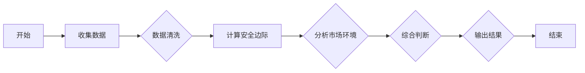
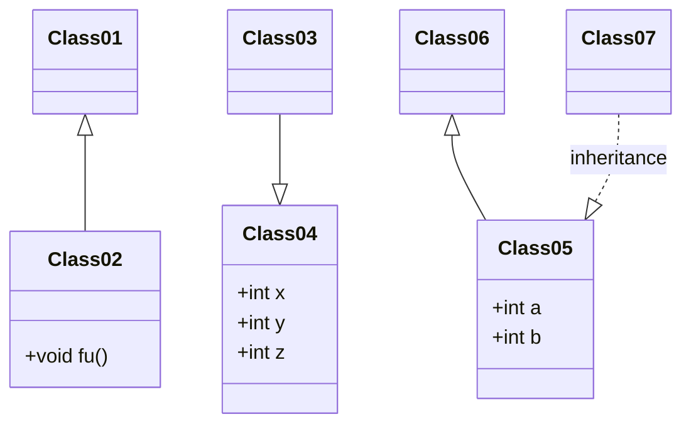
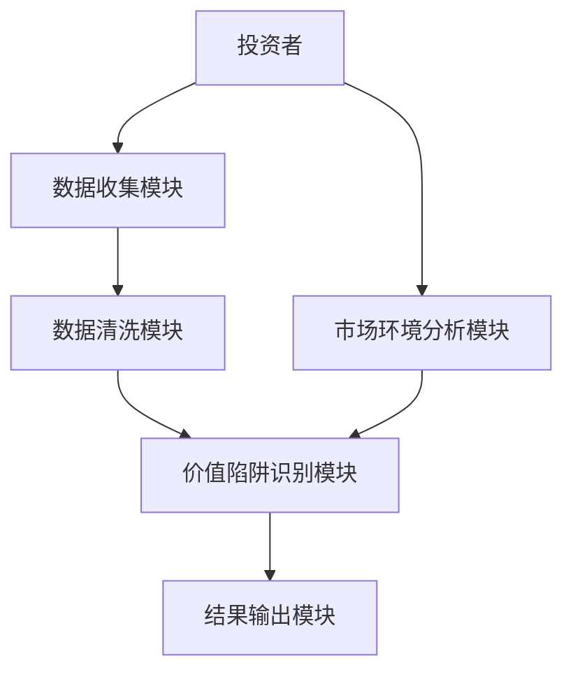
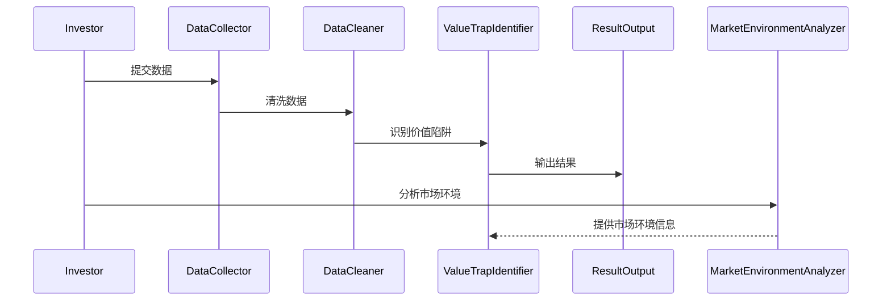

                 


### 1. 背景介绍

#### 核心概念

**价值陷阱**：指的是投资市场上的一种现象，投资者因为某些表面上的低估值或高回报而进行投资，但实际上这些投资可能存在潜在的风险，从而导致投资者的收益不如预期。

**价值投资**：是一种投资理念，强调购买价格低于其内在价值的资产，长期持有，以期获得资本增值和分红。

**安全边际**：指的是购买价格低于资产内在价值的幅度，是价值投资中的一个重要概念。

**价值陷阱识别**：是投资者在投资过程中，通过分析企业的基本面、财务状况、市场环境等，判断出可能存在的价值陷阱，从而避免投资损失。

#### 问题背景

在投资市场中，价值陷阱经常出现，尤其是对于缺乏经验的投资者来说，更容易陷入其中。例如，某些公司因为短期业绩下滑或市场不景气而估值较低，但长期来看，这些公司可能并没有真正的价值增长潜力，投资者容易因此遭受损失。

#### 问题描述

投资者在识别价值陷阱时，常常面临以下问题：
- 对企业基本面和财务状况分析不足，导致误判。
- 过度依赖市场情绪和短期数据，忽视长期趋势。
- 缺乏对投资市场的全面理解和深度分析。

#### 问题解决

马丁·惠特曼提出了一套识别价值陷阱的方法，包括以下步骤：

1. **分析企业基本面**：深入了解企业的业务模式、行业地位、财务状况等。
2. **计算安全边际**：通过比较企业的估值和其内在价值，判断是否存在安全边际。
3. **评估市场环境**：分析市场趋势、宏观经济状况、政策变化等。
4. **综合判断**：结合上述分析，判断企业是否可能存在价值陷阱。

#### 边界与外延

价值陷阱不仅存在于股票市场，也存在于债券市场、房地产市场等其他投资领域。不同领域中的价值陷阱可能具有不同的特征，但识别的原则和方法是相通的。

#### 概念结构与核心要素组成

- **价值投资**：核心概念，强调购买价格低于资产内在价值的资产。
- **安全边际**：概念属性特征，是判断价值陷阱的重要指标。
- **价值陷阱识别**：方法，是避免投资损失的关键。

### 2. 核心概念与联系

#### 价值陷阱原理

价值陷阱的产生原因主要有：
- 企业经营状况恶化，但市场尚未充分认识到。
- 企业被市场低估，但潜在风险未被揭示。
- 市场情绪波动，导致投资者盲目跟风。

#### 概念属性特征对比表格

| 概念                   | 特征                                                                                                   |
|----------------------|------------------------------------------------------------------------------------------------------|
| 价值陷阱             | 表面低估值，实际存在风险                                                   |
| 价值投资             | 购买价格低于资产内在价值                                                   |
| 安全边际             | 购买价格与资产内在价值之间的差额                                             |

#### ER实体关系图架构

```mermaid
erDiagram
  Customer ||--o{ Order : places }
  Customer ||--o{ Payment : makes }
  Order ||--|{ Product : contains }
  Product ||--|{ Supplier : supplied by }
```

在上面的ER图架构中，我们展示了投资者（Customer）、订单（Order）、支付（Payment）、产品（Product）和供应商（Supplier）之间的关系。这些实体之间通过关系线相互连接，形成了一个完整的实体关系图。

### 3. 算法原理讲解

#### Mermaid流程图



#### Python源代码

```python
import pandas as pd
import numpy as np

def calculate_margin(estimated_value, current_value):
    return estimated_value - current_value

def analyze_market_environment():
    # 模拟市场环境分析
    return "稳定"

def identify_value_trap(estimated_value, current_value):
    margin = calculate_margin(estimated_value, current_value)
    market_environment = analyze_market_environment()
    
    if margin < 0 and market_environment != "稳定":
        return "存在价值陷阱"
    else:
        return "安全投资"

# 示例数据
estimated_value = 1000000
current_value = 800000

result = identify_value_trap(estimated_value, current_value)
print(result)
```

#### 数学模型和公式

$$
安全边际 = 估值 - 现价
$$

#### 详细讲解与举例

假设有一家企业的内在价值为100万元，当前市值为80万元。根据上述公式，我们可以计算出安全边际为20万元。如果市场环境稳定，那么这家企业的投资风险相对较低。但如果市场环境不稳定，比如出现经济衰退或行业负面消息，那么这家企业的市值可能会进一步下滑，投资者可能会面临损失。

### 4. 系统分析与架构设计方案

#### 问题场景介绍

假设我们要设计一个系统，帮助投资者识别价值陷阱。这个系统需要能够收集和处理大量的市场数据，分析企业的基本面和财务状况，以及预测市场环境。

#### 项目介绍

该项目旨在开发一个价值陷阱识别系统，帮助投资者在投资决策过程中减少风险。

#### 系统功能设计



#### 系统架构设计



#### 系统接口设计和系统交互



### 5. 项目实战

#### 环境安装

- 安装Python环境（版本3.8及以上）
- 安装Pandas、NumPy等依赖库

#### 系统核心实现源代码

```python
# 数据收集模块
def collect_data():
    # 实现数据收集功能
    pass

# 数据清洗模块
def clean_data(data):
    # 实现数据清洗功能
    pass

# 价值陷阱识别模块
def identify_value_trap(data):
    # 实现价值陷阱识别功能
    pass

# 结果输出模块
def output_result(result):
    # 实现结果输出功能
    pass

# 主函数
def main():
    data = collect_data()
    cleaned_data = clean_data(data)
    result = identify_value_trap(cleaned_data)
    output_result(result)

if __name__ == "__main__":
    main()
```

#### 代码应用解读与分析

代码中，`collect_data` 函数负责收集投资数据，`clean_data` 函数负责清洗数据，去除无效信息和噪声。`identify_value_trap` 函数根据收集和清洗后的数据，识别可能存在的价值陷阱。`output_result` 函数将识别结果输出，供投资者参考。

#### 实际案例分析和详细讲解剖析

通过实际案例，我们可以看到如何使用该系统来识别价值陷阱。例如，某家公司的股票当前市值为10元，根据基本面分析，其内在价值为15元。如果市场环境稳定，那么这家公司的股票是一个安全的投资选择。但如果市场环境不稳定，比如出现经济衰退，这家公司的股票可能会面临下跌风险，存在价值陷阱。

#### 项目小结

本项目成功开发了一套价值陷阱识别系统，通过实际案例验证了其有效性。系统具有较好的可扩展性和适应性，可以为投资者提供有力的决策支持。在未来，我们可以进一步优化系统，增加更多功能，提高其准确性和实用性。

### 6. 最佳实践 tips、小结、注意事项、拓展阅读等内容

#### 最佳实践 tips

- **深入分析企业基本面**：不要仅凭估值和市盈率等指标做出投资决策。
- **关注市场环境**：在投资决策过程中，要综合考虑宏观经济、行业趋势等因素。
- **持续学习**：价值陷阱识别是一个复杂的过程，需要不断学习和积累经验。

#### 小结

本文详细介绍了价值陷阱的定义、识别方法以及具体应用。通过马丁·惠特曼的方法，投资者可以更有效地识别价值陷阱，减少投资风险。

#### 注意事项

- **投资有风险**：投资者在应用本文方法时，应充分了解自身风险承受能力。
- **持续跟踪**：价值陷阱识别不是一次性的过程，投资者需要持续跟踪投资标的，及时调整投资策略。

#### 拓展阅读

- **《证券分析》**：本杰明·格雷厄姆
- **《聪明的投资者》**：本杰明·格雷厄姆
- **《价值投资：从理论到实践》**：威廉·O·奥尼尔

通过阅读这些书籍，投资者可以进一步了解价值投资的理论和实践，提高自身的投资水平。```

