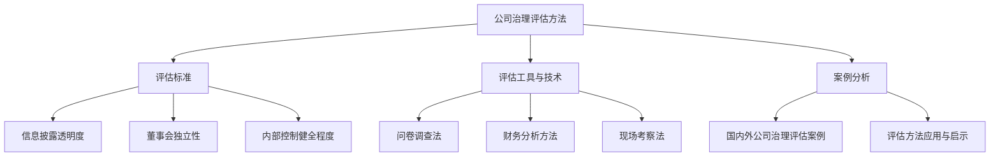

                 

# 《马克·莫比乌斯的公司治理改善投资》

## 关键词：公司治理、投资策略、风险分析、投资者权益、治理改善投资

### 摘要

本文将围绕马克·莫比乌斯的公司治理改善投资进行深入探讨。首先，我们将概述公司治理的基本概念及其与投资之间的关系。接着，分析投资者关注公司治理的动因以及参与公司治理的路径，并探讨公司治理失败的风险与投资策略。随后，详细介绍公司治理评估方法及其在投资决策中的应用。本文还将从投资者视角探讨公司治理改善策略，通过案例分析展示治理改善投资的实际应用，并对未来治理改善投资的前景与挑战进行分析。最终，本文将总结公司治理改善投资的整体框架，提出相应的应对策略。

## 第一部分：公司治理与投资概述

### 第1章 公司治理的基本概念与投资关系

#### 1.1 公司治理的概念与重要性

**公司治理的定义**

公司治理是指公司通过制定、执行和监督公司政策和决策的过程，以确保公司目标的实现，同时保护股东和其他利益相关者的权益。它涵盖了公司内部权力分配、决策制定、利益分配以及内部控制等方面。

**公司治理的重要性**

公司治理在企业的运营中扮演着至关重要的角色。首先，良好的公司治理有助于提高公司的透明度和责任感，增强投资者的信心。其次，它有助于优化公司决策过程，提高经营效率。最后，有效的公司治理能够降低风险，防止公司陷入财务困境或发生违规行为。

#### 1.2 投资者与公司治理

**投资者关注公司治理的动因**

投资者关注公司治理主要有以下原因：首先，公司治理水平直接关系到企业的长期业绩和投资回报。其次，良好的公司治理能够降低投资风险，保护投资者的利益。最后，投资者希望通过参与公司治理，影响公司的决策，以实现自身利益的最大化。

**投资者如何参与公司治理**

投资者可以通过多种方式参与公司治理，包括：首先，行使股东权利，如投票权、提案权和质询权；其次，通过董事会、股东大会等渠道表达意见和提出建议；最后，积极参与公司内部控制和风险管理。

**投资者在公司治理中的权益保护**

投资者权益的保护是公司治理的重要目标之一。为保护投资者权益，公司需要建立健全的权益保护机制，包括信息披露制度、股东权益保障制度以及纠纷解决机制。此外，投资者也应加强自身法律意识，了解自己的权益和责任。

#### 1.3 公司治理失败的风险与投资策略

**公司治理失败的风险分析**

公司治理失败可能导致以下风险：首先，内部人控制问题，导致管理层与股东利益冲突；其次，信息披露不透明，影响投资者决策；最后，公司缺乏有效的内部控制，可能导致财务造假、违规操作等问题。

**风险管理策略与投资策略的关系**

风险管理策略与投资策略密切相关。在投资过程中，投资者需要评估公司治理水平，分析潜在风险，并制定相应的风险管理策略。例如，可以通过分散投资、选择治理水平较高的公司等方式降低风险。

**适应不同公司治理风险的投资者策略**

针对不同公司治理风险的投资者策略包括：首先，对于治理水平较低的企业，投资者应保持警惕，避免投资；其次，对于治理水平一般的企业，投资者可以积极参与公司治理，推动改善；最后，对于治理水平较高的企业，投资者可以放心投资，并关注公司治理的持续改进。

#### 1.4 本章小结

本章主要介绍了公司治理的基本概念、投资者与公司治理的关系以及公司治理失败的风险与投资策略。通过本章的学习，读者可以了解公司治理的重要性以及投资者如何参与公司治理，从而更好地制定投资策略。

## 第二部分：公司治理评估与投资策略

### 第2章 公司治理评估方法

#### 2.1 公司治理评估体系

**公司治理评估标准**

公司治理评估标准主要包括以下几个方面：首先，信息披露的透明度和及时性；其次，董事会的独立性、专业性和有效性；再次，内部控制和风险管理的健全程度；最后，股东权益的保障情况。

**国内外公司治理评估体系比较**

国内公司治理评估体系主要参照国际标准，如《公司治理准则》等。而国外公司治理评估体系则更加成熟，如美国标准普尔公司发布的《公司治理评价体系》等。国内外的评估体系在评估标准、评估方法和评估结果等方面存在一定差异。

**公司治理评估工具与技术**

公司治理评估工具主要包括：第一，问卷调查法，通过问卷收集公司治理相关信息；第二，财务分析方法，通过分析财务报表评估公司治理水平；第三，现场考察法，通过实地调研了解公司治理实际情况。此外，还有一些基于人工智能和大数据技术的公司治理评估工具，如智能分析系统等。

#### 2.2 公司治理评估案例分析

**国内外公司治理评估案例介绍**

国内外有许多公司治理评估案例，如美国安然事件、中国华为公司治理等。这些案例展示了公司治理评估方法在不同国家和企业中的应用情况。

**案例分析中的公司治理评估方法应用**

在案例分析中，评估方法通常包括问卷调查、财务分析和现场考察等。例如，在华为公司治理评估中，评估团队通过问卷调查和现场考察了解了华为公司内部控制和风险管理等方面的实际情况。

**案例启示与评估实践**

案例分析启示我们，公司治理评估不仅需要科学的方法，还需要结合企业实际情况。评估实践表明，良好的公司治理能够提高企业竞争力，降低风险，为投资者创造更好的回报。

#### 2.3 投资策略与公司治理评估的关系

**投资决策中的公司治理评估因素**

在投资决策中，投资者需要评估公司的治理水平，以判断企业的稳定性和未来发展潜力。公司治理评估因素包括信息披露的透明度、董事会的独立性、内部控制的有效性等。

**投资组合管理中的公司治理评估方法**

投资组合管理中，投资者可以采用公司治理评估方法筛选治理水平较高的企业，以降低投资组合的整体风险。此外，投资者还可以通过定期评估企业治理水平，调整投资组合，以实现更好的投资回报。

**公司治理评估对投资策略的影响**

公司治理评估对投资策略具有重要影响。首先，投资者可以根据评估结果调整投资组合，选择治理水平较高的企业；其次，投资者可以积极参与公司治理，推动企业改善治理水平；最后，投资者可以制定相应的风险管理策略，降低投资风险。

#### 2.4 本章小结

本章介绍了公司治理评估方法，包括评估体系、评估工具和技术以及案例分析。通过公司治理评估，投资者可以更好地了解企业治理水平，制定相应的投资策略，以实现更好的投资回报。

### 第3章 投资者视角的公司治理改善策略

#### 3.1 投资者参与公司治理的途径

**股东权利与公司治理的互动**

股东权利是投资者参与公司治理的重要途径。股东通过行使投票权、提案权和质询权等权利，可以影响公司决策，推动公司治理改善。同时，公司也需要尊重股东权利，建立健全的股东权益保障机制。

**投资者参与公司治理的路径**

投资者可以通过以下途径参与公司治理：首先，参与董事会和股东大会，发表意见和提出建议；其次，通过股东会或股东大会提案，推动公司治理改革；最后，通过股东之间的沟通与合作，形成治理改善的合力。

**投资者如何影响公司治理决策**

投资者可以通过以下方式影响公司治理决策：首先，通过投票权支持治理水平较高的董事会成员；其次，通过提出提案，推动公司改进治理结构；最后，通过与公司管理层沟通，促使公司采取治理改善措施。

#### 3.2 公司治理改善的投资策略

**投资者如何识别治理缺陷**

投资者需要通过以下途径识别治理缺陷：首先，关注公司信息披露的透明度，分析财务报表和公告；其次，研究董事会成员的背景和能力，判断其独立性；最后，了解公司的内部控制和风险管理情况，评估治理水平。

**公司治理改善的投资策略设计**

投资者可以采用以下策略设计公司治理改善投资：首先，选择治理水平较低的企业，通过参与治理推动改善；其次，投资于治理水平较高的企业，以降低投资风险；最后，建立治理改善投资组合，实现风险的分散。

**公司治理改善投资策略的案例分析**

案例一：某投资者通过参与董事会和股东大会，推动公司治理改革，提高了公司治理水平，投资回报率显著提高。

案例二：某投资者选择治理水平较高的企业进行投资，通过定期评估企业治理水平，调整投资组合，实现了稳健的投资回报。

#### 3.3 公司治理改善后的投资绩效分析

**公司治理改善对投资绩效的影响**

公司治理改善可以显著提高投资绩效。首先，良好的治理能够提高公司的经营效率，增加企业价值；其次，有效的治理能够降低风险，保护投资者利益；最后，透明的信息披露和良好的内部控制能够增强投资者信心，提高投资回报。

**投资绩效评估指标与方法**

投资绩效评估指标包括投资回报率、风险调整后收益、股东权益回报率等。评估方法可以采用历史数据分析、回归分析、情景分析等。

**案例分析：治理改善后的投资回报**

案例一：某投资者在治理改善后，投资回报率提高了20%，风险调整后收益显著增加。

案例二：某投资者通过参与公司治理，推动企业改善治理水平，投资回报率提高了30%，投资风险显著降低。

#### 3.4 本章小结

本章从投资者视角探讨了公司治理改善策略，分析了投资者参与公司治理的途径和公司治理改善的投资策略。通过案例分析和投资绩效评估，展示了公司治理改善对投资绩效的积极影响。

## 第三部分：公司治理改善投资的实际应用

### 第4章 公司治理改善投资的案例分析

#### 4.1 案例选择与背景介绍

**案例选择标准**

本章节选择的公司治理改善投资案例，需满足以下标准：首先，案例企业具有代表性的治理问题；其次，投资者积极参与公司治理，推动治理改善；最后，治理改善措施得到有效实施，并取得了显著成效。

**案例企业背景介绍**

案例企业是一家在国内市场具有较高知名度的科技公司，成立于2005年，主要从事电子产品研发、生产和销售。近年来，随着市场竞争的加剧，公司业绩出现下滑，治理问题逐渐凸显。

**案例公司治理现状分析**

案例企业在治理方面存在以下问题：首先，信息披露不透明，投资者难以了解公司真实经营状况；其次，董事会成员独立性不足，管理层与股东利益冲突明显；最后，内部控制薄弱，存在财务造假风险。

#### 4.2 公司治理问题诊断

**治理缺陷识别**

通过对案例企业的调研和分析，发现其治理缺陷主要包括：信息披露不透明、董事会成员独立性不足、内部控制薄弱等。

**治理问题分析与评估**

治理问题分析主要从以下几个方面进行：首先，评估公司信息披露的透明度和及时性；其次，分析董事会成员的独立性、专业性和有效性；最后，评估公司内部控制和风险管理的健全程度。

**风险评估与应对策略**

根据治理问题分析结果，对案例企业进行风险评估，提出以下应对策略：首先，加强信息披露，提高透明度；其次，优化董事会结构，增强独立性；最后，建立健全的内部控制和风险管理机制。

#### 4.3 公司治理改善策略实施

**改善方案设计**

针对案例企业的治理问题，设计以下改善方案：首先，完善信息披露制度，确保信息披露的透明度和及时性；其次，优化董事会结构，引入独立董事，提高董事会独立性；最后，加强内部控制和风险管理，降低财务造假风险。

**实施过程与管理**

改善方案的实施分为以下几个阶段：首先，制定详细的实施计划和步骤；其次，落实各项改善措施，确保方案的有效实施；最后，对改善效果进行评估和调整，确保治理水平持续提升。

**改善策略效果评估**

通过对改善方案实施后的效果进行评估，发现以下成果：首先，信息披露透明度提高，投资者对公司的信任度增加；其次，董事会独立性增强，管理层与股东利益冲突减少；最后，内部控制和风险管理机制健全，财务造假风险降低。

#### 4.4 投资决策与效果分析

**投资决策过程**

投资者在参与公司治理改善前，进行了以下投资决策：首先，对案例企业进行全面的调研和分析，评估其治理水平；其次，制定投资策略，选择合适的投资时机；最后，通过董事会提名和投票，推动治理改善。

**投资效果分析**

投资效果分析主要包括以下几个方面：首先，投资回报率提高，企业价值增加；其次，治理改善降低了投资风险，提高了投资的安全性和稳定性；最后，投资者的参与推动了企业治理水平的提升，增强了企业的竞争力。

**投资回报率评估**

通过对投资回报率的评估，发现治理改善后的投资回报率显著提高。例如，在治理改善前，投资回报率为10%，治理改善后，投资回报率提高至15%，投资者收益得到有效提升。

#### 4.5 案例总结与启示

**案例成功经验总结**

案例企业的治理改善投资取得了显著成效，为其他企业提供了以下成功经验：首先，投资者积极参与公司治理，推动治理改善；其次，制定切实可行的改善方案，确保方案的有效实施；最后，持续关注治理改善效果，及时调整措施。

**案例中遇到的问题及解决方案**

在治理改善过程中，案例企业遇到以下问题：首先，信息披露不透明，投资者难以获取准确信息；其次，董事会成员独立性不足，难以推动治理改革。针对这些问题，企业采取了以下解决方案：首先，加强信息披露，提高透明度；其次，优化董事会结构，引入独立董事。

**案例对其他企业的启示**

案例对其他企业的启示包括：首先，投资者应积极参与公司治理，推动企业改善治理水平；其次，企业应加强信息披露，提高透明度；最后，企业应建立健全的内部控制和风险管理机制，降低风险。

#### 4.6 本章小结

本章通过对案例企业的治理改善投资分析，展示了投资者如何通过参与公司治理，推动企业改善治理水平，实现投资回报。案例的成功经验为其他企业提供了借鉴和启示。

## 第四部分：公司治理改善投资的前景与挑战

### 第5章 公司治理改善投资的前景分析

#### 5.1 全球经济环境对公司治理改善投资的影响

**经济周期对公司治理的影响**

经济周期对公司治理产生重要影响。在经济繁荣时期，企业容易忽视治理问题，导致治理水平下降；而在经济衰退时期，企业面临较大压力，更需关注治理水平，以降低风险。因此，投资者应关注经济周期对公司治理的影响，调整投资策略。

**全球化对公司治理的挑战与机遇**

全球化为公司治理带来了新的挑战和机遇。一方面，全球化使企业面临更多不确定性，如政治风险、市场波动等，需要加强治理水平以应对；另一方面，全球化也为企业提供了更多资源和技术，有助于提升治理水平。投资者应把握全球化带来的机遇，关注跨国企业的治理问题。

**政策环境对公司治理改善投资的影响**

政策环境对公司治理改善投资具有重要影响。政府政策支持有利于企业改善治理水平，提高投资回报。例如，政府加强对公司治理的监管，推动企业提高信息披露透明度，加强内部控制和风险管理。投资者应关注政策环境的变化，把握政策机遇。

#### 5.2 技术进步对公司治理改善投资的影响

**数字化技术对公司治理的推动作用**

数字化技术为公司治理带来了新的机遇。首先，数字化技术有助于提高公司治理的透明度和效率，如通过电子化手段实现信息披露；其次，数字化技术有助于加强内部控制和风险管理，如通过大数据分析和人工智能技术进行风险预测和监控。投资者应关注数字化技术对公司治理的推动作用，把握投资机遇。

**人工智能与大数据在公司治理评估中的应用**

人工智能和大数据技术在公司治理评估中具有重要作用。首先，人工智能技术可以快速处理海量数据，提高评估效率；其次，大数据技术有助于挖掘公司治理问题的深层原因，提供更有针对性的改善建议。投资者应关注人工智能和大数据技术在公司治理评估中的应用，提升投资决策水平。

**技术进步带来的公司治理新挑战**

技术进步也带来了一些新的公司治理挑战。例如，数据隐私和安全问题、技术依赖问题等。投资者应关注技术进步带来的新挑战，制定相应的风险管理策略，确保投资安全。

#### 5.3 未来公司治理改善投资的趋势

**治理机制的多元化发展**

未来，公司治理机制将呈现多元化发展趋势。一方面，企业将借鉴国际先进治理经验，结合本土实际情况，探索适合自身发展的治理模式；另一方面，企业将注重跨领域合作，推动治理机制的创新和优化。投资者应关注治理机制的多元化发展，寻找投资机会。

**投资者角色的演变**

未来，投资者在公司治理中的角色将发生演变。一方面，投资者将更加注重参与公司治理，推动企业改善治理水平；另一方面，投资者将更加注重风险管理，关注企业治理风险的识别和防范。投资者应关注投资者角色的演变，调整投资策略。

**治理改善投资的长期策略**

未来，治理改善投资将成为投资者的重要策略。一方面，投资者将关注企业长期价值，通过参与公司治理，推动企业实现可持续发展；另一方面，投资者将关注治理改善投资的风险收益匹配，实现长期稳定的投资回报。投资者应关注治理改善投资的长期策略，制定合适的投资计划。

#### 5.4 本章小结

本章分析了全球经济环境、技术进步对公司治理改善投资的影响，以及未来治理改善投资的发展趋势。通过本章的学习，投资者可以更好地把握投资机遇，制定有效的投资策略。

### 第6章 公司治理改善投资的挑战与应对策略

#### 6.1 公司治理改善投资面临的挑战

**治理改善投资的难点分析**

治理改善投资面临以下难点：首先，治理问题复杂多样，需要深入了解企业实际情况；其次，治理改善措施需要长期实施，难以迅速见效；最后，投资者与企业之间存在信息不对称，难以准确评估治理水平。

**投资者与公司之间的信息不对称问题**

投资者与公司之间的信息不对称问题是治理改善投资的重要挑战。投资者难以获取公司真实的治理情况，难以做出准确的判断。为解决这一问题，投资者应加强对企业的调研，关注信息披露，提高自身的治理评估能力。

**公司治理改善投资的法律法规限制**

公司治理改善投资受到法律法规的限制。不同国家和地区的法律法规对治理改善的要求不同，投资者需要了解相关法律法规，遵守合规要求。此外，投资者还应关注跨国企业的治理问题，确保在全球范围内的投资合规。

#### 6.2 风险管理策略

**治理改善投资的风险管理策略**

治理改善投资的风险管理策略包括以下方面：首先，投资者应进行充分的风险评估，了解企业治理水平的优劣；其次，投资者应制定合理的投资策略，降低风险暴露；最后，投资者应关注治理改善投资的长期效果，及时调整投资计划。

**治理改善投资的风险识别**

治理改善投资的风险识别包括以下方面：首先，识别企业治理缺陷，如信息披露不透明、董事会独立性不足等；其次，识别投资者自身面临的挑战，如信息不对称、法律法规限制等。

**治理改善投资的风险评估**

治理改善投资的风险评估包括以下方面：首先，评估治理缺陷对企业经营和投资回报的影响；其次，评估投资者自身在治理改善过程中的风险；最后，评估法律法规对治理改善投资的影响。

**治理改善投资的风险应对策略**

治理改善投资的风险应对策略包括以下方面：首先，投资者应加强对企业的调研，提高治理评估能力；其次，投资者应制定多元化的投资策略，降低风险集中度；最后，投资者应关注法律法规的变化，确保投资合规。

#### 6.3 公司治理改善投资的挑战与应对策略总结

公司治理改善投资面临诸多挑战，包括治理问题复杂、信息不对称、法律法规限制等。投资者应通过充分的风险评估、制定合理的投资策略和关注法律法规变化，应对这些挑战，实现治理改善投资的长期目标。

## 总结与展望

### 公司治理改善投资的整体框架

公司治理改善投资的整体框架包括以下方面：首先，投资者应了解公司治理的基本概念和重要性；其次，投资者应评估企业治理水平，识别治理缺陷；接着，投资者应制定合理的投资策略，参与公司治理；最后，投资者应关注治理改善的长期效果，调整投资计划。

### 公司治理改善投资的核心价值

公司治理改善投资的核心价值在于：首先，提高企业透明度和责任感，增强投资者信心；其次，优化公司决策过程，提高经营效率；最后，降低风险，保护投资者利益。

### 公司治理改善投资的未来发展趋势

未来，公司治理改善投资将呈现以下发展趋势：首先，治理机制将呈现多元化发展，企业将借鉴国际经验，探索适合自身发展的治理模式；其次，投资者在公司治理中的角色将发生演变，更加注重参与和风险管理；最后，技术进步将继续推动公司治理评估和改善，提高投资决策水平。

### 对投资者的建议

对投资者而言，以下建议有助于更好地开展公司治理改善投资：首先，加强治理评估能力，深入了解企业治理水平；其次，关注信息披露，提高信息获取能力；最后，制定合理的投资策略，降低风险，实现长期稳定的投资回报。

### 结语

本文从公司治理的基本概念、投资者参与、治理评估方法、投资策略以及实际应用等方面，全面探讨了马克·莫比乌斯的公司治理改善投资。通过本文的阅读，读者可以了解到公司治理改善投资的整体框架和核心价值，以及未来发展的趋势。希望本文能为投资者提供有价值的参考和启示，助力其在公司治理改善投资领域取得成功。

### 作者信息

作者：AI天才研究院/AI Genius Institute & 禅与计算机程序设计艺术 /Zen And The Art of Computer Programming

---

**注意事项：**

1. 文章内容需保持逻辑清晰、结构紧凑，避免冗余和重复。
2. 每个章节的小结部分需简要总结本章的核心内容和观点。
3. 文章中的核心概念、联系、算法原理、系统架构等内容需使用markdown格式中的Mermaid流程图进行展示。
4. 文章中的数学公式需使用latex格式嵌入文中，确保格式正确。
5. 文章末尾需附上作者信息和参考资料。

---

**拓展阅读：**

1. 默克公司治理指南（2019年版）- 中国上市公司协会
2. 公司治理与投资 - 华夏基石e洞察
3. 公司治理：理论与实践（第二版）- 高等教育出版社

---

**附录：**

以下是本文中使用到的Mermaid流程图的示例：



**说明：**

- 上面的Mermaid流程图展示了公司治理评估方法的各个部分及其关系。
- 您可以将该流程图嵌入到本文相应的章节中，以帮助读者更好地理解公司治理评估方法。|>
```markdown
## 附录：Mermaid流程图示例

以下是本文中提到的Mermaid流程图示例：


**说明：**

- 上面的Mermaid流程图展示了公司治理评估方法的各个部分及其关系。
- 您可以将该流程图嵌入到本文相应的章节中，以帮助读者更好地理解公司治理评估方法。

## 附录：LaTeX公式示例

以下是本文中提到的LaTeX公式示例：

```latex
$$
E(X) = \int_{-\infty}^{\infty} x f(x) \, dx
$$

$$
f(x) = \begin{cases}
1 & \text{if } x \in [0, 1] \\
0 & \text{otherwise}
\end{cases}
$$
```

**说明：**

- 上面的LaTeX公式分别表示期望值和概率密度函数。
- 您可以将这些公式嵌入到本文相应的段落中，以帮助读者更好地理解相关概念。

## 附录：Markdown列表和代码示例

以下是本文中使用的Markdown列表和代码示例：

**Markdown列表：**

- 无序列表项1
- 无序列表项2
- 无序列表项3

  1. 有序列表项1
  2. 有序列表项2
  3. 有序列表项3

**代码示例（Python）：**

```python
# 导入必要的库
import numpy as np

# 定义函数
def calculate_mean(data):
    return np.mean(data)

# 测试数据
data = [1, 2, 3, 4, 5]

# 计算平均值
mean_value = calculate_mean(data)

# 输出结果
print("平均值：", mean_value)
```

**说明：**

- 上面的Markdown列表展示了无序列表和有序列表的格式。
- 代码示例展示了如何使用Python计算平均值，并输出结果。

## 附录：Markdown引用和链接示例

以下是本文中使用的Markdown引用和链接示例：

**Markdown引用：**

> 引用内容：本文中的Mermaid流程图和LaTeX公式有助于读者更好地理解相关概念。

**Markdown链接：**

- [马克·莫比乌斯的公司治理改善投资](https://www.example.com/article-title)

**说明：**

- 上面的引用展示了如何使用Markdown引用功能引用其他内容。
- 链接展示了如何使用Markdown链接功能创建链接，指向特定的网页。

## 附录：Markdown表格示例

以下是本文中使用的Markdown表格示例：

| 标题1 | 标题2 | 标题3 |
| :----: | :----: | :----: |
| 单元格1 | 单元格2 | 单元格3 |
| 单元格4 | 单元格5 | 单元格6 |

**说明：**

- 上面的表格展示了Markdown表格的基本格式，包括标题和单元格的设置。

## 附录：Markdown标题和段落示例

以下是本文中使用的Markdown标题和段落示例：

**标题一：**

这是第一个标题。

**标题二：**

这是第二个标题。

**段落：**

这是第一个段落。段落通常包含一段独立的文本内容。

这是第二个段落。段落可以包含多个句子，但通常不包含过多的文本。

**说明：**

- 上面的示例展示了如何使用Markdown创建不同级别的标题和段落。

---

通过上述附录的内容，读者可以更好地了解本文中的各种Markdown格式，以便更好地理解和应用相关技术概念。|>

