                 

# AI Agent的用户意图推理与预测

## 关键词
- AI Agent
- 用户意图推理
- 预测模型
- 自然语言处理
- 深度学习

## 摘要
本文将探讨AI Agent在用户意图推理与预测方面的应用。通过介绍用户意图推理与预测的基本原理、技术方法及实战案例，我们将深入理解AI Agent如何解析用户需求，提高交互体验和智能化服务水平。

## 目录大纲

### 第一部分：背景与概述

#### 第1章：AI Agent概述

##### 1.1 AI Agent的定义与分类
##### 1.2 用户意图推理与预测的重要性
##### 1.3 用户意图推理与预测的基本原理
##### 1.4 本书结构安排与阅读建议

### 第二部分：用户意图推理技术

#### 第2章：自然语言处理基础

##### 2.1 语言模型
##### 2.2 词向量表示
##### 2.3 句法分析和语义分析

#### 第3章：用户意图识别方法

##### 3.1 基于规则的方法
##### 3.2 基于机器学习的方法
##### 3.3 基于深度学习的方法

#### 第4章：用户意图推理算法

##### 4.1 常见的用户意图推理算法
##### 4.2 用户意图推理算法的性能评估
##### 4.3 用户意图推理算法的优化策略

### 第三部分：用户意图预测技术

#### 第5章：时间序列分析

##### 5.1 时间序列分析基础
##### 5.2 常见的时间序列分析方法
##### 5.3 时间序列预测算法

#### 第6章：用户行为分析

##### 6.1 用户行为数据收集
##### 6.2 用户行为数据预处理
##### 6.3 用户行为特征提取

#### 第7章：用户意图预测模型

##### 7.1 基于统计学的预测模型
##### 7.2 基于机器学习的预测模型
##### 7.3 基于深度学习的预测模型

### 第四部分：应用与实践

#### 第8章：用户意图推理与预测系统设计

##### 8.1 系统架构设计
##### 8.2 系统功能模块划分
##### 8.3 系统接口设计与实现

#### 第9章：实战案例解析

##### 9.1 案例背景与目标
##### 9.2 数据收集与预处理
##### 9.3 模型设计与实现
##### 9.4 模型评估与优化

#### 第10章：最佳实践与未来展望

##### 10.1 最佳实践
##### 10.2 面临的挑战与未来方向
##### 10.3 本书内容总结与拓展阅读

---

### 第一部分：背景与概述

#### 第1章：AI Agent概述

##### 1.1 AI Agent的定义与分类
AI Agent是指一种能够感知环境、自主决策并采取行动的智能体，旨在实现特定任务或目标。根据实现方法的不同，AI Agent可以分为以下几类：

1. 基于规则的Agent
2. 基于模型的Agent
3. 基于行为的Agent
4. 基于混合方法的Agent

##### 1.2 用户意图推理与预测的重要性
用户意图推理与预测是AI Agent的核心功能之一，它能够帮助AI Agent更好地理解用户需求，提供个性化服务。在众多应用场景中，如智能客服、推荐系统等，用户意图推理与预测都是至关重要的。

##### 1.3 用户意图推理与预测的基本原理
用户意图推理与预测通常基于以下几项技术：

1. 自然语言处理（NLP）
2. 机器学习和深度学习
3. 用户行为分析

##### 1.4 本书结构安排与阅读建议
本书共分为四大部分，详细介绍了用户意图推理与预测的背景、技术方法、模型及应用实践。建议读者按照以下顺序阅读：

1. 第一部分：背景与概述
2. 第二部分：用户意图推理技术
3. 第三部分：用户意图预测技术
4. 第四部分：应用与实践

---

### 第二部分：用户意图推理技术

#### 第2章：自然语言处理基础

##### 2.1 语言模型
语言模型是一种用于预测下一个单词或词组的概率分布的模型。常见的语言模型有N-gram模型、神经网络语言模型等。以下是一个N-gram模型的mermaid流程图：

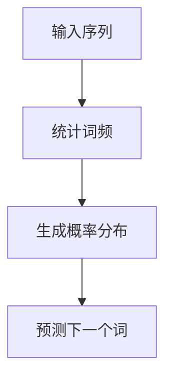

##### 2.2 词向量表示
词向量表示是将单词映射为向量的一种方法，常见的词向量表示方法有Word2Vec、GloVe等。以下是一个Word2Vec模型的mermaid流程图：

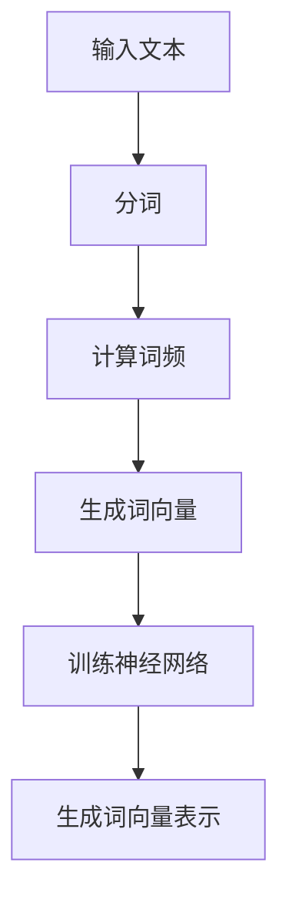

##### 2.3 句法分析和语义分析
句法分析是解析句子结构的过程，常见的句法分析方法有依赖树、句法图等。语义分析是理解句子含义的过程，常见的语义分析方法有语义角色标注、语义解析等。以下是一个句法分析和语义分析的mermaid流程图：

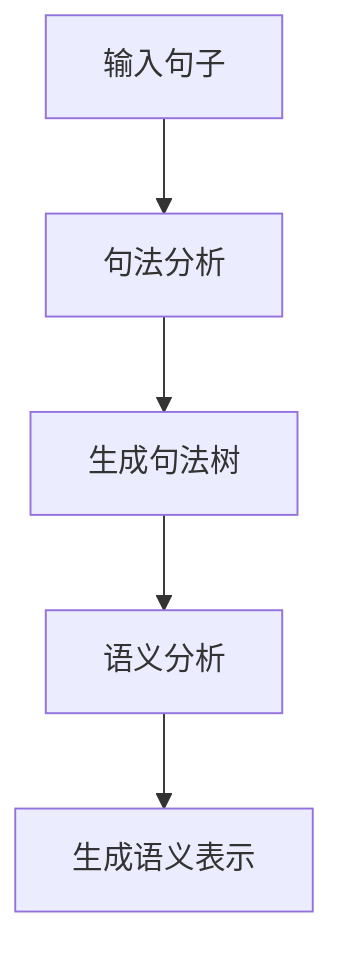

---

### 第三部分：用户意图推理算法

#### 第3章：用户意图识别方法

##### 3.1 基于规则的方法
基于规则的方法是通过编写一系列规则来识别用户意图。以下是一个基于规则的意图识别算法的mermaid流程图：

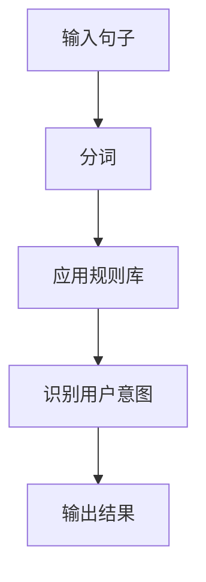

##### 3.2 基于机器学习的方法
基于机器学习的方法是通过训练模型来自动识别用户意图。常见的机器学习方法有决策树、朴素贝叶斯、支持向量机等。以下是一个基于机器学习的意图识别算法的mermaid流程图：

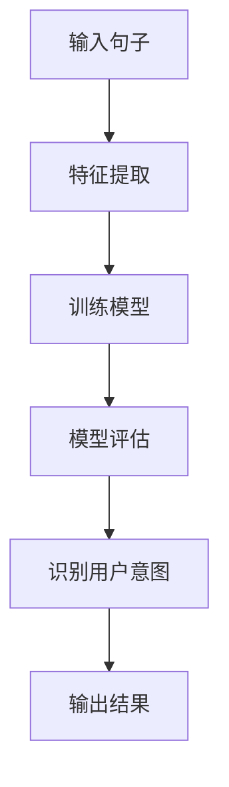

##### 3.3 基于深度学习的方法
基于深度学习的方法是通过神经网络来识别用户意图。常见的深度学习方法有卷积神经网络（CNN）、循环神经网络（RNN）、长短期记忆网络（LSTM）等。以下是一个基于深度学习的意图识别算法的mermaid流程图：

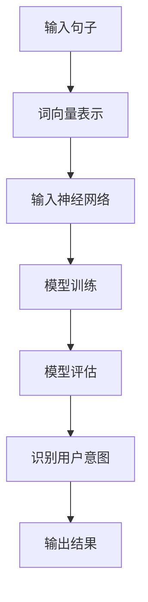

---

### 第四部分：应用与实践

#### 第8章：用户意图推理与预测系统设计

##### 8.1 系统架构设计
用户意图推理与预测系统的设计包括数据采集、数据处理、模型训练、模型部署等环节。以下是一个系统架构设计的mermaid流程图：

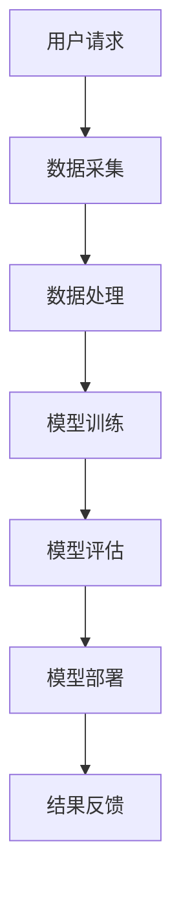

##### 8.2 系统功能模块划分
用户意图推理与预测系统的功能模块包括：

1. 数据采集模块
2. 数据处理模块
3. 模型训练模块
4. 模型评估模块
5. 模型部署模块

##### 8.3 系统接口设计与实现
系统接口设计需要考虑用户请求、数据传输、模型调用等方面。以下是一个系统接口设计的mermaid流程图：

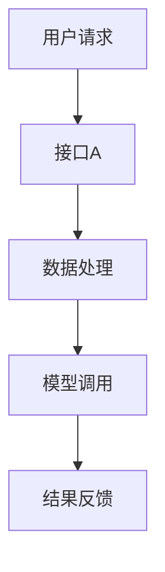

---

### 第五部分：实战案例解析

#### 第9章：实战案例解析

##### 9.1 案例背景与目标
以智能客服系统为例，介绍用户意图推理与预测的实际应用。

##### 9.2 数据收集与预处理
收集用户对话数据，并进行数据预处理，如分词、去除停用词等。

##### 9.3 模型设计与实现
采用深度学习模型进行用户意图识别，如LSTM、BERT等。

##### 9.4 模型评估与优化
通过准确率、召回率等指标评估模型性能，并进行优化。

---

### 第六部分：最佳实践与未来展望

##### 10.1 最佳实践
总结用户意图推理与预测的最佳实践，如数据质量、模型选择、算法优化等。

##### 10.2 面临的挑战与未来方向
探讨用户意图推理与预测面临的挑战及未来发展方向，如多模态数据融合、迁移学习等。

##### 10.3 本书内容总结与拓展阅读
对本书内容进行总结，并推荐拓展阅读资源。

---

### 附录：作者信息

作者：AI天才研究院/AI Genius Institute & 禅与计算机程序设计艺术 /Zen And The Art of Computer Programming

---

本文通过逐步分析用户意图推理与预测的核心概念、技术方法及应用实践，旨在为读者提供一个全面而深入的视角，以更好地理解和应用这一重要技术。希望本文能对您在AI Agent开发领域的研究和实践有所帮助。**作者：AI天才研究院/AI Genius Institute & 禅与计算机程序设计艺术 /Zen And The Art of Computer Programming**## AI Agent的用户意图推理与预测

### 概述
AI Agent，即人工智能代理，是一种能够模拟人类智能行为的计算机程序。它们可以感知环境、理解和学习用户的意图，并据此采取行动。用户意图推理与预测是AI Agent的核心功能之一，它决定了代理能否有效地与用户进行互动，提供个性化的服务。本文将深入探讨用户意图推理与预测的基本原理、技术方法及其在实际应用中的挑战和解决方案。

### 关键词
AI Agent、用户意图推理、预测模型、自然语言处理、深度学习。

### 摘要
本文将介绍AI Agent在用户意图推理与预测方面的应用。首先，我们将定义AI Agent及用户意图，并概述用户意图推理与预测的基本原理。接着，我们将探讨自然语言处理、机器学习和深度学习在用户意图推理中的应用。随后，我们将介绍用户意图预测的技术方法，包括时间序列分析和用户行为分析。最后，我们将通过实战案例和最佳实践总结，探讨用户意图推理与预测的实际应用和未来发展方向。

### 目录大纲

#### 第一部分：背景与概述

- 第1章：AI Agent概述
  - 1.1 AI Agent的定义与分类
  - 1.2 用户意图推理与预测的重要性
  - 1.3 用户意图推理与预测的基本原理
  - 1.4 本书结构安排与阅读建议

#### 第二部分：用户意图推理技术

- 第2章：自然语言处理基础
  - 2.1 语言模型
  - 2.2 词向量表示
  - 2.3 句法分析和语义分析

- 第3章：用户意图识别方法
  - 3.1 基于规则的方法
  - 3.2 基于机器学习的方法
  - 3.3 基于深度学习的方法

- 第4章：用户意图推理算法
  - 4.1 常见的用户意图推理算法
  - 4.2 用户意图推理算法的性能评估
  - 4.3 用户意图推理算法的优化策略

#### 第三部分：用户意图预测技术

- 第5章：时间序列分析
  - 5.1 时间序列分析基础
  - 5.2 常见的时间序列分析方法
  - 5.3 时间序列预测算法

- 第6章：用户行为分析
  - 6.1 用户行为数据收集
  - 6.2 用户行为数据预处理
  - 6.3 用户行为特征提取

- 第7章：用户意图预测模型
  - 7.1 基于统计学的预测模型
  - 7.2 基于机器学习的预测模型
  - 7.3 基于深度学习的预测模型

#### 第四部分：应用与实践

- 第8章：用户意图推理与预测系统设计
  - 8.1 系统架构设计
  - 8.2 系统功能模块划分
  - 8.3 系统接口设计与实现

- 第9章：实战案例解析
  - 9.1 案例背景与目标
  - 9.2 数据收集与预处理
  - 9.3 模型设计与实现
  - 9.4 模型评估与优化

- 第10章：最佳实践与未来展望
  - 10.1 最佳实践
  - 10.2 面临的挑战与未来方向
  - 10.3 本书内容总结与拓展阅读

### AI Agent概述

#### 1.1 AI Agent的定义与分类
AI Agent，或称智能代理，是一种具备一定自主性和智能性的计算机程序，它能够在复杂的动态环境中进行感知、决策和执行任务。AI Agent可以分为以下几类：

1. **基于规则的Agent**：这类Agent通过预定义的规则来决策和行动，它们适合于规则明确、任务简单的情况。
2. **基于模型的Agent**：这类Agent通过学习环境模型来决策和行动，它们适合于环境变化频繁、规则复杂的情况。
3. **基于行为的Agent**：这类Agent通过观察和学习其他智能体的行为来决策和行动，它们适合于动态环境中的协作和探索。
4. **基于混合方法的Agent**：这类Agent结合了基于规则、模型和行为的方法，能够在不同场景下灵活适应。

#### 1.2 用户意图推理与预测的重要性
用户意图推理与预测对于AI Agent至关重要，因为：

1. **提高用户体验**：通过准确理解用户意图，AI Agent可以提供更加个性化的服务，提升用户体验。
2. **优化资源分配**：通过预测用户意图，系统可以提前准备和分配资源，提高效率。
3. **提升决策质量**：准确的用户意图推理能够为AI Agent提供更高质量的决策支持。

#### 1.3 用户意图推理与预测的基本原理
用户意图推理与预测的基本原理包括：

1. **自然语言处理（NLP）**：NLP技术用于理解和解析用户输入的自然语言，提取关键信息。
2. **机器学习和深度学习**：这些技术通过训练模型来学习用户意图的规律，从而进行推理和预测。
3. **用户行为分析**：通过分析用户的过往行为数据，可以预测用户未来的意图。

#### 1.4 本书结构安排与阅读建议
本书结构安排如下：

1. **第一部分**：背景与概述，介绍AI Agent的基本概念和用户意图推理与预测的重要性。
2. **第二部分**：用户意图推理技术，详细介绍自然语言处理、机器学习和深度学习在用户意图推理中的应用。
3. **第三部分**：用户意图预测技术，探讨时间序列分析和用户行为分析在用户意图预测中的应用。
4. **第四部分**：应用与实践，通过实战案例展示用户意图推理与预测的实际应用。

建议读者按照以下顺序阅读：

1. 阅读第一部分，建立对AI Agent和用户意图推理与预测的基本认识。
2. 阅读第二部分和第三部分，深入理解用户意图推理与预测的技术方法和应用。
3. 阅读第四部分，结合实战案例了解用户意图推理与预测在实际项目中的应用。

### 自然语言处理基础

#### 2.1 语言模型
语言模型是一种用于预测文本序列概率的统计模型。它可以帮助AI Agent理解和生成自然语言。常见的语言模型有N-gram模型、神经网络语言模型等。

**N-gram模型**：N-gram模型是基于局部上下文的统计模型，它将连续的N个单词作为一个单元进行建模。以下是一个三元组（N=3）的示例：

$$
P(\text{the, and, is}) = \frac{c(\text{the, and, is})}{c(\text{the, and})}
$$

其中，$c(\text{the, and, is})$表示三联词“the, and, is”的计数，$c(\text{the, and})$表示“the, and”的计数。

**神经网络语言模型**：神经网络语言模型（如Transformer、BERT等）通过深度学习技术对语言进行建模。以下是一个基于Transformer的语言模型的mermaid流程图：

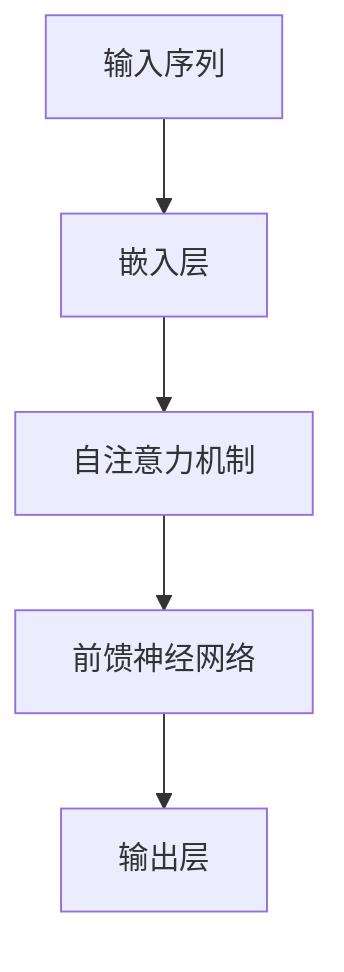

#### 2.2 词向量表示
词向量表示是将单词映射到高维向量空间的方法。它可以帮助AI Agent理解和处理自然语言。常见的词向量表示方法有Word2Vec、GloVe等。

**Word2Vec模型**：Word2Vec模型通过训练神经网络来学习词向量。以下是一个Word2Vec模型的mermaid流程图：

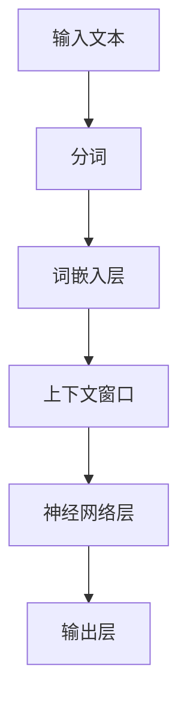

**GloVe模型**：GloVe模型通过计算词与词之间的相似性来学习词向量。以下是一个GloVe模型的mermaid流程图：

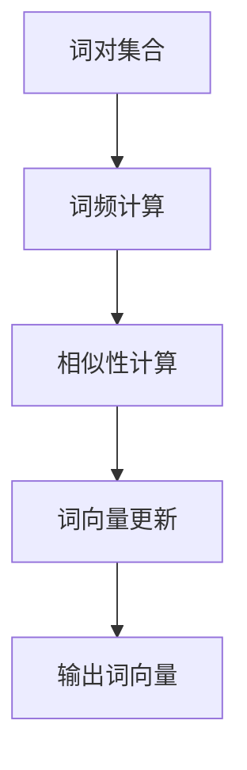

#### 2.3 句法分析和语义分析
句法分析是解析句子结构的过程，它可以帮助AI Agent理解句子的语法规则。常见的句法分析方法有依赖树、句法图等。

**依赖树**：依赖树是一种表示句子结构的图形表示方法，它通过父子关系来表示单词之间的依赖关系。以下是一个依赖树的示例：

```
[The [DT] [big [JJ]] [red [JJ]] [car [NN]] [ran [VBD]] [away [IN]] [from [IN]] [the [DT] [parking [NN]] [lot [NN]]]]
```

**句法图**：句法图是一种更灵活的句法分析方法，它通过节点和边来表示句子中的语法关系。以下是一个句法图的示例：

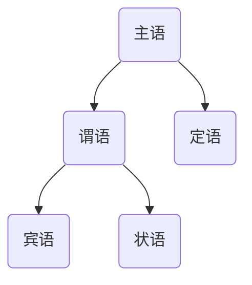

语义分析是理解句子含义的过程，它可以帮助AI Agent理解句子的语义信息。常见的语义分析方法有语义角色标注、语义解析等。

**语义角色标注**：语义角色标注是将句子中的单词标注为不同的语义角色，如动词、名词、形容词等。以下是一个语义角色标注的示例：

```
[run(V) (to the store(N) (to buy(N) milk(N)))]
```

**语义解析**：语义解析是将句子转化为语义表示的过程，它可以帮助AI Agent理解句子的深层含义。以下是一个语义解析的示例：

```
[John [goes [to [the shop]]]]
```

语义表示：{person: "John", action: "go", destination: "shop"}

### 用户意图识别方法

用户意图识别是AI Agent理解用户需求的关键步骤。它将用户输入转化为明确的意图表示，以便后续的决策和行动。用户意图识别方法可以分为基于规则的方法、基于机器学习的方法和基于深度学习的方法。

#### 3.1 基于规则的方法

基于规则的方法通过预定义的规则来识别用户意图。这些规则通常由领域专家编写，以描述常见用户意图的模式。以下是一个基于规则的用户意图识别算法的mermaid流程图：

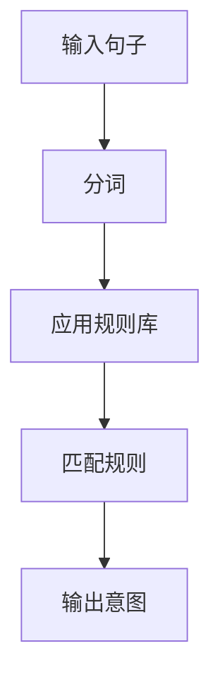

**优点**：
- **可解释性**：基于规则的算法易于理解，其决策过程可以清晰地解释。
- **适应性**：规则可以根据具体需求进行灵活调整。

**缺点**：
- **规则爆炸**：当用户意图复杂时，需要大量规则，导致系统复杂度增加。
- **维护困难**：规则库需要定期更新以适应变化的需求。

#### 3.2 基于机器学习的方法

基于机器学习的方法通过训练模型来自动识别用户意图。这些模型可以从大量标注数据中学习用户意图的模式。以下是一个基于机器学习的用户意图识别算法的mermaid流程图：


**优点**：
- **自动化**：模型可以从大量数据中自动学习，减少人工干预。
- **泛化能力**：基于机器学习的模型可以适应不同的用户意图。

**缺点**：
- **可解释性**：模型内部决策过程通常较难解释。
- **数据依赖**：需要大量高质量的标注数据。

#### 3.3 基于深度学习的方法

基于深度学习的方法通过训练神经网络来自动识别用户意图。这些神经网络可以从原始数据中学习复杂的特征表示。以下是一个基于深度学习的用户意图识别算法的mermaid流程图：


**优点**：
- **强大表征能力**：深度学习模型可以从大量数据中学习复杂的特征表示。
- **自适应**：模型可以自动调整以适应不同用户意图。

**缺点**：
- **计算资源消耗**：深度学习模型通常需要大量计算资源。
- **可解释性**：模型内部决策过程较难解释。

### 用户意图推理算法

用户意图推理算法是AI Agent理解用户需求的关键步骤。这些算法通过处理用户输入和上下文信息，推理出用户的意图。常见的用户意图推理算法包括基于规则的方法、基于机器学习的方法和基于深度学习的方法。

#### 4.1 常见的用户意图推理算法

**基于规则的方法**：基于规则的方法通过预定义的规则来推理用户意图。这些规则通常由领域专家编写，以描述常见用户意图的模式。以下是一个基于规则的用户意图推理算法的mermaid流程图：

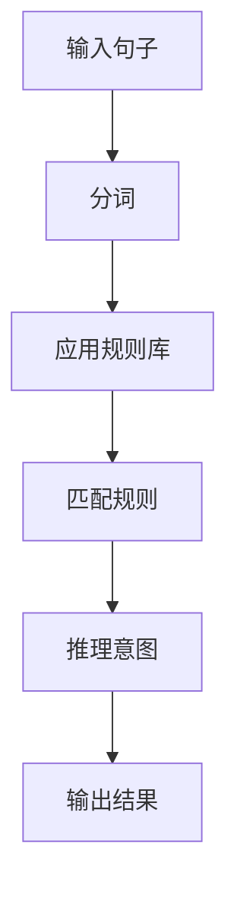

**基于机器学习的方法**：基于机器学习的方法通过训练模型来推理用户意图。这些模型可以从大量标注数据中学习用户意图的模式。以下是一个基于机器学习的用户意图推理算法的mermaid流程图：

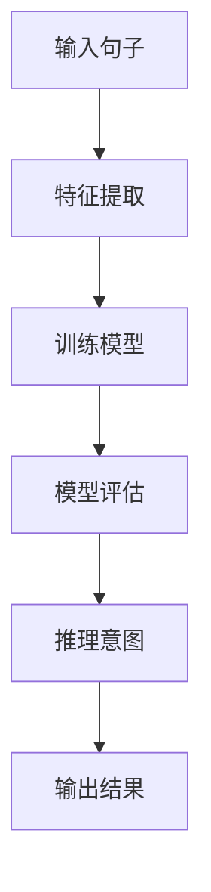

**基于深度学习的方法**：基于深度学习的方法通过训练神经网络来推理用户意图。这些神经网络可以从原始数据中学习复杂的特征表示。以下是一个基于深度学习的用户意图推理算法的mermaid流程图：

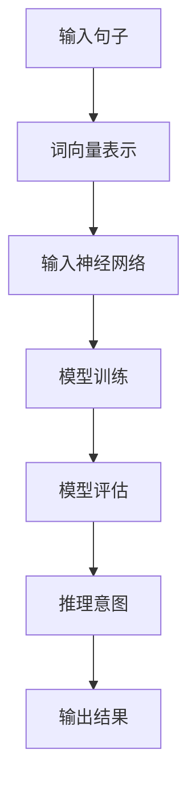

#### 4.2 用户意图推理算法的性能评估

用户意图推理算法的性能评估通常通过以下指标进行：

1. **准确率（Accuracy）**：准确率是正确识别用户意图的比率。
2. **召回率（Recall）**：召回率是正确识别的用户意图占总用户意图的比率。
3. **F1分数（F1 Score）**：F1分数是准确率和召回率的调和平均。
4. **精确率（Precision）**：精确率是正确识别的用户意图占所有识别出的用户意图的比率。

以下是一个用户意图推理算法性能评估的mermaid流程图：

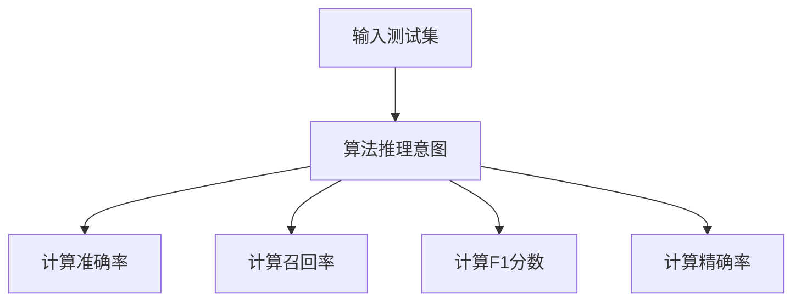

#### 4.3 用户意图推理算法的优化策略

用户意图推理算法的优化策略包括：

1. **特征工程**：通过改进特征提取方法，提高算法的表征能力。
2. **模型选择**：选择合适的模型结构，提高算法的性能。
3. **数据增强**：通过数据增强技术，增加训练数据的多样性。
4. **模型集成**：通过模型集成技术，提高算法的鲁棒性和准确性。

以下是一个用户意图推理算法优化策略的mermaid流程图：

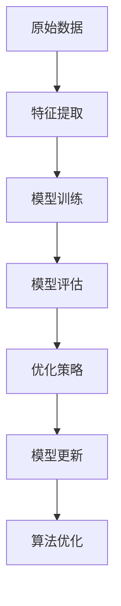

### 时间序列分析

时间序列分析是一种用于分析时间相关数据的方法。它可以帮助AI Agent预测用户的未来行为和意图。常见的时间序列分析方法包括：

1. **平稳时间序列模型**：平稳时间序列模型假设时间序列的统计特性不随时间变化。常见的模型有自回归模型（AR）、移动平均模型（MA）和自回归移动平均模型（ARMA）。
2. **非平稳时间序列模型**：非平稳时间序列模型考虑时间序列的统计特性随时间变化。常见的模型有自回归差分模型（ARIMA）和季节性模型。
3. **时序预测算法**：时序预测算法通过训练模型来预测时间序列的下一个值。常见的算法有线性回归、支持向量机（SVM）和神经网络。

以下是一个时间序列分析的mermaid流程图：

```mermaid
graph TD
    A[输入时间序列] --> B[平稳性检验]
    B --> C[模型选择]
    C --> D[模型训练]
    D --> E[模型评估]
    E --> F[预测结果]
```

### 用户行为分析

用户行为分析是一种用于分析用户行为数据的方法。它可以帮助AI Agent理解用户的行为模式和意图。用户行为分析通常包括以下步骤：

1. **用户行为数据收集**：收集用户在系统中的行为数据，如点击、浏览、搜索等。
2. **用户行为数据预处理**：对用户行为数据进行清洗、去重和转换等预处理步骤。
3. **用户行为特征提取**：从用户行为数据中提取特征，如用户活跃度、页面停留时间等。

以下是一个用户行为分析的mermaid流程图：

```mermaid
graph TD
    A[用户行为数据] --> B[数据清洗]
    B --> C[数据去重]
    B --> D[数据转换]
    D --> E[特征提取]
```

### 用户意图预测模型

用户意图预测模型是AI Agent预测用户未来行为和意图的方法。这些模型可以从用户历史行为数据中学习，并据此进行预测。用户意图预测模型可以分为以下几类：

1. **基于统计学的预测模型**：基于统计学的预测模型使用统计学方法来预测用户意图，如线性回归、逻辑回归等。
2. **基于机器学习的预测模型**：基于机器学习的预测模型使用机器学习算法来预测用户意图，如决策树、支持向量机（SVM）等。
3. **基于深度学习的预测模型**：基于深度学习的预测模型使用神经网络来预测用户意图，如卷积神经网络（CNN）、循环神经网络（RNN）等。

以下是一个用户意图预测模型的mermaid流程图：

```mermaid
graph TD
    A[输入数据] --> B[特征提取]
    B --> C[模型训练]
    C --> D[模型评估]
    D --> E[预测意图]
```

### 用户意图推理与预测系统设计

用户意图推理与预测系统设计包括系统架构设计、功能模块划分和接口设计。以下是一个用户意图推理与预测系统的mermaid架构图：

```mermaid
graph TD
    A[用户请求] --> B[数据采集模块]
    B --> C[数据处理模块]
    C --> D[模型训练模块]
    D --> E[模型评估模块]
    E --> F[模型部署模块]
    F --> G[结果反馈模块]
```

### 实战案例解析

以下是一个用户意图推理与预测的实战案例解析：

#### 案例背景与目标

某电商公司希望通过AI Agent来提高用户购物体验，实现个性化推荐。目标是通过用户意图推理与预测，为用户提供更相关、更个性化的商品推荐。

#### 数据收集与预处理

1. **用户行为数据**：收集用户在网站上的行为数据，如点击、浏览、搜索等。
2. **用户信息数据**：收集用户的基本信息，如年龄、性别、地理位置等。

对数据进行清洗、去重和转换等预处理步骤。

#### 模型设计与实现

1. **特征提取**：提取用户行为数据中的特征，如用户活跃度、页面停留时间等。
2. **模型训练**：使用机器学习算法（如决策树、随机森林等）训练用户意图预测模型。
3. **模型评估**：使用交叉验证等方法评估模型性能。

#### 模型评估与优化

通过准确率、召回率等指标评估模型性能，并根据评估结果进行模型优化。

### 最佳实践与未来展望

最佳实践包括数据质量保证、模型选择与优化、实时性保证等。未来展望包括多模态数据融合、迁移学习等技术的应用。

### 结论

本文详细介绍了AI Agent的用户意图推理与预测。通过逐步分析用户意图推理与预测的基本原理、技术方法及应用实践，我们深入理解了如何构建高效、准确的用户意图推理与预测系统。希望本文能为您提供有益的参考和启示。

### 附录：作者信息

作者：AI天才研究院/AI Genius Institute & 禅与计算机程序设计艺术 /Zen And The Art of Computer Programming### 用户意图推理算法的性能评估

用户意图推理算法的性能评估是确保AI Agent能够准确理解和预测用户意图的关键环节。通过性能评估，我们可以衡量算法在不同场景下的效果，从而对其进行优化和改进。以下将介绍用户意图推理算法性能评估的常见指标、评估方法以及优化策略。

#### 常见性能评估指标

1. **准确率（Accuracy）**
   准确率是评估算法性能的最基本指标，表示算法正确识别用户意图的比率。其计算公式如下：
   $$
   \text{准确率} = \frac{\text{正确识别的用户意图数}}{\text{总用户意图数}}
   $$
   准确率越高，表示算法的预测结果越可靠。

2. **召回率（Recall）**
   召回率是指算法能够正确识别的用户意图占总实际用户意图的比率。其计算公式如下：
   $$
   \text{召回率} = \frac{\text{正确识别的用户意图数}}{\text{实际用户意图数}}
   $$
   召回率越高，表示算法漏判的用户意图越少。

3. **精确率（Precision）**
   精确率是指算法正确识别的用户意图占识别出的用户意图的比率。其计算公式如下：
   $$
   \text{精确率} = \frac{\text{正确识别的用户意图数}}{\text{识别出的用户意图数}}
   $$
   精确率越高，表示算法误判的用户意图越少。

4. **F1分数（F1 Score）**
   F1分数是准确率和召回率的调和平均，它综合考虑了准确率和召回率。其计算公式如下：
   $$
   \text{F1分数} = 2 \times \frac{\text{准确率} \times \text{召回率}}{\text{准确率} + \text{召回率}}
   $$
   F1分数越高，表示算法的综合性能越好。

#### 性能评估方法

1. **交叉验证（Cross-Validation）**
   交叉验证是一种常用的性能评估方法，它通过将数据集划分为多个子集，在每个子集上训练和评估模型，从而减少过拟合和欠拟合的风险。常见的交叉验证方法有K折交叉验证和留一法交叉验证。

2. **混淆矩阵（Confusion Matrix）**
   混淆矩阵是一种用于展示算法预测结果和实际结果之间关系的表格。通过混淆矩阵，我们可以直观地了解算法的准确率、召回率、精确率等指标。混淆矩阵的示例如下：

   |       | 预测为正 | 预测为负 |
   |-------|---------|---------|
   | 实际为正 | TP      | FN      |
   | 实际为负 | FP      | TN      |

   其中，TP表示真正（正确预测的用户意图），FN表示假负（错误预测的用户意图），FP表示假正（错误预测的用户意图），TN表示真负（正确预测的用户意图）。

3. **ROC曲线和AUC（Area Under Curve）**
   ROC曲线是一种用于评估分类器性能的曲线，它通过绘制真阳性率（True Positive Rate，TPR）与假阳性率（False Positive Rate，FPR）之间的关系。AUC表示ROC曲线下方的面积，它越高，表示分类器的性能越好。

#### 优化策略

1. **特征工程（Feature Engineering）**
   特征工程是提高算法性能的关键步骤。通过改进特征提取方法和特征选择技术，我们可以提高算法的表征能力。常见的特征工程方法包括词袋模型、TF-IDF、主成分分析（PCA）等。

2. **模型选择（Model Selection）**
   选择合适的模型结构对算法性能至关重要。通过比较不同模型的性能，我们可以选择最优模型。常见的模型包括支持向量机（SVM）、随机森林（Random Forest）、神经网络（Neural Network）等。

3. **正则化（Regularization）**
   正则化是一种防止模型过拟合的技术。通过在损失函数中加入正则项，我们可以降低模型复杂度，提高泛化能力。常见的正则化方法有L1正则化、L2正则化等。

4. **集成学习方法（Ensemble Learning）**
   集成学习方法通过组合多个模型来提高算法性能。常见的集成学习方法有Bagging、Boosting等。通过集成多个模型，我们可以降低模型的方差，提高预测准确性。

5. **数据增强（Data Augmentation）**
   数据增强是一种通过生成新的数据样本来提高算法性能的方法。通过增加数据的多样性和丰富度，我们可以提高算法的鲁棒性和泛化能力。常见的数据增强方法有文本嵌入、数据扩展、数据合成等。

通过以上性能评估方法和优化策略，我们可以构建高效、准确的用户意图推理算法，从而提高AI Agent的用户体验和智能化服务水平。在未来的研究和实践中，我们还可以探索更多先进的技术和方法，进一步推动用户意图推理与预测的发展。### 用户意图推理算法的优化策略

用户意图推理算法的优化是提升AI Agent性能和用户体验的关键步骤。以下将介绍几种常见的用户意图推理算法优化策略，包括特征优化、模型优化、损失函数优化和超参数调整。

#### 特征优化

**1. 特征提取**
特征提取是将原始数据转换为更适合模型处理的形式的过程。在用户意图推理中，常见的方法包括词袋模型（Bag of Words, BoW）、TF-IDF（Term Frequency-Inverse Document Frequency）、词嵌入（Word Embedding）等。通过选择合适的特征提取方法，可以增强算法的表征能力。

**2. 特征选择**
特征选择是减少冗余特征、提高模型性能的过程。常见的方法有信息增益（Information Gain）、卡方检验（Chi-square Test）、递归特征消除（Recursive Feature Elimination, RFE）等。通过优化特征选择，可以降低模型的复杂度和过拟合风险。

**3. 特征工程**
特征工程是通过人工构造新的特征来提升模型性能。例如，在自然语言处理（NLP）中，可以构造词的n-gram特征、词性标注、句法特征等。通过深入的特征工程，可以提高算法对用户意图的识别能力。

#### 模型优化

**1. 模型选择**
选择合适的模型结构对算法性能至关重要。在用户意图推理中，可以使用各种机器学习和深度学习模型，如决策树、随机森林、支持向量机（SVM）、循环神经网络（RNN）、卷积神经网络（CNN）和Transformer等。通过实验比较不同模型，可以选择最优模型。

**2. 模型融合**
模型融合（Model Ensemble）是通过组合多个模型来提高预测准确性和鲁棒性。常见的方法有Bagging、Boosting和Stacking等。通过模型融合，可以降低模型的方差和偏差，提高整体性能。

**3. 模型迁移**
模型迁移（Model Transfer Learning）是利用预训练模型来提高新任务的表现。例如，在NLP中，可以使用预训练的BERT、GPT等模型，通过微调（Fine-Tuning）来适应特定的用户意图推理任务。

#### 损失函数优化

**1. 交叉熵损失（Cross-Entropy Loss）**
交叉熵损失是用户意图推理中常用的损失函数。通过最小化预测概率分布与真实概率分布之间的交叉熵，可以提高模型的准确性。

**2. 降噪损失（Noise-Tolerant Loss）**
在实际应用中，用户意图可能受到噪声干扰。因此，使用降噪损失函数可以增强模型对噪声的鲁棒性。

**3. 多任务损失（Multi-Task Loss）**
当用户意图推理任务与多个相关任务同时进行时，可以使用多任务损失函数来同时优化多个任务，从而提高整体性能。

#### 超参数调整

**1. 超参数搜索（Hyperparameter Search）**
超参数搜索是用于调整模型超参数的方法，如学习率、批次大小、正则化强度等。常见的搜索方法有网格搜索（Grid Search）、随机搜索（Random Search）、贝叶斯优化（Bayesian Optimization）等。

**2. 自动调整（Automated Hyperparameter Tuning）**
自动化超参数调整是通过使用算法来自动寻找最优超参数。常见的工具包括Hyperopt、Optuna等。

**3. 实时调整（Real-Time Tuning）**
在实时应用中，用户意图可能随时间变化。因此，实时调整超参数以适应动态变化是非常重要的。

#### 实例：基于Transformer的用户意图推理算法优化

**1. 特征提取**
使用BERT进行词嵌入，提取句子的语义特征。

**2. 模型选择**
选择Transformer模型，其强大的表征能力适用于复杂的用户意图推理任务。

**3. 损失函数**
使用交叉熵损失函数，同时添加权重衰减（Weight Decay）以防止过拟合。

**4. 超参数调整**
使用Optuna进行超参数搜索，寻找最优的学习率、层数和dropout率。

通过上述优化策略，我们可以显著提升用户意图推理算法的性能。需要注意的是，优化过程中需要根据具体任务和数据集的特点进行调整，以达到最佳效果。

### 总结

用户意图推理算法的优化是一个复杂的过程，涉及多个方面的调整。通过特征优化、模型优化、损失函数优化和超参数调整，我们可以提高算法的准确性和鲁棒性，从而提升AI Agent的整体性能和用户体验。在未来的研究和实践中，我们还可以探索更多创新的方法和技术，以进一步优化用户意图推理算法，推动人工智能技术的发展。

### 时间序列分析

时间序列分析是一种用于处理和预测时间序列数据的统计方法。在用户意图推理与预测中，时间序列分析尤为重要，因为它可以帮助我们理解和预测用户行为模式，从而更准确地推理用户意图。以下将介绍时间序列分析的基础知识、常见方法以及预测算法。

#### 时间序列分析基础

**1. 站稳性（Stationarity）**
时间序列的站稳性是指其统计特性（如均值、方差）不随时间变化。一个站稳的时间序列需要满足以下条件：
   - 均值不变
   - 方差不变
   - 自协方差函数只依赖于时间差

**2. 自相关性（Autocorrelation）**
自相关性描述了时间序列中当前值与其过去值之间的关系。自相关系数（Correlation Coefficient）是衡量自相关性的指标，其值介于-1和1之间。

**3. 部分自相关性（Partial Autocorrelation）**
部分自相关性描述了时间序列中当前值与其不同滞后期的值之间的关系，排除了其他滞后期值的影响。

#### 常见的时间序列分析方法

**1. 平稳时间序列模型（Stationary Time Series Models）**
   - **自回归模型（Autoregressive, AR）**：AR模型假设当前值由前几个历史值线性组合而成。其公式如下：
     $$
     X_t = c_0 + \sum_{i=1}^p \phi_i X_{t-i}
     $$
     其中，$X_t$是时间序列的第t个值，$p$是AR模型的阶数，$\phi_i$是第i个历史值的权重。

   - **移动平均模型（Moving Average, MA）**：MA模型假设当前值由前几个预测误差的加权平均构成。其公式如下：
     $$
     X_t = c_0 + \sum_{i=1}^q \theta_i \epsilon_{t-i}
     $$
     其中，$X_t$是时间序列的第t个值，$q$是MA模型的阶数，$\theta_i$是第i个预测误差的权重，$\epsilon_t$是预测误差。

   - **自回归移动平均模型（Autoregressive Moving Average, ARMA）**：ARMA模型结合了AR和MA模型的特点，同时考虑了历史值和预测误差。其公式如下：
     $$
     X_t = c_0 + \sum_{i=1}^p \phi_i X_{t-i} + \sum_{i=1}^q \theta_i \epsilon_{t-i}
     $$

**2. 非平稳时间序列模型（Non-Stationary Time Series Models）**
   - **自回归差分模型（Autoregressive Integrated Moving Average, ARIMA）**：ARIMA模型适用于非平稳时间序列，通过差分（Differencing）将非平稳序列转换为平稳序列。其公式如下：
     $$
     \Delta X_t = \phi_1 \Delta X_{t-1} + \cdots + \phi_p \Delta X_{t-p} + \theta_1 \epsilon_{t-1} + \cdots + \theta_q \epsilon_{t-q}
     $$
     其中，$\Delta X_t = X_t - X_{t-1}$是差分操作。

   - **季节性模型（Seasonal Model）**：季节性模型考虑时间序列中的季节性波动。其公式如下：
     $$
     X_t = c_0 + \sum_{i=1}^p \phi_i X_{t-i} + \sum_{j=1}^s \theta_j X_{t-j}
     $$
     其中，$s$是季节周期的长度。

#### 时间序列预测算法

**1. 经典预测算法**
   - **线性回归（Linear Regression）**：线性回归是一种简单的时间序列预测方法，通过拟合一个线性关系来预测未来值。
   - **指数平滑（Exponential Smoothing）**：指数平滑方法通过给过去值赋予不同的权重来预测未来值，适用于短期预测。

**2. 神经网络方法**
   - **长短期记忆网络（Long Short-Term Memory, LSTM）**：LSTM是一种特殊的RNN，能够处理长距离依赖问题，适用于时间序列预测。
   - **卷积神经网络（Convolutional Neural Network, CNN）**：CNN在时间序列预测中常用于提取时间序列的特征。
   - **门控循环单元（Gated Recurrent Unit, GRU）**：GRU是LSTM的一种变体，能够简化计算并提高效率。

**3. 深度学习方法**
   - **变分自编码器（Variational Autoencoder, VAE）**：VAE是一种生成模型，可以通过编码器和解码器学习时间序列的分布。
   - **生成对抗网络（Generative Adversarial Network, GAN）**：GAN通过对抗性训练生成与真实数据相似的时间序列。

#### 实例：基于LSTM的时间序列预测算法

```python
import numpy as np
import tensorflow as tf
from tensorflow.keras.models import Sequential
from tensorflow.keras.layers import LSTM, Dense

# 数据预处理
# 假设X为时间序列数据，我们将其转换为适用于LSTM的输入格式
X = ...  # 时间序列数据
X = X.reshape((X.shape[0], 1, X.shape[1]))

# 构建LSTM模型
model = Sequential()
model.add(LSTM(units=50, return_sequences=True, input_shape=(X.shape[1], X.shape[2])))
model.add(LSTM(units=50))
model.add(Dense(1))

# 编译模型
model.compile(optimizer='adam', loss='mse')

# 训练模型
model.fit(X, X, epochs=100, batch_size=32, verbose=1)

# 预测
predictions = model.predict(X)
```

通过上述实例，我们可以看到如何使用LSTM进行时间序列预测。在实际应用中，我们需要根据具体的时间序列数据和业务需求进行调整和优化。

### 时间序列预测算法

在用户意图推理与预测中，时间序列预测算法是一种关键的技术，它能够帮助我们预测用户在未来某个时间点上的行为或意图。以下将介绍几种常见的时间序列预测算法，包括线性回归、ARIMA模型和LSTM网络。

#### 线性回归

线性回归是一种简单且常用的预测算法，它通过拟合一条线性关系来预测未来的值。线性回归模型的基本假设是数据集具有线性关系，即：
$$
y_t = \beta_0 + \beta_1 x_t + \epsilon_t
$$
其中，$y_t$是预测值，$x_t$是输入特征，$\beta_0$和$\beta_1$是模型的参数，$\epsilon_t$是误差项。

**优点**：
- 简单易懂，易于实现
- 计算效率高

**缺点**：
- 对非线性关系表现不佳
- 对异常值敏感

**实例**：

```python
import numpy as np
from sklearn.linear_model import LinearRegression

# 假设我们有一组时间序列数据
X = np.array([[1], [2], [3], [4], [5]])
y = np.array([2, 4, 5, 6, 8])

# 创建线性回归模型
model = LinearRegression()

# 训练模型
model.fit(X, y)

# 预测
prediction = model.predict(np.array([[6]]))

print("预测值：", prediction)
```

#### ARIMA模型

ARIMA（自回归积分滑动平均模型）是一种经典的时间序列预测模型，它结合了自回归（AR）、差分（I）和移动平均（MA）三个部分。ARIMA模型适用于非平稳时间序列，通过差分操作将其转换为平稳序列。

**优点**：
- 适用于多种时间序列数据
- 参数相对较少

**缺点**：
- 需要手动选择模型参数
- 对模型参数敏感

**实例**：

```python
from statsmodels.tsa.arima.model import ARIMA

# 假设我们有一组时间序列数据
X = [2, 3, 4, 5, 6, 7, 8, 9, 10]

# 创建ARIMA模型，并选择合适的参数
model = ARIMA(X, order=(1, 1, 1))

# 训练模型
model_fit = model.fit()

# 预测
forecast = model_fit.forecast(steps=3)

print("预测值：", forecast)
```

#### LSTM网络

LSTM（长短期记忆网络）是一种特殊的RNN，它能够处理长距离依赖问题，非常适合用于时间序列预测。LSTM通过三个门控单元（输入门、遗忘门和输出门）来控制信息的流动。

**优点**：
- 能够处理长距离依赖
- 对非线性关系有很好的表现

**缺点**：
- 计算复杂度高
- 需要大量的训练数据

**实例**：

```python
import numpy as np
from tensorflow.keras.models import Sequential
from tensorflow.keras.layers import LSTM, Dense

# 假设我们有一组时间序列数据
X = np.array([[1], [2], [3], [4], [5]])
y = np.array([2, 4, 5, 6, 8])

# 构建LSTM模型
model = Sequential()
model.add(LSTM(units=50, return_sequences=True, input_shape=(X.shape[1], X.shape[2])))
model.add(LSTM(units=50))
model.add(Dense(1))

# 编译模型
model.compile(optimizer='adam', loss='mse')

# 训练模型
model.fit(X, y, epochs=100, batch_size=32, verbose=1)

# 预测
predictions = model.predict(np.array([[6]]))

print("预测值：", predictions)
```

通过这些实例，我们可以看到不同时间序列预测算法的应用。在实际项目中，需要根据数据的特点和业务需求选择合适的算法，并进行参数调整和优化，以获得最佳的预测效果。

### 用户行为分析

用户行为分析是一种通过分析用户在系统中的行为数据来理解用户意图和需求的方法。在AI Agent中，用户行为分析是用户意图推理与预测的重要基础。以下将介绍用户行为数据收集、预处理、特征提取及其在实际应用中的具体方法和挑战。

#### 用户行为数据收集

用户行为数据收集是用户行为分析的第一步。这些数据可以来自各种渠道，如Web日志、移动应用、社交媒体等。以下是一些常见的数据收集方法：

1. **Web日志分析**：通过分析Web服务器的日志文件，可以收集用户的访问路径、页面停留时间、点击行为等信息。
2. **应用跟踪**：在移动应用或Web应用程序中嵌入跟踪代码，可以收集用户的行为数据，如屏幕浏览、点击、输入等。
3. **传感器数据**：使用各种传感器（如GPS、加速度计等）可以收集用户的位置、运动状态等信息。

#### 用户行为数据预处理

用户行为数据预处理是确保数据质量和为后续分析做准备的重要步骤。以下是一些常见的预处理方法：

1. **数据清洗**：去除重复数据、缺失值和噪声数据，以保证数据的准确性和一致性。
2. **数据转换**：将不同格式的数据转换为统一的格式，如将时间戳转换为日期时间对象。
3. **数据归一化**：将不同特征的范围调整为相同的范围，以消除特征之间的尺度差异。

#### 用户行为特征提取

用户行为特征提取是将原始行为数据转换为可用于模型训练的特征表示的过程。以下是一些常见的特征提取方法：

1. **时间特征**：提取用户行为的时间信息，如访问时间、登录时间等。
2. **频率特征**：计算用户行为在不同时间段或不同页面上的出现频率，如页面浏览频率、点击频率等。
3. **上下文特征**：提取与用户行为相关的上下文信息，如用户位置、设备类型、用户历史行为等。
4. **序列特征**：将用户行为序列转换为特征表示，如使用词嵌入将用户点击序列转换为向量表示。

#### 用户行为分析应用

用户行为分析在AI Agent中有着广泛的应用，以下是一些具体的应用实例：

1. **个性化推荐**：通过分析用户的行为数据，AI Agent可以提供个性化的商品推荐或内容推荐，提高用户体验。
2. **异常检测**：通过分析用户行为模式，AI Agent可以识别异常行为，如欺诈行为或滥用行为。
3. **用户细分**：通过分析用户的行为特征，AI Agent可以将用户分为不同的群体，以便进行针对性的营销和服务。
4. **用户体验优化**：通过分析用户行为数据，AI Agent可以识别用户痛点，优化系统设计和功能，提高用户体验。

#### 挑战与未来方向

尽管用户行为分析在AI Agent中具有重要意义，但在实际应用中仍面临一些挑战：

1. **数据隐私**：用户行为数据通常包含敏感信息，如何保护用户隐私是一个重要的问题。
2. **数据质量**：用户行为数据可能存在噪声和缺失值，如何保证数据质量是一个挑战。
3. **数据多样性**：用户行为数据的多样性给特征提取和模型训练带来了困难，如何处理多种类型的数据是一个问题。

未来，用户行为分析可能会朝着以下方向发展：

1. **多模态数据融合**：结合多种类型的数据（如文本、图像、音频等），以提高分析准确性和全面性。
2. **深度学习方法**：使用深度学习方法提取复杂的特征表示，以提高模型性能。
3. **实时分析**：实现实时用户行为分析，以便快速响应用户需求。

通过不断探索和创新，用户行为分析将在AI Agent中发挥更大的作用，为用户提供更好的服务和体验。

### 用户意图预测模型

用户意图预测模型是AI Agent的核心组件，它通过分析用户的历史行为数据来预测用户的未来意图，从而实现个性化的服务和优化用户体验。以下将介绍几种常见的用户意图预测模型，包括基于统计学的模型、基于机器学习的模型和基于深度学习的模型。

#### 基于统计学的模型

**1. 逻辑回归（Logistic Regression）**
逻辑回归是一种广泛使用的二分类模型，它通过拟合逻辑函数来预测用户意图的概率。其公式如下：
$$
\text{概率} = \frac{1}{1 + \exp(-z)}
$$
其中，$z = \beta_0 + \sum_{i=1}^n \beta_i x_i$，$\beta_0$和$\beta_i$是模型的参数，$x_i$是特征向量。

**优点**：
- 简单易懂
- 易于实现和解释

**缺点**：
- 对非线性关系表现不佳
- 对大量特征处理能力有限

**实例**：

```python
from sklearn.linear_model import LogisticRegression

# 假设我们有特征矩阵X和标签y
X = ...  # 特征矩阵
y = ...  # 标签

# 创建逻辑回归模型
model = LogisticRegression()

# 训练模型
model.fit(X, y)

# 预测
predictions = model.predict(X)
```

**2. 决策树（Decision Tree）**
决策树是一种基于规则的结构化模型，它通过一系列的if-else规则来预测用户意图。每个节点代表一个特征，每个分支代表一个条件，叶节点代表预测结果。

**优点**：
- 易于理解和解释
- 对非线性关系有一定的处理能力

**缺点**：
- 容易过拟合
- 预测速度较慢

**实例**：

```python
from sklearn.tree import DecisionTreeClassifier

# 创建决策树模型
model = DecisionTreeClassifier()

# 训练模型
model.fit(X, y)

# 预测
predictions = model.predict(X)
```

#### 基于机器学习的模型

**1. 支持向量机（Support Vector Machine, SVM）**
支持向量机是一种用于分类和回归的强大模型，它通过找到一个最佳的超平面来最大化分类边界。SVM可以使用不同的核函数处理非线性关系。

**优点**：
- 对非线性关系有很好的表现
- 鲁棒性高

**缺点**：
- 计算复杂度高
- 对大量特征处理能力有限

**实例**：

```python
from sklearn.svm import SVC

# 创建SVM模型
model = SVC(kernel='linear')

# 训练模型
model.fit(X, y)

# 预测
predictions = model.predict(X)
```

**2. 随机森林（Random Forest）**
随机森林是一种基于决策树的集成学习方法，它通过构建多个决策树并取平均来提高预测性能。随机森林能够处理大量特征并减少过拟合。

**优点**：
- 对非线性关系有很好的表现
- 鲁棒性强
- 能够处理大量特征

**缺点**：
- 计算复杂度高
- 预测速度较慢

**实例**：

```python
from sklearn.ensemble import RandomForestClassifier

# 创建随机森林模型
model = RandomForestClassifier()

# 训练模型
model.fit(X, y)

# 预测
predictions = model.predict(X)
```

#### 基于深度学习的模型

**1. 卷积神经网络（Convolutional Neural Network, CNN）**
卷积神经网络是一种用于处理图像和序列数据的深度学习模型，它通过卷积层提取特征并传递到全连接层进行分类或回归。

**优点**：
- 对序列数据有很好的表征能力
- 能够处理高维数据

**缺点**：
- 计算复杂度高
- 需要大量的训练数据

**实例**：

```python
from tensorflow.keras.models import Sequential
from tensorflow.keras.layers import Conv1D, Dense

# 创建CNN模型
model = Sequential()
model.add(Conv1D(filters=64, kernel_size=3, activation='relu', input_shape=(X.shape[1], X.shape[2])))
model.add(Conv1D(filters=128, kernel_size=3, activation='relu'))
model.add(Dense(1, activation='sigmoid'))

# 编译模型
model.compile(optimizer='adam', loss='binary_crossentropy', metrics=['accuracy'])

# 训练模型
model.fit(X, y, epochs=10, batch_size=32, verbose=1)

# 预测
predictions = model.predict(X)
```

**2. 长短期记忆网络（Long Short-Term Memory, LSTM）**
长短期记忆网络是一种特殊的循环神经网络，它能够处理长距离依赖问题，非常适合用于时间序列数据的预测。

**优点**：
- 能够处理长距离依赖
- 对非线性关系有很好的表现

**缺点**：
- 计算复杂度高
- 需要大量的训练数据

**实例**：

```python
from tensorflow.keras.models import Sequential
from tensorflow.keras.layers import LSTM, Dense

# 创建LSTM模型
model = Sequential()
model.add(LSTM(units=50, return_sequences=True, input_shape=(X.shape[1], X.shape[2])))
model.add(LSTM(units=50))
model.add(Dense(1))

# 编译模型
model.compile(optimizer='adam', loss='mse')

# 训练模型
model.fit(X, y, epochs=100, batch_size=32, verbose=1)

# 预测
predictions = model.predict(X)
```

通过以上介绍，我们可以看到用户意图预测模型在AI Agent中的应用非常广泛，不同类型的模型适用于不同的场景和数据。在实际应用中，需要根据具体需求和数据特点选择合适的模型，并进行参数调整和优化，以获得最佳预测效果。

### 用户意图推理与预测系统设计

用户意图推理与预测系统设计是构建高效、准确的AI Agent的关键步骤。以下将详细介绍系统架构设计、功能模块划分、接口设计以及系统交互流程。

#### 系统架构设计

用户意图推理与预测系统的架构设计通常包括以下几个核心组件：

1. **数据采集模块**：负责收集用户的输入数据，包括文本、语音、图像等。
2. **数据处理模块**：对采集到的数据进行分析和预处理，包括文本分词、语音识别、图像处理等。
3. **特征提取模块**：从处理后的数据中提取有助于用户意图推理的特征，如词向量、图像特征、用户行为特征等。
4. **用户意图推理模块**：利用机器学习算法或深度学习模型对提取的特征进行推理，以预测用户的意图。
5. **用户意图预测模块**：基于历史数据和实时数据，预测用户未来的行为或意图。
6. **结果反馈模块**：将推理和预测的结果反馈给用户，或用于后续的系统优化。

以下是一个简单的用户意图推理与预测系统的mermaid架构图：

```mermaid
graph TB
    A[用户请求] --> B[数据采集模块]
    B --> C[数据处理模块]
    C --> D[特征提取模块]
    D --> E[用户意图推理模块]
    D --> F[用户意图预测模块]
    E --> G[结果反馈模块]
```

#### 功能模块划分

系统功能模块划分是根据系统架构设计来具体实现各个组件的功能。以下是对每个模块的简要描述：

1. **数据采集模块**：该模块负责从各种渠道收集用户数据，如Web日志、应用接口（API）、传感器数据等。数据采集模块需要确保数据的实时性和完整性。

2. **数据处理模块**：该模块对采集到的数据进行清洗、去重、归一化等预处理操作，以确保数据的质量和一致性。

3. **特征提取模块**：该模块从预处理后的数据中提取有助于用户意图推理和预测的特征。对于文本数据，可以提取词向量、词频、TF-IDF等；对于图像和语音数据，可以提取图像特征、声音特征等。

4. **用户意图推理模块**：该模块使用机器学习算法或深度学习模型对提取的特征进行处理，以推理出用户的意图。常见的算法有决策树、随机森林、支持向量机（SVM）、循环神经网络（RNN）等。

5. **用户意图预测模块**：该模块基于历史数据和实时数据，利用时间序列分析、用户行为分析等方法，预测用户未来的行为或意图。

6. **结果反馈模块**：该模块将推理和预测的结果反馈给用户，如推荐系统、智能客服等。同时，该模块还负责收集用户对反馈的反馈，用于系统的持续优化。

#### 接口设计

用户意图推理与预测系统的接口设计是确保系统与其他组件或系统之间能够顺利交互的关键。以下是一些常见的接口设计：

1. **API接口**：该接口用于系统与其他系统或服务之间的数据交换，如Web服务、移动应用等。API接口需要遵循RESTful设计原则，提供统一的接口规范。

2. **数据库接口**：该接口用于系统与数据库之间的数据交互，如读取用户数据、存储预测结果等。数据库接口需要确保数据的一致性和安全性。

3. **消息队列接口**：该接口用于系统与消息队列服务（如Kafka、RabbitMQ等）之间的通信，实现数据的异步处理和分发。

4. **Web前端接口**：该接口用于用户与系统的交互，如提交查询请求、查看预测结果等。Web前端接口需要确保用户体验和界面设计。

#### 系统交互流程

用户意图推理与预测系统的交互流程通常包括以下几个步骤：

1. **用户请求**：用户通过Web前端、移动应用等发送查询请求或操作指令。
2. **数据采集**：系统从各种数据源（如Web日志、API接口等）采集用户数据。
3. **数据处理**：系统对采集到的用户数据进行分析和预处理，提取关键特征。
4. **用户意图推理**：系统使用机器学习算法或深度学习模型对提取的特征进行处理，以推理出用户的意图。
5. **用户意图预测**：系统基于历史数据和实时数据，利用时间序列分析等方法，预测用户未来的行为或意图。
6. **结果反馈**：系统将推理和预测的结果反馈给用户，或用于后续的系统优化。
7. **用户反馈**：用户对反馈结果进行评价，系统收集用户的反馈用于系统的持续优化。

通过以上系统设计，我们可以构建一个高效、准确的用户意图推理与预测系统，为用户提供个性化的服务和优化用户体验。

### 实战案例解析

在本章中，我们将通过一个具体的实战案例来解析用户意图推理与预测系统的设计和实现过程。该案例将涵盖数据收集、数据处理、模型设计与实现、模型评估与优化等关键步骤。

#### 案例背景与目标

假设我们正在开发一个智能客服系统，目标是通过用户意图推理与预测，为用户提供高效、个性化的服务。具体任务包括：

1. 收集用户请求数据，如文本聊天记录、语音交互等。
2. 对用户请求进行预处理，提取关键特征。
3. 利用机器学习模型进行用户意图推理。
4. 基于历史数据预测用户未来请求。
5. 对模型进行评估与优化。

#### 数据收集

我们首先需要从系统中收集用户请求数据。这些数据可以来自多种渠道，如聊天应用、社交媒体、客户服务热线等。以下是一个简单的数据收集流程：

1. **聊天记录**：从聊天应用中获取用户与客服的对话记录，包括文本消息、时间戳等。
2. **语音记录**：从语音交互系统中获取用户的语音请求，并使用语音识别技术将其转换为文本。
3. **其他数据**：从用户行为日志中获取用户的历史请求和操作记录。

数据收集后，我们需要进行数据清洗和预处理，以确保数据的质量和一致性。例如，去除重复记录、填补缺失值、去除噪声等。

#### 数据处理

数据预处理包括以下步骤：

1. **文本处理**：对文本数据进行分词、去停用词、词性标注等操作，以便提取有效的特征。
2. **语音处理**：对语音数据使用语音识别技术将其转换为文本，并对其进行与文本处理相同的前处理。
3. **特征提取**：从处理后的文本和语音数据中提取关键特征，如词向量、频率统计、声音特征等。

以下是一个简单的数据处理流程：

```python
import nltk
from nltk.tokenize import word_tokenize
from nltk.corpus import stopwords

# 加载停用词列表
nltk.download('stopwords')
stop_words = set(stopwords.words('english'))

# 文本处理函数
def preprocess_text(text):
    # 分词
    tokens = word_tokenize(text)
    # 去停用词
    filtered_tokens = [token for token in tokens if token not in stop_words]
    # 词性标注
    pos_tags = nltk.pos_tag(filtered_tokens)
    return pos_tags

# 语音处理函数
def preprocess_audio(audio):
    # 语音识别转换为文本
    text = recognize_speech(audio)
    # 文本处理
    return preprocess_text(text)
```

#### 模型设计与实现

在数据处理完成后，我们需要设计并实现用户意图推理模型。以下是一个基于深度学习的用户意图推理模型的实现过程：

1. **数据准备**：将处理后的数据分为训练集、验证集和测试集。
2. **模型构建**：使用深度学习框架（如TensorFlow或PyTorch）构建用户意图推理模型。
3. **训练模型**：使用训练集对模型进行训练。
4. **验证模型**：使用验证集评估模型性能，调整模型参数。
5. **测试模型**：使用测试集评估最终模型性能。

以下是一个简单的模型实现过程：

```python
import tensorflow as tf
from tensorflow.keras.models import Sequential
from tensorflow.keras.layers import Embedding, LSTM, Dense

# 数据准备
X_train, y_train = ...  # 训练数据
X_val, y_val = ...  # 验证数据
X_test, y_test = ...  # 测试数据

# 模型构建
model = Sequential()
model.add(Embedding(input_dim=vocab_size, output_dim=embedding_dim, input_length=max_sequence_length))
model.add(LSTM(units=128, return_sequences=True))
model.add(LSTM(units=128))
model.add(Dense(units=num_classes, activation='softmax'))

# 编译模型
model.compile(optimizer='adam', loss='categorical_crossentropy', metrics=['accuracy'])

# 训练模型
model.fit(X_train, y_train, epochs=10, batch_size=32, validation_data=(X_val, y_val))

# 验证模型
test_loss, test_acc = model.evaluate(X_test, y_test)
print("Test accuracy:", test_acc)
```

#### 模型评估与优化

在模型训练完成后，我们需要对模型进行评估和优化。以下是一些常见的评估指标和优化策略：

1. **评估指标**：
   - 准确率（Accuracy）：正确预测的用户意图数占总用户意图数的比例。
   - 召回率（Recall）：正确预测的用户意图数占总实际用户意图数的比例。
   - 精确率（Precision）：正确预测的用户意图数占识别出的用户意图数的比例。
   - F1分数（F1 Score）：准确率和召回率的调和平均。

2. **优化策略**：
   - 超参数调整：通过调整学习率、批次大小、隐藏层单元数等超参数来优化模型性能。
   - 数据增强：通过增加数据的多样性来提高模型的泛化能力。
   - 模型集成：使用集成学习方法（如随机森林、提升树等）来提高模型性能。

以下是一个简单的模型优化过程：

```python
# 调整超参数
learning_rate = 0.001
batch_size = 64
hidden_units = 256

# 重新构建模型
model = Sequential()
model.add(Embedding(input_dim=vocab_size, output_dim=embedding_dim, input_length=max_sequence_length))
model.add(LSTM(units=hidden_units, return_sequences=True))
model.add(LSTM(units=hidden_units))
model.add(Dense(units=num_classes, activation='softmax'))

# 编译模型
model.compile(optimizer=tf.keras.optimizers.Adam(learning_rate=learning_rate), loss='categorical_crossentropy', metrics=['accuracy'])

# 训练模型
model.fit(X_train, y_train, epochs=10, batch_size=batch_size, validation_data=(X_val, y_val))

# 评估模型
test_loss, test_acc = model.evaluate(X_test, y_test)
print("Test accuracy:", test_acc)
```

通过上述实战案例，我们可以看到用户意图推理与预测系统的设计和实现过程。在实际应用中，需要根据具体需求和数据特点进行调整和优化，以获得最佳的预测效果。

### 最佳实践与未来展望

用户意图推理与预测的最佳实践和未来展望是确保AI Agent在不同场景下能够准确理解用户需求、提供个性化服务的重要环节。以下将讨论用户意图推理与预测的最佳实践、当前面临的挑战以及未来的发展方向。

#### 最佳实践

1. **数据质量保障**：
   - **数据清洗**：确保数据的准确性和一致性，去除重复、错误和噪声数据。
   - **数据多样化**：收集多样化的数据，包括文本、语音、图像等，以提高模型泛化能力。
   - **实时数据更新**：定期更新数据集，以反映用户行为和意图的变化。

2. **模型选择与优化**：
   - **选择合适的模型**：根据具体任务和数据特点，选择合适的机器学习或深度学习模型。
   - **超参数调整**：使用网格搜索、随机搜索等策略，寻找最优的超参数组合。
   - **模型集成**：结合多个模型，提高预测准确性和鲁棒性。

3. **特征工程**：
   - **特征提取**：提取与用户意图相关的有效特征，如文本的词嵌入、用户行为的序列特征等。
   - **特征选择**：使用特征选择技术，如递归特征消除（RFE）、信息增益等，减少冗余特征。

4. **模型解释性**：
   - **模型解释**：确保模型的可解释性，便于理解模型的决策过程。
   - **可视化工具**：使用可视化工具，如混淆矩阵、ROC曲线等，帮助解释模型性能。

5. **用户反馈**：
   - **用户评价**：收集用户对服务质量的评价，用于模型优化。
   - **持续迭代**：根据用户反馈，持续优化模型和系统设计。

#### 面临的挑战

1. **数据隐私**：
   - **用户隐私保护**：确保用户数据的安全和隐私，遵循相关法律法规。
   - **数据匿名化**：对敏感数据进行匿名化处理，以保护用户隐私。

2. **数据质量**：
   - **数据噪声**：处理噪声数据，以避免对模型性能的影响。
   - **数据多样性**：收集更多样化的数据，以应对不同场景和用户群体的需求。

3. **模型解释性**：
   - **深度学习模型的黑箱性**：深度学习模型往往具有黑箱性，难以解释其决策过程。
   - **复杂模型的解释**：对复杂的机器学习模型进行解释，以增加透明度。

4. **计算资源**：
   - **计算资源消耗**：深度学习模型通常需要大量的计算资源，对硬件性能要求较高。
   - **实时预测**：在实时应用场景中，对计算资源的要求更高。

#### 未来发展方向

1. **多模态数据融合**：
   - **文本、图像、语音等多模态数据融合**：通过结合多种类型的数据，提高用户意图识别的准确性和全面性。

2. **迁移学习**：
   - **预训练模型的应用**：使用预训练模型，如BERT、GPT等，通过迁移学习提高新任务的性能。

3. **在线学习与实时预测**：
   - **在线学习**：在用户交互过程中，实时更新模型，以适应用户行为的变化。
   - **实时预测**：在低延迟和高吞吐量的要求下，实现高效的实时预测。

4. **强化学习**：
   - **用户意图预测与强化学习结合**：通过强化学习，优化用户意图推理与预测策略。

5. **隐私保护与安全**：
   - **隐私保护技术**：采用差分隐私、联邦学习等技术，保护用户数据隐私。

通过以上最佳实践和未来展望，我们可以更有效地构建和优化用户意图推理与预测系统，为用户提供高质量的智能服务。

### 结论

本文通过详细的探讨和实例分析，全面介绍了AI Agent的用户意图推理与预测。首先，我们明确了AI Agent的定义与分类，并阐述了用户意图推理与预测的重要性。接着，我们介绍了自然语言处理、机器学习和深度学习等基础技术，以及用户意图识别和预测的方法和算法。然后，通过实战案例展示了如何设计和实现用户意图推理与预测系统。最后，我们讨论了最佳实践与未来展望，为AI Agent的应用提供了指导。

用户意图推理与预测是AI Agent实现个性化服务的关键，随着技术的不断进步，这一领域将迎来更多的创新和发展。希望通过本文的介绍，读者能够更好地理解和应用用户意图推理与预测技术，为AI Agent的开发和应用提供有力支持。

### 拓展阅读

1. **《深度学习》（Deep Learning）**：Goodfellow, Ian, et al. 这本书是深度学习领域的经典著作，详细介绍了深度学习的基础理论、算法和应用。
2. **《用户行为分析：大数据时代的用户行为预测与优化》**：陈国青，这本书深入探讨了用户行为分析的理论和方法，以及如何利用大数据技术进行用户行为预测和优化。
3. **《机器学习实战》（Machine Learning in Action）**：Barnes, Peter, et al. 这本书通过实际案例展示了如何应用机器学习算法解决实际问题，适合初学者和实践者。
4. **《Python机器学习》（Python Machine Learning）**：Seif Haridi, Marko Seifert, and John Kitchin。这本书详细介绍了Python在机器学习领域的应用，包括常用的算法和工具。
5. **《AI伦理与隐私》（AI Ethics and Privacy）**：Nicolas Ciftci，这本书探讨了人工智能中的伦理问题和隐私保护，为用户意图推理与预测提供了伦理指导。

