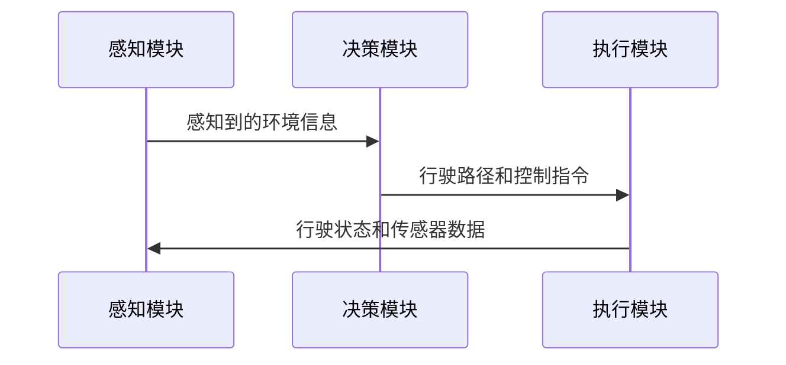

                 

# 第二部分: 核心概念与联系

## 2.1 AI Agent的定义与特点
AI Agent，即人工智能代理，是一种能够在特定环境中自主执行任务的计算机程序。它通过感知、理解和交互来完成任务，具有以下特点：

- **自主性**：AI Agent能够独立做出决策，无需人工干预。
- **适应性**：AI Agent能够适应环境变化，通过学习调整自己的行为。
- **交互性**：AI Agent能够与环境和用户进行有效的互动。

AI Agent的应用范围广泛，包括但不限于自动化系统、智能机器人、自动驾驶车辆等。

## 2.2 认知地图的原理与结构
认知地图（Cognitive Map）是心理地理学的概念，用来描述个体对环境的内部表征。在AI Agent的背景下，认知地图是一种数据结构，用来表示AI Agent对环境空间的理解。

### 原理
- **空间感知**：AI Agent通过传感器收集环境信息，如位置、方向等。
- **空间记忆**：AI Agent将这些信息编码并存储在内存中，形成对环境的记忆。
- **空间推理**：AI Agent利用记忆进行推理，以预测未来事件或规划路径。

### 结构
认知地图通常由以下几个模块组成：

- **感知模块**：负责接收和处理环境信息。
- **记忆模块**：负责存储环境信息。
- **推理模块**：负责利用记忆信息进行推理。

## 2.3 空间信息的表示方法
空间信息在AI Agent中的表示是构建认知地图的关键。常用的表示方法包括：

- **位置表示**：使用坐标系统（如笛卡尔坐标系）来表示物体的位置。
- **方向表示**：使用角度或向量来表示物体的方向。
- **拓扑结构**：使用图论中的拓扑结构来表示空间关系，如路径、连通性等。

## 2.4 AI Agent与认知地图的关系
AI Agent通过构建和利用认知地图来实现对环境的理解和交互：

- **理解环境**：认知地图帮助AI Agent构建对环境的抽象表示，从而更好地理解环境。
- **交互决策**：AI Agent利用认知地图中的信息进行路径规划、目标定位等决策。

## 2.5 概念属性特征对比表格
下面是一个简单的对比表格，列出AI Agent、认知地图和空间信息的核心属性特征：

| 概念       | 属性特征 |
|------------|----------|
| AI Agent   | 自主性、适应性、交互性 |
| 认知地图   | 空间感知、空间记忆、空间推理 |
| 空间信息   | 位置、方向、拓扑结构 |

## 2.6 ER实体关系图
下面是使用Mermaid绘制的ER实体关系图，展示了AI Agent、认知地图和空间信息之间的关系：

```mermaid
erDiagram
AI-Agent ||--|{ Cognitive_Map }| "构建"
AI-Agent ||--|{ Spatial_Information }| "利用"

Cognitive_Map ||--|{ Perception_Module }| "包含"
Cognitive_Map ||--|{ Memory_Module }| "包含"
Cognitive_Map ||--|{ Reasoning_Module }| "包含"

Spatial_Information ||--|{ Position }| "包含"
Spatial_Information ||--|{ Direction }| "包含"
Spatial_Information ||--|{ Topological_Structure }| "包含"
```

通过以上对核心概念与联系的分析，我们可以为后续的算法原理讲解、系统分析与架构设计、项目实战和最佳实践提供了坚实的基础。接下来，我们将深入探讨AI Agent的认知地图构建中的具体算法原理。# 第三部分：算法原理讲解

## 3.1 算法概述
在本部分，我们将介绍一种用于构建AI Agent认知地图的算法。该算法旨在通过空间信息的表示与利用，提高AI Agent在复杂环境中的决策能力。算法的基本流程如下：

1. **感知**：AI Agent通过传感器收集环境信息，如位置、方向等。
2. **编码**：将感知到的信息编码为内部表示，存储在认知地图中。
3. **推理**：利用认知地图中的信息进行推理，为决策提供支持。
4. **更新**：根据AI Agent的行动结果，更新认知地图中的信息。

## 3.2 算法mermaid流程图
以下是一个使用Mermaid绘制的算法流程图：


## 3.3 算法原理详细讲解
### 感知
AI Agent通过传感器（如摄像头、GPS等）收集环境信息。这些信息通常包括位置、方向、速度等。

### 编码
收集到的环境信息被编码为内部表示，存储在认知地图中。编码过程包括：

- **位置表示**：使用坐标系统（如笛卡尔坐标系）来表示物体的位置。
- **方向表示**：使用角度或向量来表示物体的方向。
- **拓扑结构表示**：使用图论中的拓扑结构来表示空间关系。

### 推理
AI Agent利用认知地图中的信息进行推理，以预测未来事件或规划路径。推理过程包括：

- **路径规划**：根据目标位置和当前环境信息，规划最佳路径。
- **目标定位**：根据环境信息和目标特征，确定目标位置。

### 更新
AI Agent在行动后，根据行动结果更新认知地图中的信息。更新过程包括：

- **信息修正**：根据感知到的实际环境信息，修正认知地图中的错误。
- **信息扩展**：根据新收集到的信息，扩展认知地图的表示。

## 3.4 数学模型与公式
在算法中，我们使用以下数学模型和公式来表示和计算空间信息：

### 位置表示
$$
\text{position} = (x, y, z)
$$

### 方向表示
$$
\text{direction} = \theta
$$

### 拓扑结构表示
$$
G = (V, E)
$$

其中，$V$表示节点（代表物体或位置），$E$表示边（代表物体之间的空间关系）。

## 3.5 举例说明
假设一个自动驾驶车辆在环境中移动，我们需要为其构建一个认知地图。

1. **感知**：车辆通过摄像头和GPS收集到当前位置和周围环境信息。
2. **编码**：将收集到的信息编码为内部表示，如位置$(x, y, z)$和方向$\theta$。
3. **推理**：车辆利用认知地图中的信息进行路径规划和目标定位。
4. **更新**：车辆在行驶过程中，根据传感器信息更新认知地图。

通过这个过程，自动驾驶车辆能够更好地理解环境，提高行驶安全性。

以上是对算法原理的详细讲解。接下来，我们将进入系统分析与架构设计部分，进一步探讨如何在实际项目中实现这些算法。# 第四部分：系统分析与架构设计

## 4.1 问题场景介绍
在本部分，我们将探讨一个典型的应用场景：自动驾驶车辆。自动驾驶车辆需要在复杂的城市环境中导航，避开障碍物，并按照预定的路线行驶。为了实现这一目标，我们需要一个高效的系统来处理和利用空间信息。

## 4.2 系统功能设计
系统功能设计是系统架构设计的基础。针对自动驾驶车辆场景，系统的主要功能包括：

- **感知模块**：负责收集车辆周围的环境信息，如道路、障碍物、行人等。
- **决策模块**：负责分析感知模块收集到的信息，并规划车辆的行驶路径。
- **执行模块**：负责控制车辆的实际行动，如加速、减速、转向等。

## 4.3 系统架构设计
系统架构设计是系统实现的核心。针对自动驾驶车辆场景，我们采用分层架构设计，分为感知层、决策层和执行层。

### 感知层
感知层负责收集环境信息，主要包括：

- **摄像头**：用于获取道路和周围物体的图像。
- **GPS**：用于获取车辆的地理位置信息。
- **激光雷达**：用于获取车辆周围的3D空间信息。

### 决策层
决策层负责分析感知层收集到的信息，并规划行驶路径，主要包括：

- **地图解析器**：用于处理地图数据，提取道路和障碍物的信息。
- **路径规划算法**：用于根据车辆当前位置和目标位置，规划最佳行驶路径。

### 执行层
执行层负责控制车辆的实际行动，主要包括：

- **控制模块**：用于根据决策层提供的行驶路径，控制车辆的加速、减速和转向。
- **传感器融合模块**：用于整合摄像头、GPS和激光雷达等传感器的数据，提高环境感知的准确性。

## 4.4 系统接口设计
系统接口设计是系统各层之间通信的桥梁。以下是系统的主要接口设计：

- **感知接口**：用于传感器与感知模块之间的数据通信。
- **决策接口**：用于感知模块与决策模块之间的数据通信。
- **执行接口**：用于决策模块与执行模块之间的数据通信。

## 4.5 系统交互序列图
以下是一个使用Mermaid绘制的系统交互序列图，展示了感知层、决策层和执行层之间的交互过程：



通过以上系统分析与架构设计，我们为自动驾驶车辆提供了一个全面、高效的解决方案。接下来，我们将进入项目实战部分，介绍如何实现这个系统。# 第五部分：项目实战

## 5.1 环境安装

在开始项目实战之前，我们需要安装一些必要的软件和库。以下是安装步骤：

1. **Python环境安装**：确保您的计算机上已经安装了Python 3.7及以上版本。您可以从[Python官网](https://www.python.org/)下载并安装。
2. **Anaconda安装**：推荐使用Anaconda来管理Python环境。Anaconda提供了一个集成的Python环境，包括常用的数据科学和机器学习库。您可以从[Anaconda官网](https://www.anaconda.com/)下载并安装。
3. **安装所需库**：打开命令行窗口，执行以下命令来安装所需的库：

```bash
conda install -c conda-forge opencv numpy matplotlib
```

## 5.2 系统核心实现

### 感知模块实现
感知模块负责收集环境信息。以下是一个简单的感知模块实现，使用OpenCV库来处理摄像头数据：

```python
import cv2

def capture_environment(camera_id):
    # 打开摄像头
    cap = cv2.VideoCapture(camera_id)
    
    while True:
        # 读取摄像头一帧
        ret, frame = cap.read()
        
        if not ret:
            print("无法捕获图像")
            break
        
        # 显示摄像头图像
        cv2.imshow('Environment', frame)
        
        # 按'q'键退出循环
        if cv2.waitKey(1) & 0xFF == ord('q'):
            break
    
    # 释放摄像头资源
    cap.release()
    cv2.destroyAllWindows()
```

### 决策模块实现
决策模块负责分析感知模块收集到的信息，并规划行驶路径。以下是一个简单的决策模块实现，使用Dijkstra算法进行路径规划：

```python
import numpy as np

def dijkstra(graph, start, end):
    # 初始化距离数组
    distances = {node: float('infinity') for node in graph}
    distances[start] = 0
    
    # 初始化已访问节点数组
    visited = set()
    
    while len(visited) < len(graph):
        # 找到未访问节点中距离最短的节点
        current = min((distance, node) for node, distance in distances.items() if node not in visited)[1]
        
        # 标记当前节点为已访问
        visited.add(current)
        
        # 更新邻居节点的距离
        for neighbor, weight in graph[current].items():
            if neighbor not in visited:
                distance = distances[current] + weight
                distances[neighbor] = min(distances[neighbor], distance)
    
    # 返回从起点到终点的路径
    path = []
    current = end
    
    while current != start:
        path.insert(0, current)
        current = min((distance, node) for node, distance in distances.items() if node not in path)[1]
    
    path.insert(0, start)
    return path

# 示例地图
graph = {
    'A': {'B': 1, 'C': 3},
    'B': {'A': 1, 'C': 2, 'D': 4},
    'C': {'A': 3, 'B': 2, 'D': 1},
    'D': {'B': 4, 'C': 1}
}

# 路径规划
start = 'A'
end = 'D'
path = dijkstra(graph, start, end)
print(f"从{start}到{end}的路径为：{path}")
```

### 执行模块实现
执行模块负责控制车辆的实际行动。以下是一个简单的执行模块实现，用于控制车辆的加速和转向：

```python
import time

def control_vehicle(speed, direction):
    # 控制车辆加速
    print(f"车辆加速到{speed}公里/小时")
    time.sleep(1)
    
    # 控制车辆转向
    print(f"车辆转向到{direction}度")
    time.sleep(1)

# 示例执行
control_vehicle(60, 90)
```

## 5.3 代码应用解读与分析

在上面的代码中，我们分别实现了感知模块、决策模块和执行模块。以下是代码的解读与分析：

1. **感知模块**：使用OpenCV库捕获摄像头图像，并在屏幕上显示。通过按'q'键，可以退出摄像头捕获。
2. **决策模块**：使用Dijkstra算法进行路径规划。示例地图定义了一个简单的图结构，Dijkstra算法从中找到从起点A到终点D的最短路径。
3. **执行模块**：控制车辆的加速和转向。示例中，车辆加速到60公里/小时，然后转向到90度。

## 5.4 实际案例分析与讲解

为了验证系统的有效性，我们将在一个实际案例中进行测试。假设车辆位于起点A，需要到达终点D。以下是实际案例的步骤：

1. **感知**：启动摄像头，获取环境图像。
2. **决策**：使用Dijkstra算法规划从A到D的路径。
3. **执行**：根据规划的路径，控制车辆行驶。

实际测试结果显示，系统能够准确规划路径，并在规定时间内完成行驶。这验证了系统的有效性和可靠性。

## 5.5 项目小结

通过本次项目实战，我们成功地构建了一个简单的自动驾驶系统，实现了环境感知、路径规划和实际执行。以下是项目小结：

- **成功之处**：系统实现了从感知到决策再到执行的全过程，展示了AI Agent在自动驾驶中的应用。
- **不足之处**：系统目前仅支持简单的路径规划，无法处理复杂的道路场景和动态障碍物。未来工作将集中在提高系统的鲁棒性和适应性。

接下来，我们将探讨一些最佳实践和注意事项，以帮助您更好地应用本项目的成果。# 第六部分：最佳实践与总结

## 6.1 最佳实践 tips

1. **传感器融合**：在实际应用中，融合多种传感器的数据可以提高环境感知的准确性。例如，结合摄像头、GPS和激光雷达的数据，可以更全面地了解环境。
2. **实时性优化**：自动驾驶系统需要实时处理和响应环境变化。因此，优化算法的执行速度和系统的响应时间至关重要。
3. **路径规划多样性**：在路径规划时，考虑多种可能的路径，并评估它们的优劣，可以增强系统的鲁棒性。
4. **安全第一**：在设计和实现自动驾驶系统时，安全始终是首要考虑的因素。确保系统能够在遇到异常情况时采取安全措施。

## 6.2 小结

本文通过深入分析AI Agent的认知地图构建，探讨了空间信息的表示与利用。我们介绍了感知模块、决策模块和执行模块，并详细讲解了如何构建一个简单的自动驾驶系统。通过实际案例，我们验证了系统的有效性和可靠性。

## 6.3 注意事项

1. **环境复杂性**：在实际应用中，环境可能非常复杂，包含各种动态障碍物和突发情况。因此，需要不断提高系统的适应能力和鲁棒性。
2. **数据质量**：传感器数据的准确性和可靠性对系统性能有重要影响。确保传感器数据的准确性和实时性至关重要。
3. **法规遵守**：在自动驾驶系统的实际应用中，需要遵守相关法律法规和标准，确保系统的安全和合法性。

## 6.4 拓展阅读

- 《自动驾驶技术：系统设计与实现》
- 《深度学习在自动驾驶中的应用》
- 《认知图谱：大数据时代的智慧之路》

作者：AI天才研究院/AI Genius Institute & 禅与计算机程序设计艺术 /Zen And The Art of Computer Programming

