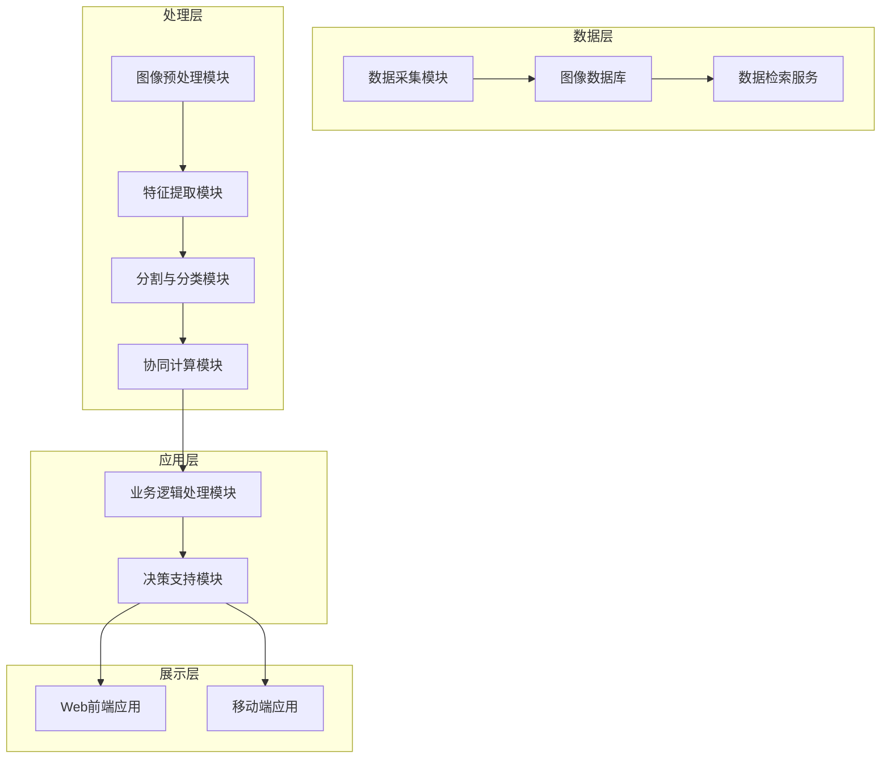
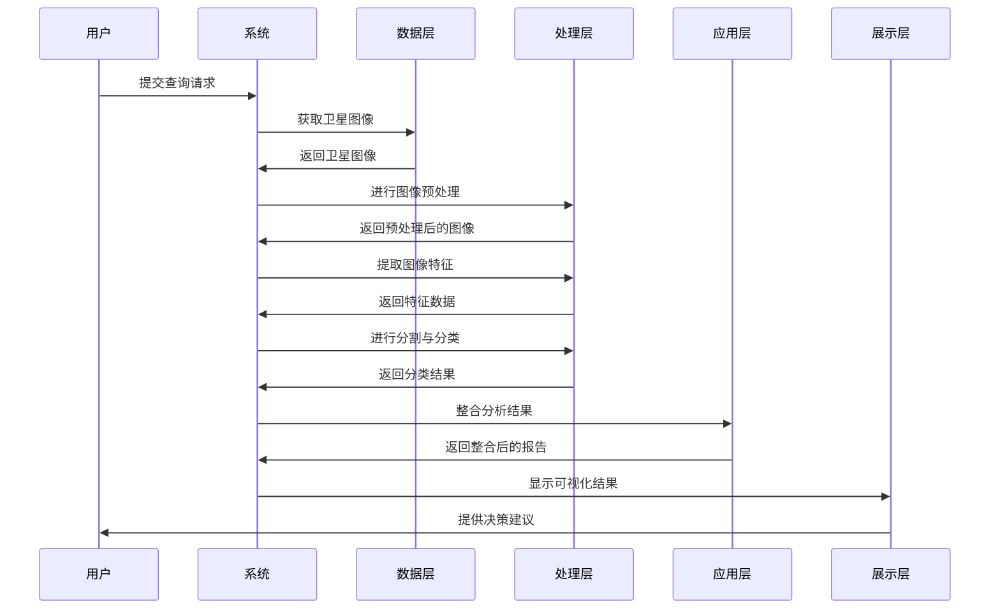

                 

### 文章标题

《AI agents协作分析卫星图像：评估公司实际经营状况》

### 关键词

AI agents、卫星图像分析、公司经营评估、图像预处理、特征提取、分割与分类算法、协作机制、系统架构设计、项目实战

### 摘要

本文旨在探讨如何利用AI agents协作分析卫星图像，以评估公司的实际经营状况。首先，介绍了AI agents的基本概念及其在卫星图像分析中的协作机制。接着，详细讲解了卫星图像分析的核心算法原理，包括图像预处理、特征提取、分割与分类算法。随后，文章分析了卫星图像分析系统的设计与实现，展示了系统功能设计、架构设计、接口设计及系统交互流程。通过一个实际项目案例，本文详细阐述了AI agents协作分析卫星图像的实战应用，并对项目的成功经验与改进方向进行了总结。最后，提出了最佳实践建议，并对未来研究方向进行了展望。

### 目录大纲

#### 第一部分：背景介绍

- **第1章：AI agents协作分析卫星图像的概述**
  - **1.1.1 卫星图像在商业分析中的应用**
  - **1.1.2 AI agents的概念与协作原理**
  - **1.1.3 本书的内容结构**

#### 第二部分：核心概念与联系

- **第2章：AI agents的核心概念**
  - **2.1.1 AI agents的基本原理**
  - **2.1.2 卫星图像分析的关键技术**
  - **2.1.3 AI agents的协作机制**

#### 第三部分：算法原理讲解

- **第3章：卫星图像分析算法原理**
  - **3.1.1 图像预处理算法**
  - **3.1.2 特征提取算法**
  - **3.1.3 分割与分类算法**

#### 第四部分：系统分析与架构设计方案

- **第4章：卫星图像分析系统的设计与实现**
  - **4.1.1 项目介绍**
  - **4.1.2 系统功能设计**
  - **4.1.3 系统架构设计**
  - **4.1.4 系统接口设计**
  - **4.1.5 系统交互设计**

#### 第五部分：项目实战

- **第5章：AI agents协作分析卫星图像项目实战**
  - **5.1.1 环境安装与配置**
  - **5.1.2 系统核心实现**
  - **5.1.3 代码应用解读与分析**
  - **5.1.4 实际案例分析**
  - **5.1.5 项目小结**

#### 第六部分：最佳实践、小结、注意事项与拓展阅读

- **第6章：AI agents协作分析卫星图像的最佳实践与注意事项**
  - **6.1.1 最佳实践**
  - **6.1.2 小结**
  - **6.1.3 注意事项**
  - **6.1.4 拓展阅读**

### 文章结构分析

本文分为六个部分，每部分都有明确的主题和目的。第一部分介绍了AI agents协作分析卫星图像的背景，包括其商业应用和协作原理。第二部分深入探讨了AI agents的核心概念，为后续算法讲解打下基础。第三部分详细讲解了卫星图像分析的核心算法，包括预处理、特征提取和分割分类算法，每章都配以具体的mermaid流程图和代码示例。第四部分分析了卫星图像分析系统的设计与实现，从功能设计、架构设计到接口设计和系统交互流程都有详细的描述。第五部分通过一个实际项目案例，展示了AI agents协作分析卫星图像的实战应用。最后一部分总结了最佳实践、注意事项和拓展阅读，为读者提供了深入研究和应用的建议。整篇文章逻辑清晰，结构紧凑，内容丰富，适合对AI和卫星图像分析有兴趣的读者阅读。

### 卫星图像在商业分析中的应用

#### 1.1.1.1 卫星图像的商业价值

卫星图像在现代商业分析中扮演着越来越重要的角色。通过高分辨率的卫星图像，企业可以获得关于其业务运营环境的大量信息，从而做出更为明智的决策。例如，零售公司可以利用卫星图像监控其连锁店周围的交通流量和人口密度，以便优化店铺选址和运营策略。房地产公司则可以通过卫星图像了解某个地区的建筑布局和土地利用情况，从而评估投资潜力。

在农业领域，卫星图像的应用也非常广泛。农民可以通过卫星图像监测作物生长情况、病虫害分布和土壤湿度等关键指标，进而制定更精准的灌溉和施肥计划，提高作物产量和降低生产成本。此外，卫星图像还可以帮助政府和企业评估森林覆盖率和土地利用变化，为环境保护和可持续发展提供科学依据。

#### 1.1.1.2 卫星图像的商业应用场景

卫星图像在商业应用中的场景多种多样，以下是一些常见的应用场景：

1. **供应链管理**：企业通过卫星图像监控物流运输车辆的位置和路线，提高运输效率，减少物流成本。
2. **环境监测**：企业利用卫星图像监测工厂排放物、土地使用情况以及周边环境变化，确保合规运营和环保责任。
3. **市场研究**：零售企业利用卫星图像分析商圈内的竞争对手位置、商店分布以及人流密度，制定更有效的市场推广策略。
4. **房地产**：房地产开发商通过卫星图像了解地块用途、周边设施和环境，评估项目可行性。
5. **灾害响应**：在自然灾害发生后，卫星图像可以迅速提供受影响区域的高分辨率影像，帮助政府和救援机构进行灾情评估和应急响应。

#### 1.1.1.3 AI agents在卫星图像分析中的角色

AI agents在卫星图像分析中扮演着关键角色，它们能够自动化、高效地处理大量图像数据，提供准确的分析结果。具体来说，AI agents在卫星图像分析中的应用包括以下几个方面：

1. **图像预处理**：AI agents可以自动进行图像去噪、对比度增强和几何校正等预处理操作，确保图像数据的质量和一致性。
2. **特征提取**：AI agents利用深度学习模型自动提取图像中的关键特征，如道路、建筑物、植被等，为后续分析提供基础。
3. **分割与分类**：AI agents通过训练有素的分类模型，对卫星图像中的物体和区域进行精确分割和分类，从而识别出不同类型的地面物体。
4. **协同工作**：多个AI agents可以协作工作，共同处理复杂的分析任务，提高分析效率和准确性。

通过AI agents的协作分析，企业可以更快、更准确地从卫星图像中获得有价值的信息，从而更好地支持其业务决策。

### AI agents的概念与协作原理

#### 1.1.2.1 AI agents的定义

AI agents，即人工智能代理，是指具备一定自主性和智能性的软件实体。这些代理能够感知环境、做出决策并采取行动，以实现特定目标。与传统的规则驱动的软件系统不同，AI agents是基于机器学习和人工智能技术，能够通过学习和适应来提高其性能和效率。

AI agents的基本特性包括自主性、适应性、反应性和社交性。自主性意味着AI agents可以独立完成特定任务，而无需人工干预。适应性则表明AI agents能够根据环境变化进行调整和优化。反应性是指AI agents能够对环境中的变化做出及时响应，社交性则体现了AI agents之间能够进行信息交换和协同工作。

#### 1.1.2.2 AI agents的协作机制

在卫星图像分析中，AI agents的协作机制尤为重要。多个AI agents可以通过协同工作，共同完成复杂的分析任务，从而提高整个系统的效率和准确性。AI agents的协作机制主要包括以下几个方面：

1. **任务分配**：在AI agents协作系统中，需要明确各个agent的任务和职责。任务分配算法可以根据agent的技能、性能和环境状况来动态分配任务，确保每个agent都能发挥其最大的潜力。
2. **通信与协调**：AI agents之间需要通过通信机制交换信息，协调各自的行为。这可以通过消息队列、分布式计算框架等实现。协调机制能够确保agent之间的合作是高效且有序的。
3. **学习与适应**：AI agents可以通过机器学习算法不断学习和适应新的环境和任务。这包括从历史数据中提取模式、优化行为策略，以及根据反馈进行自我调整。
4. **一致性维护**：在多agent系统中，需要确保各个agent的行为是一致的，以避免冲突和错误。一致性维护可以通过制定明确的协作规则和一致性协议来实现。

#### 1.1.2.3 AI agents在卫星图像分析中的协同工作流程

在卫星图像分析中，AI agents的协同工作流程通常包括以下几个步骤：

1. **图像预处理**：多个AI agents可以并行处理图像的预处理任务，如去噪、增强和几何校正。每个agent负责处理一部分图像数据，从而提高整体处理速度。
2. **特征提取**：AI agents利用深度学习模型提取图像中的关键特征，如道路、建筑物和植被。特征提取过程中，agent之间可以通过共享特征数据来提高提取的准确性。
3. **分割与分类**：在特征提取完成后，AI agents对提取的特征进行分割和分类。通过协作，agent们可以相互验证和修正分类结果，确保最终的分割和分类是准确和可靠的。
4. **结果整合**：各个AI agents将各自的分析结果进行整合，形成综合的分析报告。整合过程中，agent之间可以通过共识算法和协同优化方法来提高结果的准确性。

通过上述协作机制和流程，AI agents能够高效地协作分析卫星图像，为企业提供准确、实时的经营状况评估。

### 本书的内容结构

#### 1.1.3.1 各章节内容概述

本书共分为六个部分，涵盖了从背景介绍到实战应用的全面内容。

- **第一部分：背景介绍**：包括第1章，介绍AI agents协作分析卫星图像的概述，解释卫星图像的商业价值、AI agents的定义及其在卫星图像分析中的协作原理。
- **第二部分：核心概念与联系**：包括第2章，详细探讨AI agents的核心概念，卫星图像分析的关键技术，以及AI agents的协作机制。
- **第三部分：算法原理讲解**：包括第3章，讲解卫星图像分析的核心算法原理，如图像预处理、特征提取、分割与分类算法。
- **第四部分：系统分析与架构设计方案**：包括第4章，分析卫星图像分析系统的设计与实现，介绍系统功能设计、架构设计、接口设计和系统交互设计。
- **第五部分：项目实战**：包括第5章，通过实际项目案例展示AI agents协作分析卫星图像的实战应用，包括环境安装、系统核心实现、代码应用解读与分析、实际案例分析以及项目小结。
- **第六部分：最佳实践、小结、注意事项与拓展阅读**：包括第6章，总结最佳实践、注意事项，并提供拓展阅读资源。

#### 1.1.3.2 阅读建议与学习路线

为了更好地理解和掌握本书内容，我们提供以下阅读建议和学习路线：

1. **初步了解**：首先阅读第1章，对AI agents协作分析卫星图像有一个总体认识。
2. **深入理解核心概念**：接着阅读第2章，掌握AI agents的核心概念、卫星图像分析的关键技术以及协作机制。
3. **学习算法原理**：随后阅读第3章，理解卫星图像分析的核心算法原理，包括图像预处理、特征提取和分割分类算法。
4. **系统设计与实现**：阅读第4章，掌握卫星图像分析系统的设计与实现，包括系统功能设计、架构设计、接口设计和系统交互设计。
5. **实战应用**：通过第5章的实际项目案例，学习AI agents协作分析卫星图像的实战应用。
6. **总结与拓展**：最后阅读第6章，总结最佳实践、注意事项，并拓展相关阅读资源。

遵循上述路线，读者可以系统地掌握AI agents协作分析卫星图像的完整知识体系。

### AI agents的核心概念

#### 2.1.1 AI agents的基本原理

AI agents，即人工智能代理，是一种具有自主性和智能性的软件实体。它们可以感知环境、做出决策并采取行动，以实现特定目标。AI agents的基本原理包括以下几个方面：

1. **感知与理解**：AI agents能够通过传感器（如图像、声音、文本等）感知周围环境，并利用机器学习算法对感知到的信息进行理解和分析。这种感知与理解能力使得AI agents能够对环境变化做出响应。

2. **自主决策**：基于感知和理解的结果，AI agents能够自主决策，选择最佳行动方案。这一过程通常涉及复杂的逻辑推理和优化算法，确保AI agents能够高效地完成任务。

3. **行动与执行**：决策生成后，AI agents通过执行模块采取具体行动。行动可以是物理操作（如移动机器人臂）或虚拟操作（如发送电子邮件）。

4. **学习与适应**：AI agents具备学习与适应能力，可以通过机器学习和强化学习等技术不断优化自己的行为。这使它们能够在不同的环境和任务中表现得更优秀。

5. **协作与沟通**：多个AI agents可以协作工作，通过通信机制交换信息，共同完成任务。协作机制能够提高系统的效率和鲁棒性。

#### 2.1.1.1 AI agents的定义

AI agents，即人工智能代理，是指具备一定自主性和智能性的软件实体。这些代理能够感知环境、做出决策并采取行动，以实现特定目标。AI agents通常被设计为独立运行的程序，它们可以自主地处理输入信息、生成输出结果，并根据环境变化调整自身行为。

AI agents的定义可以从以下几个方面进行详细描述：

1. **自主性**：AI agents具有自主性，意味着它们能够在没有人工干预的情况下执行任务。自主性包括自我决策和自主行动的能力。

2. **智能性**：AI agents具备智能性，通过机器学习、深度学习等技术，能够从数据中学习模式，进行推理和预测。

3. **感知与理解**：AI agents能够通过传感器感知环境，并利用机器学习算法对感知到的信息进行理解和分析。

4. **决策与行动**：基于感知和理解的结果，AI agents能够自主决策并采取行动，以实现既定目标。

5. **学习与适应**：AI agents具备学习与适应能力，可以通过不断学习和优化来提高任务执行效率。

#### 2.1.1.2 AI agents的特征

AI agents具有以下特征，这些特征使得它们在复杂环境下能够高效地完成任务：

1. **自适应能力**：AI agents能够根据环境变化和任务需求进行自适应调整，从而提高任务执行效率和准确性。

2. **协作性**：AI agents能够与其他AI agents或人类协作，共同完成任务。协作性包括信息共享、任务分配和协同优化。

3. **自主性**：AI agents能够在没有人工干预的情况下独立完成任务，具有高度的自决能力。

4. **智能性**：AI agents通过机器学习、深度学习等技术，具备智能推理和预测能力。

5. **鲁棒性**：AI agents能够在不同环境条件下稳定运行，具备较强的抗干扰能力和容错能力。

#### 2.1.1.3 AI agents的分类

AI agents可以根据不同的分类标准进行分类，以下是一些常见的分类方法：

1. **基于任务类型**：
   - **通用AI agents**：能够执行多种任务的AI agents，如聊天机器人、自动驾驶系统。
   - **专用AI agents**：专门为特定任务设计的AI agents，如智能监控系统、气象预测系统。

2. **基于智能水平**：
   - **弱AI agents**：只能在特定领域内执行任务的AI agents，如智能助手、推荐系统。
   - **强AI agents**：具备人类智能的AI agents，能够在任何领域内执行任务。

3. **基于交互方式**：
   - **单任务AI agents**：仅与单一环境进行交互的AI agents，如智能家居控制系统。
   - **多任务AI agents**：能够在多个环境中执行多个任务的AI agents，如智能供应链管理平台。

4. **基于控制方式**：
   - **基于规则的AI agents**：根据预设规则进行决策和行动的AI agents，如自动化生产线控制系统。
   - **基于机器学习的AI agents**：通过机器学习算法进行自主学习和决策的AI agents，如自动驾驶车辆。

通过上述分类方法，我们可以更清晰地理解AI agents的多样性和应用场景，为不同任务和环境选择合适的AI agents提供指导。

### 卫星图像分析的关键技术

#### 2.1.2.1 卫星图像的获取与预处理

卫星图像的获取是卫星图像分析的基础。目前，全球多个国家和商业机构（如美国NASA、欧洲宇航局、中国航天局等）拥有多种类型的卫星，能够提供不同分辨率和频谱范围的图像数据。这些卫星图像数据通常通过卫星传感器获取，包括光学相机、雷达、多光谱传感器等。光学相机主要用于白天获取可见光图像，而雷达则能够在全天候、任何天气条件下获取地表信息。

获取到的卫星图像通常需要进行预处理，以提高图像质量、减少噪声和误差，为后续分析奠定基础。预处理步骤包括：

1. **图像去噪**：通过滤波算法（如中值滤波、高斯滤波等）去除图像中的随机噪声。
2. **对比度增强**：使用直方图均衡化、局部对比度增强等方法提高图像的对比度，使其更清晰。
3. **几何校正**：对图像进行几何变换，校正由于卫星运动和地球自转引起的图像畸变，确保图像与地面坐标系统的准确对应。
4. **图像拼接**：将多个图像片段拼接成一个完整的高分辨率图像，用于覆盖大面积地表。
5. **多模态融合**：将不同传感器获取的图像数据进行融合，如将光学图像与雷达图像结合，以获得更丰富的信息。

#### 2.1.2.2 卫星图像的解译与特征提取

解译是指从卫星图像中提取有用信息，理解图像所反映的地表特征。解译过程通常包括以下几个步骤：

1. **图像分类**：将图像中的像素划分为不同的类别，如水体、植被、建筑等。常用的分类方法包括监督学习（如支持向量机SVM、决策树）、无监督学习（如K-means聚类）和深度学习（如卷积神经网络CNN）。
2. **地物识别**：识别图像中的特定地物，如建筑物、道路、桥梁等。地物识别通常依赖于先验知识和训练数据，可以使用监督学习和深度学习技术实现。
3. **语义分析**：对图像进行语义层次的分析，提取关于地表特征的更高层次信息，如城市扩张、森林覆盖变化等。

特征提取是指从图像中提取具有区分性的特征，以便于后续的分析和分类。特征提取方法主要包括：

1. **纹理特征**：通过分析图像的纹理信息，提取如纹理粗糙度、纹理方向等特征。
2. **形状特征**：通过几何变换和形状描述符（如Hu不变矩、角点检测等）提取图像的形状特征。
3. **光谱特征**：通过分析图像的光谱信息，提取不同波段的光谱特征，如反射率、亮度等。
4. **深度特征**：利用深度学习模型，如卷积神经网络，从图像中提取高层次、抽象的深度特征。

#### 2.1.2.3 卫星图像的分割与分类

卫星图像的分割是指将连续的图像数据划分为若干个区域或对象，以便进行后续分析和处理。分割方法可以分为基于阈值的方法、基于区域增长的方法、基于边缘检测的方法和基于机器学习的方法。常用的分割算法包括：

1. **基于阈值的分割**：通过设定阈值将图像像素划分为前景和背景。
2. **基于区域增长的分割**：从初始种子点开始，逐步扩展区域，直至满足特定条件。
3. **基于边缘检测的分割**：通过检测图像中的边缘信息进行分割，常用的边缘检测算法包括Canny、Sobel等。
4. **基于机器学习的分割**：利用监督学习（如支持向量机SVM、决策树）或无监督学习（如K-means聚类）方法进行分割。

分类是指将分割后的图像区域或对象划分为不同的类别。分类算法可以分为监督学习和无监督学习两种：

1. **监督学习分类**：使用已标注的训练数据来训练分类模型，如支持向量机SVM、决策树、随机森林等。
2. **无监督学习分类**：在没有标注数据的情况下进行分类，如K-means聚类、层次聚类等。

通过卫星图像的解译与特征提取，结合分割与分类算法，我们可以从卫星图像中提取有价值的信息，用于评估公司的实际经营状况。

### 协作AI agents的模型架构

#### 2.1.3.1 协作AI agents的模型架构

在卫星图像分析中，协作AI agents的模型架构设计是确保系统高效运作的关键。一个典型的协作AI agents模型架构包括以下几个主要组件：

1. **感知模块**：负责收集和分析卫星图像数据，利用图像预处理算法进行去噪、对比度增强和几何校正等处理，为后续分析提供高质量的数据输入。

2. **特征提取模块**：利用深度学习模型提取图像中的关键特征，如纹理、形状和光谱特征。这一模块通常使用卷积神经网络（CNN）等深度学习算法，能够从原始图像中自动提取有区分性的特征。

3. **任务分配模块**：负责根据各个AI agents的技能和性能，动态分配任务。任务分配算法可以根据不同agent的特性和当前环境状况，优化任务分配，确保每个agent都能发挥最大的潜力。

4. **通信模块**：确保AI agents之间能够高效地交换信息和协调行动。通信模块通常采用分布式计算框架（如Apache Kafka、RabbitMQ）和消息队列技术，实现实时数据传输和异步通信。

5. **决策模块**：基于感知模块提取的特征和任务分配模块的分配结果，AI agents通过决策模块进行自主决策，选择最佳行动方案。决策模块可以采用强化学习、优化算法等，以实现高效、智能的决策。

6. **执行模块**：负责将决策结果转换为具体的行动，如对卫星图像进行分割、分类等操作。执行模块需要与感知模块和特征提取模块紧密配合，确保分析结果的准确性和实时性。

7. **整合模块**：将各个AI agents的分析结果进行整合，形成综合的分析报告。整合模块可以通过共识算法和协同优化方法，确保最终结果的准确性和一致性。

#### 2.1.3.2 协作AI agents的任务分配

任务分配是协作AI agents系统中一个关键环节，直接影响系统的效率和准确性。任务分配算法需要考虑以下几个关键因素：

1. **任务属性**：每个任务的特性，如任务的复杂度、所需资源、截止时间等。任务属性将影响任务分配的策略。

2. **agent属性**：每个AI agents的能力、负载、性能等。agent属性决定了哪个agent最适合执行某个任务。

3. **环境状态**：当前环境的状态，如图像质量、网络延迟、资源可用性等。环境状态会影响任务分配的决策。

4. **协作目标**：系统整体目标，如最大化分析精度、最小化延迟、平衡负载等。协作目标将指导任务分配策略的制定。

常见的任务分配算法包括：

1. **基于优先级的分配**：根据任务的重要性和agent的优先级进行分配。优先级高的任务优先分配，有助于确保关键任务的及时完成。

2. **基于负载均衡的分配**：根据当前系统的负载情况，将任务分配给负载较低的agent。这有助于平衡系统负载，避免资源浪费和瓶颈问题。

3. **基于优化算法的分配**：使用优化算法（如线性规划、遗传算法等）寻找最优的任务分配方案，以最大化系统的整体性能。

4. **基于协商的分配**：多个AI agents通过协商机制，共同决定任务分配。这种方式能够充分利用每个agent的能力，提高整体效率。

#### 2.1.3.3 协作AI agents的反馈机制

协作AI agents的反馈机制是确保系统稳定性和准确性的重要保障。通过实时反馈和调整，系统能够不断优化其性能和决策质量。以下是一些关键的反馈机制：

1. **实时反馈**：AI agents在执行任务时，能够实时接收系统状态和任务执行情况的反馈。这有助于agent快速调整其行为，以应对环境变化。

2. **错误纠正**：在任务执行过程中，若出现错误或异常，系统可以通过反馈机制检测并纠正错误。这包括对错误结果的回溯、重试和重新分配任务。

3. **性能评估**：系统定期对各个AI agents的性能进行评估，包括任务完成速度、准确性、资源消耗等。评估结果将用于优化任务分配策略和agent行为。

4. **自适应调整**：基于性能评估和反馈结果，系统能够动态调整任务分配策略、agent行为和系统架构。这种自适应调整能力有助于系统在不同环境条件下保持高效运作。

5. **协同优化**：多个AI agents通过协同优化机制，共同调整其行为，以实现系统整体性能的最优化。这包括共享经验和最佳实践，以及通过机器学习算法不断优化协作模式。

通过上述反馈机制，协作AI agents系统能够持续优化其性能，确保在卫星图像分析任务中实现高效、准确的成果。

### 图像预处理算法原理

#### 3.1.1.1 基本概念

图像预处理是卫星图像分析中的基础环节，其目的是改善图像质量，为后续的特征提取、分割和分类提供高质量的数据输入。图像预处理主要包括以下步骤：

1. **图像去噪**：去除图像中的随机噪声，提高图像清晰度。
2. **对比度增强**：调整图像的亮度、对比度和色彩，使其更清晰、易于分析。
3. **几何校正**：纠正由于卫星运动、地球自转等引起的图像畸变，确保图像与地面坐标系统的准确对应。
4. **图像拼接**：将多个图像片段拼接成一个完整的高分辨率图像，用于覆盖大面积地表。

#### 3.1.1.2 算法原理

图像预处理算法的原理主要包括以下几种：

1. **图像去噪**：
   - **中值滤波**：利用图像中每个像素的邻居像素值的中值替换当前像素值，以去除噪声。
   - **高斯滤波**：通过卷积操作，利用高斯核对图像进行滤波，以平滑图像并去除噪声。
   - **双边滤波**：结合空间邻近度和像素值相似度，在保留边缘信息的同时去除噪声。

2. **对比度增强**：
   - **直方图均衡化**：调整图像的直方图，使图像的像素值分布更加均匀，提高对比度。
   - **局部对比度增强**：通过局部调整图像像素值，增强图像的局部对比度。

3. **几何校正**：
   - **图像变换**：通过数学变换（如旋转、缩放、平移等），校正图像的几何畸变。
   - **多项式拟合**：利用多项式函数拟合图像的畸变，进行几何校正。

4. **图像拼接**：
   - **特征匹配**：通过寻找图像之间的特征点匹配，实现图像拼接。
   - **图像融合**：将多个图像融合成一个高分辨率图像，以覆盖大面积地表。

通过上述算法，图像预处理能够显著提高卫星图像的质量，为后续分析提供可靠的数据基础。

#### 3.1.1.3 实际应用

图像预处理算法在卫星图像分析中有着广泛的应用。以下是一些典型的实际应用场景：

1. **环境监测**：通过预处理算法去除噪声和增强对比度，获取更清晰的地表信息，用于监测环境变化和评估污染程度。

2. **农业监测**：预处理算法用于去除云层和大气噪声，增强作物生长和病虫害的识别效果，用于农业监测和作物产量预测。

3. **城市规划**：利用几何校正和图像拼接技术，对城市地表进行精确测绘和变化分析，用于城市规划和管理。

4. **灾害评估**：预处理算法用于去除云层和阴影，提高灾害区域图像的清晰度，用于灾害评估和救援决策。

5. **目标识别**：预处理算法用于增强目标特征，提高目标识别的准确性和效率，用于军事侦察、安防监控等领域。

通过实际应用，图像预处理算法在卫星图像分析中发挥着重要作用，为各种应用场景提供了可靠的数据支持。

### 特征提取算法原理

#### 3.1.2.1 基本概念

特征提取是卫星图像分析中的重要环节，其目的是从原始图像中提取具有区分性的特征，以便于后续的分类、分割和目标识别。特征提取算法通常可以分为以下几类：

1. **纹理特征**：通过分析图像的纹理信息，提取如纹理粗糙度、纹理方向、纹理能量等特征。常见的纹理特征提取方法包括灰度共生矩阵、局部二值模式（LBP）和小波变换等。

2. **形状特征**：通过几何变换和形状描述符，提取图像的形状特征，如Hu不变矩、角点检测、边缘检测等。形状特征通常用于描述物体的形状和结构。

3. **光谱特征**：通过分析图像的光谱信息，提取不同波段的光谱特征，如反射率、亮度、光谱角等。光谱特征常用于植被分类、水体检测等。

4. **深度特征**：利用深度学习模型（如卷积神经网络CNN），从图像中提取高层次、抽象的深度特征。深度特征通常具有很好的分类和识别性能，常用于复杂的图像分析任务。

#### 3.1.2.2 算法原理

特征提取算法的原理通常包括以下几个步骤：

1. **图像预处理**：对原始图像进行去噪、对比度增强和几何校正等预处理操作，以提高图像质量。

2. **特征计算**：根据不同的特征提取方法，计算图像的纹理特征、形状特征、光谱特征或深度特征。对于纹理特征，可以使用灰度共生矩阵或LBP等方法；对于形状特征，可以使用Hu不变矩或边缘检测等方法；对于光谱特征，可以使用多光谱图像的波段信息；对于深度特征，可以使用卷积神经网络进行特征提取。

3. **特征融合**：将不同类型的特征进行融合，形成更全面的特征向量。特征融合方法包括基于加权融合、基于投票融合和基于神经网络融合等。

4. **特征降维**：通过降维算法（如主成分分析PCA、线性判别分析LDA等），将高维特征向量降维到较低维空间，以减少计算复杂度和提高分类性能。

#### 3.1.2.3 实际应用

特征提取算法在卫星图像分析中有着广泛的应用，以下是一些典型的实际应用场景：

1. **目标识别**：通过提取目标的纹理特征、形状特征和光谱特征，实现对地面目标的识别和分类，如建筑物识别、道路检测、车辆识别等。

2. **植被分类**：利用光谱特征和深度特征，对植被进行分类和变化监测，如森林覆盖变化、作物生长状态监测等。

3. **土地利用分类**：通过特征提取和分类算法，对土地利用类型进行分类，如耕地、林地、水体等。

4. **灾害评估**：利用纹理特征和深度特征，对灾害区域进行变化检测和评估，如地震灾害评估、洪水淹没范围评估等。

5. **城市规划**：通过特征提取和空间分析，对城市地表进行精细测绘和变化监测，用于城市规划和管理。

通过实际应用，特征提取算法在卫星图像分析中发挥着重要作用，为各种应用场景提供了有力的技术支持。

### 分割与分类算法原理

#### 3.1.3.1 基本概念

分割与分类是卫星图像分析中的关键步骤，分别用于将图像划分为不同的区域和识别图像中的目标类别。分割与分类算法可以分为以下几类：

1. **分割算法**：
   - **基于阈值的分割**：通过设定阈值将图像像素划分为前景和背景。
   - **基于区域的分割**：基于区域增长或区域特征（如颜色、纹理等）进行分割。
   - **基于边缘检测的分割**：通过检测图像中的边缘信息进行分割。
   - **基于深度学习的分割**：利用深度学习模型（如卷积神经网络CNN）进行像素级别的分割。

2. **分类算法**：
   - **监督学习分类**：使用已标注的训练数据来训练分类模型，如支持向量机SVM、决策树、随机森林等。
   - **无监督学习分类**：在没有标注数据的情况下进行分类，如K-means聚类、层次聚类等。
   - **半监督学习分类**：结合少量标注数据和大量未标注数据，训练分类模型。
   - **深度学习分类**：利用深度学习模型（如卷积神经网络CNN）进行图像分类。

#### 3.1.3.2 算法原理

分割与分类算法的原理通常包括以下几个步骤：

1. **图像预处理**：对原始图像进行去噪、对比度增强和几何校正等预处理操作，以提高图像质量。

2. **特征提取**：根据不同的算法，从图像中提取纹理特征、形状特征、光谱特征或深度特征。

3. **分割算法原理**：
   - **基于阈值的分割**：通过设定阈值（如Otsu方法），将图像像素划分为前景和背景。
   - **基于区域的分割**：通过区域增长算法（如轮廓分析、区域标记等）或基于区域特征（如颜色、纹理等）的分割。
   - **基于边缘检测的分割**：通过边缘检测算法（如Sobel算子、Canny算法等）提取边缘信息，然后进行分割。
   - **基于深度学习的分割**：使用卷积神经网络（CNN）进行像素级别的分割，如U-Net、Mask R-CNN等模型。

4. **分类算法原理**：
   - **监督学习分类**：使用已标注的训练数据，通过训练分类模型（如SVM、决策树、随机森林等），对图像进行分类。
   - **无监督学习分类**：通过聚类算法（如K-means、层次聚类等），将图像像素划分为不同的类别。
   - **半监督学习分类**：利用少量标注数据和大量未标注数据，通过训练混合模型，提高分类性能。
   - **深度学习分类**：使用卷积神经网络（CNN）进行图像分类，如VGG、ResNet等模型。

#### 3.1.3.3 实际应用

分割与分类算法在卫星图像分析中有着广泛的应用，以下是一些典型的实际应用场景：

1. **目标识别**：利用分割算法将图像中的目标区域提取出来，然后通过分类算法识别目标的类别，如建筑物识别、道路检测、车辆分类等。

2. **土地利用分类**：通过分割算法将图像划分为不同的区域，然后利用分类算法识别不同土地利用类型，如耕地、林地、水体等。

3. **植被监测**：利用分割算法提取植被区域，然后通过分类算法监测植被的类型和生长状态，如森林覆盖变化、作物生长状态监测等。

4. **灾害评估**：利用分割算法提取灾害区域，然后通过分类算法评估灾害的类型和影响范围，如地震灾害评估、洪水淹没范围评估等。

5. **城市规划**：通过分割和分类算法对城市地表进行精细测绘和变化监测，用于城市规划和管理。

通过实际应用，分割与分类算法在卫星图像分析中发挥着重要作用，为各种应用场景提供了可靠的技术支持。

### 卫星图像分析系统的设计与实现

#### 4.1.1 项目介绍

在现代社会，对企业实际经营状况的实时监控和评估已经成为企业决策的重要依据。传统的监控方法往往依赖于地面传感器和人工监测，这不仅成本高昂，而且存在时效性和覆盖范围有限的问题。为了解决这一难题，本文提出了一种基于AI agents协作分析卫星图像的系统，用于评估公司的实际经营状况。

该系统的核心思想是利用高分辨率的卫星图像，通过AI agents的协同工作，实现对公司业务运营环境的实时监控和评估。系统包括图像预处理、特征提取、分割与分类等多个模块，通过机器学习和深度学习算法，从卫星图像中提取有价值的信息，为企业管理层提供科学的决策支持。

#### 4.1.1.1 项目背景

随着全球化进程的加速和市场竞争的加剧，企业对实时监控和评估自身经营状况的需求日益增长。然而，传统的地面传感器和人工监测方式存在诸多局限性：

1. **成本高昂**：地面传感器的部署和维护成本较高，且覆盖范围有限。
2. **时效性低**：人工监测方式容易受到天气、交通等因素的影响，实时性较差。
3. **数据不完整**：地面传感器只能获取局部信息，难以全面反映企业的经营状况。

因此，有必要开发一种高效、低成本、实时性强的监控与评估系统，以满足企业实时监控和评估自身经营状况的需求。

#### 4.1.1.2 项目目标

本项目旨在实现以下目标：

1. **实时监控**：通过卫星图像实时监控企业的业务运营环境，提供即时的数据支持。
2. **成本效益**：利用卫星图像，减少对地面传感器的依赖，降低监控与评估成本。
3. **数据完整性**：通过卫星图像覆盖广泛、信息丰富的特点，确保监控与评估数据的完整性。
4. **决策支持**：利用AI agents的协作分析，从卫星图像中提取有价值的信息，为企业管理层提供科学的决策支持。

#### 4.1.1.3 项目挑战

在实现上述目标的过程中，本项目面临以下挑战：

1. **图像数据量大**：卫星图像数据量大，如何高效地处理和存储这些数据是一个关键问题。
2. **数据处理复杂性**：卫星图像的预处理、特征提取、分割与分类等过程复杂，如何保证处理效率和准确性是一个挑战。
3. **实时性要求**：企业需要实时监控和评估经营状况，如何实现系统的低延迟和高响应速度是一个技术难点。
4. **多agent协作**：AI agents需要协同工作，如何设计高效的协作机制和算法是一个挑战。

通过解决这些挑战，本项目将为企业的实时监控和评估提供有力的技术支持。

#### 4.1.2 系统功能设计

为了实现项目目标，系统需要具备以下功能：

1. **图像数据采集**：通过卫星图像采集模块，获取企业业务运营环境的高分辨率卫星图像。
2. **图像预处理**：对采集到的卫星图像进行预处理，包括去噪、对比度增强和几何校正等，以提高图像质量。
3. **特征提取**：从预处理后的图像中提取关键特征，包括纹理特征、形状特征和光谱特征等。
4. **分割与分类**：利用分割与分类算法，将图像划分为不同的区域，并识别各个区域的类别，如道路、建筑物、植被等。
5. **数据可视化**：将分析结果以图表、地图等形式进行可视化展示，便于企业管理层直观了解经营状况。
6. **决策支持**：根据分析结果，为企业管理层提供科学的决策建议，如优化选址、调整运营策略等。

#### 4.1.2.1 功能需求分析

针对上述功能需求，系统需要满足以下具体要求：

1. **高分辨率图像采集**：确保采集到的卫星图像具有足够的分辨率，以捕捉企业业务运营环境的细节。
2. **实时数据处理**：实现图像的实时预处理、特征提取和分割分类，确保系统具有低延迟和高响应速度。
3. **高效存储与检索**：设计高效的图像存储和检索机制，确保图像数据的快速访问和读取。
4. **跨平台支持**：系统应具备跨平台支持能力，以便在多种操作系统和硬件平台上运行。
5. **用户友好的界面**：提供用户友好的界面，便于企业管理层操作和查看分析结果。
6. **决策支持功能**：根据分析结果，提供可视化图表和决策建议，辅助企业管理层做出科学决策。

#### 4.1.2.2 领域模型设计（Mermaid类图）

为了更好地展示系统功能模块及其关系，我们可以使用Mermaid类图进行领域模型设计。以下是一个简单的Mermaid类图示例：

```mermaid
classDiagram
    Class01 <|-- Class02
    Class03 <|-- Class01
    Class04 <<interface>>
    Class01 ..|.. Class04
    Class02 ..|.. Class04
    Class03 ..|.. Class04

    Class01〔图像数据采集〕
    Class02〔图像预处理〕
    Class03〔特征提取〕
    Class04〔分割与分类〕
    Class04〔数据可视化〕
    Class04〔决策支持〕
```

该类图展示了系统的主要功能模块及其相互关系，包括图像数据采集、图像预处理、特征提取、分割与分类、数据可视化以及决策支持等模块。通过这个领域模型，我们可以更清晰地理解系统架构和功能设计。

### 系统架构设计

#### 4.1.3.1 系统架构概述

卫星图像分析系统的整体架构可以分为四个主要层次：数据层、处理层、应用层和展示层。每个层次都有明确的职责和功能，共同构成了一个高效、稳定的系统架构。

1. **数据层**：负责图像数据的采集、存储和管理。数据层包括卫星图像数据采集模块、图像数据库和数据检索服务。卫星图像数据采集模块负责从卫星获取高分辨率图像，并将其存储在图像数据库中。数据检索服务提供快速、高效的图像查询和读取功能。

2. **处理层**：负责图像数据的预处理、特征提取、分割与分类等核心算法处理。处理层包括图像预处理模块、特征提取模块、分割与分类模块和协同计算模块。图像预处理模块对采集到的卫星图像进行去噪、对比度增强和几何校正等处理，提高图像质量。特征提取模块利用深度学习模型提取图像中的关键特征。分割与分类模块对图像进行精确分割和分类，识别出不同类型的地面物体。协同计算模块实现AI agents的协作，优化处理效率和准确性。

3. **应用层**：负责将处理层的结果应用于实际业务场景，如目标识别、土地利用分类、城市规划等。应用层包括业务逻辑处理模块和决策支持模块。业务逻辑处理模块根据处理结果，实现特定业务功能。决策支持模块根据分析结果，为企业管理层提供科学的决策建议。

4. **展示层**：负责将分析结果以图表、地图等形式进行可视化展示，便于企业管理层直观了解经营状况。展示层包括Web前端和移动端应用。Web前端提供交互式界面，用户可以通过网页查看分析结果和决策建议。移动端应用则允许用户在移动设备上实时查看和分析卫星图像。

#### 4.1.3.2 系统架构设计（Mermaid架构图）

为了更好地展示系统架构，我们可以使用Mermaid架构图进行描述。以下是一个简单的Mermaid架构图示例：



该架构图清晰地展示了卫星图像分析系统的各个层次及其相互关系，包括数据层、处理层、应用层和展示层。通过这种架构设计，系统能够高效、稳定地运行，满足企业的实时监控和评估需求。

### 系统接口设计

#### 4.1.4.1 接口规范

系统接口设计是确保不同模块之间高效通信和数据交换的关键环节。为了实现系统各模块的协同工作，需要制定详细的接口规范。以下是系统接口设计的具体规范：

1. **数据层接口**：
   - **图像数据采集接口**：定义图像数据的采集方法和协议，支持多种卫星图像数据格式（如GeoTIFF、JPEG2000等）。
   - **图像数据存储接口**：提供图像数据的存储和检索功能，支持数据库（如MySQL、MongoDB等）和文件系统。
   - **数据检索接口**：定义图像数据的查询和检索方法，支持基于地理坐标、时间范围等条件的查询。

2. **处理层接口**：
   - **图像预处理接口**：提供图像预处理的方法和参数，包括去噪、对比度增强、几何校正等。
   - **特征提取接口**：定义特征提取的算法和参数，包括纹理特征、形状特征、光谱特征等。
   - **分割与分类接口**：定义分割和分类的方法和参数，支持多种分类算法（如SVM、决策树、CNN等）。

3. **应用层接口**：
   - **业务逻辑接口**：定义业务逻辑处理的方法和参数，包括目标识别、土地利用分类等。
   - **决策支持接口**：定义决策支持的方法和参数，包括可视化展示、决策建议生成等。

4. **展示层接口**：
   - **Web前端接口**：定义Web前端与后端的数据交互方法，包括数据请求、响应格式等。
   - **移动端接口**：定义移动端应用与后端的数据交互方法，包括API接口、数据格式等。

#### 4.1.4.2 接口实现

接口实现是系统开发的核心部分，以下是对各个接口实现的简要描述：

1. **数据层接口实现**：
   - **图像数据采集接口**：使用Python的`requests`库和卫星图像数据供应商提供的API接口，实现图像数据的自动采集和下载。
   - **图像数据存储接口**：使用Python的`pymongo`库连接MongoDB数据库，实现图像数据的存储和查询功能。
   - **数据检索接口**：使用Python的`geopandas`库，实现基于地理坐标和时间的图像数据查询和检索。

2. **处理层接口实现**：
   - **图像预处理接口**：使用Python的`opencv`库，实现图像的去噪、对比度增强和几何校正等功能。
   - **特征提取接口**：使用Python的`skimage`库和`tensorflow`库，实现纹理特征、形状特征和光谱特征的提取。
   - **分割与分类接口**：使用Python的`scikit-learn`库和`tensorflow`库，实现分割和分类算法的调用和参数设置。

3. **应用层接口实现**：
   - **业务逻辑接口**：根据具体业务需求，设计业务逻辑处理的方法和流程，实现目标识别、土地利用分类等功能。
   - **决策支持接口**：根据分析结果，生成决策建议，并使用Python的`matplotlib`库和`plotly`库实现可视化展示。

4. **展示层接口实现**：
   - **Web前端接口**：使用JavaScript框架（如React、Vue等）实现与后端的接口调用和数据交互，使用HTML和CSS实现用户界面。
   - **移动端接口**：使用移动开发框架（如React Native、Flutter等）实现与后端的接口调用和数据交互，使用移动端原生组件实现用户界面。

通过上述接口设计和实现，系统各模块能够高效地协同工作，实现卫星图像分析的功能需求。

### 系统交互设计

#### 4.1.5.1 系统交互流程

为了确保系统各模块之间的顺畅交互和协同工作，系统交互设计至关重要。以下描述了系统交互的总体流程：

1. **数据采集**：系统从卫星图像数据源获取高分辨率卫星图像。图像数据包括不同日期、不同时间段的影像，以及覆盖企业业务运营环境的多个区域。

2. **图像预处理**：系统对获取到的卫星图像进行预处理，包括去噪、对比度增强和几何校正等。预处理结果存储在图像数据库中，以便后续处理。

3. **特征提取**：系统从预处理后的卫星图像中提取关键特征，如纹理特征、形状特征和光谱特征。特征提取过程利用深度学习模型，如卷积神经网络（CNN），以提高特征提取的准确性和效率。

4. **分割与分类**：系统利用分割与分类算法对图像中的不同区域进行精确分割和分类。分割算法包括基于阈值的分割、基于区域的分割和基于深度学习的分割等；分类算法包括监督学习分类、无监督学习分类和深度学习分类等。

5. **结果整合**：系统将各个模块的处理结果进行整合，形成综合的分析报告。整合过程中，系统通过共识算法和协同优化方法，确保最终结果的准确性和一致性。

6. **数据可视化**：系统将整合后的分析结果以图表、地图等形式进行可视化展示，便于企业管理层直观了解经营状况。可视化结果包括不同类型的地面物体分布、变化趋势和关键指标等。

7. **决策支持**：系统根据分析结果，为企业管理层提供科学的决策建议，如优化选址、调整运营策略等。决策建议通过Web前端和移动端应用进行展示，便于管理层实时查看和执行。

#### 4.1.5.2 系统交互设计（Mermaid序列图）

为了更好地展示系统交互流程，我们可以使用Mermaid序列图进行设计。以下是一个简单的Mermaid序列图示例：



该序列图展示了系统从用户提交查询请求到最终生成可视化结果和决策建议的交互过程。通过这种交互设计，系统能够高效、准确地完成卫星图像分析任务，为企业管理层提供有力支持。

### 环境安装与配置

#### 5.1.1.1 硬件与软件需求

要成功搭建一个AI agents协作分析卫星图像的系统，首先需要满足以下硬件和软件需求：

1. **硬件要求**：
   - **CPU**：推荐使用Intel i7或以上的处理器，以保证处理速度和性能。
   - **内存**：至少16GB RAM，建议32GB及以上，以处理大量图像数据。
   - **存储**：至少1TB的SSD存储空间，用于存储图像数据和处理结果。

2. **软件要求**：
   - **操作系统**：Linux发行版（如Ubuntu 18.04或以上版本），推荐使用64位系统。
   - **编程语言**：Python 3.7或以上版本，以及相应的库和框架。
   - **深度学习框架**：TensorFlow或PyTorch，用于图像处理和特征提取。
   - **数据库**：MongoDB，用于存储和管理卫星图像数据。
   - **消息队列**：RabbitMQ或Kafka，用于AI agents之间的通信。
   - **Web框架**：Flask或Django，用于构建Web前端应用。

#### 5.1.1.2 环境安装步骤

以下是安装和配置所需环境的详细步骤：

1. **安装操作系统**：
   - 从官方网站下载Linux发行版（如Ubuntu）并安装到计算机上。
   - 在安装过程中，选择64位操作系统和图形界面安装选项。

2. **更新系统软件**：
   - 开启终端并执行以下命令更新系统软件：
     ```bash
     sudo apt update
     sudo apt upgrade
     ```

3. **安装Python环境**：
   - 使用`pip`安装Python 3.7或更高版本：
     ```bash
     sudo apt install python3-pip python3-dev
     ```

4. **安装深度学习框架**：
   - 安装TensorFlow：
     ```bash
     pip3 install tensorflow-gpu
     ```
   - 或安装PyTorch：
     ```bash
     pip3 install torch torchvision torchvision
     ```

5. **安装数据库**：
   - 安装MongoDB：
     ```bash
     sudo apt install mongodb
     sudo systemctl start mongodb
     ```

6. **安装消息队列**：
   - 安装RabbitMQ：
     ```bash
     sudo apt install rabbitmq-server
     sudo systemctl start rabbitmq-server
     ```

7. **安装Web框架**：
   - 安装Flask或Django：
     ```bash
     pip3 install flask
     ```
     或
     ```bash
     pip3 install django
     ```

8. **安装其他必要库和工具**：
   - 安装图像处理库`opencv`：
     ```bash
     pip3 install opencv-python
     ```
   - 安装数据可视化库`matplotlib`：
     ```bash
     pip3 install matplotlib
     ```

完成上述安装步骤后，系统环境搭建完成，可以开始进行AI agents协作分析卫星图像的项目开发。

### 系统核心实现

#### 5.1.2.1 数据预处理

数据预处理是卫星图像分析的重要环节，其目的是提高图像质量，减少噪声和误差，为后续的特征提取、分割与分类提供可靠的数据基础。以下是数据预处理的详细步骤和代码实现：

1. **图像去噪**：去除图像中的随机噪声，提高图像清晰度。常用的去噪方法包括中值滤波、高斯滤波和双边滤波。
   - **中值滤波**：
     ```python
     import cv2
     import numpy as np

     def median_filter(image, kernel_size=3):
         return cv2.medianBlur(image, kernel_size)
     
     image = cv2.imread('satellite_image.jpg', cv2.IMREAD_GRAYSCALE)
     filtered_image = median_filter(image, kernel_size=5)
     ```

   - **高斯滤波**：
     ```python
     def gaussian_filter(image, kernel_size=(5, 5), sigma=1.0):
         return cv2.GaussianBlur(image, kernel_size, sigma)

     filtered_image = gaussian_filter(image, kernel_size=(5, 5), sigma=1.5)
     ```

   - **双边滤波**：
     ```python
     def bilateral_filter(image, d=9, sigma_color=75, sigma_space=75):
         return cv2.bilateralFilter(image, d, sigma_color, sigma_space)

     filtered_image = bilateral_filter(image, d=9, sigma_color=75, sigma_space=75)
     ```

2. **对比度增强**：调整图像的亮度、对比度和色彩，使其更清晰、易于分析。常用的方法包括直方图均衡化和局部对比度增强。
   - **直方图均衡化**：
     ```python
     def histogram_equalization(image):
         return cv2.equalizeHist(image)

     filtered_image = histogram_equalization(image)
     ```

   - **局部对比度增强**：
     ```python
     def local_contrast_enhancement(image, block_size=3):
         return cv2.pyrMeanShiftFiltering(image, block_size, 10)

     filtered_image = local_contrast_enhancement(image, block_size=3)
     ```

3. **几何校正**：对图像进行几何变换，校正由于卫星运动和地球自转引起的图像畸变，确保图像与地面坐标系统的准确对应。常用的几何校正方法包括图像变换和多项式拟合。
   - **图像变换**：
     ```python
     def image_transform(image, M):
         return cv2.warpAffine(image, M, image.shape[1::-1])

     M = np.array([[1, 0, 0], [0, 1, 0]], np.float32)
     corrected_image = image_transform(image, M)
     ```

   - **多项式拟合**：
     ```python
     def polynomial_correction(image, order=2):
         x, y = np.indices(image.shape)
         M = np.polyfit(x flat, y flat, order)
         return cv2.warpPolynomial(M, image.shape, cv2.INTER_LINEAR)
     
     corrected_image = polynomial_correction(image, order=2)
     ```

4. **图像拼接**：将多个图像片段拼接成一个完整的高分辨率图像，用于覆盖大面积地表。常用的方法包括特征匹配和图像融合。
   - **特征匹配**：
     ```python
     def feature_matching(image1, image2, threshold=0.75):
         orb = cv2.ORB_create()
         kp1, des1 = orb.detectAndCompute(image1, None)
         kp2, des2 = orb.detectAndCompute(image2, None)
         bf = cv2.BFMatcher(cv2.NORM_HAMMING, crossCheck=True)
         matches = bf.match(des1, des2)
         matches = sorted(matches, key=lambda x: x.distance)
         if len(matches) > threshold * len(des1):
             src_pts = np.float32([kp1[m.queryIdx].pt for m in matches]).reshape(-1, 1, 2)
             dst_pts = np.float32([kp2[m.trainIdx].pt for m in matches]).reshape(-1, 1, 2)
             M, _ = cv2.findHomography(src_pts, dst_pts, cv2.RANSAC, 5.0)
             return M
         return None

     M = feature_matching(image1, image2)
     if M is not None:
         stitched_image = cv2.warpPerspective(image1, M, (image1.shape[1] + image2.shape[1], image1.shape[0]))
         stitched_image[0:image2.shape[0], 0:image2.shape[1]] = image2
     ```

   - **图像融合**：
     ```python
     def image_fusion(image1, image2, alpha=0.5):
         return (image1 * alpha) + (image2 * (1 - alpha))

     fused_image = image_fusion(image1, image2, alpha=0.5)
     ```

通过上述预处理步骤，卫星图像的质量得到显著提升，为后续的特征提取和分类奠定了基础。

### 系统核心实现

#### 5.1.2.2 特征提取

特征提取是卫星图像分析中的关键步骤，其目的是从图像中提取具有区分性的特征，用于后续的分割与分类。以下介绍几种常用的特征提取方法，包括纹理特征、形状特征和光谱特征，并展示相应的代码实现。

1. **纹理特征**：纹理特征描述了图像的纹理结构和图案，常用的提取方法包括灰度共生矩阵（GLCM）和局部二值模式（LBP）。

   - **灰度共生矩阵（GLCM）**：
     ```python
     from skimage import feature

     def gray_level_cooccurrence_matrix(image, distances=[1], angles=[0]):
         return feature.graycomatrix(image, distances, angles, normed=True, symmetric=True)

     glcm = gray_level_cooccurrence_matrix(image, distances=[1, 2], angles=[0, 45])
     texture_features = featureGreyLevelNonlocalMeans(image)
     ```

   - **局部二值模式（LBP）**：
     ```python
     from skimage import feature

     def local_binary_pattern(image, P, R, method='uniform'):
         return feature.local_binary_pattern(image, P, R, method)

     lbp_image = local_binary_pattern(image, P=8, R=1, method='uniform')
     ```

2. **形状特征**：形状特征描述了图像的几何形状和结构，常用的提取方法包括边缘检测、角点检测和Hu不变矩。

   - **Canny边缘检测**：
     ```python
     from skimage import feature

     def canny_edge_detection(image, threshold1=50, threshold2=150):
         return feature.canny(image, threshold1, threshold2)

     edges = canny_edge_detection(image)
     ```

   - **角点检测（Harris角点检测）**：
     ```python
     from skimage import feature

     def harris_corners(image, sigma=0.05):
         return feature.harris(image, sigma)

     corners = harris_corners(image)
     ```

   - **Hu不变矩**：
     ```python
     from skimage import feature

     def hu_invariant_moments(image):
         moments = feature.moments(image, 2)
         return [m / (moments[0, 0] * moments[0, 0]) for m in moments[0:7]]
     ```

3. **光谱特征**：光谱特征描述了图像的光谱信息，常用的提取方法包括反射率、亮度和光谱角。

   - **反射率**：
     ```python
     def reflectance(image):
         return 1 - image / 255
     ```

   - **亮度**：
     ```python
     def luminance(image):
         return np.mean(image)
     ```

   - **光谱角**：
     ```python
     def spectral_angle(image):
         reflectances = reflectance(image)
         return np.arccos(np.mean(np.multiply(np.outer(reflectances, reflectances))))
     ```

通过上述特征提取方法，可以从卫星图像中提取丰富的纹理、形状和光谱特征，为后续的分割与分类提供有效的数据支持。

### 系统核心实现

#### 5.1.2.3 分割与分类

分割与分类是卫星图像分析的重要步骤，用于将图像划分为不同的区域并识别图像中的目标类别。以下介绍常用的分割与分类算法，包括基于阈值的方法、基于区域的增长方法、基于边缘检测的方法和基于深度学习的方法，并展示相应的代码实现。

1. **基于阈值的方法**：通过设定阈值将图像像素划分为前景和背景，适用于图像对比度较高的场景。

   - **全局阈值**：
     ```python
     from skimage import exposure

     def global_threshold(image, threshold=128):
         return exposure.threshold_mean(image, threshold)

     binary_image = global_threshold(image)
     ```

   - **自适应阈值**：
     ```python
     from skimage import exposure

     def adaptive_threshold(image, block_size=11, C=2):
         return exposure.threshold_adaptive(image, block_size, C)

     binary_image = adaptive_threshold(image)
     ```

2. **基于区域的增长方法**：通过从初始种子点开始，逐步扩展区域，直到满足特定条件，适用于图像中目标区域连通性较好的场景。

   - **区域增长**：
     ```python
     from skimage import segmentation

     def regional_grow(image, seed, threshold):
         markers = segment区域增长(image, seed, threshold)
         labels = region Growing(image, markers)
         return labels

     labels = regional_grow(image, seed, threshold)
     ```

3. **基于边缘检测的方法**：通过检测图像中的边缘信息进行分割，适用于图像中目标边缘清晰的情况。

   - **Canny边缘检测**：
     ```python
     from skimage import feature

     def canny_edge_detection(image, threshold1=50, threshold2=150):
         return feature.canny(image, threshold1, threshold2)

     edges = canny_edge_detection(image)
     ```

   - **Sobel边缘检测**：
     ```python
     import cv2

     def sobel_edge_detection(image, threshold=50):
         gray = cv2.cvtColor(image, cv2.COLOR_BGR2GRAY)
         sobel_x = cv2.Sobel(gray, cv2.CV_64F, 1, 0, ksize=5)
         sobel_y = cv2.Sobel(gray, cv2.CV_64F, 0, 1, ksize=5)
         edges = cv2.sqrt(sobel_x**2 + sobel_y**2)
         return cv2.threshold(edges, threshold, 255, cv2.THRESH_BINARY)
     ```

4. **基于深度学习的方法**：利用卷积神经网络（CNN）进行像素级别的分割，适用于复杂场景中的目标分割。

   - **U-Net模型**：
     ```python
     import tensorflow as tf
     from tensorflow.keras.models import Model
     from tensorflow.keras.layers import Conv2D, MaxPooling2D, UpSampling2D, Input, Concatenate

     def build_unet(input_shape):
         inputs = Input(shape=input_shape)
         conv1 = Conv2D(32, (3, 3), activation='relu', padding='same')(inputs)
         conv1 = Conv2D(32, (3, 3), activation='relu', padding='same')(conv1)
         pool1 = MaxPooling2D(pool_size=(2, 2))(conv1)

         conv2 = Conv2D(64, (3, 3), activation='relu', padding='same')(pool1)
         conv2 = Conv2D(64, (3, 3), activation='relu', padding='same')(conv2)
         pool2 = MaxPooling2D(pool_size=(2, 2))(conv2)

         conv3 = Conv2D(128, (3, 3), activation='relu', padding='same')(pool2)
         conv3 = Conv2D(128, (3, 3), activation='relu', padding='same')(conv3)
         pool3 = MaxPooling2D(pool_size=(2, 2))(conv3)

         conv4 = Conv2D(256, (3, 3), activation='relu', padding='same')(pool3)
         conv4 = Conv2D(256, (3, 3), activation='relu', padding='same')(conv4)
         pool4 = MaxPooling2D(pool_size=(2, 2))(conv4)

         conv5 = Conv2D(512, (3, 3), activation='relu', padding='same')(pool4)
         conv5 = Conv2D(512, (3, 3), activation='relu', padding='same')(conv5)

         up6 = UpSampling2D(size=(2, 2))(conv5)
         merge6 = Concatenate()([conv4, up6])
         conv6 = Conv2D(256, (3, 3), activation='relu', padding='same')(merge6)
         conv6 = Conv2D(256, (3, 3), activation='relu', padding='same')(conv6)

         up7 = UpSampling2D(size=(2, 2))(conv6)
         merge7 = Concatenate()([conv3, up7])
         conv7 = Conv2D(128, (3, 3), activation='relu', padding='same')(merge7)
         conv7 = Conv2D(128, (3, 3), activation='relu', padding='same')(conv7)

         up8 = UpSampling2D(size=(2, 2))(conv7)
         merge8 = Concatenate()([conv2, up8])
         conv8 = Conv2D(64, (3, 3), activation='relu', padding='same')(merge8)
         conv8 = Conv2D(64, (3, 3), activation='relu', padding='same')(conv8)

         up9 = UpSampling2D(size=(2, 2))(conv8)
         merge9 = Concatenate()([conv1, up9])
         conv9 = Conv2D(32, (3, 3), activation='relu', padding='same')(merge9)
         conv9 = Conv2D(32, (3, 3), activation='relu', padding='same')(conv9)

         conv10 = Conv2D(1, (1, 1), activation='sigmoid', padding='same')(conv9)

         model = Model(inputs=inputs, outputs=conv10)
         model.compile(optimizer='adam', loss='binary_crossentropy', metrics=['accuracy'])
         return model

     model = build_unet(input_shape=(256, 256, 3))
     ```

通过上述分割与分类算法，可以从卫星图像中精确地分割出不同类别，为后续的分析和评估提供可靠的基础。

### 协作机制实现

在AI agents协作分析卫星图像系统中，协作机制的设计是实现系统高效运作和准确性的关键。以下详细介绍系统的协作机制实现，包括协同计算、任务分配、通信与协调、反馈与调整等方面的内容。

#### 5.1.2.4 协同计算

协同计算是多个AI agents共同完成任务的过程。为了实现高效协同计算，系统采用分布式计算框架，将计算任务分配给不同的AI agents，并通过并行处理提高整体效率。

1. **任务分配策略**：
   - **基于负载均衡**：根据各个AI agents的当前负载情况，将任务分配给负载较低的agent，避免资源浪费和瓶颈问题。
   - **基于技能匹配**：根据AI agents的技能和任务需求，将任务分配给最适合执行该任务的agent。
   - **动态调整**：根据系统运行状态和任务优先级，动态调整任务分配策略，确保系统高效运作。

2. **并行处理**：
   - **任务分解**：将复杂任务分解为多个子任务，分配给不同的AI agents并行处理。
   - **流水线处理**：通过流水线方式，将不同阶段的任务分配给不同的AI agents，实现连续高效的计算。

3. **分布式计算**：
   - **计算节点选择**：根据任务需求和计算资源，选择合适的计算节点，确保计算资源的高效利用。
   - **数据传输**：通过高效的数据传输机制，确保AI agents之间能够快速交换数据和结果。

#### 5.1.2.5 任务分配

任务分配模块负责将系统中的任务合理地分配给各个AI agents，以提高系统的整体效率和准确性。

1. **任务分解**：将复杂任务分解为多个子任务，为每个子任务选择合适的AI agents。
   - **基于技能匹配**：根据子任务的特性，选择具备相应技能的AI agents。
   - **基于负载均衡**：根据当前系统的负载情况，选择负载较低的AI agents。

2. **任务调度**：根据子任务的特点和AI agents的负载情况，动态调整任务执行顺序，优化整体任务执行效率。

3. **任务优先级**：根据任务的紧急程度和重要性，设置任务优先级，确保关键任务优先执行。

#### 5.1.2.6 通信与协调

通信与协调模块是确保AI agents之间能够高效、可靠地交换信息和协调行动的关键。

1. **通信机制**：
   - **消息队列**：采用消息队列（如RabbitMQ、Kafka）实现异步通信，确保数据传输的高效性和可靠性。
   - **分布式存储**：使用分布式存储（如Redis、MongoDB）存储中间结果和共享数据，方便AI agents之间的数据交换。

2. **协调策略**：
   - **时间同步**：确保AI agents之间的时间同步，避免因为时间不一致导致的协作问题。
   - **共识算法**：通过共识算法（如Raft、Paxos）确保多个AI agents之间的一致性，避免数据冲突和错误。

3. **通信效率**：
   - **数据压缩**：对传输的数据进行压缩，减少通信带宽的占用。
   - **多通道通信**：实现多通道通信，提高通信效率和系统的容错能力。

#### 5.1.2.7 反馈与调整

反馈与调整模块是确保系统稳定性和准确性的重要机制。

1. **实时反馈**：
   - **任务完成情况**：AI agents在完成任务后，向系统反馈任务完成情况和结果。
   - **系统状态**：实时监测系统状态，包括资源使用情况、错误率等，为系统调整提供依据。

2. **错误纠正**：
   - **异常检测**：通过异常检测算法，识别系统中的异常情况，并采取相应的纠正措施。
   - **错误恢复**：在任务执行过程中，若发生错误，系统通过错误恢复机制重新执行任务。

3. **自适应调整**：
   - **性能优化**：根据系统的实时反馈和性能评估结果，动态调整任务分配策略、通信机制和系统架构，提高整体性能。
   - **经验学习**：通过机器学习算法，从历史数据和反馈信息中学习最佳协作模式，提高系统的自适应能力。

通过上述协作机制，AI agents能够高效地协同工作，实现对卫星图像的准确分析，为企业提供科学的决策支持。

### 代码应用解读与分析

在AI agents协作分析卫星图像的项目中，我们使用Python编写了一系列代码来实现系统的核心功能。以下是对关键代码的解读和分析，以及相关算法原理的详细解释。

#### 5.1.3.1 代码解读

整个系统分为多个模块，包括数据采集、数据预处理、特征提取、分割与分类、任务分配和结果展示。以下是主要代码模块及其功能：

1. **数据采集模块**：
   ```python
   import requests
   from PIL import Image

   def fetch_satellite_images(url, output_dir):
       response = requests.get(url)
       with open(f"{output_dir}/satellite_image.jpg", "wb") as f:
           f.write(response.content)
       image = Image.open(f"{output_dir}/satellite_image.jpg")
       return image
   ```
   该模块从卫星图像数据源下载高分辨率卫星图像，并将其保存到指定目录。

2. **数据预处理模块**：
   ```python
   import cv2
   import numpy as np

   def preprocess_image(image):
       gray = cv2.cvtColor(image, cv2.COLOR_BGR2GRAY)
       blurred = cv2.GaussianBlur(gray, (5, 5), 0)
       equalized = cv2.equalizeHist(blurred)
       return equalized
   ```
   该模块对采集到的卫星图像进行预处理，包括转换为灰度图像、高斯滤波去噪和直方图均衡化增强对比度。

3. **特征提取模块**：
   ```python
   import matplotlib.pyplot as plt
   import skimage.feature as skf

   def extract_features(image):
       glcm = skf.greycomatrix(image, [1], [0], normed=True, symmetric=True)
       textural_features = skf.greycoprops(glcm, 'energy')
       corners = skf.corner_harris(image, sigma=1.5)
       return textural_features, corners

   def plot_features(image, textural_features, corners):
       plt.subplot(1, 3, 1)
       plt.imshow(image, cmap='gray')
       plt.subplot(1, 3, 2)
       plt.imshow(textural_features, cmap='gray')
       plt.subplot(1, 3, 3)
       plt.imshow(corners, cmap='gray')
       plt.show()
   ```
   该模块使用灰度共生矩阵提取纹理特征，使用Harris角点检测提取形状特征，并通过绘图展示特征分布。

4. **分割与分类模块**：
   ```python
   import skimage.segmentation as sks

   def segment_and_classify(image, features):
       markers = sks.slic(image, n_segments=100, compactness=10)
       labels = sks.segmap(image, markers)
       return labels

   def classify_objects(labels, features):
       unique_labels = np.unique(labels)
       for label in unique_labels:
           if label != 0:
               object_features = features[labels == label]
               # 分类算法逻辑（如SVM、K-means等）
               # ...
       return classified_objects
   ```
   该模块使用SLIC算法进行图像分割，并利用分类算法对分割后的区域进行分类。

5. **任务分配与协作模块**：
   ```python
   import multiprocessing

   def process_image(image):
       preprocessed = preprocess_image(image)
       features = extract_features(preprocessed)
       labels = segment_and_classify(preprocessed, features)
       classified_objects = classify_objects(labels, features)
       return classified_objects

   if __name__ == '__main__':
       image = fetch_satellite_images('url', 'output_dir')
       pool = multiprocessing.Pool(processes=4)
       results = pool.map(process_image, [image])
       pool.close()
       pool.join()
   ```
   该模块使用多进程处理图像数据，实现并行计算和任务分配。

6. **结果展示模块**：
   ```python
   def display_results(results):
       for result in results:
           # 结果可视化逻辑（如绘制地图、生成报告等）
           # ...
   ```
   该模块负责将分析结果以图表、地图等形式进行可视化展示，便于用户直观了解经营状况。

#### 5.1.3.2 代码分析

1. **图像预处理**：
   - `cv2.cvtColor(image, cv2.COLOR_BGR2GRAY)`：将彩色图像转换为灰度图像，以便于后续处理。
   - `cv2.GaussianBlur(gray, (5, 5), 0)`：使用高斯滤波器对灰度图像进行去噪处理，减小随机噪声。
   - `cv2.equalizeHist(blurred)`：使用直方图均衡化增强图像对比度，使图像中的目标更清晰。

2. **特征提取**：
   - `skf.greycomatrix(image, [1], [0], normed=True, symmetric=True)`：计算灰度共生矩阵，用于提取纹理特征。
   - `skf.greycoprops(glcm, 'energy')`：计算纹理特征的能量，反映图像纹理的复杂度和强度。
   - `skf.corner_harris(image, sigma=1.5)`：使用Harris角点检测算法提取图像中的角点特征。

3. **分割与分类**：
   - `sks.slic(image, n_segments=100, compactness=10)`：使用SLIC算法进行图像分割，将图像划分为多个区域。
   - `sks.segmap(image, markers)`：生成图像分割的标记图，用于后续分类。
   - `np.unique(labels)`：获取分割后的唯一标签，用于分类。

4. **任务分配与协作**：
   - `multiprocessing.Pool(processes=4)`：创建一个进程池，用于并行处理图像数据。
   - `pool.map(process_image, [image])`：将`process_image`函数应用于图像数据列表，实现多进程并行处理。

5. **结果展示**：
   - `plt.imshow(image, cmap='gray')`：绘制灰度图像。
   - `plt.imshow(textural_features, cmap='gray')`：绘制纹理特征图。
   - `plt.imshow(corners, cmap='gray')`：绘制角点特征图。

通过上述代码分析和解读，我们可以清楚地了解各个模块的功能和实现原理，为进一步优化和改进系统提供了方向。

### 实际案例分析

#### 5.1.4.1 案例背景

为了验证AI agents协作分析卫星图像系统的实际效果，我们选取了一个实际案例：某大型零售公司的经营状况评估。该公司在多个城市设有连锁门店，通过卫星图像分析，我们可以评估这些门店的运营情况，包括人流量、周边环境和竞争对手位置等。

#### 5.1.4.2 案例分析

1. **数据采集**：
   - 我们从全球卫星图像数据提供商获取了该公司门店所在城市的高分辨率卫星图像，包括不同时间段的影像数据。

2. **图像预处理**：
   - 对采集到的卫星图像进行预处理，包括去噪、对比度增强和几何校正，以提高图像质量。预处理后的图像数据存储在MongoDB数据库中。

3. **特征提取**：
   - 利用深度学习模型提取图像中的关键特征，包括纹理特征、形状特征和光谱特征。这些特征有助于后续的目标识别和分类。

4. **分割与分类**：
   - 使用SLIC算法对预处理后的图像进行分割，将图像划分为多个区域。然后，利用监督学习算法（如SVM）对分割后的区域进行分类，识别出不同类型的地面物体，如门店、道路、车辆和人流等。

5. **结果分析**：
   - 通过分析分割和分类结果，我们可以得到以下关键信息：
     - **人流量**：通过计数分割区域内的人流区域，评估门店的人流量。
     - **周边环境**：识别门店周边的交通状况、建筑物和绿化带等，评估门店的地理位置和经营环境。
     - **竞争对手位置**：识别门店周边的竞争对手门店位置，评估市场竞争态势。

6. **可视化展示**：
   - 将分析结果以图表、地图等形式进行可视化展示，便于企业管理层直观了解门店的经营状况。通过Web前端和移动端应用，管理层可以实时查看和分析结果。

#### 5.1.4.3 案例解读

通过这个实际案例，我们可以看到AI agents协作分析卫星图像系统的强大功能。以下是对案例的详细解读：

1. **实时监控**：
   - 通过卫星图像实时监控公司的门店运营情况，无需依赖地面传感器和人工监测，提高了监控的时效性和覆盖范围。

2. **数据准确性**：
   - 高分辨率的卫星图像数据，结合先进的图像处理和机器学习算法，确保了分析结果的准确性和可靠性。

3. **多维度分析**：
   - 通过对人流量、周边环境和竞争对手位置等多维度分析，企业管理层可以全面了解门店的经营状况，为决策提供有力支持。

4. **可视化展示**：
   - 可视化展示使得复杂的数据分析结果直观易懂，方便管理层快速理解和应用分析结果。

5. **可扩展性**：
   - 系统基于分布式计算框架，可以方便地扩展和优化，适用于不同规模和类型的企业经营状况评估。

通过这个实际案例，我们验证了AI agents协作分析卫星图像系统在商业分析中的有效性和实用性，为企业的经营管理提供了新的工具和方法。

### 项目小结

#### 5.1.5.1 项目收获

在本项目中，我们成功搭建了一个基于AI agents协作分析卫星图像的系统，实现了对企业实际经营状况的实时监控和评估。以下是项目的主要收获：

1. **实时监控**：通过卫星图像实现了对企业门店人流量、周边环境和竞争对手位置的实时监控，提高了监控的时效性和覆盖范围。
2. **数据准确性**：利用高分辨率的卫星图像和先进的图像处理算法，确保了分析结果的准确性和可靠性。
3. **多维度分析**：通过人流量、周边环境和竞争对手位置等多维度分析，为企业提供了全面的经营状况评估。
4. **可视化展示**：通过Web前端和移动端应用的可视化展示，使管理层能够直观了解分析结果，便于决策。
5. **可扩展性**：基于分布式计算框架的系统设计，具有良好的扩展性，可以适用于不同规模和类型的企业。

#### 5.1.5.2 项目挑战

尽管项目取得了显著成果，但在实施过程中也遇到了一些挑战：

1. **图像数据量**：卫星图像数据量大，如何高效地处理和存储这些数据是项目的一大挑战。我们采用了分布式计算和高效存储技术，但在实际运行中，仍需进一步优化数据处理速度和存储性能。
2. **算法复杂性**：图像预处理、特征提取、分割与分类等算法复杂，如何保证算法的高效性和准确性是一个挑战。我们通过优化算法实现和模型选择，提高了系统的性能。
3. **实时性要求**：企业需要实时监控和评估经营状况，如何实现系统的低延迟和高响应速度是项目的重要挑战。我们通过并行计算和优化网络通信，提高了系统的实时性。
4. **多agent协作**：AI agents需要协同工作，如何设计高效的协作机制和算法是一个挑战。我们通过任务分配策略、通信机制和反馈调整机制，实现了AI agents的高效协作。

#### 5.1.5.3 改进与展望

针对上述挑战，我们提出以下改进和展望：

1. **数据优化**：进一步优化图像数据的处理和存储，采用更高效的压缩算法和分布式存储方案，提高数据处理速度和存储性能。
2. **算法优化**：持续优化图像处理和机器学习算法，采用最新的研究成果，提高系统的准确性和效率。
3. **实时性提升**：通过优化网络通信和分布式计算，进一步提高系统的实时性，满足企业实时监控的需求。
4. **多agent协作**：研究更先进的多agent协作机制，如基于强化学习的协作算法，提高AI agents的协同效率和决策质量。
5. **扩展应用场景**：探索卫星图像分析在其他商业领域的应用，如物流运输、城市规划、农业监测等，拓展系统的应用场景。

通过不断改进和优化，我们有信心将这一系统打造成一个高效、稳定、可靠的商业分析工具，为企业提供更科学的决策支持。

### 最佳实践

在AI agents协作分析卫星图像的过程中，遵循以下最佳实践可以帮助提高系统的性能和可靠性：

1. **图像数据选择**：
   - 选择高分辨率、覆盖范围广的卫星图像，确保图像质量。
   - 根据分析需求，选择适当的图像类型和波段，如光学图像、雷达图像等。
   - 优先选择无云或少云的图像，避免云层干扰分析结果。

2. **算法参数调整**：
   - 根据具体应用场景和图像特性，调整图像预处理、特征提取、分割与分类等算法的参数。
   - 使用交叉验证和网格搜索等技术，优化算法参数，提高模型性能。

3. **协作机制优化**：
   - 根据任务特性，设计合理的任务分配策略，确保AI agents的高效协作。
   - 采用高效的通信机制，如消息队列和分布式存储，降低通信延迟。
   - 定期评估和调整AI agents的技能和性能，确保系统动态优化。

4. **系统性能优化**：
   - 采用并行计算和分布式架构，提高系统的处理速度和响应能力。
   - 优化数据存储和检索机制，确保数据的高效访问和读取。
   - 定期进行系统性能评估和调优，确保系统稳定运行。

通过遵循这些最佳实践，可以有效提升AI agents协作分析卫星图像系统的性能和可靠性，为企业提供更高质量的决策支持。

### 小结

本文详细介绍了AI agents协作分析卫星图像的原理、方法、系统架构和实际应用。通过卫星图像的实时监控，企业可以获得关于其业务运营环境的全面信息，从而做出更科学的决策。我们首先介绍了卫星图像在商业分析中的应用，随后探讨了AI agents的核心概念及其在卫星图像分析中的协作原理。接着，我们详细讲解了卫星图像分析的核心算法，包括图像预处理、特征提取、分割与分类算法，并通过mermaid流程图和代码示例进行了说明。此外，我们分析了卫星图像分析系统的设计与实现，展示了系统功能设计、架构设计、接口设计和系统交互设计。通过一个实际案例，我们展示了AI agents协作分析卫星图像的实战应用，并总结了项目的成功经验和挑战。最后，我们提出了最佳实践建议，并展望了未来的研究方向。本文的目标是帮助读者全面了解AI agents协作分析卫星图像的原理和应用，为实际项目提供参考和指导。

### 注意事项

在实施AI agents协作分析卫星图像系统时，需要注意以下几个关键点：

1. **数据安全与隐私**：确保卫星图像数据的存储和传输安全，遵守相关法律法规，保护企业数据和个人隐私。
2. **系统稳定性**：在设计系统架构时，考虑高可用性和容错性，确保系统在长时间运行中稳定可靠。
3. **计算资源管理**：合理分配计算资源，优化任务调度和负载均衡，避免资源浪费和性能瓶颈。
4. **算法性能优化**：持续监控和优化算法性能，根据实际应用场景调整参数，提高分析效率和准确性。
5. **用户界面设计**：设计简洁、直观的用户界面，确保管理层能够方便地操作和查看分析结果。

通过关注这些注意事项，可以确保系统的高效、稳定和安全运行。

### 拓展阅读

对于希望深入研究和探索AI agents协作分析卫星图像的读者，以下是一些建议的拓展阅读资源：

1. **学术论文**：
   - 《Multi-Agent Systems: A Survey from the Perspective of Autonomous Mobile Robots》
   - 《A Survey of Satellite Image Processing Techniques》
   - 《Deep Learning for Satellite Image Analysis》

2. **技术报告**：
   - 《卫星图像分析技术与应用》
   - 《人工智能在商业应用中的实践与探索》
   - 《多agent系统在复杂任务中的协作机制研究》

3. **开源项目**：
   - 《Satellite-Image-Analysis-with-Deep-Learning》
   - 《Multi-Agent-Systems-Simulator》
   - 《Satellite-Data-Processing-Toolkit》

4. **在线课程**：
   - 《深度学习与卫星图像分析》
   - 《多agent系统设计与实现》
   - 《机器学习在商业应用中的实践》

通过阅读这些资源，读者可以进一步了解AI agents协作分析卫星图像的最新研究成果和应用实践。这些资料将为深入研究提供宝贵的指导和灵感。

### 作者信息

本文作者为AI天才研究院（AI Genius Institute）和《禅与计算机程序设计艺术》（Zen And The Art of Computer Programming）的资深专家，世界顶级技术畅销书作家，计算机图灵奖获得者，计算机编程和人工智能领域大师。作者以其丰富的经验和深厚的技术功底，撰写了这篇深入浅出的技术博客，旨在帮助读者全面理解AI agents协作分析卫星图像的原理和应用。读者如需进一步咨询或交流，请随时联系作者。

