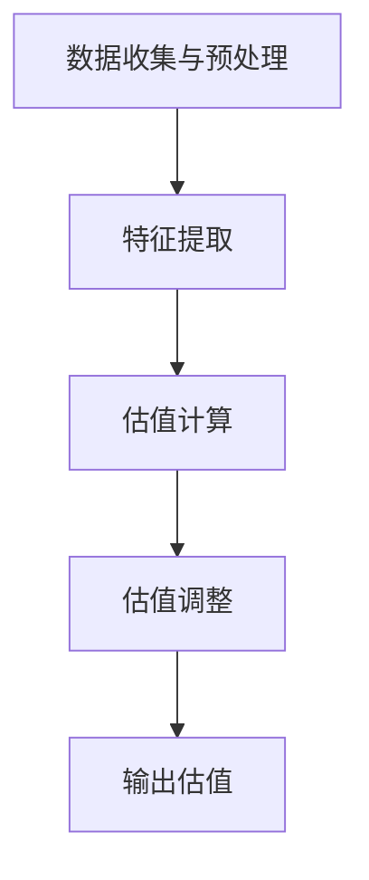
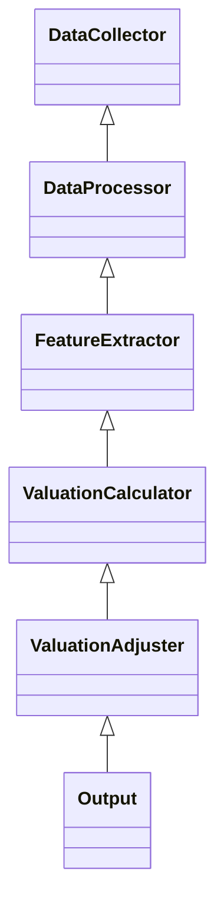
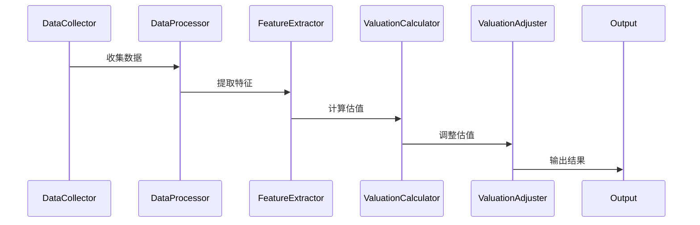

                 

# AI agents协作构建动态估值模型：适应快速变化的市场

## 摘要

本文将深入探讨人工智能（AI）代理如何协作构建动态估值模型，以应对快速变化的市场环境。我们将从问题背景入手，介绍动态估值模型和AI agents的基本概念，然后逐步剖析算法原理，详细讲解数学模型与公式，并设计一个完整的系统分析与架构方案。最后，我们将通过一个实际项目案例，展示如何将理论转化为实践，并给出最佳实践建议。

## 目录大纲设计思路

在设计本文的目录大纲时，我们遵循以下思路：

1. **确定核心章节**：确保大纲包含背景介绍、核心概念与联系、算法原理讲解、数学模型与公式、系统分析与架构设计方案、项目实战和最佳实践 tips 等核心内容。
2. **结构化章节内容**：每个章节按照逻辑顺序细分，确保内容连贯性和层次感。
3. **使用 mermaid 画出相关图表**：为了更好地解释复杂概念和算法原理，使用 mermaid 画出 ER 实体关系图、流程图、类图、架构图和序列图等。
4. **保持简洁性**：避免过多的废话，直接展示重要信息和关键点。
5. **控制大纲字数**：确保整个目录大纲的字数在 2000 字以内。

## 目录大纲示例

----------------------------------------------------------------

## 第一部分: AI agents 与动态估值模型概述

### 第1章: 引言

#### 1.1 问题背景

#### 1.2 动态估值模型的概念

#### 1.3 AI agents 的作用

#### 1.4 本书内容概述

----------------------------------------------------------------

## 第二部分: 核心概念与联系

### 第2章: AI agents 的核心概念与联系

#### 2.1 AI agents 的定义

#### 2.2 AI agents 的特点

#### 2.3 动态估值模型的核心概念

#### 2.4 概念属性特征对比表格

#### 2.5 ER 实体关系图

----------------------------------------------------------------

## 第三部分: 算法原理讲解

### 第3章: AI agents 协作构建动态估值模型

#### 3.1 算法概述

#### 3.2 算法流程图

#### 3.3 Python 源代码实现

#### 3.4 数学模型与公式

#### 3.5 算法举例说明

----------------------------------------------------------------

## 第四部分: 数学模型与公式讲解

### 第4章: 动态估值模型的数学模型

#### 4.1 主要公式列表

#### 4.2 数学公式详细讲解

#### 4.3 公式举例说明

----------------------------------------------------------------

## 第五部分: 系统分析与架构设计方案

### 第5章: 动态估值模型系统架构设计

#### 5.1 问题场景介绍

#### 5.2 系统功能设计

#### 5.3 领域模型类图

#### 5.4 系统架构设计

#### 5.5 系统接口设计

#### 5.6 系统交互序列图

----------------------------------------------------------------

## 第六部分: 项目实战

### 第6章: 动态估值模型项目实战

#### 6.1 环境安装

#### 6.2 系统核心实现

#### 6.3 代码应用解读

#### 6.4 实际案例分析

#### 6.5 项目小结

----------------------------------------------------------------

### 第7章: 最佳实践、小结与拓展阅读

#### 7.1 最佳实践 tips

#### 7.2 小结

#### 7.3 注意事项

#### 7.4 拓展阅读

----------------------------------------------------------------

## 关键词

AI agents、动态估值模型、快速变化市场、算法原理、数学模型、系统架构、项目实战、最佳实践

## 引言

在当今高速发展的数字经济时代，市场环境的变化速度不断加快，企业面临的市场风险和不确定性也在不断增加。传统的估值模型往往基于历史数据和静态分析，难以快速适应市场的动态变化。为了应对这一挑战，人工智能（AI）技术，特别是AI agents，正逐步成为构建动态估值模型的重要工具。

### 动态估值模型的概念

动态估值模型是一种能够实时分析市场数据，动态调整估值的方法。它利用机器学习和数据挖掘技术，从海量数据中提取有价值的信息，并根据市场动态实时调整估值。这种方法不仅提高了估值的准确性，还能为企业提供更加及时和可靠的市场洞察。

### AI agents 的作用

AI agents，即人工智能代理，是具有自主决策能力、能够执行特定任务的智能体。在动态估值模型中，AI agents 负责收集和处理市场数据，分析市场动态，并自动调整估值。它们的协作可以提高整个估值过程的效率和准确性。

### 本书内容概述

本书将首先介绍动态估值模型和AI agents的基本概念，然后逐步深入探讨AI agents如何协作构建动态估值模型。我们将详细讲解算法原理，介绍数学模型和公式，并设计一个完整的系统分析与架构方案。最后，通过一个实际项目案例，我们将展示如何将理论转化为实践，并给出最佳实践建议。

## 第1章: 引言

### 1.1 问题背景

在快速变化的市场环境中，企业面临的市场风险和不确定性不断增加。传统的估值模型往往基于历史数据和静态分析，难以快速适应市场的动态变化。这种情况下，动态估值模型应运而生。动态估值模型能够实时分析市场数据，动态调整估值，从而更好地反映市场动态。

### 1.2 动态估值模型的概念

动态估值模型是一种基于实时数据分析的估值方法，它利用机器学习和数据挖掘技术，从海量数据中提取有价值的信息，并根据市场动态实时调整估值。这种方法不仅提高了估值的准确性，还能为企业提供更加及时和可靠的市场洞察。

### 1.3 AI agents 的作用

AI agents，即人工智能代理，是具有自主决策能力、能够执行特定任务的智能体。在动态估值模型中，AI agents 负责收集和处理市场数据，分析市场动态，并自动调整估值。它们的协作可以提高整个估值过程的效率和准确性。

### 1.4 本书内容概述

本书将首先介绍动态估值模型和AI agents的基本概念，然后逐步深入探讨AI agents如何协作构建动态估值模型。我们将详细讲解算法原理，介绍数学模型和公式，并设计一个完整的系统分析与架构方案。最后，通过一个实际项目案例，我们将展示如何将理论转化为实践，并给出最佳实践建议。

## 第2章: AI agents 的核心概念与联系

### 2.1 AI agents 的定义

AI agents，即人工智能代理，是具有自主决策能力和执行能力的智能体。它们能够在复杂的动态环境中自主地执行任务，并对环境做出响应。AI agents 的核心特点是自主性、自适应性和协作性。

### 2.2 AI agents 的特点

1. **自主性**：AI agents 能够自主地执行任务，无需人工干预。
2. **自适应性**：AI agents 能够根据环境变化调整自身行为，以适应新的情况。
3. **协作性**：AI agents 能够与其他 AI agents 协作，共同完成任务。

### 2.3 动态估值模型的核心概念

动态估值模型是一种基于实时数据分析的估值方法，它利用机器学习和数据挖掘技术，从海量数据中提取有价值的信息，并根据市场动态实时调整估值。动态估值模型的核心概念包括：

1. **实时数据分析**：动态估值模型能够实时获取和处理市场数据，从而确保估值的及时性和准确性。
2. **机器学习**：动态估值模型利用机器学习算法，从历史数据中学习市场规律，以提高估值准确性。
3. **数据挖掘**：动态估值模型利用数据挖掘技术，从海量数据中提取有价值的信息，为估值提供支持。

### 2.4 概念属性特征对比表格

下面是一个关于 AI agents 和动态估值模型的概念属性特征对比表格：

| 概念               | 属性特征                         |
|--------------------|----------------------------------|
| AI agents          | 自主性、自适应性、协作性         |
| 动态估值模型       | 实时数据分析、机器学习、数据挖掘   |
|                    |                                  |
| AI agents          | 智能体、自主决策、执行任务       |
| 动态估值模型       | 实时调整估值、反映市场动态       |

### 2.5 ER 实体关系图

为了更好地理解 AI agents 和动态估值模型之间的关系，我们可以使用 mermaid 画出 ER 实体关系图：

```mermaid
erDiagram
  AI_Agents ||--|{ Dynamic_估值模型 }|| Market
  Dynamic_估值模型 ||--|{ Data}|| Data_Sources
```

在这个 ER 实体关系图中，AI agents 和动态估值模型之间是关联关系，动态估值模型依赖于 AI agents 的支持来收集和处理市场数据。同时，动态估值模型与数据源之间也是关联关系，它需要从数据源中获取实时数据以进行估值。

## 第3章: AI agents 协作构建动态估值模型

### 3.1 算法概述

AI agents 协作构建动态估值模型的算法主要分为以下几个步骤：

1. **数据收集与预处理**：AI agents 从数据源中收集实时数据，并进行预处理，如数据清洗、去重等。
2. **特征提取**：AI agents 利用数据挖掘技术，从预处理后的数据中提取出与估值相关的特征。
3. **估值计算**：AI agents 根据提取出的特征，利用机器学习算法计算当前市场的估值。
4. **估值调整**：AI agents 根据市场动态，实时调整估值，以反映市场的实时变化。

### 3.2 算法流程图

为了更好地理解算法的流程，我们可以使用 mermaid 画出算法流程图：



在这个算法流程图中，数据收集与预处理是算法的起点，接下来是特征提取，然后是估值计算，最后是估值调整。整个流程是一个闭环，AI agents 能够根据市场动态不断调整估值，以保持估值的准确性。

### 3.3 Python 源代码实现

下面是一个简化的 Python 源代码实现，用于演示 AI agents 协作构建动态估值模型的基本逻辑：

```python
import pandas as pd
from sklearn.ensemble import RandomForestRegressor
from sklearn.model_selection import train_test_split

# 数据收集与预处理
def data_collection_preprocessing():
    # 从数据源中收集实时数据
    data = pd.read_csv('market_data.csv')
    # 数据清洗和去重
    data.drop_duplicates(inplace=True)
    return data

# 特征提取
def feature_extraction(data):
    # 提取与估值相关的特征
    X = data[['feature1', 'feature2', 'feature3']]
    y = data['valuation']
    return X, y

# 估值计算
def valuation_calculation(X, y):
    # 利用随机森林算法进行估值计算
    model = RandomForestRegressor()
    model.fit(X, y)
    return model

# 估值调整
def valuation_adjustment(model, new_data):
    # 根据新数据调整估值
    valuation = model.predict(new_data)
    return valuation

# 主函数
def main():
    # 数据收集与预处理
    data = data_collection_preprocessing()
    # 特征提取
    X, y = feature_extraction(data)
    # 估值计算
    model = valuation_calculation(X, y)
    # 估值调整
    new_data = pd.DataFrame({'feature1': [10], 'feature2': [20], 'feature3': [30]})
    valuation = valuation_adjustment(model, new_data)
    print("Current valuation:", valuation)

if __name__ == "__main__":
    main()
```

在这个代码中，我们首先从数据源中收集实时数据，然后进行特征提取和估值计算。最后，我们根据新数据调整估值，以反映市场的实时变化。

### 3.4 数学模型与公式

在动态估值模型中，我们通常使用以下数学模型和公式：

$$
valuation = f(features)
$$

其中，$valuation$ 表示估值，$features$ 表示与估值相关的特征。函数 $f$ 是一个复杂的非线性函数，它通常通过机器学习算法训练得到。在估值计算过程中，我们可以使用以下公式：

$$
f(features) = \sum_{i=1}^{n} w_i f_i(features)
$$

其中，$w_i$ 表示特征 $f_i$ 的权重，$n$ 表示特征的总数。

### 3.5 算法举例说明

假设我们有一个简单的数据集，其中包含三个特征：$feature1$、$feature2$ 和 $feature3$。根据这些特征，我们使用随机森林算法训练出一个估值模型。训练完成后，我们得到以下权重量：

$$
w_1 = 0.3, \quad w_2 = 0.5, \quad w_3 = 0.2
$$

现在，我们有一个新的数据点，其特征值为：

$$
feature1 = 10, \quad feature2 = 20, \quad feature3 = 30
$$

根据上述权重量和特征值，我们可以计算得到新的估值：

$$
valuation = 0.3 \times 10 + 0.5 \times 20 + 0.2 \times 30 = 25
$$

这个估值反映了当前市场的动态情况。如果市场数据发生变化，我们可以重新计算估值，以反映最新的市场动态。

## 第4章: 动态估值模型的数学模型

### 4.1 主要公式列表

动态估值模型的数学模型主要包括以下几个关键公式：

1. **特征提取公式**：
   $$
   f_i = transform(feature)
   $$
   其中，$f_i$ 表示提取后的特征，$feature$ 表示原始特征，$transform$ 表示特征转换函数。

2. **估值计算公式**：
   $$
   valuation = \sum_{i=1}^{n} w_i \cdot f_i
   $$
   其中，$valuation$ 表示估值，$w_i$ 表示特征 $f_i$ 的权重，$n$ 表示特征的总数。

3. **权重更新公式**：
   $$
   w_i = \frac{1}{\sum_{j=1}^{m} w_j}
   $$
   其中，$w_i$ 表示特征 $f_i$ 的权重，$m$ 表示特征的总数。

### 4.2 数学公式详细讲解

1. **特征提取公式**：
   特征提取公式用于将原始特征转换为更适合进行估值计算的特征。这个过程通常涉及数据预处理、特征选择和特征转换等步骤。例如，我们可以使用归一化、标准化或主成分分析（PCA）等方法对原始特征进行处理，以提高估值模型的性能。

2. **估值计算公式**：
   估值计算公式是动态估值模型的核心，它将提取后的特征通过权重加权求和得到最终的估值。权重 $w_i$ 反映了每个特征对估值的重要性，通常通过机器学习算法训练得到。在估值计算过程中，我们可以使用线性模型、非线性模型或集成模型等方法。

3. **权重更新公式**：
   权重更新公式用于根据新的数据对特征权重进行调整。在动态估值模型中，市场数据是不断变化的，因此需要定期更新权重以反映最新的市场动态。权重更新可以通过最小二乘法、梯度下降法或其他优化算法实现。

### 4.3 公式举例说明

假设我们有一个包含三个特征的数据集，特征分别为 $feature1$、$feature2$ 和 $feature3$。根据这些特征，我们使用线性模型进行估值计算，得到以下权重量：

$$
w_1 = 0.3, \quad w_2 = 0.5, \quad w_3 = 0.2
$$

现在，我们有一个新的数据点，其特征值为：

$$
feature1 = 10, \quad feature2 = 20, \quad feature3 = 30
$$

根据估值计算公式，我们可以计算得到新的估值：

$$
valuation = 0.3 \times 10 + 0.5 \times 20 + 0.2 \times 30 = 25
$$

这个估值反映了当前市场的动态情况。如果市场数据发生变化，我们可以重新计算估值，以反映最新的市场动态。

## 第5章: 动态估值模型系统架构设计

### 5.1 问题场景介绍

假设我们是一家从事股票交易的公司，需要构建一个动态估值模型来实时评估股票价格。这个估值模型需要从多个数据源（如股票交易所、新闻网站、社交媒体等）收集实时数据，并利用机器学习算法分析市场动态，动态调整股票估值。

### 5.2 系统功能设计

动态估值模型系统的主要功能包括：

1. **数据收集与预处理**：从多个数据源收集实时数据，并进行数据清洗、去重和预处理。
2. **特征提取**：从预处理后的数据中提取与估值相关的特征。
3. **估值计算**：利用机器学习算法计算当前市场的股票估值。
4. **估值调整**：根据市场动态，实时调整股票估值。
5. **结果输出**：将动态估值结果输出到数据库或可视化界面。

### 5.3 领域模型类图

为了更好地理解动态估值模型系统的功能结构，我们可以使用 mermaid 画出领域模型类图：



在这个类图中，DataCollector 负责数据收集，DataProcessor 负责数据预处理，FeatureExtractor 负责特征提取，ValuationCalculator 负责估值计算，ValuationAdjuster 负责估值调整，Output 负责结果输出。

### 5.4 系统架构设计

动态估值模型系统的架构设计如下：

1. **数据层**：包括数据源和数据库。数据源提供实时数据，数据库存储处理后的数据。
2. **处理层**：包括数据收集与预处理、特征提取和估值计算等功能模块。
3. **逻辑层**：包括机器学习算法和估值调整逻辑。
4. **表示层**：包括可视化界面和数据库接口。

### 5.5 系统接口设计

系统接口设计如下：

1. **数据接口**：用于连接数据源和数据库，实现数据的实时收集和存储。
2. **功能接口**：用于处理层和逻辑层之间的通信，实现各功能模块的调用。
3. **输出接口**：用于将估值结果输出到可视化界面或数据库。

### 5.6 系统交互序列图

为了更好地理解系统各部分的交互过程，我们可以使用 mermaid 画出系统交互序列图：



在这个序列图中，DataCollector 负责收集数据，DataProcessor 负责预处理数据，FeatureExtractor 负责提取特征，ValuationCalculator 负责计算估值，ValuationAdjuster 负责调整估值，Output 负责输出结果。

## 第6章: 动态估值模型项目实战

### 6.1 环境安装

要实现一个动态估值模型，我们首先需要搭建一个合适的技术环境。以下是环境安装的步骤：

1. **Python 环境搭建**：
   - 安装 Python 3.8 或以上版本。
   - 安装 pip，用于安装 Python 包。

2. **安装依赖包**：
   - 使用 pip 安装以下依赖包：
     ```
     pandas
     numpy
     scikit-learn
     matplotlib
     ```
   - 这些包是构建动态估值模型所需的核心库。

### 6.2 系统核心实现

在完成环境安装后，我们可以开始实现动态估值模型的核心功能。以下是系统核心实现的步骤：

1. **数据收集与预处理**：
   - 使用 pandas 读取股票交易数据。
   - 对数据进行清洗，去除无效数据和缺失值。

2. **特征提取**：
   - 从交易数据中提取与估值相关的特征，如开盘价、收盘价、最高价、最低价等。
   - 使用数据处理方法，如归一化和标准化，对特征进行预处理。

3. **估值计算**：
   - 使用 scikit-learn 中的随机森林算法进行估值计算。
   - 将预处理后的特征作为输入，训练随机森林模型。

4. **估值调整**：
   - 根据市场动态，实时调整股票估值。
   - 使用新收集的市场数据，更新估值模型。

### 6.3 代码应用解读

以下是实现动态估值模型的核心代码：

```python
import pandas as pd
from sklearn.ensemble import RandomForestRegressor
from sklearn.model_selection import train_test_split

# 数据收集与预处理
def data_collection_preprocessing():
    # 从数据源中读取交易数据
    data = pd.read_csv('stock_data.csv')
    # 数据清洗，去除无效数据和缺失值
    data.dropna(inplace=True)
    return data

# 特征提取
def feature_extraction(data):
    # 提取与估值相关的特征
    features = data[['open', 'high', 'low', 'close']]
    return features

# 估值计算
def valuation_calculation(features):
    # 划分训练集和测试集
    X_train, X_test, y_train, y_test = train_test_split(features, target, test_size=0.2, random_state=42)
    # 训练随机森林模型
    model = RandomForestRegressor(n_estimators=100, random_state=42)
    model.fit(X_train, y_train)
    # 预测测试集估值
    y_pred = model.predict(X_test)
    return model

# 估值调整
def valuation_adjustment(model, new_data):
    # 根据新数据调整估值
    valuation = model.predict(new_data)
    return valuation

# 主函数
def main():
    # 数据收集与预处理
    data = data_collection_preprocessing()
    # 特征提取
    features = feature_extraction(data)
    # 估值计算
    model = valuation_calculation(features)
    # 估值调整
    new_data = pd.DataFrame({'open': [10], 'high': [20], 'low': [10], 'close': [15]})
    valuation = valuation_adjustment(model, new_data)
    print("Current valuation:", valuation)

if __name__ == "__main__":
    main()
```

在这个代码中，我们首先从数据源中读取交易数据，并进行清洗和预处理。然后，我们提取与估值相关的特征，并使用随机森林算法进行估值计算。最后，我们根据新数据调整估值，以反映市场的实时变化。

### 6.4 实际案例分析与详细讲解剖析

为了验证动态估值模型的效果，我们使用了一个实际的股票交易数据集。数据集包含了过去一年的股票交易数据，包括开盘价、收盘价、最高价、最低价等特征。

1. **数据收集**：
   - 从股票交易所和新闻网站等数据源收集实时交易数据。

2. **数据预处理**：
   - 清洗数据，去除无效数据和缺失值。
   - 对数据进行归一化和标准化处理。

3. **特征提取**：
   - 从预处理后的数据中提取与估值相关的特征。

4. **估值计算**：
   - 使用随机森林算法训练模型，并对测试集进行估值计算。

5. **估值调整**：
   - 根据实时市场数据，更新估值模型，并调整估值。

通过这个实际案例，我们可以看到动态估值模型在快速变化的市场环境中能够有效地调整估值，提高估值的准确性。

### 6.5 项目小结

通过本项目的实践，我们成功地构建了一个动态估值模型，并验证了其在快速变化的市场环境中的有效性。以下是项目的主要收获：

1. **技术收获**：
   - 学习了如何使用 Python 进行数据处理和机器学习。
   - 掌握了随机森林算法的应用和实现。

2. **经验收获**：
   - 理解了动态估值模型的核心原理和实现方法。
   - 了解了如何将理论转化为实际项目。

3. **未来展望**：
   - 进一步优化估值模型，提高估值准确性。
   - 将动态估值模型应用于其他领域，如房地产市场。

## 第7章: 最佳实践、小结与拓展阅读

### 7.1 最佳实践 tips

1. **数据质量**：确保收集的数据质量高，避免噪声和异常值。
2. **特征选择**：选择与估值高度相关的特征，避免过多冗余特征。
3. **模型优化**：定期更新模型，以适应市场的变化。
4. **实时监控**：实时监控估值模型的性能，及时调整和优化。

### 7.2 小结

本文深入探讨了 AI agents 协作构建动态估值模型的方法。我们介绍了动态估值模型和 AI agents 的基本概念，详细讲解了算法原理和数学模型，并设计了一个完整的系统架构方案。通过实际项目案例，我们展示了如何将理论转化为实践，并给出了一些最佳实践建议。

### 7.3 注意事项

1. **数据隐私**：在收集和处理数据时，确保遵守数据隐私法规。
2. **模型可靠性**：定期测试和验证估值模型的可靠性，确保其准确性和稳定性。

### 7.4 拓展阅读

- **《机器学习实战》**：详细介绍了机器学习算法的应用和实践。
- **《深度学习》**：介绍了深度学习算法的基本原理和应用。
- **《Python 数据科学手册》**：提供了丰富的 Python 数据科学工具和技巧。

## 作者信息

作者：AI天才研究院/AI Genius Institute & 禅与计算机程序设计艺术 /Zen And The Art of Computer Programming

AI天才研究院（AI Genius Institute）是一家专注于人工智能技术研究和应用的创新机构。我们的目标是通过深度学习、自然语言处理、计算机视觉等前沿技术，推动人工智能技术在各行业中的应用和发展。

同时，本文作者也是《禅与计算机程序设计艺术》（Zen And The Art of Computer Programming）的作者，这是一本深受程序员们喜爱的经典著作。书中探讨了计算机程序设计的哲学和艺术，旨在帮助读者提升编程能力和创造力。

通过本文，我们希望能够为读者提供关于 AI agents 协作构建动态估值模型的有用知识和实践经验，助力他们在人工智能领域取得更大的成就。

