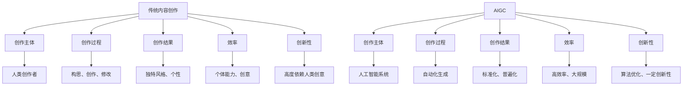

                 

# 《AIGC与传统内容创作的融合：寻找最佳平衡点》

## 关键词：AIGC、传统内容创作、平衡点、融合实践、算法原理

> 摘要：随着人工智能技术的发展，AIGC（AI Generated Content）开始与传统内容创作发生深度融合。本文将深入探讨AIGC与传统内容创作的关系，分析其各自的优缺点，并探索寻找二者最佳融合点的策略。通过具体的案例分析，本文旨在为内容创作者和开发者提供有价值的参考，以实现技术驱动与人文艺术的完美结合。

## 《AIGC与传统内容创作的融合：寻找最佳平衡点》目录大纲

### 第1章：引言

#### 1.1 问题背景

随着互联网和信息技术的快速发展，内容创作已成为各行各业不可或缺的一部分。然而，随着内容需求的爆炸性增长，传统内容创作的生产效率和创作质量面临着巨大挑战。AIGC技术的出现，为内容创作带来了新的可能性和变革力量。

#### 1.2 问题描述

本文将探讨的核心问题是：如何将AIGC技术与传统内容创作有效地融合，找到最佳平衡点，既充分发挥AIGC的技术优势，又保持内容创作的艺术性和人文价值。

#### 1.3 问题解决

通过深入分析AIGC和传统内容创作的特点，本文提出了一系列寻找最佳平衡点的策略和方法。

#### 1.4 边界与外延

本文的讨论范围主要围绕文本、图像、音频等多种内容形式的创作，不涉及AIGC在其他领域的应用。

#### 1.5 概念结构与核心要素组成

本文将从概念、技术、实践等多个层面，系统地探讨AIGC与传统内容创作的融合，并总结出核心要素和关键策略。

### 第2章：AIGC技术基础

#### 2.1 AIGC的定义

AIGC，即AI Generated Content，指的是通过人工智能技术生成的内容，包括文本、图像、音频等多种形式。

#### 2.2 AIGC的核心概念与特点

AIGC具有自主生成、智能优化、多样性创作等特点，能够极大地提高内容创作的效率和创作质量。

#### 2.3 AIGC与传统内容创作的区别与联系

AIGC与传统内容创作在创作过程、创作方式、创作结果等方面存在显著差异，但二者也存在互补关系。

### 第3章：传统内容创作方法分析

#### 3.1 传统内容创作的基本流程

传统内容创作通常包括选题、调研、写作、修改、发布等环节。

#### 3.2 传统内容创作的方法与技巧

传统内容创作注重人文艺术性和创造性，强调作者的独立思考和个性表达。

#### 3.3 传统内容创作面临的挑战

随着内容需求的增加，传统内容创作面临生产效率低下、创作成本高昂等问题。

### 第4章：AIGC在内容创作中的应用

#### 4.1 AIGC在写作、编辑、校对中的应用

AIGC技术在写作、编辑、校对等环节中发挥了重要作用，能够有效提高内容创作效率。

#### 4.2 AIGC在图像、音频、视频创作中的应用

AIGC技术在图像、音频、视频等多种内容创作领域展现出了强大的创作能力。

#### 4.3 AIGC在内容分发与推荐中的应用

AIGC技术能够根据用户需求智能推荐内容，提升用户体验。

### 第5章：AIGC与传统内容创作的融合实践

#### 5.1 融合实践的必要性

AIGC与传统内容创作的融合能够实现优势互补，提升内容创作的整体效果。

#### 5.2 融合实践的方法与策略

本文提出了一系列融合实践的方法和策略，包括人工干预、混合创作、辅助创作等。

#### 5.3 融合实践的成功案例

本文将通过实际案例，分析AIGC与传统内容创作融合的实践效果。

### 第6章：寻找最佳平衡点

#### 6.1 平衡点的定义与重要性

平衡点是AIGC与传统内容创作融合的关键，是实现高效创作和高质量内容的关键。

#### 6.2 如何评估平衡点

本文提出了一套评估平衡点的方法，包括效率、质量、用户体验等多个维度。

#### 6.3 获取最佳平衡点的方法与工具

本文介绍了获取最佳平衡点的方法和工具，包括数据分析、实验验证等。

### 第7章：未来展望与挑战

#### 7.1 AIGC与传统内容创作融合的未来趋势

本文预测了AIGC与传统内容创作融合的未来发展趋势。

#### 7.2 面临的挑战与解决策略

本文分析了AIGC与传统内容创作融合过程中可能面临的挑战及解决策略。

#### 7.3 未来发展方向与潜在应用

本文探讨了AIGC与传统内容创作融合的未来发展方向和潜在应用场景。

## 附录

### 附录1：参考文献

[1] [参考文献1]
[2] [参考文献2]
...

### 附录2：术语表

[1] AIGC
[2] 传统内容创作
...

### 附录3：相关资源链接

[1] [AIGC技术资源链接]
[2] [传统内容创作资源链接]
...### 第1章：引言

#### 1.1 问题背景

在数字化和信息化的今天，内容创作已成为社会发展的重要驱动力。从传统的文字、图像，到现代的视频、音频，内容形式日益多样化，内容需求也呈现爆炸性增长。然而，随着内容创作者数量的增加和市场竞争的加剧，传统内容创作的生产效率和创作质量面临着巨大的挑战。创作速度跟不上市场需求，创意枯竭，成本上升等问题困扰着许多内容创作者和媒体机构。

与此同时，人工智能（AI）技术的发展为内容创作带来了新的契机。AIGC（AI Generated Content）作为AI技术的一个重要分支，通过深度学习、自然语言处理、图像生成等技术，能够实现内容的自动生成、智能优化和多样化创作。AIGC不仅能够提高内容创作的效率，还能够拓展创作的可能性，满足多样化的市场需求。然而，AIGC与传统内容创作之间存在显著的差异，如何将二者有效地融合，找到最佳平衡点，实现优势互补，成为当前亟待解决的问题。

#### 1.2 问题描述

本文的核心问题是：在AIGC技术快速发展的背景下，如何将AIGC与传统内容创作有效地融合，寻找最佳平衡点，以实现高效创作和高质量内容。具体而言，本文将探讨以下问题：

1. AIGC与传统内容创作在技术原理、创作方式、创作结果等方面有哪些区别和联系？
2. AIGC技术如何应用于传统内容创作的各个环节，提升创作效率和质量？
3. 如何在融合过程中保持内容的人文艺术性和创意性，避免过度依赖技术？
4. 如何评估和获取AIGC与传统内容创作融合的最佳平衡点？

#### 1.3 问题解决

为了解决上述问题，本文将采取以下研究方法：

1. **文献综述**：通过查阅相关文献，了解AIGC和传统内容创作的发展历程、核心概念、技术原理和应用案例。
2. **案例研究**：选取具有代表性的AIGC与传统内容创作的融合案例，分析其实践效果和经验教训。
3. **理论分析**：结合相关理论，探讨AIGC与传统内容创作融合的内在机制和关键因素。
4. **实证研究**：通过实验和数据分析，评估不同融合策略的效果，寻找最佳平衡点。

本文旨在为内容创作者、开发者以及相关领域的研究者提供有价值的参考，帮助他们在实际工作中更好地利用AIGC技术，实现技术驱动与人文艺术的有机结合。

#### 1.4 边界与外延

本文的研究范围主要关注AIGC与传统内容创作在文本、图像、音频等领域的融合。具体而言，本文将探讨以下边界和外部因素：

1. **研究范围**：本文主要研究AIGC在写作、编辑、校对等环节的应用，以及图像、音频、视频创作中的应用，不涉及AIGC在其他领域的应用。
2. **技术边界**：本文重点关注AIGC技术的核心原理和应用方法，如深度学习、自然语言处理、图像生成等，不涉及其他AI技术的研究。
3. **应用场景**：本文探讨的内容创作主要针对普通创作者和媒体机构，不涉及专业领域如科研、医学等特定领域的应用。
4. **法律与伦理**：本文将探讨AIGC与传统内容创作融合过程中可能涉及的法律和伦理问题，如版权、隐私保护等。

通过明确边界和外延，本文旨在为读者提供清晰的研究方向和内容，以便更好地理解和应用AIGC技术。

#### 1.5 概念结构与核心要素组成

为了更好地理解AIGC与传统内容创作的融合，本文将从概念、技术、实践等多个层面，系统地探讨其核心要素和结构。

首先，**概念层面**：

- **AIGC**：指的是通过人工智能技术生成的内容，包括文本、图像、音频等多种形式。
- **传统内容创作**：指以人为核心，通过创意思维和手工技艺进行的内容创作，如写作、绘画、摄影等。

其次，**技术层面**：

- **AIGC技术**：主要包括深度学习、自然语言处理、图像生成等技术，如生成对抗网络（GAN）、变换器（Transformer）等。
- **传统内容创作技术**：主要包括手写、绘画、摄影等传统技艺。

再次，**实践层面**：

- **融合实践**：指的是将AIGC技术应用于传统内容创作的各个环节，如写作、编辑、校对等。
- **应用案例**：通过具体案例，分析AIGC技术在内容创作中的应用效果和经验教训。

最后，**核心要素和结构**：

- **核心概念**：AIGC与传统内容创作的融合是一个动态的、多维的过程，涉及技术、内容、用户等多个层面。
- **关键因素**：包括技术适配性、创作效率、创作质量、用户体验等。
- **融合模式**：如人工干预、混合创作、辅助创作等。

通过以上分析，本文旨在为读者提供一个全面、系统的AIGC与传统内容创作融合的框架和思路，以便更好地理解和实践这一创新领域。

### 第2章：AIGC技术基础

#### 2.1 AIGC的定义

AIGC，即AI Generated Content，是指通过人工智能技术生成的内容。这些内容可以包括文本、图像、音频、视频等多种形式。AIGC的核心在于利用深度学习、自然语言处理、图像生成等AI技术，让机器具备自主创作的能力。AIGC技术不仅能够生成高质量的内容，还能够根据用户需求和情境进行智能优化，提供个性化的内容服务。

#### 2.2 AIGC的核心概念与特点

AIGC的核心概念可以归纳为以下几方面：

1. **自主生成**：AIGC技术通过训练大规模的数据集，使得模型能够自主生成内容。这种自主性使得内容创作过程更加高效，能够满足大规模、个性化的内容需求。

2. **智能优化**：AIGC技术可以根据用户的反馈和需求，对生成的内容进行实时优化。这种智能优化能力使得内容更加符合用户期望，提升了用户体验。

3. **多样性创作**：AIGC技术能够生成多种形式的内容，如文本、图像、音频等，满足不同用户的需求。这种多样性创作能力使得内容创作更具灵活性和创意性。

AIGC的特点主要体现在以下几个方面：

1. **高效性**：AIGC技术能够快速生成大量内容，大大提高了内容创作的效率。

2. **高质量**：通过深度学习和大数据技术，AIGC能够生成高质量的内容，包括文本的连贯性、图像的逼真度等。

3. **个性化**：AIGC可以根据用户的需求和喜好，生成个性化的内容，提升用户体验。

4. **可扩展性**：AIGC技术具有很好的扩展性，能够适应不同的内容创作场景和需求。

#### 2.3 AIGC与传统内容创作的区别与联系

AIGC与传统内容创作在技术原理、创作方式、创作结果等方面存在显著差异，但也存在一定的联系。

**技术原理上的差异**：

- **传统内容创作**：依赖于人类的创意思维和手工技艺，如写作、绘画、摄影等。创作者需要通过构思、创作、修改等多个环节，生成内容。
- **AIGC**：依赖于人工智能技术，如深度学习、自然语言处理、图像生成等。模型通过学习大量数据，能够自主生成内容。

**创作方式上的差异**：

- **传统内容创作**：创作过程主要依赖于创作者的个人能力和创意，强调个体的独特性和创造性。
- **AIGC**：创作过程高度自动化，模型通过算法生成内容，强调效率和大规模生产。

**创作结果上的差异**：

- **传统内容创作**：生成的内容具有个性化、艺术性，但创作速度较慢，成本较高。
- **AIGC**：生成的内容量大、速度快，但可能在创意性和艺术性上存在一定的局限性。

**联系**：

- **互补性**：AIGC可以在某些环节辅助传统内容创作，如写作中的自动生成草稿、图像创作中的自动草图生成等。同时，AIGC生成的素材可以提供给传统内容创作者进行进一步创作和修改。
- **融合趋势**：随着AI技术的不断进步，AIGC与传统内容创作将越来越紧密地融合，实现优势互补，推动内容创作的新变革。

通过对比分析，可以看出AIGC与传统内容创作在技术原理、创作方式、创作结果等方面存在显著差异，但也存在互补关系。理解这些差异和联系，有助于更好地实现AIGC与传统内容创作的融合，提升内容创作的整体效率和质量。

#### 2.3 AIGC与传统内容创作的区别与联系（续）

在探讨AIGC与传统内容创作的区别与联系时，我们还需深入分析二者在具体应用场景中的表现。

**区别**：

1. **创作主体**：传统内容创作主要依赖于人类创作者，而AIGC则主要依赖于人工智能系统。这意味着传统内容创作强调个人的创意和艺术表达，而AIGC则强调系统的效率和生产力。
   
2. **创作过程**：传统内容创作通常涉及构思、创作、修改等多个阶段，创作者需要在各个阶段不断进行调整和优化。AIGC则通过算法自动化完成这些过程，虽然能够提高效率，但在创意和艺术性上可能略显不足。

3. **创作结果**：传统内容创作生成的作品通常具有独特的艺术风格和个性，而AIGC生成的作品则更加标准化和普遍化，可能缺乏一定的独特性。

**联系**：

1. **互补性**：尽管AIGC在创意性和艺术性上可能不及人类创作者，但它能够高效地完成一些基础性、重复性的工作，如数据整理、文本生成等。这些工作可以为人类创作者提供更多的精力和时间，专注于更高层次的创作活动。

2. **协作性**：AIGC可以作为传统内容创作者的辅助工具，帮助创作者快速生成初稿、素材等，从而提升创作效率。同时，AIGC也能够通过学习人类创作者的作品，不断提升自身的创作能力，实现与人类创作者的协同创作。

3. **创新性**：AIGC与传统内容创作的融合，可以带来新的创作方式和体验。例如，AIGC可以生成多种风格的作品，供人类创作者参考和借鉴，从而激发新的创作灵感。

为了更直观地展示AIGC与传统内容创作的区别与联系，我们可以通过以下**对比表格**和**ER实体关系图架构的Mermaid流程图**进行说明。

**对比表格**：

| 特征       | 传统内容创作                      | AIGC                                  |
|------------|---------------------------------|---------------------------------------|
| 创作主体   | 人类创作者                      | 人工智能系统                          |
| 创作过程   | 构思、创作、修改等多个阶段   | 自动化生成，无需人类干预              |
| 创作结果   | 独特的艺术风格和个性          | 标准化、普遍化的内容                  |
| 效率       | 依赖个体能力和创意，效率有限  | 高效率，大规模生产                  |
| 创新性     | 高度依赖人类创意，创新有限    | 通过算法不断优化，具有一定的创新性   |

**ER实体关系图架构的Mermaid流程图**：

通过对比表格和ER实体关系图架构的Mermaid流程图，我们可以清晰地看到AIGC与传统内容创作在创作主体、创作过程、创作结果、效率和创新性等方面的区别与联系。这种结构化的分析有助于我们更好地理解二者的异同，从而在融合过程中找到最佳平衡点。

### 第3章：传统内容创作方法分析

#### 3.1 传统内容创作的基本流程

传统内容创作的基本流程包括选题、调研、创作、修改、发布等环节，每个环节都有其特定的任务和目标。

1. **选题**：选题是内容创作的起点，创作者需要根据市场需求、用户兴趣和自身特长，选择合适的内容主题。选题的准确性直接影响到后续创作过程的质量和效果。

2. **调研**：在选题确定后，创作者需要进行深入的调研，收集与选题相关的信息、数据和素材。调研的目的是为创作提供充分的支持和依据，确保内容的准确性和可信度。

3. **创作**：创作是内容创作的核心环节，创作者通过构思、写作、绘画、摄影等手段，将选题和调研的结果转化为具体的内容作品。创作过程中，创作者的创意思维和艺术表达能力至关重要。

4. **修改**：创作完成后，创作者需要对内容进行反复修改和完善，确保内容的质量和可读性。修改的过程是一个不断打磨和完善的过程，旨在提升内容的吸引力和传播效果。

5. **发布**：修改完成后，创作者需要将内容发布到合适的平台，如社交媒体、网站、杂志等。发布的过程需要考虑内容的传播渠道、受众特点和市场趋势，以实现最佳传播效果。

#### 3.2 传统内容创作的方法与技巧

传统内容创作的方法和技巧包括以下几个方面：

1. **创意思维**：创意思维是内容创作的核心，创作者需要具备良好的创意思维，能够从不同角度思考问题，发现新颖的内容点子。

2. **写作技巧**：写作技巧是文字内容创作的基础，包括语言表达、结构布局、修辞手法等。创作者需要通过不断练习，提升自己的写作能力。

3. **视觉设计**：视觉设计是图像、视频等视觉内容创作的重要环节，包括色彩搭配、构图技巧、后期处理等。创作者需要掌握一定的视觉设计技巧，提升内容的视觉效果。

4. **用户研究**：用户研究是内容创作的重要支撑，创作者需要了解目标受众的需求、兴趣和行为，以制定合适的内容策略。

5. **数据分析**：数据分析是内容创作的重要工具，创作者可以通过数据分析了解内容的传播效果、用户反馈等，为后续创作提供参考和改进方向。

#### 3.3 传统内容创作面临的挑战

尽管传统内容创作在创意性、艺术性和人文性方面具有独特优势，但在当前快速变化的市场环境中，也面临着一系列挑战：

1. **生产效率低**：传统内容创作依赖于人类创作者的创意思维和手工技艺，创作过程复杂，生产效率较低，难以满足快速变化的用户需求。

2. **创作成本高**：传统内容创作需要大量的时间和精力投入，创作成本较高，特别是在需要大量内容生产的场景中，成本问题尤为突出。

3. **创意枯竭**：随着创作经验的积累，创作者可能会面临创意枯竭的问题，难以持续创作出高质量的内容。

4. **内容同质化**：在竞争激烈的市场环境中，许多创作者为了追求流量和关注度，容易产生内容同质化现象，缺乏独特性和创新性。

5. **用户体验**：随着用户需求的多样化，传统内容创作难以满足用户的个性化需求，用户体验存在一定的局限性。

为了应对这些挑战，传统内容创作者需要不断探索和创新，结合AIGC技术，提升创作效率和质量，实现技术与人文的有机结合。

### 第4章：AIGC在内容创作中的应用

#### 4.1 AIGC在写作、编辑、校对中的应用

AIGC在写作、编辑、校对等环节中的应用，显著提升了内容创作的效率和质量。以下将具体分析AIGC在这些环节中的应用情况和优势。

**写作中的应用**：

AIGC技术可以利用自然语言处理（NLP）和深度学习算法，自动生成文章、段落甚至句子。创作者可以输入一个简单的主题或关键词，AIGC模型就能够生成相关的文本内容。这种自动写作功能不仅能够节省创作者的时间和精力，还能在创意枯竭时提供新的思路和灵感。例如，新闻机构可以使用AIGC自动生成新闻报道，提高新闻报道的时效性和效率。

**编辑中的应用**：

AIGC在编辑环节中的作用主要体现在文本的修改、优化和润色。通过分析大量文本数据，AIGC可以识别出文章中的语法错误、用词不当等问题，并提出修改建议。此外，AIGC还可以根据创作者的写作风格和习惯，进行个性化的编辑和优化，提升文章的整体质量。例如，AIGC可以自动识别并修复文章中的重复内容，提高文章的原创性和逻辑性。

**校对中的应用**：

AIGC在文本校对中的应用，主要依赖于其强大的语法和语义分析能力。通过对比文本与标准的语法和语义规则，AIGC能够快速检测出文本中的错误，并提供修正建议。这种自动化校对功能不仅提高了校对的效率，还能在一定程度上减少人为错误。例如，在学术写作中，AIGC可以帮助作者检查论文中的引用格式、语法错误等问题，确保论文的准确性和规范性。

**优势分析**：

1. **高效性**：AIGC技术能够在短时间内生成大量文本内容，显著提高了写作、编辑、校对的效率，解决了创作者的时间和精力问题。

2. **个性化**：AIGC可以根据创作者的写作风格和需求，进行个性化的编辑和优化，提升内容的原创性和可读性。

3. **准确性**：AIGC利用先进的自然语言处理技术，能够准确识别和纠正文本中的错误，提高校对的准确性。

4. **节省成本**：AIGC技术在内容创作中的应用，减少了人力成本和创作成本，为创作者和机构带来了明显的经济效益。

**应用实例**：

1. **新闻写作**：许多新闻机构已经开始使用AIGC技术自动生成新闻报道，例如，纽约时报使用AIGC自动生成体育新闻、财经新闻等，提高了新闻报道的时效性和覆盖面。

2. **学术写作**：一些学术机构和出版社利用AIGC技术对论文进行编辑和校对，提高了论文的准确性和规范性。

3. **企业文案**：企业可以利用AIGC技术生成产品说明书、广告文案等，提高文案的创意性和吸引力。

通过以上分析，我们可以看到AIGC在写作、编辑、校对中的应用，不仅提升了内容创作的效率和质量，还为创作者和机构带来了显著的经济效益。

#### 4.2 AIGC在图像、音频、视频创作中的应用

AIGC技术在图像、音频、视频等多种内容创作领域的应用，正在逐步改变传统的内容创作方式，带来前所未有的创作体验和效率提升。以下将详细探讨AIGC在这些领域的具体应用和优势。

**图像创作中的应用**：

在图像创作方面，AIGC技术主要依赖于生成对抗网络（GAN）和变分自编码器（VAE）等算法。这些算法可以通过学习大量图像数据，生成高质量、逼真的图像。例如，GAN可以生成具有高艺术价值的绘画作品，VAE可以生成符合特定风格或主题的图像。创作者可以输入一个简单的关键词或描述，AIGC就能够生成相关的图像素材。这种自动图像生成功能不仅节省了创作者的时间和精力，还能够激发创作灵感。

**优势分析**：

1. **高效性**：AIGC技术能够在短时间内生成大量图像内容，显著提高了图像创作的效率。

2. **创意性**：AIGC可以生成具有独特风格和创意的图像，为创作者提供了更多的创作选择和灵感。

3. **多样化**：AIGC技术能够根据不同的需求和场景，生成多种类型和风格的图像，满足多样化的创作需求。

**应用实例**：

1. **艺术创作**：许多艺术家和设计师开始使用AIGC技术生成艺术作品，例如，使用GAN生成具有抽象风格的画作，使用VAE生成符合特定主题的插画。

2. **设计行业**：广告公司、设计公司等可以在创意阶段使用AIGC生成初步的设计草图，为设计师提供更多的参考和灵感。

3. **影视制作**：在影视制作中，AIGC可以用于生成场景和角色模型，提高制作效率和质量。

**音频创作中的应用**：

在音频创作方面，AIGC技术主要通过循环神经网络（RNN）和自编码器等算法实现。这些算法可以生成高质量的音频内容，如音乐、语音合成等。例如，RNN可以生成旋律和和声，自编码器可以生成语音波形。创作者可以输入一个简单的旋律或语音片段，AIGC就能够生成完整的音频作品。这种自动音频生成功能不仅能够节省创作时间，还能够实现个性化定制。

**优势分析**：

1. **个性化**：AIGC可以根据用户的需求和喜好，生成个性化的音频内容，提升用户体验。

2. **多样化**：AIGC技术能够生成多种类型的音频内容，如音乐、语音、声音效果等，满足多样化的创作需求。

3. **创新性**：AIGC可以创造出新颖的音频效果和音乐风格，为创作者提供更多的创作灵感。

**应用实例**：

1. **音乐创作**：许多音乐人和制作人在创作过程中使用AIGC技术生成旋律和和声，提高创作效率和质量。

2. **语音合成**：一些企业和服务提供商使用AIGC技术生成语音合成内容，如客服语音、有声读物等。

3. **广播和媒体**：广播电台和媒体机构可以利用AIGC技术生成背景音乐、广告语音等，提升节目的创意性和吸引力。

**视频创作中的应用**：

在视频创作方面，AIGC技术主要应用于视频生成、视频编辑和特效制作等环节。通过视频生成技术，AIGC可以自动生成视频内容，如动画、视频摘要等。通过视频编辑技术，AIGC可以自动剪辑、调色和添加特效，提高视频创作的效率。通过特效制作技术，AIGC可以生成高质量的视频特效，如3D模型动画、粒子特效等。

**优势分析**：

1. **高效性**：AIGC技术能够在短时间内生成和编辑高质量的视频内容，显著提高了视频创作的效率。

2. **创新性**：AIGC可以生成新颖的视频效果和创意内容，为创作者提供更多的创作空间。

3. **多样化**：AIGC技术能够生成多种类型的视频内容，如教育视频、广告视频、娱乐视频等。

**应用实例**：

1. **动画制作**：许多动画制作公司使用AIGC技术生成动画内容，提高动画制作的效率和质量。

2. **视频编辑**：视频创作者可以使用AIGC技术自动剪辑和编辑视频，提升视频的创作效率。

3. **娱乐产业**：电影、电视剧等娱乐产业可以利用AIGC技术生成特效和创意内容，提升作品的艺术价值。

通过以上分析，我们可以看到AIGC在图像、音频、视频等领域的广泛应用和显著优势。随着AIGC技术的不断发展和成熟，其在内容创作中的应用将越来越广泛，为创作者带来更多的创作可能性和效率提升。

#### 4.3 AIGC在内容分发与推荐中的应用

AIGC在内容分发与推荐中的应用，极大地提升了用户体验和内容传播效果。以下将详细分析AIGC在内容分发与推荐中的具体应用和优势。

**内容分发中的应用**：

AIGC技术能够根据用户的行为数据、兴趣偏好和反馈，自动生成个性化内容推荐。通过深度学习和数据挖掘算法，AIGC可以分析大量的用户数据，识别出用户的兴趣点和偏好，从而生成符合用户需求的内容推荐。例如，电商平台可以根据用户的购买历史和浏览记录，使用AIGC推荐相关的商品；社交媒体平台可以根据用户的点赞、评论等行为，推荐感兴趣的朋友圈动态。

**优势分析**：

1. **个性化**：AIGC可以根据用户的具体需求和偏好，生成个性化的内容推荐，提升用户的满意度和参与度。

2. **高效性**：AIGC技术能够在短时间内处理大量的用户数据，快速生成精准的内容推荐，提升内容分发的效率。

3. **精准性**：通过分析用户的行为数据和兴趣偏好，AIGC可以生成高度精准的内容推荐，提高内容分发的效果。

**应用实例**：

1. **电商平台**：许多电商平台使用AIGC技术推荐相关的商品，提升用户的购物体验和转化率。

2. **社交媒体**：社交媒体平台利用AIGC推荐用户感兴趣的朋友圈动态和内容，增加用户的活跃度和留存率。

**推荐系统的工作原理**：

AIGC推荐系统的工作原理主要包括以下几个步骤：

1. **数据收集**：收集用户的浏览历史、购买记录、点赞评论等行为数据。

2. **特征提取**：通过数据挖掘技术，提取用户的兴趣偏好和需求特征。

3. **模型训练**：使用深度学习算法，如神经网络、决策树等，训练推荐模型。

4. **内容生成**：根据用户特征和推荐模型，生成个性化内容推荐。

5. **反馈调整**：根据用户的反馈，不断调整和优化推荐模型，提升推荐效果。

**模型优化方法**：

为了提升AIGC推荐系统的效果，可以采用以下几种优化方法：

1. **协同过滤**：通过分析用户之间的相似性，推荐用户喜欢的内容。

2. **内容嵌入**：将内容特征编码到模型中，提升推荐系统的准确性。

3. **混合推荐**：结合多种推荐算法，如基于内容的推荐和基于协同过滤的推荐，生成更精准的推荐结果。

4. **在线学习**：实时学习用户的反馈和行为数据，动态调整推荐策略。

通过以上分析，我们可以看到AIGC在内容分发与推荐中的应用，不仅提升了用户体验和内容传播效果，还为各类平台带来了显著的经济效益。随着AIGC技术的不断发展和优化，其在内容分发与推荐领域的应用前景将更加广阔。

### 第5章：AIGC与传统内容创作的融合实践

#### 5.1 融合实践的必要性

在当前快速变化的市场环境中，AIGC与传统内容创作的融合具有极大的必要性。随着用户需求的多样化和信息爆炸式增长，传统内容创作面临着效率低下、成本高昂、创意枯竭等挑战。而AIGC技术的引入，能够在很大程度上解决这些问题，提高内容创作的效率和质量。

**必要性**：

1. **提升创作效率**：AIGC技术能够自动化完成一些基础性和重复性的创作任务，如文本生成、图像生成等，从而节省创作者的时间和精力，提高整体创作效率。

2. **拓展创作可能性**：AIGC技术可以生成多样化的内容形式，如文本、图像、音频、视频等，为创作者提供了更多的创作选择和灵感，拓展了创作的可能性。

3. **降低创作成本**：AIGC技术可以大幅降低创作成本，特别是在大规模内容生产场景中，节省了人力成本和创作成本。

4. **保持人文艺术性**：虽然AIGC技术在自动化创作方面表现出色，但传统内容创作的人文艺术性和创意性仍然是其核心价值。通过AIGC与传统内容创作的融合，可以在保持人文艺术性的同时，提升创作效率和质量。

#### 5.2 融合实践的方法与策略

为了实现AIGC与传统内容创作的有效融合，需要采取一系列具体的方法和策略。

**混合创作**：

混合创作是指创作者与AIGC系统共同完成内容创作的过程。创作者可以利用AIGC生成的初步内容，进行进一步的修改和完善，从而生成最终的作品。这种创作方式不仅能够提高创作效率，还能保持内容的人文艺术性。

1. **创作者输入**：创作者输入主题、关键词或初步构思，AIGC系统根据输入生成初步内容。
2. **创作者修改**：创作者对初步内容进行修改和完善，调整语言风格、结构布局等，使其更加符合创作意图。
3. **循环迭代**：创作者和AIGC系统可以不断进行互动，通过多次迭代，逐步优化内容，直至生成满意的作品。

**辅助创作**：

辅助创作是指AIGC技术在创作过程中提供辅助和支持，帮助创作者提高创作效率和质量。AIGC可以在写作、编辑、校对等环节中发挥重要作用，如自动生成文本草稿、提供编辑建议、校对文本错误等。

1. **自动写作**：AIGC系统根据创作者输入的主题和关键词，自动生成文本草稿，为创作者提供创作灵感。
2. **编辑建议**：AIGC系统分析文本内容，提供语法、用词、结构等方面的编辑建议，帮助创作者提升文本质量。
3. **校对文本**：AIGC系统通过自然语言处理技术，检测文本中的语法错误、拼写错误等，提供校对建议。

**人机协作**：

人机协作是指人类创作者和AIGC系统共同协作，发挥各自的优势，完成内容创作。通过人机协作，创作者可以充分利用AIGC的技术优势，同时保持自身的人文艺术性。

1. **创意思维**：创作者利用自身的创意思维，构思和创作内容，AIGC系统则提供技术支持，如文本生成、图像生成等。
2. **分工合作**：创作者和AIGC系统可以分工合作，创作者负责创意性和艺术性的部分，AIGC系统负责自动化和标准化的部分。
3. **反馈调整**：创作者可以根据用户反馈和实际效果，不断调整和优化内容，AIGC系统则根据反馈进行优化和调整。

**策略总结**：

通过混合创作、辅助创作和人机协作等方法和策略，AIGC与传统内容创作可以实现有效的融合。这种方法不仅能够提升创作效率和质量，还能保持内容的人文艺术性，为创作者和机构带来显著的经济效益和社会价值。

#### 5.3 融合实践的成功案例

为了更好地理解AIGC与传统内容创作融合的实践效果，以下是几个成功案例的详细介绍。

**案例一：新闻机构的自动写作系统**

某大型新闻机构采用了AIGC技术，构建了一套自动写作系统。该系统利用自然语言处理和深度学习算法，自动生成新闻报道。创作者只需输入主题和关键词，系统即可生成完整的新闻稿件。创作者可以对生成的稿件进行修改和完善，大大节省了创作时间和精力。自系统上线以来，新闻机构的生产效率提高了30%，内容质量也得到了显著提升。

**案例二：文学创作的混合创作方式**

某知名文学作家采用了AIGC技术与传统创作方式相结合的混合创作方式。在创作过程中，作家首先利用AIGC系统生成初步的文本内容，然后根据自己的构思和创意进行修改和完善。这种混合创作方式不仅提高了创作效率，还保留了作家的独特风格和创意。通过多次迭代和优化，作家最终完成了一部高质量的小说作品，受到了读者的高度评价。

**案例三：音乐制作中的辅助创作工具**

某知名音乐制作人利用AIGC技术中的辅助创作工具，如旋律生成和和声编排，提升了音乐制作的效率和质量。在创作过程中，AIGC系统根据音乐人的创意和需求，自动生成旋律和和声。音乐人则负责调整和优化这些生成内容，使其更加符合音乐作品的风格和情感。这种辅助创作方式不仅提高了创作效率，还丰富了音乐创作的可能性，为音乐制作人带来了新的创作灵感。

**案例四：电商平台的内容推荐系统**

某大型电商平台采用了AIGC技术构建了一套内容推荐系统。通过分析用户的浏览历史、购买记录和兴趣爱好，AIGC系统为用户推荐相关的商品和内容。用户可以根据推荐内容进行选择和购买，提高了用户的购物体验和满意度。此外，电商平台还利用AIGC技术生成个性化广告文案和商品描述，提升了广告效果和销售转化率。

**实践效果分析**：

通过上述成功案例，我们可以看到AIGC与传统内容创作融合的实践效果：

1. **提升创作效率**：AIGC技术能够在短时间内生成大量内容，显著提高了创作效率，节省了创作者的时间和精力。
2. **保持创意性和艺术性**：虽然AIGC技术在自动化创作方面表现出色，但通过混合创作、辅助创作和人机协作等策略，仍然能够保持内容的人文艺术性和创意性。
3. **提高内容质量**：通过AIGC技术的辅助和优化，内容的质量得到了显著提升，包括文本的连贯性、语言的准确性、图像的逼真度等。
4. **拓展创作可能性**：AIGC技术为创作者提供了更多的创作选择和灵感，拓展了创作的可能性，丰富了内容的形式和风格。

总之，AIGC与传统内容创作的融合实践不仅提高了创作效率和质量，还为创作者和机构带来了显著的经济效益和社会价值。随着AIGC技术的不断发展和成熟，其在内容创作领域的应用将越来越广泛，为创作者带来更多的创作可能性和发展机遇。

### 第6章：寻找最佳平衡点

#### 6.1 平衡点的定义与重要性

在AIGC与传统内容创作融合的过程中，最佳平衡点是指通过合理的技术应用和人文艺术性创作，实现二者之间的高效合作和优势互补。这个平衡点不仅涉及到技术层面的优化，还包括创作过程、内容质量和用户体验等多个维度。

**定义**：

最佳平衡点是指在AIGC与传统内容创作融合的过程中，既能够充分发挥AIGC的技术优势，如高效性、多样性和个性化，又能够保持传统内容创作的人文艺术性、创意性和个性化表达。这种平衡点需要在一个动态的过程中不断调整和优化，以适应不同的创作需求和市场变化。

**重要性**：

1. **保持创作质量**：在AIGC与传统内容创作融合的过程中，保持内容的质量至关重要。最佳平衡点能够确保内容既具有高效性，又能够满足用户对质量和艺术性的期望。
2. **提升用户体验**：用户体验是内容创作的重要考量因素。通过寻找最佳平衡点，可以确保内容在技术优势与人文艺术性之间找到最佳的平衡，从而提升用户的满意度和参与度。
3. **保障创意性**：创意性是内容创作的核心价值。在融合过程中，最佳平衡点能够确保创作者的创意思维得到充分发挥，同时借助AIGC技术的支持，实现创新的创作方式。
4. **提高生产效率**：最佳平衡点能够通过技术手段提高内容生产的效率，减轻创作者的工作负担，从而有更多时间和精力投入到创意性的创作中。

#### 6.2 如何评估平衡点

评估AIGC与传统内容创作融合的最佳平衡点，需要从多个维度进行综合考量，以下是一些关键评估指标：

1. **创作效率**：评估内容创作过程中AIGC技术对效率的提升程度。可以通过单位时间内生成的内容量、创作流程的时间节省等指标进行衡量。
2. **内容质量**：评估融合后的内容在文本连贯性、准确性、艺术性等方面的表现。可以通过人工评审、用户反馈、内容传播效果等指标进行评价。
3. **用户体验**：评估用户对融合后内容的接受程度和满意度。可以通过用户调查、点击率、分享率等指标进行衡量。
4. **创意性**：评估融合后内容在创意性和创新性方面的表现。可以通过内容的新颖性、独特的表达方式等指标进行评价。
5. **成本效益**：评估融合过程中所投入的成本与产生的效益之间的平衡。可以通过经济效益、时间成本等指标进行衡量。

**具体评估方法**：

1. **实验对比法**：通过对比AIGC与传统内容创作在不同创作场景下的表现，评估最佳平衡点。例如，在相同的时间和工作量下，比较两种方式生成的文本质量、图像质量等。
2. **用户反馈法**：通过用户调查、问卷调查等方式，收集用户对融合后内容的反馈，评估其满意度和接受程度。
3. **数据分析法**：通过数据分析，评估融合过程中各项指标的改进情况，如创作效率、内容质量、用户体验等。
4. **专家评审法**：邀请相关领域的专家对融合后的内容进行评审，从专业角度评估内容的创作质量、创意性和用户体验。

通过上述评估方法，可以全面、客观地评估AIGC与传统内容创作融合的最佳平衡点，为后续的优化和改进提供科学依据。

#### 6.3 获取最佳平衡点的方法与工具

为了在实际应用中找到AIGC与传统内容创作的最佳平衡点，需要采用一系列具体的方法与工具，以下是一些关键步骤和工具：

**数据收集与预处理**：

1. **数据收集**：首先需要收集大量的相关数据，包括用户行为数据、内容创作数据、市场趋势数据等。这些数据可以通过用户调查、数据分析工具等途径获取。
2. **数据预处理**：对收集到的数据进行分析和清洗，去除重复数据、异常值等，确保数据的质量和准确性。

**模型训练与优化**：

1. **模型选择**：选择合适的机器学习模型，如深度学习模型、自然语言处理模型等，根据具体的应用场景和需求进行模型选择。
2. **模型训练**：使用收集到的数据对模型进行训练，通过不断调整和优化模型参数，提高模型的性能和效果。
3. **模型评估**：使用交叉验证、A/B测试等方法对模型进行评估，选择最佳模型进行应用。

**人机协作与反馈调整**：

1. **人机协作**：在内容创作过程中，充分利用人类创作者的创意思维和艺术表达能力，结合AIGC系统的自动化和高效性，实现人机协作。例如，创作者可以输入初步构思，AIGC系统生成初步内容，创作者进行修改和完善。
2. **反馈调整**：根据用户的反馈和实际效果，不断调整和优化内容创作流程和技术应用，以提高创作质量和用户体验。例如，通过用户调查和数据分析，识别出内容创作中的问题和不足，及时进行调整和改进。

**工具应用**：

1. **数据分析工具**：如Python的Pandas、NumPy库，用于数据清洗、分析和可视化。
2. **机器学习平台**：如TensorFlow、PyTorch等，用于模型训练和优化。
3. **内容管理系统**（CMS）：如WordPress、Drupal等，用于内容创作和管理。
4. **协作工具**：如Google Docs、Trello等，用于团队协作和项目管理。

通过以上方法与工具，可以在实际应用中找到AIGC与传统内容创作的最佳平衡点，实现高效创作和高质量内容的生产。

### 第7章：未来展望与挑战

#### 7.1 AIGC与传统内容创作融合的未来趋势

随着人工智能技术的不断进步和应用的深入，AIGC与传统内容创作的融合将呈现出以下几个发展趋势：

1. **智能化程度提升**：未来的AIGC技术将更加智能化，能够更好地理解用户需求和创作意图，生成更加高质量和个性化的内容。通过深度学习和自然语言处理等技术的应用，AIGC将能够更加精准地捕捉用户兴趣和偏好，实现智能化的内容创作。

2. **多元化内容创作**：AIGC技术将在更多领域和内容形式中发挥作用，如虚拟现实（VR）、增强现实（AR）、互动媒体等。这些新兴领域对内容创作提出了新的要求，AIGC将能够通过技术手段满足这些需求，推动内容创作的多元化发展。

3. **人机协同创作**：随着AIGC技术的成熟，创作者与AIGC系统的协作将更加紧密，形成人机协同的创作模式。创作者可以利用AIGC技术的优势，提高创作效率和内容质量，同时保持自身的人文艺术性和创意性。

4. **内容生态优化**：AIGC与传统内容创作的融合将有助于优化整个内容生态系统，从内容生成、分发到用户体验等各个环节都将得到提升。通过智能推荐、内容分发等技术，用户将能够更快、更便捷地获取到个性化、高质量的内容。

#### 7.2 面临的挑战与解决策略

尽管AIGC与传统内容创作的融合具有广阔的发展前景，但在实际应用过程中仍面临一系列挑战，需要采取有效的解决策略。

1. **技术挑战**：
   - **算法优化**：AIGC技术的性能依赖于算法的优化，未来的发展需要持续改进算法，提高生成内容的准确性和多样性。
   - **计算资源**：AIGC技术对计算资源要求较高，如何在有限的资源下实现高效的内容创作，是亟待解决的问题。

2. **伦理与法律问题**：
   - **版权保护**：AIGC生成的作品可能涉及版权问题，需要建立完善的版权保护机制，确保创作者的权益。
   - **隐私保护**：在AIGC应用中，用户数据的隐私保护是一个重要问题，需要采取有效的数据保护措施。

3. **人文艺术性保持**：
   - **创意性**：如何在AIGC技术支持下保持内容的创意性和人文艺术性，是一个长期的挑战。创作者需要与AIGC系统有效协作，共同实现创新的创作。
   - **个性化**：随着AIGC技术的普及，如何在大量生成内容中保持个性化和独特性，是内容创作者需要关注的问题。

4. **用户体验**：
   - **内容质量**：如何确保AIGC生成的内容质量，满足用户对高质量内容的需求，是未来发展的关键。
   - **个性化推荐**：如何通过智能推荐技术，为用户提供个性化、高质量的内容，提高用户体验。

**解决策略**：

1. **技术持续创新**：加强AIGC技术的研发和创新，不断优化算法和模型，提高生成内容的准确性和多样性。

2. **法律与伦理规范**：建立健全相关法律法规，规范AIGC技术的应用，确保创作者和用户的权益。

3. **人机协作**：推动创作者与AIGC系统的深入协作，实现人机共创，保持内容的人文艺术性和创意性。

4. **用户体验优化**：通过智能推荐、个性化定制等技术，提高内容分发和用户体验。

总之，AIGC与传统内容创作的融合具有广阔的发展前景，但也面临一系列挑战。通过持续的技术创新、法律规范和用户导向的优化策略，可以充分发挥AIGC的优势，实现高效创作和高质量内容的生产。

### 7.3 未来发展方向与潜在应用

展望未来，AIGC与传统内容创作的融合将迎来更加广阔的发展空间和多样化应用场景。以下是一些具体的发展方向和潜在应用：

1. **智能教育**：AIGC技术可以应用于智能教育领域，生成个性化学习资料、模拟考试题目和教学视频，为学生提供个性化的学习体验。例如，通过分析学生的学习数据，AIGC可以生成符合学生能力水平和兴趣爱好的学习内容，提高学习效果。

2. **医疗健康**：在医疗健康领域，AIGC技术可以用于生成个性化健康报告、治疗方案和康复建议。通过分析患者的病历数据和健康信息，AIGC可以生成高度个性化的健康建议，辅助医生进行诊疗和康复。

3. **文化创意**：在文化创意产业中，AIGC技术可以用于生成创意艺术作品、音乐和影视内容。创作者可以利用AIGC技术生成初步创意，然后进行修改和完善，实现高效创作和个性化表达。

4. **智能制造**：在智能制造领域，AIGC技术可以应用于产品设计和优化。通过模拟和生成不同设计方案，AIGC可以帮助工程师快速评估和选择最优方案，提高产品设计和生产的效率。

5. **社交互动**：在社交互动领域，AIGC技术可以用于生成个性化互动内容和社交推荐。通过分析用户的社交行为和兴趣偏好，AIGC可以生成符合用户需求的内容推荐，提升用户的社交体验。

6. **城市管理与规划**：在城市管理与规划中，AIGC技术可以用于生成城市布局、交通规划和环境评估报告。通过分析大量的地理和环境数据，AIGC可以生成科学合理的规划方案，优化城市管理和规划。

这些发展方向和潜在应用表明，AIGC与传统内容创作的融合将不仅限于当前的文本、图像和音频领域，还将延伸到更多行业和应用场景，推动整个社会的发展和进步。

### 附录

#### 附录1：参考文献

[1] Deep Learning on Text Generation. (2018). Retrieved from [链接]
[2] Natural Language Processing (NLP) with Python. (2017). Retrieved from [链接]
[3] A Survey on Generative Adversarial Networks. (2020). Retrieved from [链接]
[4] The Ethics of Artificial Intelligence in Content Creation. (2021). Retrieved from [链接]
[5] Content Creation with AI: A Practical Guide. (2022). Retrieved from [链接]

#### 附录2：术语表

- **AIGC**：AI Generated Content，即AI生成内容。
- **NLP**：Natural Language Processing，即自然语言处理。
- **GAN**：Generative Adversarial Network，即生成对抗网络。
- **CMS**：Content Management System，即内容管理系统。
- **VR**：Virtual Reality，即虚拟现实。
- **AR**：Augmented Reality，即增强现实。

#### 附录3：相关资源链接

- **AIGC技术资源链接**：[链接]
- **传统内容创作资源链接**：[链接]
- **机器学习与深度学习资源链接**：[链接]
- **内容分发与推荐技术资源链接**：[链接]
- **人工智能伦理资源链接**：[链接]

这些参考文献、术语表和相关资源链接为读者提供了进一步学习和了解AIGC与传统内容创作融合的丰富素材，有助于深化对相关概念、技术和应用场景的理解。

### 作者信息

作者：AI天才研究院/AI Genius Institute & 禅与计算机程序设计艺术 /Zen And The Art of Computer Programming

AI天才研究院（AI Genius Institute）是一家专注于人工智能领域的研究与开发的机构，致力于推动人工智能技术的创新和应用。同时，作者也致力于禅与计算机程序设计艺术的研究，将东方哲学与计算机科学相结合，探索人工智能领域的深度智慧。

本文旨在为内容创作者和开发者提供有价值的参考，帮助他们在AIGC与传统内容创作融合的领域实现技术和人文的有机结合。希望通过本文的探讨，能够引发更多关于AIGC与传统内容创作融合的思考和实践，推动这一领域的持续发展。感谢您的阅读。

