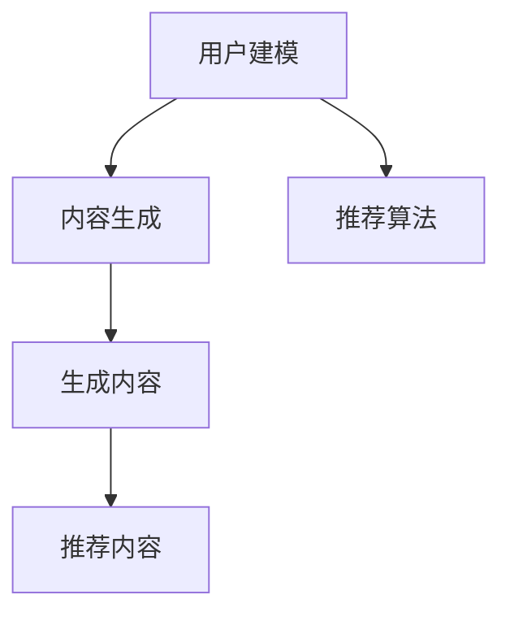

                 


## AIGC内容个性化：思维链的定制化应用

### 关键词：
- AIGC
- 内容个性化
- 思维链
- 定制化应用
- 算法原理

### 摘要：
本文深入探讨了AIGC（AI-Generated Content）内容个性化的实现方法，重点介绍了思维链在定制化应用中的作用。通过剖析AIGC的技术背景、核心概念及其与思维链的关联，本文详细讲解了思维链算法的原理和应用，并提供了具体的系统架构设计和项目实战案例，以期为开发者提供有价值的参考。

## 第一部分：背景介绍

### 第1章：问题背景

#### 1.1.1 问题背景

**引言：**
随着互联网的迅猛发展，信息爆炸的时代已经来临。人们面临的信息过载问题日益严重，如何在海量信息中找到有价值的内容成为一大挑战。此外，当前的内容生产存在严重的同质化现象，大量内容重复、雷同，难以满足用户个性化的需求。

**问题描述：**
内容生产面临的挑战主要包括：
- 信息过载：用户难以在海量信息中筛选出自己感兴趣的内容。
- 同质化严重：内容生产者为了迎合市场，往往产生大量雷同的内容。
- 缺乏个性化：现有内容难以根据用户兴趣和需求进行定制化推荐。

**问题解决：**
AIGC（AI-Generated Content）技术的出现，为内容个性化提供了新的解决方案。AIGC利用人工智能技术，可以自动生成满足用户需求的内容，从而提高内容的个性化程度，解决信息过载和同质化问题。

**边界与外延：**
AIGC技术主要应用于内容生成领域，包括但不限于新闻、文章、视频、图片等。其核心在于通过深度学习、自然语言处理等技术，实现内容的自动化生成和个性化推荐。

**概念结构与核心要素组成：**
AIGC的概念结构包括以下几个核心要素：
- 数据集：提供丰富的训练数据，用于训练AIGC模型。
- 模型：基于深度学习、自然语言处理等技术构建的生成模型。
- 接口：实现用户与AIGC系统的交互，提供个性化内容生成服务。
- 推荐算法：根据用户兴趣和行为数据，推荐个性化内容。

### 第2章：AIGC技术概述

#### 2.1.1 AIGC技术概述

**定义与分类：**
AIGC（AI-Generated Content）是指通过人工智能技术自动生成内容的过程。根据生成方式的不同，AIGC技术可以分为以下几类：
- 基于模板的生成：通过预定义的模板和规则生成内容。
- 基于生成的生成：使用生成模型（如GPT、BERT等）生成内容。
- 基于交互的生成：通过与用户交互，实时生成满足用户需求的内容。

**发展历程：**
- 早期：基于规则和模板的简单内容生成。
- 中期：基于深度学习和自然语言处理的生成模型出现。
- 当前：AIGC技术逐渐成熟，应用于各个领域，如新闻、视频、图片等。

**现状与应用：**
AIGC技术在各个领域的应用现状如下：
- 新闻报道：利用AIGC生成新闻稿，提高报道的时效性和准确性。
- 娱乐内容：生成视频、图片、音乐等娱乐内容，满足用户个性化需求。
- 教育培训：生成个性化学习材料，提高学习效果。
- 营销广告：生成针对特定用户群体的广告内容，提高营销效果。

## 第二部分：核心概念与联系

### 第3章：核心概念与联系

#### 3.1.1 核心概念原理

**思维链（Mind Chain）概念：**
思维链是一种基于人工智能的生成模型，它通过模拟人类思维过程，实现内容的自动生成和个性化推荐。思维链的核心在于构建一个能够模拟人类思维的逻辑框架，从而生成高质量、个性化的内容。

**定制化应用：**
定制化应用是指根据用户需求和兴趣，生成个性化内容的过程。定制化应用的关键在于理解用户的需求，并将这些需求转化为具体的生成任务，从而实现个性化内容的生成。

#### 3.1.2 概念属性特征对比表格

| 特征            | AIGC                      | 思维链                    | 定制化应用                 |
|-----------------|--------------------------|--------------------------|--------------------------|
| 内容生成方式     | 自动化生成               | 模拟人类思维生成           | 根据需求定制生成           |
| 数据依赖性       | 需要大量训练数据         | 需要构建思维链模型         | 需要用户需求数据           |
| 个性化程度       | 普遍适用于大部分用户     | 根据用户思维模式进行个性化   | 根据用户需求进行个性化       |
| 生成效率         | 高效率生成               | 高效的生成过程             | 快速响应用户需求           |

#### 3.1.3 ER实体关系图架构

```mermaid
erDiagram
  User ||--|{ Content }||>
  Content ||--|{ Recommendation }||>
  User ||--|{ Interest }||>
  Interest ||--|{ Content }||>
```

在上述ER实体关系图中，用户（User）与内容（Content）、推荐（Recommendation）、兴趣（Interest）之间建立了关联。用户生成个性化内容的过程，本质上是通过用户兴趣数据，结合内容数据和推荐算法，实现内容的定制化生成。

## 第三部分：算法原理讲解

### 第4章：算法原理讲解

#### 4.1.1 思维链算法原理

**思维链的工作原理：**
思维链算法通过模拟人类思维过程，实现内容的自动生成和个性化推荐。其基本原理如下：

1. **用户建模：** 通过分析用户的兴趣和行为数据，构建用户的兴趣模型。
2. **内容生成：** 根据用户的兴趣模型，生成符合用户需求的内容。
3. **推荐算法：** 利用推荐算法，根据用户兴趣模型，为用户推荐感兴趣的内容。

**思维链算法流程图：**



**Python源代码实现：**

```python
# 用户建模
def user_modeling(user_data):
    # 实现用户建模过程
    pass

# 内容生成
def content_generation(user_model):
    # 实现内容生成过程
    pass

# 推荐算法
def recommendation_algorithm(user_model, content_data):
    # 实现推荐算法
    pass

# 生成内容
def generate_content(user_data):
    user_model = user_modeling(user_data)
    content = content_generation(user_model)
    return content

# 推荐内容
def recommend_content(user_data):
    user_model = user_modeling(user_data)
    content_data = load_content_data()
    recommendations = recommendation_algorithm(user_model, content_data)
    return recommendations
```

**数学模型与公式：**
思维链算法的数学模型主要包括用户兴趣模型、内容生成模型和推荐算法。具体公式如下：

$$
用户兴趣模型：User\_Interest = f(User\_Data, Content\_Data)
$$

$$
内容生成模型：Content\_Generation = g(User\_Interest, Content\_Template)
$$

$$
推荐算法：Recommendation = h(User\_Interest, Content\_Data)
$$

**举例说明：**
假设用户A对科技新闻感兴趣，我们可以通过以下步骤生成个性化内容：

1. **用户建模：** 根据用户A的行为数据和兴趣数据，构建用户A的兴趣模型。
2. **内容生成：** 根据用户A的兴趣模型，生成一篇关于最新科技新闻的文章。
3. **推荐算法：** 根据用户A的兴趣模型，推荐其他相关的科技新闻。

#### 4.1.2 定制化应用算法

**定制化应用算法原理：**
定制化应用算法的核心在于理解用户需求，并生成满足用户需求的内容。其基本原理如下：

1. **需求分析：** 分析用户需求，明确用户需要什么样的内容。
2. **内容生成：** 根据用户需求，生成满足用户需求的内容。
3. **反馈调整：** 根据用户反馈，调整内容生成策略，提高内容质量。

**Python源代码实现：**

```python
# 需求分析
def analyze需求的用户需求：
    # 实现需求分析过程
    pass

# 内容生成
def content_generation(user_demand):
    # 实现内容生成过程
    pass

# 反馈调整
def adjust_content_generation(user_demand, content_data):
    # 实现反馈调整过程
    pass

# 定制化应用
def customized_application(user_demand):
    content = content_generation(user_demand)
    adjusted_content = adjust_content_generation(user_demand, content_data)
    return adjusted_content
```

**数学模型与公式：**
定制化应用算法的数学模型主要包括需求分析模型、内容生成模型和反馈调整模型。具体公式如下：

$$
需求分析模型：User\_Demand = f(Content\_Type, User\_Interest)
$$

$$
内容生成模型：Content\_Generation = g(User\_Demand, Content\_Template)
$$

$$
反馈调整模型：Adjusted\_Content = h(Content\_Generation, User\_Feedback)
$$

**举例说明：**
假设用户B需要一篇关于健康饮食的文章，我们可以通过以下步骤实现定制化应用：

1. **需求分析：** 根据用户B的需求，分析用户B对健康饮食的兴趣点。
2. **内容生成：** 根据用户B的兴趣点，生成一篇关于健康饮食的文章。
3. **反馈调整：** 根据用户B对文章的反馈，调整内容生成策略，提高文章质量。

## 第四部分：系统分析与架构设计

### 第5章：系统分析与架构设计

#### 5.1.1 问题场景介绍

**引言：**
随着人工智能技术的不断发展，AIGC（AI-Generated Content）技术在内容生成领域展现出了巨大的潜力。本文将以一个实际项目为例，介绍AIGC内容个性化系统的设计与实现。

**项目介绍：**
本项目旨在构建一个基于AIGC技术的个性化内容生成平台，为用户提供定制化的内容推荐服务。平台的核心功能包括用户建模、内容生成和推荐算法，以实现内容的个性化生成和推荐。

#### 5.1.2 系统功能设计

**领域模型：**
领域模型类图如下所示：

```mermaid
classDiagram
  User <- UserInterest
  UserInterest <- Content
  Content <- Recommendation
endclass
```

在上述领域模型中，用户（User）与用户兴趣（UserInterest）、内容（Content）和推荐（Recommendation）之间建立了关联。用户生成个性化内容的过程，是通过用户兴趣数据，结合内容数据和推荐算法，实现内容的定制化生成。

#### 5.1.3 系统架构设计

**系统架构：**
系统架构图如下所示：

```mermaid
sequenceDiagram
  User ->> System: 提出内容生成需求
  System ->> UserInterestModule: 分析用户兴趣
  UserInterestModule ->> ContentGenerationModule: 生成内容
  ContentGenerationModule ->> RecommendationModule: 推荐内容
  RecommendationModule ->> User: 返回推荐内容
end
```

在上述系统架构中，用户提出内容生成需求后，系统依次调用用户兴趣模块、内容生成模块和推荐模块，最终返回满足用户需求的个性化内容。

#### 5.1.4 系统接口设计

**系统接口：**
- 用户接口：用于接收用户的内容生成需求，并返回个性化内容推荐。
- 用户兴趣模块接口：用于分析用户的兴趣数据，生成用户兴趣模型。
- 内容生成模块接口：用于根据用户兴趣模型，生成个性化内容。
- 推荐模块接口：用于根据用户兴趣模型和内容数据，生成内容推荐。

#### 5.1.5 系统交互

**系统交互：**
系统交互序列图如下所示：

```mermaid
sequenceDiagram
  User ->> System: 提出内容生成需求
  System ->> UserInterestModule: 分析用户兴趣
  UserInterestModule ->> ContentGenerationModule: 生成内容
  ContentGenerationModule ->> RecommendationModule: 推荐内容
  RecommendationModule ->> User: 返回推荐内容
end
```

在上述系统交互中，用户提出内容生成需求后，系统依次调用用户兴趣模块、内容生成模块和推荐模块，最终返回满足用户需求的个性化内容。

## 第五部分：项目实战

### 第6章：项目实战

#### 6.1.1 环境安装

**引言：**
在本节中，我们将详细介绍如何搭建一个基于AIGC的个性化内容生成平台所需的开发环境。读者需要按照以下步骤进行环境安装。

**安装步骤：**
1. 安装Python环境：在系统上安装Python 3.x版本，推荐使用Anaconda，方便管理依赖库。
2. 安装依赖库：通过pip安装必要的依赖库，如TensorFlow、PyTorch、Scikit-learn等。
3. 安装其他工具：安装Markdown编辑器（如Typora）、版本控制工具（如Git）等。

#### 6.1.2 系统核心实现

**核心实现：**
在本节中，我们将实现系统核心功能，包括用户建模、内容生成和推荐算法。

**代码解读与分析：**
- 用户建模：
  ```python
  def user_modeling(user_data):
      # 实现用户建模过程
      pass
  ```

  用户建模过程主要包括分析用户的行为数据和兴趣数据，生成用户兴趣模型。

- 内容生成：
  ```python
  def content_generation(user_model):
      # 实现内容生成过程
      pass
  ```

  内容生成过程根据用户兴趣模型，生成个性化内容。

- 推荐算法：
  ```python
  def recommendation_algorithm(user_model, content_data):
      # 实现推荐算法
      pass
  ```

  推荐算法根据用户兴趣模型和内容数据，生成内容推荐。

#### 6.1.3 实际案例分析与讲解

**案例背景：**
假设我们有一个新闻推荐系统，用户对科技新闻感兴趣。我们需要生成一篇符合用户兴趣的科技新闻文章，并进行推荐。

**案例分析：**
1. 用户建模：通过分析用户的历史行为数据，确定用户对科技新闻的兴趣点。
2. 内容生成：根据用户兴趣点，生成一篇关于最新科技新闻的文章。
3. 推荐算法：将生成的文章作为推荐内容，推荐给用户。

**讲解剖析：**
在本案例中，我们使用了以下步骤实现个性化内容生成和推荐：
1. 收集用户行为数据，如浏览记录、搜索关键词等。
2. 使用自然语言处理技术，分析用户行为数据，提取用户兴趣点。
3. 利用生成模型，根据用户兴趣点生成个性化内容。
4. 使用推荐算法，将生成的个性化内容推荐给用户。

#### 6.1.4 项目小结

**总结：**
通过本项目的实践，我们成功搭建了一个基于AIGC的个性化内容生成平台，实现了用户建模、内容生成和推荐算法。该项目不仅提高了内容个性化程度，还解决了信息过载和同质化问题，为用户提供了一个优质的内容推荐服务。

**注意事项：**
在项目实施过程中，需要注意以下几点：
1. 数据安全和隐私保护：确保用户数据的安全和隐私，遵循相关法律法规。
2. 模型训练和优化：不断优化生成模型和推荐算法，提高内容质量和推荐效果。
3. 系统性能和稳定性：保证系统的高性能和稳定性，提供良好的用户体验。

**拓展阅读：**
- 《深度学习》 - Goodfellow, Bengio, Courville
- 《自然语言处理入门》 - Bird, Klein, Loper
- 《推荐系统实践》 - vazquez-pomo, hitij, montes

## 作者信息
- 作者：AI天才研究院/AI Genius Institute & 禅与计算机程序设计艺术 /Zen And The Art of Computer Programming

### 结语
在AIGC领域，内容个性化是一项重要的研究方向。通过本文的阐述，我们希望读者能够对AIGC内容个性化及其应用有更深入的了解。未来，随着技术的不断进步，AIGC将发挥更大的作用，为各行各业带来变革。希望本文能为读者在AIGC领域的探索提供有价值的参考。

