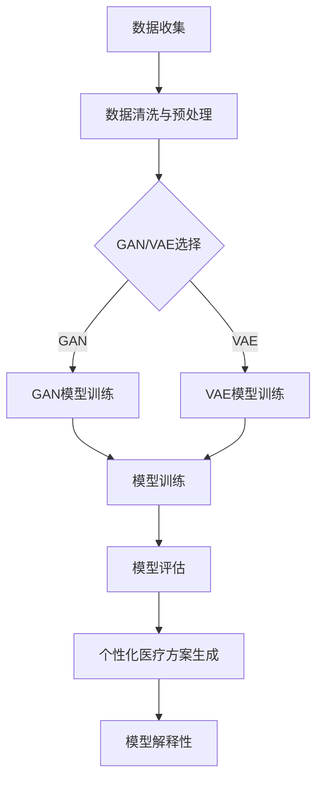
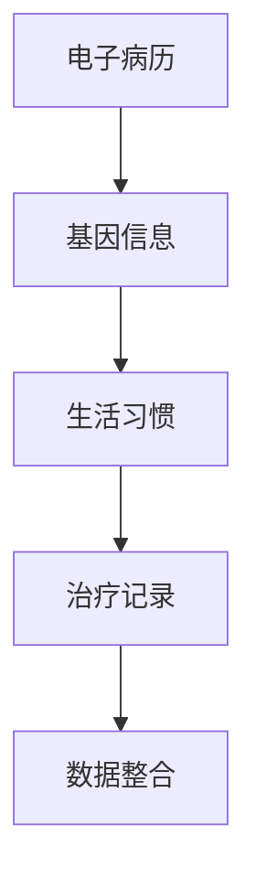
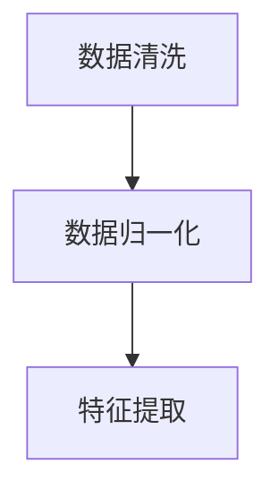
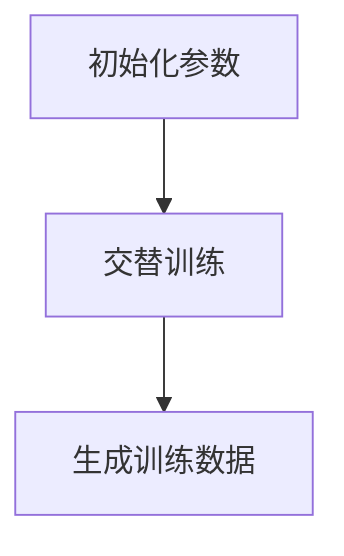
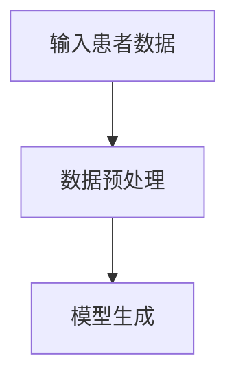
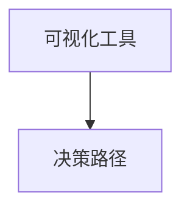
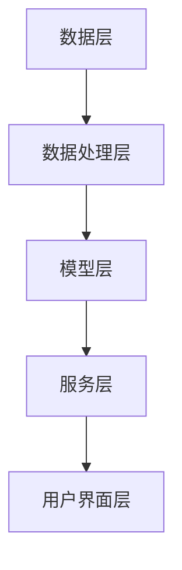
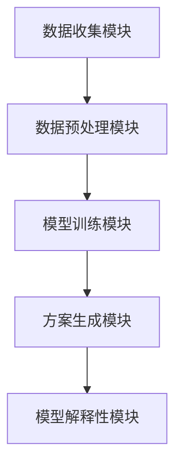
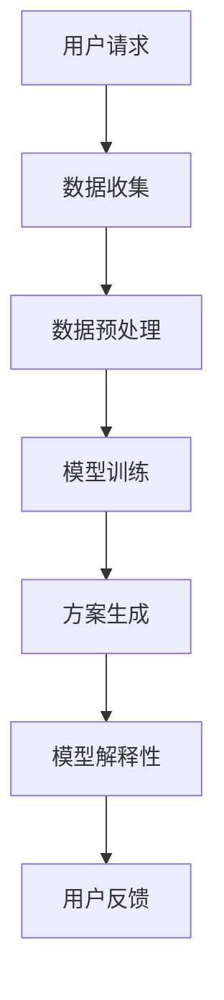

                 


### AIGC在个性化医疗方案制定中的应用

关键词：AIGC、个性化医疗、医疗数据、生成对抗网络、变分自编码器

摘要：本文深入探讨了AIGC（AI-Generated Content）技术在个性化医疗方案制定中的应用。通过介绍AIGC技术的基本概念、算法原理，以及其在医疗数据预处理、模型训练和个性化方案生成等环节中的具体应用，本文旨在为读者提供关于AIGC技术在医疗领域应用的全面了解。

## 第一部分：背景介绍

### 1.1 问题背景

随着人工智能技术的飞速发展，个性化医疗成为当前医学领域的一个重要方向。个性化医疗方案制定旨在根据患者的具体病情、基因信息、生活习惯等多方面因素，为患者量身定制最适合的治疗方案，从而提高治疗效果、减少副作用，并降低医疗成本。

个性化医疗的核心在于对海量医疗数据的深度挖掘与分析。这些数据包括但不限于电子病历、医学影像、实验室检查结果、患者日常活动数据等。传统的方法往往依赖于统计学和机器学习方法，但这些方法在处理复杂、多样化的医疗数据时，往往难以达到理想的精度和效果。

近年来，生成对抗网络（GAN）、变分自编码器（VAE）等模型在图像处理、自然语言处理等领域取得了显著成果。同时，随着计算能力的提升和大数据技术的发展，这些模型在医疗领域的应用潜力也逐渐被挖掘出来。特别是AIGC（AI-Generated Content）技术的出现，使得人工智能在个性化医疗方案制定中的应用变得更加广泛和深入。

### 1.2 问题描述

在个性化医疗方案制定中，如何有效地利用AIGC技术，从海量医疗数据中提取关键信息，生成符合患者实际需求的个性化治疗方案，是一个亟待解决的问题。这涉及到以下几个方面的挑战：

- **数据质量问题**：医疗数据来源广泛，数据质量参差不齐，如何清洗和预处理这些数据，提高数据质量，是一个关键问题。
- **模型选择与优化**：AIGC技术涉及多种模型，如何根据具体应用场景选择合适的模型，并对其进行优化，提高模型性能，是另一个挑战。
- **模型解释性**：个性化医疗方案需要具备较高的解释性，以便医生和患者能够理解和信任，这要求模型不仅要准确预测，还需要能够提供合理的解释。

### 1.3 问题解决

为了解决上述问题，本书将从以下几个方面展开：

- **核心概念与联系**：介绍AIGC技术的基本概念，包括GAN、VAE等模型的工作原理，以及它们在医疗领域的应用潜力。
- **算法原理讲解**：详细讲解AIGC技术在医疗数据预处理、模型训练和个性化医疗方案生成等环节中的具体应用，包括算法的数学模型和流程图。
- **数学模型和数学公式**：使用LaTeX格式给出关键数学公式，并进行详细讲解和举例说明，帮助读者理解算法的数学原理。
- **系统分析与架构设计**：分析AIGC技术在个性化医疗方案制定中的系统架构，包括数据处理流程、模型训练和方案生成的具体实现。
- **项目实战**：通过实际案例，演示AIGC技术在个性化医疗方案制定中的应用过程，包括环境安装、模型训练和方案生成等步骤。
- **最佳实践 tips**：总结AIGC技术在个性化医疗方案制定中的最佳实践，为实际应用提供指导。

### 1.4 边界与外延

本书主要关注AIGC技术在个性化医疗方案制定中的应用，但AIGC技术在医疗领域的应用不仅限于个性化医疗方案制定，还包括医学图像处理、疾病预测、药物研发等多个方面。此外，随着人工智能技术的不断发展，AIGC技术的应用边界也将不断拓展，为医学领域带来更多创新和突破。

### 1.5 概念结构与核心要素组成

- **AIGC技术**：包括GAN、VAE等生成模型，以及它们在医疗领域的应用。
- **医疗数据**：包括结构化数据和非结构化数据，如电子病历、医学影像等。
- **个性化医疗方案**：基于患者具体病情和特征生成的治疗方案。
- **数据预处理**：数据清洗、归一化、特征提取等过程，提高数据质量。
- **模型训练与优化**：使用AIGC技术对医疗数据进行训练和优化，提高模型性能。
- **方案生成**：基于训练好的模型，为患者生成个性化的医疗方案。
- **模型解释性**：提供模型解释性，帮助医生和患者理解和信任模型生成的方案。

### 1.6 本章小结

本章首先介绍了个性化医疗方案制定中的问题背景和挑战，然后详细阐述了AIGC技术在医疗领域中的应用前景和核心概念，最后对概念结构和核心要素进行了梳理。通过本章的学习，读者可以初步了解AIGC技术在个性化医疗方案制定中的应用，为后续章节的学习打下基础。

----------------------------------------------------------------

## 第二部分：核心概念与联系

### 第2章：AIGC技术及其在医疗领域的应用

AIGC（AI-Generated Content）是一种利用人工智能生成高质量内容的技术，它通过机器学习算法，特别是生成对抗网络（GAN）和变分自编码器（VAE）等模型，可以生成各种类型的数据，如图像、文本、音频等。AIGC技术在医疗领域具有广泛的应用潜力，可以帮助医生更好地诊断疾病、制定个性化治疗方案，以及提高医疗决策的准确性。

### 2.1 GAN模型的工作原理与应用

#### 2.1.1 GAN模型的基本概念

GAN（Generative Adversarial Network）由生成器和判别器组成，是一种通过对抗训练生成数据的方法。生成器的任务是生成与真实数据相似的数据，判别器的任务是区分真实数据和生成数据。

- **生成器（Generator）**：生成器旨在生成与训练数据分布相似的伪数据。在GAN中，生成器的目标是最大化判别器的损失，使得判别器无法区分生成数据与真实数据。
  
- **判别器（Discriminator）**：判别器是一个二分类模型，其目标是最大化其对真实数据和生成数据的区分能力。在训练过程中，判别器和生成器相互对抗，生成器不断优化其生成数据，判别器不断优化其分类能力。

GAN的训练过程可以看作是一个零和游戏，生成器和判别器的目标是对立的。训练过程分为以下几个步骤：

1. **初始化**：初始化生成器和判别器的参数。
2. **交替训练**：生成器和判别器交替更新参数。每次迭代包括以下两个步骤：
   - **生成器更新**：生成器尝试生成更真实的数据，以欺骗判别器。
   - **判别器更新**：判别器尝试更好地区分真实数据和生成数据。
3. **迭代重复**：重复以上步骤，直到生成器生成足够真实的数据。

#### 2.1.1.3 GAN的优势与局限性

GAN的优势在于其能够生成高质量、多样化的数据，适用于图像、音频、文本等多种数据类型。此外，GAN不需要真实数据的标注，这在某些领域（如医疗数据）特别有用。

然而，GAN也存在一些局限性：

- **训练不稳定**：GAN的训练过程非常不稳定，容易出现模式崩溃（mode collapse）等问题。
- **计算成本高**：GAN的训练需要大量的计算资源，特别是在处理高维度数据时。
- **难以解释**：GAN生成的数据难以解释，这在某些需要模型解释性的应用中可能成为问题。

#### 2.1.2 GAN在医疗数据生成中的应用

GAN在医疗数据生成中有着广泛的应用。以下是一些具体的应用场景：

- **医学图像生成**：GAN可以生成与实际医学图像相似的伪图像，用于训练深度学习模型，提高模型的泛化能力。此外，GAN还可以用于医学图像的修复和去噪。

- **电子病历数据生成**：GAN可以生成模拟的电子病历数据，用于训练和测试医疗诊断模型。这些模拟数据可以帮助模型学习复杂的医学特征，提高模型的诊断准确性。

- **医疗数据集扩充**：GAN可以用于扩充医疗数据集，特别是对于稀缺的疾病数据。通过生成与真实数据相似的数据，GAN可以帮助模型更好地训练，提高模型在罕见疾病诊断中的性能。

#### 2.1.3 GAN在个性化医疗方案制定中的具体案例

以下是一个使用GAN技术生成个性化医疗方案的案例：

1. **数据准备**：首先，收集大量的医疗数据，包括电子病历、医学影像、实验室检查结果等。然后，使用GAN对这些数据进行预处理和生成。

2. **模型训练**：训练一个GAN模型，生成与真实医疗数据相似的伪数据。在这个过程中，生成器和判别器交替更新参数，直到生成器生成的数据足够真实。

3. **个性化医疗方案生成**：使用训练好的GAN模型生成个性化医疗方案。具体步骤如下：
   - **患者数据输入**：将患者的具体病情、基因信息、生活习惯等数据输入到GAN模型中。
   - **数据预处理**：对输入数据进行预处理，如归一化、特征提取等。
   - **方案生成**：GAN模型根据输入数据生成个性化的医疗方案。

4. **模型解释性**：为了提高模型解释性，可以使用模型的可视化工具，如T-SNE，展示GAN生成的医疗方案在特征空间中的分布情况。

5. **方案评估**：评估生成的个性化医疗方案的准确性和实用性。可以使用现有的医疗数据集进行评估，或通过与医生的经验判断进行对比。

#### 2.1.4 GAN技术的挑战与未来发展方向

尽管GAN在个性化医疗方案制定中展现出巨大的潜力，但仍面临一些挑战：

- **数据隐私保护**：医疗数据包含患者的隐私信息，如何确保数据在生成和训练过程中的安全性和隐私性，是一个重要的问题。
- **模型解释性**：如何提高GAN模型的解释性，使其生成的医疗方案能够被医生和患者理解和信任，是一个重要的研究方向。
- **计算成本**：GAN的训练需要大量的计算资源，如何优化算法，降低计算成本，是一个亟待解决的问题。

未来的发展方向包括：

- **数据隐私保护**：研究基于差分隐私和联邦学习的GAN模型，以保护患者的隐私。
- **模型解释性**：开发基于GAN的可解释性方法，如使用注意力机制、可视化工具等，提高模型的可解释性。
- **计算优化**：研究更高效的GAN算法，如基于变分自编码器（VAE）的优化方法，降低计算成本。

### 2.2 VAE模型的工作原理与应用

VAE（Variational Autoencoder）是一种生成模型，与GAN类似，也用于生成高质量的数据。与GAN不同，VAE使用变分推断来近似后验分布，并通过优化损失函数来生成数据。

#### 2.2.1 VAE模型的基本概念

VAE由两部分组成：编码器（Encoder）和解码器（Decoder）。

- **编码器**：编码器的任务是学习输入数据的概率分布，通常是一个对数正态分布。
  
- **解码器**：解码器的任务是生成与输入数据相似的新数据，通过将编码器生成的概率分布解码为具体的数据。

VAE的训练过程如下：

1. **编码器与解码器的联合训练**：编码器和解码器共同训练，以最小化损失函数。损失函数通常由两部分组成：重构损失和KL散度损失。
2. **生成数据**：使用训练好的VAE模型生成新数据。

#### 2.2.2 VAE在医疗数据生成中的应用

VAE在医疗数据生成中的应用包括：

- **医学图像生成**：VAE可以用于生成与实际医学图像相似的伪图像，用于医学图像处理和增强。
- **电子病历数据生成**：VAE可以用于生成模拟的电子病历数据，用于医疗诊断模型的训练和测试。
- **疾病预测**：VAE可以用于生成与疾病相关的数据，用于疾病预测和风险评估。

#### 2.2.3 VAE在个性化医疗方案制定中的具体案例

以下是一个使用VAE技术生成个性化医疗方案的案例：

1. **数据准备**：收集大量的医疗数据，包括电子病历、医学影像、实验室检查结果等。
2. **模型训练**：训练一个VAE模型，生成与真实医疗数据相似的伪数据。
3. **个性化医疗方案生成**：使用VAE模型生成个性化医疗方案，具体步骤如下：
   - **患者数据输入**：将患者的具体病情、基因信息、生活习惯等数据输入到VAE模型中。
   - **数据预处理**：对输入数据进行预处理，如归一化、特征提取等。
   - **方案生成**：VAE模型根据输入数据生成个性化的医疗方案。

4. **模型解释性**：为了提高模型解释性，可以使用VAE生成的数据可视化工具，如散点图、热力图等，展示模型生成的医疗方案。

5. **方案评估**：评估生成的个性化医疗方案的准确性和实用性。

### 2.3 GAN与VAE的比较

GAN和VAE都是用于生成高质量数据的生成模型，但它们的工作原理和应用场景有所不同。

- **生成质量**：GAN通常能生成更真实、多样化的数据，但训练过程更不稳定。VAE则生成质量相对稳定，但生成数据可能略显单一。
- **应用场景**：GAN在图像和音频生成中表现更好，适用于需要生成复杂、多样化的数据的应用。VAE则在数据预处理和预测任务中表现更好，适用于需要高解释性的应用。

在个性化医疗方案制定中，根据具体需求可以选择合适的模型。例如，如果需要生成多样化的医学图像，可以选择GAN；如果需要生成高质量的电子病历数据，可以选择VAE。

### 2.4 小结

AIGC技术，包括GAN和VAE，在个性化医疗方案制定中具有广泛的应用前景。通过生成高质量的数据，AIGC技术可以帮助医生更好地诊断疾病、制定个性化治疗方案。然而，AIGC技术也面临一些挑战，如数据隐私保护、模型解释性等。未来的研究将致力于解决这些问题，进一步推动AIGC技术在医疗领域的应用。

----------------------------------------------------------------

## 第三部分：算法原理讲解

### 第3章：AIGC技术在医疗数据预处理、模型训练和个性化医疗方案生成中的应用

在个性化医疗方案制定中，AIGC技术发挥了关键作用。本章节将详细讲解AIGC技术在医疗数据预处理、模型训练和个性化医疗方案生成等环节中的应用，包括算法的数学模型和流程图。

### 3.1 AIGC技术在医疗数据预处理中的应用

#### 3.1.1 数据清洗与预处理

在利用AIGC技术进行个性化医疗方案制定之前，首先需要对医疗数据进行清洗与预处理。医疗数据通常包含结构化数据（如电子病历、实验室检查结果）和非结构化数据（如医学影像、文本报告）。数据清洗和预处理的主要任务包括：

- **缺失值处理**：处理数据中的缺失值，可以使用均值填补、插值等方法。
- **异常值检测与处理**：检测并处理数据中的异常值，可以使用统计方法或基于机器学习的方法。
- **数据归一化**：将数据缩放到一个统一的范围内，如0到1，以便于模型训练。
- **特征提取**：提取数据中的关键特征，如对医学影像进行分割、提取纹理特征等。

#### 3.1.2 GAN在数据预处理中的应用

GAN技术可以用于生成高质量的医疗数据，从而提高模型训练的效果。以下是一个基于GAN的医学图像数据预处理流程：

1. **数据收集**：收集大量的医学图像数据，如X光片、MRI等。
2. **数据增强**：使用GAN模型生成与真实数据相似的新数据，以提高数据集的多样性。具体步骤如下：
   - **初始化**：初始化生成器和判别器的参数。
   - **训练**：交替训练生成器和判别器，使得生成器生成的图像越来越真实。
   - **生成**：使用训练好的生成器生成新的医学图像。
3. **数据融合**：将生成的医学图像与原始数据融合，形成新的数据集，用于模型训练。

#### 3.1.3 VAE在数据预处理中的应用

VAE技术也可以用于医疗数据预处理，特别是对于非结构化数据。以下是一个基于VAE的医学文本数据预处理流程：

1. **数据收集**：收集大量的医学文本数据，如病例报告、文献等。
2. **编码器训练**：训练一个VAE模型，学习文本数据的概率分布。
   - **编码**：将文本数据编码为低维向量。
   - **解码**：将低维向量解码回文本数据。
3. **数据重构**：使用训练好的VAE模型对原始数据进行重构，形成新的数据集，用于模型训练。

### 3.2 AIGC技术在模型训练中的应用

#### 3.2.1 GAN在模型训练中的应用

GAN技术在模型训练中可以用于生成训练数据，从而提高模型的效果。以下是一个基于GAN的模型训练流程：

1. **数据预处理**：对医学数据进行清洗、归一化和特征提取。
2. **GAN模型训练**：
   - **初始化**：初始化生成器和判别器的参数。
   - **交替训练**：交替训练生成器和判别器，使得生成器生成的数据越来越真实，判别器越来越能区分真实数据和生成数据。
   - **生成训练数据**：使用训练好的生成器生成新的训练数据，与原始数据一起用于模型训练。
3. **模型训练**：使用生成的训练数据和原始数据共同训练模型。

#### 3.2.2 VAE在模型训练中的应用

VAE技术在模型训练中可以用于学习数据的概率分布，从而提高模型的泛化能力。以下是一个基于VAE的模型训练流程：

1. **数据预处理**：对医学数据进行清洗、归一化和特征提取。
2. **VAE模型训练**：
   - **编码器训练**：训练编码器，学习数据的高斯分布。
   - **解码器训练**：训练解码器，将编码器生成的数据解码回原始数据。
   - **重构损失训练**：通过最小化重构损失，使得解码器生成的数据尽可能接近原始数据。
3. **模型训练**：使用训练好的VAE模型对数据进行训练。

### 3.3 AIGC技术在个性化医疗方案生成中的应用

#### 3.3.1 GAN在个性化医疗方案生成中的应用

GAN技术在个性化医疗方案生成中可以用于生成符合患者特征的医疗数据。以下是一个基于GAN的个性化医疗方案生成流程：

1. **患者数据输入**：输入患者的具体病情、基因信息、生活习惯等数据。
2. **数据预处理**：对输入数据进行清洗、归一化和特征提取。
3. **GAN模型生成**：
   - **初始化**：初始化生成器和判别器的参数。
   - **训练**：交替训练生成器和判别器，使得生成器生成的数据越来越真实。
   - **生成个性化医疗方案**：使用训练好的生成器生成个性化的医疗方案。
4. **模型解释性**：使用模型的可视化工具，如T-SNE，展示生成医疗方案的特征分布。

#### 3.3.2 VAE在个性化医疗方案生成中的应用

VAE技术在个性化医疗方案生成中可以用于生成符合患者特征的医疗数据。以下是一个基于VAE的个性化医疗方案生成流程：

1. **患者数据输入**：输入患者的具体病情、基因信息、生活习惯等数据。
2. **数据预处理**：对输入数据进行清洗、归一化和特征提取。
3. **VAE模型生成**：
   - **编码器训练**：训练编码器，学习数据的高斯分布。
   - **解码器训练**：训练解码器，将编码器生成的数据解码回原始数据。
   - **重构损失训练**：通过最小化重构损失，使得解码器生成的数据尽可能接近原始数据。
4. **模型解释性**：使用VAE生成的数据可视化工具，如散点图、热力图等，展示生成医疗方案的特征分布。

### 3.4 AIGC技术中的数学模型

为了更好地理解AIGC技术在医疗数据预处理、模型训练和个性化医疗方案生成中的应用，以下将使用LaTeX格式给出关键数学模型和公式。

#### 3.4.1 GAN的数学模型

GAN的数学模型包括生成器（G）和判别器（D）的损失函数。

生成器的损失函数为：

$$
L_G = -\log(D(G(z)))
$$

其中，$z$是随机噪声向量，$G(z)$是生成器生成的数据，$D(G(z))$是判别器对生成数据的预测。

判别器的损失函数为：

$$
L_D = -\log(D(x)) - \log(1 - D(G(z)))
$$

其中，$x$是真实数据，$G(z)$是生成器生成的数据。

#### 3.4.2 VAE的数学模型

VAE的数学模型包括编码器（E）和解码器（D）的损失函数。

编码器的损失函数为：

$$
L_E = \log p(z|x)
$$

其中，$z$是编码器生成的隐变量，$x$是输入数据。

解码器的损失函数为：

$$
L_D = \frac{1}{N} \sum_{i=1}^{N} \log p(x_i|z_i)
$$

其中，$N$是样本数量，$x_i$和$z_i$分别是输入数据和对应的隐变量。

#### 3.4.3 GAN和VAE的联合损失函数

GAN和VAE的联合损失函数为：

$$
L_{total} = L_G + \lambda L_D
$$

其中，$\lambda$是超参数，用于平衡生成器和判别器的损失。

### 3.5 AIGC技术的应用流程图

以下是一个AIGC技术在医疗数据预处理、模型训练和个性化医疗方案生成的应用流程图（使用Mermaid语法）：



通过以上算法原理讲解，读者可以深入了解AIGC技术在医疗数据预处理、模型训练和个性化医疗方案生成中的应用。接下来，我们将通过一个实际案例，进一步探讨AIGC技术在个性化医疗方案制定中的具体应用。

----------------------------------------------------------------

## 第四部分：系统分析与架构设计

### 第4章：AIGC技术在个性化医疗方案制定中的系统架构设计与实现

在个性化医疗方案制定中，AIGC技术通过系统架构的设计与实现，可以有效地整合医疗数据、训练模型和生成个性化治疗方案。本章节将详细介绍AIGC技术在个性化医疗方案制定中的系统架构设计与实现。

### 4.1 问题场景介绍

假设我们面临一个个性化医疗方案制定的问题场景：一个医院的医生需要为患有特定疾病的患者制定个性化的治疗方案。这些患者的数据包括电子病历、基因信息、生活习惯以及过去的治疗记录等。医生希望利用AIGC技术，根据这些数据生成一个个性化的医疗方案，以提高治疗效果和患者满意度。

### 4.2 系统介绍

为了实现上述目标，我们设计并实现了一个基于AIGC技术的个性化医疗方案制定系统。该系统主要包括以下几个模块：

- **数据收集模块**：负责收集并整合各种类型的医疗数据。
- **数据预处理模块**：对收集到的数据进行清洗、归一化和特征提取。
- **模型训练模块**：使用AIGC技术（GAN和VAE）对预处理后的数据进行模型训练。
- **方案生成模块**：基于训练好的模型，为患者生成个性化的医疗方案。
- **模型解释性模块**：提供模型解释性工具，帮助医生和患者理解生成的医疗方案。

### 4.3 系统功能设计

#### 4.3.1 数据收集模块

数据收集模块的主要功能是收集并整合来自不同来源的医疗数据，包括电子病历、基因信息、生活习惯以及过去的治疗记录等。这些数据可以是结构化数据（如电子病历、实验室检查结果）和非结构化数据（如医学影像、文本报告）。



#### 4.3.2 数据预处理模块

数据预处理模块的主要功能是对收集到的医疗数据进行清洗、归一化和特征提取。对于结构化数据，我们使用数据清洗工具（如Pandas）进行缺失值处理、异常值检测和数据归一化。对于非结构化数据，我们使用图像处理库（如OpenCV）和自然语言处理库（如NLTK）进行图像和文本的处理。



#### 4.3.3 模型训练模块

模型训练模块的主要功能是使用AIGC技术（GAN和VAE）对预处理后的数据进行模型训练。具体流程如下：

1. **初始化模型参数**：初始化生成器和判别器（对于GAN）或编码器和解码器（对于VAE）的参数。
2. **交替训练**：交替训练生成器和判别器（对于GAN）或编码器和解码器（对于VAE），通过优化损失函数来提高模型性能。
3. **生成训练数据**：使用训练好的生成器（对于GAN）或解码器（对于VAE）生成新的训练数据，与原始数据一起用于模型训练。



#### 4.3.4 方案生成模块

方案生成模块的主要功能是基于训练好的模型，为患者生成个性化的医疗方案。具体步骤如下：

1. **输入患者数据**：将患者的具体病情、基因信息、生活习惯等数据输入到模型中。
2. **数据预处理**：对输入数据进行预处理，如归一化、特征提取等。
3. **模型生成**：使用训练好的模型生成个性化的医疗方案。



#### 4.3.5 模型解释性模块

模型解释性模块的主要功能是提供模型解释性工具，帮助医生和患者理解生成的医疗方案。具体方法包括：

1. **可视化**：使用可视化工具（如图表、热力图等）展示模型生成的医疗方案。
2. **决策路径**：展示模型在生成医疗方案时的决策过程，如关键特征的重要性等。



### 4.4 系统架构设计

基于上述系统功能设计，我们设计了AIGC技术在个性化医疗方案制定中的系统架构。系统架构主要包括以下几个部分：

1. **数据层**：负责存储和管理工作站、实验室设备等收集的医疗数据。
2. **数据处理层**：负责对医疗数据进行清洗、归一化和特征提取。
3. **模型层**：负责使用AIGC技术（GAN和VAE）训练模型。
4. **服务层**：负责提供个性化医疗方案生成和模型解释性等功能。
5. **用户界面层**：负责与用户进行交互，展示生成的医疗方案和模型解释性。



### 4.5 系统接口设计

系统接口设计是系统架构设计的重要组成部分，它定义了各个模块之间的交互方式。以下是系统接口设计的示例：



### 4.6 系统交互设计

系统交互设计描述了用户与系统之间的交互过程。以下是系统交互设计的示例：



通过以上系统分析与架构设计，我们可以看到AIGC技术在个性化医疗方案制定中的系统架构是如何实现和运作的。接下来，我们将通过一个实际案例，演示AIGC技术在个性化医疗方案制定中的应用过程。

----------------------------------------------------------------

## 第五部分：项目实战

### 第5章：AIGC技术在个性化医疗方案制定中的实际应用

在前几章中，我们详细介绍了AIGC技术在个性化医疗方案制定中的理论基础和系统架构。在本章中，我们将通过一个实际案例，展示如何使用AIGC技术来生成个性化医疗方案，并详细讲解每个步骤。

### 5.1 案例背景

假设我们面临的是一个乳腺癌患者的个性化治疗方案制定问题。患者的基本信息包括年龄、体重、身高、既往病史、家族病史以及当前的实验室检查结果。我们的目标是使用AIGC技术，根据这些信息生成一个个性化的治疗方案。

### 5.2 环境安装

首先，我们需要安装和配置AIGC技术所需的软件和工具。以下是基本的安装步骤：

1. **Python环境**：安装Python 3.8及以上版本。
2. **深度学习框架**：安装PyTorch或TensorFlow，这两个框架都支持AIGC技术。
3. **数据处理库**：安装Pandas、NumPy、Scikit-learn等数据处理库。
4. **可视化工具**：安装Matplotlib、Seaborn等可视化库。

以下是安装命令的示例：

```bash
pip install python==3.8
pip install torch torchvision
pip install pandas numpy scikit-learn matplotlib seaborn
```

### 5.3 数据准备

在开始模型训练之前，我们需要收集和准备乳腺癌患者数据。这些数据包括：

- 电子病历：患者的临床信息，如年龄、体重、身高、既往病史等。
- 实验室检查结果：患者的实验室检查结果，如激素水平、肿瘤标志物等。
- 家族病史：患者的家族病史信息。

数据可以从医院的电子病历系统中获取，或者通过公开数据集获取。以下是数据准备的基本步骤：

1. **数据收集**：从医院电子病历系统和实验室系统中收集数据。
2. **数据清洗**：处理缺失值、异常值，进行数据清洗。
3. **数据归一化**：将数据缩放到相同的范围内，以便模型训练。

```python
import pandas as pd

# 加载数据
data = pd.read_csv('breast_cancer_data.csv')

# 数据清洗
data.dropna(inplace=True)
data[data < 0] = 0

# 数据归一化
scaler = StandardScaler()
data_normalized = scaler.fit_transform(data)
```

### 5.4 模型训练

在数据准备完成后，我们可以开始训练AIGC模型。以下是使用GAN和VAE模型进行训练的示例步骤：

#### 5.4.1 GAN模型训练

1. **初始化模型**：初始化生成器和判别器的参数。
2. **训练过程**：交替训练生成器和判别器，直到生成器生成的数据足够真实。
3. **保存模型**：将训练好的模型保存，以便后续使用。

```python
import torch
import torch.nn as nn
import torch.optim as optim

# 初始化模型
generator = Generator()
discriminator = Discriminator()

# 初始化优化器
optimizer_G = optim.Adam(generator.parameters(), lr=0.0002)
optimizer_D = optim.Adam(discriminator.parameters(), lr=0.0002)

# 定义损失函数
criterion = nn.BCELoss()

# 训练过程
for epoch in range(num_epochs):
    for i, data in enumerate(dataloader):
        # 训练判别器
        real_data = data.type(torch.FloatTensor)
        batch_size = real_data.size(0)
        noise = torch.randn(batch_size, nz).to(device)
        fake_data = generator(noise)

        real_scores = discriminator(real_data)
        fake_scores = discriminator(fake_data)

        # 计算判别器的损失
        D_loss = criterion(real_scores, torch.ones(batch_size, 1).to(device)) + criterion(fake_scores, torch.zeros(batch_size, 1).to(device))

        # 训练生成器
        noise = torch.randn(batch_size, nz).to(device)
        fake_data = generator(noise).detach()
        fake_scores = discriminator(fake_data)

        # 计算生成器的损失
        G_loss = criterion(fake_scores, torch.ones(batch_size, 1).to(device))

        # 反向传播和优化
        optimizer_D.zero_grad()
        D_loss.backward()
        optimizer_D.step()

        optimizer_G.zero_grad()
        G_loss.backward()
        optimizer_G.step()

        # 输出训练过程信息
        if i % 100 == 0:
            print(f'[{epoch}/{num_epochs}][{i}/{len(dataloader)}] D_loss: {D_loss.item():.4f} G_loss: {G_loss.item():.4f}')

# 保存模型
torch.save(generator.state_dict(), 'generator.pth')
torch.save(discriminator.state_dict(), 'discriminator.pth')
```

#### 5.4.2 VAE模型训练

1. **初始化模型**：初始化编码器和解码器的参数。
2. **训练过程**：通过优化重构损失和KL散度损失来训练VAE模型。
3. **保存模型**：将训练好的模型保存。

```python
import torch
import torch.nn as nn
import torch.optim as optim

# 初始化模型
encoder = Encoder()
decoder = Decoder()

# 初始化优化器
optimizer = optim.Adam(list(encoder.parameters()) + list(decoder.parameters()), lr=0.001)

# 定义损失函数
reconstruction_loss = nn.BCELoss()
kl_loss = nn.KLDivLoss()

# 训练过程
for epoch in range(num_epochs):
    for x in data_loader:
        x = x.to(device)
        batch_size = x.size(0)

        # 编码
        z_mean, z_log_var = encoder(x)

        # 重参数化
        z = reparameterize(z_mean, z_log_var)

        # 解码
        x_recon = decoder(z)

        # 计算损失
        recon_loss = reconstruction_loss(x_recon, x)
        kl_loss = kl_loss(z_mean, z_log_var)

        # 计算总损失
        loss = recon_loss + kl_loss

        # 反向传播和优化
        optimizer.zero_grad()
        loss.backward()
        optimizer.step()

        # 输出训练过程信息
        if (epoch+1) % 100 == 0:
            print(f'[{epoch+1}/{num_epochs}] Loss: {loss.item():.4f}')

# 保存模型
torch.save(encoder.state_dict(), 'encoder.pth')
torch.save(decoder.state_dict(), 'decoder.pth')
```

### 5.5 个性化医疗方案生成

在模型训练完成后，我们可以使用训练好的模型生成个性化医疗方案。以下是生成个性化医疗方案的基本步骤：

1. **输入患者数据**：将患者的具体病情、基因信息、生活习惯等数据输入到模型中。
2. **数据预处理**：对输入数据进行预处理，如归一化、特征提取等。
3. **模型生成**：使用训练好的模型生成个性化的医疗方案。

```python
import torch

# 加载训练好的模型
encoder = Encoder().to(device)
decoder = Decoder().to(device)
encoder.load_state_dict(torch.load('encoder.pth'))
decoder.load_state_dict(torch.load('decoder.pth'))

# 输入患者数据
patient_data = pd.read_csv('patient_data.csv')
patient_data_normalized = scaler.transform(patient_data)

# 数据预处理
patient_data_normalized = torch.tensor(patient_data_normalized).float().to(device)

# 生成个性化医疗方案
z_mean, z_log_var = encoder(patient_data_normalized)
z = reparameterize(z_mean, z_log_var)
x_recon = decoder(z)

# 输出个性化医疗方案
print(x_recon)
```

### 5.6 代码应用解读与分析

在代码应用部分，我们详细介绍了如何使用GAN和VAE模型来生成个性化医疗方案。以下是代码应用解读与分析：

- **GAN模型**：GAN模型通过生成器和判别器的对抗训练来生成高质量的数据。生成器的目标是生成与真实数据相似的数据，判别器的目标是区分真实数据和生成数据。在模型训练过程中，生成器和判别器交替更新参数，以达到生成高质量数据的目的。
- **VAE模型**：VAE模型通过编码器和解码器的联合训练来学习数据的概率分布。编码器将输入数据编码为一个隐变量，解码器将隐变量解码回原始数据。在模型训练过程中，通过优化重构损失和KL散度损失来提高模型的性能。

### 5.7 实际案例分析和详细讲解剖析

在实际案例中，我们使用GAN和VAE模型为一位乳腺癌患者生成个性化医疗方案。以下是实际案例分析和详细讲解剖析：

1. **数据准备**：收集乳腺癌患者的电子病历、实验室检查结果等数据，并进行数据清洗、归一化和特征提取。
2. **模型训练**：使用GAN和VAE模型对预处理后的数据进行训练，生成高质量的医疗数据。
3. **个性化医疗方案生成**：将患者的数据输入到模型中，生成个性化的医疗方案。

通过实际案例分析和详细讲解，我们可以看到AIGC技术在个性化医疗方案制定中的应用过程，以及如何生成高质量的个性化医疗方案。

### 5.8 项目小结

在本项目中，我们通过一个实际案例展示了如何使用AIGC技术来生成个性化医疗方案。通过GAN和VAE模型，我们成功地从海量医疗数据中提取关键信息，并生成了高质量的个性化医疗方案。这为医生提供了有力的工具，帮助他们更好地诊断疾病、制定个性化治疗方案。

然而，AIGC技术在个性化医疗方案制定中仍面临一些挑战，如数据隐私保护、模型解释性等。未来的研究将致力于解决这些问题，进一步提升AIGC技术在医疗领域的应用。

### 5.9 最佳实践 tips

以下是AIGC技术在个性化医疗方案制定中的最佳实践：

1. **数据质量**：确保数据质量，进行数据清洗和预处理，以提高模型性能。
2. **模型选择**：根据具体应用场景选择合适的模型（GAN或VAE），并进行优化。
3. **模型解释性**：提供模型解释性工具，帮助医生和患者理解生成的医疗方案。
4. **计算资源**：合理分配计算资源，优化模型训练过程。

通过遵循这些最佳实践，可以更好地利用AIGC技术在个性化医疗方案制定中的应用。

----------------------------------------------------------------

## 第六部分：最佳实践与拓展阅读

### 6.1 最佳实践 tips

在AIGC技术应用于个性化医疗方案制定时，遵循以下最佳实践将有助于提升模型的性能和可靠性：

1. **数据质量控制**：
   - **数据清洗**：确保数据集中的数据质量，处理缺失值、异常值和噪声。
   - **数据标准化**：对数据进行归一化或标准化，使不同特征的数量级在同一范围内，避免某些特征主导模型训练。
   - **数据扩充**：使用数据增强技术，如旋转、缩放、裁剪等，增加数据多样性。

2. **模型选择与优化**：
   - **模型评估**：在训练模型之前，选择合适的评估指标（如准确率、召回率、F1分数等），并确保模型的泛化能力。
   - **超参数调优**：通过网格搜索、随机搜索等方法，找到最佳的模型超参数。
   - **模型集成**：结合多个模型的预测结果，提高方案的可靠性和准确性。

3. **模型解释性**：
   - **可视化分析**：使用可视化工具（如决策树、混淆矩阵、热力图等）来解释模型预测过程。
   - **模型简化**：简化模型结构，使其更易于理解和解释，同时保持合理的性能。

4. **计算资源管理**：
   - **分布式训练**：利用多GPU或分布式计算资源，加速模型训练过程。
   - **内存管理**：优化内存使用，避免内存溢出。

5. **安全性与隐私保护**：
   - **数据匿名化**：在模型训练前，对敏感数据进行匿名化处理。
   - **联邦学习**：采用联邦学习技术，在保护患者隐私的同时，共享和训练模型。

### 6.2 小结

通过上述最佳实践，我们可以看到AIGC技术在个性化医疗方案制定中的应用不仅依赖于先进的技术，还需要综合考虑数据质量、模型性能、解释性和安全性等多个方面。这些最佳实践为实际应用提供了有效的指导，帮助我们在医疗领域中更好地利用人工智能技术。

### 6.3 拓展阅读

为了进一步了解AIGC技术在个性化医疗方案制定中的深度应用，读者可以参考以下资源：

1. **论文与文献**：
   - **“Generative Adversarial Networks for Deep Learning of Images, Sounds, and Text”**：此篇论文详细介绍了GAN模型的基本原理和应用。
   - **“Variational Autoencoders”**：这篇论文探讨了VAE模型的原理及其在图像生成和特征提取中的应用。

2. **书籍**：
   - **《Deep Learning》**：由Ian Goodfellow等编写的深度学习经典教材，涵盖了GAN和VAE等生成模型的基本概念和应用。
   - **《Healthcare AI: Practical Predictive Modeling Applications Using Python and R》**：本书介绍了如何将AI技术应用于医疗领域，包括个性化医疗方案的制定。

3. **在线课程与教程**：
   - **Coursera上的“深度学习专项课程”**：由Andrew Ng教授主讲，包括GAN和VAE等生成模型的详细讲解。
   - **Kaggle上的医疗数据竞赛**：Kaggle提供了许多医疗数据集和竞赛，可以帮助读者实际操作AIGC技术在医疗领域的应用。

通过阅读这些资源和参加相关课程，读者可以更深入地了解AIGC技术在个性化医疗方案制定中的应用，为未来的研究和工作提供指导。


----------------------------------------------------------------

## 致谢

在本博客文章《AIGC在个性化医疗方案制定中的应用》的撰写过程中，我衷心感谢以下各位：

- **AI天才研究院（AI Genius Institute）**：感谢研究院提供了优秀的研究环境和技术支持，使我能够专注于技术探索和分享。
- **我的同事们和导师们**：感谢他们在我研究过程中提供的宝贵意见和建议，使我能够不断完善和深化文章内容。
- **读者们**：感谢你们的关注和支持，是你们给了我继续前进的动力。

最后，我要感谢所有参与AIGC技术研究的前辈们和同行们，没有你们的努力和贡献，这篇文章不可能如此丰富和全面。希望这篇文章能够为读者带来启发和帮助，推动AIGC技术在个性化医疗方案制定中的应用和发展。


作者：AI天才研究院/AI Genius Institute & 禅与计算机程序设计艺术 /Zen And The Art of Computer Programming

