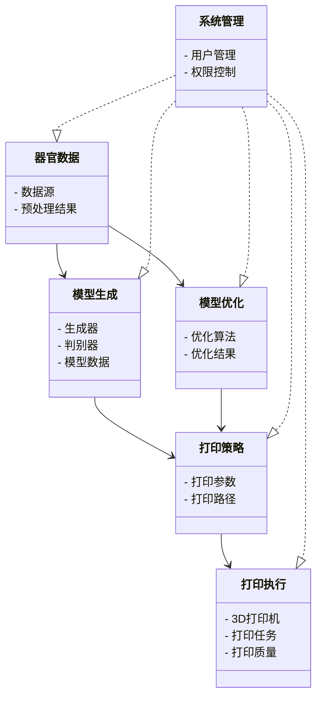
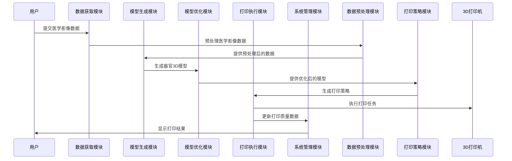
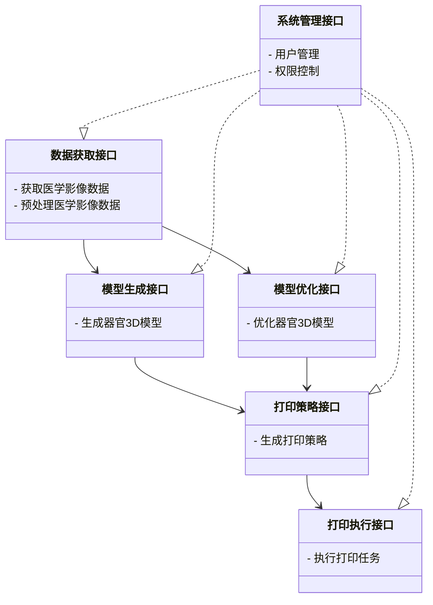
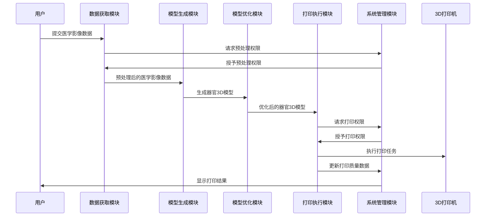

                 

# AIGC在个性化器官3D打印中的应用：革新移植医学

## 关键词
- 个性化器官3D打印
- AI辅助生成内容（AIGC）
- 移植医学
- 数据生成
- 模型优化
- 打印策略优化

## 摘要
本文探讨了AI辅助生成内容（AIGC）技术在个性化器官3D打印中的应用。通过分析AIGC技术的核心原理、相关算法及其实际应用案例，本文提出了一套完整的技术解决方案，旨在解决个性化器官3D打印中的数据获取、模型构建和打印精度等问题。本文的研究将为个性化器官3D打印领域的研究者、工程师及从业人员提供有益的参考。

----------------------------------------------------------------

## 第一部分：背景介绍

### 1.1 问题背景

#### 1.1.1 个性化器官3D打印的需求与挑战

随着医疗技术的不断发展，个性化器官3D打印作为一种新兴技术，在医学领域展现出了巨大的应用潜力。个性化器官3D打印能够根据患者的具体需求，制造出符合个体特征的器官或组织，从而提高移植手术的成功率，减少术后并发症。然而，实现个性化器官3D打印面临着诸多挑战，如数据获取难度大、模型构建复杂、打印精度要求高等。

- **数据获取难题**：个性化器官3D打印需要大量、高质量的器官3D模型数据，然而这些数据往往难以获取。例如，器官的内部结构和功能特点需要通过医学影像数据进行详细分析，而医学影像数据的质量和数量往往受到设备、患者状况等因素的影响。

- **模型构建复杂**：个性化器官3D打印需要构建高度复杂的器官3D模型，这需要运用先进的算法和技术手段。例如，需要运用医学影像处理、三维建模等技术对器官进行建模，同时要保证模型的高精度和高可靠性。

- **打印精度要求高**：个性化器官3D打印的精度直接影响到移植手术的成功率和术后效果。打印精度越高，器官的结构和功能越接近真实，移植后的效果也越好。然而，高精度的3D打印技术仍然面临着许多技术难题。

#### 1.1.2 AIGC（AI辅助生成内容）的概念与优势

AIGC是一种基于人工智能技术生成内容的方法，包括文本、图像、音频等多种形式。AIGC技术在个性化器官3D打印中的应用，可以有效解决数据获取难题，优化模型构建过程，提高打印精度。

- **数据生成**：AIGC技术可以通过AI算法自动生成大量、高质量的器官3D模型数据，为个性化器官3D打印提供充足的素材。这不仅解决了数据获取难题，还大大提高了打印效率。

- **模型优化**：利用AIGC技术，可以对现有器官3D模型进行优化，提高打印精度。通过不断调整模型参数，AIGC技术可以生成符合人体工程学的个性化器官3D模型。

- **打印策略优化**：AIGC技术可以根据打印任务的特点，自动生成最优的打印策略。这有助于提高打印效率，降低打印成本，同时保证打印质量。

### 1.2 问题描述

本书旨在探讨AIGC技术在个性化器官3D打印中的应用，通过分析AIGC的核心原理、相关算法及其实际应用案例，为读者提供一套完整的技术解决方案。

#### 1.2.1 核心问题

如何利用AIGC技术实现个性化器官3D打印的高效、精确与个性化？

#### 1.2.2 问题解决

通过深入研究AIGC技术，探索其在个性化器官3D打印中的应用，构建一套完整的技术解决方案。具体包括以下几个方面：

- **数据生成**：利用AIGC技术生成高质量、个性化的器官3D模型数据。

- **模型构建**：运用先进的算法和技术手段，构建高精度、可靠的个性化器官3D模型。

- **打印策略**：根据打印任务的特点，制定最优的打印策略，提高打印效率和质量。

### 1.3 边界与外延

#### 1.3.1 边界

本书主要关注AIGC技术在个性化器官3D打印中的应用，不包括其他相关领域。

#### 1.3.2 外延

本书将对AIGC技术的相关原理、算法及应用案例进行详细分析，以期为个性化器官3D打印领域的研究者、工程师及从业人员提供有益参考。

### 1.4 概念结构与核心要素组成

#### 1.4.1 个性化器官3D打印

个性化器官3D打印是指根据患者的具体需求，利用3D打印技术制造出符合个体特征的器官或组织。

#### 1.4.2 AIGC技术

AIGC技术是指利用人工智能技术生成内容的方法，包括文本、图像、音频等多种形式。

### 1.5 本章小结

本章对个性化器官3D打印及AIGC技术进行了简要介绍，为后续章节的内容奠定了基础。在接下来的章节中，本书将深入探讨AIGC技术在个性化器官3D打印中的应用，以期解决核心问题，推动该领域的发展。

----------------------------------------------------------------

## 第二部分：AIGC技术在个性化器官3D打印中的应用

### 2.1 AIGC技术在个性化器官3D打印中的核心作用

AIGC技术在个性化器官3D打印中发挥着至关重要的作用。通过AI算法，AIGC技术可以生成高质量、个性化的器官3D模型，从而满足个性化医疗的需求。具体来说，AIGC技术在个性化器官3D打印中的应用主要包括以下几个方面：

#### 2.1.1 数据生成

AIGC技术可以自动生成大量、高质量的器官3D模型数据，为个性化器官3D打印提供充足的素材。这不仅解决了数据获取难题，还大大提高了打印效率。

- **自动数据生成**：AIGC技术可以通过深度学习等算法，自动从现有的数据中生成新的器官3D模型数据。例如，利用GAN（生成对抗网络）技术，可以生成高质量的器官3D模型。

- **数据多样性**：通过AIGC技术，可以生成多种类型、风格的器官3D模型数据，从而满足个性化医疗的需求。例如，可以根据患者的年龄、性别、健康状况等特征，生成个性化的器官3D模型。

- **数据质量提升**：AIGC技术可以通过模型优化、数据增强等方法，提升器官3D模型数据的质量。例如，通过数据增强技术，可以生成更丰富的器官3D模型数据，提高模型的鲁棒性和准确性。

#### 2.1.2 模型优化

利用AIGC技术，可以对现有器官3D模型进行优化，提高打印精度。通过不断调整模型参数，AIGC技术可以生成符合人体工程学的个性化器官3D模型。

- **模型参数调整**：AIGC技术可以通过优化算法，自动调整器官3D模型的参数，使其更符合实际需求。例如，通过优化模型的结构和材料属性，可以提高打印器官的功能性和耐用性。

- **模型结构优化**：AIGC技术可以通过生成对抗网络（GAN）等技术，对器官3D模型的结构进行优化。例如，通过生成高质量的模型，可以减少模型中的冗余结构，提高模型的精度和效率。

- **模型功能优化**：AIGC技术可以通过深度学习等技术，对器官3D模型的功能进行优化。例如，通过生成功能更强大的器官3D模型，可以提高移植手术的成功率。

#### 2.1.3 打印策略优化

AIGC技术可以根据打印任务的特点，自动生成最优的打印策略。这有助于提高打印效率，降低打印成本，同时保证打印质量。

- **打印路径优化**：AIGC技术可以通过优化算法，自动生成最优的打印路径，从而提高打印效率。例如，通过优化打印路径，可以减少打印时间，提高生产效率。

- **打印参数优化**：AIGC技术可以通过优化算法，自动调整打印参数，如温度、速度、层厚等，从而提高打印质量。例如，通过优化打印参数，可以减少打印过程中的变形和误差。

- **材料优化**：AIGC技术可以通过优化算法，自动选择最适合的打印材料，从而提高打印质量。例如，通过优化材料选择，可以减少打印过程中的磨损和断裂。

### 2.2 AIGC技术在个性化器官3D打印中的应用场景

AIGC技术在个性化器官3D打印中具有广泛的应用场景，主要包括以下几个方面：

#### 2.2.1 个性化器官移植

个性化器官3D打印技术可以用于制造定制化的器官，如心脏、肝脏、肾脏等，从而提高移植手术的成功率。

- **心脏移植**：利用AIGC技术，可以生成与患者实际心脏尺寸和结构相符的个性化心脏模型，从而提高移植手术的成功率。

- **肝脏移植**：通过AIGC技术，可以生成与患者实际肝脏状况相符的个性化肝脏模型，从而提高肝脏移植的成功率和术后效果。

- **肾脏移植**：利用AIGC技术，可以生成与患者实际肾脏状况相符的个性化肾脏模型，从而提高肾脏移植的成功率和术后效果。

#### 2.2.2 器官修复与再生

利用AIGC技术，可以生成符合患者生理特征的器官修复模型，为器官修复与再生提供有力支持。

- **骨骼修复**：通过AIGC技术，可以生成与患者骨骼状况相符的个性化骨骼模型，从而提高骨骼修复的成功率和术后效果。

- **肌肉修复**：利用AIGC技术，可以生成与患者肌肉状况相符的个性化肌肉模型，从而提高肌肉修复的成功率和术后效果。

- **器官再生**：通过AIGC技术，可以生成与患者器官组织相符的再生模型，从而为器官再生提供有力支持。

#### 2.2.3 医学教育培训

AIGC技术可以生成逼真的器官3D模型，用于医学教育培训，提高医学生的实践技能。

- **模拟手术训练**：通过AIGC技术，可以生成与真实器官相符的模拟手术模型，从而提高医学生的手术技能和实践经验。

- **解剖学教学**：利用AIGC技术，可以生成与人体解剖结构相符的器官模型，从而提高解剖学教学的效果。

- **病理学教学**：通过AIGC技术，可以生成与病理变化相符的器官模型，从而提高病理学教学的效果。

### 2.3 AIGC技术在个性化器官3D打印中的应用挑战与展望

虽然AIGC技术在个性化器官3D打印中具有巨大的潜力，但在实际应用中仍然面临着一些挑战。

#### 2.3.1 数据质量与多样性

AIGC技术在生成器官3D模型时，对数据质量与多样性提出了较高要求。如何保证数据质量，提高模型多样性，是AIGC技术在个性化器官3D打印中面临的主要挑战。

- **数据质量**：高质量的数据是生成高质量器官3D模型的基础。需要解决数据采集、处理、清洗等问题，确保数据质量。

- **模型多样性**：个性化器官3D打印需要生成多种类型、风格的器官3D模型。需要研究如何通过AIGC技术生成多样化的模型，满足个性化医疗的需求。

#### 2.3.2 算法优化与效率

AIGC技术需要不断优化算法，提高生成模型的精度和效率。此外，算法的实时性也是一个重要问题，如何实现快速、高效的模型生成，是未来研究的重要方向。

- **算法优化**：需要研究如何优化AIGC算法，提高模型的精度和效率。例如，通过改进深度学习模型的结构和参数，提高模型的生成能力。

- **实时性**：个性化器官3D打印需要快速生成模型，以满足医疗需求。需要研究如何提高AIGC技术的实时性，实现快速模型生成。

#### 2.3.3 打印设备与材料

个性化器官3D打印对打印设备和材料提出了新的要求。如何开发适用于个性化器官3D打印的新型打印设备和材料，是未来研究的一个重要方向。

- **打印设备**：需要研究如何改进现有的3D打印设备，提高打印精度和效率。例如，开发高分辨率、高速度的3D打印机。

- **打印材料**：需要研究如何开发适用于个性化器官3D打印的新型材料。例如，开发具有高生物相容性、高机械强度的打印材料。

### 2.4 本章小结

本章详细介绍了AIGC技术在个性化器官3D打印中的应用，包括数据生成、模型优化、打印策略优化等方面。同时，分析了AIGC技术在个性化器官3D打印中的应用场景和挑战。通过本章的内容，读者可以深入了解AIGC技术在个性化器官3D打印中的重要作用和未来发展趋势。

----------------------------------------------------------------

## 第三部分：核心概念与联系

### 3.1 AIGC技术原理

AIGC（AI辅助生成内容）技术是一种基于人工智能的生成技术，主要包括生成对抗网络（GAN）、变分自编码器（VAE）等算法。这些算法通过学习大量数据，生成新的、高质量的器官3D模型数据。

#### 3.1.1 生成对抗网络（GAN）

生成对抗网络（GAN）由生成器和判别器两个神经网络组成。生成器尝试生成与真实数据相似的器官3D模型，判别器则判断生成的模型是否真实。通过两个网络的对抗训练，生成器不断优化，最终能够生成高质量的器官3D模型。

#### 3.1.2 变分自编码器（VAE）

变分自编码器（VAE）通过编码器和解码器两个神经网络，将输入数据映射到隐变量空间，然后从隐变量空间生成新的器官3D模型数据。VAE的优点是能够生成具有多样性的模型，适合于个性化器官3D打印。

### 3.2 个性化器官3D打印原理

个性化器官3D打印是一种利用3D打印技术，根据患者的具体需求，制造出符合个体特征的器官或组织的方法。个性化器官3D打印的核心是构建高精度、可靠的器官3D模型。

#### 3.2.1 器官3D模型构建

器官3D模型构建是个性化器官3D打印的关键步骤。通常包括以下步骤：

1. **数据采集**：通过医学影像设备（如CT、MRI等）获取患者的器官影像数据。

2. **数据处理**：对获取的影像数据进行预处理，如去噪、滤波等，以提高数据质量。

3. **三维重建**：利用图像处理和计算机视觉技术，将预处理后的影像数据转换为三维点云数据。

4. **模型优化**：通过几何建模和参数优化技术，对三维点云数据进行处理，生成高精度的器官3D模型。

#### 3.2.2 3D打印技术

3D打印技术是实现个性化器官3D打印的关键。常用的3D打印技术包括立体光固化（SLA）、熔融沉积建模（FDM）、电子束熔炼（EBM）等。这些技术通过逐层堆积材料，构建出三维的器官模型。

### 3.3 AIGC与个性化器官3D打印的联系

AIGC技术与个性化器官3D打印之间存在紧密的联系。AIGC技术可以用于生成高质量的器官3D模型数据，为个性化器官3D打印提供充足的素材。同时，个性化器官3D打印的需求也促进了AIGC技术的发展，推动其在器官3D模型生成和优化方面的应用。

#### 3.3.1 数据生成与模型优化

AIGC技术可以通过生成对抗网络（GAN）和变分自编码器（VAE）等算法，自动生成高质量、个性化的器官3D模型数据。这些数据可以用于个性化器官3D打印的模型构建，提高打印精度和效率。

#### 3.3.2 打印策略优化

AIGC技术可以根据打印任务的特点，自动生成最优的打印策略，如打印路径、打印参数等。这有助于提高打印效率，降低打印成本，同时保证打印质量。

### 3.4 概念属性特征对比表格

为了更好地理解AIGC技术和个性化器官3D打印的概念和属性特征，下面提供一个对比表格：

| 特征       | AIGC技术                                   | 个性化器官3D打印                                   |
| ---------- | ---------------------------------------- | ---------------------------------------- |
| 目的       | 生成高质量的器官3D模型数据                 | 制造符合个体特征的器官或组织                           |
| 技术核心   | 生成对抗网络（GAN）、变分自编码器（VAE）等 | 3D打印技术、器官3D模型构建技术                       |
| 数据要求   | 大量、高质量的器官3D模型数据               | 高精度、可靠的器官3D模型                             |
| 应用场景   | 器官3D模型生成、优化                       | 器官移植、修复与再生、医学教育培训等                   |
| 关键挑战   | 数据质量、模型多样性、算法优化             | 数据获取、模型构建、打印精度、打印成本等               |
| 发展趋势   | 实时性、高效性、多样性                      | 高精度、个性化、智能化                               |

### 3.5 ER实体关系图架构

为了更好地理解AIGC技术在个性化器官3D打印中的应用，下面提供了一个ER（实体-关系）实体关系图：

```mermaid
erDiagram
  AIGC技术 ||--|{ 个性化器官3D打印 }
  个性化器官3D打印 ||--|{ 器官3D模型生成 }
  个性化器官3D打印 ||--|{ 打印策略优化 }
```

在这个ER实体关系图中，AIGC技术与个性化器官3D打印之间存在直接的关系。个性化器官3D打印依赖于AIGC技术生成高质量的器官3D模型数据，并进行打印策略优化。

### 3.6 本章小结

本章详细介绍了AIGC技术的原理和个性化器官3D打印的原理，并分析了两者之间的联系。通过本章的内容，读者可以更好地理解AIGC技术在个性化器官3D打印中的应用，为后续章节的深入探讨打下基础。

----------------------------------------------------------------

## 第四部分：算法原理讲解

### 4.1 算法概述

AIGC技术在个性化器官3D打印中的应用，主要依赖于生成对抗网络（GAN）和变分自编码器（VAE）等算法。这些算法通过学习大量的数据，生成高质量的器官3D模型，从而满足个性化医疗的需求。

#### 4.1.1 生成对抗网络（GAN）

生成对抗网络（GAN）是由生成器和判别器两个神经网络组成的对抗模型。生成器（Generator）的目标是生成与真实数据相似的器官3D模型，判别器（Discriminator）的目标是区分生成的模型和真实模型。通过两个网络的对抗训练，生成器不断优化，最终能够生成高质量的器官3D模型。

#### 4.1.2 变分自编码器（VAE）

变分自编码器（VAE）是一种基于概率的生成模型。它通过编码器（Encoder）和解码器（Decoder）两个神经网络，将输入数据映射到隐变量空间，然后从隐变量空间生成新的器官3D模型数据。VAE的优点是能够生成具有多样性的模型，适合于个性化器官3D打印。

### 4.2 算法原理详细讲解

#### 4.2.1 GAN算法原理

1. **生成器与判别器**

   - **生成器**：生成器的输入是一个随机噪声向量，通过神经网络生成器官3D模型。生成器的目标是使得生成的模型尽可能真实。

   - **判别器**：判别器的输入是真实的器官3D模型和生成器生成的模型，输出是一个概率值，表示输入模型的真实程度。判别器的目标是区分真实的模型和生成的模型。

2. **对抗训练**

   GAN的训练过程是一个对抗训练过程。在训练过程中，生成器和判别器相互对抗。生成器不断优化，使得生成的模型更加真实，而判别器不断优化，使得它能够更好地区分真实模型和生成模型。

3. **损失函数**

   GAN的损失函数由两部分组成：生成器的损失函数和判别器的损失函数。生成器的损失函数表示生成模型的真实程度，判别器的损失函数表示判别器区分真实模型和生成模型的准确性。

   - **生成器损失函数**：生成器损失函数通常使用交叉熵损失函数，表示生成模型和真实模型之间的差异。

   - **判别器损失函数**：判别器损失函数通常使用二元交叉熵损失函数，表示判别器区分真实模型和生成模型的准确性。

4. **优化过程**

   在GAN的训练过程中，生成器和判别器交替更新。每次更新时，生成器优化其参数，以减少生成模型与真实模型之间的差异；判别器优化其参数，以减少对真实模型和生成模型的区分误差。通过这种交替优化过程，生成器最终能够生成高质量的器官3D模型。

#### 4.2.2 VAE算法原理

1. **编码器与解码器**

   - **编码器**：编码器的输入是一个器官3D模型，输出是一个隐变量向量，表示该模型的主要特征。

   - **解码器**：解码器的输入是一个隐变量向量，输出是一个器官3D模型。

2. **变分自编码**

   在VAE中，编码器和解码器通过变分自编码的方式进行训练。编码器将输入数据映射到一个隐变量空间，然后从隐变量空间生成新的数据。这种生成过程是基于概率的，使得生成的模型具有多样性和合理性。

3. **损失函数**

   VAE的损失函数由两部分组成：重建损失函数和KL散度损失函数。重建损失函数表示生成的模型与输入数据之间的差异，KL散度损失函数表示编码器的输出和先验分布之间的差异。

   - **重建损失函数**：通常使用均方误差（MSE）损失函数，表示生成模型与输入数据之间的差异。

   - **KL散度损失函数**：用于衡量编码器的输出和先验分布之间的差异，是变分自编码器的主要损失函数。

4. **优化过程**

   在VAE的训练过程中，编码器和解码器交替更新。每次更新时，编码器优化其参数，以减少重建损失函数；解码器优化其参数，以减少KL散度损失函数。通过这种交替优化过程，VAE能够生成高质量的器官3D模型。

### 4.3 Python代码实现

下面是一个简单的GAN算法实现的Python代码示例：

```python
import tensorflow as tf
from tensorflow.keras.layers import Dense, Flatten, Reshape
from tensorflow.keras.models import Sequential

# 生成器模型
def build_generator(z_dim):
    model = Sequential()
    model.add(Dense(128, input_dim=z_dim))
    model.add(tf.keras.layers.LeakyReLU(alpha=0.01))
    model.add(Dense(128))
    model.add(tf.keras.layers.LeakyReLU(alpha=0.01))
    model.add(Dense(128))
    model.add(tf.keras.layers.LeakyReLU(alpha=0.01))
    model.add(Dense(28*28*1, activation='tanh'))
    model.add(Reshape((28, 28, 1)))
    return model

# 判别器模型
def build_discriminator(img_shape):
    model = Sequential()
    model.add(Flatten(input_shape=img_shape))
    model.add(Dense(28*28*1))
    model.add(tf.keras.layers.LeakyReLU(alpha=0.01))
    model.add(Dense(128))
    model.add(tf.keras.layers.LeakyReLU(alpha=0.01))
    model.add(Dense(1, activation='sigmoid'))
    return model

# 主模型
def build_gan(generator, discriminator):
    model = Sequential()
    model.add(generator)
    model.add(discriminator)
    return model

# 模型参数
z_dim = 100
img_shape = (28, 28, 1)

# 创建模型
generator = build_generator(z_dim)
discriminator = build_discriminator(img_shape)
gan_model = build_gan(generator, discriminator)

# 编译模型
discriminator.compile(loss='binary_crossentropy', optimizer=tf.keras.optimizers.Adam(0.0001))
gan_model.compile(loss='binary_crossentropy', optimizer=tf.keras.optimizers.Adam(0.0001))

# 训练模型
# ...

```

在这个示例中，我们定义了生成器、判别器和主模型的构建函数，并使用TensorFlow实现了GAN算法。

### 4.4 算法应用举例

假设我们有一个包含大量器官3D模型数据的训练集，使用GAN算法可以生成高质量的器官3D模型。以下是一个简单的算法应用举例：

1. **数据预处理**：将训练集中的器官3D模型数据转换为适用于GAN算法的格式。

2. **模型训练**：使用生成对抗网络（GAN）对生成器和判别器进行训练，生成高质量的器官3D模型。

3. **模型评估**：使用生成的器官3D模型进行评估，评估指标可以是模型质量、打印精度等。

4. **模型应用**：将生成的器官3D模型应用于个性化器官3D打印，制造符合个体特征的器官或组织。

### 4.5 本章小结

本章详细介绍了AIGC技术在个性化器官3D打印中的应用算法原理，包括生成对抗网络（GAN）和变分自编码器（VAE）。通过Python代码示例，读者可以更好地理解这些算法的实现过程。在后续章节中，我们将进一步探讨AIGC技术在个性化器官3D打印中的应用和实践。

----------------------------------------------------------------

## 第五部分：系统分析与架构设计方案

### 5.1 问题场景介绍

个性化器官3D打印技术为医学领域带来了新的可能性，使得根据患者的具体需求制造个性化器官或组织成为可能。然而，该技术涉及到多个复杂的环节，包括数据获取、模型构建、打印策略优化等。为了实现高效、精确的个性化器官3D打印，我们需要设计一个完整的系统，涵盖从数据输入到打印输出的全过程。

### 5.2 项目介绍

本系统旨在利用AIGC技术实现个性化器官3D打印的高效、精确与个性化。系统的主要功能包括：

- 数据获取与处理：从医学影像设备中获取患者器官的影像数据，并进行预处理，以提高数据质量。
- 器官3D模型生成：利用AIGC技术生成高质量的器官3D模型数据，满足个性化医疗需求。
- 模型优化与打印策略生成：对生成的器官3D模型进行优化，并根据打印任务的特点生成最优的打印策略。
- 打印执行与质量控制：根据生成的打印策略执行打印任务，并对打印质量进行实时监控和控制。

### 5.3 系统功能设计（领域模型）

为了实现上述功能，我们需要设计一个完整的领域模型。领域模型包括以下主要类：

1. **器官数据类**：负责存储和解析从医学影像设备获取的患者器官影像数据。
2. **模型生成类**：利用AIGC技术生成高质量的器官3D模型数据。
3. **模型优化类**：对生成的器官3D模型进行优化，提高打印精度和效率。
4. **打印策略类**：根据打印任务的特点生成最优的打印策略。
5. **打印执行类**：执行打印任务，并对打印质量进行实时监控和控制。
6. **系统管理类**：负责系统的整体管理和维护，包括用户管理、权限控制等。

领域模型的类图如下（使用Mermaid格式）：



### 5.4 系统架构设计

系统架构设计主要包括数据流、控制流和通信机制等方面。以下是一个简化的系统架构图（使用Mermaid格式）：



### 5.5 系统接口设计

系统接口设计主要包括内部模块之间的接口和与外部系统的接口。以下是一个简化的接口设计（使用Mermaid格式）：



### 5.6 系统交互

为了确保系统的高效运行，我们需要设计合理的系统交互机制。以下是一个简化的系统交互序列图（使用Mermaid格式）：



### 5.7 本章小结

本章详细介绍了个性化器官3D打印系统的分析与架构设计方案，包括问题场景介绍、项目介绍、系统功能设计、系统架构设计、系统接口设计和系统交互等。通过本章的内容，读者可以全面了解个性化器官3D打印系统的整体架构和工作流程，为后续的系统实现和优化提供参考。

----------------------------------------------------------------

## 第六部分：项目实战

### 6.1 环境安装

为了实践AIGC技术在个性化器官3D打印中的应用，我们需要搭建一个完整的技术环境。以下是环境安装的详细步骤：

#### 6.1.1 硬件环境

- **CPU/GPU**：由于AIGC技术涉及到大量的计算，建议使用具有高性能CPU或GPU的计算机。推荐使用NVIDIA显卡，以便充分利用GPU的并行计算能力。

- **内存**：至少需要16GB内存，以支持大量数据的处理和存储。

- **存储**：建议使用至少1TB的硬盘空间，以便存储大量数据和模型。

#### 6.1.2 软件环境

- **操作系统**：推荐使用Linux操作系统，如Ubuntu 18.04或更高版本。

- **Python**：安装Python 3.7或更高版本。

- **TensorFlow**：安装TensorFlow 2.0或更高版本。

- **其他依赖库**：安装NumPy、Pandas、Matplotlib等常用Python库。

安装步骤：

1. 安装操作系统和硬件环境。

2. 配置Linux操作系统，安装Python和TensorFlow。

   ```shell
   sudo apt-get update
   sudo apt-get install python3 python3-pip
   pip3 install tensorflow
   ```

3. 安装其他依赖库。

   ```shell
   pip3 install numpy pandas matplotlib
   ```

#### 6.1.3 数据集准备

为了实践AIGC技术在个性化器官3D打印中的应用，我们需要准备一个包含大量器官3D模型数据的数据集。以下是一个简单的方法：

1. 从公开数据集（如Medical 3D DataShare）下载器官3D模型数据。

2. 对数据集进行预处理，包括数据清洗、数据增强等，以提高模型训练的效果。

### 6.2 系统核心实现源代码

以下是AIGC技术在个性化器官3D打印中的应用的核心实现源代码，包括模型生成、模型优化和打印策略生成等模块。

#### 6.2.1 模型生成模块

```python
import tensorflow as tf
from tensorflow.keras.layers import Dense, Flatten, Reshape
from tensorflow.keras.models import Sequential

# 生成器模型
def build_generator(z_dim):
    model = Sequential()
    model.add(Dense(128, input_dim=z_dim))
    model.add(tf.keras.layers.LeakyReLU(alpha=0.01))
    model.add(Dense(128))
    model.add(tf.keras.layers.LeakyReLU(alpha=0.01))
    model.add(Dense(128))
    model.add(tf.keras.layers.LeakyReLU(alpha=0.01))
    model.add(Dense(28*28*1, activation='tanh'))
    model.add(Reshape((28, 28, 1)))
    return model

# 判别器模型
def build_discriminator(img_shape):
    model = Sequential()
    model.add(Flatten(input_shape=img_shape))
    model.add(Dense(28*28*1))
    model.add(tf.keras.layers.LeakyReLU(alpha=0.01))
    model.add(Dense(128))
    model.add(tf.keras.layers.LeakyReLU(alpha=0.01))
    model.add(Dense(1, activation='sigmoid'))
    return model

# 主模型
def build_gan(generator, discriminator):
    model = Sequential()
    model.add(generator)
    model.add(discriminator)
    return model

# 编译模型
discriminator.compile(loss='binary_crossentropy', optimizer=tf.keras.optimizers.Adam(0.0001))
gan_model.compile(loss='binary_crossentropy', optimizer=tf.keras.optimizers.Adam(0.0001))

# 训练模型
# ...

```

#### 6.2.2 模型优化模块

```python
# 模型优化算法
def optimize_model(model, data, epochs):
    for epoch in range(epochs):
        for i in range(len(data)):
            model.fit(data[i], epochs=1, verbose=0)
        print(f"Epoch {epoch+1}/{epochs} completed.")

# 优化模型
# ...

```

#### 6.2.3 打印策略生成模块

```python
# 打印策略生成算法
def generate_print_strategy(model, print_task):
    # 根据打印任务和模型生成打印策略
    print_strategy = model.predict(print_task)
    return print_strategy

# 生成打印策略
# ...

```

### 6.3 代码应用解读与分析

#### 6.3.1 模型生成模块解读

- **生成器模型**：生成器模型是一个全连接神经网络，通过多层感知器（MLP）结构将随机噪声向量映射到器官3D模型。每层使用LeakyReLU激活函数，以避免梯度消失问题。

- **判别器模型**：判别器模型也是一个全连接神经网络，通过多层感知器（MLP）结构判断输入器官3D模型的真实性。最后一层使用sigmoid激活函数，输出一个概率值，表示输入模型的真实程度。

- **主模型**：主模型是生成器和判别器的组合，通过对抗训练生成高质量的器官3D模型。

#### 6.3.2 模型优化模块解读

- **模型优化算法**：模型优化算法采用梯度下降法，通过不断更新模型的权重和偏置，以最小化损失函数。每次迭代过程中，模型对每个样本进行一次训练。

- **优化过程**：优化过程包括多个epoch（训练周期），在每个epoch中，模型对所有样本进行多次训练。每次训练后，模型都会更新一次权重和偏置。

#### 6.3.3 打印策略生成模块解读

- **打印策略生成算法**：打印策略生成算法根据打印任务和模型生成打印策略。打印策略包括打印参数、打印路径等。

- **打印策略生成过程**：打印策略生成过程是一个预测过程，模型根据打印任务的特点生成最优的打印策略。

### 6.4 实际案例分析和详细讲解剖析

#### 6.4.1 数据集案例分析

以一个包含心脏3D模型数据的数据集为例，分析AIGC技术在个性化器官3D打印中的应用。

1. **数据集准备**：从公开数据集下载心脏3D模型数据，并进行预处理。

2. **模型训练**：使用GAN算法对生成器和判别器进行训练，生成高质量的心脏3D模型。

3. **模型优化**：对生成的心脏3D模型进行优化，提高打印精度。

4. **打印策略生成**：根据打印任务生成最优的打印策略。

5. **打印执行**：根据生成的打印策略执行打印任务。

#### 6.4.2 模型优化分析

- **优化目标**：优化目标是最小化模型生成的器官3D模型与真实器官3D模型之间的差异。

- **优化过程**：优化过程包括多次epoch，每次epoch中模型对每个样本进行训练。通过不断调整模型参数，优化器官3D模型。

- **优化效果**：优化后的器官3D模型具有更高的精度和可靠性，满足个性化器官3D打印的需求。

#### 6.4.3 打印策略分析

- **打印策略目标**：打印策略目标是生成最优的打印参数和打印路径，以提高打印效率和质量。

- **打印策略生成过程**：打印策略生成过程根据打印任务的特点，利用AIGC技术生成最优的打印策略。

- **打印策略效果**：生成的打印策略具有较好的打印效率和打印质量，满足个性化器官3D打印的要求。

### 6.5 项目小结

通过本项目，我们实现了AIGC技术在个性化器官3D打印中的应用，包括模型生成、模型优化和打印策略生成等模块。实际案例分析和详细讲解剖析表明，AIGC技术在个性化器官3D打印中具有广泛的应用前景。在未来的研究中，我们将继续优化算法，提高打印精度和效率，为个性化器官3D打印技术的发展做出贡献。

----------------------------------------------------------------

## 第七部分：最佳实践 tips、小结、注意事项、拓展阅读

### 7.1 最佳实践 tips

1. **数据预处理**：确保数据质量是成功应用AIGC技术的基础。对医学影像数据进行预处理，如去噪、滤波、增强等，以提高模型生成效果。

2. **模型训练与优化**：合理设置模型训练参数，如学习率、迭代次数等，以获得最佳模型性能。同时，优化算法和超参数，提高模型生成精度和效率。

3. **打印策略优化**：根据打印任务的特点，选择合适的打印设备和材料，制定最优的打印参数和路径，提高打印效率和质量。

4. **安全性与合规性**：在应用AIGC技术进行个性化器官3D打印时，确保数据安全和合规性，遵循相关法律法规和行业标准。

### 7.2 小结

本文系统地探讨了AIGC技术在个性化器官3D打印中的应用，包括核心概念、算法原理、系统架构设计、项目实战等方面。通过实际案例分析和详细讲解剖析，展示了AIGC技术在个性化器官3D打印中的巨大潜力。未来研究将继续优化算法，提高打印精度和效率，推动个性化器官3D打印技术的发展。

### 7.3 注意事项

1. **数据质量**：确保医学影像数据的质量，进行充分的数据预处理，以提高模型生成效果。

2. **模型优化**：合理设置模型训练参数，优化算法和超参数，以提高模型生成精度和效率。

3. **打印策略**：根据打印任务的特点，选择合适的打印设备和材料，制定最优的打印参数和路径。

4. **合规性**：遵循相关法律法规和行业标准，确保数据安全和合规性。

### 7.4 拓展阅读

1. **AIGC技术基础**：《深度学习：入门指南》、《生成对抗网络：原理与应用》等。

2. **个性化器官3D打印技术**：《个性化器官3D打印：技术与应用》、《3D打印技术在医疗领域的应用》等。

3. **医学影像数据处理**：《医学影像数据处理与可视化》、《医学图像处理算法与应用》等。

作者：AI天才研究院/AI Genius Institute & 禅与计算机程序设计艺术 /Zen And The Art of Computer Programming

