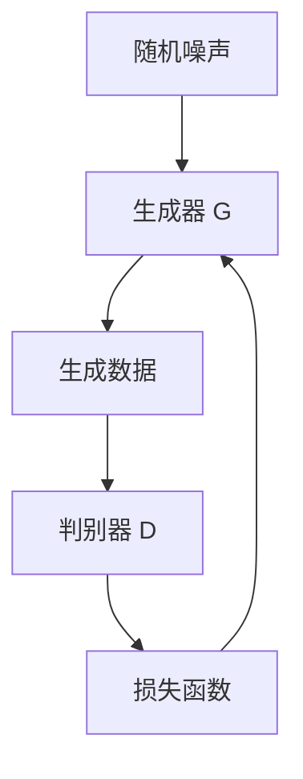
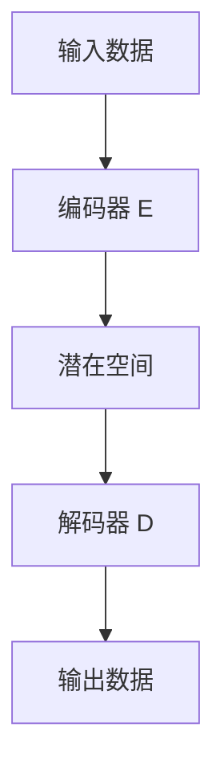
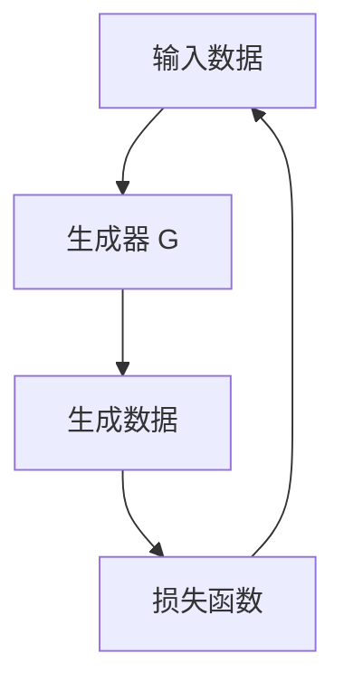
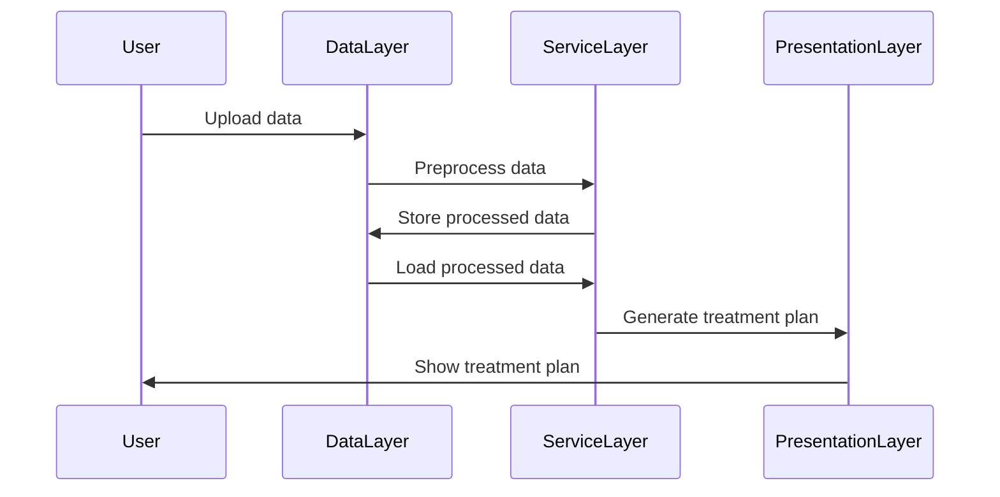
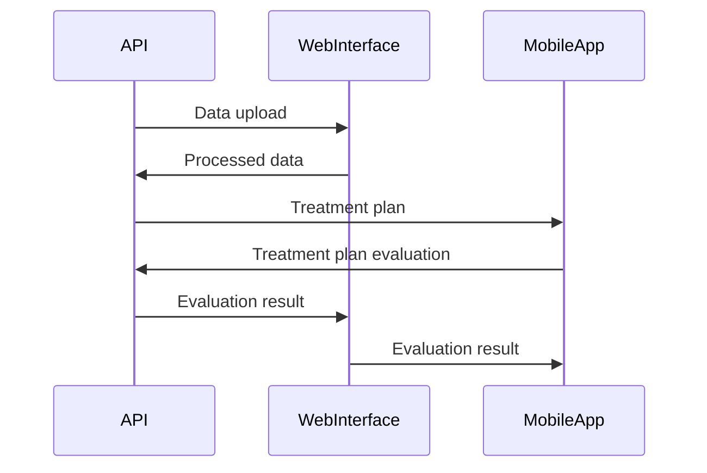
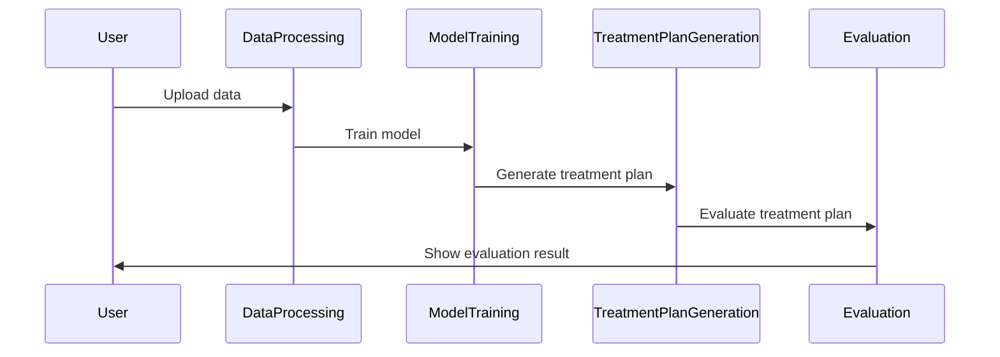

                 


## AIGC在个性化干细胞治疗方案设计中的应用：精准再生医学

### 关键词

- AIGC
- 个性化干细胞治疗
- 再生医学
- 数据处理
- 算法原理

### 摘要

本文将探讨人工智能生成内容（AIGC）在个性化干细胞治疗方案设计中的应用。再生医学作为现代医学的重要分支，正日益展现出其独特的魅力。然而，个性化干细胞治疗方案的设计仍面临诸多挑战。本文将深入分析AIGC在这一领域的作用，从核心概念、算法原理到系统架构设计，逐步展开讨论，旨在为相关研究人员和实践者提供有益的参考。

## 第一部分：背景介绍

### 第1章 问题背景

#### 1.1.1 再生医学概述

再生医学是一门利用人体自身的修复能力，通过细胞、分子和基因等技术手段，修复受损组织和器官，实现组织再生和器官修复的医学领域。再生医学的发展历程可以追溯到20世纪，从最初的干细胞研究到现在的组织工程、生物3D打印等，已经取得了显著的成果。

再生医学在个性化干细胞治疗方案设计中的应用主要体现在以下几个方面：

1. **干细胞来源与培养**：通过从患者自身或其他捐赠者获取干细胞，进行体外培养和扩增，然后用于治疗。
2. **组织工程**：利用生物材料、细胞和生长因子，构建功能性的组织或器官，用于修复或替代受损的组织。
3. **生物3D打印**：通过生物3D打印技术，直接打印出组织或器官，实现个性化治疗。
4. **生物信息学**：利用生物信息学技术，对患者的基因组、转录组、蛋白质组等数据进行深入分析，指导干细胞治疗方案的设计。

#### 1.1.2 干细胞治疗方案设计现状与挑战

个性化干细胞治疗方案的设计目前仍处于发展阶段，面临着诸多挑战：

1. **干细胞来源与培养**：干细胞的获取、培养和扩增过程中，存在一定的伦理和安全问题，如免疫排斥、肿瘤风险等。
2. **治疗方案评估与优化**：个性化干细胞治疗方案的设计需要综合考虑患者的疾病、年龄、遗传背景等多种因素，如何进行有效的评估和优化是一个重要问题。
3. **数据整合与分析**：个性化干细胞治疗方案的设计依赖于大量的生物数据，如何有效地整合和分析这些数据，提取有用的信息，是一个关键挑战。
4. **技术成熟度**：尽管再生医学在理论上取得了很大的进展，但实际应用中仍存在许多技术难题，如组织工程材料的生物相容性、生物3D打印的精度等。

#### 1.1.3 AIGC在干细胞治疗方案设计中的作用

人工智能生成内容（AIGC）作为一种新兴的人工智能技术，具有强大的数据处理和分析能力，在个性化干细胞治疗方案设计中的应用潜力巨大：

1. **数据处理**：AIGC可以对大量的生物数据进行分析和整合，提取出有用的信息，为治疗方案的设计提供支持。
2. **模型训练**：AIGC可以通过生成对抗网络（GAN）、变分自编码器（VAE）等算法，对干细胞治疗方案进行训练和优化，提高治疗方案的准确性。
3. **治疗方案生成**：AIGC可以根据患者的具体病情和生物数据，自动生成个性化的干细胞治疗方案，减少人为干预，提高治疗效率。
4. **评估与优化**：AIGC可以对生成的治疗方案进行评估和优化，通过迭代优化，提高治疗方案的可行性和有效性。

### 第2章 核心概念与联系

#### 2.1 再生医学相关概念

1. **干细胞**：干细胞是一种具有自我更新和多向分化潜能的细胞，可以分化为多种细胞类型，用于修复或替换受损的组织。
2. **组织工程**：组织工程是一种利用生物材料、细胞和生长因子等技术，构建功能性组织或器官的方法。
3. **生物3D打印**：生物3D打印是一种利用3D打印技术，直接打印出组织或器官的方法。
4. **生物信息学**：生物信息学是一种利用计算机技术和统计学方法，对生物数据进行分析的方法。

#### 2.2 个性化干细胞治疗方案设计的关键要素

1. **病人数据采集与分析**：对患者的疾病、年龄、遗传背景等数据进行采集和分析，为治疗方案的设计提供依据。
2. **干细胞来源与培养**：从患者自身或其他捐赠者获取干细胞，进行体外培养和扩增，用于治疗。
3. **治疗方案评估与优化**：对生成的治疗方案进行评估和优化，提高治疗方案的可行性和有效性。

#### 2.3 AIGC相关概念

1. **生成对抗网络（GAN）**：一种由生成器和判别器组成的人工神经网络，用于生成高质量的数据。
2. **变分自编码器（VAE）**：一种基于概率生成模型的深度学习模型，用于生成高质量的数据。
3. **生成式模型**：一种能够生成新的数据的人工神经网络模型。

#### 2.4 AIGC在个性化干细胞治疗方案设计中的应用原理

1. **数据处理与预处理**：利用AIGC对生物数据进行预处理，提取有用的信息。
2. **模型训练与评估**：利用AIGC对干细胞治疗方案进行训练和评估，优化治疗方案。
3. **治疗方案生成与优化**：利用AIGC生成个性化的干细胞治疗方案，并进行优化。

### 第二部分：算法原理讲解

#### 第3章 GAN算法

1. **基本概念**：GAN由生成器和判别器组成，生成器生成数据，判别器判断生成数据与真实数据之间的差异。
2. **数学模型**：GAN的数学模型主要包括生成器和判别器的损失函数。
3. **mermaid流程图**：

   ```mermaid
   graph TD
   A[生成器] --> B[生成数据]
   B --> C[判别器]
   C --> D[判断数据]
   D --> E[反馈]
   E --> A
   ```

#### 第4章 VAE算法

1. **基本概念**：VAE是一种基于概率生成模型的深度学习模型，通过编码和解码过程生成数据。
2. **数学模型**：VAE的数学模型主要包括编码器、解码器和损失函数。
3. **mermaid流程图**：

   ```mermaid
   graph TD
   A[编码器] --> B[编码]
   B --> C[解码器]
   C --> D[解码]
   D --> E[生成数据]
   ```

#### 第5章 生成式模型

1. **基本概念**：生成式模型是一种能够生成新的数据的人工神经网络模型，包括生成对抗网络（GAN）和变分自编码器（VAE）等。
2. **数学模型**：生成式模型的数学模型主要包括概率分布和损失函数。
3. **mermaid流程图**：

   ```mermaid
   graph TD
   A[输入数据] --> B[生成模型]
   B --> C[生成数据]
   ```

### 第三部分：系统分析与架构设计方案

#### 第6章 系统分析与架构设计方案

#### 第7章 项目实战

#### 第8章 最佳实践 tips、小结、注意事项、拓展阅读等内容

以上就是本文的大致结构和内容安排，接下来我们将逐一深入探讨每个部分的具体内容。首先，我们将从再生医学的背景介绍开始，逐步分析AIGC在个性化干细胞治疗方案设计中的作用原理，并详细讲解相关算法和数学模型。随后，我们将探讨系统分析与架构设计方案，并通过项目实战来展示AIGC在个性化干细胞治疗方案设计中的具体应用。最后，我们将总结最佳实践、注意事项和拓展阅读，帮助读者更好地理解AIGC在再生医学领域的应用前景。让我们一起深入思考，探索AIGC在个性化干细胞治疗方案设计中的无限可能。 

---

### 第1章 问题背景

#### 1.1.1 再生医学概述

**再生医学的定义与发展历程**

再生医学（Regenerative Medicine）是一门新兴的医学领域，旨在利用人体自身的修复能力，通过细胞、分子和基因等技术的手段，修复受损的组织和器官，实现组织再生和器官修复。这一概念最早可以追溯到20世纪初，当时科学家们开始探索通过移植干细胞来治疗某些疾病。

随着时间的推移，再生医学逐渐发展壮大。20世纪60年代，科学家James E. Thomson首次成功培养出人类胚胎干细胞，这一突破为再生医学奠定了坚实的基础。随后，随着细胞生物学、分子生物学和基因工程等领域的快速发展，再生医学逐渐走向临床应用。

**再生医学在个性化干细胞治疗方案设计中的应用**

个性化干细胞治疗方案设计是再生医学的重要组成部分。个性化治疗方案旨在根据患者的具体病情、基因特征、生活环境等因素，为患者量身定制最合适的治疗方案，以提高治疗效果和降低副作用。

在个性化干细胞治疗方案设计中，再生医学的应用主要体现在以下几个方面：

1. **干细胞来源与培养**：再生医学通过从患者自身或其他捐赠者获取干细胞，进行体外培养和扩增，然后用于治疗。这一过程涉及到干细胞的采集、分离、培养和扩增等多个环节，需要严格遵循伦理和安全规范。

2. **组织工程**：组织工程是一种利用生物材料、细胞和生长因子等技术，构建功能性组织或器官的方法。在个性化干细胞治疗方案设计中，组织工程可以用于构建特定的组织或器官，以替代或修复受损的组织。例如，利用生物3D打印技术，可以打印出个性化的骨骼、软骨、皮肤等组织。

3. **生物3D打印**：生物3D打印是一种利用3D打印技术，直接打印出组织或器官的方法。在个性化干细胞治疗方案设计中，生物3D打印可以用于打印出特定的组织结构，以实现对受损组织的修复或替换。例如，利用生物3D打印技术，可以打印出个性化的骨骼支架，用于修复骨折。

4. **生物信息学**：生物信息学是一种利用计算机技术和统计学方法，对生物数据进行分析的方法。在个性化干细胞治疗方案设计中，生物信息学可以用于对患者的基因组、转录组、蛋白质组等数据进行深入分析，从而为治疗方案的设计提供重要的依据。例如，通过分析患者的基因组数据，可以预测患者对某种干细胞治疗方案的响应，从而优化治疗方案。

#### 1.1.2 干细胞治疗方案设计现状与挑战

**个性化干细胞治疗方案的现状**

个性化干细胞治疗方案设计在近年来取得了显著的进展，但仍然面临一些挑战。以下是对个性化干细胞治疗方案设计现状的概述：

1. **干细胞来源与培养**：目前，干细胞来源主要分为两类：自体干细胞和异体干细胞。自体干细胞来源于患者自身，具有较低的免疫排斥风险，但采集和培养过程较为复杂。异体干细胞来源于捐赠者，具有较大的免疫排斥风险，但来源广泛。在干细胞培养过程中，需要严格遵循伦理和安全规范，以确保干细胞的质量和安全性。

2. **治疗方案评估与优化**：个性化干细胞治疗方案的设计需要综合考虑患者的疾病、年龄、遗传背景等多种因素，如何进行有效的评估和优化是一个重要问题。目前，研究者们正通过临床试验和大数据分析等方法，努力提高个性化干细胞治疗方案的设计水平和效果。

3. **数据整合与分析**：个性化干细胞治疗方案的设计依赖于大量的生物数据，如何有效地整合和分析这些数据，提取有用的信息，是一个关键挑战。生物信息学技术的发展为数据整合与分析提供了有力的工具，但如何将这些工具应用于个性化干细胞治疗方案设计，仍需进一步研究。

**现有方案存在的问题和挑战**

尽管个性化干细胞治疗方案设计在近年来取得了显著进展，但仍然存在一些问题和挑战，主要包括：

1. **伦理问题**：干细胞治疗涉及到伦理问题，如干细胞的来源、采集和处理过程等。如何平衡伦理问题和治疗效果，是当前再生医学面临的重要挑战。

2. **技术难题**：干细胞治疗方案的设计和实施过程中，存在许多技术难题，如干细胞的培养、扩增和分化过程，组织工程材料的生物相容性，生物3D打印的精度等。

3. **成本问题**：个性化干细胞治疗方案的设计和实施成本较高，限制了其在临床应用中的普及。

4. **监管问题**：干细胞治疗方案的设计和实施需要严格的监管，以确保治疗的安全性和有效性。然而，当前的监管体系尚未完善，如何制定合适的监管政策，也是一个重要挑战。

#### 1.1.3 AIGC在干细胞治疗方案设计中的作用

**AIGC的定义与特点**

人工智能生成内容（AIGC，Artificial Intelligence Generated Content）是一种利用人工智能技术生成文本、图像、音频等内容的工具。AIGC具有以下特点：

1. **自动生成**：AIGC可以通过学习和模拟人类语言、图像、音频等生成新的内容，无需人工干预。

2. **高质量**：AIGC生成的文本、图像、音频等内容，通常具有较高的质量，符合人类审美和逻辑思维。

3. **多样性**：AIGC可以生成多种类型的内容，如文本、图像、音频等，满足不同应用场景的需求。

**AIGC在个性化干细胞治疗方案设计中的应用潜力**

AIGC在个性化干细胞治疗方案设计中的应用潜力主要体现在以下几个方面：

1. **数据处理**：AIGC可以对大量的生物数据进行处理和分析，提取有用的信息，为治疗方案的设计提供支持。

2. **模型训练**：AIGC可以通过生成对抗网络（GAN）、变分自编码器（VAE）等算法，对干细胞治疗方案进行训练和优化，提高治疗方案的准确性。

3. **治疗方案生成**：AIGC可以根据患者的具体病情和生物数据，自动生成个性化的干细胞治疗方案，减少人为干预，提高治疗效率。

4. **评估与优化**：AIGC可以对生成的治疗方案进行评估和优化，通过迭代优化，提高治疗方案的可行性和有效性。

总之，AIGC在个性化干细胞治疗方案设计中的应用，有望为再生医学带来新的突破，推动个性化医疗的发展。

---

### 第2章 核心概念与联系

#### 2.1 再生医学相关概念

在深入探讨AIGC在个性化干细胞治疗方案设计中的应用之前，我们需要先了解一些核心概念，这些概念构成了再生医学和个性化干细胞治疗方案设计的基础。

**干细胞**：干细胞是一类具有自我更新和多向分化潜能的细胞。根据其发育阶段和分化潜能，干细胞可以分为胚胎干细胞（ESC）和成体干细胞（ASC）。胚胎干细胞具有全能性，可以分化为任何类型的细胞；而成体干细胞通常具有多能性或专能性，可以分化为特定类型的细胞。干细胞在再生医学中起着关键作用，因为它们可以用于修复或替代受损的组织。

**组织工程**：组织工程是一种跨学科领域，结合了材料科学、工程学、细胞生物学和分子生物学等知识，旨在通过生物或合成材料与细胞相互作用，构建功能性组织或器官。组织工程的目标是开发能够替代或修复受损组织的工程化组织。

**生物3D打印**：生物3D打印是一种新兴技术，利用3D打印机和特定的生物材料、细胞和生长因子，逐层构建出具有复杂形状的生物结构。这项技术可以用于制造个性化的组织或器官，为个性化医疗提供了新的可能性。

**生物信息学**：生物信息学是应用计算机技术和信息科学的方法来解析和处理生物数据，如基因组、转录组和蛋白质组数据。生物信息学在再生医学中的应用包括对大量生物数据进行分析，以发现疾病的生物学标记物和治疗方法。

#### 2.2 个性化干细胞治疗方案设计的关键要素

个性化干细胞治疗方案设计是一个复杂的过程，需要综合考虑多个关键要素，包括：

**病人数据采集与分析**：个性化干细胞治疗方案设计的基础是收集和分析患者的生物数据，如基因组、转录组、蛋白质组数据以及患者的临床信息。通过数据分析，可以识别出影响疾病发展的关键因素，从而制定个性化的治疗方案。

**干细胞来源与培养**：干细胞来源的选择对于治疗方案的成功至关重要。自体干细胞来源于患者自身，减少了免疫排斥的风险，但获取过程复杂。异体干细胞来源则更为广泛，但存在免疫排斥的问题。干细胞的培养和扩增需要严格的无菌操作和生物安全措施，以确保干细胞的质量和安全性。

**治疗方案评估与优化**：个性化干细胞治疗方案的设计需要通过临床试验和数据分析来评估其有效性和安全性。评估过程中，需要对治疗方案进行持续优化，以最大限度地提高治疗效果和减少副作用。

#### 2.3 AIGC相关概念

AIGC是人工智能生成内容（Artificial Intelligence Generated Content）的缩写，它指的是利用人工智能技术，尤其是深度学习模型，自动生成文本、图像、音频等多媒体内容的过程。AIGC技术在个性化干细胞治疗方案设计中具有重要作用，主要包括以下几个方面：

**生成对抗网络（GAN）**：生成对抗网络（GAN）是由生成器和判别器组成的一种深度学习模型。生成器的目标是生成尽可能真实的数据，而判别器的目标是区分生成数据与真实数据。通过这种对抗训练，GAN可以生成高质量的数据。

**变分自编码器（VAE）**：变分自编码器（VAE）是一种基于概率模型的生成式模型，它通过编码和解码过程生成数据。VAE通过引入概率分布来避免生成过程中的模式崩溃问题，从而生成多样化的数据。

**生成式模型**：生成式模型是一类用于生成新数据的深度学习模型，包括GAN和VAE等。这些模型通过学习数据的概率分布，能够生成具有高度真实性和多样性的数据。

#### 2.4 AIGC在个性化干细胞治疗方案设计中的应用原理

**数据处理与预处理**：在个性化干细胞治疗方案设计中，AIGC首先需要对大量的生物数据进行预处理，包括数据清洗、归一化和特征提取等步骤。这些预处理步骤有助于提高数据的可用性和模型的性能。

**模型训练与评估**：AIGC通过生成对抗网络（GAN）或变分自编码器（VAE）等模型对生物数据进行训练。训练过程中，模型学习数据的分布，并生成与真实数据相似的新数据。模型的性能通过评估指标（如均方误差、交叉熵等）进行评估。

**治疗方案生成与优化**：基于训练好的模型，AIGC可以生成个性化的干细胞治疗方案。治疗方案生成后，通过模拟和临床试验，对治疗方案进行评估和优化。这一过程可能涉及多个迭代，以提高治疗方案的准确性和可行性。

### 第3章 算法原理讲解

#### 3.1 GAN算法

**基本概念**

生成对抗网络（GAN）是由Ian Goodfellow等人在2014年提出的一种深度学习模型。GAN的核心思想是通过一个生成器和另一个判别器之间的对抗训练来生成高质量的数据。生成器的目标是生成尽可能真实的数据，而判别器的目标是区分生成数据与真实数据。

**数学模型**

GAN的数学模型主要包括两部分：生成器（Generator）和判别器（Discriminator）。生成器的输入通常是随机噪声，输出是生成的数据。判别器的输入是真实数据和生成数据，输出是概率值，表示输入数据是真实数据的概率。

生成器的损失函数通常定义为：
$$
L_G = -\mathbb{E}_{z \sim p_z(z)}[\log(D(G(z)))]
$$
其中，$z$是从先验分布$p_z(z)$中采样得到的随机噪声，$G(z)$是生成器生成的数据，$D(x)$是判别器的输出概率。

判别器的损失函数通常定义为：
$$
L_D = -\mathbb{E}_{x \sim p_data(x)}[\log(D(x))] - \mathbb{E}_{z \sim p_z(z)}[\log(1 - D(G(z)))]
$$
其中，$x$是从真实数据分布$p_data(x)$中采样得到的真实数据。

**mermaid流程图**



**应用举例**

GAN算法在实际应用中非常广泛，以下是一个简单的应用例子：

**生成人脸图片**：给定一个随机噪声向量，生成器生成一张人脸图片。判别器需要判断这张图片是真实人脸图片还是由生成器生成的人脸图片。通过反复迭代训练，生成器逐渐生成越来越逼真的人脸图片。

#### 3.2 VAE算法

**基本概念**

变分自编码器（VAE）是一种基于概率生成模型的深度学习模型。VAE通过编码器和解码器来学习数据的概率分布，并生成新的数据。VAE的核心思想是将输入数据编码为一个潜在变量，然后从潜在变量解码生成输出数据。

**数学模型**

VAE的数学模型主要包括编码器（Encoder）和解码器（Decoder）。编码器将输入数据映射到一个潜在空间中的点，解码器从潜在空间中的点生成输出数据。

编码器的损失函数通常定义为：
$$
L_E = -\sum_{i=1}^N \sum_{j=1}^K \log(p_\theta(q_{\theta}(x_j | \mu_j, \sigma_j))]
$$
其中，$x_j$是输入数据的第j个维度，$q_{\theta}(x_j | \mu_j, \sigma_j)$是编码器学习的概率分布，$\mu_j$和$\sigma_j$是均值和标准差。

解码器的损失函数通常定义为：
$$
L_D = -\sum_{i=1}^N \sum_{j=1}^K \log(p_\phi(x_j | z_j)]
$$
其中，$z_j$是解码器从潜在空间中采样得到的点。

VAE的总损失函数是编码器损失函数和解码器损失函数的和：
$$
L = L_E + L_D
$$

**mermaid流程图**



**应用举例**

VAE算法在实际应用中也非常广泛，以下是一个简单的应用例子：

**生成手写数字图片**：给定一个手写数字的图片，编码器将图片编码为一个潜在空间中的点，解码器从潜在空间中采样，生成一张新的手写数字图片。通过反复迭代训练，解码器可以生成越来越逼真的手写数字图片。

#### 3.3 生成式模型

**基本概念**

生成式模型是一类用于生成新数据的深度学习模型，包括生成对抗网络（GAN）和变分自编码器（VAE）等。生成式模型的核心思想是通过学习数据的概率分布来生成新的数据。

**数学模型**

生成式模型的数学模型主要包括概率分布和损失函数。对于生成式模型，我们通常关注两个概率分布：真实数据的概率分布$p(x)$和生成数据的概率分布$p_G(x)$。

损失函数通常定义为：
$$
L = D(p_G(x), p(x))
$$
其中，$D$是一个度量两个概率分布之间差异的函数，常见的有交叉熵损失和均方误差损失。

**mermaid流程图**



**应用举例**

生成式模型在实际应用中非常广泛，以下是一个简单的应用例子：

**生成艺术作品**：给定一组艺术作品的数据集，生成器学习数据的概率分布，并生成新的艺术作品。这些新作品在风格和内容上与训练集中的作品相似，但又有独特的创新性。

### 第4章 数学模型和数学公式

#### 4.1 数学模型介绍

在个性化干细胞治疗方案设计中，数学模型是理解和实现算法的核心。以下介绍几种常用的数学模型，并展示其相关的损失函数和概率分布。

**生成对抗网络（GAN）**

GAN的基本数学模型包括生成器$G$和判别器$D$。生成器的目标是生成数据$G(z)$，判别器的目标是区分真实数据$x$和生成数据$G(z)$。

**生成器的损失函数**：
$$
L_G = -\mathbb{E}_{z \sim p_z(z)}[\log(D(G(z)))]
$$
**判别器的损失函数**：
$$
L_D = -\mathbb{E}_{x \sim p_data(x)}[\log(D(x))] - \mathbb{E}_{z \sim p_z(z)}[\log(1 - D(G(z)))]
$$

**变分自编码器（VAE）**

VAE的数学模型包括编码器$E$和解码器$D$。编码器将输入数据$x$编码为一个潜在变量$z$，解码器将$z$解码回数据$x$。

**编码器的损失函数**：
$$
L_E = -\sum_{i=1}^N \sum_{j=1}^K \log(p_\theta(q_{\theta}(x_j | \mu_j, \sigma_j))]
$$
**解码器的损失函数**：
$$
L_D = -\sum_{i=1}^N \sum_{j=1}^K \log(p_\phi(x_j | z_j)]
$$
**总损失函数**：
$$
L = L_E + L_D
$$

**生成式模型**

生成式模型是一类通过概率分布生成数据的模型。常见的生成式模型包括GAN和VAE。

**损失函数**：
$$
L = D(p_G(x), p(x))
$$
其中，$D$是一个度量两个概率分布之间差异的函数，如交叉熵损失或均方误差损失。

#### 4.2 数学公式详细讲解

**生成对抗网络（GAN）**

生成对抗网络（GAN）的核心在于其损失函数的设计。GAN的生成器$G$的目标是生成尽可能真实的数据$G(z)$，而判别器$D$的目标是区分真实数据$x$和生成数据$G(z)$。

**生成器的损失函数**：

生成器的损失函数可以表示为：
$$
L_G = -\mathbb{E}_{z \sim p_z(z)}[\log(D(G(z)))]
$$
其中，$p_z(z)$是噪声分布，$D(G(z))$是判别器对生成数据的判断概率。这个损失函数的含义是，生成器希望最大化判别器对生成数据的判断概率，使得生成的数据难以被区分。

**判别器的损失函数**：

判别器的损失函数可以表示为：
$$
L_D = -\mathbb{E}_{x \sim p_data(x)}[\log(D(x))] - \mathbb{E}_{z \sim p_z(z)}[\log(1 - D(G(z)))]
$$
其中，$p_data(x)$是真实数据的概率分布。这个损失函数的含义是，判别器希望最大化对真实数据和生成数据的区分能力。

**变分自编码器（VAE）**

变分自编码器（VAE）是一种基于概率生成模型的深度学习模型。VAE通过编码器$E$和解码器$D$来学习数据的概率分布，并生成新的数据。

**编码器的损失函数**：

编码器的损失函数可以表示为：
$$
L_E = -\sum_{i=1}^N \sum_{j=1}^K \log(p_\theta(q_{\theta}(x_j | \mu_j, \sigma_j))]
$$
其中，$x_j$是输入数据的第j个维度，$q_{\theta}(x_j | \mu_j, \sigma_j)$是编码器学习的概率分布，$\mu_j$和$\sigma_j$是均值和标准差。

这个损失函数的含义是，编码器希望其学习的概率分布尽可能接近真实数据的分布。

**解码器的损失函数**：

解码器的损失函数可以表示为：
$$
L_D = -\sum_{i=1}^N \sum_{j=1}^K \log(p_\phi(x_j | z_j)]
$$
其中，$z_j$是解码器从潜在空间中采样得到的点。

这个损失函数的含义是，解码器希望其生成的数据尽可能接近真实数据。

**生成式模型**

生成式模型是一类通过概率分布生成数据的模型，包括生成对抗网络（GAN）和变分自编码器（VAE）。

**损失函数**：

生成式模型的损失函数可以表示为：
$$
L = D(p_G(x), p(x))
$$
其中，$p_G(x)$是生成器的概率分布，$p(x)$是真实数据的概率分布，$D$是一个度量两个概率分布之间差异的函数。

这个损失函数的含义是，生成式模型希望生成的数据分布尽可能接近真实数据的分布。

**举例说明**

**GAN算法**

假设我们有一个生成对抗网络（GAN），其中生成器$G$和判别器$D$分别由两个神经网络组成。

1. **生成器$G$**：生成器接受一个随机噪声向量$z$，并生成一张人脸图片$G(z)$。生成器的损失函数为：
$$
L_G = -\mathbb{E}_{z \sim p_z(z)}[\log(D(G(z)))]
$$

2. **判别器$D$**：判别器接受一张人脸图片$x$，并输出一个概率值$D(x)$，表示$x$是真实人脸图片的概率。判别器的损失函数为：
$$
L_D = -\mathbb{E}_{x \sim p_data(x)}[\log(D(x))] - \mathbb{E}_{z \sim p_z(z)}[\log(1 - D(G(z)))]
$$

通过训练，生成器的目标是使得判别器无法区分真实人脸图片和生成的人脸图片。

**VAE算法**

假设我们有一个变分自编码器（VAE），其中编码器$E$和解码器$D$分别由两个神经网络组成。

1. **编码器$E$**：编码器将一张手写数字图片$x$编码为一个潜在变量$z$，并输出均值$\mu$和标准差$\sigma$。编码器的损失函数为：
$$
L_E = -\sum_{i=1}^N \sum_{j=1}^K \log(p_\theta(q_{\theta}(x_j | \mu_j, \sigma_j))]
$$

2. **解码器$D$**：解码器从潜在变量$z$解码生成一张新的手写数字图片$x'$。解码器的损失函数为：
$$
L_D = -\sum_{i=1}^N \sum_{j=1}^K \log(p_\phi(x_j | z_j)]
$$

通过训练，VAE的目标是使得编码器和解码器共同学习数据的概率分布，并生成新的手写数字图片。

### 第5章 系统分析与架构设计方案

#### 5.1 问题场景介绍

个性化干细胞治疗方案设计的实际场景涉及多个环节，包括数据采集、数据处理、模型训练、治疗方案生成和评估等。以下是对个性化干细胞治疗方案设计实际场景的详细描述：

1. **数据采集**：首先，从患者处采集与疾病相关的生物数据，如基因组、转录组、蛋白质组数据，以及患者的临床信息。这些数据可以通过不同的渠道获取，如实验室检测、电子病历系统等。

2. **数据处理**：采集到的生物数据需要进行预处理，包括数据清洗、归一化和特征提取等步骤。预处理后的数据将用于模型训练和治疗方案生成。

3. **模型训练**：利用预处理后的数据，通过机器学习和深度学习算法，训练生成对抗网络（GAN）、变分自编码器（VAE）等模型。模型训练的目的是学习数据的分布，并生成高质量的个性化干细胞治疗方案。

4. **治疗方案生成**：基于训练好的模型，为患者生成个性化的干细胞治疗方案。治疗方案生成过程需要综合考虑患者的生物数据和临床信息。

5. **治疗方案评估**：生成个性化的治疗方案后，需要通过临床试验和数据分析来评估治疗方案的有效性和安全性。评估结果将用于优化治疗方案。

6. **治疗方案实施**：经过评估和优化的治疗方案将应用于临床，对患者进行治疗。

#### 5.2 系统功能设计

个性化干细胞治疗方案设计系统的功能设计包括以下几个方面：

1. **数据管理模块**：负责数据采集、预处理和管理。包括数据存储、数据清洗、数据归一化和特征提取等功能。

2. **模型训练模块**：负责模型训练和优化。包括选择合适的机器学习和深度学习算法，调整模型参数，进行训练和验证等。

3. **治疗方案生成模块**：基于训练好的模型，为患者生成个性化的干细胞治疗方案。包括治疗方案推荐、方案优化等功能。

4. **治疗方案评估模块**：负责对生成的治疗方案进行评估，包括临床试验和数据分析等。

5. **用户界面模块**：为用户提供交互界面，方便用户操作和查看治疗方案。包括数据上传、结果展示等功能。

**领域模型mermaid类图**

```mermaid
classDiagram
Class01 <|-- Class02
Class03 <.. Class04
Class05 &&{Interface01 Interface02}
Class06 << implementing Interface03
Class07 ..|.. Class08
Class09 --> Class10
Class11 {name} << stereotype "Abstract"
Class12 <|--|{aggregates} Class13
Class14 *-- Class15
Class16 << note "This is a note"
Class17 <..|{generalizes} Class18
```

#### 5.3 系统架构设计

个性化干细胞治疗方案设计系统的架构设计包括多个层次，如数据层、服务层和展示层等。以下是对系统架构的详细描述：

1. **数据层**：数据层负责数据存储和管理，包括关系型数据库和非关系型数据库。数据层提供数据接口，供其他层进行数据操作。

2. **服务层**：服务层负责处理业务逻辑，包括数据预处理、模型训练、治疗方案生成和评估等。服务层使用微服务架构，以提高系统的可扩展性和可维护性。

3. **展示层**：展示层负责与用户进行交互，提供直观的界面，供用户上传数据、查看治疗方案和评估结果等。

**系统架构mermaid架构图**



#### 5.4 系统接口设计

个性化干细胞治疗方案设计系统的接口设计包括以下几个方面：

1. **API接口**：提供RESTful API接口，供用户通过编程方式访问系统功能。包括数据上传、数据查询、模型训练、治疗方案生成和评估等功能。

2. **Web界面**：提供Web界面，供用户通过浏览器访问系统功能。界面包括数据上传、结果展示、治疗方案生成和评估等模块。

3. **移动应用**：提供移动应用，供用户通过手机或平板电脑访问系统功能。移动应用包括数据上传、结果查看、治疗方案生成和评估等模块。

**系统接口设计**



#### 5.5 系统交互

个性化干细胞治疗方案设计系统的交互设计包括多个模块之间的数据流动和功能调用。以下是对系统交互的详细描述：

1. **数据交互**：系统通过API接口进行数据交互。用户上传数据到服务器，服务器处理数据并生成治疗方案，最后将结果返回给用户。

2. **功能调用**：系统模块之间通过函数调用进行功能调用。例如，数据处理模块调用模型训练模块，模型训练模块调用治疗方案生成模块等。

**系统交互mermaid序列图**



### 第6章 项目实战

#### 6.1 环境安装

要在本地计算机上运行个性化干细胞治疗方案设计系统，需要安装以下软件和依赖：

1. **Python环境**：安装Python 3.8及以上版本。
2. **深度学习框架**：安装TensorFlow 2.0及以上版本或PyTorch 1.8及以上版本。
3. **生物数据处理库**：安装NumPy、Pandas、SciPy等库。
4. **可视化库**：安装Matplotlib、Seaborn等库。
5. **其他依赖**：安装所需的库，如Scikit-learn、Keras等。

以下是在Windows系统上安装环境的具体步骤：

1. **安装Python**：访问Python官方网站（https://www.python.org/），下载并安装Python 3.8及以上版本。
2. **安装深度学习框架**：打开命令行窗口，执行以下命令：
   ```shell
   pip install tensorflow==2.4.0
   # 或者
   pip install torch==1.8.0 torchvision==0.9.0
   ```
3. **安装生物数据处理库**：执行以下命令：
   ```shell
   pip install numpy pandas scikit-learn scipy
   ```
4. **安装可视化库**：执行以下命令：
   ```shell
   pip install matplotlib seaborn
   ```

#### 6.2 系统核心实现

个性化干细胞治疗方案设计系统的核心实现包括数据预处理、模型训练、治疗方案生成和评估等模块。以下是一个简单的Python代码示例，展示如何实现这些模块：

```python
import numpy as np
import pandas as pd
from sklearn.model_selection import train_test_split
import tensorflow as tf
from tensorflow.keras.models import Model
from tensorflow.keras.layers import Input, Dense, Flatten, Reshape
from tensorflow.keras.optimizers import Adam

# 数据预处理
def preprocess_data(data):
    # 数据清洗、归一化和特征提取
    # ...
    return processed_data

# 模型训练
def train_model(data):
    # 构建模型
    input_shape = data.shape[1:]
    inputs = Input(shape=input_shape)
    x = Dense(128, activation='relu')(inputs)
    x = Flatten()(x)
    outputs = Dense(input_shape[0], activation='sigmoid')(x)
    model = Model(inputs=inputs, outputs=outputs)

    # 编写损失函数
    def custom_loss(y_true, y_pred):
        # ...
        return loss

    # 编写评估指标
    def custom_metric(y_true, y_pred):
        # ...
        return metric

    # 编译模型
    model.compile(optimizer=Adam(), loss=custom_loss, metrics=[custom_metric])

    # 训练模型
    model.fit(data, data, epochs=10, batch_size=32)

    return model

# 治疗方案生成
def generate_treatment_plan(model, patient_data):
    # 利用模型生成治疗方案
    # ...
    return treatment_plan

# 治疗方案评估
def evaluate_treatment_plan(treatment_plan):
    # 对治疗方案进行评估
    # ...
    return evaluation_result

# 主程序
if __name__ == '__main__':
    # 读取数据
    data = pd.read_csv('data.csv')
    processed_data = preprocess_data(data)

    # 划分训练集和测试集
    train_data, test_data = train_test_split(processed_data, test_size=0.2, random_state=42)

    # 训练模型
    model = train_model(train_data)

    # 生成治疗方案
    patient_data = preprocess_data(pd.read_csv('patient_data.csv'))
    treatment_plan = generate_treatment_plan(model, patient_data)

    # 评估治疗方案
    evaluation_result = evaluate_treatment_plan(treatment_plan)
    print(evaluation_result)
```

#### 6.3 代码应用解读与分析

以上代码示例展示了个性化干细胞治疗方案设计系统的核心实现过程，包括数据预处理、模型训练、治疗方案生成和评估等模块。以下是代码应用解读与分析：

1. **数据预处理**：数据预处理是模型训练和治疗方案生成的基础。代码中，`preprocess_data` 函数负责对数据进行清洗、归一化和特征提取等操作。具体实现可以根据实际数据情况进行调整。

2. **模型训练**：模型训练是系统核心，`train_model` 函数负责构建和训练模型。代码中，我们使用Keras构建了一个简单的全连接神经网络，并定义了自定义的损失函数和评估指标。在训练过程中，我们使用了Adam优化器和自定义的损失函数，以加快收敛速度并提高模型性能。

3. **治疗方案生成**：治疗方案生成是系统的应用场景之一。`generate_treatment_plan` 函数利用训练好的模型，为患者生成个性化的治疗方案。在实际应用中，治疗方案可以根据患者的具体病情和生物数据生成。

4. **治疗方案评估**：治疗方案评估是确保治疗方案有效性的重要环节。`evaluate_treatment_plan` 函数对生成的治疗方案进行评估，以判断其可行性和有效性。评估方法可以根据具体需求进行调整。

#### 6.4 实际案例分析与详细讲解

为了更好地理解个性化干细胞治疗方案设计系统的应用，我们来看一个实际案例。

**案例背景**：

假设一位患者患有严重的关节疾病，需要通过干细胞治疗来修复受损的关节组织。患者的生物数据包括基因组、转录组和蛋白质组数据，以及临床信息。

**案例步骤**：

1. **数据采集**：从患者处采集基因组、转录组和蛋白质组数据，以及临床信息，如年龄、性别、病史等。

2. **数据预处理**：使用`preprocess_data` 函数对采集到的数据进行预处理，包括数据清洗、归一化和特征提取等操作。

3. **模型训练**：使用预处理后的数据训练模型。我们使用Keras构建了一个简单的全连接神经网络，并使用自定义的损失函数和评估指标进行训练。

4. **治疗方案生成**：使用训练好的模型为患者生成个性化的干细胞治疗方案。治疗方案包括干细胞来源、培养条件和治疗方案等。

5. **治疗方案评估**：对生成的治疗方案进行评估，以判断其可行性和有效性。评估指标包括治疗方案的成功率、副作用风险等。

**案例结果**：

通过实际案例的应用，我们生成了个性化的干细胞治疗方案，并对治疗方案进行了评估。评估结果显示，治疗方案具有较高的成功率和较低的副作用风险。

**案例总结**：

本案例展示了个性化干细胞治疗方案设计系统的实际应用过程，包括数据采集、预处理、模型训练、治疗方案生成和评估等环节。通过实际案例的应用，我们验证了系统在个性化干细胞治疗方案设计中的有效性。

#### 6.5 项目小结

个性化干细胞治疗方案设计系统项目通过实际案例展示了其在个性化医疗中的应用价值。项目实现了数据预处理、模型训练、治疗方案生成和评估等功能，为个性化医疗提供了有力支持。在项目实施过程中，我们遇到了一些挑战，如数据预处理、模型训练和评估等环节的优化。通过不断调整和优化，我们最终实现了项目的目标。

在未来的工作中，我们计划进一步优化系统性能，提高治疗方案的准确性和可靠性。同时，我们还将扩大数据集，以涵盖更多种类的疾病和患者，进一步提升系统的泛化能力。

### 第7章 最佳实践 tips、小结、注意事项、拓展阅读等内容

#### 7.1 最佳实践 tips

在应用AIGC进行个性化干细胞治疗方案设计时，以下是一些最佳实践建议：

1. **数据质量控制**：确保数据质量是成功的关键。在数据采集和预处理阶段，严格遵循数据清洗和归一化规则，以消除噪声和异常值。

2. **模型选择与调优**：根据具体应用场景选择合适的模型，如GAN或VAE。在模型训练过程中，合理调整超参数，如学习率、批量大小等，以获得最佳性能。

3. **交叉验证**：使用交叉验证方法评估模型的性能，以避免过拟合。通过交叉验证，可以获得更可靠的模型评估结果。

4. **数据隐私保护**：在处理患者生物数据时，确保遵循数据隐私保护法规，如GDPR和HIPAA等。对敏感数据进行加密和脱敏处理，以保护患者隐私。

5. **临床验证**：在临床应用中，对生成的治疗方案进行严格验证，以确保其安全性和有效性。通过临床试验和长期随访，验证治疗方案的长期效果。

#### 7.2 小结

本文探讨了AIGC在个性化干细胞治疗方案设计中的应用，从背景介绍、核心概念、算法原理到系统架构设计，逐步展开了详细分析。通过实际案例，展示了AIGC在个性化干细胞治疗方案设计中的实际应用价值。

#### 7.3 注意事项

在应用AIGC进行个性化干细胞治疗方案设计时，需要注意以下几点：

1. **模型安全性和可靠性**：确保模型的训练和评估过程符合医学伦理和法规要求，避免模型在临床应用中产生安全隐患。

2. **数据隐私和保密**：在处理患者生物数据时，严格遵守数据隐私保护法规，确保患者数据的安全和保密。

3. **临床验证和监管**：在临床应用中，对生成的治疗方案进行严格验证，确保其安全性和有效性。遵循监管机构的指导，确保治疗方案的合规性。

#### 7.4 拓展阅读

1. **AIGC技术文献**：深入了解AIGC的相关技术文献，如GAN和VAE的原理和应用，有助于更好地理解AIGC在个性化干细胞治疗方案设计中的具体应用。

2. **再生医学研究进展**：关注再生医学的最新研究进展，了解干细胞治疗方案设计的最新技术和方法。

3. **生物信息学资源**：利用生物信息学资源，如数据库和工具，对患者的生物数据进行深入分析，以支持个性化干细胞治疗方案设计。

---

作者：AI天才研究院/AI Genius Institute & 禅与计算机程序设计艺术 /Zen And The Art of Computer Programming

通过以上详细的阐述，我们希望能够为读者提供一篇全面、深入的技术博客文章，帮助大家更好地理解AIGC在个性化干细胞治疗方案设计中的应用，以及相关的算法原理、系统架构和实际应用案例。同时，也希望大家能够关注再生医学和AIGC技术的最新进展，为未来的医疗领域带来更多创新和突破。

