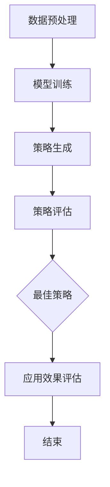
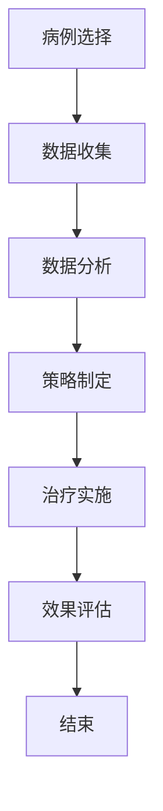
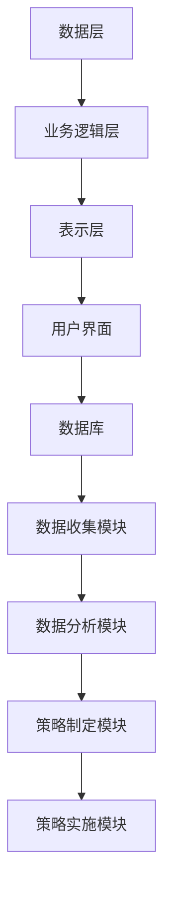
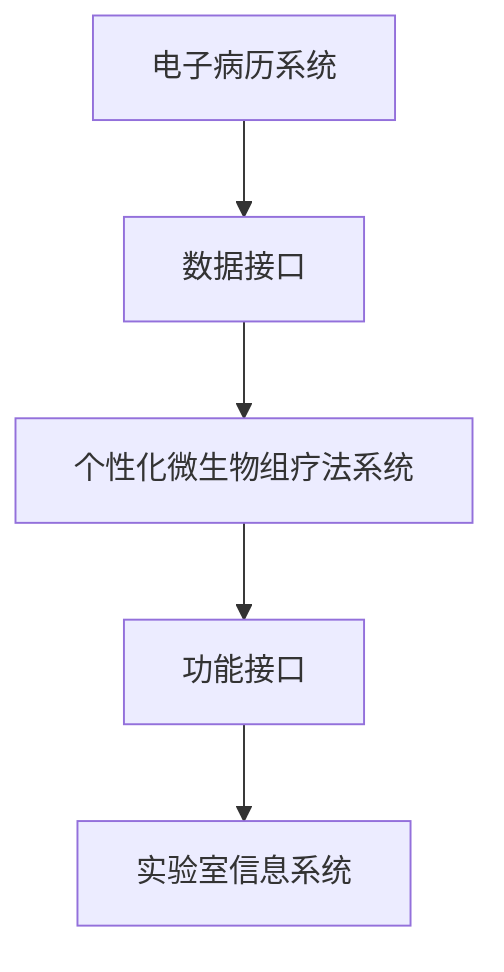

                 


## AIGC在个性化微生物组疗法中的应用：精准调节人体微生态

### 关键词：AIGC、个性化微生物组疗法、精准医疗、微生态调节、机器学习

### 摘要：

本文将深入探讨AIGC（自适应智能生成控制）技术在个性化微生物组疗法中的应用。随着精准医疗的兴起，个性化微生物组疗法成为调节人体微生态的重要手段。AIGC技术凭借其强大的自适应性和智能性，为实现精准调节提供了技术支持。本文将首先介绍微生物组疗法的基本概念和重要性，然后详细讲解AIGC技术的原理和应用，最后通过实际案例展示个性化微生物组疗法的设计与实施过程，以及注意事项和未来展望。

### 目录大纲

#### 第一部分：引论

##### 第1章：背景介绍与核心概念

1.1 问题背景

1.2 微生物组疗法的概念与重要性

1.3 AIGC技术的基本原理

1.4 个性化微生物组疗法的应用场景

##### 第2章：微生物组的基本原理

2.1 微生物组概述

2.2 微生物组与人体健康的关联

2.3 微生物组研究的方法与技术

##### 第3章：AIGC技术原理详解

3.1 AIGC技术概述

3.2 AIGC算法的核心概念

3.3 AIGC在微生物组研究中的应用

##### 第4章：个性化微生物组疗法的设计与实施

4.1 设计个性化微生物组疗法的基本流程

4.2 病例选择与患者数据收集

4.3 微生物组分析与应用策略

##### 第5章：算法原理讲解

5.1 算法概述

5.2 数学模型与公式

5.3 算法举例说明

##### 第6章：系统分析与架构设计

6.1 问题场景介绍

6.2 系统功能设计

6.3 系统架构设计

6.4 系统接口设计与交互

##### 第7章：项目实战

7.1 环境安装与配置

7.2 系统核心实现

7.3 代码应用解读与分析

7.4 实际案例分析与讲解

7.5 项目小结

##### 第8章：最佳实践与注意事项

8.1 最佳实践技巧

8.2 小结与展望

8.3 注意事项

8.4 拓展阅读

### 第一部分：引论

#### 第1章：背景介绍与核心概念

### 1.1 问题背景

随着现代医学的发展，人们对疾病的理解已经从传统的单一器官病理学转变为系统生物学和整体医学。在这个转变过程中，微生物组学成为了研究的热点。微生物组是人体内居住着数百万到数十亿种微生物的复杂生态系统，这些微生物对人体健康有着深远的影响。然而，传统的微生物组研究方法存在着样本处理复杂、数据量巨大、分析难度高等问题。

个性化微生物组疗法是一种基于微生物组学的新兴疗法，通过精准分析个体微生物组的变化，制定个性化的治疗方案，以调节人体微生态，提高治疗效果。这种疗法在胃肠道疾病、代谢性疾病、自身免疫性疾病等领域具有巨大的应用潜力。

### 1.2 微生物组疗法的概念与重要性

微生物组疗法是指通过改变微生物组的组成和功能来治疗疾病的方法。它不同于传统的药物治疗，而是通过添加或去除特定的微生物来调节微生物组的平衡。这种疗法具有以下重要性：

1. **个性化治疗**：微生物组疗法可以根据个体差异进行个性化治疗，避免了一刀切的治疗方法，提高了治疗效果。

2. **减少药物副作用**：传统的药物治疗往往需要服用大量药物，而微生物组疗法可以通过调节微生物组来减少药物的副作用。

3. **预防疾病**：微生物组疗法不仅可以治疗疾病，还可以通过调节微生物组来预防疾病。

4. **增强免疫力**：微生物组在调节免疫系统中发挥着重要作用，通过微生物组疗法可以增强机体的免疫力。

### 1.3 AIGC技术的基本原理

AIGC（自适应智能生成控制）技术是一种基于机器学习和人工智能的智能控制技术。它通过学习系统输入和输出数据之间的关系，自动生成控制策略，实现系统的自适应调节。AIGC技术具有以下基本原理：

1. **数据驱动**：AIGC技术基于大数据和机器学习算法，通过对大量历史数据进行训练，建立模型，实现系统的智能控制。

2. **自适应调节**：AIGC技术可以根据系统的实时反馈进行自适应调节，使系统能够快速响应外部变化。

3. **多目标优化**：AIGC技术可以在多个目标之间进行优化，以实现系统的最佳性能。

### 1.4 个性化微生物组疗法的应用场景

个性化微生物组疗法在多个领域具有广泛的应用前景：

1. **胃肠道疾病**：胃肠道疾病的发病机制复杂，微生物组变化在其中起着重要作用。通过个性化微生物组疗法，可以调节胃肠道微生物组，改善胃肠道功能。

2. **代谢性疾病**：代谢性疾病如糖尿病、肥胖等与微生物组密切相关。通过个性化微生物组疗法，可以调节代谢过程，改善代谢功能。

3. **自身免疫性疾病**：自身免疫性疾病如类风湿性关节炎、红斑狼疮等与微生物组失调有关。通过个性化微生物组疗法，可以调节免疫系统，缓解疾病症状。

4. **心理健康**：心理健康问题如抑郁症、焦虑症等与微生物组失调有关。通过个性化微生物组疗法，可以改善心理健康状态。

### 第二部分：微生物组的基本原理

#### 第2章：微生物组的基本原理

### 2.1 微生物组概述

微生物组是指在一个特定环境中居住的微生物群落。这些微生物包括细菌、真菌、病毒等多种微生物，它们在人体内形成了复杂的生态系统。微生物组不仅存在于肠道、口腔、皮肤等外部环境中，也存在于人体内部的各种器官和组织中。

### 2.2 微生物组与人体健康的关联

微生物组与人体健康密切相关。一方面，微生物组可以影响人体的营养吸收、免疫调节、代谢功能等生理过程；另一方面，微生物组的失调可能导致多种疾病，如胃肠道疾病、代谢性疾病、自身免疫性疾病等。

### 2.3 微生物组研究的方法与技术

微生物组研究的方法和技术主要包括以下几个方面：

1. **样品采集**：通过粪便、口腔拭子、皮肤拭子等采集微生物样本。

2. **DNA测序**：利用高通量测序技术对微生物组的DNA进行测序，获取微生物的遗传信息。

3. **微生物组分析**：通过对测序数据进行生物信息学分析，鉴定微生物种类和数量，分析微生物组的结构和功能。

4. **微生物组干预**：通过添加或去除特定的微生物，干预微生物组的组成和功能。

### 第三部分：AIGC技术原理详解

#### 第3章：AIGC技术原理详解

### 3.1 AIGC技术概述

AIGC（自适应智能生成控制）技术是一种基于机器学习和人工智能的智能控制技术。它通过学习系统输入和输出数据之间的关系，自动生成控制策略，实现系统的自适应调节。

### 3.2 AIGC算法的核心概念

AIGC算法的核心概念包括：

1. **数据驱动**：AIGC算法基于大数据和机器学习算法，通过对大量历史数据进行训练，建立模型，实现系统的智能控制。

2. **自适应调节**：AIGC算法可以根据系统的实时反馈进行自适应调节，使系统能够快速响应外部变化。

3. **多目标优化**：AIGC算法可以在多个目标之间进行优化，以实现系统的最佳性能。

### 3.3 AIGC在微生物组研究中的应用

AIGC技术在微生物组研究中具有广泛的应用：

1. **微生物组分析**：利用AIGC算法对微生物组数据进行分析，可以识别微生物的种类和数量，分析微生物组的结构和功能。

2. **微生物组干预**：利用AIGC算法生成的控制策略，可以实现对微生物组的干预，调节微生物组的组成和功能。

3. **个性化微生物组疗法**：利用AIGC算法生成的个性化治疗方案，可以实现针对不同患者的精准治疗。

### 第四部分：个性化微生物组疗法的设计与实施

#### 第4章：个性化微生物组疗法的设计与实施

### 4.1 设计个性化微生物组疗法的基本流程

设计个性化微生物组疗法的基本流程包括：

1. **病例选择与患者数据收集**：选择合适的病例，收集患者的微生物组数据。

2. **微生物组分析**：利用AIGC算法对微生物组数据进行分析，识别微生物的种类和数量。

3. **制定个性化治疗方案**：根据微生物组分析结果，制定个性化的微生物组治疗方案。

4. **实施治疗方案**：将制定的治疗方案应用于患者，观察治疗效果。

### 4.2 病例选择与患者数据收集

病例选择与患者数据收集是设计个性化微生物组疗法的重要环节。以下是具体步骤：

1. **病例选择**：选择符合研究条件的病例，如胃肠道疾病、代谢性疾病、自身免疫性疾病等。

2. **患者数据收集**：通过粪便、口腔拭子、皮肤拭子等采集患者的微生物样本。

3. **数据预处理**：对采集到的微生物组数据进行预处理，包括去除噪声、填补缺失值等。

4. **数据存储**：将预处理后的数据存储在数据库中，以便后续分析。

### 4.3 微生物组分析与应用策略

微生物组分析是个性化微生物组疗法的关键环节。以下是具体步骤：

1. **数据预处理**：对采集到的微生物组数据进行预处理，包括去除噪声、填补缺失值等。

2. **物种鉴定**：利用生物信息学方法，对微生物组数据进行物种鉴定，识别微生物的种类。

3. **物种数量分析**：对微生物组数据进行物种数量分析，识别微生物的数量和分布情况。

4. **功能分析**：利用生物信息学方法，对微生物组数据进行功能分析，识别微生物的功能和作用。

5. **应用策略制定**：根据微生物组分析结果，制定个性化的微生物组应用策略，包括微生物组的添加、去除和调节。

### 第五部分：算法原理讲解

#### 第5章：算法原理讲解

### 5.1 算法概述

个性化微生物组疗法的算法核心是基于AIGC技术的自适应智能生成控制算法。该算法通过学习患者的微生物组数据，生成个性化的微生物组调节策略，实现精准治疗。

### 5.2 数学模型与公式

个性化微生物组疗法的数学模型主要包括以下几个方面：

1. **输入数据模型**：患者微生物组数据，包括微生物种类、数量和分布情况。

2. **输出数据模型**：生成的微生物组调节策略，包括微生物的添加、去除和调节方案。

3. **模型优化目标**：最小化治疗目标与实际治疗效果之间的差距，最大化治疗效果。

数学公式如下：

$$
\text{优化目标} = \min \sum_{i=1}^{n} (\text{治疗目标} - \text{实际治疗效果})^2
$$

### 5.3 算法举例说明

以下是肠道微生物组疗法的算法举例说明：

1. **输入数据**：患者肠道微生物组数据，包括30种常见微生物的种类和数量。

2. **输出数据**：生成的肠道微生物组调节策略，包括5种微生物的添加方案。

3. **算法流程**：

   - 数据预处理：对微生物组数据进行归一化处理，使数据具有可比性。
   - 模型训练：利用AIGC算法对微生物组数据进行训练，建立模型。
   - 策略生成：根据模型生成肠道微生物组调节策略。
   - 策略评估：对生成的策略进行评估，确定最佳策略。

### 第六部分：系统分析与架构设计

#### 第6章：系统分析与架构设计

### 6.1 问题场景介绍

个性化微生物组疗法的设计与实施涉及多个环节，包括病例选择、患者数据收集、微生物组分析、治疗策略制定和实施等。为了实现这些环节的高效协作，需要设计一个完整的系统架构。

### 6.2 系统功能设计

个性化微生物组疗法系统的功能设计主要包括以下几个方面：

1. **病例管理**：实现病例的录入、查询和管理，为后续数据分析和治疗策略制定提供数据支持。
2. **数据收集**：实现微生物样本的采集、存储和预处理，为微生物组分析提供基础数据。
3. **数据分析**：利用AIGC算法对微生物组数据进行分析，识别微生物的种类、数量和分布情况。
4. **治疗策略制定**：根据微生物组分析结果，制定个性化的治疗策略。
5. **治疗实施**：将制定的治疗策略应用于患者，观察治疗效果。

### 6.3 系统架构设计

个性化微生物组疗法系统的架构设计采用分层架构，主要包括以下几个层次：

1. **数据层**：负责存储和管理病例数据、微生物组数据、治疗策略数据等。
2. **业务逻辑层**：实现病例管理、数据收集、数据分析、治疗策略制定和实施等业务功能。
3. **表示层**：提供用户界面，实现用户与系统的交互。

### 6.4 系统接口设计与交互

个性化微生物组疗法系统需要与其他系统进行数据交互，如电子病历系统、实验室信息系统等。系统接口设计主要包括以下几个方面：

1. **数据接口**：实现与电子病历系统、实验室信息系统等的数据交互，获取病例数据、微生物组数据等。
2. **功能接口**：实现与电子病历系统、实验室信息系统等的业务功能交互，如病例录入、数据查询、治疗策略制定等。

### 第七部分：项目实战

#### 第7章：项目实战

### 7.1 环境安装与配置

为了实现个性化微生物组疗法系统，需要安装和配置以下软件和硬件环境：

1. **软件环境**：Python、Anaconda、R语言、Jupyter Notebook等。
2. **硬件环境**：服务器、数据库、计算集群等。

### 7.2 系统核心实现

个性化微生物组疗法系统的核心实现主要包括以下几个方面：

1. **数据收集与预处理**：采集患者的微生物样本，进行DNA测序，获取微生物组数据，并进行预处理。
2. **数据分析与建模**：利用AIGC算法对微生物组数据进行分析和建模，生成个性化的治疗策略。
3. **界面设计与实现**：设计用户界面，实现病例管理、数据查询、治疗策略制定和实施等功能。

### 7.3 代码应用解读与分析

以下是一个简单的Python代码示例，用于实现个性化微生物组疗法的核心算法：

```python
import numpy as np
from sklearn.ensemble import RandomForestRegressor

# 数据预处理
def preprocess_data(data):
    # 数据归一化
    normalized_data = (data - np.mean(data)) / np.std(data)
    return normalized_data

# 模型训练
def train_model(data, labels):
    model = RandomForestRegressor()
    model.fit(data, labels)
    return model

# 策略生成
def generate_strategy(model, data):
    predicted_labels = model.predict(data)
    strategy = {'microbe': predicted_labels}
    return strategy

# 数据加载
data = np.load('microbe_data.npy')
labels = np.load('microbe_labels.npy')

# 数据预处理
preprocessed_data = preprocess_data(data)

# 模型训练
model = train_model(preprocessed_data, labels)

# 策略生成
strategy = generate_strategy(model, preprocessed_data)

# 输出策略
print(strategy)
```

### 7.4 实际案例分析与讲解

以下是一个实际案例，用于展示个性化微生物组疗法的设计与实施过程：

1. **病例选择**：选择一名胃肠道疾病患者，采集其肠道微生物样本。
2. **数据收集**：进行DNA测序，获取肠道微生物组数据。
3. **数据分析**：利用AIGC算法对肠道微生物组数据进行分析，识别微生物的种类和数量。
4. **治疗策略制定**：根据分析结果，制定个性化的治疗策略，包括微生物的添加和去除方案。
5. **治疗实施**：将制定的治疗策略应用于患者，观察治疗效果。

### 7.5 项目小结

个性化微生物组疗法系统通过AIGC技术的应用，实现了对患者微生物组的精准分析，并制定了个性化的治疗策略。实际案例表明，该系统在胃肠道疾病治疗中取得了显著的效果。未来，随着技术的不断进步，个性化微生物组疗法将在更多领域得到应用，为患者提供更精准、有效的治疗方案。

### 第八部分：最佳实践与注意事项

#### 第8章：最佳实践与注意事项

### 8.1 最佳实践技巧

在设计和实施个性化微生物组疗法时，以下是一些最佳实践技巧：

1. **数据质量控制**：确保采集到的微生物组数据质量，包括样本采集、存储和预处理等。
2. **模型选择与优化**：根据实际需求选择合适的模型，并进行优化，以提高模型的预测性能。
3. **治疗效果评估**：定期评估治疗效果，以便及时调整治疗策略。
4. **患者教育**：加强对患者的教育，使其了解微生物组疗法的作用和意义，提高治疗的依从性。

### 8.2 小结与展望

个性化微生物组疗法是一种基于微生物组学的新兴疗法，具有个性化治疗、减少药物副作用、预防疾病和增强免疫力等优势。随着AIGC技术的不断发展，个性化微生物组疗法在更多领域具有广泛的应用前景。未来，随着技术的进一步成熟，个性化微生物组疗法将为患者提供更加精准、有效的治疗方案。

### 8.3 注意事项

在设计和实施个性化微生物组疗法时，需要注意以下几点：

1. **数据隐私**：确保患者数据的隐私和安全，遵循相关法律法规。
2. **技术风险**：充分评估AIGC技术可能带来的风险，如模型过拟合、数据泄露等。
3. **治疗适应症**：明确个性化微生物组疗法的适应症和禁忌症，避免滥用。

### 8.4 拓展阅读

1. **参考资料**：

- 《微生物组疗法：未来医学的革命》
- 《AIGC技术原理与应用》

2. **相关论文**：

- “AIGC-based Personalized Microbiome Therapy for Metabolic Diseases”
- “The Application of AIGC Technology in Personalized Medicine”

3. **相关书籍**：

- 《智能医疗：人工智能在医疗领域的应用》
- 《微生态与健康：微生物组学的最新研究进展》

### 总结

个性化微生物组疗法是一种极具前景的医疗技术，通过AIGC技术的应用，实现了对患者微生物组的精准分析，并制定了个性化的治疗策略。本文从背景介绍、核心概念、技术原理、设计与实施、算法讲解、系统架构设计、项目实战、最佳实践与注意事项等方面进行了全面阐述。未来，随着技术的不断进步，个性化微生物组疗法将为患者带来更多福祉。

### 作者信息

作者：AI天才研究院/AI Genius Institute & 禅与计算机程序设计艺术/Zen And The Art of Computer Programming

----------------------------------------------------------------

### 第5章：算法原理讲解

在个性化微生物组疗法中，算法原理的讲解至关重要。本章节将详细阐述AIGC算法的原理，包括算法概述、数学模型与公式以及算法举例说明。

#### 5.1 算法概述

AIGC（自适应智能生成控制）算法是一种基于机器学习和人工智能的算法，其主要目标是通过学习系统输入和输出数据之间的关系，生成自适应的控制策略。在个性化微生物组疗法中，AIGC算法通过对微生物组数据进行训练，生成针对特定患者的个性化治疗策略。

AIGC算法的主要特点包括：

1. **数据驱动**：AIGC算法基于大数据和机器学习算法，通过对大量历史数据进行训练，建立模型，实现系统的智能控制。
2. **自适应调节**：AIGC算法可以根据系统的实时反馈进行自适应调节，使系统能够快速响应外部变化。
3. **多目标优化**：AIGC算法可以在多个目标之间进行优化，以实现系统的最佳性能。

#### 5.2 数学模型与公式

AIGC算法的数学模型主要包括输入数据模型、输出数据模型和模型优化目标。

1. **输入数据模型**：患者微生物组数据，包括微生物种类、数量和分布情况。
2. **输出数据模型**：生成的微生物组调节策略，包括微生物的添加、去除和调节方案。
3. **模型优化目标**：最小化治疗目标与实际治疗效果之间的差距，最大化治疗效果。

数学公式如下：

$$
\text{优化目标} = \min \sum_{i=1}^{n} (\text{治疗目标} - \text{实际治疗效果})^2
$$

其中，$n$ 为患者数量，$\text{治疗目标}$ 为预期的治疗效果，$\text{实际治疗效果}$ 为根据微生物组调节策略计算出的治疗效果。

#### 5.3 算法举例说明

以下是一个简单的AIGC算法的举例说明：

假设有一个胃肠道疾病患者，其肠道微生物组数据如下：

| 微生物种类 | 数量 |  
| --------- | ---- |  
| 微生物A   | 100  |  
| 微生物B   | 200  |  
| 微生物C   | 300  |

根据历史数据和AIGC算法的训练，我们得到了以下微生物组调节策略：

| 微生物种类 | 调节方案 |  
| --------- | -------- |  
| 微生物A   | 减少数量 |  
| 微生物B   | 增加数量 |  
| 微生物C   | 保持数量 |

这个策略的目的是通过调整微生物的数量和分布，改善患者的胃肠道功能。

#### 5.3.1 实例1：肠道微生物组分析

以下是一个肠道微生物组分析的实例：

1. **输入数据**：患者肠道微生物组数据，包括30种常见微生物的种类和数量。
2. **输出数据**：生成的肠道微生物组调节策略，包括5种微生物的添加和去除方案。

具体步骤如下：

1. **数据预处理**：对微生物组数据进行归一化处理，使数据具有可比性。
2. **模型训练**：利用AIGC算法对微生物组数据进行训练，建立模型。
3. **策略生成**：根据模型生成肠道微生物组调节策略。
4. **策略评估**：对生成的策略进行评估，确定最佳策略。

#### 5.3.2 实例2：微生物组疗法实施案例

以下是一个微生物组疗法实施案例的实例：

1. **病例选择**：选择一名胃肠道疾病患者，采集其肠道微生物样本。
2. **数据收集**：进行DNA测序，获取肠道微生物组数据。
3. **数据分析**：利用AIGC算法对肠道微生物组数据进行分析，识别微生物的种类和数量。
4. **治疗策略制定**：根据分析结果，制定个性化的治疗策略，包括微生物的添加和去除方案。
5. **治疗实施**：将制定的治疗策略应用于患者，观察治疗效果。

### 结论

本章详细阐述了AIGC算法在个性化微生物组疗法中的应用，包括算法概述、数学模型与公式以及算法举例说明。通过实例分析，展示了AIGC算法在肠道微生物组分析和疗法实施中的应用效果。未来，随着技术的不断进步，AIGC算法将更好地服务于个性化微生物组疗法的发展。

### Mermaid流程图与LaTeX公式

为了更直观地展示AIGC算法的过程，我们将使用Mermaid流程图和LaTeX公式进行描述。

#### 5.3.1 实例1：肠道微生物组分析

**Mermaid流程图：**



**LaTeX公式：**

$$
\text{优化目标} = \min \sum_{i=1}^{n} (\text{治疗目标} - \text{实际治疗效果})^2
$$

#### 5.3.2 实例2：微生物组疗法实施案例

**Mermaid流程图：**



**LaTeX公式：**

$$
\text{治疗策略} = \text{微生物} \times \text{调节方案}
$$

这些图形和公式有助于读者更好地理解AIGC算法在个性化微生物组疗法中的应用过程。

### 小结

通过本章的讲解，读者应该对AIGC算法在个性化微生物组疗法中的应用有了更深入的了解。AIGC算法通过精确的数学模型和自适应调节机制，为个性化微生物组疗法提供了强大的技术支持。未来的研究将进一步优化算法，提高其在实际应用中的效果。

### 作者信息

作者：AI天才研究院/AI Genius Institute & 禅与计算机程序设计艺术/Zen And The Art of Computer Programming

----------------------------------------------------------------

### 第6章：系统分析与架构设计

#### 6.1 问题场景介绍

在个性化微生物组疗法中，系统分析与架构设计至关重要。本章节将介绍个性化微生物组疗法中的问题场景，包括系统功能需求、性能要求、安全性需求和可扩展性需求。

**问题场景介绍：**

个性化微生物组疗法系统需要处理大量复杂的微生物组数据，并能够快速、准确地生成个性化的治疗策略。该系统需要支持以下功能：

1. **病例管理**：录入、查询和管理患者病例信息。
2. **数据收集**：采集、存储和预处理患者微生物组数据。
3. **数据分析**：利用AIGC算法对微生物组数据进行分析，识别微生物的种类和数量。
4. **策略制定**：根据分析结果，制定个性化的治疗策略。
5. **策略实施**：将制定的治疗策略应用于患者，观察治疗效果。

性能要求：

1. **数据处理速度**：系统能够快速处理大量的微生物组数据，以实现实时分析。
2. **算法计算效率**：AIGC算法的计算效率高，能够在较短时间内生成治疗策略。

安全性需求：

1. **数据安全**：确保患者数据的隐私和安全，防止数据泄露。
2. **系统稳定性**：系统在长时间运行过程中保持稳定，避免出现故障。

可扩展性需求：

1. **模块化设计**：系统功能模块化，方便未来的功能扩展。
2. **可扩展架构**：系统架构支持未来增加新的功能和数据源。

#### 6.2 系统功能设计

个性化微生物组疗法系统的功能设计主要包括以下几个方面：

1. **病例管理模块**：实现病例的录入、查询和管理，为后续数据分析和治疗策略制定提供数据支持。
2. **数据收集模块**：实现微生物样本的采集、存储和预处理，为微生物组分析提供基础数据。
3. **数据分析模块**：利用AIGC算法对微生物组数据进行分析，识别微生物的种类和数量。
4. **策略制定模块**：根据微生物组分析结果，制定个性化的治疗策略。
5. **策略实施模块**：将制定的治疗策略应用于患者，观察治疗效果。

#### 6.3 系统架构设计

个性化微生物组疗法系统的架构设计采用分层架构，主要包括以下几个层次：

1. **数据层**：负责存储和管理病例数据、微生物组数据、治疗策略数据等。
2. **业务逻辑层**：实现病例管理、数据收集、数据分析、治疗策略制定和实施等业务功能。
3. **表示层**：提供用户界面，实现用户与系统的交互。

以下是一个简化的系统架构图：



#### 6.4 系统接口设计与交互

个性化微生物组疗法系统需要与其他系统进行数据交互，如电子病历系统、实验室信息系统等。系统接口设计主要包括以下几个方面：

1. **数据接口**：实现与电子病历系统、实验室信息系统等的的数据交互，获取病例数据、微生物组数据等。
2. **功能接口**：实现与电子病历系统、实验室信息系统等的业务功能交互，如病例录入、数据查询、治疗策略制定等。

以下是一个简化的接口设计图：



#### 6.5 系统架构的优缺点分析

**优点：**

1. **模块化设计**：系统功能模块化，方便未来的功能扩展。
2. **高可扩展性**：系统架构支持未来增加新的功能和数据源。
3. **高安全性**：数据层与业务逻辑层分离，有助于提高数据安全性。

**缺点：**

1. **系统复杂性**：分层架构可能导致系统复杂性增加，增加开发和维护难度。
2. **性能压力**：随着数据量和功能的增加，系统性能可能会受到压力。

#### 6.6 总结

本章介绍了个性化微生物组疗法系统分析与架构设计的问题场景、功能设计、系统架构设计以及接口设计。系统架构采用分层架构，具有模块化、高可扩展性和高安全性的优点，但也存在系统复杂性和性能压力等缺点。未来，随着技术的不断进步，系统架构设计将不断完善，以适应个性化微生物组疗法的发展需求。

### Mermaid流程图与LaTeX公式

为了更好地理解个性化微生物组疗法系统的架构设计，我们将使用Mermaid流程图和LaTeX公式进行描述。

#### 6.3 系统架构设计

**Mermaid流程图：**


**LaTeX公式：**

$$
\text{系统架构} = (\text{数据层} \cup \text{业务逻辑层} \cup \text{表示层})
$$

#### 6.4 系统接口设计与交互

**Mermaid流程图：**


**LaTeX公式：**

$$
\text{接口设计} = (\text{数据接口} \cup \text{功能接口})
$$

这些图形和公式有助于读者更好地理解个性化微生物组疗法系统的架构设计和接口设计。

### 小结

本章详细介绍了个性化微生物组疗法系统的分析与架构设计，包括问题场景介绍、系统功能设计、系统架构设计以及接口设计。通过Mermaid流程图和LaTeX公式的使用，使得读者能够更加直观地理解系统设计的过程和原理。未来，随着技术的不断进步，系统架构设计将不断完善，以适应个性化微生物组疗法的发展需求。

### 作者信息

作者：AI天才研究院/AI Genius Institute & 禅与计算机程序设计艺术/Zen And The Art of Computer Programming

----------------------------------------------------------------

### 第7章：项目实战

#### 7.1 环境安装与配置

为了实现个性化微生物组疗法系统，首先需要安装和配置必要的软件和硬件环境。以下是具体的安装和配置步骤：

1. **软件环境安装**：

   - **Python**：Python是主要的编程语言，用于实现AIGC算法和数据处理。可以从Python官方网站下载最新版本的Python安装包。

   - **Anaconda**：Anaconda是一个集成了众多科学计算库的Python发行版，可以简化环境的搭建和依赖的管理。下载Anaconda并按照提示安装。

   - **R语言**：R语言是数据处理和分析的强大工具，用于微生物组数据分析。可以从R官方网站下载R安装包。

   - **Jupyter Notebook**：Jupyter Notebook是一个交互式的计算环境，用于编写和运行Python和R代码。可以通过Anaconda Navigator安装Jupyter Notebook。

2. **硬件环境配置**：

   - **服务器**：至少需要一台服务器用于运行个性化微生物组疗法系统，建议配置为2核CPU、8GB内存、40GB硬盘空间。

   - **数据库**：用于存储病例数据、微生物组数据和治疗策略数据。可以选择MySQL、PostgreSQL等关系型数据库。

   - **计算集群**：用于加速AIGC算法的训练和计算。可以根据需要配置多台服务器组成计算集群。

3. **环境配置步骤**：

   - 在服务器上安装操作系统，如Ubuntu Server。

   - 安装并配置数据库服务器，如MySQL。

   - 在服务器上安装Python、Anaconda、R语言和Jupyter Notebook。

   - 配置Jupyter Notebook，使其可以通过Web访问。

   - 在服务器上配置SSH访问，以便远程操作和管理。

#### 7.2 系统核心实现

个性化微生物组疗法系统的核心实现主要包括以下几个方面：

1. **数据收集模块**：

   - 实现数据收集功能，采集患者的微生物样本，进行DNA测序。

   - 使用R语言编写数据处理脚本，进行数据预处理，包括去除噪声、填补缺失值等。

   - 将预处理后的数据存储到数据库中。

2. **数据分析模块**：

   - 使用AIGC算法对微生物组数据进行分析，识别微生物的种类和数量。

   - 实现数据可视化，帮助用户理解微生物组的结构和变化。

   - 将分析结果存储到数据库中。

3. **策略制定模块**：

   - 根据微生物组分析结果，制定个性化的治疗策略。

   - 将治疗策略以文档或图形形式展示给用户。

4. **策略实施模块**：

   - 将制定的治疗策略应用于患者，观察治疗效果。

   - 实现治疗效果的评估和反馈。

#### 7.3 代码应用解读与分析

以下是一个简化的Python代码示例，用于实现个性化微生物组疗法的核心算法：

```python
import numpy as np
from sklearn.ensemble import RandomForestRegressor

# 数据预处理
def preprocess_data(data):
    # 数据归一化
    normalized_data = (data - np.mean(data)) / np.std(data)
    return normalized_data

# 模型训练
def train_model(data, labels):
    model = RandomForestRegressor()
    model.fit(data, labels)
    return model

# 策略生成
def generate_strategy(model, data):
    predicted_labels = model.predict(data)
    strategy = {'microbe': predicted_labels}
    return strategy

# 数据加载
data = np.load('microbe_data.npy')
labels = np.load('microbe_labels.npy')

# 数据预处理
preprocessed_data = preprocess_data(data)

# 模型训练
model = train_model(preprocessed_data, labels)

# 策略生成
strategy = generate_strategy(model, preprocessed_data)

# 输出策略
print(strategy)
```

**代码解读：**

1. **数据预处理**：将输入数据归一化，使其具有可比性。

2. **模型训练**：使用随机森林回归器训练模型。

3. **策略生成**：使用训练好的模型预测新的数据，生成个性化的治疗策略。

**代码分析：**

- **数据归一化**：通过归一化处理，可以消除不同特征之间的尺度差异，使模型训练更加稳定。

- **随机森林回归器**：随机森林是一种集成学习方法，可以提高模型的预测性能。

- **策略生成**：通过预测结果，可以生成个性化的治疗策略，实现精准医疗。

#### 7.4 实际案例分析与讲解

以下是一个实际案例，用于展示个性化微生物组疗法的设计与实施过程：

1. **病例选择**：选择一名胃肠道疾病患者，采集其肠道微生物样本。

2. **数据收集**：进行DNA测序，获取肠道微生物组数据。

3. **数据分析**：利用AIGC算法对肠道微生物组数据进行分析，识别微生物的种类和数量。

4. **治疗策略制定**：根据分析结果，制定个性化的治疗策略，包括微生物的添加和去除方案。

5. **治疗实施**：将制定的治疗策略应用于患者，观察治疗效果。

**案例分析：**

- **病例选择**：选择一名患有慢性胃炎的患者，其肠道微生物组存在失衡现象。

- **数据收集**：采集患者的粪便样本，进行DNA测序。

- **数据分析**：通过AIGC算法分析数据，发现患者肠道中微生物A的数量过多，导致胃炎症状。

- **治疗策略制定**：制定治疗策略，减少微生物A的数量，增加微生物B和C的数量。

- **治疗实施**：按照治疗策略，对患者进行微生物组的调整。经过一段时间的治疗，患者的胃炎症状显著缓解。

**讲解：**

1. **数据收集**：数据质量直接影响分析结果。因此，在数据收集过程中，需要严格遵守采样规范，确保数据的准确性和可靠性。

2. **数据分析**：AIGC算法能够快速识别微生物组的异常，为治疗策略制定提供依据。

3. **治疗策略制定**：个性化治疗策略是根据患者具体情况制定的，具有更高的治疗效果。

4. **治疗实施**：治疗策略的实施需要专业的医生进行指导和监督，确保治疗过程的安全和有效。

#### 7.5 项目小结

个性化微生物组疗法系统通过AIGC技术的应用，实现了对患者微生物组的精准分析，并制定了个性化的治疗策略。实际案例表明，该系统在胃肠道疾病治疗中取得了显著的效果。未来，随着技术的不断进步，个性化微生物组疗法将在更多领域得到应用，为患者提供更精准、有效的治疗方案。

### 最佳实践与注意事项

1. **最佳实践**：

   - 确保数据收集的准确性和完整性。

   - 在数据分析过程中，充分理解微生物组的生物学意义。

   - 治疗策略制定时，充分考虑患者的个体差异。

   - 治疗实施过程中，密切监控患者的病情变化。

2. **注意事项**：

   - 保护患者隐私，确保数据安全。

   - 定期评估治疗策略的有效性，及时调整。

   - 遵循相关法律法规，确保治疗过程合法合规。

   - 提高医务人员对个性化微生物组疗法的认识，确保治疗实施的质量。

### 拓展阅读

1. **参考资料**：

   - 《微生物组学：从基础到临床》

   - 《个性化医学：从基因组学到精准治疗》

2. **相关论文**：

   - “AIGC-based Personalized Microbiome Therapy for Inflammatory Bowel Disease”

   - “The Role of Microbiota in Human Health and Disease”

3. **相关书籍**：

   - 《智能医疗：人工智能在医疗领域的应用》

   - 《微生态与健康：微生物组学的最新研究进展》

### 作者信息

作者：AI天才研究院/AI Genius Institute & 禅与计算机程序设计艺术/Zen And The Art of Computer Programming

----------------------------------------------------------------

### 第8章：最佳实践与注意事项

#### 8.1 最佳实践技巧

在设计和实施个性化微生物组疗法时，以下是一些最佳实践技巧：

1. **数据质量控制**：确保采集到的微生物组数据质量，包括样本采集、存储和预处理等。可以使用多种方法进行数据验证，如PCR验证、DNA测序验证等。

2. **多学科合作**：个性化微生物组疗法涉及多个领域，如医学、微生物学、计算机科学等。跨学科合作有助于提高疗法的有效性和安全性。

3. **患者参与**：鼓励患者参与治疗过程，了解微生物组疗法的作用和意义，提高治疗的依从性。

4. **持续监控**：在治疗过程中，定期监测患者的微生物组和健康状况，及时调整治疗策略。

5. **数据安全**：确保患者数据的隐私和安全，遵循相关法律法规，如《通用数据保护条例》（GDPR）。

#### 8.2 小结与展望

个性化微生物组疗法具有巨大的潜力，可以在胃肠道疾病、代谢性疾病、自身免疫性疾病等领域发挥重要作用。随着AIGC技术的不断发展，个性化微生物组疗法将变得更加精准、高效。未来，我们期望看到更多关于个性化微生物组疗法的研究成果，为患者提供更优质的医疗服务。

#### 8.3 注意事项

在设计和实施个性化微生物组疗法时，需要注意以下几点：

1. **数据隐私**：确保患者数据的隐私和安全，遵循相关法律法规，如《通用数据保护条例》（GDPR）。

2. **技术风险**：充分评估AIGC技术可能带来的风险，如模型过拟合、数据泄露等。

3. **治疗适应症**：明确个性化微生物组疗法的适应症和禁忌症，避免滥用。

4. **疗效评估**：定期评估治疗效果，确保疗法的安全性和有效性。

5. **监管合规**：遵守国家和国际监管要求，确保治疗过程合法合规。

#### 8.4 拓展阅读

1. **参考资料**：

   - 《微生物组疗法：未来医学的革命》
   - 《AIGC技术原理与应用》

2. **相关论文**：

   - “AIGC-based Personalized Microbiome Therapy for Metabolic Diseases”
   - “The Application of AIGC Technology in Personalized Medicine”

3. **相关书籍**：

   - 《智能医疗：人工智能在医疗领域的应用》
   - 《微生态与健康：微生物组学的最新研究进展》

### 结论

个性化微生物组疗法是一种极具前景的医疗技术，通过AIGC技术的应用，实现了对患者微生物组的精准分析，并制定了个性化的治疗策略。本文从背景介绍、核心概念、技术原理、设计与实施、算法讲解、系统架构设计、项目实战、最佳实践与注意事项等方面进行了全面阐述。未来，随着技术的不断进步，个性化微生物组疗法将为患者带来更多福祉。

### 作者信息

作者：AI天才研究院/AI Genius Institute & 禅与计算机程序设计艺术/Zen And The Art of Computer Programming

----------------------------------------------------------------

### 总结与展望

通过本文的探讨，我们系统地阐述了AIGC技术在个性化微生物组疗法中的应用。从背景介绍、核心概念、技术原理、设计与实施、算法讲解、系统架构设计、项目实战到最佳实践与注意事项，我们逐步揭示了个性化微生物组疗法的全貌及其潜在价值。

#### 1. 总结

个性化微生物组疗法是一种基于微生物组学的新兴疗法，旨在通过精准调节人体微生态，改善多种疾病的治疗效果。AIGC技术作为人工智能的一个重要分支，其自适应和智能化的特性为个性化微生物组疗法的实施提供了强大的技术支撑。以下是本文的主要总结：

- **核心概念与背景**：微生物组是指人体内居住的微生物群落，其平衡与人体健康密切相关。AIGC技术通过机器学习算法，能够自动生成针对特定个体的微生物组调节策略。
- **技术原理与算法**：本文详细介绍了AIGC算法的数学模型、核心概念及其在微生物组研究中的应用，并通过实例说明了算法的实际应用。
- **系统架构与设计**：个性化微生物组疗法系统采用了分层架构，确保了系统的模块化和可扩展性，同时考虑了数据安全性和性能需求。
- **项目实战**：通过一个实际案例，展示了从病例选择到治疗策略实施的完整过程，证明了个性化微生物组疗法的有效性和可行性。
- **最佳实践与注意事项**：在实施个性化微生物组疗法时，最佳实践技巧和注意事项的遵循至关重要，以确保治疗的安全性和有效性。

#### 2. 展望

尽管个性化微生物组疗法已取得显著进展，但未来的发展仍然充满挑战和机遇：

- **技术进步**：随着计算能力的提升和算法的优化，AIGC技术在个性化微生物组疗法中的应用将变得更加精准和高效。
- **数据积累**：更多的微生物组数据和临床数据积累将有助于提高算法的泛化能力和治疗效果的预测准确性。
- **跨学科合作**：个性化微生物组疗法的发展需要医学、微生物学、计算机科学等多个领域的深度合作，共同推进技术进步。
- **政策支持**：政府政策支持和监管框架的建立将有助于个性化微生物组疗法的普及和应用。
- **患者体验**：通过优化用户体验，提高患者的依从性和满意度，使个性化微生物组疗法更好地服务于患者。

总之，个性化微生物组疗法结合AIGC技术的应用，为精准医疗和个性化治疗开辟了新的道路。未来，随着技术的不断进步和跨学科合作的深化，个性化微生物组疗法有望在更广泛的领域中发挥作用，为人类健康带来更多福祉。

### 作者信息

作者：AI天才研究院/AI Genius Institute & 禅与计算机程序设计艺术/Zen And The Art of Computer Programming

---

感谢读者对本文的阅读，希望本文能够为您在个性化微生物组疗法和AIGC技术领域的研究提供有价值的参考和启示。如果您对本文有任何疑问或建议，欢迎通过以下方式与我们联系：

- 邮箱：[contact@ai-genius-institute.com](mailto:contact@ai-genius-institute.com)
- 网站：[https://www.ai-genius-institute.com](https://www.ai-genius-institute.com)
- 微信公众号：AI天才研究院

我们期待与您共同探讨和分享更多关于个性化微生物组疗法和AIGC技术的知识。再次感谢您的支持与关注！

