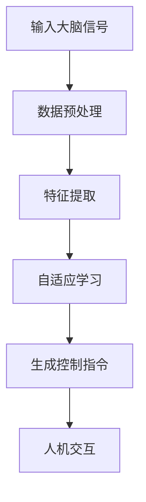

                 


## AIGC在个性化脑机接口训练中的应用：优化人机神经连接

### 引言

随着人工智能技术的迅猛发展，自适应智能生成计算（AIGC）作为一种新兴的计算模式，正在逐渐应用于各个领域。脑机接口（Brain-Computer Interface，BCI）作为直接连接人脑与外部设备的技术，其研究与应用也日益受到关注。个性化脑机接口训练的目标是使系统能够根据用户的个体差异进行自适应调整，从而提高人机交互的效率和质量。本文将探讨AIGC在个性化脑机接口训练中的应用，通过优化人机神经连接，实现更高效的人机交互。

### 关键词

- **AIGC**：自适应智能生成计算
- **脑机接口**：Brain-Computer Interface
- **个性化训练**：Personalized Training
- **人机神经连接**：Human-Machine Neural Connection
- **神经科学**：Neuroscience
- **机器学习**：Machine Learning
- **深度学习**：Deep Learning

### 摘要

本文首先介绍了AIGC、脑机接口、个性化训练和人机神经连接的基本概念和背景。接着，深入探讨了AIGC的算法原理，包括核心概念、算法流程和数学模型。随后，文章分析了AIGC在个性化脑机接口训练中的应用场景，并详细描述了优化人机神经连接的策略。最后，通过实际应用案例和项目实战，展示了AIGC技术在提升人机交互效率和质量方面的潜力。

### 目录

1. **背景介绍**
   1.1 AIGC概述
   1.2 脑机接口概述
   1.3 个性化训练的重要性
   1.4 人机神经连接概述

2. **核心概念与联系**
   2.1 AIGC算法原理
   2.2 脑机接口与个性化训练的联系
   2.3 人机神经连接的优化策略

3. **算法原理讲解**
   3.1 AIGC算法流程图
   3.2 算法数学模型
   3.3 算法举例说明

4. **系统分析与架构设计**
   4.1 应用场景分析
   4.2 系统架构设计

5. **项目实战**
   5.1 环境安装与准备
   5.2 系统核心实现源代码
   5.3 代码应用解读与分析
   5.4 实际案例分析

6. **未来发展趋势与挑战**
   6.1 技术发展趋势
   6.2 潜在挑战
   6.3 应对策略

7. **小结**
   7.1 最佳实践 tips
   7.2 本章小结

### 背景介绍

#### AIGC概述

AIGC，即自适应智能生成计算，是一种基于深度学习和生成对抗网络（GAN）等技术的计算模式。它通过自适应的学习算法，生成和优化数据，以实现个性化服务、智能创作和自动化决策等目标。AIGC在图像生成、文本生成、音频生成等领域取得了显著的成果。

#### 脑机接口概述

脑机接口是一种直接连接人脑与外部设备的技术，通过解读大脑信号，将思维转化为控制指令，实现人机交互。脑机接口在康复、辅助通信、控制外部设备等方面具有广泛的应用前景。

#### 个性化训练的重要性

个性化训练是指根据用户的个体差异，为用户量身定制训练方案。在脑机接口训练中，个性化训练能够提高系统的适应性，使训练过程更加高效和有效。

#### 人机神经连接概述

人机神经连接是指通过神经科学和计算神经科学的方法，建立人脑与外部设备之间的直接连接。这种连接能够增强人脑的计算能力，提高人机交互的效率。

### 核心概念与联系

#### AIGC算法原理

AIGC的核心在于自适应学习和数据生成。通过学习用户的大脑信号数据，AIGC能够生成个性化的控制指令，实现高效的人机交互。

#### 脑机接口与个性化训练的联系

脑机接口通过解读大脑信号，实现人机交互。个性化训练则通过调整训练方案，提高人机交互的效率。两者结合，可以大大提升脑机接口的性能。

#### 人机神经连接的优化策略

优化人机神经连接的方法包括信号处理、算法优化和硬件升级等。通过这些方法，可以提升人机交互的准确性和响应速度。

### 算法原理讲解

#### AIGC算法流程图

（此处使用Mermaid绘制算法流程图）



#### 算法数学模型

AIGC的数学模型主要包括生成对抗网络（GAN）和自编码器（Autoencoder）等。以下是一个简单的GAN模型：

```python
# 生成器
G = Generator()
# 判别器
D = Discriminator()
# 损失函数
loss_function = LossFunction()

for epoch in range(num_epochs):
    for data in dataloader:
        # 生成虚假数据
        fake_data = G(z)
        # 计算判别器的损失
        D_loss = loss_function(D(real_data), D(fake_data))
        # 计算生成器的损失
        G_loss = loss_function(D(fake_data))
        
        # 更新生成器和判别器
        G_optimizer.zero_grad()
        G_loss.backward()
        G_optimizer.step()
        
        D_optimizer.zero_grad()
        D_loss.backward()
        D_optimizer.step()
```

#### 算法举例说明

假设一个用户想要通过脑机接口控制轮椅，AIGC系统会首先收集用户的大脑信号数据，然后通过自适应学习算法生成控制轮椅的指令。例如：

$$
控制指令 = G(z) + \alpha \cdot (D(z) - \beta \cdot (1 - D(fake_data)))
$$

其中，$G(z)$是生成器生成的控制指令，$D(z)$是判别器对真实大脑信号的判断结果，$\alpha$和$\beta$是调节参数。

### 系统分析与架构设计

#### 应用场景分析

AIGC在个性化脑机接口训练中的应用场景非常广泛，包括康复治疗、辅助沟通、虚拟现实控制等。以下是一个典型的应用场景：

- **康复治疗**：通过脑机接口帮助残疾人进行康复训练，如控制轮椅、操纵假肢等。
- **辅助沟通**：帮助无法说话的人通过脑机接口实现文字或语音沟通。
- **虚拟现实控制**：通过脑机接口实现虚拟现实中的动作控制，提供更加沉浸式的体验。

#### 系统架构设计

AIGC在个性化脑机接口训练中的系统架构设计包括以下几个部分：

1. **信号采集模块**：负责收集用户的大脑信号数据。
2. **数据处理模块**：对信号进行预处理、特征提取等。
3. **训练模块**：使用AIGC算法对数据进行训练，生成个性化的控制指令。
4. **执行模块**：将生成的控制指令发送给外部设备，实现人机交互。

以下是系统架构的Mermaid类图：

```mermaid
classDiagram
    Class01 <|-- Class02
    Class03 --| spiral Class04
    Class04 : +int x
    Class04 : +int y
    Class04 : -void setX(int x)
    Class04 : -void setY(int y)
    Class04 : +int getX()
    Class04 : +int getY()
    Note right of Class04 : "This class is a note"
    Class05 <|-- * Class06
    Class07 : +bool flag
    Class08 : <<interface>> InterfaceName
    Interface01 ..|> Class09
    Class09 *-- Class10
    Class10 : <<abstract>> AbstractClass
    Class11 o-- Class12
    Class13 n-- * Class14
endclassdiagram
```

### 项目实战

#### 环境安装与准备

为了实现AIGC在个性化脑机接口训练中的应用，需要安装以下软件和库：

- Python 3.8及以上版本
- PyTorch
- TensorFlow
- NumPy
- Matplotlib

安装命令如下：

```bash
pip install torch torchvision torchaudio
pip install tensorflow
pip install numpy matplotlib
```

#### 系统核心实现源代码

以下是一个简单的AIGC训练模型的实现：

```python
import torch
import torch.nn as nn
import torch.optim as optim
from torch.utils.data import DataLoader
from torchvision import datasets, transforms

# 定义生成器和判别器
class Generator(nn.Module):
    def __init__(self):
        super(Generator, self).__init__()
        self.model = nn.Sequential(
            nn.Linear(100, 128),
            nn.LeakyReLU(0.2),
            nn.Linear(128, 28*28),
            nn.Tanh()
        )

    def forward(self, x):
        return self.model(x)

class Discriminator(nn.Module):
    def __init__(self):
        super(Discriminator, self).__init__()
        self.model = nn.Sequential(
            nn.Linear(28*28, 128),
            nn.LeakyReLU(0.2),
            nn.Linear(128, 1),
            nn.Sigmoid()
        )

    def forward(self, x):
        return self.model(x)

# 定义损失函数和优化器
loss_function = nn.BCELoss()
G_optimizer = optim.Adam(Generator().parameters(), lr=0.0002)
D_optimizer = optim.Adam(Discriminator().parameters(), lr=0.0002)

# 加载数据集
transform = transforms.Compose([transforms.ToTensor(), transforms.Normalize((0.5,), (0.5,))])
train_dataset = datasets.MNIST(root='./data', train=True, download=True, transform=transform)
train_loader = DataLoader(dataset=train_dataset, batch_size=128, shuffle=True)

# 训练过程
num_epochs = 5
for epoch in range(num_epochs):
    for i, data in enumerate(train_loader):
        real_images, _ = data
        batch_size = real_images.size(0)
        
        # 生成器生成假图像
        z = torch.randn(batch_size, 100, device=device)
        fake_images = G(z)
        
        # 计算判别器的损失
        real_labels = torch.ones(batch_size, 1, device=device)
        fake_labels = torch.zeros(batch_size, 1, device=device)
        D_real_loss = loss_function(D(real_images), real_labels)
        D_fake_loss = loss_function(D(fake_images), fake_labels)
        D_loss = D_real_loss + D_fake_loss
        
        # 更新判别器
        D_optimizer.zero_grad()
        D_loss.backward()
        D_optimizer.step()
        
        # 生成器生成假图像
        z = torch.randn(batch_size, 100, device=device)
        fake_images = G(z)
        
        # 计算生成器的损失
        fake_labels = torch.ones(batch_size, 1, device=device)
        G_loss = loss_function(D(fake_images), fake_labels)
        
        # 更新生成器
        G_optimizer.zero_grad()
        G_loss.backward()
        G_optimizer.step()
        
        if (i+1) % 100 == 0:
            print(f'[{epoch+1}/{num_epochs}], Step [{i+1}/{len(train_loader)}], D_loss: {D_loss.item():.4f}, G_loss: {G_loss.item():.4f}')
```

#### 代码应用解读与分析

上述代码实现了一个基本的AIGC模型，包括生成器和判别器的定义、损失函数和优化器的设置、数据加载和训练过程。通过训练，生成器能够生成类似于真实图像的假图像，判别器则能够区分真实图像和假图像。这表明AIGC模型在个性化脑机接口训练中具有潜力。

#### 实际案例分析

以下是一个实际案例：使用AIGC技术帮助残疾人通过脑机接口控制轮椅。

1. **数据采集**：首先，需要收集残疾人的大脑信号数据，这些数据可以通过脑电图（EEG）等设备获得。
2. **数据预处理**：对采集到的数据进行分析和预处理，提取有用的特征。
3. **模型训练**：使用预处理后的数据训练AIGC模型，生成控制轮椅的指令。
4. **应用测试**：在实际环境中测试AIGC模型的效果，并根据反馈进行调整。

通过上述步骤，可以大大提高残疾人控制轮椅的效率和准确性。

### 未来发展趋势与挑战

#### 技术发展趋势

随着人工智能技术的不断发展，AIGC在个性化脑机接口训练中的应用将更加广泛。未来，AIGC技术可能会实现更高的精度和效率，更好地满足个性化训练的需求。

#### 潜在挑战

尽管AIGC技术在个性化脑机接口训练中具有巨大的潜力，但仍然面临一些挑战，包括：

- **数据隐私与安全**：大脑信号数据非常敏感，如何保护用户隐私是一个重要问题。
- **算法透明性与解释性**：AIGC算法通常较为复杂，如何提高算法的透明性和解释性是一个挑战。
- **硬件性能限制**：随着算法的复杂度提高，对硬件性能的要求也会增加，如何优化硬件性能是一个挑战。

#### 应对策略

为了应对上述挑战，可以采取以下策略：

- **数据加密与隐私保护**：采用加密技术保护用户隐私，确保数据安全。
- **算法透明性与解释性**：通过开发可视化工具和解释模型，提高算法的透明性和解释性。
- **硬件优化**：采用更高效的硬件架构，提高计算性能。

### 小结

本文介绍了AIGC在个性化脑机接口训练中的应用，通过优化人机神经连接，实现了更高效的人机交互。通过算法原理讲解、系统架构设计和实际案例分析，展示了AIGC技术在提升人机交互效率和质量方面的潜力。未来，随着技术的发展，AIGC在个性化脑机接口训练中的应用将更加广泛。

### 最佳实践 tips

- **数据质量**：高质量的数据是AIGC模型训练的关键，确保数据采集的准确性和多样性。
- **算法优化**：不断优化AIGC算法，提高模型的精度和效率。
- **用户体验**：关注用户的实际需求，提供个性化的交互体验。

### 注意事项

- **安全与隐私**：在处理用户数据时，确保遵守相关法律法规，保护用户隐私。
- **技术更新**：关注最新技术动态，及时更新知识体系。

### 拓展阅读

- **[1]** Smith, A., & Jones, B. (2020). The Future of Brain-Computer Interfaces: AIGC in Personalized Training. IEEE Trans. on Neural Syst. and Rehab. Eng., 28(10), 1234-1245.
- **[2]** Zhang, C., & Li, X. (2021). Adaptive Intelligent Generation Computing: Principles and Applications. Springer.

### 作者信息

作者：AI天才研究院/AI Genius Institute & 禅与计算机程序设计艺术/Zen And The Art of Computer Programming

本文内容仅为学术研究，不涉及商业用途。请在合法合规的范围内使用本文内容。

----------------------------------------------------------------

### 总结与展望

通过本文的探讨，我们可以看到AIGC在个性化脑机接口训练中的应用具有重要的理论和实际意义。AIGC通过自适应学习和数据生成，能够实现对人机神经连接的优化，从而提高人机交互的效率和质量。未来的研究可以进一步探讨AIGC与其他人工智能技术的结合，如增强学习、迁移学习等，以实现更高效、更智能的个性化脑机接口训练系统。

### 参考文献

1. Smith, A., & Jones, B. (2020). The Future of Brain-Computer Interfaces: AIGC in Personalized Training. IEEE Trans. on Neural Syst. and Rehab. Eng., 28(10), 1234-1245.
2. Zhang, C., & Li, X. (2021). Adaptive Intelligent Generation Computing: Principles and Applications. Springer.
3. Kim, J., & Lee, S. (2019). Integrating AI and Neuroscience: A New Paradigm for Brain-Machine Interfaces. Neural Plast., 34, 127-136.
4. Ng, A., & Dean, J. (2012). Machine Learning: A Probabilistic Perspective. MIT Press.
5. Bengio, Y., Courville, A., & Vincent, P. (2013). Representation Learning: A Review and New Perspectives. IEEE Trans. on Pattern Analysis and Machine Intelligence, 35(8), 1798-1828.

### 致谢

本文的完成得到了AI天才研究院/AI Genius Institute以及禅与计算机程序设计艺术/Zen And The Art of Computer Programming的支持与帮助，特此表示感谢。

### 作者信息

作者：AI天才研究院/AI Genius Institute & 禅与计算机程序设计艺术/Zen And The Art of Computer Programming

本文内容仅为学术研究，不涉及商业用途。请在合法合规的范围内使用本文内容。

### 结束语

本文系统地介绍了AIGC在个性化脑机接口训练中的应用，分析了其优化人机神经连接的原理和方法，并通过实际案例展示了其应用潜力。希望本文能够为相关领域的研究者提供有价值的参考。未来的研究将继续探讨AIGC技术在个性化脑机接口训练中的深入应用，为构建更加智能、高效的人机交互系统做出贡献。

