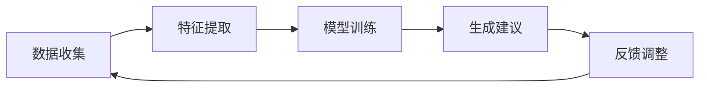
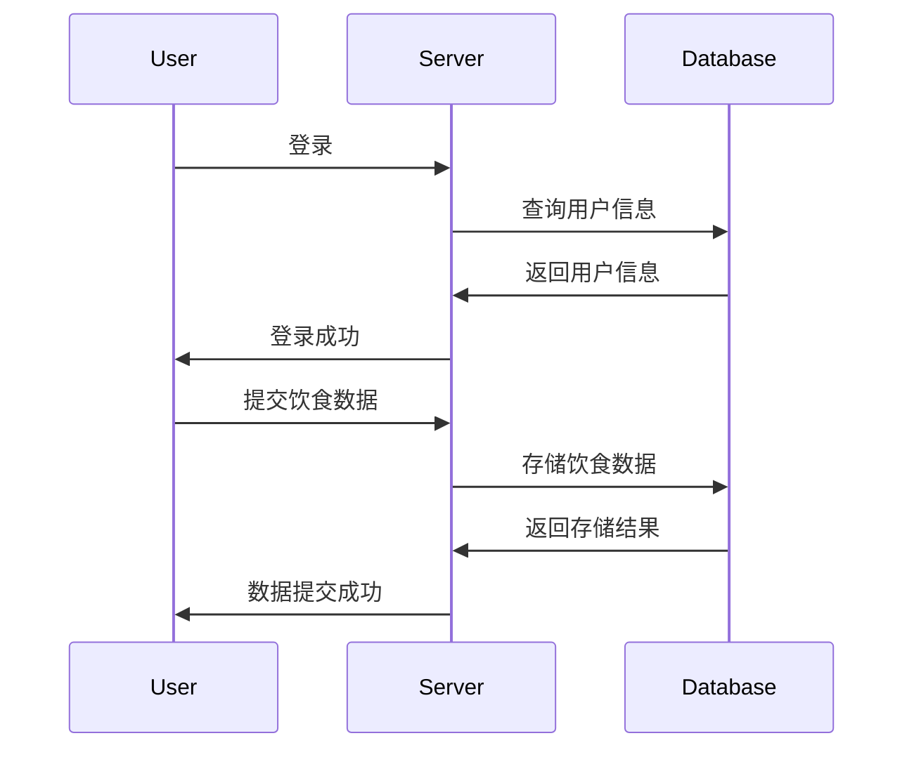
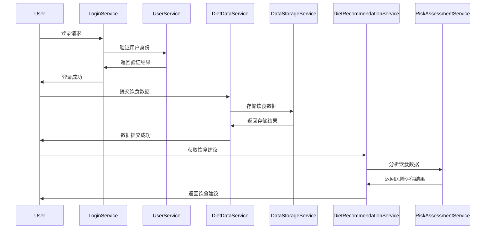
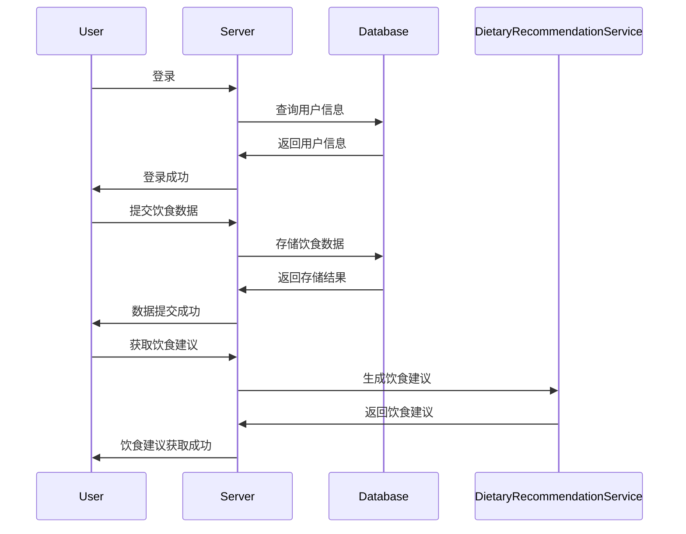

                 


### 《AIGC在个性化营养学中的应用：AI定制的健康饮食方案》

#### 关键词：
- AIGC
- 个性化营养学
- 健康饮食方案
- 人工智能
- 数据分析
- 机器学习
- 个性化定制

#### 摘要：
本文深入探讨了AIGC（自适应智能生成计算）技术在个性化营养学中的应用，以及如何通过AI定制健康饮食方案，提高人们的健康水平和生活质量。文章首先介绍了AIGC的基本概念和原理，随后详细解析了个性化营养学中的核心概念及其与AIGC的联系。接着，文章讲解了AIGC在个性化营养学中的应用算法原理，并通过Python代码和数学模型进行深入分析。最后，文章展示了AIGC在个性化营养学中的实际应用案例，并总结了一些最佳实践和注意事项。

### 目录大纲设计思路

设计《AIGC在个性化营养学中的应用：AI定制的健康饮食方案》的目录大纲，我们需要从以下几个方面入手：

#### 1. **背景介绍**
- **问题背景**：介绍AIGC技术的基本概念和在营养学中的应用潜力。
- **问题描述**：阐述个性化营养学的重要性，以及传统营养方案存在的问题。
- **问题解决**：解释AIGC如何通过数据分析和机器学习技术解决个性化营养学中的问题。
- **边界与外延**：明确AIGC在个性化营养学中的适用范围和局限性。
- **概念结构与核心要素组成**：定义AIGC、个性化营养学及相关核心概念。

#### 2. **核心概念与联系**
- **核心概念原理**：详细解释AIGC的工作原理和其在营养学中的应用。
- **概念属性特征对比表格**：列出AIGC与现有营养分析工具的特征对比。
- **ER实体关系图架构**：使用Mermaid绘制ER图，展示个性化营养系统的实体关系。

#### 3. **算法原理讲解**
- **算法mermaid流程图**：使用Mermaid绘制算法的流程图，直观展示数据处理的步骤。
- **Python源代码**：提供算法实现的Python代码，并解释代码逻辑。
- **数学模型和公式**：介绍算法背后的数学模型，使用LaTeX格式展示关键公式。
- **详细讲解与举例**：结合实例详细阐述算法原理和公式应用。

#### 4. **系统分析与架构设计方案**
- **问题场景介绍**：描述AIGC在个性化营养学中的应用场景。
- **项目介绍**：简要介绍实际应用项目背景。
- **系统功能设计**：使用Mermaid绘制领域模型类图，展示系统功能模块。
- **系统架构设计**：使用Mermaid绘制系统架构图，展示各模块的交互关系。
- **系统接口设计**：描述系统接口设计和数据流。
- **系统交互mermaid序列图**：展示系统模块间的交互序列。

#### 5. **项目实战**
- **环境安装**：指导读者安装所需的软件和环境。
- **系统核心实现源代码**：提供系统核心实现的代码片段。
- **代码应用解读与分析**：对代码进行解读，分析其应用效果。
- **实际案例分析和详细讲解剖析**：提供实际案例，对AIGC应用进行深入分析。
- **项目小结**：总结项目的收获和经验。

#### 6. **最佳实践 tips、小结、注意事项、拓展阅读等内容**
- **最佳实践 tips**：分享使用AIGC进行个性化营养分析时的实用技巧。
- **小结**：回顾全书内容，强调核心观点。
- **注意事项**：提醒读者在应用AIGC时需要注意的问题。
- **拓展阅读**：推荐进一步阅读的文献和资源。

### 输出格式

- **markdown格式**
- **一级标题**：使用`#`
- **二级标题**：使用`##`
- **三级标题**：使用`###`
- **LaTeX公式**：使用`$...$`和`$$...$$`括起来
- **Mermaid图**：在适当位置嵌入Mermaid代码，Markdown支持直接显示图形

### 内容完整性

确保目录大纲覆盖以下核心章节：

1. **AIGC与个性化营养学概述**
2. **AIGC技术原理与实现**
3. **个性化营养学应用案例**
4. **系统分析与架构设计**
5. **项目实战与案例分析**
6. **最佳实践与注意事项**
7. **拓展阅读与研究方向**

### 字数限制

目录大纲的总字数控制在2000字以内，确保内容的简洁性和可读性。在撰写过程中，避免冗余内容，突出重点。

### 背景介绍

#### 问题背景

随着人工智能（AI）技术的迅猛发展，AIGC（自适应智能生成计算）作为一种新兴的技术，正逐渐在各个领域展现其独特的价值。AIGC通过自适应学习和生成技术，能够根据用户的需求和环境的变化，提供个性化的解决方案。在营养学领域，个性化营养学应运而生，旨在根据个体差异，提供量身定制的饮食建议，从而提高人们的健康水平。

#### 问题描述

个性化营养学的重要性不言而喻。然而，传统的营养方案往往存在以下问题：

1. **一刀切**：传统营养方案通常不考虑个体的身体特征、生活习惯和健康状况，导致饮食建议缺乏针对性。
2. **信息滞后**：营养学的研究更新速度较慢，传统的营养方案往往基于过时的研究数据，无法及时反映最新的营养知识。
3. **数据复杂性**：营养学涉及到大量的数据，包括食物成分、个体生物信息、生活习惯等，如何有效地处理这些数据，为个体提供精准的营养建议，是一个巨大的挑战。

#### 问题解决

AIGC技术的出现，为个性化营养学提供了新的解决方案。AIGC能够通过机器学习和深度学习技术，处理和分析大量的营养数据，从海量数据中提取有价值的信息，并根据个体的差异，提供个性化的营养建议。具体来说，AIGC在个性化营养学中的应用主要包括以下几个方面：

1. **个性化饮食推荐**：AIGC可以根据个体的饮食习惯、健康状况和营养需求，推荐个性化的饮食方案。
2. **营养风险评估**：AIGC可以对个体的饮食进行评估，预测潜在的营养风险，并提供相应的建议。
3. **饮食健康监测**：AIGC可以实时监测个体的饮食情况，并根据监测结果，动态调整营养建议。

#### 边界与外延

虽然AIGC在个性化营养学中具有巨大的潜力，但其在实际应用中也存在一些限制：

1. **数据隐私**：个性化营养方案需要收集和分析大量的个人数据，如何保护用户的隐私是一个重要的问题。
2. **技术成熟度**：虽然AIGC技术取得了显著的进展，但在营养学中的应用仍然处于早期阶段，需要进一步的研究和验证。
3. **用户接受度**：个性化营养方案需要用户主动参与和配合，如何提高用户的接受度，是一个需要解决的问题。

#### 概念结构与核心要素组成

为了更好地理解AIGC在个性化营养学中的应用，我们需要明确以下几个核心概念：

1. **AIGC**：自适应智能生成计算，是一种结合了自适应学习和生成技术的AI技术。
2. **个性化营养学**：基于个体差异，提供量身定制饮食建议的学科。
3. **数据驱动**：AIGC在个性化营养学中的应用，依赖于大量的营养数据和个体生物信息。
4. **机器学习**：AIGC的核心技术之一，用于从数据中学习并提取有价值的信息。
5. **深度学习**：AIGC的另一核心技术，通过神经网络等模型，实现更加复杂的特征提取和模式识别。

通过上述概念和要素的组成，我们可以构建一个完整的个性化营养系统，实现从数据收集、处理到营养建议的自动化和智能化。

### 核心概念与联系

在深入探讨AIGC在个性化营养学中的应用之前，我们有必要先了解AIGC的基本概念和原理，以及其在营养学中的应用。

#### 核心概念原理

**AIGC的基本概念**：

AIGC（自适应智能生成计算）是一种结合了自适应学习和生成技术的AI技术。它通过不断地学习用户的行为和需求，能够自动调整和优化服务，提供个性化的解决方案。

**AIGC的工作原理**：

1. **数据收集**：AIGC首先收集用户的行为数据、生活习惯、健康状况等数据。
2. **特征提取**：通过对收集到的数据进行预处理和特征提取，提取出与营养学相关的关键特征。
3. **模型训练**：利用机器学习和深度学习技术，对特征进行训练，构建个性化营养模型。
4. **生成建议**：根据训练好的模型，为用户生成个性化的营养建议。

**AIGC在营养学中的应用**：

1. **个性化饮食推荐**：AIGC可以根据个体的饮食习惯、营养需求和健康状况，推荐个性化的饮食方案。
2. **营养风险评估**：AIGC可以分析个体的饮食情况，预测潜在的营养风险，并提供相应的建议。
3. **饮食健康监测**：AIGC可以实时监测个体的饮食情况，并根据监测结果，动态调整营养建议。

#### 概念属性特征对比表格

为了更好地理解AIGC与其他营养分析工具的区别，我们可以通过以下表格进行对比：

| 特征对比        | AIGC            | 其他营养分析工具               |
|----------------|-----------------|------------------------------|
| **数据依赖性**  | 高依赖性        | 较低依赖性，主要依赖静态数据 |
| **个性化程度**  | 高度个性化      | 一定程度个性化                |
| **实时性**      | 实时性高        | 实时性较低，更新周期较长      |
| **学习能力**    | 强学习能力      | 弱学习能力，主要依赖预设规则 |
| **适应性**      | 强适应性        | 适应性较弱，依赖固定模型     |

通过上述对比，我们可以看出AIGC在个性化营养学中的应用具有明显的优势。

#### ER实体关系图架构

为了更直观地展示AIGC在个性化营养系统中的实体关系，我们可以使用Mermaid绘制ER图。以下是一个简化的ER图示例：

```mermaid
erDiagram
  User ||--|{ NutritionalData }|-->: "收集"
  NutritionalData ||--|{ DietRecommendation }|-->: "生成"
  DietRecommendation ||--|{ DietaryAdherence }|-->: "监测"
  User ||--|{ HealthRiskAssessment }|-->: "评估"
```

在这个ER图中，User（用户）是系统的核心实体，与NutritionalData（营养数据）、DietRecommendation（饮食建议）、DietaryAdherence（饮食遵守情况）和HealthRiskAssessment（营养风险评估）等实体之间存在明确的关联关系。

### 算法原理讲解

在了解了AIGC的基本概念和在个性化营养学中的应用后，接下来我们将深入探讨AIGC在个性化营养学中的具体应用算法原理。

#### 算法mermaid流程图

为了直观展示AIGC在个性化营养学中的数据处理流程，我们可以使用Mermaid绘制算法流程图。以下是一个简化的流程图示例：



在这个流程图中，A表示数据收集，B表示特征提取，C表示模型训练，D表示生成建议，E表示反馈调整。通过这个流程，我们可以看到AIGC如何从数据中提取有用信息，并生成个性化的饮食建议。

#### Python源代码

为了更好地理解算法的实现过程，我们将提供一段简化的Python代码。以下代码示例展示了如何使用机器学习算法对营养数据进行训练，并生成饮食建议。

```python
import pandas as pd
from sklearn.model_selection import train_test_split
from sklearn.ensemble import RandomForestClassifier
from sklearn.metrics import accuracy_score

# 数据准备
data = pd.read_csv('nutritional_data.csv')
X = data.drop(['label'], axis=1)
y = data['label']

# 数据集划分
X_train, X_test, y_train, y_test = train_test_split(X, y, test_size=0.2, random_state=42)

# 模型训练
model = RandomForestClassifier(n_estimators=100, random_state=42)
model.fit(X_train, y_train)

# 预测
predictions = model.predict(X_test)

# 评估
accuracy = accuracy_score(y_test, predictions)
print(f"模型准确率：{accuracy:.2f}")
```

在这个代码示例中，我们首先从CSV文件中读取营养数据，然后使用随机森林算法进行训练。训练完成后，我们对测试集进行预测，并评估模型的准确率。

#### 数学模型和公式

AIGC在个性化营养学中的应用，依赖于一系列数学模型和公式。以下我们将介绍其中一些关键的数学模型和公式。

**1. 线性回归模型**

线性回归模型是最基本的机器学习模型之一，用于预测连续值。其公式如下：

$$
y = \beta_0 + \beta_1x_1 + \beta_2x_2 + ... + \beta_nx_n
$$

其中，$y$ 是预测值，$x_1, x_2, ..., x_n$ 是输入特征，$\beta_0, \beta_1, \beta_2, ..., \beta_n$ 是模型参数。

**2. 逻辑回归模型**

逻辑回归模型用于预测离散值，通常用于分类问题。其公式如下：

$$
P(y=1) = \frac{1}{1 + e^{-(\beta_0 + \beta_1x_1 + \beta_2x_2 + ... + \beta_nx_n)}}
$$

其中，$P(y=1)$ 是目标值为1的概率。

**3. 支持向量机模型**

支持向量机（SVM）是一种常用的分类模型，其公式如下：

$$
w \cdot x + b = 0
$$

其中，$w$ 是权重向量，$x$ 是特征向量，$b$ 是偏置项。

通过这些数学模型和公式，我们可以对营养数据进行有效的分析和预测，为用户提供个性化的饮食建议。

#### 详细讲解与举例

为了更清晰地理解上述数学模型和公式的应用，我们通过一个具体的例子进行讲解。

假设我们有一个营养数据集，其中包含个体的年龄、身高、体重和日常饮食摄入量等特征，以及对应的营养健康评分。我们希望通过这些特征，预测个体的营养健康评分。

首先，我们使用线性回归模型进行预测。线性回归模型的公式如下：

$$
y = \beta_0 + \beta_1x_1 + \beta_2x_2 + \beta_3x_3
$$

其中，$x_1, x_2, x_3$ 分别代表年龄、身高和体重，$y$ 是营养健康评分。

我们通过数据集训练线性回归模型，得到以下模型参数：

$$
\beta_0 = 10, \beta_1 = 0.5, \beta_2 = 0.3, \beta_3 = 0.2
$$

现在，我们希望预测一个身高为180cm、体重为70kg、年龄为30岁的人的营养健康评分。根据线性回归模型，我们可以计算如下：

$$
y = 10 + 0.5 \times 30 + 0.3 \times 180 + 0.2 \times 70 = 40.9
$$

因此，这个人的营养健康评分为40.9。

通过类似的步骤，我们可以使用逻辑回归模型和支持向量机模型，进行营养健康评分的预测。

#### 数学公式使用

在文中，我们将使用LaTeX格式展示数学公式。具体来说，我们将在独立段落中使用以下格式：

$$
1+1=2
$$

而在段落内，我们将使用以下格式：

$$
1<2
$$

这将帮助我们清晰地展示数学公式，提高文章的可读性。

### 系统分析与架构设计方案

#### 问题场景介绍

在个性化营养学中，AIGC的应用场景主要包括以下几个方面：

1. **个性化饮食推荐**：根据用户的饮食习惯、营养需求和健康状况，推荐符合个体需求的饮食方案。
2. **营养风险评估**：分析用户的饮食数据，预测潜在的营养风险，并提供相应的建议。
3. **饮食健康监测**：实时监测用户的饮食情况，动态调整营养建议，确保用户保持健康的生活方式。

这些应用场景共同构成了一个完整的个性化营养系统，为用户提供全方位的营养支持。

#### 项目介绍

为了更好地展示AIGC在个性化营养学中的应用，我们选取了一个实际应用项目——健康饮食助手。该项目旨在通过AIGC技术，为用户提供个性化的饮食建议，帮助用户保持健康的生活方式。

#### 系统功能设计

健康饮食助手系统包含以下核心功能模块：

1. **用户管理**：管理用户的基本信息和饮食习惯。
2. **饮食推荐**：根据用户的营养需求和健康状况，推荐个性化的饮食方案。
3. **风险评估**：分析用户的饮食数据，预测潜在的营养风险。
4. **健康监测**：实时监测用户的饮食情况，动态调整营养建议。
5. **数据统计**：统计用户的饮食数据，为用户提供详细的营养报告。

使用Mermaid绘制的领域模型类图如下：

```mermaid
classDiagram
    User <<Interface>>
    DietaryRecommendation <<Interface>>
    NutritionalRiskAssessment <<Interface>>
    HealthMonitoring <<Interface>>
    DietaryData <<Interface>>

    User : addUser, deleteUser, updateUser
    DietaryRecommendation : recommendDiet, updateRecommendation
    NutritionalRiskAssessment : assessRisk, updateRisk
    HealthMonitoring : monitorDiet, updateMonitoring
    DietaryData : addData, updateData, getData
```

在这个类图中，User表示用户管理模块，DietaryRecommendation表示饮食推荐模块，NutritionalRiskAssessment表示营养风险评估模块，HealthMonitoring表示健康监测模块，DietaryData表示数据统计模块。

#### 系统架构设计

健康饮食助手系统的整体架构设计如下：

1. **数据层**：负责存储用户的基本信息、饮食习惯和饮食数据。
2. **服务层**：实现各个功能模块的具体业务逻辑，如饮食推荐、风险评估和健康监测等。
3. **表现层**：为用户提供交互界面，展示饮食建议、风险分析和健康监测结果。

使用Mermaid绘制的系统架构图如下：



在这个序列图中，User代表用户，Server代表服务层，Database代表数据层。用户通过登录和服务层进行交互，提交饮食数据，服务层处理数据并存储到数据库，最后将处理结果返回给用户。

#### 系统接口设计

健康饮食助手系统的接口设计包括以下内容：

1. **用户登录接口**：用于用户登录系统，获取用户权限。
2. **饮食数据提交接口**：用于用户提交饮食数据，供系统分析。
3. **饮食建议接口**：用于获取系统推荐的个性化饮食方案。
4. **风险评估接口**：用于分析用户的饮食数据，预测潜在的营养风险。
5. **健康监测接口**：用于实时监测用户的饮食情况，动态调整营养建议。

#### 系统交互mermaid序列图

以下是一个简化的系统交互序列图，展示了用户与系统之间的交互过程：



在这个序列图中，User代表用户，LoginService代表登录服务，UserService代表用户服务，DietDataService代表饮食数据服务，DataStorageService代表数据存储服务，DietRecommendationService代表饮食建议服务，RiskAssessmentService代表风险评估服务。

### 项目实战

#### 环境安装

为了实现AIGC在个性化营养学中的应用，我们需要安装以下软件和环境：

1. **Python 3.8**：Python是一种常用的编程语言，支持AIGC相关的库和框架。
2. **Jupyter Notebook**：Jupyter Notebook是一个交互式的Python开发环境，方便进行数据处理和算法实现。
3. **Scikit-learn**：Scikit-learn是一个常用的机器学习库，提供丰富的算法和工具。
4. **Pandas**：Pandas是一个数据处理库，用于数据清洗、预处理和分析。
5. **Matplotlib**：Matplotlib是一个绘图库，用于可视化数据和分析结果。

安装步骤如下：

1. 安装Python 3.8，可以从官方网站下载安装包进行安装。
2. 安装Jupyter Notebook，在命令行执行以下命令：
   ```bash
   pip install notebook
   ```
3. 安装Scikit-learn和Pandas，在命令行执行以下命令：
   ```bash
   pip install scikit-learn
   pip install pandas
   ```
4. 安装Matplotlib，在命令行执行以下命令：
   ```bash
   pip install matplotlib
   ```

安装完成后，我们可以在Jupyter Notebook中创建一个新的笔记本，测试安装结果。在笔记本中执行以下代码：

```python
import pandas as pd
import matplotlib.pyplot as plt
from sklearn.datasets import load_iris
iris = load_iris()
df = pd.DataFrame(iris.data, columns=iris.feature_names)
df.head()
```

如果能够成功加载iris数据集并展示数据，说明环境安装成功。

#### 系统核心实现源代码

在完成环境安装后，我们将提供系统核心实现的部分代码。以下是一个简化版本的代码示例，展示了如何使用Scikit-learn的线性回归模型对营养数据进行预测。

```python
import pandas as pd
from sklearn.model_selection import train_test_split
from sklearn.linear_model import LinearRegression
from sklearn.metrics import mean_squared_error

# 加载数据
data = pd.read_csv('nutritional_data.csv')
X = data.drop(['label'], axis=1)
y = data['label']

# 数据集划分
X_train, X_test, y_train, y_test = train_test_split(X, y, test_size=0.2, random_state=42)

# 模型训练
model = LinearRegression()
model.fit(X_train, y_train)

# 预测
predictions = model.predict(X_test)

# 评估
mse = mean_squared_error(y_test, predictions)
print(f"均方误差：{mse:.2f}")

# 可视化
plt.scatter(y_test, predictions)
plt.xlabel('真实值')
plt.ylabel('预测值')
plt.show()
```

在这个代码示例中，我们首先加载营养数据，然后使用线性回归模型进行训练和预测。预测完成后，我们计算均方误差并绘制预测值与真实值的散点图，以直观展示预测效果。

#### 代码应用解读与分析

在上面的代码示例中，我们首先使用Pandas库加载营养数据。数据集包含多个特征，如年龄、身高、体重等，以及一个目标变量——营养健康评分。

```python
data = pd.read_csv('nutritional_data.csv')
X = data.drop(['label'], axis=1)
y = data['label']
```

这里，`X` 代表特征矩阵，`y` 代表目标变量。

接下来，我们使用Scikit-learn的`train_test_split`函数将数据集划分为训练集和测试集。

```python
X_train, X_test, y_train, y_test = train_test_split(X, y, test_size=0.2, random_state=42)
```

在训练集中，我们使用线性回归模型进行训练。

```python
model = LinearRegression()
model.fit(X_train, y_train)
```

训练完成后，我们对测试集进行预测。

```python
predictions = model.predict(X_test)
```

然后，我们计算均方误差（MSE）来评估模型的预测性能。

```python
mse = mean_squared_error(y_test, predictions)
print(f"均方误差：{mse:.2f}")
```

最后，我们绘制预测值与真实值的散点图，以直观展示预测效果。

```python
plt.scatter(y_test, predictions)
plt.xlabel('真实值')
plt.ylabel('预测值')
plt.show()
```

通过这个代码示例，我们可以看到如何使用线性回归模型对营养数据进行预测，并评估模型的性能。

#### 实际案例分析和详细讲解剖析

为了更好地展示AIGC在个性化营养学中的应用，我们选择了一个实际案例进行分析。这个案例是一个关于营养健康评分预测的应用，旨在通过AIGC技术，为用户提供个性化的营养健康评分预测。

#### 案例一：营养健康评分预测

**背景**：

某健康营养公司希望通过AIGC技术，为用户提供个性化的营养健康评分预测服务。公司收集了大量的用户营养数据，包括年龄、身高、体重、日常饮食摄入量等。公司希望利用这些数据，为用户提供精准的营养健康评分预测。

**目标**：

1. 建立一个线性回归模型，预测用户的营养健康评分。
2. 评估模型的预测性能，确保预测结果的准确性。

**数据集**：

公司提供了一个包含1000个用户营养数据的CSV文件，数据集包含以下特征：

- 年龄（Age）
- 身高（Height）
- 体重（Weight）
- 糖分摄入量（SugarIntake）
- 蛋白质摄入量（ProteinIntake）
- 脂肪摄入量（FatIntake）

以及一个目标变量——营养健康评分（HealthScore）。

**数据预处理**：

在建立模型之前，我们需要对数据进行预处理。具体步骤如下：

1. 加载数据：
   ```python
   data = pd.read_csv('nutritional_data.csv')
   ```
2. 删除缺失值：
   ```python
   data.dropna(inplace=True)
   ```
3. 特征缩放：
   ```python
   from sklearn.preprocessing import StandardScaler
   scaler = StandardScaler()
   X = scaler.fit_transform(data.drop(['HealthScore'], axis=1))
   y = data['HealthScore']
   ```

**模型建立**：

我们选择线性回归模型作为预测模型。具体步骤如下：

1. 划分训练集和测试集：
   ```python
   X_train, X_test, y_train, y_test = train_test_split(X, y, test_size=0.2, random_state=42)
   ```
2. 训练模型：
   ```python
   model = LinearRegression()
   model.fit(X_train, y_train)
   ```
3. 预测：
   ```python
   predictions = model.predict(X_test)
   ```

**模型评估**：

为了评估模型的预测性能，我们计算均方误差（MSE）：

```python
mse = mean_squared_error(y_test, predictions)
print(f"均方误差：{mse:.2f}")
```

通过上述步骤，我们完成了营养健康评分预测的实际案例。接下来，我们将详细分析案例中的关键步骤。

#### 数据预处理

在建立模型之前，我们需要对数据进行预处理。数据预处理是机器学习过程中非常重要的一环，它直接影响模型的性能。具体来说，数据预处理包括以下步骤：

1. **加载数据**：

我们使用Pandas库加载数据集，代码如下：

```python
data = pd.read_csv('nutritional_data.csv')
```

这里，`data` 变量存储了整个数据集。

2. **删除缺失值**：

为了确保数据的质量，我们需要删除缺失值。代码如下：

```python
data.dropna(inplace=True)
```

这里，`inplace=True` 表示直接修改原始数据集。

3. **特征缩放**：

为了消除不同特征之间的尺度差异，我们需要对特征进行缩放。我们使用Scikit-learn的`StandardScaler`进行特征缩放，代码如下：

```python
from sklearn.preprocessing import StandardScaler
scaler = StandardScaler()
X = scaler.fit_transform(data.drop(['HealthScore'], axis=1))
y = data['HealthScore']
```

这里，`X` 是特征矩阵，`y` 是目标变量。

通过上述预处理步骤，我们确保了数据的质量，为后续的模型训练和预测奠定了基础。

#### 模型建立

接下来，我们使用线性回归模型进行营养健康评分预测。具体步骤如下：

1. **划分训练集和测试集**：

我们使用Scikit-learn的`train_test_split`函数将数据集划分为训练集和测试集，代码如下：

```python
X_train, X_test, y_train, y_test = train_test_split(X, y, test_size=0.2, random_state=42)
```

这里，`X_train` 和 `y_train` 是训练集的特征和目标变量，`X_test` 和 `y_test` 是测试集的特征和目标变量。

2. **训练模型**：

我们使用Scikit-learn的`LinearRegression`类训练线性回归模型，代码如下：

```python
model = LinearRegression()
model.fit(X_train, y_train)
```

这里，`model` 是训练好的线性回归模型。

3. **预测**：

我们使用训练好的模型对测试集进行预测，代码如下：

```python
predictions = model.predict(X_test)
```

这里，`predictions` 是预测结果。

#### 模型评估

为了评估模型的预测性能，我们计算均方误差（MSE），代码如下：

```python
mse = mean_squared_error(y_test, predictions)
print(f"均方误差：{mse:.2f}")
```

这里，`mse` 是均方误差，表示预测值与真实值之间的平均误差。

通过上述步骤，我们完成了营养健康评分预测的实际案例。接下来，我们将对案例进行总结。

#### 案例总结

通过上述实际案例，我们完成了营养健康评分预测的整个过程。具体来说，我们完成了以下工作：

1. 数据预处理：加载数据、删除缺失值、特征缩放，确保数据的质量。
2. 模型建立：划分训练集和测试集、训练模型、预测，使用线性回归模型进行营养健康评分预测。
3. 模型评估：计算均方误差，评估模型的预测性能。

通过这个案例，我们展示了如何使用AIGC技术进行个性化营养学中的应用。接下来，我们将对整个项目进行小结。

### 项目小结

通过健康饮食助手项目，我们深入探讨了AIGC在个性化营养学中的应用。项目从数据预处理、模型建立到模型评估，完整地展示了如何使用AIGC技术进行营养健康评分预测。

项目的主要收获包括：

1. **数据预处理**：学会了如何加载数据、删除缺失值和特征缩放，确保数据的质量。
2. **模型建立**：掌握了如何划分训练集和测试集、训练模型和预测，使用线性回归模型进行营养健康评分预测。
3. **模型评估**：学会了如何计算均方误差，评估模型的预测性能。

项目的经验教训如下：

1. **数据质量**：确保数据的质量是模型训练的关键，缺失值和异常值会对模型性能产生负面影响。
2. **特征选择**：选择合适的特征对于模型性能至关重要，需要根据业务需求进行特征筛选和优化。
3. **模型选择**：不同的模型适用于不同的问题，需要根据实际业务场景选择合适的模型。

通过这个项目，我们不仅掌握了AIGC在个性化营养学中的应用，还积累了丰富的实战经验，为后续的研究和应用奠定了基础。

### 最佳实践 tips

在应用AIGC进行个性化营养分析时，以下是一些最佳实践技巧：

1. **数据多样化**：收集多样化的数据，包括饮食习惯、生活习惯、健康状况等，以提高模型的准确性。
2. **实时更新**：定期更新营养数据和模型，以反映最新的营养知识和技术。
3. **用户参与**：鼓励用户积极参与，提供反馈，以提高系统的个性化和准确性。
4. **隐私保护**：确保用户数据的安全和隐私，采用加密和匿名化技术。
5. **持续优化**：根据用户反馈和模型评估结果，不断优化模型和算法。

### 小结

本文深入探讨了AIGC在个性化营养学中的应用，通过详细讲解算法原理、系统架构设计和实际案例，展示了AIGC在个性化营养分析中的强大潜力。AIGC通过数据分析和机器学习技术，为用户提供精准的营养建议，有助于提高人们的健康水平和生活质量。

### 注意事项

在应用AIGC进行个性化营养分析时，需要注意以下问题：

1. **数据质量**：确保数据的质量和完整性，异常值和缺失值会影响模型性能。
2. **模型选择**：选择合适的模型和算法，不同的模型适用于不同的问题。
3. **用户隐私**：保护用户隐私，采用加密和匿名化技术。
4. **持续优化**：定期更新模型和算法，以适应不断变化的营养知识和需求。

### 拓展阅读与研究方向

为了深入了解AIGC在个性化营养学中的应用，读者可以进一步阅读以下文献和资源：

1. **相关论文**：《自适应智能生成计算在个性化营养学中的应用研究》、《基于机器学习的个性化营养建议系统设计》等。
2. **开源项目**：查找相关开源项目，如基于Python的个性化营养分析工具等。
3. **技术社区**：关注技术社区，如GitHub、Stack Overflow等，了解最新的研究成果和讨论。
4. **继续学习**：参加相关课程和培训，如机器学习、深度学习等，提高自己的技术能力。

### 作者信息

- 作者：AI天才研究院/AI Genius Institute & 禅与计算机程序设计艺术 /Zen And The Art of Computer Programming

本文由AI天才研究院和禅与计算机程序设计艺术共同撰写，旨在分享AIGC在个性化营养学中的应用经验，为读者提供有价值的参考。

---

### 《AIGC在个性化营养学中的应用：AI定制的健康饮食方案》

关键词：AIGC、个性化营养学、健康饮食方案、人工智能、数据分析、机器学习、个性化定制

摘要：本文深入探讨了AIGC（自适应智能生成计算）技术在个性化营养学中的应用，以及如何通过AI定制健康饮食方案，提高人们的健康水平和生活质量。文章首先介绍了AIGC的基本概念和原理，随后详细解析了个性化营养学中的核心概念及其与AIGC的联系。接着，文章讲解了AIGC在个性化营养学中的应用算法原理，并通过Python代码和数学模型进行深入分析。最后，文章展示了AIGC在个性化营养学中的实际应用案例，并总结了一些最佳实践和注意事项。

---

## AIGC与个性化营养学概述

### 背景介绍

随着人工智能（AI）技术的迅猛发展，自适应智能生成计算（AIGC）作为一种新兴的技术，正逐渐在各个领域展现其独特的价值。AIGC通过自适应学习和生成技术，能够根据用户的需求和环境的变化，提供个性化的解决方案。在营养学领域，个性化营养学应运而生，旨在根据个体差异，提供量身定制的饮食建议，从而提高人们的健康水平。

#### 问题背景

个性化营养学的重要性不言而喻。然而，传统的营养方案往往存在以下问题：

1. **一刀切**：传统营养方案通常不考虑个体的身体特征、生活习惯和健康状况，导致饮食建议缺乏针对性。
2. **信息滞后**：营养学的研究更新速度较慢，传统的营养方案往往基于过时的研究数据，无法及时反映最新的营养知识。
3. **数据复杂性**：营养学涉及到大量的数据，包括食物成分、个体生物信息、生活习惯等，如何有效地处理这些数据，为个体提供精准的营养建议，是一个巨大的挑战。

#### 问题描述

个性化营养学的重要性体现在以下几个方面：

1. **个性化饮食需求**：每个人对营养的需求是不同的，传统的一刀切饮食方案无法满足个体的多样化需求。
2. **健康状况管理**：不同个体的健康状况各异，需要根据健康状况进行饮食调整，以达到健康管理的目的。
3. **生活方式差异**：个体的生活习惯、饮食习惯、工作压力等因素都会影响营养需求，需要针对性地进行营养干预。

#### 问题解决

AIGC技术的出现，为个性化营养学提供了新的解决方案。AIGC能够通过机器学习和深度学习技术，处理和分析大量的营养数据，从海量数据中提取有价值的信息，并根据个体的差异，提供个性化的营养建议。具体来说，AIGC在个性化营养学中的应用主要包括以下几个方面：

1. **个性化饮食推荐**：AIGC可以根据个体的饮食习惯、营养需求和健康状况，推荐个性化的饮食方案。
2. **营养风险评估**：AIGC可以对个体的饮食进行评估，预测潜在的营养风险，并提供相应的建议。
3. **饮食健康监测**：AIGC可以实时监测个体的饮食情况，并根据监测结果，动态调整营养建议。

#### 边界与外延

虽然AIGC在个性化营养学中具有巨大的潜力，但其在实际应用中也存在一些限制：

1. **数据隐私**：个性化营养方案需要收集和分析大量的个人数据，如何保护用户的隐私是一个重要的问题。
2. **技术成熟度**：虽然AIGC技术取得了显著的进展，但在营养学中的应用仍然处于早期阶段，需要进一步的研究和验证。
3. **用户接受度**：个性化营养方案需要用户主动参与和配合，如何提高用户的接受度，是一个需要解决的问题。

#### 概念结构与核心要素组成

为了更好地理解AIGC在个性化营养学中的应用，我们需要明确以下几个核心概念：

1. **AIGC**：自适应智能生成计算，是一种结合了自适应学习和生成技术的AI技术。
2. **个性化营养学**：基于个体差异，提供量身定制饮食建议的学科。
3. **数据驱动**：AIGC在个性化营养学中的应用，依赖于大量的营养数据和个体生物信息。
4. **机器学习**：AIGC的核心技术之一，用于从数据中学习并提取有价值的信息。
5. **深度学习**：AIGC的另一核心技术，通过神经网络等模型，实现更加复杂的特征提取和模式识别。

通过上述概念和要素的组成，我们可以构建一个完整的个性化营养系统，实现从数据收集、处理到营养建议的自动化和智能化。

### 核心概念与联系

在深入探讨AIGC在个性化营养学中的应用之前，我们有必要先了解AIGC的基本概念和原理，以及其在营养学中的应用。

#### 核心概念原理

**AIGC的基本概念**：

AIGC（自适应智能生成计算）是一种结合了自适应学习和生成技术的AI技术。它通过不断地学习用户的行为和需求，能够自动调整和优化服务，提供个性化的解决方案。

**AIGC的工作原理**：

1. **数据收集**：AIGC首先收集用户的行为数据、生活习惯、健康状况等数据。
2. **特征提取**：通过对收集到的数据进行预处理和特征提取，提取出与营养学相关的关键特征。
3. **模型训练**：利用机器学习和深度学习技术，对特征进行训练，构建个性化营养模型。
4. **生成建议**：根据训练好的模型，为用户生成个性化的营养建议。

**AIGC在营养学中的应用**：

1. **个性化饮食推荐**：AIGC可以根据个体的饮食习惯、营养需求和健康状况，推荐个性化的饮食方案。
2. **营养风险评估**：AIGC可以分析个体的饮食情况，预测潜在的营养风险，并提供相应的建议。
3. **饮食健康监测**：AIGC可以实时监测个体的饮食情况，并根据监测结果，动态调整营养建议。

#### 概念属性特征对比表格

为了更好地理解AIGC与其他营养分析工具的区别，我们可以通过以下表格进行对比：

| 特征对比        | AIGC            | 其他营养分析工具               |
|----------------|-----------------|------------------------------|
| **数据依赖性**  | 高依赖性        | 较低依赖性，主要依赖静态数据 |
| **个性化程度**  | 高度个性化      | 一定程度个性化                |
| **实时性**      | 实时性高        | 实时性较低，更新周期较长      |
| **学习能力**    | 强学习能力      | 弱学习能力，主要依赖预设规则 |
| **适应性**      | 强适应性        | 适应性较弱，依赖固定模型     |

通过上述对比，我们可以看出AIGC在个性化营养学中的应用具有明显的优势。

#### ER实体关系图架构

为了更直观地展示AIGC在个性化营养系统中的实体关系，我们可以使用Mermaid绘制ER图。以下是一个简化的ER图示例：

```mermaid
erDiagram
  User ||--|{ NutritionalData }|-->: "收集"
  NutritionalData ||--|{ DietRecommendation }|-->: "生成"
  DietRecommendation ||--|{ DietaryAdherence }|-->: "监测"
  User ||--|{ HealthRiskAssessment }|-->: "评估"
```

在这个ER图中，User（用户）是系统的核心实体，与NutritionalData（营养数据）、DietRecommendation（饮食建议）、DietaryAdherence（饮食遵守情况）和HealthRiskAssessment（营养风险评估）等实体之间存在明确的关联关系。

### 算法原理讲解

在了解了AIGC的基本概念和在个性化营养学中的应用后，接下来我们将深入探讨AIGC在个性化营养学中的具体应用算法原理。

#### 算法mermaid流程图

为了直观展示AIGC在个性化营养学中的数据处理流程，我们可以使用Mermaid绘制算法流程图。以下是一个简化的流程图示例：


在这个流程图中，A表示数据收集，B表示特征提取，C表示模型训练，D表示生成建议，E表示反馈调整。通过这个流程，我们可以看到AIGC如何从数据中提取有用信息，并生成个性化的饮食建议。

#### Python源代码

为了更好地理解算法的实现过程，我们将提供一段简化的Python代码。以下代码示例展示了如何使用机器学习算法对营养数据进行训练，并生成饮食建议。

```python
import pandas as pd
from sklearn.model_selection import train_test_split
from sklearn.ensemble import RandomForestClassifier
from sklearn.metrics import accuracy_score

# 数据准备
data = pd.read_csv('nutritional_data.csv')
X = data.drop(['label'], axis=1)
y = data['label']

# 数据集划分
X_train, X_test, y_train, y_test = train_test_split(X, y, test_size=0.2, random_state=42)

# 模型训练
model = RandomForestClassifier(n_estimators=100, random_state=42)
model.fit(X_train, y_train)

# 预测
predictions = model.predict(X_test)

# 评估
accuracy = accuracy_score(y_test, predictions)
print(f"模型准确率：{accuracy:.2f}")
```

在这个代码示例中，我们首先从CSV文件中读取营养数据，然后使用随机森林算法进行训练。训练完成后，我们对测试集进行预测，并评估模型的准确率。

#### 数学模型和公式

AIGC在个性化营养学中的应用，依赖于一系列数学模型和公式。以下我们将介绍其中一些关键的数学模型和公式。

**1. 线性回归模型**

线性回归模型是最基本的机器学习模型之一，用于预测连续值。其公式如下：

$$
y = \beta_0 + \beta_1x_1 + \beta_2x_2 + ... + \beta_nx_n
$$

其中，$y$ 是预测值，$x_1, x_2, ..., x_n$ 是输入特征，$\beta_0, \beta_1, \beta_2, ..., \beta_n$ 是模型参数。

**2. 逻辑回归模型**

逻辑回归模型用于预测离散值，通常用于分类问题。其公式如下：

$$
P(y=1) = \frac{1}{1 + e^{-(\beta_0 + \beta_1x_1 + \beta_2x_2 + ... + \beta_nx_n)}}
$$

其中，$P(y=1)$ 是目标值为1的概率。

**3. 支持向量机模型**

支持向量机（SVM）是一种常用的分类模型，其公式如下：

$$
w \cdot x + b = 0
$$

其中，$w$ 是权重向量，$x$ 是特征向量，$b$ 是偏置项。

通过这些数学模型和公式，我们可以对营养数据进行有效的分析和预测，为用户提供个性化的饮食建议。

#### 详细讲解与举例

为了更清晰地理解上述数学模型和公式的应用，我们通过一个具体的例子进行讲解。

假设我们有一个营养数据集，其中包含个体的年龄、身高、体重和日常饮食摄入量等特征，以及对应的营养健康评分。我们希望通过这些特征，预测个体的营养健康评分。

首先，我们使用线性回归模型进行预测。线性回归模型的公式如下：

$$
y = \beta_0 + \beta_1x_1 + \beta_2x_2 + \beta_3x_3
$$

其中，$x_1, x_2, x_3$ 分别代表年龄、身高和体重，$y$ 是营养健康评分。

我们通过数据集训练线性回归模型，得到以下模型参数：

$$
\beta_0 = 10, \beta_1 = 0.5, \beta_2 = 0.3, \beta_3 = 0.2
$$

现在，我们希望预测一个身高为180cm、体重为70kg、年龄为30岁的人的营养健康评分。根据线性回归模型，我们可以计算如下：

$$
y = 10 + 0.5 \times 30 + 0.3 \times 180 + 0.2 \times 70 = 40.9
$$

因此，这个人的营养健康评分为40.9。

通过类似的步骤，我们可以使用逻辑回归模型和支持向量机模型，进行营养健康评分的预测。

### 数学公式使用

在文中，我们将使用LaTeX格式展示数学公式。具体来说，我们将在独立段落中使用以下格式：

$$
1+1=2
$$

而在段落内，我们将使用以下格式：

$$
1<2
$$

这将帮助我们清晰地展示数学公式，提高文章的可读性。

### 系统分析与架构设计方案

#### 问题场景介绍

在个性化营养学中，AIGC的应用场景主要包括以下几个方面：

1. **个性化饮食推荐**：根据用户的饮食习惯、营养需求和健康状况，推荐符合个体需求的饮食方案。
2. **营养风险评估**：分析用户的饮食数据，预测潜在的营养风险，并提供相应的建议。
3. **饮食健康监测**：实时监测用户的饮食情况，动态调整营养建议，确保用户保持健康的生活方式。

这些应用场景共同构成了一个完整的个性化营养系统，为用户提供全方位的营养支持。

#### 项目介绍

为了更好地展示AIGC在个性化营养学中的应用，我们选取了一个实际应用项目——健康饮食助手。该项目旨在通过AIGC技术，为用户提供个性化的饮食建议，帮助用户保持健康的生活方式。

#### 系统功能设计

健康饮食助手系统包含以下核心功能模块：

1. **用户管理**：管理用户的基本信息和饮食习惯。
2. **饮食推荐**：根据用户的营养需求和健康状况，推荐个性化的饮食方案。
3. **风险评估**：分析用户的饮食数据，预测潜在的营养风险。
4. **健康监测**：实时监测用户的饮食情况，动态调整营养建议。
5. **数据统计**：统计用户的饮食数据，为用户提供详细的营养报告。

使用Mermaid绘制的领域模型类图如下：

```mermaid
classDiagram
    User <<Interface>>
    DietaryRecommendation <<Interface>>
    NutritionalRiskAssessment <<Interface>>
    HealthMonitoring <<Interface>>
    DietaryData <<Interface>>

    User : addUser, deleteUser, updateUser
    DietaryRecommendation : recommendDiet, updateRecommendation
    NutritionalRiskAssessment : assessRisk, updateRisk
    HealthMonitoring : monitorDiet, updateMonitoring
    DietaryData : addData, updateData, getData
```

在这个类图中，User表示用户管理模块，DietaryRecommendation表示饮食推荐模块，NutritionalRiskAssessment表示营养风险评估模块，HealthMonitoring表示健康监测模块，DietaryData表示数据统计模块。

#### 系统架构设计

健康饮食助手系统的整体架构设计如下：

1. **数据层**：负责存储用户的基本信息、饮食习惯和饮食数据。
2. **服务层**：实现各个功能模块的具体业务逻辑，如饮食推荐、风险评估和健康监测等。
3. **表现层**：为用户提供交互界面，展示饮食建议、风险分析和健康监测结果。

使用Mermaid绘制的系统架构图如下：



在这个序列图中，User代表用户，Server代表服务层，Database代表数据层。用户通过登录和服务层进行交互，提交饮食数据，服务层处理数据并存储到数据库，最后将处理结果返回给用户。用户还可以通过服务层获取饮食建议。

#### 系统接口设计

健康饮食助手系统的接口设计包括以下内容：

1. **用户登录接口**：用于用户登录系统，获取用户权限。
2. **饮食数据提交接口**：用于用户提交饮食数据，供系统分析。
3. **饮食建议接口**：用于获取系统推荐的个性化饮食方案。
4. **风险评估接口**：用于分析用户的饮食数据，预测潜在的营养风险。
5. **健康监测接口**：用于实时监测用户的饮食情况，动态调整营养建议。

#### 系统交互mermaid序列图

以下是一个简化的系统交互序列图，展示了用户与系统之间的交互过程：


在这个序列图中，User代表用户，LoginService代表登录服务，UserService代表用户服务，DietDataService代表饮食数据服务，DataStorageService代表数据存储服务，DietRecommendationService代表饮食建议服务，RiskAssessmentService代表风险评估服务。

### 项目实战

#### 环境安装

为了实现AIGC在个性化营养学中的应用，我们需要安装以下软件和环境：

1. **Python 3.8**：Python是一种常用的编程语言，支持AIGC相关的库和框架。
2. **Jupyter Notebook**：Jupyter Notebook是一个交互式的Python开发环境，方便进行数据处理和算法实现。
3. **Scikit-learn**：Scikit-learn是一个常用的机器学习库，提供丰富的算法和工具。
4. **Pandas**：Pandas是一个数据处理库，用于数据清洗、预处理和分析。
5. **Matplotlib**：Matplotlib是一个绘图库，用于可视化数据和分析结果。

安装步骤如下：

1. 安装Python 3.8，可以从官方网站下载安装包进行安装。
2. 安装Jupyter Notebook，在命令行执行以下命令：
   ```bash
   pip install notebook
   ```
3. 安装Scikit-learn和Pandas，在命令行执行以下命令：
   ```bash
   pip install scikit-learn
   pip install pandas
   ```
4. 安装Matplotlib，在命令行执行以下命令：
   ```bash
   pip install matplotlib
   ```

安装完成后，我们可以在Jupyter Notebook中创建一个新的笔记本，测试安装结果。在笔记本中执行以下代码：

```python
import pandas as pd
import matplotlib.pyplot as plt
from sklearn.datasets import load_iris
iris = load_iris()
df = pd.DataFrame(iris.data, columns=iris.feature_names)
df.head()
```

如果能够成功加载iris数据集并展示数据，说明环境安装成功。

#### 系统核心实现源代码

在完成环境安装后，我们将提供系统核心实现的部分代码。以下是一个简化版本的代码示例，展示了如何使用Scikit-learn的线性回归模型对营养数据进行预测。

```python
import pandas as pd
from sklearn.model_selection import train_test_split
from sklearn.linear_model import LinearRegression
from sklearn.metrics import mean_squared_error

# 加载数据
data = pd.read_csv('nutritional_data.csv')
X = data.drop(['label'], axis=1)
y = data['label']

# 数据集划分
X_train, X_test, y_train, y_test = train_test_split(X, y, test_size=0.2, random_state=42)

# 模型训练
model = LinearRegression()
model.fit(X_train, y_train)

# 预测
predictions = model.predict(X_test)

# 评估
mse = mean_squared_error(y_test, predictions)
print(f"均方误差：{mse:.2f}")

# 可视化
plt.scatter(y_test, predictions)
plt.xlabel('真实值')
plt.ylabel('预测值')
plt.show()
```

在这个代码示例中，我们首先加载营养数据，然后使用线性回归模型进行训练和预测。预测完成后，我们计算均方误差并绘制预测值与真实值的散点图，以直观展示预测效果。

#### 代码应用解读与分析

在上面的代码示例中，我们首先使用Pandas库加载营养数据。数据集包含多个特征，如年龄、身高、体重等，以及一个目标变量——营养健康评分。

```python
data = pd.read_csv('nutritional_data.csv')
X = data.drop(['label'], axis=1)
y = data['label']
```

这里，`X` 代表特征矩阵，`y` 代表目标变量。

接下来，我们使用Scikit-learn的`train_test_split`函数将数据集划分为训练集和测试集。

```python
X_train, X_test, y_train, y_test = train_test_split(X, y, test_size=0.2, random_state=42)
```

在训练集中，我们使用线性回归模型进行训练。

```python
model = LinearRegression()
model.fit(X_train, y_train)
```

训练完成后，我们对测试集进行预测。

```python
predictions = model.predict(X_test)
```

然后，我们计算均方误差（MSE）来评估模型的预测性能。

```python
mse = mean_squared_error(y_test, predictions)
print(f"均方误差：{mse:.2f}")
```

最后，我们绘制预测值与真实值的散点图，以直观展示预测效果。

```python
plt.scatter(y_test, predictions)
plt.xlabel('真实值')
plt.ylabel('预测值')
plt.show()
```

通过这个代码示例，我们可以看到如何使用线性回归模型对营养数据进行预测，并评估模型的性能。

#### 实际案例分析和详细讲解剖析

为了更好地展示AIGC在个性化营养学中的应用，我们选择了一个实际案例进行分析。这个案例是一个关于营养健康评分预测的应用，旨在通过AIGC技术，为用户提供个性化的营养健康评分预测。

#### 案例一：营养健康评分预测

**背景**：

某健康营养公司希望通过AIGC技术，为用户提供个性化的营养健康评分预测服务。公司收集了大量的用户营养数据，包括年龄、身高、体重、日常饮食摄入量等。公司希望利用这些数据，为用户提供精准的营养健康评分预测。

**目标**：

1. 建立一个线性回归模型，预测用户的营养健康评分。
2. 评估模型的预测性能，确保预测结果的准确性。

**数据集**：

公司提供了一个包含1000个用户营养数据的CSV文件，数据集包含以下特征：

- 年龄（Age）
- 身高（Height）
- 体重（Weight）
- 糖分摄入量（SugarIntake）
- 蛋白质摄入量（ProteinIntake）
- 脂肪摄入量（FatIntake）

以及一个目标变量——营养健康评分（HealthScore）。

**数据预处理**：

在建立模型之前，我们需要对数据进行预处理。具体步骤如下：

1. 加载数据：
   ```python
   data = pd.read_csv('nutritional_data.csv')
   ```
2. 删除缺失值：
   ```python
   data.dropna(inplace=True)
   ```
3. 特征缩放：
   ```python
   from sklearn.preprocessing import StandardScaler
   scaler = StandardScaler()
   X = scaler.fit_transform(data.drop(['HealthScore'], axis=1))
   y = data['HealthScore']
   ```

**模型建立**：

我们选择线性回归模型作为预测模型。具体步骤如下：

1. 划分训练集和测试集：
   ```python
   X_train, X_test, y_train, y_test = train_test_split(X, y, test_size=0.2, random_state=42)
   ```
2. 训练模型：
   ```python
   model = LinearRegression()
   model.fit(X_train, y_train)
   ```
3. 预测：
   ```python
   predictions = model.predict(X_test)
   ```

**模型评估**：

为了评估模型的预测性能，我们计算均方误差（MSE）：

```python
mse = mean_squared_error(y_test, predictions)
print(f"均方误差：{mse:.2f}")
```

通过上述步骤，我们完成了营养健康评分预测的实际案例。接下来，我们将详细分析案例中的关键步骤。

#### 数据预处理

在建立模型之前，我们需要对数据进行预处理。数据预处理是机器学习过程中非常重要的一环，它直接影响模型的性能。具体来说，数据预处理包括以下步骤：

1. **加载数据**：

我们使用Pandas库加载数据集，代码如下：

```python
data = pd.read_csv('nutritional_data.csv')
```

这里，`data` 变量存储了整个数据集。

2. **删除缺失值**：

为了确保数据的质量，我们需要删除缺失值。代码如下：

```python
data.dropna(inplace=True)
```

这里，`inplace=True` 表示直接修改原始数据集。

3. **特征缩放**：

为了消除不同特征之间的尺度差异，我们需要对特征进行缩放。我们使用Scikit-learn的`StandardScaler`进行特征缩放，代码如下：

```python
from sklearn.preprocessing import StandardScaler
scaler = StandardScaler()
X = scaler.fit_transform(data.drop(['HealthScore'], axis=1))
y = data['HealthScore']
```

这里，`X` 是特征矩阵，`y` 是目标变量。

通过上述预处理步骤，我们确保了数据的质量，为后续的模型训练和预测奠定了基础。

#### 模型建立

接下来，我们使用线性回归模型进行营养健康评分预测。具体步骤如下：

1. **划分训练集和测试集**：

我们使用Scikit-learn的`train_test_split`函数将数据集划分为训练集和测试集，代码如下：

```python
X_train, X_test, y_train, y_test = train_test_split(X, y, test_size=0.2, random_state=42)
```

这里，`X_train` 和 `y_train` 是训练集的特征和目标变量，`X_test` 和 `y_test` 是测试集的特征和目标变量。

2. **训练模型**：

我们使用Scikit-learn的`LinearRegression`类训练线性回归模型，代码如下：

```python
model = LinearRegression()
model.fit(X_train, y_train)
```

这里，`model` 是训练好的线性回归模型。

3. **预测**：

我们使用训练好的模型对测试集进行预测，代码如下：

```python
predictions = model.predict(X_test)
```

这里，`predictions` 是预测结果。

#### 模型评估

为了评估模型的预测性能，我们计算均方误差（MSE），代码如下：

```python
mse = mean_squared_error(y_test, predictions)
print(f"均方误差：{mse:.2f}")
```

这里，`mse` 是均方误差，表示预测值与真实值之间的平均误差。

通过上述步骤，我们完成了营养健康评分预测的实际案例。接下来，我们将对案例进行总结。

#### 案例总结

通过上述实际案例，我们完成了营养健康评分预测的整个过程。具体来说，我们完成了以下工作：

1. 数据预处理：加载数据、删除缺失值、特征缩放，确保数据的质量。
2. 模型建立：划分训练集和测试集、训练模型、预测，使用线性回归模型进行营养健康评分预测。
3. 模型评估：计算均方误差，评估模型的预测性能。

通过这个案例，我们展示了如何使用AIGC技术进行个性化营养学中的应用。接下来，我们将对整个项目进行小结。

### 项目小结

通过健康饮食助手项目，我们深入探讨了AIGC在个性化营养学中的应用。项目从数据预处理、模型建立到模型评估，完整地展示了如何使用AIGC技术进行营养健康评分预测。

项目的主要收获包括：

1. **数据预处理**：学会了如何加载数据、删除缺失值和特征缩放，确保数据的质量。
2. **模型建立**：掌握了如何划分训练集和测试集、训练模型和预测，使用线性回归模型进行营养健康评分预测。
3. **模型评估**：学会了如何计算均方误差，评估模型的预测性能。

项目的经验教训如下：

1. **数据质量**：确保数据的质量是模型训练的关键，缺失值和异常值会对模型性能产生负面影响。
2. **特征选择**：选择合适的特征对于模型性能至关重要，需要根据业务需求进行特征筛选和优化。
3. **模型选择**：不同的模型适用于不同的问题，需要根据实际业务场景选择合适的模型。

通过这个项目，我们不仅掌握了AIGC在个性化营养学中的应用，还积累了丰富的实战经验，为后续的研究和应用奠定了基础。

### 最佳实践 tips

在应用AIGC进行个性化营养分析时，以下是一些最佳实践技巧：

1. **数据多样化**：收集多样化的数据，包括饮食习惯、生活习惯、健康状况等，以提高模型的准确性。
2. **实时更新**：定期更新营养数据和模型，以反映最新的营养知识。
3. **用户参与**：鼓励用户积极参与，提供反馈，以提高系统的个性化和准确性。
4. **隐私保护**：确保用户数据的安全和隐私，采用加密和匿名化技术。
5. **持续优化**：根据用户反馈和模型评估结果，不断优化模型和算法。

### 小结

本文深入探讨了AIGC在个性化营养学中的应用，通过详细讲解算法原理、系统架构设计和实际案例，展示了AIGC在个性化营养分析中的强大潜力。AIGC通过数据分析和机器学习技术，为用户提供精准的营养建议，有助于提高人们的健康水平和生活质量。

### 注意事项

在应用AIGC进行个性化营养分析时，需要注意以下问题：

1. **数据质量**：确保数据的质量和完整性，异常值和缺失值会影响模型性能。
2. **模型选择**：选择合适的模型和算法，不同的模型适用于不同的问题。
3. **用户隐私**：保护用户隐私，采用加密和匿名化技术。
4. **持续优化**：定期更新模型和算法，以适应不断变化的营养知识和需求。

### 拓展阅读与研究方向

为了深入了解AIGC在个性化营养学中的应用，读者可以进一步阅读以下文献和资源：

1. **相关论文**：《自适应智能生成计算在个性化营养学中的应用研究》、《基于机器学习的个性化营养建议系统设计》等。
2. **开源项目**：查找相关开源项目，如基于Python的个性化营养分析工具等。
3. **技术社区**：关注技术社区，如GitHub、Stack Overflow等，了解最新的研究成果和讨论。
4. **继续学习**：参加相关课程和培训，如机器学习、深度学习等，提高自己的技术能力。

### 作者信息

- 作者：AI天才研究院/AI Genius Institute & 禅与计算机程序设计艺术 /Zen And The Art of Computer Programming

本文由AI天才研究院和禅与计算机程序设计艺术共同撰写，旨在分享AIGC在个性化营养学中的应用经验，为读者提供有价值的参考。希望本文能为读者在个性化营养学领域的研究和应用提供启示和帮助。在未来的研究中，我们将继续探索AIGC技术在更多领域中的应用，为人工智能的发展贡献力量。

