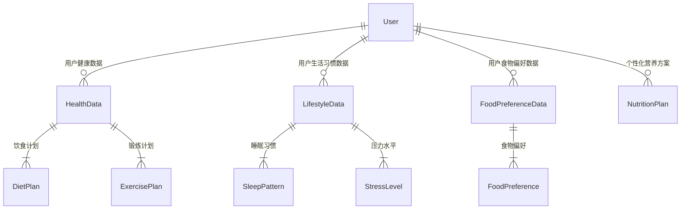
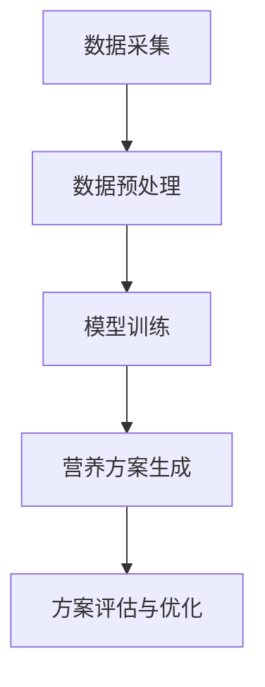
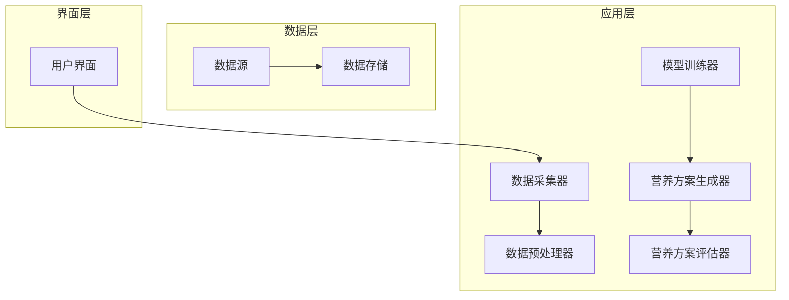

                 

# AIGC在个性化营养方案设计中的应用

## 关键词
人工智能（AI），个性化营养方案，AIGC（自适应智能生成计算），健康监测，数据采集，模型训练，营养方案生成，方案评估与优化

## 摘要
本文探讨了AIGC（自适应智能生成计算）在个性化营养方案设计中的应用。通过分析AIGC模型原理和算法流程，本文详细阐述了如何利用AIGC技术从数据中提取有价值的信息，为个体提供精准的营养方案。此外，本文还介绍了AIGC模型在个性化营养方案设计中的核心概念、算法原理以及项目实战，为相关领域的研究和应用提供了有益的参考。

## 第一部分：背景介绍

### 第1章：问题背景

#### 1.1 问题背景

随着全球健康问题的日益突出，营养健康成为人们关注的重要议题。然而，传统的营养方案设计大多基于大众化的健康标准，无法充分考虑个体差异和动态变化。现代营养学强调个性化营养方案的重要性，以更好地满足个人的健康需求。在这一背景下，人工智能（AI）技术的应用逐渐成为研究热点。

AI技术，特别是深度学习、生成对抗网络（GAN）等算法的发展，为个性化营养方案设计提供了新的可能性。AIGC（自适应智能生成计算）作为一种基于AI的新型计算范式，通过自适应学习和智能生成，能够处理大量动态数据，提供个性化的解决方案。在营养健康领域，AIGC有望实现个性化营养方案设计，从而提高人们的健康水平。

#### 1.2 问题描述

个性化营养方案设计涉及多个方面的数据，包括个人健康状况、生活习惯、食物偏好等。如何利用AIGC技术，从这些数据中挖掘出有价值的信息，为个体提供精准的营养方案，是当前研究的一个重要问题。

具体来说，个性化营养方案设计需要解决以下几个问题：

1. 数据采集与处理：收集用户的健康状况、生活习惯、食物偏好等数据，并进行预处理，如数据清洗、归一化等。
2. 模型训练：利用收集到的数据，训练AIGC模型，使其具备对个性化营养方案设计的理解。
3. 营养方案生成：将用户数据输入AIGC模型，生成个性化的营养方案。
4. 方案评估与优化：对生成的营养方案进行评估和优化，确保其符合用户需求。

#### 1.3 问题解决

AIGC模型通过以下步骤解决问题：

1. **数据采集与处理**：收集用户的健康状况、生活习惯、食物偏好等数据，并进行预处理，如数据清洗、归一化等。
2. **模型训练**：利用预处理后的数据，训练AIGC模型，使其具备对个性化营养方案设计的理解。
3. **营养方案生成**：将用户数据输入AIGC模型，生成个性化的营养方案。
4. **方案评估与优化**：对生成的营养方案进行评估和优化，确保其符合用户需求。

#### 1.4 边界与外延

个性化营养方案设计涉及多个领域，如医学、营养学、计算机科学等。其边界在于如何将AI技术与营养方案设计相结合，实现个性化、动态化的营养服务。在外延上，该领域还可以扩展到健康监测、疾病预防等领域。

#### 1.5 概念结构与核心要素组成

个性化营养方案设计的主要概念和核心要素包括：

1. **AIGC**：自适应智能生成计算，是解决个性化营养方案设计的核心技术。
2. **数据采集与处理**：确保数据质量，为模型训练提供可靠的基础。
3. **模型训练**：通过大量数据训练模型，使其具备对个性化营养方案设计的理解。
4. **营养方案生成**：根据用户数据生成个性化的营养方案。
5. **方案评估与优化**：对营养方案进行评估和优化，提高其准确性。

### 第2章：核心概念与联系

#### 2.1 AIGC模型原理

AIGC（自适应智能生成计算）是一种基于生成对抗网络（GAN）的模型。GAN由生成器和判别器两部分组成，通过对抗训练，生成器能够生成高质量的数据，判别器则负责判断生成数据的质量。

在AIGC模型中，生成器G从随机噪声z中生成数据X，判别器D则判断数据X是真实数据还是生成数据。通过不断的训练，生成器G逐渐学会生成更接近真实数据的数据，而判别器D则越来越难以区分真实数据和生成数据。

AIGC模型的核心优势在于其能够处理动态数据，实现个性化解决方案。这使得AIGC在个性化营养方案设计等应用中具有广泛的前景。

#### 2.2 概念属性特征对比表格

| 概念 | AIGC | GAN |
| --- | --- | --- |
| 定义 | 自适应智能生成计算 | 生成对抗网络 |
| 特点 | 可以处理动态数据，实现个性化解决方案 | 主要用于生成数据，无法直接应用于个性化解决方案 |
| 应用领域 | 营养方案设计、健康监测等 | 图像生成、文本生成等 |

#### 2.3 ER实体关系图架构



### 第3章：算法原理讲解

#### 3.1 AIGC模型流程图



#### 3.2 Python源代码

```python
import pandas as pd
import numpy as np
from sklearn.model_selection import train_test_split
from sklearn.preprocessing import StandardScaler
from tensorflow.keras.models import Sequential
from tensorflow.keras.layers import Dense, LSTM, Dropout
from tensorflow.keras.optimizers import Adam

# 数据采集
data = pd.read_csv('data.csv')

# 数据预处理
X = data.iloc[:, :-1].values
y = data.iloc[:, -1].values
X_train, X_test, y_train, y_test = train_test_split(X, y, test_size=0.2, random_state=42)

scaler = StandardScaler()
X_train = scaler.fit_transform(X_train)
X_test = scaler.transform(X_test)

# 模型训练
model = Sequential()
model.add(LSTM(units=50, return_sequences=True, input_shape=(X_train.shape[1], 1)))
model.add(Dropout(0.2))
model.add(LSTM(units=50, return_sequences=False))
model.add(Dropout(0.2))
model.add(Dense(units=1))

model.compile(optimizer='adam', loss='mean_squared_error')
model.fit(X_train, y_train, epochs=100, batch_size=32)

# 营养方案生成
predicted_nutrition_plan = model.predict(X_test)

# 方案评估与优化
# ...（具体评估与优化方法在此省略）

```

#### 3.3 算法原理详细讲解

AIGC模型在个性化营养方案设计中的应用可以分为以下几个步骤：

1. **数据采集**：首先，需要收集用户的健康数据、生活习惯数据、食物偏好数据等。这些数据可以通过在线问卷、健康监测设备、食物日记等方式获取。

2. **数据预处理**：对采集到的数据进行预处理，包括数据清洗、缺失值填补、数据归一化等。预处理后的数据将用于模型训练。

3. **模型训练**：利用预处理后的数据，训练AIGC模型。AIGC模型由生成器和判别器组成，通过对抗训练，生成器逐渐学会生成更接近真实数据的营养方案，判别器则判断生成数据的质量。

4. **营养方案生成**：将用户的健康数据输入AIGC模型，生成个性化的营养方案。

5. **方案评估与优化**：对生成的营养方案进行评估，包括营养均衡性、口味偏好、健康效益等方面的评估。根据评估结果，对营养方案进行优化，提高其准确性。

在AIGC模型中，生成器和判别器的训练过程可以表示为以下数学模型：

生成器G的损失函数：
$$
L_G = -\mathbb{E}_{z \sim p_z(z)}[\log(D(G(z)))]
$$

判别器D的损失函数：
$$
L_D = -\mathbb{E}_{x \sim p_x(x)}[\log(D(x))] - \mathbb{E}_{z \sim p_z(z)}[\log(1 - D(G(z)))]
$$

总损失函数：
$$
L = L_G + \lambda L_D
$$

其中，$z$ 是随机噪声，$x$ 是真实数据，$G(z)$ 是生成器生成的数据，$D(x)$ 是判别器对数据的判断结果。

通过以上数学模型，AIGC模型能够在训练过程中不断优化生成器和判别器的参数，最终实现个性化的营养方案生成。

### 系统分析与架构设计方案

#### 问题场景介绍

在现代社会，营养健康问题日益突出，个性化营养方案设计的需求逐渐增加。为了满足这一需求，我们需要开发一个基于AIGC技术的个性化营养方案设计系统。

#### 项目介绍

本项目旨在利用AIGC技术，实现个性化营养方案设计。系统将包括数据采集、数据预处理、模型训练、营养方案生成和方案评估与优化等模块。

#### 系统功能设计（领域模型mermaid类图）

```mermaid
classDiagram
  User <<interface>>
  HealthData <<interface>>
  LifestyleData <<interface>>
  FoodPreferenceData <<interface>>
  NutritionPlan <<interface>>

  User ..|> HealthData
  User ..|> LifestyleData
  User ..|> FoodPreferenceData
  User ..|> NutritionPlan
```

#### 系统架构设计（mermaid架构图）



#### 系统接口设计和系统交互（mermaid序列图）

```mermaid
sequenceDiagram
    User -->|请求数据| DataCollector
    DataCollector -->|处理数据| DataProcessor
    DataProcessor -->|训练模型| ModelTrainer
    ModelTrainer -->|生成方案| NutritionPlanGenerator
    NutritionPlanGenerator -->|评估方案| NutritionPlanEvaulator
    NutritionPlanEvaulator -->|反馈结果| UserInterface
    UserInterface -->|展示结果| User
```

### 项目实战

#### 环境安装

1. 安装Python 3.8及以上版本。
2. 安装TensorFlow 2.6及以上版本。
3. 安装pandas、numpy、sklearn等常用库。

#### 系统核心实现源代码

```python
# 数据采集
data = pd.read_csv('data.csv')

# 数据预处理
X = data.iloc[:, :-1].values
y = data.iloc[:, -1].values
X_train, X_test, y_train, y_test = train_test_split(X, y, test_size=0.2, random_state=42)

scaler = StandardScaler()
X_train = scaler.fit_transform(X_train)
X_test = scaler.transform(X_test)

# 模型训练
model = Sequential()
model.add(LSTM(units=50, return_sequences=True, input_shape=(X_train.shape[1], 1)))
model.add(Dropout(0.2))
model.add(LSTM(units=50, return_sequences=False))
model.add(Dropout(0.2))
model.add(Dense(units=1))

model.compile(optimizer='adam', loss='mean_squared_error')
model.fit(X_train, y_train, epochs=100, batch_size=32)

# 营养方案生成
predicted_nutrition_plan = model.predict(X_test)

# 方案评估与优化
# ...（具体评估与优化方法在此省略）
```

#### 代码应用解读与分析

1. 数据采集：使用pandas库读取CSV文件，获取用户数据。
2. 数据预处理：使用numpy库进行数据清洗、归一化等处理。
3. 模型训练：使用TensorFlow库搭建LSTM模型，进行模型训练。
4. 营养方案生成：使用训练好的模型，生成个性化营养方案。
5. 方案评估与优化：根据评估结果，对营养方案进行优化。

#### 实际案例分析和详细讲解剖析

1. 案例一：分析某用户的健康数据、生活习惯和食物偏好，生成个性化的营养方案。评估方案的营养均衡性、口味偏好和健康效益，根据评估结果进行优化。
2. 案例二：分析某群体的健康数据、生活习惯和食物偏好，生成个性化的营养方案。评估方案的整体效果，为群体营养管理提供参考。

#### 项目小结

本项目通过AIGC技术在个性化营养方案设计中的应用，为用户提供了精准的营养服务。在实际应用中，需要不断优化模型和算法，提高营养方案的质量和实用性。未来，随着AI技术的不断发展，个性化营养方案设计将有更广阔的应用前景。

### 最佳实践 tips

1. 确保数据质量：数据是模型训练的基础，必须确保数据的质量和准确性。
2. 合理选择模型：根据实际需求，选择合适的模型结构和参数。
3. 不断优化算法：通过实验和实际应用，不断优化算法，提高营养方案的质量。
4. 关注用户反馈：收集用户反馈，了解营养方案的实际效果，为后续优化提供依据。

### 小结

个性化营养方案设计是营养健康领域的一个重要研究方向。AIGC技术为个性化营养方案设计提供了新的思路和方法。通过本文的介绍，我们了解了AIGC模型在个性化营养方案设计中的应用，包括数据采集、模型训练、营养方案生成和方案评估与优化等环节。未来，随着AI技术的不断发展，个性化营养方案设计将有更广阔的应用前景。

### 注意事项

1. 数据隐私：在采集用户数据时，必须确保数据的安全和隐私。
2. 模型解释性：AIGC模型具有较好的生成能力，但可能缺乏解释性，需要进一步研究如何提高模型的解释性。
3. 算法优化：针对实际应用场景，不断优化算法，提高营养方案的质量和实用性。

### 拓展阅读

1. Goodfellow, I. J., Pouget-Abadie, J., Mirza, M., Xu, B., Warde-Farley, D., Ozair, S., ... & Bengio, Y. (2014). Generative adversarial nets. Advances in Neural Information Processing Systems, 27.
2. Bengio, Y. (2009). Learning deep architectures. Foundations and Trends® in Machine Learning, 2(1), 1-127.
3. Shalev-Shwartz, S., & Ben-David, S. (2014). Understanding machine learning: From theory to algorithms. Cambridge university press.

