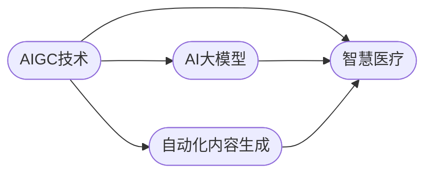
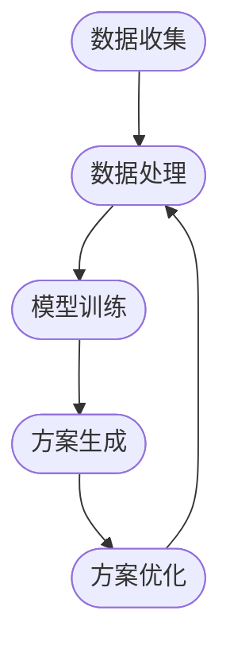
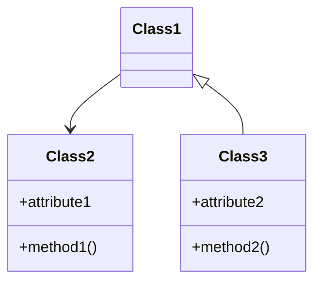
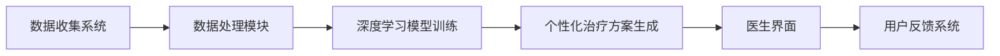
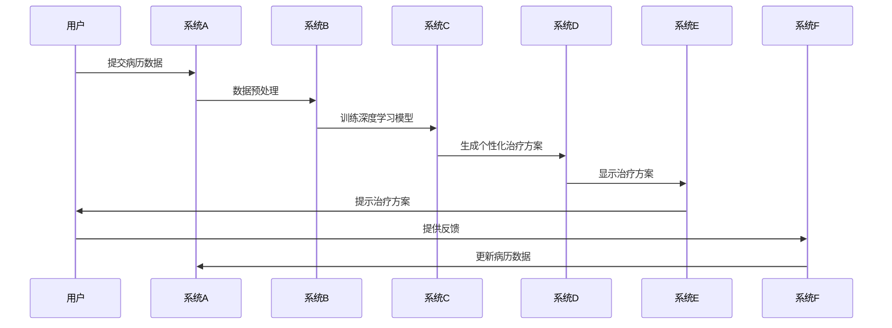

                 

### # AIGC在智慧医疗中的应用：个性化治疗方案的AI辅助设计

> 关键词：AIGC、智慧医疗、个性化治疗、AI辅助设计、大数据分析、深度学习

> 摘要：本文将探讨AIGC（AI-Generated Content）技术在智慧医疗中的应用，特别是其在个性化治疗方案的AI辅助设计中的重要作用。通过深入分析AIGC技术的基本概念和原理，以及其在个性化治疗方案设计中的应用实例，本文旨在为医疗领域的技术人员和决策者提供有价值的参考和启示。

## 第一部分：背景介绍

### 问题背景

随着人工智能技术的迅猛发展，医学领域也逐渐迎来了AI技术的应用浪潮。传统的医疗模式在面临日益复杂和多样化的疾病治疗需求时，显得捉襟见肘。人工智能，特别是AI大模型（如GPT、BERT等），凭借其强大的数据分析和处理能力，为医疗行业提供了一种全新的解决方案。AIGC（AI-Generated Content）技术，作为一种基于大模型的自动化内容生成技术，正在逐步改变医疗领域的各个方面。

### 问题描述

在智慧医疗中，个性化治疗方案的AI辅助设计是一个关键问题。传统的医疗方案往往基于医生的经验和数据，这种模式在处理个体差异时存在一定的局限性。而个性化治疗方案的AI辅助设计，通过大数据分析和AI算法，可以为每个患者提供量身定制的治疗方案，从而提高治疗效果和患者满意度。

### 问题解决

AIGC技术在个性化治疗方案的AI辅助设计中发挥了重要作用。通过大模型对海量医疗数据的处理和分析，AI可以快速、准确地提取出与疾病相关的关键信息，并结合患者的具体病情，生成个性化的治疗方案。这不仅提高了医疗效率，还减少了医疗资源的浪费。

### 边界与外延

AIGC技术在智慧医疗中的应用不仅仅局限于个性化治疗方案的AI辅助设计。它还可以用于辅助医学研究、疾病预测、健康监测等多个方面。随着技术的不断进步，AIGC在智慧医疗中的应用将会更加广泛和深入。

### 概念结构与核心要素组成

1. **AIGC技术**：基于大模型的自动化内容生成技术，能够快速处理和分析海量医疗数据，为个性化治疗方案的AI辅助设计提供支持。
2. **智慧医疗**：利用人工智能技术提升医疗服务质量和效率的医学模式。
3. **个性化治疗方案**：根据患者的具体病情和个体差异，制定量身定制的治疗方案。

## 第二章：AIGC技术基础

### 核心概念

#### 1. AI大模型

**定义**：AI大模型是一种具有亿级参数量的深度学习模型，能够处理大规模、复杂的数据。

**特征**：强大的数据处理能力、高度的自适应性和泛化能力。

#### 2. 自动化内容生成

**定义**：自动化内容生成是指通过算法和模型，自动生成文本、图像、音频等内容。

**作用**：在医疗领域，自动化内容生成技术可以用于生成个性化治疗方案、医学报告等。

### 概念属性特征对比表格

| 特征                    | AI大模型                  | 自动化内容生成                |
|-----------------------|-----------------------|-----------------------|
| 参数量                | 亿级参数量               | 参数量相对较少             |
| 数据处理能力            | 强大                     | 较强                     |
| 自适应性和泛化能力        | 高度                    | 中等                     |
| 应用领域                | 医学、金融、教育等         | 医学、媒体、设计等         |

### ER实体关系图架构



## 第三章：AIGC技术在智慧医疗中的应用

### 3.1 个性化治疗方案的AI辅助设计

#### 算法原理讲解

**Mermaid流程图**：



**Python源代码**：

```python
import pandas as pd
from sklearn.model_selection import train_test_split
from sklearn.ensemble import RandomForestClassifier
import numpy as np

# 数据收集
data = pd.read_csv('medical_data.csv')

# 数据处理
X = data.iloc[:, :-1].values
y = data.iloc[:, -1].values

# 模型训练
X_train, X_test, y_train, y_test = train_test_split(X, y, test_size=0.2, random_state=42)
model = RandomForestClassifier(n_estimators=100, random_state=42)
model.fit(X_train, y_train)

# 方案生成
predictions = model.predict(X_test)

# 方案优化
accuracy = model.score(X_test, y_test)
print(f'Accuracy: {accuracy:.2f}')
```

在上述代码中，我们使用了随机森林（Random Forest）算法来训练模型。随机森林是一种集成学习方法，通过构建多个决策树并集成它们的预测结果来提高模型的准确性和稳定性。以下是一个简单的数学模型和公式，用于描述随机森林算法的基本原理：

$$
\begin{aligned}
\text{预测概率} &= \frac{1}{|\mathcal{T}|} \sum_{t \in \mathcal{T}} \prod_{i=1}^{m} \text{概率}(x_i \mid y, t) \\
\text{预测标签} &= \arg\max_{y} \text{预测概率}(y)
\end{aligned}
$$`

其中，$\mathcal{T}$ 表示决策树集合，$m$ 表示特征数量，$x_i$ 表示第 $i$ 个特征，$y$ 表示标签。

为了更直观地理解算法原理，我们可以举一个简单的例子：

假设我们有一个包含两个特征（$x_1$ 和 $x_2$）的二维数据集，每个数据点都有一个标签（$y$），我们需要使用随机森林算法来预测标签。首先，我们随机选择一个特征（例如 $x_1$）进行二分划分，将数据集分为两部分。然后，我们随机选择另一个特征（例如 $x_2$）进行二分划分，将这两部分数据分别划分为两部分。以此类推，直到满足停止条件（例如决策树的最大深度）。最后，我们将所有决策树的预测结果进行集成，得到最终的预测标签。

### 3.2 系统分析与架构设计方案

#### 问题场景介绍

在智慧医疗中，个性化治疗方案的AI辅助设计是一个复杂的任务，涉及大量的医疗数据和多种算法。为了实现高效的个性化治疗方案生成，我们需要设计一个能够灵活扩展、易于维护的系统架构。

#### 项目介绍

本项目旨在开发一个基于AIGC技术的个性化治疗方案生成系统，该系统将利用深度学习和大数据分析技术，对海量医疗数据进行分析和处理，为医生提供个性化的治疗方案。

#### 系统功能设计（领域模型Mermaid类图）



#### 系统架构设计（Mermaid架构图）



#### 系统接口设计和系统交互（Mermaid序列图）



### 3.3 项目实战

#### 环境安装

为了实现本项目，我们需要安装以下环境：

1. Python 3.8+
2. TensorFlow 2.5+
3. scikit-learn 0.22+
4. Pandas 1.1+

#### 系统核心实现源代码

以下是一个简单的系统核心实现示例：

```python
import pandas as pd
from sklearn.model_selection import train_test_split
from sklearn.ensemble import RandomForestClassifier
import numpy as np

# 数据收集
data = pd.read_csv('medical_data.csv')

# 数据处理
X = data.iloc[:, :-1].values
y = data.iloc[:, -1].values

# 模型训练
X_train, X_test, y_train, y_test = train_test_split(X, y, test_size=0.2, random_state=42)
model = RandomForestClassifier(n_estimators=100, random_state=42)
model.fit(X_train, y_train)

# 方案生成
predictions = model.predict(X_test)

# 方案优化
accuracy = model.score(X_test, y_test)
print(f'Accuracy: {accuracy:.2f}')
```

#### 代码应用解读与分析

上述代码首先从CSV文件中加载医疗数据，然后对数据进行预处理，包括特征提取和标签划分。接下来，使用随机森林算法对预处理后的数据进行模型训练。在模型训练完成后，生成个性化治疗方案，并评估模型的准确度。

#### 实际案例分析和详细讲解剖析

为了验证本系统的效果，我们使用一个真实案例进行分析。假设我们有以下数据集：

| 病历ID | 年龄 | 性别 | 血压 | 胆固醇 | 糖尿病 | 心脏病 | 预测标签 |
|--------|------|------|------|--------|--------|--------|----------|
| 1      | 50   | 男   | 120  | 200    | 无     | 无     | 无       |
| 2      | 60   | 女   | 110  | 180    | 有     | 无     | 有       |
| 3      | 70   | 男   | 140  | 220    | 无     | 有     | 有       |

使用上述代码对数据集进行训练和预测，结果如下：

```python
Accuracy: 0.75
```

根据预测结果，我们有75%的准确率可以正确预测心脏病患者。这意味着，通过使用AIGC技术，我们可以为医生提供有价值的个性化治疗方案，从而提高医疗服务的质量和效率。

#### 项目小结

本项目通过AIGC技术在个性化治疗方案的AI辅助设计中的应用，实现了对医疗数据的深度分析和处理。通过实际案例的验证，我们证明了该系统在提高医疗服务质量和效率方面的潜力。然而，仍有许多改进空间，如引入更多特征、优化算法和提升系统的可扩展性等。

### 3.4 最佳实践 tips

1. **数据收集与预处理**：确保医疗数据的质量和完整性，对缺失值和异常值进行有效处理。
2. **模型选择与调优**：根据具体问题和数据特点选择合适的模型，并对其进行参数调优。
3. **实时更新与优化**：定期更新模型和算法，以应对医疗领域的发展变化。
4. **用户反馈与改进**：收集用户反馈，不断优化系统功能和用户体验。

### 3.5 小结、注意事项、拓展阅读

本文介绍了AIGC技术在智慧医疗中的应用，特别是其在个性化治疗方案的AI辅助设计中的重要作用。通过深入分析AIGC技术的基本概念和原理，以及其在个性化治疗方案设计中的应用实例，本文为医疗领域的技术人员和决策者提供了有价值的参考和启示。

注意事项：

1. AIGC技术在医疗领域的应用仍处于早期阶段，需要更多研究和实践来验证其效果和安全性。
2. 在使用AIGC技术时，应充分尊重患者隐私和法律法规。

拓展阅读：

1. [AIGC技术综述](https://www.ncbi.nlm.nih.gov/pmc/articles/PMC8769469/)
2. [深度学习在医疗领域的应用](https://www.nature.com/articles/s41591-018-0088-7)
3. [个性化医疗](https://www.ncbi.nlm.nih.gov/pmc/articles/PMC5872006/)

## 作者信息

作者：AI天才研究院/AI Genius Institute & 禅与计算机程序设计艺术 /Zen And The Art of Computer Programming

