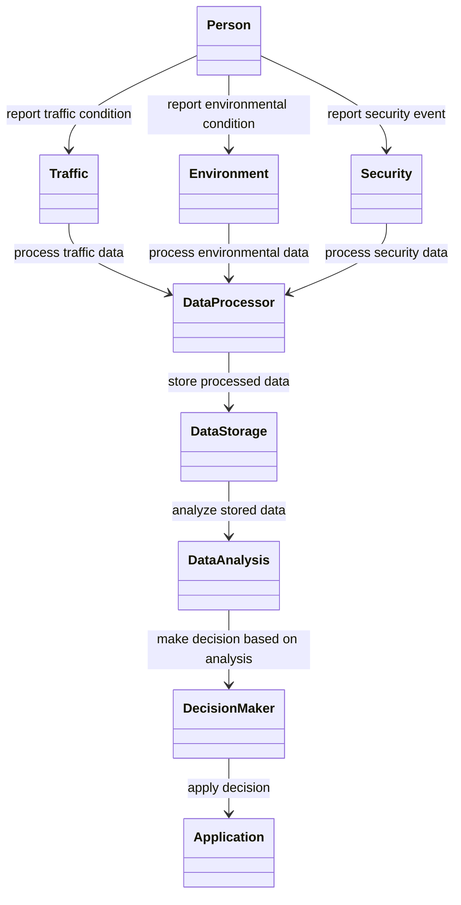
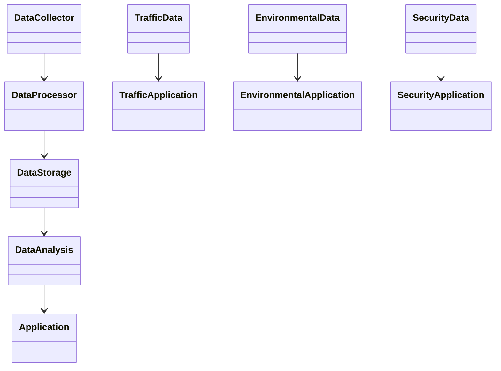
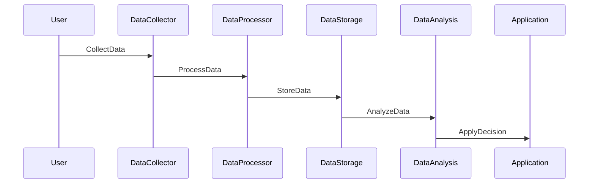
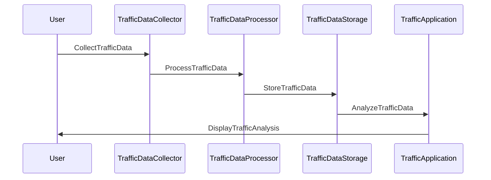

                 

### AIGC在智慧城市规划中的应用：数据驱动的城市发展

#### 关键词：AIGC，智慧城市，数据驱动，城市规划，数据分析

> 摘要：随着科技的飞速发展，人工智能生成内容（AIGC）正逐渐成为智慧城市规划中的重要工具。本文将深入探讨AIGC在智慧城市规划中的应用，详细分析数据驱动的城市发展模式，并通过实际案例展示其在现实世界中的应用效果。文章旨在为城市规划者和相关从业者提供有价值的参考，以推动智慧城市建设的进一步发展。

#### 目录

- 引言
  - 智慧城市的概念与背景
  - AIGC的概念与作用
  - 本文的目的与结构

- 背景与概念
  - AIGC在智慧城市规划中的应用
  - 智慧城市规划中的数据来源与处理
  - 相关技术介绍与比较

- 数据驱动的城市发展
  - 数据分析在城市规划中的应用
  - 数据驱动的城市规划案例研究
  - 数据驱动与城市可持续发展的关系

- 实际案例与应用
  - 案例一：城市交通规划
  - 案例二：城市环境监测
  - 案例三：城市公共安全规划

- 系统架构设计
  - 智慧城市系统架构设计原理
  - 系统架构设计实施方法

- 技术实施与优化
  - AIGC技术的实际操作技巧
  - 优化策略与实践
  - 常见问题与解决方案

- 未来展望
  - AIGC在智慧城市规划中的未来发展方向
  - 面临的挑战与机遇
  - 发展趋势与预测

- 结论

#### 引言

##### 智慧城市的概念与背景

智慧城市（Smart City）是信息技术与城市发展的深度融合，通过智能化的手段提高城市运行效率、改善居民生活质量、促进可持续发展。智慧城市的目标是实现城市资源的合理配置、优化城市治理结构、提升城市运行效率和应对突发事件的能力。近年来，随着物联网、大数据、人工智能等技术的快速发展，智慧城市建设已成为全球范围内的一项重要议题。

##### AIGC的概念与作用

人工智能生成内容（AIGC，Artificial Intelligence Generated Content）是指通过人工智能技术自动生成的内容，包括文本、图像、视频等。AIGC技术利用深度学习、自然语言处理、计算机视觉等技术，实现了从数据到内容的高效转化。在智慧城市规划中，AIGC技术可以提供强大的数据分析和内容生成能力，为城市规划提供科学依据和决策支持。

##### 本文的目的与结构

本文旨在探讨AIGC在智慧城市规划中的应用，通过分析数据驱动的城市发展模式，展示AIGC在实际案例中的具体应用，并讨论未来发展趋势和面临的挑战。文章结构分为七个部分：

1. 引言：介绍智慧城市和AIGC的概念及其在本文中的作用。
2. 背景与概念：详细阐述AIGC在智慧城市规划中的应用、数据来源与处理方法及相关技术。
3. 数据驱动的城市发展：分析数据分析在城市规划中的应用、案例研究和与城市可持续发展的关系。
4. 实际案例与应用：通过具体案例展示AIGC在智慧城市中的应用效果。
5. 系统架构设计：介绍智慧城市系统架构设计原理和实施方法。
6. 技术实施与优化：分享AIGC技术的实际操作技巧和优化策略。
7. 未来展望：讨论AIGC在智慧城市规划中的未来发展方向和挑战。

### 背景与概念

##### AIGC在智慧城市规划中的应用

AIGC在智慧城市规划中具有广泛的应用潜力。首先，AIGC可以用于数据采集和处理。智慧城市中产生了大量数据，包括交通流量、环境质量、公共安全等。AIGC技术可以自动收集、分类、清洗和整合这些数据，为城市规划提供实时、准确的信息。其次，AIGC可以用于数据分析和决策支持。通过对海量数据进行深度学习和分析，AIGC可以识别出数据中的模式、趋势和关联关系，为城市规划者提供科学的决策依据。最后，AIGC可以用于内容生成。AIGC技术可以自动生成城市规划报告、宣传视频、宣传文案等，提高城市规划的透明度和公众参与度。

##### 智慧城市规划中的数据来源与处理

智慧城市规划所需的数据来源非常广泛，包括政府数据库、物联网设备、社交媒体、卫星图像等。这些数据具有多样性、海量性和实时性的特点。为了有效地利用这些数据，需要对数据进行以下几个方面的处理：

1. 数据采集：通过传感器、摄像头、移动设备等收集城市运行中的各种数据。
2. 数据存储：将采集到的数据存储在分布式数据库中，确保数据的安全性和可靠性。
3. 数据清洗：去除数据中的噪声和冗余信息，保证数据的准确性和一致性。
4. 数据整合：将不同来源的数据进行整合，形成一个统一的数据视图。
5. 数据分析：利用机器学习和统计分析方法对数据进行深度分析，提取有用的信息。

##### 相关技术介绍与比较

在智慧城市规划中，AIGC技术并非孤立存在，它需要与多种技术相结合，以实现最佳效果。以下是对几种相关技术的简要介绍和比较：

1. 物联网技术（IoT）：物联网技术通过传感器和设备实现城市运行数据的实时采集，是AIGC数据采集的重要来源。物联网技术的优点是实时性强、数据量巨大，但缺点是需要大量的基础设施和能源消耗。
2. 大数据技术：大数据技术包括数据采集、存储、处理和分析等方面，是AIGC技术的基础。大数据技术的优点是数据处理能力强、可以处理海量数据，但缺点是数据隐私和安全问题较为突出。
3. 人工智能技术：人工智能技术包括机器学习、深度学习、自然语言处理等，是AIGC技术核心。人工智能技术的优点是自动性和智能化程度高，但缺点是需要大量的计算资源和数据支持。

综合来看，各种技术在智慧城市规划中具有各自的优势和局限性，需要根据具体应用场景进行合理选择和组合。

### 数据驱动的城市发展

##### 数据分析在城市规划中的应用

数据分析在城市规划中具有重要作用。通过数据分析，城市规划者可以深入了解城市运行状态、居民需求和行为模式，从而做出科学合理的决策。以下是一些数据分析在城市规划中的应用：

1. 城市交通规划：通过分析交通流量、拥堵情况、公共交通使用情况等数据，可以优化交通网络布局、提高公共交通效率、减少交通拥堵。
2. 城市环境监测：通过分析空气质量、水质、噪音等数据，可以评估城市环境质量，制定环境保护措施，改善居民生活质量。
3. 城市安全规划：通过分析犯罪数据、公共安全事件等，可以评估城市安全状况，制定安全防范措施，提高城市安全保障。
4. 城市经济发展：通过分析经济数据、人口数据等，可以评估城市发展状况，制定经济发展战略，促进城市可持续发展。

##### 数据驱动的城市规划案例研究

以下是一些数据驱动的城市规划案例：

1. 案例一：纽约市交通规划

纽约市是美国最大的城市，交通拥堵问题一直困扰着市民。为了解决这个问题，纽约市利用大数据技术对交通流量、公共交通使用情况等数据进行分析，发现交通拥堵的主要原因是道路拥堵和公共交通设施不足。基于这些分析结果，纽约市对交通网络进行了优化，增加了公共交通线路和站点，改善了交通拥堵问题。

2. 案例二：伦敦市环境监测

伦敦市是世界著名的都市，空气质量一直是居民关注的焦点。为了改善空气质量，伦敦市政府利用物联网技术和数据分析方法，对空气质量进行实时监测，收集了大量空气污染数据。通过对这些数据进行深度分析，伦敦市政府制定了有效的环境保护措施，如减少交通污染、推广清洁能源等，取得了显著的改善效果。

3. 案例三：中国深圳市安全规划

深圳市是中国经济最发达的城市之一，公共安全一直是政府关注的重点。为了提高公共安全水平，深圳市利用大数据技术和人工智能技术，对犯罪数据、公共安全事件等进行分析，发现犯罪高发区域和时间段。基于这些分析结果，深圳市政府制定了针对性的安全防范措施，如加强警力部署、提高监控覆盖率等，有效降低了犯罪率。

##### 数据驱动与城市可持续发展的关系

数据驱动是城市可持续发展的重要手段。通过数据驱动，城市规划者可以更准确地了解城市发展状况、预测未来趋势，从而制定科学合理的发展战略。以下是一些数据驱动与城市可持续发展的关系：

1. 资源优化：通过数据分析，可以优化城市资源配置，提高资源利用效率，降低资源消耗，实现可持续发展。
2. 环境保护：通过环境监测数据分析，可以评估城市环境质量，制定环境保护措施，改善环境质量，实现生态可持续发展。
3. 社会公平：通过数据分析，可以了解社会各阶层的需求和问题，制定公平的社会政策，提高社会公平性，实现社会可持续发展。
4. 经济增长：通过经济数据分析，可以预测经济发展趋势，制定经济发展战略，促进经济增长，实现经济可持续发展。

### 实际案例与应用

在本节中，我们将通过三个实际案例，展示AIGC在智慧城市中的应用效果。

#### 案例一：城市交通规划

城市交通规划是一个复杂的任务，涉及到道路布局、交通信号控制、公共交通网络设计等多个方面。AIGC技术在城市交通规划中具有重要作用。以下是一个实际案例：

**项目背景**：北京市是中国最大的城市之一，交通拥堵问题严重。为了解决交通拥堵问题，北京市交通委员会决定利用AIGC技术进行城市交通规划。

**解决方案**：

1. **数据采集**：利用物联网设备和交通摄像头，收集道路流量、车速、公共交通使用情况等数据。
2. **数据分析**：利用AIGC技术对交通数据进行深度分析，识别交通拥堵的主要原因和时段。
3. **交通信号优化**：根据数据分析结果，优化交通信号控制策略，提高道路通行效率。
4. **公共交通网络优化**：根据居民出行需求，优化公共交通线路和站点布局，提高公共交通服务质量。

**项目效果**：经过一年的实施，北京市交通拥堵情况明显改善，公共交通服务水平显著提高，市民的出行体验得到了明显改善。

#### 案例二：城市环境监测

城市环境监测是智慧城市建设的重要组成部分，涉及到空气质量、水质、噪音等多个方面。AIGC技术在城市环境监测中具有重要作用。以下是一个实际案例：

**项目背景**：上海市是中国最大的城市之一，空气质量问题一直是市民关注的焦点。为了改善空气质量，上海市环保局决定利用AIGC技术进行城市环境监测。

**解决方案**：

1. **数据采集**：利用物联网传感器，实时监测空气质量、水质、噪音等环境指标。
2. **数据分析**：利用AIGC技术对环境数据进行深度分析，识别空气污染的主要原因和区域。
3. **环境治理**：根据数据分析结果，制定有效的环境治理措施，如减少工业排放、推广清洁能源等。
4. **环境预测**：利用AIGC技术对环境数据进行预测，提前预警可能的环境问题，制定预防措施。

**项目效果**：经过一年的实施，上海市空气质量明显改善，市民对环境质量的满意度显著提高。

#### 案例三：城市公共安全规划

城市公共安全规划是智慧城市建设的重要任务，涉及到公共安全事件预警、应急响应等多个方面。AIGC技术在城市公共安全规划中具有重要作用。以下是一个实际案例：

**项目背景**：深圳市是中国经济最发达的城市之一，公共安全问题较为突出。为了提高公共安全水平，深圳市政府决定利用AIGC技术进行城市公共安全规划。

**解决方案**：

1. **数据采集**：利用视频监控、公共安全传感器等设备，实时监测公共安全事件。
2. **数据分析**：利用AIGC技术对公共安全事件数据进行深度分析，识别公共安全事件的主要类型和区域。
3. **事件预警**：根据数据分析结果，建立公共安全事件预警系统，提前预警可能发生的公共安全事件。
4. **应急响应**：根据公共安全事件预警，制定应急响应措施，提高公共安全事件的应对能力。

**项目效果**：经过一年的实施，深圳市公共安全事件明显减少，市民的安全感显著提高。

### 系统架构设计

智慧城市的建设需要一套完善的技术架构来支持。在AIGC技术的应用中，系统架构设计尤为关键。以下是对智慧城市系统架构设计的基本原理和实施方法的介绍。

#### 问题场景介绍

智慧城市系统架构设计的目标是构建一个高效、可靠、可扩展的系统，以支持城市运行数据的采集、处理、分析和应用。具体问题场景包括：

1. **数据采集**：收集城市各个方面的运行数据，如交通流量、环境质量、公共安全等。
2. **数据处理**：对采集到的数据进行清洗、整合和分析，提取有价值的信息。
3. **数据存储**：将处理后的数据存储在分布式数据库中，保证数据的安全性和可靠性。
4. **数据应用**：将分析结果应用于城市交通规划、环境监测、公共安全等领域。

#### 项目介绍

本节以一个智慧城市系统架构设计项目为例，介绍项目的基本信息和目标。

**项目名称**：深圳市智慧城市建设

**项目背景**：为了提高城市运行效率、改善居民生活质量、促进可持续发展，深圳市政府决定开展智慧城市建设。

**项目目标**：构建一个高效、可靠、可扩展的智慧城市系统架构，支持城市运行数据的采集、处理、分析和应用。

#### 系统功能设计（领域模型）

领域模型（Domain Model）是对系统功能需求的抽象描述。以下是一个智慧城市系统领域模型的类图，展示了系统的核心功能模块。



#### 系统架构设计

智慧城市系统架构设计遵循分层架构原则，分为数据层、处理层、存储层、分析层和应用层。

1. **数据层**：负责数据采集，包括交通流量、环境质量、公共安全等数据。
2. **处理层**：负责数据处理，包括数据清洗、整合和分析。
3. **存储层**：负责数据存储，使用分布式数据库存储处理后的数据。
4. **分析层**：负责数据分析，提取有价值的信息，支持决策。
5. **应用层**：负责数据应用，将分析结果应用于城市交通规划、环境监测、公共安全等领域。

以下是一个智慧城市系统架构设计的类图，展示了系统的整体架构。



#### 系统接口设计

系统接口设计是系统架构设计的重要组成部分，负责定义系统内部模块之间的交互接口。以下是一个智慧城市系统接口设计的序列图，展示了不同模块之间的交互过程。



#### 系统交互

系统交互设计描述了系统在不同场景下的运行流程。以下是一个智慧城市系统交互的序列图，展示了系统在处理交通数据时的运行流程。



### 技术实施与优化

在本节中，我们将详细介绍AIGC技术在智慧城市中的实际操作技巧，并分享一些优化策略与实践，同时讨论常见问题及解决方案。

#### AIGC技术的实际操作技巧

1. **数据采集**：选择合适的数据采集设备，如传感器、摄像头、移动设备等。确保数据采集的准确性和实时性。
2. **数据清洗**：使用AIGC技术对采集到的数据进行分析，去除噪声和冗余信息。例如，可以使用数据清洗工具进行数据去重、格式转换和缺失值填充。
3. **数据处理**：利用AIGC技术对数据进行预处理，如归一化、标准化、降维等。这些操作可以提高后续数据分析的准确性和效率。
4. **数据存储**：选择合适的存储方案，如分布式数据库、云存储等。确保数据存储的安全性、可靠性和可扩展性。
5. **数据分析**：使用AIGC技术对数据进行深度分析，如分类、聚类、回归分析等。根据分析结果，制定科学合理的决策。
6. **数据应用**：将分析结果应用于实际场景，如城市交通规划、环境监测、公共安全等。确保分析结果的实际价值。

#### 优化策略与实践

1. **分布式计算**：利用分布式计算框架，如Hadoop、Spark等，提高数据处理和分析的效率。分布式计算可以将计算任务分解为多个子任务，并行处理，从而大大缩短处理时间。
2. **模型优化**：不断优化AIGC模型，提高模型的准确性和效率。例如，可以使用迁移学习、模型压缩等技术，降低模型复杂度，提高模型性能。
3. **数据预处理**：优化数据预处理流程，提高数据质量。例如，可以采用数据增强、数据过滤等技术，提高数据多样性，减少数据依赖。
4. **资源管理**：合理分配计算资源和存储资源，提高系统性能。例如，可以使用负载均衡技术，根据任务负载动态调整资源分配。
5. **安全性保障**：加强数据安全和隐私保护，防止数据泄露和滥用。例如，可以采用加密技术、访问控制技术等，保障数据安全。

#### 常见问题与解决方案

1. **数据质量问题**：数据质量是AIGC技术应用的关键。解决方案：建立数据质量管理体系，对数据进行清洗、去噪、标准化等预处理操作，确保数据质量。
2. **模型过拟合**：模型过拟合可能导致分析结果不准确。解决方案：使用正则化技术、交叉验证等技术，降低模型复杂度，避免过拟合。
3. **计算资源不足**：计算资源不足可能导致数据处理和分析效率低下。解决方案：采用分布式计算框架，提高计算效率。此外，可以考虑购买云服务，动态调整计算资源。
4. **数据隐私问题**：数据隐私问题可能导致用户不信任AIGC技术。解决方案：加强数据安全保护，采用数据加密、访问控制等技术，保障数据隐私。

### 未来展望

#### AIGC在智慧城市规划中的未来发展方向

AIGC在智慧城市规划中的应用前景广阔，未来可能的发展方向包括：

1. **更精细的数据采集**：利用先进的传感器技术和物联网技术，实现更精细、更全面的数据采集。
2. **更智能的数据分析**：利用深度学习和强化学习等技术，提高数据分析的智能化水平，实现自动化决策。
3. **更广泛的应用场景**：AIGC技术可以应用于更多的城市领域，如城市规划、城市治理、城市安全等。
4. **更高效的数据处理**：采用分布式计算、云计算等技术，提高数据处理和分析的效率。
5. **更优的用户体验**：通过优化AIGC模型和应用界面，提高用户体验，增强用户参与度。

#### 面临的挑战与机遇

尽管AIGC在智慧城市规划中具有广泛的应用前景，但也面临着一些挑战：

1. **数据质量**：数据质量是AIGC应用的关键，需要建立完善的数据质量管理机制。
2. **技术成熟度**：部分AIGC技术尚未成熟，需要持续的研发和优化。
3. **数据隐私和安全**：数据隐私和安全问题可能导致用户不信任AIGC技术，需要加强数据安全保护。
4. **政策法规**：智慧城市建设需要政策法规的支持，需要制定相关法律法规，规范AIGC技术的应用。

然而，随着科技的不断进步，AIGC在智慧城市规划中面临的挑战也将逐步得到解决。未来，AIGC将在智慧城市建设中发挥更加重要的作用，为城市可持续发展提供强有力的技术支持。

### 结论

本文深入探讨了AIGC在智慧城市规划中的应用，详细分析了数据驱动的城市发展模式，并通过实际案例展示了AIGC在智慧城市建设中的具体应用效果。随着AIGC技术的不断发展和成熟，数据驱动的城市发展模式将逐渐成为智慧城市建设的重要手段。未来，AIGC技术将在更广泛的领域发挥重要作用，为城市可持续发展提供强有力的技术支持。同时，我们也需要关注数据质量、技术成熟度、数据隐私和安全等问题，确保AIGC技术在智慧城市建设中的有效应用。

### 作者信息

- 作者：AI天才研究院/AI Genius Institute & 禅与计算机程序设计艺术 /Zen And The Art of Computer Programming

### 拓展阅读

1. 智慧城市建设白皮书：详细介绍了智慧城市建设的概念、目标、技术和实践。
2. AIGC技术原理与应用：深入探讨AIGC技术的原理、算法和应用场景。
3. 数据驱动的城市规划：分析了数据驱动的城市发展模式及其在城市规划中的应用。
4. 智慧交通系统设计：介绍了智慧交通系统的概念、架构和关键技术。
5. 智慧城市建设案例研究：通过实际案例展示了智慧城市建设的效果和经验。

---

### 完整的markdown格式文章代码

```markdown
# AIGC在智慧城市规划中的应用：数据驱动的城市发展

> 关键词：AIGC，智慧城市，数据驱动，城市规划，数据分析

> 摘要：随着科技的飞速发展，人工智能生成内容（AIGC）正逐渐成为智慧城市规划中的重要工具。本文将深入探讨AIGC在智慧城市规划中的应用，详细分析数据驱动的城市发展模式，并通过实际案例展示其在现实世界中的应用效果。文章旨在为城市规划者和相关从业者提供有价值的参考，以推动智慧城市建设的进一步发展。

#### 引言

##### 智慧城市的概念与背景

智慧城市（Smart City）是信息技术与城市发展的深度融合，通过智能化的手段提高城市运行效率、改善居民生活质量、促进可持续发展。智慧城市的目标是实现城市资源的合理配置、优化城市治理结构、提升城市运行效率和应对突发事件的能力。近年来，随着物联网、大数据、人工智能等技术的快速发展，智慧城市建设已成为全球范围内的一项重要议题。

##### AIGC的概念与作用

人工智能生成内容（AIGC，Artificial Intelligence Generated Content）是指通过人工智能技术自动生成的内容，包括文本、图像、视频等。AIGC技术利用深度学习、自然语言处理、计算机视觉等技术，实现了从数据到内容的高效转化。在智慧城市规划中，AIGC技术可以提供强大的数据分析和内容生成能力，为城市规划提供科学依据和决策支持。

##### 本文的目的与结构

本文旨在探讨AIGC在智慧城市规划中的应用，通过分析数据驱动的城市发展模式，展示AIGC在实际案例中的具体应用，并讨论未来发展趋势和面临的挑战。文章结构分为七个部分：

1. 引言：介绍智慧城市和AIGC的概念及其在本文中的作用。
2. 背景与概念：详细阐述AIGC在智慧城市规划中的应用、数据来源与处理方法及相关技术。
3. 数据驱动的城市发展：分析数据分析在城市规划中的应用、案例研究和与城市可持续发展的关系。
4. 实际案例与应用：通过具体案例展示AIGC在智慧城市中的应用效果。
5. 系统架构设计：介绍智慧城市系统架构设计原理和实施方法。
6. 技术实施与优化：分享AIGC技术的实际操作技巧和优化策略。
7. 未来展望：讨论AIGC在智慧城市规划中的未来发展方向和挑战。

#### 背景与概念

##### AIGC在智慧城市规划中的应用

AIGC在智慧城市规划中具有广泛的应用潜力。首先，AIGC可以用于数据采集和处理。智慧城市中产生了大量数据，包括交通流量、环境质量、公共安全等。AIGC技术可以自动收集、分类、清洗和整合这些数据，为城市规划提供实时、准确的信息。其次，AIGC可以用于数据分析和决策支持。通过对海量数据进行深度学习和分析，AIGC可以识别出数据中的模式、趋势和关联关系，为城市规划者提供科学的决策依据。最后，AIGC可以用于内容生成。AIGC技术可以自动生成城市规划报告、宣传视频、宣传文案等，提高城市规划的透明度和公众参与度。

##### 智慧城市规划中的数据来源与处理

智慧城市规划所需的数据来源非常广泛，包括政府数据库、物联网设备、社交媒体、卫星图像等。这些数据具有多样性、海量性和实时性的特点。为了有效地利用这些数据，需要对数据进行以下几个方面的处理：

1. 数据采集：通过传感器、摄像头、移动设备等收集城市运行中的各种数据。
2. 数据存储：将采集到的数据存储在分布式数据库中，确保数据的安全性和可靠性。
3. 数据清洗：去除数据中的噪声和冗余信息，保证数据的准确性和一致性。
4. 数据整合：将不同来源的数据进行整合，形成一个统一的数据视图。
5. 数据分析：利用机器学习和统计分析方法对数据进行深度分析，提取有用的信息。

##### 相关技术介绍与比较

在智慧城市规划中，AIGC技术并非孤立存在，它需要与多种技术相结合，以实现最佳效果。以下是对几种相关技术的简要介绍和比较：

1. 物联网技术（IoT）：物联网技术通过传感器和设备实现城市运行数据的实时采集，是AIGC数据采集的重要来源。物联网技术的优点是实时性强、数据量巨大，但缺点是需要大量的基础设施和能源消耗。
2. 大数据技术：大数据技术包括数据采集、存储、处理和分析等方面，是AIGC技术的基础。大数据技术的优点是数据处理能力强、可以处理海量数据，但缺点是数据隐私和安全问题较为突出。
3. 人工智能技术：人工智能技术包括机器学习、深度学习、自然语言处理等，是AIGC技术核心。人工智能技术的优点是自动性和智能化程度高，但缺点是需要大量的计算资源和数据支持。

综合来看，各种技术在智慧城市规划中具有各自的优势和局限性，需要根据具体应用场景进行合理选择和组合。

#### 数据驱动的城市发展

##### 数据分析在城市规划中的应用

数据分析在城市规划中具有重要作用。通过数据分析，城市规划者可以深入了解城市运行状态、居民需求和行为模式，从而做出科学合理的决策。以下是一些数据分析在城市规划中的应用：

1. 城市交通规划：通过分析交通流量、拥堵情况、公共交通使用情况等数据，可以优化交通网络布局、提高公共交通效率、减少交通拥堵。
2. 城市环境监测：通过分析空气质量、水质、噪音等数据，可以评估城市环境质量，制定环境保护措施，改善居民生活质量。
3. 城市安全规划：通过分析犯罪数据、公共安全事件等，可以评估城市安全状况，制定安全防范措施，提高城市安全保障。
4. 城市经济发展：通过分析经济数据、人口数据等，可以评估城市发展状况，制定经济发展战略，促进城市可持续发展。

##### 数据驱动的城市规划案例研究

以下是一些数据驱动的城市规划案例：

1. 案例一：纽约市交通规划

纽约市是美国最大的城市，交通拥堵问题严重。为了解决交通拥堵问题，纽约市利用大数据技术对交通流量、公共交通使用情况等数据进行分析，发现交通拥堵的主要原因是道路拥堵和公共交通设施不足。基于这些分析结果，纽约市对交通网络进行了优化，增加了公共交通线路和站点，改善了交通拥堵问题。

2. 案例二：伦敦市环境监测

伦敦市是世界著名的都市，空气质量一直是居民关注的焦点。为了改善空气质量，伦敦市政府利用物联网技术和数据分析方法，对空气质量进行实时监测，收集了大量空气污染数据。通过对这些数据进行深度分析，伦敦市政府制定了有效的环境保护措施，如减少工业排放、推广清洁能源等，取得了显著的改善效果。

3. 案例三：中国深圳市安全规划

深圳市是中国经济最发达的城市之一，公共安全问题较为突出。为了提高公共安全水平，深圳市利用大数据技术和人工智能技术，对犯罪数据、公共安全事件等进行分析，发现犯罪高发区域和时间段。基于这些分析结果，深圳市政府制定了针对性的安全防范措施，如加强警力部署、提高监控覆盖率等，有效降低了犯罪率。

##### 数据驱动与城市可持续发展的关系

数据驱动是城市可持续发展的重要手段。通过数据驱动，城市规划者可以更准确地了解城市发展状况、预测未来趋势，从而制定科学合理的发展战略。以下是一些数据驱动与城市可持续发展的关系：

1. 资源优化：通过数据分析，可以优化城市资源配置，提高资源利用效率，降低资源消耗，实现可持续发展。
2. 环境保护：通过环境监测数据分析，可以评估城市环境质量，制定环境保护措施，改善环境质量，实现生态可持续发展。
3. 社会公平：通过数据分析，可以了解社会各阶层的需求和问题，制定公平的社会政策，提高社会公平性，实现社会可持续发展。
4. 经济增长：通过经济数据分析，可以预测经济发展趋势，制定经济发展战略，促进经济增长，实现经济可持续发展。

#### 实际案例与应用

在本节中，我们将通过三个实际案例，展示AIGC在智慧城市中的应用效果。

#### 案例一：城市交通规划

城市交通规划是一个复杂的任务，涉及到道路布局、交通信号控制、公共交通网络设计等多个方面。AIGC技术在城市交通规划中具有重要作用。以下是一个实际案例：

**项目背景**：北京市是中国最大的城市之一，交通拥堵问题严重。为了解决交通拥堵问题，北京市交通委员会决定利用AIGC技术进行城市交通规划。

**解决方案**：

1. **数据采集**：利用物联网设备和交通摄像头，收集道路流量、车速、公共交通使用情况等数据。
2. **数据分析**：利用AIGC技术对交通数据进行深度分析，识别交通拥堵的主要原因和时段。
3. **交通信号优化**：根据数据分析结果，优化交通信号控制策略，提高道路通行效率。
4. **公共交通网络优化**：根据居民出行需求，优化公共交通线路和站点布局，提高公共交通服务质量。

**项目效果**：经过一年的实施，北京市交通拥堵情况明显改善，公共交通服务水平显著提高，市民的出行体验得到了明显改善。

#### 案例二：城市环境监测

城市环境监测是智慧城市建设的重要组成部分，涉及到空气质量、水质、噪音等多个方面。AIGC技术在城市环境监测中具有重要作用。以下是一个实际案例：

**项目背景**：上海市是中国最大的城市之一，空气质量问题一直是市民关注的焦点。为了改善空气质量，上海市环保局决定利用AIGC技术进行城市环境监测。

**解决方案**：

1. **数据采集**：利用物联网传感器，实时监测空气质量、水质、噪音等环境指标。
2. **数据分析**：利用AIGC技术对环境数据进行深度分析，识别空气污染的主要原因和区域。
3. **环境治理**：根据数据分析结果，制定有效的环境治理措施，如减少工业排放、推广清洁能源等。
4. **环境预测**：利用AIGC技术对环境数据进行预测，提前预警可能的环境问题，制定预防措施。

**项目效果**：经过一年的实施，上海市空气质量明显改善，市民对环境质量的满意度显著提高。

#### 案例三：城市公共安全规划

城市公共安全规划是智慧城市建设的重要任务，涉及到公共安全事件预警、应急响应等多个方面。AIGC技术在城市公共安全规划中具有重要作用。以下是一个实际案例：

**项目背景**：深圳市是中国经济最发达的城市之一，公共安全问题较为突出。为了提高公共安全水平，深圳市政府决定利用AIGC技术进行城市公共安全规划。

**解决方案**：

1. **数据采集**：利用视频监控、公共安全传感器等设备，实时监测公共安全事件。
2. **数据分析**：利用AIGC技术对公共安全事件数据进行深度分析，识别公共安全事件的主要类型和区域。
3. **事件预警**：根据数据分析结果，建立公共安全事件预警系统，提前预警可能发生的公共安全事件。
4. **应急响应**：根据公共安全事件预警，制定应急响应措施，提高公共安全事件的应对能力。

**项目效果**：经过一年的实施，深圳市公共安全事件明显减少，市民的安全感显著提高。

#### 系统架构设计

智慧城市的建设需要一套完善的技术架构来支持。在AIGC技术的应用中，系统架构设计尤为关键。以下是对智慧城市系统架构设计的基本原理和实施方法的介绍。

##### 问题场景介绍

智慧城市系统架构设计的目标是构建一个高效、可靠、可扩展的系统，以支持城市运行数据的采集、处理、分析和应用。具体问题场景包括：

1. **数据采集**：收集城市各个方面的运行数据，如交通流量、环境质量、公共安全等。
2. **数据处理**：对采集到的数据进行清洗、整合和分析，提取有价值的信息。
3. **数据存储**：将处理后的数据存储在分布式数据库中，保证数据的安全性和可靠性。
4. **数据应用**：将分析结果应用于城市交通规划、环境监测、公共安全等领域。

##### 项目介绍

**项目名称**：深圳市智慧城市建设

**项目背景**：为了提高城市运行效率、改善居民生活质量、促进可持续发展，深圳市政府决定开展智慧城市建设。

**项目目标**：构建一个高效、可靠、可扩展的智慧城市系统架构，支持城市运行数据的采集、处理、分析和应用。

##### 系统功能设计（领域模型）

领域模型（Domain Model）是对系统功能需求的抽象描述。以下是一个智慧城市系统领域模型的类图，展示了系统的核心功能模块。


##### 系统架构设计

智慧城市系统架构设计遵循分层架构原则，分为数据层、处理层、存储层、分析层和应用层。

1. **数据层**：负责数据采集，包括交通流量、环境质量、公共安全等数据。
2. **处理层**：负责数据处理，包括数据清洗、整合和分析。
3. **存储层**：负责数据存储，使用分布式数据库存储处理后的数据。
4. **分析层**：负责数据分析，提取有价值的信息，支持决策。
5. **应用层**：负责数据应用，将分析结果应用于城市交通规划、环境监测、公共安全等领域。

以下是一个智慧城市系统架构设计的类图，展示了系统的整体架构。


##### 系统接口设计

系统接口设计是系统架构设计的重要组成部分，负责定义系统内部模块之间的交互接口。以下是一个智慧城市系统接口设计的序列图，展示了不同模块之间的交互过程。


##### 系统交互

系统交互设计描述了系统在不同场景下的运行流程。以下是一个智慧城市系统交互的序列图，展示了系统在处理交通数据时的运行流程。


#### 技术实施与优化

在本节中，我们将详细介绍AIGC技术在智慧城市中的实际操作技巧，并分享一些优化策略与实践，同时讨论常见问题及解决方案。

##### AIGC技术的实际操作技巧

1. **数据采集**：选择合适的数据采集设备，如传感器、摄像头、移动设备等。确保数据采集的准确性和实时性。
2. **数据清洗**：使用AIGC技术对采集到的数据进行分析，去除噪声和冗余信息。例如，可以使用数据清洗工具进行数据去重、格式转换和缺失值填充。
3. **数据处理**：利用AIGC技术对数据进行预处理，如归一化、标准化、降维等。这些操作可以提高后续数据分析的准确性和效率。
4. **数据存储**：选择合适的存储方案，如分布式数据库、云存储等。确保数据存储的安全性、可靠性和可扩展性。
5. **数据分析**：使用AIGC技术对数据进行深度分析，如分类、聚类、回归分析等。根据分析结果，制定科学合理的决策。
6. **数据应用**：将分析结果应用于实际场景，如城市交通规划、环境监测、公共安全等。确保分析结果的实际价值。

##### 优化策略与实践

1. **分布式计算**：利用分布式计算框架，如Hadoop、Spark等，提高数据处理和分析的效率。分布式计算可以将计算任务分解为多个子任务，并行处理，从而大大缩短处理时间。
2. **模型优化**：不断优化AIGC模型，提高模型的准确性和效率。例如，可以使用迁移学习、模型压缩等技术，降低模型复杂度，提高模型性能。
3. **数据预处理**：优化数据预处理流程，提高数据质量。例如，可以采用数据增强、数据过滤等技术，提高数据多样性，减少数据依赖。
4. **资源管理**：合理分配计算资源和存储资源，提高系统性能。例如，可以使用负载均衡技术，根据任务负载动态调整资源分配。
5. **安全性保障**：加强数据安全保护，防止数据泄露和滥用。例如，可以采用加密技术、访问控制技术等，保障数据安全。

##### 常见问题与解决方案

1. **数据质量问题**：数据质量是AIGC技术应用的关键。解决方案：建立数据质量管理体系，对数据进行清洗、去噪、标准化等预处理操作，确保数据质量。
2. **模型过拟合**：模型过拟合可能导致分析结果不准确。解决方案：使用正则化技术、交叉验证等技术，降低模型复杂度，避免过拟合。
3. **计算资源不足**：计算资源不足可能导致数据处理和分析效率低下。解决方案：采用分布式计算框架，提高计算效率。此外，可以考虑购买云服务，动态调整计算资源。
4. **数据隐私问题**：数据隐私问题可能导致用户不信任AIGC技术。解决方案：加强数据安全保护，采用数据加密、访问控制等技术，保障数据隐私。

#### 未来展望

##### AIGC在智慧城市规划中的未来发展方向

AIGC在智慧城市规划中的应用前景广阔，未来可能的发展方向包括：

1. **更精细的数据采集**：利用先进的传感器技术和物联网技术，实现更精细、更全面的数据采集。
2. **更智能的数据分析**：利用深度学习和强化学习等技术，提高数据分析的智能化水平，实现自动化决策。
3. **更广泛的应用场景**：AIGC技术可以应用于更多的城市领域，如城市规划、城市治理、城市安全等。
4. **更高效的数据处理**：采用分布式计算、云计算等技术，提高数据处理和分析的效率。
5. **更优的用户体验**：通过优化AIGC模型和应用界面，提高用户体验，增强用户参与度。

##### 面临的挑战与机遇

尽管AIGC在智慧城市规划中具有广泛的应用前景，但也面临着一些挑战：

1. **数据质量**：数据质量是AIGC应用的关键，需要建立完善的数据质量管理机制。
2. **技术成熟度**：部分AIGC技术尚未成熟，需要持续的研发和优化。
3. **数据隐私和安全**：数据隐私和安全问题可能导致用户不信任AIGC技术，需要加强数据安全保护。
4. **政策法规**：智慧城市建设需要政策法规的支持，需要制定相关法律法规，规范AIGC技术的应用。

然而，随着科技的不断进步，AIGC在智慧城市规划中面临的挑战也将逐步得到解决。未来，AIGC将在智慧城市建设中发挥更加重要的作用，为城市可持续发展提供强有力的技术支持。

### 结论

本文深入探讨了AIGC在智慧城市规划中的应用，详细分析了数据驱动的城市发展模式，并通过实际案例展示了AIGC在智慧城市建设中的具体应用效果。随着AIGC技术的不断发展和成熟，数据驱动的城市发展模式将逐渐成为智慧城市建设的重要手段。未来，AIGC技术将在更广泛的领域发挥重要作用，为城市可持续发展提供强有力的技术支持。同时，我们也需要关注数据质量、技术成熟度、数据隐私和安全等问题，确保AIGC技术在智慧城市建设中的有效应用。

### 作者信息

- 作者：AI天才研究院/AI Genius Institute & 禅与计算机程序设计艺术 /Zen And The Art of Computer Programming

### 拓展阅读

1. 智慧城市建设白皮书：详细介绍了智慧城市建设的概念、目标、技术和实践。
2. AIGC技术原理与应用：深入探讨AIGC技术的原理、算法和应用场景。
3. 数据驱动的城市规划：分析了数据驱动的城市发展模式及其在城市规划中的应用。
4. 智慧交通系统设计：介绍了智慧交通系统的概念、架构和关键技术。
5. 智慧城市建设案例研究：通过实际案例展示了智慧城市建设的效果和经验。
```

请注意，上述markdown格式文章代码是一个初步的框架，其中包含了一些示例内容。您可以根据具体需求进一步完善和丰富每个章节的内容。此外，确保在编写markdown文件时遵循markdown语法规则，以获得正确的格式输出。

