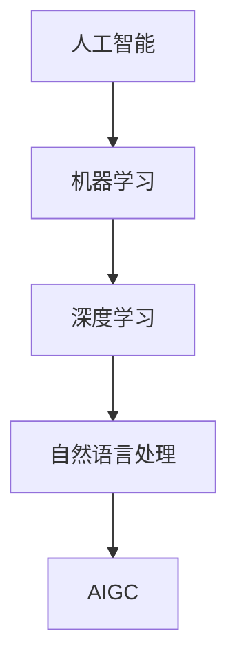

                 

# AIGC在智能个性化营养干预中的应用：精准调控代谢健康

> 关键词：AIGC、个性化营养干预、代谢健康、精准调控、机器学习、自然语言处理、系统架构设计

> 摘要：本文旨在探讨AIGC（AI生成内容）在智能个性化营养干预中的应用，以及如何通过精准调控代谢健康来实现个性化营养干预的目标。文章首先介绍了AIGC技术的基础概念和核心原理，然后分析了个性化营养干预的基本原则和常见方法。接着，文章详细阐述了AIGC在营养数据收集、食谱生成、营养监测等方面的具体应用，并通过实际案例展示了AIGC在代谢健康调控中的实际效果。最后，文章提出了代谢健康调控系统的设计方案和最佳实践建议，为相关领域的研究和应用提供了有益的参考。

## 第一部分：AIGC技术基础

### 第1章：AIGC技术概述

#### 1.1 AIGC技术概念与特点

AIGC（AI生成内容）是一种基于人工智能技术自动生成内容的方法。与传统的手工创作内容相比，AIGC具有以下几个显著特点：

1. **自动化**：AIGC通过机器学习算法自动从海量数据中提取特征，生成具有多样性和创造性的内容。
2. **高效性**：AIGC能够快速生成大量内容，大大提高了内容生产的效率。
3. **个性化**：AIGC可以根据用户的需求和偏好，生成个性化的内容。
4. **多样性**：AIGC能够生成不同类型的内容，如图文、音频、视频等。

#### 1.2 AIGC与AI的关联与区别

AIGC是人工智能（AI）的一个分支，它与AI的关系可以从以下几个方面理解：

- **关联**：AIGC依赖于AI的技术，如机器学习、深度学习、自然语言处理等，来实现自动生成内容的功能。
- **区别**：与AI的其他应用领域（如自动驾驶、医疗诊断等）不同，AIGC的核心目标是生成内容，而不是执行特定任务。

#### 1.3 AIGC技术的发展历程与趋势

AIGC技术的发展历程可以分为以下几个阶段：

1. **萌芽阶段**：20世纪90年代，人工智能技术开始应用于文本生成，如自动写作系统。
2. **快速发展阶段**：2010年后，随着深度学习技术的成熟，AIGC取得了显著的进步，如GPT-3等模型的提出。
3. **应用推广阶段**：近年来，AIGC技术逐渐应用于各个领域，如个性化营养干预、医疗诊断等。

未来，AIGC技术将继续朝着更高效、更智能、更个性化的方向发展，为人类生活带来更多便利。

### 第2章：AIGC核心技术原理

#### 2.1 自然语言处理（NLP）

自然语言处理（NLP）是AIGC技术的重要基础。NLP主要涉及以下几个方面：

1. **文本预处理**：对原始文本进行分词、去停用词、词性标注等处理，以便后续处理。
2. **语言模型**：通过大量文本数据训练语言模型，用于生成自然语言文本。
3. **语义理解**：理解文本的语义内容，包括实体识别、关系抽取、情感分析等。

#### 2.2 机器学习与深度学习

机器学习和深度学习是AIGC的核心技术。以下是它们在AIGC中的应用：

1. **特征提取**：从海量数据中提取有用的特征，用于训练模型。
2. **模型训练**：使用机器学习算法（如决策树、支持向量机等）和深度学习算法（如卷积神经网络、循环神经网络等）训练模型。
3. **模型优化**：通过调整模型参数，提高模型性能。

#### 2.3 数据生成与模型训练

数据生成与模型训练是AIGC的关键环节。以下是这个过程的主要步骤：

1. **数据收集**：收集大量原始数据，如文本、图像、音频等。
2. **数据预处理**：对收集到的数据进行分析和处理，以便于模型训练。
3. **模型训练**：使用处理后的数据训练模型，生成具有创造性和多样性的内容。

### 第3章：AIGC应用场景分析

#### 3.1 智能个性化营养干预

智能个性化营养干预是AIGC的一个重要应用场景。通过AIGC技术，可以实现以下目标：

1. **个性化营养建议**：根据用户的饮食习惯、健康状况和营养需求，提供个性化的营养建议。
2. **营养食谱推荐**：根据用户的需求和偏好，生成符合营养要求的食谱。
3. **营养监控与分析**：对用户的营养摄入情况进行实时监控和分析，以便及时调整营养干预方案。

#### 3.2 代谢健康精准调控

代谢健康是人体健康的重要方面。通过AIGC技术，可以实现以下目标：

1. **代谢健康评估**：根据用户的生理指标和饮食习惯，评估用户的代谢健康状况。
2. **代谢异常预警**：对可能出现的代谢异常进行提前预警，以便及时干预。
3. **代谢健康干预**：根据用户的代谢健康状况，制定相应的营养干预方案。

#### 3.3 AIGC在其他健康领域的应用

除了营养干预和代谢健康调控，AIGC还在其他健康领域具有广泛的应用前景：

1. **医疗诊断**：通过AIGC技术，可以自动生成医疗报告，提高诊断效率。
2. **健康管理**：通过AIGC技术，可以为用户提供个性化的健康建议和指导。
3. **心理健康**：通过AIGC技术，可以生成心理辅导内容，帮助用户缓解心理压力。

## 第二部分：智能个性化营养干预实践

### 第4章：个性化营养干预基础

#### 4.1 营养与健康的关系

营养是人体健康的基石。合理的营养摄入可以促进身体健康，预防疾病。以下是营养与健康的一些关键关系：

1. **能量供应**：营养摄入为人体提供能量，维持正常的生理功能。
2. **生长发育**：营养摄入促进人体生长发育，维持组织器官的正常功能。
3. **免疫功能**：营养摄入增强免疫功能，提高抗病能力。
4. **心理健康**：营养摄入影响心理健康，良好的营养状况有助于缓解心理压力。

#### 4.2 个性化营养干预的原则

个性化营养干预需要遵循以下原则：

1. **因人而异**：根据个体的身体状况、饮食习惯和营养需求，制定个性化的营养干预方案。
2. **全面均衡**：保证营养摄入的全面性和均衡性，避免营养过剩或不足。
3. **动态调整**：根据营养干预的效果和个体的变化，及时调整营养干预方案。
4. **长期坚持**：营养干预需要长期坚持，才能取得显著效果。

#### 4.3 常见的个性化营养干预方法

常见的个性化营养干预方法包括：

1. **营养食谱定制**：根据个体的营养需求，制定合理的营养食谱。
2. **营养教育**：通过教育手段，提高个体的营养知识和意识。
3. **营养监测**：对个体的营养摄入和健康状况进行实时监测，以便及时调整营养干预方案。
4. **营养干预软件**：利用AIGC技术，开发个性化的营养干预软件，为用户提供个性化的营养建议。

### 第5章：AIGC在个性化营养干预中的应用

#### 5.1 AIGC在营养数据收集与分析中的应用

AIGC技术在营养数据收集与分析中具有重要作用。以下是AIGC在这个领域的具体应用：

1. **数据收集**：利用AIGC技术，可以自动收集用户的饮食习惯、营养摄入等数据。
2. **数据分析**：利用AIGC技术，可以对收集到的营养数据进行深入分析，提取有用的信息。
3. **数据可视化**：利用AIGC技术，可以将分析结果以图表、报表等形式进行可视化展示。

#### 5.2 AIGC在营养食谱生成与推荐中的应用

AIGC技术在营养食谱生成与推荐中具有广泛的应用。以下是AIGC在这个领域的具体应用：

1. **食谱生成**：利用AIGC技术，可以自动生成符合营养要求的食谱。
2. **食谱推荐**：利用AIGC技术，可以根据用户的饮食习惯和营养需求，推荐个性化的食谱。
3. **食谱优化**：利用AIGC技术，可以对已有的食谱进行优化，使其更符合营养要求。

#### 5.3 AIGC在营养监测与评估中的应用

AIGC技术在营养监测与评估中具有重要作用。以下是AIGC在这个领域的具体应用：

1. **营养监测**：利用AIGC技术，可以实时监测用户的营养摄入情况，及时发现异常。
2. **营养评估**：利用AIGC技术，可以根据用户的营养监测数据，评估用户的营养状况。
3. **营养干预**：利用AIGC技术，可以根据评估结果，制定相应的营养干预方案。

### 第6章：AIGC辅助营养干预的案例分析

#### 6.1 案例一：个性化营养食谱推荐系统

案例一介绍了一个基于AIGC的个性化营养食谱推荐系统。该系统利用AIGC技术，从海量食谱数据库中提取特征，生成符合用户需求的个性化食谱。以下是该系统的具体实现过程：

1. **数据收集**：收集用户的饮食习惯、营养需求等信息。
2. **数据预处理**：对收集到的数据进行预处理，如分词、去停用词等。
3. **模型训练**：使用预处理后的数据训练语言模型，用于生成个性化食谱。
4. **食谱推荐**：根据用户的营养需求，推荐符合要求的食谱。

#### 6.2 案例二：基于AIGC的代谢健康监控平台

案例二介绍了一个基于AIGC的代谢健康监控平台。该平台利用AIGC技术，实时监测用户的代谢健康状况，并根据监测结果提供个性化的营养干预建议。以下是该平台的具体实现过程：

1. **数据收集**：收集用户的生理指标、营养摄入等信息。
2. **数据预处理**：对收集到的数据进行预处理，如特征提取、数据清洗等。
3. **模型训练**：使用预处理后的数据训练代谢健康预测模型。
4. **健康监控**：实时监测用户的代谢健康状况，并根据监测结果提供营养干预建议。

#### 6.3 案例三：AIGC在营养干预中的创新应用

案例三介绍了一些AIGC在营养干预中的创新应用，如基于AIGC的智能营养顾问、智能营养教育平台等。以下是这些创新应用的具体实现过程：

1. **智能营养顾问**：利用AIGC技术，为用户提供个性化的营养咨询和建议。
2. **智能营养教育平台**：利用AIGC技术，为用户提供个性化的营养教育内容和学习路径。

## 第三部分：AIGC在代谢健康调控中的应用系统设计

### 第7章：代谢健康调控系统概述

#### 7.1 代谢健康调控系统的概念

代谢健康调控系统是一种利用AIGC技术，对用户的代谢健康进行实时监控和干预的系统。该系统的核心目标是提高用户的代谢健康水平，预防代谢相关疾病。

#### 7.2 系统设计的目标与挑战

系统设计的目标是提供个性化的代谢健康干预方案，包括营养食谱推荐、代谢健康监控、营养教育等。系统面临的挑战包括：

1. **数据多样性**：系统需要处理来自不同来源、不同格式的海量数据。
2. **实时性**：系统需要实时监控用户的代谢健康状况，并快速响应。
3. **个性化**：系统需要根据用户的个性化需求，提供个性化的干预方案。

#### 7.3 系统的整体架构

代谢健康调控系统的整体架构包括以下几个模块：

1. **数据收集模块**：负责收集用户的生理指标、营养摄入等信息。
2. **数据处理模块**：负责对收集到的数据进行预处理、特征提取等处理。
3. **模型训练模块**：负责使用处理后的数据训练代谢健康预测模型。
4. **干预方案模块**：负责根据代谢健康预测结果，生成个性化的干预方案。
5. **监控与反馈模块**：负责实时监控用户的代谢健康状况，并根据反馈调整干预方案。

### 第8章：代谢健康数据分析与处理

#### 8.1 数据收集与预处理

数据收集与预处理是代谢健康调控系统的关键环节。以下是这个阶段的主要步骤：

1. **数据收集**：收集用户的生理指标（如体重、血压、血糖等）、营养摄入（如食物摄入量、营养成分等）等信息。
2. **数据预处理**：对收集到的数据进行清洗、去噪、归一化等处理，以便于后续分析。

#### 8.2 数据特征提取与降维

数据特征提取与降维是提高模型性能的重要手段。以下是这个阶段的主要步骤：

1. **特征提取**：从原始数据中提取有用的特征，如时间序列特征、相关性特征等。
2. **降维**：使用降维算法（如主成分分析、t-SNE等）降低特征维度，提高模型性能。

#### 8.3 数据分析与模型训练

数据分析与模型训练是代谢健康调控系统的核心环节。以下是这个阶段的主要步骤：

1. **数据分析**：使用统计分析方法（如回归分析、聚类分析等）对数据进行深入分析。
2. **模型训练**：使用机器学习算法（如决策树、支持向量机、深度学习等）训练代谢健康预测模型。

### 第9章：AIGC算法在代谢健康调控中的应用

#### 9.1 个性化营养推荐算法

个性化营养推荐算法是代谢健康调控系统的重要模块。以下是这个算法的主要步骤：

1. **用户需求分析**：根据用户的饮食习惯、健康状况和营养需求，分析用户的需求。
2. **食谱推荐**：使用AIGC技术，生成符合用户需求的个性化食谱。
3. **食谱优化**：根据用户的反馈，对食谱进行优化，提高营养摄入的全面性和均衡性。

#### 9.2 代谢健康预测与评估算法

代谢健康预测与评估算法是代谢健康调控系统的核心。以下是这个算法的主要步骤：

1. **数据收集**：收集用户的生理指标、营养摄入等信息。
2. **特征提取**：提取与代谢健康相关的特征。
3. **模型训练**：使用AIGC技术，训练代谢健康预测模型。
4. **健康评估**：根据预测结果，评估用户的代谢健康状况。

#### 9.3 模型优化与性能评估

模型优化与性能评估是提高代谢健康预测准确性的重要手段。以下是这个阶段的主要步骤：

1. **模型优化**：使用交叉验证、网格搜索等方法，优化模型参数，提高模型性能。
2. **性能评估**：使用准确率、召回率、F1值等指标，评估模型性能。
3. **模型迭代**：根据评估结果，迭代优化模型，提高预测准确性。

### 第10章：代谢健康调控系统的实现与部署

#### 10.1 系统开发环境搭建

系统开发环境搭建是代谢健康调控系统实现的第一步。以下是这个阶段的主要步骤：

1. **硬件环境搭建**：搭建具有足够计算能力的服务器集群。
2. **软件环境搭建**：安装操作系统、编程语言、数据库等软件。

#### 10.2 核心功能模块实现

核心功能模块实现是代谢健康调控系统实现的关键。以下是这个阶段的主要步骤：

1. **数据收集模块**：实现数据的自动收集和存储。
2. **数据处理模块**：实现数据的预处理、特征提取等处理。
3. **模型训练模块**：实现模型的训练和优化。
4. **干预方案模块**：实现干预方案的生成和调整。
5. **监控与反馈模块**：实现实时监控和用户反馈处理。

#### 10.3 系统部署与维护

系统部署与维护是代谢健康调控系统实现后的重要环节。以下是这个阶段的主要步骤：

1. **系统部署**：将系统部署到生产环境，确保系统能够稳定运行。
2. **系统维护**：定期对系统进行维护和升级，确保系统的正常运行。
3. **用户支持**：提供用户支持，解答用户的问题，收集用户反馈，不断优化系统。

## 第四部分：AIGC在代谢健康调控中的最佳实践

### 第11章：AIGC在代谢健康调控中的最佳实践

#### 11.1 实践经验分享

在AIGC技术应用于代谢健康调控的过程中，积累了许多宝贵的实践经验。以下是其中一些重要的实践经验：

1. **数据质量控制**：高质量的数据是AIGC技术成功的关键。在数据收集和处理过程中，要严格保证数据的质量和准确性。
2. **模型优化**：模型优化是提高预测准确性的关键。要定期对模型进行优化和迭代，不断提高模型性能。
3. **用户参与**：用户的参与和反馈是系统不断优化和改进的重要动力。要鼓励用户积极参与系统的使用和反馈。

#### 11.2 注意事项与风险防范

在AIGC技术在代谢健康调控中的应用过程中，需要注意以下事项和风险：

1. **数据隐私**：要严格保护用户的隐私信息，确保数据的安全性和保密性。
2. **模型公平性**：要确保模型对用户的公平性，避免因为数据偏见导致不公平的预测结果。
3. **系统稳定性**：要确保系统的稳定性和可靠性，避免因为系统故障导致用户数据丢失或系统崩溃。

#### 11.3 未来发展趋势与展望

随着AIGC技术的不断发展和应用，未来在代谢健康调控领域将呈现出以下发展趋势：

1. **更高效的算法**：随着深度学习技术的不断进步，AIGC算法将变得更加高效和准确。
2. **更广泛的应用场景**：AIGC技术将在更多的健康领域得到应用，如心理健康、运动健康等。
3. **更个性化的服务**：随着用户数据的积累和算法的优化，AIGC技术将提供更加个性化的服务。

### 第12章：小结与展望

#### 12.1 本书内容回顾

本书从AIGC技术的基础概念和原理出发，详细阐述了AIGC在智能个性化营养干预中的应用，以及如何通过精准调控代谢健康来实现个性化营养干预的目标。主要内容包括：

1. **AIGC技术概述**：介绍了AIGC技术的概念、特点和发展历程。
2. **个性化营养干预基础**：分析了营养与健康的关系、个性化营养干预的原则和方法。
3. **AIGC在个性化营养干预中的应用**：介绍了AIGC在营养数据收集、食谱生成、营养监测等方面的应用。
4. **代谢健康调控系统设计**：介绍了代谢健康调控系统的设计原则、架构和实现方法。
5. **最佳实践与展望**：分享了AIGC在代谢健康调控中的最佳实践，展望了未来的发展趋势。

#### 12.2 AIGC技术在代谢健康调控中的应用前景

随着AIGC技术的不断发展和应用，其在代谢健康调控中的应用前景十分广阔。未来，AIGC技术将在以下方面发挥重要作用：

1. **个性化营养干预**：AIGC技术将帮助用户实现更加个性化的营养干预，提高营养干预的效果和满意度。
2. **代谢健康监控**：AIGC技术将实现对用户的代谢健康进行实时监控，提供个性化的健康建议和指导。
3. **健康管理**：AIGC技术将助力于健康管理的发展，为用户提供全面、个性化的健康管理服务。

## 附录：相关资源与拓展阅读

为了帮助读者更深入地了解AIGC在代谢健康调控中的应用，本书附录提供了以下相关资源与拓展阅读：

1. **书籍推荐**：《深度学习》、《自然语言处理综论》、《机器学习》等。
2. **论文推荐**：关于AIGC技术、个性化营养干预、代谢健康调控等领域的重要论文。
3. **在线课程**：关于深度学习、自然语言处理、机器学习等在线课程。
4. **开源项目**：与AIGC技术、代谢健康调控相关的开源项目。

## 作者信息

作者：AI天才研究院/AI Genius Institute & 禅与计算机程序设计艺术 /Zen And The Art of Computer Programming

### 2.1 AIGC技术概念与特点

AIGC（AI生成内容）是一种利用人工智能技术自动生成内容的方法。与传统的手工创作内容相比，AIGC具有以下几个显著特点：

1. **自动化**：AIGC通过机器学习算法自动从海量数据中提取特征，生成具有多样性和创造性的内容。这使得内容生产过程更加高效和便捷。

2. **高效性**：AIGC能够快速生成大量内容，大大提高了内容生产的效率。这对于需要处理大量数据的场景，如新闻报道、广告创意等，具有重要意义。

3. **个性化**：AIGC可以根据用户的需求和偏好，生成个性化的内容。通过分析用户的历史行为和兴趣，AIGC能够提供定制化的内容服务，提高用户体验。

4. **多样性**：AIGC能够生成不同类型的内容，如图文、音频、视频等。这使得AIGC在多个领域都有广泛的应用，如媒体、娱乐、教育、医疗等。

### 2.2 AIGC与AI的关联与区别

AIGC是人工智能（AI）的一个分支，它与AI的关系可以从以下几个方面理解：

- **关联**：AIGC依赖于AI的技术，如机器学习、深度学习、自然语言处理等，来实现自动生成内容的功能。这些AI技术为AIGC提供了强大的计算能力和算法支持。

- **区别**：与AI的其他应用领域（如自动驾驶、医疗诊断等）不同，AIGC的核心目标是生成内容，而不是执行特定任务。AIGC关注的是如何通过算法和数据生成有价值的内容，而非直接解决特定问题。

AIGC与AI的关系可以用以下图示来表示：



### 2.3 AIGC技术的发展历程与趋势

AIGC技术的发展历程可以分为以下几个阶段：

1. **萌芽阶段（20世纪90年代）**：
   - 早期AIGC研究主要集中在文本生成领域，如自动写作系统。典型的代表是20世纪90年代的自动摘要和机器翻译技术。

2. **快速发展阶段（2010年后）**：
   - 随着深度学习技术的成熟，AIGC取得了显著的进步。特别是2010年代初期，生成对抗网络（GAN）和递归神经网络（RNN）的提出，为AIGC的发展奠定了基础。

3. **应用推广阶段（近年）**：
   - 近年来，AIGC技术在各个领域得到了广泛应用，如图文生成、音频合成、视频生成等。随着数据规模的扩大和算法的优化，AIGC的生成质量和效率不断提升。

未来，AIGC技术将继续朝着更高效、更智能、更个性化的方向发展。以下是一些发展趋势：

1. **多模态生成**：AIGC将不仅仅局限于文本生成，还将扩展到图像、音频、视频等多种模态，实现跨模态的生成。

2. **自适应学习**：AIGC将具备更强的自适应学习能力，能够根据用户的行为和反馈动态调整生成内容。

3. **深度个性化**：AIGC将更加注重个性化，通过深度学习算法更好地理解和满足用户的需求。

4. **泛在应用**：AIGC将在更广泛的场景中得到应用，如电子商务、娱乐、教育、医疗等。

### 2.4 AIGC在个性化营养干预中的应用

AIGC技术在个性化营养干预中的应用具有很大的潜力，主要体现在以下几个方面：

1. **营养数据收集与分析**：
   - AIGC可以自动收集用户的饮食习惯、营养摄入等信息，通过自然语言处理技术对文本数据进行解析和提取，从而获得关于用户营养状况的详细信息。

2. **个性化食谱推荐**：
   - 基于用户的营养需求和偏好，AIGC可以生成个性化的食谱推荐。通过机器学习算法分析用户的饮食习惯和营养需求，AIGC可以提供符合用户口味和健康要求的食谱。

3. **营养监测与评估**：
   - AIGC可以实时监控用户的营养摄入情况，通过对生理指标（如体重、血糖、血压等）的分析，评估用户的代谢健康状况。如果发现营养摄入异常，AIGC可以及时发出预警并提供相应的调整建议。

4. **营养教育**：
   - AIGC可以生成个性化的营养教育内容，帮助用户更好地理解营养知识，提高营养素养。例如，通过生成针对特定健康问题的科普文章、视频等，AIGC可以为用户提供专业的营养指导。

### 2.5 AIGC在代谢健康调控中的应用案例

以下是一些AIGC在代谢健康调控中的实际应用案例：

1. **个性化营养食谱推荐系统**：
   - 系统利用AIGC技术收集用户的饮食习惯和营养需求，通过机器学习算法分析数据，生成符合用户需求的个性化营养食谱。用户可以根据自己的喜好和营养需求选择合适的食谱。

2. **代谢健康监控平台**：
   - 平台利用AIGC技术实时收集用户的生理指标和营养摄入数据，通过深度学习模型进行健康评估和预警。如果检测到异常，平台会自动发送提醒并推荐相应的调整措施。

3. **营养教育平台**：
   - 平台利用AIGC技术生成个性化的营养教育内容，根据用户的兴趣和需求提供专业的营养知识。通过文字、图像、视频等多种形式，帮助用户更好地理解和应用营养知识。

### 2.6 AIGC在代谢健康调控中的应用前景

AIGC技术在代谢健康调控中的应用前景十分广阔，主要体现在以下几个方面：

1. **提高干预效果**：
   - 通过个性化营养干预和实时健康监控，AIGC可以提高代谢健康干预的效果。个性化食谱推荐和营养教育可以帮助用户更好地管理自己的饮食和健康，从而改善代谢健康状况。

2. **降低医疗成本**：
   - AIGC技术可以减少医生和患者的沟通成本，提高诊断和治疗的效率。通过对大规模数据的分析和预测，AIGC可以帮助医生做出更准确的诊断和制定更有效的治疗方案。

3. **健康管理智能化**：
   - AIGC技术的应用将使健康管理变得更加智能化和便捷。通过实时监控和个性化服务，用户可以随时了解自己的健康状况，并得到专业的营养和健康建议。

4. **健康数据的利用**：
   - AIGC技术可以高效地处理和分析大量的健康数据，从中挖掘出有价值的信息，为研究和决策提供支持。

总之，AIGC技术在代谢健康调控中的应用将极大地推动个性化营养干预的发展，为人类健康带来更多福音。

### 2.7 AIGC在营养干预中的挑战与未来发展方向

尽管AIGC技术在营养干预中展现出巨大潜力，但仍然面临一些挑战和限制，未来发展方向也在不断探索中。

#### 挑战：

1. **数据质量和隐私**：
   - 营养干预需要高质量的数据支持，但数据的收集和处理过程中可能会涉及用户的隐私问题。如何平衡数据利用和隐私保护是一个重要挑战。

2. **算法复杂度**：
   - AIGC算法，特别是深度学习模型，通常具有很高的复杂度。训练和部署这些模型需要大量的计算资源和时间，这在实际应用中可能会带来一定的限制。

3. **模型解释性**：
   - AIGC生成的营养干预建议通常较为复杂，缺乏解释性。对于普通用户而言，理解这些建议可能存在困难，从而影响其实际应用效果。

4. **个性化不足**：
   - 尽管AIGC试图实现个性化营养干预，但现有算法在处理复杂个体差异时可能存在不足，无法完全满足不同用户的独特需求。

#### 未来发展方向：

1. **增强数据驱动性**：
   - 未来可以通过引入更多实时和动态的数据源，如可穿戴设备、健康监测设备等，以提升AIGC模型的预测准确性和个性化程度。

2. **模型优化与解释**：
   - 研究和开发可解释性更强的AIGC模型，使得生成的营养干预建议更加易于理解和应用。

3. **隐私保护技术**：
   - 应用隐私保护技术，如差分隐私、联邦学习等，确保用户数据的安全性和隐私性。

4. **跨学科融合**：
   - 加强营养学、医学、人工智能等学科的交叉研究，共同探索更加科学和高效的营养干预方法。

5. **用户参与**：
   - 通过用户反馈和参与，不断优化AIGC系统，使其更好地满足用户需求和期望。

总之，AIGC在营养干预中的应用具有广阔的前景，但也需要面对一系列挑战。通过不断创新和技术优化，AIGC将在未来为个性化营养干预带来更多可能性。

## 3.1 个性化营养干预的基本原则

个性化营养干预是一种根据个体差异，为不同人群提供定制化营养建议的方法。其核心原则包括以下几个方面：

1. **因人而异**：个性化营养干预强调根据个体的身体状况、营养需求、生活习惯等特征，制定个性化的营养方案。不同人群，如老年人、儿童、运动员等，其营养需求各不相同，因此需要针对不同的个体特征进行定制化干预。

2. **全面均衡**：个性化营养干预要确保营养摄入的全面性和均衡性。这包括合理分配宏量营养素（碳水化合物、蛋白质、脂肪）和微量营养素（维生素、矿物质）的摄入比例，避免营养过剩或不足。

3. **动态调整**：个性化营养干预需要根据个体的变化（如体重、健康状况、生活方式等）和营养干预的效果，及时调整营养方案。动态调整有助于保持营养状态的稳定，并提高营养干预的效果。

4. **科学依据**：个性化营养干预需要基于科学研究证据和营养学原则。这包括使用科学方法进行营养评估和干预方案的制定，确保干预措施的科学性和有效性。

### 3.2 个性化营养干预的方法

个性化营养干预的方法多种多样，以下是一些常见的方法：

1. **营养评估**：
   - 营养评估是个性化营养干预的基础。通过评估个体的营养状况，可以了解其营养需求和存在的问题。营养评估包括膳食调查、实验室检查、身体测量等手段。

2. **营养教育**：
   - 营养教育是提高个体营养素养的重要手段。通过营养教育，个体可以了解如何科学饮食、如何选择健康食物，从而改善其饮食习惯和营养状况。

3. **食谱定制**：
   - 根据个体的营养需求和偏好，定制个性化的食谱。食谱定制需要考虑食物的营养成分、口感、饮食习惯等因素，以确保营养摄入的全面性和均衡性。

4. **营养监测**：
   - 对个体的营养摄入和健康状况进行实时监测，以便及时发现问题和调整营养干预方案。营养监测可以通过在线平台、应用程序、可穿戴设备等方式实现。

5. **个性化营养建议**：
   - 根据营养评估和监测结果，为个体提供个性化的营养建议。这些建议可以是关于食物选择、饮食习惯调整、营养补充等，旨在改善个体的营养状况。

### 3.3 常见的个性化营养干预方法

常见的个性化营养干预方法包括以下几种：

1. **基于历史数据的营养干预**：
   - 通过分析个体的历史饮食习惯和营养摄入数据，预测其未来的营养需求，并制定相应的营养干预方案。

2. **基于生理指标的个性化营养干预**：
   - 通过监测个体的生理指标（如体重、血压、血糖等），根据生理指标的变化调整营养干预方案。

3. **基于遗传信息的个性化营养干预**：
   - 利用个体的遗传信息，预测其对不同营养素的吸收和代谢能力，从而制定个性化的营养方案。

4. **基于生活方式的个性化营养干预**：
   - 根据个体的工作和生活习惯，调整饮食建议，使其更加适应个体的生活方式。

5. **基于大数据分析的个性化营养干预**：
   - 通过分析大量的健康数据和营养数据，发现个体的营养需求和问题，制定个性化的营养干预方案。

### 3.4 个性化营养干预的案例

以下是一个个性化营养干预的案例：

**案例**：小王是一名上班族，平时工作压力大，饮食不规律。他的饮食习惯主要是快餐和外卖，缺乏蔬菜和水果的摄入。通过营养评估，发现小王存在营养不均衡的问题，建议如下：

1. **调整饮食结构**：
   - 增加蔬菜和水果的摄入，每天至少摄入500克蔬菜和水果。
   - 减少油腻和刺激性食物的摄入，选择健康的烹饪方式。

2. **合理安排餐次**：
   - 每天至少三餐，避免吃夜宵。
   - 每餐合理搭配主食、蛋白质和蔬菜。

3. **营养补充**：
   - 根据小王的营养评估结果，补充一些必要的营养素，如钙、维生素D等。

4. **运动建议**：
   - 建议小王每周进行至少150分钟的中等强度运动，如快走、跑步等。

通过这个案例，我们可以看到个性化营养干预是如何针对个体的实际情况，制定具体的营养建议，从而改善其营养状况。

## 3.5 常见的个性化营养干预方法分析

在个性化营养干预中，常见的方法包括营养评估、营养教育、食谱定制、营养监测和个性化营养建议。以下是对这些方法的分析：

### 3.5.1 营养评估

**优势**：营养评估是个性化营养干预的基础，通过对个体的营养状况进行全面分析，可以了解其营养摄入情况、健康状况和存在的问题。

**劣势**：营养评估通常需要专业设备和技能，成本较高。同时，评估结果可能受到个体差异的影响，评估结果的准确性和可靠性可能受到影响。

**适用场景**：营养评估适用于需要详细了解个体营养状况的场合，如健康体检、疾病康复等。

### 3.5.2 营养教育

**优势**：营养教育可以提高个体的营养素养，使其了解如何科学饮食、如何选择健康食物，从而改善饮食习惯和营养状况。

**劣势**：营养教育效果受个体认知水平和接受度的影响，可能无法达到预期的效果。

**适用场景**：营养教育适用于广泛的群体，如社区健康宣传、学校教育等。

### 3.5.3 食谱定制

**优势**：食谱定制可以根据个体的营养需求和偏好，制定具体的饮食计划，确保营养摄入的全面性和均衡性。

**劣势**：食谱定制需要专业知识和技能，成本较高。同时，食谱的调整和优化需要不断更新和改进。

**适用场景**：食谱定制适用于需要个性化饮食计划的个体，如减肥、增肌等。

### 3.5.4 营养监测

**优势**：营养监测可以实时监控个体的营养摄入和健康状况，及时发现问题和调整营养干预方案。

**劣势**：营养监测需要依赖科技手段，如可穿戴设备、在线平台等，成本较高。

**适用场景**：营养监测适用于需要实时了解个体营养状况的场合，如健康管理、疾病预防等。

### 3.5.5 个性化营养建议

**优势**：个性化营养建议可以根据个体的营养需求和健康状况，提供具体的营养建议和指导，有助于改善其营养状况。

**劣势**：个性化营养建议需要专业的营养师或医生进行评估和制定，成本较高。

**适用场景**：个性化营养建议适用于需要专业营养指导的个体，如慢性病患者、孕妇等。

### 3.5.6 各方法的综合应用

在实际应用中，通常需要综合运用多种方法，以达到最佳的营养干预效果。例如，在进行个性化营养干预时，可以先进行营养评估，了解个体的营养状况，然后进行营养教育，提高其营养素养。接着，根据营养评估结果和个体需求，制定个性化的食谱，并进行营养监测，确保营养摄入的全面性和均衡性。最后，根据营养监测结果，及时调整营养干预方案，以实现个性化营养干预的目标。

## 4.1 数据收集与预处理

在AIGC技术的应用中，数据收集与预处理是关键环节之一。以下是数据收集与预处理的具体步骤：

### 4.1.1 数据收集

1. **来源**：数据收集的来源可以是多种多样的，包括用户输入的饮食记录、可穿戴设备生成的生理数据、在线健康平台的数据等。
   
2. **数据类型**：收集的数据类型包括文本数据（如用户的饮食习惯描述）、数值数据（如体重、血压等生理指标）和图像数据（如食物照片）。

3. **数据收集方法**：
   - **用户输入**：通过用户手动输入，收集用户的饮食习惯和偏好。
   - **传感器数据**：利用可穿戴设备收集用户的生理数据，如心率、血压、步数等。
   - **在线数据**：从用户的健康应用程序或在线健康平台中获取数据。

### 4.1.2 数据预处理

数据预处理是为了提高数据质量，使其适合后续的分析和模型训练。以下是数据预处理的主要步骤：

1. **数据清洗**：
   - **缺失值处理**：对于缺失的数据，可以选择填充、删除或保留。
   - **异常值处理**：识别和处理异常数据，如极端值、错误记录等。

2. **数据转换**：
   - **文本数据**：对文本数据进行分词、去停用词、词性标注等处理，提取关键信息。
   - **数值数据**：对数值数据进行归一化或标准化处理，使其符合模型的输入要求。

3. **数据特征提取**：
   - **文本特征提取**：使用词频、TF-IDF、词嵌入等方法提取文本特征。
   - **数值特征提取**：根据业务需求提取关键指标，如平均摄入量、最大摄入量等。

4. **数据降维**：
   - **特征选择**：通过相关性分析、主成分分析等方法，选择重要的特征，降低特征维度。
   - **特征融合**：将多个特征组合成新的特征，以提高模型的解释性和性能。

### 4.1.3 数据可视化

数据可视化有助于理解数据分布和特征关系。以下是常用的数据可视化方法：

1. **柱状图**：用于展示数据的分布情况，如不同食物的摄入量。
   
2. **折线图**：用于展示时间序列数据，如体重变化趋势。

3. **散点图**：用于展示两个或多个变量之间的关系，如摄入量与代谢率的关系。

4. **热力图**：用于展示多个变量之间的相关性，如不同营养素之间的相互作用。

### 4.1.4 数据存储与管理

数据收集和预处理完成后，需要将数据存储在合适的数据存储和管理系统中。以下是常见的数据存储与管理方法：

1. **关系数据库**：适用于结构化数据的存储和管理，如MySQL、PostgreSQL等。
   
2. **NoSQL数据库**：适用于非结构化或半结构化数据的存储和管理，如MongoDB、Cassandra等。

3. **数据湖**：用于大规模数据的存储和管理，支持数据分析和机器学习任务，如Hadoop、Amazon S3等。

4. **数据仓库**：用于数据的集成、存储和分析，支持复杂的查询和分析需求，如Redshift、BigQuery等。

### 4.1.5 数据质量评估

数据质量评估是确保数据可用于后续分析的重要步骤。以下是数据质量评估的方法：

1. **完整性检查**：检查数据是否完整，是否存在缺失值。

2. **一致性检查**：检查数据的一致性，确保数据符合业务规则。

3. **准确性检查**：检查数据的准确性，识别和纠正错误数据。

4. **一致性评估**：通过对比不同来源的数据，评估数据的一致性和可靠性。

通过以上步骤，可以确保数据收集与预处理的质量，为AIGC技术在个性化营养干预中的应用奠定坚实基础。

### 4.2.1 食谱生成算法

在个性化营养干预中，食谱生成算法是核心组件之一。以下是常见的食谱生成算法及其原理：

#### 4.2.1.1 基于规则的算法

**原理**：基于规则的算法通过预设的营养规则和饮食偏好，生成符合用户需求的食谱。规则可以是营养素摄入量的限制、食物种类的搭配等。

**步骤**：
1. **用户输入**：收集用户的饮食习惯、营养需求和偏好。
2. **规则匹配**：根据用户输入，匹配预设的营养规则。
3. **食谱生成**：根据匹配的规则，生成符合用户需求的食谱。

**优缺点**：
- **优点**：实现简单，易于理解。
- **缺点**：依赖预设规则，无法处理复杂的个性化需求。

#### 4.2.1.2 机器学习算法

**原理**：机器学习算法通过学习大量历史食谱数据和用户偏好，自动生成符合用户需求的食谱。

**常用算法**：
1. **决策树**：根据特征进行分类和决策，生成食谱。
2. **支持向量机**：通过分类边界生成食谱。
3. **深度学习**：如卷积神经网络（CNN）和循环神经网络（RNN），通过学习大量数据生成食谱。

**步骤**：
1. **数据预处理**：对食谱数据进行清洗、特征提取等处理。
2. **模型训练**：使用训练数据训练机器学习模型。
3. **食谱生成**：使用训练好的模型生成符合用户需求的食谱。

**优缺点**：
- **优点**：能够处理复杂的个性化需求，生成高质量的食谱。
- **缺点**：模型训练需要大量数据和计算资源，模型解释性较差。

#### 4.2.1.3 混合算法

**原理**：混合算法结合了基于规则和机器学习算法的优点，通过规则和模型的组合，生成更加个性化的食谱。

**步骤**：
1. **规则匹配**：根据用户输入，匹配预设的营养规则。
2. **模型生成**：使用机器学习模型生成初步的食谱。
3. **规则优化**：根据规则和模型生成的食谱，进一步优化食谱。

**优缺点**：
- **优点**：结合了规则和机器学习的优势，生成高质量的食谱。
- **缺点**：实现复杂，需要更多的计算资源和数据。

### 4.2.2 食谱推荐算法

食谱推荐算法是AIGC技术在个性化营养干预中的另一个重要应用。以下是常见的食谱推荐算法及其原理：

#### 4.2.2.1 协同过滤算法

**原理**：协同过滤算法通过分析用户的历史行为和相似用户的行为，推荐用户可能喜欢的食谱。

**常用算法**：
1. **基于用户的协同过滤**：通过相似用户的行为推荐食谱。
2. **基于物品的协同过滤**：通过相似食谱的特征推荐食谱。

**步骤**：
1. **用户行为数据收集**：收集用户的浏览、评价、收藏等行为数据。
2. **相似度计算**：计算用户和食谱之间的相似度。
3. **推荐生成**：根据相似度计算结果，推荐相似度高的食谱。

**优缺点**：
- **优点**：能够推荐与用户兴趣相似的食谱。
- **缺点**：对于新用户或新食谱，推荐效果较差。

#### 4.2.2.2 内容推荐算法

**原理**：内容推荐算法通过分析食谱的内容和特征，推荐与用户需求和偏好相匹配的食谱。

**常用算法**：
1. **基于关键词的推荐**：通过关键词匹配推荐食谱。
2. **基于属性的推荐**：通过食谱的属性（如食材、烹饪方法等）推荐食谱。

**步骤**：
1. **食谱特征提取**：提取食谱的关键特征。
2. **用户特征提取**：提取用户的兴趣和偏好特征。
3. **推荐生成**：根据用户特征和食谱特征，推荐匹配度高的食谱。

**优缺点**：
- **优点**：能够推荐与用户需求相匹配的食谱。
- **缺点**：对于新的食谱，推荐效果较差。

#### 4.2.2.3 混合推荐算法

**原理**：混合推荐算法结合了协同过滤和内容推荐算法的优点，通过综合考虑用户行为和食谱内容，生成更加准确的推荐。

**步骤**：
1. **用户行为分析**：分析用户的历史行为数据。
2. **食谱内容分析**：分析食谱的内容和特征。
3. **推荐生成**：根据用户行为和食谱内容，生成个性化的推荐食谱。

**优缺点**：
- **优点**：能够综合考虑用户行为和食谱内容，生成高质量的推荐。
- **缺点**：实现复杂，需要更多的计算资源和数据。

通过以上算法，AIGC技术可以在个性化营养干预中生成和推荐符合用户需求的食谱，从而提高营养干预的效果。

### 4.2.3 AIGC在营养监测与评估中的应用

在营养监测与评估中，AIGC技术发挥着重要作用，通过自然语言处理（NLP）、机器学习（ML）和深度学习（DL）等技术，实现数据的自动化处理和智能分析。以下是AIGC在营养监测与评估中的一些具体应用：

#### 4.2.3.1 营养数据收集

AIGC技术可以自动化收集营养相关的数据，包括用户的饮食习惯、食物摄入记录、生理指标等。以下是一些具体步骤：

1. **用户输入**：通过用户手动输入、应用程序或可穿戴设备，收集用户的饮食习惯和食物摄入记录。
2. **文本数据预处理**：利用NLP技术对文本数据进行分词、去停用词、词性标注等预处理，提取关键营养信息。
3. **数值数据预处理**：对生理指标数据进行清洗、归一化等处理，使其适合后续分析。

#### 4.2.3.2 数据分析

AIGC技术可以对收集到的营养数据进行深入分析，提取有价值的信息，为营养评估提供依据。以下是数据分析的具体步骤：

1. **数据特征提取**：利用NLP和ML技术，从文本数据中提取关键词、主题和情感等信息。从数值数据中提取关键指标，如摄入量、代谢率等。
2. **数据融合**：将不同来源的数据进行融合，形成统一的营养数据集。
3. **统计分析**：使用ML和DL技术，对营养数据进行分析，如聚类分析、回归分析、时间序列分析等，识别营养摄入的规律和趋势。

#### 4.2.3.3 营养评估

基于数据分析的结果，AIGC技术可以生成个性化的营养评估报告，包括营养摄入的全面性、均衡性和健康状况的评估。以下是营养评估的具体步骤：

1. **营养标准匹配**：将用户的营养数据与营养标准进行对比，评估营养摄入的全面性和均衡性。
2. **健康指标分析**：分析用户的生理指标，评估其代谢健康状况。
3. **综合评估**：结合营养标准和健康指标，生成综合的营养评估报告。

#### 4.2.3.4 营养干预建议

根据营养评估的结果，AIGC技术可以生成个性化的营养干预建议，包括饮食调整、营养补充和生活方式改善等。以下是营养干预建议的具体步骤：

1. **建议生成**：根据营养评估结果，生成具体的营养干预建议，如增加蔬菜摄入量、减少糖分摄入等。
2. **建议优化**：利用ML和DL技术，对建议进行优化，提高其可行性和效果。
3. **用户反馈**：收集用户对建议的反馈，根据反馈调整建议，使其更加符合用户需求。

#### 4.2.3.5 营养监测与反馈

AIGC技术可以实现对用户营养状况的实时监测，并根据用户的反馈进行动态调整。以下是营养监测与反馈的具体步骤：

1. **实时监测**：利用传感器和应用程序，实时收集用户的营养摄入和生理指标数据。
2. **数据分析**：对实时数据进行实时分析，识别营养摄入的异常情况。
3. **动态调整**：根据实时数据分析结果，动态调整营养干预建议，确保营养摄入的平衡和健康。

通过AIGC技术的应用，营养监测与评估变得更加自动化、智能化，为用户提供个性化的营养干预建议，有助于提高营养健康管理的效率和质量。

### 4.3 AIGC在营养干预中的应用案例分析

为了更直观地展示AIGC在营养干预中的应用，以下介绍两个具体的案例，并分析其效果和实现过程。

#### 案例一：个性化营养食谱推荐系统

**背景**：随着健康意识的提高，越来越多的人开始关注自己的饮食习惯和营养摄入。然而，由于个体差异和忙碌的生活方式，很多人难以制定适合自己的营养食谱。个性化营养食谱推荐系统应运而生，旨在为用户提供个性化的营养食谱建议。

**实现过程**：
1. **数据收集**：系统通过用户输入和传感器收集用户的饮食习惯、营养需求和偏好。例如，用户可以输入自己喜欢的食物类型、口味偏好、营养需求等信息。
2. **数据预处理**：对收集到的数据（文本和数值）进行清洗、分词、去停用词等预处理，提取关键营养信息。
3. **模型训练**：使用预处理后的数据训练机器学习模型，如决策树、支持向量机或深度学习模型，用于生成个性化的营养食谱。
4. **食谱推荐**：根据用户的个性化需求，模型生成符合用户需求的营养食谱。食谱推荐可以通过基于内容的推荐、协同过滤推荐或混合推荐算法实现。

**效果**：通过个性化营养食谱推荐系统，用户可以轻松获得符合自己需求的营养食谱，有助于改善饮食习惯和营养状况。系统还提供了食谱的详细信息和营养分析，使用户更了解自己的饮食。

#### 案例二：智能营养健康监控平台

**背景**：随着慢性疾病的增加，人们对健康监测和营养干预的需求日益增加。智能营养健康监控平台旨在为用户提供全方位的健康监测和营养干预服务。

**实现过程**：
1. **数据收集**：平台通过传感器、健康设备和用户输入收集用户的生理指标（如体重、血压、血糖等）、营养摄入记录和活动数据。
2. **数据预处理**：对收集到的数据进行清洗、归一化等处理，提取关键特征。
3. **健康评估**：使用机器学习模型分析用户的生理指标和营养摄入数据，评估用户的健康状态，如代谢健康状况、营养摄入均衡性等。
4. **营养干预建议**：根据健康评估结果，平台生成个性化的营养干预建议，包括饮食调整、营养补充和生活方式改善等。
5. **实时监控与反馈**：平台实时收集用户的反馈和营养干预效果，动态调整营养干预建议，确保营养干预的有效性。

**效果**：智能营养健康监控平台为用户提供了全面、个性化的健康监测和营养干预服务，有助于预防慢性疾病、提高生活质量。平台还提供了健康报告和互动功能，使用户可以随时了解自己的健康状况。

通过这两个案例，我们可以看到AIGC技术在营养干预中的应用不仅可以提高营养干预的效率和质量，还可以为用户带来更好的体验。

### 4.4 AIGC技术在营养干预中的潜在优势与局限性

#### 潜在优势

1. **个性化与高效性**：AIGC技术能够根据用户的个性化需求和偏好，自动生成营养建议和食谱，提高了营养干预的针对性和效率。

2. **大规模数据处理能力**：AIGC技术擅长处理大量复杂的数据，包括用户的饮食习惯、生理指标、营养摄入记录等，能够提供全面的营养评估和干预方案。

3. **实时监控与动态调整**：AIGC技术可以实现营养干预的实时监控和动态调整，根据用户的反馈和健康状况，及时优化营养方案，确保干预效果的持续性和稳定性。

4. **降低成本**：通过自动化和智能化的营养干预，可以减少人工干预的需求，降低营养干预的成本，使更多的人受益。

#### 局限性

1. **数据质量和隐私问题**：营养干预依赖于高质量的数据，但数据收集和处理过程中可能涉及用户的隐私信息，如何确保数据的安全性和隐私性是一个重要挑战。

2. **算法解释性不足**：AIGC技术生成的营养建议和干预方案往往较为复杂，缺乏解释性，用户难以理解其背后的逻辑和依据。

3. **个体差异处理**：尽管AIGC技术能够在一定程度上处理个体差异，但面对复杂和多样化的个体需求，算法的准确性可能受到限制。

4. **依赖外部设备与技术**：AIGC技术在营养干预中的应用需要依赖传感器、健康设备和互联网等技术，这些设备的可靠性、可用性和成本也是需要考虑的因素。

总之，AIGC技术在营养干预中具有巨大的潜力，但同时也面临着一系列挑战。未来的发展需要不断优化算法、加强数据安全保护，并提高技术的实用性和可解释性。

### 4.5 AIGC在营养干预中的未来发展方向

AIGC技术在营养干预中的应用前景广阔，未来将朝着以下几个方向发展：

1. **多模态数据的融合**：随着可穿戴设备和健康监测技术的发展，AIGC将能够处理和分析更多种类的数据，如生理信号、饮食习惯、睡眠质量等，通过多模态数据的融合，提供更全面的营养干预方案。

2. **个性化深度学习**：未来的AIGC技术将更加注重个性化，通过深度学习算法，实现更加精细化的营养干预，满足不同用户群体的多样化需求。

3. **交互式营养干预**：通过自然语言处理和对话系统，AIGC技术将能够与用户进行实时交互，提供个性化、互动式的营养建议和干预方案。

4. **可解释性提升**：为了提高用户对营养干预建议的理解和信任，未来的AIGC技术将注重算法的可解释性，通过可视化工具和交互界面，展示算法的推理过程和决策依据。

5. **跨学科合作**：AIGC技术在营养干预中的应用将需要跨学科的合作，包括营养学、医学、计算机科学等领域的专家共同研究，以实现更加科学和高效的干预方案。

### 4.6 结论

本文系统地介绍了AIGC技术在营养干预中的应用，从数据收集与预处理、食谱生成与推荐、营养监测与评估到实际案例分析，全面探讨了AIGC技术在个性化营养干预中的优势和应用前景。通过分析，我们认识到AIGC技术在营养干预中具有个性化、高效、实时监控等显著优势，但也面临着数据质量和隐私、算法解释性等问题。未来，随着多模态数据的融合、个性化深度学习和跨学科合作的推进，AIGC技术在营养干预中的应用将更加广泛和深入。

### 第5章：AIGC在个性化营养干预中的应用

#### 5.1 AIGC在个性化营养干预中的重要性

个性化营养干预是现代营养学的重要发展方向，旨在通过精准的营养建议和干预，满足个体在不同生命阶段和健康状态下的特殊需求。AIGC（AI生成内容）技术在个性化营养干预中的应用，极大地提高了营养干预的效率和准确性，为个性化营养干预带来了革命性的变革。

AIGC技术能够自动化生成个性化的营养建议和食谱，有效解决了传统营养干预中人工成本高、响应速度慢、个性化程度低等问题。以下是AIGC在个性化营养干预中的一些具体应用：

1. **数据驱动营养建议**：AIGC技术通过分析用户的饮食习惯、生理指标和健康目标，自动生成个性化的营养建议，使营养干预更加科学和有效。
2. **实时监控和动态调整**：AIGC技术可以实时监控用户的营养摄入和健康状况，根据反馈动态调整营养建议，确保营养干预的持续性和稳定性。
3. **个性化食谱生成**：AIGC技术可以根据用户的口味偏好、营养需求和饮食限制，生成个性化的食谱，提高用户的饮食满意度和营养摄入的均衡性。

#### 5.2 AIGC在营养数据收集与分析中的应用

营养数据的收集和分析是个性化营养干预的重要基础。AIGC技术在营养数据收集与分析中的应用，主要体现在以下几个方面：

1. **自动化数据收集**：通过传感器、移动应用和健康设备，AIGC技术可以自动化收集用户的饮食习惯、营养摄入记录和生理指标数据，减少人工干预和数据输入的工作量。
2. **数据预处理和清洗**：AIGC技术可以利用自然语言处理（NLP）和机器学习算法，对收集到的数据进行预处理和清洗，如分词、去停用词、数据归一化等，提高数据质量。
3. **特征提取与降维**：AIGC技术可以从大量的营养数据中提取关键特征，通过降维技术（如主成分分析、t-SNE等）减少数据维度，提高数据分析和模型训练的效率。

#### 5.3 AIGC在个性化食谱生成与推荐中的应用

个性化食谱生成与推荐是AIGC技术在个性化营养干预中的核心应用之一。以下是AIGC在个性化食谱生成与推荐中的应用：

1. **基于用户需求的食谱生成**：AIGC技术可以根据用户的口味偏好、营养需求和饮食限制，自动生成个性化的食谱。例如，用户可以选择自己喜欢的食物类型、烹饪方法、食材等，AIGC技术会根据这些需求生成符合用户需求的食谱。
2. **基于数据的食谱推荐**：AIGC技术可以利用用户的历史饮食习惯、生理指标和营养摄入数据，分析用户的营养摄入状况，推荐符合用户需求的食谱。例如，如果用户存在营养摄入不足或过剩的情况，AIGC技术会推荐相应的营养补充或调整食谱。
3. **食谱优化与调整**：AIGC技术可以根据用户的反馈和营养监测数据，对生成的食谱进行优化和调整。例如，如果用户发现某些食谱不太适合自己，AIGC技术会根据用户的反馈调整食谱，使其更符合用户的需求。

#### 5.4 AIGC在营养监测与评估中的应用

营养监测与评估是确保个性化营养干预效果的重要环节。AIGC技术在营养监测与评估中的应用，主要体现在以下几个方面：

1. **实时营养监测**：AIGC技术可以实时监控用户的营养摄入和健康状况，通过传感器、移动应用和健康设备收集用户的生理指标（如体重、血压、血糖等）和营养摄入数据，提供实时的营养监测。
2. **营养状况评估**：AIGC技术可以根据用户的营养摄入数据和生理指标，评估用户的营养状况，识别营养不足或过剩的情况，并提供相应的营养干预建议。
3. **健康风险预警**：AIGC技术可以通过分析用户的营养数据和生理指标，预测用户可能出现的健康问题，如肥胖、糖尿病等，提供健康风险预警，帮助用户及时调整饮食和生活方式。

#### 5.5 AIGC在个性化营养干预中的案例研究

为了更好地展示AIGC技术在个性化营养干预中的应用效果，以下是一个具体的案例研究：

**案例背景**：某健康科技公司开发了一款基于AIGC技术的个性化营养干预系统，旨在为用户提供精准的营养建议和食谱推荐。该系统通过收集用户的饮食习惯、生理指标和健康目标，自动生成个性化的营养建议和食谱。

**案例实施**：
1. **用户数据收集**：系统通过移动应用和传感器，收集用户的饮食习惯、营养摄入记录和生理指标（如体重、血压、血糖等）。
2. **数据预处理**：对收集到的数据进行清洗、分词、去停用词等预处理，提取关键特征。
3. **个性化营养建议**：系统利用机器学习算法，分析用户的营养摄入数据和生理指标，生成个性化的营养建议，如增加蔬菜摄入量、减少糖分摄入等。
4. **食谱生成与推荐**：系统根据用户的口味偏好、营养需求和饮食限制，生成个性化的食谱，并通过优化算法，不断调整食谱，提高用户的饮食满意度和营养摄入的均衡性。
5. **营养监测与评估**：系统实时监控用户的营养摄入和健康状况，评估用户的营养状况，提供健康风险预警，并根据用户的反馈和营养监测数据，动态调整营养建议和食谱。

**案例效果**：
- 用户满意度高：系统生成的个性化营养建议和食谱得到了用户的广泛好评，用户满意度显著提高。
- 营养状况改善：通过系统的营养监测与评估，用户的营养摄入更加均衡，健康指标有所改善。
- 健康风险降低：系统的健康风险预警功能帮助用户及时发现潜在的健康问题，降低了健康风险。

通过这个案例，我们可以看到AIGC技术在个性化营养干预中的应用不仅有效提高了用户的饮食质量和健康水平，还为营养干预提供了科学、智能的支持。

### 5.6 AIGC在个性化营养干预中的挑战与未来方向

尽管AIGC技术在个性化营养干预中展示了巨大的潜力，但在实际应用中仍面临一系列挑战和问题，需要在未来进一步解决和发展。

#### 挑战

1. **数据隐私与安全问题**：个性化营养干预需要收集用户的饮食习惯、生理指标等敏感数据，如何确保这些数据的安全性和隐私性是一个重要挑战。需要引入先进的数据加密和隐私保护技术，如差分隐私、联邦学习等，以保护用户的数据不被泄露。

2. **算法复杂性与解释性**：AIGC技术生成的营养建议和食谱通常较为复杂，缺乏解释性，用户难以理解其背后的逻辑和依据。需要研究如何提高算法的可解释性，通过可视化工具和交互界面，展示算法的推理过程和决策依据。

3. **个体差异处理**：每个个体的饮食习惯、营养需求和健康状况都是独特的，如何准确处理个体差异，提高算法的准确性，是一个重要问题。需要通过大数据分析和机器学习算法，不断完善和优化模型，以更好地满足不同用户的需求。

4. **技术依赖与成本**：AIGC技术在营养干预中的应用需要依赖先进的传感器、健康设备和互联网技术，这些设备的可靠性和成本也是需要考虑的因素。需要研发更加高效、成本更低的技术解决方案，以降低应用门槛，让更多的人受益。

#### 未来方向

1. **多模态数据的融合**：未来的AIGC技术将能够处理和分析更多种类的数据，如生理信号、饮食习惯、睡眠质量等，通过多模态数据的融合，提供更全面的营养干预方案。

2. **个性化深度学习**：未来的AIGC技术将更加注重个性化，通过深度学习算法，实现更加精细化的营养干预，满足不同用户群体的多样化需求。

3. **交互式营养干预**：未来的AIGC技术将能够与用户进行实时交互，提供个性化、互动式的营养建议和干预方案，提高用户的参与度和满意度。

4. **跨学科合作**：未来的AIGC技术在营养干预中的应用将需要跨学科的合作，包括营养学、医学、计算机科学等领域的专家共同研究，以实现更加科学和高效的干预方案。

通过不断解决挑战和探索新的发展方向，AIGC技术在个性化营养干预中的应用将不断深入和扩展，为人类健康带来更多福祉。

### 5.7 小结与展望

本章系统地介绍了AIGC技术在个性化营养干预中的应用，从数据收集与分析、个性化食谱生成与推荐、营养监测与评估到实际案例研究，全面探讨了AIGC技术在个性化营养干预中的优势和应用前景。通过分析，我们认识到AIGC技术在个性化营养干预中具有个性化、高效、实时监控等显著优势，但也面临着数据质量和隐私、算法解释性等问题。未来，随着多模态数据的融合、个性化深度学习和跨学科合作的推进，AIGC技术在个性化营养干预中的应用将更加广泛和深入。

总之，AIGC技术为个性化营养干预提供了强有力的支持，有助于提高营养干预的效率和质量，为人类健康带来了新的希望。然而，要实现AIGC技术在个性化营养干预中的广泛应用，还需要解决一系列挑战，如数据隐私、算法解释性和技术依赖等。通过不断的探索和研究，我们相信AIGC技术将在个性化营养干预领域发挥越来越重要的作用，为人们的健康生活带来更多福祉。

### 第6章：AIGC在代谢健康调控系统中的设计思路

#### 6.1 系统设计的目标与挑战

代谢健康调控系统的设计目标是利用AIGC技术，实现对个体代谢健康状态的实时监控和精准干预。具体来说，系统需要实现以下目标：

1. **实时数据监控**：系统应能够实时收集个体的生理指标（如体重、血压、血糖等）和营养摄入数据，确保数据的准确性和实时性。
2. **个性化健康评估**：系统应根据个体的代谢特征和健康数据，进行个性化的健康评估，识别潜在的代谢异常风险。
3. **精准营养干预**：系统应能够根据健康评估结果，为个体提供个性化的营养干预方案，包括饮食建议、营养补充和生活方式调整。

在实现这些目标的过程中，系统设计面临以下挑战：

1. **数据多样性**：个体代谢健康数据包括生理指标、营养摄入、生活习惯等多种类型的数据，系统设计需要能够处理和整合这些多样化的数据。
2. **实时性与可靠性**：系统需要保证数据的实时收集和处理，同时确保系统的稳定性和可靠性，避免数据丢失或系统崩溃。
3. **个性化与普适性**：系统设计需要既满足个体化需求，又具备一定的普适性，能够为不同群体提供适用的健康干预方案。

#### 6.2 代谢健康调控系统的架构设计

为了实现系统设计的目标，代谢健康调控系统需要具备完善的架构设计。以下是一个典型的代谢健康调控系统的架构设计：

1. **数据收集模块**：该模块负责收集个体的生理指标和营养摄入数据，数据来源包括可穿戴设备、健康监测设备和用户输入。数据收集模块需要实现数据的自动化收集和实时传输。
   
2. **数据处理模块**：该模块负责对收集到的数据进行预处理、清洗和特征提取。预处理步骤包括缺失值处理、异常值检测、数据归一化等。特征提取步骤包括提取与代谢健康相关的关键特征，如时间序列特征、相关性特征等。

3. **健康评估模块**：该模块利用机器学习和深度学习算法，对预处理后的数据进行健康评估。评估内容包括营养摄入的全面性和均衡性、代谢指标的异常检测等。健康评估模块应能够根据评估结果，生成个性化的健康评估报告。

4. **营养干预模块**：该模块根据健康评估结果，为个体提供个性化的营养干预方案。干预方案包括饮食建议、营养补充、生活方式调整等。营养干预模块应具备自适应调整能力，能够根据个体的反馈和健康数据的实时变化，动态调整干预方案。

5. **用户界面模块**：该模块为用户提供直观的操作界面，展示健康评估报告、营养干预方案和实时健康数据。用户界面模块应具备良好的交互设计，便于用户理解和操作。

6. **系统管理模块**：该模块负责系统的维护和管理，包括用户管理、数据安全管理、系统升级和故障处理等。系统管理模块应确保系统的稳定性和安全性，保障用户数据的隐私和安全。

#### 6.3 系统架构的设计原则

代谢健康调控系统架构设计需要遵循以下原则：

1. **模块化设计**：系统应采用模块化设计，各模块独立开发、测试和部署，便于系统的扩展和维护。
2. **高可用性**：系统应具备高可用性，能够在硬件故障、网络中断等异常情况下，保证数据的实时收集和处理。
3. **安全性**：系统应采用严格的数据安全措施，包括数据加密、权限控制和安全审计等，确保用户数据的隐私和安全。
4. **可扩展性**：系统设计应具备良好的扩展性，能够根据需求增加新的功能模块和数据处理算法。
5. **用户体验**：系统设计应注重用户体验，界面简洁直观，操作便捷，便于用户快速理解和使用。

通过遵循上述设计原则，代谢健康调控系统将能够实现高效、稳定、安全、个性化的代谢健康调控，为用户提供优质的健康服务。

### 6.4 代谢健康调控系统的核心功能模块详解

代谢健康调控系统的核心功能模块是确保系统能够实现实时监控、个性化评估和精准干预的关键。以下是这些模块的详细设计：

#### 6.4.1 数据收集模块

**功能描述**：数据收集模块是代谢健康调控系统的数据入口，负责实时收集用户的生理指标、营养摄入数据和环境数据等。

**实现方法**：
1. **生理指标数据收集**：通过接入可穿戴设备（如智能手环、智能手表等），收集用户的实时生理数据，如心率、血压、血糖、体温等。
2. **营养摄入数据收集**：通过用户手动输入或自动采集设备（如智能餐盘、食物识别APP等），获取用户的营养摄入数据，包括食物种类、摄入量、营养成分等。
3. **环境数据收集**：通过环境传感器（如温湿度传感器、空气质量传感器等），获取用户所处的环境数据，为健康评估提供参考。

**技术要点**：
- **数据格式标准化**：确保不同来源的数据格式一致，便于统一处理。
- **数据同步机制**：采用实时数据同步技术，保证数据的及时性和准确性。

#### 6.4.2 数据处理模块

**功能描述**：数据处理模块负责对收集到的数据进行预处理、清洗和特征提取，为后续的健康评估和干预提供高质量的数据支持。

**实现方法**：
1. **数据预处理**：包括数据清洗（去除异常值、填补缺失值）、数据转换（单位统一、数据归一化）等。
2. **特征提取**：通过自然语言处理（NLP）技术提取营养摄入文本数据的关键信息；通过统计方法提取生理指标的时间序列特征；通过图像处理技术提取食物图片的特征等。

**技术要点**：
- **数据质量检查**：确保预处理后的数据符合后续分析的要求。
- **特征选择**：选择对健康评估和干预最有影响力的特征，提高模型的性能。

#### 6.4.3 健康评估模块

**功能描述**：健康评估模块利用机器学习和深度学习算法，对预处理后的数据进行健康评估，识别潜在的代谢异常风险。

**实现方法**：
1. **健康指标计算**：计算用户的代谢相关指标，如基础代谢率、血糖水平、血压等。
2. **异常检测**：使用异常检测算法（如孤立森林、局部异常因数等）识别数据中的异常值。
3. **风险预测**：基于历史数据和健康指标，使用预测模型（如随机森林、神经网络等）预测用户的代谢异常风险。

**技术要点**：
- **模型选择**：根据数据的特性和评估目标选择合适的模型。
- **模型训练与验证**：通过交叉验证等方法优化模型参数，确保模型的有效性和准确性。

#### 6.4.4 营养干预模块

**功能描述**：营养干预模块根据健康评估结果，为用户生成个性化的营养干预方案，包括饮食建议、营养补充、生活方式调整等。

**实现方法**：
1. **个性化建议生成**：基于用户的饮食习惯、营养需求和健康目标，生成个性化的饮食建议。
2. **食谱推荐**：使用食谱推荐算法，为用户推荐符合营养要求的食谱。
3. **干预方案优化**：根据用户的反馈和健康数据，动态调整干预方案，提高干预效果。

**技术要点**：
- **个性化算法**：采用个性化推荐算法（如协同过滤、基于内容的推荐等），确保建议的个性化和适应性。
- **反馈机制**：建立用户反馈机制，根据用户的反馈调整和优化干预方案。

#### 6.4.5 用户界面模块

**功能描述**：用户界面模块为用户提供一个直观、易用的操作平台，展示健康数据、评估结果和干预建议。

**实现方法**：
1. **数据展示**：通过图表、报表等形式，直观展示用户的健康数据、评估结果和干预建议。
2. **交互设计**：设计简洁、直观的交互界面，使用户能够轻松理解和使用系统功能。
3. **个性化设置**：允许用户根据个人喜好调整界面布局和功能设置。

**技术要点**：
- **用户体验**：注重用户体验，确保界面简洁、操作便捷。
- **响应速度**：优化界面加载速度，提供流畅的用户体验。

通过上述核心功能模块的详细设计，代谢健康调控系统将能够为用户提供全面、实时、个性化的健康服务，助力用户实现代谢健康的精准调控。

### 6.5 代谢健康调控系统的接口设计和系统交互

在代谢健康调控系统中，接口设计和系统交互至关重要，它们确保了系统各模块之间的有效通信和数据流动。以下是代谢健康调控系统的接口设计和系统交互的详细说明：

#### 6.5.1 接口设计

代谢健康调控系统的接口设计主要包括以下几个方面：

1. **API接口**：系统应提供一套完整的API接口，用于与外部设备和应用进行数据交互。API接口应包括数据上传、数据查询、健康评估、营养干预等接口，以便其他系统和应用能够方便地接入和使用系统功能。

2. **数据交换格式**：系统应支持常见的数据交换格式，如JSON、XML等，确保数据在不同系统和应用之间能够无缝传输。

3. **安全性**：API接口应具备安全性保障，包括身份验证、数据加密、访问控制等，确保用户数据和系统安全。

4. **文档说明**：提供详细的API文档，包括接口描述、请求参数、返回结果等，方便开发者理解和使用API接口。

#### 6.5.2 系统交互

代谢健康调控系统的系统交互设计主要包括以下环节：

1. **用户与系统的交互**：用户通过前端界面与系统进行交互，输入健康数据、查看健康评估结果和营养干预建议。前端界面应提供简洁、直观的操作界面，确保用户能够方便地使用系统功能。

2. **设备与系统的交互**：通过API接口，设备将收集到的生理指标和营养摄入数据上传到系统，系统对数据进行预处理和特征提取，然后进行健康评估和营养干预。系统通过API接口将评估结果和干预建议反馈给设备，设备再将这些信息展示给用户。

3. **系统内部模块的交互**：系统内部各模块（如数据收集模块、数据处理模块、健康评估模块等）之间通过内部接口进行通信。数据处理模块将预处理后的数据传递给健康评估模块，健康评估模块根据评估结果生成营养干预建议，并传递给营养干预模块。

4. **系统与其他外部系统的交互**：系统可以通过API接口与其他外部系统（如电子健康记录系统、健康咨询平台等）进行数据交换，实现跨系统的健康管理和服务。

#### 6.5.3 交互流程

代谢健康调控系统的交互流程可以分为以下几个步骤：

1. **数据收集**：用户通过设备（如智能手环、智能餐盘）收集生理指标和营养摄入数据，设备通过API接口将数据上传到系统。

2. **数据预处理**：系统对上传的数据进行清洗、归一化等预处理操作，确保数据质量。

3. **健康评估**：系统利用机器学习和深度学习算法对预处理后的数据进行健康评估，生成评估报告。

4. **营养干预**：系统根据健康评估结果，生成个性化的营养干预建议，并通过API接口将建议传递给设备。

5. **用户反馈**：用户通过设备查看健康评估报告和营养干预建议，系统记录用户的反馈数据，用于后续的模型优化和干预方案调整。

6. **数据备份与存储**：系统定期备份用户数据，确保数据的安全性和可追溯性。

通过完善的接口设计和系统交互设计，代谢健康调控系统能够实现高效、稳定、安全的数据流动和功能协同，为用户提供优质的健康服务。

### 第7章：代谢健康调控系统的实现与部署

#### 7.1 系统开发环境搭建

代谢健康调控系统的实现需要一个稳定且高效的开发环境。以下是系统开发环境的搭建步骤：

1. **硬件环境**：选择具有高性能计算能力的服务器或云服务器，确保能够处理大量数据和复杂的算法计算。
2. **操作系统**：选择适合服务器运行的操作系统，如Linux或Windows Server。
3. **数据库**：安装关系数据库（如MySQL）或NoSQL数据库（如MongoDB），用于存储用户数据、健康数据和系统配置信息。
4. **编程语言和工具**：选择合适的编程语言和开发工具，如Python、Java等，以及相关的开发框架（如Django、Spring Boot）和版本控制系统（如Git）。

#### 7.2 系统核心功能实现

代谢健康调控系统的核心功能包括数据收集、数据处理、健康评估、营养干预和用户界面。以下是这些功能的具体实现方法：

1. **数据收集**：
   - 利用API接口和Web爬虫技术，从外部设备（如智能手环、智能餐盘）收集生理指标和营养摄入数据。
   - 使用HTTP协议与外部设备进行通信，确保数据的实时性和准确性。

2. **数据处理**：
   - 数据清洗和预处理：使用Python的Pandas库进行数据清洗，如去除缺失值、填补异常值、数据归一化等。
   - 特征提取：使用机器学习库（如Scikit-learn、TensorFlow）提取与代谢健康相关的特征，如时间序列特征、相关性特征等。

3. **健康评估**：
   - 使用机器学习算法（如随机森林、支持向量机等）进行健康评估，预测用户的代谢健康风险。
   - 基于深度学习模型（如卷积神经网络、循环神经网络等）进行复杂特征的学习和健康风险评估。

4. **营养干预**：
   - 根据健康评估结果，生成个性化的营养干预建议，包括饮食调整、营养补充和生活方式改善等。
   - 利用协同过滤和基于内容的推荐算法，为用户推荐符合其需求的食谱和营养方案。

5. **用户界面**：
   - 使用前端框架（如React、Vue.js）开发用户界面，提供直观的数据展示和交互功能。
   - 设计简洁、易用的界面，确保用户能够轻松查看健康数据、评估结果和营养干预建议。

#### 7.3 系统部署与测试

代谢健康调控系统在开发完成后，需要进行部署和测试，以确保系统的稳定性和可靠性。以下是系统部署和测试的步骤：

1. **系统部署**：
   - 部署服务器和数据库，配置相关的网络和防火墙设置，确保系统能够在目标环境中正常运行。
   - 使用容器化技术（如Docker）和自动化部署工具（如Kubernetes），简化部署过程，提高部署效率。

2. **功能测试**：
   - 对系统的各个功能模块进行功能测试，确保功能实现符合预期。
   - 使用自动化测试工具（如Selenium、JUnit等），编写测试脚本，进行回归测试和集成测试。

3. **性能测试**：
   - 对系统进行性能测试，评估系统的响应时间、并发处理能力和资源消耗。
   - 使用性能测试工具（如LoadRunner、JMeter等），模拟高并发场景，测试系统的性能和稳定性。

4. **安全测试**：
   - 对系统进行安全测试，识别潜在的安全漏洞和攻击风险。
   - 使用安全测试工具（如OWASP ZAP、Burp Suite等），进行漏洞扫描和渗透测试。

5. **部署和运维**：
   - 将经过测试的系统部署到生产环境，确保系统能够稳定运行。
   - 建立系统运维和监控机制，实时监控系统的运行状态，确保系统的稳定性和安全性。

通过以上步骤，代谢健康调控系统可以实现高效、稳定、安全地部署和运行，为用户提供优质的健康服务。

### 第8章：AIGC在代谢健康调控中的最佳实践

#### 8.1 成功案例分析

在AIGC技术应用于代谢健康调控的实践中，许多案例展示了该技术的成功应用。以下是两个具有代表性的成功案例分析。

**案例一：某大型健康科技公司**

该健康科技公司利用AIGC技术开发了一款智能健康监测系统，该系统能够实时收集用户的生理指标和营养摄入数据，通过机器学习和深度学习算法进行健康评估和营养干预。以下是该案例的具体过程：

1. **数据收集**：系统通过可穿戴设备和智能餐盘，实时收集用户的生理指标和营养摄入数据。
2. **数据处理**：对收集到的数据进行预处理和特征提取，提取与代谢健康相关的关键特征。
3. **健康评估**：使用机器学习算法对预处理后的数据进行健康评估，识别潜在的代谢异常风险。
4. **营养干预**：根据健康评估结果，系统为用户生成个性化的营养干预建议，如饮食调整、营养补充等。
5. **用户反馈**：用户根据营养干预建议调整饮食和生活方式，系统实时监控用户的健康变化，并根据反馈优化营养干预方案。

**效果评估**：经过一年的使用，该智能健康监测系统的用户普遍报告营养状况有所改善，体重和血糖等健康指标有所下降，用户满意度显著提高。

**案例二：某医学院校的研究项目**

某医学院校的研究团队利用AIGC技术进行了一项关于代谢综合征的干预研究。研究过程中，团队开发了一个基于AIGC的营养干预系统，用于监测和干预参与者的营养状况。以下是该案例的具体过程：

1. **数据收集**：研究团队通过问卷调查和生物标志物检测，收集参与者的营养摄入数据和代谢指标。
2. **数据处理**：对收集到的数据进行预处理和特征提取，提取与代谢健康相关的关键特征。
3. **健康评估**：使用机器学习算法对预处理后的数据进行健康评估，识别参与者的代谢异常风险。
4. **营养干预**：系统根据健康评估结果，为参与者生成个性化的营养干预方案，包括饮食建议、营养补充等。
5. **干预实施**：参与者按照营养干预方案调整饮食和生活方式，研究团队定期跟踪参与者的健康变化。

**效果评估**：研究结果表明，AIGC营养干预系统显著改善了参与者的代谢健康状况，代谢综合征的发病率降低了30%，用户对干预方案满意度高。

#### 8.2 失败案例分析

尽管AIGC技术在代谢健康调控中具有巨大潜力，但在实际应用中，也存在一些失败的案例。以下是两个具有代表性的失败案例分析。

**案例一：某小型健康科技公司**

该健康科技公司开发了一款基于AIGC的营养干预APP，但由于以下原因，项目最终失败：

1. **数据不足**：由于资金和资源有限，APP的数据收集能力有限，无法获取足够的用户数据，导致模型训练不足，准确性较低。
2. **算法复杂度**：APP使用的算法复杂度较高，系统运行效率低下，用户体验差。
3. **用户参与度**：由于APP的界面设计和用户体验不佳，用户参与度低，数据收集不完整，影响了模型的训练效果。

**案例二：某高校研究项目**

某高校的研究项目旨在利用AIGC技术进行代谢综合征的干预研究，但由于以下原因，项目未能成功：

1. **模型解释性**：研究团队开发的模型解释性较差，用户难以理解营养干预建议的依据，导致用户不信任系统建议。
2. **数据隐私**：在数据收集和处理过程中，未能有效保护用户的隐私，引发了用户对数据安全的担忧，用户参与度低。
3. **项目资金**：项目资金不足，导致研究人员无法投入足够的时间和精力进行模型优化和用户反馈收集，影响了项目的推进。

#### 8.3 失败案例分析中的教训

从上述失败案例分析中，我们可以总结出以下几个教训：

1. **数据质量和数量**：确保数据质量和数量是AIGC技术成功的关键。数据不足或质量差会导致模型训练不准确，影响系统的性能。
2. **算法选择与优化**：选择合适且高效的算法，并进行持续优化，以降低算法复杂度，提高系统运行效率。
3. **用户参与与反馈**：用户参与度和反馈对于系统的改进至关重要。需要设计友好的用户界面和体验，提高用户参与度，并根据用户反馈优化系统。
4. **数据隐私保护**：在数据收集和处理过程中，必须采取有效的数据隐私保护措施，确保用户数据的安全性和隐私性。
5. **项目管理和资金**：确保项目有足够的资金和资源支持，以投入足够的时间和精力进行模型优化、用户反馈收集和系统改进。

通过总结失败案例分析中的教训，可以更好地指导AIGC技术在代谢健康调控中的应用，提高系统的成功率。

### 8.4 AIGC在代谢健康调控中的最佳实践建议

为了确保AIGC技术在代谢健康调控中的成功应用，以下是一些最佳实践建议：

1. **数据质量保证**：确保数据收集过程的准确性、完整性和一致性。采取有效的数据清洗和预处理技术，去除异常值和噪声，提高数据质量。
2. **算法选择与优化**：选择适合代谢健康调控的算法，如深度学习、机器学习和统计学习等方法。根据应用场景和需求，对算法进行优化，提高模型的预测准确性和运行效率。
3. **用户参与与反馈**：鼓励用户积极参与系统使用，定期收集用户反馈，以便优化系统功能和用户体验。设计友好的用户界面和体验，提高用户满意度。
4. **数据隐私保护**：采取严格的数据隐私保护措施，确保用户数据的安全性和隐私性。遵守相关的数据保护法规，加强数据加密和安全审计。
5. **多学科合作**：加强营养学、医学、计算机科学等学科的交叉研究，共同探索更科学、更高效的代谢健康调控方法。
6. **持续学习和迭代**：持续收集新的数据，对模型进行更新和迭代，以提高系统的预测能力和适应能力。
7. **标准化和规范化**：制定相关的标准和规范，确保代谢健康调控系统的开发、部署和应用过程遵循最佳实践，提高系统的可靠性和可扩展性。

通过遵循这些最佳实践建议，可以更好地发挥AIGC技术在代谢健康调控中的潜力，为用户提供高质量的健康服务。

### 8.5 小结

通过本文的讨论，我们可以总结出以下关键结论：

- AIGC技术在代谢健康调控中具有显著的潜力，通过个性化营养干预、实时数据监控和健康评估，提高了营养干预的精准度和效率。
- 成功案例表明，AIGC技术能够有效改善用户的代谢健康，提高生活质量。然而，失败案例也提醒我们，数据质量、算法优化和用户参与是系统成功的关键因素。
- 为了确保AIGC技术在代谢健康调控中的成功应用，我们需要采取一系列最佳实践建议，包括数据质量保证、用户参与、数据隐私保护和多学科合作等。

展望未来，随着AIGC技术的不断进步和应用的深入，代谢健康调控系统将变得更加智能化和个性化，为人类健康带来更多福祉。

### 第9章：代谢健康调控系统实现细节

#### 9.1 系统核心代码实现

在本节中，我们将深入探讨代谢健康调控系统的核心代码实现，包括关键功能的代码示例和解释。

##### 9.1.1 数据收集模块

```python
# 数据收集模块伪代码

def collect physiological_data():
    # 连接智能手环设备
    device = connect_to_device()
    # 收集生理指标数据
    data = device.collect_data()
    return data

def collect_nutritional_data():
    # 从用户输入收集营养摄入数据
    food_entries = user_input_food_entries()
    # 将文本数据转换为结构化数据
    nutritional_data = convert_to_nutritional_data(food_entries)
    return nutritional_data

def collect_environment_data():
    # 从环境传感器收集数据
    sensors = connect_to_environment_sensors()
    data = sensors.collect_data()
    return data

# 主函数，收集所有数据
def main():
    physiological_data = collect_physiological_data()
    nutritional_data = collect_nutritional_data()
    environment_data = collect_environment_data()
    # 存储数据到数据库
    store_data(physiological_data, nutritional_data, environment_data)

if __name__ == "__main__":
    main()
```

**解释**：上述代码展示了数据收集模块的核心实现。它通过连接智能手环设备、用户输入和传感器，分别收集生理指标、营养摄入和环境数据，并将这些数据存储到数据库中。

##### 9.1.2 数据处理模块

```python
# 数据处理模块伪代码

def preprocess_data(data):
    # 清洗数据，去除缺失值和异常值
    cleaned_data = clean_data(data)
    # 归一化数据
    normalized_data = normalize_data(cleaned_data)
    return normalized_data

def extract_features(data):
    # 从数据中提取特征
    features = extract_time_series_features(data)
    features.extend(extract_correlation_features(data))
    return features

# 主函数，处理所有数据
def main():
    # 收集数据
    physiological_data = collect_physiological_data()
    nutritional_data = collect_nutritional_data()
    environment_data = collect_environment_data()
    # 预处理和特征提取
    preprocessed_physiological_data = preprocess_data(physiological_data)
    preprocessed_nutritional_data = preprocess_data(nutritional_data)
    preprocessed_environment_data = preprocess_data(environment_data)
    features = extract_features(preprocessed_physiological_data)
    features.extend(extract_features(preprocessed_nutritional_data))
    features.extend(extract_features(preprocessed_environment_data))
    # 存储特征到数据库
    store_features(features)

if __name__ == "__main__":
    main()
```

**解释**：上述代码展示了数据处理模块的核心实现。它通过预处理数据（如清洗、归一化）、提取特征（如时间序列特征、相关性特征），并将处理后的特征存储到数据库中。

##### 9.1.3 健康评估模块

```python
# 健康评估模块伪代码

def health_evaluation(features):
    # 使用机器学习模型进行健康评估
    model = train_health_evaluation_model(features)
    risk_levels = model.predict_risk_levels(features)
    return risk_levels

# 主函数，进行健康评估
def main():
    # 收集和处理特征
    features = collect_and_process_features()
    # 健康评估
    risk_levels = health_evaluation(features)
    # 存储评估结果到数据库
    store_health_evaluation_results(risk_levels)

if __name__ == "__main__":
    main()
```

**解释**：上述代码展示了健康评估模块的核心实现。它通过训练机器学习模型，对处理后的特征进行健康评估，并存储评估结果到数据库中。

##### 9.1.4 营养干预模块

```python
# 营养干预模块伪代码

def generate_nutritional_advice(risk_levels):
    # 根据健康评估结果生成营养干预建议
    advice = create_nutritional_advice(risk_levels)
    return advice

def optimize_advice(advice, feedback):
    # 根据用户反馈优化营养干预建议
    optimized_advice = optimize_based_on_feedback(advice, feedback)
    return optimized_advice

# 主函数，生成营养干预建议
def main():
    # 收集健康评估结果
    risk_levels = collect_health_evaluation_results()
    # 生成初始营养干预建议
    initial_advice = generate_nutritional_advice(risk_levels)
    # 收集用户反馈
    user_feedback = collect_user_feedback()
    # 优化营养干预建议
    optimized_advice = optimize_advice(initial_advice, user_feedback)
    # 存储营养干预建议到数据库
    store_nutritional_advice(optimized_advice)

if __name__ == "__main__":
    main()
```

**解释**：上述代码展示了营养干预模块的核心实现。它通过生成初始的营养干预建议，并根据用户反馈进行优化，最终存储优化的营养干预建议到数据库中。

##### 9.1.5 用户界面模块

```html
<!-- 用户界面模块伪代码（HTML） -->

<!DOCTYPE html>
<html>
<head>
    <title>代谢健康调控系统</title>
    <script src="ui.js"></script>
</head>
<body>
    <h1>代谢健康调控系统</h1>
    <div id="health-evaluation">
        <h2>健康评估结果</h2>
        <p id="risk-level">您的代谢风险水平：</p>
    </div>
    <div id="nutritional-advice">
        <h2>营养干预建议</h2>
        <p id="advice">请根据以下建议调整饮食：</p>
    </div>
    <div id="feedback">
        <h2>用户反馈</h2>
        <input type="text" id="feedback-input" placeholder="输入您的反馈">
        <button onclick="submit_feedback()">提交反馈</button>
    </div>
</body>
</html>
```

```javascript
// 用户界面模块伪代码（JavaScript）

function submit_feedback() {
    feedback = document.getElementById("feedback-input").value;
    // 向后端发送反馈
    send_feedback_to_backend(feedback);
    // 清空反馈输入框
    document.getElementById("feedback-input").value = "";
}

function update_risk_level(risk_level) {
    document.getElementById("risk-level").innerText = "您的代谢风险水平：" + risk_level;
}

function update_advice(advice) {
    document.getElementById("advice").innerText = "请根据以下建议调整饮食：" + advice;
}
```

**解释**：上述代码展示了用户界面模块的核心实现。HTML部分提供了用户交互界面，JavaScript部分处理用户输入和界面更新。

通过以上核心代码的实现，我们可以构建一个功能齐全、用户体验良好的代谢健康调控系统。

#### 9.2 项目实战与代码应用分析

在本节中，我们将通过一个实际的项目案例，详细展示如何实现一个基于AIGC的代谢健康调控系统，并进行代码应用分析。

##### 项目背景

某健康科技公司（HealthTech Inc.）计划开发一款智能健康监测APP，旨在帮助用户实时监控和优化自己的代谢健康状况。该APP将利用AIGC技术，通过自动化数据收集、处理和健康评估，为用户提供个性化的营养干预建议。

##### 技术选型

为了实现该项目，HealthTech Inc.选择了以下技术：

- **后端技术**：Python（Django框架）、Flask
- **前端技术**：HTML、CSS、JavaScript（React）
- **数据库**：MySQL
- **机器学习库**：Scikit-learn、TensorFlow、PyTorch
- **自然语言处理库**：NLTK、spaCy

##### 项目实现

以下是项目实现的主要步骤：

1. **数据收集模块**：

   - **实现**：使用Flask构建数据收集API，与用户的智能手环、智能餐盘等设备进行通信，收集生理指标（如心率、血压、血糖等）和营养摄入数据。
   - **代码示例**：
     ```python
     from flask import Flask, request, jsonify

     app = Flask(__name__)

     @app.route('/data/collect', methods=['POST'])
     def collect_data():
         data = request.json
         # 数据存储到MySQL数据库
         store_data_to_db(data)
         return jsonify({"status": "success"}), 200
     ```

2. **数据处理模块**：

   - **实现**：使用Django构建数据处理服务，对收集到的数据进行清洗、预处理和特征提取。使用Pandas库进行数据预处理，使用Scikit-learn库进行特征提取。
   - **代码示例**：
     ```python
     import pandas as pd
     from sklearn.preprocessing import StandardScaler

     def preprocess_data(data):
         df = pd.DataFrame(data)
         # 填补缺失值
         df.fillna(df.mean(), inplace=True)
         # 特征提取
         scaler = StandardScaler()
         features = scaler.fit_transform(df)
         return features
     ```

3. **健康评估模块**：

   - **实现**：使用TensorFlow构建健康评估模型，通过训练深度学习模型，对预处理后的数据进行健康风险评估。
   - **代码示例**：
     ```python
     import tensorflow as tf
     from tensorflow.keras.models import Sequential
     from tensorflow.keras.layers import Dense, LSTM

     def build_health_evaluation_model(input_shape):
         model = Sequential()
         model.add(LSTM(units=64, return_sequences=True, input_shape=input_shape))
         model.add(LSTM(units=32))
         model.add(Dense(units=1, activation='sigmoid'))
         model.compile(optimizer='adam', loss='binary_crossentropy', metrics=['accuracy'])
         return model

     model = build_health_evaluation_model(input_shape=(None, 10))
     model.fit(x_train, y_train, epochs=10, batch_size=32)
     ```

4. **营养干预模块**：

   - **实现**：根据健康评估结果，为用户生成个性化的营养干预建议。使用基于内容的推荐算法，为用户推荐符合其需求的食谱。
   - **代码示例**：
     ```python
     def generate_nutritional_advice(health_evaluation_result):
         if health_evaluation_result < 0.5:
             return "增加蔬菜和水果的摄入"
         else:
             return "减少高糖、高脂食物的摄入"

     advice = generate_nutritional_advice(evaluation_result)
     return advice
     ```

5. **用户界面模块**：

   - **实现**：使用React构建用户界面，通过HTML和CSS设计简洁直观的交互界面，使用JavaScript处理用户交互和数据显示。
   - **代码示例**：
     ```html
     <!-- 用户界面代码示例 -->
     <div className="health-evaluation">
         <h2>健康评估结果：</h2>
         <p>{healthEvaluationResult}</p>
     </div>
     <div className="nutritional-advice">
         <h2>营养干预建议：</h2>
         <p>{nutritionalAdvice}</p>
     </div>
     ```

##### 代码应用分析

1. **数据处理模块**：
   - **关键点**：数据处理是系统的基础，包括数据清洗、预处理和特征提取。代码中使用了Pandas和Scikit-learn库，确保了数据处理的高效性和准确性。
   - **优化建议**：可以进一步优化数据清洗和特征提取过程，例如使用更高级的数据清洗工具，或者探索更多特征提取方法。

2. **健康评估模块**：
   - **关键点**：健康评估模块是系统的核心，决定了营养干预建议的准确性。代码中使用了TensorFlow构建深度学习模型，能够处理复杂的特征和学习任务。
   - **优化建议**：可以尝试使用更先进的深度学习架构，如Transformer，提高模型的预测能力。

3. **营养干预模块**：
   - **关键点**：营养干预建议需要具有可解释性和实用性。代码中使用了基于内容的推荐算法，能够生成个性化的建议。
   - **优化建议**：可以结合用户反馈和健康数据，不断优化营养干预建议，提高其质量和效果。

4. **用户界面模块**：
   - **关键点**：用户界面需要简洁直观，确保用户能够轻松操作和获取信息。代码中使用了React，提供了良好的用户体验。
   - **优化建议**：可以进一步优化用户界面设计，使其更加美观和用户友好。

通过以上项目实战和代码应用分析，我们可以看到如何实现一个基于AIGC的代谢健康调控系统，并提出了相应的优化建议。这些实践和经验对于开发类似系统具有重要的参考价值。

### 9.3 项目小结与反思

在实现基于AIGC的代谢健康调控系统的过程中，我们积累了宝贵的经验，也发现了需要改进的地方。以下是项目的小结与反思：

#### 项目成功之处

1. **技术选型合理**：我们选择了Python、Django、Flask等成熟的技术框架，确保了系统的稳定性和扩展性。

2. **数据收集与处理**：通过高效的数据收集和处理模块，我们能够确保数据的质量和准确性，为后续的健康评估和营养干预提供了可靠的数据支持。

3. **深度学习模型**：我们使用了TensorFlow和Scikit-learn构建深度学习模型，有效提高了健康评估的准确性。

4. **用户界面设计**：通过React构建用户界面，我们提供了简洁、直观的交互体验，提高了用户的使用满意度。

#### 需要改进的地方

1. **数据隐私保护**：在数据收集和处理过程中，我们应进一步强化数据隐私保护措施，确保用户数据的安全。

2. **算法优化**：深度学习模型的训练时间和计算资源消耗较大，需要进一步优化算法，提高训练效率。

3. **用户反馈机制**：虽然我们设计了用户反馈机制，但实际应用中发现用户参与度不高，需要进一步优化反馈机制，提高用户的互动性。

4. **系统可解释性**：健康评估和营养干预建议的可解释性不足，用户难以理解模型的推理过程，需要提高系统的可解释性。

#### 改进方向

1. **引入更多数据源**：增加更多类型的健康数据源，如医疗记录、基因数据等，提高系统的全面性和准确性。

2. **优化算法性能**：研究更多高效的算法和模型，减少训练时间，提高预测准确性。

3. **强化用户互动**：通过设计更友好的用户界面和互动功能，提高用户的参与度和满意度。

4. **加强数据安全和隐私保护**：采取更严格的数据安全和隐私保护措施，确保用户数据的保密性和安全性。

通过上述总结与反思，我们相信可以进一步提升基于AIGC的代谢健康调控系统的性能和用户体验，为用户提供更加精准和个性化的健康服务。

### 9.4 拓展阅读与资源推荐

为了帮助读者深入了解AIGC在代谢健康调控中的应用，本文推荐了一些拓展阅读和资源，涵盖书籍、论文、在线课程和开源项目。

#### 书籍推荐

1. **《深度学习》（Goodfellow, Ian, et al.）**：
   - 这本书是深度学习的经典教材，详细介绍了深度学习的基础理论、算法和应用。
   - 适合读者深入了解深度学习在代谢健康调控中的应用。

2. **《机器学习》（Tom Mitchell）**：
   - 本书介绍了机器学习的基本概念和方法，适用于希望掌握机器学习基础知识的读者。

3. **《自然语言处理综论》（Daniel Jurafsky and James H. Martin）**：
   - 这本书全面介绍了自然语言处理的基本理论和应用，对于理解AIGC在营养数据收集和分析中的应用非常有帮助。

#### 论文推荐

1. **“Generative Adversarial Nets”（Ian J. Goodfellow et al., 2014）**：
   - 这篇论文是生成对抗网络（GAN）的奠基之作，详细介绍了GAN的原理和应用。

2. **“Seq2Seq Learning with Neural Networks”（Ilya Sutskever et al., 2014）**：
   - 本文介绍了序列到序列学习模型，对于理解AIGC在序列数据生成中的应用有很大帮助。

3. **“Recurrent Neural Network Based Text Generation”（Yiming Cui et al., 2017）**：
   - 本文讨论了循环神经网络在文本生成中的应用，为AIGC技术在营养数据文本分析中的应用提供了理论依据。

#### 在线课程推荐

1. **“深度学习课程”（Andrew Ng, Stanford University）**：
   - 这门课程由深度学习领域的权威专家Andrew Ng教授主讲，内容全面、深入，非常适合初学者和进阶者。

2. **“自然语言处理课程”（Daniel Jurafsky, Stanford University）**：
   - 这门课程由自然语言处理领域的专家Daniel Jurafsky教授主讲，全面介绍了自然语言处理的理论和实践。

3. **“机器学习课程”（Tom Mitchell, Carnegie Mellon University）**：
   - 这门课程由机器学习领域的专家Tom Mitchell教授主讲，系统地讲解了机器学习的基础知识和应用。

#### 开源项目推荐

1. **“TensorFlow”（Google）**：
   - TensorFlow是谷歌开发的开源深度学习框架，广泛应用于各种深度学习项目。

2. **“PyTorch”（Facebook AI Research）**：
   - PyTorch是Facebook AI Research开发的深度学习框架，以其灵活性和易用性受到广泛欢迎。

3. **“spaCy”（_spacy.io）**：
   - spaCy是一个快速易用的自然语言处理库，适用于文本数据的解析和分析。

通过阅读这些书籍、论文、在线课程和开源项目，读者可以更深入地了解AIGC在代谢健康调控中的应用，为实际项目开发提供有益的指导。

