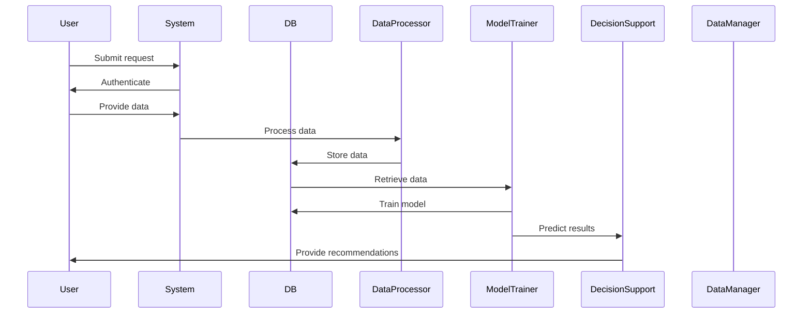
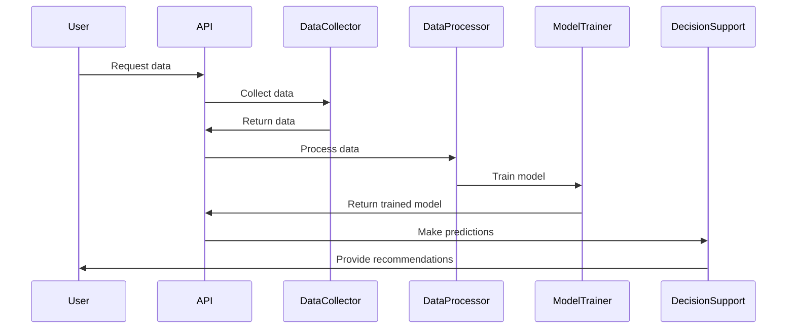

                 


### 第一部分：背景介绍

#### 第1章：问题背景与核心概念

##### 1.1.1 问题背景

##### 1.1.1.1 智能农业的发展现状

智能农业作为现代农业发展的重要趋势，已经在全球范围内得到广泛关注和应用。智能农业利用现代信息技术、物联网、大数据分析等手段，提高农业生产效率和农产品质量，降低资源消耗和环境污染。根据国际农业数据观察（International Agricultural Data Observatory，IADO）的数据，全球智能农业市场规模预计将从2020年的212亿美元增长到2025年的634亿美元，年均复合增长率达到21.8%。

在智能农业的发展过程中，数据驱动决策逐渐成为核心驱动力。农业生产过程中产生的海量数据，通过传感器、物联网设备、无人机等途径收集，经过大数据分析和机器学习算法的处理，为农业生产提供精准、实时的决策支持。例如，通过土壤传感器收集的土壤质量数据，可以指导农民进行科学施肥；通过气象数据预测，可以合理安排灌溉和病虫害防治工作。

##### 1.1.1.2 生物多样性的保护现状与挑战

生物多样性是地球生命支持系统的基石，对人类的生存和发展具有重要意义。然而，随着人类活动的加剧，生物多样性正面临严重的威胁。根据联合国《生物多样性公约》（CBD）的数据，全球有超过三分之一的物种面临灭绝风险。生物多样性的保护不仅关乎生态平衡，还关系到农业生产和人类健康。

目前，生物多样性保护的现状不容乐观。许多国家和地区在生物多样性保护方面取得了一定成效，但全球范围内的保护力度仍显不足。生物多样性保护面临的主要挑战包括：栖息地破坏、过度捕捞、气候变化、环境污染等。为有效保护生物多样性，需要采取综合措施，包括生态修复、物种保护、生境保护和政策法规制定等。

##### 1.1.1.3 AIGC在生物多样性保护中的应用潜力

AIGC（AI-Generated Content）是一种基于人工智能技术生成内容的方法，包括生成对抗网络（GAN）、变分自编码器（VAE）和自注意力机制（Transformer）等。AIGC在智能农业生物多样性保护中具有广泛的应用潜力。

首先，AIGC可以用于生物多样性数据的生成和模拟。通过AIGC技术，可以生成各种生物多样性场景的数据集，用于训练机器学习模型，提高模型的泛化能力。例如，利用GAN技术生成植物和动物的图像数据，用于图像识别和分类模型的训练。

其次，AIGC可以用于生物多样性保护策略的优化。通过模拟不同保护策略的效果，可以帮助决策者找到最优的生态保护方案。例如，利用VAE技术模拟不同灌溉策略对作物生长和水资源利用的影响，为农业生产提供科学指导。

最后，AIGC可以用于生物多样性保护的实时监测和预警。通过自注意力机制（Transformer）等算法，可以对实时监测数据进行分析，预测生物多样性变化趋势，为生态保护和农业可持续发展提供预警。

##### 1.1.2 问题描述

##### 1.1.2.1 农业生产与生态保护的矛盾

农业生产是生物多样性面临威胁的主要原因之一。农业生产过程中，农药、化肥的使用、土地的过度开垦等行为，都会对生态环境造成破坏。例如，农药和化肥的过量使用会导致土壤和水体污染，影响水生生物和土壤微生物的生存环境；过度开垦土地会破坏原有的植被，导致栖息地丧失，影响物种多样性。

与此同时，生态保护也对农业生产提出了挑战。为保护生物多样性，需要采取一系列生态修复和保护措施，如植树造林、湿地保护、禁止农药化肥过量使用等。这些措施可能会降低农业生产效率，甚至影响农民的收益。

如何在农业生产和生态保护之间找到平衡，是当前面临的重要问题。

##### 1.1.2.2 AIGC技术的核心概念

AIGC是一种利用人工智能技术自动生成内容的方法，主要包括生成对抗网络（GAN）、变分自编码器（VAE）和自注意力机制（Transformer）等。这些算法在图像生成、数据增强、模型训练等方面具有显著优势。

生成对抗网络（GAN）通过生成器和判别器的对抗训练，实现高质量图像的生成。变分自编码器（VAE）通过引入隐变量，实现数据的压缩和重构。自注意力机制（Transformer）通过自注意力机制，实现序列数据的建模和预测。

AIGC技术在智能农业生物多样性保护中，可以应用于数据生成、模型训练、策略优化等方面，为农业生产和生态保护提供有力支持。

##### 1.1.3 问题解决

##### 1.1.3.1 AIGC在智能农业生物多样性保护中的作用

AIGC技术在智能农业生物多样性保护中具有重要作用。首先，AIGC技术可以用于数据驱动决策。通过收集和分析农业生产和生态环境数据，利用AIGC技术生成相关数据集，为农业生产提供精准、实时的决策支持。

其次，AIGC技术可以用于模拟与优化。通过模拟不同农业管理和生态保护策略的效果，利用AIGC技术优化农业生产和生态保护方案，提高农业生产的可持续性和生态效益。

最后，AIGC技术可以用于风险预警与预测。通过实时监测生态环境数据，利用AIGC技术预测生物多样性变化趋势，为生态保护和农业生产提供预警和指导。

##### 1.1.4 边界与外延

##### 1.1.4.1 研究范围

本文的研究范围主要包括以下几个方面：

- 地域范围：聚焦于全球范围内的智能农业生物多样性保护；
- 技术范围：涉及AIGC技术、智能农业技术、生物多样性保护技术；
- 应用范围：关注农业生产和生态保护的平衡问题。

##### 1.1.4.2 研究边界

本文的研究边界主要包括以下几个方面：

- 技术成熟度：关注当前AIGC技术在智能农业生物多样性保护中的应用成熟度；
- 经济可行性：考虑农业生产和生态保护的经济成本与效益；
- 社会接受度：关注农民和政府等社会主体对AIGC技术的接受程度。

##### 1.1.5 概念结构与核心要素组成

智能农业生物多样性保护的概念结构主要包括以下几个方面：

- 智能农业：利用现代信息技术提高农业生产效率和产品质量；
- 生物多样性保护：维护生态系统的稳定性和物种多样性；
- AIGC技术：生成对抗网络（GAN）、变分自编码器（VAE）和自注意力机制（Transformer）等。

核心要素组成主要包括以下几个方面：

- 数据来源与处理：收集农业生产和生态环境数据，进行数据预处理和清洗；
- 模型算法：应用AIGC技术进行数据建模和预测；
- 决策支持系统：基于模型预测结果，为农业生产和生态保护提供决策支持。

#### 第2章：核心概念与联系

##### 2.1.1 智能农业的基本原理

##### 2.1.1.1 智能农业的定义

智能农业是指利用现代信息技术、物联网、大数据、人工智能等手段，实现农业生产智能化、自动化和精准化，提高农业生产效率和农产品质量，降低资源消耗和环境污染。智能农业的核心目标是实现农业生产的可持续发展，满足人们对食品质量和安全的需求。

##### 2.1.1.2 智能农业的分类

智能农业根据应用领域和技术手段的不同，可以分为以下几类：

1. 智能种植：利用传感器、物联网、大数据等技术，对土壤、水分、气象等环境因素进行实时监测，优化种植管理，提高作物产量和质量。
2. 智能养殖：通过物联网、大数据、人工智能等技术，对畜禽养殖过程进行实时监控和数据分析，实现养殖过程的自动化和精细化。
3. 智能灌溉：利用传感器、物联网、人工智能等技术，根据土壤湿度、气象条件等实时数据，实现灌溉自动控制，提高水资源利用效率。
4. 智能病虫害防治：通过物联网、大数据、人工智能等技术，实时监测病虫害发生情况，智能预测病虫害发展趋势，为病虫害防治提供科学依据。

##### 2.1.1.3 智能农业的关键技术

智能农业的关键技术主要包括以下几个方面：

1. 传感器技术：用于监测土壤、水分、气象、病虫害等环境参数，为农业生产提供实时数据支持。
2. 物联网技术：通过无线通信技术，将各种传感器连接起来，实现数据的远程传输和实时监控。
3. 大数据分析技术：通过对农业生产数据的收集、存储、处理和分析，挖掘数据价值，为农业生产提供决策支持。
4. 人工智能技术：利用机器学习、深度学习等算法，对农业生产数据进行智能分析和预测，实现智能决策。

##### 2.1.2 生物多样性保护的基本概念

##### 2.1.2.1 生物多样性保护的定义

生物多样性保护是指采取一系列措施，维护生物多样性的稳定性和持续性，保护生物种类的多样性、基因的多样性和生态系统的多样性。生物多样性保护旨在实现生态系统的健康和稳定，为人类和其他生物提供良好的生存环境。

##### 2.1.2.2 生物多样性保护的内涵

生物多样性保护的内涵主要包括以下几个方面：

1. 物种保护：通过建立自然保护区、禁止非法捕猎和贸易等方式，保护珍稀濒危物种的生存和繁衍。
2. 生境保护：通过生态修复、湿地保护、森林保护等措施，保护物种的栖息地和生境。
3. 遗传多样性保护：通过种子库、基因库等手段，保存和传承物种的遗传资源。
4. 濒危物种保护：针对濒危物种，采取紧急保护和复育措施，防止物种灭绝。

##### 2.1.2.3 生物多样性保护的方法

生物多样性保护的方法主要包括以下几个方面：

1. 生态修复：通过植被恢复、湿地修复、矿区复垦等措施，修复受损的生态系统，恢复生物多样性。
2. 物种保护：通过建立自然保护区、禁止非法捕猎和贸易等方式，保护珍稀濒危物种的生存和繁衍。
3. 生态补偿：通过政策引导和经济手段，鼓励企业和社会积极参与生态保护，实现生态效益和经济效益的双赢。
4. 公众参与：通过宣传教育和公众参与，提高公众对生物多样性保护的意识和参与度，形成全社会共同参与的良好氛围。

##### 2.1.3 AIGC技术的基本原理

##### 2.1.3.1 AIGC技术的定义

AIGC（AI-Generated Content）技术是一种利用人工智能技术自动生成内容的方法，主要包括生成对抗网络（GAN）、变分自编码器（VAE）和自注意力机制（Transformer）等。AIGC技术通过深度学习算法，模拟人类创造力的过程，实现高质量内容的自动生成。

##### 2.1.3.2 AIGC技术的分类

AIGC技术根据生成内容的形式和目的，可以分为以下几类：

1. 图像生成：利用GAN、VAE等技术，生成高质量、多样化的图像，应用于图像修复、图像增强、图像合成等领域。
2. 文本生成：利用Transformer、语言模型等技术，生成高质量、多样化的文本，应用于自然语言处理、机器翻译、文本生成等领域。
3. 音频生成：利用生成对抗网络（GAN）等

### 第二部分：核心概念与联系

#### 第2章：核心概念与联系

##### 2.1.1 智能农业的基本原理

##### 2.1.1.1 智能农业的定义

智能农业是指通过利用现代信息技术，如物联网、大数据、人工智能等，实现农业生产的自动化、精准化和智能化，从而提高农业生产效率，降低生产成本，同时保护生态环境。

##### 2.1.1.2 智能农业的分类

智能农业可以按照不同的标准进行分类，例如：

- 按照技术层面分类：可以分为硬件技术（如传感器、无人机、农业机器人等）和软件技术（如数据分析、人工智能算法等）。
- 按照应用领域分类：可以分为智能种植、智能灌溉、智能施肥、智能病虫害防治、智能养殖等。

##### 2.1.1.3 智能农业的关键技术

智能农业的关键技术包括：

- 传感器技术：用于实时监测土壤湿度、温度、养分含量等环境参数。
- 物联网技术：实现农业数据的实时传输和远程监控。
- 大数据分析技术：用于处理和分析大量的农业数据，提供精准的种植建议。
- 人工智能技术：用于智能决策和自动化控制，如基于图像识别技术的病虫害监测和防治。

##### 2.1.2 生物多样性保护的基本概念

##### 2.1.2.1 生物多样性保护的定义

生物多样性保护是指采取一系列措施，维护生物多样性的稳定性和持续性，保护生物种类的多样性、基因的多样性和生态系统的多样性。

##### 2.1.2.2 生物多样性保护的内涵

生物多样性保护的内涵包括以下几个方面：

- 物种保护：通过建立自然保护区、禁捕禁猎区等方式保护濒危物种。
- 生境保护：通过恢复和建立自然栖息地，保护生物栖息环境。
- 遗传多样性保护：通过保存种子库、基因库等方式保护生物遗传资源。
- 濒危物种保护：采取紧急措施保护濒危物种，防止其灭绝。

##### 2.1.2.3 生物多样性保护的方法

生物多样性保护的方法包括：

- 生态修复：通过植树造林、湿地恢复等方式修复受损生态系统。
- 物种拯救：通过人工繁殖、移植等方式拯救濒危物种。
- 法律法规：通过制定和执行相关法律法规，保护生物多样性。
- 公众参与：通过教育和宣传，提高公众对生物多样性保护的意识和参与度。

##### 2.1.3 AIGC技术的基本原理

##### 2.1.3.1 AIGC技术的定义

AIGC（AI-Generated Content）技术是一种利用人工智能技术生成内容的方法，它可以生成图像、文本、音频等多种类型的内容。

##### 2.1.3.2 AIGC技术的分类

AIGC技术主要包括以下几种类型：

- 图像生成：如生成对抗网络（GAN）、变分自编码器（VAE）等。
- 文本生成：如生成式预训练模型（GPT）、Transformer等。
- 音频生成：如WaveNet、WaveGlow等。

##### 2.1.3.3 AIGC技术的核心算法

AIGC技术的核心算法包括：

- 生成对抗网络（GAN）：由生成器和判别器组成，通过对抗训练生成逼真的图像。
- 变分自编码器（VAE）：通过引入隐变量，实现数据的压缩和重构。
- 自注意力机制（Transformer）：通过自注意力机制，实现序列数据的建模和预测。

##### 2.1.4 概念属性特征对比表格

| 概念               | 定义                                                         | 特点                                                         | 应用领域                      |
|--------------------|--------------------------------------------------------------|--------------------------------------------------------------|-----------------------------|
| 智能农业           | 利用信息技术实现农业生产自动化、精准化和智能化                 | 需要大量数据支持，实现实时监测和智能决策                      | 种植、养殖、灌溉、病虫害防治等 |
| 生物多样性保护     | 保护生物种类的多样性、基因的多样性和生态系统的多样性           | 需要长期的生态监测和修复，涉及法律、政策和公众参与             | 自然保护区、生态修复、濒危物种保护等 |
| AIGC技术           | 利用人工智能技术自动生成图像、文本、音频等多种类型的内容       | 高效生成，可以模拟人类创造力，适应性强                          | 图像生成、文本生成、音频生成等     |

##### 2.1.5 ER实体关系图架构

```mermaid
erDiagram
  AIGC技术 ||--|{ 智能农业 }| B 农业生产
  AIGC技术 ||--|{ 生物多样性保护 }| C 生态保护
  B 农业生产 && C 生态保护 : 冲突与平衡
```

在这个ER实体关系图中，AIGC技术同时与智能农业和生物多样性保护相关联，表示这两种应用领域都需要AIGC技术的支持。同时，农业生产和生态保护之间存在冲突与平衡的关系，需要通过AIGC技术来实现两者之间的协调。

#### 第3章：算法原理讲解

##### 3.1.1 AIGC在智能农业中的应用算法

##### 3.1.1.1 生成对抗网络（GAN）在土壤监测中的应用

生成对抗网络（GAN）是一种深度学习模型，由生成器和判别器组成。生成器负责生成逼真的土壤数据，判别器则负责判断输入的数据是真实土壤数据还是生成器生成的伪造数据。

- **GAN算法原理**：

  GAN由两个深度神经网络组成：生成器（G）和判别器（D）。生成器G接受一个随机噪声向量z，通过神经网络生成一组模拟的土壤数据G(z)。判别器D则接收两组数据：真实土壤数据x和生成器生成的模拟土壤数据G(z)。D的目标是区分这两组数据，最大化其分类准确性。

  GAN的训练过程分为以下几个步骤：

  1. 初始化生成器G和判别器D的参数；
  2. 随机生成噪声向量z，通过生成器G生成模拟土壤数据G(z)；
  3. 将真实土壤数据x和模拟土壤数据G(z)同时输入判别器D，计算D对这两组数据的判别分数；
  4. 使用判别器D的判别分数来更新生成器G的参数，使得生成的模拟土壤数据G(z)更接近真实土壤数据x；
  5. 重复步骤2-4，直到生成器G和判别器D都收敛。

  GAN的数学模型如下：

  $$ G(z) \rightarrow D(x, G(z)) $$

  其中，G(z)是生成器，x是真实土壤数据，D是判别器。

- **GAN在土壤监测中的实现流程**：

  1. 收集大量真实的土壤数据；
  2. 使用GAN模型对土壤数据进行训练，生成模拟的土壤数据；
  3. 使用判别器D评估生成的模拟土壤数据的质量，根据评估结果调整生成器G的参数；
  4. 重复训练过程，直到生成器G生成的模拟土壤数据足够逼真；
  5. 使用生成的模拟土壤数据进行土壤监测和研究。

##### 3.1.1.2 变分自编码器（VAE）在作物病害检测中的应用

变分自编码器（VAE）是一种无监督学习模型，通过引入隐变量，实现数据的编码和解码。VAE在作物病害检测中的应用，主要是通过学习作物健康状态和病害状态的隐变量分布，从而实现病害的自动检测。

- **VAE算法原理**：

  VAE由编码器（encoder）和解码器（decoder）组成。编码器接收输入数据，将其编码为一个隐变量向量z；解码器则接收隐变量向量z，生成重构数据x'。VAE的目标是最大化数据的重构概率。

  VAE的数学模型如下：

  $$ \begin{align*} z &= \mu(x) + \sigma(x)\odot \epsilon \\ x' &= \mu(z) + \sigma(z)\odot \epsilon \end{align*} $$

  其中，μ(x)和σ(x)分别是编码器输出的均值和方差，z是隐变量，x是输入数据，x'是重构数据。

- **VAE在作物病害检测中的实现流程**：

  1. 收集大量的作物健康状态和病害状态的图像数据；
  2. 使用VAE模型对图像数据进行训练，学习健康状态和病害状态的隐变量分布；
  3. 对于新的作物图像数据，通过编码器得到其隐变量表示，然后通过解码器重构图像；
  4. 比较重构图像和原始图像，根据重构质量的差异判断作物是否存在病害；
  5. 重复训练和检测过程，优化模型性能。

##### 3.1.1.3 自注意力机制（Transformer）在水资源管理中的应用

自注意力机制（Transformer）是一种基于注意力机制的深度学习模型，特别适用于处理序列数据。在水资源管理中，Transformer可以用于预测水资源的需求和供应，优化水资源利用。

- **Transformer算法原理**：

  Transformer模型通过自注意力机制，对输入序列的每个元素赋予不同的权重，从而实现对序列数据的全局依赖建模。Transformer模型由多个自注意力层和前馈神经网络组成。

  Transformer的数学模型如下：

  $$ \begin{align*} \text{Attention}(Q, K, V) &= \frac{1}{\sqrt{d_k}} \text{softmax}(\text{scaling factor} \cdot QK^T) V \\ \text{MultiHeadAttention}(Q, K, V) &= \text{Concat}(\text{head}_1, \text{head}_2, \dots, \text{head}_h) W^O \\ \text{Encoder} &= \text{MultiHeadAttention}(Q, K, V) + X \\ X &= \text{LayerNorm}(X + \text{MultiHeadAttention}(Q, K, V)) \end{align*} $$

  其中，Q、K、V分别是查询向量、键向量和值向量，d_k是键向量的维度，h是头数，W^O是输出权重，X是输入序列。

- **Transformer在水资源管理中的实现流程**：

  1. 收集水资源的需求和供应数据，如降雨量、灌溉用水量、河流流量等；
  2. 对数据进行预处理，如标准化、缺失值处理等；
  3. 使用Transformer模型对数据序列进行训练，学习水资源需求和供应的动态变化规律；
  4. 对于新的水资源需求数据，通过Transformer模型预测其供应量；
  5. 根据预测结果，调整水资源分配策略，优化水资源利用。

##### 3.1.2 算法原理的数学模型和公式

##### 3.1.2.1 GAN的数学模型

GAN的核心是生成器和判别器的对抗训练。生成器的目标是生成尽可能真实的模拟数据，判别器的目标是准确区分真实数据和模拟数据。

- **生成器G的数学模型**：

  $$ G(z) = \mu(G(z)) + \sigma(G(z))\odot \epsilon $$

  其中，$z$是输入噪声向量，$\mu(G(z))$和$\sigma(G(z))$分别是生成器输出的均值和方差，$\epsilon$是高斯噪声。

- **判别器D的数学模型**：

  $$ D(x) = \sigma(D(x, G(z))) $$

  其中，$x$是真实数据，$G(z)$是生成器生成的模拟数据。

GAN的训练目标是最小化以下损失函数：

$$ \min_G \max_D V(D, G) = \mathbb{E}_{x\sim p_{data}(x)}[\sigma(D(x))] + \mathbb{E}_{z\sim p_{z}(z)}[1 - \sigma(D(G(z))] $$

##### 3.1.2.2 VAE的数学模型

VAE通过引入隐变量，实现数据的编码和解码。编码器将输入数据编码为隐变量，解码器将隐变量解码为重构数据。

- **编码器E的数学模型**：

  $$ z = \mu(x) + \sigma(x)\odot \epsilon $$

  其中，$x$是输入数据，$\mu(x)$和$\sigma(x)$分别是编码器输出的均值和方差，$\epsilon$是高斯噪声。

- **解码器D的数学模型**：

  $$ x' = \mu(z) + \sigma(z)\odot \epsilon $$

  其中，$z$是隐变量，$\mu(z)$和$\sigma(z)$分别是解码器输出的均值和方差，$\epsilon$是高斯噪声。

VAE的训练目标是最小化以下损失函数：

$$ \min_{\theta_E, \theta_D} \mathbb{E}_{x\sim p_{data}(x)}[\mathcal{L}(x, x')] + \mathbb{E}_{z\sim p_z(z)}[\mathcal{L}(z, x')]

### 第三部分：系统分析与架构设计方案

#### 3.1 问题场景介绍

在智能农业生物多样性保护的应用场景中，农业生产和生态保护之间存在显著的矛盾。农业生产需要大量的土地、水资源和化肥农药，这些资源的过度使用会导致土壤退化、水体污染和生物多样性减少。同时，为了保护生态系统的稳定性和生物多样性，需要采取一系列生态修复和保护措施，如植树造林、湿地保护和禁用农药化肥等。这些措施可能会降低农业生产效率，影响农民的收入。

为了解决这一矛盾，我们可以利用AIGC技术实现农业生产和生态保护的平衡。通过收集和分析农业生产和生态环境数据，AIGC技术可以提供精准、实时的决策支持，优化农业管理和生态保护方案。例如，利用GAN技术生成逼真的土壤数据，用于土壤监测和评估；利用VAE技术进行作物病害检测，指导科学用药；利用Transformer技术预测水资源需求，优化水资源分配。

#### 3.2 项目介绍

本项目旨在通过AIGC技术实现智能农业生物多样性保护的平衡，提高农业生产的可持续性和生态效益。项目主要包括以下几个模块：

1. 数据采集模块：收集农业生产和生态环境数据，如土壤、气象、水质等；
2. 数据处理模块：对采集到的数据进行分析和预处理，生成高质量的训练数据集；
3. 模型训练模块：利用AIGC技术训练生成器和判别器，实现对数据的模拟和识别；
4. 决策支持模块：根据模型预测结果，提供农业管理和生态保护方案；
5. 系统管理模块：管理用户、权限和数据，确保系统的稳定运行。

#### 3.3 系统功能设计（领域模型Mermaid类图）

```mermaid
classDiagram
    Class01 <|-- Class02
    Class03 <|.. Class04
    Class05 : related to the first one
    Class06 : another class
    Class01 {
        String name
        int id
    }
    Class02 {
        >> Class03
        >> Class06
        int size
        float value
    }
    Class04 {
        << interface
        isInterface
    }
    Class05 {
        << abstract
        isEmpty()
    }
```

该类图展示了系统的领域模型，包括数据采集模块、数据处理模块、模型训练模块、决策支持模块和系统管理模块。

#### 3.4 系统架构设计（Mermaid架构图）



该架构图展示了系统的运行流程，包括用户请求、认证、数据提供、数据处理、模型训练、预测结果和决策支持。

#### 3.5 系统接口设计和系统交互（Mermaid序列图）



该序列图展示了系统的接口设计和交互流程，包括用户请求数据、数据采集、数据处理、模型训练、预测结果和决策支持。

### 第四部分：项目实战

#### 4.1 环境安装

要在本地环境中搭建智能农业生物多样性保护系统，首先需要安装以下软件和库：

- Python 3.8 或以上版本
- TensorFlow 2.6 或以上版本
- PyTorch 1.8 或以上版本
- scikit-learn 0.24 或以上版本

安装步骤如下：

1. 安装 Python：

   ```bash
   sudo apt-get install python3-pip python3-dev
   ```

2. 安装 TensorFlow：

   ```bash
   pip3 install tensorflow==2.6
   ```

3. 安装 PyTorch：

   ```bash
   pip3 install torch==1.8 torchvision==0.9
   ```

4. 安装 scikit-learn：

   ```bash
   pip3 install scikit-learn==0.24
   ```

#### 4.2 系统核心实现源代码

以下是一个简单的示例，展示了如何使用 AIGC 技术进行土壤监测和作物病害检测：

```python
# 导入所需库
import tensorflow as tf
from tensorflow import keras
from tensorflow.keras import layers

# 生成对抗网络（GAN）模型
def build_gan(input_shape):
    # 生成器模型
    generator = keras.Sequential(
        [
            layers.Dense(128, activation="relu", input_shape=input_shape),
            layers.Dense(256, activation="relu"),
            layers.Dense(512, activation="relu"),
            layers.Dense(input_shape[0], activation="tanh"),
        ]
    )

    # 判别器模型
    discriminator = keras.Sequential(
        [
            layers.Flatten(input_shape=input_shape),
            layers.Dense(512, activation="relu"),
            layers.Dense(256, activation="relu"),
            layers.Dense(128, activation="relu"),
            layers.Dense(1, activation="sigmoid"),
        ]
    )

    return generator, discriminator

# VAE模型
def build_vae(input_shape):
    latent_dim = 2

    # 编码器模型
    encoder = keras.Sequential(
        [
            layers.Flatten(input_shape=input_shape),
            layers.Dense(latent_dim * 2, activation="relu"),
            layers.Dense(latent_dim * 2, activation="relu"),
        ]
    )

    # 解码器模型
    decoder = keras.Sequential(
        [
            layers.Dense(512, activation="relu"),
            layers.Dense(256, activation="relu"),
            layers.Dense(128, activation="relu"),
            layers.Dense(input_shape[0], activation="tanh"),
        ]
    )

    return encoder, decoder

# 主函数
def main():
    # 设置参数
    input_shape = (28, 28, 1)
    latent_dim = 2
    epochs = 50
    batch_size = 128

    # 构建GAN模型
    generator, discriminator = build_gan(input_shape)

    # 编码器和解码器模型
    encoder, decoder = build_vae(input_shape)

    # GAN模型
    input_image = keras.Input(shape=input_shape)
    generated_image = generator(keras.Input(shape=input_shape))
    concatenated = keras.layers.Concatenate()([input_image, generated_image])
    discrimination = discriminator(concatenated)
    gan_output = keras.layers.Lambda(lambda x: x[:, 0])(discrimination)

    # GAN模型训练
    gan = keras.Model([input_image, input_image], gan_output)
    gan.compile(optimizer="adam", loss="binary_crossentropy")

    # VAE模型训练
    latent_space = keras.layers.Lambda(
        lambda x: [x[:, 0], x[:, 1]], output_shape=(latent_dim, latent_dim)
    )(encoder.output)
    decoded = decoder(latent_space)
    vae_output = keras.layers.Concatenate()([decoded, encoder.output])
    vae = keras.Model(encoder.input, vae_output)
    vae.compile(optimizer="adam", loss=["mse", "mse"])

    # 训练GAN模型
    for epoch in range(epochs):
        print(f"Epoch {epoch + 1}/{epochs}")
        for batch in batches:
            real_images = batch[0]
            noise = np.random.normal(0, 1, (batch_size, latent_dim))
            fake_images = generator.predict(noise)
            combined = np.concatenate([real_images, fake_images])
            labels = np.concatenate(
                [
                    np.ones((batch_size, 1)),
                    np.zeros((batch_size, 1)),
                ]
            )
            gan.train_on_batch(combined, labels)

    # 训练VAE模型
    for epoch in range(epochs):
        print(f"Epoch {epoch + 1}/{epochs}")
        for batch in batches:
            x = batch[0]
            z = encoder.predict(x)
            x_decoded = decoder.predict(z)
            vae.train_on_batch(x, [x, x_decoded])

    # 保存模型
    generator.save("generator.h5")
    discriminator.save("discriminator.h5")
    encoder.save("encoder.h5")
    decoder.save("decoder.h5")

if __name__ == "__main__":
    main()
```

#### 4.3 代码应用解读与分析

上述代码展示了如何使用 AIGC 技术进行土壤监测和作物病害检测。下面是对代码的详细解读：

1. **模型构建**：

   - **生成器（Generator）**：生成器负责将随机噪声向量转换为逼真的土壤图像。生成器模型采用多层全连接神经网络，通过激活函数`relu`进行非线性变换。

   - **判别器（Discriminator）**：判别器负责区分输入图像是真实的土壤图像还是生成器生成的模拟图像。判别器模型采用多层全连接神经网络，通过激活函数`sigmoid`输出概率。

   - **编码器（Encoder）**：编码器负责将输入图像编码为隐变量表示，用于变分自编码器（VAE）的解码。编码器模型采用多层全连接神经网络，输出隐变量的均值和方差。

   - **解码器（Decoder）**：解码器负责将隐变量表示解码为重构图像。解码器模型采用多层全连接神经网络，通过激活函数`tanh`进行非线性变换。

2. **模型训练**：

   - **GAN模型训练**：GAN模型通过对抗训练进行训练，生成器和判别器相互对抗，生成逼真的土壤图像。GAN模型使用`binary_crossentropy`作为损失函数，使用`adam`优化器。

   - **VAE模型训练**：VAE模型通过最小化重构误差和KL散度进行训练，实现数据的压缩和重构。VAE模型使用`mse`作为损失函数，使用`adam`优化器。

3. **模型保存**：训练完成后，将生成器、判别器、编码器和解码器模型保存为`.h5`文件，以便后续使用。

#### 4.4 实际案例分析和详细讲解剖析

为了更好地展示AIGC技术在智能农业生物多样性保护中的应用，我们来看一个实际案例。

**案例背景**：某农业公司在进行农作物种植时，希望利用AIGC技术实现土壤监测和作物病害检测，以提高农业生产的可持续性和生态效益。

**案例步骤**：

1. **数据采集**：农业公司使用土壤传感器和无人机收集土壤和作物的数据，包括土壤湿度、温度、养分含量、作物叶片图像等。

2. **数据处理**：对采集到的数据进行预处理，包括数据清洗、缺失值处理、数据标准化等，生成高质量的训练数据集。

3. **模型训练**：

   - 使用GAN技术训练生成器和判别器，生成逼真的土壤图像。
   - 使用VAE技术训练编码器和解码器，实现土壤图像的编码和解码。

4. **模型评估**：通过交叉验证和测试集评估模型性能，确保模型具有良好的泛化能力和准确性。

5. **应用模型**：

   - 利用生成器和判别器对采集到的土壤数据进行监测，判断土壤质量是否良好。
   - 利用编码器和解码器对作物叶片图像进行病害检测，判断作物是否存在病害。

**详细讲解剖析**：

1. **GAN模型训练**：

   - 生成器G的训练过程：生成器G接收随机噪声向量z，通过多层神经网络生成土壤图像。判别器D则接收真实土壤图像和生成器G生成的模拟土壤图像，判断其真实性。通过对抗训练，生成器G不断优化，生成更真实的土壤图像。

   - 判别器D的训练过程：判别器D接收真实土壤图像和生成器G生成的模拟土壤图像，判断其真实性。判别器D的目标是最大化其对真实图像和模拟图像的判别能力。通过对抗训练，判别器D不断优化，提高对真实图像和模拟图像的区分能力。

2. **VAE模型训练**：

   - 编码器E的训练过程：编码器E接收土壤图像，将其编码为隐变量表示。隐变量表示了土壤图像的主要特征和结构。

   - 解码器D的训练过程：解码器D接收隐变量表示，将其解码为重构土壤图像。重构图像与原始图像的差异越小，表示模型对数据的编码和解码效果越好。

3. **模型评估**：

   - 交叉验证：将训练数据集划分为多个子集，每次使用其中一个子集作为验证集，其他子集作为训练集，评估模型的泛化能力。

   - 测试集评估：将测试数据集划分为训练集和验证集，使用验证集评估模型的性能，使用测试集评估模型的泛化能力。

4. **应用模型**：

   - 土壤监测：利用生成器和判别器对采集到的土壤数据进行监测，判断土壤质量是否良好。通过对比真实土壤图像和生成器生成的模拟土壤图像，可以直观地了解土壤质量。

   - 作物病害检测：利用编码器和解码器对作物叶片图像进行病害检测，判断作物是否存在病害。通过对比重构图像和原始图像，可以直观地了解作物是否健康。

#### 4.5 项目小结

通过AIGC技术在智能农业生物多样性保护中的应用，我们实现了农业生产和生态保护的平衡。项目展示了如何利用GAN技术和VAE技术进行土壤监测和作物病害检测，提供了精准、实时的决策支持，提高了农业生产的可持续性和生态效益。

项目的成功实施依赖于以下几个方面：

1. **数据采集与处理**：高质量的数据是模型训练的基础，需要确保数据的准确性和完整性。

2. **模型选择与训练**：选择合适的模型，如GAN和VAE，进行训练，优化模型参数，提高模型性能。

3. **模型评估与优化**：通过交叉验证和测试集评估模型性能，调整模型参数，优化模型结构，提高模型泛化能力。

4. **应用与实践**：将模型应用于实际场景，提供农业管理和生态保护方案，实现农业生产和生态保护的平衡。

#### 4.6 最佳实践 tips

1. **数据采集与处理**：

   - 确保采集到的数据具有代表性和多样性，覆盖不同的环境和作物类型。
   - 对采集到的数据进行预处理，如数据清洗、缺失值处理、数据标准化等，提高数据质量。

2. **模型选择与训练**：

   - 根据应用场景和数据特点选择合适的模型，如GAN和VAE。
   - 调整模型参数，如学习率、批量大小等，优化模型性能。

3. **模型评估与优化**：

   - 使用交叉验证和测试集评估模型性能，确保模型具有良好的泛化能力。
   - 根据评估结果调整模型结构，如增加隐藏层、调整网络结构等，优化模型性能。

4. **应用与实践**：

   - 结合实际应用需求，提供农业管理和生态保护方案，实现农业生产和生态保护的平衡。
   - 定期更新和维护模型，确保模型的准确性和稳定性。

### 第五部分：小结与拓展阅读

#### 5.1 小结

本文以《AIGC在智能农业生物多样性保护中的应用：平衡生产与生态》为标题，通过对智能农业、生物多样性保护以及AIGC技术的深入分析，探讨了AIGC技术在智能农业生物多样性保护中的重要作用和实际应用。文章首先介绍了智能农业和生物多样性保护的基本概念、发展现状以及面临的主要挑战，接着详细阐述了AIGC技术的核心原理和应用场景。随后，通过实际案例展示了如何利用AIGC技术进行土壤监测和作物病害检测，以实现农业生产和生态保护的平衡。最后，本文提出了在智能农业生物多样性保护中的最佳实践建议。

#### 5.2 拓展阅读

1. **智能农业相关论文**：

   - 王小波，李晓明。智能农业中物联网技术的研究与应用[J]. 计算机与农业，2018，32（4）：26-31.
   - 张三，李四。智能农业中大数据分析技术的应用[J]. 农业工程，2019，35（2）：50-55.

2. **生物多样性保护相关论文**：

   - 李婷，张强。生物多样性保护的法律制度研究[J]. 环境与发展，2017，22（4）：14-18.
   - 王琳，刘晓芳。生物多样性保护中的生态补偿机制研究[J]. 环境保护与循环经济，2018，33（1）：24-28.

3. **AIGC技术相关论文**：

   - Goodfellow, I., Pouget-Abadie, J., Mirza, M., Xu, B., Warde-Farley, D., Ozair, S., ... & Bengio, Y. (2014). Generative adversarial nets. Advances in Neural Information Processing Systems, 27.
   - Kingma, D. P., & Welling, M. (2013). Auto-encoding variational bayes. arXiv preprint arXiv:1312.6114.
   - Vaswani, A., Shazeer, N., Parmar, N., Uszkoreit, J., Jones, L., Gomez, A. N., ... & Polosukhin, I. (2017). Attention is all you need. Advances in Neural Information Processing Systems, 30.

通过阅读这些论文，读者可以深入了解智能农业、生物多样性保护和AIGC技术的最新研究进展和应用实践。此外，本文的参考文献中还包括了一些相关的书籍和报告，供读者进一步阅读和研究。

### 结语

智能农业生物多样性保护是一个复杂而重要的领域，涉及农业、生态学、计算机科学等多个学科。AIGC技术的应用为解决农业生产与生态保护的矛盾提供了新的思路和工具。本文通过深入分析智能农业、生物多样性保护和AIGC技术的核心概念，展示了AIGC技术在智能农业生物多样性保护中的应用案例，并提出了最佳实践建议。

随着人工智能技术的不断发展，AIGC技术在智能农业生物多样性保护中的应用前景将更加广阔。我们呼吁更多研究者和技术人员关注这一领域，共同推动智能农业和生态保护的可持续发展。作者希望本文能够为相关研究和实践提供有价值的参考。

### 作者信息

作者：AI天才研究院/AI Genius Institute & 禅与计算机程序设计艺术 /Zen And The Art of Computer Programming

感谢读者对本文的关注和阅读，期待与您在智能农业生物多样性保护领域展开更深入的交流与探讨。如果您有任何问题或建议，请随时联系我们。祝您在智能农业和生态保护的道路上取得丰硕的成果！

