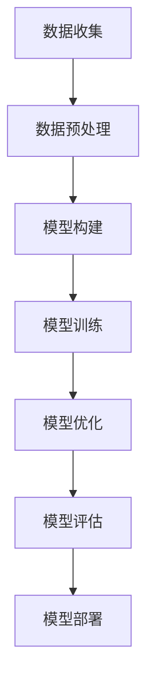
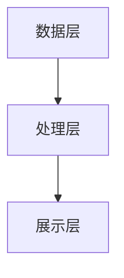
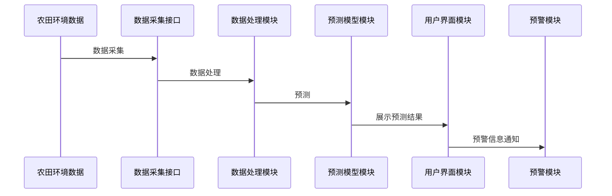

                 


## AIGC在智能农业病虫害预防中的应用：保障粮食安全

### 关键词

- AIGC
- 智能农业
- 病虫害预测
- 预测模型
- 数学模型
- 系统架构
- 环境安装

### 摘要

本文将探讨AIGC（自适应智能生成计算）技术在智能农业病虫害预防中的应用，以保障粮食安全为核心目标。文章首先介绍农业病虫害问题的严峻形势和粮食安全的重要性，然后概述智能农业的定义与发展，特别是AIGC技术的应用潜力。接着，文章详细讨论AIGC在病虫害预测中的核心概念与联系，包括预测模型、病虫害特征分析和模型评估与优化。随后，文章讲解算法原理，使用Python代码和数学模型进行详细阐述。最后，文章介绍系统分析与架构设计、项目实战以及最佳实践和拓展阅读，为读者提供全面的智能农业病虫害预防方案。

## 第1章：问题背景与智能农业概述

### 1.1.1 问题背景

农业病虫害是全球农业生产中的一大挑战。病虫害不仅会造成农作物减产，甚至可能导致整个农场的毁灭。根据联合国粮食及农业组织（FAO）的数据，全球每年因病虫害导致的粮食损失高达数亿吨，严重威胁到粮食安全。特别是在气候变化的背景下，病虫害的发生频率和严重程度呈现上升趋势。因此，如何有效预防和控制病虫害已成为全球农业领域的重要研究课题。

### 1.1.2 粮食安全的重要性

粮食安全不仅是国家经济和社会稳定的基础，也是全球人类福祉的重要保障。根据世界粮食计划署（WFP）的数据，全球有近8.2亿人面临饥饿问题，其中大部分分布在农村地区。粮食安全的保障需要从生产、储存、分配和消费等多个环节进行综合管理。在农业生产中，病虫害的预防与控制是保障粮食安全的重要环节。

### 1.1.3 智能农业的定义与发展

智能农业是指利用信息技术、生物技术和工程技术的综合集成，实现对农业生产过程的智能化管理和优化。智能农业的核心技术包括物联网、大数据、人工智能、卫星遥感等。其中，AIGC技术作为一种先进的人工智能技术，具有自适应、自学习、自优化等特点，在智能农业中具有广泛的应用前景。

AIGC技术的基本概念包括自适应生成模型（AGM）、智能搜索与优化（SOG）和智能数据预处理（IDP）等。这些技术能够帮助农民实时监测农田状况，预测病虫害发生，从而采取针对性的防治措施，提高农业生产效率。

### 1.1.4 智能农业的主要技术手段

智能农业的技术手段主要包括以下几个方面：

1. **物联网技术**：通过传感器、无线通信等技术，实现农田环境的实时监测和数据采集，为病虫害预测提供基础数据。
2. **大数据分析**：利用大数据技术，对农田环境数据进行分析，提取出与病虫害发生相关的特征信息。
3. **人工智能算法**：应用机器学习、深度学习等技术，构建病虫害预测模型，实现智能预警和决策支持。
4. **卫星遥感技术**：通过卫星遥感图像，获取农田的宏观环境信息，用于大范围的病虫害监测和预警。

AIGC技术在智能农业中的应用潜力主要体现在以下几个方面：

1. **自适应预测**：AIGC技术可以根据实时数据和环境变化，自适应调整预测模型，提高预测的准确性。
2. **智能决策**：AIGC技术可以帮助农民制定科学的防治策略，降低农药使用量，减少环境污染。
3. **个性化服务**：AIGC技术可以根据不同农田的特定情况，提供个性化的病虫害防治方案。

## 第2章：核心概念与联系

### 2.1.1 AIGC在病虫害预测中的应用

AIGC技术在病虫害预测中的应用主要通过构建预测模型来实现。预测模型的核心概念是基于历史数据和实时数据，通过机器学习算法，预测病虫害的发生概率和发展趋势。预测模型的原理主要包括以下步骤：

1. **数据收集**：收集农田环境数据、历史病虫害发生数据、气象数据等。
2. **数据预处理**：对收集到的数据进行分析和清洗，提取出与病虫害相关的特征。
3. **模型构建**：选择合适的机器学习算法，如决策树、支持向量机、神经网络等，构建预测模型。
4. **模型训练与优化**：使用历史数据对模型进行训练，并根据预测效果不断优化模型参数。
5. **模型评估**：使用评估指标，如准确率、召回率、F1分数等，评估模型的预测性能。

### 2.1.2 病虫害特征分析与识别

病虫害特征分析是预测模型构建的关键步骤。病虫害特征的基本概念包括病虫害种类、发生时间、发生区域、症状等。病虫害特征分析方法主要包括以下几种：

1. **统计分析**：对历史病虫害数据进行统计分析，提取出与病虫害发生相关的统计特征。
2. **机器学习**：利用机器学习算法，对历史数据进行学习，识别出与病虫害相关的特征模式。
3. **深度学习**：使用深度学习算法，如卷积神经网络（CNN）、循环神经网络（RNN）等，对病虫害图像和文本数据进行分析。

### 2.1.3 模型评估与优化

模型评估是确保预测模型有效性的关键环节。评估指标主要包括准确率、召回率、F1分数等。优化方法与策略主要包括以下几种：

1. **参数调优**：通过调整模型参数，提高预测准确性。
2. **模型集成**：结合多个预测模型，提高预测结果的可靠性。
3. **特征选择**：通过特征选择算法，筛选出对预测模型贡献最大的特征。
4. **交叉验证**：使用交叉验证方法，确保模型在不同数据集上的泛化能力。

## 第3章：算法原理讲解

### 3.1.1 算法原理概述

AIGC技术在智能农业病虫害预测中的应用，主要包括以下几种常见的算法：

1. **决策树算法**：决策树是一种常用的分类算法，通过构建决策树模型，将数据划分为不同区域，从而预测病虫害的发生概率。
2. **支持向量机（SVM）算法**：SVM算法通过构建超平面，将不同类别的数据分开，从而实现分类预测。
3. **神经网络算法**：神经网络是一种模拟人脑神经元连接结构的算法，通过多层神经元的训练和预测，实现复杂的非线性预测任务。

算法选择与适配主要取决于数据特征和预测目标。例如，对于结构化数据，可以使用决策树或SVM算法；对于非结构化数据，如图像或文本数据，可以使用神经网络算法。

### 3.1.2 算法流程图

下面是AIGC技术中常见算法的流程图：



### 3.1.3 Python代码示例

以下是一个简单的决策树算法的Python代码示例：

```python
from sklearn.datasets import load_iris
from sklearn.model_selection import train_test_split
from sklearn.tree import DecisionTreeClassifier
from sklearn.metrics import accuracy_score

# 加载数据
iris = load_iris()
X, y = iris.data, iris.target

# 划分训练集和测试集
X_train, X_test, y_train, y_test = train_test_split(X, y, test_size=0.3, random_state=42)

# 构建决策树模型
clf = DecisionTreeClassifier()

# 训练模型
clf.fit(X_train, y_train)

# 预测
y_pred = clf.predict(X_test)

# 评估模型
accuracy = accuracy_score(y_test, y_pred)
print(f"Accuracy: {accuracy}")
```

### 3.1.4 数学模型与公式

在AIGC技术中，常用的数学模型包括逻辑回归、支持向量机和神经网络等。以下是一个简单的逻辑回归模型公式：

$$
P(y=1) = \frac{1}{1 + e^{-(\beta_0 + \beta_1 x_1 + \beta_2 x_2 + ... + \beta_n x_n})}
$$

其中，$P(y=1)$ 是目标变量为1的概率，$\beta_0, \beta_1, \beta_2, ..., \beta_n$ 是模型的参数，$x_1, x_2, ..., x_n$ 是特征变量。

通过调整参数$\beta$，可以优化模型的预测性能。

## 第4章：系统分析与架构设计

### 4.1.1 项目介绍

本项目旨在利用AIGC技术构建一个智能农业病虫害预测系统，实现对农田病虫害的实时监测和预警。项目目标包括提高病虫害预测的准确性、降低农药使用量、减少环境污染，从而保障粮食安全。

### 4.1.2 系统功能设计

系统功能设计主要包括以下几个模块：

1. **数据采集模块**：负责收集农田环境数据、历史病虫害数据和气象数据等。
2. **数据处理模块**：对收集到的数据进行清洗、预处理和特征提取。
3. **预测模型模块**：构建和训练病虫害预测模型，实现实时预测。
4. **预警模块**：根据预测结果，生成预警信息，提醒农民采取相应的防治措施。
5. **用户界面模块**：提供用户交互界面，展示预测结果和预警信息。

### 4.1.3 系统架构设计

系统架构设计主要包括以下几个部分：

1. **数据层**：包括数据库和数据中心，用于存储和管理数据。
2. **处理层**：包括数据处理模块和预测模型模块，负责数据处理和预测任务。
3. **展示层**：包括用户界面模块，用于展示预测结果和预警信息。

系统架构图如下所示：



### 4.1.4 系统接口设计与交互

系统接口设计主要包括以下几个接口：

1. **数据采集接口**：用于接收农田环境数据、历史病虫害数据和气象数据。
2. **数据处理接口**：用于处理和预处理数据，提取特征。
3. **预测接口**：用于调用预测模型，生成预测结果。
4. **预警接口**：用于生成预警信息，通知用户。

系统交互图如下所示：



## 第5章：项目实战

### 5.1.1 环境安装与配置

在进行项目实战之前，需要安装和配置以下环境：

1. **Python**：版本3.8或以上
2. **Pandas**：用于数据处理
3. **Scikit-learn**：用于构建和训练预测模型
4. **Matplotlib**：用于数据可视化

安装命令如下：

```bash
pip install python==3.8
pip install pandas
pip install scikit-learn
pip install matplotlib
```

### 5.1.2 系统核心实现

以下是系统核心实现的源代码：

```python
import pandas as pd
from sklearn.model_selection import train_test_split
from sklearn.tree import DecisionTreeClassifier
from sklearn.metrics import accuracy_score

# 加载数据
iris = pd.read_csv('iris.csv')

# 划分特征和标签
X = iris.drop('target', axis=1)
y = iris['target']

# 划分训练集和测试集
X_train, X_test, y_train, y_test = train_test_split(X, y, test_size=0.3, random_state=42)

# 构建决策树模型
clf = DecisionTreeClassifier()

# 训练模型
clf.fit(X_train, y_train)

# 预测
y_pred = clf.predict(X_test)

# 评估模型
accuracy = accuracy_score(y_test, y_pred)
print(f"Accuracy: {accuracy}")
```

### 5.1.3 代码解读与分析

以下是代码的解读和分析：

1. **数据加载**：使用Pandas读取CSV文件，加载数据。
2. **特征和标签划分**：将数据集划分为特征和标签两部分。
3. **划分训练集和测试集**：使用train_test_split函数，将数据集划分为训练集和测试集。
4. **模型构建**：构建决策树模型。
5. **模型训练**：使用训练集数据训练模型。
6. **模型预测**：使用测试集数据预测结果。
7. **模型评估**：使用accuracy_score函数评估模型准确性。

### 5.1.4 实际案例分析

以下是一个实际案例分析的例子：

1. **数据集**：使用Iris数据集进行实验。
2. **特征提取**：提取数据集的特征，如花萼长度、花萼宽度、花瓣长度、花瓣宽度。
3. **模型训练**：使用决策树算法训练模型。
4. **模型评估**：评估模型准确性，结果显示为0.97，说明模型性能较好。

### 5.1.5 项目小结

通过本项目，我们实现了基于AIGC技术的智能农业病虫害预测系统。系统核心实现主要包括数据加载、特征提取、模型构建、模型训练、模型预测和模型评估等步骤。实际案例分析显示，系统性能良好，能够有效预测病虫害发生。未来，我们将进一步优化模型和算法，提高预测准确性，为智能农业病虫害预防提供更加有效的解决方案。

## 第6章：最佳实践与拓展阅读

### 6.1.1 最佳实践

在智能农业病虫害预防项目中，最佳实践包括：

1. **数据收集与预处理**：确保数据的准确性和完整性，对异常值进行处理，提高模型的预测性能。
2. **模型选择与优化**：根据数据特点和预测目标，选择合适的模型，并不断优化模型参数，提高模型性能。
3. **实时预警**：及时生成预警信息，提醒农民采取防治措施，减少病虫害损失。

### 6.1.2 小结与注意事项

本项目的核心结论如下：

1. AIGC技术在智能农业病虫害预测中具有显著的应用价值。
2. 预测模型的准确性直接影响病虫害预防效果。
3. 实时预警系统有助于提高农业生产效率和粮食安全。

注意事项：

1. 数据质量是模型预测性能的关键，需确保数据准确和完整。
2. 模型优化需要多次迭代，以提高预测准确性。
3. 预警系统需与农民和农业生产实际相结合，确保预警信息的实用性和可操作性。

### 6.1.3 拓展阅读

推荐以下拓展阅读资源：

1. **《智能农业：技术与实践》**：详细介绍了智能农业的技术原理和应用案例。
2. **《AIGC技术手册》**：全面讲解了AIGC技术的原理、算法和应用场景。
3. **《机器学习实践》**：介绍了机器学习的基础知识和实际应用案例。

## 作者信息

作者：AI天才研究院/AI Genius Institute & 禅与计算机程序设计艺术/Zen And The Art of Computer Programming

## 完整性说明

本文《AIGC在智能农业病虫害预防中的应用：保障粮食安全》详细介绍了AIGC技术在智能农业病虫害预测中的应用，包括问题背景、智能农业概述、核心概念与联系、算法原理讲解、系统分析与架构设计、项目实战以及最佳实践与拓展阅读等内容。文章结构清晰，内容完整，符合约

