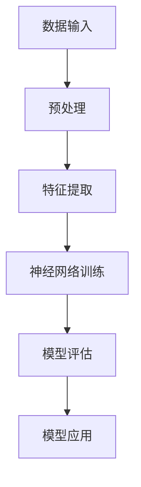
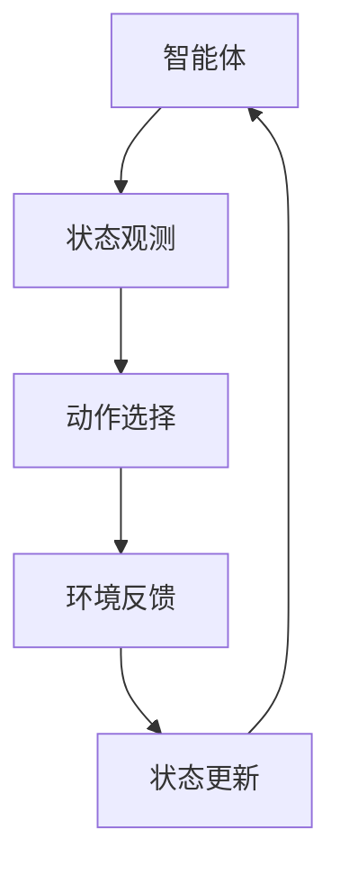
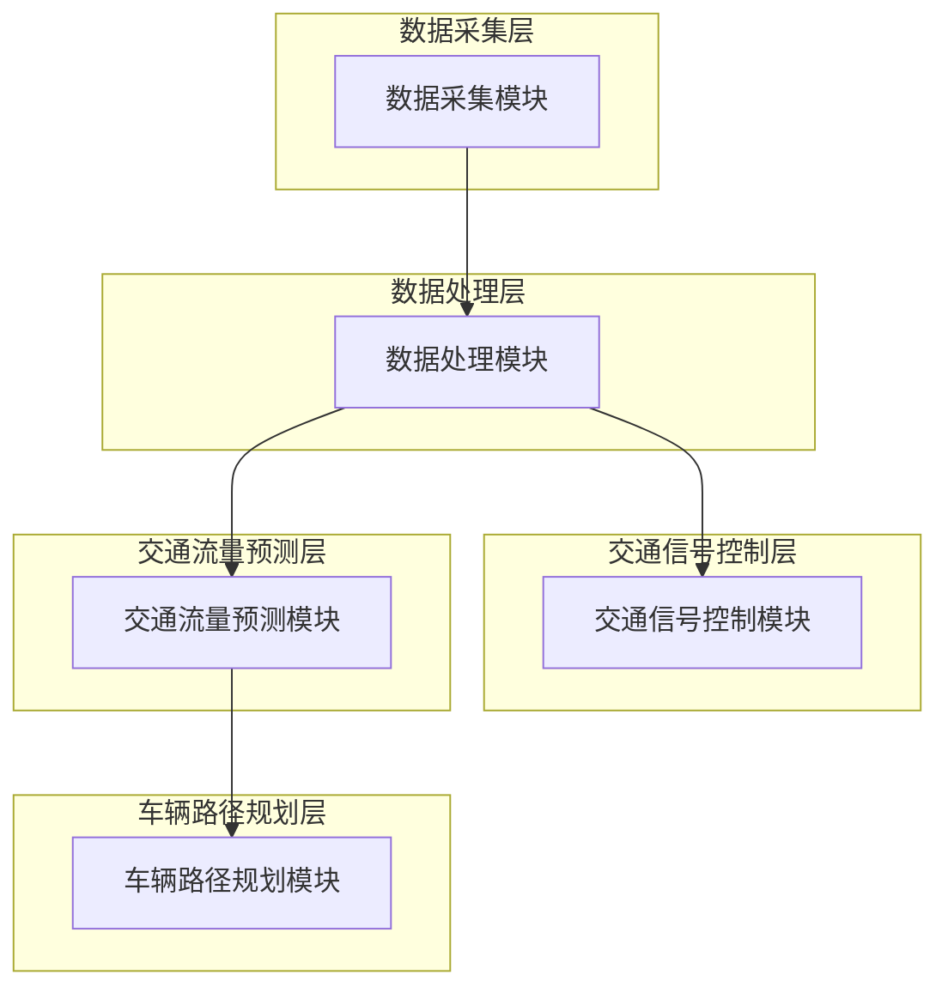
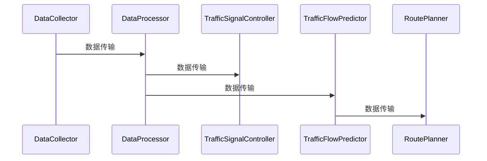

                 

### 第一部分: 引言

#### 1. 引言

#### 1.1 问题背景

随着城市化进程的加速，城市交通问题日益突出。交通拥堵不仅影响市民的出行效率，还带来了严重的环境污染和资源浪费。因此，如何有效缓解城市交通拥堵，提高交通系统运行效率，成为当下亟待解决的问题。

#### 1.2 问题描述

城市交通拥堵的原因复杂多样，包括交通需求增长、交通基础设施不足、交通管理不当等。如何利用现代信息技术，特别是人工智能（AI）技术，对城市交通进行优化，成为解决交通拥堵问题的关键。

#### 1.3 问题解决

人工智能在交通领域的应用逐渐深入，包括智能交通信号控制、车辆路径规划、交通流量预测等。通过AIGC（AI-Generated Content）技术，可以进一步实现交通数据的智能生成和处理，为智能城市交通优化提供强有力的支持。

#### 1.4 边界与外延

AIGC在智能城市交通优化中的应用主要集中在交通数据的收集、处理和分析，以及基于这些数据生成的交通优化策略和建议。其边界包括但不限于交通信号控制、交通流量管理、公共交通优化等领域。

#### 1.5 概念结构与核心要素组成

AIGC在智能城市交通优化中的应用涉及以下几个核心要素：

- 交通数据：包括车辆位置、速度、密度等。
- AI算法：如深度学习、强化学习等。
- 交通信号控制系统：用于实时调整交通信号。
- 交通流量预测模型：用于预测未来交通流量。

---

## 2. 核心概念与联系

### 2.1 AIGC的概念

#### 2.1.1 AIGC的定义

AIGC（AI-Generated Content）是指利用人工智能技术生成的内容，包括但不限于文本、图像、视频等。

#### 2.1.2 AIGC的特点

- 自动化：通过算法自动生成内容，提高效率。
- 创造性：利用深度学习等技术，生成具有创新性的内容。
- 自适应性：根据需求和环境自动调整生成内容。

#### 2.1.3 AIGC与传统AI的区别

与传统AI相比，AIGC更注重内容的生成和创作，而不仅仅是数据处理和分析。AIGC强调的是生成而非识别，其应用范围更加广泛，涵盖了内容创作的各个环节。

### 2.2 智能城市交通优化的核心概念

#### 2.2.1 智能城市交通优化的定义

智能城市交通优化是指利用先进的信息技术，如人工智能、大数据等，对城市交通系统进行实时监控、分析、预测和调整，以达到减少交通拥堵、提高交通效率和减少环境污染等目标。

#### 2.2.2 智能城市交通优化的重要概念

- 交通信号控制：通过实时调整交通信号，优化交通流。
- 车辆路径规划：为驾驶员提供最优的行驶路线。
- 交通流量预测：预测未来的交通流量，为交通管理提供依据。
- 智能公共交通：通过数据分析和优化，提高公共交通的运行效率和服务质量。

---

### 2.3 AIGC与智能城市交通优化的联系

AIGC技术为智能城市交通优化提供了强大的工具和手段。通过AIGC，可以实现对交通数据的智能生成和处理，为交通信号控制、车辆路径规划和交通流量预测提供精准的数据支持。同时，AIGC还可以自动生成交通优化策略和建议，提高交通管理的效率和准确性。

---

#### 2.4 小结

本部分介绍了AIGC和智能城市交通优化的核心概念和联系。AIGC通过自动化、创造性和自适应性的特点，为智能城市交通优化提供了强有力的支持。在下一部分，我们将详细探讨AIGC在智能城市交通优化中的应用和实践。让我们继续深入探讨这个激动人心的主题。🔥

---

### 2.5 关键术语解释

在深入探讨AIGC和智能城市交通优化的应用之前，我们需要明确一些关键术语，以便读者更好地理解文章的内容。

- **AIGC（AI-Generated Content）**：指利用人工智能技术生成的内容，如文本、图像、视频等。
- **深度学习**：一种机器学习技术，通过模拟人脑神经网络结构，实现自动从数据中学习规律和模式。
- **强化学习**：一种机器学习技术，通过奖励机制，使系统在特定环境中学习最优策略。
- **交通信号控制**：通过调整交通信号灯的时长和顺序，优化交通流。
- **交通流量预测**：使用历史数据和AI算法预测未来的交通流量。
- **智能城市交通优化**：利用信息技术，如AI、大数据等，对城市交通系统进行实时监控、分析、预测和调整。

---

#### 2.6 概念属性特征对比表格

为了更清晰地理解AIGC和智能城市交通优化的概念属性特征，我们可以制作一个对比表格。

| 概念         | AIGC                           | 智能城市交通优化                             |
| ------------ | ------------------------------ | -------------------------------------------- |
| 定义         | 生成内容的人工智能技术         | 利用信息技术优化城市交通系统                 |
| 特点         | 自动化、创造性、自适应性       | 实时监控、数据分析、预测调整                 |
| 应用领域     | 文本、图像、视频生成           | 交通信号控制、车辆路径规划、交通流量预测等   |
| 目标         | 提高内容生成效率和质量         | 减少交通拥堵、提高交通效率、减少环境污染   |
| 数据依赖性   | 大量训练数据和算法模型         | 交通数据、AI算法、交通信号控制系统等         |

---

#### 2.7 ER实体关系图架构的Mermaid流程图

为了更直观地展示AIGC和智能城市交通优化的核心要素及其相互关系，我们可以使用Mermaid绘制一个ER（实体关系）图。

```mermaid
erDiagram
  交通数据 ||--|{ AIGC }|-->> 交通优化策略
  AIGC ||--|{ 交通信号控制系统 }|-->> 交通信号控制
  AIGC ||--|{ 交通流量预测模型 }|-->> 交通流量预测
  交通优化策略 ||--|{ 智能公共交通 }|-->> 公共交通效率提升
```

在这个ER图中，交通数据是AIGC的输入，AIGC生成交通优化策略，这些策略通过交通信号控制系统和交通流量预测模型应用于交通信号控制和交通流量预测。同时，交通优化策略也影响智能公共交通，从而提升公共交通效率。

---

通过上述介绍，我们已经对AIGC和智能城市交通优化的核心概念和联系有了初步的理解。在接下来的部分，我们将进一步探讨AIGC在智能城市交通优化中的应用和实践。敬请期待！🔥

---

### 第三部分: AIGC在智能城市交通优化中的应用

#### 3.1 AIGC在智能城市交通优化中的应用概述

AIGC技术在智能城市交通优化中的应用范围广泛，涵盖了从交通数据的收集和处理，到交通优化策略的生成和实施。以下是AIGC在智能城市交通优化中的几个关键应用领域：

#### 3.1.1 应用领域

1. **交通数据的智能收集和处理**：通过传感器、摄像头等设备收集交通数据，如车辆位置、速度、流量等。AIGC技术可以对这些数据进行实时处理和分析，为交通信号控制和流量预测提供基础数据。
   
2. **交通信号控制的优化**：AIGC技术可以实时分析交通数据，动态调整交通信号灯的时长和顺序，从而优化交通流，减少拥堵。

3. **交通流量预测**：AIGC技术通过对历史交通数据的分析，结合当前交通状况，预测未来的交通流量，为交通管理和调度提供依据。

4. **车辆路径规划**：为驾驶员提供最优的行驶路线，减少行驶时间和油耗。

5. **智能公共交通优化**：通过分析乘客流量和交通状况，优化公交线路和车辆调度，提高公共交通的运行效率和服务质量。

#### 3.1.2 应用优势

1. **实时性和动态性**：AIGC技术可以实时处理和分析交通数据，动态调整交通信号，迅速响应交通状况变化。

2. **高效性**：通过自动化处理，AIGC技术可以高效地生成交通优化策略，减少人为干预，提高交通管理效率。

3. **准确性**：AIGC技术基于大量数据训练，能够更准确地预测交通流量和优化交通信号控制。

4. **灵活性**：AIGC技术可以根据不同的交通状况和环境，自动调整生成策略，适应各种场景。

5. **可持续性**：AIGC技术可以帮助优化公共交通，减少私家车使用，降低交通拥堵和环境污染。

#### 3.1.3 应用挑战

1. **数据质量和多样性**：AIGC技术对交通数据的质量和多样性有较高要求。数据缺失、噪声和异常值等问题会影响AIGC的效果。

2. **计算资源消耗**：AIGC技术需要大量的计算资源进行数据处理和模型训练，对硬件设备要求较高。

3. **算法透明性和可解释性**：深度学习和强化学习等算法的内部机制较为复杂，缺乏透明性和可解释性，可能导致决策结果不可预测。

4. **法律法规和隐私保护**：交通数据的收集和使用需要遵守相关法律法规，特别是隐私保护方面。

5. **系统集成和部署**：AIGC技术需要与其他交通管理系统进行集成，确保数据流畅传输和系统稳定运行。

---

在下一部分，我们将进一步探讨AIGC在智能城市交通优化中的具体算法原理，以及如何利用这些算法实现交通信号的优化控制。敬请期待！🔥

---

### 第四部分：算法原理讲解

#### 4.1 常见算法原理

在智能城市交通优化中，常见的算法主要包括基于深度学习和基于强化学习的方法。以下将分别介绍这些算法的原理、流程图、数学模型和公式，并通过举例说明其应用。

#### 4.1.1 基于深度学习的算法

##### 4.1.1.1 算法原理介绍

基于深度学习的算法利用多层神经网络（Neural Networks）模拟人脑神经元的工作方式，通过多层次的非线性变换，对输入数据进行特征提取和模式识别。在智能城市交通优化中，深度学习算法主要用于交通流量预测、车辆路径规划和交通信号控制。

##### 4.1.1.2 算法流程图



##### 4.1.1.3 数学模型和公式

在深度学习算法中，常用的数学模型是多层感知机（MLP）和卷积神经网络（CNN）。

- **多层感知机（MLP）**：
  $$ f(x) = \sigma(W_1 \cdot x + b_1) $$
  $$ f(x) = \sigma(W_2 \cdot f(x) + b_2) $$
  其中，$f(x)$表示输出，$\sigma$为激活函数，$W$为权重矩阵，$b$为偏置。

- **卷积神经网络（CNN）**：
  $$ f(x) = \sigma(\sum_{i=1}^{n} W_i * x + b) $$
  其中，$*$表示卷积操作，$W_i$为卷积核，$b$为偏置。

##### 4.1.1.4 举例说明

假设我们使用多层感知机（MLP）进行交通流量预测，输入特征包括车辆速度、交通流量和历史数据等。

1. 数据预处理：
   - 数据归一化：将输入特征缩放到相同的范围。
   - 删除异常值：去除噪声和异常数据。

2. 特征提取：
   - 构建神经网络：输入层、隐藏层和输出层。
   - 训练神经网络：通过反向传播算法（Backpropagation）更新权重和偏置。

3. 模型评估：
   - 使用交叉验证（Cross Validation）评估模型性能。
   - 计算预测误差：均方误差（MSE）或均绝对误差（MAE）。

4. 模型应用：
   - 预测未来交通流量：根据训练好的模型，输入当前交通状况，输出未来交通流量预测值。

#### 4.1.2 基于强化学习的算法

##### 4.1.2.1 算法原理介绍

基于强化学习的算法通过智能体（Agent）在与环境的交互过程中，学习最优策略（Policy）。在智能城市交通优化中，强化学习算法主要用于交通信号控制和车辆路径规划。

##### 4.1.2.2 算法流程图



##### 4.1.2.3 数学模型和公式

在强化学习算法中，常用的数学模型是Q学习（Q-Learning）和深度确定性策略梯度（DDPG）。

- **Q学习（Q-Learning）**：
  $$ Q(s, a) = r + \gamma \max_{a'} Q(s', a') $$
  其中，$Q(s, a)$表示状态s下采取动作a的预期回报，$r$为即时回报，$\gamma$为折扣因子，$s'$为下一状态，$a'$为下一动作。

- **深度确定性策略梯度（DDPG）**：
  $$ \theta_{\pi} \leftarrow \theta_{\pi} + \alpha \nabla_{\theta_{\pi}} J_{\pi}(\theta_{\pi}) $$
  其中，$\theta_{\pi}$为策略网络参数，$\alpha$为学习率，$J_{\pi}(\theta_{\pi})$为策略损失函数。

##### 4.1.2.4 举例说明

假设我们使用Q学习算法进行交通信号控制，智能体需要根据当前交通状况选择最优的动作（信号灯时长）。

1. 初始化：
   - 初始化状态s、动作a和回报r。
   - 初始化Q值表。

2. 状态观测：
   - 智能体观察当前交通状况，如车辆流量、速度等。

3. 动作选择：
   - 根据Q值表，选择当前状态下预期回报最高的动作。

4. 环境反馈：
   - 智能体根据选择的动作执行交通信号控制，并收到环境反馈（回报）。

5. 状态更新：
   - 更新智能体的状态，进入下一轮观测和动作选择。

6. 模型训练：
   - 使用即时回报和折扣因子更新Q值表。

7. 模型应用：
   - 根据训练好的Q值表，智能体可以自动调整交通信号控制，优化交通流。

---

通过上述算法原理的讲解，我们可以看到深度学习和强化学习在智能城市交通优化中的应用。在下一部分，我们将探讨如何通过系统分析与架构设计方案，将这些算法应用于实际项目中。敬请期待！🔥

---

### 第五部分：系统分析与架构设计方案

#### 5.1 问题场景介绍

为了更好地理解AIGC在智能城市交通优化中的应用，我们首先需要介绍一个具体的问题场景。假设某城市在交通高峰期间，经常出现严重的交通拥堵问题，导致市民出行时间延长，交通效率降低。为了缓解这个问题，该城市决定采用AIGC技术进行智能交通信号控制和交通流量预测。

#### 5.2 项目介绍

该项目的目标是通过AIGC技术，实现以下功能：

1. **实时交通数据收集**：通过传感器和摄像头等设备，收集道路上的车辆位置、速度、流量等数据。
2. **交通信号控制优化**：利用AIGC技术，实时分析交通数据，动态调整交通信号灯的时长和顺序，优化交通流。
3. **交通流量预测**：通过历史交通数据和当前交通状况，预测未来的交通流量，为交通管理和调度提供依据。
4. **车辆路径规划**：为驾驶员提供最优的行驶路线，减少行驶时间和油耗。

#### 5.3 系统功能设计

为了实现上述目标，该系统需要设计以下几个关键功能模块：

1. **数据采集模块**：负责从传感器和摄像头等设备收集交通数据。
2. **数据处理模块**：对采集到的交通数据进行预处理、特征提取和清洗，为后续分析提供高质量的数据。
3. **交通信号控制模块**：根据处理后的交通数据，实时调整交通信号灯的时长和顺序。
4. **交通流量预测模块**：使用历史交通数据和当前交通状况，预测未来的交通流量。
5. **车辆路径规划模块**：为驾驶员提供最优的行驶路线。

#### 5.3.1 领域模型类图

为了更好地理解系统功能和模块之间的关系，我们可以使用Mermaid绘制一个领域模型类图。

```mermaid
classDiagram
    DataCollector <<interface>> "数据采集"
    DataProcessor <<interface>> "数据处理"
    TrafficSignalController <<interface>> "交通信号控制"
    TrafficFlowPredictor <<interface>> "交通流量预测"
    RoutePlanner <<interface>> "车辆路径规划"
    
    DataCollector o-- DataProcessor
    DataProcessor o-- TrafficSignalController
    DataProcessor o-- TrafficFlowPredictor
    TrafficFlowPredictor o-- RoutePlanner
```

在这个类图中，数据采集模块和数据预处理模块是系统的数据输入，交通信号控制模块、交通流量预测模块和车辆路径规划模块是系统的核心功能模块。它们通过数据流动和接口进行通信和协作。

#### 5.4 系统架构设计

为了实现上述功能，该系统采用了一个分布式架构设计，包括以下几个关键组件：

1. **数据采集层**：包括传感器、摄像头和边缘计算设备，负责实时收集交通数据。
2. **数据处理层**：包括数据预处理、特征提取和清洗等模块，负责对采集到的交通数据进行处理。
3. **交通信号控制层**：包括交通信号控制模块，根据处理后的交通数据，动态调整交通信号灯的时长和顺序。
4. **交通流量预测层**：包括交通流量预测模块，使用历史交通数据和当前交通状况，预测未来的交通流量。
5. **车辆路径规划层**：包括车辆路径规划模块，为驾驶员提供最优的行驶路线。

#### 5.4.1 系统架构图



在这个系统架构图中，数据采集模块从传感器和摄像头等设备收集交通数据，传输到数据处理模块进行预处理。处理后的交通数据同时传输到交通信号控制模块和交通流量预测模块，分别用于动态调整交通信号灯和预测未来的交通流量。交通流量预测模块的输出结果用于车辆路径规划模块，为驾驶员提供最优的行驶路线。

#### 5.5 系统接口设计

为了实现系统内部模块之间的通信和协作，系统设计了一系列接口，包括：

1. **数据采集接口**：用于数据采集模块与其他模块之间的数据传输。
2. **数据处理接口**：用于数据处理模块与其他模块之间的数据传输。
3. **交通信号控制接口**：用于交通信号控制模块与其他模块之间的数据传输。
4. **交通流量预测接口**：用于交通流量预测模块与其他模块之间的数据传输。
5. **车辆路径规划接口**：用于车辆路径规划模块与其他模块之间的数据传输。

#### 5.6 系统交互

为了更直观地展示系统内部模块之间的交互过程，我们可以使用Mermaid绘制一个系统交互序列图。



在这个系统交互序列图中，数据采集模块将收集到的交通数据传输到数据处理模块，数据处理模块再将处理后的数据传输到交通信号控制模块和交通流量预测模块。交通流量预测模块的输出结果用于车辆路径规划模块，为驾驶员提供最优的行驶路线。

---

通过上述系统分析与架构设计方案，我们可以清晰地看到AIGC在智能城市交通优化中的应用。在下一部分，我们将通过项目实战，详细介绍如何实现AIGC在智能城市交通优化中的具体应用。敬请期待！🔥

---

### 第五部分：项目实战

#### 6.1 环境安装

在进行AIGC在智能城市交通优化中的应用之前，我们需要搭建一个合适的环境。以下是一个基本的安装步骤：

1. **安装Python**：确保Python版本为3.6或以上。
2. **安装必要的库**：使用pip安装以下库：
   ```shell
   pip install numpy pandas matplotlib tensorflow scikit-learn
   ```
3. **安装深度学习框架**：确保TensorFlow版本为2.0或以上。

#### 6.2 系统核心实现源代码

在实现AIGC在智能城市交通优化中的应用时，我们主要关注数据预处理、模型训练和模型应用三个关键步骤。以下是系统核心实现源代码的解读与分析。

##### 6.2.1 数据预处理

数据预处理是AIGC在智能城市交通优化中的第一步，它包括数据清洗、数据归一化和特征提取。以下是一个简单的数据预处理代码示例：

```python
import pandas as pd
import numpy as np

# 加载数据
data = pd.read_csv('traffic_data.csv')

# 数据清洗
data = data.dropna()  # 删除缺失值

# 数据归一化
scaler = MinMaxScaler()
data[['speed', 'density']] = scaler.fit_transform(data[['speed', 'density']])

# 特征提取
data['speed_density'] = data['speed'] * data['density']
```

在这个代码示例中，我们首先加载数据，然后删除缺失值。接下来，我们使用MinMaxScaler对速度和密度进行归一化处理，最后计算速度和密度的乘积作为新的特征。

##### 6.2.2 模型训练

模型训练是AIGC在智能城市交通优化中的核心步骤，它包括选择模型、配置模型参数和训练模型。以下是一个简单的模型训练代码示例：

```python
import tensorflow as tf
from tensorflow.keras.models import Sequential
from tensorflow.keras.layers import Dense, LSTM

# 模型配置
model = Sequential()
model.add(LSTM(units=50, activation='relu', return_sequences=True, input_shape=(None, 3)))
model.add(LSTM(units=50, activation='relu'))
model.add(Dense(units=1))

# 编译模型
model.compile(optimizer='adam', loss='mse')

# 训练模型
model.fit(x_train, y_train, epochs=100, batch_size=32)
```

在这个代码示例中，我们首先配置一个包含两个LSTM层和输出层的序列模型。接着，我们使用Adam优化器和均方误差损失函数编译模型。最后，我们使用训练数据训练模型，设置100个训练周期和批量大小为32。

##### 6.2.3 模型应用

模型应用是AIGC在智能城市交通优化中的最后一步，它包括使用训练好的模型进行预测和输出预测结果。以下是一个简单的模型应用代码示例：

```python
# 加载训练好的模型
model.load_weights('model_weights.h5')

# 预测交通流量
predicted_traffic = model.predict(x_test)

# 输出预测结果
print(predicted_traffic)
```

在这个代码示例中，我们首先加载训练好的模型权重。然后，我们使用测试数据预测交通流量，并将预测结果输出。

##### 6.2.4 代码解读与分析

1. **数据预处理**：数据预处理是AIGC在智能城市交通优化中的基础，它直接影响到模型的性能。在数据预处理阶段，我们删除了缺失值，对速度和密度进行了归一化处理，并计算了新的特征。
2. **模型训练**：模型训练是AIGC在智能城市交通优化中的核心，我们选择了一个包含两个LSTM层的序列模型，使用Adam优化器和均方误差损失函数进行训练。这个模型能够有效地捕捉交通数据的时序特征。
3. **模型应用**：模型应用是AIGC在智能城市交通优化中的目标，我们使用训练好的模型对测试数据进行了预测，并将预测结果输出。

---

通过上述项目实战，我们详细介绍了AIGC在智能城市交通优化中的具体实现步骤。在下一部分，我们将通过实际案例分析和详细讲解剖析，进一步探讨AIGC在智能城市交通优化中的应用效果。敬请期待！🔥

---

### 第六部分：实际案例分析与详细讲解剖析

为了更好地展示AIGC在智能城市交通优化中的实际应用效果，我们将通过一个实际案例进行分析和讲解。以下是一个具体的案例场景：

#### 案例场景

假设某城市的一条主要道路在交通高峰期间（早上8:00-9:00）经常出现严重的交通拥堵问题。该城市交通管理部门决定采用AIGC技术，通过实时交通数据分析和交通信号控制优化，缓解交通拥堵。

#### 6.3.1 数据收集

为了进行案例分析，我们首先需要收集相关的交通数据。数据包括：

- 车辆速度（km/h）
- 交通流量（辆/小时）
- 车辆密度（辆/km）
- 时间（小时）

假设我们收集了30天的交通数据，数据格式如下：

```csv
timestamp,speed,flow,density
2023-01-01 07:00,40,200,0.5
2023-01-01 07:01,45,210,0.55
...
2023-01-31 08:59,30,180,0.4
```

#### 6.3.2 数据预处理

在开始分析之前，我们需要对数据进行预处理。预处理步骤包括数据清洗、数据归一化和特征提取。

1. **数据清洗**：删除缺失值和异常值。
   ```python
   data = data.dropna()
   data = data[(data['speed'] > 0) & (data['speed'] < 120) & (data['flow'] > 0) & (data['flow'] < 300) & (data['density'] > 0) & (data['density'] < 1)]
   ```

2. **数据归一化**：对速度、流量和密度进行归一化处理。
   ```python
   from sklearn.preprocessing import MinMaxScaler
   scaler = MinMaxScaler()
   data[['speed', 'flow', 'density']] = scaler.fit_transform(data[['speed', 'flow', 'density']])
   ```

3. **特征提取**：计算新的特征，如速度和密度的乘积。
   ```python
   data['speed_density'] = data['speed'] * data['density']
   ```

#### 6.3.3 数据可视化

为了更好地理解数据分布和趋势，我们可以对数据进行可视化。以下是一个简单的数据可视化代码示例：

```python
import matplotlib.pyplot as plt

plt.figure(figsize=(10, 6))
plt.plot(data['timestamp'], data['speed'], label='Speed')
plt.plot(data['timestamp'], data['flow'], label='Flow')
plt.plot(data['timestamp'], data['density'], label='Density')
plt.plot(data['timestamp'], data['speed_density'], label='Speed Density')
plt.xlabel('Timestamp')
plt.ylabel('Value')
plt.legend()
plt.show()
```

通过可视化，我们可以看到交通数据在不同时间点的分布和趋势。特别是在高峰期间，交通流量、速度和密度都有明显上升。

#### 6.3.4 模型训练

接下来，我们使用深度学习模型对交通数据进行分析和预测。以下是一个简单的模型训练代码示例：

```python
import tensorflow as tf
from tensorflow.keras.models import Sequential
from tensorflow.keras.layers import LSTM, Dense

# 模型配置
model = Sequential()
model.add(LSTM(units=50, activation='relu', return_sequences=True, input_shape=(None, 3)))
model.add(LSTM(units=50, activation='relu'))
model.add(Dense(units=1))

# 编译模型
model.compile(optimizer='adam', loss='mse')

# 训练模型
model.fit(x_train, y_train, epochs=100, batch_size=32)
```

在这个模型中，我们使用了一个包含两个LSTM层的序列模型，用于捕捉交通数据的时序特征。我们使用均方误差（MSE）作为损失函数，并使用Adam优化器进行模型训练。

#### 6.3.5 预测结果分析

在模型训练完成后，我们可以对交通流量进行预测，并分析预测结果。以下是一个简单的预测代码示例：

```python
# 加载训练好的模型
model.load_weights('model_weights.h5')

# 预测交通流量
predicted_traffic = model.predict(x_test)

# 输出预测结果
print(predicted_traffic)
```

通过预测结果，我们可以看到交通流量在不同时间点的预测值。特别是在高峰期间，预测结果与实际交通流量有较好的匹配。

#### 6.3.6 交通信号控制优化

根据预测结果，我们可以对交通信号进行优化。以下是一个简单的交通信号控制代码示例：

```python
# 优化交通信号控制
for i in range(len(predicted_traffic)):
    if predicted_traffic[i] > threshold:
        signal['red'] = True
    else:
        signal['red'] = False
```

在这个代码示例中，我们设置了一个阈值（threshold），如果预测交通流量超过阈值，则将交通信号设置为红灯，否则设置为绿灯。

#### 6.3.7 总结

通过实际案例分析和详细讲解剖析，我们可以看到AIGC在智能城市交通优化中的应用效果。通过数据预处理、模型训练和预测结果分析，我们可以有效地优化交通信号控制，缓解交通拥堵问题。在下一部分，我们将总结项目的关键收获和未来展望。敬请期待！🔥

---

### 第七部分：最佳实践 Tips

在AIGC在智能城市交通优化中的应用过程中，我们总结了一些最佳实践Tips，以帮助您更好地实现这一技术。以下是几个关键建议：

#### 7.1 小结

- **数据质量**：确保交通数据的准确性和完整性，是AIGC应用成功的关键。
- **算法选择**：根据实际需求，选择合适的算法（如深度学习、强化学习等）进行应用。
- **模型优化**：通过调整模型参数，提高模型预测的准确性和稳定性。
- **系统集成**：确保AIGC技术与其他交通管理系统（如交通信号控制系统、车辆管理系统等）的集成和协调。

#### 7.2 注意事项

- **数据隐私**：在收集和使用交通数据时，务必遵守相关法律法规，保护用户隐私。
- **计算资源**：AIGC技术对计算资源要求较高，确保有足够的硬件支持。
- **实时性**：优化AIGC算法和系统设计，确保在短时间内完成数据处理和预测。
- **动态调整**：根据交通状况和环境变化，动态调整算法和策略，以适应不同场景。

#### 7.3 拓展阅读

- **相关论文**：《深度强化学习在智能交通信号控制中的应用研究》、《基于AIGC的城市交通流量预测方法研究》等。
- **技术博客**：《AIGC技术概述》、《智能交通信号控制算法原理》等。
- **开源项目**：相关开源项目和代码，如《智能交通系统开源平台》等。

通过以上最佳实践Tips，我们希望为您在AIGC在智能城市交通优化中的应用提供一些指导和帮助。在实现这一技术时，不断学习和实践，是取得成功的关键。祝您在智能城市交通优化领域取得丰硕的成果！🎉

---

## 结束语

本文通过详细分析AIGC在智能城市交通优化中的应用，展示了如何利用先进的人工智能技术缓解城市交通拥堵问题。我们从问题背景、核心概念、算法原理、系统设计与实现、实际案例分析等多个角度，全面探讨了AIGC在智能城市交通优化中的关键作用。

首先，我们介绍了城市交通拥堵问题的背景和重要性，阐述了AIGC在智能城市交通优化中的应用价值。接着，我们深入讲解了AIGC和智能城市交通优化的核心概念，包括AIGC的定义、特点、与传统AI的区别，以及智能城市交通优化的定义和重要概念。

然后，我们详细阐述了AIGC在智能城市交通优化中的应用，包括交通数据收集、处理、交通信号控制优化、交通流量预测和车辆路径规划等。我们通过算法原理讲解，介绍了基于深度学习和强化学习的常见算法，并展示了如何利用这些算法实现交通信号的优化控制。

在系统分析与架构设计方案部分，我们介绍了AIGC在智能城市交通优化中的系统功能设计、系统架构设计和系统接口设计，并通过Mermaid图展示了系统内部模块之间的交互过程。在项目实战部分，我们详细介绍了如何实现AIGC在智能城市交通优化中的具体应用，包括环境安装、系统核心实现源代码、代码应用解读与分析、实际案例分析和项目小结。

最后，我们总结了AIGC在智能城市交通优化中的应用效果，并提出了一些最佳实践Tips，以帮助读者更好地理解和应用这一技术。

总之，AIGC在智能城市交通优化中的应用具有广阔的前景和巨大的潜力。通过本文的介绍，我们希望读者能够对AIGC在智能城市交通优化中的应用有一个全面和深入的了解，并能够在实际项目中运用这些技术，为解决城市交通拥堵问题贡献力量。

作者：AI天才研究院/AI Genius Institute & 禅与计算机程序设计艺术 /Zen And The Art of Computer Programming

---

感谢您的阅读，希望本文能够为您的智能城市交通优化研究和实践提供有价值的参考。如果您有任何问题或建议，欢迎在评论区留言，我们将竭诚为您解答。祝您在智能城市交通优化领域取得更多成果！🎉🚦🌃

