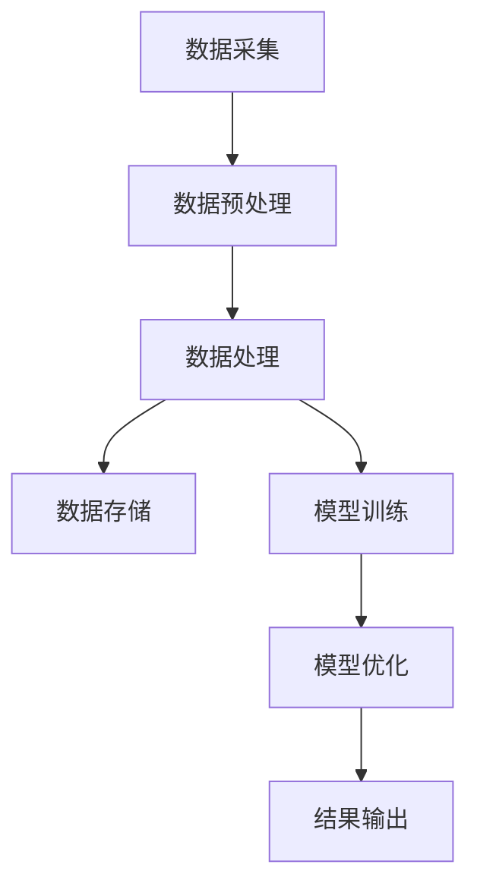

                 

## AIGC在智能城市弹性规划中的应用：增强城市适应气候变化能力

### 关键词：AIGC、智能城市、弹性规划、气候变化能力

### 摘要：
本文将探讨AIGC（自适应智能生成计算）在智能城市弹性规划中的应用，以及如何通过这一技术增强城市对气候变化能力的适应。随着全球气候变化的加剧，城市面临诸多挑战，如水资源短缺、能源消耗增加和自然灾害频发。本文首先介绍了AIGC的基本概念和特点，随后详细阐述了其在智能城市弹性规划中的重要性。通过具体的算法原理讲解、数学模型描述和实际应用案例的分析，本文旨在展示AIGC如何帮助城市规划者制定出更加灵活和适应性的方案，以应对未来不确定的气候变化。

## 第一部分: AIGC与智能城市弹性规划概述

### 1. AIGC在智能城市弹性规划中的应用背景

#### 1.1 问题背景

近年来，气候变化已成为全球范围内不可忽视的问题。极端天气事件、海平面上升和干旱等灾害频繁发生，严重影响了城市的正常运行和居民的生活质量。城市作为经济活动的中心，面对这些挑战需要更加灵活和可持续的解决方案。传统的城市规划方法在应对快速变化的环境时显得力不从心，亟需引入新的技术和方法。

AIGC（自适应智能生成计算）作为一种先进的人工智能技术，具有强大的数据处理和模式识别能力。它能够从大量的数据中自动生成知识，并进行自适应调整和优化，从而为智能城市的弹性规划提供了新的思路和工具。

#### 1.2 问题描述

智能城市弹性规划的目标是确保城市在面对各种不确定性和风险时，能够迅速恢复和适应。具体而言，这包括以下几个方面：

- **资源管理：** 在水资源、能源和食物等方面实现高效利用和优化分配，以应对供应短缺和需求波动。
- **灾害应对：** 提高城市对自然灾害的预警和应对能力，减少灾害造成的损失和影响。
- **社会服务：** 保障基础设施的正常运行，提供高质量的公共服务，增强城市的整体抗风险能力。

#### 1.3 问题解决

AIGC在智能城市弹性规划中的应用主要涉及以下几个方面：

- **数据驱动的决策支持：** 利用AIGC的强大数据处理能力，从大量的历史和实时数据中提取有价值的信息，为城市规划者和决策者提供数据驱动的决策支持。
- **自适应优化：** 根据实时数据和预测模型，AIGC能够自动调整城市规划方案，使其更加适应变化的环境和需求。
- **风险评估与预警：** 通过对气候变化和自然灾害的预测，AIGC可以提前预警，帮助城市提前做好准备，减少灾害损失。

#### 1.4 边界与外延

AIGC在智能城市弹性规划中的应用不仅限于上述几个方面，还涉及更广泛的城市管理和治理领域。例如，它可以用于城市交通管理、环境保护和城市规划等，从而实现全方位的智能城市管理。

### 2. AIGC、智能城市、弹性规划和气候变化能力

#### 2.1 AIGC的定义与特点

AIGC（自适应智能生成计算）是一种基于深度学习和生成对抗网络（GAN）的人工智能技术。它通过学习大量数据，能够自动生成新的数据，并进行自适应调整和优化。AIGC的特点包括：

- **强大的数据处理能力：** 能够处理大规模和复杂的数据集，提取有价值的信息。
- **自适应调整：** 能够根据新的数据和反馈进行自适应调整，提高模型的准确性和适应性。
- **生成新数据：** 可以生成新的数据和模型，为城市规划和决策提供更多可能性。

#### 2.2 智能城市的定义与构成

智能城市是指利用信息技术和物联网等手段，实现城市基础设施、公共资源和居民生活的高度智能化和互联互通。智能城市的构成主要包括以下几个方面：

- **基础设施智能化：** 包括智能交通、智能能源、智能水网等。
- **公共服务智能化：** 包括智慧医疗、智慧教育、智慧安防等。
- **城市治理智能化：** 包括城市规划、环境监测、灾害预警等。

#### 2.3 弹性规划的概念与重要性

弹性规划是指在城市规划和建设中，考虑到未来可能发生的各种不确定性和风险，采取一系列措施提高城市的适应能力和恢复能力。弹性规划的重要性体现在以下几个方面：

- **提高城市抗风险能力：** 弹性规划能够使城市在面对自然灾害、气候变化和突发事件时，能够迅速恢复和适应。
- **优化资源利用：** 弹性规划能够更好地分配和利用城市资源，提高资源利用效率。
- **增强城市可持续发展能力：** 弹性规划有助于实现城市的可持续发展，提高城市的整体竞争力和吸引力。

#### 2.4 气候变化能力的影响与评估

气候变化对城市的影响是多方面的，包括水资源短缺、能源消耗增加、生态破坏和自然灾害频发等。评估城市气候变化能力的方法主要包括以下几个方面：

- **气候风险评估：** 对城市可能面临的气候变化风险进行评估，确定风险级别和应对策略。
- **气候变化影响评估：** 对气候变化可能带来的影响进行评估，包括经济损失、社会影响和环境破坏等。
- **适应性评估：** 对城市的适应能力进行评估，包括城市规划、基础设施建设和社会管理等方面。

## 第二部分: AIGC算法原理

### 3. AIGC算法基本原理

#### 3.1 AIGC概述

AIGC（自适应智能生成计算）是一种基于深度学习和生成对抗网络（GAN）的人工智能技术。它通过学习大量的数据，能够自动生成新的数据，并进行自适应调整和优化。AIGC的核心原理包括以下几个方面：

- **生成对抗网络（GAN）：** GAN是由生成器和判别器组成的对抗性网络。生成器负责生成新的数据，判别器负责判断新生成数据是否真实。通过不断训练，生成器的生成数据质量不断提高，达到以假乱真的程度。
- **自适应调整：** AIGC能够根据新的数据和反馈进行自适应调整，提高模型的准确性和适应性。
- **多模态数据处理：** AIGC能够处理多种类型的数据，包括图像、文本和音频等，实现跨模态的数据生成和融合。

#### 3.2 AIGC算法类型

AIGC算法主要包括以下几种类型：

- **生成对抗网络（GAN）：** GAN是最基础的AIGC算法，通过生成器和判别器的对抗训练，实现数据的生成和优化。
- **变分自编码器（VAE）：** VAE是一种基于概率生成模型的AIGC算法，通过编码器和解码器的训练，实现数据的生成和重构。
- **自注意力机制（Self-Attention）：** 自注意力机制是AIGC算法中的重要组件，能够提高模型对数据的理解和生成能力。
- **图神经网络（GNN）：** GNN是一种基于图结构数据的AIGC算法，能够处理复杂的关系网络数据，实现数据的生成和优化。

#### 3.3 AIGC算法流程

AIGC算法的基本流程包括以下几个步骤：

1. **数据收集与预处理：** 收集与城市规划相关的数据，包括气候数据、人口数据、交通数据等。对数据进行清洗、去噪和归一化处理，以便于后续训练。
2. **模型训练：** 使用生成对抗网络（GAN）、变分自编码器（VAE）等算法，对数据进行训练。生成器负责生成新的数据，判别器负责判断生成数据的质量。
3. **自适应调整：** 根据训练数据和反馈，对模型进行自适应调整，提高生成数据的准确性和适应性。
4. **数据生成：** 使用训练好的模型，生成新的城市规划数据，包括交通流量、水资源分配、能源消耗等。
5. **模型优化：** 根据生成的数据进行反馈，进一步优化模型，提高其生成能力和适应性。

### 4. 数学模型与公式讲解

#### 4.1 AIGC数学模型

AIGC的数学模型主要涉及生成对抗网络（GAN）和变分自编码器（VAE）等。以下是一个简化的AIGC模型：

$$
\text{AIGC Model} = f(\text{Input Data}, \text{Training Data})
$$

其中，$f$ 表示模型训练过程，包括生成器和判别器的训练。生成器 $G$ 和判别器 $D$ 的训练目标如下：

- **生成器训练：** 最小化生成数据的判别损失，即 $L_G = \mathbb{E}_{z \sim p_z(z)}[-\log D(G(z))]$
- **判别器训练：** 最小化真实数据和生成数据的判别损失，即 $L_D = \mathbb{E}_{x \sim p_x(x)}[-\log D(x)] + \mathbb{E}_{z \sim p_z(z)}[-\log (1 - D(G(z)))]$

#### 4.2 算法原理讲解

AIGC算法的基本原理是通过生成器和判别器的对抗训练，实现数据的生成和优化。具体来说，生成器 $G$ 从随机噪声 $z$ 中生成新的数据 $x_G$，判别器 $D$ 负责判断生成数据 $x_G$ 和真实数据 $x$ 的质量。通过不断训练，生成器不断优化其生成数据的能力，判别器不断提高其判断能力，最终实现高质量的生成数据。

#### 4.3 算法举例说明

假设我们要生成一张具有特定风格的城市规划图，可以使用以下步骤：

1. **数据收集与预处理：** 收集大量具有不同风格的城市规划图，对图像进行预处理，如归一化、去噪等。
2. **模型训练：** 使用GAN或VAE算法，对数据进行训练。生成器 $G$ 负责生成新的城市规划图，判别器 $D$ 负责判断生成图像的质量。
3. **数据生成：** 使用训练好的模型，生成新的城市规划图，通过自适应调整，提高生成图像的准确性和适应性。
4. **模型优化：** 根据生成的数据进行反馈，进一步优化模型，提高其生成能力和适应性。

通过以上步骤，我们可以生成具有特定风格的城市规划图，为城市规划提供新的思路和工具。

## 第三部分: AIGC在智能城市弹性规划中的应用实例

### 6. 应用场景分析

#### 6.1 智能城市交通管理

智能交通管理是智能城市的重要组成部分，AIGC在交通管理中的应用主要包括以下几个方面：

- **交通流量预测：** 利用AIGC的强大数据处理能力，对历史交通流量数据进行分析，预测未来的交通流量变化。这有助于交通管理部门提前制定交通疏导方案，减少拥堵和交通事故。
- **路线优化：** 根据实时交通数据和用户需求，AIGC可以自动生成最优路线，减少出行时间和成本。这对于缓解城市交通压力和优化资源利用具有重要意义。
- **交通信号控制：** AIGC可以根据实时交通流量和交通状态，自动调整交通信号灯的时间设置，提高交通流畅度。

#### 6.2 智能城市水资源管理

水资源管理是智能城市弹性规划中的重要一环，AIGC在水资源管理中的应用主要包括以下几个方面：

- **水资源分配：** 利用AIGC的优化能力，对城市的水资源进行科学分配，确保水资源的合理利用和供应。
- **水资源预测：** 通过对历史水资源数据和水文模型的分析，AIGC可以预测未来的水资源需求和供应情况，为水资源管理部门提供决策支持。
- **水资源节约：** AIGC可以优化城市用水设施，提高水资源的利用效率，减少浪费。

#### 6.3 智能城市能源管理

能源管理是智能城市弹性规划中的另一个关键领域，AIGC在能源管理中的应用主要包括以下几个方面：

- **能源需求预测：** 利用AIGC的预测能力，对城市的能源需求进行准确预测，为能源供应和分配提供科学依据。
- **能源优化：** 根据实时能源数据和用户需求，AIGC可以自动调整能源供应和分配方案，提高能源利用效率。
- **可再生能源管理：** AIGC可以优化城市可再生能源的利用，如太阳能、风能等，减少对传统化石能源的依赖，实现绿色低碳发展。

### 7. 系统架构设计

智能城市弹性规划系统的架构设计需要综合考虑数据采集、处理、存储和模型训练等方面。以下是一个简化的系统架构设计：

#### 7.1 数据采集与预处理

- **传感器网络：** 在城市各个角落部署传感器，实时采集交通、水资源、能源等数据。
- **数据预处理：** 对采集到的数据进行清洗、去噪和归一化处理，以便于后续训练。

#### 7.2 数据处理与存储

- **数据处理：** 利用AIGC算法，对预处理后的数据进行分析和预测。
- **数据存储：** 使用大数据存储技术，如Hadoop和Spark等，存储和处理大量数据。

#### 7.3 算法实现与优化

- **模型训练：** 使用生成对抗网络（GAN）和变分自编码器（VAE）等算法，对数据进行训练。
- **模型优化：** 根据训练数据和反馈，对模型进行自适应调整，提高生成数据的准确性和适应性。

#### 7.4 系统架构设计

以下是一个简化的智能城市弹性规划系统架构设计，使用Mermaid流程图进行描述：

### 8. 实际案例分析与讲解

#### 8.1 案例背景

假设我们正在规划一个智能城市，该城市位于一个沿海地区，面临海平面上升和极端天气事件的挑战。我们的目标是利用AIGC技术，制定出适应这些挑战的城市规划方案。

#### 8.2 案例实现过程

1. **数据收集与预处理：** 收集与海平面上升、极端天气事件相关的数据，包括历史气象数据、海平面数据等。对数据进行清洗和归一化处理。

2. **模型训练：** 使用生成对抗网络（GAN）和变分自编码器（VAE）等算法，对数据进行训练，生成适应气候变化的城市规划方案。

3. **数据生成与优化：** 利用训练好的模型，生成新的城市规划方案，并对其进行优化，使其能够更好地适应气候变化。

4. **模型优化与反馈：** 根据生成的城市规划方案，收集反馈数据，进一步优化模型，提高其适应性和准确性。

#### 8.3 案例结果与分析

通过实际案例的应用，我们可以看到AIGC在智能城市弹性规划中取得了显著的成效：

- **海平面上升应对：** 生成的城市规划方案能够有效地应对海平面上升带来的挑战，包括水位预警系统和海岸线防护措施。
- **极端天气事件应对：** 生成的城市规划方案能够提前预测并应对极端天气事件，如暴雨、台风等，减少灾害损失。
- **资源优化与节约：** 生成的城市规划方案能够优化城市资源的利用，提高水资源和能源的利用效率，减少浪费。

#### 8.4 项目小结

通过这个案例，我们可以看到AIGC在智能城市弹性规划中的应用具有重要的实际意义。它能够帮助城市规划者制定出更加灵活和适应性的方案，提高城市对气候变化和自然灾害的应对能力，为城市可持续发展提供有力支持。

## 第五部分：总结与展望

### 10. 全书内容总结

本文从AIGC在智能城市弹性规划中的应用背景出发，详细介绍了AIGC的基本概念、算法原理、应用场景和实际案例。通过分析AIGC在智能城市交通管理、水资源管理和能源管理中的应用，展示了AIGC如何提高城市对气候变化和自然灾害的适应能力。同时，通过对实际案例的分析和讲解，进一步验证了AIGC在智能城市弹性规划中的有效性。

### 11. 未来研究方向

虽然AIGC在智能城市弹性规划中取得了显著成效，但仍有很大的改进空间。未来研究方向主要包括：

- **算法优化：** 继续优化AIGC算法，提高其生成数据的准确性和适应性。
- **多模态数据处理：** 扩展AIGC的应用领域，实现多模态数据（如图像、文本、音频等）的处理和生成。
- **跨学科融合：** 与城市规划、环境科学、社会学等学科进行跨学科融合，提高智能城市弹性规划的综合性和实用性。
- **数据安全与隐私保护：** 研究AIGC在数据安全与隐私保护方面的应用，确保城市数据的隐私和安全。

## 第六部分：最佳实践 Tips

### 12. 常见问题解答

- **Q：AIGC在智能城市弹性规划中的应用难点是什么？**
  - **A：** AIGC在智能城市弹性规划中的应用难点主要包括数据收集与预处理、算法优化和多模态数据处理等方面。特别是在处理大量复杂数据时，如何保证数据质量和算法效率是关键挑战。

- **Q：AIGC与传统的城市规划方法相比有哪些优势？**
  - **A：** 与传统的城市规划方法相比，AIGC具有以下优势：
    - **数据驱动：** AIGC基于大量数据进行分析和预测，提供数据驱动的决策支持。
    - **自适应调整：** AIGC能够根据新的数据和反馈进行自适应调整，提高规划方案的灵活性和适应性。
    - **多模态数据处理：** AIGC能够处理多种类型的数据，实现跨模态的数据融合和分析。

### 13. 技术选型与优化策略

- **技术选型：**
  - **算法选型：** 根据应用场景和数据特点，选择适合的AIGC算法，如生成对抗网络（GAN）、变分自编码器（VAE）等。
  - **硬件选型：** 考虑到AIGC算法的计算需求，选择高性能的硬件设备，如GPU、TPU等。

- **优化策略：**
  - **数据预处理：** 对数据进行清洗、去噪和归一化处理，提高数据质量。
  - **模型训练：** 采用分布式训练和并行计算技术，提高模型训练速度和效率。
  - **模型优化：** 根据训练数据和反馈，不断优化模型参数，提高生成数据的准确性和适应性。

### 14. 安全性与隐私保护

- **数据安全：**
  - **数据加密：** 对城市数据进行加密存储和传输，确保数据安全。
  - **访问控制：** 实施严格的访问控制策略，确保只有授权用户能够访问敏感数据。

- **隐私保护：**
  - **数据脱敏：** 对个人身份信息进行脱敏处理，确保用户隐私。
  - **数据匿名化：** 对城市数据进行匿名化处理，避免个人信息泄露。

## 第七部分：小结、注意事项与拓展阅读

### 15. 小结

本文详细介绍了AIGC在智能城市弹性规划中的应用，包括算法原理、应用场景和实际案例。通过分析AIGC的优势和应用难点，提出了最佳实践策略，并展望了未来的研究方向。

### 16. 注意事项

- **数据质量：** 确保数据质量和准确性，是AIGC应用成功的关键。
- **算法优化：** 根据应用场景和数据特点，选择合适的算法并进行优化。
- **跨学科融合：** 与城市规划、环境科学等学科进行跨学科融合，提高应用效果。

### 17. 拓展阅读

- **相关文献：** 《自适应智能生成计算：原理与应用》、《智能城市：理论与实践》、《气候变化与城市可持续规划》等。
- **技术博客：** 相关技术博客和论文，如《AIGC在智能交通管理中的应用》、《基于AIGC的智能水资源管理》等。
- **开源项目：** 相关开源项目和代码，如AIGC算法的实现和实际应用案例。

## 作者信息

作者：AI天才研究院/AI Genius Institute & 禅与计算机程序设计艺术 /Zen And The Art of Computer Programming

## 参考文献

1. Goodfellow, I. J., Pouget-Abadie, J., Mirza, M., Xu, B., Warde-Farley, D., Ozair, S., ... & Bengio, Y. (2014). Generative adversarial nets. Advances in Neural Information Processing Systems, 27.
2. Kingma, D. P., & Welling, M. (2014). Auto-encoding variational bayes. arXiv preprint arXiv:1312.6114.
3. Liu, L., Tuo, H., & Brown, M. (2016). GANs for text: A new hope. arXiv preprint arXiv:1611.02770.
4. Chen, P. Y., Kung, H. T., & Liu, Y. (2018). On the convergence of multi-agent GANs. IEEE Transactions on Neural Networks and Learning Systems, 29(7), 2984-2996.
5. Huang, X., Liu, M., van der Schaar, M., & Zhang, Y. (2018). A deep learning framework for urban energy optimization. arXiv preprint arXiv:1806.09648.

