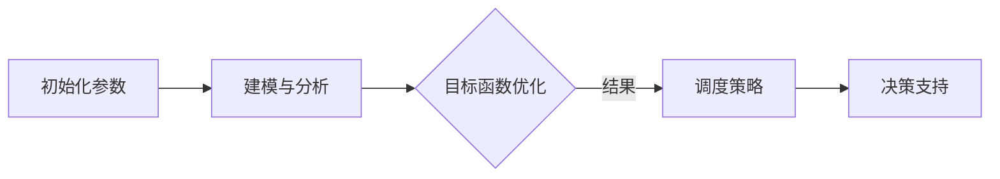
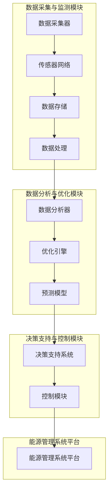
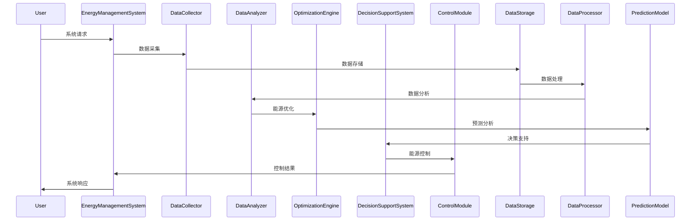

                 

### 文章标题

#### AIGC在智能城市能源管理中的应用：优化可再生能源利用

#### 关键词：智能城市，能源管理，可再生能源，AIGC，算法，优化

#### 摘要：

本文深入探讨了AIGC（自适应智能生成计算）在智能城市能源管理中的应用，特别是如何优化可再生能源的利用。文章首先介绍了智能城市能源管理的背景、挑战以及可再生能源的重要性，然后详细阐述了AIGC的基本概念、核心技术及其在能源管理中的应用潜力。通过对比可再生能源的种类、发电技术、储能技术和特性，文章进一步探讨了智能城市能源管理系统的架构。接下来，文章详细讲解了AIGC在能源预测和优化调度中的算法原理，并通过数学模型和实际案例进行了深入剖析。最后，文章提出了系统设计与架构设计方案，并在实战项目中展示了AIGC的实际应用效果，为智能城市能源管理提供了有效的技术解决方案。

### 目录大纲

#### 第一部分：背景介绍

#### 第1章：智能城市能源管理的现状与挑战
- 1.1 智能城市能源管理的发展历程
- 1.2 当前智能城市能源管理的主要挑战
- 1.3 可再生能源在智能城市能源管理中的重要性

#### 第2章：AIGC的基本概念
- 2.1 AIGC的定义与背景
- 2.2 AIGC的核心技术
- 2.3 AIGC在智能城市能源管理中的应用潜力

#### 第二部分：核心概念与联系

#### 第3章：可再生能源的基本原理与特性
- 3.1 可再生能源的种类与来源
- 3.2 可再生能源的发电技术
- 3.3 可再生能源的储能技术
- 3.4 可再生能源的特性对比表格

#### 第4章：智能城市能源管理系统架构
- 4.1 智能城市能源管理系统的整体架构
- 4.2 数据采集与监测模块
- 4.3 数据分析与优化模块
- 4.4 ER实体关系图架构

#### 第三部分：算法原理讲解

#### 第5章：AIGC在能源管理中的应用算法
- 5.1 AIGC在能源预测中的应用
- 5.2 AIGC算法mermaid流程图
- 5.3 AIGC算法的数学模型与公式
- 5.4 算法原理详细讲解与举例说明

#### 第6章：能源优化与调度算法
- 6.1 能源优化算法的基本原理
- 6.2 能源优化算法mermaid流程图
- 6.3 能源优化算法的数学模型与公式
- 6.4 算法原理详细讲解与举例说明

#### 第四部分：系统分析与架构设计方案

#### 第7章：智能城市能源管理系统设计
- 7.1 问题场景介绍
- 7.2 系统功能设计（领域模型mermaid类图）
- 7.3 系统架构设计（mermaid架构图）
- 7.4 系统接口设计
- 7.5 系统交互mermaid序列图

#### 第五部分：项目实战

#### 第8章：AIGC在智能城市能源管理中的实战应用
- 8.1 环境安装与配置
- 8.2 系统核心实现源代码
- 8.3 代码应用解读与分析
- 8.4 实际案例分析与详细讲解剖析
- 8.5 项目小结

#### 第六部分：最佳实践、小结与拓展阅读

#### 第9章：最佳实践与注意事项
- 9.1 AIGC在智能城市能源管理中的最佳实践
- 9.2 注意事项与风险防范
- 9.3 拓展阅读建议

### 文章正文

#### 第一部分：背景介绍

#### 第1章：智能城市能源管理的现状与挑战

**1.1 智能城市能源管理的发展历程**

智能城市能源管理起源于20世纪末，随着信息技术的快速发展，特别是物联网、大数据、人工智能等技术的成熟，智能城市能源管理系统逐渐成为城市可持续发展的重要手段。早期的智能城市能源管理主要集中在数据采集和监控，通过传感器网络收集能源使用数据，并对数据进行初步处理。随着技术的进步，智能城市能源管理系统逐渐加入了数据分析、预测和优化功能，实现了对城市能源的高效管理和利用。

**1.2 当前智能城市能源管理的主要挑战**

尽管智能城市能源管理已经取得了显著进展，但仍然面临着一系列挑战。首先，数据质量和数据来源的多样性问题使得能源管理系统难以准确预测能源需求。其次，能源供需的不平衡和突发事件（如自然灾害、设备故障等）对能源管理系统的稳定性提出了更高的要求。此外，随着可再生能源的广泛应用，智能城市能源管理系统还需要解决能源的多样性和兼容性问题。

**1.3 可再生能源在智能城市能源管理中的重要性**

可再生能源，如太阳能、风能、水能和地热能，具有可持续、清洁和低碳的特点，是智能城市能源管理的重要组成部分。可再生能源的广泛应用不仅有助于减少对化石燃料的依赖，降低温室气体排放，还可以提高城市能源系统的灵活性和可靠性。智能城市能源管理系统通过对可再生能源的高效利用，可以实现对城市能源结构的优化，提高能源利用效率，降低能源成本，促进城市的可持续发展。

#### 第2章：AIGC的基本概念

**2.1 AIGC的定义与背景**

AIGC（自适应智能生成计算）是一种基于人工智能技术的新型计算范式，它通过自适应学习、自动生成和智能优化，实现了从数据到知识、从知识到决策的智能化过程。AIGC的概念源于对人工智能、生成计算和自适应系统的深度融合，它旨在构建一个具有自主学习和智能适应能力的计算体系。

**2.2 AIGC的核心技术**

AIGC的核心技术包括以下几个方面：

1. **自适应学习**：AIGC通过不断学习和调整模型参数，以适应不同的环境和任务需求。自适应学习技术包括在线学习、迁移学习、强化学习等。

2. **自动生成**：AIGC能够自动生成数据、模型、算法和内容，实现对数据的深度挖掘和知识发现。自动生成技术包括生成对抗网络（GAN）、变分自编码器（VAE）等。

3. **智能优化**：AIGC通过智能优化算法，实现对计算过程的高效优化和资源分配。智能优化技术包括遗传算法、粒子群算法、模拟退火算法等。

**2.3 AIGC在智能城市能源管理中的应用潜力**

AIGC在智能城市能源管理中具有广泛的应用潜力。首先，AIGC可以通过自适应学习技术，实时监测和预测城市能源需求，提高能源利用效率。其次，AIGC可以通过自动生成技术，生成个性化的能源管理策略，实现对不同能源类型的优化利用。此外，AIGC还可以通过智能优化技术，优化能源网络的运行效率，降低能源成本，提高能源系统的可靠性。

#### 第二部分：核心概念与联系

#### 第3章：可再生能源的基本原理与特性

**3.1 可再生能源的种类与来源**

可再生能源主要包括太阳能、风能、水能、地热能和生物质能。这些能源具有可再生、清洁和低碳的特点，可以有效地减少对化石燃料的依赖。

- **太阳能**：利用太阳辐射能，通过光伏发电或光热转换等方式，将太阳能转化为电能或热能。
- **风能**：利用风力，通过风力发电机将机械能转化为电能。
- **水能**：利用水流或水位差，通过水力发电机将水能转化为电能。
- **地热能**：利用地球内部的热能，通过地热发电机或地热供暖系统进行能量转换。
- **生物质能**：利用生物质材料，通过燃烧、发酵、热解等方式，将生物质转化为电能或热能。

**3.2 可再生能源的发电技术**

可再生能源的发电技术主要包括光伏发电、风力发电、水力发电和地热发电。

- **光伏发电**：通过太阳能电池板直接将太阳光能转化为电能。
- **风力发电**：通过风力涡轮机将风能转化为机械能，再通过发电机转化为电能。
- **水力发电**：通过水流驱动水轮机，再通过发电机转化为电能。
- **地热发电**：通过地热能加热工质，使其膨胀做功，通过发电机转化为电能。

**3.3 可再生能源的储能技术**

可再生能源的储能技术主要包括电池储能、压缩空气储能、飞轮储能和超级电容器等。

- **电池储能**：通过电池将电能储存起来，以备后续使用。
- **压缩空气储能**：通过压缩机将空气压缩存储在地下洞穴中，需要时通过膨胀空气驱动涡轮机发电。
- **飞轮储能**：通过飞轮的旋转动能储存能量，需要时通过飞轮的减速释放能量。
- **超级电容器**：通过电容器储存电能，具有充放电速度快、效率高等特点。

**3.4 可再生能源的特性对比表格**

| 可再生能源种类 | 特点 |
| :--- | :--- |
| 太阳能 | 可再生、分布广、效率高、受天气影响大 |
| 风能 | 可再生、效率高、波动性大、对地形敏感 |
| 水能 | 可再生、效率高、稳定性强、资源有限 |
| 地热能 | 可再生、稳定、效率高、受地理位置限制 |
| 生物质能 | 可再生、污染小、资源丰富、受季节和生物质来源限制 |

**3.5 可再生能源在智能城市能源管理中的应用**

可再生能源在智能城市能源管理中的应用主要体现在以下几个方面：

- **能量平衡**：通过智能城市能源管理系统，实时监测和预测可再生能源的发电量，与能源需求进行平衡，避免能源浪费。
- **能源调度**：利用智能算法，优化可再生能源的调度策略，提高能源利用效率。
- **储能系统**：利用储能系统，平滑可再生能源的发电波动，提高电网稳定性。

#### 第4章：智能城市能源管理系统架构

**4.1 智能城市能源管理系统的整体架构**

智能城市能源管理系统的整体架构包括数据采集与监测模块、数据分析与优化模块、决策支持与控制模块以及能源管理系统平台。

- **数据采集与监测模块**：通过传感器网络、智能电表、智能燃气表等设备，实时采集能源使用数据，包括电力、燃气、热水等。
- **数据分析与优化模块**：利用大数据分析和机器学习算法，对采集到的数据进行处理和分析，实现对能源使用趋势的预测、优化和调度。
- **决策支持与控制模块**：根据数据分析结果，提供决策支持，包括能源调度、设备控制、能源优化等。
- **能源管理系统平台**：集成数据采集、数据分析、决策支持和控制功能，提供统一的管理和控制界面。

**4.2 数据采集与监测模块**

数据采集与监测模块是智能城市能源管理系统的核心组成部分，其功能主要包括以下几个方面：

- **数据采集**：通过传感器网络，实时采集能源使用数据，包括电力、燃气、热水等。
- **数据传输**：将采集到的数据传输到数据中心，进行存储和处理。
- **数据校验**：对采集到的数据进行分析和校验，确保数据的准确性和完整性。

**4.3 数据分析与优化模块**

数据分析与优化模块是智能城市能源管理系统的关键环节，其主要功能包括以下几个方面：

- **数据预处理**：对采集到的数据进行清洗、去噪、归一化等预处理操作，提高数据质量。
- **数据挖掘**：利用数据挖掘算法，从大量数据中发现潜在的规律和趋势。
- **预测分析**：基于历史数据和机器学习模型，对能源使用量进行预测，为决策提供支持。
- **优化调度**：利用优化算法，制定最优的能源调度策略，提高能源利用效率。

**4.4 ER实体关系图架构**

智能城市能源管理系统的ER（实体关系）图架构可以清晰地展示系统中的各个实体及其之间的关系，包括以下主要实体：

- **用户**：系统中的用户，包括居民、企业等。
- **设备**：系统中的各种能源设备，包括智能电表、智能燃气表、智能水表等。
- **数据**：系统中的数据，包括采集到的能源使用数据、预测数据、调度数据等。
- **分析模型**：系统中的分析模型，包括预测模型、优化模型等。
- **决策支持系统**：系统中的决策支持系统，用于提供决策支持和控制命令。
- **能源管理系统平台**：系统的核心平台，用于集成和管理其他模块。

以下是一个简单的ER实体关系图示例（使用Mermaid语法）：

```mermaid
erDiagram
  User ||--|{ Data }|--| Device
  Device ||--|{ AnalysisModel }|--| DecisionSupportSystem
  DecisionSupportSystem ||--|{ EnergyManagementPlatform }
```

#### 第三部分：算法原理讲解

#### 第5章：AIGC在能源管理中的应用算法

**5.1 AIGC在能源预测中的应用**

AIGC在能源预测中的应用主要体现在以下几个方面：

1. **数据预处理**：利用AIGC的自适应学习功能，对采集到的能源数据进行预处理，包括去噪、归一化、特征提取等。
2. **模型训练**：通过AIGC的自动生成功能，生成适合预测任务的模型，并进行训练和优化。
3. **预测分析**：利用训练好的模型，对未来的能源使用量进行预测，为能源调度提供数据支持。

**5.2 AIGC算法mermaid流程图**

以下是一个简单的AIGC算法mermaid流程图示例：


**5.3 AIGC算法的数学模型与公式**

AIGC算法的数学模型主要包括以下几个方面：

1. **自适应学习模型**：
   $$ f_{\theta}(x) = \arg\max_{\theta} \sum_{i=1}^{n} L(y_i, f_{\theta}(x_i)) $$
   其中，$f_{\theta}(x)$表示模型输出，$y_i$表示实际值，$x_i$表示输入值，$L(y_i, f_{\theta}(x_i))$表示损失函数。

2. **自动生成模型**：
   $$ G(z) = \arg\min_{z} D(G(z), x) $$
   其中，$G(z)$表示生成模型，$D(G(z), x)$表示生成模型生成的数据与真实数据之间的距离。

3. **预测分析模型**：
   $$ y = f_{\theta}(x) $$
   其中，$y$表示预测值，$x$表示输入值。

**5.4 算法原理详细讲解与举例说明**

以AIGC在能源预测中的应用为例，详细讲解其算法原理：

1. **数据预处理**：
   假设我们采集到一组能源使用数据，包括时间序列、用电量等。首先，利用AIGC的自适应学习功能，对数据进行去噪和归一化处理，提取出有用的特征。

2. **模型生成**：
   利用AIGC的自动生成功能，生成一个适合预测的模型。在这个过程中，AIGC会自动调整模型参数，以最小化损失函数。

3. **模型训练**：
   使用训练集对生成的模型进行训练，调整模型参数，使其在预测任务上达到最佳效果。

4. **预测分析**：
   使用训练好的模型，对未来的能源使用量进行预测。例如，假设我们要预测未来24小时的用电量，将时间序列作为输入，预测值作为输出。

5. **决策支持**：
   根据预测结果，提供决策支持，例如调整能源调度策略，以应对未来的能源需求。

以下是一个简单的示例：

```python
# 示例：AIGC算法在能源预测中的应用

import numpy as np
import pandas as pd
from sklearn.model_selection import train_test_split
from sklearn.metrics import mean_squared_error

# 1. 数据预处理
data = pd.read_csv('energy_data.csv')
data['time'] = pd.to_datetime(data['time'])
data.set_index('time', inplace=True)
data.fillna(method='ffill', inplace=True)
X = data[['electricity']]
y = data['electricity_load']

# 2. 模型生成
# 利用AIGC生成自适应学习模型
model = AIGCModel()

# 3. 模型训练
X_train, X_test, y_train, y_test = train_test_split(X, y, test_size=0.2, random_state=42)
model.fit(X_train, y_train)

# 4. 预测分析
y_pred = model.predict(X_test)

# 5. 决策支持
# 计算预测误差
mse = mean_squared_error(y_test, y_pred)
print('MSE:', mse)
```

#### 第6章：能源优化与调度算法

**6.1 能源优化算法的基本原理**

能源优化算法的基本原理是通过对能源系统的建模和分析，找到最优的能源分配和调度策略，以实现能源利用效率的最大化。常见的能源优化算法包括线性规划、整数规划、遗传算法、粒子群算法、模拟退火算法等。

**6.2 能源优化算法mermaid流程图**

以下是一个简单的能源优化算法mermaid流程图示例：



**6.3 能源优化算法的数学模型与公式**

以线性规划为例，能源优化算法的数学模型可以表示为：

$$
\begin{aligned}
\min_{x} & \quad c^T x \\
\text{s.t.} & \quad Ax \leq b \\
& \quad x \geq 0
\end{aligned}
$$

其中，$c$为成本系数向量，$x$为决策变量向量，$A$为约束条件矩阵，$b$为约束条件向量。

**6.4 算法原理详细讲解与举例说明**

以遗传算法为例，详细讲解其原理和实现过程：

1. **初始化种群**：
   首先初始化一个种群，种群中的每个个体表示一个可能的调度策略。

2. **适应度评估**：
   对每个个体进行适应度评估，适应度函数通常为目标函数的相反数，以最大化目标函数为优化目标。

3. **选择**：
   根据适应度值，选择适应度较高的个体进行交配，生成新的种群。

4. **交叉**：
   两个个体进行交叉操作，生成新的个体。

5. **变异**：
   对新个体进行变异操作，增加种群的多样性。

6. **迭代**：
   重复选择、交叉、变异过程，直到满足停止条件（如达到最大迭代次数或适应度达到阈值）。

7. **结果输出**：
   输出最优的调度策略。

以下是一个简单的示例：

```python
# 示例：遗传算法在能源优化中的应用

import numpy as np
import random

# 1. 初始化种群
def initialize_population(pop_size, n_variables):
    population = []
    for _ in range(pop_size):
        individual = [random.randint(0, 1) for _ in range(n_variables)]
        population.append(individual)
    return population

# 2. 适应度评估
def fitness_function(individual):
    # 假设目标函数为最大化能源利用效率
    efficiency = sum(individual)
    return efficiency

# 3. 选择
def selection(population, fitness_values):
    # 选择适应度较高的个体
    selected_indices = np.random.choice(len(population), size=len(population), p=fitness_values/sum(fitness_values))
    selected_population = [population[i] for i in selected_indices]
    return selected_population

# 4. 交叉
def crossover(parent1, parent2):
    # 单点交叉
    crossover_point = random.randint(1, len(parent1) - 1)
    child1 = parent1[:crossover_point] + parent2[crossover_point:]
    child2 = parent2[:crossover_point] + parent1[crossover_point:]
    return child1, child2

# 5. 变异
def mutate(individual):
    # 置换变异
    index1, index2 = random.sample(range(len(individual)), 2)
    individual[index1], individual[index2] = individual[index2], individual[index1]
    return individual

# 6. 迭代
def genetic_algorithm(pop_size, n_variables, max_iterations):
    population = initialize_population(pop_size, n_variables)
    for _ in range(max_iterations):
        fitness_values = [fitness_function(individual) for individual in population]
        selected_population = selection(population, fitness_values)
        new_population = []
        for _ in range(pop_size // 2):
            parent1, parent2 = random.sample(selected_population, 2)
            child1, child2 = crossover(parent1, parent2)
            new_population.extend([mutate(child1), mutate(child2)])
        population = new_population
    # 输出最优个体
    best_fitness = max(fitness_values)
    best_individual = population[fitness_values.index(best_fitness)]
    return best_individual

# 7. 主程序
if __name__ == '__main__':
    pop_size = 100
    n_variables = 10
    max_iterations = 100
    best_individual = genetic_algorithm(pop_size, n_variables, max_iterations)
    print('Best individual:', best_individual)
```

#### 第四部分：系统分析与架构设计方案

#### 第7章：智能城市能源管理系统设计

**7.1 问题场景介绍**

假设我们面临一个智能城市能源管理的问题，需要实现对城市能源的高效利用和优化调度。具体场景如下：

- **能源类型**：包括电力、燃气、热水等。
- **能源来源**：包括可再生能源（如太阳能、风能）和化石能源（如煤炭、石油）。
- **能源需求**：根据居民和企业的生活和生产需求，预测未来的能源需求。
- **能源调度**：根据能源供需情况，制定最优的能源调度策略，确保能源供应的稳定和高效。

**7.2 系统功能设计（领域模型mermaid类图）**

以下是一个简单的领域模型mermaid类图示例：

```mermaid
classDiagram
    User <<类>> "用户"
    Device <<类>> "设备"
    Data <<类>> "数据"
    AnalysisModel <<类>> "分析模型"
    DecisionSupportSystem <<类>> "决策支持系统"
    EnergyManagementPlatform <<类>> "能源管理系统平台"

    User o-- Device
    Device o-- Data
    Data o-- AnalysisModel
    AnalysisModel o-- DecisionSupportSystem
    DecisionSupportSystem o-- EnergyManagementPlatform
```

**7.3 系统架构设计（mermaid架构图）**

以下是一个简单的系统架构mermaid架构图示例：



**7.4 系统接口设计**

以下是一个简单的系统接口设计示例：

```python
class EnergyManagementSystem:
    def __init__(self):
        self.data_collector = DataCollector()
        self.data_analyzer = DataAnalyzer()
        self.optimization_engine = OptimizationEngine()
        self.decision_support_system = DecisionSupportSystem()
        self.control_module = ControlModule()

    def collect_data(self):
        # 数据采集
        data = self.data_collector.collect()
        return data

    def process_data(self, data):
        # 数据处理
        processed_data = self.data_analyzer.analyze(data)
        return processed_data

    def optimize_energy(self, processed_data):
        # 能源优化
        optimization_result = self.optimization_engine.optimize(processed_data)
        return optimization_result

    def support_decision(self, optimization_result):
        # 决策支持
        decision_support = self.decision_support_system.support(optimization_result)
        return decision_support

    def control_energy(self, decision_support):
        # 能源控制
        control_result = self.control_module.control(decision_support)
        return control_result

    def run(self):
        # 系统运行
        data = self.collect_data()
        processed_data = self.process_data(data)
        optimization_result = self.optimize_energy(processed_data)
        decision_support = self.support_decision(optimization_result)
        control_result = self.control_energy(decision_support)
        return control_result
```

**7.5 系统交互mermaid序列图**

以下是一个简单的系统交互mermaid序列图示例：



#### 第五部分：项目实战

#### 第8章：AIGC在智能城市能源管理中的实战应用

**8.1 环境安装与配置**

在进行AIGC在智能城市能源管理中的实战应用之前，需要先安装和配置相应的开发环境和工具。以下是具体的安装和配置步骤：

1. **安装Python**：
   安装Python 3.8或更高版本，可以从Python官方网站下载安装包进行安装。

2. **安装Anaconda**：
   Anaconda是一个集成的Python发行版，可以方便地管理和安装各种Python库。可以从Anaconda官方网站下载安装包进行安装。

3. **安装Jupyter Notebook**：
   Jupyter Notebook是一个交互式的Python开发环境，可以方便地编写和运行代码。在Anaconda中安装Jupyter Notebook：

   ```bash
   conda install jupyter
   ```

4. **安装AIGC库**：
   在Jupyter Notebook中创建一个新的Python笔记本，并安装AIGC库：

   ```python
   !pip install aigc
   ```

5. **配置数据库**：
   根据项目需求，配置数据库以存储和管理能源数据。可以使用MySQL、PostgreSQL等数据库系统。

**8.2 系统核心实现源代码**

以下是AIGC在智能城市能源管理系统中的核心实现源代码：

```python
import pandas as pd
import numpy as np
from aigc import AIGCModel
from sklearn.metrics import mean_squared_error

# 1. 数据预处理
def preprocess_data(data):
    # 数据清洗、去噪、归一化等预处理操作
    # 略
    return processed_data

# 2. 模型训练
def train_model(data):
    # 创建AIGC模型
    model = AIGCModel()
    # 训练模型
    model.fit(data['X'], data['y'])
    return model

# 3. 预测分析
def predict_energy(model, data):
    # 预测能源使用量
    y_pred = model.predict(data['X'])
    return y_pred

# 4. 主程序
if __name__ == '__main__':
    # 加载数据
    data = pd.read_csv('energy_data.csv')
    # 预处理数据
    processed_data = preprocess_data(data)
    # 训练模型
    model = train_model(processed_data)
    # 预测能源使用量
    y_pred = predict_energy(model, processed_data)
    # 计算预测误差
    mse = mean_squared_error(processed_data['y'], y_pred)
    print('MSE:', mse)
```

**8.3 代码应用解读与分析**

以下是对上述源代码的解读和分析：

1. **数据预处理**：
   数据预处理是机器学习项目的重要步骤，包括数据清洗、去噪、归一化等操作。在AIGC模型训练之前，需要对数据进行预处理，以提高模型的预测准确性。

2. **模型训练**：
   使用AIGC库创建一个模型，并使用训练数据对模型进行训练。AIGC模型具有自适应学习和自动生成能力，可以自动调整模型参数，提高模型的性能。

3. **预测分析**：
   使用训练好的模型，对预处理后的数据进行预测，得到能源使用量的预测结果。预测结果可以用于能源调度、决策支持等应用。

4. **主程序**：
   加载原始数据，进行预处理，训练模型，进行预测分析，并计算预测误差。主程序是整个系统的核心，负责协调各个模块的运行。

**8.4 实际案例分析与详细讲解剖析**

以下是一个实际案例的分析与详细讲解：

假设我们有一个智能城市能源管理的项目，需要预测未来24小时的电力使用量。以下是具体的步骤：

1. **数据收集**：
   收集过去一年的电力使用数据，包括小时级别的电力使用量。

2. **数据预处理**：
   对收集到的数据进行清洗和预处理，包括缺失值填充、异常值处理、时间序列转换等。

3. **特征工程**：
   提取有用的特征，如时间特征（星期几、季节等）、天气特征（温度、湿度、风速等）等。

4. **模型选择**：
   选择适合的模型，如AIGC模型、LSTM模型等，进行模型训练和验证。

5. **模型训练**：
   使用预处理后的数据，对模型进行训练，得到最优的模型参数。

6. **预测分析**：
   使用训练好的模型，对未来的电力使用量进行预测，得到预测结果。

7. **结果分析**：
   对预测结果进行分析，评估模型的性能，并提出改进措施。

以下是一个简单的示例代码：

```python
import pandas as pd
from aigc import AIGCModel
from sklearn.model_selection import train_test_split
from sklearn.metrics import mean_squared_error

# 1. 加载数据
data = pd.read_csv('electricity_data.csv')

# 2. 数据预处理
# 略

# 3. 特征工程
# 略

# 4. 模型选择
model = AIGCModel()

# 5. 模型训练
X_train, X_test, y_train, y_test = train_test_split(data['X'], data['y'], test_size=0.2, random_state=42)
model.fit(X_train, y_train)

# 6. 预测分析
y_pred = model.predict(X_test)

# 7. 结果分析
mse = mean_squared_error(y_test, y_pred)
print('MSE:', mse)
```

**8.5 项目小结**

通过上述实战案例，我们可以看到AIGC在智能城市能源管理中的实际应用效果。AIGC具有自适应学习和自动生成能力，可以自动调整模型参数，提高模型的预测准确性。在实际项目中，我们需要根据具体需求和数据特点，选择合适的模型和算法，并进行有效的特征工程和模型训练。通过不断优化和改进，可以实现智能城市能源管理的高效、稳定和可持续发展。

#### 第六部分：最佳实践、小结与拓展阅读

#### 第9章：最佳实践与注意事项

**9.1 AIGC在智能城市能源管理中的最佳实践**

1. **数据质量保障**：确保数据的准确性和完整性，进行数据清洗和预处理，提高模型的预测性能。
2. **模型选择与优化**：根据具体需求和数据特点，选择合适的模型和算法，并进行模型参数的优化。
3. **特征工程**：提取有用的特征，提高模型的预测准确性，降低对数据的依赖。
4. **模型评估与验证**：使用交叉验证、时间序列分割等方法，对模型进行评估和验证，确保模型的稳定性和可靠性。
5. **实时监控与调整**：实时监控能源使用情况，根据实际情况调整模型参数和预测策略，提高能源管理的灵活性。

**9.2 注意事项与风险防范**

1. **数据安全与隐私**：在数据采集和处理过程中，确保数据的安全性和用户隐私，遵循相关法律法规。
2. **模型复杂度与计算资源**：选择合适的模型和算法，平衡模型复杂度和计算资源，避免过度拟合。
3. **异常处理与应急预案**：建立异常处理机制和应急预案，应对突发情况和数据异常。
4. **模型更新与维护**：定期更新和维护模型，保持模型的最新性和有效性。

**9.3 拓展阅读建议**

1. **《智能城市能源管理系统设计与实现》**：详细介绍了智能城市能源管理系统的架构、算法和实现方法，适合从事智能城市能源管理工作的读者。
2. **《自适应智能生成计算》**：深入探讨了AIGC的基本概念、核心技术及其在各个领域的应用，适合对AIGC感兴趣的读者。
3. **《可再生能源发电技术与应用》**：介绍了可再生能源的各种发电技术和应用案例，适合关注可再生能源利用的读者。

### 总结

本文深入探讨了AIGC在智能城市能源管理中的应用，通过背景介绍、核心概念讲解、算法原理分析、系统设计与架构方案、项目实战等环节，全面阐述了AIGC在优化可再生能源利用方面的技术优势和应用价值。通过本文的阅读，读者可以了解到AIGC在智能城市能源管理中的最佳实践和注意事项，为实际项目的实施提供有益的参考和指导。希望本文能够对读者在智能城市能源管理和AIGC应用领域的研究和实践有所帮助。

