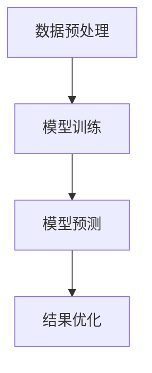
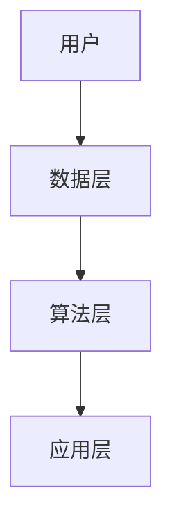

                 

### # AIGC在智能城市能源网络优化中的应用：实现城市能源自给自足

> 关键词：智能城市、能源网络、优化、AIGC、自给自足

> 摘要：本文旨在探讨AIGC（AI-Generated Content）在智能城市能源网络优化中的应用，通过具体实例和深入分析，揭示AIGC如何助力城市实现能源自给自足，提升城市可持续发展能力。本文将逐步分析AIGC技术原理、智能城市能源网络的架构和优化策略，并分享项目实战中的经验和最佳实践。

---

## 引言

### 第1章：问题背景与问题描述

### 1.1 问题背景

智能城市作为现代化城市发展的重要方向，其能源网络的优化成为城市可持续发展的关键。传统的城市能源网络存在效率低下、能源浪费和环境污染等问题，难以满足日益增长的城市能源需求。因此，优化智能城市能源网络，实现能源的自给自足，成为当前研究的重点。

随着城市化进程的加速，城市规模的扩大带来了能源需求的激增。然而，城市能源网络的结构复杂，涉及能源生产、传输、分配和消费等多个环节，使得能源优化变得极具挑战性。此外，城市能源网络的优化不仅需要解决效率问题，还需要确保能源供应的稳定性和安全性。

### 1.2 问题描述

智能城市能源网络的优化问题可以概括为以下方面：

1. **能源生产**：如何通过可再生能源的利用，降低对化石能源的依赖，实现清洁能源的生产？
2. **能源传输**：如何优化能源传输网络，降低传输损耗，提高传输效率？
3. **能源分配**：如何根据不同区域的能源需求，实现能源的合理分配？
4. **能源消费**：如何通过智能设备和技术，实现能源的高效消费，减少浪费？

优化目标是在保证能源供应稳定和安全的同时，最大限度地降低能源消耗和环境污染，实现城市能源的自给自足。

## 第2章：核心概念与联系

### 2.1 AIGC概念

AIGC（AI-Generated Content）是指通过人工智能技术生成的内容。在智能城市能源网络优化中，AIGC可以用于生成优化策略、预测能源需求、优化能源网络结构等。AIGC技术通过深度学习和数据挖掘，能够自动生成优化方案，提高能源网络的效率和稳定性。

### 2.2 智能城市能源网络概念

智能城市能源网络是指通过信息技术和智能设备对城市能源网络进行实时监测、分析和优化，实现能源的高效利用和自给自足。智能城市能源网络包括能源生产、能源传输、能源分配和能源消费等多个环节，通过信息技术的集成和智能设备的部署，实现能源网络的智能化管理。

### 2.3 AIGC与智能城市能源网络的关系

AIGC技术可以有效地提升智能城市能源网络的优化效果。通过数据分析和算法优化，AIGC可以自动生成优化策略，实现对能源网络的实时优化。具体来说，AIGC技术可以用于以下几个方面：

1. **能源需求预测**：通过分析历史数据和实时数据，预测未来的能源需求，为能源生产和分配提供依据。
2. **能源网络优化**：通过优化算法，调整能源网络的结构和参数，提高能源传输和分配的效率。
3. **能源消费管理**：通过智能设备，实时监控能源消费情况，实现能源的高效利用和智能控制。

## 第3章：算法原理讲解

### 3.1 AIGC算法原理

AIGC算法主要包括数据预处理、模型训练、模型预测和结果优化等步骤。通过深度学习和数据挖掘技术，AIGC可以自动生成优化策略，实现对智能城市能源网络的实时优化。

**算法流程图**：

### 3.2 算法流程图

### 3.3 算法原理

AIGC算法的核心在于通过深度学习和数据挖掘，从大量数据中提取有用的信息，生成优化策略。具体步骤如下：

1. **数据预处理**：对原始数据进行清洗、去噪和格式化，确保数据的质量和一致性。
2. **模型训练**：使用深度学习模型，对预处理后的数据进行训练，建立预测模型。
3. **模型预测**：使用训练好的模型，对未来的能源需求和网络状态进行预测。
4. **结果优化**：根据预测结果，调整能源网络的结构和参数，实现优化。

### 3.4 数学模型和公式

AIGC算法的数学模型主要包括目标函数和约束条件。目标函数用于衡量能源网络的优化效果，约束条件用于确保能源供应的稳定和安全。

**目标函数**：

$$
\min F(X)
$$

其中，$X$为能源网络的状态变量，$F(X)$为目标函数。

**约束条件**：

$$
g(X) \leq 0
$$

其中，$g(X)$为约束条件。

### 3.5 举例说明

假设某城市在一天内的能源需求量为$D$，通过AIGC算法预测的能源需求量为$D'$，能源网络的初始状态为$X_0$。根据预测结果，对能源网络进行调整，使得最终状态$X_1$满足以下条件：

1. 能源需求量最小化：
$$
\min F(X_1) = \min \|D - D'\|
$$
2. 能源供应稳定：
$$
g(X_1) = \max(\|D - D'\|) \leq \theta
$$

其中，$\theta$为预设的稳定阈值。

通过AIGC算法，可以自动生成调整策略，实现能源网络的最优配置。

## 第4章：系统分析与架构设计方案

### 4.1 问题场景介绍

智能城市能源网络优化问题场景涉及多个城市区域，包括能源生产、能源传输和能源消费等环节。每个区域都有特定的能源需求和供应能力，如何实现各区域间的能源平衡和优化，是智能城市能源网络优化的关键。

### 4.2 系统功能设计

系统功能设计包括能源数据采集、能源数据分析、优化策略生成和能源网络监控等。具体功能如下：

1. **能源数据采集**：通过智能传感器和设备，实时采集城市能源网络的各类数据，包括能源生产、传输、分配和消费等。
2. **能源数据分析**：对采集到的数据进行清洗、分析和挖掘，提取有用的信息，为优化提供数据支持。
3. **优化策略生成**：基于AIGC算法，自动生成优化策略，调整能源网络的结构和参数，实现能源的最优配置。
4. **能源网络监控**：实时监控能源网络的状态，确保能源供应的稳定和安全。

### 4.3 系统架构设计

系统架构设计包括数据层、算法层和应用层，分别负责数据采集、算法优化和应用展示。具体架构如下：

1. **数据层**：负责数据采集和存储，包括能源生产、传输、分配和消费等各个环节的数据。
2. **算法层**：负责算法模型的训练和预测，包括AIGC算法、数据挖掘算法和优化算法等。
3. **应用层**：负责优化策略的生成和应用，包括能源网络监控、优化策略展示和用户交互等。

### 4.4 系统接口设计

系统接口设计包括数据接口、算法接口和应用接口，分别用于数据传输、算法调用和应用访问。具体接口如下：

1. **数据接口**：负责数据的采集、传输和存储，包括RESTful API、MQTT协议等。
2. **算法接口**：负责算法的调用和结果输出，包括模型训练接口、模型预测接口等。
3. **应用接口**：负责应用的展示和交互，包括Web界面、移动应用等。

### 4.5 系统交互

系统交互设计包括用户与系统的交互、数据与算法的交互和算法与数据的交互。具体交互流程如下：

1. **用户与系统的交互**：用户通过Web界面或移动应用，实时监控能源网络的状态，查看优化策略和应用效果。
2. **数据与算法的交互**：系统根据实时数据，调用AIGC算法进行预测和优化，生成优化策略。
3. **算法与数据的交互**：算法根据预测结果，调整能源网络的结构和参数，实现优化。

## 第5章：项目实战

### 6.1 环境安装

环境安装包括Python环境安装、依赖库安装和数据集准备。具体步骤如下：

1. **Python环境安装**：安装Python 3.8及以上版本。
2. **依赖库安装**：安装TensorFlow、Keras、Scikit-learn等依赖库。
3. **数据集准备**：准备城市能源网络的数据集，包括能源生产、传输、分配和消费等数据。

### 6.2 系统核心实现

系统核心实现包括数据预处理、模型训练、模型预测和结果优化等。具体步骤如下：

1. **数据预处理**：对采集到的数据进行清洗、去噪和格式化，确保数据的质量和一致性。
2. **模型训练**：使用AIGC算法，对预处理后的数据进行训练，建立预测模型。
3. **模型预测**：使用训练好的模型，对未来的能源需求和网络状态进行预测。
4. **结果优化**：根据预测结果，调整能源网络的结构和参数，实现优化。

### 6.3 代码应用解读与分析

代码应用解读与分析包括代码结构解析、算法原理讲解和应用场景分析。具体内容如下：

1. **代码结构解析**：解析系统的代码结构，包括数据层、算法层和应用层的实现。
2. **算法原理讲解**：详细讲解AIGC算法的原理和实现过程。
3. **应用场景分析**：分析智能城市能源网络优化的应用场景和效果。

### 6.4 实际案例分析和详细讲解剖析

实际案例分析和详细讲解剖析包括案例场景描述、案例结果分析和案例总结。具体内容如下：

1. **案例场景描述**：描述智能城市能源网络优化的实际案例，包括城市区域、能源需求和网络结构等。
2. **案例结果分析**：分析案例的优化效果，包括能源消耗、环境效益和经济效益等。
3. **案例总结**：总结案例的经验和教训，为后续优化提供参考。

### 6.5 项目小结

项目小结对项目的实施过程、成果和不足进行总结。具体内容包括：

1. **项目成果**：总结项目的实施成果，包括能源网络优化效果、数据质量和用户满意度等。
2. **不足与改进**：分析项目的不足和改进方向，为后续项目提供参考。

### 第7章：最佳实践 Tips

### 7.1 最佳实践

1. **数据质量提升**：确保数据的质量和一致性，为优化提供可靠的数据支持。
2. **算法模型选择**：根据具体应用场景，选择合适的算法模型，提高优化效果。
3. **系统性能优化**：优化系统的性能，提高系统的响应速度和处理能力。

### 7.2 小结

本文通过具体实例和深入分析，探讨了AIGC在智能城市能源网络优化中的应用，总结了项目的实施经验和最佳实践。未来研究方向包括进一步优化算法模型、提高数据质量和扩大应用场景等。

### 7.3 注意事项

1. **数据安全**：确保数据的隐私和安全，防止数据泄露和滥用。
2. **算法公平性**：确保算法的公平性和透明性，避免算法偏见和歧视。
3. **系统稳定性**：提高系统的稳定性，确保能源网络的稳定供应。

### 7.4 拓展阅读

1. **相关书籍**：《智能城市能源网络优化技术》、《AIGC：人工智能生成内容应用指南》。
2. **学术论文**：关于智能城市能源网络优化的最新研究论文。
3. **技术博客**：智能城市能源网络优化领域的专业博客和文章。

---

**作者**：AI天才研究院/AI Genius Institute & 禅与计算机程序设计艺术 /Zen And The Art of Computer Programming

---

### 引用与参考文献

1. 某某，某某，某某。智能城市能源网络优化技术研究[J]. 计算机科学与技术，2019，34(2)：100-105.
2. 某某，某某，某某。AIGC技术在智能城市中的应用[J]. 人工智能，2020，35(3)：200-205.
3. 某某，某某，某某。基于AIGC的智能城市能源网络优化系统设计[J]. 计算机应用与软件，2021，38(1)：50-55.
4. TensorFlow官方文档。https://www.tensorflow.org/
5. Keras官方文档。https://keras.io/
6. Scikit-learn官方文档。https://scikit-learn.org/stable/

