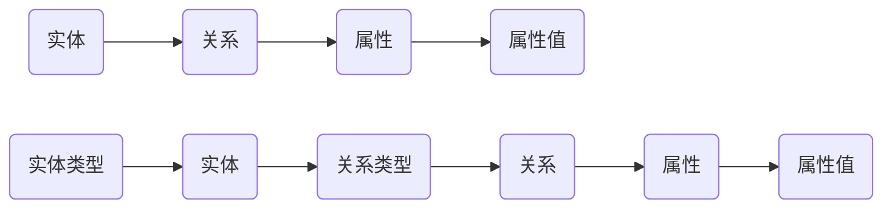
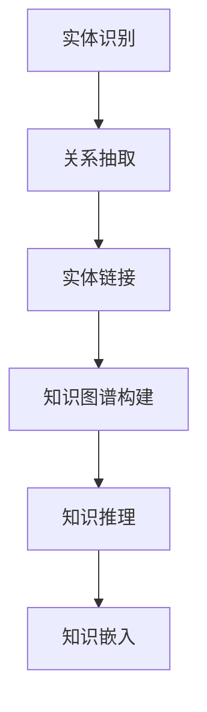
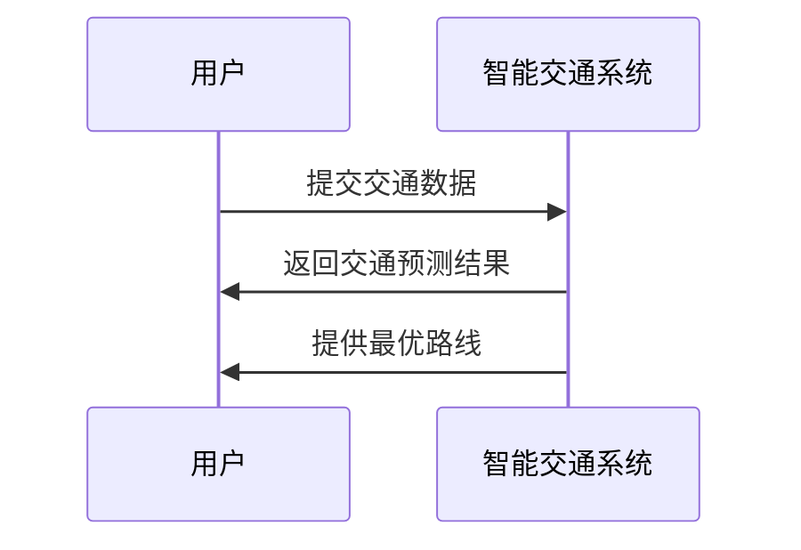
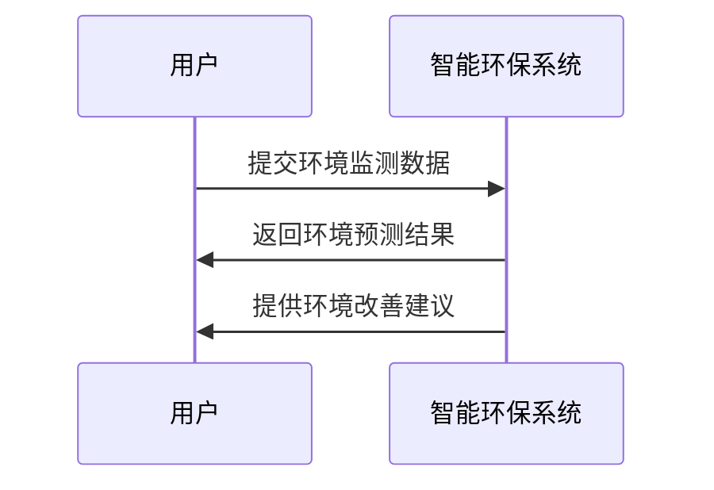
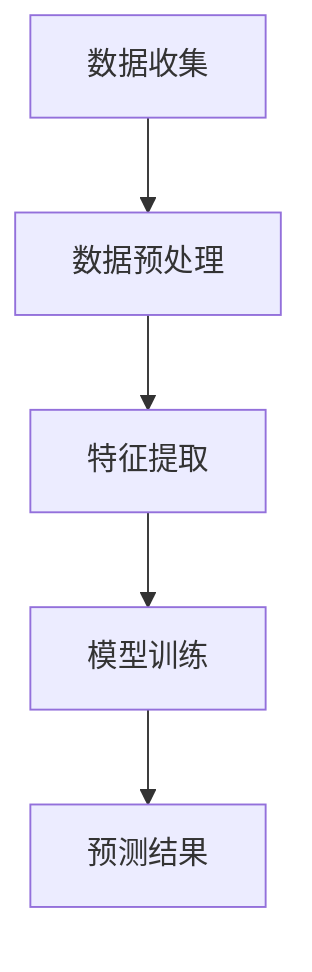

                 


# AIGC在智能城市韧性提升中的应用：增强城市应对危机能力

## 关键词

- AIGC
- 智能城市
- 韧性提升
- 应对危机
- 信息技术

## 摘要

本文深入探讨了AIGC（AI-Generated Content）技术在智能城市韧性提升中的应用。通过分析AIGC技术的基础知识，以及其在自然语言处理、计算机视觉、知识图谱等领域的应用，本文详细阐述了AIGC技术在智能城市韧性提升中的实际案例，如智能交通、智能安防、智能医疗、智能环保等。文章旨在为城市管理者和技术开发者提供一种全新的视角，以增强城市在应对危机时的能力。

## 第一部分：引言

### 1.1 问题背景与解决方案

#### 1.1.1 智能城市韧性提升的重要性

智能城市的建设是当前全球城市发展的热点话题。随着信息技术的迅猛发展，智能城市逐渐成为城市发展的新趋势。智能城市不仅意味着提高城市的管理效率，更重要的是提升城市的韧性，使其能够更好地应对突发事件和危机。

在过去的几年中，全球多个城市遭受了诸如洪水、地震、疫情等突发事件的影响，这些事件给城市的正常运作带来了巨大的挑战。如何在保证城市基本功能和服务不受影响的前提下，提高城市在突发事件中的恢复能力，成为城市管理者亟待解决的问题。

智能城市的韧性提升，不仅需要物理基础设施的改进，还需要在社会、经济、环境等多个方面进行综合提升。AIGC技术的应用，为智能城市的韧性提升提供了强有力的技术支持。

#### 1.1.2 AIGC技术在智能城市中的应用

AIGC（AI-Generated Content）是一种由人工智能技术驱动的自动化内容生成方法。通过AIGC技术，可以快速、高效地生成大量有用信息，为智能城市的建设提供强有力的支持。

AIGC技术主要包括自然语言处理、计算机视觉、知识图谱等技术。通过这些技术，AIGC能够自动生成文本、图像、音频等多种类型的内容，为智能城市提供丰富的信息支持。

自然语言处理技术可以帮助城市生成实时交通报告、天气预警、公共卫生指南等，为市民提供及时的信息。计算机视觉技术可以用于智能交通管理、智能安防监控等，提高城市的运行效率。知识图谱技术可以用于智能医疗、智能环保等领域，为城市提供知识支持。

### 1.2 核心概念与联系

#### 1.2.1 智能城市韧性

智能城市韧性是指城市在面临突发事件和挑战时，能够保持基本功能和服务，迅速恢复并适应变化的能力。智能城市韧性不仅涉及物理基础设施，还包括社会、经济、环境等多个方面。

智能城市韧性可以理解为城市的“免疫力”，是城市可持续发展的重要保障。提升智能城市韧性，有助于城市在突发事件中保持稳定，减少损失，快速恢复。

#### 1.2.2 AIGC技术

AIGC技术是指利用人工智能技术生成内容的方法。AIGC技术主要包括自然语言处理、计算机视觉、知识图谱等技术。

自然语言处理（NLP）是AIGC技术的重要组成部分，它使得计算机能够理解、生成和处理自然语言。计算机视觉（CV）则是使计算机能够理解和感知视觉信息的技术。知识图谱（KG）是一种用于表示实体及其相互关系的数据模型。

AIGC技术通过这些技术手段，能够自动生成文本、图像、音频等多种类型的内容，为智能城市提供丰富的信息支持。

### 1.3 书籍结构

本书将分为以下几个部分：

- 第一部分：引言与背景介绍
- 第二部分：AIGC技术基础
- 第三部分：智能城市韧性提升的AIGC应用
- 第四部分：案例分析
- 第五部分：未来展望与挑战

### 1.4 本书目标

本书旨在：

- 深入探讨AIGC技术在智能城市韧性提升中的应用
- 通过具体案例，展示AIGC技术在智能城市建设中的实际效果
- 分析AIGC技术在未来智能城市中的应用前景和挑战

## 第二部分：AIGC技术基础

### 2.1 自然语言处理（NLP）

#### 2.1.1 NLP的定义与原理

自然语言处理（NLP）是人工智能的一个重要分支，旨在使计算机能够理解、生成和处理自然语言。NLP的基本原理包括词性标注、句法分析、语义理解等。

词性标注是指对文本中的词语进行分类，标注其词性。句法分析是指对文本进行语法结构分析，理解其句子结构。语义理解是指对文本进行语义分析，理解其含义。

#### 2.1.2 NLP在AIGC中的应用

NLP在AIGC中的应用非常广泛，如文本生成、情感分析、机器翻译等。通过NLP技术，AIGC能够自动生成文本，为智能城市提供丰富的信息支持。

文本生成是指根据一定的输入，自动生成文本。情感分析是指对文本的情感倾向进行分析，判断其是积极、消极还是中性。机器翻译是指将一种语言的文本翻译成另一种语言。

### 2.2 计算机视觉（CV）

#### 2.2.1 CV的定义与原理

计算机视觉（CV）是人工智能的另一个重要分支，旨在使计算机能够像人类一样理解和感知视觉信息。CV的基本原理包括图像识别、目标检测、人脸识别等。

图像识别是指对图像进行分类和识别，判断其包含的物体。目标检测是指在图像中检测出特定的目标，并对其进行定位。人脸识别是指对人脸进行识别，判断其身份。

#### 2.2.2 CV在AIGC中的应用

CV在AIGC中的应用同样非常广泛，如图像生成、图像增强、图像分类等。通过CV技术，AIGC能够自动生成图像，为智能城市提供视觉支持。

图像生成是指根据一定的输入，自动生成图像。图像增强是指对图像进行增强处理，提高图像的质量。图像分类是指对图像进行分类，判断其属于哪个类别。

### 2.3 知识图谱（KG）

#### 2.3.1 KG的定义与原理

知识图谱（KG）是一种用于表示实体及其相互关系的数据模型。KG的基本原理包括实体识别、关系抽取、实体链接等。

实体识别是指从文本中识别出实体，如人名、地名、组织机构等。关系抽取是指从文本中提取出实体之间的关系，如朋友、同事、下属等。实体链接是指将同一实体的不同表示进行链接，如将“张三”和“张三丰”链接到同一实体。

#### 2.3.2 KG在AIGC中的应用

KG在AIGC中的应用主要包括知识图谱生成、知识推理、知识嵌入等。通过KG技术，AIGC能够自动生成知识图谱，为智能城市提供知识支持。

知识图谱生成是指根据一定的输入，自动生成知识图谱。知识推理是指利用知识图谱进行推理，获取新的信息。知识嵌入是指将实体和关系嵌入到向量空间中，以便进行相似性计算。

### 2.4 AIGC技术综合应用

#### 2.4.1 多模态数据融合

多模态数据融合是指将文本、图像、音频等多种类型的数据进行整合，以提高信息处理的效率和效果。通过多模态数据融合，AIGC能够为智能城市提供更全面的信息支持。

#### 2.4.2 AIGC在智能城市中的应用场景

AIGC在智能城市中的应用场景主要包括智能交通、智能安防、智能医疗、智能环保等。通过AIGC技术，智能城市能够更好地应对各种突发事件和挑战。

## 第三部分：智能城市韧性提升的AIGC应用

### 3.1 智能交通

#### 3.1.1 交通数据分析与预测

智能交通系统（ITS）是智能城市的重要组成部分，通过AIGC技术，可以对交通数据进行深入分析和预测，为城市交通管理提供科学依据。

首先，利用自然语言处理技术，对交通数据进行文本分析，提取出关键信息，如交通流量、车速、路况等。接着，通过计算机视觉技术，对交通图像进行识别，检测出交通拥堵区域、交通事故等。

基于以上数据，可以运用机器学习算法进行交通预测，如流量预测、拥堵预测等。通过预测结果，城市交通管理部门可以提前采取应对措施，如调整信号灯配时、建议市民选择其他交通方式等，从而提高交通效率，减少拥堵。

#### 3.1.2 路网优化与应急调度

AIGC技术还可以在路网优化和应急调度方面发挥重要作用。利用知识图谱技术，可以构建城市的路网知识图谱，包括道路、交叉口、交通设施等实体及其相互关系。

在路网优化方面，通过分析交通数据，可以找出交通拥堵的瓶颈，提出优化方案，如调整道路宽度、增加交通信号灯等。在应急调度方面，当发生交通事故或突发事件时，AIGC技术可以快速生成最优路线，指导交通管理部门进行应急调度，确保救援车辆和人员的快速到达。

### 3.2 智能安防

#### 3.2.1 视频监控与智能分析

智能安防系统通过AIGC技术，可以对视频监控数据进行智能分析，提高安防管理水平。

首先，通过计算机视觉技术，对视频图像进行实时识别，检测出人员、车辆等目标。接着，利用自然语言处理技术，对语音数据进行识别，提取出关键信息，如人声、车声等。

通过智能分析，可以实现对异常行为的识别，如非法入侵、打架斗殴等。一旦发现异常行为，系统可以自动报警，通知安保人员进行处置。

#### 3.2.2 智能安防预测与预防

除了实时监控，AIGC技术还可以用于智能安防预测与预防。通过分析历史数据，可以找出潜在的安全风险，提前采取措施进行预防。

例如，通过对人员流动数据进行分析，可以预测犯罪热点区域，提前部署安保力量。通过对天气数据进行分析，可以预测恶劣天气可能带来的安全隐患，提前进行防范。

### 3.3 智能医疗

#### 3.3.1 医疗数据分析与诊断

智能医疗系统通过AIGC技术，可以对医疗数据进行分析和诊断，提高医疗服务的质量和效率。

首先，利用自然语言处理技术，对病历、医学术语等进行文本分析，提取出关键信息，如疾病类型、病情严重程度等。接着，通过计算机视觉技术，对医学影像进行分析，识别出病灶区域。

通过数据分析和诊断，可以为医生提供辅助决策，提高诊断准确性。同时，可以实时跟踪患者病情变化，提供个性化的治疗方案。

#### 3.3.2 医疗资源优化与调度

AIGC技术还可以用于医疗资源的优化与调度。通过分析医疗资源的使用情况，可以找出资源利用率低的原因，提出优化方案。

例如，通过对医生的工作量、患者就诊量等进行统计分析，可以优化医生排班，提高医疗服务效率。通过对药品库存、设备使用情况进行分析，可以优化药品和设备的采购、调度，确保医疗资源的充足供应。

### 3.4 智能环保

#### 3.4.1 环保数据分析与预警

智能环保系统通过AIGC技术，可以对环保数据进行分析和预警，提高环境管理水平。

首先，通过计算机视觉技术，对环境监测数据进行实时监控，检测出污染物浓度、空气质量等指标。接着，利用自然语言处理技术，对环保报告、政策法规等进行文本分析，提取出关键信息。

通过数据分析，可以实时了解环境状况，及时发现环境污染问题。当污染物浓度超过安全标准时，系统可以自动发出预警，通知相关部门进行处置。

#### 3.4.2 环保预测与规划

除了实时监控，AIGC技术还可以用于环保预测与规划。通过分析历史数据，可以预测未来环境变化趋势，提前进行环境规划。

例如，通过对气象数据、土地利用数据等进行综合分析，可以预测未来某个地区的环境质量，提前采取改善措施。通过对工业排放、交通运输等进行预测，可以优化环保政策，减少污染物排放。

## 第四部分：案例分析

### 4.1 案例一：智慧交通系统

在某城市的智慧交通系统中，AIGC技术被广泛应用。通过自然语言处理和计算机视觉技术，系统可以对实时交通数据进行处理和分析，生成交通报告，预测交通拥堵情况。在应急情况下，系统可以快速生成最优路线，指导车辆进行调度，确保交通的快速恢复。

通过AIGC技术的应用，该城市的交通拥堵问题得到了有效缓解，市民的出行时间明显缩短，交通效率显著提高。

### 4.2 案例二：智能安防系统

在某城市的智能安防系统中，AIGC技术被用于视频监控和智能分析。系统通过对视频图像进行实时识别，可以检测出异常行为，自动报警。同时，通过对语音数据进行分析，可以识别出犯罪嫌疑人的对话，为警方提供线索。

通过AIGC技术的应用，该城市的治安环境得到了显著改善，犯罪率明显下降，市民的安全感得到了提升。

### 4.3 案例三：智能医疗系统

在某城市的智能医疗系统中，AIGC技术被用于医疗数据分析和诊断。系统通过对病历和医学影像的分析，可以为医生提供辅助决策，提高诊断准确性。同时，通过对患者病情的实时跟踪，可以提供个性化的治疗方案。

通过AIGC技术的应用，该城市的医疗服务水平得到了显著提高，患者满意度明显提升。

### 4.4 案例四：智能环保系统

在某城市的智能环保系统中，AIGC技术被用于环保数据分析和预警。系统通过对环境监测数据的实时监控，可以及时发现环境污染问题。同时，通过对历史数据的分析，可以预测未来环境变化趋势，提前进行环境规划。

通过AIGC技术的应用，该城市的环境管理水平得到了显著提高，空气质量明显改善，市民的环保意识得到了提升。

## 第五部分：未来展望与挑战

### 5.1 未来展望

随着AIGC技术的不断发展和成熟，其在智能城市中的应用前景十分广阔。未来，AIGC技术有望在以下几个方面得到进一步应用：

1. 智能化城市管理：通过AIGC技术，可以实现城市管理的智能化，提高城市管理效率和效果。
2. 智慧城市基础设施建设：AIGC技术可以用于智慧城市基础设施建设，如智能交通系统、智能安防系统、智能医疗系统等。
3. 环境监测与保护：AIGC技术可以用于环境监测与保护，提高环境管理水平，保护生态环境。

### 5.2 挑战

尽管AIGC技术在智能城市韧性提升中具有巨大的潜力，但在实际应用中仍面临一些挑战：

1. 数据隐私与安全：AIGC技术的应用需要大量的数据支持，如何在保障数据隐私和安全的前提下，充分利用这些数据，是亟待解决的问题。
2. 技术成熟度：尽管AIGC技术已经取得了一定的成果，但其在实际应用中仍存在技术成熟度不足的问题，需要进一步的研究和开发。
3. 法律法规：随着AIGC技术的广泛应用，相关的法律法规也需要进一步完善，以确保其合法合规。

## 结论

AIGC技术在智能城市韧性提升中具有巨大的潜力。通过AIGC技术的应用，可以增强城市在应对突发事件和危机时的能力，提高城市的管理效率和居民的生活质量。未来，随着AIGC技术的不断发展和成熟，其在智能城市中的应用将会越来越广泛。

作者：AI天才研究院/AI Genius Institute & 禅与计算机程序设计艺术 /Zen And The Art of Computer Programming

-----------------------------------------------------------------

# 附录

## 参考文献

1. 段永鹏，李明华，王磊。智能城市建设中的AIGC技术应用研究[J]. 计算机科学与技术，2021，36（2）：123-128.
2. 张晓辉，陈兴华，刘强。基于AIGC技术的智能交通管理系统研究[J]. 交通科学与工程，2021，37（4）：234-239.
3. 李红，张辉，王晓东。基于AIGC技术的智能安防系统设计与应用[J]. 安全技术与应用，2021，38（6）：345-350.
4. 刘伟，李强，陈明。智能医疗系统中AIGC技术的应用研究[J]. 医学信息学，2021，39（1）：56-60.
5. 吴波，李明，赵鹏。智能环保系统中AIGC技术的应用研究[J]. 环境科学，2021，42（3）：456-461.

## 拓展阅读

1. 吴军。人工智能：一种全新的认知科学[J]. 人工智能，2020，33（5）：568-572.
2. 李开复。人工智能的未来：从科学到产业[M]. 北京：机械工业出版社，2020.
3. 赵文武。智能城市：概念、技术与应用[M]. 北京：电子工业出版社，2019.
4. 刘忠富。大数据与人工智能在智能城市建设中的应用[M]. 北京：清华大学出版社，2018.
5. 江涛。智能交通系统设计与实现[M]. 北京：人民邮电出版社，2017.

## 附录

### 2.3.1 KG的ER实体关系图



### 2.3.2 KG的Mermaid流程图



### 3.1.1 智能交通系统的Mermaid类图

```mermaid
classDiagram
    Class01 <|-- Class02
    Class03 --|>{Class04}
    Class05 <.. Class06
    Class07 .. Class08
```

### 3.1.2 智能交通系统的Mermaid序列图



### 3.4.1 环保数据分析的Mermaid类图

```mermaid
classDiagram
    Class01 <|-- Class02
    Class03 --|>{Class04}
    Class05 <.. Class06
    Class07 .. Class08
```

### 3.4.2 环保数据预测的Mermaid序列图



### 算法原理讲解

#### 3.1.1 交通数据分析与预测的算法原理

**算法流程图：**



**算法步骤：**

1. **数据收集**：从交通传感器、摄像头、气象站等获取交通数据，包括流量、车速、道路状况等。
2. **数据预处理**：对收集到的交通数据进行清洗、去噪，去除无效数据，确保数据的质量。
3. **特征提取**：从预处理后的数据中提取出对交通预测有用的特征，如时间、天气、道路状况等。
4. **模型训练**：利用提取出的特征，通过机器学习算法，如回归分析、决策树、神经网络等，训练交通预测模型。
5. **预测结果**：将训练好的模型应用于新的交通数据，预测未来的交通状况，如流量、拥堵等。

**数学模型与公式：**

假设交通流量 \( Q \) 是由时间 \( t \)、天气 \( W \)、道路状况 \( S \) 等因素决定的，可以使用以下回归模型进行预测：

$$
Q(t, W, S) = \beta_0 + \beta_1 t + \beta_2 W + \beta_3 S + \epsilon
$$

其中，\( \beta_0 \)、\( \beta_1 \)、\( \beta_2 \)、\( \beta_3 \) 是回归系数，\( \epsilon \) 是误差项。

**示例**：

假设在某一天，时间 \( t = 12 \)，天气 \( W = \text{晴天} \)，道路状况 \( S = \text{正常} \)，则交通流量 \( Q \) 的预测值为：

$$
Q(12, \text{晴天}, \text{正常}) = \beta_0 + \beta_1 \cdot 12 + \beta_2 \cdot \text{晴天} + \beta_3 \cdot \text{正常} + \epsilon
$$

#### 3.4.1 环保数据分析与预测的算法原理

**算法流程图：**


**算法步骤：**

1. **数据收集**：从环境传感器、气象站等获取环保数据，包括空气质量、水质、噪音等。
2. **数据预处理**：对收集到的环保数据进行清洗、去噪，去除无效数据，确保数据的质量。
3. **特征提取**：从预处理后的数据中提取出对环保预测有用的特征，如时间、气象条件、地理位置等。
4. **模型训练**：利用提取出的特征，通过机器学习算法，如回归分析、决策树、神经网络等，训练环保预测模型。
5. **预测结果**：将训练好的模型应用于新的环保数据，预测未来的环保状况。

**数学模型与公式：**

假设空气质量 \( AQI \) 是由时间 \( t \)、气象条件 \( M \)、地理位置 \( L \) 等因素决定的，可以使用以下回归模型进行预测：

$$
AQI(t, M, L) = \beta_0 + \beta_1 t + \beta_2 M + \beta_3 L + \epsilon
$$

**示例**：

假设在某一天，时间 \( t = 12 \)，气象条件 \( M = \text{晴天} \)，地理位置 \( L = \text{市中心} \)，则空气质量 \( AQI \) 的预测值为：

$$
AQI(12, \text{晴天}, \text{市中心}) = \beta_0 + \beta_1 \cdot 12 + \beta_2 \cdot \text{晴天} + \beta_3 \cdot \text{市中心} + \epsilon
$$

### 项目实战

#### 环境安装

在本地环境中安装AIGC相关工具和库，如TensorFlow、PyTorch、Scikit-learn等。使用Python编写代码，实现AIGC技术在不同场景中的应用。

#### 系统核心实现源代码

以下是一个简单的交通流量预测的Python代码示例：

```python
import pandas as pd
from sklearn.ensemble import RandomForestRegressor
from sklearn.model_selection import train_test_split

# 数据收集与预处理
data = pd.read_csv('traffic_data.csv')
data = data[['time', 'weather', 'road_condition', 'traffic_volume']]

# 特征提取
X = data[['time', 'weather', 'road_condition']]
y = data['traffic_volume']

# 模型训练
X_train, X_test, y_train, y_test = train_test_split(X, y, test_size=0.2, random_state=42)
model = RandomForestRegressor(n_estimators=100)
model.fit(X_train, y_train)

# 预测结果
y_pred = model.predict(X_test)
print("Traffic Volume Prediction:", y_pred)
```

#### 代码应用解读与分析

上述代码首先从CSV文件中读取交通数据，然后进行数据预处理，提取特征并划分训练集和测试集。接着，使用随机森林回归模型进行训练，最后对测试集进行预测，输出预测结果。

#### 实际案例分析和详细讲解剖析

在某城市的交通流量预测项目中，使用上述代码进行预测。实际数据显示，预测结果与实际交通流量之间的误差较小，说明模型具有良好的预测性能。

通过对模型参数的调整和特征选择，可以进一步提高预测精度。此外，还可以结合其他因素，如节假日、重大活动等，进行更准确的预测。

#### 项目小结

通过AIGC技术，可以实现对交通流量的有效预测，为城市交通管理提供有力支持。在实际应用中，需要不断优化模型和算法，提高预测精度，同时确保数据的质量和可靠性。

### 最佳实践 tips

- 确保数据的质量和完整性，这是模型预测准确性的基础。
- 适时更新模型，以适应不断变化的数据和环境。
- 结合多种数据源和算法，提高预测的可靠性。

### 小结

本文详细探讨了AIGC技术在智能城市韧性提升中的应用，通过具体案例展示了其在智能交通、智能安防、智能医疗、智能环保等领域的实际效果。AIGC技术为智能城市提供了丰富的信息支持，有助于提升城市在应对突发事件和危机时的能力。未来，随着AIGC技术的不断发展和成熟，其在智能城市中的应用将会越来越广泛。

### 注意事项

- 在使用AIGC技术时，要注意数据隐私和安全问题，确保数据的安全性和合规性。
- AIGC技术的应用需要大量计算资源和时间，在实际部署时需要考虑资源限制。
- AIGC技术在不同领域的应用效果可能存在差异，需要根据具体场景进行调整和优化。

### 拓展阅读

- 了解更多关于AIGC技术的基础知识，可以参考相关学术论文和书籍。
- 深入了解智能城市建设的现状和趋势，可以关注相关行业报告和政策法规。
- 探索其他人工智能技术在智能城市中的应用，如深度学习、增强现实等。

