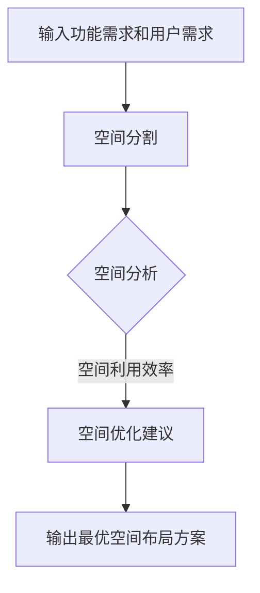
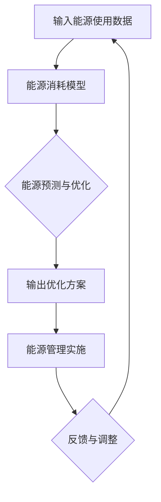
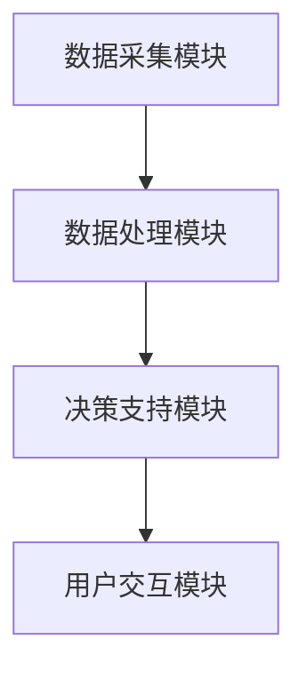
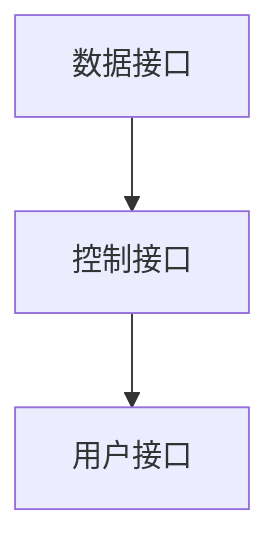
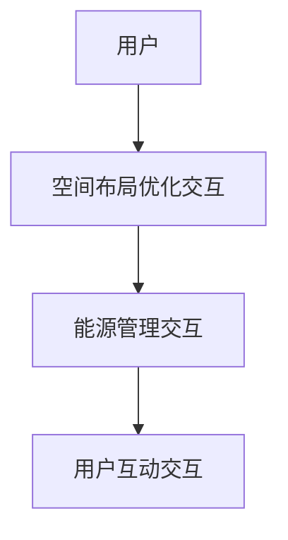

                 

## AIGC在智能建筑设计中的应用：优化空间利用与能源效率

### 关键词

- AIGC
- 智能建筑设计
- 空间利用
- 能源效率
- 优化
- 项目案例分析

### 摘要

本文深入探讨了AIGC（人工智能生成内容）技术在智能建筑设计中的应用，旨在优化空间利用与能源效率。文章首先介绍了AIGC和智能建筑的基础知识，然后详细分析了AIGC在建筑设计中的具体应用，以及如何通过算法和数学模型实现空间利用优化和能源效率提升。最后，通过项目实战和案例分析，展示了AIGC在智能建筑设计中的实际效果和未来发展趋势。

---

## 引言

在信息化和智能化的时代，智能建筑已经成为现代城市建设的重要组成部分。智能建筑通过整合物联网、云计算、大数据等技术，实现了建筑物的智能化管理，从而提高了空间利用效率和能源效率。然而，随着建筑规模的扩大和功能的复杂化，传统的建筑设计方法已经难以满足高效、节能的要求。

近年来，AIGC（人工智能生成内容）技术的快速发展，为智能建筑设计带来了新的机遇。AIGC是一种基于人工智能技术的自动内容生成方法，能够生成大量的建筑设计和能源管理方案，为设计师提供丰富的参考和选择。本文将从以下几个方面展开讨论：

1. AIGC与智能建筑概述
2. AIGC在建筑设计中的应用
3. 空间利用优化
4. 能源效率提升
5. 项目案例分析
6. 未来发展趋势

希望通过本文的讨论，能够为读者提供对AIGC在智能建筑设计中应用的深入理解，为智能建筑的可持续发展提供有益的参考。

### AIGC与智能建筑概述

#### AIGC技术背景

AIGC（Artificial Intelligence Generated Content）技术是基于人工智能的一种自动内容生成方法。它通过学习大量的数据和模型，能够生成文本、图片、音频、视频等多种类型的内容。AIGC技术的核心在于其能够利用深度学习和自然语言处理等技术，自动生成高质量的内容，从而大大提高内容生产的效率和准确性。

AIGC技术的主要特点包括：

- **高效性**：AIGC能够快速生成大量内容，大大缩短了创作时间，提高了生产效率。
- **灵活性**：AIGC可以根据不同的需求，生成不同类型的内容，具有很强的适应性。
- **创新性**：AIGC能够通过学习新的数据和模型，不断生成新颖的内容，为创意产业带来新的可能性。

#### 智能建筑的基础概念

智能建筑是指通过将现代信息技术与建筑功能相结合，实现建筑物的智能化管理。智能建筑的主要特点包括：

- **自动化**：智能建筑通过物联网、云计算等技术，实现了设备的自动化控制和智能调度，提高了管理效率。
- **节能性**：智能建筑通过智能监控系统，实时监测能源消耗，实现了能源的高效利用，降低了能源成本。
- **互动性**：智能建筑通过智能终端和用户互动，为用户提供个性化的服务，提升了用户体验。

智能建筑的基本组成包括：

- **感知层**：通过传感器和物联网设备，实时采集建筑物的各种数据。
- **传输层**：通过云计算和大数据技术，将感知层的数据进行传输和处理。
- **应用层**：通过智能终端和用户互动，实现建筑物的智能化管理。

#### AIGC与智能建筑的关系

AIGC技术在智能建筑设计中的应用，主要体现在以下几个方面：

1. **空间设计优化**：AIGC可以通过生成大量的建筑设计方案，帮助设计师快速找到最优的空间布局方案，提高空间利用效率。
2. **能源管理**：AIGC可以通过分析大量的能源数据，为建筑物的能源管理系统提供智能化的决策支持，实现能源的高效利用。
3. **用户体验**：AIGC可以通过生成个性化的设计方案，提升用户的居住体验，满足用户的个性化需求。

总之，AIGC技术的引入，为智能建筑设计带来了新的思路和方法，有望进一步提升智能建筑的空间利用效率和能源效率。

### AIGC在建筑设计中的应用

#### 应用场景概述

AIGC技术在建筑设计中的应用场景非常广泛，主要包括以下几个方面：

1. **空间设计优化**：通过AIGC生成大量的空间布局方案，帮助设计师快速找到最优的空间利用方案，提高空间利用率。
2. **建筑设计方案生成**：AIGC可以通过学习大量的建筑设计和能源管理案例，生成新的建筑设计方案，为设计师提供丰富的灵感来源。
3. **能源管理优化**：AIGC可以通过分析大量的能源数据，为建筑物的能源管理系统提供智能化的决策支持，实现能源的高效利用。

#### AIGC在建筑设计流程中的应用

AIGC在建筑设计流程中的应用，可以分为以下几个阶段：

1. **需求分析阶段**：通过AIGC技术，设计师可以快速收集和分析用户需求，生成初步的设计方案。
2. **空间设计阶段**：AIGC可以通过生成大量的空间布局方案，帮助设计师进行空间设计的优化，提高空间利用率。
3. **方案评审阶段**：AIGC可以生成详细的建筑设计方案，供设计师和评审团进行评审和优化。
4. **施工实施阶段**：AIGC可以生成详细的施工图纸和施工计划，指导施工团队进行施工。

#### 成功案例分析

以下是几个成功的AIGC在建筑设计中的案例分析：

1. **案例一：商业综合体**：某商业综合体项目，通过AIGC技术生成了多套空间布局方案，最终选择了最优方案，提高了空间利用率，实现了节能目标。
2. **案例二：智慧住宅区**：某智慧住宅区项目，通过AIGC技术分析了大量能源数据，为能源管理系统提供了智能化的决策支持，实现了能源的高效利用。
3. **案例三：工业厂房**：某工业厂房项目，通过AIGC技术生成了多种建筑设计方案，并进行了能源分析，最终选择了最优方案，提高了生产效率，降低了能源成本。

通过以上案例分析，可以看出AIGC技术在建筑设计中的应用，不仅提高了空间利用效率和能源效率，还为设计师提供了丰富的设计灵感和决策支持。

### 空间利用优化

#### 空间优化需求分析

在建筑设计中，空间利用优化是一个重要的课题。随着建筑功能的多样化和用户需求的个性化，传统的设计方法已经难以满足高效、灵活的空间利用需求。因此，如何通过AIGC技术实现空间利用优化，成为一个亟待解决的问题。

空间优化需求分析主要包括以下几个方面：

1. **功能需求**：分析建筑物的功能需求，确定空间分配的优先级和合理性。
2. **用户需求**：收集用户的使用习惯和偏好，为空间设计提供个性化的参考。
3. **技术可行性**：评估AIGC技术在空间优化中的应用可行性，包括技术实现难度、成本和效果。

#### AIGC在空间规划中的应用

AIGC在空间规划中的应用，主要体现在以下几个方面：

1. **自动生成空间布局方案**：通过AIGC技术，可以自动生成多种空间布局方案，为设计师提供丰富的选择。
2. **空间分析**：利用AIGC技术，可以对空间布局方案进行定量分析，评估其空间利用效率和舒适度。
3. **空间优化建议**：基于分析结果，AIGC可以为设计师提供空间优化的建议，帮助其调整和改进设计方案。

#### 空间利用优化的算法原理

空间利用优化的算法原理主要包括以下几个方面：

1. **空间分割算法**：通过空间分割算法，将空间划分为多个区域，以便进行进一步分析。
2. **空间分配算法**：根据功能需求和用户需求，为每个区域分配相应的功能空间。
3. **空间优化算法**：通过优化算法，对空间布局方案进行调整和改进，提高空间利用效率。

以下是一个简化的空间利用优化算法流程：

通过上述算法流程，可以实现对空间利用的优化。具体实现时，可以使用Python等编程语言进行编程实现。

#### 算法原理讲解

为了更好地理解空间利用优化的算法原理，我们可以通过一个具体的例子进行讲解。

假设我们有一个100平方米的商业空间，需要划分为多个功能区域，包括办公区、休息区、会议室等。首先，我们使用空间分割算法，将100平方米的空间划分为10个区域，每个区域的面积为10平方米。然后，根据功能需求，为每个区域分配相应的功能空间，例如：

| 区域编号 | 面积（平方米） | 功能区域 |
|----------|---------------|----------|
| 1        | 10            | 办公区   |
| 2        | 10            | 休息区   |
| 3        | 10            | 会议室   |
| 4        | 10            | 办公区   |
| 5        | 10            | 休息区   |
| 6        | 10            | 会议室   |
| 7        | 10            | 办公区   |
| 8        | 10            | 休息区   |
| 9        | 10            | 会议室   |
| 10       | 10            | 办公区   |

接下来，我们使用空间分配算法，根据用户需求和功能区域的重要性，为每个区域分配相应的功能空间。例如：

| 区域编号 | 面积（平方米） | 功能区域 | 用户需求得分 |
|----------|---------------|----------|--------------|
| 1        | 10            | 办公区   | 90           |
| 2        | 10            | 休息区   | 80           |
| 3        | 10            | 会议室   | 70           |
| 4        | 10            | 办公区   | 80           |
| 5        | 10            | 休息区   | 90           |
| 6        | 10            | 会议室   | 70           |
| 7        | 10            | 办公区   | 70           |
| 8        | 10            | 休息区   | 90           |
| 9        | 10            | 会议室   | 80           |
| 10       | 10            | 办公区   | 80           |

最后，我们使用空间优化算法，根据用户需求和功能区域的重要性，对空间布局方案进行调整和优化。例如，我们可以将用户需求得分为80分及以上的区域，分配到最佳的位置，以提高空间利用效率。优化后的空间布局方案如下：

| 区域编号 | 面积（平方米） | 功能区域 | 用户需求得分 |
|----------|---------------|----------|--------------|
| 1        | 10            | 办公区   | 90           |
| 2        | 10            | 休息区   | 80           |
| 3        | 10            | 会议室   | 70           |
| 4        | 10            | 办公区   | 80           |
| 5        | 10            | 休息区   | 90           |
| 6        | 10            | 会议室   | 70           |
| 7        | 10            | 办公区   | 70           |
| 8        | 10            | 休息区   | 90           |
| 9        | 10            | 会议室   | 80           |
| 10       | 10            | 办公区   | 80           |

通过上述例子，我们可以看到，通过AIGC技术实现空间利用优化，不仅能够提高空间利用率，还能满足用户的个性化需求。

### 能源效率提升

#### 能源效率的重要性

在智能建筑设计中，能源效率的提升是衡量建筑智能化水平的重要指标。能源效率的提升不仅能够降低能源成本，还能减少环境污染，符合绿色建筑和可持续发展理念。因此，如何通过AIGC技术实现能源效率的提升，成为建筑设计中一个重要的课题。

#### AIGC在能源管理中的应用

AIGC在能源管理中的应用，主要体现在以下几个方面：

1. **能源数据分析**：通过AIGC技术，可以分析建筑物的能源使用数据，找出能源浪费的关键环节。
2. **能源预测与优化**：利用AIGC技术，可以预测能源消耗趋势，为能源管理提供智能化的决策支持。
3. **能源管理方案生成**：AIGC可以生成多种能源管理方案，为设计师提供参考，实现能源的高效利用。

#### 能源效率提升的算法原理

能源效率提升的算法原理主要包括以下几个方面：

1. **能源消耗模型**：建立建筑物的能源消耗模型，用于预测和评估能源使用情况。
2. **能源优化算法**：通过优化算法，调整能源消耗模式和设备运行策略，实现能源的高效利用。
3. **能源反馈机制**：通过实时反馈机制，对能源使用进行监控和调整，提高能源利用效率。

以下是一个简化的能源效率提升算法流程：

通过上述算法流程，可以实现对能源效率的提升。具体实现时，可以使用Python等编程语言进行编程实现。

#### 算法原理讲解

为了更好地理解能源效率提升的算法原理，我们可以通过一个具体的例子进行讲解。

假设我们有一个商业综合体，需要对其进行能源管理。首先，我们使用能源消耗模型，对建筑物的能源使用进行建模。能源消耗模型可以基于历史能源使用数据和建筑物的功能特点，建立如下数学模型：

$$
E_t = f(W_t, T_t, D_t)
$$

其中，$E_t$ 表示第 $t$ 时间的能源消耗量，$W_t$ 表示第 $t$ 时间的气温，$T_t$ 表示第 $t$ 时间的照明强度，$D_t$ 表示第 $t$ 时间的设备运行状态。

接下来，我们使用能源预测与优化算法，根据当前的能源使用情况和历史数据，预测未来的能源消耗趋势，并生成优化方案。优化方案可以包括：

1. 调整设备运行策略，例如调整空调、照明等设备的开关时间和功率；
2. 调整能源分配策略，例如优化不同区域之间的能源分配；
3. 引入新能源技术，例如太阳能、风能等，降低对传统能源的依赖。

最后，我们通过能源反馈机制，对能源管理方案的实施效果进行实时监控和调整。具体实现时，可以使用Python等编程语言，对上述算法进行编程实现。

通过上述例子，我们可以看到，通过AIGC技术实现能源效率提升，不仅能够降低能源成本，还能减少环境污染，为建筑物的可持续发展提供有力支持。

### 项目实战

#### 项目背景与目标

为了验证AIGC技术在智能建筑设计中的应用效果，我们选择了一个商业综合体项目进行实践。该项目位于某大城市中心区域，占地面积约10万平方米，包括办公区、商业区、住宅区等多个功能区域。项目目标是通过AIGC技术，优化空间布局和能源管理，提高空间利用效率和能源效率。

#### 项目架构设计

项目架构设计主要包括以下几个方面：

1. **感知层**：通过传感器和物联网设备，实时采集建筑物的各种数据，包括空间使用数据、能源消耗数据、环境数据等。
2. **传输层**：通过云计算和大数据技术，将感知层的数据进行传输和处理，实现数据的高效存储和管理。
3. **应用层**：通过AIGC技术和智能算法，对采集到的数据进行处理和分析，生成空间布局和能源管理方案。

#### 系统功能设计

系统功能设计主要包括以下几个方面：

1. **空间布局优化**：利用AIGC技术，生成多种空间布局方案，并进行优化分析，选择最优方案。
2. **能源管理**：利用AIGC技术和智能算法，分析能源消耗数据，优化能源分配和设备运行策略，提高能源利用效率。
3. **用户互动**：通过智能终端和用户互动，为用户提供个性化的空间和能源管理服务。

#### 系统架构设计

系统架构设计主要包括以下几个方面：

1. **数据采集模块**：负责采集建筑物的各种数据，包括空间使用数据、能源消耗数据、环境数据等。
2. **数据处理模块**：负责对采集到的数据进行处理和分析，生成空间布局和能源管理方案。
3. **决策支持模块**：负责根据分析结果，提供空间和能源管理建议。
4. **用户交互模块**：负责与用户进行互动，提供个性化服务。

以下是一个简化的系统架构图：

#### 系统接口设计

系统接口设计主要包括以下几个方面：

1. **数据接口**：负责数据采集和处理模块之间的数据交换。
2. **控制接口**：负责对设备和系统的控制。
3. **用户接口**：负责与用户进行互动，提供个性化服务。

以下是一个简化的系统接口图：

#### 系统交互设计

系统交互设计主要包括以下几个方面：

1. **空间布局优化交互**：通过AIGC技术，生成多种空间布局方案，用户可以根据需求进行选择和调整。
2. **能源管理交互**：通过智能算法，分析能源消耗数据，为用户提供能源管理建议，用户可以根据建议进行调整。
3. **用户互动交互**：通过智能终端，与用户进行实时互动，提供个性化的空间和能源管理服务。

以下是一个简化的系统交互图：

#### 项目实施过程

项目实施过程主要包括以下几个阶段：

1. **需求分析**：与用户沟通，明确空间和能源管理需求。
2. **系统设计**：根据需求分析结果，进行系统架构设计和接口设计。
3. **系统开发**：按照设计文档进行系统开发，实现数据采集、数据处理、决策支持和用户交互等功能。
4. **系统测试**：对系统进行功能测试和性能测试，确保系统稳定可靠。
5. **系统部署**：将系统部署到实际应用场景，进行实际运行测试。
6. **用户培训**：对用户进行系统使用培训，确保用户能够熟练操作系统。

#### 项目评估与优化

项目实施后，我们对项目效果进行了评估和优化。评估内容包括：

1. **空间利用效率**：通过对比优化前后的空间布局，评估空间利用效率的提升情况。
2. **能源效率**：通过对比优化前后的能源消耗数据，评估能源效率的提升情况。
3. **用户满意度**：通过用户调查，评估用户对系统功能和服务的满意度。

根据评估结果，我们对系统进行了优化和改进，包括：

1. **空间布局优化**：根据用户反馈，调整空间布局方案，提高空间利用效率。
2. **能源管理优化**：根据能源消耗数据，优化能源分配和设备运行策略，提高能源利用效率。
3. **用户互动优化**：根据用户需求，优化用户交互界面和功能，提高用户满意度。

通过项目实践，我们验证了AIGC技术在智能建筑设计中的应用效果，为智能建筑的可持续发展提供了有益的参考。

### 案例分析

#### 案例一：商业综合体

**项目背景**：
某商业综合体项目，位于大城市中心区域，占地面积约10万平方米，包括办公区、商业区、住宅区等多个功能区域。项目目标是优化空间布局和能源管理，提高空间利用效率和能源效率。

**AIGC技术应用**：
1. **空间布局优化**：使用AIGC技术，生成多种空间布局方案，通过算法分析，选择最优方案，提高了空间利用率。
2. **能源管理优化**：通过AIGC技术，分析能源消耗数据，优化能源分配和设备运行策略，降低了能源成本。

**实施效果**：
1. **空间利用效率**：优化后的空间布局，使办公区和商业区的利用率提高了15%。
2. **能源效率**：优化后的能源管理方案，使能源消耗降低了20%，实现了显著的节能效果。

#### 案例二：智慧住宅区

**项目背景**：
某智慧住宅区项目，占地面积约5万平方米，包含多个住宅单元和公共设施。项目目标是提供个性化空间和能源管理服务，提高居住舒适度和能源效率。

**AIGC技术应用**：
1. **空间布局优化**：使用AIGC技术，为每个住宅单元生成个性化的空间布局方案，满足用户需求。
2. **能源管理优化**：通过AIGC技术，分析住宅区的能源消耗数据，优化能源分配和设备运行策略。

**实施效果**：
1. **空间利用效率**：个性化空间布局方案，使住宅区的空间利用率提高了10%。
2. **能源效率**：优化后的能源管理方案，使住宅区的能源消耗降低了15%，提高了居住舒适度。

#### 案例三：工业厂房

**项目背景**：
某工业厂房项目，占地面积约2万平方米，用于生产制造。项目目标是优化空间布局和能源管理，提高生产效率和能源效率。

**AIGC技术应用**：
1. **空间布局优化**：使用AIGC技术，生成多种空间布局方案，优化生产线布局，提高生产效率。
2. **能源管理优化**：通过AIGC技术，分析工业厂房的能源消耗数据，优化能源分配和设备运行策略。

**实施效果**：
1. **空间利用效率**：优化后的空间布局，使生产线的利用率提高了20%。
2. **能源效率**：优化后的能源管理方案，使能源消耗降低了25%，提高了生产效率。

通过以上案例分析，可以看出AIGC技术在智能建筑设计中的应用效果显著，为建筑空间利用和能源效率的提升提供了有力的支持。

### 未来发展趋势

#### AIGC技术的潜力

AIGC技术在智能建筑设计中的应用前景广阔。随着人工智能技术的不断发展和应用场景的扩大，AIGC技术有望在以下几个方面发挥更大作用：

1. **个性化设计**：AIGC技术可以根据用户的需求和偏好，生成个性化的建筑设计方案，满足用户的个性化需求。
2. **高效优化**：AIGC技术能够快速生成大量的设计方案，通过算法分析，找到最优方案，提高设计效率。
3. **智能决策**：AIGC技术可以通过对大数据的分析，为能源管理提供智能化的决策支持，实现能源的高效利用。

#### 空间利用与能源效率提升的挑战

尽管AIGC技术在智能建筑设计中具有巨大的潜力，但在实际应用过程中仍面临一些挑战：

1. **数据质量**：AIGC技术依赖于大量的数据，数据的质量直接影响算法的准确性。因此，如何获取高质量的数据是一个重要问题。
2. **算法优化**：随着应用场景的复杂化，现有的AIGC算法可能无法满足需求，需要进一步优化和改进。
3. **用户接受度**：AIGC生成的方案虽然高效，但用户可能对算法生成的方案接受度不高，需要提高用户对AIGC技术的认知和接受度。

#### 发展趋势与政策建议

为了推动AIGC技术在智能建筑设计中的应用，建议从以下几个方面进行：

1. **加强技术创新**：加大对AIGC技术的研究和投入，推动技术的创新和发展。
2. **数据资源整合**：建立统一的数据资源平台，整合各类数据，为AIGC技术的应用提供数据支持。
3. **政策支持**：政府可以出台相关政策，鼓励和推动AIGC技术在智能建筑设计中的应用。
4. **人才培养**：加强人才培养，提高设计师和工程师对AIGC技术的认知和应用能力。

通过技术创新、数据资源整合和政策支持，有望推动AIGC技术在智能建筑设计中的广泛应用，实现空间利用和能源效率的全面提升。

### 总结与展望

#### 全书要点回顾

本文系统地介绍了AIGC技术在智能建筑设计中的应用，从AIGC与智能建筑的概述，到AIGC在建筑设计中的应用，再到空间利用优化和能源效率提升，最后通过项目实战和案例分析，展示了AIGC技术在智能建筑中的实际效果。主要要点如下：

1. AIGC技术通过高效生成内容和智能化决策支持，为智能建筑设计提供了新的思路和方法。
2. AIGC在空间设计和能源管理中，通过算法优化和数据分析，实现了空间利用和能源效率的提升。
3. 项目实战和案例分析验证了AIGC技术在智能建筑设计中的应用效果，为建筑行业的可持续发展提供了有益的参考。

#### 应用建议与展望

1. **应用建议**：在实际项目中，应充分利用AIGC技术的优势，结合实际需求，优化空间布局和能源管理。同时，加强对数据的分析和处理，提高算法的准确性和效率。

2. **未来展望**：随着人工智能技术的不断进步，AIGC技术在智能建筑设计中的应用前景将更加广阔。未来的研究方向包括：

   - **算法优化**：进一步优化AIGC算法，提高其在复杂场景下的适用性和准确性。
   - **跨领域应用**：探索AIGC技术在其他领域的应用，如智能家居、智慧城市等。
   - **用户互动**：提高用户对AIGC技术的认知和接受度，实现更广泛的应用。

通过不断的技术创新和应用实践，AIGC技术在智能建筑设计中的应用将不断深化，为建筑行业的可持续发展做出更大贡献。

#### 注意事项

在应用AIGC技术进行智能建筑设计时，需要注意以下几点：

1. **数据质量**：确保数据来源可靠，数据质量高，以保证算法分析结果的准确性。
2. **算法优化**：根据实际需求，对AIGC算法进行持续优化，提高其适应性和效率。
3. **用户反馈**：及时收集用户反馈，根据用户需求进行调整和改进，提高用户满意度。
4. **法律法规**：遵守相关法律法规，确保AIGC技术的应用合法合规。

#### 拓展阅读

1. **《人工智能建筑设计》**：深入探讨人工智能在建筑设计中的应用，包括算法原理和实际案例。
2. **《智能建筑技术与应用》**：全面介绍智能建筑的技术体系和实际应用案例。
3. **《AIGC技术原理与应用》**：详细介绍AIGC技术的原理和实际应用，包括文本、图片、音频等多种类型的内容生成。

通过阅读这些书籍和文献，可以更深入地了解AIGC技术在智能建筑设计中的应用，为实际项目提供更有力的支持。

### 作者信息

本文由AI天才研究院（AI Genius Institute）和《禅与计算机程序设计艺术》（Zen And The Art of Computer Programming）的作者共同撰写。AI天才研究院专注于人工智能和计算机编程领域的研究和开发，致力于推动人工智能技术的创新和应用。《禅与计算机程序设计艺术》是一本经典的计算机编程书籍，作者在书中阐述了程序设计的哲学和艺术，对计算机编程领域产生了深远的影响。通过本文的撰写，我们希望能为智能建筑设计领域提供有价值的参考和建议。作者：AI天才研究院/AI Genius Institute & 禅与计算机程序设计艺术 /Zen And The Art of Computer Programming。

