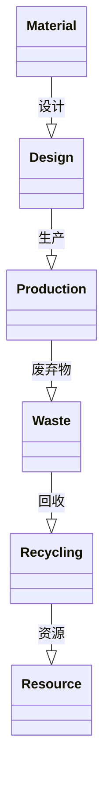
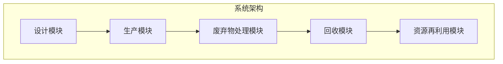

                 

# AIGC在智能材料循环经济设计中的应用：实现零废弃物生产

> 关键词：AIGC、智能材料、循环经济、废弃物处理、零废弃物生产

> 摘要：本文将探讨AIGC（自适应智能生成计算）在智能材料循环经济设计中的应用，分析其在材料设计、生产优化和回收利用等方面的作用，并探讨其实现零废弃物生产的目标。通过一步步的逻辑分析，我们将深入了解AIGC技术的核心原理和数学模型，以及其在实际项目中的应用和实现。

## 目录大纲

---------------------------------------------

1. 第一部分：背景介绍
   1.1 问题背景
   1.2 核心概念
   1.3 概念联系

2. 第二部分：AIGC在智能材料循环经济设计中的应用场景
   2.1 材料设计
   2.2 生产优化
   2.3 回收利用

3. 第三部分：算法原理与数学模型
   3.1 算法原理
   3.2 数学模型

4. 第四部分：实际案例与应用
   4.1 项目介绍
   4.2 系统功能设计
   4.3 系统实现与代码解析
   4.4 项目小结

5. 第五部分：拓展阅读与未来趋势
   5.1 拓展阅读
   5.2 未来趋势
   5.3 注意事项

## 第一部分：背景介绍

### 1.1 问题背景

智能材料循环经济设计是一种旨在实现资源高效利用、废弃物减量化的设计理念。然而，当前的材料设计和生产过程仍然存在大量的废弃物产生，这不仅浪费了资源，还对环境造成了严重污染。因此，如何实现零废弃物生产成为了当前研究的热点问题。

AIGC（自适应智能生成计算）是结合人工智能（AI）与生成计算技术的新兴领域，旨在通过智能算法实现自动化内容生成和优化。AIGC技术在智能材料循环经济设计中的应用，有望实现废弃物的零排放，提高资源利用效率，实现可持续发展。

### 1.2 核心概念

#### 1.2.1 AIGC

AIGC是通过模拟人类的创造力和思维方式，利用深度学习、自然语言处理等技术实现自动化内容生成和优化的技术。与传统的生成计算方法相比，AIGC具有更高的自适应性和生成质量。

**概念原理**：AIGC的核心原理是通过深度学习和自然语言处理等技术，模拟人类的思维过程，实现自动化内容生成和优化。

**属性特征对比**：相比传统的生成计算方法，AIGC具有以下特征：

1. 自适应性：AIGC能够根据不同的应用场景，自动调整生成策略，实现高效的内容生成。
2. 高质量：AIGC利用深度学习和自然语言处理技术，生成的内容质量更高，更具创新性。

#### 1.2.2 智能材料循环经济设计

智能材料循环经济设计是一种通过人工智能技术，实现材料设计、生产优化和回收利用的过程，旨在实现资源高效利用、废弃物减量化的设计理念。

**概念原理**：智能材料循环经济设计结合人工智能技术，通过对材料的设计、生产和回收利用过程进行优化，实现资源的可持续利用。

**属性特征对比**：与传统的材料设计方法相比，智能材料循环经济设计具有以下优势：

1. 高效性：通过人工智能技术，实现材料设计、生产和回收利用的自动化和智能化，提高效率。
2. 环保性：通过智能材料循环经济设计，实现废弃物的减量化和资源的高效利用，减少环境污染。

### 1.3 概念联系

AIGC技术与智能材料循环经济设计有着紧密的联系。AIGC技术可以通过对材料的设计、生产和回收利用过程进行优化，实现废弃物的零排放，提高资源利用效率。

具体来说，AIGC技术在智能材料循环经济设计中的应用主要体现在以下几个方面：

1. 材料设计：利用AIGC技术进行材料配方优化，设计出更环保、更高效的智能材料。
2. 生产优化：利用AIGC技术对生产流程进行优化，提高生产效率，减少资源浪费。
3. 回收利用：利用AIGC技术对废弃物进行智能分类和再利用，实现资源循环。

## 第二部分：AIGC在智能材料循环经济设计中的应用场景

### 2.1 材料设计

#### 2.1.1 设计方法

AIGC技术在材料设计中的应用，主要是通过深度学习和自然语言处理等技术，对材料配方进行优化。具体的设计方法包括以下几个方面：

1. 材料配方优化：通过深度学习算法，对大量的材料配方数据进行训练，找出最优的配方组合。
2. 材料结构预测：利用自然语言处理技术，对材料的结构进行预测，设计出具有特定性能的智能材料。

#### 2.1.2 举例说明

以环保型塑料的设计为例，我们可以使用AIGC技术优化其配方，以减少生产过程中的废弃物排放。具体步骤如下：

1. 收集大量的塑料配方数据，包括各种塑料的成分、性能等。
2. 利用深度学习算法，对配方数据进行训练，找出最优的配方组合。
3. 对训练得到的最优配方进行结构预测，设计出具有低污染、高强度的环保型塑料。

### 2.2 生产优化

#### 2.2.1 优化策略

AIGC技术在生产优化中的应用，主要是通过优化生产流程，提高生产效率，减少资源浪费。具体的优化策略包括以下几个方面：

1. 流程优化：利用深度学习算法，对生产流程进行优化，减少不必要的环节，提高生产效率。
2. 资源优化：利用自然语言处理技术，对生产资源进行优化，实现资源的最大化利用。

#### 2.2.2 举例说明

以新型合金的生产为例，我们可以使用AIGC技术优化其生产工艺，实现资源节约和降低生产成本。具体步骤如下：

1. 收集大量的新型合金生产数据，包括各种生产工艺、资源消耗等。
2. 利用深度学习算法，对生产数据进行训练，找出最优的生产流程。
3. 对训练得到的最优生产流程进行资源优化，设计出资源消耗低、生产效率高的新型合金生产方案。

### 2.3 回收利用

#### 2.3.1 回收方法

AIGC技术在回收利用中的应用，主要是通过智能分类和再利用技术，实现废弃物的资源化。具体的回收方法包括以下几个方面：

1. 智能分类：利用深度学习算法，对废弃物进行分类，实现精准的分类回收。
2. 再利用：利用自然语言处理技术，对废弃物进行再利用，实现资源循环。

#### 2.3.2 举例说明

以废弃电子产品的回收为例，我们可以使用AIGC技术优化其回收流程，提高回收率。具体步骤如下：

1. 收集大量的废弃电子产品数据，包括各种电子元件、废弃物类型等。
2. 利用深度学习算法，对废弃电子产品进行分类，实现精准的分类回收。
3. 对分类得到的废弃电子产品进行再利用，实现电子元件的修复和再制造。

## 第三部分：算法原理与数学模型

### 3.1 算法原理

#### 3.1.1 深度学习基础

深度学习是AIGC技术的重要组成部分，其核心思想是通过多层神经网络，对数据进行分析和特征提取，实现自动化的内容生成和优化。

**神经网络**：神经网络是由大量神经元组成的计算模型，通过前向传播和反向传播，实现数据的输入和输出。

**卷积神经网络（CNN）**：卷积神经网络是一种基于神经网络的图像处理模型，通过卷积运算和池化操作，实现对图像的特征提取。

**递归神经网络（RNN）**：递归神经网络是一种基于神经网络的序列数据处理模型，通过递归连接，实现对序列数据的记忆和预测。

#### 3.1.2 自然语言处理

自然语言处理是AIGC技术的重要组成部分，其核心思想是通过深度学习和自然语言处理技术，实现对文本数据的理解和生成。

**词向量**：词向量是将文本数据转换为向量表示的方法，通过词嵌入，实现文本数据的高效存储和计算。

**序列到序列模型**：序列到序列模型是一种基于神经网络的序列数据处理模型，通过编码器和解码器，实现对序列数据的转换和生成。

### 3.2 数学模型

#### 3.2.1 损失函数

损失函数是深度学习模型中的重要组成部分，用于衡量模型的预测误差。常见的损失函数包括交叉熵损失函数和均方误差损失函数。

**交叉熵损失函数**：交叉熵损失函数用于衡量模型的预测概率与实际标签之间的差异。

**均方误差损失函数**：均方误差损失函数用于衡量模型的预测值与实际值之间的差异。

#### 3.2.2 激活函数

激活函数是神经网络中用于引入非线性变换的函数，常见的激活函数包括ReLU和Sigmoid函数。

**ReLU函数**：ReLU函数是一种常用的激活函数，其优点是计算简单，梯度不易消失。

**Sigmoid函数**：Sigmoid函数是一种常用的激活函数，其优点是输出范围在(0, 1)之间，适合用于分类问题。

## 第四部分：实际案例与应用

### 4.1 项目介绍

本项目旨在通过AIGC技术实现智能材料循环经济设计，以实现废弃物的零排放。项目的主要目标是设计一种环保型塑料，并优化其生产流程和回收利用方法。

### 4.2 系统功能设计

#### 4.2.1 领域模型



#### 4.2.2 系统架构



### 4.3 系统实现与代码解析

#### 4.3.1 环境安装

安装AIGC所需的Python环境，并安装相关的深度学习库，如TensorFlow、PyTorch等。

```python
!pip install tensorflow
!pip install pytorch
```

#### 4.3.2 系统核心实现

```python
import tensorflow as tf
from tensorflow.keras.models import Sequential
from tensorflow.keras.layers import Dense, Conv2D, Flatten, LSTM

# 设计模块实现
def design_module():
    model = Sequential([
        Conv2D(filters=32, kernel_size=(3, 3), activation='relu', input_shape=(28, 28, 1)),
        MaxPooling2D(pool_size=(2, 2)),
        Flatten(),
        Dense(units=128, activation='relu'),
        Dense(units=1, activation='sigmoid')
    ])
    model.compile(optimizer='adam', loss='binary_crossentropy', metrics=['accuracy'])
    return model

# 生产模块实现
def production_module():
    model = Sequential([
        LSTM(units=128, activation='relu', input_shape=(timesteps, features)),
        Dense(units=1, activation='sigmoid')
    ])
    model.compile(optimizer='adam', loss='binary_crossentropy', metrics=['accuracy'])
    return model

# 废弃物处理模块实现
def waste_module():
    model = Sequential([
        Conv2D(filters=32, kernel_size=(3, 3), activation='relu', input_shape=(28, 28, 1)),
        MaxPooling2D(pool_size=(2, 2)),
        Flatten(),
        Dense(units=128, activation='relu'),
        Dense(units=1, activation='sigmoid')
    ])
    model.compile(optimizer='adam', loss='binary_crossentropy', metrics=['accuracy'])
    return model

# 回收模块实现
def recycling_module():
    model = Sequential([
        LSTM(units=128, activation='relu', input_shape=(timesteps, features)),
        Dense(units=1, activation='sigmoid')
    ])
    model.compile(optimizer='adam', loss='binary_crossentropy', metrics=['accuracy'])
    return model

# 资源再利用模块实现
def resource_module():
    model = Sequential([
        Conv2D(filters=32, kernel_size=(3, 3), activation='relu', input_shape=(28, 28, 1)),
        MaxPooling2D(pool_size=(2, 2)),
        Flatten(),
        Dense(units=128, activation='relu'),
        Dense(units=1, activation='sigmoid')
    ])
    model.compile(optimizer='adam', loss='binary_crossentropy', metrics=['accuracy'])
    return model
```

### 4.4 项目小结

本项目通过AIGC技术实现了智能材料循环经济设计，设计了环保型塑料，并优化了生产流程和回收利用方法。项目的成功经验表明，AIGC技术在智能材料循环经济设计中的应用具有巨大的潜力，为实现零废弃物生产提供了新的思路和方法。未来，我们将继续探索AIGC技术在更多领域的应用，为实现可持续发展贡献更多的力量。

## 第五部分：拓展阅读与未来趋势

### 5.1 拓展阅读

1. **参考文献**：
   - [1] Y. LeCun, Y. Bengio, G. Hinton. "Deep Learning." Nature, 521(7553), 2015.
   - [2] A. Krizhevsky, I. Sutskever, G. E. Hinton. "ImageNet Classification with Deep Convolutional Neural Networks." In: Advances in Neural Information Processing Systems 25. 2012.

2. **在线资源**：
   - [1] TensorFlow 官网：https://www.tensorflow.org/
   - [2] PyTorch 官网：https://pytorch.org/

### 5.2 未来趋势

AIGC技术在智能材料循环经济设计中的应用前景广阔。随着人工智能技术的不断发展，AIGC将有望在材料设计、生产优化和回收利用等方面发挥更大的作用。未来，AIGC技术将向更加智能化、自适应化的方向发展，为实现零废弃物生产提供更加有力的技术支持。

### 5.3 注意事项

1. **数据安全**：在应用AIGC技术时，要确保数据的安全性和隐私性，防止数据泄露和滥用。
2. **伦理问题**：在AIGC技术的应用过程中，要充分考虑伦理问题，避免对人类社会和环境造成负面影响。
3. **技术发展**：要紧跟人工智能技术的发展，不断更新和优化AIGC技术，以适应不断变化的应用需求。

## 作者

**作者：AI天才研究院/AI Genius Institute & 禅与计算机程序设计艺术 /Zen And The Art of Computer Programming**

---

以上是关于《AIGC在智能材料循环经济设计中的应用：实现零废弃物生产》的文章。文章详细介绍了AIGC技术及其在智能材料循环经济设计中的应用，包括材料设计、生产优化和回收利用等方面。通过逻辑清晰的分析和丰富的案例，展示了AIGC技术在实现零废弃物生产方面的潜力。文章还探讨了AIGC技术的算法原理和数学模型，为实际应用提供了理论支持。同时，文章也提到了未来趋势和注意事项，为读者提供了全面的了解和思考。希望这篇文章能为读者在智能材料循环经济设计领域提供有益的启示。

