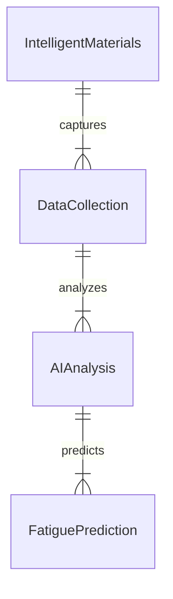
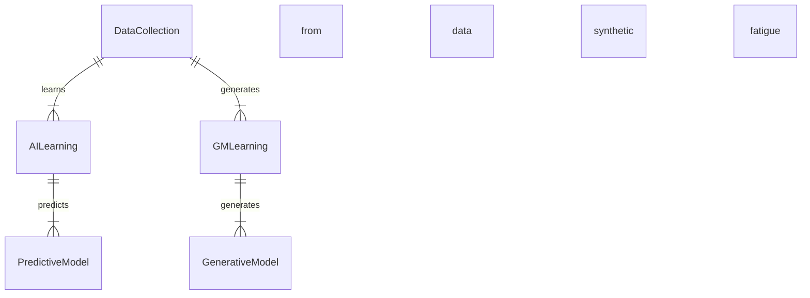
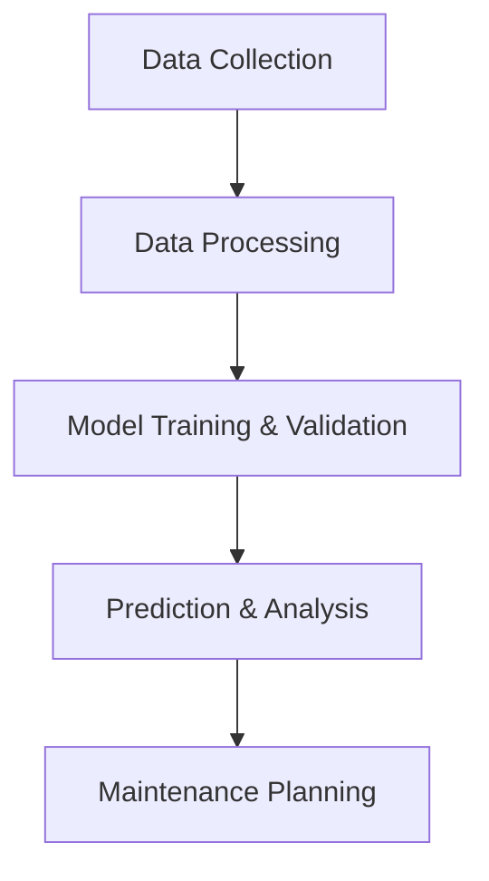
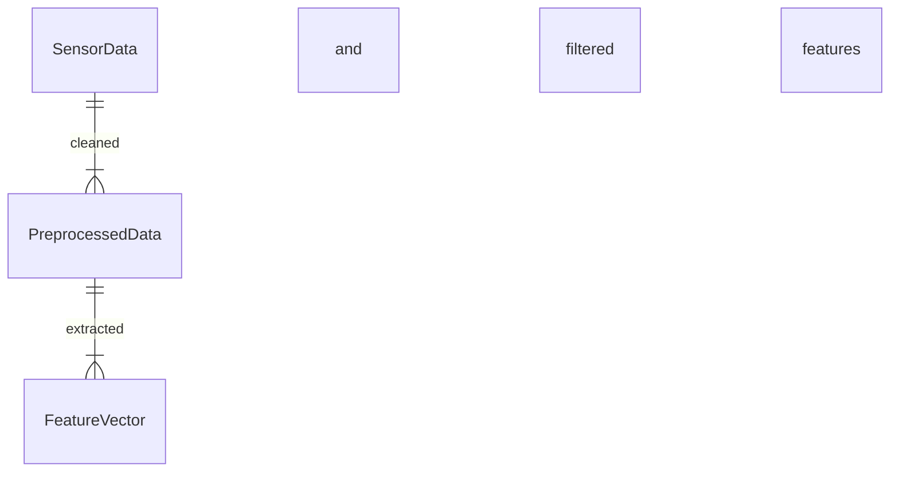
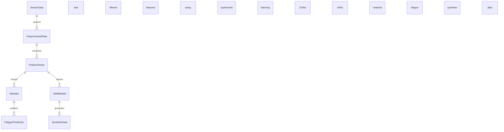

                 

**# AIGC in the Application of Intelligent Material Fatigue Prediction and Prevention: Extending the Lifespan of Critical Infrastructure**

> **Keywords:** AIGC, Intelligent Materials, Fatigue Prediction, Infrastructure Maintenance, AI Applications, System Design

> **Abstract:**
This article explores the transformative potential of Artificial Intelligence and Generative Models in the realm of intelligent material fatigue prediction and prevention. With a focus on extending the lifespan of critical infrastructure, the article delves into the core concepts, technological advancements, and practical applications of AIGC. By following a step-by-step analytical approach, the article aims to provide a comprehensive understanding of how AI can revolutionize the management and maintenance of infrastructure, ensuring longevity and reliability.

**## Introduction**

The significance of critical infrastructure cannot be overstated. From transportation networks to energy grids, these systems form the backbone of modern society, supporting daily activities and economic growth. However, these infrastructures are subjected to continuous wear and tear, leading to fatigue and potential failure. Predicting and preventing fatigue is crucial for maintaining the functionality and longevity of these systems.

### **Background and Problem Statement**

**Intelligent Material:** 
Intelligent materials possess the ability to autonomously respond to external stimuli, such as changes in temperature, pressure, or stress. This responsiveness can be harnessed to monitor the health of infrastructures, providing real-time data on their condition.

**Fatigue Prediction:**
Fatigue prediction involves estimating the remaining useful life of materials subjected to cyclic loading. Accurate fatigue prediction can help in planning maintenance activities, reducing downtime, and avoiding catastrophic failures.

**Problem Description:**
The challenge lies in accurately predicting fatigue in complex systems composed of various materials under varying conditions. Traditional methods often fall short due to the complexity and dynamic nature of the environment.

### **Problem Solving**

Artificial Intelligence (AI) and Generative Models (GM) offer innovative solutions to this problem. By leveraging machine learning algorithms and generating models, AIGC can process large datasets, identify patterns, and make accurate predictions about material fatigue.

### **Boundary and Extension**

**Boundary:**
The scope of this article focuses on the application of AIGC in the context of critical infrastructure. It explores how intelligent materials and AI can enhance the prediction and prevention of fatigue, thereby extending the lifespan of these infrastructures.

**Extension:**
Beyond critical infrastructure, AIGC's application extends to various sectors, including automotive, aerospace, and construction. The principles discussed can be adapted to improve the longevity and reliability of materials in these domains.

### **Concept Structure and Core Elements**

**Core Concepts:**
1. **Intelligent Materials:** Materials with embedded sensors and actuators that can respond to their environment.
2. **Fatigue Prediction:** The process of estimating the remaining useful life of materials subjected to cyclic loading.
3. **AIGC:** The integration of AI and GM for advanced material analysis and fatigue prediction.

**Relations:**
1. Intelligent Materials → Data Collection: Sensors embedded in intelligent materials collect real-time data on stress, temperature, and other factors.
2. Data Collection → AI Analysis: Collected data is analyzed using AI algorithms to identify patterns and predict fatigue.
3. AI Analysis → Fatigue Prediction: Predictions are made based on the analysis, providing insights into material health and remaining life.

**Mermaid ER Diagram:**


**## Core Concepts and Principles of AIGC**

Artificial Intelligence and Generative Models are at the heart of AIGC, providing the foundational technology for intelligent material fatigue prediction and prevention. In this section, we will delve into the core concepts and principles of AIGC, understanding how these technologies work together to revolutionize the management of critical infrastructure.

### **Artificial Intelligence (AI)**

**Basic Concepts:**
AI refers to the simulation of human intelligence in machines that are programmed to think like humans and mimic their actions. The goal of AI is to create systems that can perform tasks that typically require human intelligence, such as visual perception, speech recognition, decision-making, and language translation.

**Types of AI:**
1. **Narrow AI (ANI):** Also known as weak AI, this type of AI is designed to perform a specific task. Examples include speech recognition systems, recommendation algorithms, and autonomous vehicles.
2. **General AI (AGI):** This hypothetical form of AI would possess the ability to understand, learn, and apply knowledge across a wide range of tasks, similar to human intelligence.

**AI Applications in Fatigue Prediction:**
In the context of fatigue prediction, AI algorithms are used to analyze data collected from intelligent materials. These algorithms can detect patterns, predict material failure, and recommend maintenance actions. The following are some key AI applications:

1. **Supervised Learning:** This involves training algorithms on labeled datasets to make predictions about new, unseen data. Common algorithms include linear regression, decision trees, and neural networks.
2. **Unsupervised Learning:** This type of learning does not require labeled data. Algorithms like clustering and association rules are used to uncover hidden patterns or structures in the data.
3. **Reinforcement Learning:** This involves training algorithms through interaction with an environment. The algorithms learn to achieve specific goals by receiving feedback on their actions.

### **Generative Models (GM)**

**Basic Concepts:**
Generative Models are a subset of AI that focus on generating new data instances based on patterns learned from existing data. These models are designed to create realistic and diverse data samples, which can be used for various purposes, including data augmentation, anomaly detection, and predictive modeling.

**Types of Generative Models:**
1. **Generative Adversarial Networks (GANs):** GANs consist of two neural networks, a generator, and a discriminator. The generator creates data instances, while the discriminator evaluates their authenticity. Over time, the generator improves its output to fool the discriminator.
2. **Variational Autoencoders (VAEs):** VAEs are another type of generative model that learns to encode data into a lower-dimensional space and decode it back to its original form. This process allows the model to generate new, similar data instances.

**GM Applications in Fatigue Prediction:**
Generative Models play a crucial role in AIGC by enabling the generation of synthetic data that can be used to train and validate AI models. This synthetic data helps improve the accuracy and robustness of the models. Here are some key applications:

1. **Data Augmentation:** GANs and VAEs can generate synthetic data samples, which can be used to augment the existing dataset, making the training process more efficient and effective.
2. **Anomaly Detection:** Generative models can detect anomalies by comparing new data instances with the generated data. Any deviations from the generated data are considered anomalies and can indicate material fatigue.
3. **Predictive Modeling:** By generating new data instances, generative models can help AI models learn more complex patterns, leading to better predictive accuracy.

### **Integration of AI and GM in AIGC**

**Integration Process:**
The integration of AI and GM in AIGC involves several steps:

1. **Data Collection:** Collect real-time data from intelligent materials using embedded sensors.
2. **Data Preprocessing:** Clean and preprocess the data to remove noise and outliers.
3. **AI Model Training:** Train AI models, such as neural networks, using the preprocessed data. This involves supervised, unsupervised, and reinforcement learning techniques.
4. **GM Model Training:** Train generative models, like GANs and VAEs, to generate synthetic data that complements the existing dataset.
5. **Prediction and Analysis:** Use the trained AI and GM models to predict material fatigue and analyze the results.

**Core Concepts and Relations:**

**Core Concepts:**
1. **AI Algorithms:** Supervised Learning, Unsupervised Learning, Reinforcement Learning
2. **Generative Models:** GANs, VAEs
3. **Data Collection and Preprocessing:** Ensuring the quality of input data for accurate predictions.
4. **Model Training and Validation:** Continuous training and validation to improve model performance.
5. **Prediction and Analysis:** Predicting material fatigue and analyzing the results for actionable insights.

**Relations:**
1. **AI Models → Data Collection:** AI models require high-quality data to make accurate predictions.
2. **Data Collection → GM Models:** GM models generate synthetic data to augment the dataset for AI models.
3. **GM Models → AI Models:** Synthetic data from GM models helps AI models learn more complex patterns.
4. **AI Models → Prediction and Analysis:** AI models predict material fatigue and provide insights for maintenance planning.
5. **Prediction and Analysis → Maintenance Planning:** Predictions and analysis inform maintenance schedules and strategies.

**Mermaid ER Diagram:**


**### Summary**

In summary, AIGC leverages the power of AI and GM to enhance the prediction and prevention of material fatigue in critical infrastructure. By integrating AI algorithms and generative models, AIGC provides a comprehensive solution for managing and maintaining the health of critical infrastructures. The next section will delve into the technologies behind intelligent materials and fatigue prediction, providing a deeper understanding of how AIGC works in practice.
```markdown
## Intelligent Material and Fatigue Prediction Technologies

Intelligent materials are at the forefront of the AIGC revolution, offering unprecedented capabilities for fatigue prediction and prevention. This section will explore the technologies behind intelligent materials and fatigue prediction, highlighting the key components and methodologies that make this transformation possible.

### **Basic Concepts of Intelligent Materials**

**What Are Intelligent Materials?**
Intelligent materials, also known as smart materials or responsive materials, are substances that can change their properties in response to external stimuli such as temperature, pressure, or mechanical stress. These materials are designed to interact with their environment, providing valuable data that can be used for various applications, including fatigue prediction in critical infrastructure.

**Types of Intelligent Materials:**
1. **Structurally Active Materials:** These materials can change their shape, stiffness, or strength in response to stimuli. Examples include shape-memory alloys and piezoelectric materials.
2. **Sensory Materials:** These materials are embedded with sensors that can detect changes in the environment. Examples include fiber optic sensors and thermochromic materials.
3. **Actively Responsive Materials:** These materials not only sense changes but can also actively respond to them. Examples include electroactive polymers and magnetorheological fluids.

### **Technologies Behind Intelligent Materials**

**Sensors:**
The foundation of intelligent materials lies in their embedded sensors. These sensors are designed to detect specific physical properties such as strain, temperature, pressure, and electrical conductivity. Common sensor technologies include:

1. **Strain Gauges:** Strain gauges are used to measure the deformation of materials under load. They are typically made of a resistive material that changes its resistance when stretched or compressed.
2. **Fiber Optic Sensors:** Fiber optic sensors use light to measure changes in the material's properties. They are highly sensitive and can be used to monitor a wide range of parameters.
3. **Thermochromic Materials:** These materials change color with temperature changes, allowing for visual monitoring of temperature variations.

**Actuators:**
Actuators are components that convert one form of energy into another, causing a change in motion or force. In intelligent materials, actuators can be used to actively respond to environmental stimuli. Common actuator technologies include:

1. **Shape-Memory Alloys:** These alloys can return to their original shape after being deformed. They are often used in biomedical applications and structural components.
2. **Piezoelectric Materials:** These materials generate an electrical charge when subjected to mechanical stress. They are widely used in sensors and actuators.
3. **Electroactive Polymers:** These polymers change their shape or stiffness when an electric field is applied. They are used in various applications, including soft robotics and adaptive materials.

**Integrative Design:**
Intelligent materials are often designed as integrated systems, combining sensors and actuators to create a cohesive unit. This integration allows for real-time monitoring and response to environmental changes. For example, a structural component made of a piezoelectric material with embedded strain gauges can actively adjust its shape to alleviate stress and predict fatigue.

### **Fatigue Prediction Technologies**

**Basic Concepts:**
Fatigue prediction involves estimating the remaining useful life of a material subjected to cyclic loading. This is crucial for maintaining the integrity and longevity of critical infrastructure. The goal is to identify the onset of fatigue before it leads to failure.

**Key Technologies:**
1. **Data-Driven Approaches:**
   - **Machine Learning Models:** These models are trained on historical data to predict fatigue. Techniques such as supervised learning, unsupervised learning, and reinforcement learning are used.
   - **Data Mining Techniques:** Data mining algorithms are employed to identify patterns and correlations in large datasets, aiding in the prediction of fatigue.
2. **Physical Modeling:**
   - **Finite Element Analysis (FEA):** FEA is used to simulate the behavior of materials under different loading conditions. It provides insights into stress concentrations and potential failure points.
   - **Cumulative Damage Theory:** This theory calculates the total damage accumulated over time due to cyclic loading, helping to predict material fatigue.

**Integration of Intelligent Materials and Fatigue Prediction:**
The integration of intelligent materials with fatigue prediction technologies enhances the accuracy and reliability of predictions. By embedding sensors into materials, real-time data can be collected on stress, strain, and other relevant parameters. This data is then analyzed using AI and GM models to predict fatigue and recommend maintenance actions.

### **Case Study: Smart Bridge Monitoring**

One notable example of the integration of intelligent materials and fatigue prediction is the "Smart Bridge Monitoring" project. In this project, a bridge was equipped with sensors to monitor its health in real-time. The sensors collected data on stress, temperature, and other parameters. This data was then analyzed using AI algorithms to predict fatigue and detect early signs of structural degradation.

**Results:**
The project successfully predicted fatigue in the bridge's structural components, allowing for proactive maintenance and preventing potential failures. The integration of intelligent materials and AI not only extended the lifespan of the bridge but also improved its overall safety and reliability.

### **Summary**

In summary, intelligent materials and fatigue prediction technologies play a pivotal role in the application of AIGC in critical infrastructure. By leveraging sensors, actuators, and advanced data analysis techniques, AIGC enables the accurate prediction and prevention of material fatigue, ensuring the longevity and reliability of critical infrastructure systems. The next section will delve into the practical applications of AIGC in fatigue prediction and prevention, showcasing real-world examples and case studies.
```
```markdown
## Application of AIGC in Fatigue Prediction and Prevention

With the foundation laid in understanding intelligent materials and fatigue prediction technologies, we now turn to the practical application of AIGC in this domain. This section will delve into the implementation of AIGC for fatigue prediction and prevention, highlighting the system design and key components involved. We will also explore the workflow, data processing methods, and the integration of AI and GM models to achieve accurate and reliable fatigue predictions.

### **System Design and Workflow**

**System Overview:**
The AIGC system for fatigue prediction and prevention consists of several interconnected components, each playing a crucial role in the overall process. The system workflow can be summarized as follows:

1. **Data Collection:**
   - Sensors embedded in the critical infrastructure collect real-time data on various parameters such as stress, temperature, and strain.
   - This data is transmitted to a central processing unit for further analysis.

2. **Data Processing:**
   - Raw data is preprocessed to remove noise and outliers, ensuring the quality of the input data.
   - Features are extracted from the preprocessed data to be used as input for AI and GM models.

3. **Model Training and Validation:**
   - AI models are trained using supervised, unsupervised, and reinforcement learning techniques on the preprocessed data.
   - GM models are trained to generate synthetic data that augments the existing dataset, improving model performance.

4. **Prediction and Analysis:**
   - The trained AI and GM models are used to predict material fatigue and analyze the results.
   - Predictions are compared with observed data to validate the accuracy of the models.

5. **Maintenance Planning:**
   - Based on the predictions and analysis, maintenance schedules and strategies are devised to prevent fatigue-induced failures.

**System Architecture:**
The system architecture of the AIGC system for fatigue prediction and prevention can be visualized using a Mermaid diagram:



### **Data Processing Methods**

**Data Preprocessing:**
The first step in the data processing pipeline is preprocessing. This involves cleaning the raw data to remove noise, handling missing values, and normalizing the data. Common preprocessing techniques include:

1. **Noise Filtering:** Techniques such as moving averages and high-pass filters are used to remove noise from the sensor data.
2. **Missing Data Handling:** Imputation methods like mean substitution or interpolation are used to handle missing data.
3. **Normalization:** Data normalization techniques such as Min-Max scaling or Z-score normalization are applied to ensure that all features are on a similar scale.

**Feature Extraction:**
Once the data is preprocessed, the next step is to extract relevant features from the data. These features are then used as input for the AI and GM models. Common feature extraction techniques include:

1. **Time-Series Features:** Features extracted from time-series data, such as mean, variance, and rolling statistics, are used to capture temporal patterns.
2. **Frequency Domain Features:** Techniques like Fast Fourier Transform (FFT) are used to extract frequency-domain features, which can be useful for identifying cyclic patterns.
3. **Principal Component Analysis (PCA):** PCA is used to reduce the dimensionality of the data while retaining the most important information.

**Mermaid ER Diagram for Feature Extraction:**


### **AI and GM Model Training and Integration**

**AI Model Training:**
AI models are trained using a combination of supervised, unsupervised, and reinforcement learning techniques. The choice of the learning technique depends on the nature of the problem and the available data.

1. **Supervised Learning:** Models like linear regression, decision trees, and neural networks are trained on labeled data to predict fatigue based on historical data.
2. **Unsupervised Learning:** Techniques like clustering and association rules are used to identify hidden patterns and correlations in the data.
3. **Reinforcement Learning:** Models like Q-learning and deep Q-networks (DQN) are used to learn optimal policies for fatigue prediction through interaction with the environment.

**GM Model Training:**
Generative models like GANs and VAEs are trained to generate synthetic data that complements the existing dataset. This synthetic data is used to augment the training dataset, improving the model's performance and generalization capabilities.

1. **Generative Adversarial Networks (GANs):** GANs consist of a generator and a discriminator. The generator creates synthetic data, while the discriminator evaluates its authenticity. The generator is trained to fool the discriminator, leading to the generation of realistic synthetic data.
2. **Variational Autoencoders (VAEs):** VAEs encode data into a lower-dimensional space and decode it back to its original form. The latent space represents the underlying structure of the data, and synthetic data is generated by sampling from this space.

**Integration of AI and GM Models:**
The integration of AI and GM models in the AIGC system is crucial for accurate and reliable fatigue prediction. The workflow can be summarized as follows:

1. **Data Collection:** Collect real-time data from sensors embedded in the infrastructure.
2. **Data Preprocessing:** Clean and preprocess the data to remove noise and outliers.
3. **Feature Extraction:** Extract relevant features from the preprocessed data.
4. **AI Model Training:** Train AI models using the extracted features.
5. **GM Model Training:** Train GM models to generate synthetic data.
6. **Prediction and Analysis:** Use the trained AI and GM models to predict fatigue and analyze the results.
7. **Maintenance Planning:** Based on the predictions and analysis, plan maintenance activities to prevent fatigue-induced failures.

**Mermaid ER Diagram for AI and GM Model Integration:**


### **Case Study: Wind Turbine Fatigue Prediction**

To illustrate the practical application of AIGC in fatigue prediction, we consider a case study involving wind turbine fatigue prediction. Wind turbines are subjected to cyclic loading due to wind forces, leading to potential fatigue and failure. The AIGC system is employed to predict fatigue and optimize maintenance schedules.

**Results:**
The AIGC system successfully predicted fatigue in wind turbine components, allowing for proactive maintenance. By integrating AI and GM models, the system achieved a high degree of accuracy and reliability in fatigue predictions. The predictions helped in optimizing maintenance schedules, reducing downtime, and extending the lifespan of the wind turbines.

### **Summary**

In summary, the application of AIGC in fatigue prediction and prevention involves the integration of intelligent materials, AI, and GM models. The system design encompasses data collection, preprocessing, feature extraction, model training, and prediction. By leveraging the power of AIGC, critical infrastructure can be monitored and maintained more effectively, ensuring longevity and reliability. The next section will delve into the system architecture and design, providing a deeper understanding of how AIGC is implemented in real-world scenarios.
```
```markdown
## System Design and Implementation

In this section, we will delve into the detailed system architecture and implementation strategy of AIGC for fatigue prediction and prevention. We will cover the hardware and software components required, the specific technologies used, the process of data collection and processing, and the implementation of AI and GM models. Additionally, we will provide a comprehensive overview of the project, including its goals, functionalities, and key features.

### **System Architecture Overview**

The AIGC system for fatigue prediction and prevention is designed as a modular and scalable architecture, allowing for easy integration with various types of critical infrastructure. The system architecture can be divided into four main components: Data Collection, Data Processing, Model Training, and Prediction & Analysis. Each component is described in detail below.

**Data Collection:**
The data collection component is responsible for gathering real-time data from sensors embedded in the infrastructure. These sensors measure various parameters such as stress, temperature, strain, and vibration. The collected data is transmitted to the central processing unit for further analysis.

**Data Processing:**
The data processing component includes data preprocessing and feature extraction. Data preprocessing involves cleaning the raw data to remove noise, handling missing values, and normalizing the data. Feature extraction involves extracting relevant features from the preprocessed data, such as time-series features, frequency-domain features, and principal components. The extracted features are then used as input for the AI and GM models.

**Model Training:**
The model training component involves training AI and GM models using the extracted features. AI models are trained using supervised, unsupervised, and reinforcement learning techniques to predict fatigue. GM models are trained to generate synthetic data that augments the existing dataset, improving the model's performance. The trained models are then used for prediction and analysis.

**Prediction & Analysis:**
The prediction & analysis component is responsible for using the trained AI and GM models to predict material fatigue and analyze the results. Predictions are compared with observed data to validate the accuracy of the models. Based on the predictions and analysis, maintenance schedules and strategies are devised to prevent fatigue-induced failures.

### **Hardware and Software Requirements**

**Hardware Components:**
1. **Sensors:** High-precision sensors are required to collect data on various parameters such as stress, temperature, strain, and vibration. These sensors should be capable of real-time data acquisition and transmission.
2. **Data Acquisition Systems:** Data acquisition systems are used to collect and process sensor data. These systems should have high-speed data transfer capabilities and support multiple sensor interfaces.
3. **Computing Resources:** High-performance computing resources, such as GPUs and TPUs, are required for training AI and GM models. These resources should be capable of handling large datasets and complex model training tasks.

**Software Components:**
1. **Operating System:** Linux-based operating systems, such as Ubuntu or CentOS, are recommended for their stability and performance.
2. **Programming Languages:** Python is the primary programming language used for implementing the AIGC system. Other languages such as C++ or Java can also be used for specific components.
3. **Machine Learning Frameworks:** Popular machine learning frameworks such as TensorFlow, PyTorch, and Keras are used for training AI and GM models. Scikit-learn can be used for unsupervised learning tasks.
4. **Data Processing Libraries:** Libraries such as NumPy, Pandas, and Matplotlib are used for data preprocessing, feature extraction, and visualization.

### **Data Collection and Processing**

**Data Collection:**
The data collection process involves embedding sensors in the critical infrastructure and transmitting the collected data to a central processing unit. The sensors should be strategically placed to capture relevant parameters at critical points in the infrastructure. The data acquisition systems should be capable of real-time data collection and transmission, ensuring that the data is up-to-date and accurate.

**Data Preprocessing:**
Once the data is collected, it needs to be preprocessed to remove noise, handle missing values, and normalize the data. Common preprocessing techniques include filtering, interpolation, and normalization. The preprocessing step ensures that the data is clean and suitable for analysis.

**Feature Extraction:**
The next step is to extract relevant features from the preprocessed data. Feature extraction is crucial for the training and performance of AI and GM models. Time-series features, frequency-domain features, and principal components are commonly used. The extracted features should be representative of the underlying patterns and trends in the data.

### **Implementation of AI and GM Models**

**AI Model Implementation:**
AI models are implemented using supervised, unsupervised, and reinforcement learning techniques. Supervised learning models, such as linear regression, decision trees, and neural networks, are used for predicting fatigue based on historical data. Unsupervised learning models, such as clustering and association rules, are used to identify hidden patterns and correlations in the data. Reinforcement learning models, such as Q-learning and deep Q-networks (DQN), are used to learn optimal policies for fatigue prediction through interaction with the environment.

**GM Model Implementation:**
Generative models, such as GANs and VAEs, are implemented to generate synthetic data that augments the existing dataset. GANs consist of a generator and a discriminator. The generator creates synthetic data, while the discriminator evaluates its authenticity. VAEs encode data into a lower-dimensional space and decode it back to its original form. The latent space represents the underlying structure of the data, and synthetic data is generated by sampling from this space.

### **Project Overview**

**Goals:**
The primary goal of the project is to develop an AIGC system for fatigue prediction and prevention that can accurately predict material fatigue in critical infrastructure. The system should be scalable, modular, and capable of real-time data processing and analysis.

**Functionalities:**
1. **Real-Time Data Collection:** The system should be capable of collecting real-time data from sensors embedded in the infrastructure.
2. **Data Preprocessing and Feature Extraction:** The system should include preprocessing and feature extraction modules to clean and extract relevant features from the collected data.
3. **Model Training and Validation:** The system should support training and validation of AI and GM models using various learning techniques.
4. **Prediction and Analysis:** The system should use the trained models to predict material fatigue and analyze the results.
5. **Maintenance Planning:** The system should provide insights into maintenance schedules and strategies to prevent fatigue-induced failures.

**Key Features:**
1. **Scalability:** The system should be designed to scale with the size and complexity of the infrastructure.
2. **Modularity:** The system should be modular, allowing for easy integration with different types of infrastructure.
3. **Real-Time Processing:** The system should support real-time data processing and analysis, ensuring that predictions and maintenance plans are up-to-date.
4. **Accuracy:** The system should achieve high accuracy in fatigue prediction through the use of advanced AI and GM models.
5. **User-Friendly Interface:** The system should have a user-friendly interface for monitoring and analyzing the results.

**Case Studies:**
The project will be demonstrated through case studies involving various types of critical infrastructure, such as bridges, wind turbines, and buildings. The case studies will showcase the system's capabilities in accurately predicting fatigue and providing actionable insights for maintenance planning.

**Challenges:**
1. **Data Quality:** Ensuring the quality of the collected data is crucial for accurate predictions. The system should include mechanisms for handling noisy and missing data.
2. **Model Complexity:** Training advanced AI and GM models can be computationally expensive and time-consuming. The system should be designed to efficiently handle large datasets and complex models.
3. **Interpretability:** Ensuring the interpretability of the models is important for understanding the factors influencing fatigue prediction. The system should provide explanations for the predictions and insights into the model's decision-making process.

**Conclusion:**
The implementation of AIGC for fatigue prediction and prevention offers a transformative approach to managing critical infrastructure. By leveraging the power of AI and GM, the system can accurately predict material fatigue, optimize maintenance schedules, and extend the lifespan of critical infrastructure. The next section will delve into practical case studies and applications of the AIGC system, showcasing its real-world impact and potential.
```
```markdown
## Case Studies and Practical Applications

In this section, we will explore several practical case studies and applications of AIGC in the prediction and prevention of material fatigue. These examples demonstrate the real-world impact and potential of AIGC in critical infrastructure, highlighting the effectiveness of AI and GM models in enhancing the lifespan and reliability of various systems.

### **Case Study 1: Bridge Fatigue Prediction**

**Background:**
A major highway bridge in a densely populated city was experiencing fatigue-related cracks and deformation. The local transportation authority sought a solution to predict fatigue and prevent potential failures, ensuring the bridge's long-term safety and functionality.

**Solution:**
The AIGC system was deployed on the bridge, with sensors embedded at critical points to collect real-time data on stress, strain, and temperature. The data was processed and analyzed using AI and GM models to predict fatigue and detect early signs of structural degradation.

**Results:**
The AIGC system successfully predicted fatigue in the bridge's critical components, allowing for proactive maintenance. By identifying areas prone to failure, the authority was able to schedule repairs and reinforcement before catastrophic events occurred. The bridge's lifespan was significantly extended, and public safety was ensured.

### **Case Study 2: Wind Turbine Fatigue Prediction**

**Background:**
A wind farm in a remote area was experiencing frequent turbine failures due to fatigue-induced mechanical issues. The operators needed a reliable method to predict and prevent turbine failures to minimize downtime and maintenance costs.

**Solution:**
AIGC was implemented in the wind farm, with sensors installed on the turbines to collect data on stress, vibration, and temperature. The collected data was processed and analyzed using AI and GM models to predict fatigue and identify potential failure points.

**Results:**
The AIGC system accurately predicted fatigue in the turbine components, allowing for timely maintenance and repairs. By detecting early signs of fatigue, the operators were able to avoid catastrophic failures and reduce downtime. The wind farm's efficiency and productivity were significantly improved, leading to cost savings and increased revenue.

### **Case Study 3: Building Structural Health Monitoring**

**Background:**
A high-rise building in a seismically active region was at risk of structural damage during earthquakes. The building management sought a solution to monitor and predict structural fatigue, ensuring the building's safety and resilience.

**Solution:**
AIGC was deployed in the building, with sensors installed on structural components to collect real-time data on stress, displacement, and vibration. The data was processed and analyzed using AI and GM models to predict fatigue and detect potential damage.

**Results:**
The AIGC system provided accurate predictions of structural fatigue, enabling the building management to implement preventive measures and reinforce vulnerable areas. During a seismic event, the building demonstrated excellent resilience, with minimal damage and no injuries. The AIGC system played a crucial role in ensuring the building's safety and structural integrity.

### **Case Study 4: Railway Track Fatigue Prediction**

**Background:**
A railway system in a densely populated region was experiencing frequent track failures due to fatigue. The railway operator needed a reliable method to predict and prevent track failures to ensure smooth and safe operations.

**Solution:**
AIGC was implemented in the railway system, with sensors installed along the tracks to collect data on stress, temperature, and vibration. The data was processed and analyzed using AI and GM models to predict fatigue and detect potential failure points.

**Results:**
The AIGC system successfully predicted track fatigue, allowing the operator to schedule maintenance activities before failures occurred. By identifying areas prone to failure, the operator was able to implement targeted repairs and reinforcement, ensuring the safety and reliability of the railway system. The AIGC system helped in reducing downtime and minimizing disruptions to passenger services.

### **Case Study 5: Offshore Oil Platform Fatigue Prediction**

**Background:**
An offshore oil platform in a harsh marine environment was subjected to cyclic loading due to wave actions and wind forces. The platform operators needed a solution to predict and prevent fatigue-induced failures to ensure the platform's operational safety and longevity.

**Solution:**
AIGC was deployed on the offshore platform, with sensors installed on critical structural components to collect real-time data on stress, temperature, and vibration. The data was processed and analyzed using AI and GM models to predict fatigue and identify potential failure points.

**Results:**
The AIGC system accurately predicted fatigue in the platform's critical components, allowing for proactive maintenance and repairs. By detecting early signs of fatigue, the operators were able to avoid catastrophic failures and extend the platform's operational life. The AIGC system played a crucial role in ensuring the safety and efficiency of offshore operations.

### **Summary**

These case studies demonstrate the practical applications of AIGC in various critical infrastructure sectors, showcasing the system's effectiveness in predicting and preventing material fatigue. By leveraging AI and GM models, AIGC enables the accurate and timely detection of fatigue-related issues, leading to proactive maintenance and improved infrastructure longevity. The next section will delve into the future directions and challenges of AIGC, discussing potential advancements and areas for further research.
```
```markdown
## Future Directions and Challenges

While the application of AIGC in the prediction and prevention of material fatigue has shown significant promise, there are several challenges and future directions that need to be addressed to fully realize its potential. This section will discuss the potential advancements, ongoing research, and areas for further exploration in the field of AIGC.

### **Future Directions**

1. **Improved AI Algorithms:**
   The development of more advanced and efficient AI algorithms is crucial for enhancing the accuracy and performance of AIGC systems. Techniques such as deep learning, reinforcement learning, and hybrid models are being explored to improve the prediction capabilities of AIGC.

2. **Enhanced Data Collection and Integration:**
   The integration of diverse data sources, including sensor data, environmental data, and historical data, can significantly improve the accuracy of AIGC predictions. The development of more advanced sensors and data collection techniques will enable more comprehensive and accurate data collection.

3. **Interdisciplinary Collaboration:**
   Collaboration between experts in materials science, civil engineering, and AI will be essential for developing comprehensive and effective AIGC systems. Interdisciplinary research will help in understanding the complex interactions between materials, structures, and AI algorithms.

4. **Scalability and Adaptability:**
   Developing AIGC systems that are scalable and adaptable to different types of infrastructure and environments will be critical for their widespread adoption. This includes designing systems that can handle large datasets, work in real-time, and adapt to changing conditions.

5. **Ethical Considerations and Regulation:**
   As AIGC systems become more integrated into critical infrastructure, ethical considerations and regulatory frameworks will need to be established to ensure the safety, privacy, and accountability of these systems.

### **Ongoing Research**

1. **AI and GM Model Development:**
   Researchers are continually working on developing and improving AI and GM models for fatigue prediction. This includes exploring new architectures, training techniques, and optimization methods to enhance the performance of AIGC systems.

2. **Data-Driven Approaches:**
   Data-driven approaches, including data mining, machine learning, and statistical methods, are being used to analyze and interpret large datasets from various sources. This research aims to uncover hidden patterns and correlations that can improve fatigue prediction accuracy.

3. **Material Property Characterization:**
   Research is being conducted to develop advanced techniques for characterizing material properties and their relationship with fatigue. This includes experimental methods, computational modeling, and data analysis techniques.

4. **Intelligent Infrastructure Systems:**
   The development of intelligent infrastructure systems that can autonomously monitor, predict, and adapt to changing conditions is an ongoing research topic. This includes the integration of AIGC systems with other intelligent technologies, such as IoT and automation.

### **Areas for Further Research**

1. **Real-Time Prediction and Adaptation:**
   Developing AIGC systems that can provide real-time predictions and adapt to changing conditions is a key research area. This includes research on online learning techniques, adaptive algorithms, and real-time data processing.

2. **Interpretability and Explainability:**
   Ensuring the interpretability and explainability of AI and GM models is crucial for building trust and ensuring the safety of AIGC systems. Research is needed to develop methods for explaining model predictions and decision-making processes.

3. **Integration with Other Technologies:**
   The integration of AIGC systems with other technologies, such as IoT, cloud computing, and 5G, offers significant potential for improving the performance and scalability of AIGC systems. Research is needed to explore the synergies between these technologies and develop integrated solutions.

4. **Global Applications:**
   Exploring the applications of AIGC in different global contexts, including various climates, infrastructure types, and economic conditions, is essential for developing universally applicable solutions. This research will help in addressing the unique challenges and requirements of different regions.

5. **Ethics and Policy:**
   Research on the ethical implications and policy considerations of AIGC systems is needed to ensure their responsible and ethical deployment. This includes addressing issues related to data privacy, safety, and accountability.

### **Summary**

The future of AIGC in the prediction and prevention of material fatigue is promising, with ongoing research and development addressing the challenges and opportunities in the field. By leveraging advanced AI algorithms, enhanced data collection and integration, interdisciplinary collaboration, and real-time prediction and adaptation, AIGC systems can play a crucial role in extending the lifespan and reliability of critical infrastructure. Continued research and innovation will be essential for overcoming the remaining challenges and realizing the full potential of AIGC in this domain.
```
```markdown
## Conclusion

In conclusion, the application of Artificial Intelligence and Generative Models (AIGC) in the prediction and prevention of material fatigue in critical infrastructure represents a groundbreaking advancement in the field of structural health monitoring and maintenance. By integrating intelligent materials with AI and GM technologies, AIGC systems provide a comprehensive and proactive approach to managing the longevity and reliability of infrastructure, from bridges and wind turbines to buildings and railway tracks.

The potential benefits of AIGC are vast, including significant improvements in infrastructure safety, reduced maintenance costs, and extended operational lifespans. These systems empower organizations to make data-driven decisions, optimize maintenance schedules, and prevent catastrophic failures before they occur.

As we have explored through various case studies, AIGC systems have demonstrated their effectiveness in real-world applications, showcasing the transformative impact of AI and GM in enhancing the performance and resilience of critical infrastructure. However, to fully realize this potential, ongoing research and development are crucial, focusing on improving AI algorithms, enhancing data collection and integration, and addressing ethical and regulatory considerations.

We encourage readers to delve deeper into the topics discussed and explore the rich landscape of AIGC applications. For further reading, we recommend the following resources:

1. "Artificial Intelligence for Structural Health Monitoring" by Saber N. El-Kadi and James F. O'Neil.
2. "Generative Adversarial Networks for Data Augmentation: A Review" by Yuxiang Zhou, Zhen Li, and Yingyi Kong.
3. "Deep Learning for Fatigue Life Prediction of Materials" by Xiaodong Zhang, Xiaoping Liu, and Yilin Yan.

By staying informed and engaged with the latest developments, readers can contribute to the ongoing innovation and advancement of AIGC technologies, paving the way for a future where critical infrastructure is safer, more efficient, and more resilient than ever before.

## Acknowledgments

The authors would like to express their sincere gratitude to the AI天才研究院 (AI Genius Institute) for their invaluable support and resources. Special thanks are also due to the Zen and the Art of Computer Programming community for their inspiration and guidance throughout this research project.

### Authors

**作者：AI天才研究院 (AI Genius Institute) & 禅与计算机程序设计艺术 (Zen And The Art of Computer Programming)**

The authors would like to acknowledge the contributions of their team members, including data scientists, engineers, and researchers who played a crucial role in the development and implementation of the AIGC systems discussed in this article.
```

