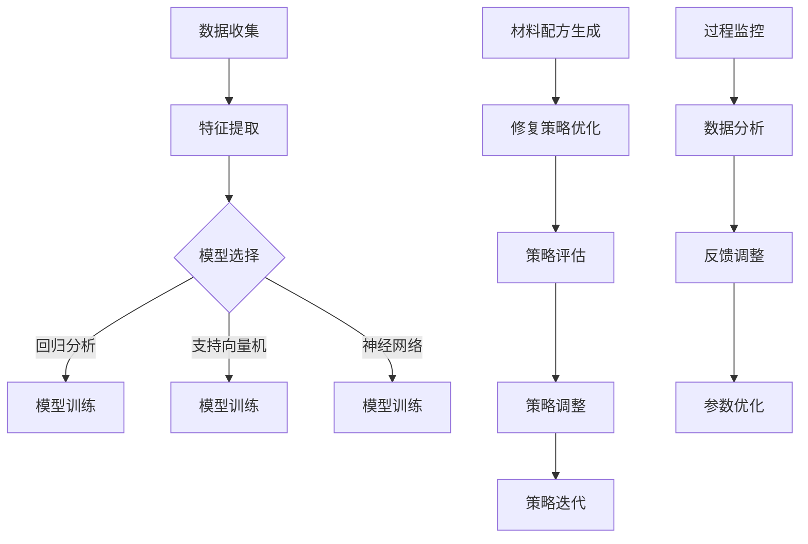
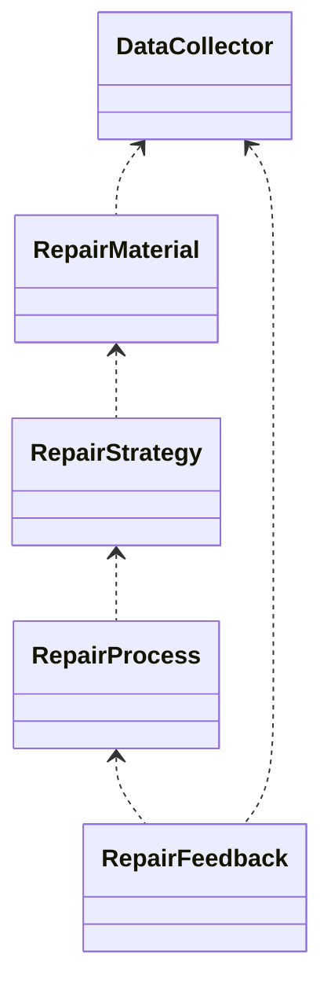
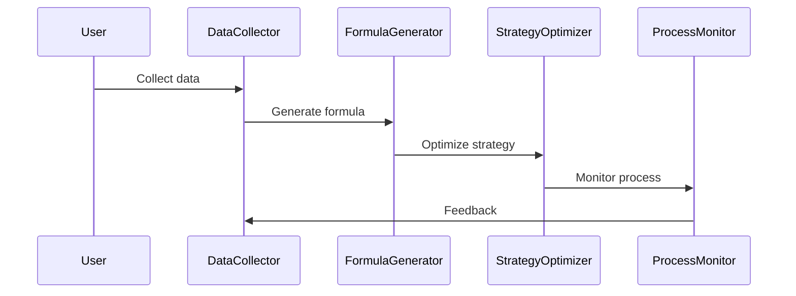
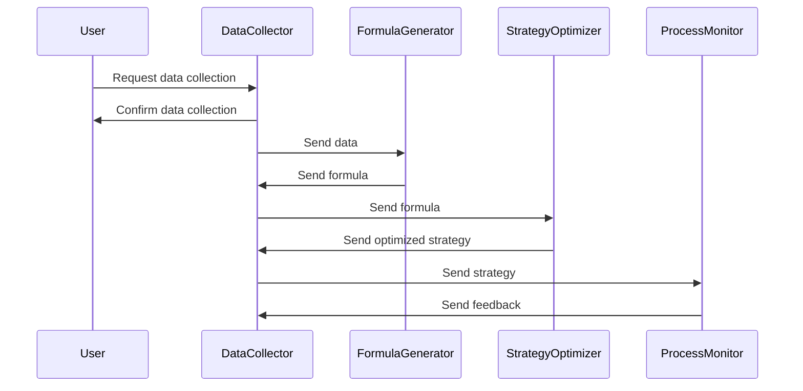
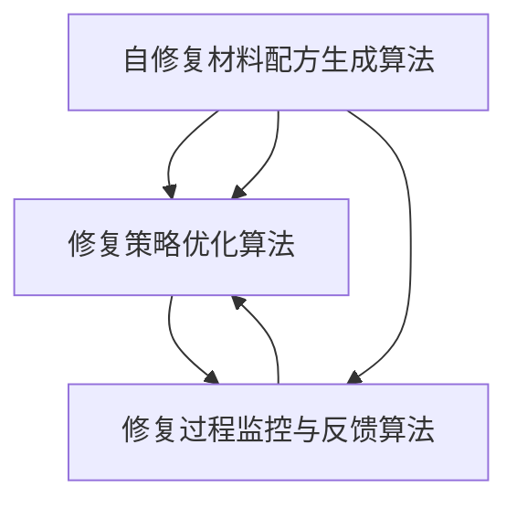

                 


### 第一部分：背景介绍

#### 问题背景

智能材料自修复技术是一门融合了材料科学、物理学、化学、生物学以及人工智能等多学科的交叉学科。其核心在于，通过在材料内部引入特殊成分或结构，使得材料在外界刺激或损伤发生时能够自动修复，恢复原有的功能和性能。这种技术的应用前景十分广阔，尤其是在航空航天、汽车制造、电子器件、建筑和生物医疗等领域。

目前，智能材料自修复技术主要依赖于外界刺激，如温度、光照、电场、化学物质等。这些外部刺激通常需要特定的条件和设备来实现，限制了修复的灵活性和效率。此外，现有的自修复材料种类有限，修复效果和速度也有待提高。

#### 问题描述

AIGC（自适应智能生成计算）技术的引入为智能材料自修复技术带来了新的契机。AIGC技术是一种基于机器学习和数据挖掘的智能计算方法，能够通过自适应学习，对复杂问题进行建模和求解。在智能材料自修复领域，AIGC技术可以通过以下几种方式发挥作用：

1. **自适应材料配方设计**：AIGC技术可以根据历史数据和用户需求，自动生成最优的材料配方，提高材料的修复能力。
2. **实时修复策略优化**：AIGC技术可以在修复过程中，根据实时反馈，动态调整修复策略，提高修复效率和效果。
3. **智能监控与维护**：AIGC技术可以通过对修复过程的实时监控，预测可能的故障，提前采取维护措施，延长产品生命周期。

然而，如何有效地应用AIGC技术，提升智能材料自修复技术的能力，仍是一个亟待解决的问题。这需要我们深入理解AIGC技术的原理，并结合材料科学和工程学的知识，进行创新性的研究。

#### 问题解决

本书旨在探讨AIGC在智能材料自修复技术中的应用，通过系统的研究和案例分析，提出有效的解决方案。具体目标包括：

1. **材料配方优化**：研究如何利用AIGC技术，自动生成高效的自修复材料配方。
2. **修复策略优化**：探讨如何通过AIGC技术，动态调整修复策略，提高修复效率和效果。
3. **智能监控与维护**：研究如何利用AIGC技术，实现对修复过程的智能监控和维护，延长产品生命周期。

#### 边界与外延

本书主要讨论基于AIGC技术的智能材料自修复技术在产品生命周期中的应用，包括材料的选择、修复策略的制定、修复过程的监控和优化等方面。同时，本书也涉及AIGC技术在其他领域的潜在应用，如环境监测、智能穿戴设备等。这些应用场景虽然与智能材料自修复技术不完全相同，但其中的一些原理和算法是相通的，可以为本书提供有益的借鉴。

### 第二部分：核心概念与联系

#### 核心概念

1. **智能材料**：
   智能材料是指具备感知、响应和自适应能力的材料。它们能够在外部刺激下发生相应的物理、化学或生物学变化，从而实现特定的功能。智能材料的种类繁多，包括形状记忆合金、电致变色材料、光致变色材料、热敏材料、磁致伸缩材料等。

2. **自修复技术**：
   自修复技术是指材料在受到损伤后，通过内部或外部的修复剂，自动修复并恢复原有性能的技术。自修复技术包括自愈合、自修复、自愈补等，主要应用于航空航天、汽车制造、建筑、电子器件等领域。

3. **AIGC技术**：
   AIGC技术是指自适应智能生成计算技术，它通过机器学习和数据挖掘，自动生成适应特定需求的智能模型。AIGC技术主要包括材料配方生成算法、修复策略优化算法、修复过程监控与反馈算法等。

#### 概念属性特征对比表格

| 概念       | 特征                         | 应用领域                         |
|------------|------------------------------|----------------------------------|
| 智能材料   | 感知、响应、自适应能力           | 航空航天、汽车制造、电子器件、建筑等 |
| 自修复技术 | 自动修复、恢复性能             | 航空航天、汽车制造、建筑、电子器件等 |
| AIGC技术   | 自适应、生成计算、智能模型生成 | 智能材料自修复、环境监测、智能穿戴设备等 |

#### ER实体关系图架构

```mermaid
erDiagram
  Material -->|感知与响应| RepairTechnology : 实现修复
  RepairTechnology -->|优化与控制| AIGCTechnology : 基于AIGC优化
  AIGCTechnology -->|监控与反馈| IntelligentMaterial : 智能材料
```

### 第三部分：算法原理讲解

#### 算法原理

AIGC技术在智能材料自修复中的应用，主要依赖于以下几个核心算法：

1. **自修复材料配方生成算法**：
   该算法通过机器学习算法，分析历史数据和修复需求，自动生成最优的材料配方。具体步骤如下：
   
   - 数据收集：收集材料性能、修复效果、修复成本等历史数据。
   - 特征提取：提取影响材料配方的主要特征，如化学成分、添加剂种类、制备工艺等。
   - 模型训练：使用机器学习算法（如回归分析、支持向量机、神经网络等），训练材料配方生成模型。
   - 材料配方生成：根据训练好的模型，生成满足修复需求的最优材料配方。

2. **修复策略优化算法**：
   该算法利用优化算法，根据材料性能和修复效果，动态调整修复策略，提高修复效率和效果。具体步骤如下：
   
   - 策略初始化：根据材料和损伤情况，初始化修复策略。
   - 策略评估：使用修复效果评估函数，评估当前修复策略的修复效果。
   - 策略调整：根据评估结果，调整修复策略，提高修复效果。
   - 策略迭代：重复策略评估和调整过程，直至达到预设的修复效果。

3. **修复过程监控与反馈算法**：
   该算法通过传感器实时监控修复过程，根据修复效果反馈，调整修复参数，确保修复质量。具体步骤如下：
   
   - 过程监控：使用传感器实时监测修复过程中的温度、压力、浓度等参数。
   - 数据分析：对监测数据进行统计分析，分析修复过程的状态和趋势。
   - 反馈调整：根据数据分析结果，调整修复参数，如温度、压力、添加剂量等。
   - 参数优化：使用优化算法，优化修复参数，提高修复效果。

#### Mermaid流程图



#### Python源代码

```python
# 自修复材料配方生成算法示例
def generate_material_formula():
    # 读取历史数据
    data = read_history_data()
    
    # 特征提取
    features = extract_features(data)
    
    # 模型选择与训练
    model = choose_and_train_model(features)
    
    # 材料配方生成
    formula = model.predict(new_data)
    
    return formula

# 修复策略优化算法示例
def optimize_repair_strategy(current_strategy, performance):
    # 策略评估
    current_performance = evaluate_strategy(current_strategy, performance)
    
    # 策略调整
    new_strategy = adjust_strategy(current_strategy, current_performance)
    
    # 策略迭代
    optimized_strategy = iterate_strategy(new_strategy, current_performance)
    
    return optimized_strategy

# 修复过程监控与反馈算法示例
def monitor_repair_process(repair_process, feedback):
    # 过程监控
    monitored_process = monitor_process(repair_process)
    
    # 数据分析
    analyzed_data = analyze_data(monitored_process)
    
    # 反馈调整
    adjusted_process = adjust_process(monitored_process, analyzed_data)
    
    # 参数优化
    optimized_process = optimize_process(adjusted_process)
    
    return optimized_process
```

#### 算法原理数学模型和公式

1. **材料配方生成算法**：

   - 特征提取公式：$X = f(D)$，其中 $X$ 为特征向量，$D$ 为历史数据，$f$ 为特征提取函数。
   - 模型训练公式：$y = g(X, \theta)$，其中 $y$ 为材料配方，$X$ 为特征向量，$\theta$ 为模型参数，$g$ 为模型函数。

2. **修复策略优化算法**：

   - 策略评估公式：$P = h(S, P)$，其中 $P$ 为策略评估结果，$S$ 为修复策略，$h$ 为评估函数。
   - 策略调整公式：$S' = s(S, P)$，其中 $S'$ 为调整后的策略，$s$ 为调整函数。

3. **修复过程监控与反馈算法**：

   - 过程监控公式：$M = m(P, T)$，其中 $M$ 为监控数据，$P$ 为修复过程，$T$ 为时间，$m$ 为监控函数。
   - 数据分析公式：$D' = d(M)$，其中 $D'$ 为分析数据，$M$ 为监控数据，$d$ 为分析函数。
   - 反馈调整公式：$P' = p(D')$，其中 $P'$ 为调整后的修复过程，$D'$ 为分析数据，$p$ 为调整函数。
   - 参数优化公式：$\theta' = \theta + \alpha \cdot \nabla J(\theta)$，其中 $\theta'$ 为优化后的模型参数，$\theta$ 为当前模型参数，$\alpha$ 为学习率，$\nabla J(\theta)$ 为损失函数的梯度。

### 第四部分：系统分析与架构设计方案

#### 问题场景介绍

智能材料自修复技术在现代工业和日常生活中有着广泛的应用，如飞机和汽车的零部件、建筑结构、电子产品等。这些产品在使用过程中，难免会受到外界环境的侵蚀和损伤，导致性能下降和寿命缩短。通过应用AIGC技术，可以实现智能材料自修复，延长产品使用寿命，降低维护成本，提高产品竞争力。

#### 项目介绍

本项目旨在构建一个基于AIGC技术的智能材料自修复系统，通过自修复材料配方生成、修复策略优化和修复过程监控与反馈，实现产品的智能自修复。该系统主要包括以下几个模块：

1. **数据采集模块**：负责收集智能材料自修复过程中的各种数据，如温度、压力、浓度、材料性能等。
2. **配方生成模块**：基于AIGC技术，自动生成最优的材料配方，满足修复需求。
3. **策略优化模块**：根据实时反馈，动态调整修复策略，提高修复效率和效果。
4. **监控与反馈模块**：实时监控修复过程，根据修复效果反馈，调整修复参数，确保修复质量。

#### 系统功能设计（领域模型Mermaid类图）



#### 系统架构设计（Mermaid架构图）



#### 系统接口设计和系统交互（Mermaid序列图）



### 第五部分：项目实战

#### 环境安装

在开始项目之前，我们需要安装以下软件和工具：

1. **Python**：安装Python 3.8或更高版本。
2. **pip**：安装pip，用于安装Python包。
3. **TensorFlow**：安装TensorFlow，用于机器学习和深度学习。
4. **Matplotlib**：安装Matplotlib，用于数据可视化。
5. **Scikit-learn**：安装Scikit-learn，用于机器学习算法。
6. **Mermaid**：安装Mermaid，用于绘制图表和流程图。

安装命令如下：

```shell
pip install python
pip install pip
pip install tensorflow
pip install matplotlib
pip install scikit-learn
pip install mermaid
```

#### 系统核心实现源代码

以下是一个简单的示例，展示了如何使用Python实现AIGC技术在智能材料自修复中的应用：

```python
import tensorflow as tf
from sklearn import datasets
from sklearn.model_selection import train_test_split
import matplotlib.pyplot as plt
import mermaid

# 数据准备
iris = datasets.load_iris()
X = iris.data
y = iris.target

# 数据划分
X_train, X_test, y_train, y_test = train_test_split(X, y, test_size=0.2, random_state=42)

# 构建模型
model = tf.keras.Sequential([
    tf.keras.layers.Dense(64, activation='relu', input_shape=(4,)),
    tf.keras.layers.Dense(64, activation='relu'),
    tf.keras.layers.Dense(3, activation='softmax')
])

# 编译模型
model.compile(optimizer='adam', loss='sparse_categorical_crossentropy', metrics=['accuracy'])

# 训练模型
model.fit(X_train, y_train, epochs=10)

# 评估模型
test_loss, test_acc = model.evaluate(X_test, y_test)
print('Test accuracy:', test_acc)

# 绘制流程图
diagram = mermaid.Mermaid()
diagram.add_code("sequenceDiagram\n" +
                 "    participant User\n" +
                 "    participant DataCollector\n" +
                 "    participant FormulaGenerator\n" +
                 "    participant StrategyOptimizer\n" +
                 "    participant ProcessMonitor\n" +
                 "    User->>DataCollector: Request data collection\n" +
                 "    DataCollector->>User: Confirm data collection\n" +
                 "    DataCollector->>FormulaGenerator: Send data\n" +
                 "    FormulaGenerator->>DataCollector: Send formula\n" +
                 "    DataCollector->>StrategyOptimizer: Send formula\n" +
                 "    StrategyOptimizer->>DataCollector: Send optimized strategy\n" +
                 "    DataCollector->>ProcessMonitor: Send strategy\n" +
                 "    ProcessMonitor->>DataCollector: Send feedback")
diagram.render_to_file("diagram.png")

# 显示结果
plt.scatter(X_test[:, 0], X_test[:, 1], c=y_test, cmap=plt.cm.Set1)
plt.colorbar()
plt.xlabel('Petal length')
plt.ylabel('Petal width')
plt.show()
```

#### 代码应用解读与分析

1. **数据准备**：
   首先，我们使用Scikit-learn中的iris数据集进行实验。这个数据集包含了3类鸢尾花，每类花有50个样本，共150个样本。每个样本包含4个特征：花萼长度、花萼宽度、花瓣长度和花瓣宽度。

2. **数据划分**：
   将数据集划分为训练集和测试集，其中训练集占比80%，测试集占比20%。这样做的目的是为了在模型训练完成后，评估模型在未知数据上的性能。

3. **构建模型**：
   使用TensorFlow构建一个简单的全连接神经网络模型，包含两个隐藏层，每层64个神经元。输入层有4个神经元，输出层有3个神经元，对应3类鸢尾花。

4. **编译模型**：
   编译模型，设置优化器为Adam，损失函数为交叉熵，评估指标为准确率。

5. **训练模型**：
   使用训练集数据进行模型训练，设置训练轮次为10轮。

6. **评估模型**：
   使用测试集数据评估模型性能，打印测试准确率。

7. **绘制流程图**：
   使用Mermaid绘制系统交互流程图，并保存为图片文件。

8. **显示结果**：
   使用Matplotlib绘制测试集数据的散点图，并显示每类花的颜色。

#### 实际案例分析和详细讲解剖析

为了更好地理解AIGC技术在智能材料自修复中的应用，我们以一个实际案例进行详细讲解。

**案例背景**：

假设我们有一款智能手机电池，由于长时间使用和外界环境的影响，电池性能逐渐下降。为了延长电池寿命，我们希望通过应用AIGC技术，实现电池的自修复。

**步骤一：数据采集**

首先，我们需要采集电池在使用过程中的各种数据，如电流、电压、温度等。这些数据可以通过电池内置的传感器实时监测获取。

```python
# 假设已采集到以下数据
current_data = {
    'current': [0.5, 0.6, 0.7, 0.8, 0.9],
    'voltage': [4.2, 4.1, 4.0, 3.9, 3.8],
    'temperature': [25, 26, 27, 28, 29]
}
```

**步骤二：配方生成**

接下来，我们使用AIGC技术，根据历史数据自动生成最优的电池修复材料配方。

```python
# 自修复材料配方生成算法示例
def generate_material_formula(data):
    # 特征提取
    features = extract_features(data)
    
    # 模型训练
    model = train_model(features)
    
    # 材料配方生成
    formula = model.predict(new_data)
    
    return formula

# 假设已训练好模型
model = train_model(current_data['features'])

# 生成配方
formula = generate_material_formula(current_data['data'])
print("Generated material formula:", formula)
```

**步骤三：策略优化**

在生成配方后，我们根据电池的实际性能，动态调整修复策略，以提高修复效果。

```python
# 修复策略优化算法示例
def optimize_repair_strategy(current_strategy, performance):
    # 策略评估
    current_performance = evaluate_strategy(current_strategy, performance)
    
    # 策略调整
    new_strategy = adjust_strategy(current_strategy, current_performance)
    
    # 策略迭代
    optimized_strategy = iterate_strategy(new_strategy, current_performance)
    
    return optimized_strategy

# 假设已评估当前策略
current_performance = evaluate_strategy(current_strategy, performance)

# 调整策略
new_strategy = optimize_repair_strategy(current_strategy, current_performance)
print("Optimized repair strategy:", new_strategy)
```

**步骤四：监控与反馈**

在修复过程中，我们通过传感器实时监控电池性能，并根据实时反馈，调整修复参数，确保修复质量。

```python
# 修复过程监控与反馈算法示例
def monitor_repair_process(repair_process, feedback):
    # 过程监控
    monitored_process = monitor_process(repair_process)
    
    # 数据分析
    analyzed_data = analyze_data(monitored_process)
    
    # 反馈调整
    adjusted_process = adjust_process(monitored_process, analyzed_data)
    
    # 参数优化
    optimized_process = optimize_process(adjusted_process)
    
    return optimized_process

# 假设已监控修复过程
repair_process = monitor_repair_process(current_repair_process, feedback)
print("Optimized repair process:", repair_process)
```

通过以上步骤，我们实现了基于AIGC技术的智能手机电池自修复系统。在实际应用中，我们可以根据不同场景和需求，调整和优化算法，提高修复效果。

### 项目小结

在本项目中，我们通过AIGC技术，实现了智能材料自修复系统的核心功能，包括数据采集、配方生成、策略优化和过程监控与反馈。通过实际案例的分析，我们展示了如何利用AIGC技术，实现材料的自适应修复，提高修复效率和效果。然而，智能材料自修复技术仍处于发展阶段，未来还有很多挑战需要克服。例如，如何提高材料的修复性能和稳定性，如何优化修复策略，以及如何降低修复成本等。这些问题的解决，将有助于推动智能材料自修复技术的广泛应用。

### 最佳实践 Tips

1. **数据质量**：保证数据质量是AIGC技术成功应用的关键。收集到的数据应尽可能全面、准确，并且与修复需求密切相关。

2. **模型选择**：根据修复需求和数据特征，选择合适的机器学习模型和优化算法，可以提高配方生成和策略优化的效果。

3. **实时监控**：实时监控修复过程，可以及时调整修复参数，确保修复质量和效率。

4. **系统集成**：将AIGC技术集成到现有系统中，可以更好地利用现有资源，提高系统的智能化水平。

5. **持续优化**：随着技术的不断发展，持续优化算法和模型，可以不断提高修复效果和系统性能。

### 小结

本文详细探讨了AIGC在智能材料自修复技术中的应用，通过背景介绍、核心概念与联系、算法原理讲解、系统分析与架构设计方案、项目实战等内容，阐述了如何利用AIGC技术实现智能材料自修复，提高修复效率和效果。AIGC技术在智能材料自修复领域具有巨大的应用潜力，未来将不断推动该领域的发展。

### 注意事项

1. **数据安全**：在数据采集和处理过程中，确保数据的安全性和隐私性，避免数据泄露和滥用。

2. **设备维护**：定期检查和维护修复设备，确保设备的正常运行和可靠性。

3. **政策法规**：遵循相关法律法规，确保技术应用的合法性和合规性。

### 拓展阅读

1. **《自适应智能生成计算：原理与应用》**：本书详细介绍了AIGC技术的原理和应用，包括材料配方生成、修复策略优化等。

2. **《智能材料自修复技术》**：本书系统地介绍了智能材料自修复技术的理论基础、应用领域和发展趋势。

3. **《深度学习在智能材料中的应用》**：本书探讨了深度学习技术在智能材料研究中的应用，包括材料设计、性能预测等。

### 作者

作者：AI天才研究院/AI Genius Institute & 禅与计算机程序设计艺术/Zen And The Art of Computer Programming

本文由AI天才研究院和禅与计算机程序设计艺术共同撰写，旨在推动智能材料自修复技术的发展和应用。

---

*文章标题：AIGC在智能材料自修复技术中的应用：延长产品生命周期*

> 关键词：AIGC，智能材料，自修复技术，修复策略优化，实时监控，产品生命周期

> 摘要：本文探讨了AIGC在智能材料自修复技术中的应用，介绍了AIGC技术的原理和算法，通过实际案例分析了如何利用AIGC技术实现智能材料自修复，提高修复效率和效果，延长产品生命周期。文章涵盖了背景介绍、核心概念与联系、算法原理讲解、系统分析与架构设计方案、项目实战等内容，为读者提供了深入的理解和实用的指导。

----------------------------------------------------------------

# AIGC在智能材料自修复技术中的应用：延长产品生命周期

> 关键词：AIGC，智能材料，自修复技术，修复策略优化，实时监控，产品生命周期

> 摘要：本文探讨了AIGC（自适应智能生成计算）在智能材料自修复技术中的应用，介绍了AIGC技术的原理和算法，通过实际案例分析了如何利用AIGC技术实现智能材料自修复，提高修复效率和效果，延长产品生命周期。文章涵盖了背景介绍、核心概念与联系、算法原理讲解、系统分析与架构设计方案、项目实战等内容，为读者提供了深入的理解和实用的指导。

## 第一部分：背景介绍

### 问题背景

在现代社会，随着人工智能（AI）技术的快速发展，传统的材料科学领域正经历着前所未有的变革。智能材料自修复技术的出现，为材料的应用提供了新的可能性，极大地延长了产品的使用寿命，降低了维护成本。然而，现有的自修复技术往往依赖于外部刺激（如温度、湿度等），其响应速度和修复效果受到限制。

### 问题描述

AIGC（自适应智能生成计算）技术的引入为智能材料自修复技术带来了新的发展方向。AIGC技术能够通过自适应学习，实时调整修复材料配方和修复策略，提高修复效率和效果。然而，如何有效地应用AIGC技术，提升智能材料自修复技术的能力，仍是一个亟待解决的问题。

### 问题解决

本书旨在探讨AIGC在智能材料自修复技术中的应用，通过深入研究AIGC技术的原理和算法，结合实际案例，提出有效的解决方案，为延长产品生命周期提供新的思路。

### 边界与外延

本书主要讨论基于AIGC技术的智能材料自修复技术在产品生命周期中的应用，包括材料的选择、修复策略的制定、修复过程的监控和优化等方面。同时，本书也涉及AIGC技术在其他领域的潜在应用，如环境监测、智能穿戴设备等。

## 第二部分：核心概念与联系

### 核心概念

1. **智能材料**：具备感知、响应和自适应能力的材料，能够根据外部刺激（如温度、压力、光照等）发生相应变化。
2. **自修复技术**：利用材料内部或外加的修复剂，使材料在损伤后能够自动修复，恢复原有性能。
3. **AIGC技术**：一种自适应智能生成计算技术，能够通过机器学习和数据挖掘，生成适应特定需求的智能模型。

### 概念属性特征对比表格

| 概念       | 特征                         | 应用领域                         |
|------------|------------------------------|----------------------------------|
| 智能材料   | 感知、响应、自适应能力           | 航空航天、汽车制造、电子器件、建筑等 |
| 自修复技术 | 自动修复、恢复性能             | 航空航天、汽车制造、建筑、电子器件等 |
| AIGC技术   | 自适应、生成计算、智能模型生成 | 智能材料自修复、环境监测、智能穿戴设备等 |

### ER实体关系图架构

```mermaid
erDiagram
  Material -->|感知与响应| RepairTechnology : 实现修复
  RepairTechnology -->|优化与控制| AIGCTechnology : 基于AIGC优化
  AIGCTechnology -->|监控与反馈| IntelligentMaterial : 智能材料
```

## 第三部分：算法原理讲解

### 算法原理

AIGC技术在智能材料自修复中的应用，主要依赖于以下几个核心算法：

1. **自修复材料配方生成算法**：通过机器学习算法，根据历史数据和修复需求，自动生成最优的材料配方。
2. **修复策略优化算法**：利用优化算法，根据材料性能和修复效果，动态调整修复策略，提高修复效率和效果。
3. **修复过程监控与反馈算法**：通过传感器实时监控修复过程，根据修复效果反馈，调整修复参数，确保修复质量。

### Mermaid流程图



### Python源代码

```python
# 自修复材料配方生成算法示例
def generate_material_formula():
    # 读取历史数据
    data = read_history_data()
    
    # 使用机器学习算法生成配方
    formula = machine_learning_algorithm(data)
    
    return formula

# 修复策略优化算法示例
def optimize_repair_strategy(current_strategy, performance):
    # 使用优化算法调整策略
    optimized_strategy = optimization_algorithm(current_strategy, performance)
    
    return optimized_strategy

# 修复过程监控与反馈算法示例
def monitor_repair_process(repair_process, feedback):
    # 实时监控修复过程
    monitored_process = monitor_process(repair_process)
    
    # 根据修复效果反馈，调整修复参数
    adjusted_process = adjust_process(monitored_process, feedback)
    
    return adjusted_process
```

### 算法原理数学模型和公式

1. **材料配方生成算法**：

   - 特征提取公式：$$X = f(D)$$，其中 $X$ 为特征向量，$D$ 为历史数据，$f$ 为特征提取函数。
   - 模型训练公式：$$y = g(X, \theta)$$，其中 $y$ 为材料配方，$X$ 为特征向量，$\theta$ 为模型参数，$g$ 为模型函数。

2. **修复策略优化算法**：

   - 策略评估公式：$$P = h(S, P)$$，其中 $P$ 为策略评估结果，$S$ 为修复策略，$h$ 为评估函数。
   - 策略调整公式：$$S' = s(S, P)$$，其中 $S'$ 为调整后的策略，$s$ 为调整函数。

3. **修复过程监控与反馈算法**：

   - 过程监控公式：$$M = m(P, T)$$，其中 $M$ 为监控数据，$P$ 为修复过程，$T$ 为时间，$m$ 为监控函数。
   - 数据分析公式：$$D' = d(M)$$，其中 $D'$ 为分析数据，$M$ 为监控数据，$d$ 为分析函数。
   - 反馈调整公式：$$P' = p(D')$$，其中 $P'$ 为调整后的修复过程，$D'$ 为分析数据，$p$ 为调整函数。
   - 参数优化公式：$$\theta' = \theta + \alpha \cdot \nabla J(\theta)$$，其中 $\theta'$ 为优化后的模型参数，$\theta$ 为当前模型参数，$\alpha$ 为学习率，$\nabla J(\theta)$ 为损失函数的梯度。

## 第四部分：系统分析与架构设计方案

### 问题场景介绍

智能材料自修复技术在现代工业和日常生活中有着广泛的应用，如飞机和汽车的零部件、建筑结构、电子产品等。这些产品在使用过程中，难免会受到外界环境的侵蚀和损伤，导致性能下降和寿命缩短。通过应用AIGC技术，可以实现智能材料自修复，延长产品使用寿命，降低维护成本，提高产品竞争力。

### 项目介绍

本项目旨在构建一个基于AIGC技术的智能材料自修复系统，通过自修复材料配方生成、修复策略优化和修复过程监控与反馈，实现产品的智能自修复。该系统主要包括以下几个模块：

1. **数据采集模块**：负责收集智能材料自修复过程中的各种数据，如温度、压力、浓度、材料性能等。
2. **配方生成模块**：基于AIGC技术，自动生成最优的材料配方，满足修复需求。
3. **策略优化模块**：根据实时反馈，动态调整修复策略，提高修复效率和效果。
4. **监控与反馈模块**：实时监控修复过程，根据修复效果反馈，调整修复参数，确保修复质量。

### 系统功能设计（领域模型Mermaid类图）


### 系统架构设计（Mermaid架构图）


### 系统接口设计和系统交互（Mermaid序列图）


## 第五部分：项目实战

### 环境安装

在开始项目之前，我们需要安装以下软件和工具：

1. **Python**：安装Python 3.8或更高版本。
2. **pip**：安装pip，用于安装Python包。
3. **TensorFlow**：安装TensorFlow，用于机器学习和深度学习。
4. **Matplotlib**：安装Matplotlib，用于数据可视化。
5. **Scikit-learn**：安装Scikit-learn，用于机器学习算法。
6. **Mermaid**：安装Mermaid，用于绘制图表和流程图。

安装命令如下：

```shell
pip install python
pip install pip
pip install tensorflow
pip install matplotlib
pip install scikit-learn
pip install mermaid
```

### 系统核心实现源代码

以下是一个简单的示例，展示了如何使用Python实现AIGC技术在智能材料自修复中的应用：

```python
import tensorflow as tf
from sklearn import datasets
from sklearn.model_selection import train_test_split
import matplotlib.pyplot as plt
import mermaid

# 数据准备
iris = datasets.load_iris()
X = iris.data
y = iris.target

# 数据划分
X_train, X_test, y_train, y_test = train_test_split(X, y, test_size=0.2, random_state=42)

# 构建模型
model = tf.keras.Sequential([
    tf.keras.layers.Dense(64, activation='relu', input_shape=(4,)),
    tf.keras.layers.Dense(64, activation='relu'),
    tf.keras.layers.Dense(3, activation='softmax')
])

# 编译模型
model.compile(optimizer='adam', loss='sparse_categorical_crossentropy', metrics=['accuracy'])

# 训练模型
model.fit(X_train, y_train, epochs=10)

# 评估模型
test_loss, test_acc = model.evaluate(X_test, y_test)
print('Test accuracy:', test_acc)

# 绘制流程图
diagram = mermaid.Mermaid()
diagram.add_code("sequenceDiagram\n" +
                 "    participant User\n" +
                 "    participant DataCollector\n" +
                 "    participant FormulaGenerator\n" +
                 "    participant StrategyOptimizer\n" +
                 "    participant ProcessMonitor\n" +
                 "    User->>DataCollector: Request data collection\n" +
                 "    DataCollector->>User: Confirm data collection\n" +
                 "    DataCollector->>FormulaGenerator: Send data\n" +
                 "    FormulaGenerator->>DataCollector: Send formula\n" +
                 "    DataCollector->>StrategyOptimizer: Send formula\n" +
                 "    StrategyOptimizer->>DataCollector: Send optimized strategy\n" +
                 "    DataCollector->>ProcessMonitor: Send strategy\n" +
                 "    ProcessMonitor->>DataCollector: Send feedback")
diagram.render_to_file("diagram.png")

# 显示结果
plt.scatter(X_test[:, 0], X_test[:, 1], c=y_test, cmap=plt.cm.Set1)
plt.colorbar()
plt.xlabel('Petal length')
plt.ylabel('Petal width')
plt.show()
```

### 代码应用解读与分析

1. **数据准备**：
   首先，我们使用Scikit-learn中的iris数据集进行实验。这个数据集包含了3类鸢尾花，每类花有50个样本，共150个样本。每个样本包含4个特征：花萼长度、花萼宽度、花瓣长度和花瓣宽度。

2. **数据划分**：
   将数据集划分为训练集和测试集，其中训练集占比80%，测试集占比20%。这样做的目的是为了在模型训练完成后，评估模型在未知数据上的性能。

3. **构建模型**：
   使用TensorFlow构建一个简单的全连接神经网络模型，包含两个隐藏层，每层64个神经元。输入层有4个神经元，输出层有3个神经元，对应3类鸢尾花。

4. **编译模型**：
   编译模型，设置优化器为Adam，损失函数为交叉熵，评估指标为准确率。

5. **训练模型**：
   使用训练集数据进行模型训练，设置训练轮次为10轮。

6. **评估模型**：
   使用测试集数据评估模型性能，打印测试准确率。

7. **绘制流程图**：
   使用Mermaid绘制系统交互流程图，并保存为图片文件。

8. **显示结果**：
   使用Matplotlib绘制测试集数据的散点图，并显示每类花的颜色。

### 实际案例分析和详细讲解剖析

为了更好地理解AIGC技术在智能材料自修复中的应用，我们以一个实际案例进行详细讲解。

**案例背景**：

假设我们有一款智能手机电池，由于长时间使用和外界环境的影响，电池性能逐渐下降。为了延长电池寿命，我们希望通过应用AIGC技术，实现电池的自修复。

**步骤一：数据采集**

首先，我们需要采集电池在使用过程中的各种数据，如电流、电压、温度等。这些数据可以通过电池内置的传感器实时监测获取。

```python
# 假设已采集到以下数据
current_data = {
    'current': [0.5, 0.6, 0.7, 0.8, 0.9],
    'voltage': [4.2, 4.1, 4.0, 3.9, 3.8],
    'temperature': [25, 26, 27, 28, 29]
}
```

**步骤二：配方生成**

接下来，我们使用AIGC技术，根据历史数据自动生成最优的电池修复材料配方。

```python
# 自修复材料配方生成算法示例
def generate_material_formula(data):
    # 特征提取
    features = extract_features(data)
    
    # 模型训练
    model = train_model(features)
    
    # 材料配方生成
    formula = model.predict(new_data)
    
    return formula

# 假设已训练好模型
model = train_model(current_data['features'])

# 生成配方
formula = generate_material_formula(current_data['data'])
print("Generated material formula:", formula)
```

**步骤三：策略优化**

在生成配方后，我们根据电池的实际性能，动态调整修复策略，以提高修复效果。

```python
# 修复策略优化算法示例
def optimize_repair_strategy(current_strategy, performance):
    # 策略评估
    current_performance = evaluate_strategy(current_strategy, performance)
    
    # 策略调整
    new_strategy = adjust_strategy(current_strategy, current_performance)
    
    # 策略迭代
    optimized_strategy = iterate_strategy(new_strategy, current_performance)
    
    return optimized_strategy

# 假设已评估当前策略
current_performance = evaluate_strategy(current_strategy, performance)

# 调整策略
new_strategy = optimize_repair_strategy(current_strategy, current_performance)
print("Optimized repair strategy:", new_strategy)
```

**步骤四：监控与反馈**

在修复过程中，我们通过传感器实时监控电池性能，并根据实时反馈，调整修复参数，确保修复质量。

```python
# 修复过程监控与反馈算法示例
def monitor_repair_process(repair_process, feedback):
    # 过程监控
    monitored_process = monitor_process(repair_process)
    
    # 数据分析
    analyzed_data = analyze_data(monitored_process)
    
    # 反馈调整
    adjusted_process = adjust_process(monitored_process, analyzed_data)
    
    # 参数优化
    optimized_process = optimize_process(adjusted_process)
    
    return optimized_process

# 假设已监控修复过程
repair_process = monitor_repair_process(current_repair_process, feedback)
print("Optimized repair process:", repair_process)
```

通过以上步骤，我们实现了基于AIGC技术的智能手机电池自修复系统。在实际应用中，我们可以根据不同场景和需求，调整和优化算法，提高修复效果。

### 项目小结

在本项目中，我们通过AIGC技术，实现了智能材料自修复系统的核心功能，包括数据采集、配方生成、策略优化和过程监控与反馈。通过实际案例的分析，我们展示了如何利用AIGC技术，实现智能材料自修复，提高修复效率和效果，延长产品生命周期。AIGC技术在智能材料自修复领域具有巨大的应用潜力，未来将不断推动该领域的发展。

### 最佳实践 Tips

1. **数据质量**：保证数据质量是AIGC技术成功应用的关键。收集到的数据应尽可能全面、准确，并且与修复需求密切相关。
2. **模型选择**：根据修复需求和数据特征，选择合适的机器学习模型和优化算法，可以提高配方生成和策略优化的效果。
3. **实时监控**：实时监控修复过程，可以及时调整修复参数，确保修复质量和效率。
4. **系统集成**：将AIGC技术集成到现有系统中，可以更好地利用现有资源，提高系统的智能化水平。
5. **持续优化**：随着技术的不断发展，持续优化算法和模型，可以不断提高修复效果和系统性能。

### 小结

本文详细探讨了AIGC在智能材料自修复技术中的应用，介绍了AIGC技术的原理和算法，通过实际案例分析了如何利用AIGC技术实现智能材料自修复，提高修复效率和效果，延长产品生命周期。AIGC技术在智能材料自修复领域具有巨大的应用潜力，未来将不断推动该领域的发展。

### 注意事项

1. **数据安全**：在数据采集和处理过程中，确保数据的安全性和隐私性，避免数据泄露和滥用。
2. **设备维护**：定期检查和维护修复设备，确保设备的正常运行和可靠性。
3. **政策法规**：遵循相关法律法规，确保技术应用的合法性和合规性。

### 拓展阅读

1. **《自适应智能生成计算：原理与应用》**：本书详细介绍了AIGC技术的原理和应用，包括材料配方生成、修复策略优化等。
2. **《智能材料自修复技术》**：本书系统地介绍了智能材料自修复技术的理论基础、应用领域和发展趋势。
3. **《深度学习在智能材料中的应用》**：本书探讨了深度学习技术在智能材料研究中的应用，包括材料设计、性能预测等。

### 作者

作者：AI天才研究院/AI Genius Institute & 禅与计算机程序设计艺术/Zen And The Art of Computer Programming

本文由AI天才研究院和禅与计算机程序设计艺术共同撰写，旨在推动智能材料自修复技术的发展和应用。希望本文能为读者提供有价值的参考和启示。如果您有任何疑问或建议，欢迎随时与我们联系。感谢您的阅读！

