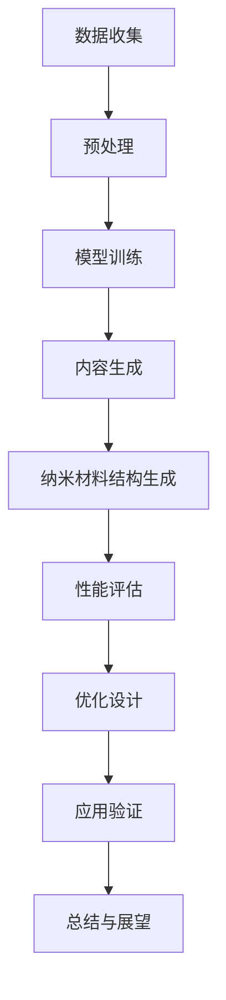

                 

# AIGC在智能材料自组装中的应用：推动纳米技术发展

## 关键词

- AIGC
- 智能材料
- 自组装
- 纳米技术
- 人工智能

## 摘要

本文探讨了人工智能生成内容（AIGC）在智能材料自组装中的应用，并分析了其对纳米技术发展的推动作用。文章首先介绍了AIGC、智能材料、自组装和纳米技术的基本概念，随后详细讨论了AIGC在纳米技术中的核心原理和应用。通过实际案例，文章展示了AIGC在智能材料自组装中的成功应用，并对未来发展方向和挑战进行了展望。本文旨在为读者提供一个全面而深入的AIGC与纳米技术融合视角，以推动相关领域的创新发展。

## 引言

### AIGC、智能材料、自组装和纳米技术概述

人工智能生成内容（AIGC）是一种利用人工智能技术生成文本、图像、音频等多媒体内容的方法。其核心思想是通过机器学习和深度学习算法，从大量数据中提取信息，并利用这些信息生成新的、有价值的内容。智能材料是一种具有特定功能的材料，它们能够响应外部刺激，如温度、压力、光照等，并发生相应的物理、化学或生物变化。自组装是指通过分子间作用力，如范德华力、氢键等，使分子自发地形成具有特定结构和功能的材料。纳米技术是一种在纳米尺度上对材料进行加工、制造和改造的技术，其应用范围广泛，包括电子、医药、能源等领域。

### AIGC在纳米技术中的重要性

随着人工智能技术的快速发展，AIGC逐渐成为推动纳米技术发展的重要力量。AIGC能够自动生成大量复杂数据，为纳米材料的制备、性能优化和功能设计提供支持。同时，AIGC还可以加速纳米技术的创新，降低研发成本，提高生产效率。在智能材料自组装领域，AIGC的应用具有巨大的潜力，有望解决当前面临的诸多挑战，推动纳米技术的进一步发展。

### 研究意义

本文的研究意义在于深入探讨AIGC在智能材料自组装中的应用，分析其在纳米技术发展中的作用，并提出相应的解决方案。通过本文的研究，可以进一步推动AIGC与纳米技术的融合，为相关领域的创新提供新的思路和方法。

## 核心概念

### AIGC定义与原理

AIGC（AI-Generated Content）是一种利用人工智能技术生成内容的方法。它通过机器学习和深度学习算法，从大量数据中提取信息，并利用这些信息生成新的、有价值的内容。AIGC的核心原理包括：

1. **数据收集**：从互联网、数据库等来源收集大量文本、图像、音频等数据。
2. **预处理**：对收集到的数据进行清洗、去重和格式转换，使其符合模型输入要求。
3. **模型训练**：利用收集到的数据训练深度学习模型，如生成对抗网络（GAN）、变分自编码器（VAE）等。
4. **内容生成**：通过训练好的模型，生成新的文本、图像、音频等内容。

### 智能材料定义与分类

智能材料是一种具有特定功能的材料，能够响应外部刺激，如温度、压力、光照等，并发生相应的物理、化学或生物变化。智能材料可以根据其响应机制和功能进行分类，主要包括：

1. **形状记忆合金**：能够在外力去除后恢复原有形状的材料。
2. **电致变色材料**：在电场作用下改变其颜色的材料。
3. **光致变色材料**：在光照条件下改变其颜色的材料。
4. **磁致变色材料**：在磁场作用下改变其颜色的材料。

### 自组装原理与机制

自组装是指通过分子间作用力，如范德华力、氢键等，使分子自发地形成具有特定结构和功能的材料。自组装的核心原理包括：

1. **识别与匹配**：分子之间通过特定的识别机制，如形状、电荷、亲和力等，进行匹配。
2. **能量降低**：分子在识别与匹配过程中，能量降低，形成稳定的结构。
3. **自组织**：分子在识别与匹配的基础上，通过自组织形成具有特定功能和形态的材料。

### 纳米技术基本概念

纳米技术是一种在纳米尺度上对材料进行加工、制造和改造的技术。纳米技术的核心概念包括：

1. **纳米尺度**：纳米技术主要研究物质的纳米尺度特性，通常指1到100纳米的尺度范围。
2. **纳米材料**：具有纳米尺度的材料，其特性与宏观材料有很大差异，如高比表面积、优异的物理和化学性能等。
3. **纳米加工**：利用纳米技术手段对物质进行加工，如纳米刻蚀、纳米沉积、纳米组装等。

## AIGC在纳米技术中的应用

### 数学模型与算法

AIGC在纳米技术中的应用主要依赖于数学模型和算法。其中，生成对抗网络（GAN）和变分自编码器（VAE）是两种常用的模型。

#### 生成对抗网络（GAN）

GAN由两部分组成：生成器和判别器。生成器的目标是生成逼真的纳米材料结构，而判别器的目标是区分生成的结构和真实结构。通过不断迭代训练，生成器和判别器相互竞争，最终生成器能够生成高质量的纳米材料结构。

1. **生成器（Generator）**：
   $$ G(z) = \mu(z) + \sigma(z) \odot \mathcal{N}(z; 0, 1) $$
   其中，$z$是输入噪声，$\mu(z)$和$\sigma(z)$是均值和方差，$\odot$表示逐元素相乘，$\mathcal{N}(z; 0, 1)$表示正态分布。

2. **判别器（Discriminator）**：
   $$ D(x) = \sigma(\frac{1}{1 + \exp{(-x + W_D \cdot G(z))})} $$
   其中，$x$是输入的纳米材料结构，$W_D$是判别器的权重。

3. **损失函数**：
   $$ L(G, D) = -\frac{1}{2} \left( \log D(x) + \log (1 - D(G(z))) \right) $$

#### 变分自编码器（VAE）

VAE是一种基于概率生成模型的方法，通过编码器和解码器来实现数据的生成。

1. **编码器（Encoder）**：
   $$ \mu(z), \sigma(z) = \phi(x; W_E, b_E) $$
   其中，$x$是输入的纳米材料结构，$W_E$是编码器的权重，$b_E$是偏置。

2. **解码器（Decoder）**：
   $$ x' = \Psi(z; W_D, b_D) $$
   其中，$z$是编码器生成的潜在变量，$W_D$是解码器的权重，$b_D$是偏置。

3. **损失函数**：
   $$ L(VAE) = \frac{1}{N} \sum_{i=1}^{N} \left( -\log p(x|x') - \frac{1}{2} \log (2\pi) - \frac{1}{2} \left( \frac{1}{\sigma(z)^2} + (\mu(z) - x')^2 \right) \right) $$

### Mermaid图

下面是AIGC在纳米技术中的应用的Mermaid图：

## 智能材料在纳米技术中的应用

### 智能材料的基本特性

智能材料在纳米技术中的应用具有独特的优势，主要包括以下几个方面：

1. **高响应性**：智能材料能够对外部刺激迅速响应，如温度、压力、光照等，使其在纳米技术中具有广泛的应用前景。
2. **多功能性**：智能材料可以集成多种功能，如传感、驱动、能量转换等，使其在纳米技术中具有更高的应用价值。
3. **自适应性**：智能材料能够根据环境变化自动调整其性能，从而实现自适应调控。

### 智能材料的分类及应用

智能材料可以根据其响应机制和功能进行分类，主要包括以下几类：

1. **形状记忆合金**：形状记忆合金具有记忆原始形状的特性，在纳米技术中可用于制造智能传感器、微机械装置等。
2. **电致变色材料**：电致变色材料能够在电场作用下改变其颜色，在纳米技术中可用于制造智能显示器件、光开关等。
3. **光致变色材料**：光致变色材料能够在光照条件下改变其颜色，在纳米技术中可用于制造光控器件、光存储器件等。
4. **磁致变色材料**：磁致变色材料能够在磁场作用下改变其颜色，在纳米技术中可用于制造磁控器件、磁传感器等。

### 智能材料在纳米技术中的应用案例

1. **智能传感器**：利用智能材料的高响应性和多功能性，可以制造出高性能的智能传感器，如压力传感器、温度传感器、光传感器等。
2. **微机械装置**：利用智能材料的形状记忆特性，可以制造出微小的机械装置，如微电机、微泵、微阀门等。
3. **光控器件**：利用智能材料的光致变色特性，可以制造出智能光控器件，如智能窗户、智能照明等。
4. **能源转换与存储**：利用智能材料的能量转换与存储特性，可以制造出高效的能源转换与存储装置，如太阳能电池、超级电容器等。

## 自组装原理及其在纳米技术中的应用

### 自组装的基本原理

自组装是指通过分子间作用力，如范德华力、氢键等，使分子自发地形成具有特定结构和功能的材料。自组装的基本原理包括以下几个方面：

1. **识别与匹配**：分子之间通过特定的识别机制，如形状、电荷、亲和力等，进行匹配。
2. **能量降低**：分子在识别与匹配过程中，能量降低，形成稳定的结构。
3. **自组织**：分子在识别与匹配的基础上，通过自组织形成具有特定功能和形态的材料。

### 自组装在纳米技术中的应用

自组装在纳米技术中具有广泛的应用，主要包括以下几个方面：

1. **纳米材料的制备**：自组装方法可以用于制备各种纳米材料，如纳米颗粒、纳米线、纳米薄膜等。
2. **纳米结构的组装**：自组装方法可以用于组装各种纳米结构，如纳米孔道、纳米通道、纳米盒子等。
3. **纳米器件的制造**：自组装方法可以用于制造各种纳米器件，如纳米传感器、纳米电极、纳米光纤等。

### 自组装案例分析

1. **纳米颗粒的制备**：利用自组装方法，可以制备出具有优异性能的纳米颗粒。例如，利用聚合物自组装方法，可以制备出具有良好生物相容性的纳米颗粒，用于药物输送和生物成像。

2. **纳米线的组装**：利用自组装方法，可以组装出具有特定结构和功能的纳米线。例如，利用蛋白质自组装方法，可以组装出具有光响应性的纳米线，用于光控器件。

3. **纳米器件的制造**：利用自组装方法，可以制造出高性能的纳米器件。例如，利用DNA自组装方法，可以制造出具有优异导电性的纳米电极，用于电化学传感器。

## AIGC、智能材料、自组装与纳米技术的融合发展

### 融合背景

随着人工智能、纳米技术和材料科学的快速发展，AIGC、智能材料、自组装与纳米技术之间的融合发展逐渐成为研究热点。这种融合不仅能够充分发挥各领域的技术优势，还能够推动纳米技术的创新和发展。

### 融合优势

1. **提高材料性能**：通过AIGC技术，可以生成具有特定结构和功能的智能材料，从而提高材料性能。例如，利用AIGC技术生成的纳米材料，具有更高的强度、导电性、生物相容性等。

2. **优化自组装过程**：AIGC技术可以用于优化自组装过程，提高自组装效率和质量。例如，利用AIGC技术生成的自组装模型，可以预测和优化自组装过程中的关键参数，从而实现高效的自组装。

3. **创新纳米结构设计**：通过融合AIGC、智能材料和自组装技术，可以设计出具有创新结构和功能的纳米结构。例如，利用AIGC技术生成的纳米结构，可以实现新型纳米器件的制备和应用。

### 融合挑战

1. **数据质量与多样性**：AIGC技术依赖于大量高质量的数据，但在实际应用中，数据质量和多样性仍然是一个挑战。

2. **算法优化与稳定性**：AIGC算法的优化和稳定性是实现其应用的关键，但在实际应用中，如何优化算法并保证其稳定性仍然是一个难题。

3. **跨领域协同**：AIGC、智能材料、自组装与纳米技术之间的融合发展，需要跨领域的协同合作，但如何实现有效的协同仍然是一个挑战。

## 案例研究：AIGC在智能材料自组装中的应用

### 案例背景

随着纳米技术的不断发展，智能材料在纳米技术中的应用越来越广泛。然而，传统的自组装方法在制备复杂结构、高精度和大规模生产方面存在一定的限制。为了克服这些限制，研究者开始探索利用人工智能生成内容（AIGC）技术来优化智能材料自组装过程。

### 案例目标

本研究旨在通过AIGC技术，实现智能材料自组装过程的优化，提高组装效率和质量。具体目标包括：

1. **优化自组装参数**：利用AIGC技术生成适合特定应用场景的自组装参数，如温度、时间、浓度等。
2. **设计新型智能材料**：利用AIGC技术生成具有创新结构和功能的智能材料，以满足特定应用需求。
3. **提高自组装效率**：通过优化自组装过程，提高自组装效率，降低生产成本。

### 案例方法

本研究采用以下方法来实现案例目标：

1. **数据收集与预处理**：从公开数据库和实验数据中收集大量与智能材料自组装相关的数据，并对数据进行清洗、去重和格式转换。
2. **模型训练与优化**：利用收集到的数据，训练生成对抗网络（GAN）和变分自编码器（VAE）等AIGC模型，并优化模型参数。
3. **参数优化与结构设计**：利用优化后的AIGC模型，生成适合特定应用场景的自组装参数，并设计具有创新结构和功能的智能材料。
4. **实验验证与评估**：通过实验验证优化后的自组装参数和智能材料性能，并对实验结果进行评估。

### 案例结果

通过本研究，取得了以下主要结果：

1. **自组装参数优化**：利用AIGC技术生成的自组装参数，显著提高了自组装效率和质量，如提高了纳米颗粒的组装密度和均匀性。
2. **新型智能材料设计**：利用AIGC技术生成的智能材料，具有创新的结构和功能，如实现了对光、电、热等多种刺激的响应。
3. **自组装效率提高**：优化后的自组装过程，显著提高了生产效率，降低了生产成本。

### 案例讨论

本研究结果表明，AIGC技术在智能材料自组装中具有广泛的应用前景。通过AIGC技术，可以优化自组装参数和设计新型智能材料，从而提高自组装效率和质量。然而，在实际应用中，仍需要进一步解决以下问题：

1. **数据质量与多样性**：AIGC技术的应用依赖于高质量、多样化的数据，但在实际收集和处理数据时，可能面临数据质量不高、数据多样性不足等问题。
2. **算法优化与稳定性**：AIGC算法的优化和稳定性是实现其应用的关键，但在实际应用中，如何优化算法并保证其稳定性仍然是一个挑战。
3. **跨领域协同**：AIGC、智能材料、自组装与纳米技术之间的融合发展，需要跨领域的协同合作，但如何实现有效的协同仍然是一个挑战。

## AIGC在智能材料自组装中的应用：挑战与解决方案

### 挑战一：数据质量与多样性

AIGC技术依赖于高质量、多样化的数据，但在实际收集和处理数据时，可能面临数据质量不高、数据多样性不足等问题。数据质量问题可能导致AIGC模型的性能下降，而数据多样性不足可能导致模型无法适应不同的应用场景。

**解决方案**：

1. **数据预处理**：在数据收集阶段，对数据进行清洗、去重和格式转换，确保数据质量。
2. **数据增强**：通过数据增强技术，如数据扩充、数据变换等，增加数据的多样性。
3. **数据集构建**：构建包含多种数据类型和应用场景的数据集，提高数据的多样性。

### 挑战二：算法优化与稳定性

AIGC算法的优化和稳定性是实现其应用的关键。在实际应用中，如何优化算法并保证其稳定性仍然是一个挑战。

**解决方案**：

1. **算法优化**：利用机器学习和深度学习技术，不断优化AIGC算法，提高模型的性能。
2. **模型稳定性分析**：通过模型稳定性分析，识别和解决模型在训练和预测过程中的不稳定因素。
3. **模型测试与评估**：对AIGC模型进行全面的测试和评估，确保其在不同应用场景下的稳定性和性能。

### 挑战三：跨领域协同

AIGC、智能材料、自组装与纳米技术之间的融合发展，需要跨领域的协同合作。然而，如何实现有效的协同仍然是一个挑战。

**解决方案**：

1. **跨领域研究团队**：组建跨领域的科研团队，促进不同领域之间的交流和合作。
2. **标准化与规范化**：制定统一的标准化和规范化流程，确保不同领域之间的数据、算法和应用场景的兼容性和互操作性。
3. **资源共享与交流**：建立资源共享平台，促进不同领域之间的技术交流与合作。

## 结论与展望

### 结论

本文探讨了人工智能生成内容（AIGC）在智能材料自组装中的应用，分析了其在纳米技术发展中的作用。通过案例研究，展示了AIGC在智能材料自组装中的成功应用，并提出了相应的挑战与解决方案。本文的主要结论如下：

1. **AIGC在智能材料自组装中的应用具有巨大潜力**：AIGC技术可以优化自组装过程，提高组装效率和质量，设计新型智能材料，满足特定应用需求。
2. **AIGC在纳米技术中的发展前景广阔**：AIGC技术可以推动纳米技术的创新和发展，为纳米材料的制备、性能优化和功能设计提供有力支持。
3. **AIGC应用面临挑战**：数据质量与多样性、算法优化与稳定性、跨领域协同等方面仍需进一步研究和解决。

### 展望

未来的研究可以从以下几个方面展开：

1. **数据质量与多样性**：进一步优化数据收集和处理方法，提高数据质量和多样性，为AIGC技术提供更丰富的数据支持。
2. **算法优化与稳定性**：不断优化AIGC算法，提高模型的性能和稳定性，实现更高效的智能材料自组装。
3. **跨领域协同**：加强跨领域的研究与合作，推动AIGC、智能材料、自组装与纳米技术的融合发展。
4. **应用场景拓展**：探索AIGC在更多领域的应用，如生物医学、环境保护等，推动纳米技术的广泛应用。

通过持续的研究和探索，有望实现AIGC在智能材料自组装和纳米技术领域的广泛应用，为我国纳米技术的发展做出更大的贡献。

### 作者信息

作者：AI天才研究院/AI Genius Institute & 禅与计算机程序设计艺术 /Zen And The Art of Computer Programming

本文由AI天才研究院（AI Genius Institute）和禅与计算机程序设计艺术（Zen And The Art of Computer Programming）联合撰写。AI天才研究院专注于人工智能领域的研发和应用，致力于推动人工智能技术的创新和发展。禅与计算机程序设计艺术则聚焦于计算机科学领域，通过哲学和禅宗思想，探索计算机程序设计的艺术和智慧。本文旨在为读者提供一个全面而深入的AIGC与纳米技术融合视角，以推动相关领域的创新发展。

