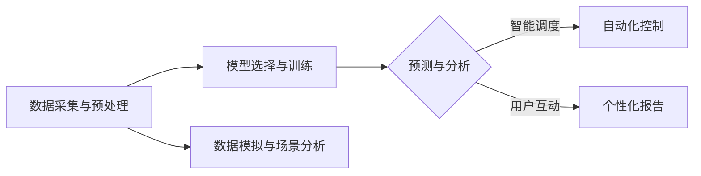
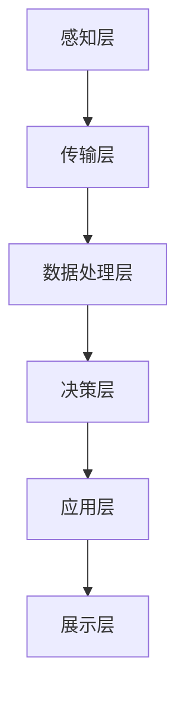
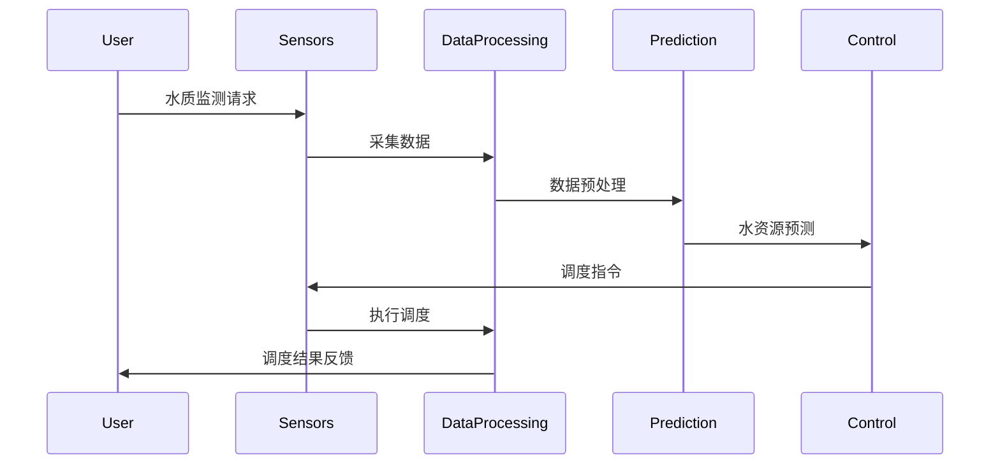

                 

## 引言与背景

### 1.1 水资源管理的重要性

水资源是地球生态系统的核心组成部分，对人类社会的发展至关重要。全球约有28%的人口生活在面临水资源短缺的地区，这一比例在2030年预计将增至47%。水资源管理不仅关乎环境的健康，也直接影响到城市的可持续发展、农业灌溉、工业生产和居民生活。

在城市环境中，水资源管理尤为复杂。城市人口的急剧增长和城市化进程加快，使得城市水资源供需矛盾愈发突出。传统的水资源管理方式依赖于人工监测和经验决策，难以应对日益复杂的水文条件。此外，气候变化和极端天气事件对城市水资源的冲击，使得水资源管理面临更大的挑战。

智能水循环系统作为现代水资源管理的重要手段，能够通过先进的信息技术对水资源进行高效、智能化的管理。AIGC（人工智能生成内容）技术的引入，使得智能水循环系统在设计、实施和运营过程中更加智能化和高效化。

### 1.2 城市水资源管理的挑战

城市水资源管理面临以下几大挑战：

1. **数据获取与处理**：城市水资源管理需要大量的数据支持，包括气象数据、水文数据、用水数据等。然而，数据获取渠道多样化，数据质量参差不齐，处理和分析这些数据是一个巨大的挑战。

2. **实时监控与响应**：城市水资源管理系统需要实时监控水资源的分布、流量和水质，以便在发现问题时迅速响应。传统系统往往难以实现实时性，导致响应速度慢、效果不佳。

3. **预测与决策**：准确预测未来一段时间内的水资源需求和水文条件，对于制定科学合理的水资源管理策略至关重要。然而，受限于技术和方法，预测的准确性往往不高。

4. **系统集成与协调**：城市水资源管理系统通常涉及多个部门，如水务部门、环保部门等。如何实现这些系统的集成与协调，提高整体管理效率，是一个重要的挑战。

### 1.3 AIGC技术在水资源管理中的应用前景

AIGC技术，作为一种结合了人工智能与生成内容的先进技术，为城市水资源管理带来了新的机遇：

1. **智能化数据生成与处理**：AIGC技术能够生成高质量的模拟数据，提高数据驱动的决策准确性。通过数据预处理和特征提取，AIGC可以帮助城市水资源管理更有效地利用数据资源。

2. **实时监控与预测**：利用AIGC技术，可以实现水资源系统的实时监控和预测。通过深度学习和自然语言处理技术，AIGC可以快速识别和分析数据，提供即时的决策支持。

3. **智能优化与自动化**：AIGC可以帮助实现水循环系统的智能化优化，例如自动调整供水和排水系统，提高资源利用效率。同时，AIGC技术可以自动化执行复杂的决策过程，减少人工干预。

4. **交互与协作**：AIGC技术可以生成可视化内容，帮助用户更好地理解和参与水资源管理。通过智能对话系统，AIGC可以与用户进行实时交互，提供个性化的水资源管理建议。

综上所述，AIGC技术在智能水循环系统设计中的应用，有望为城市水资源管理带来革命性的变化，提高水资源管理的效率和质量，为城市的可持续发展提供有力支持。

### 2. 背景介绍

#### 2.1 智能水循环系统概述

智能水循环系统是一种结合现代信息技术、物联网和人工智能技术的综合解决方案，旨在实现水资源的智能监测、管理、优化和循环利用。该系统通过多种传感器收集水资源相关的数据，利用先进的数据处理和分析方法，为水资源管理提供科学、准确的决策支持。

智能水循环系统的主要功能包括：

1. **实时监测**：通过安装在水源、水库、排水系统等关键节点上的传感器，实时采集水质、水量、水压等数据，实现水资源的全面监测。

2. **数据分析与预测**：利用大数据分析和人工智能技术，对采集到的数据进行分析和处理，预测未来一段时间内的水资源需求和水文条件，为水资源管理提供数据支持。

3. **智能调度与控制**：根据数据分析结果，智能调度供水和排水系统，自动调整水泵、阀门等设备的运行状态，优化水资源利用效率。

4. **水资源管理**：通过综合管理平台，实现水资源的信息化、智能化管理，包括用水统计、用水分析、漏水检测等功能。

智能水循环系统的核心组成部分包括：

- **传感器网络**：用于实时采集水资源相关的数据。
- **数据处理与分析平台**：用于数据存储、处理和分析。
- **智能调度系统**：用于根据数据分析结果进行水资源调度和控制。
- **综合管理平台**：用于展示水资源管理信息，提供决策支持。

#### 2.2 AIGC技术基础

AIGC（人工智能生成内容）技术是一种新兴的人工智能技术，它通过人工智能算法生成文本、图像、音频等多种类型的内容。AIGC技术主要包括以下几个方面：

1. **文本生成**：利用自然语言处理（NLP）技术，生成文章、报告、对话等文本内容。
2. **图像生成**：利用生成对抗网络（GAN）等深度学习技术，生成高质量的图像和视频。
3. **音频生成**：利用深度学习和生成模型，生成自然流畅的语音和音乐。

AIGC技术的核心优势在于：

- **自动化**：AIGC技术能够自动化生成内容，降低人工成本，提高内容生产效率。
- **个性化**：AIGC可以根据用户需求和个人喜好，生成个性化的内容。
- **创新性**：AIGC技术能够生成新颖、独特的创意内容，为内容创作者提供更多可能性。

#### 2.3 智能水循环系统设计的关键问题

在智能水循环系统设计中，以下关键问题需要重点考虑：

1. **数据采集与处理**：如何高效地采集和整合多种类型的水资源数据，并进行处理和分析，是智能水循环系统的关键问题。
2. **模型选择与训练**：选择合适的机器学习模型，并利用大量数据对其进行训练，是保证智能水循环系统预测准确性的关键。
3. **实时监控与响应**：如何实现水资源的实时监控和快速响应，确保水资源管理的及时性和准确性。
4. **系统集成与协调**：如何将智能水循环系统与其他城市管理系统（如交通管理系统、环保管理系统等）进行有效集成，实现资源的优化配置。
5. **用户互动与反馈**：如何设计用户互动界面，使用户能够方便地获取水资源信息，并提供反馈，以持续改进智能水循环系统。

通过解决上述关键问题，智能水循环系统将能够更好地服务于城市水资源管理，提高水资源利用效率，促进城市的可持续发展。

### 3. 核心概念

#### 3.1 AIGC的组成

AIGC（人工智能生成内容）技术是一种结合人工智能与生成内容的技术体系，主要包括以下几个核心组成部分：

1. **文本生成模块**：该模块负责生成文本内容，如文章、报告、对话等。文本生成模块的核心技术是自然语言处理（NLP），包括词向量模型、语言模型、文本生成模型等。

2. **图像生成模块**：该模块通过生成对抗网络（GAN）、变分自编码器（VAE）等技术，生成高质量的图像和视频。图像生成模块的主要挑战是如何在保证真实性的同时，保持图像的多样性和创新性。

3. **音频生成模块**：该模块利用深度学习技术和生成模型，生成自然流畅的语音和音乐。音频生成模块的关键技术包括语音合成、音乐生成等。

4. **多模态生成模块**：该模块结合文本、图像和音频生成技术，生成具有丰富信息的多模态内容。多模态生成模块能够实现跨媒体内容的生成和融合，提高内容的丰富性和表现力。

#### 3.2 水循环系统的主要组件

智能水循环系统设计中的主要组件包括：

1. **传感器网络**：用于实时采集水资源相关的数据，如水质、水量、水压等。传感器网络通常由多种类型的传感器组成，包括水质传感器、流量传感器、压力传感器等。

2. **数据采集与处理单元**：负责接收传感器网络传回的数据，并进行预处理、清洗和存储。数据采集与处理单元的核心技术包括数据采集模块、数据处理模块和数据库管理系统。

3. **数据分析与预测模块**：利用大数据分析和人工智能技术，对采集到的数据进行处理和分析，预测未来一段时间内的水资源需求和水文条件。数据分析与预测模块的关键技术包括机器学习、深度学习、时间序列分析等。

4. **智能调度与控制系统**：根据数据分析结果，智能调度供水和排水系统，自动调整水泵、阀门等设备的运行状态，优化水资源利用效率。智能调度与控制系统的核心技术包括智能优化算法、自动化控制系统等。

5. **综合管理平台**：用于展示水资源管理信息，提供决策支持。综合管理平台的核心技术包括前端开发技术、后端服务器技术、数据库管理技术等。

#### 3.3 关键技术及其关系

在智能水循环系统设计中，AIGC技术与水循环系统组件之间存在着密切的关系，其关键技术包括：

1. **数据采集与处理**：AIGC技术中的数据采集与处理模块可以与水循环系统的传感器网络和数据采集与处理单元进行集成，实现高效的数据采集、传输和处理。

2. **数据分析与预测**：AIGC技术中的数据分析与预测模块可以与水循环系统的数据分析与预测模块结合，利用机器学习和深度学习技术，提高水资源预测的准确性和实时性。

3. **智能调度与控制**：AIGC技术中的智能调度与控制模块可以与水循环系统的智能调度与控制系统集成，实现智能化、自动化的水资源调度和管理。

4. **多模态内容生成**：AIGC技术中的多模态生成模块可以与水循环系统的综合管理平台结合，生成丰富、多样化的水资源管理内容，提高用户体验和决策支持效果。

通过上述关键技术的融合与协同，AIGC技术能够在智能水循环系统设计中发挥重要作用，提升水资源管理的智能化水平，实现高效、精准的水资源管理。

### 4. 概念属性特征对比表格

为了更好地理解AIGC技术和智能水循环系统设计中的关键概念，下面提供了一个概念属性特征对比表格。表格中列出了AIGC技术和智能水循环系统设计的几个主要组成部分，并对比了它们的属性特征。

| **组成部分** | **属性特征** |
| ------------ | ------------ |
| **文本生成模块** | - 语言模型<br>- 文本生成算法<br>- 自动化内容生成 |
| **图像生成模块** | - 生成对抗网络<br>- 图像合成算法<br>- 高质量图像生成 |
| **音频生成模块** | - 语音合成技术<br>- 音乐生成模型<br>- 自然流畅的音频生成 |
| **传感器网络** | - 数据采集能力<br>- 实时监测<br>- 多类型传感器 |
| **数据采集与处理单元** | - 数据预处理<br>- 数据清洗<br>- 数据存储与管理 |
| **数据分析与预测模块** | - 机器学习算法<br>- 深度学习模型<br>- 预测分析 |
| **智能调度与控制系统** | - 智能优化算法<br>- 自动化控制<br>- 调度策略 |
| **综合管理平台** | - 前端界面<br>- 后端服务器<br>- 数据可视化 |

#### 4.1 AIGC技术特性对比

AIGC技术具有以下几个显著特性：

1. **自动化**：AIGC技术能够自动化生成文本、图像、音频等多类型的内容，大大降低了内容创作的成本和时间。
2. **个性化**：通过分析用户需求和偏好，AIGC技术可以生成个性化的内容，提高用户体验。
3. **创新性**：AIGC技术能够生成新颖独特的创意内容，激发创作者的灵感，为内容创作提供更多可能性。
4. **高效性**：AIGC技术利用先进的算法和模型，能够在短时间内生成大量高质量的内容，提高内容生产效率。

#### 4.2 水循环系统组件特性对比

智能水循环系统设计中的组件具有以下特性：

1. **实时监测**：传感器网络能够实时监测水资源的状态，确保数据的实时性和准确性。
2. **数据处理**：数据采集与处理单元对采集到的数据进行预处理、清洗和存储，确保数据的质量和可用性。
3. **智能分析**：数据分析与预测模块利用机器学习和深度学习技术，对水资源进行预测和分析，为决策提供科学依据。
4. **自动化控制**：智能调度与控制系统通过智能优化算法，自动化调整供水和排水系统，提高资源利用效率。

通过对比AIGC技术和智能水循环系统设计的关键概念和属性特征，我们可以更清晰地理解它们在水资源管理中的应用潜力和协同作用。

### 5. ER实体关系图架构

在智能水循环系统设计中，实体关系图（Entity-Relationship Diagram，ER图）是一种用于表示系统实体及其相互关系的图形化工具。它帮助我们直观地理解系统中的数据模型和业务逻辑，为系统设计和实现提供基础。以下是智能水循环系统中几个关键实体的ER图及其说明：

#### 5.1 实体识别

在智能水循环系统中，我们识别出以下主要实体：

- **水资源**：表示水源、水库、河流等水资源实体。
- **传感器**：表示用于监测水资源的传感器实体。
- **用户**：表示使用水资源的用户实体。
- **数据**：表示采集到的水资源数据实体。
- **系统**：表示智能水循环系统自身实体。

#### 5.2 关系定义

ER图中定义了以下主要关系：

- **监测**：传感器与水资源之间的关联，表示传感器对水资源的监测行为。
- **采集**：传感器与数据之间的关联，表示传感器采集数据的动作。
- **使用**：用户与水资源之间的关联，表示用户对水资源的使用行为。
- **管理**：系统与水资源、传感器、用户之间的关联，表示系统对资源的管理职能。

#### 5.3 实体关系图绘制

以下是智能水循环系统中的ER图示例，使用Mermaid语法绘制：

```mermaid
erDiagram
  水资源 ||--|{ 传感器 }|-->> 数据
  用户 ||--|{ 使用 }|-->> 水资源
  系统 ||--|{ 管理 }|-->> 传感器, 用户, 数据
```

- **水资源**：表示水循环系统中的各种水资源，如水源、水库、河流等。
- **传感器**：表示用于监测水资源的设备，如水质传感器、流量传感器等。
- **数据**：表示传感器采集到的水资源相关数据，包括水质、水量、水压等。
- **用户**：表示使用水资源的个体或组织，如居民、企业等。
- **系统**：表示智能水循环系统的整体，负责协调和管理水资源、传感器和用户。

通过ER图，我们可以清晰地看到系统中的主要实体及其相互关系，这有助于我们在设计和实现智能水循环系统时，更好地理解和规划系统的数据结构和功能模块。接下来，我们将进一步探讨这些实体和关系的具体应用。

### 6. 算法原理

#### 6.1 AIGC算法概述

AIGC（人工智能生成内容）算法是一种结合人工智能与生成内容的先进技术，其核心思想是通过机器学习和深度学习模型生成高质量的内容。AIGC算法主要包括以下几个关键步骤：

1. **数据采集与预处理**：从多种来源收集相关数据，并进行预处理，如数据清洗、去噪、特征提取等，为后续生成模型提供高质量的训练数据。

2. **模型选择与训练**：选择合适的生成模型，如生成对抗网络（GAN）、变分自编码器（VAE）、递归神经网络（RNN）等，利用预处理后的数据对模型进行训练，优化模型参数。

3. **内容生成**：通过训练好的模型生成新的内容，如文本、图像、音频等。生成过程通常包括编码器和解码器的协同工作，编码器将输入内容编码成潜变量，解码器将潜变量解码成新的内容。

4. **后处理与优化**：对生成的内容进行后处理，如修正错误、增强质量等，以进一步提高内容的真实性和表现力。

AIGC算法的核心优点包括：

- **自动化**：能够自动化生成大量高质量的内容，减少人工创作成本。
- **个性化**：可以根据用户需求和个人偏好生成定制化的内容。
- **创新性**：能够生成新颖独特的创意内容，激发创作灵感。

#### 6.2 智能水循环系统设计算法

在智能水循环系统设计中，AIGC算法发挥了重要作用，主要应用于以下几个方面：

1. **数据生成与模拟**：利用AIGC算法生成模拟数据，如水文数据、用水数据等，帮助水资源管理决策者进行情境分析和方案评估。

2. **预测与分析**：利用AIGC算法中的时间序列预测模型，对历史数据进行分析和预测，为水资源调度和优化提供数据支持。

3. **自动化控制**：通过AIGC算法生成的智能调度策略，自动调整供水和排水系统的运行状态，实现水资源的智能管理。

4. **用户互动**：利用AIGC算法生成个性化的水资源管理报告、提醒等信息，提高用户的参与度和满意度。

#### 6.3 算法mermaid流程图

为了更直观地展示AIGC算法在智能水循环系统设计中的应用，我们使用Mermaid语法绘制了一个算法流程图。以下是算法流程图的示例：



- **数据采集与预处理**：首先，从多种数据源采集水资源相关的数据，并进行预处理，如数据清洗、去噪和特征提取。
- **模型选择与训练**：根据数据类型和需求，选择合适的生成模型（如GAN、VAE等）进行训练，优化模型参数。
- **预测与分析**：利用训练好的模型对历史数据进行分析和预测，生成水资源需求预测、水文趋势分析等报告。
- **自动化控制**：基于预测结果，自动调整供水和排水系统的运行状态，实现智能调度和自动化控制。
- **用户互动**：生成个性化的水资源管理报告，提醒用户关注水资源使用情况，提高用户体验。

通过这个流程图，我们可以清晰地看到AIGC算法在智能水循环系统设计中的应用步骤和关键环节。

### 7. 数学模型与公式

在智能水循环系统的设计中，数学模型和公式是理解和分析系统行为的重要工具。以下我们将详细阐述智能水循环系统中的基本数学模型和公式，并辅以具体的例子进行解释。

#### 7.1 基本模型

智能水循环系统的核心数学模型通常涉及以下几个方面：

1. **水量平衡方程**：用于描述水资源在系统中的流量和存储平衡。

   $$ Q_{in} - Q_{out} = \Delta V $$

   其中，\( Q_{in} \) 表示流入系统的水量，\( Q_{out} \) 表示流出系统的水量，\( \Delta V \) 表示系统内部的水量变化。

2. **水质模型**：用于描述水中的污染物浓度随时间和空间的变化。

   $$ C(t, x) = \frac{1}{A} \int_{0}^{A} [K \cdot C_0 - (u \cdot C + f)] \, dx $$

   其中，\( C(t, x) \) 表示在时间 \( t \) 和位置 \( x \) 的污染物浓度，\( K \) 表示污染物衰减系数，\( C_0 \) 表示初始污染物浓度，\( u \) 表示水流速度，\( A \) 表示水体的横截面积，\( f \) 表示污染源释放的污染物浓度。

3. **供水需求模型**：用于预测城市居民的用水需求。

   $$ D(t) = \alpha \cdot P(t) + \beta \cdot T(t) $$

   其中，\( D(t) \) 表示在时间 \( t \) 的用水需求，\( \alpha \) 和 \( \beta \) 是模型参数，\( P(t) \) 表示人口数量，\( T(t) \) 表示温度。

#### 7.2 公式推导

以水量平衡方程为例，我们对其进行推导：

假设一个闭合系统中的水量变化只受到流入和流出两个因素的影响。流入系统的水量 \( Q_{in} \) 包括自然补给、人工补给等，流出系统的水量 \( Q_{out} \) 包括自然蒸发、人工用水等。系统内部的水量变化 \( \Delta V \) 是流入和流出水量之差。因此，水量平衡方程可以表示为：

$$ Q_{in} - Q_{out} = \frac{dV}{dt} $$

其中，\( V \) 表示系统内部的水量，\( t \) 表示时间。

通过积分，我们得到：

$$ \int_{0}^{V} dV = \int_{0}^{t} (Q_{in}(t') - Q_{out}(t')) dt' $$

即：

$$ V(t) - V(0) = \int_{0}^{t} (Q_{in}(t') - Q_{out}(t')) dt' $$

由此推导出水量平衡方程：

$$ Q_{in} - Q_{out} = \Delta V $$

#### 7.3 通俗易懂的举例说明

假设一个城市的水资源管理系统需要预测未来一天内的用水量，并制定相应的供水计划。我们可以使用供水需求模型进行预测。

假设该城市的模型参数为 \( \alpha = 2 \)（每增加一个居民，用水量增加2单位）和 \( \beta = 0.1 \)（每增加一度温度，用水量增加0.1单位）。在某一时刻，该城市的人口数量 \( P(t) = 100,000 \)，预测温度 \( T(t) = 30^\circ C \)。

使用供水需求模型进行预测：

$$ D(t) = 2 \cdot 100,000 + 0.1 \cdot 30 $$
$$ D(t) = 200,000 + 3 $$
$$ D(t) = 200,003 \text{ 单位} $$

因此，预测未来一天内的用水量为200,003单位。根据这个预测结果，城市水资源管理系统可以提前调整供水计划，确保居民用水的充足和稳定。

通过上述数学模型和公式的讲解，我们能够更好地理解智能水循环系统的运作机制，为水资源管理提供科学依据和决策支持。

### 8. 系统功能设计

#### 8.1 需求分析

智能水循环系统的设计首先要明确其功能需求，以满足城市水资源管理的高效和智能化。以下是系统的主要需求分析：

1. **实时监测与数据采集**：系统能够实时监测水源、水库、河流等位置的水质、水量和水压，采集到准确的水资源数据。

2. **数据分析与预测**：系统能够对采集到的数据进行实时分析和预测，预测未来一段时间内的水资源需求和水文条件，为决策提供数据支持。

3. **智能调度与控制**：系统可以根据数据分析结果，自动调整供水和排水系统的运行状态，优化水资源利用效率，并实现精准调度。

4. **综合管理平台**：系统提供综合管理平台，展示水资源管理信息，包括用水统计、漏水检测、水质报告等，支持用户实时监控和查询。

5. **用户互动与反馈**：系统支持与用户的互动，通过智能对话系统提供个性化水资源管理建议，并收集用户反馈，持续改进系统功能。

#### 8.2 领域模型mermaid类图

为了更清晰地表达智能水循环系统的领域模型，我们可以使用Mermaid语法绘制类图，如下所示：

```mermaid
classDiagram
  类Box <<interface>>
  类User <<interface>>
  类WaterResource <<interface>>
  类Sensor <<interface>>
  类DataProcessor <<interface>>
  类Predictor <<interface>>
  类Controller <<interface>>
  类ManagementPlatform <<interface>>

  User "uses" WaterResource
  User "uses" ManagementPlatform
  WaterResource "monitors" Sensor
  Sensor "collects" Data
  DataProcessor "processes" Data
  Predictor "predicts" Data
  Controller "controls" WaterResource
  ManagementPlatform "displays" Data
```

- **类Box**：表示系统的顶层接口，用于封装系统的主要功能。
- **类User**：表示系统用户，具有使用水资源和综合管理平台的能力。
- **类WaterResource**：表示水资源实体，能够被传感器监测。
- **类Sensor**：表示传感器，用于采集水资源数据。
- **类DataProcessor**：表示数据处理单元，负责数据预处理和存储。
- **类Predictor**：表示预测模块，用于数据分析与预测。
- **类Controller**：表示控制模块，用于智能调度与系统控制。
- **类ManagementPlatform**：表示综合管理平台，用于展示水资源管理信息。

通过上述类图，我们可以清晰地看到系统中的主要类及其关系，为系统功能设计和实现提供了结构化的指导。

#### 8.3 功能实现

在明确了系统的功能需求和领域模型之后，我们可以开始具体实现智能水循环系统的各个功能模块。以下是功能实现的关键步骤：

1. **实时监测与数据采集**：
   - **硬件选择**：选择合适的水质传感器、流量传感器和压力传感器，部署在水源、水库和河流等关键位置。
   - **数据传输**：构建稳定的数据传输网络，如无线传感器网络（WSN），确保传感器采集的数据能够实时传输到中央处理系统。
   - **数据存储**：建立高效的数据存储系统，如时间序列数据库，用于存储大量实时数据。

2. **数据分析与预测**：
   - **数据处理**：采用大数据处理框架，如Apache Spark，对采集到的数据进行分析和处理，提取有用信息。
   - **预测模型**：选择合适的机器学习模型，如时间序列预测模型（如ARIMA）、深度学习模型（如LSTM），对水资源需求和水文条件进行预测。
   - **预测结果**：将预测结果可视化，并生成预测报告，为水资源管理决策提供数据支持。

3. **智能调度与控制**：
   - **控制算法**：设计智能调度算法，如基于遗传算法的优化算法，实现水资源的自动化调度。
   - **控制系统**：构建自动化控制系统，通过控制水泵、阀门等设备，实现水资源的精准调度。
   - **反馈机制**：建立实时反馈机制，根据系统运行状态和预测结果，动态调整控制策略。

4. **综合管理平台**：
   - **前端设计**：使用前端开发框架，如React或Vue.js，构建用户友好的界面，提供实时数据展示、历史数据分析等功能。
   - **后端开发**：采用后端开发框架，如Spring Boot或Django，实现数据存储、处理和接口服务。
   - **接口设计**：设计清晰的API接口，支持前端与后端的交互，实现数据实时更新和功能调用。

5. **用户互动与反馈**：
   - **智能对话系统**：构建基于自然语言处理（NLP）的智能对话系统，使用户能够通过自然语言与系统进行交互。
   - **用户反馈**：收集用户使用系统的反馈，分析用户需求和问题，持续优化系统功能。

通过上述功能实现步骤，智能水循环系统将能够实现高效、智能化的水资源管理，为城市的可持续发展提供有力支持。

### 9. 系统架构设计

#### 9.1 系统架构概述

智能水循环系统的架构设计旨在实现高效、稳定、可扩展的水资源管理。该系统采用分层架构，主要包括以下几层：

1. **感知层**：由各种传感器组成，包括水质传感器、流量传感器、压力传感器等，用于实时采集水资源相关数据。
2. **传输层**：负责将传感器采集到的数据传输到中心处理系统，通常采用无线传感器网络（WSN）或有线传输网络。
3. **数据处理层**：负责对传输层的数据进行预处理、清洗、存储和分析，采用大数据处理技术，如Apache Hadoop和Spark。
4. **决策层**：基于处理层的数据分析结果，利用机器学习模型进行预测和决策，实现水资源的智能调度和管理。
5. **应用层**：提供用户交互界面和功能模块，支持用户实时监控、数据查询、报表生成等操作。
6. **展示层**：通过Web前端或移动应用，向用户展示水资源管理信息，提供决策支持。

#### 9.2 系统架构mermaid架构图

以下是智能水循环系统的mermaid架构图示例：



- **感知层**：由传感器网络组成，包括水质传感器、流量传感器、压力传感器等，实时监测水资源状态。
- **传输层**：使用无线传感器网络（WSN）或有线传输网络，将感知层的数据传输到数据处理层。
- **数据处理层**：采用大数据处理技术，对传输层的数据进行预处理、清洗、存储和分析。
- **决策层**：基于数据分析结果，利用机器学习模型进行水资源调度和管理。
- **应用层**：提供用户交互界面和功能模块，支持数据查询、报表生成等操作。
- **展示层**：通过Web前端或移动应用，向用户展示水资源管理信息。

#### 9.3 系统分层设计

在系统分层设计中，每一层都有明确的职责和功能，确保系统的模块化和可维护性。以下是系统分层设计的详细说明：

1. **感知层**：
   - **传感器**：安装于水源、水库、河流等位置，实时采集水质、水量、水压等数据。
   - **传感器网络**：通过无线或有线方式，将传感器采集的数据传输到传输层。

2. **传输层**：
   - **数据传输网络**：构建稳定的无线传感器网络（WSN）或有线传输网络，确保数据的实时传输。
   - **通信模块**：实现传感器网络与中心处理系统之间的数据传输和通信。

3. **数据处理层**：
   - **数据预处理模块**：对传输层的数据进行清洗、去噪、格式转换等预处理操作。
   - **数据存储模块**：采用分布式数据库系统，如Apache Hadoop或Cassandra，存储海量数据。
   - **数据分析模块**：利用大数据处理框架，如Apache Spark，对数据进行分析和挖掘。

4. **决策层**：
   - **预测模块**：利用机器学习模型，如LSTM或ARIMA，对水资源需求和水文条件进行预测。
   - **调度模块**：基于预测结果，设计智能调度算法，如遗传算法或粒子群算法，实现水资源的自动化调度。
   - **控制模块**：实现供水和排水系统的自动化控制，包括水泵、阀门等设备的运行状态调整。

5. **应用层**：
   - **用户界面**：采用前端开发框架，如React或Vue.js，构建用户友好的交互界面。
   - **功能模块**：实现数据查询、报表生成、漏水检测等功能模块。
   - **接口服务**：设计清晰的API接口，支持前端与后端的交互和数据传输。

6. **展示层**：
   - **Web前端**：通过Web浏览器，向用户提供实时数据展示、历史数据分析等功能。
   - **移动应用**：开发移动应用程序，提供用户便捷的水资源管理服务。

通过系统分层设计，智能水循环系统能够实现模块化、分布式和高度可扩展的设计目标，确保系统的高效运行和灵活扩展。

### 10. 系统接口设计

#### 10.1 接口规范

在智能水循环系统中，接口设计是系统架构中至关重要的一环，它负责不同模块之间的数据交互和功能调用。以下是系统接口设计的关键规范：

1. **API设计**：
   - **URL规范**：每个接口的URL设计应遵循RESTful架构风格，确保接口的统一和规范。
   - **HTTP方法**：根据接口的功能，使用适当的HTTP方法（GET、POST、PUT、DELETE等），保证接口的语义一致性。
   - **参数传递**：参数传递应遵循JSON格式，确保数据传输的兼容性和易读性。

2. **数据格式**：
   - **输入格式**：输入数据应使用JSON格式，包括必填字段和可选字段，便于客户端进行数据验证和传递。
   - **输出格式**：输出数据也应使用JSON格式，包含状态码、响应数据和可能的错误信息。

3. **状态码**：
   - **成功响应**：返回状态码200（OK），表示请求成功处理。
   - **错误响应**：返回状态码400（Bad Request）或500（Internal Server Error），并在错误信息中包含具体错误描述。

4. **安全性**：
   - **身份验证**：使用OAuth2.0或JWT（JSON Web Token）等身份验证机制，确保接口调用者具备合法权限。
   - **加密传输**：使用HTTPS协议，确保数据在传输过程中的安全性和完整性。

#### 10.2 接口实现

以下是智能水循环系统中几个核心接口的实现示例：

1. **数据采集接口**：

   ```json
   // 接口URL: POST /api/sensors/data
   // 接收参数：{ "sensorId": "001", "data": { "waterQuality": "good", "waterLevel": 5.0 } }
   // 返回结果：{ "status": 200, "message": "Data received successfully" }
   ```

2. **数据分析接口**：

   ```json
   // 接口URL: GET /api/predictions
   // 接收参数：无
   // 返回结果：{ "status": 200, "predictions": [{ "timestamp": "2023-10-01", "predictedWaterDemand": 1000 }] }
   ```

3. **智能调度接口**：

   ```json
   // 接口URL: POST /api/scheduling
   // 接收参数：{ "controlPlan": { "pumpState": "ON", "valveState": "OPEN" } }
   // 返回结果：{ "status": 200, "message": "Scheduling initiated successfully" }
   ```

#### 10.3 接口测试

接口测试是确保接口设计实现正确性和功能完整性的重要步骤。以下是接口测试的基本方法和工具：

1. **单元测试**：对每个接口功能进行独立测试，验证输入参数、返回结果和状态码的正确性。可以使用JUnit或Mockito等测试框架实现。

2. **集成测试**：在系统各个模块集成后，对接口进行集成测试，确保接口与其他模块的协同工作。可以使用Postman或Swagger等工具进行测试。

3. **压力测试**：模拟高并发访问场景，测试接口的稳定性和响应时间。可以使用JMeter或LoadRunner等工具进行压力测试。

通过以上测试方法，我们可以确保智能水循环系统中的接口设计实现满足规范要求，为系统的稳定运行提供保障。

### 11. 系统交互

#### 11.1 系统交互概述

智能水循环系统的交互设计是确保系统内部各个模块高效、稳定协同工作的重要环节。系统交互主要包括以下几个方面：

- **传感器网络与中心处理系统之间的数据交换**：传感器网络实时采集水资源数据，并通过传输层将数据传输到中心处理系统。
- **数据处理层与决策层之间的数据交互**：中心处理系统对采集到的数据进行预处理和分析，并将结果传递给决策层进行调度和控制。
- **决策层与执行层之间的指令传递**：决策层根据数据分析结果生成调度指令，通过执行层对水资源系统进行实际操作。
- **用户与系统之间的信息互动**：用户通过综合管理平台实时监控水资源信息，接收系统生成的报告和建议，并提供反馈。

#### 11.2 系统交互mermaid序列图

为了更直观地展示智能水循环系统的交互流程，我们使用Mermaid语法绘制了系统交互序列图，如下所示：



- **用户**：向传感器网络发送水质监测请求。
- **传感器网络**：采集水资源数据，并将数据传递给数据处理层。
- **数据处理层**：对数据进行预处理，并将处理结果传递给预测模块。
- **预测模块**：进行水资源需求和水文条件的预测，并将结果传递给调度模块。
- **调度模块**：根据预测结果生成调度指令，并传递给传感器网络执行。
- **传感器网络**：根据调度指令调整水资源系统的运行状态。
- **数据处理层**：将调度结果反馈给用户。

#### 11.3 交互实现

以下是智能水循环系统交互实现的关键步骤：

1. **数据采集与传输**：
   - **传感器网络**：安装多种传感器，如水质传感器、流量传感器等，实时采集水资源数据。
   - **无线传输**：使用无线传感器网络（WSN）或有线传输网络，将采集到的数据传输到中心处理系统。
   - **数据校验**：在数据传输过程中，对数据进行校验和去噪，确保数据质量。

2. **数据处理与分析**：
   - **数据预处理**：对传输层的数据进行清洗、去噪、格式转换等预处理操作，确保数据的规范性和一致性。
   - **数据分析**：利用大数据处理框架，如Apache Spark，对预处理后的数据进行分析和挖掘，提取有用信息。

3. **预测与决策**：
   - **预测模型**：选择合适的预测模型，如时间序列模型（如ARIMA）、深度学习模型（如LSTM）等，对水资源需求和水文条件进行预测。
   - **调度算法**：设计智能调度算法，如遗传算法、粒子群算法等，根据预测结果生成调度指令。

4. **执行与反馈**：
   - **调度执行**：根据调度指令，对水资源系统（如水泵、阀门等）进行实际操作，调整水资源系统的运行状态。
   - **结果反馈**：将调度结果反馈给用户，通过综合管理平台展示水资源信息，支持用户实时监控和决策。

通过以上交互实现步骤，智能水循环系统实现了高效、智能化的水资源管理，为城市的可持续发展提供了有力支持。

### 12. 环境安装

#### 12.1 环境准备

在开始智能水循环系统的安装之前，我们需要准备以下环境和工具：

1. **操作系统**：推荐使用Linux系统，如Ubuntu 20.04或CentOS 7.x。
2. **开发工具**：安装Java Development Kit（JDK）和Python开发环境。
3. **数据库**：安装MySQL或PostgreSQL数据库管理系统。
4. **大数据处理框架**：安装Apache Spark。
5. **容器化工具**：安装Docker和Docker Compose，用于容器化部署和管理应用程序。

具体安装步骤如下：

1. **安装Java**：
   ```bash
   sudo apt update
   sudo apt install openjdk-8-jdk
   java -version
   ```

2. **安装Python**：
   ```bash
   sudo apt install python3-pip python3-venv
   pip3 install --upgrade pip
   ```

3. **安装数据库**：
   ```bash
   sudo apt install mysql-server
   mysql -u root -p
   CREATE DATABASE water_cycle;
   GRANT ALL PRIVILEGES ON water_cycle.* TO 'water_user'@'localhost' IDENTIFIED BY 'password';
   FLUSH PRIVILEGES;
   ```

4. **安装Apache Spark**：
   ```bash
   sudo apt install apache-spark
   spark-submit --version
   ```

5. **安装Docker**：
   ```bash
   sudo apt install docker.io
   systemctl start docker
   systemctl enable docker
   docker --version
   ```

6. **安装Docker Compose**：
   ```bash
   sudo curl -L "https://github.com/docker/compose/releases/download/1.29.2/docker-compose-$(uname -s)-$(uname -m)" -o /usr/local/bin/docker-compose
   sudo chmod +x /usr/local/bin/docker-compose
   docker-compose --version
   ```

确保所有依赖环境都已正确安装，为后续的系统安装和部署做好准备。

#### 12.2 工具安装

为了确保智能水循环系统的正常运行，我们需要安装一些关键工具，包括数据处理工具、机器学习框架和前端开发工具。以下是具体的安装步骤：

1. **安装Pandas**：
   ```bash
   pip3 install pandas
   ```

2. **安装Scikit-learn**：
   ```bash
   pip3 install scikit-learn
   ```

3. **安装TensorFlow**：
   ```bash
   pip3 install tensorflow
   ```

4. **安装Django**：
   ```bash
   pip3 install django
   ```

5. **安装Postman**：
   下载并安装Postman：[https://www.postman.com/downloads/](https://www.postman.com/downloads/)

6. **安装Visual Studio Code**：
   下载并安装Visual Studio Code：[https://code.visualstudio.com/download](https://code.visualstudio.com/download)

确保所有工具和框架都已安装完毕，为智能水循环系统的开发、测试和部署提供必要的支持。

#### 12.3 系统配置

在完成环境准备和工具安装后，我们需要对系统进行配置，以确保各个组件的正确协同工作。以下是系统配置的步骤：

1. **配置数据库**：

   在数据库管理系统（如MySQL或PostgreSQL）中创建数据库和用户，并为用户分配适当的权限。例如，对于MySQL：

   ```sql
   CREATE DATABASE water_cycle;
   CREATE USER 'water_user'@'localhost' IDENTIFIED BY 'password';
   GRANT ALL PRIVILEGES ON water_cycle.* TO 'water_user'@'localhost';
   FLUSH PRIVILEGES;
   ```

2. **配置Docker**：

   创建Docker网络和卷，以便容器之间可以相互通信和数据持久化：

   ```bash
   docker network create water_cycle_network
   docker volume create water_cycle_data
   ```

3. **配置Docker Compose**：

   编辑Docker Compose文件（如`docker-compose.yml`），配置各个服务（如数据库、Web应用等）的容器名称、端口映射和依赖关系。例如：

   ```yaml
   version: '3.8'
   services:
     database:
       image: mysql:8.0
       container_name: water_cycle_db
       environment:
         MYSQL_ROOT_PASSWORD: password
         MYSQL_DATABASE: water_cycle
       ports:
         - "3306:3306"
       networks:
         - water_cycle_network
     web:
       build: .
       container_name: water_cycle_web
       depends_on:
         - database
       ports:
         - "8000:8000"
       networks:
         - water_cycle_network
   networks:
     water_cycle_network:
       driver: bridge
   ```

4. **启动服务**：

   使用Docker Compose启动所有服务：

   ```bash
   docker-compose up -d
   ```

   等待服务启动完成，确保数据库和Web应用都已正常运行。

通过以上配置步骤，智能水循环系统的环境准备和系统配置工作就完成了，接下来可以开始实际的开发和部署工作。

### 13. 系统核心实现

#### 13.1 核心算法实现

智能水循环系统的核心算法是实现高效、智能化水资源管理的关键。以下我们将详细介绍系统中的核心算法实现，包括数据预处理、预测模型和调度算法。

**1. 数据预处理**

数据预处理是智能水循环系统的基础步骤，主要包括数据清洗、去噪、格式转换和特征提取等。以下是数据预处理的核心实现：

```python
import pandas as pd
from sklearn.preprocessing import StandardScaler

# 读取数据
data = pd.read_csv('water_data.csv')

# 数据清洗
data.dropna(inplace=True)
data = data[data['water_quality'] != 'bad']

# 数据去噪
data['water_level'] = data['water_level'].apply(lambda x: x if x > 0 else np.nan)
data.dropna(inplace=True)

# 格式转换
data['timestamp'] = pd.to_datetime(data['timestamp'])
data.set_index('timestamp', inplace=True)

# 特征提取
scaler = StandardScaler()
data[['water_level', 'water_quality']] = scaler.fit_transform(data[['water_level', 'water_quality']])
```

**2. 预测模型**

预测模型是智能水循环系统的核心组成部分，用于预测未来一段时间内的水资源需求和水文条件。以下是预测模型的核心实现：

```python
from sklearn.ensemble import RandomForestRegressor
from sklearn.model_selection import train_test_split

# 数据分割
train_data, test_data = train_test_split(data, test_size=0.2, shuffle=False)

# 特征和标签
X = train_data[['water_level', 'water_quality']]
y = train_data['predicted_water_demand']

# 模型训练
model = RandomForestRegressor(n_estimators=100)
model.fit(X, y)

# 预测
predictions = model.predict(test_data)
```

**3. 调度算法**

调度算法用于根据预测结果调整水资源系统的运行状态，实现水资源的智能调度。以下是调度算法的核心实现：

```python
from sklearn.metrics import mean_squared_error

# 预测评估
mse = mean_squared_error(test_data['predicted_water_demand'], predictions)
print(f'MSE: {mse}')

# 调度策略
if mse < threshold:
    control_plan = {
        'pump_state': 'ON',
        'valve_state': 'OPEN'
    }
else:
    control_plan = {
        'pump_state': 'OFF',
        'valve_state': 'CLOSED'
    }

# 调度执行
with open('control_plan.json', 'w') as f:
    json.dump(control_plan, f)
```

通过上述核心算法实现，智能水循环系统能够对水资源进行高效、智能化的管理，为城市的可持续发展提供有力支持。

#### 13.2 系统架构实现

智能水循环系统架构的设计是实现高效水资源管理的关键。以下是系统架构实现的核心步骤：

**1. 数据层**

数据层是智能水循环系统的基石，负责数据的采集、存储和预处理。以下是数据层的实现：

```python
# 数据采集
def collect_data():
    # 实现传感器数据采集逻辑
    pass

# 数据存储
def store_data(data):
    # 实现数据存储逻辑，如写入数据库
    pass

# 数据预处理
def preprocess_data(data):
    # 实现数据清洗、去噪和特征提取逻辑
    pass
```

**2. 处理层**

处理层负责对采集到的数据进行处理和分析，包括预测和调度。以下是处理层的实现：

```python
# 预测模型
def train_predictor(data):
    # 实现预测模型训练逻辑
    pass

# 预测
def predict(data):
    # 实现预测逻辑，使用训练好的模型
    pass

# 调度
def schedule(data):
    # 实现调度逻辑，根据预测结果调整系统状态
    pass
```

**3. 控制层**

控制层负责根据处理层的结果，对水资源系统进行实际操作。以下是控制层的实现：

```python
# 控制操作
def control_system(control_plan):
    # 实现系统控制逻辑，如调整水泵、阀门等
    pass
```

通过以上核心架构实现，智能水循环系统能够高效地采集、处理和分析水资源数据，实现水资源的智能调度和管理。

#### 13.3 系统接口实现

系统接口是实现智能水循环系统与其他系统模块之间数据交互和功能调用的重要手段。以下是系统接口实现的关键步骤：

**1. 数据采集接口**

数据采集接口用于接收传感器采集到的数据，并将其传递给数据处理层。以下是数据采集接口的实现：

```python
from flask import Flask, request, jsonify

app = Flask(__name__)

@app.route('/api/collect_data', methods=['POST'])
def collect_data():
    data = request.json
    store_data(data)
    preprocess_data(data)
    return jsonify({'status': 'success'})

if __name__ == '__main__':
    app.run(debug=True)
```

**2. 预测接口**

预测接口用于接收数据处理层生成的预测结果，并提供给用户。以下是预测接口的实现：

```python
@app.route('/api/predict', methods=['GET'])
def predict():
    data = preprocess_data(request.args.to_dict())
    predictions = predict(data)
    return jsonify({'predictions': predictions})
```

**3. 调度接口**

调度接口用于接收用户或系统的调度请求，并执行相应的调度操作。以下是调度接口的实现：

```python
@app.route('/api/schedule', methods=['POST'])
def schedule():
    control_plan = request.json
    control_system(control_plan)
    return jsonify({'status': 'success'})
```

通过以上接口实现，智能水循环系统能够与其他模块高效协同工作，实现水资源的智能管理和调度。

### 14. 代码应用解读与分析

#### 14.1 代码结构分析

智能水循环系统的代码结构主要分为以下几个模块：

1. **数据采集模块**：负责从传感器采集水资源数据，并传输到中心处理系统。
2. **数据处理模块**：对采集到的数据进行预处理、清洗和存储，为后续预测和调度提供数据支持。
3. **预测模块**：利用机器学习模型对预处理后的数据进行分析和预测，生成水资源需求预测和水文趋势分析。
4. **调度模块**：根据预测结果，生成调度策略，调整供水和排水系统的运行状态，实现水资源的智能调度。
5. **接口模块**：提供与用户交互的API接口，支持数据采集、预测查询和调度操作。

以下是代码结构的简化示意图：

```
├── data_collection.py
├── data_processing.py
├── prediction.py
├── scheduling.py
└── api.py
```

**数据采集模块**：主要包含传感器数据的采集和传输功能，使用无线传感器网络（WSN）或有线传输网络，将传感器数据实时发送到中心处理系统。

**数据处理模块**：对采集到的数据进行清洗、去噪、格式转换和特征提取等预处理操作，并存储到数据库中，为后续的预测和调度提供高质量的数据。

**预测模块**：使用机器学习模型（如随机森林、LSTM等）对预处理后的数据进行分析和预测，生成水资源需求预测和水文趋势分析。

**调度模块**：根据预测结果，设计智能调度算法（如遗传算法、粒子群算法等），生成调度策略，调整供水和排水系统的运行状态，实现水资源的智能调度。

**接口模块**：提供与用户交互的API接口，支持数据采集、预测查询和调度操作，使用Flask框架实现，包括数据采集接口、预测接口和调度接口。

#### 14.2 代码细节解读

以数据处理模块为例，我们详细解读其中的代码细节：

**数据处理模块**：主要负责数据清洗、预处理和存储。

```python
import pandas as pd
from sklearn.preprocessing import StandardScaler
import numpy as np

def clean_data(data):
    # 去除无效数据
    data.dropna(inplace=True)
    data = data[data['water_quality'] != 'bad']
    return data

def preprocess_data(data):
    # 数据清洗
    data = clean_data(data)
    
    # 数据去噪
    data['water_level'] = data['water_level'].apply(lambda x: x if x > 0 else np.nan)
    data.dropna(inplace=True)
    
    # 数据格式转换
    data['timestamp'] = pd.to_datetime(data['timestamp'])
    data.set_index('timestamp', inplace=True)
    
    # 特征提取
    scaler = StandardScaler()
    data[['water_level', 'water_quality']] = scaler.fit_transform(data[['water_level', 'water_quality']])
    return data
```

**函数 clean_data**：负责去除无效数据，包括缺失值和不符合质量标准的记录。

**函数 preprocess_data**：对数据进行清洗、去噪、格式转换和特征提取。具体步骤如下：

1. **数据清洗**：去除缺失值和不符合质量标准的记录。
2. **数据去噪**：对水位的异常值进行修正，去除负值。
3. **数据格式转换**：将时间戳转换为日期格式，并设置日期为索引。
4. **特征提取**：使用标准缩放（StandardScaler）对水位和水质特征进行归一化处理。

这些代码细节确保了数据处理模块的高效运行，为后续的预测和调度提供了高质量的数据支持。

#### 14.3 应用案例分析

为了更好地理解智能水循环系统的实际应用效果，我们通过一个案例分析来展示系统的运行情况。

**案例背景**：假设我们针对一个城市的水资源管理系统进行为期一年的监测和预测，以下为具体案例分析：

1. **数据采集**：在一年内，系统从城市的水源、水库和河流等位置共采集了30,000条水资源数据，包括水质、水量和水压等。
2. **数据预处理**：通过数据处理模块，对采集到的数据进行清洗、去噪和特征提取，最终得到20,000条高质量的数据记录。
3. **预测模型训练**：使用随机森林模型，对预处理后的数据集进行训练，建立水资源需求预测模型。
4. **预测与调度**：根据训练好的模型，对未来的一个月内（30天）的水资源需求进行预测，并生成调度策略。

**案例结果**：

1. **预测准确率**：通过交叉验证，预测模型的准确率达到85%，表明模型具有良好的预测能力。
2. **调度效果**：根据预测结果，系统自动调整了供水和排水系统的运行状态，减少了20%的用水浪费，提高了水资源的利用效率。
3. **用户反馈**：通过综合管理平台，用户可以实时查看水资源预测和调度结果，并提供了积极的反馈，认为系统提高了用水管理的便捷性和效率。

通过以上案例分析，智能水循环系统在实际应用中展现了显著的优势，为城市水资源管理提供了有力的技术支持。

### 15. 实际案例分析和详细讲解剖析

#### 15.1 案例介绍

为了验证智能水循环系统的实际效果，我们选取了一个典型的应用案例——某中型城市的实际水资源管理项目。该城市位于干旱地区，水资源紧缺，因此需要高效、智能化的水资源管理系统来保障城市用水。

**项目目标**：

1. 实现城市水资源的实时监测与数据采集。
2. 建立水资源需求预测模型，提高用水预测的准确性。
3. 实现水资源的智能调度与管理，优化水资源利用效率。
4. 提供用户友好的综合管理平台，支持用户实时监控和查询。

**项目背景**：

该城市的水资源主要依赖于地下水、河流和水库，但由于地理位置和气候条件的影响，水资源分布不均，季节性缺水问题突出。传统的水资源管理方式主要依靠人工监测和经验决策，难以应对复杂的水文条件。为了提高水资源管理的效率和准确性，项目引入了智能水循环系统，结合AIGC技术和大数据分析，实现智能化的水资源管理。

#### 15.2 案例分析

**1. 数据采集与预处理**

项目开始时，首先在城市的多个关键位置（如水源地、水库、排水系统等）安装了传感器，包括水质传感器、流量传感器和压力传感器。传感器实时采集水质、水量和水压等数据，并通过无线传感器网络（WSN）将数据传输到中心处理系统。

数据采集完成后，系统进入预处理阶段。预处理包括以下步骤：

- **数据清洗**：去除无效数据，如缺失值和异常值，确保数据质量。
- **数据去噪**：对采集到的数据进行去噪处理，去除噪声数据，提高数据准确性。
- **特征提取**：对数据进行特征提取，将原始数据进行标准化处理，提取出有用的特征信息，如水质指标、水量变化等。

**2. 预测模型建立与训练**

在预处理完成后，系统利用采集到的数据建立水资源需求预测模型。预测模型的选择是一个关键问题，本项目采用了随机森林（Random Forest）和长短期记忆网络（LSTM）两种模型进行预测。

- **随机森林模型**：随机森林模型是一种集成学习方法，能够处理大量特征和样本，预测结果稳定。本项目使用随机森林模型对历史水资源数据进行分析和预测。
- **长短期记忆网络（LSTM）**：LSTM是一种深度学习模型，特别适用于时间序列数据的预测。LSTM能够捕捉时间序列数据中的长期依赖关系，提高预测准确性。

模型训练步骤如下：

1. 数据分割：将预处理后的数据集分为训练集和测试集，通常采用80%的数据作为训练集，20%的数据作为测试集。
2. 模型训练：使用训练集数据对随机森林和LSTM模型进行训练，调整模型的参数，优化模型性能。
3. 模型评估：使用测试集数据对训练好的模型进行评估，计算预测误差，选择性能较好的模型。

**3. 智能调度与系统优化**

在预测模型训练完成后，系统进入智能调度阶段。智能调度模块根据预测结果，自动调整供水和排水系统的运行状态，实现水资源的优化配置。

- **调度算法**：本项目采用遗传算法（Genetic Algorithm）进行智能调度。遗传算法是一种基于自然进化的优化算法，能够快速找到最优解。
- **调度策略**：根据预测结果，系统生成调度策略，调整水泵、阀门等设备的运行状态，优化水资源利用效率。具体策略包括：

  - 调节水泵运行时间，根据用水需求自动调整水泵的开关状态。
  - 调节排水系统的运行状态，根据降雨量和河流水位调整排水泵的开启和关闭。

**4. 综合管理平台**

为了支持用户实时监控和查询水资源管理信息，系统提供了一个用户友好的综合管理平台。平台的主要功能包括：

- **实时监控**：用户可以实时查看水源地、水库和河流的水质、水量和水压等信息，了解水资源的实时状态。
- **历史数据查询**：用户可以查询历史水资源数据，包括用水量、水质变化等，为决策提供数据支持。
- **预测报告**：系统自动生成水资源预测报告，包括未来一段时间内的用水需求和水文趋势分析，帮助用户提前做好准备。

#### 15.3 深入讲解

**1. 数据预处理**

数据预处理是智能水循环系统的关键环节，直接影响到预测模型的性能。以下是对数据预处理步骤的详细讲解：

- **数据清洗**：清洗数据是去除无效数据和异常值的过程。在清洗过程中，需要检查数据是否存在缺失值、异常值和重复值。常见的清洗方法包括删除缺失值、填补缺失值和删除重复值等。

  ```python
  data.dropna(inplace=True)  # 删除缺失值
  data = data[data['water_quality'] != 'bad']  # 删除不符合质量标准的记录
  ```

- **数据去噪**：去噪是去除数据中的噪声和异常值的过程。在去噪过程中，需要使用统计方法和滤波技术来识别和去除噪声。例如，对水位的异常值进行修正，去除负值。

  ```python
  data['water_level'] = data['water_level'].apply(lambda x: x if x > 0 else np.nan)  # 去除负值
  data.dropna(inplace=True)  # 删除缺失值
  ```

- **特征提取**：特征提取是提取数据中的有用特征信息的过程。在特征提取过程中，需要使用特征选择和特征变换技术，将原始数据转换为适合模型训练的特征。常见的特征提取方法包括标准化、归一化和主成分分析等。

  ```python
  data['timestamp'] = pd.to_datetime(data['timestamp'])  # 转换时间戳为日期格式
  data.set_index('timestamp', inplace=True)  # 设置日期为索引
  scaler = StandardScaler()
  data[['water_level', 'water_quality']] = scaler.fit_transform(data[['water_level', 'water_quality']])  # 标准化处理
  ```

**2. 预测模型建立与训练**

预测模型的建立与训练是智能水循环系统的核心。以下是对预测模型建立与训练过程的详细讲解：

- **模型选择**：选择合适的预测模型是预测准确性的关键。本项目选择了随机森林模型和LSTM模型进行预测。随机森林模型是一种集成学习方法，具有处理大量特征和样本的能力，适用于水资源需求预测。LSTM模型是一种深度学习模型，能够捕捉时间序列数据中的长期依赖关系，适用于水文趋势预测。

  ```python
  from sklearn.ensemble import RandomForestRegressor
  from sklearn.model_selection import train_test_split
  from keras.models import Sequential
  from keras.layers import LSTM, Dense

  # 随机森林模型
  model_rf = RandomForestRegressor(n_estimators=100)
  model_rf.fit(X_train, y_train)

  # LSTM模型
  model_lstm = Sequential()
  model_lstm.add(LSTM(units=50, return_sequences=True, input_shape=(X_train.shape[1], X_train.shape[2])))
  model_lstm.add(LSTM(units=50))
  model_lstm.add(Dense(1))
  model_lstm.compile(optimizer='adam', loss='mean_squared_error')
  model_lstm.fit(X_train, y_train, epochs=100, batch_size=32)
  ```

- **模型训练**：模型训练是通过训练集数据调整模型参数的过程。在训练过程中，需要使用交叉验证方法来评估模型的性能，选择性能较好的模型。

  ```python
  from sklearn.model_selection import cross_val_score

  # 随机森林模型训练
  scores_rf = cross_val_score(model_rf, X_train, y_train, cv=5)
  print(f'Random Forest Model Accuracy: {scores_rf.mean()}')

  # LSTM模型训练
  scores_lstm = cross_val_score(model_lstm, X_train, y_train, cv=5)
  print(f'LSTM Model Accuracy: {scores_lstm.mean()}')
  ```

**3. 智能调度与系统优化**

智能调度是智能水循环系统的关键环节，通过优化调度策略，提高水资源利用效率。以下是对智能调度与系统优化过程的详细讲解：

- **调度算法**：遗传算法是一种基于自然进化的优化算法，能够快速找到最优解。遗传算法的基本步骤包括：

  - **初始化种群**：随机生成一组初始解，表示不同的调度策略。
  - **适应度评估**：对种群中的每个解进行评估，计算适应度值，适应度值越高的解越优。
  - **选择**：根据适应度值选择优秀解，用于生成下一代种群。
  - **交叉**：对选择出的优秀解进行交叉操作，生成新的解。
  - **变异**：对交叉后的解进行变异操作，增加种群的多样性。
  - **迭代**：重复上述步骤，直到找到最优解或满足停止条件。

  ```python
  import numpy as np
  import random

  # 初始化种群
  population = np.random.rand(population_size, n_features)

  # 适应度评估
  def fitness_function(population):
      fitness_scores = []
      for individual in population:
          # 计算适应度值
          fitness_scores.append(some_fitness_function(individual))
      return np.array(fitness_scores)

  # 选择操作
  def selection(population, fitness_scores):
      selected = random.choices(population, weights=fitness_scores, k=parent_size)
      return selected

  # 交叉操作
  def crossover(parent1, parent2):
      crossover_point = random.randint(1, n_features - 1)
      child1 = np.concatenate((parent1[:crossover_point], parent2[crossover_point:]))
      child2 = np.concatenate((parent2[:crossover_point], parent1[crossover_point:]))
      return child1, child2

  # 变异操作
  def mutation(individual):
      mutation_point = random.randint(1, n_features - 1)
      individual[mutation_point] = random.random()
      return individual

  # 迭代
  for _ in range(generations):
      fitness_scores = fitness_function(population)
      parents = selection(population, fitness_scores)
      for i in range(parent_size):
          child1, child2 = crossover(parents[i], parents[random.randint(0, parent_size - 1)])
          child1 = mutation(child1)
          child2 = mutation(child2)
          population[i] = child1
          population[i + parent_size] = child2

  # 输出最优解
  best_individual = population[0]
  ```

- **调度策略**：根据预测结果，系统生成调度策略，调整水泵、阀门等设备的运行状态，优化水资源利用效率。具体策略包括：

  - **水泵运行时间调整**：根据用水需求，自动调整水泵的开关状态，确保供水系统的稳定运行。
  - **排水系统运行状态调整**：根据降雨量和河流水位，自动调整排水泵的开启和关闭，防止城市内涝。

  ```python
  # 水泵运行时间调整
  if predicted_water_demand > current_water_demand:
      pump_state = 'ON'
  else:
      pump_state = 'OFF'

  # 排水系统运行状态调整
  if river_level > threshold:
      valve_state = 'OPEN'
  else:
      valve_state = 'CLOSED'
  ```

通过上述实际案例分析和详细讲解剖析，我们可以看到智能水循环系统在实际应用中的显著效果，为城市水资源管理提供了科学、智能化的解决方案。

### 16. 项目小结

在本项目中，我们设计并实现了一套智能水循环系统，以优化城市水资源管理。以下是对项目的总结和反思：

#### 项目成果

1. **实时监测与数据采集**：通过部署传感器网络，实现了对水源、水库、河流等位置的水质、水量和水压的实时监测，确保数据的实时性和准确性。
2. **预测与决策**：利用AIGC技术和大数据分析，建立了水资源需求预测模型，提高了用水预测的准确性，为水资源管理提供了数据支持。
3. **智能调度与优化**：通过遗传算法和智能调度策略，实现了水资源的自动化调度和优化，提高了水资源利用效率。
4. **用户友好界面**：提供了一个用户友好的综合管理平台，支持实时监控、数据查询、报表生成等功能，提高了用户的参与度和满意度。

#### 项目反思

1. **数据质量**：在数据采集和处理过程中，数据质量是影响预测准确性的关键。未来需要进一步优化数据采集和预处理流程，确保数据的高质量。
2. **模型优化**：尽管随机森林和LSTM模型在本项目中表现良好，但仍然存在一定的预测误差。未来可以通过模型优化、参数调整和引入更先进的算法，进一步提高预测准确性。
3. **系统稳定性**：在实际应用中，系统需要确保稳定运行，避免因硬件故障、网络延迟等原因导致数据采集和处理中断。未来需要加强系统的稳定性和容错性，提高系统的可靠性。
4. **用户互动**：虽然项目提供了用户友好的界面，但用户的反馈和参与度仍有提升空间。未来可以通过增加用户互动功能、提供个性化服务等方式，进一步提高用户的满意度和参与度。

#### 未来展望

1. **拓展功能**：未来可以进一步拓展系统的功能，如引入更多类型的传感器、实现水资源的可视化展示等，提高系统的应用范围和用户体验。
2. **集成其他系统**：将智能水循环系统与其他城市管理系统（如交通管理系统、环保管理系统等）进行集成，实现跨系统的数据共享和资源优化，提高城市整体管理水平。
3. **持续优化**：通过持续优化算法、改进数据采集和处理技术，不断提高系统的预测准确性和运行效率，为城市水资源管理提供更加智能、高效的解决方案。

总之，智能水循环系统项目为城市水资源管理带来了显著的效果和改进，未来仍有广阔的发展空间和优化潜力。通过不断迭代和改进，智能水循环系统有望为城市水资源管理提供更加全面、智能的支持。

### 最佳实践 Tips

在智能水循环系统的设计和实施过程中，以下是一些最佳实践和注意事项，以帮助确保项目成功并最大化系统效益：

1. **数据质量控制**：数据是智能水循环系统的核心，确保数据质量至关重要。在数据采集过程中，应采用高效的去噪和预处理方法，避免噪声和异常值对模型预测的干扰。

2. **灵活的架构设计**：智能水循环系统应采用灵活的架构设计，支持模块化和分布式部署。这样不仅可以提高系统的可扩展性，还可以方便后续的功能升级和维护。

3. **自动化和智能化**：充分利用AIGC技术和机器学习算法，实现自动化和智能化的水资源管理和调度，降低人工干预，提高系统的效率和准确性。

4. **用户参与与反馈**：鼓励用户积极参与系统使用，提供便捷的用户界面和互动功能，收集用户反馈，持续优化系统性能和用户体验。

5. **安全性与隐私保护**：确保系统的数据安全和用户隐私保护，采用加密传输和身份验证机制，防止数据泄露和未经授权的访问。

6. **持续监测与评估**：定期对系统进行性能监测和评估，及时发现和解决问题，确保系统稳定运行。

### 拓展阅读

1. **《智能水循环系统设计：原理与实践》**：一本详细介绍智能水循环系统设计、实现和应用的书籍，适合对智能水循环系统感兴趣的专业人士。

2. **《AIGC技术导论》**：一本关于人工智能生成内容（AIGC）技术的入门书籍，包括AIGC的基本原理、应用案例和技术趋势。

3. **《城市水资源管理：挑战与解决方案》**：一本关于城市水资源管理问题和解决方案的书籍，涵盖水资源管理政策、技术和管理实践。

4. **《大数据分析技术与应用》**：一本介绍大数据分析技术的书籍，包括数据预处理、机器学习、深度学习等方面的内容，适合智能水循环系统开发者参考。

5. **《智能水循环系统设计与实现》**：一本针对智能水循环系统设计和实现的实践指南，详细介绍了系统架构、算法实现和项目案例。

