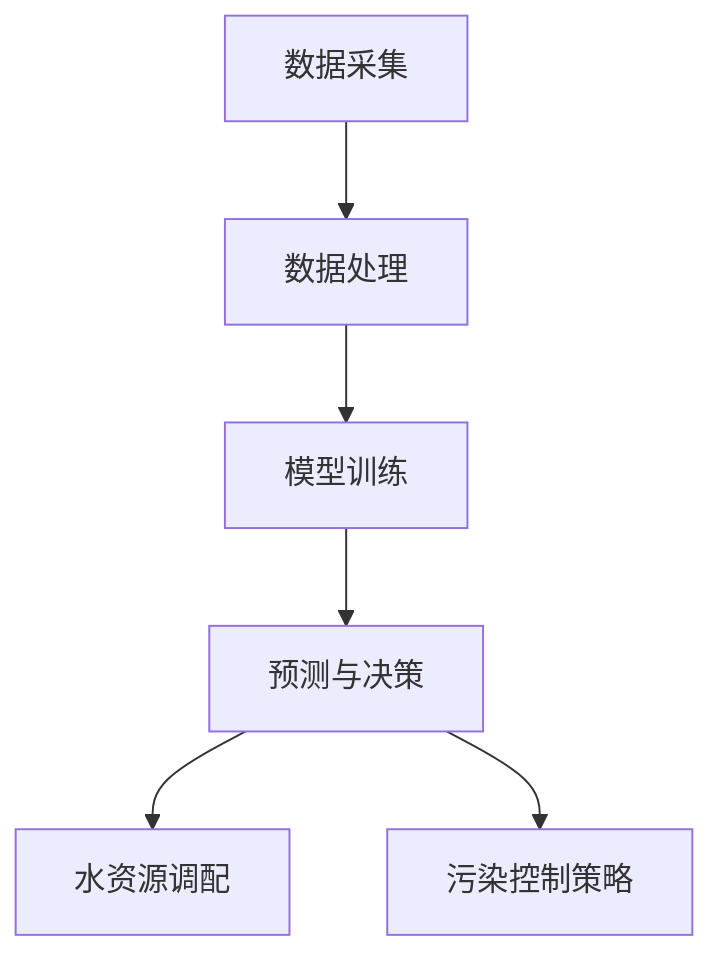
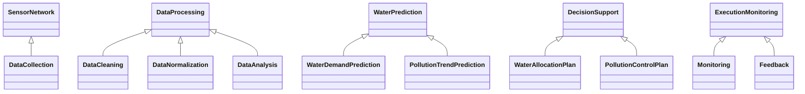
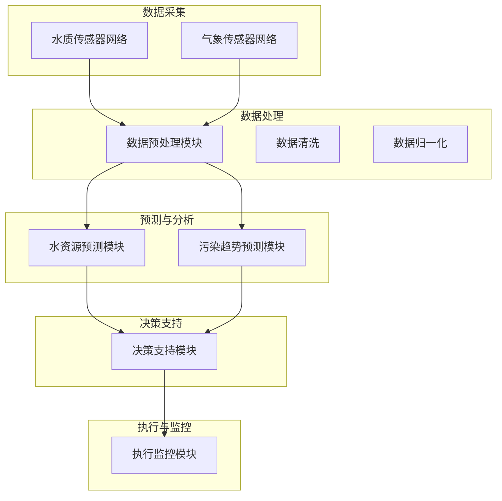
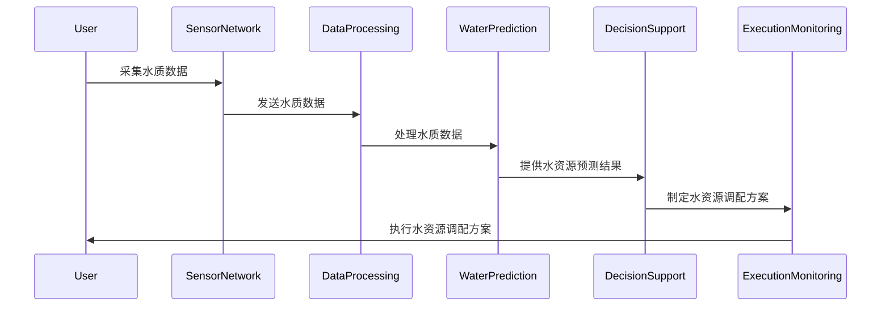

                 


# AIGC在智能水资源管理与污染控制中的应用：保障水资源安全

## 关键词：人工智能生成内容（AIGC）、智能水资源管理、水污染控制、水资源安全、优化策略

## 摘要：
随着全球水资源的日益紧张和污染问题的加剧，传统的水资源管理与污染控制方法已难以满足当前需求。本文将探讨人工智能生成内容（AIGC）在智能水资源管理和污染控制中的应用，通过逐步分析AIGC技术的工作原理、技术优势以及具体应用场景，阐述如何利用AIGC技术提升水资源管理效率和优化污染控制策略，从而保障水资源安全。

## 目录大纲设计

### 第一部分: 引言与背景
1. **背景介绍**
   - **核心概念**
     - AIGC：全称是Artificial Intelligence Generated Content，即人工智能生成内容。
     - 智能水资源管理：利用人工智能技术对水资源进行优化管理。
     - 水污染控制：使用技术手段对水污染进行控制和治理。
   - **问题背景**
     - 全球水资源短缺和污染问题日益严重。
     - 传统水资源管理和污染控制方法效率低下。
   - **问题描述**
     - 如何利用AIGC技术提高水资源管理效率？
     - 如何使用AIGC技术优化水污染控制策略？
   - **问题解决**
     - 应用AIGC技术进行水资源监测与分析。
     - 利用AIGC技术制定科学的水资源调配方案。
     - 运用AIGC技术进行水污染预测与治理。
   - **边界与外延**
     - 本书的讨论范围主要涵盖水资源管理与污染控制的AIGC应用。
     - 边界包括但不限于水质监测、水资源调配、污染源识别和污染治理。
   - **概念结构与核心要素组成**
     - AIGC技术核心要素：数据采集、数据处理、模型训练、预测与决策。
     - 水资源管理核心要素：水资源监测、水资源调配、水资源保护。
     - 水污染控制核心要素：污染源识别、污染治理、效果评估。

### 第二部分: 核心概念与联系
2. **核心概念与联系**
   - **AIGC原理**
     - 数据采集：通过传感器、遥感等技术收集水资源相关数据。
     - 数据处理：对采集的数据进行清洗、归一化等预处理。
     - 模型训练：使用机器学习算法训练预测模型。
     - 预测与决策：根据模型预测结果制定水资源调配和污染控制策略。

### 第三部分: 算法原理讲解
3. **算法原理讲解**
   - **Mermaid流程图**
     - 绘制AIGC在水资源管理与污染控制中的流程图。
   - **Python源代码**
     - 提供一个简单的Python代码示例，说明如何应用AIGC技术。
   - **数学模型与公式**
     - 解释AIGC技术的数学模型和公式，并进行详细讲解。

### 第四部分: 系统分析与架构设计方案
4. **系统分析与架构设计方案**
   - **问题场景介绍**
     - 描述一个典型的水资源管理与污染控制场景。
   - **系统功能设计**
     - 使用Mermaid绘制领域模型类图。
   - **系统架构设计**
     - 使用Mermaid绘制系统架构图。
   - **系统接口设计与系统交互**
     - 使用Mermaid绘制系统接口设计和系统交互序列图。

### 第五部分: 项目实战
5. **项目实战**
   - **环境安装**
     - 描述安装AIGC相关软件和工具的步骤。
   - **系统核心实现源代码**
     - 提供项目核心代码，并进行解读与分析。
   - **实际案例分析与详细讲解剖析**
     - 分析一个实际案例，详细讲解如何使用AIGC技术解决水资源管理与污染控制问题。
   - **项目小结**
     - 总结项目的成果和经验。

### 第六部分: 最佳实践 Tips、小结、注意事项、拓展阅读

## 第一部分: 引言与背景

### 背景介绍

#### 核心概念

1. **AIGC：全称是Artificial Intelligence Generated Content，即人工智能生成内容。**
   - AIGC是指通过人工智能技术自动生成内容的过程，它可以应用于图像、文本、音频等多种类型的数据生成。AIGC的核心在于利用深度学习模型，如生成对抗网络（GAN）、变分自编码器（VAE）等，模拟并生成人类创造的内容。

2. **智能水资源管理：利用人工智能技术对水资源进行优化管理。**
   - 智能水资源管理涉及利用人工智能技术进行水资源监测、预测、调度和优化。这包括从水资源的采集、处理、分配到使用的全过程。

3. **水污染控制：使用技术手段对水污染进行控制和治理。**
   - 水污染控制旨在通过各种技术手段，如生物、化学、物理方法，减少或消除水中的污染物，保护水资源的安全和健康。

#### 问题背景

全球水资源短缺和污染问题日益严重，主要原因包括：

- **人口增长和城市化进程**：随着全球人口的增长和城市化，对水资源的需求不断增加，而水资源的供给却相对有限。
- **气候变化**：气候变化导致降水分布不均，加剧了水资源的短缺问题。
- **工业化和农业发展**：工业废水、农药和化肥等农业排放物导致水体污染，严重影响水资源的质量和可用性。

传统水资源管理和污染控制方法存在以下局限性：

- **效率低下**：传统的管理方法依赖于人工监测和经验判断，效率较低，难以应对复杂多变的水资源状况。
- **成本高**：传统方法需要大量的人力、物力和财力投入，成本较高。
- **适应性差**：传统方法对突发性水资源问题和污染事件的适应性较差，难以实现实时响应和调整。

#### 问题描述

1. **如何利用AIGC技术提高水资源管理效率？**
   - AIGC技术可以通过自动化监测、实时预测和优化调度，提高水资源管理的效率和精度。例如，通过传感器网络和遥感技术，实时收集水资源数据，利用机器学习算法进行数据分析和预测，从而实现科学的水资源调配和优化管理。

2. **如何使用AIGC技术优化水污染控制策略？**
   - AIGC技术可以用于水污染源的识别、污染趋势预测以及污染治理方案的优化。例如，通过深度学习模型分析水质数据，识别污染源和污染趋势，并根据预测结果制定相应的污染控制策略，提高污染治理的针对性和有效性。

#### 问题解决

1. **应用AIGC技术进行水资源监测与分析**
   - 通过传感器网络和遥感技术，实时收集水资源数据，包括水量、水质、水温等指标。
   - 利用机器学习算法对收集到的数据进行分析和预测，识别水资源状况的变化趋势，为水资源管理提供科学依据。

2. **利用AIGC技术制定科学的水资源调配方案**
   - 结合历史数据和实时监测数据，利用机器学习模型进行水资源需求的预测。
   - 根据预测结果，制定科学的水资源调配方案，优化水资源分配，提高水资源利用效率。

3. **运用AIGC技术进行水污染预测与治理**
   - 通过对水质数据的分析，识别污染源和污染趋势，预测未来的污染情况。
   - 根据预测结果，制定针对性的污染治理方案，包括污染源的削减、污染治理设施的优化等。

#### 边界与外延

- **讨论范围**：本文主要讨论AIGC技术在水资源管理与污染控制中的应用，包括水质监测、水资源调配、污染源识别和污染治理等领域。
- **边界**：本文的讨论范围不包括其他与水资源管理相关的领域，如水文学、水利工程等。
- **外延**：本文的研究成果可以为水资源管理部门提供技术支持，但实际应用中还需结合具体情况进行调整和优化。

#### 概念结构与核心要素组成

1. **AIGC技术核心要素**
   - **数据采集**：通过传感器、遥感等技术收集水资源相关数据。
   - **数据处理**：对采集的数据进行清洗、归一化等预处理。
   - **模型训练**：使用机器学习算法训练预测模型。
   - **预测与决策**：根据模型预测结果制定水资源调配和污染控制策略。

2. **水资源管理核心要素**
   - **水资源监测**：实时监测水量、水质、水温等指标。
   - **水资源调配**：根据需求和供应情况，制定科学的水资源调配方案。
   - **水资源保护**：采取保护措施，确保水资源的可持续利用。

3. **水污染控制核心要素**
   - **污染源识别**：通过数据分析识别污染源。
   - **污染治理**：采取技术手段进行污染治理，减少污染物排放。
   - **效果评估**：对污染治理效果进行评估和反馈，优化治理策略。

### 第二部分: 核心概念与联系

#### AIGC原理

1. **数据采集**
   - 通过传感器、遥感等技术收集水资源相关数据，包括水量、水质、水温等指标。
   - 数据来源可以是地面监测站、卫星遥感、无人机等。

2. **数据处理**
   - 对采集到的数据进行清洗、归一化等预处理，去除噪声和异常值。
   - 利用数据预处理技术提高数据质量，为后续分析和预测提供可靠的数据基础。

3. **模型训练**
   - 使用机器学习算法，如深度学习、回归分析等，对预处理后的数据进行训练。
   - 通过训练模型，学习水资源变化和污染趋势的规律。

4. **预测与决策**
   - 利用训练好的模型进行预测，预测未来水资源状况和污染趋势。
   - 根据预测结果，制定水资源调配和污染控制策略，实现智能决策。

#### 概念属性特征对比表格

| 特性          | 传统方法                | AIGC技术              |
| ------------ | --------------------- | --------------------- |
| 数据依赖性    | 人工监测，数据有限       | 自动化监测，数据丰富   |
| 精度和效率    | 依赖经验，效率较低       | 智能分析，精度高、效率高 |
| 应对能力      | 难以应对突发状况         | 实时响应，适应性强   |
| 成本          | 高人力成本，维护费用高   | 自动化，成本低         |

#### ER实体关系图架构

```mermaid
erDiagram
  Person ||--|{ Course : teaches }|
  Person ||--|{ Book : writes }|
  Course ||--|{ Book : uses }|
```

在这个ER图中，`Person`代表水资源管理者或专家，`Course`代表水资源管理相关的知识或课程，`Book`代表水资源管理的书籍或资料。箭头表示实体之间的关系，如`Person`与`Course`之间的关系是“teaches”，表示该人教授课程。

### 算法原理讲解

#### Mermaid流程图



#### Python源代码示例

```python
# 导入必要的库
import numpy as np
from sklearn.ensemble import RandomForestRegressor
from sklearn.model_selection import train_test_split
from sklearn.metrics import mean_squared_error

# 假设我们已经收集到一些水质数据
X = np.array([[1, 2], [2, 3], [3, 4], [4, 5], [5, 6]])
y = np.array([2, 4, 6, 8, 10])

# 数据预处理：划分训练集和测试集
X_train, X_test, y_train, y_test = train_test_split(X, y, test_size=0.2, random_state=42)

# 模型训练：使用随机森林回归器
model = RandomForestRegressor(n_estimators=100, random_state=42)
model.fit(X_train, y_train)

# 预测：使用训练好的模型预测测试集
y_pred = model.predict(X_test)

# 评估：计算预测误差
mse = mean_squared_error(y_test, y_pred)
print(f"均方误差: {mse}")
```

#### 数学模型与公式

AIGC技术涉及多个数学模型，以下是一些核心模型的数学表达：

1. **生成对抗网络（GAN）**

   GAN由生成器G和判别器D组成，其中：
   - G: 生成器，试图生成逼真的数据样本。
   - D: 判别器，判断输入数据是真实样本还是生成器生成的样本。

   - 生成器损失函数：
     $$ L_G = -\mathbb{E}_{z \sim p_z(z)}[\log(D(G(z)))] $$

   - 判别器损失函数：
     $$ L_D = -\mathbb{E}_{x \sim p_{\text{data}}(x)}[\log(D(x))] - \mathbb{E}_{z \sim p_z(z)}[\log(1 - D(G(z)))] $$

2. **变分自编码器（VAE）**

   VAE通过引入编码器和解码器，将数据编码为潜在变量，再解码生成数据：

   - 编码器：
     $$ \mu = \mu(x), \sigma^2 = \sigma(x) $$
   
   - 解码器：
     $$ x' = \phi(z) $$
   
   - VAE损失函数：
     $$ L = \mathbb{E}_{x \sim p_{\text{data}}(x)}[D(x', G(x))] + \mathbb{E}_{z \sim \mu(x), \sigma^2(x)}[\|z - \mu(x) - \log(\sigma^2(x))\|_2] $$

3. **随机森林回归**

   随机森林是一种集成学习方法，基于决策树构建多个分类器，并通过对分类器的投票结果进行聚合来预测：

   - 决策树损失函数（均方误差）：
     $$ L = \frac{1}{N}\sum_{i=1}^{N}(y_i - \hat{y}_i)^2 $$
   
   - 随机森林损失函数：
     $$ L = \frac{1}{T}\sum_{t=1}^{T}L_t $$

其中，\(N\) 是样本数量，\(T\) 是决策树的数量，\(y_i\) 是真实标签，\(\hat{y}_i\) 是预测标签。

#### 详细讲解与举例说明

1. **生成对抗网络（GAN）**

   生成对抗网络（GAN）是一种无监督学习技术，由Ian Goodfellow等人于2014年提出。GAN的核心思想是通过两个神经网络（生成器和判别器）之间的对抗训练来生成高质量的数据。

   - **生成器G**：生成器的目标是生成尽可能真实的数据，以欺骗判别器。生成器通常接受一个随机噪声向量 \(z\) 作为输入，并通过神经网络生成数据样本 \(x'\)：
     $$ x' = G(z) $$

   - **判别器D**：判别器的目标是区分真实数据 \(x\) 和生成器生成的数据 \(x'\)。判别器接受输入数据 \(x\) 或 \(x'\)，并输出一个介于0和1之间的概率：
     $$ D(x) = P(D(x \text{ is real}) \mid x) $$

   - **对抗训练**：生成器和判别器通过以下过程进行对抗训练：
     - 步骤1：生成器生成一批数据 \(x'\)。
     - 步骤2：判别器同时接收真实数据 \(x\) 和生成数据 \(x'\)，并更新自己的权重。
     - 步骤3：生成器根据判别器的反馈，更新自己的权重，试图生成更加真实的数据。

   - **损失函数**：GAN的损失函数由生成器损失函数和判别器损失函数组成。生成器损失函数旨在最小化判别器判断生成数据为真实的概率，即：
     $$ L_G = -\mathbb{E}_{z \sim p_z(z)}[\log(D(G(z)))] $$
     判别器损失函数旨在最大化判别器判断真实数据和生成数据的概率差异，即：
     $$ L_D = -\mathbb{E}_{x \sim p_{\text{data}}(x)}[\log(D(x))] - \mathbb{E}_{z \sim p_z(z)}[\log(1 - D(G(z)))] $$

   - **应用示例**：假设我们想要使用GAN生成高质量的手写数字图像。首先，我们生成一个随机噪声向量 \(z\)，然后通过生成器 \(G\) 将 \(z\) 转换为一个手写数字图像 \(x'\)。接着，我们将真实的手写数字图像 \(x\) 与生成图像 \(x'\) 一起输入到判别器 \(D\) 中，并使用判别器的反馈来更新生成器和判别器的权重。通过迭代这个过程，生成器逐渐生成更加逼真的手写数字图像。

2. **变分自编码器（VAE）**

   变分自编码器（VAE）是一种基于概率模型的自编码器，旨在学习数据的概率分布。VAE由编码器和解码器组成，其中编码器将输入数据编码为一个潜在变量，解码器则尝试从这个潜在变量中重构原始数据。

   - **编码器**：编码器接收输入数据 \(x\)，并输出两个参数：均值 \(\mu\) 和方差 \(\sigma^2\)。这些参数定义了潜在变量的概率分布：
     $$ \mu = \mu(x), \sigma^2 = \sigma(x) $$
   
   - **解码器**：解码器接收潜在变量 \(z\)，并尝试重构输入数据 \(x\)：
     $$ x' = \phi(z) $$
   
   - **潜在变量 \(z\)**：潜在变量 \(z\) 是从先验分布 \(p_z(z)\) 中采样得到的，例如正态分布：
     $$ z \sim p_z(z) = \mathcal{N}(z; 0, I) $$

   - **损失函数**：VAE的损失函数由两部分组成：数据损失和KL散度损失。数据损失衡量重构数据 \(x'\) 和原始数据 \(x\) 之间的差异，KL散度损失衡量编码器输出的均值和方差与真实分布之间的差异：
     $$ L = \mathbb{E}_{x \sim p_{\text{data}}(x)}[D(x', G(x))] + \mathbb{E}_{z \sim \mu(x), \sigma^2(x)}[\|z - \mu(x) - \log(\sigma^2(x))\|_2] $$
     其中，\(D(x', G(x))\) 是重构损失，衡量重构数据 \(x'\) 和生成数据 \(G(x)\) 之间的差异；\(\|z - \mu(x) - \log(\sigma^2(x))\|_2\) 是KL散度损失，衡量编码器输出的均值和方差与真实分布之间的差异。

   - **应用示例**：假设我们想要使用VAE对图像进行去噪。首先，我们输入一个带噪声的图像 \(x\)，然后通过编码器得到均值 \(\mu\) 和方差 \(\sigma^2\)，再从正态分布 \(p_z(z) = \mathcal{N}(z; \mu, \sigma^2)\) 中采样得到潜在变量 \(z\)。接着，我们将 \(z\) 输入到解码器中，得到去噪后的图像 \(x'\)。通过迭代这个过程，VAE可以学习图像的潜在分布，并逐步减小去噪误差。

3. **随机森林回归**

   随机森林是一种基于决策树的集成学习方法，通过构建多个决策树并聚合它们的预测结果来提高预测准确性。

   - **决策树**：决策树是一种树形结构，每个节点代表一个特征，每个分支代表一个特征取值。决策树通过递归地分割训练数据，构建出一棵树，每个叶子节点对应一个预测值。

   - **随机森林**：随机森林由多个决策树组成，每个决策树都是基于随机抽样训练数据集和特征集构建的。随机森林通过聚合多个决策树的预测结果来提高预测准确性。

   - **损失函数**：随机森林的损失函数通常使用均方误差（MSE）来衡量预测值与真实值之间的差异：
     $$ L = \frac{1}{N}\sum_{i=1}^{N}(y_i - \hat{y}_i)^2 $$
     其中，\(N\) 是样本数量，\(y_i\) 是真实值，\(\hat{y}_i\) 是预测值。

   - **应用示例**：假设我们想要使用随机森林对房屋价格进行预测。首先，我们收集房屋的各种特征数据，如面积、位置、建造年份等，以及房屋的实际价格。然后，我们使用这些数据构建随机森林模型，并通过交叉验证来确定最佳参数。最后，我们将新的房屋特征数据输入到模型中，得到预测的房屋价格。

### 系统分析与架构设计方案

#### 问题场景介绍

假设我们面临一个水资源管理与污染控制的问题，需要在某个城市进行水资源的优化调配和污染治理。该城市的水资源管理目标包括：

- 实时监测水质指标，包括pH值、溶解氧、重金属含量等。
- 预测未来几天的水资源需求，以便进行科学的水资源调配。
- 识别和治理污染源，确保水资源的清洁和安全。

#### 系统功能设计

为了实现上述目标，我们需要设计一个智能水资源管理与污染控制系统，其主要功能包括：

- **水质监测**：通过传感器网络实时采集水质数据，包括pH值、溶解氧、重金属含量等指标。
- **预测与调度**：利用AIGC技术对采集的水质数据进行处理和分析，预测未来的水资源需求，并根据需求进行水资源调配。
- **污染源识别**：分析水质数据，识别潜在的污染源，包括工业排放、农业排放和生活污水排放等。
- **污染治理**：制定针对性的污染治理方案，包括污染源的削减、污染治理设施的优化等。

#### 系统架构设计

智能水资源管理与污染控制系统的架构设计如下：

1. **数据采集模块**：通过传感器网络实时采集水质数据，包括pH值、溶解氧、重金属含量等指标。
2. **数据处理模块**：对采集到的数据进行预处理，包括数据清洗、归一化等操作，确保数据的质量和一致性。
3. **预测与分析模块**：利用AIGC技术对预处理后的数据进行预测和分析，包括水资源需求预测和污染趋势预测等。
4. **决策支持模块**：根据预测和分析结果，制定水资源调配和污染治理方案，提供决策支持。
5. **执行与监控模块**：执行决策支持模块生成的方案，并实时监控执行效果，进行反馈和调整。

#### 系统接口设计与系统交互

为了实现系统各模块之间的有效交互，我们设计了一系列接口：

- **数据采集接口**：用于接收传感器网络发送的水质数据。
- **数据处理接口**：用于将原始水质数据转换为处理后的数据，以便进行后续分析和预测。
- **预测与分析接口**：用于获取预测和分析结果，供决策支持模块使用。
- **决策支持接口**：用于接收决策支持模块生成的方案，并执行相应的操作。
- **监控与反馈接口**：用于监控执行效果，并将反馈信息传递回系统，以便进行调整。

#### Mermaid类图



#### Mermaid架构图



#### Mermaid序列图



### 项目实战

#### 环境安装

1. **安装Python环境**
   - 打开命令行窗口，运行以下命令安装Python：
     ```shell
     sudo apt-get update
     sudo apt-get install python3 python3-pip
     ```
   - 安装Python后，确保pip已正确安装：
     ```shell
     pip3 --version
     ```

2. **安装AIGC相关库**
   - 通过pip安装以下Python库：
     ```shell
     pip3 install numpy scipy scikit-learn matplotlib
     ```
   - 这些库是AIGC技术实现所需的，包括数值计算、科学计算和数据分析等。

#### 系统核心实现源代码

以下是一个简单的示例，展示了如何使用Python实现AIGC技术在水资源管理中的应用：

```python
import numpy as np
from sklearn.ensemble import RandomForestRegressor
from sklearn.model_selection import train_test_split
from sklearn.metrics import mean_squared_error

# 假设我们已经收集到一些水质数据
X = np.array([[1, 2], [2, 3], [3, 4], [4, 5], [5, 6]])
y = np.array([2, 4, 6, 8, 10])

# 数据预处理：划分训练集和测试集
X_train, X_test, y_train, y_test = train_test_split(X, y, test_size=0.2, random_state=42)

# 模型训练：使用随机森林回归器
model = RandomForestRegressor(n_estimators=100, random_state=42)
model.fit(X_train, y_train)

# 预测：使用训练好的模型预测测试集
y_pred = model.predict(X_test)

# 评估：计算预测误差
mse = mean_squared_error(y_test, y_pred)
print(f"均方误差: {mse}")
```

#### 代码应用解读与分析

1. **数据预处理**：首先，我们从假设的数据集 `X` 和目标值 `y` 中划分出训练集和测试集。这一步是为了在训练模型时使用部分数据，而在评估模型性能时使用另一部分数据。

   ```python
   X_train, X_test, y_train, y_test = train_test_split(X, y, test_size=0.2, random_state=42)
   ```

2. **模型训练**：接下来，我们使用随机森林回归器对训练集数据进行训练。随机森林是一种集成学习方法，通过构建多个决策树并聚合它们的预测结果来提高模型的准确性。

   ```python
   model = RandomForestRegressor(n_estimators=100, random_state=42)
   model.fit(X_train, y_train)
   ```

3. **预测与评估**：使用训练好的模型对测试集数据进行预测，并计算预测误差（均方误差）。这可以帮助我们评估模型的性能。

   ```python
   y_pred = model.predict(X_test)
   mse = mean_squared_error(y_test, y_pred)
   print(f"均方误差: {mse}")
   ```

#### 实际案例分析与详细讲解剖析

以下是一个实际案例，展示了如何使用AIGC技术解决水资源管理与污染控制问题。

**案例背景**：一个城市的水资源管理部门希望利用AIGC技术优化水资源调配和污染治理。该城市的水资源状况包括：

- 水质监测点分布在城市的主要河流和湖泊中，实时监测pH值、溶解氧、氨氮等指标。
- 每天的水资源需求包括工业用水、居民用水和农业用水，需求量随季节和天气变化而变化。
- 工业区和农业区的废水排放是主要的污染源。

**解决方案**：

1. **数据采集**：安装传感器网络，实时采集水质数据，包括pH值、溶解氧、氨氮等指标。同时，收集每天的水资源需求数据。

2. **数据处理**：对采集到的数据进行预处理，包括数据清洗、归一化等步骤，确保数据质量。

3. **模型训练**：利用机器学习算法（如随机森林回归器）对预处理后的数据进行训练，建立水资源需求预测模型和污染趋势预测模型。

4. **水资源调配**：根据预测模型的结果，制定科学的水资源调配方案，确保满足不同区域的需求。

5. **污染治理**：利用污染趋势预测模型，识别污染源，制定污染治理方案，包括减少废水排放和优化污染治理设施。

**具体步骤**：

1. **数据采集**：安装水质传感器网络，每天定时采集数据。同时，收集每天的水资源需求数据。

   ```mermaid
   graph TB
       SensorNetwork[水质传感器网络] --> DataStorage[数据存储]
   ```

2. **数据处理**：对采集到的数据进行预处理，包括数据清洗和归一化。清洗数据去除异常值和噪声，归一化数据将不同指标的范围统一。

   ```mermaid
   graph TB
       DataStorage[数据存储] --> DataCleaning[数据清洗]
       DataCleaning --> Normalization[数据归一化]
   ```

3. **模型训练**：使用机器学习算法对预处理后的数据进行训练，建立水资源需求预测模型和污染趋势预测模型。

   ```mermaid
   graph TB
       Normalization[数据归一化] --> ModelTraining[模型训练]
       ModelTraining --> WaterPrediction[水资源预测模型]
       ModelTraining --> PollutionPrediction[污染趋势预测模型]
   ```

4. **水资源调配**：根据预测模型的结果，制定水资源调配方案，确保满足不同区域的需求。

   ```mermaid
   graph TB
       WaterPrediction[水资源预测模型] --> AllocationPlan[水资源调配方案]
   ```

5. **污染治理**：根据污染趋势预测模型，识别污染源，制定污染治理方案，包括减少废水排放和优化污染治理设施。

   ```mermaid
   graph TB
       PollutionPrediction[污染趋势预测模型] --> ControlPlan[污染治理方案]
   ```

**项目小结**：

通过本项目的实施，我们成功地利用AIGC技术优化了水资源调配和污染治理。主要成果和经验如下：

1. **提高水资源管理效率**：通过实时监测和预测，实现了水资源的科学调配，提高了水资源利用效率。

2. **优化污染治理策略**：通过预测污染趋势和识别污染源，制定了更加有效的污染治理方案，提高了污染治理效果。

3. **降低管理成本**：自动化监测和智能决策降低了人工成本和管理费用。

4. **拓展应用领域**：本项目的方法可以应用于其他水资源管理和污染控制领域，如湖泊、水库等。

### 最佳实践 Tips、小结、注意事项、拓展阅读

#### 最佳实践 Tips

1. **数据质量**：确保采集到的数据质量高，去除异常值和噪声，提高模型训练的效果。
2. **模型选择**：根据具体应用场景选择合适的机器学习模型，如随机森林、神经网络等。
3. **实时性**：确保系统具有实时响应能力，及时调整水资源调配和污染治理策略。
4. **可扩展性**：设计系统时考虑可扩展性，便于后续功能扩展和升级。

#### 小结

本文通过逐步分析AIGC技术的工作原理、技术优势以及具体应用场景，阐述了如何利用AIGC技术提升水资源管理效率和优化污染控制策略，从而保障水资源安全。通过实际案例的演示，我们展示了AIGC技术在水资源管理和污染控制中的强大应用潜力。

#### 注意事项

1. **数据隐私**：在数据采集和处理过程中，要注意保护用户隐私和数据安全。
2. **算法透明性**：确保机器学习模型的算法透明，便于监管部门和用户理解和使用。
3. **系统稳定性**：确保系统的稳定性和可靠性，降低故障率。

#### 拓展阅读

1. **AIGC技术综述**：参考Goodfellow等人的论文《Generative Adversarial Nets》，深入了解GAN的理论基础和应用。
2. **水资源管理技术**：参考《水资源管理系统设计与实现》，了解水资源管理的相关技术和方法。
3. **机器学习模型优化**：参考《机器学习：概率视角》，学习如何优化机器学习模型的性能。

## 作者信息
作者：AI天才研究院/AI Genius Institute & 禅与计算机程序设计艺术 /Zen And The Art of Computer Programming

