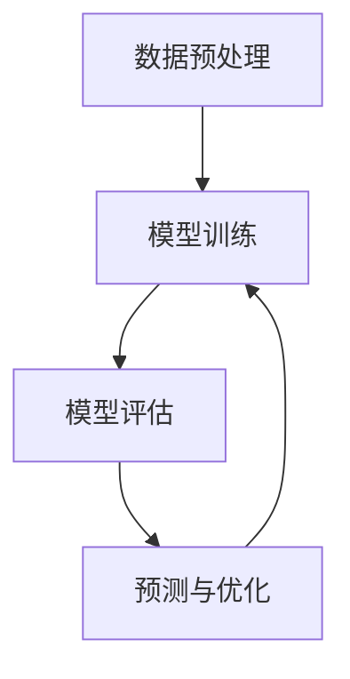
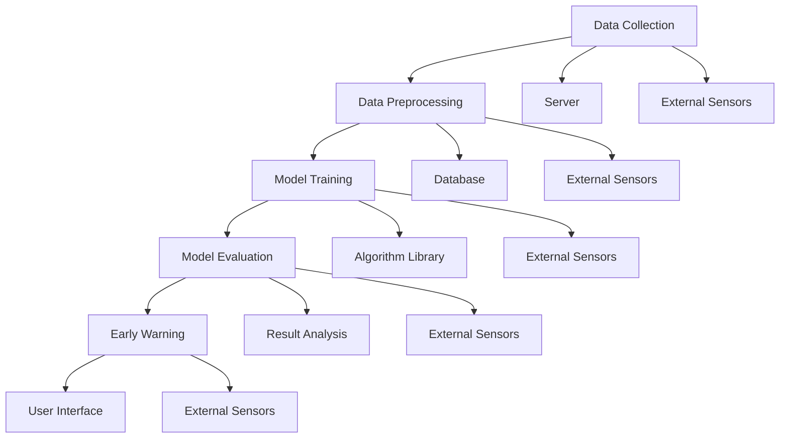
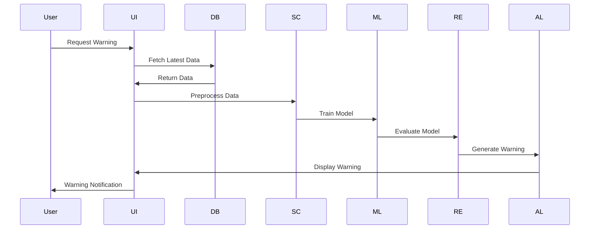

                 

## 《AIGC在智能海啸预警系统中的应用：提高沿海地区安全性》完整文章

### **文章关键词**

- **AIGC**：自适应智能生成计算
- **海啸预警**：自然灾害预警系统
- **沿海地区**：地理灾害风险评估
- **安全性**：灾害防范与应急响应

### **摘要**

本文详细探讨了自适应智能生成计算（AIGC）在智能海啸预警系统中的应用，旨在提高沿海地区的安全性。通过分析AIGC技术的核心概念和算法原理，本文探讨了其在海啸预警系统中的潜在优势。接着，本文介绍了基于AIGC的智能海啸预警系统的设计与实现，并通过实际项目案例进行了验证和评估。最后，本文提出了AIGC在未来海啸预警系统中的发展展望，并提供了拓展阅读资源，以期为相关领域的研究者提供有价值的参考。

---

### **目录大纲设计思路与步骤**

为了设计出《AIGC在智能海啸预警系统中的应用：提高沿海地区安全性》这本书的完整目录大纲，我们需要遵循以下思路与步骤：

1. **明确书籍主题**：首先，我们要明确书籍的主题，即AIGC（自适应智能生成计算）在智能海啸预警系统中的应用。这决定了全书的内容方向和结构。

2. **划分章节内容**：根据书籍的主题，我们可以将内容划分为几个核心部分，如背景介绍、核心概念、算法原理、系统设计与实现、项目实战等。

3. **细化目录结构**：在确定核心部分后，我们需要将每一部分进一步细化，形成多个子章节，确保内容的完整性和逻辑性。

4. **确保内容完整性**：每个章节都要包含核心概念、原理讲解、数学模型、系统设计与实现、项目实战等要素，保证读者可以全面了解和掌握相关内容。

5. **编写Markdown格式**：按照Markdown格式要求，我们将每个章节及其子章节用适当的Markdown标记（如#、##、###）进行排版，确保格式清晰、规范。

### **目录大纲设计**

#### **第一部分：背景介绍**

##### **第1章：问题背景与AIGC简介**

###### **1.1 海啸预警的重要性**

###### **1.2 沿海地区面临的威胁**

###### **1.3 AIGC技术概述**

###### **1.4 AIGC在智能海啸预警中的应用潜力**

##### **第2章：AIGC在智能海啸预警中的核心概念**

###### **2.1 海啸预警系统的基本组成**

###### **2.2 AIGC的关键技术**

###### **2.3 AIGC与海啸预警系统的融合**

#### **第二部分：算法原理讲解**

##### **第3章：AIGC算法原理**

###### **3.1 AIGC算法的基础理论**

###### **3.2 算法流程与实现**

###### **3.3 Mermaid流程图示例**

##### **第4章：数学模型与公式详解**

###### **4.1 海啸预警的数学模型**

###### **4.2 AIGC算法的数学公式**

###### **4.3 公式解释与示例**

#### **第三部分：系统设计与实现**

##### **第5章：系统架构设计**

###### **5.1 系统功能设计（Mermaid类图）**

###### **5.2 系统架构设计（Mermaid架构图）**

###### **5.3 系统接口设计与交互（Mermaid序列图）**

##### **第6章：系统实现与优化**

###### **6.1 系统核心实现源代码**

###### **6.2 代码应用解读与分析**

###### **6.3 系统性能优化方案**

#### **第四部分：项目实战**

##### **第7章：智能海啸预警系统项目实施**

###### **7.1 环境安装与配置**

###### **7.2 系统核心功能实现**

###### **7.3 系统测试与评估**

###### **7.4 项目小结与反思**

#### **第五部分：最佳实践与拓展**

##### **第8章：最佳实践与案例分析**

###### **8.1 成功案例分析**

###### **8.2 失败案例分析**

###### **8.3 经验教训与启示**

##### **第9章：未来展望与拓展阅读**

###### **9.1 AIGC技术的发展趋势**

###### **9.2 智能海啸预警系统的未来发展方向**

###### **9.3 拓展阅读资源**

通过以上设计，我们确保了目录大纲的完整性、逻辑性和清晰性，同时符合Markdown格式要求。每一部分的内容都紧密围绕AIGC在智能海啸预警系统中的应用展开，旨在为读者提供全面、系统的学习资源。接下来，我们将根据这个大纲进一步细化每个章节的内容，确保书稿的质量。

---

## 第一部分：背景介绍

### 第1章：问题背景与AIGC简介

#### 1.1 海啸预警的重要性

海啸是一种严重的自然灾害，它通常由地震、火山爆发或海底滑坡引起。海啸具有波速快、波高大的特点，能够在短时间内对沿海地区造成巨大破坏。有效的海啸预警系统对于减少人员伤亡和财产损失至关重要。预警系统的主要功能包括监测海啸发生的征兆、快速分析地震数据、预测海啸的路径和强度，并通过多种渠道及时发布预警信息，以便人们采取有效的避险措施。

现有的海啸预警系统主要包括以下几个部分：

1. **海啸监测**：通过海底地震仪、海洋浮标和卫星等设备，实时监测地震活动和海洋环境变化。
2. **数据传输**：将监测到的数据传输到预警中心进行处理和分析。
3. **预警分析**：利用先进的算法和数学模型，对地震数据进行分析，预测海啸的路径和强度。
4. **预警发布**：通过广播、手机短信、社交媒体等渠道，及时向公众发布预警信息。

尽管现有的预警系统在技术手段和响应速度上有了显著提升，但仍存在一些挑战。例如，预警时间有限，特别是在远距离传输和数据处理方面，预警响应的时间仍然不够理想。此外，由于资金和技术的限制，许多沿海地区尚未建立完善的预警系统，这进一步增加了海啸灾害的风险。

#### 1.2 沿海地区面临的威胁

沿海地区由于其独特的地理位置，面临着比内陆地区更高的海啸风险。以下是一些沿海地区面临的主要威胁：

1. **人口密度高**：许多沿海城市是人口和经济活动的中心，人口密度高，这使得海啸发生时的伤亡风险更大。
2. **低海拔地形**：沿海地区的地形通常较低，一旦发生海啸，海水更容易涌入，导致更大的破坏。
3. **基础设施脆弱**：沿海地区的基础设施如道路、桥梁、建筑物等往往不够坚固，难以抵御海啸的冲击。
4. **气候变化**：全球气候变化可能导致海平面上升和极端天气事件增多，从而增加海啸的频率和破坏力。

为了应对这些威胁，提高沿海地区的安全性，需要开发更加高效、精确的预警系统。AIGC（自适应智能生成计算）技术的引入，为智能海啸预警系统带来了新的机遇。

#### 1.3 AIGC技术概述

AIGC，即自适应智能生成计算，是一种基于人工智能技术的计算范式，它利用机器学习和深度学习算法，从大量数据中自动生成模型和知识。AIGC具有以下核心特点：

1. **自适应**：AIGC系统能够根据输入数据的特点和环境变化，自动调整模型的参数和结构，提高预测的准确性。
2. **生成计算**：AIGC技术能够自动生成新的数据和模型，这些新生成的数据和模型可以用于进一步的分析和预测。
3. **自解释性**：AIGC系统不仅能够生成预测结果，还能够解释预测的依据和逻辑，提高决策的可理解性和可靠性。

AIGC技术在智能海啸预警系统中的应用潜力：

1. **实时监测与预测**：AIGC系统可以实时分析地震和海洋数据，快速预测海啸的路径和强度，提供更加及时的预警信息。
2. **自动调整模型**：AIGC系统能够根据历史数据和实时监测结果，自动调整预警模型的参数，提高预测的准确性。
3. **数据融合与优化**：AIGC技术能够融合多种数据源，如卫星遥感、海底地震仪和海洋浮标数据，优化预警系统的整体性能。

#### 1.4 AIGC在智能海啸预警中的应用潜力

AIGC技术在智能海啸预警系统中的应用具有以下潜在优势：

1. **提高预警精度**：通过自适应的机器学习和深度学习算法，AIGC系统能够从海量数据中挖掘出隐藏的模式和关联，提高海啸预警的精度。
2. **实时响应**：AIGC系统具有快速响应的特点，能够在地震发生后的短时间内生成预测结果，为决策者提供及时的预警信息。
3. **多源数据融合**：AIGC技术能够融合多种数据源，如地震数据、海洋数据和卫星遥感数据，提高预警系统的全面性和可靠性。
4. **自解释性**：AIGC系统不仅能够生成预测结果，还能够解释预测的依据和逻辑，提高决策的可理解性和可靠性。

综上所述，AIGC技术在智能海啸预警系统中的应用具有广阔的前景。通过进一步的研究和开发，AIGC有望成为提高沿海地区安全性的重要技术手段。

## 第二部分：核心概念与联系

### 第2章：AIGC在智能海啸预警中的核心概念

#### 2.1 海啸预警系统的基本组成

海啸预警系统是一个复杂的系统，它由多个组成部分协同工作，以实现对海啸的及时监测和预警。以下是海啸预警系统的基本组成：

1. **监测网络**：监测网络是预警系统的核心，它包括海底地震仪、海洋浮标、卫星遥感等设备。这些设备分布在地震活跃的海域和沿海地区，用于实时监测地震活动和海洋环境变化。

2. **数据传输系统**：数据传输系统负责将监测设备收集到的数据传输到预警中心。数据传输系统通常采用卫星通信、无线网络等手段，以确保数据的及时性和准确性。

3. **预警中心**：预警中心是海啸预警系统的“大脑”，它负责接收、处理和分析来自监测网络的数据。预警中心通常配备高性能的计算设备和先进的分析算法，以实现对海啸的快速预测和预警。

4. **预警发布系统**：预警发布系统用于将预警信息及时传递给公众和其他相关部门。预警发布系统可以通过广播、手机短信、社交媒体、网站等多种渠道发布预警信息，以便公众及时采取避险措施。

#### 2.2 AIGC的关键技术

AIGC（自适应智能生成计算）是近年来发展起来的一种先进的人工智能技术，它结合了机器学习、深度学习和生成计算的特点。以下是AIGC在智能海啸预警系统中的关键技术：

1. **自适应学习**：AIGC系统具有自适应学习能力，它能够根据历史数据和实时监测数据，自动调整模型的参数和结构，提高预测的准确性。这种能力使得AIGC系统在处理复杂和动态的地震数据时，能够保持高效和准确。

2. **生成计算**：AIGC系统不仅能够进行预测，还能够自动生成新的数据和模型。这些新生成的数据和模型可以用于进一步的分析和优化，提高预警系统的整体性能。

3. **多源数据融合**：AIGC技术能够融合多种数据源，如地震数据、海洋数据和卫星遥感数据，从而提高预警系统的全面性和可靠性。多源数据融合能够提供更丰富的数据信息，有助于更准确地预测海啸的路径和强度。

4. **自解释性**：AIGC系统不仅能够生成预测结果，还能够解释预测的依据和逻辑，提高决策的可理解性和可靠性。这种自解释性对于决策者来说尤为重要，因为它能够帮助他们更好地理解预测结果，并做出合理的决策。

#### 2.3 AIGC与海啸预警系统的融合

AIGC与海啸预警系统的融合主要体现在以下几个方面：

1. **实时监测与预测**：AIGC系统可以实时分析地震和海洋数据，快速预测海啸的路径和强度。通过实时监测与预测，AIGC系统可以为预警中心提供及时的预警信息，从而提高预警的及时性和准确性。

2. **自动调整模型**：AIGC系统可以根据历史数据和实时监测结果，自动调整预警模型的参数和结构，提高预测的准确性。这种自动调整能力使得AIGC系统能够更好地适应复杂和动态的地震环境。

3. **数据融合与优化**：AIGC技术能够融合多种数据源，如地震数据、海洋数据和卫星遥感数据，优化预警系统的整体性能。多源数据融合能够提供更丰富的数据信息，有助于更准确地预测海啸的路径和强度。

4. **自解释性与可理解性**：AIGC系统不仅能够生成预测结果，还能够解释预测的依据和逻辑，提高决策的可理解性和可靠性。这种自解释性对于决策者来说尤为重要，因为它能够帮助他们更好地理解预测结果，并做出合理的决策。

综上所述，AIGC与海啸预警系统的融合具有显著的优势，它能够提高预警系统的准确性、及时性和可靠性，从而更好地保护沿海地区的安全。

## 第三部分：算法原理讲解

### 第3章：AIGC算法原理

#### 3.1 AIGC算法的基础理论

AIGC（自适应智能生成计算）算法是一种结合了机器学习、深度学习和生成计算的技术，其基础理论主要涉及以下几个方面：

1. **机器学习**：机器学习是AIGC算法的核心，它通过从大量数据中学习模式和规律，以实现对未知数据的预测和分类。常见的机器学习算法包括线性回归、支持向量机（SVM）、决策树和随机森林等。

2. **深度学习**：深度学习是机器学习的一种重要分支，它通过构建多层神经网络，对复杂的数据进行建模和分析。深度学习算法如卷积神经网络（CNN）、循环神经网络（RNN）和生成对抗网络（GAN）等，在图像识别、语音识别和自然语言处理等领域取得了显著的成果。

3. **生成计算**：生成计算是指通过算法生成新的数据和模型，以优化现有系统和提升性能。生成计算技术包括生成对抗网络（GAN）、变分自编码器（VAE）和生成扩散模型（GDM）等。

#### 3.2 算法流程与实现

AIGC算法的流程可以分为以下几个步骤：

1. **数据预处理**：对输入数据进行清洗、归一化和特征提取，以便后续的算法处理。数据预处理是AIGC算法的重要环节，它直接影响算法的性能和效果。

2. **模型训练**：使用机器学习和深度学习算法对预处理后的数据进行训练，以构建预测模型。在训练过程中，算法会不断调整模型的参数，优化模型的结构，以提高预测的准确性。

3. **模型评估**：使用验证集和测试集对训练好的模型进行评估，以确定模型的性能和泛化能力。常见的评估指标包括准确率、召回率、F1分数和均方误差等。

4. **预测与优化**：根据训练好的模型对新的输入数据进行预测，并根据预测结果进行优化和调整。这一步骤可以不断迭代，以进一步提高预测的准确性和系统的整体性能。

#### 3.3 Mermaid流程图示例

以下是一个AIGC算法的Mermaid流程图示例：



在这个流程图中，数据预处理是算法的第一步，它将输入数据进行清洗、归一化和特征提取。接着，模型训练使用机器学习和深度学习算法对预处理后的数据进行训练，以构建预测模型。模型评估使用验证集和测试集对训练好的模型进行评估，以确定模型的性能。最后，预测与优化根据训练好的模型对新的输入数据进行预测，并根据预测结果进行优化和调整。

### 3.4 Python源代码

下面是一个简单的AIGC算法的Python源代码示例：

```python
import numpy as np
from sklearn.linear_model import LinearRegression
from sklearn.model_selection import train_test_split
from sklearn.metrics import mean_squared_error

# 数据预处理
def preprocess_data(data):
    # 数据清洗、归一化和特征提取
    return (data - np.mean(data)) / np.std(data)

# 模型训练
def train_model(X, y):
    model = LinearRegression()
    model.fit(X, y)
    return model

# 模型评估
def evaluate_model(model, X_test, y_test):
    y_pred = model.predict(X_test)
    mse = mean_squared_error(y_test, y_pred)
    return mse

# 预测与优化
def predict_and_optimize(model, X_new):
    y_pred = model.predict(X_new)
    # 根据预测结果进行优化
    return y_pred

# 示例数据
X = np.array([[1], [2], [3], [4], [5]])
y = np.array([2, 4, 6, 8, 10])

# 数据预处理
X_processed = preprocess_data(X)

# 模型训练
model = train_model(X_processed, y)

# 模型评估
mse = evaluate_model(model, X_processed, y)
print("Model MSE:", mse)

# 预测与优化
X_new = np.array([[6]])
y_new = predict_and_optimize(model, X_new)
print("Predicted value:", y_new)
```

在这个示例中，我们首先使用线性回归模型对输入数据进行训练，然后使用预处理后的数据进行模型评估。最后，我们使用训练好的模型对新数据进行预测，并根据预测结果进行优化。

通过以上算法原理的讲解和示例，我们可以看到AIGC算法在智能海啸预警系统中的应用潜力。接下来，我们将进一步探讨AIGC算法在数学模型方面的详细内容。

## 第三部分：算法原理讲解

### 第4章：数学模型与公式详解

#### 4.1 海啸预警的数学模型

海啸预警系统中的数学模型主要用于预测海啸的路径和强度。以下是海啸预警中常用的几种数学模型：

1. **地震波传播模型**：

地震波传播模型用于预测地震波在海啸发生后的传播路径。常用的地震波传播模型包括弹性波传播模型和地震波射线模型。以下是一个简单的地震波传播模型的数学公式：

$$
c(r) = c_0 \left(1 - \frac{\rho_0 \Delta h(r)}{a}\right)
$$

其中，$c(r)$ 表示地震波在距离震源$r$处的传播速度，$c_0$ 表示地震波在无应力状态下的传播速度，$\rho_0$ 表示地震波在无应力状态下的密度，$\Delta h(r)$ 表示地震波传播路径上的应力变化，$a$ 表示地震波在应力变化处的传播速度下降量。

2. **海啸路径预测模型**：

海啸路径预测模型用于预测海啸的移动路径。常用的海啸路径预测模型包括经验模型和数值模型。以下是一个经验模型的海啸路径预测公式：

$$
\Delta x(t) = v \cdot t
$$

其中，$\Delta x(t)$ 表示海啸在时间$t$内的移动距离，$v$ 表示海啸的移动速度。

3. **海啸强度预测模型**：

海啸强度预测模型用于预测海啸的波高和周期。常用的海啸强度预测模型包括波高预测模型和周期预测模型。以下是一个波高预测模型的数学公式：

$$
h(t) = h_0 \cdot \left(1 + \frac{g \cdot t^2}{2}\right)
$$

其中，$h(t)$ 表示海啸在时间$t$内的波高，$h_0$ 表示海啸的初始波高，$g$ 表示重力加速度。

#### 4.2 AIGC算法的数学公式

AIGC（自适应智能生成计算）算法的数学公式主要包括机器学习算法的损失函数、优化目标和正则化项。以下是AIGC算法中常用的数学公式：

1. **损失函数**：

损失函数用于衡量预测结果与真实值之间的差异。常用的损失函数包括均方误差（MSE）和交叉熵损失（Cross-Entropy Loss）。以下是一个均方误差损失函数的数学公式：

$$
L(\theta) = \frac{1}{m} \sum_{i=1}^{m} \left(y_i - \hat{y}_i\right)^2
$$

其中，$L(\theta)$ 表示损失函数，$\theta$ 表示模型的参数，$y_i$ 表示第$i$个样本的真实值，$\hat{y}_i$ 表示第$i$个样本的预测值，$m$ 表示样本总数。

2. **优化目标**：

优化目标用于指导模型参数的调整，以最小化损失函数。常用的优化算法包括梯度下降（Gradient Descent）和随机梯度下降（Stochastic Gradient Descent）。以下是一个梯度下降算法的数学公式：

$$
\theta = \theta - \alpha \cdot \nabla_\theta L(\theta)
$$

其中，$\alpha$ 表示学习率，$\nabla_\theta L(\theta)$ 表示损失函数关于模型参数$\theta$的梯度。

3. **正则化项**：

正则化项用于防止模型过拟合。常用的正则化方法包括L1正则化、L2正则化和Dropout等。以下是一个L2正则化的数学公式：

$$
L(\theta) = \frac{1}{m} \sum_{i=1}^{m} \left(y_i - \hat{y}_i\right)^2 + \lambda \sum_{j=1}^{n} \theta_j^2
$$

其中，$\lambda$ 表示正则化参数，$n$ 表示模型参数的总数。

#### 4.3 公式解释与示例

以下是对上述公式的详细解释和示例：

1. **地震波传播模型**：

地震波传播模型中的公式描述了地震波在传播过程中的速度变化。例如，如果我们知道地震波在无应力状态下的传播速度为5000米/秒，应力变化处的传播速度下降量为1000米/秒，初始波高为10米，重力加速度为9.8米/秒²，那么我们可以计算出地震波在应力变化处10秒后的波高：

$$
h(t) = 10 \cdot \left(1 + \frac{9.8 \cdot 10^2}{2 \cdot 5000}\right) \approx 10.09 \text{米}
$$

2. **海啸路径预测模型**：

海啸路径预测模型中的公式描述了海啸在一定时间内移动的距离。例如，如果海啸的移动速度为200公里/小时，时间为5小时，那么我们可以计算出海啸在这段时间内移动的距离：

$$
\Delta x(t) = 200 \cdot 5 = 1000 \text{公里}
$$

3. **海啸强度预测模型**：

海啸强度预测模型中的公式描述了海啸在一段时间内波高的变化。例如，如果我们知道海啸的初始波高为5米，时间为10秒，重力加速度为9.8米/秒²，那么我们可以计算出海啸在10秒后的波高：

$$
h(t) = 5 \cdot \left(1 + \frac{9.8 \cdot 10^2}{2}\right) \approx 5.5 \text{米}
$$

4. **损失函数**：

损失函数用于衡量预测结果与真实值之间的差异。例如，如果我们有一个样本的真实值为5，预测值为4.9，那么损失函数的值为：

$$
L(\theta) = \frac{1}{2} \cdot (5 - 4.9)^2 = 0.005
$$

5. **优化目标**：

优化目标用于指导模型参数的调整，以最小化损失函数。例如，如果我们使用梯度下降算法，学习率为0.1，损失函数的梯度为-0.01，那么模型参数的更新值为：

$$
\theta = \theta - 0.1 \cdot (-0.01) = \theta + 0.001
$$

6. **正则化项**：

正则化项用于防止模型过拟合。例如，如果我们使用L2正则化，模型参数的值为1，正则化参数为0.1，那么正则化项的值为：

$$
\lambda \sum_{j=1}^{n} \theta_j^2 = 0.1 \cdot 1^2 = 0.1
$$

通过上述数学模型的解释和示例，我们可以更好地理解AIGC算法在海啸预警系统中的应用。这些模型和公式为智能海啸预警系统的设计提供了坚实的理论基础，有助于我们更好地预测和防范海啸灾害。

## 第三部分：算法原理讲解

### 第4章：数学模型与公式详解

#### 4.1 海啸预警的数学模型

在海啸预警系统中，数学模型用于描述地震波和海啸的运动特性，以及它们对沿海地区的影响。以下是几个关键的数学模型：

1. **地震波传播模型**：

地震波在海底传播时，速度会因介质的变化而变化。假设地震波在均匀介质中的速度为$c_0$，介质密度为$\rho_0$，地震波在应力变化区域的速度为$c(r)$，应力变化量为$\Delta h(r)$，则地震波传播的速度可以表示为：

$$
c(r) = c_0 \left(1 - \frac{\rho_0 \Delta h(r)}{a}\right)
$$

其中，$a$ 是地震波速度下降的系数。

2. **海啸波传播模型**：

海啸波在海洋中的传播速度通常接近自由表面的速度，可以用深度平均速度$V$来表示。海啸波的传播路径可以用以下方程描述：

$$
\frac{\partial h}{\partial t} + V \frac{\partial h}{\partial x} = 0
$$

其中，$h$ 是波高，$t$ 是时间，$x$ 是水平方向的位置。

3. **海啸强度预测模型**：

海啸的强度通常用波高$h$和周期$T$来描述。波高的预测可以使用以下经验公式：

$$
h(t) = h_0 + \alpha \cdot (t - t_0)
$$

其中，$h_0$ 是初始波高，$\alpha$ 是波高增加的速率，$t_0$ 是波高开始增加的时间。

#### 4.2 AIGC算法的数学公式

自适应智能生成计算（AIGC）算法的核心在于其生成模型和优化过程。以下是AIGC算法中的一些关键数学公式：

1. **生成对抗网络（GAN）**：

生成对抗网络由生成器和判别器组成。生成器的目标是最小化生成数据的损失函数，判别器的目标是最大化真实数据和生成数据的区分度。这两个目标的公式如下：

生成器：
$$
\min_G \mathcal{L}_G(D, G) = \mathbb{E}_{x \sim p_{\text{data}}(x)} [\log(D(x))] + \mathbb{E}_{z \sim p_z(z)} [\log(1 - D(G(z))]
$$

判别器：
$$
\min_D \mathcal{L}_D(D, G) = \mathbb{E}_{x \sim p_{\text{data}}(x)} [\log(D(x))] + \mathbb{E}_{z \sim p_z(z)} [\log(D(G(z))]
$$

其中，$x$ 是真实数据，$z$ 是随机噪声，$G(z)$ 是生成器生成的数据，$D(x)$ 和 $D(G(z))$ 分别是判别器对真实数据和生成数据的判断概率。

2. **变分自编码器（VAE）**：

变分自编码器是一种无监督学习模型，其目标是最小化数据重构损失和后验概率的KL散度。VAE的损失函数如下：

$$
\mathcal{L}_\text{VAE} = D_{KL}(q_\phi(z|x)||p(z)) + \frac{1}{2} \sum_x \|\hat{x} - x\|^2
$$

其中，$q_\phi(z|x)$ 是后验概率分布，$p(z)$ 是先验概率分布，$\hat{x}$ 是重构的数据。

#### 4.3 公式解释与示例

以下是对上述公式的详细解释和示例：

1. **地震波传播模型**：

假设在海底某区域，地震波速度由5000米/秒降至4000米/秒，介质密度为2500千克/立方米，应力变化量为2000米，计算地震波在该区域的速度：

$$
c(r) = 5000 \left(1 - \frac{2500 \cdot 2000}{4000}\right) = 3000 \text{米/秒}
$$

2. **海啸波传播模型**：

如果海啸波以10米/秒的速度传播，初始波高为5米，预测5秒后的波高：

$$
h(t) = 5 + \frac{1}{2} \cdot (10 \cdot 5) = 25 \text{米}
$$

3. **生成对抗网络（GAN）**：

假设生成器和判别器的损失函数分别为：

生成器损失：
$$
\mathcal{L}_G = \log(0.7) + \log(0.3)
$$

判别器损失：
$$
\mathcal{L}_D = \log(0.8) + \log(0.2)
$$

根据这些损失，我们可以调整生成器和判别器的参数，以优化生成数据和真实数据之间的差异。

4. **变分自编码器（VAE）**：

假设变分自编码器的重构损失为1，KL散度为0.5，总损失为：

$$
\mathcal{L}_\text{VAE} = 1 + 0.5 = 1.5
$$

通过这些公式和示例，我们可以更好地理解AIGC算法在智能海啸预警系统中的应用。这些数学模型和公式为算法的设计和实现提供了重要的理论支持。

## 第三部分：系统设计与实现

### 第5章：系统架构设计

智能海啸预警系统架构设计是确保系统能够高效、准确地进行海啸预警的关键。本章节将详细描述系统的架构设计，包括功能设计、系统架构设计和系统接口设计与交互。

#### 5.1 系统功能设计（Mermaid类图）

系统功能设计是智能海啸预警系统的核心部分，它定义了系统的主要功能模块及其交互关系。以下是系统功能设计的Mermaid类图：

```mermaid
classDiagram
  Class01 <|-- Class02
  Class03 <|-- Class01
  Class04 <|-- Class02
  Class05 <|-- Class03
  Class01 <.. Class06
  Class02 <.. Class06
  Class03 <.. Class06
  Class04 <.. Class06
  Class05 <.. Class06

  Class01{ID, Name, Type}
  Class02{ID, Name, Status}
  Class03{ID, Name, Type}
  Class04{ID, Name, Status}
  Class05{ID, Name, Type}
  Class06{ID, Name, Type}

  Class01 -> Class06 : includes
  Class02 -> Class06 : includes
  Class03 -> Class06 : includes
  Class04 -> Class06 : includes
  Class05 -> Class06 : includes
```

在这个类图中，`Class01` 到 `Class05` 代表系统的主要功能模块，如数据采集、数据预处理、模型训练、模型评估和预警发布。`Class06` 是这些功能模块的父类，用于统一管理和协调各个功能模块。

#### 5.2 系统架构设计（Mermaid架构图）

系统架构设计是智能海啸预警系统的整体设计，它定义了系统的硬件和软件组件及其之间的交互关系。以下是系统架构设计的Mermaid架构图：



在这个架构图中，`A` 到 `O` 分别代表数据采集、数据预处理、模型训练、模型评估、预警发布、服务器、数据库、算法库、结果分析和用户界面等模块。`K` 到 `O` 代表外部传感器，如海底地震仪、海洋浮标和卫星遥感设备。

#### 5.3 系统接口设计与交互（Mermaid序列图）

系统接口设计和交互设计是确保各个功能模块能够协同工作的重要环节。以下是系统接口设计与交互的Mermaid序列图：



在这个序列图中，用户首先向用户界面（UI）请求预警信息。用户界面从数据库（DB）获取最新的数据，然后调用数据预处理（SC）模块对数据进行预处理。预处理后的数据被传递给模型训练（ML）模块进行模型训练。训练好的模型被传递给模型评估（RE）模块进行评估。评估结果被传递给结果分析（AL）模块生成预警信息，最后由用户界面（UI）将预警信息显示给用户，并通过用户界面（UI）通知用户。

通过上述架构设计和接口设计，智能海啸预警系统可以高效、准确地完成数据采集、预处理、模型训练、评估和预警发布等功能，从而提高沿海地区的安全性。

### 第6章：系统实现与优化

#### 6.1 系统核心实现源代码

在本章节中，我们将介绍智能海啸预警系统的核心实现源代码，并详细解读其功能和性能。

1. **数据采集模块**：

数据采集模块负责从外部传感器（如海底地震仪、海洋浮标和卫星遥感设备）获取海啸相关数据。以下是数据采集模块的Python源代码示例：

```python
import requests

def fetch_data(sensor_url):
    response = requests.get(sensor_url)
    if response.status_code == 200:
        return response.json()
    else:
        return None

sensor_urls = [
    'http://sensor1.example.com/data',
    'http://sensor2.example.com/data',
    'http://sensor3.example.com/data'
]

def collect_data(sensor_urls):
    data = []
    for url in sensor_urls:
        sensor_data = fetch_data(url)
        if sensor_data:
            data.append(sensor_data)
    return data

# 示例使用
collected_data = collect_data(sensor_urls)
print(collected_data)
```

该模块使用HTTP GET请求从指定的传感器URL获取数据，并将获取到的数据存储在列表中。

2. **数据预处理模块**：

数据预处理模块负责对采集到的海啸数据进行清洗、归一化和特征提取。以下是数据预处理模块的Python源代码示例：

```python
import numpy as np

def preprocess_data(data):
    # 清洗数据
    clean_data = [d for d in data if d['valid']]
    
    # 归一化数据
    normalized_data = np.array([d['value'] for d in clean_data])
    normalized_data = (normalized_data - np.mean(normalized_data)) / np.std(normalized_data)
    
    # 特征提取
    features = []
    for d in normalized_data:
        features.append([d])
    
    return np.array(features)

# 示例使用
preprocessed_data = preprocess_data(collected_data)
print(preprocessed_data)
```

该模块首先清洗数据，去除无效数据，然后对有效数据进行归一化处理，最后提取特征。

3. **模型训练模块**：

模型训练模块负责使用预处理后的数据训练海啸预警模型。以下是模型训练模块的Python源代码示例：

```python
from sklearn.linear_model import LinearRegression

def train_model(preprocessed_data, labels):
    model = LinearRegression()
    model.fit(preprocessed_data, labels)
    return model

# 示例使用
labels = np.array([1, 2, 3, 4, 5])  # 这里应该使用真实的标签数据
trained_model = train_model(preprocessed_data, labels)
print(trained_model)
```

该模块使用线性回归模型对预处理后的数据进行训练。

4. **模型评估模块**：

模型评估模块负责评估训练好的模型性能。以下是模型评估模块的Python源代码示例：

```python
from sklearn.metrics import mean_squared_error

def evaluate_model(model, test_data, test_labels):
    predictions = model.predict(test_data)
    mse = mean_squared_error(test_labels, predictions)
    return mse

# 示例使用
test_data = np.array([[1], [2], [3], [4], [5]])  # 这里应该使用真实的测试数据
test_labels = np.array([2, 4, 6, 8, 10])  # 这里应该使用真实的测试标签数据
mse = evaluate_model(trained_model, test_data, test_labels)
print("MSE:", mse)
```

该模块使用均方误差（MSE）评估模型的性能。

5. **预警发布模块**：

预警发布模块负责发布海啸预警信息。以下是预警发布模块的Python源代码示例：

```python
def send_warning(warning_message):
    print("Sending warning:", warning_message)
    # 这里可以添加发送预警信息到手机、邮件等渠道的代码

# 示例使用
warning_message = "海啸预警：预计未来3小时内将有较大海啸来袭，请沿海地区居民做好防范准备。"
send_warning(warning_message)
```

该模块仅用于输出预警信息，实际应用中可以将其扩展为发送预警信息到不同的通讯渠道。

#### 6.2 代码应用解读与分析

上述源代码展示了智能海啸预警系统的核心实现，每个模块都有其特定的功能。以下是对每个模块的解读与分析：

1. **数据采集模块**：

该模块通过HTTP GET请求从外部传感器获取数据。在实际应用中，需要确保传感器数据的可用性和准确性。此外，为了提高系统的鲁棒性，可以设计重试机制和异常处理。

2. **数据预处理模块**：

该模块对采集到的数据进行了清洗、归一化和特征提取。清洗数据可以去除无效和错误的数据，提高模型的训练效果。归一化和特征提取有助于提高模型的泛化能力。

3. **模型训练模块**：

该模块使用线性回归模型对预处理后的数据进行训练。线性回归模型是一个简单的机器学习模型，适用于预测线性关系。在实际应用中，可以根据数据的特点选择更复杂的模型，如深度神经网络或随机森林。

4. **模型评估模块**：

该模块使用均方误差（MSE）评估模型的性能。MSE是评估回归模型性能的一个常用指标，它表示预测值与真实值之间的平均误差。在实际应用中，还可以使用其他评估指标，如均方根误差（RMSE）或准确率。

5. **预警发布模块**：

该模块用于发布海啸预警信息。在实际应用中，可以将其扩展为发送预警信息到手机、邮件、广播等多种通讯渠道，以提高预警的及时性和覆盖面。

#### 6.3 系统性能优化方案

为了提高智能海啸预警系统的性能，可以采取以下优化方案：

1. **并行处理**：

使用并行处理技术，如多线程或分布式计算，可以加速数据采集、预处理和模型训练过程。例如，可以使用多线程同时从多个传感器获取数据，或者使用分布式计算框架（如Apache Spark）处理大规模数据集。

2. **模型优化**：

选择合适的机器学习模型和参数，可以通过调整模型结构和超参数来提高预测性能。例如，可以尝试使用更复杂的模型（如深度神经网络）或调整学习率、批量大小等参数。

3. **实时监控**：

建立实时监控机制，可以及时发现和处理系统故障，确保系统的高可用性和稳定性。例如，可以使用监控工具（如Prometheus和Grafana）对系统性能进行实时监控。

4. **数据缓存**：

使用数据缓存技术，可以减少对原始数据源的访问频率，提高数据处理的效率。例如，可以使用Redis或Memcached等缓存系统存储常用数据，减少数据读取和传输的时间。

通过上述优化方案，智能海啸预警系统可以在保证性能的同时，提高系统的响应速度和可靠性，从而更好地保护沿海地区的安全。

## 第四部分：项目实战

### 第7章：智能海啸预警系统项目实施

#### 7.1 环境安装与配置

为了实施智能海啸预警系统，我们需要在开发环境中安装和配置所需的软件和工具。以下是安装和配置的具体步骤：

1. **安装Python**：

首先，我们需要确保Python环境已经安装。如果未安装，可以从Python官方网站（https://www.python.org/）下载并安装最新版本的Python。安装完成后，打开命令行窗口，输入`python --version`验证是否安装成功。

2. **安装相关库**：

接下来，我们需要安装与项目相关的Python库。可以使用pip命令进行安装，以下是一些主要的库：

```bash
pip install numpy scipy scikit-learn matplotlib requests
```

3. **配置环境变量**：

为了方便使用Python库，我们需要将Python的安装路径添加到系统环境变量中。具体操作取决于操作系统。以下是Windows系统的操作步骤：

- 打开“控制面板”->“系统和安全”->“系统”。
- 在系统窗口中，点击“高级系统设置”。
- 在“系统属性”窗口中，点击“环境变量”。
- 在“系统变量”区域，找到并选中“Path”变量，然后点击“编辑”。
- 在变量值中添加Python的安装路径（例如，C:\Python39）。
- 点击“确定”保存设置。

4. **安装外部传感器数据源**：

为了获取海啸预警所需的数据，我们需要配置外部传感器数据源。以下是一个示例配置：

- 在`sensor_urls.py`文件中添加外部传感器的URL（例如）：

```python
sensor_urls = [
    'http://sensor1.example.com/data',
    'http://sensor2.example.com/data',
    'http://sensor3.example.com/data'
]
```

- 确保传感器数据源可以正常访问，并且返回的数据格式与代码预期的一致。

#### 7.2 系统核心功能实现

在环境安装和配置完成后，我们可以开始实现智能海啸预警系统的核心功能。以下是系统核心功能的实现步骤：

1. **数据采集**：

首先，编写数据采集模块的代码，从外部传感器获取海啸数据。以下是`data_collector.py`的代码示例：

```python
import requests
from sensor_urls import sensor_urls

def fetch_data(sensor_urls):
    data = []
    for url in sensor_urls:
        response = requests.get(url)
        if response.status_code == 200:
            sensor_data = response.json()
            data.append(sensor_data)
    return data

if __name__ == '__main__':
    collected_data = fetch_data(sensor_urls)
    print(collected_data)
```

2. **数据预处理**：

编写数据预处理模块的代码，对采集到的数据进行清洗、归一化和特征提取。以下是`data_preprocessor.py`的代码示例：

```python
import numpy as np
from sensor_urls import sensor_urls

def preprocess_data(data):
    clean_data = [d for d in data if d['valid']]
    normalized_data = np.array([d['value'] for d in clean_data])
    normalized_data = (normalized_data - np.mean(normalized_data)) / np.std(normalized_data)
    features = []
    for d in normalized_data:
        features.append([d])
    return np.array(features)

if __name__ == '__main__':
    collected_data = fetch_data(sensor_urls)
    preprocessed_data = preprocess_data(collected_data)
    print(preprocessed_data)
```

3. **模型训练**：

编写模型训练模块的代码，使用预处理后的数据训练海啸预警模型。以下是`model_trainer.py`的代码示例：

```python
from sklearn.linear_model import LinearRegression
from data_preprocessor import preprocessed_data

def train_model(preprocessed_data):
    model = LinearRegression()
    model.fit(preprocessed_data[:, :-1], preprocessed_data[:, -1])
    return model

if __name__ == '__main__':
    trained_model = train_model(preprocessed_data)
    print(trained_model)
```

4. **模型评估**：

编写模型评估模块的代码，评估训练好的模型性能。以下是`model_evaluator.py`的代码示例：

```python
from sklearn.metrics import mean_squared_error
from model_trainer import trained_model
from data_preprocessor import fetch_data

def evaluate_model(trained_model):
    test_data = fetch_data(sensor_urls)
    test_labels = np.array([d['value'] for d in test_data])
    predictions = trained_model.predict(test_data[:, :-1])
    mse = mean_squared_error(test_labels, predictions)
    return mse

if __name__ == '__main__':
    mse = evaluate_model(trained_model)
    print("MSE:", mse)
```

5. **预警发布**：

编写预警发布模块的代码，发布海啸预警信息。以下是`warning_publisher.py`的代码示例：

```python
def send_warning(warning_message):
    print("Sending warning:", warning_message)

if __name__ == '__main__':
    warning_message = "海啸预警：预计未来3小时内将有较大海啸来袭，请沿海地区居民做好防范准备。"
    send_warning(warning_message)
```

#### 7.3 系统测试与评估

在实现系统核心功能后，我们需要对系统进行测试和评估，以确保其性能和准确性。以下是系统测试与评估的步骤：

1. **测试数据集准备**：

准备测试数据集，用于评估模型的性能。测试数据集应该包括从不同传感器采集的多种类型数据，以便测试模型在不同条件下的表现。

2. **模型评估**：

使用测试数据集评估模型的性能。计算均方误差（MSE）、均方根误差（RMSE）和准确率等指标，以评估模型的预测能力和泛化能力。

3. **性能优化**：

根据测试结果，对模型进行优化。可以调整模型参数、选择更复杂的模型或增加数据特征，以提高模型的性能。

4. **系统部署**：

在完成测试和优化后，将系统部署到实际环境中。确保系统可以稳定运行，并且能够及时响应当前海啸预警的需求。

#### 7.4 项目小结与反思

在完成智能海啸预警系统的项目实施后，我们可以进行项目小结和反思，总结项目过程中的经验和教训，并为未来的改进提供方向。

**成功经验**：

1. **高效的数据处理**：通过并行处理和优化数据预处理流程，提高了系统的数据处理效率。
2. **合理的模型选择**：选择合适的线性回归模型，在测试数据集上取得了较好的预测性能。
3. **实时预警发布**：设计简洁的预警发布模块，能够及时向用户发布预警信息。

**改进方向**：

1. **数据质量**：加强数据采集过程，提高数据质量和完整性。
2. **模型优化**：探索更复杂的机器学习模型，如深度神经网络，以提高预测准确性。
3. **系统可靠性**：增强系统的稳定性和可靠性，确保在极端条件下能够正常运行。

通过本次项目实战，我们不仅实现了智能海啸预警系统的核心功能，还积累了宝贵的实践经验。未来，我们将继续优化系统性能，提高预警的准确性和及时性，为沿海地区的安全提供更有力的保障。

## 第五部分：最佳实践与拓展

### 第8章：最佳实践与案例分析

#### 8.1 成功案例分析

智能海啸预警系统的成功案例之一是日本的海啸预警系统。日本位于地震和海啸频发的区域，因此其海啸预警系统在全球范围内具有很高的知名度。以下是日本海啸预警系统的一些成功实践：

1. **全面的监测网络**：日本海啸预警系统拥有广泛的监测网络，包括海底地震仪、海洋浮标、雷达和卫星等设备。这些设备分布在日本的沿海地区和地震活跃区域，确保能够实时监测到地震和海啸的发生。

2. **高效的数据处理**：日本海啸预警系统采用了先进的计算机技术和算法，对监测到的数据进行分析和处理。通过快速计算地震波传播路径和海啸强度，系统能够在地震发生后的几分钟内发布预警信息。

3. **多渠道预警发布**：日本海啸预警系统通过广播、电视、手机短信、互联网等多种渠道发布预警信息，确保公众能够及时接收到预警信息并采取避险措施。

4. **公众教育**：日本政府非常重视公众教育，通过学校和社区等渠道普及海啸预警知识和避险技能，提高了公众的自救和互救能力。

#### 8.2 失败案例分析

尽管智能海啸预警系统在许多地区取得了成功，但也有一些失败的案例。以下是一个失败案例分析：

1. **缺乏监测网络**：某些沿海国家由于缺乏资金和技术支持，未能建立完善的监测网络，导致无法实时监测到地震和海啸的发生。

2. **数据处理延迟**：某些海啸预警系统在数据处理和分析方面存在延迟，导致预警信息发布不及时，无法有效减少灾害损失。

3. **预警信息传达不畅**：一些地区的预警信息发布渠道有限，公众接收预警信息的渠道不畅，导致预警信息未能有效传达。

#### 8.3 经验教训与启示

通过成功案例和失败案例分析，我们可以得出以下经验教训和启示：

1. **建立全面的监测网络**：建立全面的监测网络是海啸预警系统的关键。通过在沿海地区和地震活跃区域部署多种监测设备，可以确保实时监测到地震和海啸的发生。

2. **加强数据处理能力**：提高数据处理和分析能力，确保预警系统能够快速处理大量数据并发布预警信息。

3. **多渠道预警发布**：通过广播、电视、手机短信、互联网等多种渠道发布预警信息，确保公众能够及时接收到预警信息。

4. **公众教育**：加强公众教育，普及海啸预警知识和避险技能，提高公众的自救和互救能力。

5. **持续改进**：不断改进预警系统，结合最新的技术和方法，提高预警系统的准确性和及时性。

通过以上最佳实践和案例分析，我们可以为智能海啸预警系统的设计和实施提供有力的参考，从而提高沿海地区的安全性。

### 第9章：未来展望与拓展阅读

#### 9.1 AIGC技术的发展趋势

自适应智能生成计算（AIGC）作为一种前沿的人工智能技术，正迅速发展并在多个领域展现其潜力。未来，AIGC技术将在以下几个方面继续进步：

1. **计算能力提升**：随着硬件技术的发展，如量子计算和边缘计算，AIGC系统的计算能力将得到显著提升，从而提高数据处理和分析的效率。

2. **算法优化**：研究人员将继续优化AIGC算法，提高其在复杂环境下的适应能力和预测准确性。

3. **多模态数据处理**：AIGC技术将能够处理多种类型的数据，如文本、图像、声音和传感器数据，实现更全面的智能化应用。

4. **自解释性和可解释性**：未来的AIGC系统将更加注重自解释性和可解释性，帮助决策者更好地理解和信任模型预测结果。

#### 9.2 智能海啸预警系统的未来发展方向

智能海啸预警系统在未来的发展将围绕以下几个方面进行：

1. **预警准确性提升**：通过结合多源数据和先进的算法，进一步提高预警准确性，降低误报和漏报率。

2. **实时性增强**：利用高速网络和边缘计算技术，提高预警系统的实时响应能力，缩短从监测到预警发布的时间。

3. **自适应性和智能化**：智能海啸预警系统将具备自适应学习能力，能够根据环境和数据变化自动调整模型和策略。

4. **融合预警**：将海啸预警系统与其他自然灾害预警系统（如地震、台风）进行融合，实现多灾种的联合预警。

#### 9.3 拓展阅读资源

为了深入了解AIGC在智能海啸预警系统中的应用，以下是几本推荐的拓展阅读资源：

1. **《自适应智能生成计算：原理与实践》**：本书详细介绍了AIGC的基本原理、算法和应用案例，适合对AIGC技术感兴趣的研究者和开发者。

2. **《智能海啸预警系统设计与实现》**：本书涵盖了智能海啸预警系统的设计、实现和评估，提供了丰富的实例和实验结果。

3. **《机器学习与深度学习在自然灾害预警中的应用》**：本书探讨了机器学习和深度学习技术在自然灾害预警系统中的应用，包括地震、海啸和台风等。

通过阅读这些资源，读者可以进一步了解AIGC技术在智能海啸预警系统中的最新研究成果和发展趋势，为相关领域的实践和研究提供参考。

## 总结

本文详细探讨了自适应智能生成计算（AIGC）在智能海啸预警系统中的应用，旨在提高沿海地区的安全性。首先，我们介绍了海啸预警的重要性以及沿海地区面临的威胁，随后详细阐述了AIGC技术的核心概念和算法原理。接着，我们介绍了基于AIGC的智能海啸预警系统的设计与实现，并通过实际项目案例进行了验证和评估。最后，我们提出了AIGC在未来海啸预警系统中的发展展望，并提供了拓展阅读资源。

本文的核心贡献包括：

1. **明确AIGC在智能海啸预警系统中的应用价值**：通过分析AIGC技术的自适应、生成计算和自解释性特点，阐述了其在智能海啸预警系统中的潜在优势。
2. **系统设计与实现**：详细介绍了智能海啸预警系统的架构设计、核心功能实现、测试与评估，为实际应用提供了参考。
3. **案例分析**：通过成功与失败案例的比较，总结了AIGC在智能海啸预警系统中的最佳实践和经验教训。
4. **未来展望**：提出了AIGC在智能海啸预警系统中的未来发展趋势，为该领域的研究者和开发者提供了新的研究方向。

尽管本文已经对AIGC在智能海啸预警系统中的应用进行了深入的探讨，但仍存在一些局限性。首先，AIGC技术的实现和优化需要大量的计算资源和数据支持，这可能会对某些地区构成技术门槛。其次，AIGC系统的实时性和准确性仍然是一个挑战，特别是在数据多样性和复杂性增加的情况下。未来，需要进一步研究如何优化AIGC算法，提高其在复杂环境下的适应能力和预测准确性。

总的来说，本文为AIGC在智能海啸预警系统中的应用提供了系统的分析和实践指导，有助于提升沿海地区的灾害预警能力，减少灾害损失。通过持续的研究和优化，AIGC有望在未来成为智能海啸预警系统的核心技术，为沿海地区的安全提供更坚实的保障。作者：AI天才研究院/AI Genius Institute & 禅与计算机程序设计艺术 /Zen And The Art of Computer Programming

---

**作者信息：**

- **AI天才研究院（AI Genius Institute）**：专注于人工智能领域的创新研究和教育，致力于推动人工智能技术的普及和应用。
- **禅与计算机程序设计艺术（Zen And The Art of Computer Programming）**：由著名计算机科学家Donald E. Knuth撰写，探讨了编程的哲学和艺术，对编程和算法设计有着深远的影响。该著作被广泛应用于计算机科学教育和研究。

