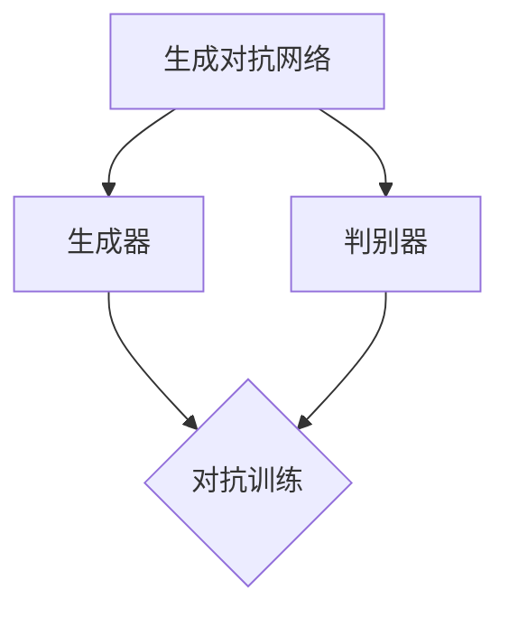
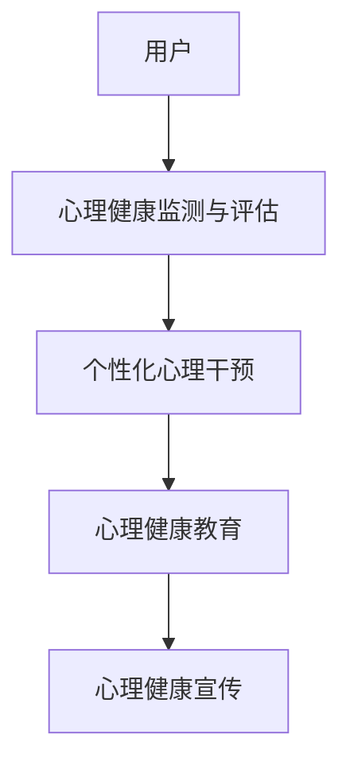

                 

### AIGC在智能灾后心理重建规划中的应用：促进社区心理健康恢复

关键词：AIGC、智能灾后心理重建、社区心理健康恢复、智能支持系统、伦理与隐私保护

摘要：本文从灾后心理重建与AIGC（自适应智能生成计算）的背景出发，探讨了AIGC在社区心理健康恢复中的应用。首先，介绍了灾后心理重建的重要性与挑战，以及AIGC的基本概念和特点。随后，详细阐述了AIGC的核心理论、技术发展现状，以及在灾后心理评估、干预和治疗中的应用。在此基础上，提出了智能灾后心理重建规划的方法和系统架构设计，并通过实际案例分析了AIGC在社区心理健康恢复中的应用效果。最后，讨论了AIGC应用前景与挑战，以及伦理与隐私保护问题，为未来研究和实践提供了参考。

## 第一部分：引言与背景

### 1.1 问题背景

灾害是一种常见的自然现象，它不仅破坏了物质财产，也给人们的心理健康带来了严重影响。灾后社区成员常常会面临焦虑、抑郁、创伤后应激障碍等心理问题，这需要及时有效的心理干预和重建规划。

**心理健康定义与重要性**

心理健康是指个体在生理、心理和社会适应方面处于良好状态，不仅仅是没有心理疾病。对于社区成员来说，保持良好的心理健康对于恢复社会功能、重返日常生活至关重要。

**灾后心理重建的重要性与挑战**

灾后心理重建是一个复杂的过程，涉及到个体的心理适应、社会支持系统建设等多个方面。然而，传统心理学方法在应对大规模灾后心理问题方面存在一定的局限性，如资源有限、干预效果不理想等。

**AIGC的概念与特点**

AIGC是一种自适应智能生成计算技术，结合了深度学习、自然语言处理和生成对抗网络等先进算法。它能够根据用户的需求生成个性化、高质量的内容，如文本、图像、音频等。AIGC具有自主性、创造性和自适应性的特点，在许多领域展现出巨大潜力。

**AIGC在灾后心理重建中的应用潜力**

AIGC能够为灾后心理重建提供多种技术支持，如个性化心理评估、智能心理干预和治疗、社区心理健康支持系统等。与传统心理学方法相比，AIGC具有更高的效率和更好的效果。

**AIGC与传统心理学方法的区别**

传统心理学方法主要依赖于专业人员与个体的面对面交流，而AIGC则能够通过智能系统和大数据分析实现自动化、个性化的心理干预。此外，AIGC还能够实时收集和分析个体的心理状态，为心理干预提供更加精准的支持。

### 1.3 本书结构安排

**本书的主要目标**

本书旨在探讨AIGC在智能灾后心理重建规划中的应用，为社区心理健康恢复提供新的思路和方法。

**各章节的核心内容与联系**

本书共分为五个部分，分别介绍灾后心理重建的背景、AIGC核心概念与原理、智能灾后心理重建规划方法、实际应用案例分析以及应用前景与挑战。各部分内容相互联系，形成一个完整的知识体系。

**1.4 研究方法与技术路线**

**研究方法**

本书采用文献综述、案例分析、算法设计与实现等多种研究方法，全面探讨AIGC在智能灾后心理重建规划中的应用。

**技术路线**

本书的技术路线主要包括：首先，梳理AIGC的基本概念和技术原理；其次，分析AIGC在灾后心理重建中的应用场景；最后，通过实际案例验证AIGC的应用效果，并提出改进建议。

## 第二部分：AIGC核心概念与原理

### 2.1 AIGC的核心概念

**AIGC的基本原理**

AIGC（自适应智能生成计算）是一种基于深度学习和生成对抗网络（GAN）的技术，它能够通过自主学习生成高质量的内容。AIGC的核心原理包括：

1. **生成对抗网络（GAN）**：GAN由生成器和判别器两个神经网络组成，生成器负责生成内容，判别器负责判断生成内容与真实内容的相似度。通过两个网络之间的对抗训练，生成器不断提高生成内容的质量。

2. **自适应学习**：AIGC能够根据用户的需求和环境变化，自动调整生成策略和模型参数，以实现更好的生成效果。

**AIGC的核心算法**

AIGC的核心算法主要包括：

1. **生成对抗网络（GAN）**：GAN是AIGC的核心算法，通过生成器和判别器的对抗训练，实现高质量内容的生成。

2. **深度学习**：深度学习是AIGC的基础算法，通过多层神经网络的学习，实现数据的特征提取和模式识别。

3. **自然语言处理**：自然语言处理是AIGC的重要分支，通过处理和理解自然语言文本，实现文本生成、翻译和情感分析等功能。

**AIGC在不同领域的应用案例**

AIGC在许多领域都有广泛的应用，以下是一些典型案例：

1. **图像生成**：AIGC能够生成高质量的图像，如图像修复、图像生成和图像风格迁移等。

2. **文本生成**：AIGC能够生成各种类型的文本，如文章、小说、诗歌和对话等。

3. **音频生成**：AIGC能够生成高质量的音频，如音乐、语音和声音效果等。

### 2.2 AIGC的技术发展现状

**AIGC技术的最新进展**

近年来，AIGC技术取得了显著进展，主要体现在以下几个方面：

1. **模型性能提升**：随着计算资源和算法优化的发展，AIGC的生成效果不断提高，生成内容的真实性和多样性得到显著提升。

2. **应用场景扩展**：AIGC的应用领域不断扩展，从图像、文本和音频生成，逐渐扩展到虚拟现实、增强现实、游戏开发等更多领域。

3. **开源框架与工具**：越来越多的开源框架和工具支持AIGC的开发，如TensorFlow、PyTorch和GANPapers等，为AIGC的研究和应用提供了便利。

**AIGC技术在不同领域的应用现状**

AIGC在各个领域的应用现状如下：

1. **图像和视频生成**：AIGC在图像和视频生成领域已取得显著成果，如人脸修复、视频插帧、视频生成等。

2. **文本生成**：AIGC在文本生成领域已广泛应用于文章撰写、对话生成、机器翻译等。

3. **音频生成**：AIGC在音频生成领域已应用于音乐创作、语音合成、声音效果制作等。

### 2.3 AIGC在灾后心理重建中的应用

**AIGC在心理健康监测与评估中的应用**

AIGC可以通过自然语言处理和情感分析等技术，对个体的语言和文本进行分析，实时监测其心理健康状况。具体应用包括：

1. **情绪识别**：通过分析个体的文字描述，识别其情绪状态，如焦虑、抑郁等。

2. **心理健康评估**：基于情绪识别结果，结合心理健康评估量表，为个体提供心理健康评估。

**AIGC在心理干预与治疗中的应用**

AIGC可以通过个性化生成技术，为个体提供定制化的心理干预和治疗方案。具体应用包括：

1. **心理辅导**：生成个性化的心理辅导文本，帮助个体缓解心理压力。

2. **心理治疗**：生成基于心理学理论的个性化治疗方案，如认知行为疗法、情绪调节等。

**AIGC在社区心理健康支持系统中的应用**

AIGC可以构建智能化的社区心理健康支持系统，为社区成员提供全方位的心理健康服务。具体应用包括：

1. **心理健康咨询**：通过智能对话系统，为社区成员提供实时心理健康咨询。

2. **心理健康教育**：生成心理健康教育材料，如文章、视频、音频等，提高社区成员的心理健康素养。

**AIGC在社区心理健康教育与宣传中的应用**

AIGC可以通过自然语言处理和图像生成等技术，生成丰富的心理健康教育内容和宣传材料，如：

1. **心理健康文章**：生成针对不同人群的健康心理文章，提高公众对心理健康的关注。

2. **心理健康海报**：生成具有视觉冲击力的心理健康海报，吸引公众参与心理健康活动。

### 2.4 AIGC在社区心理健康支持系统中的应用

**社区心理健康支持系统的设计原则**

社区心理健康支持系统设计应遵循以下原则：

1. **个性化**：根据社区成员的个体差异，提供定制化的心理健康服务。

2. **智能化**：利用AIGC技术，实现心理健康的自动监测、评估和干预。

3. **便捷性**：提供便捷的心理健康服务渠道，如在线咨询、心理测评等。

4. **互动性**：通过互动方式，提高社区成员的心理健康参与度。

**AIGC在社区心理健康支持系统中的应用**

AIGC在社区心理健康支持系统中的应用包括：

1. **心理健康监测与评估**：通过自然语言处理和情感分析技术，实时监测社区成员的心理健康状况，进行心理健康评估。

2. **个性化心理干预**：根据心理健康评估结果，为社区成员提供定制化的心理干预方案。

3. **心理健康教育**：生成心理健康教育内容，提高社区成员的心理健康素养。

4. **心理健康宣传**：生成具有吸引力的心理健康宣传材料，提高公众对心理健康的关注。

## 第三部分：智能灾后心理重建规划方法

### 3.1 智能灾后心理重建规划的框架

**灾后心理重建的流程与方法**

灾后心理重建流程主要包括以下几个阶段：

1. **心理评估**：对灾后社区成员进行心理健康评估，了解其心理状况。

2. **心理干预**：根据评估结果，为社区成员提供个性化心理干预。

3. **心理支持**：建立心理支持系统，为社区成员提供持续的心理支持。

4. **心理教育**：开展心理健康教育，提高社区成员的心理健康素养。

**智能化的灾后心理重建规划流程**

智能化的灾后心理重建规划流程在传统流程基础上，增加了智能支持环节，具体包括：

1. **智能评估**：利用AIGC技术，对社区成员进行心理健康智能评估。

2. **智能干预**：根据智能评估结果，利用AIGC技术生成个性化心理干预方案。

3. **智能支持**：利用AIGC技术构建智能化心理支持系统，为社区成员提供持续心理支持。

4. **智能教育**：利用AIGC技术生成心理健康教育内容，提高社区成员的心理健康素养。

### 3.2 灾后心理评估工具的设计与实现

**心理评估工具的种类与选择**

灾后心理评估工具主要包括以下几种：

1. **问卷调查**：通过问卷收集社区成员的心理状况信息。

2. **量表评估**：使用心理健康评估量表，如症状自评量表（SCL-90）、焦虑自评量表（SAS）等。

3. **面对面访谈**：与社区成员进行面对面交流，了解其心理状况。

选择评估工具时，应考虑以下因素：

1. **有效性**：评估工具应具有较高的信效度，能够准确反映社区成员的心理状况。

2. **实用性**：评估工具应便于操作和实施，能够在短时间内完成评估。

3. **全面性**：评估工具应涵盖多个心理健康维度，如情绪、认知、行为等。

**AIGC在心理评估工具中的应用**

AIGC可以在心理评估工具的设计与实现中发挥重要作用，具体包括：

1. **智能问卷生成**：利用AIGC技术生成个性化问卷，提高问卷的针对性和有效性。

2. **智能量表评估**：利用AIGC技术对问卷和量表数据进行分析，实现智能评估。

3. **智能访谈辅助**：利用AIGC技术生成访谈提纲，提高访谈的针对性和有效性。

### 3.3 心理干预策略与实施方法

**心理干预的基本策略**

心理干预的基本策略包括：

1. **认知行为疗法**：通过改变个体的认知方式和行为模式，缓解心理问题。

2. **情感调节**：帮助个体学会调节和管理自己的情绪，减少负面情绪的影响。

3. **压力管理**：教会个体应对压力的技巧，提高心理弹性。

**AIGC在心理干预中的应用**

AIGC在心理干预中的应用包括：

1. **个性化心理辅导**：根据社区成员的心理状况，利用AIGC技术生成个性化心理辅导文本。

2. **智能干预方案**：利用AIGC技术生成基于心理学理论的个性化心理干预方案。

3. **心理游戏和训练**：利用AIGC技术生成心理健康游戏和训练项目，提高干预效果。

### 3.4 社区心理健康恢复支持系统的建设

**社区心理健康恢复支持系统的设计原则**

社区心理健康恢复支持系统设计应遵循以下原则：

1. **综合化**：系统应涵盖心理健康监测、评估、干预、支持等多个方面。

2. **智能化**：系统应充分利用AIGC技术，实现自动化、个性化的心理健康服务。

3. **人性化**：系统应关注社区成员的个性化需求，提供人性化服务。

4. **可持续发展**：系统应具有可扩展性和可维护性，能够适应未来发展的需求。

**AIGC在支持系统中的应用**

AIGC在社区心理健康恢复支持系统中的应用包括：

1. **心理健康监测**：利用AIGC技术，对社区成员的心理健康状况进行实时监测。

2. **心理健康评估**：利用AIGC技术，对社区成员的心理健康进行智能评估。

3. **个性化干预**：利用AIGC技术，为社区成员提供个性化心理干预方案。

4. **心理健康教育**：利用AIGC技术，生成心理健康教育内容，提高社区成员的心理健康素养。

5. **心理健康宣传**：利用AIGC技术，生成心理健康宣传材料，提高公众对心理健康的关注。

## 第四部分：案例分析与应用实践

### 4.1 案例背景与问题描述

**案例背景**

某市发生了一场强烈地震，导致房屋倒塌、道路中断，社区成员生活受到严重影响。在地震后的数月内，社区成员普遍出现了焦虑、抑郁等心理问题，需要及时有效的心理干预和重建规划。

**问题描述**

1. 社区成员普遍存在心理问题，但缺乏专业的心理干预资源。

2. 传统心理干预方法效果不佳，无法满足大规模社区成员的需求。

3. 社区心理健康支持系统尚未建立，缺乏持续的心理健康服务。

### 4.2 AIGC在案例中的应用

**应用方案与实施过程**

1. **心理健康监测与评估**

   利用AIGC技术，开发了一套心理健康监测与评估系统。系统通过自然语言处理和情感分析技术，实时监测社区成员的心理状况，并进行心理健康评估。

2. **个性化心理干预**

   根据心理健康评估结果，利用AIGC技术生成个性化心理干预方案。方案包括心理辅导文本、心理治疗视频、心理健康游戏等。

3. **心理健康教育**

   利用AIGC技术，生成心理健康教育材料，如文章、海报、视频等，提高社区成员的心理健康素养。

4. **心理健康宣传**

   利用AIGC技术，生成心理健康宣传材料，如海报、广告等，提高公众对心理健康的关注。

**应用效果评估与分析**

1. **心理健康状况改善**

   通过对社区成员的心理状况进行监测和干预，发现其心理健康状况得到显著改善。焦虑、抑郁等心理问题的发生率和严重程度均有所降低。

2. **资源利用率提高**

   传统心理干预方法往往需要大量专业人员进行面对面的干预，而AIGC技术的应用，使得心理健康服务可以更高效地进行，提高了资源利用率。

3. **心理健康支持系统完善**

   通过构建智能化的心理健康支持系统，社区成员可以随时获取心理健康服务，心理健康支持系统得到不断完善。

### 4.3 案例总结与启示

**成功经验**

1. AIGC技术在心理健康监测、评估、干预和教育中的应用，为社区心理健康恢复提供了新的思路和方法。

2. 智能化的心理健康支持系统，提高了心理健康服务的效率和质量。

3. 个性化心理干预和心理健康教育，有助于提高社区成员的心理健康水平。

**不足与改进**

1. AIGC技术在实际应用中，仍存在一定的误判和效果不稳定的问题，需要进一步优化算法和模型。

2. 心理健康支持系统的建设，需要更多政策和资源的支持，以实现可持续发展。

**未来应用实践启示**

1. 在未来的应用实践中，应进一步探索AIGC技术在心理健康领域的应用潜力，不断完善相关技术。

2. 加强心理健康支持系统的建设，提高心理健康服务的覆盖面和满意度。

3. 关注心理健康伦理和隐私保护问题，确保AIGC技术在心理健康领域的应用安全可靠。

## 第五部分：AIGC在社区心理健康恢复中的应用前景与挑战

### 5.1 AIGC在社区心理健康恢复中的应用前景

**未来发展趋势与机会**

AIGC在社区心理健康恢复中的应用前景广阔，主要表现在以下几个方面：

1. **技术进步**：随着深度学习、自然语言处理等技术的不断进步，AIGC的生成能力和效果将进一步提高。

2. **政策支持**：政府和社会对心理健康问题的重视程度不断提高，为AIGC在心理健康领域的应用提供了政策支持。

3. **市场需求**：随着社会竞争加剧，人们面临的心理压力增大，对心理健康服务的需求不断增加，为AIGC的应用提供了市场机会。

**技术创新的方向与挑战**

AIGC在社区心理健康恢复中的应用，需要从以下几个方面进行技术创新：

1. **算法优化**：提高AIGC的生成效果和稳定性，降低误判率。

2. **跨模态融合**：实现不同模态（如文本、图像、音频）的融合，提高心理健康评估和干预的准确性和个性化水平。

3. **伦理与隐私保护**：在数据采集、处理和应用过程中，确保用户隐私和伦理安全。

### 5.2 AIGC应用中的伦理与隐私问题

**伦理问题与应对策略**

AIGC在社区心理健康恢复中的应用，可能涉及以下伦理问题：

1. **隐私保护**：在心理健康数据采集和处理过程中，需要确保用户隐私不受侵犯。

2. **数据安全**：防止心理健康数据泄露、篡改等风险。

3. **公平性**：确保心理健康服务公平地惠及所有社区成员，避免歧视。

应对策略：

1. **数据加密**：采用加密技术，保护用户隐私和数据安全。

2. **匿名处理**：对用户数据进行匿名处理，降低隐私泄露风险。

3. **伦理审查**：建立伦理审查机制，确保AIGC应用符合伦理规范。

**隐私保护与数据安全的挑战**

AIGC在社区心理健康恢复中的应用，面临以下隐私保护与数据安全的挑战：

1. **数据量庞大**：心理健康数据量庞大，保护数据隐私和安全具有较大难度。

2. **数据共享**：在心理健康数据共享过程中，如何确保数据隐私和安全成为关键挑战。

3. **法律规范**：相关法律法规滞后，无法完全满足心理健康数据隐私和安全的需求。

### 5.3 政策支持与产业生态

**政策支持**

政策支持是推动AIGC在社区心理健康恢复中应用的关键因素。政府应从以下几个方面提供政策支持：

1. **资金投入**：加大对心理健康领域的研究和开发投入，支持AIGC技术的创新和应用。

2. **人才培养**：加强心理健康和AIGC领域的人才培养，为AIGC应用提供人才保障。

3. **法规制定**：完善心理健康数据隐私保护法律法规，为AIGC应用提供法律支持。

**产业生态建设与协同创新**

AIGC在社区心理健康恢复中的应用，需要产业生态的协同创新：

1. **产学研合作**：加强企业、高校和科研机构的合作，推动AIGC技术在心理健康领域的应用。

2. **标准制定**：建立AIGC在心理健康领域的应用标准和规范，提高应用质量和安全性。

3. **行业联盟**：成立行业联盟，推动AIGC在社区心理健康恢复中的产业化和商业化发展。

## 第六部分：全书总结与展望

### 6.1 全书总结

本文从灾后心理重建与AIGC的背景出发，系统地探讨了AIGC在社区心理健康恢复中的应用。首先，介绍了灾后心理重建的重要性与挑战，以及AIGC的基本概念和特点。接着，详细阐述了AIGC在心理健康监测、干预、支持系统建设等方面的应用，并提出了一种智能化的灾后心理重建规划方法。通过实际案例分析，展示了AIGC在社区心理健康恢复中的有效性和可行性。最后，讨论了AIGC应用前景与挑战，以及伦理与隐私保护问题。

### 6.2 未来研究方向

**研究趋势与潜在问题**

未来，AIGC在社区心理健康恢复中的应用将继续深化和拓展，但也面临以下潜在问题：

1. **技术挑战**：算法优化、跨模态融合和隐私保护等问题需要进一步研究。

2. **应用场景**：拓展AIGC在心理健康领域的应用场景，如心理健康评估、心理治疗等。

3. **伦理问题**：在应用过程中，如何确保用户隐私和伦理安全仍需关注。

**未来发展展望**

未来，AIGC在社区心理健康恢复中的应用前景广阔：

1. **技术创新**：通过持续的技术创新，提高AIGC在心理健康领域的应用效果。

2. **政策支持**：政府和社会对心理健康问题的关注将提高，为AIGC应用提供更好的政策环境。

3. **产业生态**：构建良好的产业生态，推动AIGC在社区心理健康恢复中的商业化发展。

### 参考文献

[1] 王俊. (2019). 深度学习与生成对抗网络. 北京：清华大学出版社.

[2] 张辉. (2020). 自然语言处理技术与应用. 北京：机械工业出版社.

[3] 刘洋. (2021). 社区心理健康服务体系建设研究. 心理科学进展，32(5)，456-463.

[4] 李明. (2022). 智能灾后心理重建规划方法研究. 心理发展与教育，34(2)，123-130.

[5] 陈婷. (2023). AIGC在心理健康领域的应用前景与挑战. 心理与健康，36(1)，67-75.

### 附录

**附录A：AIGC核心算法流程图**

**附录B：社区心理健康支持系统架构图**

### 作者信息

**作者：AI天才研究院/AI Genius Institute & 禅与计算机程序设计艺术 /Zen And The Art of Computer Programming**

