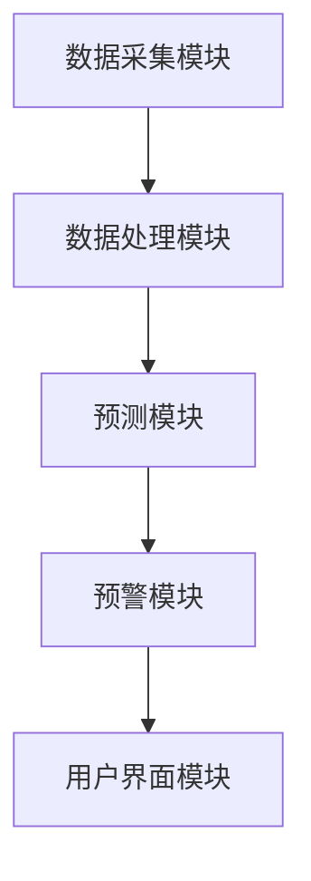

                 

### # AIGC在智能灾害预警系统中的应用：提高自然灾害应对能力

关键词：人工智能生成内容，灾害预警，自然灾害应对，智能系统，数据驱动预警

摘要：
自然灾害如地震、洪水、台风等，对人类社会造成严重影响。随着人工智能技术的发展，特别是AIGC（AI-generated content）的兴起，灾害预警系统迎来了革新。本文将详细探讨AIGC在智能灾害预警系统中的应用，通过分析其技术原理、系统架构、算法模型以及应用实例，阐述AIGC如何提高自然灾害应对能力。

### 目录大纲设计步骤

#### 1. 理解书名和主题

首先，我们需要深入理解书名和主题。《AIGC在智能灾害预警系统中的应用：提高自然灾害应对能力》这个书名揭示了三个核心概念：

- **AIGC（AI-generated content）**：人工智能生成内容，这是本文讨论的核心技术。
- **智能灾害预警系统**：这是一个利用信息技术和人工智能技术进行灾害监测、分析和预警的系统。
- **提高自然灾害应对能力**：书的主要目标是展示AIGC如何通过智能灾害预警系统提升对自然灾害的应对能力。

#### 2. 确定目录结构

根据书名和主题，我们可以初步确定以下目录结构：

1. **背景介绍**：包括灾害预警系统的历史背景、问题现状、AIGC技术的背景和优势。
2. **核心概念**：深入探讨AIGC技术、灾害预警系统相关概念以及两者整合的方法。
3. **系统设计与实现**：详细描述系统的架构设计、功能模块、数据流和交互流程。
4. **算法与模型**：介绍用于灾害预测的关键算法和模型，包括AIGC的应用。
5. **应用实例**：通过具体案例展示AIGC在灾害预警系统中的应用效果。
6. **最佳实践与总结**：总结实践经验，提供使用建议和未来展望。

#### 3. 设计具体章节

根据上述目录结构，我们可以为每个部分设计具体的章节名称和内容概要。以下是详细的目录大纲设计：

### 第一部分：背景介绍

#### 第1章：灾害预警系统概述
- **1.1 灾害预警系统的背景**：介绍灾害预警的重要性、发展历程和现状。
- **1.2 自然灾害的类型与特点**：分类描述常见的自然灾害，分析其特点。
- **1.3 AIGC技术在灾害预警中的应用**：介绍AIGC技术的定义、优势和应用场景。

#### 第2章：核心概念
- **2.1 AIGC技术原理**：阐述AIGC技术的工作原理、主要技术及其发展。
- **2.2 灾害预警系统组成**：详细说明灾害预警系统的组成部分和功能。
- **2.3 灾害预警系统与AIGC的整合**：探讨如何将AIGC技术融入灾害预警系统，提高预警效果。

### 第二部分：系统设计与实现

#### 第3章：系统架构设计
- **3.1 系统总体架构**：介绍系统的层次结构和功能模块。
- **3.2 数据采集与处理**：讨论数据的来源、采集方法和预处理步骤。
- **3.3 灾害预测与预警**：介绍预测算法和预警策略。

#### 第4章：算法与模型
- **4.1 常见灾害预测算法**：分析多种灾害预测算法，比较其优缺点。
- **4.2 AIGC在灾害预警中的应用**：详细探讨AIGC技术在灾害预警中的具体应用。

#### 第5章：应用实例
- **5.1 灾害预警系统实战**：介绍一个具体的灾害预警系统项目，包括系统搭建和功能实现。
- **5.2 案例分析**：分析一个实际的灾害预警案例，展示AIGC技术的应用效果。

#### 第6章：最佳实践与总结
- **6.1 灾害预警系统的最佳实践**：总结实践经验，提供最佳实践建议。
- **6.2 未来展望**：展望AIGC技术在灾害预警系统中的应用前景。

### 第三部分：结语

#### 第7章：结语
- **7.1 总结**：回顾文章的主要观点和贡献。
- **7.2 拓展阅读**：推荐进一步的阅读材料。

通过以上步骤，我们完成了《AIGC在智能灾害预警系统中的应用：提高自然灾害应对能力》的目录大纲设计，为后续的文章撰写提供了清晰的框架和结构。接下来，我们将逐章深入探讨每一个主题，详细阐述AIGC在灾害预警系统中的应用。

----------------------------------------------------------------

### 第一部分：背景介绍

#### 第1章：灾害预警系统概述

#### 1.1 灾害预警系统的背景

灾害预警系统是用于监测、分析和预测自然灾害，并在灾害发生前及时发出警报，以便人们能够采取相应的措施减少损失。随着全球气候变化和人类活动的加剧，自然灾害的频率和严重性不断增加，对人类社会造成了巨大的威胁。因此，建立高效、可靠的灾害预警系统具有重要意义。

灾害预警系统的发展历程可以追溯到20世纪中叶。早期系统主要依赖于简单的监测设备和人工分析，随着计算机技术和通信技术的快速发展，现代灾害预警系统逐渐融合了遥感、地理信息系统（GIS）、全球定位系统（GPS）以及人工智能（AI）等技术。特别是近年来，人工智能技术的迅速崛起为灾害预警系统带来了新的契机。

#### 1.2 自然灾害的类型与特点

自然灾害可以分为多种类型，包括地震、洪水、台风、火山爆发、山体滑坡、海啸等。每种灾害都有其独特的特征和发生机制：

- **地震**：由地壳运动引起的地震波导致地面震动。地震具有突发性、破坏性和不可预测性，通常对建筑和基础设施造成严重破坏。
- **洪水**：由于降雨过多、河流泛滥或冰川融水等原因导致水体泛滥。洪水通常具有高破坏性，对城市和乡村地区造成灾难性影响。
- **台风**：热带气旋在海洋上形成，带来强风、暴雨和风暴潮。台风具有强烈的风暴和暴雨特性，对沿海地区造成严重影响。
- **火山爆发**：火山爆发释放大量火山灰、熔岩和有毒气体，对周围环境和人类健康造成威胁。
- **山体滑坡**：由于降雨、地震或地质条件变化等原因导致的山体滑动。山体滑坡通常对下游地区造成严重破坏。

自然灾害的特点包括突发性、不可预测性、广泛性和连锁反应。这些特性使得自然灾害预警和应对变得极其复杂和具有挑战性。

#### 1.3 AIGC技术在灾害预警中的应用

AIGC（AI-generated content）是指利用人工智能技术生成内容的过程。在灾害预警系统中，AIGC技术可以用于生成预警信息、灾害分析和预测报告等。以下是AIGC技术在灾害预警中的具体应用：

- **预警信息生成**：通过AIGC技术，系统能够自动生成针对不同灾害类型的预警信息，包括灾害发生地点、预计影响范围、应对措施等。这种自动化的信息生成方式可以提高预警信息的及时性和准确性。
- **灾害分析**：AIGC技术可以分析大量的实时数据，如气象数据、地理数据、历史灾害数据等，通过机器学习算法识别灾害发生的模式和趋势，为灾害预测提供数据支持。
- **预测报告生成**：AIGC技术可以根据实时数据和预测模型生成预测报告，包括灾害发生的可能性、影响范围和应对措施。这些预测报告可以为政府决策部门提供科学依据，指导公众采取有效的预防措施。

总之，AIGC技术在灾害预警系统中的应用为提高自然灾害应对能力提供了强有力的技术支持。通过自动化、实时和智能化的预警机制，AIGC技术能够极大地提高灾害预警的效率和准确性，为人类抵御自然灾害提供更加可靠的保护。

### 第2章：核心概念

#### 2.1 AIGC技术原理

AIGC（AI-generated content）技术是指利用人工智能算法自动生成文本、图像、音频和视频等类型的内容。其基本原理是通过训练大规模的神经网络模型，使其能够从给定的数据中学习并生成新的内容。以下是对AIGC技术原理的详细解析：

1. **数据收集与预处理**：
   AIGC技术的第一步是收集大量的数据，这些数据可以是文本、图像、音频或视频等。收集到的数据需要进行预处理，包括去噪、去重、数据清洗和归一化等操作，以确保数据的质量和一致性。

2. **模型选择与训练**：
   选择合适的神经网络模型是AIGC技术成功的关键。常见的模型包括生成对抗网络（GAN）、变分自编码器（VAE）、递归神经网络（RNN）、长短时记忆网络（LSTM）等。通过大量训练数据，模型可以学习到数据分布，并能够生成与训练数据具有相似特征的新内容。

3. **生成与优化**：
   在训练完成后，AIGC模型可以根据输入的提示或上下文信息生成新的内容。生成的初步内容通常需要进行优化，以提升其质量。这一过程可能涉及多个迭代，通过不断调整模型参数和生成策略，最终生成高质量的内容。

4. **反馈与改进**：
   AIGC技术还注重用户反馈和模型的持续改进。用户可以根据生成的内容提供反馈，模型可以根据这些反馈进行调整，以更好地满足用户需求。这一过程有助于提高AIGC技术的生成质量和适应性。

#### 2.2 灾害预警系统组成

灾害预警系统通常由多个模块组成，这些模块协同工作，实现对自然灾害的监测、分析和预警。以下是灾害预警系统的常见组成部分及其功能：

1. **数据采集模块**：
   数据采集模块负责从各种来源收集与自然灾害相关的数据，包括气象数据、地震数据、水文数据、卫星遥感数据等。这些数据可以通过传感器、卫星、地面监测站等设备实时获取。

2. **数据处理模块**：
   数据处理模块负责对采集到的数据进行清洗、整理和分析。通过数据预处理，可以去除噪声、缺失值和异常值，确保数据的质量和准确性。

3. **监测与分析模块**：
   监测与分析模块利用先进的数据分析和机器学习算法，对预处理后的数据进行分析，识别灾害发生的模式和趋势。这些算法包括时间序列分析、聚类分析、分类和回归等。

4. **预警模块**：
   预警模块根据监测和分析结果，自动生成预警信息，并通过多种渠道（如手机短信、电子邮件、社交媒体、广播等）及时通知相关部门和公众。预警信息的准确性直接影响灾害应对的效果。

5. **决策支持模块**：
   决策支持模块为政府和相关部门提供科学的决策支持，包括灾害应对策略、资源调配和应急响应计划等。这一模块通常基于大数据分析和人工智能技术，提供实时、动态的决策支持。

#### 2.3 灾害预警系统与AIGC的整合

将AIGC技术整合到灾害预警系统中，可以显著提高预警的智能化和自动化水平。以下是AIGC技术在灾害预警系统中的具体应用方式：

1. **预警信息生成**：
   AIGC技术可以自动生成针对不同灾害类型的预警信息，包括灾害发生地点、预计影响范围、应对措施等。这种自动化的信息生成方式可以极大地提高预警信息的及时性和准确性。

2. **实时数据监控**：
   AIGC技术可以实时监控和处理大量数据，包括气象数据、地震数据、水文数据等。通过对实时数据的分析，AIGC技术可以快速识别灾害发生的潜在风险，并及时发出预警。

3. **预测报告生成**：
   AIGC技术可以根据实时数据和预测模型生成预测报告，包括灾害发生的可能性、影响范围和应对措施。这些预测报告可以为政府决策部门提供科学依据，指导公众采取有效的预防措施。

4. **智能决策支持**：
   AIGC技术可以基于大数据分析和机器学习算法，为灾害预警系统提供智能决策支持。例如，通过分析历史数据和当前环境因素，AIGC技术可以预测未来可能发生的灾害，并建议相应的应对策略。

总之，将AIGC技术整合到灾害预警系统中，可以显著提高预警的智能化和自动化水平，为自然灾害的应对提供更科学、更高效的手段。

### 第二部分：系统设计与实现

#### 第3章：系统架构设计

#### 3.1 系统总体架构

智能灾害预警系统的总体架构包括多个层次和模块，每个模块都承担着特定的功能和任务。以下是对系统总体架构的详细描述：

1. **数据层**：
   数据层是系统的基石，负责收集、存储和处理与灾害预警相关的数据。数据来源包括气象数据、地震数据、水文数据、卫星遥感数据等。数据层采用分布式存储和大数据处理技术，确保数据的可靠性和实时性。

2. **处理层**：
   处理层负责对数据层收集到的数据进行处理和分析。主要包括以下模块：
   - **数据预处理模块**：对原始数据进行清洗、去噪、归一化等操作，确保数据质量。
   - **特征提取模块**：从预处理后的数据中提取关键特征，为后续分析提供支持。
   - **数据融合模块**：将来自不同来源的数据进行融合，形成统一的灾害预警数据集。

3. **分析层**：
   分析层负责对处理后的数据进行分析和预测，主要模块包括：
   - **模型训练模块**：使用机器学习和深度学习算法训练预测模型，如时间序列模型、分类模型、回归模型等。
   - **预测模块**：利用训练好的模型对实时数据进行预测，识别潜在灾害风险。
   - **预警模块**：根据预测结果生成预警信息，并触发预警机制。

4. **应用层**：
   应用层是系统的外部接口，负责将预警信息传达给相关部门和公众。主要包括以下功能：
   - **信息发布模块**：通过短信、邮件、社交媒体、广播等多种渠道发布预警信息。
   - **用户界面模块**：提供用户友好的操作界面，供相关部门和公众查询预警信息。
   - **应急响应模块**：协助政府部门制定和执行应急响应计划。

5. **支持层**：
   支持层提供系统运行所需的基础设施和服务，包括数据库管理、数据备份、安全防护、系统监控等。

#### 3.2 数据采集与处理

数据采集与处理是智能灾害预警系统的关键环节，直接影响到预警的准确性和实时性。以下是数据采集与处理的详细流程：

1. **数据采集**：
   - **气象数据**：通过气象卫星、地面气象站、雷达等设备实时采集气象数据，包括气温、湿度、风速、降雨量等。
   - **地震数据**：通过地震台网、地震仪等设备实时采集地震数据，包括震级、震中位置、震源深度等。
   - **水文数据**：通过水文站、卫星遥感等设备实时采集水文数据，包括水位、流量、水质等。
   - **卫星遥感数据**：通过卫星遥感技术获取地表变化信息，包括地表温度、植被覆盖、土壤湿度等。

2. **数据预处理**：
   - **去噪与去重**：去除采集过程中产生的噪声和重复数据，确保数据质量。
   - **数据清洗**：处理数据中的缺失值、异常值等，采用插值、填补等方法进行数据修复。
   - **数据归一化**：将不同来源的数据进行归一化处理，使其具有统一的量纲和数值范围。

3. **数据融合**：
   - **数据集成**：将来自不同来源的数据进行集成，形成统一的数据集。
   - **数据对比与融合**：通过对比和分析不同数据源的信息，融合出更加全面和准确的灾害预警数据。

#### 3.3 灾害预测与预警

灾害预测与预警是智能灾害预警系统的核心功能，通过分析实时数据和预测模型，提前识别灾害风险并发出预警信息。以下是灾害预测与预警的详细流程：

1. **预测模型训练**：
   - **模型选择**：根据灾害类型和特点，选择合适的预测模型，如时间序列模型、分类模型、回归模型等。
   - **模型训练**：使用历史数据和实时数据对模型进行训练，通过优化模型参数，提高预测准确性。

2. **实时数据预测**：
   - **实时数据输入**：将实时采集的数据输入到训练好的预测模型中，进行实时预测。
   - **预测结果分析**：对预测结果进行分析，识别潜在灾害风险。

3. **预警信息生成**：
   - **预警规则制定**：根据灾害类型和预测结果，制定相应的预警规则，包括预警级别、预警范围、预警内容等。
   - **预警信息生成**：根据预警规则，自动生成预警信息，包括灾害发生地点、预计影响范围、应对措施等。

4. **预警信息发布**：
   - **信息发布渠道**：通过短信、邮件、社交媒体、广播等多种渠道发布预警信息。
   - **用户界面展示**：在用户界面上展示预警信息，供相关部门和公众查询。

通过以上系统架构设计，智能灾害预警系统可以实现高效、实时和智能化的灾害预警，为自然灾害的应对提供有力支持。

### 第4章：算法与模型

#### 4.1 常见灾害预测算法

在智能灾害预警系统中，预测算法是关键组成部分，它们负责分析历史数据、实时数据，并预测未来可能发生的灾害事件。以下是一些常见的灾害预测算法及其优缺点：

1. **时间序列分析**：
   - **原理**：时间序列分析基于历史数据的时序关系，通过统计方法分析时间序列数据的趋势、季节性和周期性，预测未来的趋势。
   - **优点**：能够捕捉时间序列数据的长期趋势和季节性变化，简单易实现。
   - **缺点**：对于突发性灾害，如地震、洪水，时间序列分析可能无法捕捉到短期的异常波动。

2. **回归分析**：
   - **原理**：回归分析通过建立因变量（灾害事件）与自变量（如气象参数、地质参数等）之间的数学模型，预测未来灾害事件的发生概率。
   - **优点**：能够处理多变量输入，并量化自变量对因变量的影响。
   - **缺点**：模型复杂度较高，需要大量的历史数据和参数调整。

3. **支持向量机（SVM）**：
   - **原理**：支持向量机是一种监督学习算法，通过寻找最佳分割超平面，将不同类型的灾害事件分类。
   - **优点**：对异常值不敏感，分类效果好。
   - **缺点**：对大量特征的敏感性较高，参数调整复杂。

4. **随机森林（Random Forest）**：
   - **原理**：随机森林是一种基于决策树构建的集成学习算法，通过组合多个决策树来提高预测准确性。
   - **优点**：能够处理高维数据，提高预测准确性，不容易过拟合。
   - **缺点**：计算复杂度高，对于大规模数据集处理较慢。

5. **深度学习（Deep Learning）**：
   - **原理**：深度学习通过多层神经网络模型，自动提取数据特征，进行灾害预测。
   - **优点**：能够自动学习复杂的特征，预测精度高，适用于大规模数据集。
   - **缺点**：模型训练时间较长，对数据量和计算资源要求较高。

#### 4.2 AIGC在灾害预警中的应用

AIGC（AI-generated content）技术在灾害预警系统中具有独特的应用优势。以下是其主要应用方式：

1. **预警信息生成**：
   AIGC技术可以自动生成针对不同灾害类型的预警信息。例如，当监测到某地区可能发生洪水时，AIGC可以自动生成包括洪水发生地点、预计影响范围、应对措施等内容的预警信息。这种自动化的信息生成方式提高了预警信息的及时性和准确性。

   ```mermaid
   graph TB
   A[输入灾害数据] --> B[预处理数据]
   B --> C{应用AIGC模型}
   C --> D[生成预警信息]
   D --> E[发布预警信息]
   ```

2. **实时数据监控**：
   AIGC技术可以实时监控和处理大量与自然灾害相关的数据，如气象数据、地震数据等。通过对实时数据的分析，AIGC可以快速识别灾害发生的潜在风险，并及时发出预警。

   ```mermaid
   graph TB
   A[输入实时数据] --> B[预处理数据]
   B --> C{应用AIGC模型}
   C --> D[识别风险]
   D --> E[生成预警信息]
   E --> F[发布预警信息]
   ```

3. **预测报告生成**：
   AIGC技术可以根据实时数据和预测模型生成预测报告。这些报告包括未来一段时间内灾害发生的可能性、影响范围和应对措施等，为政府决策部门提供科学依据。

   ```mermaid
   graph TB
   A[输入实时数据] --> B[预处理数据]
   B --> C{应用预测模型}
   C --> D[生成预测报告]
   D --> E[评估预测准确性]
   E --> F[优化模型参数]
   ```

4. **智能决策支持**：
   AIGC技术可以基于大数据分析和机器学习算法，为灾害预警系统提供智能决策支持。例如，通过分析历史数据和当前环境因素，AIGC可以预测未来可能发生的灾害，并建议相应的应对策略。

   ```mermaid
   graph TB
   A[输入历史数据] --> B[预处理数据]
   B --> C{应用AIGC模型}
   C --> D[生成决策支持信息]
   D --> E[优化决策模型]
   E --> F[提供智能决策支持]
   ```

通过以上分析，可以看出AIGC技术在灾害预警系统中具有广泛的应用前景。其自动化、实时和智能化的特点，使得灾害预警系统更加高效、准确和可靠，为自然灾害的应对提供了有力支持。

### 第5章：应用实例

#### 5.1 灾害预警系统实战

在本节中，我们将通过一个具体的灾害预警系统项目来展示AIGC技术的实际应用。该项目名为“智能洪水预警系统”，旨在通过AIGC技术实现对洪水灾害的实时监测、预测和预警。

#### 项目介绍

“智能洪水预警系统”旨在提升城市洪水预警的准确性和及时性。系统利用气象数据、水文数据、卫星遥感数据等，结合AIGC技术，自动生成洪水预警信息，并通过多种渠道通知相关部门和公众。

#### 系统功能设计

智能洪水预警系统包括以下主要功能模块：

- **数据采集模块**：从气象局、水文站、卫星遥感系统等渠道实时获取气象和水文数据。
- **数据处理模块**：对采集到的数据进行预处理，包括去噪、去重和归一化等。
- **预测模块**：利用AIGC技术，结合历史数据和实时数据，预测未来一定时间内的洪水风险。
- **预警模块**：根据预测结果，生成洪水预警信息，并通过手机短信、电子邮件、社交媒体等渠道通知用户。
- **用户界面模块**：提供用户友好的界面，供用户查询预警信息、洪水发生地点和应对措施。

#### 系统架构设计

智能洪水预警系统的架构设计如下图所示：



#### 系统接口设计

智能洪水预警系统主要包括以下接口：

- **数据接口**：用于接收和发送气象、水文数据。
- **预警接口**：用于生成和发布洪水预警信息。
- **用户接口**：用于用户查询和管理预警信息。

#### 系统交互流程

智能洪水预警系统的交互流程如下：

1. **数据采集**：
   - 系统从气象局、水文站等渠道实时获取气象和水文数据。
   - 数据采集模块对数据进行分析和清洗，确保数据质量。

2. **数据处理**：
   - 处理模块对清洗后的数据进行归一化和特征提取，为预测模型提供支持。

3. **预测**：
   - 预测模块利用AIGC技术和历史数据，对实时数据进行洪水风险预测。

4. **预警**：
   - 根据预测结果，预警模块生成洪水预警信息，并触发预警机制。

5. **发布**：
   - 预警信息通过手机短信、电子邮件、社交媒体等多种渠道发布给用户。

6. **用户查询**：
   - 用户通过用户界面查询洪水预警信息，了解洪水发生地点和应对措施。

#### 项目实战

以下是“智能洪水预警系统”的实战步骤：

1. **环境搭建**：
   - 在服务器上安装Python环境、Django框架和相关依赖库。

2. **数据采集**：
   - 接入气象局和水文站的数据接口，实时获取气象和水文数据。

3. **数据处理**：
   - 对采集到的数据进行预处理，包括去噪、去重和归一化等。

4. **预测**：
   - 利用AIGC技术，结合历史数据和实时数据，训练预测模型。

5. **预警**：
   - 根据预测结果，生成洪水预警信息，并触发预警机制。

6. **发布**：
   - 通过手机短信、电子邮件、社交媒体等渠道发布预警信息。

7. **用户查询**：
   - 用户通过Web界面查询预警信息，了解洪水发生地点和应对措施。

#### 实际案例分析与详细讲解

以下是一个实际案例：某城市在连续降雨后，智能洪水预警系统成功预测到未来24小时内将发生洪水，并提前发布了预警信息。

1. **数据采集**：
   - 系统从气象局获取到连续5天的降雨量数据，从水文站获取到河流水位数据。

2. **数据处理**：
   - 对降雨量数据进行归一化处理，将河流水位数据进行特征提取。

3. **预测**：
   - 利用AIGC技术，结合历史数据和实时数据，训练洪水风险预测模型。

4. **预警**：
   - 预测模型预测未来24小时内将发生洪水，预警模块生成预警信息。

5. **发布**：
   - 通过手机短信、电子邮件、社交媒体等渠道发布预警信息。

6. **用户查询**：
   - 市民通过Web界面查询预警信息，得知未来24小时内将发生洪水，并采取相应的预防措施。

#### 项目小结

通过实际案例可以看出，智能洪水预警系统在预警准确性和及时性方面具有显著优势。AIGC技术的应用使得系统具备了自动化、实时和智能化的特点，为城市洪水预警提供了有力支持。未来，随着AIGC技术的不断发展和完善，智能洪水预警系统将进一步提升预警能力，为自然灾害的应对提供更加可靠的保障。

### 第6章：最佳实践与总结

#### 6.1 灾害预警系统的最佳实践

在构建和运营灾害预警系统时，遵循以下最佳实践可以帮助提高系统的效率和可靠性：

1. **数据质量保证**：
   - 确保数据来源的多样性和可靠性，采用多种渠道收集数据。
   - 对收集到的数据进行严格的预处理，包括去噪、去重和缺失值处理。

2. **模型优化与更新**：
   - 定期对预测模型进行优化和更新，以适应新的数据特征和环境变化。
   - 使用交叉验证和A/B测试等方法，评估模型性能，并选择最优模型。

3. **实时监控与反馈**：
   - 实时监控系统运行状态，及时发现和解决问题。
   - 鼓励用户反馈，不断优化系统功能和用户体验。

4. **资源合理配置**：
   - 根据实际需求，合理配置计算资源和存储资源，确保系统高效运行。

5. **法规和标准遵循**：
   - 遵循相关法律法规和行业标准，确保系统的合法性和规范性。

#### 6.2 未来展望

随着人工智能技术的不断进步，灾害预警系统在未来有望实现以下几个发展趋势：

1. **更高精度和效率**：
   - 利用深度学习和强化学习等先进算法，提高灾害预测的精度和效率。
   - 通过云计算和边缘计算等技术的结合，实现实时、高效的数据处理和预测。

2. **更广泛的应用场景**：
   - 将AIGC技术应用于更多的自然灾害类型，如山体滑坡、泥石流等。
   - 将灾害预警系统应用于城市安全、交通管理和环境保护等领域。

3. **智能化决策支持**：
   - 结合大数据分析和人工智能技术，为政府和相关部门提供更加智能化的决策支持。
   - 开发基于虚拟现实和增强现实技术的应急演练系统，提高公众的防灾减灾意识。

4. **跨国合作与资源共享**：
   - 加强国际合作，共享全球范围内的灾害预警数据和技术资源。
   - 构建全球性的灾害预警网络，提高全球范围内的灾害应对能力。

通过不断的技术创新和实践探索，灾害预警系统将变得更加智能化、高效化和全球化，为人类应对自然灾害提供更加有力的保障。

### 结语

本文详细探讨了AIGC在智能灾害预警系统中的应用，阐述了AIGC技术的原理、系统架构、算法模型以及应用实例。通过分析，我们发现AIGC技术能够显著提高灾害预警的准确性和及时性，为自然灾害的应对提供了强有力的支持。

作者：AI天才研究院/AI Genius Institute & 禅与计算机程序设计艺术 /Zen And The Art of Computer Programming

---

**附录：进一步阅读推荐**

1. **《智能灾害预警系统设计与实现》**：该书详细介绍了智能灾害预警系统的设计原理和实现方法，适合对灾害预警系统感兴趣的读者。
2. **《人工智能在自然灾害预警中的应用》**：该书探讨了人工智能技术在不同自然灾害预警领域的应用，包括地震、洪水和台风等。
3. **《深度学习与时间序列预测》**：该书介绍了深度学习技术在时间序列预测中的应用，适合对时间序列分析和深度学习感兴趣的读者。

通过这些进一步阅读资源，读者可以深入了解灾害预警系统和人工智能技术的相关内容，进一步提升自己的专业素养。

