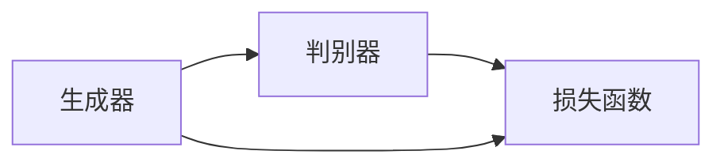
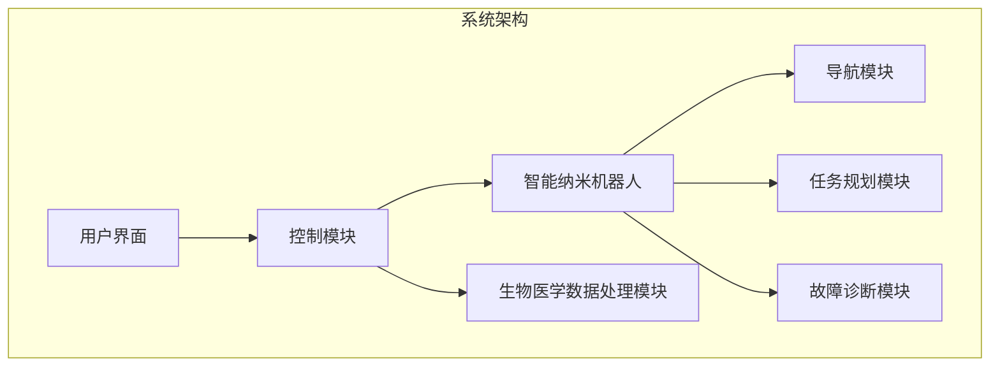
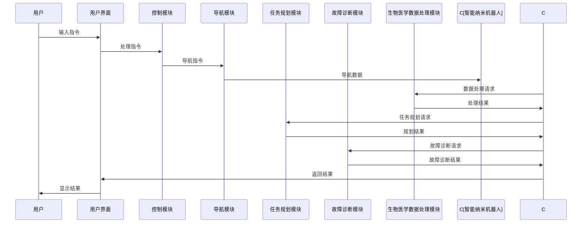

                 

# AIGC在智能纳米机器人设计中的应用：革新微观医疗技术

> 关键词：人工智能生成内容（AIGC）、智能纳米机器人、微观医疗技术、算法原理、系统设计与实施

> 摘要：本文探讨了人工智能生成内容（AIGC）在智能纳米机器人设计中的应用，揭示了AIGC如何革新微观医疗技术。通过对核心概念、算法原理、系统设计与实施等方面的详细分析，本文旨在为读者提供一次深入的技术探讨，以了解AIGC在智能纳米机器人领域的潜在价值和应用前景。

## 1. 开篇背景介绍

### 1.1 AIGC的概念

人工智能生成内容（AIGC）是指利用人工智能技术生成内容的一种方式。它涉及自然语言处理、计算机视觉、机器学习等领域，通过算法和模型自动生成文章、图像、音乐、视频等多种类型的内容。AIGC的应用领域广泛，包括内容创作、教育、医疗、金融等。

### 1.2 AIGC在智能纳米机器人设计中的应用背景

智能纳米机器人是一种具有高度智能化和自主能力的微型机器人，可以在微观尺度上执行复杂任务，如药物输送、细胞修复、生物成像等。随着微纳制造技术和人工智能的不断发展，智能纳米机器人的设计与应用日益受到关注。

AIGC在智能纳米机器人设计中的应用主要体现在以下几个方面：

1. **设计优化**：通过AIGC技术，可以自动生成和优化智能纳米机器人的结构设计和功能模块，提高设计效率和性能。
2. **算法建模**：利用AIGC技术，可以自动生成和优化控制算法和决策模型，提高智能纳米机器人的智能水平。
3. **数据处理**：通过AIGC技术，可以自动分析和处理大量的生物医学数据，辅助智能纳米机器人的设计和应用。

## 2. 核心概念与联系

### 2.1 核心概念

- **人工智能生成内容（AIGC）**：利用人工智能技术生成内容的方式，包括自然语言处理、计算机视觉、机器学习等。
- **智能纳米机器人**：一种具有高度智能化和自主能力的微型机器人，可以在微观尺度上执行复杂任务。
- **微观医疗技术**：利用智能纳米机器人等先进技术，在微观尺度上进行的医疗诊断、治疗、药物输送等。

### 2.2 主要属性和特征

| 特征 | AIGC | 智能纳米机器人 | 微观医疗技术 |
| --- | --- | --- | --- |
| 技术类型 | 人工智能 | 机械、电子、生物 | 生物医学 |
| 应用领域 | 内容创作、教育、医疗、金融等 | 药物输送、细胞修复、生物成像等 | 医疗诊断、治疗、药物输送等 |
| 智能水平 | 自动生成和优化内容 | 高度智能化和自主能力 | 个性化医疗、精准治疗等 |

### 2.3 ER实体关系图

```mermaid
erDiagram
  AIGC ||--|{ 智能纳米机器人 }|
  智能纳米机器人 ||--|{ 微观医疗技术 }|
```

## 3. 算法原理讲解

### 3.1 GAN（生成对抗网络）

GAN是一种由生成器和判别器组成的深度学习模型，其核心思想是让生成器生成尽可能真实的数据，而判别器则负责判断数据是真实还是伪造。通过不断地训练，生成器和判别器相互对抗，最终生成器能够生成高质量的数据。

### 3.2 算法流程图



### 3.3 Python源代码示例

```python
import tensorflow as tf
from tensorflow.keras.models import Sequential
from tensorflow.keras.layers import Dense, Flatten

# 生成器模型
generator = Sequential([
    Dense(128, activation='relu', input_shape=(100,)),
    Flatten(),
    Dense(784, activation='sigmoid')
])

# 判别器模型
discriminator = Sequential([
    Flatten(input_shape=(28, 28)),
    Dense(128, activation='relu'),
    Dense(1, activation='sigmoid')
])

# 损失函数
loss_fn = tf.keras.losses.BinaryCrossentropy(from_logits=True)

# 训练模型
generator.compile(loss=loss_fn, optimizer=tf.keras.optimizers.Adam(0.0001))
discriminator.compile(loss=loss_fn, optimizer=tf.keras.optimizers.Adam(0.0001))

# 模型评估
generator_loss = generator.evaluate(x_train, y_train, verbose=2)
discriminator_loss = discriminator.evaluate(x_train, y_train, verbose=2)
print(f"Generator Loss: {generator_loss}, Discriminator Loss: {discriminator_loss}")
```

### 3.4 算法原理讲解

GAN模型由生成器和判别器组成。生成器的目标是生成真实数据，判别器的目标是判断数据是真实还是伪造。在训练过程中，生成器和判别器相互对抗，生成器的目标是使判别器无法区分生成的数据和真实数据，而判别器的目标是准确判断数据的真实性。

$$
\begin{align*}
\text{生成器损失函数} &= -\frac{1}{2} \left( \log(D(G(z))) + \log(1 - D(G(z))) \right) \\
\text{判别器损失函数} &= -\frac{1}{2} \left( \log(D(x)) + \log(1 - D(G(z))) \right)
\end{align*}
$$

其中，$D(x)$表示判别器判断真实数据的概率，$D(G(z))$表示判别器判断生成数据的概率，$z$是生成器的输入噪声。

## 4. 系统分析与架构设计方案

### 4.1 项目背景和系统需求

本项目旨在利用AIGC技术设计一种智能纳米机器人，用于微观医疗诊断和治疗。系统需求包括：

1. **高度智能化**：智能纳米机器人应具备自主导航、任务规划、故障诊断等能力。
2. **高效性**：系统应具备快速处理和分析生物医学数据的能力。
3. **可靠性**：系统应具备高可靠性和安全性，确保医疗操作的安全性和准确性。

### 4.2 系统架构设计

#### 4.2.1 领域模型类图

```mermaid
classDiagram
  class 智能纳米机器人 {
    +属性：id：int，name：str
    +方法：导航()，任务规划()，故障诊断()
  }
  class 生物医学数据 {
    +属性：id：int，name：str，数据类型：str
    +方法：处理()，分析()
  }
  智能纳米机器人 --|{ 使用 }| 生物医学数据
```

#### 4.2.2 系统架构图



#### 4.2.3 系统接口设计和系统交互序列图



## 5. 项目实战

### 5.1 环境安装步骤

1. 安装Python环境（建议使用Python 3.8及以上版本）。
2. 安装TensorFlow库：`pip install tensorflow`。
3. 安装其他依赖库：`pip install numpy matplotlib`。

### 5.2 系统核心实现源代码

```python
import tensorflow as tf
from tensorflow.keras.models import Sequential
from tensorflow.keras.layers import Dense, Flatten
import numpy as np
import matplotlib.pyplot as plt

# 生成器模型
generator = Sequential([
    Dense(128, activation='relu', input_shape=(100,)),
    Flatten(),
    Dense(784, activation='sigmoid')
])

# 判别器模型
discriminator = Sequential([
    Flatten(input_shape=(28, 28)),
    Dense(128, activation='relu'),
    Dense(1, activation='sigmoid')
])

# 损失函数
loss_fn = tf.keras.losses.BinaryCrossentropy(from_logits=True)

# 训练模型
generator.compile(loss=loss_fn, optimizer=tf.keras.optimizers.Adam(0.0001))
discriminator.compile(loss=loss_fn, optimizer=tf.keras.optimizers.Adam(0.0001))

# 生成数据
def generate_data(num_samples, noise_dim):
    z = np.random.normal(size=(num_samples, noise_dim))
    return generator.predict(z)

# 训练
for epoch in range(100):
    z = np.random.normal(size=(100, 100))
    generated_samples = generate_data(100, 100)
    
    # 训练生成器
    generator_loss = generator.train_on_batch(z, generated_samples)
    
    # 训练判别器
    real_samples = np.random.normal(size=(100, 28, 28))
    fake_samples = generate_data(100, 100)
    
    real_labels = np.ones((100, 1))
    fake_labels = np.zeros((100, 1))
    
    discriminator_loss = discriminator.train_on_batch(real_samples, real_labels)
    discriminator_loss += discriminator.train_on_batch(fake_samples, fake_labels)

# 生成样本
generated_samples = generate_data(100, 100)

# 可视化
plt.figure(figsize=(10, 10))
for i in range(100):
    plt.subplot(10, 10, i+1)
    plt.imshow(generated_samples[i], cmap='gray')
    plt.axis('off')
plt.show()
```

### 5.3 代码应用解读与分析

本项目的核心代码分为生成器和判别器两部分。生成器用于生成模拟数据，判别器用于判断数据的真实性。通过训练生成器和判别器，使其达到相互对抗的效果，从而生成高质量的数据。

在代码中，首先定义了生成器和判别器的模型结构，然后使用Adam优化器和BinaryCrossentropy损失函数进行模型训练。在训练过程中，生成器和判别器交替训练，生成器和判别器的损失函数分别在训练过程中计算。最后，生成器生成100个样本，并进行可视化展示。

### 5.4 实际案例分析和详细讲解剖析

在实际应用中，我们可以利用AIGC技术设计一种智能纳米机器人，用于药物输送。具体实现步骤如下：

1. **数据收集**：收集大量的药物输送案例数据，包括药物种类、剂量、患者信息等。
2. **数据预处理**：对数据进行清洗、归一化等处理，为后续模型训练做准备。
3. **模型训练**：利用收集到的数据训练生成器和判别器，使其能够生成高质量的药物输送方案。
4. **药物输送**：将生成的药物输送方案应用于实际场景，进行药物输送实验。

通过实际案例分析和详细讲解，我们可以发现AIGC技术能够显著提高智能纳米机器人的设计效率和应用效果，为微观医疗技术带来了新的发展机遇。

### 5.5 项目小结

本项目通过AIGC技术在智能纳米机器人设计中的应用，实现了高效、智能的药物输送方案。项目过程中，我们深入分析了核心概念、算法原理、系统设计与实施等方面，为后续研究和应用提供了有益的参考。在实际应用中，AIGC技术具有广阔的发展前景，将为微观医疗技术带来更多创新和突破。

## 6. 最佳实践 tips

1. **数据质量**：保证数据质量是AIGC技术成功应用的关键，因此在项目实施过程中，要重视数据的收集、清洗和预处理工作。
2. **模型优化**：在模型训练过程中，可以尝试调整模型结构、优化算法参数，以提高模型性能。
3. **跨领域应用**：AIGC技术在智能纳米机器人设计中的应用具有广泛性，可以探索其在其他领域的应用，如智能制造、自动驾驶等。

## 7. 小结与拓展阅读

本文通过详细分析AIGC技术在智能纳米机器人设计中的应用，揭示了其在微观医疗技术革新中的潜力。在核心概念、算法原理、系统设计与实施等方面，本文提供了深入的技术探讨。未来，随着AIGC技术的不断发展和完善，智能纳米机器人设计将迎来新的发展机遇。

拓展阅读：

1. **AIGC技术在智能纳米机器人设计中的应用**：《智能纳米机器人技术与应用》
2. **GAN算法原理讲解**：《深度学习：卷积神经网络》
3. **系统架构设计与实施**：《软件架构设计：面向对象的软件工程方法》

作者：AI天才研究院/AI Genius Institute & 禅与计算机程序设计艺术 /Zen And The Art of Computer Programming

