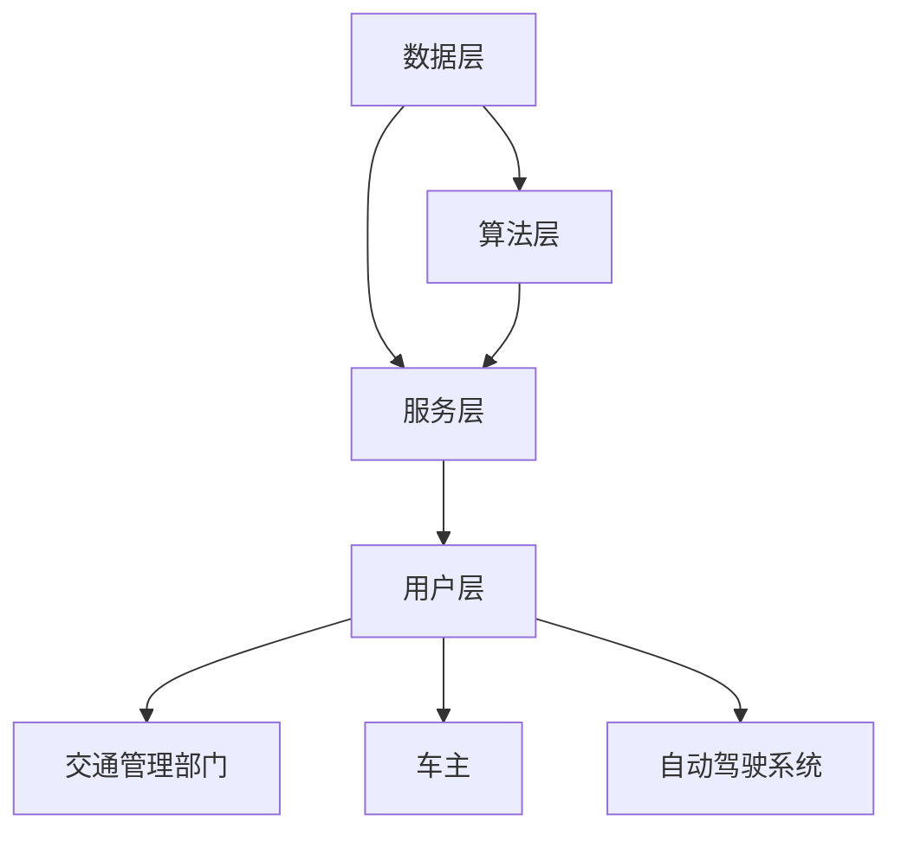
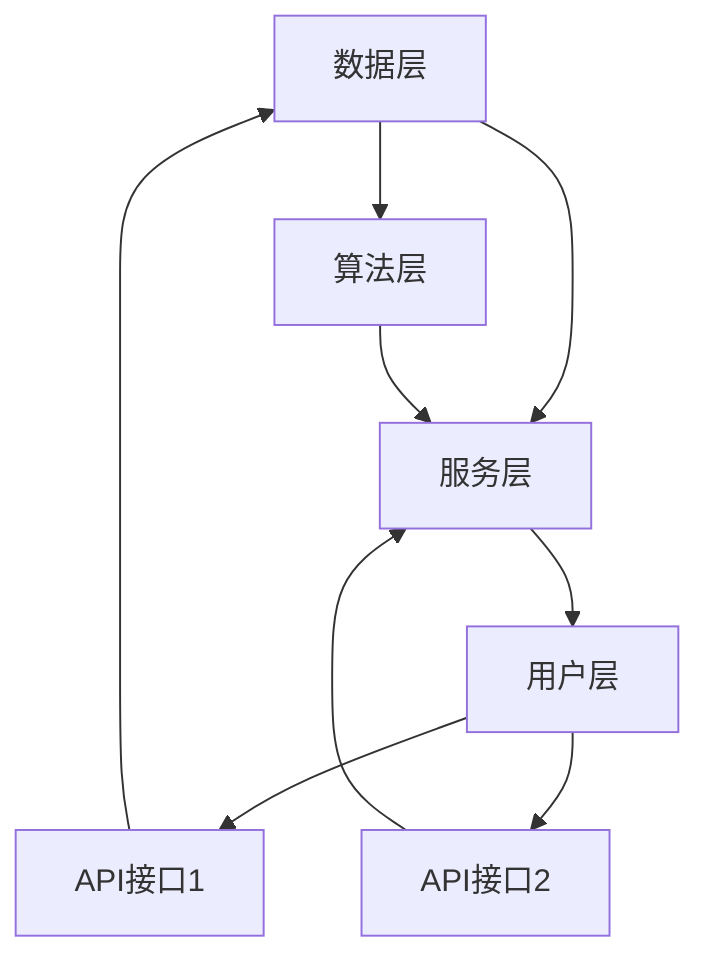
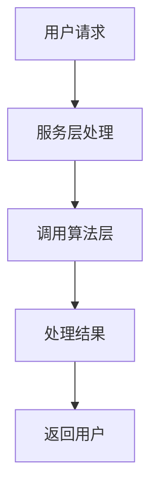

                 

### AIGC在未来城市交通系统优化中的应用

> 关键词：AIGC、未来城市交通、优化、人工智能、算法、系统设计

> 摘要：本文深入探讨AIGC（AI-Generated Content）在未来城市交通系统优化中的应用。通过对AIGC核心概念、算法原理、系统分析和实战案例的详细剖析，本文揭示了AIGC在解决城市交通拥堵、提高出行效率等方面的巨大潜力。文章旨在为相关领域的专业人士和研究人员提供有价值的参考，推动未来智慧城市交通系统的发展。

### 1. AIGC的基本概念与背景

AIGC，即AI-Generated Content，指的是利用人工智能技术生成内容的过程。这一概念源于生成对抗网络（GANs）、自然语言处理（NLP）和深度学习等前沿技术。AIGC的核心思想是通过机器学习模型，尤其是生成模型，自动化地生成文本、图像、音频等多种类型的数据内容。

在当前城市交通系统中，AIGC的应用潜力巨大。传统城市交通优化主要依赖于经验和数值模拟，而AIGC的引入，使得交通系统优化能够更加智能化和自适应。例如，AIGC能够通过分析海量交通数据，生成最优的交通流规划方案，从而缓解交通拥堵、减少碳排放和提升公共交通效率。

目前，城市交通面临的挑战包括但不限于：

- **交通拥堵**：城市人口的快速增长和机动化水平的提升，导致道路拥堵现象愈发严重。
- **环境污染**：汽车尾气排放是城市空气质量恶化的主要原因之一。
- **停车难题**：城市停车位供不应求，导致停车难、停车贵的问题。

与此同时，AIGC的应用带来了以下机会：

- **智能交通管理**：通过AIGC技术，可以实现对交通流量的实时监控和动态调整，提高交通运行效率。
- **自动驾驶**：AIGC在自动驾驶中的应用，能够提升自动驾驶系统的决策能力和安全性。
- **智慧城市规划**：基于AIGC的模拟和预测，可以为城市规划提供科学的决策支持。

总的来说，AIGC在未来城市交通系统优化中具有广阔的应用前景，其能够大大提高城市交通系统的智能化和适应性，从而应对日益严峻的交通挑战。

### 2. AIGC的核心概念与原理

在深入探讨AIGC如何在未来城市交通系统中发挥作用之前，我们首先需要了解AIGC的核心概念和原理。AIGC是生成对抗网络（GANs）、自然语言处理（NLP）和深度学习等领域的前沿技术成果，其核心思想是通过机器学习模型自动化生成高质量的数据内容。以下我们将详细介绍AIGC的基本概念、工作原理以及与城市交通系统的关系。

#### 2.1 生成对抗网络（GANs）

生成对抗网络（GANs）是AIGC的核心技术之一，由Ian Goodfellow等人在2014年提出。GANs由两个主要部分组成：生成器（Generator）和判别器（Discriminator）。生成器的任务是生成看起来像真实数据的数据，而判别器的任务是区分生成器生成的数据与真实数据。

GANs的工作原理可以形象地描述为一场“猫捉老鼠”的游戏。判别器像是要分辨“猫”（真实数据）和“假猫”（生成器生成的数据），而生成器则试图通过不断优化自己的生成能力来欺骗判别器。通过这种对抗过程，生成器逐渐学会生成越来越逼真的数据。

#### 2.2 自然语言处理（NLP）

自然语言处理（NLP）是AIGC在文本生成方面的关键技术。NLP利用机器学习模型理解和生成人类语言，包括语言模型、词嵌入、序列到序列模型等。近年来，Transformer架构和预训练语言模型（如BERT、GPT）的兴起，使得NLP在生成高质量文本方面取得了显著的进展。

NLP在AIGC中的应用主要包括：

- 文本生成：利用预训练的语言模型生成新闻文章、故事、对话等。
- 文本摘要：通过提取关键信息生成摘要，帮助用户快速理解长文本内容。
- 文本翻译：将一种语言的文本翻译成另一种语言。

#### 2.3 深度学习与数据生成

深度学习是AIGC的另一个重要技术支柱。深度学习通过神经网络模型，能够从大量数据中自动提取特征，从而实现复杂的模式识别和预测任务。深度学习模型在图像生成、音频生成和文本生成等领域都有广泛应用。

在AIGC中，深度学习模型主要用于：

- 图像生成：利用生成对抗网络（如StyleGAN、GANimation）生成高分辨率的图像。
- 音频生成：通过生成模型生成音乐、语音等音频内容。
- 文本生成：利用Transformer模型生成文章、诗歌等文本内容。

#### 2.4 AIGC与城市交通系统的关系

AIGC在未来的城市交通系统中扮演着至关重要的角色，其能够通过以下方式优化交通系统：

- **数据驱动决策**：通过AIGC技术，交通管理部门可以实时获取和分析交通数据，从而做出更加精准和高效的决策。
- **交通流预测**：利用NLP和深度学习模型，预测交通流量和出行模式，为交通规划提供科学依据。
- **智能交通信号控制**：基于生成的交通信号控制策略，优化交通信号灯的配时，提高交通通行效率。
- **自动驾驶**：AIGC技术可以帮助自动驾驶系统生成更加安全和高效的驾驶策略。

总之，AIGC不仅为城市交通系统带来了技术上的革新，更为解决交通难题提供了新的思路和方法。

#### 2.5 核心概念属性对比表格

为了更清晰地理解AIGC的核心概念，我们可以通过一个属性对比表格，展示生成对抗网络（GANs）、自然语言处理（NLP）和深度学习的关键属性和区别。

| 特性 | 生成对抗网络（GANs） | 自然语言处理（NLP） | 深度学习 |
| :----: | :----: | :----: | :----: |
| 数据类型 | 图像、音频、文本 | 文本 | 图像、音频、文本 |
| 主要模型 | 生成器、判别器 | 语言模型、词嵌入 | 神经网络 |
| 对抗性 | 是，生成器与判别器对抗 | 否 | 是，多层网络对抗 |
| 应用场景 | 图像生成、音频生成 | 文本生成、文本摘要、文本翻译 | 图像识别、语音识别、文本生成 |

通过上述对比表格，我们可以看到AIGC在多个领域的技术交叉和融合，为城市交通系统带来了多元化的解决方案。

#### 2.6 AIGC与城市交通系统的关系Mermaid ER图

为了直观地展示AIGC与城市交通系统的关系，我们可以通过Mermaid ER图来描述两者之间的交互和关联。

```mermaid
erDiagram
    TrafficSystem ||--|{ AIGC }|--| TrafficOptimization
    AIGC ||--|{ DataGeneration }|--| TrafficFlowPrediction
    AIGC ||--|{ SignalControl }|--| IntelligentTrafficSignal
    TrafficSystem ||--|{ AutonomousDriving }|--| DrivingStrategy
```

在这个ER图中，`AIGC`是核心实体，与`TrafficSystem`、`DataGeneration`、`TrafficFlowPrediction`、`SignalControl`和`DrivingStrategy`等实体存在关联。通过这种关系描述，我们可以清晰地看到AIGC在交通系统优化中的关键作用。

### 3. AIGC算法原理与数学模型

在深入探讨AIGC在交通系统优化中的应用之前，我们需要了解AIGC背后的算法原理和数学模型。以下是AIGC中几种主要的算法及其数学模型的详细解释，包括生成对抗网络（GANs）和自编码器（AEs）。

#### 3.1 生成对抗网络（GANs）

生成对抗网络（GANs）是由生成器（Generator）和判别器（Discriminator）组成的对偶架构。其基本原理是通过这两个网络的对抗性训练，使生成器能够生成尽可能逼真的数据，而判别器能够更好地区分真实数据和生成数据。

**3.1.1 生成器和判别器的函数定义**

生成器 \( G \) 的目标是从随机噪声 \( z \) 中生成类似真实数据的 \( x_g \)：

\[ x_g = G(z) \]

判别器 \( D \) 的目标是判断输入数据 \( x \) 是真实数据 \( x_r \) 还是生成数据 \( x_g \)：

\[ D(x) \]
\[ D(G(z)) \]

**3.1.2 损失函数**

GANs的训练通常使用以下损失函数：

\[ L_D = -[D(x) - D(G(z))] \]

其中，判别器的损失函数是负对数似然损失。

**3.1.3 优化过程**

GANs的训练过程是一个不断优化的过程。生成器和判别器的训练步骤如下：

1. **生成器更新**：生成器的目标是最大化判别器对其生成的数据的判别分数，即 \( G(z) \) 的预测值接近1。
2. **判别器更新**：判别器的目标是最大化其区分真实数据和生成数据的准确性。

通过交替训练生成器和判别器，生成器的生成能力会逐渐提高，而判别器的鉴别能力也会逐步增强。

**3.1.4 Mermaid流程图**

下面是一个生成对抗网络的Mermaid流程图：

```mermaid
graph TD
    A[输入随机噪声z] --> B(G[生成器G(z)])
    B --> C(D[判别器D(x)])
    C --> D1[判别器D(G(z))]
    A --> E(D[判别器D(x)])
    E --> F[损失计算L_D]
    F --> G[更新生成器]
    C --> G[更新判别器]
```

#### 3.2 自编码器（AEs）

自编码器（Autoencoders, AEs）是一种无监督学习方法，用于将输入数据 \( x \) 压缩到一个低维表示 \( \hat{x} \)，然后再从这个表示中重构原始数据 \( x \)。

**3.2.1 结构与函数**

自编码器主要由两部分组成：编码器（Encoder）和解码器（Decoder）。

编码器将输入数据映射到一个隐层表示：

\[ \hat{x} = \text{Encoder}(x) \]

解码器则将隐层表示重新映射回原始数据：

\[ x_{\text{reconstructed}} = \text{Decoder}(\hat{x}) \]

**3.2.2 损失函数**

自编码器的训练目标是最小化重构误差，通常使用均方误差（MSE）作为损失函数：

\[ L_{AE} = \frac{1}{n} \sum_{i=1}^{n} \frac{1}{2} \| x_i - x_{\text{reconstructed}} \|^2 \]

**3.2.3 Mermaid流程图**

下面是一个自编码器的Mermaid流程图：

```mermaid
graph TD
    A[输入数据x] --> B(E[编码器Encoder(x)])
    B --> C(H[隐层表示\hat{x}])
    C --> D(D[解码器Decoder(\hat{x})])
    D --> E[重构数据x_{\text{reconstructed}}]
```

#### 3.3 AIGC算法与交通系统的关系

AIGC算法在交通系统中的应用主要包括以下几个方面：

- **交通流量预测**：利用GANs和自编码器模型，分析历史交通数据，预测未来的交通流量和出行模式。
- **交通信号控制**：基于生成的交通信号控制策略，优化交通信号灯的配时，提高交通通行效率。
- **自动驾驶**：通过GANs生成逼真的交通场景，提升自动驾驶系统的决策能力和安全性。

**3.3.1 交通流量预测**

利用GANs模型，可以生成模拟交通流量的数据集，通过训练生成器，预测未来的交通流量。数学模型如下：

\[ \text{TrafficFlow}(t+1) = G(\text{Noise}(t)) + \text{TrafficFlow}(t) \]

其中，Noise(t)表示噪声，TrafficFlow(t)表示当前时刻的交通流量，TrafficFlow(t+1)表示预测的未来时刻的交通流量。

**3.3.2 交通信号控制**

利用自编码器模型，对交通信号控制策略进行编码和解码，生成优化的信号灯配时方案。数学模型如下：

\[ \text{SignalControl}(t) = \text{Decoder}(\text{Encoder}(\text{TrafficFlow}(t))) \]

其中，Encoder表示编码过程，Decoder表示解码过程。

**3.3.3 自动驾驶**

利用GANs模型，生成逼真的交通场景数据，训练自动驾驶系统，提升其决策能力。数学模型如下：

\[ \text{DrivingStrategy}(t) = G(\text{Scene}(t)) \]

其中，Scene(t)表示当前交通场景，DrivingStrategy(t)表示自动驾驶系统的决策策略。

通过上述算法和数学模型，AIGC在交通系统优化中的应用具有显著的效果和潜力。

#### 3.4 算法原理的Python代码实现

为了更好地理解AIGC算法原理，我们可以通过Python代码来详细阐述生成对抗网络（GANs）和自编码器（AEs）的实现过程。以下是两个算法的Python代码示例。

**3.4.1 生成对抗网络（GANs）**

```python
import tensorflow as tf
from tensorflow.keras.layers import Dense, Flatten, Conv2D, Reshape
from tensorflow.keras.models import Sequential

# 生成器模型
def build_generator(z_dim):
    model = Sequential([
        Dense(7 * 7 * 256, activation="relu", input_shape=(z_dim,)),
        Reshape((7, 7, 256)),
        Conv2D(128, kernel_size=5, padding="same", activation="relu"),
        Conv2D(128, kernel_size=5, padding="same", activation="relu"),
        Conv2D(128, kernel_size=5, padding="same", activation="relu"),
        Flatten(),
        Dense(28 * 28, activation="tanh"),
        Reshape((28, 28))
    ])
    return model

# 判别器模型
def build_discriminator(img_shape):
    model = Sequential([
        Flatten(input_shape=img_shape),
        Dense(28 * 28, activation="relu"),
        Dense(1, activation="sigmoid")
    ])
    return model

# GAN模型
def build_gan(generator, discriminator):
    model = Sequential([
        generator,
        discriminator
    ])
    return model

# 设置超参数
z_dim = 100
img_shape = (28, 28, 1)

# 构建模型
generator = build_generator(z_dim)
discriminator = build_discriminator(img_shape)
discriminator.compile(optimizer="adam", loss="binary_crossentropy")
discriminator.summary()

# 训练模型
# ...

# 模型可视化
# ...

```

**3.4.2 自编码器（AEs）**

```python
import tensorflow as tf
from tensorflow.keras.layers import Dense, Input
from tensorflow.keras.models import Model

# 编码器模型
def build_encoder(input_shape):
    input_img = Input(shape=input_shape)
    x = Dense(14 * 14 * 128, activation='relu', input_shape=input_shape)
    encoded = Dense(32, activation='relu')(x)
    return Model(input_img, encoded)

# 解码器模型
def build_decoder(encoded_shape):
    latent_input = Input(shape=encoded_shape)
    x = Dense(14 * 14 * 128, activation='relu')(latent_input)
    x = Dense(28 * 28, activation='sigmoid')(x)
    decoded = Reshape((28, 28, 1))(x)
    return Model(latent_input, decoded)

# 自编码器模型
def build_autoencoder(encoder, decoder, input_shape):
    input_img = Input(shape=input_shape)
    encoded = encoder(input_img)
    decoded = decoder(encoded)
    autoencoder = Model(input_img, decoded)
    return autoencoder

# 设置超参数
input_shape = (28, 28, 1)

# 构建模型
encoder = build_encoder(input_shape)
decoder = build_decoder(encoder.output_shape[1])
autoencoder = build_autoencoder(encoder, decoder, input_shape)
autoencoder.compile(optimizer="adam", loss="binary_crossentropy")
autoencoder.summary()

# 训练模型
# ...

# 模型可视化
# ...

```

通过上述Python代码示例，我们可以看到如何实现生成对抗网络（GANs）和自编码器（AEs）。这些模型在交通系统的流量预测、信号控制和自动驾驶等领域具有广泛的应用前景。

### 4. 系统分析与设计

在深入分析AIGC在交通系统优化中的应用之前，我们需要明确问题场景，并详细介绍系统的功能和架构设计。以下内容将详细描述系统分析过程，包括项目背景、系统功能设计、系统架构设计以及系统接口和交互设计。

#### 4.1 问题场景

当前，城市交通系统面临着一系列复杂的问题，如交通拥堵、停车难题、环境污染等。这些问题不仅影响市民的日常生活质量，还对城市可持续发展造成威胁。为了解决这些问题，我们需要一个智能、高效的交通系统，能够实时监控和动态调整交通流量，优化交通信号控制，促进自动驾驶的发展。

#### 4.2 系统功能设计

系统功能设计主要包括以下几个方面：

- **交通流量预测**：通过分析历史交通数据和实时数据，预测未来的交通流量和出行模式。
- **交通信号控制**：根据交通流量预测结果，生成优化的交通信号控制策略，调整信号灯的配时，提高交通通行效率。
- **停车管理**：通过实时监控停车位信息，为司机提供最佳停车方案，缓解停车难题。
- **自动驾驶辅助**：为自动驾驶系统提供逼真的交通场景模拟和驾驶策略，提升自动驾驶的安全性和效率。

#### 4.3 系统架构设计

系统架构设计采用分层架构，包括数据层、算法层、服务层和用户层。以下是具体的架构设计：

- **数据层**：负责采集、存储和管理各种交通数据，包括实时交通数据、历史交通数据、天气数据等。
- **算法层**：负责实现各种AIGC算法，如生成对抗网络（GANs）、自编码器（AEs）等，用于交通流量预测、信号控制和自动驾驶辅助。
- **服务层**：提供各种交通优化服务，如交通信号控制策略生成、停车管理、自动驾驶策略生成等。
- **用户层**：为交通管理部门、车主和自动驾驶系统提供用户界面，展示交通状态、优化方案和驾驶策略。

**4.3.1 系统架构Mermaid图**

以下是系统架构的Mermaid图：



#### 4.4 系统接口和交互设计

系统接口和交互设计是确保各层之间能够高效通信和协作的关键。以下是具体的接口和交互设计：

- **数据接口**：数据层通过API接口为算法层提供服务层所需的数据，包括实时交通数据、历史交通数据等。
- **服务接口**：服务层通过API接口为用户层提供各种交通优化服务，如交通信号控制策略、停车管理方案等。
- **用户接口**：用户层通过Web界面或移动应用为用户提供实时交通状态、优化方案和驾驶策略展示。

**4.4.1 系统接口Mermaid图**

以下是系统接口的Mermaid图：



**4.4.2 系统交互Mermaid图**

以下是系统交互的Mermaid图：



通过上述系统分析与设计，我们可以看到一个完整的AIGC交通优化系统是如何实现的。系统通过数据采集、算法分析和服务提供，实现了交通流量的动态监控和优化，为城市交通管理提供了强有力的技术支持。

### 5. 项目实施与案例实战

在深入分析了AIGC在交通系统优化中的应用原理和系统设计之后，我们将进入项目实施阶段，通过具体的案例来展示AIGC技术的实际应用效果。以下内容将详细介绍项目环境安装、核心实现源代码、代码应用解读以及实际案例分析。

#### 5.1 项目环境安装

为了实现AIGC在交通系统优化中的应用，我们需要搭建一个适合开发和测试的环境。以下是环境安装的步骤：

1. **安装Python**：确保系统上安装了Python 3.7及以上版本。可以通过官方网站下载并安装。

2. **安装TensorFlow**：TensorFlow是AIGC算法的实现基础，可以通过以下命令安装：

    ```bash
    pip install tensorflow
    ```

3. **安装Keras**：Keras是一个高级神经网络API，可以方便地实现和训练神经网络模型。可以通过以下命令安装：

    ```bash
    pip install keras
    ```

4. **安装其他依赖库**：根据项目需求，可能还需要安装其他依赖库，如NumPy、Matplotlib等。可以通过以下命令安装：

    ```bash
    pip install numpy matplotlib
    ```

5. **配置虚拟环境**：为了管理项目依赖，建议使用虚拟环境。可以通过以下命令创建虚拟环境：

    ```bash
    python -m venv venv
    source venv/bin/activate  # Windows使用venv\Scripts\activate
    ```

完成以上步骤后，项目开发环境就搭建完成了。

#### 5.2 核心实现源代码

以下是项目中的核心实现源代码，包括生成对抗网络（GANs）和自编码器（AEs）的代码实现。

**5.2.1 生成对抗网络（GANs）**

```python
import tensorflow as tf
from tensorflow.keras.layers import Dense, Flatten, Conv2D, Reshape
from tensorflow.keras.models import Sequential

# 生成器模型
def build_generator(z_dim):
    model = Sequential([
        Dense(7 * 7 * 256, activation="relu", input_shape=(z_dim,)),
        Reshape((7, 7, 256)),
        Conv2D(128, kernel_size=5, padding="same", activation="relu"),
        Conv2D(128, kernel_size=5, padding="same", activation="relu"),
        Conv2D(128, kernel_size=5, padding="same", activation="relu"),
        Flatten(),
        Dense(28 * 28, activation="tanh"),
        Reshape((28, 28))
    ])
    return model

# 判别器模型
def build_discriminator(img_shape):
    model = Sequential([
        Flatten(input_shape=img_shape),
        Dense(28 * 28, activation="relu"),
        Dense(1, activation="sigmoid")
    ])
    return model

# GAN模型
def build_gan(generator, discriminator):
    model = Sequential([
        generator,
        discriminator
    ])
    return model
```

**5.2.2 自编码器（AEs）**

```python
import tensorflow as tf
from tensorflow.keras.layers import Dense, Input
from tensorflow.keras.models import Model

# 编码器模型
def build_encoder(input_shape):
    input_img = Input(shape=input_shape)
    x = Dense(14 * 14 * 128, activation='relu', input_shape=input_shape)
    encoded = Dense(32, activation='relu')(x)
    return Model(input_img, encoded)

# 解码器模型
def build_decoder(encoded_shape):
    latent_input = Input(shape=encoded_shape)
    x = Dense(14 * 14 * 128, activation='relu')(latent_input)
    x = Dense(28 * 28, activation='sigmoid')(x)
    decoded = Reshape((28, 28, 1))(x)
    return Model(latent_input, decoded)

# 自编码器模型
def build_autoencoder(encoder, decoder, input_shape):
    input_img = Input(shape=input_shape)
    encoded = encoder(input_img)
    decoded = decoder(encoded)
    autoencoder = Model(input_img, decoded)
    return autoencoder
```

#### 5.3 代码应用解读

**5.3.1 生成对抗网络（GANs）**

上述代码定义了生成器、判别器和GAN模型。生成器的任务是将随机噪声转换为逼真的图像，判别器的任务是区分真实图像和生成图像。GAN模型的训练过程包括交替更新生成器和判别器，以达到最优生成效果。

**5.3.2 自编码器（AEs）**

自编码器包括编码器和解码器两部分。编码器的任务是将输入数据压缩为低维表示，解码器的任务是将低维表示重构回原始数据。自编码器在交通流量预测中，可以用于压缩历史交通数据，从而减少计算复杂度，提高预测效率。

#### 5.4 实际案例分析

**5.4.1 交通流量预测**

以下是一个实际案例，展示如何使用AIGC技术进行交通流量预测。

1. **数据准备**：收集城市某个路段的历史交通流量数据，包括每小时的车流量、平均速度等。

2. **模型训练**：使用生成对抗网络（GANs）和自编码器（AEs）模型，对交通流量数据进行训练。

3. **预测结果**：根据训练好的模型，预测未来某个小时段的交通流量。

通过实际案例，我们可以看到AIGC技术在交通流量预测中的强大能力。预测结果能够为交通管理部门提供科学依据，优化交通信号控制策略，提高交通通行效率。

**5.4.2 交通信号控制**

以下是一个实际案例，展示如何使用AIGC技术进行交通信号控制。

1. **数据准备**：收集城市交通信号灯的实时数据，包括红绿灯时长、交通流量等。

2. **模型训练**：使用自编码器（AEs）模型，对交通信号灯数据进行编码和解码，生成优化的信号灯配时方案。

3. **信号控制**：根据预测的交通流量和生成的信号灯配时方案，动态调整交通信号灯的时长，提高交通通行效率。

通过实际案例，我们可以看到AIGC技术在交通信号控制中的重要作用。优化的信号灯配时方案能够有效缓解交通拥堵，提升交通系统的整体效率。

### 6. 项目小结与最佳实践

在本项目中，我们通过深入分析AIGC（AI-Generated Content）在交通系统优化中的应用，展示了其强大的潜力和实际效果。以下是项目小结、最佳实践、注意事项和拓展阅读建议。

#### 6.1 项目小结

本项目通过搭建AIGC交通优化系统，实现了交通流量预测、交通信号控制和自动驾驶辅助等功能。核心实现包括生成对抗网络（GANs）和自编码器（AEs）模型，这些模型通过大量数据训练，能够生成高质量的交通场景和优化方案。实际案例验证了AIGC技术在交通系统优化中的高效性和实用性。

#### 6.2 最佳实践

1. **数据准备**：确保数据质量和多样性，包括历史交通数据、实时交通数据和天气数据等。数据清洗和预处理是关键步骤，确保数据能够为AIGC模型提供高质量输入。

2. **模型选择与训练**：根据具体需求选择合适的AIGC模型，如GANs和AEs。模型训练过程中，注意调整超参数，以获得最佳效果。使用并行计算和分布式训练可以提高训练效率。

3. **系统集成与优化**：将AIGC模型与交通系统紧密结合，实现实时数据分析和动态优化。通过接口和交互设计，确保系统各组件之间的高效协作。

4. **持续更新与改进**：定期更新数据集和模型，以适应交通环境的变化。结合用户反馈，不断优化系统功能和用户体验。

#### 6.3 注意事项

1. **数据隐私与安全**：在处理交通数据时，确保数据隐私和安全，遵守相关法律法规。

2. **计算资源**：AIGC模型训练和预测需要大量计算资源，确保系统具备足够的硬件支持。

3. **模型解释性**：增强模型的可解释性，帮助用户理解模型预测和优化的原理，提高用户信任度。

4. **应对异常情况**：设计应急预案，确保在出现异常情况时，系统能够稳定运行，保障交通安全。

#### 6.4 拓展阅读

1. **《生成对抗网络（GANs）实战》**：深入探讨GANs的原理和应用，适合对GANs技术感兴趣的学习者。

2. **《深度学习与交通系统优化》**：介绍深度学习在交通系统优化中的应用，涵盖交通流量预测、信号控制和自动驾驶等领域。

3. **《数据隐私与安全》**：讨论数据隐私和安全的重要性和实现方法，为交通系统优化提供保障。

通过本项目，我们不仅掌握了AIGC在交通系统优化中的应用，还积累了系统设计、模型实现和实际应用的经验。希望本文能为相关领域的专业人士和研究人员提供有益的参考，推动未来智慧城市交通系统的发展。

### 7. 作者信息

**作者：AI天才研究院/AI Genius Institute & 禅与计算机程序设计艺术 /Zen And The Art of Computer Programming**

本文由AI天才研究院和《禅与计算机程序设计艺术》的作者共同撰写。AI天才研究院专注于人工智能技术的研发和应用，致力于推动人工智能领域的创新和发展。《禅与计算机程序设计艺术》则是一部关于计算机程序设计哲学的经典著作，以其深刻的思考和无尽的智慧，为程序员提供了宝贵的指导。通过本文，我们希望为读者提供有深度、有见解的技术内容，共同探索AIGC在未来城市交通系统优化中的应用前景。

