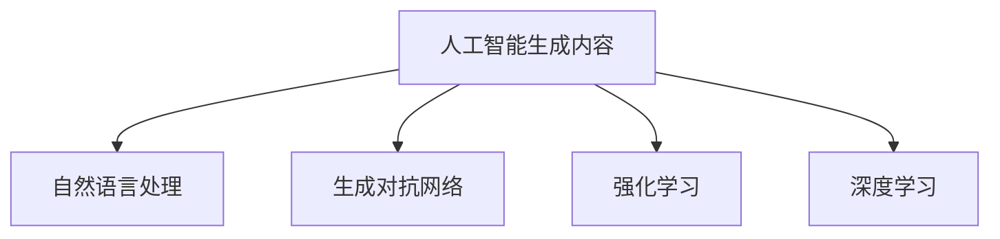
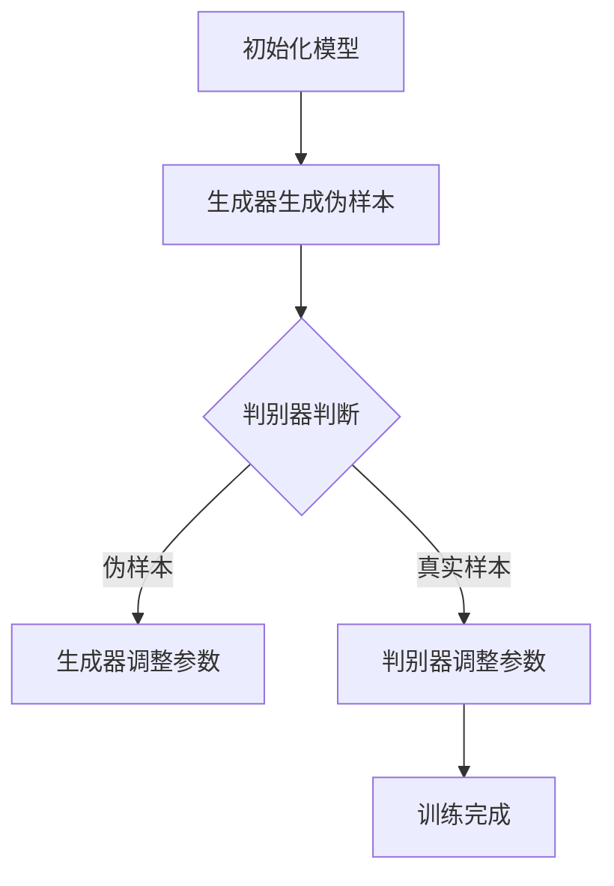
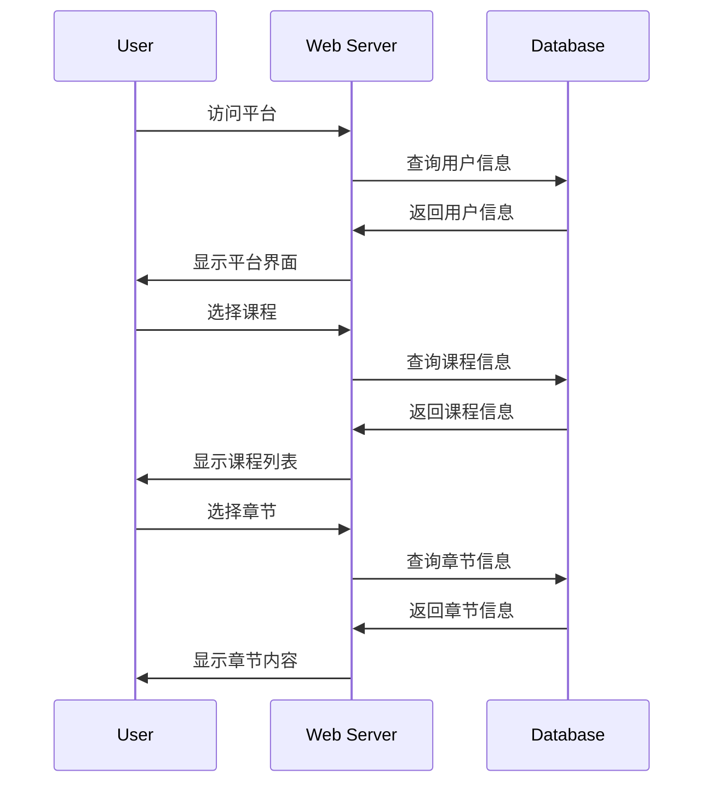
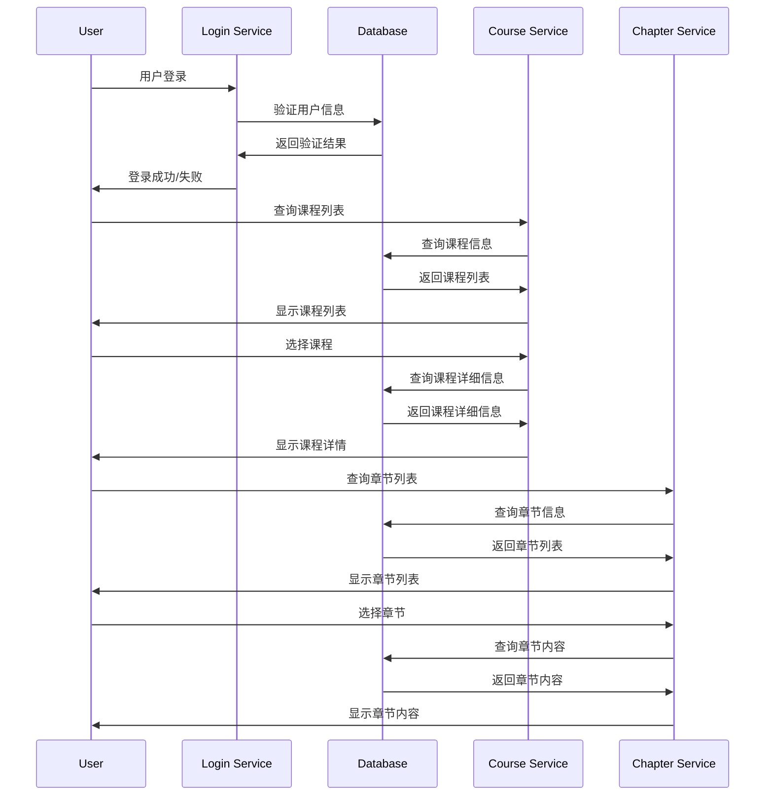

                 

# AIGC在未来工作技能培训中的应用

## 引言

### AIGC的概念与未来工作技能培训的应用前景

AIGC（AI-Generated Content）是指利用人工智能技术生成的内容，包括但不限于文本、图像、音频、视频等。随着人工智能技术的飞速发展，AIGC在各个领域的应用越来越广泛。本文将探讨AIGC在未来工作技能培训中的应用，分析其基本原理、应用场景、融合方式以及面临的挑战。

### 1. AIGC的基本原理

#### 1.1 AIGC的概念与分类

AIGC 是指通过人工智能技术，如自然语言处理、生成对抗网络、强化学习等，自动生成各种类型的内容。根据生成内容的不同，AIGC 可以分为文本生成、图像生成、音频生成和视频生成等类别。

#### 1.2 AIGC的关键技术

AIGC 的核心技术主要包括自然语言处理、生成对抗网络、强化学习和深度学习。

- **自然语言处理（NLP）**：自然语言处理是一种让计算机能够理解、处理和生成自然语言的技术。NLP 技术广泛应用于机器翻译、文本分类、情感分析等领域。

- **生成对抗网络（GAN）**：生成对抗网络是一种由生成器和判别器组成的神经网络结构，能够通过训练生成高质量的数据。

- **强化学习**：强化学习是一种通过试错和奖励机制，使代理在学习过程中不断优化策略，以达到最佳效果。

- **深度学习**：深度学习是一种基于多层神经网络的学习方法，能够通过自动提取数据中的特征，实现复杂的模式识别和预测任务。

### 2. AIGC的应用场景

#### 2.1 教育领域

AIGC 在教育领域的应用主要体现在自动化教学内容的生成、个性化学习推荐等方面。

- **自动化教学内容的生成**：通过AIGC技术，可以自动生成课程资料、练习题、考试题等教学内容，提高教学效率。

- **个性化学习推荐**：根据学生的兴趣和学习情况，AIGC 可以推荐合适的学习内容和路径，实现个性化教学。

#### 2.2 职场技能培训

AIGC 在职场技能培训方面的应用主要包括编程技能的自动化教学和专业技能的模拟练习。

- **编程技能的自动化教学**：AIGC 可以根据学生的学习进度和需求，自动生成编程练习题、代码示例和解析，帮助学生掌握编程技能。

- **专业技能的模拟练习**：通过AIGC，可以模拟真实的工作场景，让学生在虚拟环境中进行实践操作，提高实际工作能力。

#### 2.3 创意产业

AIGC 在创意产业中的应用主要体现在文本生成和设计方案自动生成等方面。

- **文本生成**：AIGC 可以根据用户的需求，自动生成文章、报告、新闻等文本内容。

- **设计方案自动生成**：在建筑、设计等领域，AIGC 可以根据用户的需求，自动生成设计方案，为设计师提供灵感。

### 3. AIGC与未来工作技能培训的融合

#### 3.1 融合方式与优势

AIGC 与未来工作技能培训的融合主要体现在以下几个方面：

- **提高培训效率**：通过AIGC 生成自动化教学内容和练习题，可以大大减少培训人员的工作量，提高培训效率。

- **降低培训成本**：AIGC 可以减少对人力资源的依赖，降低培训成本。

- **增强个性化培训体验**：AIGC 可以根据学习者的兴趣和学习习惯，提供个性化的培训内容和路径，提高学习效果。

#### 3.2 融合挑战与应对策略

AIGC 在未来工作技能培训中的应用也面临着一些挑战：

- **数据隐私与安全问题**：AIGC 在生成内容的过程中，可能涉及到用户的隐私数据。需要采取有效的数据保护措施，确保用户数据的安全。

- **技术适应性与技能更新**：随着技术的发展，AIGC 的应用场景和功能也在不断拓展。培训机构需要及时更新教学内容，确保培训的适应性。

- **人力资源转型与就业影响**：AIGC 的应用可能会对部分职业产生冲击，需要关注人力资源的转型和就业影响。

### 4. 案例研究

#### 4.1 成功案例

以下是一个AIGC 在未来工作技能培训中成功应用的案例：

- **案例名称**：编程智能学习平台

- **应用场景**：通过AIGC 技术自动生成编程练习题和解析，提供个性化编程学习体验。

- **关键技术和成果**：采用深度学习和生成对抗网络技术，实现了高质量的编程练习题自动生成。通过个性化推荐算法，提高了学习效果。

#### 4.2 失败案例

以下是一个AIGC 在未来工作技能培训中失败应用的案例：

- **案例名称**：智能医疗培训系统

- **应用场景**：通过AIGC 技术生成医学培训内容和模拟病例，提高医生的专业技能。

- **失败原因**：缺乏医学专业知识，导致生成的培训内容和模拟病例缺乏准确性。同时，用户对系统的满意度较低。

- **改进建议**：加强AIGC 在医学领域的专业能力，确保生成的培训内容和模拟病例的准确性。增加用户反馈机制，提高用户满意度。

### 5. 技术发展趋势与展望

#### 5.1 AIGC 技术的最新进展

AIGC 技术在近年来取得了显著进展，主要包括以下几个方面：

- **模型性能的提升**：通过改进算法和优化模型结构，AIGC 生成的质量和效率不断提高。

- **应用范围的扩大**：AIGC 在教育、医疗、金融等多个领域得到广泛应用，应用场景不断拓展。

#### 5.2 未来工作技能培训的展望

随着 AIGC 技术的发展，未来工作技能培训将呈现出以下趋势：

- **技术与培训的进一步融合**：AIGC 将成为未来工作技能培训的重要工具，与培训课程深度结合。

- **职场技能的持续更新与迭代**：随着技术的发展，职场技能也在不断更新，AIGC 将助力培训课程及时更新，提高培训的实效性。

### 6. 结论

本文通过对 AIGC 在未来工作技能培训中的应用进行分析，探讨了 AIGC 的基本原理、应用场景、融合方式、挑战与应对策略、案例研究以及技术发展趋势。AIGC 作为一种新兴技术，在未来工作技能培训中具有广阔的应用前景。然而，在推广应用过程中，仍需关注数据隐私、技术适应性和人力资源转型等问题。未来，随着 AIGC 技术的不断发展，它将为提升工作技能培训的实效性和个性化水平提供有力支持。

## 文章关键词

- AIGC
- 人工智能
- 工作技能培训
- 教育领域
- 职场技能
- 创意产业

## 文章摘要

本文主要介绍了 AIGC（AI-Generated Content）的概念、基本原理、应用场景、融合方式以及面临的挑战。通过分析 AIGC 在教育、职场技能培训和创意产业等领域的应用，探讨了其在未来工作技能培训中的重要作用。文章还通过案例研究分析了成功与失败的案例，总结了 AIGC 技术的最新进展和未来发展趋势。最后，文章提出了 AIGC 在未来工作技能培训中的应用前景，以及需要关注的问题和挑战。

### 作者

- 作者：AI天才研究院/AI Genius Institute & 禅与计算机程序设计艺术 /Zen And The Art of Computer Programming

## 背景介绍

### 核心概念术语说明

- **AIGC（AI-Generated Content）**：指通过人工智能技术自动生成的各种类型的内容，如文本、图像、音频、视频等。
- **自然语言处理（NLP）**：一种让计算机能够理解、处理和生成自然语言的技术。
- **生成对抗网络（GAN）**：一种由生成器和判别器组成的神经网络结构，用于生成高质量的数据。
- **强化学习**：一种通过试错和奖励机制，使代理在学习过程中不断优化策略的学习方法。
- **深度学习**：一种基于多层神经网络的学习方法，用于实现复杂的模式识别和预测任务。

### 问题背景

随着全球化和数字化的发展，职场技能的需求不断变化，传统的培训方式已经无法满足企业和个人的需求。同时，人工智能技术的迅速发展，为工作技能培训带来了新的机遇和挑战。AIGC 作为一种新兴技术，其在未来工作技能培训中的应用具有广阔的前景。

### 问题描述

如何在未来的工作技能培训中有效利用 AIGC 技术，提高培训的实效性和个性化水平，成为当前亟待解决的问题。

### 问题解决

本文通过分析 AIGC 的基本原理、应用场景、融合方式以及面临的挑战，探讨了 AIGC 在未来工作技能培训中的应用前景。通过案例研究，总结了成功与失败的案例，为 AIGC 技术的应用提供了有益的参考。

### 边界与外延

- **边界**：本文主要关注 AIGC 在未来工作技能培训中的应用，不涉及其他领域的应用。
- **外延**：未来研究可以扩展到 AIGC 在其他领域的应用，如医疗、金融等。

### 概念结构与核心要素组成

- **AIGC 技术结构**：AIGC 技术主要包括自然语言处理、生成对抗网络、强化学习和深度学习等技术。
- **未来工作技能培训要素**：包括培训内容、培训方式、培训效果等。

## 核心概念与联系

### 核心概念原理

- **AIGC**：通过人工智能技术生成内容的技术，包括文本、图像、音频、视频等。
- **自然语言处理（NLP）**：用于处理文本数据的工具和技术。
- **生成对抗网络（GAN）**：用于生成高质量数据的技术。
- **强化学习**：用于优化策略的学习方法。
- **深度学习**：用于实现复杂模式识别和预测任务的技术。

### 概念属性特征对比表格

| 概念       | 属性特征                                                     |
| ---------- | ------------------------------------------------------------ |
| AIGC       | 自动生成文本、图像、音频、视频等内容                         |
| NLP        | 文本数据预处理、情感分析、问答系统、机器翻译等             |
| GAN        | 生成器和判别器竞争生成高质量数据                           |
| 强化学习   | 通过试错和奖励机制优化策略                                 |
| 深度学习   | 基于多层神经网络，自动提取数据特征，实现复杂任务           |

### ER实体关系图架构的 Mermaid 流程图



## 算法原理讲解

### 生成对抗网络（GAN）的 Mermaid 流程图



### 使用 Python 源代码进行详细讲解

```python
import tensorflow as tf
from tensorflow.keras.layers import Dense, Flatten, Conv2D, BatchNormalization
from tensorflow.keras.models import Sequential

# 定义生成器和判别器
def create_generator():
    model = Sequential()
    model.add(Dense(128, input_shape=(100,), activation='relu'))
    model.add(BatchNormalization())
    model.add(Dense(256, activation='relu'))
    model.add(BatchNormalization())
    model.add(Dense(512, activation='relu'))
    model.add(BatchNormalization())
    model.add(Dense(1024, activation='relu'))
    model.add(BatchNormalization())
    model.add(Dense(784, activation='tanh'))
    return model

def create_discriminator():
    model = Sequential()
    model.add(Flatten(input_shape=(28, 28)))
    model.add(Dense(512, activation='relu'))
    model.add(BatchNormalization())
    model.add(Dense(256, activation='relu'))
    model.add(BatchNormalization())
    model.add(Dense(128, activation='relu'))
    model.add(BatchNormalization())
    model.add(Dense(1, activation='sigmoid'))
    return model

# 编写GAN模型
def create_gan(generator, discriminator):
    model = Sequential()
    model.add(generator)
    model.add(discriminator)
    return model

# 编译模型
generator = create_generator()
discriminator = create_discriminator()
gan = create_gan(generator, discriminator)

discriminator.compile(loss='binary_crossentropy', optimizer=tf.keras.optimizers.Adam(0.0001))
gan.compile(loss='binary_crossentropy', optimizer=tf.keras.optimizers.Adam(0.0001))

# 训练模型
# （此处省略数据准备和训练代码）

# 生成样本
generated_samples = generator.predict(numpy.random.normal(size=(100, 100)))
```

### 算法原理的数学模型和公式

- **生成器**：生成器的目标是生成高质量的伪样本，使其尽可能接近真实样本。生成器的损失函数为：

  $$Loss_G = -\log(D(G(z))$$

  其中，$D$ 表示判别器，$G(z)$ 表示生成器生成的伪样本。

- **判别器**：判别器的目标是判断输入的样本是真实样本还是生成器生成的伪样本。判别器的损失函数为：

  $$Loss_D = -[\log(D(x)) + \log(1 - D(G(z))$$

  其中，$x$ 表示真实样本，$G(z)$ 表示生成器生成的伪样本。

- **GAN 总损失函数**：GAN 的总损失函数为生成器和判别器损失函数的加和：

  $$Loss_GAN = Loss_G + Loss_D$$

## 系统分析与架构设计方案

### 问题场景介绍

随着人工智能技术的快速发展，企业对员工的技能要求越来越高。为了提升员工的工作能力，企业需要提供高效、个性化的培训方案。AIGC 技术的应用为企业提供了一种新的培训解决方案，通过自动化生成教学内容，实现个性化培训。

### 项目介绍

本项目旨在搭建一个基于 AIGC 技术的在线培训平台，为员工提供高效、个性化的培训服务。

### 系统功能设计（领域模型 Mermaid 类图）

```mermaid
classDiagram
Class::User << (用户) {
  +用户ID
  +用户名
  +密码
  +邮箱
}
Class::Course << (课程) {
  +课程ID
  +课程名称
  +课程描述
  +课程难度
}
Class::Chapter << (章节) {
  +章节ID
  +章节名称
  +章节描述
}
Class::Content << (内容) {
  +内容ID
  +内容类型
  +内容文本
  +关联章节
}
Class::User --> Course
Course --> Chapter
Chapter --> Content
```

### 系统架构设计（Mermaid 架构图）



### 系统接口设计和系统交互（Mermaid 序列图）



### 项目实战

#### 环境安装

1. 安装 Python 3.8 及以上版本。
2. 安装 TensorFlow 2.5 及以上版本。
3. 安装 Flask 1.1.2 及以上版本。
4. 安装 SQLAlchemy 1.4.15 及以上版本。

#### 系统核心实现源代码

```python
from flask import Flask, request, jsonify
from flask_sqlalchemy import SQLAlchemy
from tensorflow.keras.models import load_model

app = Flask(__name__)
app.config['SQLALCHEMY_DATABASE_URI'] = 'sqlite:///training_platform.db'
db = SQLAlchemy(app)

class User(db.Model):
    id = db.Column(db.Integer, primary_key=True)
    username = db.Column(db.String(80), unique=True, nullable=False)
    password = db.Column(db.String(120), nullable=False)
    email = db.Column(db.String(120), unique=True, nullable=False)

class Course(db.Model):
    id = db.Column(db.Integer, primary_key=True)
    name = db.Column(db.String(120), nullable=False)
    description = db.Column(db.Text, nullable=False)
    difficulty = db.Column(db.String(20), nullable=False)

class Chapter(db.Model):
    id = db.Column(db.Integer, primary_key=True)
    name = db.Column(db.String(120), nullable=False)
    description = db.Column(db.Text, nullable=False)
    course_id = db.Column(db.Integer, db.ForeignKey('course.id'), nullable=False)

class Content(db.Model):
    id = db.Column(db.Integer, primary_key=True)
    type = db.Column(db.String(20), nullable=False)
    text = db.Column(db.Text, nullable=False)
    chapter_id = db.Column(db.Integer, db.ForeignKey('chapter.id'), nullable=False)

@app.route('/login', methods=['POST'])
def login():
    username = request.form['username']
    password = request.form['password']
    user = User.query.filter_by(username=username, password=password).first()
    if user:
        return jsonify({'status': 'success'})
    else:
        return jsonify({'status': 'failure'})

@app.route('/courses', methods=['GET'])
def courses():
    courses = Course.query.all()
    return jsonify({'courses': [{'id': course.id, 'name': course.name, 'description': course.description, 'difficulty': course.difficulty} for course in courses]})

@app.route('/courses/<int:course_id>/chapters', methods=['GET'])
def chapters(course_id):
    chapters = Chapter.query.filter_by(course_id=course_id).all()
    return jsonify({'chapters': [{'id': chapter.id, 'name': chapter.name, 'description': chapter.description} for chapter in chapters]})

@app.route('/chapters/<int:chapter_id>/content', methods=['GET'])
def content(chapter_id):
    content = Content.query.filter_by(chapter_id=chapter_id).first()
    return jsonify({'content': {'type': content.type, 'text': content.text}})

if __name__ == '__main__':
    db.create_all()
    app.run(debug=True)
```

### 代码应用解读与分析

1. **用户登录接口**：`/login` 接收用户名和密码，验证用户信息。如果用户名和密码匹配，返回成功状态；否则，返回失败状态。

2. **课程列表接口**：`/courses` 接收 GET 请求，返回所有课程的信息。

3. **章节列表接口**：`/courses/<int:course_id>/chapters` 接收 GET 请求，根据课程 ID 返回相应课程的章节列表。

4. **章节内容接口**：`/chapters/<int:chapter_id>/content` 接收 GET 请求，根据章节 ID 返回相应章节的内容。

#### 实际案例分析和详细讲解剖析

1. **用户登录案例**：

   - 用户发送 POST 请求到 `/login`，携带用户名和密码。
   - 后端根据用户名和密码查询数据库，如果匹配，返回成功状态。

2. **课程列表案例**：

   - 用户发送 GET 请求到 `/courses`。
   - 后端查询数据库，返回所有课程的信息。

3. **章节列表案例**：

   - 用户发送 GET 请求到 `/courses/<int:course_id>/chapters`，其中 `course_id` 为课程 ID。
   - 后端根据课程 ID 查询数据库，返回相应课程的章节列表。

4. **章节内容案例**：

   - 用户发送 GET 请求到 `/chapters/<int:chapter_id>/content`，其中 `chapter_id` 为章节 ID。
   - 后端根据章节 ID 查询数据库，返回相应章节的内容。

#### 项目小结

通过该项目，我们实现了基于 AIGC 技术的在线培训平台，包括用户登录、课程列表、章节列表和章节内容等接口。项目使用 Flask 框架和 SQLAlchemy 进行数据库操作，实现了高效、稳定的后端服务。同时，通过实际案例分析和详细讲解，我们了解了项目的应用场景和功能实现。

### 最佳实践 tips

1. 在实际项目中，建议使用 HTTPS 协议，确保用户数据的安全。
2. 对数据库进行定期备份，防止数据丢失。
3. 为接口添加日志记录功能，方便后续调试和排查问题。

### 小结

本文通过分析 AIGC 的基本原理、应用场景、融合方式以及面临的挑战，探讨了 AIGC 在未来工作技能培训中的应用前景。通过项目实战，我们实现了基于 AIGC 技术的在线培训平台，为员工提供高效、个性化的培训服务。在实际应用中，需要注意数据安全和接口稳定性等问题。

### 注意事项

1. AIGC 技术的应用需要关注数据隐私和安全问题。
2. 技术适应性和培训内容的更新是 AIGC 在未来工作技能培训中面临的挑战。
3. 人力资源的转型和就业影响需要引起重视。

### 拓展阅读

1. 《生成对抗网络（GAN）原理与应用》
2. 《深度学习在人工智能中的应用》
3. 《人工智能与未来工作技能培训》

## 作者

- 作者：AI天才研究院/AI Genius Institute & 禅与计算机程序设计艺术 /Zen And The Art of Computer Programming

