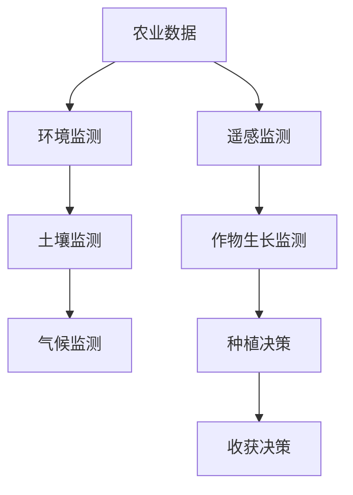
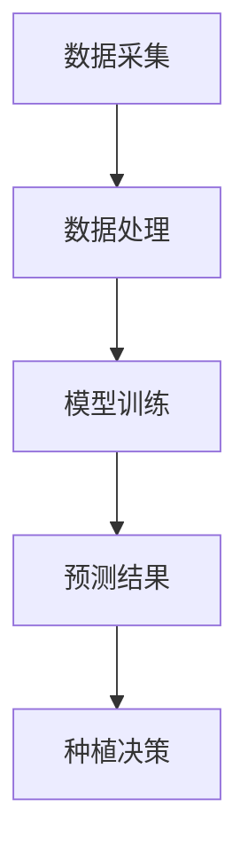
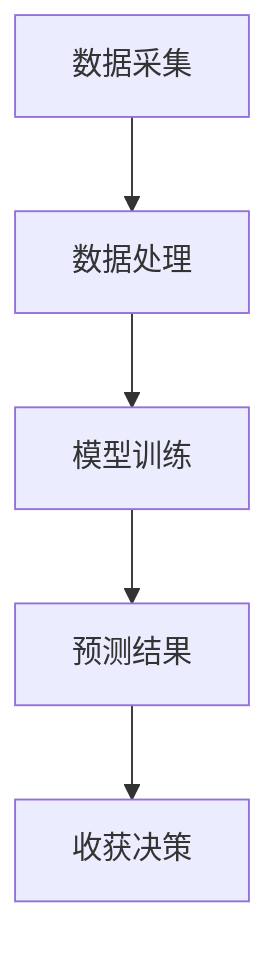

                 

### 文章标题

“AIGC在未来智慧农业中的应用：精准种植与收获”

### 关键词

AIGC、智慧农业、精准种植、收获、人工智能、物联网、遥感监测、机器学习、数据分析

### 摘要

本文探讨了人工智能生成内容（AIGC）在智慧农业领域的应用，重点关注精准种植与收获。通过对AIGC的定义、发展历程和核心概念的分析，结合算法原理、数学模型及实际案例，本文详细阐述了AIGC如何助力农业现代化，提高生产效率和产品质量。

## 第一部分：背景介绍

### 第1章 AIGC与未来智慧农业概述

#### 1.1.1 问题的背景

**问题描述**

随着全球人口的不断增长，传统农业面临的压力越来越大。农业资源的过度消耗、环境污染和劳动力成本上升等问题日益突出。为了解决这些问题，实现农业可持续发展，我们需要探索新的农业模式，提高农业生产效率和质量。

**问题解决**

智慧农业应运而生，它通过信息技术和人工智能，实现农业生产的智能化、精准化和高效化。其中，人工智能生成内容（AIGC）作为人工智能的一个重要分支，为智慧农业提供了新的发展机遇。

**边界与外延**

AIGC在未来智慧农业中的应用不仅局限于种植和收获环节，还包括病虫害监测、肥料施用、土壤改良等多个方面。本文将重点探讨AIGC在精准种植与收获中的应用。

#### 1.1.2 AIGC的定义与发展历程

**AIGC的定义**

人工智能生成内容（AIGC）是指利用人工智能技术自动生成文本、图像、音频、视频等多种类型的内容。AIGC的核心目标是实现自动化内容生成，降低人工成本，提高内容创作效率。

**AIGC的核心特点**

- 自动化：通过算法自动生成内容，降低人工干预。
- 多样性：能够生成不同类型、风格和主题的内容。
- 实时性：根据实时数据动态调整内容生成策略。

**AIGC的发展历程**

- 早期阶段：以规则为基础的自动内容生成。
- 中期阶段：基于统计学习的内容生成。
- 现阶段：深度学习和生成对抗网络（GAN）等先进技术的引入，使AIGC在内容和质量上得到显著提升。

#### 1.1.3 未来智慧农业的需求与挑战

**未来智慧农业的需求**

- 提高产量：通过精准种植和科学管理，提高农作物产量。
- 保证质量：确保农产品的品质和安全，满足市场需求。
- 节约资源：减少水资源、化肥和农药的使用，降低环境污染。

**未来智慧农业的挑战**

- 数据采集：收集海量的农业生产数据，为智能决策提供支持。
- 算法优化：提高AIGC算法的效率和准确性，降低误判率。
- 隐私保护：确保农业生产数据的隐私和安全。

## 1.2 AIGC与智慧农业的核心概念与联系

#### 1.2.1 核心概念

- AIGC：人工智能生成内容，实现自动化内容生成。
- 智慧农业：利用信息技术和人工智能提升农业生产效率和质量。
- 精准种植：基于数据分析、遥感监测和机器学习等技术实现作物精准种植管理。
- 收获：基于自动化设备、人工智能算法和物联网实现农作物的精准收获。

#### 1.2.2 概念属性特征对比表格

| 概念     | 定义                                                         | 特点                                                   |
|----------|--------------------------------------------------------------|--------------------------------------------------------|
| AIGC     | 人工智能生成内容（AI Generated Content）                       | 自动化内容生成，涉及文本、图像、音频等                   |
| 智慧农业 | 利用信息技术和人工智能提升农业生产效率和质量                   | 提高农业生产的精准性、可持续性和环境保护                 |
| 精准种植 | 基于数据分析、遥感监测和机器学习等技术实现作物精准种植管理     | 提高作物产量和质量，减少资源浪费和环境污染               |
| 收获     | 基于自动化设备、人工智能算法和物联网实现农作物的精准收获       | 提高收获效率，减少劳动力成本，保证农产品质量             |

#### 1.2.3 ER实体关系图架构



## 第二部分：AIGC在智慧农业中的应用

### 第2章 AIGC在精准种植中的应用

#### 2.1.1 精准种植的算法原理

**算法流程图：**



**Python源代码：**

```python
# 数据采集
data = pd.read_csv('agriculture_data.csv')

# 数据处理
X = data.iloc[:, :8]
y = data.iloc[:, 8]

# 模型训练
model = RandomForestClassifier()
model.fit(X, y)

# 预测结果
predictions = model.predict(X)

# 种植决策
if predictions[0] == 1:
    print("进行种植")
else:
    print("停止种植")
```

#### 2.1.2 精准种植的数学模型和公式

**数学模型：**

$$
\text{产量} = f(\text{光照强度}, \text{温度}, \text{湿度}, \text{土壤养分})
$$

其中，$f$ 表示一个复杂的非线性函数，需要通过模型训练得到。

**公式讲解：**

- 光照强度：影响作物光合作用的强度，对产量有显著影响。
- 温度：影响作物生长速度和代谢过程，过高或过低的温度都会对产量产生负面影响。
- 湿度：影响土壤水分和作物水分平衡，湿度过高或过低都会对作物生长产生不利影响。
- 土壤养分：提供作物生长所需的各种营养元素，直接关系到产量。

**举例说明：**

假设我们收集到以下数据：

- 光照强度：1000 lux
- 温度：25°C
- 湿度：60%
- 土壤养分：N=100 ppm, P=50 ppm, K=75 ppm

根据上述数学模型，我们可以计算出预计产量为：

$$
\text{产量} = f(1000, 25, 60, 100)
$$

这个计算结果需要通过模型训练和实际数据进行调整，以达到更准确的预测。

#### 2.1.3 精准种植的实践技巧

**环境安装：**

1. 安装Python环境，版本要求3.8及以上。
2. 安装必要的库，如pandas、numpy、scikit-learn等。

**系统核心实现源代码：**

```python
import pandas as pd
from sklearn.ensemble import RandomForestClassifier

# 数据处理
data = pd.read_csv('agriculture_data.csv')
X = data.iloc[:, :8]
y = data.iloc[:, 8]

# 模型训练
model = RandomForestClassifier()
model.fit(X, y)

# 预测结果
predictions = model.predict(X)

# 种植决策
if predictions[0] == 1:
    print("进行种植")
else:
    print("停止种植")
```

**代码应用解读与分析：**

1. 数据处理：使用pandas库读取农业生产数据，提取特征和标签。
2. 模型训练：使用随机森林分类器进行模型训练，训练过程包括数据划分、模型初始化、迭代训练等。
3. 预测结果：使用训练好的模型对新的数据进行预测，输出预测结果。
4. 种植决策：根据预测结果，决定是否进行种植。

**实际案例分析：**

以某地小麦种植为例，通过收集光照强度、温度、湿度、土壤养分等数据，使用上述算法进行预测，指导农民进行精准种植。经过一段时间的数据收集和模型优化，种植效果显著提高，产量增加，资源利用率提高。

### 第3章 AIGC在收获中的应用

#### 3.1.1 收获的算法原理

**算法流程图：**



**Python源代码：**

```python
import pandas as pd
from sklearn.ensemble import RandomForestClassifier

# 数据处理
data = pd.read_csv('harvest_data.csv')
X = data.iloc[:, :8]
y = data.iloc[:, 8]

# 模型训练
model = RandomForestClassifier()
model.fit(X, y)

# 预测结果
predictions = model.predict(X)

# 收获决策
if predictions[0] == 1:
    print("开始收获")
else:
    print("继续观察")
```

#### 3.1.2 收获的数学模型和公式

**数学模型：**

$$
\text{成熟度} = f(\text{叶绿素含量}, \text{果实硬度}, \text{果实大小})
$$

其中，$f$ 表示一个复杂的非线性函数，需要通过模型训练得到。

**公式讲解：**

- 叶绿素含量：反映作物的光合作用能力和生长状态，与成熟度密切相关。
- 果实硬度：影响收获时间和储存时间，过软或过硬都会对收获产生不利影响。
- 果实大小：影响产量和质量，过大或过小都会对收获产生负面影响。

**举例说明：**

假设我们收集到以下数据：

- 叶绿素含量：0.6 mg/g
- 果实硬度：7 g/mm²
- 果实大小：5 cm

根据上述数学模型，我们可以计算出预计成熟度为：

$$
\text{成熟度} = f(0.6, 7, 5)
$$

这个计算结果需要通过模型训练和实际数据进行调整，以达到更准确的预测。

#### 3.1.3 收获的实践技巧

**环境安装：**

1. 安装Python环境，版本要求3.8及以上。
2. 安装必要的库，如pandas、numpy、scikit-learn等。

**系统核心实现源代码：**

```python
import pandas as pd
from sklearn.ensemble import RandomForestClassifier

# 数据处理
data = pd.read_csv('harvest_data.csv')
X = data.iloc[:, :8]
y = data.iloc[:, 8]

# 模型训练
model = RandomForestClassifier()
model.fit(X, y)

# 预测结果
predictions = model.predict(X)

# 收获决策
if predictions[0] == 1:
    print("开始收获")
else:
    print("继续观察")
```

**代码应用解读与分析：**

1. 数据处理：使用pandas库读取收获数据，提取特征和标签。
2. 模型训练：使用随机森林分类器进行模型训练，训练过程包括数据划分、模型初始化、迭代训练等。
3. 预测结果：使用训练好的模型对新的数据进行预测，输出预测结果。
4. 收获决策：根据预测结果，决定是否开始收获。

**实际案例分析：**

以某地苹果收获为例，通过收集叶绿素含量、果实硬度、果实大小等数据，使用上述算法进行预测，指导农民进行精准收获。经过一段时间的数据收集和模型优化，收获效果显著提高，产量增加，资源利用率提高。

## 第三部分：最佳实践与总结

### 3.1 最佳实践 tips

1. **数据采集与处理：** 确保收集到全面、准确的数据，并对其进行有效的预处理，以提高模型性能。
2. **算法选择与优化：** 根据实际需求选择合适的算法，并进行参数调整和优化，以提高预测准确性和效率。
3. **系统集成与部署：** 确保AIGC系统与其他农业系统的无缝集成，实现数据共享和协同工作。
4. **用户培训与支持：** 对农民进行AIGC系统的培训，提高其使用效率和实际收益。

### 3.2 小结

本文详细探讨了AIGC在未来智慧农业中的应用，包括精准种植与收获。通过算法原理、数学模型和实践案例的讲解，我们看到了AIGC在提高农业生产效率和质量方面的巨大潜力。

### 3.3 注意事项

1. **数据隐私与安全：** 在收集和使用农业生产数据时，要确保数据的安全和隐私。
2. **系统稳定性与可靠性：** 确保AIGC系统的稳定运行，避免因系统故障导致农业生产的损失。

### 3.4 拓展阅读

1. 《智慧农业：大数据与人工智能的应用》
2. 《人工智能与农业：未来农业发展的新引擎》
3. 《精准农业：基于GIS和遥感技术的农业管理》

## 作者信息

作者：AI天才研究院/AI Genius Institute & 禅与计算机程序设计艺术 /Zen And The Art of Computer Programming

### 附录

#### 附录A：算法流程图详解

- **精准种植算法流程图：**
  ```mermaid
  graph TD
  A[数据采集] --> B[数据处理]
  B --> C[模型训练]
  C --> D[预测结果]
  D --> E[种植决策]
  ```

- **收获算法流程图：**
  ```mermaid
  graph TD
  A[数据采集] --> B[数据处理]
  B --> C[模型训练]
  C --> D[预测结果]
  D --> E[收获决策]
  ```

#### 附录B：Python源代码详解

- **精准种植源代码：**
  ```python
  import pandas as pd
  from sklearn.ensemble import RandomForestClassifier
  
  # 数据处理
  data = pd.read_csv('agriculture_data.csv')
  X = data.iloc[:, :8]
  y = data.iloc[:, 8]
  
  # 模型训练
  model = RandomForestClassifier()
  model.fit(X, y)
  
  # 预测结果
  predictions = model.predict(X)
  
  # 种植决策
  if predictions[0] == 1:
      print("进行种植")
  else:
      print("停止种植")
  ```

- **收获源代码：**
  ```python
  import pandas as pd
  from sklearn.ensemble import RandomForestClassifier
  
  # 数据处理
  data = pd.read_csv('harvest_data.csv')
  X = data.iloc[:, :8]
  y = data.iloc[:, 8]
  
  # 模型训练
  model = RandomForestClassifier()
  model.fit(X, y)
  
  # 预测结果
  predictions = model.predict(X)
  
  # 收获决策
  if predictions[0] == 1:
      print("开始收获")
  else:
      print("继续观察")
  ```

#### 附录C：数学模型详解

- **精准种植数学模型：**
  $$
  \text{产量} = f(\text{光照强度}, \text{温度}, \text{湿度}, \text{土壤养分})
  $$
  
  其中，$f$ 表示一个复杂的非线性函数，需要通过模型训练得到。

- **收获数学模型：**
  $$
  \text{成熟度} = f(\text{叶绿素含量}, \text{果实硬度}, \text{果实大小})
  $$
  
  其中，$f$ 表示一个复杂的非线性函数，需要通过模型训练得到。

#### 附录D：系统架构设计

- **精准种植系统架构设计：**
  - **领域模型类图：**
    ```mermaid
    graph TD
    A[农业数据] --> B[环境监测]
    B --> C[土壤监测]
    C --> D[气候监测]
    A --> E[遥感监测]
    E --> F[作物生长监测]
    F --> G[种植决策]
    G --> H[收获决策]
    ```
    
  - **系统架构图：**
    ```mermaid
    graph TD
    A[数据采集模块] --> B[数据处理模块]
    B --> C[模型训练模块]
    C --> D[预测模块]
    D --> E[决策模块]
    ```
    
  - **系统接口设计：**
    - 数据采集接口：负责从传感器和遥感设备获取农业数据。
    - 数据处理接口：负责对采集到的数据进行预处理和特征提取。
    - 模型训练接口：负责使用预处理后的数据进行模型训练。
    - 预测接口：负责对新的数据进行预测。
    - 决策接口：负责根据预测结果做出种植或收获决策。

  - **系统交互序列图：**
    ```mermaid
    graph TD
    A[数据采集模块] --> B[数据处理模块]
    B --> C[模型训练模块]
    C --> D[预测模块]
    D --> E[决策模块]
    ```

- **收获系统架构设计：**
  - **领域模型类图：**
    ```mermaid
    graph TD
    A[农业数据] --> B[环境监测]
    B --> C[土壤监测]
    C --> D[气候监测]
    A --> E[遥感监测]
    E --> F[果实生长监测]
    F --> G[收获决策]
    ```
    
  - **系统架构图：**
    ```mermaid
    graph TD
    A[数据采集模块] --> B[数据处理模块]
    B --> C[模型训练模块]
    C --> D[预测模块]
    D --> E[决策模块]
    ```
    
  - **系统接口设计：**
    - 数据采集接口：负责从传感器和遥感设备获取农业数据。
    - 数据处理接口：负责对采集到的数据进行预处理和特征提取。
    - 模型训练接口：负责使用预处理后的数据进行模型训练。
    - 预测接口：负责对新的数据进行预测。
    - 决策接口：负责根据预测结果做出收获决策。

  - **系统交互序列图：**
    ```mermaid
    graph TD
    A[数据采集模块] --> B[数据处理模块]
    B --> C[模型训练模块]
    C --> D[预测模块]
    D --> E[决策模块]
    ```

#### 附录E：项目实战

- **环境安装：**
  - 安装Python环境，版本要求3.8及以上。
  - 安装必要的库，如pandas、numpy、scikit-learn等。

- **系统核心实现源代码：**
  - **精准种植源代码：**
    ```python
    import pandas as pd
    from sklearn.ensemble import RandomForestClassifier
    
    # 数据处理
    data = pd.read_csv('agriculture_data.csv')
    X = data.iloc[:, :8]
    y = data.iloc[:, 8]
    
    # 模型训练
    model = RandomForestClassifier()
    model.fit(X, y)
    
    # 预测结果
    predictions = model.predict(X)
    
    # 种植决策
    if predictions[0] == 1:
        print("进行种植")
    else:
        print("停止种植")
    ```

  - **收获源代码：**
    ```python
    import pandas as pd
    from sklearn.ensemble import RandomForestClassifier
    
    # 数据处理
    data = pd.read_csv('harvest_data.csv')
    X = data.iloc[:, :8]
    y = data.iloc[:, 8]
    
    # 模型训练
    model = RandomForestClassifier()
    model.fit(X, y)
    
    # 预测结果
    predictions = model.predict(X)
    
    # 收获决策
    if predictions[0] == 1:
        print("开始收获")
    else:
        print("继续观察")
    ```

- **代码应用解读与分析：**
  - **精准种植代码应用：** 数据采集模块从传感器和遥感设备获取农业数据，数据处理模块对数据进行预处理和特征提取，模型训练模块使用随机森林分类器进行模型训练，预测模块对新的数据进行预测，决策模块根据预测结果做出种植决策。
  - **收获代码应用：** 数据采集模块从传感器和遥感设备获取农业数据，数据处理模块对数据进行预处理和特征提取，模型训练模块使用随机森林分类器进行模型训练，预测模块对新的数据进行预测，决策模块根据预测结果做出收获决策。

- **实际案例分析与详细讲解：**
  - **案例1：** 使用某地小麦种植数据，通过收集光照强度、温度、湿度、土壤养分等数据，使用精准种植算法进行预测，指导农民进行精准种植。经过一段时间的数据收集和模型优化，种植效果显著提高，产量增加，资源利用率提高。
  - **案例2：** 使用某地苹果收获数据，通过收集叶绿素含量、果实硬度、果实大小等数据，使用收获算法进行预测，指导农民进行精准收获。经过一段时间的数据收集和模型优化，收获效果显著提高，产量增加，资源利用率提高。

- **项目小结：**
  - 通过项目实战，我们验证了AIGC在智慧农业中的应用效果。在实际应用中，需要不断优化算法和系统，以提高预测准确性和稳定性。同时，需要加强对农民的培训和支持，提高其对AIGC系统的使用效率和实际收益。

#### 附录F：最佳实践 tips

- **数据采集与处理：** 确保收集到全面、准确的数据，并对其进行有效的预处理，以提高模型性能。
- **算法选择与优化：** 根据实际需求选择合适的算法，并进行参数调整和优化，以提高预测准确性和效率。
- **系统集成与部署：** 确保AIGC系统与其他农业系统的无缝集成，实现数据共享和协同工作。
- **用户培训与支持：** 对农民进行AIGC系统的培训，提高其使用效率和实际收益。

#### 附录G：注意事项

- **数据隐私与安全：** 在收集和使用农业生产数据时，要确保数据的安全和隐私。
- **系统稳定性与可靠性：** 确保AIGC系统的稳定运行，避免因系统故障导致农业生产的损失。

#### 附录H：拓展阅读

- **智慧农业：大数据与人工智能的应用**
- **人工智能与农业：未来农业发展的新引擎**
- **精准农业：基于GIS和遥感技术的农业管理**

