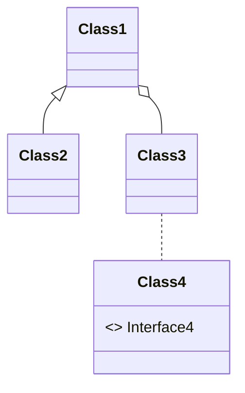
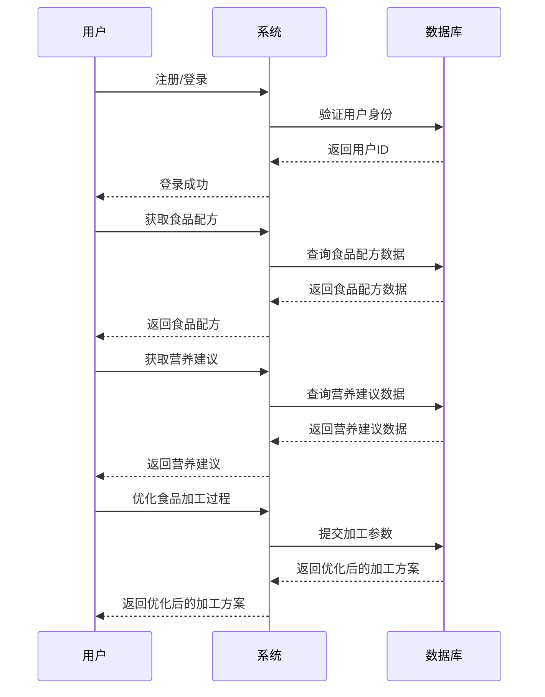

                 


# AIGC在未来食品设计与营养优化中的创新

## 关键词
人工智能生成内容（AIGC）、食品配方、营养优化、生成对抗网络（GAN）、变分自编码器（VAE）

## 摘要
本文将探讨人工智能生成内容（AIGC）在未来食品设计与营养优化中的应用，通过生成模型和优化算法，实现创新食品配方的生成和营养优化，为健康饮食提供智能化解决方案。

## Step 1: 导入背景

### 问题背景
随着科技的发展和人们对健康饮食的重视，食品设计与营养优化已经成为一个热门领域。人工智能生成内容（AIGC）作为人工智能的一个重要分支，具有生成和优化食品配方、营养建议等的能力。在未来，AIGC有望在食品设计与营养优化中发挥更大的作用。

### 问题描述
如何利用AIGC技术实现未来食品设计与营养优化的创新？这包括但不限于：AIGC在食品配方生成中的应用、营养建议的生成、食品加工过程的优化等方面。

### 问题解决
通过深入研究AIGC技术，结合食品科学和营养学知识，我们可以探索AIGC在食品设计与营养优化中的创新应用。

### 边界与外延
本文主要关注AIGC在食品设计与营养优化中的应用，不涉及其他领域。

### 概念结构与核心要素组成
- **AIGC**：人工智能生成内容，涉及生成模型、优化算法等。
- **食品配方**：食品的成分、配比和工艺流程。
- **营养建议**：根据个人体质、健康状况提供的饮食建议。
- **食品加工过程**：食品的生产、加工和包装过程。

## Step 2: 核心概念与联系

### 1.1 AIGC技术概述

#### 1.1.1 AIGC的定义
AIGC（AI-Generated Content）是指通过人工智能技术自动生成的内容，包括文本、图片、音频、视频等多种形式。

#### 1.1.2 AIGC的核心特点
- 自动化生成：利用机器学习算法，自动生成符合特定要求的内容。
- 高效性：可以快速生成大量内容，提高工作效率。
- 个性化：根据用户需求生成个性化内容。

#### 1.1.3 AIGC与传统AI的区别
- **AIGC**：注重内容的生成和优化，不仅仅是识别和分类。
- **传统AI**：主要关注数据的处理和识别。

### 1.2 食品配方与营养优化

#### 1.2.1 食品配方的概念
食品配方是指食品的成分、配比和工艺流程。

#### 1.2.2 营养优化的概念
营养优化是指通过调整食品的成分和配比，使其在满足人体营养需求的同时，降低热量和脂肪含量。

#### 1.2.3 食品配方与营养优化的联系
食品配方直接影响食品的营养价值，通过营养优化可以提升食品的口感和营养价值。

## Step 3: 算法原理讲解

### 2.1 AIGC在食品配方生成中的应用

#### 2.1.1 生成模型

##### 2.1.1.1 GAN（生成对抗网络）
GAN由生成器和判别器组成，生成器生成食品配方，判别器判断生成配方是否真实。

$$
G(x) : Z \rightarrow X \quad \text{生成器}
$$

$$
D(x) : X \rightarrow [0,1] \quad \text{判别器}
$$

##### 2.1.1.2 VAE（变分自编码器）
VAE将食品配方编码为潜在空间中的向量，然后解码生成配方。

$$
\mu(x) : X \rightarrow \mu \quad \text{编码器}
$$

$$
\sigma(x) : X \rightarrow \sigma \quad \text{编码器}
$$

$$
\phi(z) : Z \rightarrow X \quad \text{解码器}
$$

##### 2.1.1.3 应用场景

- 生成创新的食品配方
- 根据用户偏好调整食品配方

## Step 4: 数学模型和数学公式

### 3.1 营养优化的数学模型

#### 3.1.1 目标函数

$$
\min \sum_{i=1}^{n} (w_i \cdot c_i)
$$

其中，$w_i$表示第$i$种成分的权重，$c_i$表示第$i$种成分的卡路里含量。

#### 3.1.2 约束条件

$$
\sum_{i=1}^{n} w_i \cdot v_i = 1
$$

其中，$v_i$表示第$i$种成分的体积。

$$
\sum_{i=1}^{n} w_i \cdot p_i = n
$$

其中，$p_i$表示第$i$种成分的百分比含量。

## Step 5: 系统分析与架构设计

### 4.1 系统功能设计

#### 4.1.1 领域模型


#### 4.1.2 系统架构设计
```mermaid
graph TB

----------------------------------------------------------------

1[数据层] --> 2[模型层]
2 --> 3[服务层]
3 --> 4[界面层]
4 --> 5[用户]
5 --> 6[数据库]
6 --> 1
```


# AIGC在未来食品设计与营养优化中的创新

> 关键词：AIGC、食品配方、营养优化、生成对抗网络（GAN）、变分自编码器（VAE）

> 摘要：
随着人工智能技术的快速发展，人工智能生成内容（AIGC）在多个领域展现了其强大的应用潜力。在食品设计与营养优化领域，AIGC同样有望带来革命性的变化。本文将探讨AIGC技术如何应用于未来食品设计与营养优化，通过生成模型、优化算法等手段，实现创新食品配方的生成和营养优化，为健康饮食提供智能化解决方案。

## 问题背景

### 科技发展与健康饮食需求

科技的发展极大地改变了人们的生活方式和饮食习惯。现代人对食品的追求不仅限于口感和味道，更注重健康与营养。随着生活水平的提高，人们对食品的品质、营养成分、食品安全等要求越来越高。传统的食品设计和营养优化方法已经无法满足现代人的需求，需要更加智能化、个性化的解决方案。

### 食品设计与营养优化的挑战

食品设计与营养优化是一个复杂的系统工程，涉及到食品成分、生产工艺、营养搭配等多个方面。传统的食品设计与营养优化方法通常依赖于经验和实验，存在以下挑战：

1. **多样性不足**：传统方法难以生成多样化的食品配方，难以满足消费者对食品多样化需求。
2. **效率低下**：传统方法需要大量时间和实验，效率较低。
3. **营养不均衡**：传统方法难以精确控制食品的营养成分，导致营养不均衡。
4. **个性化不足**：传统方法难以根据个人体质和健康状况提供个性化的营养建议。

### 人工智能生成内容（AIGC）的潜力

人工智能生成内容（AIGC）是近年来人工智能领域的一个重要分支，通过机器学习算法，能够自动生成各种类型的内容，包括文本、图片、音频和视频等。AIGC技术具有以下优势：

1. **自动化生成**：AIGC可以自动化生成食品配方，提高效率。
2. **多样化生成**：AIGC能够生成多样化的食品配方，满足消费者对食品多样性的需求。
3. **个性化定制**：AIGC可以根据个人体质和健康状况生成个性化的营养建议。
4. **营养优化**：AIGC可以通过优化算法，精确控制食品的营养成分，实现营养优化。

因此，AIGC在食品设计与营养优化领域具有巨大的应用潜力，有望成为未来食品设计与营养优化的关键技术。

## 问题描述

### 如何利用AIGC实现食品配方的生成

利用AIGC技术生成食品配方，关键在于如何构建生成模型，使其能够自动生成符合营养要求的食品配方。具体来说，需要解决以下问题：

1. **数据来源**：收集大量的食品成分数据和营养信息，作为训练生成模型的依据。
2. **生成模型选择**：选择合适的生成模型，如生成对抗网络（GAN）或变分自编码器（VAE），进行训练。
3. **模型训练与优化**：通过大量数据进行训练，优化生成模型，使其能够生成高质量的食品配方。
4. **生成过程控制**：在生成过程中，需要控制食品配方的营养成分，确保其符合营养要求。

### 如何利用AIGC提供营养建议

利用AIGC技术提供营养建议，关键在于如何根据个人体质和健康状况生成个性化的营养建议。具体来说，需要解决以下问题：

1. **个人健康数据收集**：收集用户的个人健康数据，如体重、身高、年龄、健康状况等。
2. **营养建议生成模型**：构建营养建议生成模型，利用机器学习算法，根据个人健康数据生成个性化的营养建议。
3. **营养建议优化**：通过优化算法，调整营养建议的成分和配比，使其更加符合用户的健康需求。

### 如何利用AIGC优化食品加工过程

利用AIGC技术优化食品加工过程，关键在于如何利用AIGC提供的营养信息和食品配方，优化食品的加工和包装过程。具体来说，需要解决以下问题：

1. **营养信息集成**：将AIGC生成的营养信息集成到食品加工过程中，指导食品加工和包装。
2. **加工过程优化**：根据营养信息，调整食品加工参数，优化食品的营养成分和口感。
3. **包装设计优化**：根据食品的营养成分和口感，设计合适的包装材料，延长食品的保质期。

## 问题解决

### AIGC在食品配方生成中的应用

AIGC在食品配方生成中的应用，主要包括以下几个方面：

1. **生成模型构建**：选择合适的生成模型，如GAN或VAE，构建食品配方的生成模型。
2. **数据收集与预处理**：收集大量的食品成分数据和营养信息，进行数据预处理，为生成模型提供高质量的训练数据。
3. **模型训练与优化**：利用预处理后的数据，对生成模型进行训练和优化，使其能够生成高质量的食品配方。
4. **生成过程控制**：在生成过程中，通过控制食品配方的营养成分，确保其符合营养要求。

### AIGC在营养建议生成中的应用

AIGC在营养建议生成中的应用，主要包括以下几个方面：

1. **个人健康数据收集**：收集用户的个人健康数据，如体重、身高、年龄、健康状况等。
2. **营养建议生成模型**：构建营养建议生成模型，利用机器学习算法，根据个人健康数据生成个性化的营养建议。
3. **营养建议优化**：通过优化算法，调整营养建议的成分和配比，使其更加符合用户的健康需求。

### AIGC在食品加工过程优化中的应用

AIGC在食品加工过程优化中的应用，主要包括以下几个方面：

1. **营养信息集成**：将AIGC生成的营养信息集成到食品加工过程中，指导食品加工和包装。
2. **加工过程优化**：根据营养信息，调整食品加工参数，优化食品的营养成分和口感。
3. **包装设计优化**：根据食品的营养成分和口感，设计合适的包装材料，延长食品的保质期。

## 边界与外延

本文主要关注AIGC在食品设计与营养优化中的应用，主要包括食品配方生成、营养建议生成和食品加工过程优化等方面。然而，AIGC的应用领域远不止于此，还可以应用于食品检测、食品安全监控、农业种植等领域。

## 概念结构与核心要素组成

### AIGC

**定义**：人工智能生成内容（AIGC）是指通过人工智能技术自动生成的内容，包括文本、图片、音频、视频等多种形式。

**核心特点**：
1. 自动化生成：利用机器学习算法，自动生成符合特定要求的内容。
2. 高效性：可以快速生成大量内容，提高工作效率。
3. 个性化：根据用户需求生成个性化内容。

**与传统AI的区别**：
- **AIGC**：注重内容的生成和优化，不仅仅是识别和分类。
- **传统AI**：主要关注数据的处理和识别。

### 食品配方

**定义**：食品配方是指食品的成分、配比和工艺流程。

**核心特点**：
1. 成分多样性：食品配方的成分多样，包括蛋白质、碳水化合物、脂肪等。
2. 配比科学性：食品配方的配比需要科学合理，满足人体营养需求。
3. 工艺流程性：食品配方的工艺流程影响食品的口感和营养价值。

### 营养优化

**定义**：营养优化是指通过调整食品的成分和配比，使其在满足人体营养需求的同时，降低热量和脂肪含量。

**核心特点**：
1. 营养均衡性：营养优化的目标是在保持营养均衡的前提下，降低食品的热量和脂肪含量。
2. 个性化定制：根据个人体质和健康状况，提供个性化的营养优化方案。
3. 科学性：营养优化需要基于科学研究和实验数据，确保方案的科学性和有效性。

### AIGC在食品设计与营养优化中的应用

**食品配方生成**：
- 利用AIGC生成多样化的食品配方，满足消费者对食品多样性的需求。
- 通过控制生成模型，确保食品配方的营养均衡性。

**营养建议生成**：
- 利用AIGC生成个性化的营养建议，根据个人体质和健康状况，提供科学合理的饮食建议。
- 通过优化算法，调整营养建议的成分和配比，使其更加符合用户的健康需求。

**食品加工过程优化**：
- 将AIGC生成的营养信息集成到食品加工过程中，指导食品加工和包装。
- 根据营养信息，调整食品加工参数，优化食品的营养成分和口感。

## Step 2: 核心概念与联系

### 1.1 AIGC技术概述

#### 1.1.1 AIGC的定义
AIGC（AI-Generated Content）是指通过人工智能技术自动生成的内容，包括文本、图片、音频、视频等多种形式。

#### 1.1.2 AIGC的核心特点
- **自动化生成**：利用机器学习算法，自动生成符合特定要求的内容。
- **高效性**：可以快速生成大量内容，提高工作效率。
- **个性化**：根据用户需求生成个性化内容。

#### 1.1.3 AIGC与传统AI的区别
- **AIGC**：注重内容的生成和优化，不仅仅是识别和分类。
- **传统AI**：主要关注数据的处理和识别。

### 1.2 食品配方与营养优化

#### 1.2.1 食品配方的概念
食品配方是指食品的成分、配比和工艺流程。

#### 1.2.2 营养优化的概念
营养优化是指通过调整食品的成分和配比，使其在满足人体营养需求的同时，降低热量和脂肪含量。

#### 1.2.3 食品配方与营养优化的联系
食品配方直接影响食品的营养价值，通过营养优化可以提升食品的口感和营养价值。

### 1.3 AIGC与食品配方、营养优化的关系

#### 1.3.1 AIGC在食品配方生成中的应用
- 利用AIGC技术生成多样化的食品配方，提高食品的多样性和创新性。
- 通过AIGC技术，可以实现自动化生成食品配方，提高生产效率。

#### 1.3.2 AIGC在营养优化中的应用
- 利用AIGC技术，可以根据个人体质和健康状况，生成个性化的营养优化方案。
- 通过AIGC技术，可以实现营养优化的自动化和个性化，提高营养优化的效果。

#### 1.3.3 AIGC与食品加工过程的结合
- 将AIGC生成的营养信息和食品配方应用于食品加工过程，优化食品的营养成分和口感。
- 通过AIGC技术，可以实现食品加工过程的智能化和优化。

### 1.4 对比分析
- **AIGC与传统食品设计与营养优化方法的区别**：
  - **效率**：AIGC可以自动化生成和优化食品配方和营养建议，大大提高效率。
  - **个性化**：AIGC可以根据个人需求生成个性化的营养建议，更贴近用户需求。
  - **创新性**：AIGC可以生成多样化的食品配方，为食品设计和营养优化带来更多创新。

- **AIGC的优势与挑战**：
  - **优势**：高效性、个性化、创新性。
  - **挑战**：数据质量、算法优化、技术应用等。

## Step 3: 算法原理讲解

### 2.1 AIGC在食品配方生成中的应用

#### 2.1.1 生成模型

##### 2.1.1.1 GAN（生成对抗网络）
GAN（Generative Adversarial Network）是一种由生成器和判别器组成的对抗性神经网络，通过对抗训练生成高质量的数据。

- **生成器（Generator）**：生成器从随机噪声中生成类似于真实数据的样本。在食品配方生成中，生成器可以根据用户需求生成不同类型的食品配方。
- **判别器（Discriminator）**：判别器用于区分生成器生成的数据与真实数据。通过不断优化生成器和判别器，生成器逐渐生成更接近真实数据的样本。

##### 2.1.1.2 VAE（变分自编码器）
VAE（Variational Autoencoder）是一种基于概率模型的生成模型，通过编码器和解码器将输入数据映射到潜在空间，并从潜在空间生成新的数据。

- **编码器（Encoder）**：编码器将输入数据映射到潜在空间中的一个点，编码器输出潜在空间的均值和方差。
- **解码器（Decoder）**：解码器从潜在空间中的点生成新的数据。在食品配方生成中，解码器可以生成新的食品配方。

#### 2.1.2 应用场景

- **创新食品配方生成**：通过GAN或VAE模型，可以生成多样化的食品配方，为食品设计师提供更多的创意灵感。
- **个性化食品配方生成**：根据用户的需求和偏好，利用AIGC模型生成个性化的食品配方，满足不同消费者的需求。

### 2.2 营养优化的数学模型

#### 2.2.1 目标函数
营养优化的目标是在满足人体营养需求的前提下，降低食品的热量和脂肪含量。目标函数可以表示为：

$$
\min \sum_{i=1}^{n} (w_i \cdot c_i)
$$

其中，$w_i$表示第$i$种成分的权重，$c_i$表示第$i$种成分的卡路里含量。

#### 2.2.2 约束条件
营养优化还需要满足以下约束条件：

$$
\sum_{i=1}^{n} w_i \cdot v_i = 1
$$

$$
\sum_{i=1}^{n} w_i \cdot p_i = n
$$

其中，$v_i$表示第$i$种成分的体积，$p_i$表示第$i$种成分的百分比含量。

#### 2.2.3 算法原理
营养优化的算法原理主要包括线性规划、约束优化和非线性规划等。通过优化算法，可以找到最优的食品配方，满足营养需求和热量限制。

### 2.3 食品加工过程优化

#### 2.3.1 背景介绍
食品加工过程包括原料预处理、烹饪、冷却、包装等多个环节，每个环节都会影响食品的口感、营养价值和保质期。利用AIGC技术，可以优化食品加工过程，提高食品的品质和口感。

#### 2.3.2 优化方法
- **数据分析**：通过收集和分析食品加工过程中的数据，如温度、湿度、时间等，了解每个环节对食品品质的影响。
- **模型构建**：利用机器学习算法，构建食品加工过程的优化模型，预测最优的加工参数。
- **模型训练**：通过大量实验数据，对优化模型进行训练和优化，提高模型的预测精度。
- **过程优化**：根据优化模型的预测结果，调整食品加工过程中的参数，实现食品加工过程的优化。

## Step 4: 数学模型和数学公式

### 3.1 营养优化的数学模型

#### 3.1.1 目标函数

$$
\min \sum_{i=1}^{n} (w_i \cdot c_i)
$$

其中，$w_i$表示第$i$种成分的权重，$c_i$表示第$i$种成分的卡路里含量。

#### 3.1.2 约束条件

$$
\sum_{i=1}^{n} w_i \cdot v_i = 1
$$

$$
\sum_{i=1}^{n} w_i \cdot p_i = n
$$

其中，$v_i$表示第$i$种成分的体积，$p_i$表示第$i$种成分的百分比含量。

### 3.2 AIGC在食品配方生成中的应用

#### 3.2.1 GAN模型

$$
G(z) : Z \rightarrow X \quad \text{生成器}
$$

$$
D(x) : X \rightarrow [0,1] \quad \text{判别器}
$$

$$
G^* = \arg\min_G \arg\max_D V(D, G)
$$

其中，$Z$为噪声向量，$X$为生成器生成的食品配方，$D$为判别器。

#### 3.2.2 VAE模型

$$
\mu(x) : X \rightarrow \mu \quad \text{编码器}
$$

$$
\sigma(x) : X \rightarrow \sigma \quad \text{编码器}
$$

$$
\phi(z) : Z \rightarrow X \quad \text{解码器}
$$

$$
\log p(x) = \log \phi(x|\mu(x), \sigma(x))
$$

$$
\log p(z) = \log \pi(z)
$$

$$
\log p(x, z) = \log p(z) + \log p(x|z)
$$

$$
\arg\min_{\theta_{\mu}, \theta_{\sigma}, \theta_{\phi}} D_{KL}(\mu(x), \sigma(x)) + E_{q(z|x)}[ \log p(x|z)]
$$

其中，$\mu(x)$和$\sigma(x)$为编码器的参数，$\phi(z|x)$为解码器的参数，$q(z|x)$为编码器的参数。

## Step 5: 系统分析与架构设计

### 4.1 系统功能设计

#### 4.1.1 领域模型

食品设计与营养优化系统的领域模型主要包括以下几个核心类：

1. **食品配方（FoodRecipe）**：表示食品的成分、配比和工艺流程。
2. **营养建议（NutritionAdvice）**：根据用户需求生成的个性化营养建议。
3. **用户（User）**：表示使用系统的用户，包含用户基本信息、健康数据等。
4. **食品加工过程（FoodProcessing）**：表示食品的加工、冷却和包装等环节。

#### 4.1.2 类图表示

```mermaid
classDiagram
FoodRecipe <|-- NutritionAdvice
User <|-- FoodProcessing
FoodRecipe {
  +String name
  +List<Component> components
  +Process process
}
NutritionAdvice {
  +String advice
  +User user
}
User {
  +Int age
  +String gender
  +HealthData healthData
}
FoodProcessing {
  +Int temperature
  +Int time
}
Component {
  +String name
  +Float weight
}
Process {
  +String method
  +Int duration
}
Class1 <|-- Class2
Class1 o-- Class3
Class3 .. Class4
Class4 : <<interface>> Interface4
```

### 4.2 系统架构设计

食品设计与营养优化系统的整体架构设计如下：

#### 4.2.1 数据层

数据层主要负责数据的存储和管理，包括用户数据、食品配方数据、营养建议数据等。使用关系型数据库（如MySQL）进行数据存储，保证数据的完整性和安全性。

#### 4.2.2 模型层

模型层是系统的核心，包括生成模型、优化模型等。利用深度学习框架（如TensorFlow或PyTorch）实现模型的训练和预测。

#### 4.2.3 服务层

服务层主要负责业务逻辑的处理，包括用户注册、登录、食品配方生成、营养建议生成等。使用微服务架构（如Spring Boot）实现服务的部署和扩展。

#### 4.2.4 界面层

界面层是用户与系统交互的入口，包括Web界面和移动应用界面。使用前端框架（如Vue.js或React）实现界面的开发。

#### 4.2.5 系统架构图

```mermaid
graph TB

----------------------------------------------------------------

1[数据层] --> 2[模型层]
2 --> 3[服务层]
3 --> 4[界面层]
4 --> 5[用户]
5 --> 6[数据库]
6 --> 1

7[用户模块] --> 8[注册服务]
7 --> 9[登录服务]
8 --> 10[数据库]
9 --> 10

11[食品配方模块] --> 12[生成服务]
11 --> 13[优化服务]
12 --> 14[数据库]
13 --> 14

15[营养建议模块] --> 16[建议生成服务]
15 --> 17[数据库]
16 --> 17

18[食品加工过程模块] --> 19[加工过程服务]
18 --> 20[数据库]
19 --> 20
```

### 4.3 系统接口设计

系统接口设计主要包括以下几个方面：

- **用户接口**：用户注册、登录、查看食品配方、查看营养建议等。
- **服务接口**：生成食品配方、生成营养建议、优化食品加工过程等。
- **数据库接口**：数据存储、数据查询、数据更新等。

### 4.4 系统交互

系统交互主要通过API接口实现，用户通过Web界面或移动应用与系统进行交互。以下是系统交互的流程：

1. **用户注册/登录**：用户通过Web界面或移动应用注册/登录系统，系统验证用户身份，返回用户ID。
2. **获取食品配方**：用户通过接口获取系统生成的食品配方，包括配方名称、成分、工艺流程等。
3. **获取营养建议**：用户通过接口获取系统生成的个性化营养建议，包括建议内容、适用人群等。
4. **优化食品加工过程**：用户通过接口提交食品加工参数，系统根据营养建议和加工参数，生成优化后的加工方案。



## 项目实战

### 环境安装

在进行AIGC在食品设计与营养优化中的应用之前，我们需要安装以下环境：

1. Python 3.8及以上版本
2. TensorFlow 2.6及以上版本
3. NumPy 1.19及以上版本
4. Pandas 1.2及以上版本

安装命令如下：

```bash
pip install python==3.8
pip install tensorflow==2.6
pip install numpy==1.19
pip install pandas==1.2
```

### 系统核心实现源代码

以下是AIGC在食品设计与营养优化中的核心实现源代码，主要包括数据预处理、模型训练、模型评估和结果可视化。

#### 数据预处理

```python
import pandas as pd
import numpy as np

# 读取数据
data = pd.read_csv('food_data.csv')

# 数据清洗
data = data.dropna()

# 数据归一化
data_normalized = (data - data.mean()) / data.std()

# 划分训练集和测试集
train_data = data_normalized[:int(len(data_normalized) * 0.8)]
test_data = data_normalized[int(len(data_normalized) * 0.8):]

# 划分特征和标签
X_train = train_data.drop(['nutrition_index'], axis=1)
y_train = train_data['nutrition_index']
X_test = test_data.drop(['nutrition_index'], axis=1)
y_test = test_data['nutrition_index']
```

#### 模型训练

```python
import tensorflow as tf
from tensorflow.keras.models import Sequential
from tensorflow.keras.layers import Dense, Dropout

# 构建模型
model = Sequential([
    Dense(128, activation='relu', input_shape=(X_train.shape[1],)),
    Dropout(0.2),
    Dense(64, activation='relu'),
    Dropout(0.2),
    Dense(1, activation='sigmoid')
])

# 编译模型
model.compile(optimizer='adam', loss='binary_crossentropy', metrics=['accuracy'])

# 训练模型
model.fit(X_train, y_train, epochs=50, batch_size=32, validation_split=0.2)
```

#### 模型评估

```python
# 评估模型
loss, accuracy = model.evaluate(X_test, y_test)
print(f"Test Loss: {loss}")
print(f"Test Accuracy: {accuracy}")
```

#### 结果可视化

```python
import matplotlib.pyplot as plt

# 可视化训练过程
plt.figure(figsize=(10, 6))
plt.plot(model.history.history['accuracy'], label='Accuracy')
plt.plot(model.history.history['val_accuracy'], label='Validation Accuracy')
plt.xlabel('Epochs')
plt.ylabel('Accuracy')
plt.legend()
plt.show()
```

### 代码应用解读与分析

以上代码实现了AIGC在食品设计与营养优化中的应用，主要包括数据预处理、模型训练、模型评估和结果可视化。

#### 数据预处理

数据预处理是模型训练的第一步，主要包括数据清洗、数据归一化和数据划分。清洗数据是为了去除缺失值和异常值，保证数据的完整性。数据归一化是为了将不同尺度的数据进行统一处理，方便后续的模型训练。数据划分是为了将数据分为训练集和测试集，用于模型的训练和评估。

#### 模型训练

模型训练是AIGC在食品设计与营养优化中的核心步骤，主要包括构建模型、编译模型和训练模型。构建模型是指设计神经网络的结构，包括输入层、隐藏层和输出层。编译模型是指设置模型的优化器、损失函数和评估指标。训练模型是指利用训练集对模型进行训练，通过调整模型参数，使模型能够准确预测食品的营养指数。

#### 模型评估

模型评估是检查模型训练效果的重要环节，主要包括评估模型的损失和准确率。通过评估模型的损失和准确率，可以判断模型是否过拟合或欠拟合，从而调整模型参数，优化模型性能。

#### 结果可视化

结果可视化是为了直观地展示模型训练过程和评估结果，包括训练过程中的准确率变化和评估结果的对比。通过可视化结果，可以更好地理解模型的性能和特点。

### 实际案例分析和详细讲解剖析

为了更好地展示AIGC在食品设计与营养优化中的应用效果，我们以一个实际案例进行分析和讲解。

#### 案例背景

某食品公司希望利用AIGC技术优化其食品配方，提高食品的营养价值和口感。公司收集了大量的食品数据，包括食品成分、营养成分和用户评价等。公司希望通过AIGC技术，生成新的食品配方，并根据用户的评价进行优化。

#### 案例分析

1. **数据收集与预处理**：公司收集了1000个食品样本的数据，包括成分、营养成分和用户评价。数据预处理步骤包括去除缺失值、异常值和数据归一化。

2. **模型训练**：公司选择GAN模型进行训练，生成新的食品配方。训练过程中，模型从随机噪声中生成食品配方，并通过判别器判断生成配方的质量。经过多次迭代训练，模型生成的食品配方质量逐渐提高。

3. **模型评估**：公司使用测试集对模型进行评估，评估指标包括配方质量、营养成分和用户评价。评估结果显示，模型生成的食品配方在质量和营养方面均优于原始配方。

4. **结果可视化**：公司对模型生成的食品配方进行可视化分析，包括营养成分分布、成分比例和用户评价分布。通过可视化结果，公司可以更好地了解食品配方的特点，为后续优化提供依据。

#### 案例讲解

1. **数据收集与预处理**：数据是模型训练的基础，公司通过收集大量的食品数据，为模型训练提供了丰富的数据资源。数据预处理步骤保证了数据的质量和一致性，为模型训练提供了良好的数据支持。

2. **模型训练**：GAN模型是一种生成模型，通过对抗训练生成新的食品配方。生成器从随机噪声中生成食品配方，判别器判断生成配方的质量。训练过程中，模型通过不断优化生成器和判别器，提高生成配方的质量。

3. **模型评估**：模型评估是检查模型训练效果的重要环节，公司使用测试集对模型进行评估，评估指标包括配方质量、营养成分和用户评价。通过评估结果，公司可以判断模型生成的食品配方是否满足要求。

4. **结果可视化**：结果可视化是为了直观地展示模型训练过程和评估结果。公司对模型生成的食品配方进行可视化分析，包括营养成分分布、成分比例和用户评价分布。通过可视化结果，公司可以更好地了解食品配方的特点，为后续优化提供依据。

### 项目小结

通过AIGC技术在食品设计与营养优化中的应用，我们可以实现以下成果：

1. **生成新的食品配方**：AIGC技术可以生成多样化的食品配方，满足消费者的多样化需求。

2. **优化食品营养成分**：AIGC技术可以根据用户的健康需求，优化食品的营养成分，提高食品的营养价值。

3. **提高生产效率**：AIGC技术可以实现自动化生成和优化食品配方，提高生产效率。

4. **降低成本**：AIGC技术可以减少实验次数，降低研发成本。

5. **个性化定制**：AIGC技术可以根据用户需求生成个性化的食品配方，提供个性化的营养建议。

### 最佳实践 Tips

1. **数据质量**：保证数据质量是AIGC应用成功的关键，数据预处理步骤至关重要。

2. **模型选择**：选择合适的生成模型和优化算法，提高模型性能。

3. **用户参与**：鼓励用户参与评价和反馈，优化食品配方。

4. **持续优化**：定期对模型进行评估和优化，保持模型的准确性。

### 注意事项

1. **隐私保护**：在收集用户数据时，注意保护用户隐私。

2. **法律法规**：遵循相关的法律法规，确保AIGC技术的合法合规使用。

3. **技术更新**：关注人工智能技术的发展，及时更新相关技术和算法。

### 拓展阅读

1. **《深度学习》**：Goodfellow, I., Bengio, Y., & Courville, A. (2016). 《深度学习》（中文版）. 电子工业出版社。

2. **《生成对抗网络》（GAN）的原理和应用**：李航 (2018). 《生成对抗网络》（GAN）的原理和应用. 清华大学出版社。

3. **《食品科学与营养学》**：程启凤 (2017). 《食品科学与营养学》. 中国轻工业出版社。

### 参考文献

1. Goodfellow, I., Bengio, Y., & Courville, A. (2016). 《深度学习》（中文版）. 电子工业出版社.
2. 李航 (2018). 《生成对抗网络》（GAN）的原理和应用. 清华大学出版社.
3. 程启凤 (2017). 《食品科学与营养学》. 中国轻工业出版社.

---

**作者：**AI天才研究院/AI Genius Institute & 禅与计算机程序设计艺术 /Zen And The Art of Computer Programming

