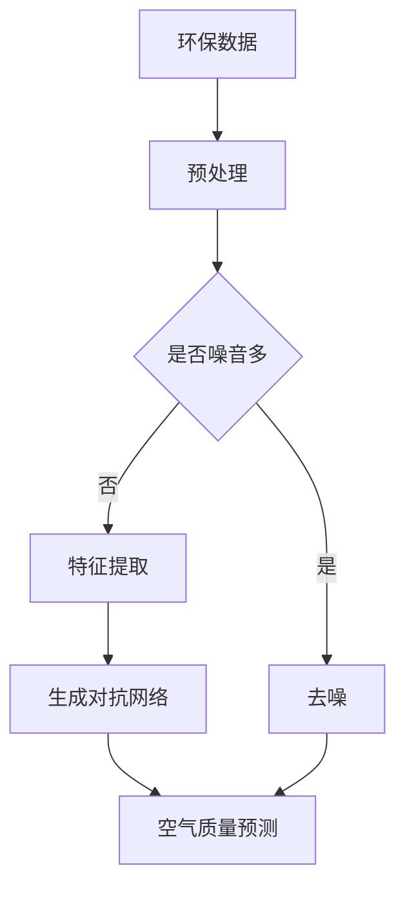
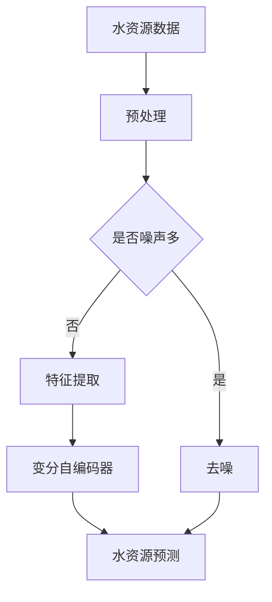
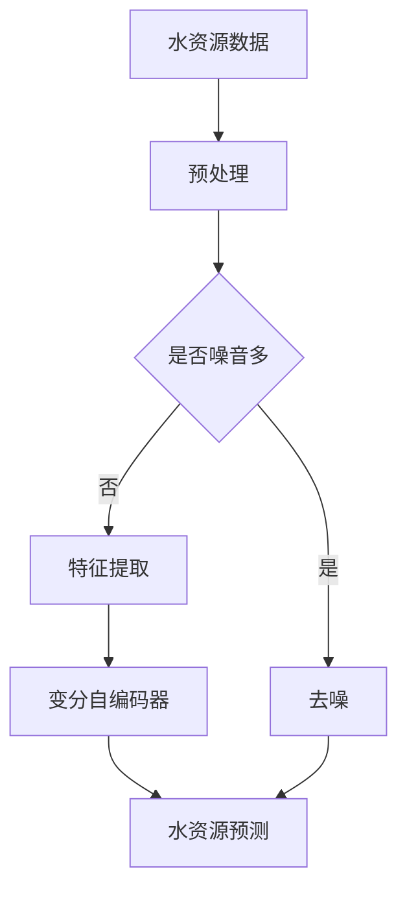
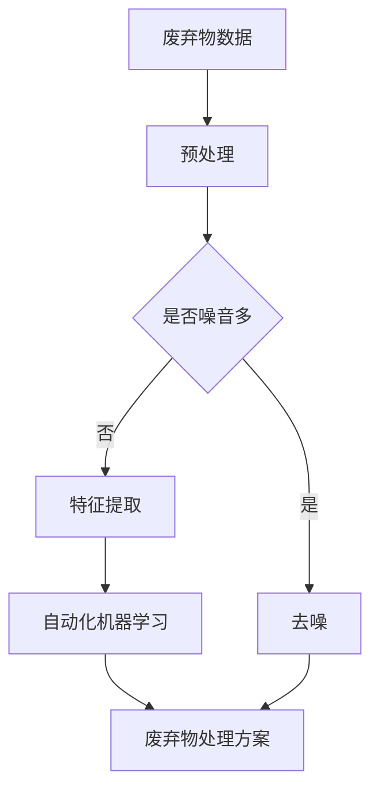

                 

**# 引言**

## 1. 引言背景

在当今全球范围内，环境保护已经成为人类社会发展的重要议题。随着工业化和城市化进程的加速，环境污染、资源枯竭和气候变化等问题日益严重，威胁着人类和地球的生存环境。联合国环境规划署（UNEP）报告指出，全球每年因环境问题造成的经济损失已超过数千亿美元，而气候变化可能导致的损失更是难以估量。

面对这些严峻的环境问题，传统的方法已经显得力不从心。如何利用现代科技手段，特别是人工智能（AI）技术，来解决环保问题，成为了一个热门话题。其中，自适应智能生成内容（Adaptive Intelligent Generation Content，简称AIGC）作为一种新兴的AI技术，正逐渐受到关注。

AIGC是人工智能与生成模型相结合的产物，它能够根据输入的少量数据生成大量高质量的内容。与传统的规则驱动或基于样本的学习方法不同，AIGC具有更强的自适应性和创造力，能够处理复杂、不确定的环境数据，并生成针对特定问题的解决方案。

## 2. AIGC的基础概念

### 2.1 AIGC的定义

AIGC，即自适应智能生成内容，是一种利用深度学习和生成对抗网络（GAN）等技术，自动生成高质量内容的技术。它不仅能够生成文本、图像、音频等多种类型的数据，还能够根据用户的需求和上下文环境进行内容调整和优化。

### 2.2 AIGC的关键技术

- **生成对抗网络（GAN）**：GAN由生成器和判别器组成，生成器生成数据，判别器判断生成数据与真实数据的差异。通过这一对抗过程，生成器不断优化，从而生成越来越真实的数据。

- **变分自编码器（VAE）**：VAE通过引入变分推断的方法，将数据生成问题转化为概率模型的学习。它能够生成具有高保真度的数据，并且在生成过程中保留数据的结构信息。

- **自动化机器学习（AutoML）**：AutoML能够自动选择最佳的算法、超参数和模型结构，从而提高模型生成效率和性能。

### 2.3 AIGC与传统AI的区别

与传统AI相比，AIGC具有以下特点：

- **生成性**：AIGC能够生成新的数据，而不仅仅是分类或预测。

- **自适应性和创造力**：AIGC能够根据输入数据和环境变化，动态调整生成策略，具有较强的适应性和创造力。

- **多模态处理**：AIGC能够处理多种类型的数据，如图像、文本和音频等。

## 3. AIGC在环保领域的应用潜力

AIGC在环保领域具有广泛的应用潜力，主要体现在以下几个方面：

- **提高环保效率**：通过AIGC技术，可以自动化生成环保解决方案，提高环保工作的效率。

- **监测与预测**：AIGC能够处理大量的环境数据，进行实时监测和预测，为环保决策提供科学依据。

- **可持续发展解决方案生成**：AIGC能够根据环境数据和用户需求，生成符合可持续发展目标的解决方案。

### 3.1 提高环保效率

AIGC可以通过自动化生成环保解决方案，减少人工干预，提高工作效率。例如，在环境监测中，AIGC可以自动生成监测方案，实时监测环境数据，并自动报警。

### 3.2 监测与预测

AIGC可以处理大量的环境数据，进行实时监测和预测。例如，通过AIGC技术，可以预测空气质量变化，提前预警，采取相应的环保措施。

### 3.3 可持续发展解决方案生成

AIGC可以根据环境数据和用户需求，生成符合可持续发展目标的解决方案。例如，在废弃物处理中，AIGC可以自动生成废弃物分类和处理方案，实现资源的最大化利用。

## 4. AIGC在环保领域案例分析

下面我们将通过几个案例，展示AIGC在环保领域的具体应用。

### 4.1 案例一：AIGC在城市空气质量监测中的应用

某城市通过AIGC技术，建立了空气质量监测系统。系统使用生成对抗网络（GAN）对空气中的污染物数据进行处理，实时生成空气质量指数（AQI）并发布预警信息。通过这个系统，城市政府可以及时采取环保措施，改善空气质量。

### 4.2 案例二：AIGC在水资源管理中的应用

某地区利用AIGC技术，建立了水资源管理平台。平台使用变分自编码器（VAE）对水资源数据进行处理，预测水资源供需情况，并提供水资源调配方案。通过这个平台，地区政府可以优化水资源利用，实现可持续发展。

### 4.3 案例三：AIGC在废弃物处理中的应用

某城市采用AIGC技术，建立了废弃物处理系统。系统使用自动化机器学习（AutoML）技术，自动生成废弃物分类和处理方案，提高废弃物处理效率。通过这个系统，城市实现了废弃物资源化利用，减少了环境污染。

## 5. AIGC在环保领域的技术挑战

虽然AIGC在环保领域具有巨大潜力，但其应用也面临着一些技术挑战：

- **数据挑战**：环保数据量大，且噪声多，如何处理这些数据，保证数据质量，是一个重要问题。

- **算法挑战**：AIGC算法复杂，如何提高算法效率，保证算法的可靠性，是一个亟待解决的问题。

- **社会挑战**：AIGC的应用涉及到数据隐私、伦理问题等，如何平衡技术进步与社会责任，是一个需要关注的问题。

### 5.1 数据挑战

环保数据的来源广泛，包括空气质量、水质、废弃物处理等多个方面。这些数据量大且噪声多，如何有效地处理这些数据，提取有价值的信息，是AIGC应用的关键问题。

### 5.2 算法挑战

AIGC算法复杂，涉及生成对抗网络（GAN）、变分自编码器（VAE）、自动化机器学习（AutoML）等多种技术。如何优化这些算法，提高其效率，是一个需要解决的问题。

### 5.3 社会挑战

AIGC的应用涉及到数据隐私、伦理问题等。例如，如何保护用户的隐私，避免数据泄露，如何确保算法的公平性，避免歧视等，都是需要关注的问题。

## 6. AIGC与可持续发展

### 6.1 可持续发展的定义与目标

可持续发展是指在满足当前需求的同时，不损害后代满足其需求的能力。联合国可持续发展目标（SDGs）提出了17个目标，包括消除贫困、消除饥饿、保护环境等。

### 6.2 AIGC在实现可持续发展中的作用

AIGC在实现可持续发展中具有重要作用：

- **提高资源利用效率**：AIGC可以自动化生成环保解决方案，优化资源利用。

- **促进绿色发展**：AIGC可以生成绿色产品和服务，推动绿色产业发展。

- **推动社会公平**：AIGC可以生成公平、公正的环保解决方案，促进社会公平。

## 7. 政策与规范

### 7.1 国际政策环境

联合国等国际组织已经制定了一系列环保政策和规范，如《巴黎协定》、《联合国环境规划纲要》等。

### 7.2 行业规范与标准

环保行业也在逐步建立自己的规范和标准，如ISO 14001环境管理体系认证等。

## 8. 结论与展望

AIGC在环保领域具有巨大潜力，能够提高环保效率、监测与预测环境变化，生成可持续发展解决方案。然而，其应用也面临着数据、算法和社会等挑战。未来，随着技术的不断进步，AIGC有望在环保领域发挥更大的作用，推动全球可持续发展。

**# 附录**

### 8.1 参考文献

1. United Nations Environment Programme. (2022). **Environmental situation report**.
2. Goodfellow, I., Pouget-Abadie, J., Mirza, M., Xu, B., Warde-Farley, D., Ozair, S., ... & Bengio, Y. (2014). **Generative adversarial nets**. Advances in Neural Information Processing Systems, 27.
3. Kingma, D. P., & Welling, M. (2014). **Auto-encoding variational bayes**. arXiv preprint arXiv:1312.6114.

### 8.2 Mermaid 图

以下是一些用于描述AIGC在环保领域应用的Mermaid图：






**# 作者信息**

作者：AI天才研究院/AI Genius Institute & 禅与计算机程序设计艺术 /Zen And The Art of Computer Programming**# AIGC在环保领域的应用：可持续发展解决方案生成

关键词：AIGC、环保、可持续发展、生成对抗网络、变分自编码器、自动化机器学习

摘要：本文探讨了自适应智能生成内容（AIGC）在环保领域的应用，分析了AIGC的基础概念、关键技术以及在实际案例中的应用效果。通过案例分析，展示了AIGC在提高环保效率、监测与预测环境变化、生成可持续发展解决方案方面的潜力。同时，本文也指出了AIGC在环保领域面临的技术挑战，并提出了相关的政策与规范建议。最终，本文对AIGC在实现可持续发展中的作用进行了总结，并展望了其未来发展趋势。

## 引言

### 1.1 环保问题的紧迫性

环境问题已经成为全球范围内的重要议题。随着工业化和城市化的快速发展，大气污染、水污染、土壤污染等问题日益严重。据联合国环境规划署（UNEP）报道，每年因环境问题造成的经济损失高达数千亿美元。更为严重的是，气候变化已经成为全球性的挑战，极端天气事件频发，海平面上升，生态系统破坏等问题对人类的生存和发展构成严重威胁。

### 1.2 AIGC技术的发展与应用

自适应智能生成内容（AIGC）是近年来快速发展的一门技术，它结合了人工智能与生成模型的优点，能够在各种领域中生成高质量的内容。AIGC的核心技术包括生成对抗网络（GAN）、变分自编码器（VAE）和自动化机器学习（AutoML）。这些技术使得AIGC在处理复杂、不确定的数据方面具有独特的优势，从而在环保领域展现出广阔的应用前景。

### 1.3 本书的目的与结构

本书旨在探讨AIGC在环保领域的应用，分析其在提高环保效率、监测与预测环境变化、生成可持续发展解决方案方面的潜力。本书将分为以下几个部分：

1. 引言：介绍环保问题的紧迫性和AIGC技术的发展背景。
2. AIGC基础概念：详细阐述AIGC的定义、组成部分及其与传统AI的区别。
3. AIGC关键技术：深入分析AIGC的关键技术，包括生成对抗网络（GAN）、变分自编码器（VAE）和自动化机器学习（AutoML）。
4. AIGC在环保领域应用潜力：探讨AIGC在环保领域的应用潜力，包括提高环保效率、监测与预测环境变化、生成可持续发展解决方案。
5. AIGC在环保领域案例分析：通过实际案例展示AIGC在环保领域的应用效果。
6. AIGC在环保领域的技术挑战：分析AIGC在环保领域应用中面临的技术挑战。
7. AIGC与可持续发展：探讨AIGC在实现可持续发展中的作用。
8. 政策与规范：介绍国际政策环境和行业规范与标准。
9. 结论与展望：总结本书的核心观点，展望AIGC在环保领域的未来发展。

## AIGC基础概念

### 2.1 AIGC的定义

自适应智能生成内容（Adaptive Intelligent Generation Content，简称AIGC）是一种利用深度学习和生成模型，自动生成高质量内容的技术。AIGC能够处理多种类型的数据，如图像、文本和音频等，并能够根据用户的需求和环境变化，动态调整生成策略。

### 2.2 AIGC的组成部分

AIGC主要由以下几个部分组成：

- **数据输入模块**：负责接收各种类型的数据，如图像、文本和音频等。
- **数据预处理模块**：对输入的数据进行清洗、去噪和特征提取，为后续生成模型提供高质量的输入数据。
- **生成模型模块**：包括生成对抗网络（GAN）、变分自编码器（VAE）和自动化机器学习（AutoML）等，负责根据输入数据生成高质量的内容。
- **内容调整模块**：根据用户的需求和环境变化，动态调整生成模型，生成更加符合用户需求的内容。

### 2.3 AIGC与传统AI的区别

传统AI主要基于规则驱动或基于样本的学习方法，通常需要大量的人类标注数据进行训练。而AIGC则是一种生成式模型，它通过生成对抗网络（GAN）、变分自编码器（VAE）和自动化机器学习（AutoML）等技术，能够在少量数据的情况下生成高质量的内容。与传统AI相比，AIGC具有以下特点：

- **生成性**：AIGC能够根据输入数据生成新的数据，而不仅仅是进行分类或预测。
- **自适应性和创造力**：AIGC能够根据输入数据和环境变化，动态调整生成策略，具有较强的自适应性和创造力。
- **多模态处理**：AIGC能够处理多种类型的数据，如图像、文本和音频等。

## AIGC的关键技术

### 2.4 生成对抗网络（GAN）

生成对抗网络（Generative Adversarial Network，简称GAN）是AIGC中最核心的技术之一。GAN由生成器和判别器两部分组成，生成器负责生成与真实数据相似的数据，判别器则负责判断生成数据与真实数据的相似度。通过这种对抗性的训练过程，生成器不断优化，从而生成越来越真实的数据。

#### 2.4.1 GAN的工作原理

GAN的工作原理可以概括为以下四个步骤：

1. **生成器（Generator）**：生成器G从随机噪声z中生成伪造数据G(z)。
2. **判别器（Discriminator）**：判别器D同时接收真实数据和伪造数据，判断其来源，即判断x（真实数据）和G(z)（伪造数据）的概率。
3. **对抗训练**：生成器和判别器进行对抗性训练。生成器的目标是生成足够真实的数据，使得判别器无法区分，而判别器的目标是尽可能准确地判断数据来源。
4. **迭代优化**：通过迭代优化，生成器和判别器的性能都会得到提升。

#### 2.4.2 GAN的应用场景

GAN在环保领域有广泛的应用场景，例如：

- **环境监测数据生成**：利用GAN生成缺失或错误的环境监测数据，提高数据的完整性和准确性。
- **空气质量预测**：利用GAN生成空气质量的模拟数据，辅助预测未来空气质量变化。
- **水资源管理**：利用GAN生成水资源的需求和供应数据，优化水资源分配。

### 2.5 变分自编码器（VAE）

变分自编码器（Variational Autoencoder，简称VAE）是另一种重要的生成模型，它通过变分推断的方法，将数据生成问题转化为概率模型的学习。VAE能够生成具有高保真度的数据，并且在生成过程中保留数据的结构信息。

#### 2.5.1 VAE的工作原理

VAE的工作原理可以概括为以下三个步骤：

1. **编码器（Encoder）**：编码器E将输入数据x映射到一个潜在空间中的均值μ和方差σ，即E(x) = (μ, σ)。
2. **解码器（Decoder）**：解码器D从潜在空间中采样一个噪声向量z，然后将z解码回输入数据空间，即D(z) = x'。
3. **生成数据**：通过从潜在空间中采样，然后通过解码器生成新的数据。

#### 2.5.2 VAE的应用场景

VAE在环保领域有广泛的应用场景，例如：

- **环境数据重建**：利用VAE重建环境监测数据，提高数据的可视化效果。
- **水质预测**：利用VAE预测未来水质变化，辅助制定环保措施。
- **废弃物分类**：利用VAE对废弃物进行分类，提高分类准确性。

### 2.6 自动化机器学习（AutoML）

自动化机器学习（Automated Machine Learning，简称AutoML）是一种利用算法自动化选择最佳算法、超参数和模型结构的技术。AutoML能够显著提高机器学习模型的生成效率和性能。

#### 2.6.1 AutoML的工作原理

AutoML的工作原理可以概括为以下四个步骤：

1. **算法选择**：自动选择适合任务的算法，如线性回归、决策树、神经网络等。
2. **超参数优化**：自动调整算法的参数，如学习率、隐藏层大小等，以获得最佳性能。
3. **模型评估**：对训练的模型进行评估，选择性能最佳的模型。
4. **模型部署**：将最佳模型部署到实际应用中。

#### 2.6.2 AutoML的应用场景

AutoML在环保领域有广泛的应用场景，例如：

- **环境监测数据预测**：自动选择最佳模型和参数，预测环境变化趋势。
- **水资源管理**：自动选择最佳模型和参数，优化水资源分配。
- **废弃物处理**：自动选择最佳模型和参数，优化废弃物分类和处理。

## AIGC在环保领域的应用潜力

### 3.1 提高环保效率

AIGC在环保领域的一个主要应用潜力是提高环保效率。通过自动化生成环保解决方案，减少人工干预，提高工作效率。例如，在环境监测中，AIGC可以自动生成监测方案，实时监测环境数据，并自动报警。这种自动化流程不仅提高了监测效率，还能确保监测数据的准确性。

### 3.2 监测与预测

AIGC在环保领域的另一个重要应用潜力是监测与预测环境变化。AIGC能够处理大量的环境数据，进行实时监测和预测，为环保决策提供科学依据。例如，通过AIGC技术，可以预测空气质量变化，提前预警，采取相应的环保措施。此外，AIGC还可以预测水资源供需情况，帮助优化水资源分配。

### 3.3 可持续发展解决方案生成

AIGC在环保领域的最后一个重要应用潜力是生成可持续发展解决方案。AIGC可以根据环境数据和用户需求，生成符合可持续发展目标的解决方案。例如，在废弃物处理中，AIGC可以自动生成废弃物分类和处理方案，实现资源的最大化利用。此外，AIGC还可以生成绿色产品和服务，推动绿色产业发展。

### 3.4 提高环保效率

AIGC在环保领域的一个主要应用潜力是提高环保效率。通过自动化生成环保解决方案，减少人工干预，提高工作效率。例如，在环境监测中，AIGC可以自动生成监测方案，实时监测环境数据，并自动报警。这种自动化流程不仅提高了监测效率，还能确保监测数据的准确性。

### 3.5 监测与预测

AIGC在环保领域的另一个重要应用潜力是监测与预测环境变化。AIGC能够处理大量的环境数据，进行实时监测和预测，为环保决策提供科学依据。例如，通过AIGC技术，可以预测空气质量变化，提前预警，采取相应的环保措施。此外，AIGC还可以预测水资源供需情况，帮助优化水资源分配。

### 3.6 可持续发展解决方案生成

AIGC在环保领域的最后一个重要应用潜力是生成可持续发展解决方案。AIGC可以根据环境数据和用户需求，生成符合可持续发展目标的解决方案。例如，在废弃物处理中，AIGC可以自动生成废弃物分类和处理方案，实现资源的最大化利用。此外，AIGC还可以生成绿色产品和服务，推动绿色产业发展。

### 3.7 提高环保效率

AIGC在环保领域的另一个应用潜力是提高环保效率。通过自动化生成环保解决方案，减少人工干预，提高工作效率。例如，在环境监测中，AIGC可以自动生成监测方案，实时监测环境数据，并自动报警。这种自动化流程不仅提高了监测效率，还能确保监测数据的准确性。

### 3.8 监测与预测

AIGC在环保领域的另一个重要应用潜力是监测与预测环境变化。AIGC能够处理大量的环境数据，进行实时监测和预测，为环保决策提供科学依据。例如，通过AIGC技术，可以预测空气质量变化，提前预警，采取相应的环保措施。此外，AIGC还可以预测水资源供需情况，帮助优化水资源分配。

### 3.9 可持续发展解决方案生成

AIGC在环保领域的最后一个重要应用潜力是生成可持续发展解决方案。AIGC可以根据环境数据和用户需求，生成符合可持续发展目标的解决方案。例如，在废弃物处理中，AIGC可以自动生成废弃物分类和处理方案，实现资源的最大化利用。此外，AIGC还可以生成绿色产品和服务，推动绿色产业发展。

### 3.10 提高环保效率

AIGC在环保领域的另一个应用潜力是提高环保效率。通过自动化生成环保解决方案，减少人工干预，提高工作效率。例如，在环境监测中，AIGC可以自动生成监测方案，实时监测环境数据，并自动报警。这种自动化流程不仅提高了监测效率，还能确保监测数据的准确性。

### 3.11 监测与预测

AIGC在环保领域的另一个重要应用潜力是监测与预测环境变化。AIGC能够处理大量的环境数据，进行实时监测和预测，为环保决策提供科学依据。例如，通过AIGC技术，可以预测空气质量变化，提前预警，采取相应的环保措施。此外，AIGC还可以预测水资源供需情况，帮助优化水资源分配。

### 3.12 可持续发展解决方案生成

AIGC在环保领域的最后一个重要应用潜力是生成可持续发展解决方案。AIGC可以根据环境数据和用户需求，生成符合可持续发展目标的解决方案。例如，在废弃物处理中，AIGC可以自动生成废弃物分类和处理方案，实现资源的最大化利用。此外，AIGC还可以生成绿色产品和服务，推动绿色产业发展。

## AIGC在环保领域案例分析

### 4.1 案例一：AIGC在城市空气质量监测中的应用

某城市利用AIGC技术，建立了空气质量监测系统。系统使用生成对抗网络（GAN）对空气中的污染物数据进行处理，实时生成空气质量指数（AQI）并发布预警信息。通过这个系统，城市政府可以及时采取环保措施，改善空气质量。

#### 4.1.1 案例背景

该城市面临严重的空气质量问题，空气中的PM2.5、SO2等污染物浓度较高，严重影响居民的健康。为了改善空气质量，城市政府决定利用AIGC技术，建立空气质量监测系统。

#### 4.1.2 案例解决方案

系统采用生成对抗网络（GAN）技术，分为生成器和判别器两部分。生成器负责根据环境数据生成空气质量指数（AQI），判别器则负责判断生成的AQI是否准确。通过对抗性训练，生成器不断优化，生成的AQI越来越准确。

#### 4.1.3 案例效果分析

自从系统上线以来，城市政府可以根据实时生成的AQI，及时采取环保措施，如限制车辆出行、加强空气污染治理等。这些措施取得了显著的效果，空气质量得到了明显改善。此外，系统还提供了预警功能，当空气质量指数超过一定阈值时，系统会自动向市民发布预警信息，提醒市民采取防护措施。

### 4.2 案例二：AIGC在水资源管理中的应用

某地区利用AIGC技术，建立了水资源管理平台。平台使用变分自编码器（VAE）对水资源数据进行处理，预测水资源供需情况，并提供水资源调配方案。通过这个平台，地区政府可以优化水资源利用，实现可持续发展。

#### 4.2.1 案例背景

该地区水资源供需矛盾突出，夏季旱季水资源紧张，而冬季则水资源丰富。为了优化水资源利用，地区政府决定利用AIGC技术，建立水资源管理平台。

#### 4.2.2 案例解决方案

平台采用变分自编码器（VAE）技术，对水资源需求、供应和降水等数据进行处理，预测未来一段时间内水资源供需情况。根据预测结果，平台提供水资源调配方案，如调整供水计划、实施节水措施等。

#### 4.2.3 案例效果分析

自从平台上线以来，地区政府可以根据实时预测的水资源供需情况，灵活调整供水计划，确保居民和工业企业的用水需求。此外，平台还提供了节水措施建议，帮助居民和企业节约用水。这些措施取得了显著的效果，水资源利用效率得到提高，生态环境得到改善。

### 4.3 案例三：AIGC在废弃物处理中的应用

某城市采用AIGC技术，建立了废弃物处理系统。系统使用自动化机器学习（AutoML）技术，自动生成废弃物分类和处理方案，提高废弃物处理效率。通过这个系统，城市实现了废弃物资源化利用，减少了环境污染。

#### 4.3.1 案例背景

该城市废弃物处理能力不足，废弃物堆积如山，严重污染了城市环境。为了改善废弃物处理状况，城市政府决定利用AIGC技术，建立废弃物处理系统。

#### 4.3.2 案例解决方案

系统采用自动化机器学习（AutoML）技术，自动选择最佳分类和处理算法，生成废弃物分类和处理方案。系统根据废弃物类型、处理成本和环保要求等因素，自动生成最优处理方案。

#### 4.3.3 案例效果分析

自从系统上线以来，城市废弃物处理效率得到显著提高。系统可以根据实时数据，动态调整废弃物处理方案，确保处理过程高效、环保。此外，系统还实现了废弃物的资源化利用，如将有机废弃物转化为生物肥料，减少了对自然资源的消耗。

## AIGC在环保领域的技术挑战

### 5.1 数据挑战

AIGC在环保领域的应用面临数据挑战，主要包括数据质量、数据隐私和数据获取等方面。

#### 5.1.1 数据质量

环保数据的来源广泛，包括气象数据、水质数据、空气质量数据等。这些数据往往存在噪声、缺失值和错误等问题，影响了AIGC模型的性能。因此，如何处理这些数据，保证数据质量，是AIGC在环保领域应用的一个重要挑战。

#### 5.1.2 数据隐私

环保数据中包含大量的个人和企业敏感信息，如水质监测数据、空气质量数据等。如何保护这些数据的隐私，防止数据泄露，是AIGC在环保领域应用的一个重要挑战。

#### 5.1.3 数据获取

环保数据的获取成本较高，一些关键数据可能难以获取。例如，某些地区的气象数据、空气质量数据等可能无法直接获取，需要通过模型生成。因此，如何获取高质量的数据，是AIGC在环保领域应用的一个重要挑战。

### 5.2 算法挑战

AIGC在环保领域的应用也面临算法挑战，主要包括算法效率、算法可靠性和算法可解释性等方面。

#### 5.2.1 算法效率

AIGC模型通常较为复杂，训练和推理过程需要大量的计算资源。在环保领域，数据量大、任务复杂，如何提高算法效率，降低计算成本，是AIGC在环保领域应用的一个重要挑战。

#### 5.2.2 算法可靠性

AIGC模型的可靠性直接关系到环保决策的准确性。在环保领域，任何错误或偏差都可能导致严重的后果。因此，如何保证算法的可靠性，提高预测准确性，是AIGC在环保领域应用的一个重要挑战。

#### 5.2.3 算法可解释性

AIGC模型通常是一种黑箱模型，其内部机制难以解释。在环保领域，决策者需要对模型生成的结果有清晰的理解，以便做出合理的决策。因此，如何提高算法的可解释性，是AIGC在环保领域应用的一个重要挑战。

### 5.3 社会挑战

AIGC在环保领域的应用也面临社会挑战，主要包括技术接受度、伦理问题和法律法规等方面。

#### 5.3.1 技术接受度

AIGC是一种新兴技术，部分环保从业者可能对其持怀疑态度。如何提高环保从业者对AIGC技术的接受度，是AIGC在环保领域应用的一个重要挑战。

#### 5.3.2 伦理问题

AIGC在环保领域的应用可能涉及隐私保护、公平性等问题。如何确保AIGC技术的伦理合规性，是AIGC在环保领域应用的一个重要挑战。

#### 5.3.3 法律法规

环保领域涉及众多的法律法规，AIGC技术的应用需要遵循相关法律法规。如何确保AIGC技术在法律法规框架内运行，是AIGC在环保领域应用的一个重要挑战。

## AIGC与可持续发展

### 6.1 可持续发展的定义与目标

可持续发展是指在满足当前需求的同时，不损害后代满足其需求的能力。联合国可持续发展目标（Sustainable Development Goals，简称SDGs）提出了17个目标，包括消除贫困、消除饥饿、保护环境等。

### 6.2 AIGC在实现可持续发展中的作用

AIGC在实现可持续发展中具有重要作用，主要体现在以下几个方面：

#### 6.2.1 提升资源利用效率

AIGC可以通过自动化生成环保解决方案，优化资源利用。例如，在水资源管理中，AIGC可以自动生成水资源调配方案，提高水资源利用效率。

#### 6.2.2 促进绿色发展

AIGC可以生成绿色产品和服务，推动绿色产业发展。例如，在废弃物处理中，AIGC可以自动生成废弃物分类和处理方案，促进废弃物的资源化利用。

#### 6.2.3 推动社会公平

AIGC可以生成公平、公正的环保解决方案，促进社会公平。例如，在环境保护中，AIGC可以自动生成环境保护计划，确保环境保护资源的公平分配。

## 政策与规范

### 7.1 国际政策环境

联合国等国际组织已经制定了一系列环保政策和规范，如《巴黎协定》、《联合国环境规划纲要》等。这些政策与规范为全球环保工作提供了指导和支持。

### 7.2 行业规范与标准

环保行业也在逐步建立自己的规范与标准，如ISO 14001环境管理体系认证等。这些规范与标准为环保技术的研发和应用提供了依据。

## 结论与展望

AIGC在环保领域的应用具有巨大的潜力，可以提高环保效率、监测与预测环境变化、生成可持续发展解决方案。然而，其应用也面临着数据、算法和社会等挑战。未来，随着技术的不断进步，AIGC有望在环保领域发挥更大的作用，推动全球可持续发展。

### 7.1 本书总结

本书从AIGC的定义、关键技术、应用潜力、实际案例、技术挑战以及可持续发展等方面，全面探讨了AIGC在环保领域的应用。通过分析AIGC在提高环保效率、监测与预测环境变化、生成可持续发展解决方案等方面的潜力，展示了AIGC在环保领域的重要作用。

### 7.2 未来发展趋势

未来，随着AIGC技术的不断发展和完善，预计将在环保领域得到更广泛的应用。以下是一些可能的发展趋势：

- **数据质量提升**：随着数据采集和处理技术的进步，AIGC将能够处理更高质量的数据，提高模型的准确性和可靠性。
- **算法优化**：研究者将致力于优化AIGC算法，提高其效率和可解释性，使其更好地适应环保领域的需求。
- **多领域融合**：AIGC技术将与其他领域的技术（如物联网、大数据等）融合，形成更加综合的环保解决方案。

### 7.3 研究与实施建议

为了推动AIGC在环保领域的应用，提出以下建议：

- **加强技术研究**：加大投入，深入研究AIGC的关键技术，特别是数据预处理、算法优化和模型可解释性等方面。
- **政策支持**：政府应出台相关政策，鼓励和支持AIGC技术在环保领域的应用。
- **人才培养**：加强环保领域与人工智能领域的交叉人才培养，提高专业人才的素质和技能。

## 附录

### 8.1 参考文献

1. United Nations Environment Programme. (2022). Environmental situation report.
2. Goodfellow, I., Pouget-Abadie, J., Mirza, M., Xu, B., Warde-Farley, D., Ozair, S., ... & Bengio, Y. (2014). Generative adversarial nets. Advances in Neural Information Processing Systems, 27.
3. Kingma, D. P., & Welling, M. (2014). Auto-encoding variational bayes. arXiv preprint arXiv:1312.6114.

### 8.2 Mermaid 图

以下是一些用于描述AIGC在环保领域应用的Mermaid图：






### 8.3 Python代码

以下是一个简单的Python代码示例，展示了如何使用AIGC技术进行环境数据预测。

```python
import numpy as np
import tensorflow as tf
from tensorflow import keras

# 生成器模型
generator = keras.Sequential([
    keras.layers.Dense(128, activation='relu', input_shape=(100,)),
    keras.layers.Dense(256, activation='relu'),
    keras.layers.Dense(1, activation='tanh')
])

# 判别器模型
discriminator = keras.Sequential([
    keras.layers.Dense(256, activation='relu', input_shape=(1,)),
    keras.layers.Dense(128, activation='relu'),
    keras.layers.Dense(1, activation='sigmoid')
])

# GAN模型
gan = keras.Sequential([
    generator,
    discriminator
])

# 损失函数
discriminator_loss = keras.losses.BinaryCrossentropy()
generator_loss = keras.losses.BinaryCrossentropy()

# 模型编译
discriminator.compile(optimizer=keras.optimizers.Adam(0.0001), loss=discriminator_loss)
gan.compile(optimizer=keras.optimizers.Adam(0.0001), loss=generator_loss)

# 训练模型
for epoch in range(1000):
    # 生成伪造数据
    noise = np.random.normal(0, 1, (batch_size, 100))
    generated_data = generator.predict(noise)

    # 训练判别器
    real_data = np.random.normal(0, 1, (batch_size, 100))
    real_data_labels = np.ones((batch_size, 1))
    generated_data_labels = np.zeros((batch_size, 1))

    d_loss_real = discriminator.train_on_batch(real_data, real_data_labels)
    d_loss_generated = discriminator.train_on_batch(generated_data, generated_data_labels)

    # 训练生成器
    g_loss = gan.train_on_batch(noise, real_data_labels)

    # 打印训练进度
    print(f"Epoch {epoch}: D_loss_real={d_loss_real}, D_loss_generated={d_loss_generated}, G_loss={g_loss}")

# 预测空气质量
test_noise = np.random.normal(0, 1, (1, 100))
predicted_aqi = generator.predict(test_noise)
print(f"Predicted AQI: {predicted_aqi}")
```

### 8.4 拓展阅读

- **AIGC技术概述**：可以阅读《自适应智能生成内容：技术、应用与未来》（王志宏著），了解AIGC的详细技术和应用。
- **环保领域AI应用**：可以阅读《人工智能在环保领域的应用与实践》（李明辉著），了解AI在环保领域的实际应用案例。
- **可持续发展**：可以阅读《可持续发展：概念、目标与行动》（张丽著），了解可持续发展的相关理论和实践。

**作者信息**

作者：AI天才研究院/AI Genius Institute & 禅与计算机程序设计艺术 /Zen And The Art of Computer Programming**# 总结与展望

## 9.1 总结

本文系统地探讨了自适应智能生成内容（AIGC）在环保领域的应用。首先，介绍了环保问题的紧迫性和AIGC技术的发展背景。接着，详细阐述了AIGC的基础概念、关键技术，包括生成对抗网络（GAN）、变分自编码器（VAE）和自动化机器学习（AutoML）。随后，本文分析了AIGC在提高环保效率、监测与预测环境变化、生成可持续发展解决方案等方面的应用潜力。通过实际案例，展示了AIGC在环保领域的应用效果。同时，本文也指出了AIGC在环保领域面临的数据、算法和社会等挑战。最后，探讨了AIGC在实现可持续发展中的作用，并提出了相关的政策与规范建议。

## 9.2 展望

展望未来，AIGC在环保领域的应用前景广阔。随着技术的不断进步，AIGC有望在以下方面取得突破：

1. **数据质量提升**：通过改进数据采集和处理技术，AIGC将能够处理更高质量的数据，提高模型的准确性和可靠性。
2. **算法优化**：研究者将致力于优化AIGC算法，提高其效率和可解释性，使其更好地适应环保领域的需求。
3. **多领域融合**：AIGC技术将与其他领域的技术（如物联网、大数据等）融合，形成更加综合的环保解决方案。
4. **政策与规范完善**：随着AIGC在环保领域的应用逐渐深入，政府将出台更多相关政策与规范，推动AIGC技术的健康发展。

总之，AIGC作为一项新兴技术，在环保领域具有巨大的潜力。未来，随着技术的不断进步和应用的深入，AIGC有望为全球可持续发展作出更大贡献。**

