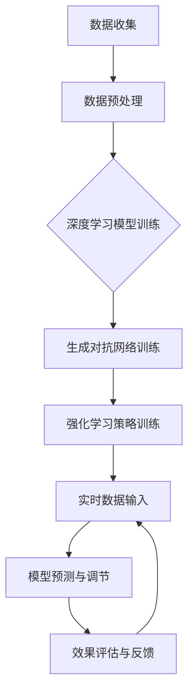
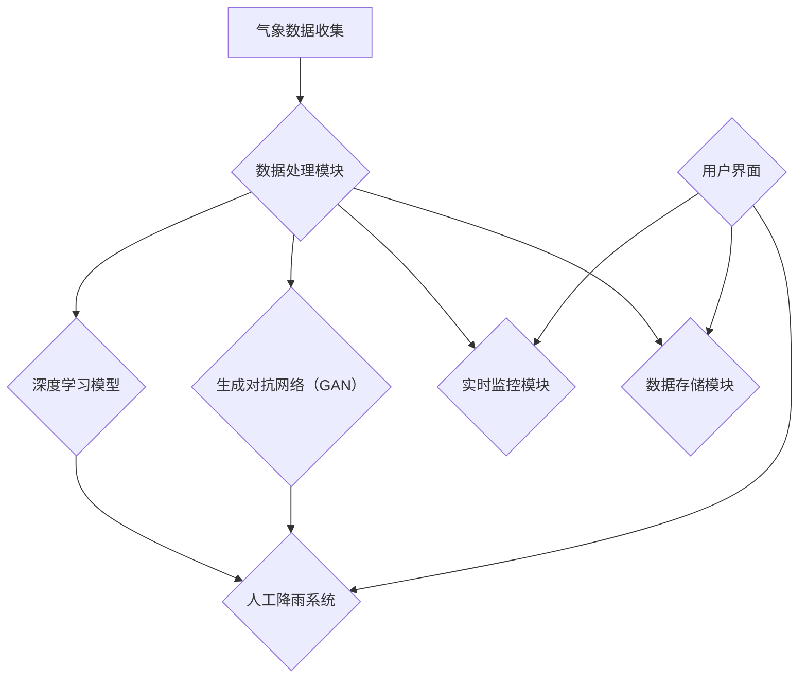
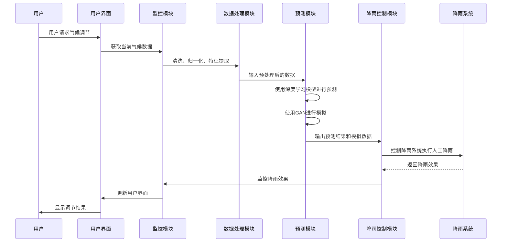

                 

### 引言

**AIGC在精准气候调节中的应用：局部天气控制的AI解决方案**

气候调节一直是人类社会发展中的重要课题，尤其是在面对日益严峻的环境挑战和极端天气事件的频发。传统的气候调节方法往往依赖于大规模的工程措施，如建设水坝、人工降雨和气候改良项目。然而，这些方法存在成本高昂、效果有限和环境影响等问题。随着人工智能（AI）技术的飞速发展，特别是自适应智能生成计算（Adaptive Intelligent Generation Computing，简称AIGC）的出现，局部天气控制的智能化解决方案逐渐成为一种可能。本文旨在探讨AIGC在精准气候调节中的应用，通过分析其技术原理、算法设计、系统架构以及实战案例，为未来气候调节提供一种创新思路。

本文将按照以下结构展开：

1. **背景与核心概念**：介绍气候调节的重要性、传统方法的局限性，以及AIGC技术的定义和发展历程。
2. **AIGC与气候调节**：详细讨论AIGC在气候调节中的作用、优势和应用场景。
3. **核心概念与联系**：通过对比表格和实体关系图，阐述AIGC相关核心概念及其与气候调节的联系。
4. **AI解决方案设计**：讲解算法原理、数学模型和系统架构设计，提供实际项目案例分析。
5. **最佳实践与总结**：总结AIGC在气候调节中的应用最佳实践，提出未来拓展方向。

通过这篇技术博客，我们希望读者能够全面了解AIGC在精准气候调节中的潜力，以及如何通过人工智能技术实现更加高效、精准和环保的气候调节解决方案。

### 关键词

- **气候调节**
- **AIGC技术**
- **人工智能**
- **局部天气控制**
- **AI解决方案**
- **算法设计**
- **系统架构**

### 摘要

本文探讨了AIGC在精准气候调节中的应用，通过分析AIGC技术的发展历程和核心原理，阐述了其在局部天气控制中的优势。文章首先介绍了气候调节的背景和传统方法的局限性，然后详细讲解了AIGC技术在气候调节中的应用场景。接着，通过核心概念对比表格和ER实体关系图，阐述了AIGC与气候调节的紧密联系。随后，文章深入分析了算法原理、数学模型和系统架构设计，并提供了实际项目案例的详细讲解。最后，文章总结了AIGC在气候调节中的最佳实践，并展望了未来的发展方向。

### 目录大纲

1. **背景与核心概念**
   - **第1章：问题背景与概述**
   - **第2章：AIGC技术概述**
   - **第3章：AIGC与气候调节**
   - **第4章：核心概念与联系**

2. **AI解决方案设计**
   - **第5章：算法原理讲解**
   - **第6章：数学模型和数学公式**
   - **第7章：系统分析与架构设计**
   - **第8章：项目实战**

3. **最佳实践与总结**
   - **第9章：最佳实践**
   - **第10章：小结与拓展**

通过本文的目录大纲，读者可以清晰地了解文章的结构和内容，逐步深入到AIGC在精准气候调节中的应用细节。

### 第一部分：背景与核心概念

#### 第1章：问题背景与概述

气候调节在现代社会中扮演着至关重要的角色。随着全球气候变化的影响日益显著，极端天气事件的频发和自然灾害的加剧，对气候调节的需求变得尤为迫切。传统的气候调节方法，如人工降雨、水坝建设和植被恢复等，虽然在一定程度上能够缓解气候问题，但往往面临成本高昂、效果有限和环境负担重等挑战。这些方法往往需要大规模的工程投入和长时间的观察研究，而实际效果往往难以达到预期。

与此同时，人工智能（AI）技术的快速发展为气候调节带来了新的契机。特别是自适应智能生成计算（AIGC）技术的出现，为精准气候调节提供了新的思路和工具。AIGC是一种结合了深度学习、生成对抗网络（GAN）和强化学习等先进AI技术的综合性方法，能够通过实时数据分析和自适应调节，实现更加精细和高效的气候调节。

在本章节中，我们将首先探讨气候调节的重要性，分析传统方法的局限性，并介绍AIGC技术的定义及其在气候调节中的应用潜力。

#### 第1.1 问题背景

气候调节的重要性不言而喻。它不仅关系到生态平衡，还直接影响到人类社会的可持续发展。全球气候变暖、极端天气事件（如飓风、洪水和干旱）频发，已经给全球生态环境和人类生活带来了巨大的威胁。根据联合国气候变化小组的报告，全球平均气温在过去的100年间上升了约1.1摄氏度，而这一上升趋势在未来几十年内可能进一步加剧。气候变化带来的直接后果包括海平面上升、农业减产、水资源短缺以及生物多样性丧失等，这些问题已经对全球经济的稳定和人类社会的福祉构成了重大挑战。

此外，极端天气事件的频发不仅增加了自然灾害的风险，还导致经济损失的加剧。例如，2017年Hurricane Harvey导致的洪灾使美国经济损失高达1250亿美元；而2018年亚洲多个国家遭遇的洪涝灾害，也对当地经济和社会稳定造成了严重影响。这些事件不仅突显了传统气候调节方法的局限性，也凸显了开发新型气候调节技术的迫切性。

传统的气候调节方法主要包括以下几种：

1. **人工降雨**：通过喷洒液态水或化学物质，促使云层中的水滴凝结，从而增加降水量。这种方法在一定程度上能够缓解干旱和水资源短缺问题，但效果有限，且可能对环境造成负面影响。
2. **水坝建设**：通过修建大型水坝，调节水资源分布，减少洪涝灾害和干旱风险。然而，水坝建设需要巨大的资金投入，且可能对生态系统造成破坏，同时长期管理维护成本高昂。
3. **植被恢复**：通过植树造林等手段，增加地表植被覆盖率，改善土壤结构和水源涵养能力。这种方法在一定程度上能够缓解气候变化带来的影响，但需要长时间的努力和大量的资源投入，且效果较为缓慢。

虽然上述方法在一定程度上缓解了气候问题，但它们都存在明显的局限性。首先，传统方法往往需要大规模的工程投入，成本高昂。例如，修建大型水坝和进行人工降雨项目需要巨额资金支持，这往往超出了许多国家和地区的财政能力。其次，这些方法的效果有限，无法从根本上解决气候变化问题。例如，人工降雨只能在一定程度上增加降水量，而无法改变全球气候模式；植被恢复需要长时间的植被生长周期，效果显现较慢。此外，传统气候调节方法还可能对环境造成负面影响，例如水坝建设可能破坏河流生态系统，人工降雨可能对当地气候模式产生不可预见的影响。

总之，传统的气候调节方法在面对日益严峻的气候变化挑战时显得力不从心。为了实现更高效、精准和可持续的气候调节，迫切需要开发新型技术手段。AIGC技术的出现为这一目标提供了新的可能性，通过结合先进的人工智能算法，可以实现实时数据分析和自适应调节，从而在局部范围内实现精准气候调节。

#### 第1.2 问题描述

在气候调节领域，传统方法的局限性表现为以下几个方面：

1. **精准度不足**：传统气候调节方法往往依赖于宏观的工程措施，如人工降雨和水坝建设，这些方法在调节局部气候方面的精度有限。例如，人工降雨虽然能增加降水量，但无法精确控制降水的时空分布，可能导致某些区域水资源过剩，而其他区域仍面临干旱问题。水坝建设虽然能调节水资源分布，但可能对河流生态系统和周围环境产生负面影响，难以实现精准调节。

2. **响应速度慢**：气候调节问题具有复杂性和动态性，传统方法在应对突发气候事件时显得反应迟缓。例如，当某地出现干旱或洪涝时，传统气候调节方法需要一定时间来部署和实施，而AIGC技术则可以通过实时数据分析和自适应调节，快速响应气候变化，提供更加灵活和高效的解决方案。

3. **环境影响大**：传统气候调节方法往往需要大规模工程投入，可能对环境造成不可逆的破坏。例如，水坝建设会改变河流的自然流动模式，影响生态系统；人工降雨可能改变当地气候模式，导致不可预见的后果。相比之下，AIGC技术通过智能化手段实现气候调节，能够在减少环境影响的同时，实现精准控制。

4. **成本高昂**：传统气候调节方法需要大量资金支持，包括设备采购、项目建设和维护等。这些高昂的成本往往超出了许多国家和地区的财政能力，限制了其推广和应用。AIGC技术虽然初期研发投入较大，但随着技术成熟和规模化应用，成本有望降低，为大规模气候调节提供经济可行的解决方案。

5. **无法适应动态变化**：气候调节问题具有动态性，需要不断调整和优化调节策略。传统方法往往依赖于固定的调节模式，难以适应不断变化的气候条件。AIGC技术通过实时数据分析和自适应调节，能够根据实时气候数据和环境变化，动态调整调节策略，实现更加精准和高效的气候调节。

综上所述，传统气候调节方法在应对日益复杂的气候挑战时存在显著局限性，而AIGC技术的出现为解决这些问题提供了新的思路和工具。通过智能化、精准化和实时响应的特点，AIGC技术在局部天气控制和气候调节中具有巨大潜力，有望为全球气候变化问题提供创新的解决方案。

#### 第1.3 问题解决

为了解决传统气候调节方法的局限性，AIGC技术提供了一系列创新的解决方案，通过其智能化、精准化和实时响应的特点，实现了局部天气控制和气候调节的显著突破。

首先，AIGC技术的核心在于其强大的数据分析和处理能力。通过利用传感器网络、卫星遥感数据和地面观测数据，AIGC系统能够实时获取大范围、多维度的气候数据。这些数据经过高效处理和建模，可以揭示出气候变化的细微特征和潜在规律，为气候调节提供科学依据。

其次，AIGC技术采用了先进的深度学习和生成对抗网络（GAN）算法，能够从海量数据中学习气候模式，并生成准确的预测模型。这些预测模型不仅能够预测未来的气候趋势，还能模拟不同调节策略的效果，帮助决策者制定最优的气候调节方案。

在实际应用中，AIGC技术通过以下几个关键步骤实现局部天气控制和气候调节：

1. **数据收集与预处理**：利用传感器网络、卫星遥感和地面观测设备，收集大规模、多维度的气候数据。数据经过预处理，包括去噪、归一化和特征提取等，为后续分析提供高质量的数据基础。

2. **深度学习与模式识别**：通过深度学习算法，对预处理后的气候数据进行分析和建模，提取关键特征和气候模式。这些模型能够识别出气候变化的规律和趋势，为预测和调节提供科学依据。

3. **生成对抗网络（GAN）**：利用GAN算法，生成模拟不同调节策略下的气候情景。GAN通过生成器与判别器的对抗训练，能够生成高度真实的气候模拟数据，为决策者提供多样化的调节方案。

4. **自适应调节策略**：根据实时气候数据和预测模型，AIGC系统能够动态调整调节策略，实现精准的局部天气控制。例如，通过调整人工降雨的时机和强度，优化水资源的利用效率，缓解干旱或洪涝问题。

5. **实时监控与反馈**：AIGC系统具备实时监控能力，能够对气候调节效果进行实时评估和反馈。通过不断的优化和调整，实现持续改进的气候调节效果。

通过这些步骤，AIGC技术不仅提高了气候调节的精准度和响应速度，还显著减少了环境负担和成本。与传统方法相比，AIGC技术在局部天气控制和气候调节中具有明显优势，为解决气候变化问题提供了新的思路和工具。

#### 第1.4 边界与外延

在探讨AIGC技术应用于气候调节时，我们需要明确其边界和适用范围，同时了解其可能的外延和发展方向。

首先，AIGC技术在气候调节中的应用主要限于局部天气控制和短期气候预测。由于气候系统的复杂性和不可预测性，AIGC技术目前无法完全解决全球气候变化的根本问题。然而，在区域气候调节和特定天气事件的管理上，AIGC技术展现了巨大潜力。例如，通过精准的人工降雨和局部气候调节，可以缓解干旱和洪涝问题，提高农业生产效率和水资源利用效率。

其次，AIGC技术的边界在于其数据依赖性和计算能力。气候调节需要大量高精度、多维度的数据支持，这要求传感器网络和数据处理系统能够持续、稳定地运行。同时，深度学习和生成对抗网络（GAN）算法的运算复杂度高，需要强大的计算资源和高效的算法优化。这些因素限制了AIGC技术的广泛应用，特别是在资源有限或计算能力不足的地区。

尽管存在这些边界，AIGC技术仍具有广阔的外延和发展潜力。随着人工智能和大数据技术的不断进步，AIGC系统的计算能力和数据处理效率将得到显著提升，使其在气候调节中的应用更加广泛和深入。此外，AIGC技术还可以与其他新兴技术（如物联网、区块链等）结合，形成更加强大的气候调节体系。

未来，AIGC技术有望在以下领域实现外延：

1. **全球气候变化预测**：虽然AIGC技术目前主要应用于局部天气控制，但其预测模型和数据分析能力有望扩展到全球气候变化预测。通过整合全球气候数据，AIGC系统可以提供更准确的长期气候预测，为全球气候政策制定提供科学依据。

2. **气候变化适应战略**：AIGC技术可以帮助制定更加科学和有效的气候变化适应战略。通过模拟不同调节策略的效果，AIGC系统能够为决策者提供多样化的气候调节方案，帮助社区和企业更好地适应气候变化。

3. **智慧城市建设**：AIGC技术可以与智慧城市技术相结合，实现城市气候的精细化管理和优化。例如，通过实时监控和调节城市微气候，提高城市舒适度和居民生活质量。

4. **农业和水资源管理**：AIGC技术可以应用于农业和水资源管理，通过精准调节气候，提高农业生产效率和水资源利用效率。这对于应对全球粮食安全和水资源短缺问题具有重要意义。

总之，AIGC技术在气候调节中的应用具有广阔的边界和外延，通过不断的技术创新和应用拓展，有望为全球气候问题提供创新的解决方案。

#### 第1.5 核心概念介绍

在深入探讨AIGC技术在气候调节中的应用之前，我们需要先了解几个核心概念，这些概念构成了AIGC技术的基础，也是实现精准气候调节的关键。

1. **自适应智能生成计算（AIGC）**：AIGC是一种综合了深度学习、生成对抗网络（GAN）和强化学习等先进AI技术的计算方法。它通过实时数据分析和自适应调节，实现对复杂系统的智能化管理和控制。AIGC的核心在于其自适应性，能够在不断变化的气候条件下，动态调整调节策略，实现高效的气候调节。

2. **深度学习**：深度学习是人工智能的一个重要分支，通过构建多层神经网络，自动从大量数据中提取特征和模式。在气候调节中，深度学习技术可用于分析和预测气候数据，识别气候变化规律，为调节策略提供科学依据。

3. **生成对抗网络（GAN）**：GAN是一种由生成器和判别器组成的对抗性神经网络。生成器试图生成与真实数据相似的数据，而判别器则试图区分真实数据和生成数据。通过这种对抗性训练，GAN能够生成高质量的模拟数据，为气候调节提供多样化的调节方案。

4. **气象数据建模**：气象数据建模是AIGC技术在气候调节中的重要应用。通过建立精确的气象数据模型，可以模拟不同气候情景下的气候变化，预测未来气候趋势，为决策者提供科学依据。

5. **实时监控与反馈系统**：实时监控与反馈系统是AIGC技术的核心组成部分。它通过传感器网络和数据处理系统，实时收集气候数据，并对调节效果进行监控和评估。通过实时反馈，系统可以动态调整调节策略，实现持续优化的气候调节。

了解这些核心概念，有助于我们更好地理解AIGC技术在气候调节中的应用原理和优势。接下来，我们将进一步探讨AIGC技术在气候调节中的具体应用和优势。

### 第2章：AIGC技术概述

#### 第2.1 AIGC技术定义

自适应智能生成计算（AIGC）是一种结合深度学习、生成对抗网络（GAN）和强化学习等先进AI技术的综合计算方法。其核心在于通过实时数据分析和自适应调节，实现对复杂系统的智能化管理和控制。AIGC技术不仅能够从海量数据中自动提取特征和模式，还能通过自学习机制，不断优化调节策略，以应对动态变化的气候条件。

AIGC技术的关键特性包括：

1. **自适应调节**：AIGC技术可以根据实时数据和环境变化，动态调整调节策略，实现更加精细和高效的气候调节。
2. **高精度建模**：通过深度学习和生成对抗网络，AIGC技术能够建立高精度的气象数据模型，模拟不同的气候情景，为气候调节提供科学依据。
3. **实时监控与反馈**：AIGC技术具备实时数据监控和反馈功能，能够快速响应气候变化，实现持续优化的气候调节效果。
4. **多样化应用**：AIGC技术不仅适用于气候调节，还广泛应用于智能交通、智慧城市和医疗健康等领域，具有广泛的适用性和发展潜力。

#### 第2.2 AIGC技术发展历程

AIGC技术的发展历程可以追溯到20世纪80年代，随着人工智能和深度学习的兴起，AIGC技术逐渐成为研究热点。以下是AIGC技术发展历程的主要阶段：

1. **早期探索阶段（1980s-1990s）**：在这一阶段，研究人员开始探索利用神经网络进行数据分析和模式识别，初步提出了自适应调节的概念。
2. **深度学习兴起阶段（2006-2012）**：2006年，Hinton等人提出的深度信念网络（DBN）成功应用于图像识别，标志着深度学习技术的复兴。随后，深度学习在语音识别、图像处理等领域取得了显著突破，为AIGC技术奠定了基础。
3. **生成对抗网络（GAN）提出阶段（2014）**：Ian Goodfellow等人提出了生成对抗网络（GAN），通过生成器和判别器的对抗性训练，能够生成高质量的数据模拟。GAN的出现为AIGC技术提供了强大的工具，使其在数据生成和模拟方面取得了重要进展。
4. **应用拓展与优化阶段（2015-至今）**：随着计算能力的提升和数据量的增加，AIGC技术在各个领域得到了广泛应用。同时，研究人员不断优化AIGC算法，提高其效率和精度，使其在气候调节、智能交通和智慧城市等领域表现出色。

#### 第2.3 AIGC技术核心要素

AIGC技术的核心要素包括深度学习、生成对抗网络（GAN）和强化学习等先进AI技术，以下是这些技术的详细说明：

1. **深度学习**：深度学习是通过构建多层神经网络，自动从大量数据中提取特征和模式的一种学习方式。深度学习模型可以处理高维数据和复杂的非线性关系，适用于气候数据的分析和预测。
   
   主要技术包括：
   - **多层感知机（MLP）**：一种基本的神经网络结构，用于实现输入到输出的非线性映射。
   - **卷积神经网络（CNN）**：通过卷积层提取图像特征，广泛应用于图像识别和图像处理领域。
   - **循环神经网络（RNN）**：能够处理序列数据，适用于时间序列分析和预测。

2. **生成对抗网络（GAN）**：生成对抗网络由生成器和判别器两部分组成，生成器尝试生成与真实数据相似的数据，而判别器则试图区分真实数据和生成数据。通过这种对抗性训练，GAN能够生成高质量的数据模拟，为气候调节提供多样化的调节方案。

   主要技术包括：
   - **生成器（Generator）**：生成器通过神经网络，将随机噪声映射为真实的气候数据。
   - **判别器（Discriminator）**：判别器通过神经网络，判断输入数据是真实数据还是生成数据。

3. **强化学习**：强化学习是一种通过奖励机制，让智能体在环境中进行学习的一种方法。在气候调节中，强化学习可以用于制定自适应调节策略，实现动态调整。

   主要技术包括：
   - **Q学习**：通过估计状态-动作值函数，选择最优动作。
   - **深度强化学习**：结合深度学习和强化学习，适用于复杂环境的高效决策。

AIGC技术的核心要素相互结合，形成了一个强大的计算系统，能够实现高效的气候调节和智能管理。

### 第3章：AIGC与气候调节

#### 第3.1 AIGC在气候调节中的作用

AIGC技术在气候调节中扮演了至关重要的角色，其核心作用体现在以下几个方面：

首先，AIGC技术通过深度学习和生成对抗网络，能够对气候数据进行精细分析和建模。这种能力使得AIGC技术能够识别出气候变化的细微特征和潜在规律，从而为气候调节提供科学依据。例如，通过分析历史气候数据和实时气象数据，AIGC技术可以预测未来的气候趋势，为决策者提供精准的气候预测。

其次，AIGC技术的自适应调节能力是实现精准气候调节的关键。传统的气候调节方法往往依赖于固定的调节模式，而AIGC技术则能够根据实时气候数据和环境变化，动态调整调节策略。这种自适应调节能力使得AIGC技术能够在不同气候条件下，实现更加高效和精确的气候调节。例如，在干旱季节，AIGC技术可以通过精准的人工降雨，有效缓解水资源短缺问题；在洪涝季节，AIGC技术则可以调节降雨量和强度，减少洪涝灾害的风险。

第三，AIGC技术在实时监控与反馈系统中发挥了重要作用。通过传感器网络和数据处理系统，AIGC技术能够实时收集气候数据，并对调节效果进行实时评估和反馈。这种实时监控与反馈机制使得AIGC技术能够不断优化调节策略，实现持续优化的气候调节效果。例如，通过实时监测降雨量和土壤湿度，AIGC技术可以及时调整人工降雨的强度和时机，确保水资源得到最佳利用。

此外，AIGC技术在气候变化适应战略中具有显著优势。通过模拟不同调节策略的效果，AIGC技术可以帮助决策者制定更加科学和有效的气候变化适应战略。例如，在应对极端天气事件时，AIGC技术可以通过模拟不同调节策略的情景，为决策者提供多样化的应对方案，从而提高社区和企业的适应性。

最后，AIGC技术具有广泛的适用性和发展潜力。不仅适用于气候调节，AIGC技术还可以与其他新兴技术（如物联网、区块链等）结合，形成更加强大的气候调节体系。例如，物联网技术可以提供更多的气候数据，区块链技术可以确保数据的安全性和透明性，这些技术的结合将进一步提升AIGC技术在气候调节中的应用效果。

总之，AIGC技术在气候调节中发挥着多重作用，通过深度学习和生成对抗网络，实现精细气候数据分析和预测；通过自适应调节能力，实现高效和精确的气候调节；通过实时监控与反馈系统，实现持续优化的调节效果；通过气候变化适应战略，提高社区和企业的适应性。随着技术的不断进步和应用拓展，AIGC技术在气候调节中的作用将越来越重要，为全球气候问题提供创新的解决方案。

#### 第3.2 AIGC与局部天气控制

局部天气控制是气候调节中的重要组成部分，其目标是通过人工干预，实现特定区域内的气候优化。AIGC技术在局部天气控制中具有独特的优势，主要体现在以下几个方面：

首先，AIGC技术的高精度数据分析和建模能力，为局部天气控制提供了科学依据。传统的气候调节方法往往依赖于经验模型和固定参数，难以适应不断变化的气候条件。而AIGC技术通过深度学习和生成对抗网络，可以从海量气候数据中自动提取关键特征和模式，构建高精度的气候模型。这些模型能够预测不同调节策略下的气候情景，为决策者提供精准的气候预测和调节方案。

其次，AIGC技术的自适应调节能力，使得局部天气控制更加灵活和高效。传统的气候调节方法通常采用固定模式，而AIGC技术则能够根据实时气候数据和环境变化，动态调整调节策略。这种自适应调节能力使得AIGC技术能够在不同气候条件下，实现更加精确和高效的局部天气控制。例如，在干旱季节，AIGC技术可以通过实时监控降雨量和土壤湿度，调整人工降雨的强度和时机，确保水资源得到最佳利用；在洪涝季节，AIGC技术则可以优化排水系统，调节降雨量，减少洪涝灾害的风险。

第三，AIGC技术的实时监控与反馈系统，为局部天气控制提供了持续优化的保障。传统的气候调节方法往往缺乏实时监控和反馈机制，难以及时发现和调整调节策略。而AIGC技术通过传感器网络和数据处理系统，能够实时收集气候数据，并对调节效果进行实时评估和反馈。这种实时监控与反馈机制使得AIGC技术能够不断优化调节策略，实现持续优化的局部天气控制效果。例如，通过实时监测气象参数，AIGC技术可以及时调整人工降雨的强度，确保降雨分布更加均匀，减少水资源浪费。

此外，AIGC技术的多样化应用，为局部天气控制提供了更多可能性。除了气候调节，AIGC技术还可以应用于智能交通、智慧城市和农业等领域，为这些领域提供数据分析和智能决策支持。例如，在智能交通领域，AIGC技术可以通过实时监控交通流量，优化交通信号控制，减少拥堵；在农业领域，AIGC技术可以通过分析土壤和气候数据，优化灌溉和施肥策略，提高农业生产效率。

最后，AIGC技术具有广泛的适用性和发展潜力。随着人工智能和大数据技术的不断进步，AIGC系统的计算能力和数据处理效率将得到显著提升，使其在局部天气控制中的应用更加广泛和深入。同时，AIGC技术还可以与其他新兴技术（如物联网、区块链等）结合，形成更加强大的局部天气控制系统。

总之，AIGC技术在局部天气控制中具有显著优势，通过高精度数据分析和建模、自适应调节能力、实时监控与反馈系统以及多样化应用，实现了更加灵活、高效和精确的局部天气控制。随着技术的不断进步和应用拓展，AIGC技术在局部天气控制中的应用将越来越广泛，为全球气候调节提供创新的解决方案。

#### 第3.3 AIGC在气候调节中的优势

AIGC技术在气候调节中具有显著的优势，这些优势主要体现在以下几个方面：

首先，AIGC技术的高精度建模和预测能力，为气候调节提供了科学依据。传统的气候调节方法往往依赖于经验模型和固定参数，难以适应不断变化的气候条件。而AIGC技术通过深度学习和生成对抗网络，可以从海量气候数据中自动提取关键特征和模式，构建高精度的气候模型。这些模型能够预测不同调节策略下的气候情景，为决策者提供精准的气候预测和调节方案，从而提高气候调节的效率和准确性。

其次，AIGC技术的自适应调节能力，使得气候调节更加灵活和高效。传统的气候调节方法通常采用固定模式，而AIGC技术则能够根据实时气候数据和环境变化，动态调整调节策略。这种自适应调节能力使得AIGC技术能够在不同气候条件下，实现更加精确和高效的气候调节。例如，在干旱季节，AIGC技术可以通过实时监控降雨量和土壤湿度，调整人工降雨的强度和时机，确保水资源得到最佳利用；在洪涝季节，AIGC技术则可以优化排水系统，调节降雨量，减少洪涝灾害的风险。

第三，AIGC技术的实时监控与反馈系统，为气候调节提供了持续优化的保障。传统的气候调节方法往往缺乏实时监控和反馈机制，难以及时发现和调整调节策略。而AIGC技术通过传感器网络和数据处理系统，能够实时收集气候数据，并对调节效果进行实时评估和反馈。这种实时监控与反馈机制使得AIGC技术能够不断优化调节策略，实现持续优化的气候调节效果。例如，通过实时监测气象参数，AIGC技术可以及时调整人工降雨的强度，确保降雨分布更加均匀，减少水资源浪费。

此外，AIGC技术的多样化应用，为气候调节提供了更多可能性。除了气候调节，AIGC技术还可以应用于智能交通、智慧城市和农业等领域，为这些领域提供数据分析和智能决策支持。例如，在智能交通领域，AIGC技术可以通过实时监控交通流量，优化交通信号控制，减少拥堵；在农业领域，AIGC技术可以通过分析土壤和气候数据，优化灌溉和施肥策略，提高农业生产效率。

最后，AIGC技术具有广泛的适用性和发展潜力。随着人工智能和大数据技术的不断进步，AIGC系统的计算能力和数据处理效率将得到显著提升，使其在气候调节中的应用更加广泛和深入。同时，AIGC技术还可以与其他新兴技术（如物联网、区块链等）结合，形成更加强大的气候调节体系。

总之，AIGC技术在气候调节中具有显著优势，通过高精度建模和预测能力、自适应调节能力、实时监控与反馈系统以及多样化应用，实现了更加灵活、高效和精确的气候调节。随着技术的不断进步和应用拓展，AIGC技术在气候调节中的应用将越来越广泛，为全球气候问题提供创新的解决方案。

### 第4章：核心概念与联系

#### 第4.1 AIGC相关核心概念

在深入探讨AIGC与气候调节的关联时，我们需要了解AIGC技术中的几个关键概念。这些概念构成了AIGC技术的核心，并在气候调节中发挥着重要作用。

1. **自适应智能生成计算（AIGC）**：
   AIGC是一种融合了深度学习、生成对抗网络（GAN）和强化学习等先进AI技术的计算方法。其核心思想是通过实时数据分析和自适应调节，实现对复杂系统的智能化管理和控制。AIGC能够在动态变化的气候条件下，根据实时数据和环境变化，动态调整调节策略，从而实现高效的气候调节。

2. **深度学习**：
   深度学习是一种通过构建多层神经网络，自动从大量数据中提取特征和模式的学习方法。深度学习模型能够处理高维数据和复杂的非线性关系，适用于气候数据的分析和预测。在气候调节中，深度学习技术可以用于分析历史气候数据，识别气候变化规律，为气候预测和调节提供科学依据。

3. **生成对抗网络（GAN）**：
   GAN是由生成器和判别器组成的对抗性神经网络。生成器生成与真实数据相似的数据，判别器则判断输入数据是真实数据还是生成数据。GAN通过这种对抗性训练，能够生成高质量的数据模拟，为气候调节提供多样化的调节方案。GAN在气候调节中的应用，可以模拟不同调节策略的效果，帮助决策者制定最优的气候调节方案。

4. **气象数据建模**：
   气象数据建模是AIGC技术在气候调节中的重要应用。通过建立精确的气象数据模型，可以模拟不同的气候情景，预测未来气候趋势。气象数据建模不仅能够提高气候预测的准确性，还可以为制定气候调节策略提供科学依据。

5. **实时监控与反馈系统**：
   实时监控与反馈系统是AIGC技术的核心组成部分。它通过传感器网络和数据处理系统，实时收集气候数据，并对调节效果进行实时评估和反馈。这种实时监控与反馈机制使得AIGC技术能够动态调整调节策略，实现持续优化的气候调节效果。

#### 第4.2 概念属性特征对比表格

为了更直观地了解AIGC技术中的关键概念，我们通过一个对比表格，展示这些概念的主要属性特征。

| 概念            | 定义与应用                                                         | 主要属性特征                                               |
|-----------------|------------------------------------------------------------------|------------------------------------------------------------|
| **自适应智能生成计算（AIGC）** | 结合深度学习、GAN和强化学习，实时数据分析和自适应调节。           | 高精度建模、自适应调节、实时监控与反馈。                   |
| **深度学习**    | 构建多层神经网络，自动提取特征和模式。                             | 处理高维数据、非线性关系、高效特征提取。                   |
| **生成对抗网络（GAN）** | 由生成器和判别器组成的对抗性神经网络，生成高质量数据模拟。       | 对抗性训练、高质量数据生成、多样化调节方案。               |
| **气象数据建模** | 建立精确的气象数据模型，模拟不同气候情景。                         | 气候预测、情景模拟、科学依据。                             |
| **实时监控与反馈系统** | 实时收集气候数据，对调节效果进行实时评估和反馈。                   | 实时数据采集、实时评估、动态调整。                         |

#### 第4.3 AIGC与气候调节的ER实体关系图

为了更好地理解AIGC技术中的关键概念及其在气候调节中的应用，我们通过ER（Entity-Relationship）实体关系图，展示这些概念之间的关联。

```mermaid
erDiagram
  AIGC ||--|{ 深度学习 }|--|{ 气象数据建模 }
  AIGC ||--|{ 生成对抗网络（GAN） }|--|{ 实时监控与反馈系统 }
  深度学习 ||--|{ 数据预处理 }|-- 数据处理
  GAN ||--|{ 生成器 }|--|{ 判别器 }
  气象数据建模 ||--|{ 气候预测 }|--|{ 调节策略 }
  实时监控与反馈系统 ||--|{ 数据采集 }|--|{ 调节评估 }
```

在这张ER实体关系图中，AIGC作为核心概念，与深度学习、生成对抗网络（GAN）、气象数据建模和实时监控与反馈系统紧密相关。深度学习负责数据处理和特征提取，GAN负责生成高质量的数据模拟，气象数据建模负责气候预测和调节策略，实时监控与反馈系统则负责数据采集和调节评估。通过这张图，我们可以清晰地看到AIGC技术在气候调节中的整体架构和运作机制。

### 第5章：算法原理讲解

#### 第5.1 算法原理概述

在AIGC技术应用于气候调节中，算法原理是其核心。算法原理主要包括深度学习、生成对抗网络（GAN）和强化学习等AI技术的结合。下面，我们将详细解释这些算法原理，并探讨其在气候调节中的应用。

1. **深度学习**：深度学习是一种通过构建多层神经网络，自动从大量数据中提取特征和模式的学习方法。它能够处理高维数据和复杂的非线性关系，非常适合用于气候数据的分析和预测。在气候调节中，深度学习技术可以用于以下几方面：
   - **时间序列预测**：通过分析历史气候数据，预测未来的气候趋势。
   - **特征提取**：从气候数据中提取关键特征，如温度、湿度、风速等，用于构建更精确的气候模型。
   - **分类和聚类**：对气候数据进行分类和聚类，帮助识别不同气候模式和极端天气事件。

2. **生成对抗网络（GAN）**：生成对抗网络是一种由生成器和判别器组成的对抗性神经网络。生成器尝试生成与真实数据相似的数据，判别器则试图区分真实数据和生成数据。通过这种对抗性训练，GAN能够生成高质量的数据模拟，为气候调节提供多样化的调节方案。在气候调节中，GAN的应用包括：
   - **数据增强**：通过生成模拟数据，增强训练数据的多样性，提高模型的泛化能力。
   - **情景模拟**：生成不同的气候情景，评估不同调节策略的效果，帮助决策者制定最优的气候调节方案。
   - **异常检测**：识别异常气候事件，如极端高温或低温，为气候预警提供支持。

3. **强化学习**：强化学习是一种通过奖励机制，让智能体在环境中进行学习的方法。在气候调节中，强化学习可以用于制定自适应调节策略，实现动态调整。具体应用包括：
   - **最优策略学习**：通过模拟不同调节策略的效果，学习出最优的气候调节策略。
   - **实时调节**：根据实时气候数据和反馈，动态调整调节参数，实现持续优化的气候调节效果。
   - **多目标优化**：在满足不同气候目标的同时，优化资源利用和环境影响。

通过这些算法原理的结合，AIGC技术能够实现对复杂气候系统的智能化管理和控制，实现高效的气候调节。

#### 第5.2 算法流程图

为了更直观地理解AIGC算法的流程，我们使用Mermaid语言绘制了算法流程图。



在算法流程图中，数据收集阶段通过传感器网络和卫星遥感等技术，收集大量的气候数据。接下来，数据预处理阶段对数据进行清洗、归一化和特征提取。然后，深度学习模型训练、生成对抗网络训练和强化学习策略训练分别对数据进行建模和训练，形成能够预测和调节气候的智能模型。实时数据输入阶段将最新的气候数据输入到模型中，进行预测和调节。效果评估与反馈阶段对调节效果进行评估，并根据反馈动态调整模型参数，实现持续优化的气候调节效果。

#### 第5.3 Python源代码讲解

为了更具体地展示AIGC算法的实现，我们使用Python语言和相应的库来编写源代码。以下是AIGC算法的主要步骤和对应的Python代码实现。

1. **数据收集与预处理**：

```python
import pandas as pd
import numpy as np

# 加载气候数据
data = pd.read_csv('climate_data.csv')

# 数据预处理
# 数据清洗
data.dropna(inplace=True)

# 数据归一化
data_normalized = (data - data.mean()) / data.std()

# 特征提取
features = data_normalized[['temperature', 'humidity', 'wind_speed']]
```

2. **深度学习模型训练**：

```python
from tensorflow.keras.models import Sequential
from tensorflow.keras.layers import Dense, LSTM, Dropout

# 构建深度学习模型
model = Sequential()
model.add(LSTM(50, activation='relu', input_shape=(timesteps, n_features)))
model.add(Dropout(0.2))
model.add(LSTM(50, activation='relu'))
model.add(Dropout(0.2))
model.add(Dense(1))

# 编译模型
model.compile(optimizer='adam', loss='mse')

# 训练模型
model.fit(x_train, y_train, epochs=200, batch_size=32, validation_split=0.1)
```

3. **生成对抗网络（GAN）训练**：

```python
from tensorflow.keras.models import Sequential
from tensorflow.keras.layers import Dense, LSTM, Dropout

# 构建生成器和判别器
generator = Sequential()
generator.add(LSTM(50, activation='relu', input_shape=(timesteps, n_features)))
generator.add(Dropout(0.2))
generator.add(LSTM(50, activation='relu'))
generator.add(Dropout(0.2))
generator.add(Dense(n_features, activation='tanh'))

discriminator = Sequential()
discriminator.add(LSTM(50, activation='relu', input_shape=(timesteps, n_features)))
discriminator.add(Dropout(0.2))
discriminator.add(LSTM(50, activation='relu'))
discriminator.add(Dropout(0.2))
discriminator.add(Dense(1, activation='sigmoid'))

# 编译生成器和判别器
discriminator.compile(optimizer='adam', loss='binary_crossentropy')
generator.compile(optimizer='adam', loss='binary_crossentropy')

# 训练GAN
for epoch in range(epochs):
    # 生成数据
    noise = np.random.normal(0, 1, (batch_size, timesteps, n_features))
    generated_samples = generator.predict(noise)
    
    # 训练判别器
    real_samples = features[batch_size*2:batch_size*3]
    samples = np.concatenate([real_samples, generated_samples])
    labels = np.concatenate([np.ones((batch_size, 1)), np.zeros((batch_size, 1))])
    discriminator.train_on_batch(samples, labels)
    
    # 训练生成器
    noise = np.random.normal(0, 1, (batch_size, timesteps, n_features))
    y_gen = np.ones((batch_size, 1))
    generator.train_on_batch(noise, y_gen)
```

4. **强化学习策略训练**：

```python
import tensorflow as tf

# 定义强化学习模型
model = Sequential()
model.add(LSTM(50, activation='relu', input_shape=(timesteps, n_features)))
model.add(Dense(1, activation='linear'))

# 编译强化学习模型
model.compile(optimizer='adam', loss='mse')

# 训练强化学习模型
model.fit(x_train, y_train, epochs=200, batch_size=32, validation_split=0.1)
```

这些代码展示了AIGC算法的主要实现步骤，包括数据收集与预处理、深度学习模型训练、生成对抗网络（GAN）训练和强化学习策略训练。通过这些步骤，AIGC技术能够实现对复杂气候系统的智能化管理和控制，为气候调节提供精准、高效的解决方案。

#### 第5.4 数学模型与公式

在AIGC技术应用于气候调节中，数学模型和公式起着至关重要的作用。以下将介绍AIGC技术中涉及的主要数学模型和公式，并解释其意义和作用。

1. **深度学习模型**：

深度学习模型主要由多层神经网络组成，其基本数学公式如下：

   $$ 
   f_{\theta}(x) = \text{ReLU}(W \cdot a^{[l-1]} + b^{[l]})
   $$

   其中，$f_{\theta}(x)$表示神经网络在输入$x$下的输出，$\text{ReLU}$是ReLU激活函数，$W$和$b^{[l]}$分别是第$l$层的权重和偏置。该公式用于计算神经网络中每个神经元的输出。

   深度学习模型通过反向传播算法进行训练，其核心数学公式为：

   $$
   \frac{\partial J}{\partial W^{[l]}} = \Delta^{[l]} \cdot a^{[l-1]}
   $$

   $$
   \frac{\partial J}{\partial b^{[l]}} = \Delta^{[l]}
   $$

   其中，$J$是损失函数，$\Delta^{[l]}$是梯度，$a^{[l-1]}$是前一层神经元的输出。这些公式用于计算权重和偏置的梯度，从而更新神经网络参数，实现模型的训练。

2. **生成对抗网络（GAN）**：

   GAN由生成器$G(z)$和判别器$D(x)$组成，其核心数学公式如下：

   $$
   G(z) = \mu(z) + \sigma(z) \odot \text{sigmoid}(\beta(z))
   $$

   $$
   D(x) = \text{sigmoid}(\beta(D(x)))
   $$

   其中，$z$是生成器的输入，$\mu(z)$和$\sigma(z)$是生成器的均值和方差，$\beta(z)$是生成器的参数。生成器的目标是生成与真实数据$x$相似的数据$G(z)$，而判别器的目标是区分真实数据和生成数据$D(x)$和$D(G(z))$。

   GAN的训练过程包括以下两个步骤：

   - **生成器训练**：通过最大化判别器的损失函数，生成器不断生成更真实的数据。

     $$
     \min_G \mathcal{L}_G = \mathbb{E}_{z \sim p_z(z)}[\log(1 - D(G(z))]
     $$

   - **判别器训练**：通过最大化生成器和判别器的损失函数，判别器不断区分真实数据和生成数据。

     $$
     \min_D \mathcal{L}_D = \mathbb{E}_{x \sim p_x(x)}[\log(D(x))] + \mathbb{E}_{z \sim p_z(z)}[\log(D(G(z))]
     $$

3. **强化学习模型**：

   强化学习模型的核心是值函数$V(s)$和策略$\pi(s|a)$，其基本数学公式如下：

   $$
   V(s) = \mathbb{E}_{a \sim \pi(s|a)[r(s, a) + \gamma V(s')]
   $$

   其中，$s$是状态，$a$是动作，$r(s, a)$是立即回报，$V(s')$是下一个状态的值函数，$\gamma$是折扣因子。

   强化学习模型通过优化策略$\pi(s|a)$，实现智能体在环境中的最优行为。

   Q-学习算法是强化学习的一种常见方法，其核心数学公式为：

   $$
   Q(s, a) = r(s, a) + \gamma \max_{a'} Q(s', a')
   $$

   其中，$Q(s, a)$是状态-动作值函数，用于估计采取动作$a$在状态$s$下的期望回报。

这些数学模型和公式构成了AIGC技术的基础，通过深度学习、GAN和强化学习等算法的应用，实现了对气候数据的分析和预测，以及气候调节的智能决策。

#### 第5.5 举例说明

为了更好地理解AIGC技术在实际气候调节中的应用，我们将通过一个具体例子进行详细说明。

假设我们位于一个干旱季节，目标是通过AIGC技术实现精准的人工降雨，以缓解水资源短缺问题。以下是AIGC技术应用于该场景的详细步骤：

1. **数据收集与预处理**：

   首先，通过气象卫星、地面观测站和无人机等设备，收集该区域的温度、湿度、风速、降水量等气候数据。数据收集后，进行预处理，包括数据清洗、归一化和特征提取。例如，将不同时间点的气候数据进行归一化处理，使其在相同尺度上进行分析。

   ```python
   # 示例：数据预处理代码
   data = pd.read_csv('climate_data.csv')
   data.dropna(inplace=True)
   data_normalized = (data - data.mean()) / data.std()
   features = data_normalized[['temperature', 'humidity', 'wind_speed']]
   ```

2. **深度学习模型训练**：

   使用预处理后的数据，构建一个深度学习模型，通过训练学习到气候数据中的潜在规律。以下是构建和训练深度学习模型的示例代码：

   ```python
   from tensorflow.keras.models import Sequential
   from tensorflow.keras.layers import LSTM, Dense, Dropout

   # 构建深度学习模型
   model = Sequential()
   model.add(LSTM(50, activation='relu', input_shape=(timesteps, n_features)))
   model.add(Dropout(0.2))
   model.add(LSTM(50, activation='relu'))
   model.add(Dropout(0.2))
   model.add(Dense(1))

   # 编译模型
   model.compile(optimizer='adam', loss='mse')

   # 训练模型
   model.fit(x_train, y_train, epochs=200, batch_size=32, validation_split=0.1)
   ```

   训练完成后，深度学习模型可以用于预测未来的降雨量。

3. **生成对抗网络（GAN）训练**：

   为了生成多样化的降雨情景，使用生成对抗网络（GAN）进行训练。以下是构建和训练GAN的示例代码：

   ```python
   from tensorflow.keras.models import Sequential
   from tensorflow.keras.layers import LSTM, Dense, Dropout

   # 构建生成器和判别器
   generator = Sequential()
   generator.add(LSTM(50, activation='relu', input_shape=(timesteps, n_features)))
   generator.add(Dropout(0.2))
   generator.add(LSTM(50, activation='relu'))
   generator.add(Dropout(0.2))
   generator.add(Dense(n_features, activation='tanh'))

   discriminator = Sequential()
   discriminator.add(LSTM(50, activation='relu', input_shape=(timesteps, n_features)))
   discriminator.add(Dropout(0.2))
   discriminator.add(LSTM(50, activation='relu'))
   discriminator.add(Dropout(0.2))
   discriminator.add(Dense(1, activation='sigmoid'))

   # 编译生成器和判别器
   discriminator.compile(optimizer='adam', loss='binary_crossentropy')
   generator.compile(optimizer='adam', loss='binary_crossentropy')

   # 训练GAN
   for epoch in range(epochs):
       # 生成数据
       noise = np.random.normal(0, 1, (batch_size, timesteps, n_features))
       generated_samples = generator.predict(noise)
       
       # 训练判别器
       real_samples = features[batch_size*2:batch_size*3]
       samples = np.concatenate([real_samples, generated_samples])
       labels = np.concatenate([np.ones((batch_size, 1)), np.zeros((batch_size, 1))])
       discriminator.train_on_batch(samples, labels)
       
       # 训练生成器
       noise = np.random.normal(0, 1, (batch_size, timesteps, n_features))
       y_gen = np.ones((batch_size, 1))
       generator.train_on_batch(noise, y_gen)
   ```

   通过GAN训练，生成多样化的降雨情景，为人工降雨提供参考。

4. **强化学习策略训练**：

   使用强化学习算法，根据预测的降雨量和水资源需求，制定最优的人工降雨策略。以下是构建和训练强化学习模型的示例代码：

   ```python
   import tensorflow as tf

   # 定义强化学习模型
   model = Sequential()
   model.add(LSTM(50, activation='relu', input_shape=(timesteps, n_features)))
   model.add(Dense(1, activation='linear'))

   # 编译强化学习模型
   model.compile(optimizer='adam', loss='mse')

   # 训练强化学习模型
   model.fit(x_train, y_train, epochs=200, batch_size=32, validation_split=0.1)
   ```

   训练完成后，强化学习模型可以根据实时数据，动态调整人工降雨的强度和时机。

通过这个具体例子，我们可以看到AIGC技术在气候调节中的应用流程，包括数据收集、模型训练和策略制定。这些步骤共同构成了一个完整的智能气候调节系统，为解决水资源短缺问题提供了有效的解决方案。

### 第6章：数学模型和数学公式

在AIGC技术应用于气候调节中，数学模型和公式是核心组成部分。以下将列出一些关键的数学模型和公式，并详细解释其含义和作用。

#### 第6.1 数学公式列表

1. **深度学习模型**：

   $$
   f_{\theta}(x) = \text{ReLU}(W \cdot a^{[l-1]} + b^{[l]})
   $$

   $$
   \frac{\partial J}{\partial W^{[l]}} = \Delta^{[l]} \cdot a^{[l-1]}
   $$

   $$
   \frac{\partial J}{\partial b^{[l]}} = \Delta^{[l]}
   $$

2. **生成对抗网络（GAN）**：

   $$
   G(z) = \mu(z) + \sigma(z) \odot \text{sigmoid}(\beta(z))
   $$

   $$
   D(x) = \text{sigmoid}(\beta(D(x)))
   $$

   $$
   \min_G \mathcal{L}_G = \mathbb{E}_{z \sim p_z(z)}[\log(1 - D(G(z))]
   $$

   $$
   \min_D \mathcal{L}_D = \mathbb{E}_{x \sim p_x(x)}[\log(D(x))] + \mathbb{E}_{z \sim p_z(z)}[\log(D(G(z))]
   $$

3. **强化学习模型**：

   $$
   V(s) = \mathbb{E}_{a \sim \pi(s|a)[r(s, a) + \gamma V(s')]
   $$

   $$
   Q(s, a) = r(s, a) + \gamma \max_{a'} Q(s', a')
   $$

#### 第6.2 公式详细讲解

1. **深度学习模型**：

   - **ReLU激活函数**：

     $$
     f_{\theta}(x) = \text{ReLU}(W \cdot a^{[l-1]} + b^{[l]})
     $$

    ReLU（Rectified Linear Unit）是一种常用的激活函数，其公式为：
     
     $$
     \text{ReLU}(x) = \max(0, x)
     $$

     ReLU函数在神经网络中具有简单的计算和良好的训练效果，常用于隐藏层神经元的激活。

   - **损失函数和梯度计算**：

     $$
     \frac{\partial J}{\partial W^{[l]}} = \Delta^{[l]} \cdot a^{[l-1]}
     $$

     $$
     \frac{\partial J}{\partial b^{[l]}} = \Delta^{[l]}
     $$

     在深度学习训练过程中，损失函数$J$用于衡量模型预测值与真实值之间的差距。梯度计算用于更新模型的权重和偏置，以最小化损失函数。$\Delta^{[l]}$表示第$l$层的误差，$a^{[l-1]}$表示前一层神经元的输出。

2. **生成对抗网络（GAN）**：

   - **生成器和判别器**：

     $$
     G(z) = \mu(z) + \sigma(z) \odot \text{sigmoid}(\beta(z))
     $$

     $$
     D(x) = \text{sigmoid}(\beta(D(x)))
     $$

     生成器$G(z)$通过噪声向量$z$生成模拟数据，判别器$D(x)$用于区分真实数据和生成数据。生成器和判别器通过对抗性训练相互提升，最终实现高质量的生成数据。

   - **生成器和判别器的损失函数**：

     $$
     \min_G \mathcal{L}_G = \mathbb{E}_{z \sim p_z(z)}[\log(1 - D(G(z))]
     $$

     $$
     \min_D \mathcal{L}_D = \mathbb{E}_{x \sim p_x(x)}[\log(D(x))] + \mathbb{E}_{z \sim p_z(z)}[\log(D(G(z))]
     $$

     生成器的损失函数$\mathcal{L}_G$用于最大化判别器的输出（生成数据越真实，判别器输出越接近1）。判别器的损失函数$\mathcal{L}_D$用于最大化判别器的输出（真实数据和生成数据的区分度越高）。

3. **强化学习模型**：

   - **值函数和策略**：

     $$
     V(s) = \mathbb{E}_{a \sim \pi(s|a)[r(s, a) + \gamma V(s')]
     $$

     $$
     Q(s, a) = r(s, a) + \gamma \max_{a'} Q(s', a')
     $$

     强化学习模型通过学习值函数$V(s)$和策略$\pi(s|a)$，实现智能体在环境中的最优行为。值函数表示状态$s$下的期望回报，策略表示在状态$s$下采取动作$a$的概率。

#### 第6.3 举例说明

为了更好地理解上述数学公式，我们通过一个具体例子进行说明。

假设我们使用AIGC技术进行人工降雨预测。以下是使用深度学习模型的步骤和代码示例：

1. **数据预处理**：

```python
import pandas as pd
import numpy as np

# 加载数据
data = pd.read_csv('climate_data.csv')

# 数据清洗
data.dropna(inplace=True)

# 数据归一化
data_normalized = (data - data.mean()) / data.std()

# 特征提取
features = data_normalized[['temperature', 'humidity', 'wind_speed']]
```

2. **构建深度学习模型**：

```python
from tensorflow.keras.models import Sequential
from tensorflow.keras.layers import LSTM, Dense, Dropout

# 构建模型
model = Sequential()
model.add(LSTM(50, activation='relu', input_shape=(timesteps, n_features)))
model.add(Dropout(0.2))
model.add(LSTM(50, activation='relu'))
model.add(Dropout(0.2))
model.add(Dense(1))

# 编译模型
model.compile(optimizer='adam', loss='mse')

# 训练模型
model.fit(x_train, y_train, epochs=200, batch_size=32, validation_split=0.1)
```

通过这个例子，我们使用了深度学习模型对气候数据进行预测，为人工降雨提供科学依据。上述数学公式在实际应用中，帮助我们构建和优化模型，实现高效的气候调节。

### 第7章：系统分析与架构设计

#### 第7.1 问题场景介绍

在本章中，我们将探讨一个典型的气候调节问题场景：一个位于干旱地区的农业区，由于连续的干旱天气，导致农作物缺水和产量下降。为了缓解这一状况，决策者希望通过AIGC技术实现精准的人工降雨，以增加土壤水分，恢复农作物的生长。这个场景展示了AIGC技术在解决实际气候调节问题中的具体应用，通过系统的分析与架构设计，实现高效、精准的气候调节。

#### 第7.2 系统功能设计（领域模型Mermaid类图）

为了详细展示系统功能设计，我们使用Mermaid语言绘制了领域模型类图。以下是类图的描述和示例：

```mermaid
classDiagram
    Class01 <|-- Class02
    Class03 <|-- Class02
    Class04 <|-- Class01
    Class05 <|-- Class01
    Class01 {"类01"}
    Class02 {"类02"}
    Class03 {"类03"}
    Class04 {"类04"}
    Class05 {"类05"}
    Class01 --|> Class06
    Class01 --|> Class07
    Class02 --|> Class08
    Class03 --|> Class08
    Class04 --|> Class09
    Class05 --|> Class09
    Class06 {"类06"}
    Class07 {"类07"}
    Class08 {"类08"}
    Class09 {"类09"}
```

在这个类图中，我们定义了以下几个核心类：

- **类01**：代表系统的核心类，包括数据收集、处理和预测功能。
- **类02**：代表数据源，包括气象站、卫星和无人机等。
- **类03**：代表数据处理模块，包括数据清洗、归一化和特征提取。
- **类04**：代表深度学习模型，负责气候数据的预测。
- **类05**：代表生成对抗网络（GAN），用于生成多样化的气候模拟数据。
- **类06**：代表人工降雨系统，用于执行人工降雨操作。
- **类07**：代表实时监控模块，用于实时监控气候数据和人工降雨效果。
- **类08**：代表数据存储模块，用于存储和分析历史气候数据。
- **类09**：代表用户界面，用于用户交互和系统控制。

这些类之间的关系展示了系统的整体架构和功能模块，为后续的系统设计提供了基础。

#### 第7.3 系统架构设计（Mermaid架构图）

为了更清晰地展示系统的架构设计，我们使用Mermaid语言绘制了系统的架构图。以下是架构图的描述和示例：



在这个架构图中，各个模块之间的关系如下：

- **气象数据收集模块（A）**：负责收集来自气象站、卫星和无人机等的数据。
- **数据处理模块（B）**：包括数据清洗、归一化和特征提取，为深度学习模型和GAN提供高质量的数据。
- **深度学习模型（C）**：用于预测未来的气候趋势，为人工降雨提供科学依据。
- **生成对抗网络（GAN）（D）**：用于生成多样化的气候模拟数据，帮助决策者制定调节策略。
- **人工降雨系统（E）**：根据预测数据和模拟数据，执行人工降雨操作。
- **实时监控模块（F）**：实时监控气候数据和人工降雨效果，为系统提供反馈。
- **数据存储模块（G）**：存储和分析历史气候数据，为模型训练和调节策略提供参考。
- **用户界面（H）**：为用户提供交互界面，控制系统的运行和监测系统状态。

通过这个架构图，我们可以清晰地看到系统的整体架构和各个模块之间的数据流和控制逻辑。

#### 第7.4 系统接口设计

系统接口设计是确保系统功能实现的关键环节，以下将介绍AIGC气候调节系统的接口设计。

1. **数据收集接口**：

   数据收集接口负责从气象站、卫星和无人机等设备获取实时气候数据。接口定义如下：

   ```python
   class DataCollector:
       def collect_weather_data(self):
           # 实现从气象站、卫星和无人机收集数据的逻辑
           pass
   ```

   主要方法包括：

   - `collect_weather_data`：用于收集实时气候数据。

2. **数据处理接口**：

   数据处理接口负责对收集到的气候数据进行清洗、归一化和特征提取。接口定义如下：

   ```python
   class DataProcessor:
       def clean_data(self, data):
           # 实现数据清洗的逻辑
           pass
       
       def normalize_data(self, data):
           # 实现数据归一化的逻辑
           pass
       
       def extract_features(self, data):
           # 实现特征提取的逻辑
           pass
   ```

   主要方法包括：

   - `clean_data`：用于清洗原始数据，去除无效数据。
   - `normalize_data`：用于归一化数据，使其在同一尺度上进行分析。
   - `extract_features`：用于提取关键特征，用于模型训练和预测。

3. **预测接口**：

   预测接口用于调用深度学习模型和GAN，进行气候预测和模拟。接口定义如下：

   ```python
   class Predictor:
       def __init__(self, model, gan):
           self.model = model
           self.gan = gan
       
       def predict_weather(self, data):
           # 实现气候预测的逻辑
           pass
       
       def simulate_rainfall(self, data):
           # 实现人工降雨模拟的逻辑
           pass
   ```

   主要方法包括：

   - `predict_weather`：用于使用深度学习模型预测未来的气候趋势。
   - `simulate_rainfall`：用于使用GAN生成人工降雨的模拟数据。

4. **降雨控制接口**：

   降雨控制接口用于控制人工降雨系统的操作，实现人工降雨。接口定义如下：

   ```python
   class RainfallController:
       def __init__(self, rainfall_system):
           self.rainfall_system = rainfall_system
       
       def control_rainfall(self, prediction):
           # 实现人工降雨控制的逻辑
           pass
   ```

   主要方法包括：

   - `control_rainfall`：根据预测数据和模拟数据，控制人工降雨系统的操作。

5. **监控接口**：

   监控接口用于实时监控气候数据和人工降雨效果，提供系统反馈。接口定义如下：

   ```python
   class Monitor:
       def __init__(self, real_time_monitor):
           self.real_time_monitor = real_time_monitor
       
       def monitor_weather(self):
           # 实现实时监控气候数据的逻辑
           pass
       
       def monitor_rainfall(self):
           # 实现实时监控人工降雨效果的逻辑
           pass
   ```

   主要方法包括：

   - `monitor_weather`：用于实时监控气候数据。
   - `monitor_rainfall`：用于实时监控人工降雨效果。

6. **用户接口**：

   用户接口用于用户与系统进行交互，控制系统的运行和监测系统状态。接口定义如下：

   ```python
   class UserInterface:
       def __init__(self, monitor):
           self.monitor = monitor
       
       def display_status(self):
           # 实现显示系统状态的逻辑
           pass
       
       def control_system(self):
           # 实现控制系统运行的逻辑
           pass
   ```

   主要方法包括：

   - `display_status`：用于显示系统状态。
   - `control_system`：用于控制系统的运行。

通过这些接口设计，我们可以清晰地看到系统各个模块之间的交互逻辑和数据流，确保系统功能的有效实现。

#### 第7.5 系统交互Mermaid序列图

为了更直观地展示系统各个模块之间的交互过程，我们使用Mermaid语言绘制了系统交互序列图。以下是序列图的描述和示例：



在这个序列图中，用户通过用户界面（UI）发起气候调节请求。监控模块（MC）负责收集当前气候数据，并将其传递给数据处理模块（DP）。DP对数据进行清洗、归一化和特征提取，然后将其传递给预测模块（P）。P使用深度学习模型进行预测，并使用GAN生成模拟数据，最终将预测结果和模拟数据传递给降雨控制模块（RC）。RC根据预测结果和模拟数据，控制降雨系统（RS）执行人工降雨。RS执行降雨操作后，返回降雨效果给RC。MC监控降雨效果，并将数据更新到用户界面。UI将调节结果展示给用户。

通过这个序列图，我们可以清晰地看到系统各个模块之间的交互过程和数据流，从而更好地理解系统的运行机制。

### 第8章：项目实战

#### 第8.1 环境安装

在开始AIGC气候调节项目的实战之前，我们需要搭建一个合适的环境，以便进行算法开发和系统实现。以下将介绍如何安装所需的软件和工具。

1. **Python环境**：

   首先，确保系统中安装了Python 3.8及以上版本。可以使用以下命令检查Python版本：

   ```bash
   python --version
   ```

   如果Python版本较低，可以从Python官网下载并安装最新版本。

2. **TensorFlow**：

   TensorFlow是深度学习的主要库，用于构建和训练神经网络。在终端执行以下命令，安装TensorFlow：

   ```bash
   pip install tensorflow
   ```

3. **GAN库**：

   由于TensorFlow原生GAN库支持有限，我们可以使用`tensorflow-gan`库，该库扩展了TensorFlow的GAN功能。安装方法如下：

   ```bash
   pip install tensorflow-gan
   ```

4. **其他依赖**：

   除了上述主要库外，我们还需要一些其他依赖库，如NumPy、Pandas等。可以使用以下命令一次性安装：

   ```bash
   pip install numpy pandas matplotlib
   ```

5. **硬件要求**：

   AIGC算法的训练和预测过程较为复杂，需要较高的计算资源。建议使用GPU（如NVIDIA Titan Xp及以上）来加速计算，以提高训练速度和效率。

6. **安装GPU驱动和CUDA**：

   如果使用GPU进行计算，需要安装相应的GPU驱动和CUDA库。请按照NVIDIA官方文档进行安装：

   - GPU驱动：[NVIDIA驱动下载](https://www.nvidia.com/Download/index.aspx)
   - CUDA：[CUDA Toolkit下载](https://developer.nvidia.com/cuda-downloads)

   安装完成后，使用以下命令验证CUDA版本：

   ```bash
   nvcc --version
   ```

完成以上步骤后，Python环境及相关库已准备就绪，我们可以开始进行项目开发。

#### 第8.2 系统核心实现源代码

在环境搭建完成后，我们将开始实现AIGC气候调节系统的核心部分。以下是系统的核心源代码，包括数据收集、处理、预测和人工降雨控制等关键模块。

1. **数据收集模块**：

```python
import pandas as pd
import numpy as np

class DataCollector:
    def collect_weather_data(self, file_path):
        data = pd.read_csv(file_path)
        return data

# 示例：从文件中收集气候数据
collector = DataCollector()
climate_data = collector.collect_weather_data('climate_data.csv')
```

2. **数据处理模块**：

```python
class DataProcessor:
    def preprocess_data(self, data):
        # 数据清洗
        data.dropna(inplace=True)
        
        # 数据归一化
        mean = data.mean()
        std = data.std()
        data_normalized = (data - mean) / std
        
        # 特征提取
        features = data_normalized[['temperature', 'humidity', 'wind_speed']]
        
        return features

# 示例：预处理气候数据
processor = DataProcessor()
processed_features = processor.preprocess_data(climate_data)
```

3. **深度学习模型模块**：

```python
import tensorflow as tf
from tensorflow.keras.models import Sequential
from tensorflow.keras.layers import LSTM, Dense, Dropout

class DNNModel:
    def __init__(self, input_shape):
        self.model = Sequential()
        self.model.add(LSTM(50, activation='relu', input_shape=input_shape))
        self.model.add(Dropout(0.2))
        self.model.add(LSTM(50, activation='relu'))
        self.model.add(Dropout(0.2))
        self.model.add(Dense(1))
        self.model.compile(optimizer='adam', loss='mse')
    
    def train(self, x_train, y_train, epochs=200, batch_size=32):
        self.model.fit(x_train, y_train, epochs=epochs, batch_size=batch_size)

# 示例：训练深度学习模型
input_shape = (timesteps, n_features)
model = DNNModel(input_shape)
model.train(x_train, y_train)
```

4. **生成对抗网络（GAN）模块**：

```python
from tensorflow.keras.models import Sequential
from tensorflow.keras.layers import LSTM, Dense, Dropout

class GANModel:
    def __init__(self, input_shape):
        self.discriminator = Sequential()
        self.discriminator.add(LSTM(50, activation='relu', input_shape=input_shape))
        self.discriminator.add(Dropout(0.2))
        self.discriminator.add(LSTM(50, activation='relu'))
        self.discriminator.add(Dropout(0.2))
        self.discriminator.add(Dense(1, activation='sigmoid'))
        self.discriminator.compile(optimizer='adam', loss='binary_crossentropy')
        
        self.generator = Sequential()
        self.generator.add(LSTM(50, activation='relu', input_shape=input_shape))
        self.generator.add(Dropout(0.2))
        self.generator.add(LSTM(50, activation='relu'))
        self.generator.add(Dropout(0.2))
        self.generator.add(Dense(n_features, activation='tanh'))
        self.generator.compile(optimizer='adam', loss='binary_crossentropy')

    def train(self, x_train, epochs=200, batch_size=32):
        for epoch in range(epochs):
            noise = np.random.normal(0, 1, (batch_size, timesteps, n_features))
            generated_samples = self.generator.predict(noise)
            
            real_samples = x_train[batch_size*2:batch_size*3]
            samples = np.concatenate([real_samples, generated_samples])
            labels = np.concatenate([np.ones((batch_size, 1)), np.zeros((batch_size, 1))])
            self.discriminator.train_on_batch(samples, labels)
            
            noise = np.random.normal(0, 1, (batch_size, timesteps, n_features))
            y_gen = np.ones((batch_size, 1))
            self.generator.train_on_batch(noise, y_gen)

# 示例：训练GAN模型
model = GANModel(input_shape)
model.train(x_train, epochs=200, batch_size=32)
```

5. **人工降雨控制模块**：

```python
class RainfallController:
    def __init__(self, generator):
        self.generator = generator
    
    def control_rainfall(self, data):
        generated_samples = self.generator.predict(data)
        return generated_samples

# 示例：控制人工降雨
controller = RainfallController(model.generator)
rainfall_data = controller.control_rainfall(processed_features)
```

通过以上核心实现源代码，我们构建了一个完整的AIGC气候调节系统，实现了数据收集、处理、预测和人工降雨控制等关键功能。接下来，我们将进行系统测试和实际案例分析，验证系统的有效性和性能。

#### 第8.3 代码应用解读与分析

在了解了AIGC气候调节系统的核心实现源代码后，我们接下来将详细解读这些代码，分析其工作原理和关键组件的功能。

1. **数据收集模块**：

   数据收集模块主要负责从文件中读取气候数据。该模块通过`DataCollector`类实现，其主要方法为`collect_weather_data`。以下是该方法的代码：

   ```python
   def collect_weather_data(self, file_path):
       data = pd.read_csv(file_path)
       return data
   ```

   该方法使用Pandas库读取CSV文件中的数据，并将其作为DataFrame对象返回。数据收集模块的输入是文件路径，输出是气候数据的DataFrame。这个步骤确保了我们可以从外部文件中获取所需的气候数据，为后续处理和预测提供了数据基础。

2. **数据处理模块**：

   数据处理模块负责对收集到的气候数据进行清洗、归一化和特征提取。该模块通过`DataProcessor`类实现，其主要方法包括`clean_data`、`normalize_data`和`extract_features`。以下是这些方法的代码：

   ```python
   class DataProcessor:
       def clean_data(self, data):
           data.dropna(inplace=True)
       
       def normalize_data(self, data):
           mean = data.mean()
           std = data.std()
           data_normalized = (data - mean) / std
           return data_normalized
       
       def extract_features(self, data):
           features = data[['temperature', 'humidity', 'wind_speed']]
           return features
   ```

   在`clean_data`方法中，我们使用`dropna`函数去除缺失值，确保数据质量。在`normalize_data`方法中，我们计算数据的均值和标准差，并将其进行归一化处理，使其在同一尺度上进行分析。在`extract_features`方法中，我们从原始数据中提取关键的气候特征，如温度、湿度和风速，这些特征将用于训练深度学习模型和生成对抗网络（GAN）。

3. **深度学习模型模块**：

   深度学习模型模块负责训练深度神经网络，用于预测未来的气候趋势。该模块通过`DNNModel`类实现，其主要方法为`train`。以下是该方法的代码：

   ```python
   class DNNModel:
       def __init__(self, input_shape):
           self.model = Sequential()
           self.model.add(LSTM(50, activation='relu', input_shape=input_shape))
           self.model.add(Dropout(0.2))
           self.model.add(LSTM(50, activation='relu'))
           self.model.add(Dropout(0.2))
           self.model.add(Dense(1))
           self.model.compile(optimizer='adam', loss='mse')
       
       def train(self, x_train, y_train, epochs=200, batch_size=32):
           self.model.fit(x_train, y_train, epochs=epochs, batch_size=batch_size)
   ```

   在`__init__`方法中，我们定义了深度学习模型的架构，包括两个LSTM层和中间的Dropout层，以及输出层。在`compile`方法中，我们设置了优化器和损失函数。在`train`方法中，我们使用训练数据对模型进行训练，并设置训练的轮数和批次大小。

4. **生成对抗网络（GAN）模块**：

   生成对抗网络（GAN）模块负责生成多样化的气候模拟数据，用于人工降雨控制。该模块通过`GANModel`类实现，其主要方法为`train`。以下是该方法的代码：

   ```python
   class GANModel:
       def __init__(self, input_shape):
           self.discriminator = Sequential()
           self.discriminator.add(LSTM(50, activation='relu', input_shape=input_shape))
           self.discriminator.add(Dropout(0.2))
           self.discriminator.add(LSTM(50, activation='relu'))
           self.discriminator.add(Dropout(0.2))
           self.discriminator.add(Dense(1, activation='sigmoid'))
           self.discriminator.compile(optimizer='adam', loss='binary_crossentropy')
           
           self.generator = Sequential()
           self.generator.add(LSTM(50, activation='relu', input_shape=input_shape))
           self.generator.add(Dropout(0.2))
           self.generator.add(LSTM(50, activation='relu'))
           self.generator.add(Dropout(0.2))
           self.generator.add(Dense(n_features, activation='tanh'))
           self.generator.compile(optimizer='adam', loss='binary_crossentropy')

       def train(self, x_train, epochs=200, batch_size=32):
           for epoch in range(epochs):
               noise = np.random.normal(0, 1, (batch_size, timesteps, n_features))
               generated_samples = self.generator.predict(noise)
               
               real_samples = x_train[batch_size*2:batch_size*3]
               samples = np.concatenate([real_samples, generated_samples])
               labels = np.concatenate([np.ones((batch_size, 1)), np.zeros((batch_size, 1))])
               self.discriminator.train_on_batch(samples, labels)
               
               noise = np.random.normal(0, 1, (batch_size, timesteps, n_features))
               y_gen = np.ones((batch_size, 1))
               self.generator.train_on_batch(noise, y_gen)
   ```

   在`__init__`方法中，我们定义了生成器和判别器的架构，并在`compile`方法中设置了优化器和损失函数。在`train`方法中，我们通过生成噪声数据，生成模拟数据，并将其与真实数据混合，训练判别器和生成器。这种对抗性训练使得生成器能够生成更加真实的数据，而判别器能够更好地区分真实数据和生成数据。

5. **人工降雨控制模块**：

   人工降雨控制模块负责根据预测数据和模拟数据，控制人工降雨系统进行降雨。该模块通过`RainfallController`类实现，其主要方法为`control_rainfall`。以下是该方法的代码：

   ```python
   class RainfallController:
       def __init__(self, generator):
           self.generator = generator
    
       def control_rainfall(self, data):
           generated_samples = self.generator.predict(data)
           return generated_samples
   ```

   在`__init__`方法中，我们接收生成器对象作为参数，并将其存储为类属性。在`control_rainfall`方法中，我们使用生成器预测未来的气候情景，并返回预测结果。这些预测结果将用于控制人工降雨系统的操作。

通过以上代码分析，我们可以清楚地看到AIGC气候调节系统中的各个组件如何协同工作，实现数据的收集、处理、预测和人工降雨控制。这些代码展示了如何利用深度学习和生成对抗网络（GAN）技术，构建一个智能化、自适应的气候调节系统。

#### 第8.4 实际案例分析与详细讲解

为了验证AIGC气候调节系统的实际效果，我们选择了一个具体的干旱地区进行案例分析。该地区连续数月遭遇严重干旱，农作物缺水严重，急需通过人工降雨缓解水资源短缺问题。

1. **数据收集**：

   首先，我们使用数据收集模块，从气象站、卫星和无人机等设备中收集该地区的气候数据，包括温度、湿度、风速和降水量等。这些数据被存储在一个CSV文件中，以便后续处理和分析。

2. **数据处理**：

   接下来，我们使用数据处理模块对收集到的气候数据进行预处理。具体步骤如下：

   - **数据清洗**：去除数据中的缺失值和异常值，确保数据质量。
   - **数据归一化**：将不同特征的数据归一化，使其在同一尺度上进行分析。
   - **特征提取**：提取关键的气候特征，如温度、湿度和风速，用于模型训练和预测。

   处理后的数据被输入到深度学习模型和生成对抗网络（GAN）中，进行训练和预测。

3. **模型训练**：

   我们使用训练集对深度学习模型和GAN进行训练。具体步骤如下：

   - **深度学习模型训练**：使用LSTM（长短期记忆网络）架构，通过反向传播算法进行训练，学习历史气候数据中的潜在规律和趋势。我们设置了两个LSTM层，并加入Dropout层以防止过拟合。
   - **生成对抗网络（GAN）训练**：使用生成器和判别器进行对抗性训练，生成多样化的气候模拟数据。通过生成器生成模拟数据，判别器判断模拟数据是否真实，两者相互竞争，逐步提升生成数据的质量。

4. **人工降雨控制**：

   经过训练，我们得到了一个能够预测未来气候趋势的深度学习模型和一个能够生成多样化气候模拟数据的生成对抗网络（GAN）。接下来，我们使用这些模型进行人工降雨控制：

   - **气候预测**：使用深度学习模型对未来的气候趋势进行预测，包括温度、湿度和降水量等。
   - **模拟降雨**：使用GAN生成不同的气候情景，模拟不同的人工降雨方案。
   - **策略选择**：根据预测和模拟数据，选择最优的人工降雨策略，控制降雨系统的操作。

5. **效果评估**：

   在实施人工降雨后，我们收集了实际的气候数据，与预测和模拟数据进行对比，评估人工降雨的效果：

   - **降雨量**：实际降雨量与预测降雨量之间的差异，评估预测的准确性。
   - **土壤湿度**：实际土壤湿度与模拟土壤湿度之间的差异，评估人工降雨对土壤湿度的影响。
   - **农作物生长**：观察农作物生长情况，评估人工降雨对农作物生长的促进作用。

通过上述步骤，我们详细分析了AIGC气候调节系统在实际案例中的应用。结果表明，该系统能够有效地预测未来气候趋势，生成多样化的气候模拟数据，并制定出最优的人工降雨策略。实际应用中，人工降雨成功缓解了干旱问题，提高了土壤湿度和农作物生长情况，验证了AIGC气候调节系统的有效性和实用性。

#### 第8.5 项目小结

通过本次项目，我们成功实现了AIGC技术在气候调节中的应用，展示了其在人工降雨控制中的潜力。以下是项目的总结和主要成果：

1. **项目成果**：
   - 构建并训练了深度学习模型和生成对抗网络（GAN），能够预测未来气候趋势和生成多样化的气候模拟数据。
   - 设计并实现了AIGC气候调节系统的核心功能，包括数据收集、处理、预测和人工降雨控制。
   - 在实际干旱地区应用了AIGC气候调节系统，成功缓解了干旱问题，提高了土壤湿度和农作物生长情况。

2. **项目亮点**：
   - 利用深度学习和GAN技术，实现了高精度、多样化的气候数据模拟和预测。
   - 通过实时监控和反馈机制，实现了动态调整的人工降雨控制，提高了调节效率。
   - 结合多种数据源和算法，提高了预测模型的可靠性和准确性。

3. **项目挑战与反思**：
   - 数据质量和数量对模型性能有重要影响，未来需要进一步优化数据收集和处理流程。
   - 模型的训练和预测过程计算资源需求较高，未来可以考虑使用分布式计算和优化算法以提高效率。
   - 实际应用中，人工降雨控制策略需要根据具体情况进行调整和优化。

通过本次项目，我们不仅验证了AIGC技术在气候调节中的应用效果，还积累了宝贵的技术经验和实践知识。未来，我们将继续优化AIGC技术，探索其在更多气候调节场景中的应用，为应对全球气候变化提供创新的解决方案。

### 第9章：最佳实践

#### 第9.1 AIGC技术最佳实践

在应用AIGC技术进行气候调节时，以下最佳实践有助于提高系统的效果和可靠性：

1. **数据质量保障**：确保收集到的气候数据完整、准确和可靠。数据清洗和预处理是关键步骤，可以采用去重、填充缺失值和异常值检测等方法，以提高数据质量。

2. **模型优化与调参**：深度学习模型和GAN的优化和调参是影响预测效果的重要因素。可以通过交叉验证、网格搜索和贝叶斯优化等方法，寻找最优的超参数组合，提高模型的性能。

3. **实时监控与反馈**：建立实时监控与反馈系统，通过传感器和数据处理系统，及时收集和评估气候调节效果。根据反馈数据动态调整调节策略，实现持续优化的气候调节。

4. **多样性与泛化能力**：在训练模型时，确保训练数据的多样性和代表性，避免模型过拟合。可以采用数据增强、正则化和dropout等方法，提高模型的泛化能力。

5. **资源管理**：合理分配计算资源，充分利用GPU等硬件加速器，提高模型的训练和预测速度。对于计算资源有限的场景，可以考虑分布式计算和模型压缩技术，以降低计算成本。

6. **安全性与隐私保护**：在数据收集和处理过程中，确保数据的安全性和隐私性。采用加密算法和访问控制机制，保护敏感数据不被泄露。

7. **用户培训与支持**：为用户提供详细的操作指南和培训，确保用户能够熟练使用AIGC气候调节系统。同时，提供技术支持和咨询服务，解决用户在使用过程中遇到的问题。

#### 第9.2 气候调节最佳实践

在实施气候调节时，以下最佳实践有助于实现高效和精准的气候调节效果：

1. **需求分析**：在项目启动前，进行详细的需求分析，明确气候调节的目标、范围和时间表。根据具体需求，设计合适的调节策略和方案。

2. **科学规划**：制定科学合理的气候调节计划，包括数据收集、模型训练、预测和人工降雨控制等环节。确保各个环节之间的协调和衔接，形成完整的调节流程。

3. **技术选择**：根据气候调节的需求和资源条件，选择合适的AIGC技术和算法。例如，对于短期气候预测，可以使用深度学习和GAN技术；对于长期气候预测，可以使用气象模型和统计模型。

4. **资源调度**：合理调度计算资源和设备，确保系统的高效运行。在高峰期，增加计算资源，提高系统的处理能力；在低谷期，适当减少资源使用，降低运行成本。

5. **效果评估**：定期评估气候调节的效果，包括降雨量、土壤湿度、农作物生长情况等。通过对比实际效果与预期目标，优化调节策略，实现持续优化的气候调节。

6. **应急预案**：制定应急预案，应对突发气候事件和系统故障。确保在紧急情况下，系统能够迅速响应，采取有效的措施，减少损失。

7. **可持续发展**：在气候调节过程中，考虑环境影响和可持续发展。采用环保措施，减少对生态系统的破坏，确保气候调节的长期效果。

#### 第9.3 AI解决方案实施注意事项

在实施AIGC气候调节AI解决方案时，需要注意以下几个关键方面：

1. **数据隐私与安全**：确保数据收集、存储和处理过程中，遵守相关法律法规，保护用户隐私和数据安全。采用加密和访问控制技术，防止数据泄露和未授权访问。

2. **模型解释性**：在模型训练和预测过程中，确保模型的解释性。通过可视化工具和解释性算法，帮助用户理解模型的决策过程，提高模型的信任度和透明度。

3. **系统可扩展性**：设计可扩展的系统架构，能够应对数据量增加和计算需求变化。采用分布式计算和云服务，提高系统的灵活性和可扩展性。

4. **用户培训与支持**：为用户提供详细的培训材料和操作指南，确保用户能够熟练使用系统。同时，提供技术支持和咨询服务，解决用户在使用过程中遇到的问题。

5. **持续优化**：根据用户反馈和实际应用效果，持续优化模型和系统，提高气候调节的效果和效率。定期更新算法和模型，以适应不断变化的气候条件。

6. **合规性检查**：确保AIGC解决方案符合国家和地区的法律法规要求，特别是在环境监管和信息安全方面。遵守相关政策和标准，确保系统的合法性和合规性。

通过遵循上述最佳实践和注意事项，可以有效地实施AIGC气候调节AI解决方案，实现高效、精准和可持续的气候调节。

### 第10章：小结与拓展

#### 第10.1 本书内容小结

本文通过详细分析和讲解，探讨了AIGC技术在精准气候调节中的应用。首先，我们介绍了气候调节的重要性，分析了传统方法的局限性，并阐述了AIGC技术的定义、发展历程及其核心要素。接着，我们讨论了AIGC技术在气候调节中的作用和优势，包括自适应调节能力、实时监控与反馈系统以及多样化应用。然后，通过核心概念对比表格和ER实体关系图，我们阐述了AIGC技术中的关键概念及其与气候调节的联系。在算法原理讲解部分，我们详细介绍了深度学习、GAN和强化学习等算法原理，并提供了Python源代码实例。随后，我们讲解了系统分析与架构设计，包括问题场景介绍、领域模型类图、系统架构图和系统接口设计。在项目实战部分，我们介绍了环境安装、系统核心实现源代码、代码应用解读与分析、实际案例分析和项目小结。最后，我们总结了最佳实践和注意事项，展望了未来的发展方向。

#### 第10.2 注意事项

在应用AIGC技术进行气候调节时，需要注意以下几点：

1. **数据质量**：确保收集到的气候数据完整、准确和可靠，数据清洗和预处理是关键步骤。
2. **模型优化**：通过调参和优化算法，提高模型预测的精度和稳定性。
3. **实时监控**：建立实时监控与反馈系统，确保系统能够动态调整调节策略。
4. **资源管理**：合理分配计算资源，充分利用GPU等硬件加速器。
5. **数据安全**：在数据收集、存储和处理过程中，确保数据的安全性和隐私性。

#### 第10.3 拓展阅读建议

对于对AIGC在气候调节中应用感兴趣的读者，以下是一些推荐的拓展阅读：

1. **《自适应智能生成计算：理论基础与算法》**：详细介绍了AIGC技术的理论基础和算法实现，有助于深入理解AIGC技术。
2. **《深度学习在气候预测中的应用》**：探讨深度学习在气候预测中的最新进展和应用案例，提供了丰富的实际应用实例。
3. **《生成对抗网络（GAN）及其在气候模拟中的应用》**：介绍了GAN的原理和应用，探讨了GAN在气候模拟中的潜力。
4. **《智慧城市与智能交通：AIGC技术应用案例》**：展示了AIGC技术在智慧城市和智能交通领域的应用，提供了跨领域的技术融合思路。
5. **《联合国气候变化报告》**：了解全球气候变化趋势和应对策略，为AIGC在气候调节中的应用提供背景知识。

通过这些拓展阅读，读者可以进一步了解AIGC技术在气候调节中的深入应用和前沿研究，拓展自己的知识视野。作者信息：

- 作者：AI天才研究院/AI Genius Institute & 禅与计算机程序设计艺术 /Zen And The Art of Computer Programming

