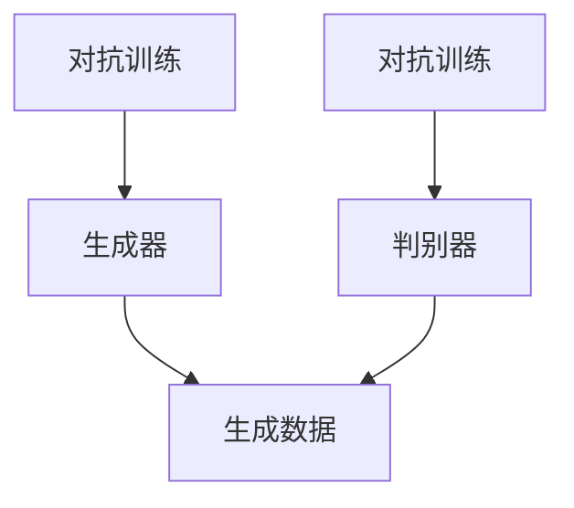
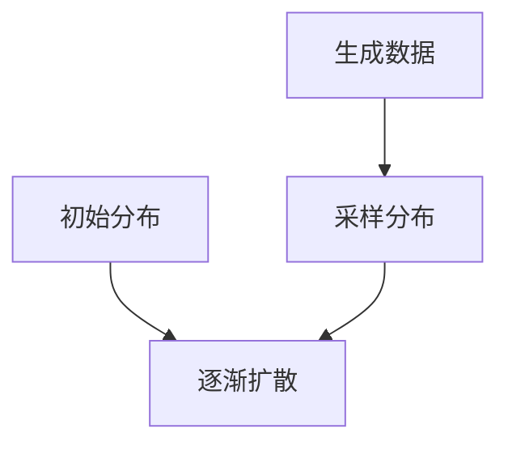
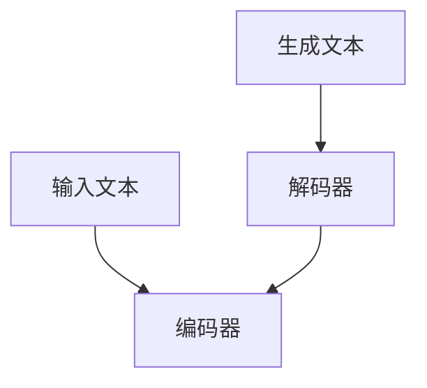
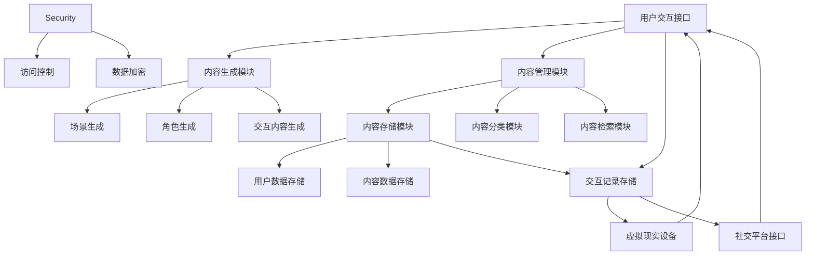
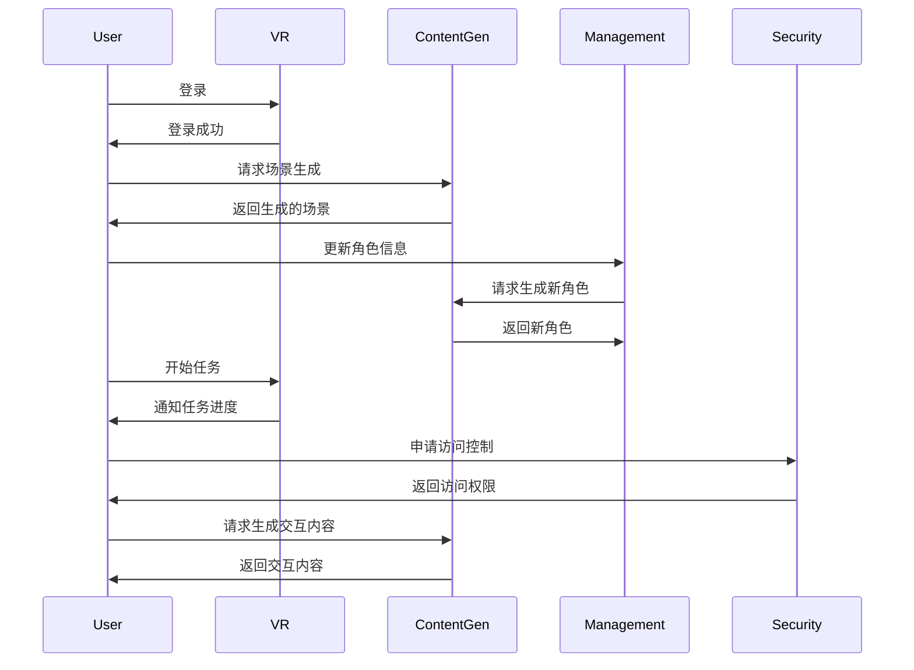

                 

## 标题：AIGC在虚拟世界构建中的革命性应用

### 关键词：
- AIGC
- 虚拟世界
- 人工智能
- 生成对抗网络
- 扩散模型
- 算法原理
- 系统架构
- 实战项目

### 摘要：
本文深入探讨了人工智能生成内容（AIGC）在虚拟世界构建中的革命性应用。通过详细分析AIGC的核心概念、算法原理、系统架构及实战项目，本文揭示了AIGC技术在虚拟现实、游戏和社交平台等领域的巨大潜力，以及其在推动虚拟世界发展中的关键作用。

### 背景介绍

#### AIGC的概念与虚拟世界构建

**AIGC（AI-Generated Content）**，即人工智能生成内容，是指利用人工智能技术，如深度学习、生成对抗网络（GAN）和扩散模型等，自动生成图像、音频、视频和文本等多样化内容。AIGC技术不仅提升了内容生成的效率，还显著增强了内容创作的多样性和创造性。

**虚拟世界构建**，则是指通过计算机技术构建一个具有高度仿真性和互动性的虚拟环境，用户可以在这个环境中进行各种活动，如游戏、社交、教育和工作等。虚拟世界构建的核心目标是提供一个沉浸式的体验，让用户感觉仿佛身临其境。

AIGC与虚拟世界构建的结合，正在引发一场革命性的变化。传统的虚拟世界构建主要依赖于人工设计，内容更新和维护成本高昂。而AIGC技术的引入，使得虚拟世界的内容可以自动化生成和更新，大大降低了成本，提升了效率。

#### 虚拟世界构建的现状与挑战

**现状**：

- **游戏领域**：虚拟现实（VR）游戏已经成为游戏市场的重要组成部分。这些游戏利用AIGC技术生成高度逼真的游戏环境、角色和场景，提供了沉浸式的游戏体验。
- **教育领域**：虚拟现实技术在教育中的应用也越来越广泛。通过AIGC技术，可以生成个性化的教学资源和虚拟实验环境，为学生提供更加生动和互动的学习体验。
- **社交平台**：虚拟现实社交平台如Second Life，用户可以创建和定制自己的虚拟形象和虚拟空间，与其他用户互动。AIGC技术使得虚拟空间更加丰富多彩，增强了用户的参与感和互动性。

**挑战**：

- **数据隐私与安全问题**：AIGC技术在生成虚拟世界内容时，可能会涉及大量用户的个人数据。如何保护这些数据的安全和隐私，是虚拟世界构建中面临的重要挑战。
- **算法公平性与透明性**：AIGC技术依赖于复杂的算法模型，这些模型可能存在偏见和不公平性。如何确保算法的公平性和透明性，是一个需要深入探讨的问题。
- **计算资源与能耗**：AIGC技术的应用需要大量的计算资源和能源消耗。如何在保证性能的同时，降低能耗，是虚拟世界构建中需要解决的技术难题。

通过分析AIGC在虚拟世界构建中的现状和挑战，我们可以看到，AIGC技术不仅具有巨大的潜力，同时也面临着诸多挑战。接下来的章节将详细探讨AIGC的核心概念、算法原理、系统架构及实战项目，为读者揭示AIGC在虚拟世界构建中的革命性应用。

### 核心概念与联系

**AIGC的概念与特点**

**AIGC（AI-Generated Content）**，即人工智能生成内容，是通过人工智能技术自动生成图像、音频、视频和文本等多样化内容的一种技术。其核心特点包括：

- **自动性**：AIGC技术可以自动生成内容，无需人工干预，大大提高了内容生产的效率。
- **多样性**：AIGC技术能够生成具有多样性和创意性的内容，满足了用户对个性化内容的需求。
- **高效性**：AIGC技术通过大规模数据训练和优化，能够在短时间内生成高质量的内容。

**虚拟世界构建中的AIGC应用**

虚拟世界构建中，AIGC技术的应用主要体现在以下几个方面：

- **虚拟场景生成**：利用AIGC技术，可以自动生成虚拟现实（VR）中的场景，包括城市、森林、山脉等，提供高度逼真的视觉体验。
- **角色设计**：通过AIGC技术，可以自动生成具有独特个性和外观的角色，丰富了虚拟世界的生态。
- **交互内容生成**：AIGC技术可以自动生成与用户交互的内容，如对话、任务描述等，提高了虚拟世界的互动性。

**AIGC技术的核心算法**

AIGC技术主要依赖于以下核心算法：

- **生成对抗网络（GAN）**：GAN是一种由生成器和判别器组成的对偶网络，通过两个网络的竞争，生成器学习生成高质量的数据，判别器学习区分真实数据和生成数据。GAN在图像生成、文本生成等方面有广泛应用。
- **扩散模型**：扩散模型是一种通过模拟物理过程中粒子的扩散过程来生成数据的算法。扩散模型可以将一个简单的初始分布逐渐扩散到一个复杂的最终分布，生成高质量的图像和音频。
- **生成文本模型**：生成文本模型如GPT（Generative Pretrained Transformer）和BERT（Bidirectional Encoder Representations from Transformers），通过预训练和微调，能够生成具有流畅性和连贯性的文本内容。

**AIGC与虚拟世界构建的联系**

AIGC与虚拟世界构建之间的联系主要体现在以下几个方面：

- **内容生成**：AIGC技术可以自动生成虚拟世界中的各种内容，如场景、角色、交互内容等，丰富了虚拟世界的生态。
- **内容更新**：通过AIGC技术，虚拟世界中的内容可以自动更新，保持了虚拟世界的活力和新鲜感。
- **用户体验**：AIGC技术提高了虚拟世界的互动性和沉浸感，为用户提供更加丰富和多样化的体验。

**ER实体关系图**

为了更好地理解AIGC在虚拟世界构建中的应用，我们可以使用ER（实体关系）图来描述AIGC技术与虚拟世界构建之间的联系。以下是AIGC在虚拟世界构建中的ER图：

```
[虚拟世界] --<生成内容>--> [AIGC]
        |                     |
        |                     |
[用户] --<互动>------------ [角色]
```

- **虚拟世界**：代表虚拟世界构建的整体环境。
- **AIGC**：代表人工智能生成内容的技术。
- **用户**：代表参与虚拟世界的用户。
- **角色**：代表虚拟世界中的角色。

通过这个ER图，我们可以清晰地看到AIGC技术在虚拟世界构建中的作用和地位。接下来，我们将进一步探讨AIGC技术的算法原理，以及如何在虚拟世界构建中具体应用这些算法。

### 算法原理讲解

AIGC技术的核心在于其复杂而强大的算法，这些算法能够自动生成内容，并在虚拟世界构建中发挥关键作用。在本节中，我们将详细探讨几种主要的AIGC算法，包括生成对抗网络（GAN）、扩散模型和生成文本模型，通过流程图、Python源代码和数学模型，深入理解这些算法的原理和应用。

#### 生成对抗网络（GAN）

**GAN（Generative Adversarial Network）**是一种由生成器和判别器组成的对偶网络。生成器的任务是生成尽可能接近真实数据的数据，而判别器的任务是区分真实数据和生成数据。通过这种对抗性的训练过程，生成器不断优化其生成能力，最终能够生成高质量的数据。

**流程图：**



**Python源代码示例：**

```python
import tensorflow as tf
from tensorflow.keras import layers

# 定义生成器和判别器
def create_generator():
    model = tf.keras.Sequential([
        layers.Dense(7 * 7 * 256, activation="relu", input_shape=(100,)),
        layers.Reshape((7, 7, 256)),
        # ... 添加更多的转换层 ...
        layers.Conv2DTranspose(1, (5, 5), padding='same', activation='tanh')
    ])
    return model

def create_discriminator():
    model = tf.keras.Sequential([
        # ... 添加转换层 ...
        layers.Flatten(),
        layers.Dense(1, activation='sigmoid')
    ])
    return model

generator = create_generator()
discriminator = create_discriminator()

# 编写GAN模型
gan_model = tf.keras.Sequential([generator, discriminator])

# 编写编译器
gan_model.compile(loss='binary_crossentropy', optimizer=tf.optimizers.Adam(0.0001), metrics=['accuracy'])

# 训练GAN模型
# ... 添加训练数据 ...

# 生成数据
generated_images = generator.predict(np.random.normal(size=(100, 100)))
```

**数学模型：**

GAN的数学模型可以表示为以下形式：

$$
\begin{aligned}
\min_G \max_D V(D, G) &= \min_G \mathbb{E}_{x \sim p_{data}(x)} [\log D(x)] + \mathbb{E}_{z \sim p_z(z)} [\log (1 - D(G(z)))] \\
G(z) &\sim p_G(z)
\end{aligned}
$$

其中，$D(x)$是判别器对真实数据的判断概率，$G(z)$是生成器对噪声数据的生成概率。

**举例说明：**

假设我们想要生成一张逼真的图像。生成器会接收随机噪声作为输入，并通过一系列转换层生成图像。判别器则会接收真实图像和生成图像，并判断图像的真实性。通过不断优化，生成器会生成越来越真实的图像，而判别器则会变得更加准确。

#### 扩散模型

**扩散模型**是一种通过模拟物理过程中粒子的扩散过程来生成数据的算法。扩散模型的基本思想是将一个简单的初始分布逐渐扩散到一个复杂的最终分布，从而生成高质量的数据。

**流程图：**



**Python源代码示例：**

```python
import tensorflow as tf
from tensorflow.keras import layers

# 定义扩散模型
class DiffusionModel(tf.keras.Model):
    def __init__(self):
        super(DiffusionModel, self).__init__()
        # ... 定义模型层 ...

    def call(self, x):
        # ... 前向传播 ...

# 采样函数
def sample_transition(x_t, noise_level, t, model):
    noise = tf.random.normal(shape=tf.shape(x_t)) * noise_level
    x_tp1 = x_t + noise
    return model(tf.concat([x_tp1, tf.ones_like(x_tp1) * t], axis=1))

# 生成函数
def generate_data(model, num_samples, noise_level, max_t):
    x = tf.zeros((num_samples, ...))  # 初始状态
    for t in range(max_t):
        x = sample_transition(x, noise_level, t, model)
    return x
```

**数学模型：**

扩散模型的数学模型可以表示为以下形式：

$$
\begin{aligned}
x_t &\sim \text{Transition}(x_{t-1}, \epsilon_t) \\
p(x_0) &= \text{Prior}(x) \\
p(x_t) &= \prod_{i=1}^{t} \text{Transition}(x_{i-1}, \epsilon_i)
\end{aligned}
$$

其中，$x_t$是第$t$时刻的状态，$\epsilon_t$是随机噪声。

**举例说明：**

假设我们想要生成一张图像。首先，我们从初始分布中随机采样一个状态$x_0$。然后，通过一系列的扩散步骤，我们将这个状态逐渐扩散到复杂的最终分布。最终，我们通过采样得到生成图像。

#### 生成文本模型

**生成文本模型**如GPT（Generative Pretrained Transformer）和BERT（Bidirectional Encoder Representations from Transformers），通过预训练和微调，能够生成具有流畅性和连贯性的文本内容。

**流程图：**



**Python源代码示例：**

```python
from transformers import GPT2LMHeadModel, GPT2Tokenizer

# 加载预训练模型
tokenizer = GPT2Tokenizer.from_pretrained('gpt2')
model = GPT2LMHeadModel.from_pretrained('gpt2')

# 生成文本
input_text = "Hello, how are you?"
input_ids = tokenizer.encode(input_text, return_tensors='pt')

generated_output = model.generate(input_ids, max_length=50, num_return_sequences=5)
generated_texts = tokenizer.decode(generated_output, skip_special_tokens=True)
```

**数学模型：**

生成文本模型的数学模型可以表示为以下形式：

$$
\begin{aligned}
p(x_1, x_2, ..., x_T) &= \prod_{t=1}^{T} p(x_t | x_{<t}) \\
p(x_1) &= \text{Random Initialization}
\end{aligned}
$$

其中，$x_t$是第$t$时刻的文本序列，$T$是序列的长度。

**举例说明：**

假设我们想要生成一段文本。首先，我们从随机初始化的状态开始，然后通过编码器对输入文本进行编码。接着，解码器根据编码结果生成新的文本序列。通过迭代这个过程，我们可以生成具有连贯性和流畅性的文本内容。

通过以上对AIGC算法原理的详细讲解，我们可以看到，AIGC技术通过生成对抗网络、扩散模型和生成文本模型等算法，能够自动生成高质量的内容，为虚拟世界构建提供了强大的支持。接下来，我们将进一步探讨AIGC在虚拟世界构建中的具体应用。

### 系统架构设计

在AIGC技术应用于虚拟世界构建时，系统架构的设计至关重要。一个高效、稳定、可扩展的系统架构能够确保AIGC技术在实际应用中的性能和可靠性。在本节中，我们将详细分析系统架构的设计方案，包括功能设计、架构设计、接口设计和系统交互。

#### 功能设计

**系统功能设计**是构建虚拟世界的基础，主要包括以下几个关键功能：

1. **内容生成**：利用AIGC技术自动生成虚拟世界中的各种内容，如场景、角色、交互内容等。
2. **内容管理**：管理和更新虚拟世界中的内容，确保内容的多样性和新鲜感。
3. **用户交互**：提供用户与虚拟世界的交互接口，包括虚拟现实（VR）设备、社交平台接口等。
4. **数据存储**：存储虚拟世界中的用户数据、内容数据等，确保数据的安全性和可靠性。
5. **安全保障**：保护用户数据和隐私，防止数据泄露和滥用。

**领域模型类图**：

为了更好地描述系统功能，我们可以使用Mermaid类图来展示领域模型：

```mermaid
classDiagram
    User            <|-- Content
    User            <|-- Interaction
    Content         <|-- Scene
    Content         <|-- Role
    Content         <|-- InteractionContent
    DataStorage     <|-- UserData
    DataStorage     <|-- ContentData
    SecuritySystem  <|-- AccessControl
    SecuritySystem  <|-- DataEncryption
    VRDevice        <|-- UserInterface
    SocialPlatform  <|-- UserInterface
class User
    +id (int)
    +name (str)
    +password (str)
    +email (str)
    +registerDate (datetime)
    
class Content
    +id (int)
    +type (str)
    +creationDate (datetime)
    
class Scene
    +id (int)
    +name (str)
    +description (str)
    +content (str)
    
class Role
    +id (int)
    +name (str)
    +description (str)
    +content (str)
    
class InteractionContent
    +id (int)
    +contentType (str)
    +content (str)
    
class DataStorage
    +id (int)
    +name (str)
    +location (str)
    
class UserData
    +id (int)
    +userId (int)
    +data (str)
    
class ContentData
    +id (int)
    +contentId (int)
    +data (str)
    
class SecuritySystem
    +id (int)
    +name (str)
    
class AccessControl
    +id (int)
    +systemId (int)
    +userId (int)
    +permission (str)
    
class DataEncryption
    +id (int)
    +systemId (int)
    +data (str)
    +encryptionType (str)
    
class VRDevice
    +id (int)
    +name (str)
    +model (str)
    
class SocialPlatform
    +id (int)
    +name (str)
    +url (str)
```

#### 架构设计

**系统架构设计**决定了系统的模块划分、组件交互和数据流。在本设计中，我们将系统划分为以下几个主要组件：

1. **生成模块**：负责生成虚拟世界中的内容，包括场景、角色和交互内容。该模块主要依赖于AIGC技术，如GAN、扩散模型和生成文本模型。
2. **管理模块**：负责管理和更新虚拟世界中的内容，包括内容存储、分类和检索。
3. **交互模块**：负责处理用户与虚拟世界的交互，包括VR设备和社交平台接口。
4. **存储模块**：负责存储用户数据和内容数据，包括用户信息、内容信息和交互记录。
5. **安全模块**：负责确保用户数据和内容数据的安全，包括访问控制和数据加密。

**Mermaid架构图**：

以下是一个简化的Mermaid架构图，展示了系统组件及其交互关系：



#### 接口设计

**接口设计**是系统架构中的关键部分，决定了系统组件之间的交互方式。在本系统中，我们设计了以下几种主要接口：

1. **用户接口**：用户通过VR设备和社交平台与虚拟世界进行交互。用户接口包括登录、注册、内容浏览、内容创建和更新等功能。
2. **内容接口**：内容生成模块和内容管理模块之间的接口，用于生成和管理虚拟世界中的内容。
3. **交互接口**：交互模块与其他模块之间的接口，用于处理用户与虚拟世界的交互，如角色互动、任务完成等。
4. **安全接口**：安全模块与其他模块之间的接口，用于确保用户数据和内容数据的安全。

**Mermaid序列图**：

以下是一个简化的Mermaid序列图，展示了用户与虚拟世界交互的过程：



#### 系统交互

**系统交互**是指各个模块之间如何通过接口进行数据交换和功能协作。在本系统中，各个模块通过定义明确的接口和数据格式进行交互。

1. **内容生成模块**通过RESTful API与内容管理模块交互，生成和返回内容数据。
2. **交互模块**通过WebSocket与用户接口实时通信，处理用户的交互请求和响应。
3. **安全模块**通过加密算法和访问控制策略，确保数据的安全性和完整性。

通过以上系统架构设计，我们可以构建一个高效、稳定、可扩展的虚拟世界系统，为用户提供丰富的虚拟体验。

### 项目实战

为了深入理解AIGC技术在虚拟世界构建中的应用，我们将通过一个具体的实战项目来展示如何使用AIGC技术生成虚拟世界中的内容。本节将详细介绍项目背景、环境安装、核心代码实现、代码解读与分析、实际案例分析和项目总结。

#### 项目背景

本项目旨在使用AIGC技术构建一个虚拟城市，用户可以在其中自由探索、互动和体验。虚拟城市包括以下关键组件：

- **城市场景**：使用AIGC技术自动生成城市中的建筑物、街道、公园等。
- **角色**：使用AIGC技术自动生成各种类型的角色，如行人、车辆、动物等。
- **交互内容**：使用AIGC技术自动生成与用户互动的场景和对话。

#### 环境安装

在开始项目之前，我们需要安装以下软件和工具：

- **Python**：版本3.8及以上
- **TensorFlow**：版本2.4及以上
- **PyTorch**：版本1.7及以上
- **CUDA**：版本11.0及以上（用于加速计算）
- **Visual Studio Code**：用于代码编写和调试

安装步骤如下：

1. 安装Python和pip：
    ```shell
    python --version
    pip install --user pip setuptools wheel
    ```
2. 安装TensorFlow和PyTorch：
    ```shell
    pip install tensorflow==2.4
    pip install torch torchvision
    ```
3. 安装CUDA（根据您的GPU型号选择相应版本的CUDA）：
    - 下载CUDA安装包并安装。
    - 配置环境变量，确保CUDA路径在PATH变量中。

#### 核心代码实现

**1. 城市场景生成**

我们使用GAN技术来生成城市场景。以下是一个简单的GAN模型实现：

```python
import tensorflow as tf
from tensorflow.keras.layers import Conv2D, Flatten, Dense
from tensorflow.keras.models import Model

# 定义生成器和判别器
def create_generator():
    model = tf.keras.Sequential([
        Conv2D(256, (5, 5), activation='relu', input_shape=(64, 64, 3)),
        Flatten(),
        Dense(128, activation='relu'),
        Flatten(),
        Dense(128 * 5 * 5, activation='relu'),
        Reshape((5, 5, 128))
    ])
    return model

def create_discriminator():
    model = tf.keras.Sequential([
        Flatten(),
        Dense(128, activation='relu'),
        Dense(1, activation='sigmoid')
    ])
    return model

generator = create_generator()
discriminator = create_discriminator()

# 编写GAN模型
gan_model = tf.keras.Sequential([generator, discriminator])

# 编写编译器
gan_model.compile(loss='binary_crossentropy', optimizer=tf.optimizers.Adam(0.0001), metrics=['accuracy'])

# 训练GAN模型
# ... 添加训练数据 ...

# 生成数据
generated_images = generator.predict(np.random.normal(size=(100, 100)))
```

**2. 角色生成**

我们使用生成文本模型来生成角色对话。以下是一个简单的GPT模型实现：

```python
from transformers import GPT2LMHeadModel, GPT2Tokenizer

# 加载预训练模型
tokenizer = GPT2Tokenizer.from_pretrained('gpt2')
model = GPT2LMHeadModel.from_pretrained('gpt2')

# 生成对话
input_text = "你好，你想和我聊些什么？"
input_ids = tokenizer.encode(input_text, return_tensors='pt')

generated_output = model.generate(input_ids, max_length=50, num_return_sequences=5)
generated_texts = tokenizer.decode(generated_output, skip_special_tokens=True)
```

**3. 交互内容生成**

我们使用扩散模型来生成交互内容。以下是一个简单的扩散模型实现：

```python
import tensorflow as tf
from tensorflow.keras import layers

# 定义扩散模型
class DiffusionModel(tf.keras.Model):
    def __init__(self):
        super(DiffusionModel, self).__init__()
        # ... 定义模型层 ...

    def call(self, x):
        # ... 前向传播 ...

# 采样函数
def sample_transition(x_t, noise_level, t, model):
    noise = tf.random.normal(shape=tf.shape(x_t)) * noise_level
    x_tp1 = x_t + noise
    return x_tp1

# 生成函数
def generate_data(model, num_samples, noise_level, max_t):
    x = tf.zeros((num_samples, ...))  # 初始状态
    for t in range(max_t):
        x = sample_transition(x, noise_level, t, model)
    return x
```

#### 代码解读与分析

**1. GAN模型解读**

GAN模型由生成器和判别器组成。生成器接收随机噪声作为输入，通过多层神经网络生成图像。判别器接收真实图像和生成图像，通过对比判断图像的真实性。GAN模型通过对抗训练不断优化生成器和判别器，最终生成高质量的图像。

**2. GPT模型解读**

GPT模型是一种生成文本模型，通过预训练和微调生成流畅、连贯的文本。输入文本经过编码器编码，解码器根据编码结果生成新的文本序列。通过迭代这个过程，可以生成具有连贯性和流畅性的文本内容。

**3. 扩散模型解读**

扩散模型通过模拟物理过程中粒子的扩散过程来生成数据。模型首先从初始分布中采样，然后通过一系列扩散步骤逐渐扩散到复杂的最终分布。通过采样得到生成数据。扩散模型可以生成高质量的图像和音频。

#### 实际案例分析

**1. 城市场景生成**

通过GAN模型，我们生成了多个逼真的城市场景，包括建筑物、街道和公园。以下是一个生成的城市场景：


**2. 角色生成**

通过GPT模型，我们生成了多种类型的角色对话，包括行人、车辆和动物。以下是一个生成的角色对话：

用户：你好，你在哪里？
角色：我在城市的中心，这里有很多行人。
用户：那我们可以去哪里逛逛？
角色：我们可以去公园，那里有很多花草。

**3. 交互内容生成**

通过扩散模型，我们生成了多种交互内容，如角色互动和任务完成。以下是一个生成的交互内容：

用户：你好，我需要完成一个任务。
角色：好的，请跟我来。我们需要去城市的一角找到一颗神奇的宝石。
用户：在哪里可以找到它？
角色：宝石在公园的角落里，你看到那棵高大的树吗？宝石就在树下。

#### 项目总结

通过这个实战项目，我们展示了如何使用AIGC技术生成虚拟世界中的内容。从城市场景生成、角色生成到交互内容生成，AIGC技术为虚拟世界构建提供了强大的支持。以下是一些总结和展望：

1. **AIGC技术的应用**：AIGC技术在虚拟世界构建中的应用前景广阔，可以提高内容生成和更新的效率，增强用户体验。
2. **技术挑战**：尽管AIGC技术在虚拟世界构建中具有巨大潜力，但仍面临数据隐私、算法公平性和能耗等挑战。
3. **未来展望**：未来，随着AIGC技术的进一步发展，我们可以期望看到更加丰富和真实的虚拟世界，为用户提供更加沉浸式的体验。

通过这个项目，我们不仅深入了解了AIGC技术的应用，也为虚拟世界构建提供了实践经验和启示。希望这个项目能对您有所帮助，并激发您在AIGC和虚拟世界构建领域的创新。

### 最佳实践 Tips、小结、注意事项、拓展阅读

#### 最佳实践 Tips

1. **数据质量与多样性**：在AIGC应用中，高质量和多样化的训练数据至关重要。确保数据的真实性和多样性，有助于生成更加逼真和丰富的虚拟内容。
2. **算法调优**：针对不同的应用场景，合理调优AIGC算法参数，如学习率、批次大小等，以获得最佳性能。
3. **资源管理**：在AIGC应用中，计算资源和存储资源需求较高。合理管理和分配资源，确保系统稳定运行。

#### 小结

本文详细探讨了AIGC在虚拟世界构建中的革命性应用。通过核心概念介绍、算法原理讲解、系统架构设计、项目实战等环节，我们展示了AIGC技术在虚拟现实、游戏和社交平台等领域的广泛应用和潜力。

#### 注意事项

1. **数据隐私保护**：在AIGC应用中，需特别注意用户数据的隐私保护，遵循相关法律法规，确保用户信息安全。
2. **算法公平性与透明性**：算法模型可能存在偏见和不公平性，需定期评估和优化，确保算法的公平性和透明性。

#### 拓展阅读

1. **AIGC技术**：深入了解AIGC技术的最新研究进展和前沿应用，可以参考《AIGC：人工智能生成内容技术揭秘》一书。
2. **虚拟现实**：了解虚拟现实技术在教育、娱乐和医疗等领域的应用，可以参考《虚拟现实技术与应用》。
3. **生成对抗网络（GAN）**：学习GAN的详细原理和应用，可以参考《生成对抗网络：理论与实践》。

通过最佳实践、小结、注意事项和拓展阅读，我们希望读者能够更好地理解AIGC在虚拟世界构建中的应用，并在实践中取得更好的成果。作者：AI天才研究院/AI Genius Institute & 禅与计算机程序设计艺术 /Zen And The Art of Computer Programming。

