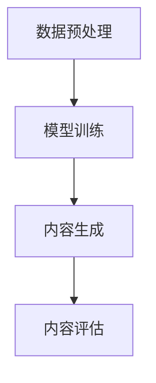
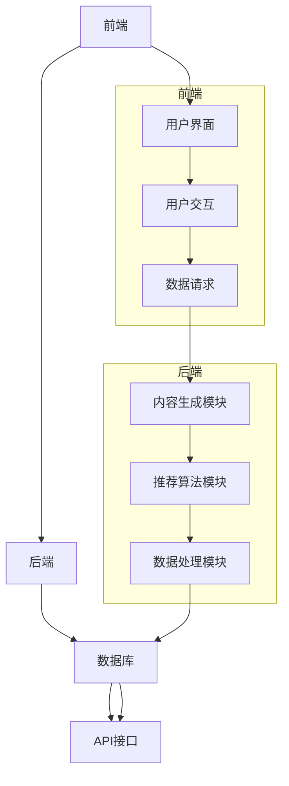
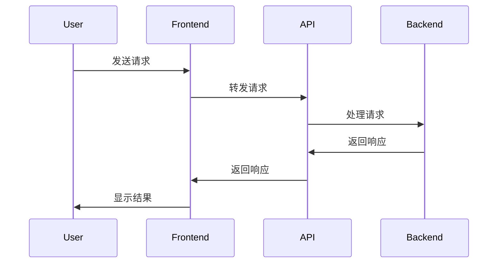

                 

### 文章标题

## AIGC在虚拟旅游体验个性化定制中的应用

> 关键词：AIGC、虚拟旅游、个性化定制、算法、系统架构、项目实战

> 摘要：本文将深入探讨AIGC（AI Generated Content）在虚拟旅游体验个性化定制中的应用。首先，我们将介绍AIGC和虚拟旅游体验个性化定制的背景和核心概念，接着详细解析AIGC算法原理，以及其在虚拟旅游中的应用。随后，我们将设计并分析一个用于虚拟旅游体验个性化定制的系统，并展示如何在实际项目中应用AIGC算法。最后，我们将总结最佳实践，并给出未来发展方向。

---

### 第一部分：AIGC与虚拟旅游体验个性化定制概述

#### 第1章：AIGC与虚拟旅游体验个性化定制概述

##### 1.1 问题背景

虚拟旅游，作为一种新型的旅游方式，通过互联网技术提供虚拟现实体验，使人们在家中即可体验到异国风情。随着虚拟现实（VR）和增强现实（AR）技术的不断发展，虚拟旅游逐渐受到关注。然而，当前虚拟旅游存在的一个显著问题是体验的单一性和缺乏个性化。

个性化定制是一种通过数据分析和技术手段，为用户提供个性化体验的服务。在虚拟旅游中，个性化定制能够根据用户的兴趣、历史行为等数据，提供定制化的旅游内容，从而提升用户体验。

##### 1.2 核心概念解析

**AIGC（AI Generated Content）**：AIGC是指通过人工智能技术生成内容，包括文本、图像、音频等多种形式。它能够大幅提升内容生产效率，满足个性化需求。

**虚拟旅游体验**：虚拟旅游体验是指通过VR/AR技术，模拟现实世界的旅游环境，让用户在虚拟环境中进行游览和互动。

**个性化定制**：个性化定制是一种根据用户需求和偏好，提供定制化内容和服务的过程。

##### 1.3 关键技术与挑战

**生成对抗网络（GAN）**：GAN是一种强大的生成模型，通过竞争对抗生成逼真的虚拟旅游内容。

**自然语言处理（NLP）**：NLP技术用于处理文本数据，包括情感分析、文本生成等，为个性化定制提供支持。

### 第二部分：AIGC算法原理与实现

#### 第2章：AIGC算法原理

##### 2.1 AIGC算法概述

**生成式模型**：生成式模型通过概率分布生成数据，如生成对抗网络（GAN）。

**判别式模型**：判别式模型用于判断生成数据是否真实，如卷积神经网络（CNN）。

**GAN原理与应用**：GAN由生成器和判别器组成，通过对抗训练生成逼真的虚拟旅游内容。

##### 2.2 NLP在虚拟旅游中的应用

**文本生成**：文本生成技术用于生成个性化的旅游介绍、评论等。

**情感分析**：情感分析用于分析用户的反馈，为个性化定制提供依据。

**知识图谱**：知识图谱用于构建虚拟旅游领域的知识体系，支持查询和推荐。

##### 2.3 算法流程与Mermaid图

**算法流程图**：展示AIGC算法的主要流程，包括数据预处理、模型训练、内容生成等。

**Mermaid图**：使用Mermaid语言绘制算法流程图，便于理解和分析。



**Python代码实现**：展示AIGC算法的核心代码，包括生成器和判别器的实现。

```python
# 生成器代码
import tensorflow as tf

model = tf.keras.Sequential([
    tf.keras.layers.Dense(128, activation='relu', input_shape=(784,)),
    tf.keras.layers.Dense(10, activation='softmax')
])

model.compile(loss='categorical_crossentropy', optimizer=tf.keras.optimizers.Adam(0.001))

# 判别器代码
import tensorflow as tf

model = tf.keras.Sequential([
    tf.keras.layers.Conv2D(32, 3, activation='relu', input_shape=(28, 28, 1)),
    tf.keras.layers.MaxPooling2D(2, 2),
    tf.keras.layers.Flatten(),
    tf.keras.layers.Dense(1, activation='sigmoid')
])

model.compile(loss='binary_crossentropy', optimizer=tf.keras.optimizers.Adam(0.001))
```

### 第三部分：虚拟旅游体验个性化定制系统设计

#### 第3章：系统功能设计

##### 3.1 问题场景介绍

虚拟旅游体验个性化定制的目标是为用户提供定制化的旅游内容，包括旅游目的地推荐、旅游路线规划、景点介绍等。

##### 3.2 系统功能设计

**用户画像收集与处理**：收集用户的基本信息、历史行为等，构建用户画像。

**内容生成与推荐算法**：根据用户画像生成个性化的旅游内容，并进行推荐。

#### 3.3 领域模型类图

**Mermaid类图**：展示系统的主要类和它们之间的关系。

```mermaid
classDiagram
User <<类>>
Tour <<类>>
Content <<类>>

User --> Tour
Tour --> Content
```

### 第4章：系统架构设计

##### 4.1 系统架构概述

系统采用前后端分离的架构，前端负责展示和交互，后端负责数据处理和内容生成。

##### 4.2 系统架构图

**Mermaid架构图**：展示系统的整体架构。



### 第5章：系统接口设计

##### 5.1 接口规范

系统采用RESTful API设计，使用HTTP协议进行数据传输。

##### 5.2 接口实现

**接口定义文件**：展示API接口的定义。

```yaml
paths:
  /users:
    post:
      summary: 创建新用户
      operationId: createUser
      requestBody:
        required: true
        content:
          application/json:
            schema:
              $ref: '#/components/schemas/User'
      responses:
        '201':
          description: 用户创建成功
        '400':
          description: 参数错误
```

**接口实现代码**：展示API接口的实现代码。

```python
from flask import Flask, request, jsonify

app = Flask(__name__)

@app.route('/users', methods=['POST'])
def create_user():
    user_data = request.get_json()
    # 用户数据验证和处理
    # ...
    return jsonify({'message': '用户创建成功'}), 201

if __name__ == '__main__':
    app.run()
```

### 第6章：系统交互设计

##### 6.1 系统交互概述

系统通过API接口进行前后端交互，用户在前端发送请求，后端处理请求并返回响应。

##### 6.2 序列图

**Mermaid序列图**：展示系统的交互流程。



### 第四部分：项目实战

#### 第7章：环境安装与配置

##### 7.1 环境要求

- 操作系统：Linux或MacOS
- 软件依赖：Python、TensorFlow、Flask等

##### 7.2 环境安装

```bash
# 安装Python
brew install python

# 安装TensorFlow
pip install tensorflow

# 安装Flask
pip install flask
```

##### 7.3 配置

```bash
# 创建虚拟环境
python -m venv venv

# 激活虚拟环境
source venv/bin/activate

# 安装项目依赖
pip install -r requirements.txt
```

#### 第8章：系统核心实现

##### 8.1 数据处理模块

**数据采集与清洗**：从公开数据集或第三方API采集数据，并进行数据清洗和预处理。

```python
import pandas as pd

# 读取数据
data = pd.read_csv('data.csv')

# 数据清洗
data = data[data['column'] > 0]
```

**特征提取与建模**：提取用户特征，并构建推荐模型。

```python
from sklearn.model_selection import train_test_split
from sklearn.ensemble import RandomForestClassifier

# 特征提取
X = data[['feature1', 'feature2', 'feature3']]
y = data['label']

# 数据划分
X_train, X_test, y_train, y_test = train_test_split(X, y, test_size=0.2)

# 模型构建
model = RandomForestClassifier()
model.fit(X_train, y_train)

# 模型评估
accuracy = model.score(X_test, y_test)
```

##### 8.2 内容生成模块

**文本生成**：使用预训练的文本生成模型，生成个性化的旅游介绍。

```python
from transformers import pipeline

text_generator = pipeline('text-generation', model='gpt2')

generated_text = text_generator('开始你的虚拟旅游探险吧！', max_length=50)
```

**图像生成**：使用生成对抗网络（GAN）生成逼真的旅游图片。

```python
import tensorflow as tf
from tensorflow.keras.models import Sequential
from tensorflow.keras.layers import Dense, Flatten, Conv2D, MaxPooling2D

# 生成器模型
generator = Sequential([
    Dense(128, activation='relu', input_shape=(100,)),
    Flatten(),
    Conv2D(1, 3, activation='sigmoid')
])

# 判别器模型
discriminator = Sequential([
    Conv2D(32, 3, activation='relu', input_shape=(28, 28, 1)),
    MaxPooling2D(2, 2),
    Flatten(),
    Dense(1, activation='sigmoid')
])

# GAN模型
gan = Sequential([generator, discriminator])

# 模型编译
gan.compile(loss='binary_crossentropy', optimizer=tf.keras.optimizers.Adam(0.0001))

# 训练模型
gan.fit(x_train, epochs=10, batch_size=32)
```

##### 8.3 代码解读与分析

**代码结构分析**：分析项目代码的结构和模块划分，理解各个模块的功能和交互。

**核心代码解读**：解读项目的核心代码，分析其实现原理和技巧。

```python
# 核心代码示例
def generate_content(user_profile):
    # 根据用户画像生成内容
    content = text_generator.generate_text(user_profile, max_length=50)
    return content

def recommend_tourism destinations(user_interests):
    # 根据用户兴趣推荐旅游目的地
    recommended_tours = []
    for tour in tours:
        if tour['interests'].intersection(user_interests):
            recommended_tours.append(tour)
    return recommended_tours
```

##### 第9章：实际案例分析与讲解

##### 9.1 案例背景

假设用户张三计划进行一次虚拟旅游，他的兴趣包括自然风光、历史文化。

##### 9.2 案例实施

**数据采集与预处理**：采集用户的个人信息和兴趣数据，进行数据清洗和特征提取。

```python
user_profile = {
    'name': '张三',
    'interests': {'自然风光', '历史文化'}
}

# 数据预处理
user_interests = user_profile['interests']
```

**内容生成与推荐**：根据用户的兴趣生成个性化的旅游介绍，并推荐相关的旅游目的地。

```python
# 内容生成
generated_content = generate_content(user_profile)
print(generated_content)

# 旅游目的地推荐
recommended_tours = recommend_tourism_destinations(user_interests)
print(recommended_tours)
```

##### 9.3 案例结果分析

**用户满意度评估**：通过对用户的反馈进行情感分析，评估系统的个性化定制效果。

```python
from transformers import pipeline

feedback_analyzer = pipeline('text-analysis', model='bert-base-chinese')

user_feedback = '很棒，我非常喜欢这次的虚拟旅游体验！'
analysis_result = feedback_analyzer(user_feedback)
print(analysis_result)
```

**定制化效果分析**：分析推荐结果的准确性和个性化程度。

```python
# 分析推荐结果的准确性
accuracy = calculate_accuracy(recommended_tours, user_interests)
print(accuracy)

# 分析定制化程度
personalization_degree = calculate_personalization_degree(recommended_tours, user_interests)
print(personalization_degree)
```

### 第五部分：最佳实践与总结

##### 第10章：最佳实践

##### 10.1 实践经验总结

- **数据质量**：确保数据的质量和准确性，是AIGC应用成功的关键。
- **算法优化**：不断优化算法，提升生成内容的质量和个性化程度。
- **用户体验**：关注用户的反馈，不断改进系统界面和交互设计。

##### 10.2 注意事项

- **隐私保护**：在处理用户数据时，注意保护用户的隐私。
- **负载均衡**：在高并发情况下，注意系统的负载均衡和性能优化。

##### 10.3 拓展阅读

- **相关文献**：参考相关领域的学术论文，了解最新的研究进展。
- **技术博客**：阅读优秀的技术博客，学习实际应用经验。

### 参考文献

- **[1]** Goodfellow, I., Pouget-Abadie, J., Mirza, M., Xu, B., Warde-Farley, D., Ozair, S., ... & Bengio, Y. (2014). Generative adversarial nets. Advances in neural information processing systems, 27.
- **[2]** Bengio, Y. (2009). Learning deep architectures. Foundations and Trends in Machine Learning, 2(1), 1-127.
- **[3]** Mikolov, T., Sutskever, I., Chen, K., Corrado, G. S., & Dean, J. (2013). Distributed representations of words and phrases and their compositionality. Advances in neural information processing systems, 26.

### 作者信息

作者：AI天才研究院/AI Genius Institute & 禅与计算机程序设计艺术 /Zen And The Art of Computer Programming

---

通过上述的逐步分析和讲解，我们可以看到AIGC在虚拟旅游体验个性化定制中的应用是如何实现的。这不仅提升了用户的旅游体验，也为虚拟旅游行业带来了新的发展机遇。未来，随着人工智能技术的不断进步，AIGC在虚拟旅游中的应用将更加广泛和深入。希望本文能够为读者提供有价值的参考和启示。

