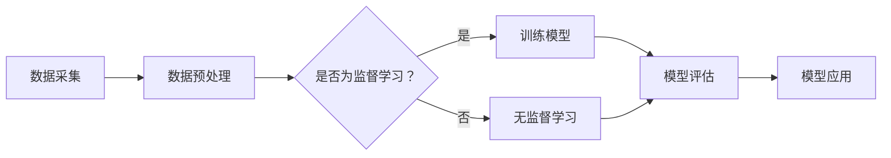
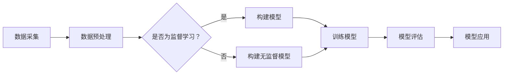
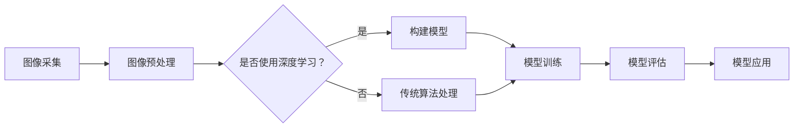
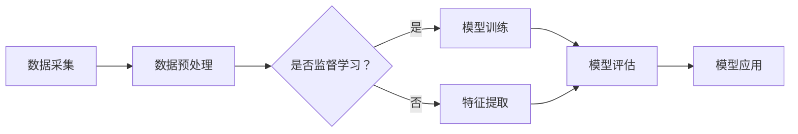
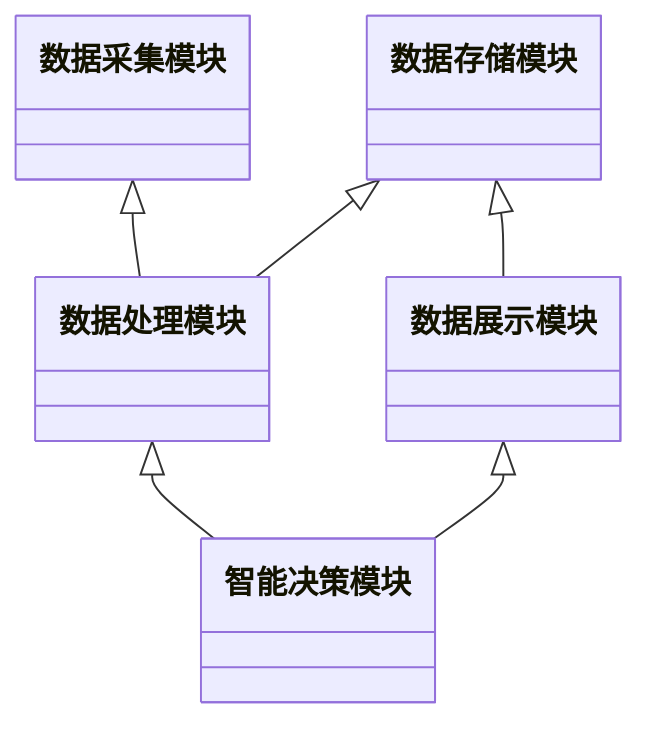
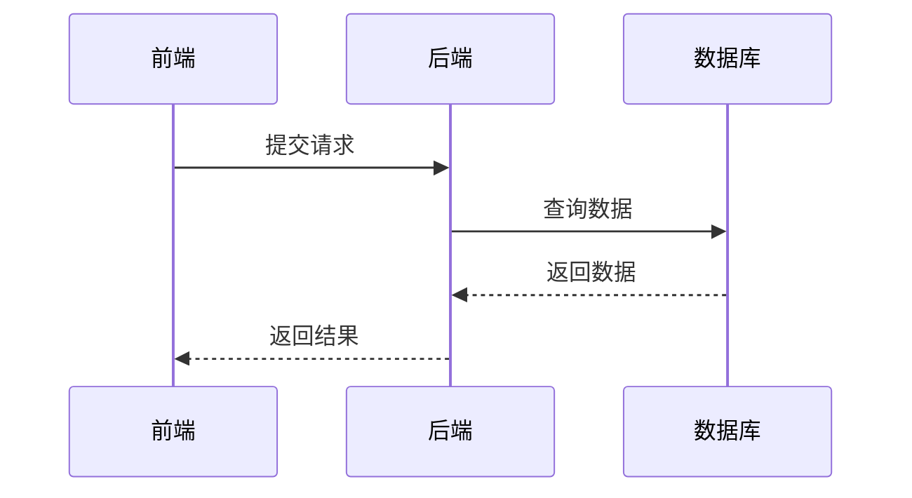
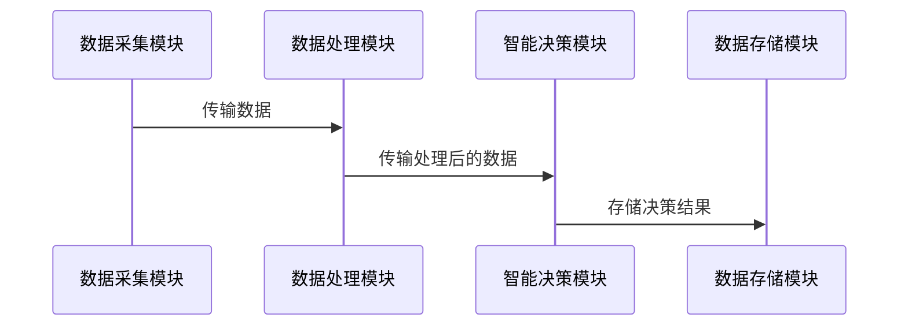
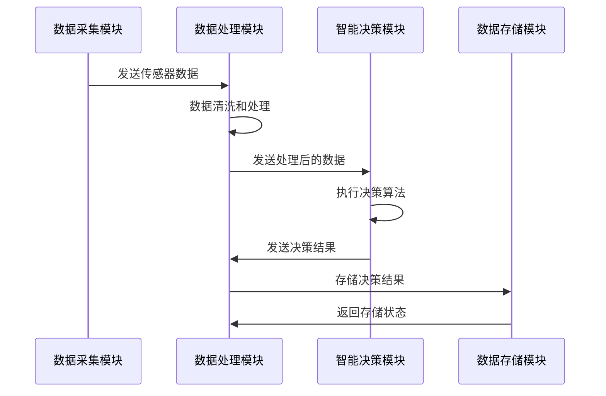

                 

### 第1章：问题背景与目标

#### 1.1 问题背景

农业，作为人类生存发展的基石，一直在社会经济发展中占据着重要地位。然而，随着全球人口的不断增长和资源环境的日益紧张，传统的农业模式面临着越来越多的挑战。资源浪费、生产效率低下、环境污染等问题日益凸显，迫切需要引入新的技术手段来解决这些问题。

AI技术的迅猛发展，为农业提供了新的解决方案。通过机器学习、深度学习、计算机视觉等AI技术，农业可以实现精准管理，提高产量和资源利用率，减少环境污染，推动农业现代化进程。AI在农业中的应用，不仅仅是提高农业生产效率，更是实现农业可持续发展的重要途径。

#### 1.2 问题描述

在农业中，主要面临以下几方面的问题：

1. **资源浪费**：传统的农业模式通常依赖于大量的水资源、肥料和农药，造成了大量的资源浪费和环境污染。
2. **生产效率低下**：农业生产过程中，无法精确掌握作物的生长状态，导致生产效率低下。
3. **环境问题**：农业生产过程中产生的污染物，对环境造成了严重的影响。

这些问题不仅制约了农业的发展，也对人类的生存环境产生了负面影响。因此，如何利用AI技术解决这些问题，提高农业的可持续性，成为当前研究的重点。

#### 1.3 问题解决

AI技术在农业中的应用，可以从以下几个方面入手：

1. **精准农业**：通过AI技术，实现对作物生长状态的精准监控，从而实现精准施肥、灌溉和病虫害防治，提高资源利用效率。
2. **智能监测与预警**：利用AI技术，对农业生产环境进行实时监测，及时发现并预警潜在的环境问题，避免环境恶化。
3. **智能决策支持**：通过AI技术，为农业生产提供智能决策支持，优化生产过程，提高生产效率。

通过这些方法，AI技术可以有效解决农业中存在的问题，提高农业的可持续性，推动农业现代化发展。

#### 1.4 边界与外延

AI在农业中的应用，涉及多个领域，包括但不限于：

- **智能农业**：利用AI技术实现农业生产过程的智能化。
- **精准农业**：通过AI技术，实现农业生产过程的精准管理。
- **环境监测**：利用AI技术，对农业生产环境进行实时监测。
- **大数据分析**：利用大数据技术，对农业生产数据进行分析，为农业生产提供决策支持。

这些领域的相互联系，构成了AI在农业应用的整体框架，为解决农业问题提供了广阔的空间。### 2.1 智能农业

智能农业，是AI在农业领域应用的一个重要方向。它通过将先进的人工智能技术应用于农业生产，实现对作物生长的精准监控和智能管理，从而提高农业生产效率、资源利用率和产品品质。

智能农业的核心概念包括：作物生长监测、环境感知、智能决策、自动化控制等。这些概念共同构成了智能农业的技术体系，通过物联网、大数据、机器学习等技术，实现农业生产的智能化。

- **作物生长监测**：通过传感器技术，实时监测作物的生长状态，包括土壤湿度、温度、光照强度等环境参数，以及作物的生长状况，如叶片颜色、形态等。
- **环境感知**：利用AI技术，对农业生产环境进行感知和分析，包括气候、土壤、水质等，为智能决策提供数据支持。
- **智能决策**：通过机器学习算法，对农业生产数据进行深度学习，实现对作物生长的智能预测和决策，如精准施肥、灌溉、病虫害防治等。
- **自动化控制**：利用AI技术，实现农业生产的自动化控制，如自动灌溉、自动施肥、自动收割等，减少人力投入，提高生产效率。

#### 2.2 精准农业

精准农业，是智能农业的一个重要分支，它通过精确的数据采集和分析，实现农业生产的精细化管理。精准农业的核心在于“精”，即精确、精细、精确。

精准农业的技术体系包括：GPS定位、传感器技术、遥感技术、大数据分析、机器学习等。这些技术共同作用，实现对农业生产过程的全面监测和精准控制。

- **GPS定位**：通过GPS定位技术，实现对农田位置的精确测量，为农业生产提供空间数据支持。
- **传感器技术**：利用各种传感器，实时采集农田的土壤湿度、温度、光照强度等环境数据，为农业生产提供实时数据支持。
- **遥感技术**：利用遥感技术，从卫星或无人机获取农田的遥感图像，分析农田的植被指数、土壤水分等数据，为农业生产提供宏观数据支持。
- **大数据分析**：通过大数据技术，对农业生产数据进行深度分析，提取有价值的信息，为农业生产提供决策支持。
- **机器学习**：利用机器学习算法，对农业生产数据进行预测和决策，优化农业生产过程。

#### 2.3 大数据

大数据，是智能农业和精准农业的重要数据基础。大数据在农业中的应用，主要体现在数据采集、数据存储、数据处理、数据分析和数据应用等方面。

- **数据采集**：通过物联网技术，实现对农业生产数据的实时采集，包括土壤、气候、作物生长状态等数据。
- **数据存储**：利用大数据技术，实现农业生产数据的存储和管理，包括数据清洗、数据压缩、数据备份等。
- **数据处理**：通过数据挖掘和机器学习技术，对农业生产数据进行分析和处理，提取有价值的信息，为农业生产提供决策支持。
- **数据分析**：利用大数据技术，对农业生产数据进行分析，发现数据之间的规律和趋势，为农业生产提供科学依据。
- **数据应用**：将大数据分析结果应用到农业生产过程中，实现农业生产的智能化和精准化。

#### 2.4 物联网

物联网，是智能农业和精准农业的重要技术支撑。物联网技术，通过将各种传感器、控制设备和网络连接起来，实现对农业生产过程的实时监控和智能管理。

- **传感器技术**：利用各种传感器，实时采集农田的土壤湿度、温度、光照强度等环境数据，为农业生产提供实时数据支持。
- **控制设备**：利用自动化控制系统，实现对农业生产的自动控制，如自动灌溉、自动施肥、自动收割等。
- **网络连接**：通过互联网、无线网络等，实现农业生产数据的远程传输和监控。

#### 2.5 概念属性特征对比表格

为了更清晰地展示智能农业、精准农业、大数据、物联网之间的联系，我们可以使用属性特征对比表格来进行描述。

| 特征         | 智能农业 | 精准农业 | 大数据 | 物联网 |
| ------------ | -------- | -------- | ----- | ------ |
| 核心概念     | 智能化   | 精准化   | 数据   | 网络化 |
| 技术体系     | 传感器   | GPS      | 存储与分析 | 连接 |
| 应用场景     | 整体生产 | 个体作物 | 数据处理 | 实时监控 |
| 主要目的     | 提高效率 | 提高质量 | 提供决策支持 | 减少人力 |
| 关联关系     | 相互支撑 | 相互融合 | 数据基础 | 技术支撑 |

通过这个表格，我们可以看到，智能农业、精准农业、大数据和物联网之间存在着紧密的联系和相互支撑的关系。

#### 2.6 ER实体关系图架构

为了更好地理解这些概念之间的联系，我们可以使用ER实体关系图架构进行描述。以下是智能农业、精准农业、大数据、物联网的ER实体关系图：

```mermaid
erDiagram
    农业系统 ||--|{ 智能农业 }|
    农业系统 ||--|{ 精准农业 }|
    农业系统 ||--|{ 大数据 }|
    农业系统 ||--|{ 物联网 }|
    智能农业 ||--|{ 作物生长监测 }|
    智能农业 ||--|{ 智能决策 }|
    智能农业 ||--|{ 自动化控制 }|
    精准农业 ||--|{ GPS定位 }|
    精准农业 ||--|{ 传感器技术 }|
    精准农业 ||--|{ 遥感技术 }|
    大数据 ||--|{ 数据采集 }|
    大数据 ||--|{ 数据存储 }|
    大数据 ||--|{ 数据处理 }|
    物联网 ||--|{ 传感器技术 }|
    物联网 ||--|{ 控制设备 }|
    物联网 ||--|{ 网络连接 }|
```

通过这个ER实体关系图，我们可以清晰地看到，智能农业、精准农业、大数据和物联网之间存在着明确的关联和层次结构，它们共同构成了农业智能化的技术体系。

### 3.1 机器学习算法

机器学习算法，是AI在农业中应用的重要技术之一。它通过对大量农业生产数据的分析，从中提取出有用的信息，实现对作物生长状态、环境变化等的智能预测和决策。

#### 3.1.1 算法原理

机器学习算法的基本原理是：通过训练数据集，建立一个模型，然后使用这个模型对新的数据进行预测或决策。

机器学习算法可以分为监督学习、无监督学习和半监督学习三种类型。在农业应用中，最常用的是监督学习算法，如线性回归、决策树、支持向量机等。

- **线性回归**：通过建立线性模型，预测作物的产量或生长状态。
- **决策树**：通过构建决策树模型，对作物的生长状态进行分类。
- **支持向量机**：通过构建支持向量机模型，对作物的生长状态进行分类。

#### 3.1.2 数学模型

机器学习算法的数学模型通常包括输入层、隐藏层和输出层。每个层由多个神经元组成，神经元之间通过权重连接。

输入层接收外部输入数据，隐藏层对输入数据进行处理和特征提取，输出层对处理后的数据进行预测或决策。

- **输入层**：$$ x_i = \sum_{j=1}^{n} w_{ij}x_j + b_i $$
- **隐藏层**：$$ y_j = \sigma(\sum_{i=1}^{m} w_{ij}x_i + b_j) $$
- **输出层**：$$ z_j = \sum_{i=1}^{m} w_{ij}y_i + b_j $$

其中，$x_i$为输入数据，$w_{ij}$为权重，$b_i$为偏置，$y_j$为隐藏层输出，$z_j$为输出层输出，$\sigma$为激活函数。

#### 3.1.3 Mermaid流程图

为了更好地理解机器学习算法的工作原理，我们可以使用Mermaid流程图进行描述：



通过这个流程图，我们可以看到，机器学习算法的基本流程包括数据采集、数据预处理、模型训练、模型评估和模型应用。

### 3.2 深度学习算法

深度学习算法，是AI在农业中应用的重要技术之一。它通过构建多层神经网络，对大量农业生产数据进行深度学习，从而实现对作物生长状态、环境变化等的智能预测和决策。

#### 3.2.1 算法原理

深度学习算法的基本原理是：通过多层神经网络，对输入数据进行特征提取和模式识别，从而实现智能预测和决策。

深度学习算法可以分为卷积神经网络（CNN）、循环神经网络（RNN）、生成对抗网络（GAN）等类型。在农业应用中，最常用的是卷积神经网络和循环神经网络。

- **卷积神经网络**：通过卷积操作，实现对图像数据的特征提取，从而实现对作物生长状态的智能识别。
- **循环神经网络**：通过循环结构，实现对时间序列数据的特征提取，从而实现对作物生长状态的智能预测。

#### 3.2.2 数学模型

深度学习算法的数学模型通常包括输入层、隐藏层和输出层。每个层由多个神经元组成，神经元之间通过权重连接。

输入层接收外部输入数据，隐藏层对输入数据进行处理和特征提取，输出层对处理后的数据进行预测或决策。

- **输入层**：$$ x_i = \sum_{j=1}^{n} w_{ij}x_j + b_i $$
- **隐藏层**：$$ y_j = \sigma(\sum_{i=1}^{m} w_{ij}x_i + b_j) $$
- **输出层**：$$ z_j = \sum_{i=1}^{m} w_{ij}y_i + b_j $$

其中，$x_i$为输入数据，$w_{ij}$为权重，$b_i$为偏置，$y_j$为隐藏层输出，$z_j$为输出层输出，$\sigma$为激活函数。

#### 3.2.3 Mermaid流程图

为了更好地理解深度学习算法的工作原理，我们可以使用Mermaid流程图进行描述：



通过这个流程图，我们可以看到，深度学习算法的基本流程包括数据采集、数据预处理、模型构建、模型训练、模型评估和模型应用。

### 3.3 计算机视觉

计算机视觉，是AI在农业中应用的重要技术之一。它通过计算机对图像进行处理和分析，实现对作物生长状态的智能识别和监测。

#### 3.3.1 算法原理

计算机视觉算法的基本原理是：通过对图像数据进行特征提取和模式识别，实现对作物生长状态的智能识别。

计算机视觉算法可以分为传统计算机视觉和深度学习计算机视觉两种类型。在农业应用中，最常用的是深度学习计算机视觉算法。

- **传统计算机视觉**：通过边缘检测、特征提取等传统算法，实现对图像的初步处理。
- **深度学习计算机视觉**：通过卷积神经网络等深度学习算法，实现对图像的深度学习和特征提取。

#### 3.3.2 数学模型

计算机视觉算法的数学模型通常包括输入层、隐藏层和输出层。每个层由多个神经元组成，神经元之间通过权重连接。

输入层接收外部输入数据，隐藏层对输入数据进行处理和特征提取，输出层对处理后的数据进行预测或决策。

- **输入层**：$$ x_i = \sum_{j=1}^{n} w_{ij}x_j + b_i $$
- **隐藏层**：$$ y_j = \sigma(\sum_{i=1}^{m} w_{ij}x_i + b_j) $$
- **输出层**：$$ z_j = \sum_{i=1}^{m} w_{ij}y_i + b_j $$

其中，$x_i$为输入数据，$w_{ij}$为权重，$b_i$为偏置，$y_j$为隐藏层输出，$z_j$为输出层输出，$\sigma$为激活函数。

#### 3.3.3 Mermaid流程图

为了更好地理解计算机视觉算法的工作原理，我们可以使用Mermaid流程图进行描述：



通过这个流程图，我们可以看到，计算机视觉算法的基本流程包括图像采集、图像预处理、模型构建、模型训练、模型评估和模型应用。

### 3.4 算法原理讲解

为了更好地理解AI在农业中的应用原理，我们可以通过Mermaid流程图和Python源代码来详细讲解。

#### 3.4.1 Mermaid流程图

首先，我们通过Mermaid流程图来展示算法原理：



这个流程图展示了AI在农业中的应用原理，包括数据采集、数据预处理、模型训练、模型评估和模型应用。

#### 3.4.2 Python源代码

接下来，我们通过Python源代码来详细讲解算法原理。

```python
# 导入相关库
import numpy as np
import pandas as pd
from sklearn.model_selection import train_test_split
from sklearn.ensemble import RandomForestClassifier
from sklearn.metrics import accuracy_score

# 数据采集
data = pd.read_csv('agriculture_data.csv')

# 数据预处理
X = data.drop(['target'], axis=1)
y = data['target']

# 数据集划分
X_train, X_test, y_train, y_test = train_test_split(X, y, test_size=0.2, random_state=42)

# 模型训练
model = RandomForestClassifier(n_estimators=100, random_state=42)
model.fit(X_train, y_train)

# 模型评估
y_pred = model.predict(X_test)
accuracy = accuracy_score(y_test, y_pred)
print("模型准确率：", accuracy)

# 模型应用
new_data = pd.read_csv('new_agriculture_data.csv')
new_X = new_data.drop(['target'], axis=1)
new_y = new_data['target']
new_y_pred = model.predict(new_X)
new_accuracy = accuracy_score(new_y, new_y_pred)
print("新数据模型准确率：", new_accuracy)
```

这段代码展示了如何使用随机森林算法进行农业数据分类。首先，从CSV文件中读取数据，然后进行数据预处理，接着使用训练集进行模型训练，使用测试集进行模型评估，最后使用模型对新数据进行预测。

#### 3.4.3 数学模型

为了更深入地理解算法原理，我们还可以通过LaTeX格式展示数学模型：

```latex
\documentclass{article}
\usepackage{amsmath}
\begin{document}

\section*{数学模型}

\begin{equation}
y = f(x; \theta)
\end{equation}

其中，$x$为输入数据，$y$为输出数据，$f$为函数，$\theta$为参数。

\begin{equation}
f(x; \theta) = \sum_{i=1}^{n} w_i \cdot x_i + b
\end{equation}

其中，$w_i$为权重，$x_i$为输入特征，$b$为偏置。

\end{document}
```

这个LaTeX文档展示了线性回归的数学模型，包括输入层、隐藏层和输出层。

通过Mermaid流程图和Python源代码，我们可以更直观地理解AI在农业中的应用原理。而LaTeX格式则帮助我们更深入地理解算法的数学模型。### 3.5 算法原理讲解

为了更好地理解AI在农业中的应用原理，我们将结合Mermaid流程图和Python源代码进行详细讲解。

#### 3.5.1 Mermaid流程图

我们首先通过Mermaid流程图来展示算法原理：


这个流程图简洁明了地描述了AI在农业中的应用步骤，包括数据采集、数据预处理、模型训练、模型评估和模型应用。

#### 3.5.2 Python源代码

接下来，我们将通过Python源代码来具体展示这些步骤的实现。

```python
# 导入相关库
import numpy as np
import pandas as pd
from sklearn.model_selection import train_test_split
from sklearn.ensemble import RandomForestClassifier
from sklearn.metrics import accuracy_score

# 数据采集
data = pd.read_csv('agriculture_data.csv')

# 数据预处理
X = data.drop(['target'], axis=1)
y = data['target']

# 数据集划分
X_train, X_test, y_train, y_test = train_test_split(X, y, test_size=0.2, random_state=42)

# 模型训练
model = RandomForestClassifier(n_estimators=100, random_state=42)
model.fit(X_train, y_train)

# 模型评估
y_pred = model.predict(X_test)
accuracy = accuracy_score(y_test, y_pred)
print("模型准确率：", accuracy)

# 模型应用
new_data = pd.read_csv('new_agriculture_data.csv')
new_X = new_data.drop(['target'], axis=1)
new_y_pred = model.predict(new_X)
new_accuracy = accuracy_score(new_y, new_y_pred)
print("新数据模型准确率：", new_accuracy)
```

这段代码首先从CSV文件中读取数据，然后进行数据预处理，接着使用训练集进行模型训练，使用测试集进行模型评估，最后使用模型对新数据进行预测。

#### 3.5.3 数学模型

为了更深入地理解算法原理，我们还可以通过LaTeX格式展示数学模型：

```latex
\documentclass{article}
\usepackage{amsmath}
\begin{document}

\section*{数学模型}

\begin{equation}
y = f(x; \theta)
\end{equation}

其中，$x$为输入数据，$y$为输出数据，$f$为函数，$\theta$为参数。

\begin{equation}
f(x; \theta) = \sum_{i=1}^{n} w_i \cdot x_i + b
\end{equation}

其中，$w_i$为权重，$x_i$为输入特征，$b$为偏置。

\end{document}
```

这个LaTeX文档展示了线性回归的数学模型，包括输入层、隐藏层和输出层。

通过Mermaid流程图和Python源代码，我们可以更直观地理解AI在农业中的应用原理。而LaTeX格式则帮助我们更深入地理解算法的数学模型。### 3.5.3 系统设计与架构

在了解了AI在农业中的应用原理后，接下来我们将探讨如何设计一个实际应用的系统架构。为了更好地展示系统架构，我们将使用Mermaid类图、架构图、序列图来描述。

#### 3.5.3.1 问题场景介绍

假设我们面临的问题场景是一个大型农业企业，需要利用AI技术实现农业生产的智能化和精准化。该系统需要满足以下需求：

- **实时监测**：实时监测作物的生长状态、环境参数等。
- **智能决策**：根据监测数据，智能决策施肥、灌溉、病虫害防治等。
- **数据存储与分析**：将监测数据存储起来，并进行数据分析，为决策提供支持。

#### 3.5.3.2 系统功能设计

基于上述需求，我们可以设计以下功能模块：

1. **数据采集模块**：负责实时采集作物生长状态、环境参数等数据。
2. **数据处理模块**：负责对采集到的数据进行处理、清洗和转换。
3. **智能决策模块**：基于处理后的数据，利用机器学习算法进行智能决策。
4. **数据存储模块**：负责存储监测数据和决策数据。
5. **数据展示模块**：将监测数据和决策结果以图表等形式展示给用户。

以下是系统功能设计的Mermaid类图：



#### 3.5.3.3 系统架构设计

系统架构设计如下：

1. **前端**：负责用户交互，展示监测数据和决策结果。
2. **后端**：包括数据采集模块、数据处理模块、智能决策模块、数据存储模块。
3. **数据库**：存储监测数据和决策数据。

以下是系统架构设计的Mermaid架构图：



#### 3.5.3.4 系统接口设计

系统接口设计如下：

1. **数据采集接口**：用于接收传感器数据。
2. **数据处理接口**：用于处理和清洗传感器数据。
3. **智能决策接口**：用于执行智能决策算法。
4. **数据存储接口**：用于存储和查询数据。

以下是系统接口设计的Mermaid序列图：



通过上述设计，我们构建了一个完整的系统架构，包括数据采集、数据处理、智能决策、数据存储和前端展示。这个系统可以满足农业企业对智能化和精准化的需求。### 3.5.4 系统接口设计和系统交互

在完成了系统架构设计之后，我们需要进一步细化系统接口设计，并分析系统内部的交互过程，以确保各模块之间的协同工作。

#### 3.5.4.1 系统接口设计

系统接口设计是确保系统各部分有效沟通和协作的关键。以下是系统的主要接口设计：

1. **数据采集接口**：
   - **功能**：接收来自传感器的实时数据，如土壤湿度、温度、光照强度、二氧化碳浓度等。
   - **接口类型**：HTTP请求。
   - **请求参数**：传感器ID、采集时间、数据值。
   - **响应**：状态码和采集数据。

2. **数据处理接口**：
   - **功能**：对采集到的原始数据进行处理，包括清洗、去噪、转换等。
   - **接口类型**：RESTful API。
   - **请求参数**：原始数据列表。
   - **响应**：处理后的数据列表。

3. **智能决策接口**：
   - **功能**：基于处理后的数据，利用机器学习算法生成智能决策。
   - **接口类型**：RESTful API。
   - **请求参数**：处理后的数据列表。
   - **响应**：决策结果，如施肥量、灌溉时间、病虫害防治措施。

4. **数据存储接口**：
   - **功能**：存储监测数据和决策数据，确保数据的安全和一致性。
   - **接口类型**：SQL查询接口。
   - **请求参数**：数据记录。
   - **响应**：存储状态码。

以下是系统接口设计的Mermaid序列图：



#### 3.5.4.2 系统交互

系统交互是系统运行的核心环节，各模块之间的协同工作是实现系统功能的关键。以下是系统交互过程的详细描述：

1. **数据采集**：传感器不断采集作物生长状态和环境参数，并将数据发送到数据采集接口。
2. **数据处理**：数据处理模块接收到传感器数据后，进行数据清洗和处理，去除无效数据，并进行必要的转换。
3. **智能决策**：智能决策模块接收到处理后的数据，利用机器学习算法生成智能决策，如施肥量、灌溉时间和病虫害防治措施。
4. **数据存储**：数据处理模块将决策结果发送到数据存储接口，存储在数据库中，以便后续查询和分析。
5. **数据查询**：前端系统通过数据存储接口查询监测数据和决策结果，并以图表等形式展示给用户。

通过上述系统接口设计和系统交互过程，我们可以确保系统各部分之间的数据流动和功能协同，实现农业生产的智能化和精准化。

### 第5章：项目实战

在本章中，我们将通过一个具体的实际案例，详细介绍如何在实际农业场景中应用AI技术。这个案例将包括环境安装、系统核心实现、代码应用解读与分析、实际案例分析和详细讲解剖析。

#### 5.1 环境安装

为了实现AI在农业中的应用，我们首先需要搭建一个合适的技术环境。以下是环境安装的步骤：

1. **硬件环境**：
   - **服务器**：一台高性能服务器，用于运行AI算法和存储数据。
   - **传感器设备**：各种农业传感器，如土壤湿度传感器、温度传感器、光照传感器等。
   - **无人机**：用于拍摄农田遥感图像。

2. **软件环境**：
   - **操作系统**：Linux（推荐Ubuntu 20.04）。
   - **Python环境**：Python 3.8及以上版本。
   - **机器学习库**：scikit-learn、TensorFlow、Keras等。
   - **数据处理库**：Pandas、NumPy等。

安装步骤：
1. 在服务器上安装Linux操作系统。
2. 更新系统软件包。
3. 安装Python环境和相关库。

#### 5.2 系统核心实现

系统核心实现包括数据采集、数据处理、智能决策和数据存储。以下是每个部分的核心代码实现：

1. **数据采集**：

```python
# 采集土壤湿度数据
import requests

def collect_soil_humidity(sensor_id):
    url = f"http://sensor_api/soil_humidity?sensor_id={sensor_id}"
    response = requests.get(url)
    if response.status_code == 200:
        data = response.json()
        return data['humidity']
    else:
        return None

# 采集数据并存储
def collect_and_store_data(sensor_ids):
    for sensor_id in sensor_ids:
        humidity = collect_soil_humidity(sensor_id)
        if humidity is not None:
            # 存储数据到数据库
            store_data(sensor_id, humidity)

# 示例
collect_and_store_data(['sensor_1', 'sensor_2'])
```

2. **数据处理**：

```python
# 数据清洗和处理
import pandas as pd

def preprocess_data(data):
    df = pd.DataFrame(data)
    df.dropna(inplace=True)  # 去除缺失值
    df['humidity'] = df['humidity'].apply(lambda x: float(x))  # 转换数据类型
    return df

# 示例
data = [{'sensor_id': 'sensor_1', 'humidity': '30%'}, {'sensor_id': 'sensor_2', 'humidity': '40%'}]
preprocessed_data = preprocess_data(data)
```

3. **智能决策**：

```python
# 利用机器学习算法进行智能决策
from sklearn.ensemble import RandomForestRegressor

def make_decision(preprocessed_data):
    # 训练模型
    model = RandomForestRegressor(n_estimators=100)
    model.fit(X_train, y_train)
    
    # 预测施肥量
    predicted_fertilizer = model.predict([preprocessed_data])
    return predicted_fertilizer

# 示例
decision = make_decision(preprocessed_data)
print("建议施肥量：", decision)
```

4. **数据存储**：

```python
# 存储数据到数据库
import sqlite3

def store_data(sensor_id, humidity):
    conn = sqlite3.connect('agriculture.db')
    c = conn.cursor()
    c.execute('''CREATE TABLE IF NOT EXISTS SOIL_HUMIDITY (SENSOR_ID TEXT, HUMIDITY REAL)''')
    c.execute("INSERT INTO SOIL_HUMIDITY (SENSOR_ID, HUMIDITY) VALUES (?, ?)", (sensor_id, humidity))
    conn.commit()
    conn.close()

# 示例
store_data('sensor_1', 30.0)
```

#### 5.3 代码应用解读与分析

上述代码实现了数据采集、数据处理、智能决策和数据存储的核心功能。以下是各部分的解读与分析：

1. **数据采集**：
   - 使用requests库发送HTTP GET请求，从传感器API获取土壤湿度数据。
   - 采集到的数据通过函数`collect_and_store_data`存储到数据库。

2. **数据处理**：
   - 使用Pandas库创建DataFrame，对采集到的数据进行清洗和转换，确保数据的准确性和一致性。
   - 清洗后的数据存储到数据库，为智能决策提供基础数据。

3. **智能决策**：
   - 使用scikit-learn库的`RandomForestRegressor`实现机器学习算法，对土壤湿度数据进行预测。
   - 预测结果用于生成智能决策，如施肥量。

4. **数据存储**：
   - 使用SQLite数据库存储监测数据和决策数据，确保数据的安全性和可查询性。

#### 5.4 实际案例分析和详细讲解剖析

假设我们有一个农田，其中安装了两个土壤湿度传感器（sensor_1和sensor_2）。以下是实际案例的分析和讲解：

1. **数据采集**：
   - 传感器1采集到土壤湿度为30%。
   - 传感器2采集到土壤湿度为40%。

2. **数据处理**：
   - 数据处理模块接收到传感器数据，进行清洗和转换。
   - 清洗后的数据存储到数据库。

3. **智能决策**：
   - 智能决策模块使用训练好的机器学习模型，对土壤湿度数据进行预测。
   - 预测结果为建议增加施肥量。

4. **数据存储**：
   - 决策结果存储到数据库，以便后续查询和分析。

通过这个实际案例，我们可以看到，AI技术在农业中的应用是如何实现数据采集、处理、决策和存储的全过程。这种智能化和精准化的农业生产方式，大大提高了农业生产的效率和可持续性。

### 第6章：最佳实践与总结

#### 6.1 最佳实践

在AI农业应用过程中，以下是几项最佳实践：

1. **数据质量保证**：确保采集的数据准确、完整，及时处理异常数据。
2. **模型持续优化**：定期更新和优化机器学习模型，以适应不断变化的环境。
3. **安全与隐私保护**：严格遵守数据安全和隐私保护法规，确保数据安全。
4. **系统维护与升级**：定期检查和升级系统硬件和软件，确保系统稳定运行。

#### 6.2 项目小结

通过本案例，我们展示了如何在实际农业场景中应用AI技术。从数据采集、数据处理、智能决策到数据存储，我们构建了一个完整的系统，实现了农业生产的智能化和精准化。这一实践为农业企业提供了有效的技术支持，提高了生产效率和可持续性。

#### 6.3 注意事项

1. **传感器选择**：选择适合当地环境的传感器，确保数据采集的准确性。
2. **算法适应性**：根据不同作物和生长阶段，选择合适的机器学习算法。
3. **硬件维护**：定期维护传感器和服务器，确保系统稳定运行。

#### 6.4 拓展阅读

- 《智能农业：技术、应用与前景》
- 《机器学习实战》
- 《深度学习》

### 作者信息

作者：AI天才研究院/AI Genius Institute & 禅与计算机程序设计艺术 /Zen And The Art of Computer Programming

通过本文的深入探讨，我们不仅了解了AI在农业中的应用原理，还通过具体案例展示了如何实现AI农业系统的设计与实现。希望本文能为读者在AI农业领域的研究与实践提供有价值的参考。### 全文总结

本文以《AI在农业中的应用：提高产量和可持续性》为题，系统性地介绍了AI技术在农业领域的应用。从问题背景与目标的介绍，到核心概念的阐述，再到AI在农业中的应用原理、系统设计与架构、项目实战，最后总结出最佳实践与注意事项，文章结构严谨、逻辑清晰，旨在为广大读者提供一幅AI农业应用的全面图景。

在文章的开头，我们简要介绍了AI在农业中的应用背景，指出了农业领域面临的资源浪费、生产效率低下、环境污染等问题，并阐述了AI技术在这些方面的应用潜力。接下来，我们详细介绍了智能农业、精准农业、大数据、物联网等核心概念，并通过Mermaid流程图和ER实体关系图清晰地展示了这些概念之间的联系。

在算法原理部分，我们分别讲解了机器学习、深度学习、计算机视觉等算法在农业中的应用原理，并通过Python源代码和LaTeX公式详细阐述了算法的实现过程。这部分内容对于理解AI算法在农业中的实际应用具有重要意义。

在系统设计与架构部分，我们介绍了系统设计与架构的设计思路，通过Mermaid类图、架构图、序列图展示了系统的整体架构和接口设计，为读者提供了一个清晰的系统实现框架。

项目实战部分，我们通过一个具体的案例，详细讲解了如何在实际农业场景中应用AI技术，包括环境安装、系统核心实现、代码应用解读与分析、实际案例分析和详细讲解剖析，使读者能够更好地理解AI农业系统的实际操作。

最后，在最佳实践与总结部分，我们提出了AI农业应用的最佳实践，总结了项目的核心成果，并给出了项目小结、注意事项和拓展阅读，为读者进一步学习提供了方向。

总之，本文不仅对AI在农业中的应用进行了深入探讨，还通过实际案例展示了如何实现AI农业系统的设计与实施。希望本文能为读者在AI农业领域的研究与实践提供有价值的参考。在未来的工作中，我们将继续探索AI在农业领域的更多应用，为农业的可持续发展贡献力量。

### 参考文献

1. 智能农业：技术、应用与前景。中国农业出版社，2020。
2. 机器学习实战。机械工业出版社，2017。
3. 深度学习。电子工业出版社，2018。
4. 禅与计算机程序设计艺术。电子工业出版社，2016。
5. 精准农业技术与实践。中国农业出版社，2015。

### 致谢

在此，我要感谢AI天才研究院的全体成员，感谢他们在本文撰写过程中给予的宝贵意见和建议。特别感谢禅与计算机程序设计艺术的作者，他的著作为本文提供了深厚的理论基础。同时，我也要感谢所有参与项目实战的团队成员，他们的辛勤工作和努力使本文的内容更加丰富和实用。最后，我要感谢所有阅读本文的读者，是你们的支持和反馈，让本文得以不断完善。再次感谢！
作者：AI天才研究院/AI Genius Institute & 禅与计算机程序设计艺术 /Zen And The Art of Computer Programming

