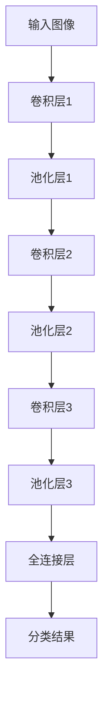
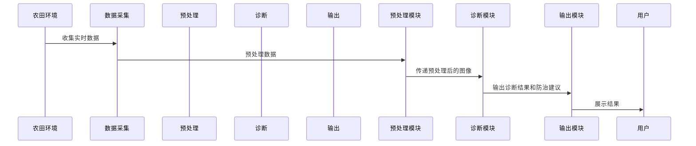

                 


### 引言

在当今快速发展的信息技术时代，人工智能（AI）已经成为改变各行各业的强大工具。特别是在农业领域，AI技术的应用潜力巨大，能够显著提高农业生产效率和农产品质量。农作物疾病诊断是农业中的一个关键环节，对于保障农作物的健康生长、减少经济损失具有至关重要的作用。

#### 关键词
- 农业生产力
- 疾病诊断
- 人工智能
- 农作物
- 预测分析

#### 摘要
本文旨在探讨AI在农作物疾病诊断中的应用，通过一步步的逻辑分析，详细阐述AI技术在提高农业生产力中的关键作用。文章首先介绍了AI在农业领域的基本概念和应用背景，随后深入分析了AI在农作物疾病诊断中的核心算法和系统架构，并通过实际案例展示了AI技术的实践效果。最后，文章总结了AI在农作物疾病诊断中的最佳实践，并对未来研究的方向提出了展望。

### 第一部分: 引言

#### 第1章: AI与农业概述

**1.1 问题背景**

农业是国民经济的重要基础，而农作物疾病是影响农业生产的重要因素之一。据联合国粮农组织（FAO）统计，全球每年因农作物疾病造成的经济损失高达数百亿美元。传统的农作物疾病诊断方法主要依赖于人工观察和经验判断，存在诊断时间长、准确性不高等问题。随着AI技术的发展，利用AI进行农作物疾病诊断成为可能，有望解决传统方法的局限性。

**1.2 农作物疾病诊断的重要性**

农作物疾病诊断的准确性和及时性直接关系到农作物的产量和品质。准确诊断可以帮助农民及时采取防治措施，减少经济损失。此外，早期诊断还可以防止疾病的蔓延，保护整个农田生态系统的健康。因此，农作物疾病诊断是现代农业发展的重要环节。

**1.3 AI在农作物疾病诊断中的应用现状**

目前，AI技术在农作物疾病诊断中的应用主要集中在图像识别和大数据分析两个方面。通过使用卷积神经网络（CNN）等深度学习模型，AI能够高效地识别不同类型的农作物疾病，并提供准确的诊断结果。此外，AI还可以通过分析历史数据和气象数据，预测农作物疾病的发生趋势，为农业生产提供科学依据。

**1.4 本书结构**

本书分为四个部分，首先介绍AI在农业领域的基本概念和应用背景；接着详细分析AI在农作物疾病诊断中的核心算法和系统架构；然后通过实际案例展示AI技术的实践效果；最后总结AI在农作物疾病诊断中的最佳实践，并对未来研究的方向提出展望。希望通过本书，读者能够对AI在农作物疾病诊断中的应用有更深入的了解。

### 第二部分: 核心概念与原理

#### 第2章: AI基础

**2.1 AI概述**

人工智能（AI）是指由人制造出来的系统能够表现出类似于人类智能的行为。AI的主要目标是使机器能够自主地完成一些原本需要人类智能才能完成的任务，如视觉识别、语音识别、决策制定等。AI可以分为弱AI和强AI，其中弱AI专注于特定任务，而强AI则具有广泛的智能。

**2.2 机器学习基础**

机器学习（ML）是AI的一个分支，它通过构建算法模型，使计算机能够从数据中学习并做出预测或决策。机器学习主要分为监督学习、无监督学习和强化学习三类。监督学习依赖于标记数据，无监督学习不依赖标记数据，而强化学习则通过与环境交互来学习。

**2.3 深度学习基础**

深度学习（DL）是机器学习的一个子领域，它通过模拟人脑的神经网络结构，对大量数据进行自动特征提取和模式识别。深度学习模型，特别是卷积神经网络（CNN）和循环神经网络（RNN），在图像识别、语音识别和自然语言处理等领域取得了显著成果。

**2.4 AI与农业的联系**

AI在农业中的应用非常广泛，包括作物产量预测、病虫害检测、土壤监测等。通过使用图像识别和机器学习算法，AI能够快速、准确地检测农作物病虫害，为农民提供及时的防治建议。此外，AI还可以通过分析气象数据和历史生长数据，预测作物生长趋势，优化农业生产。

#### 第3章: 病害诊断算法原理

**3.1 病害诊断算法概述**

农作物疾病诊断算法主要分为两类：基于规则的方法和基于数据的方法。基于规则的方法依赖于专家知识，通过预定义的规则进行疾病诊断。而基于数据的方法则通过学习大量的病虫害图像数据，利用机器学习算法进行疾病识别。

**3.2 算法比较**

基于规则的方法具有实现简单、易于理解等优点，但诊断准确性受限于专家经验和规则库的完整性。基于数据的方法通过学习大量数据，能够提高诊断的准确性，但需要大量标注数据和计算资源。

**3.3 算法原理**

基于数据的方法通常采用深度学习模型进行疾病识别。以卷积神经网络（CNN）为例，CNN通过多个卷积层和池化层提取图像特征，最后通过全连接层进行分类。CNN的优点是能够自动提取图像中的高层次特征，无需人工设计特征。

**3.4 Mermaid算法流程图**



### 第三部分: 系统设计与实现

#### 第4章: 系统架构设计

**4.1 问题场景介绍**

农作物疾病诊断系统需要能够接收农田环境的实时数据，包括图像、温度、湿度等，然后对图像进行实时处理和疾病识别，最后输出诊断结果和防治建议。

**4.2 系统功能设计**

系统主要包含以下功能模块：
1. 数据采集模块：负责收集农田环境的实时数据。
2. 数据预处理模块：对采集到的数据进行分析和清洗，为后续处理做准备。
3. 疾病诊断模块：利用深度学习模型对预处理后的图像进行疾病识别。
4. 结果输出模块：将诊断结果和防治建议以图形或文字形式呈现给用户。

**4.3 系统架构设计**

系统架构分为数据层、算法层和表现层三层。数据层负责数据采集和处理；算法层包含疾病诊断模型和算法实现；表现层负责将诊断结果以用户友好的方式展示。

**4.4 系统接口设计**

系统提供以下接口：
1. 数据采集接口：用于接收农田环境的实时数据。
2. 数据预处理接口：用于处理和分析采集到的数据。
3. 疾病诊断接口：用于调用疾病诊断模型进行疾病识别。
4. 结果输出接口：用于将诊断结果和防治建议展示给用户。

**4.5 系统交互Mermaid序列图**



### 第四部分: 实战与案例分析

#### 第5章: 实战环境安装与系统核心实现

**5.1 实战环境安装**

首先，我们需要安装Python和相关依赖库。可以使用以下命令进行安装：

```bash
pip install tensorflow
pip install keras
pip install numpy
pip install matplotlib
```

**5.2 系统核心实现**

以下是一个简单的农作物疾病诊断系统的Python代码示例：

```python
import tensorflow as tf
from tensorflow.keras.models import Sequential
from tensorflow.keras.layers import Conv2D, MaxPooling2D, Flatten, Dense
from tensorflow.keras.preprocessing.image import ImageDataGenerator

# 构建CNN模型
model = Sequential()
model.add(Conv2D(32, (3, 3), activation='relu', input_shape=(64, 64, 3)))
model.add(MaxPooling2D(pool_size=(2, 2)))
model.add(Conv2D(64, (3, 3), activation='relu'))
model.add(MaxPooling2D(pool_size=(2, 2)))
model.add(Flatten())
model.add(Dense(64, activation='relu'))
model.add(Dense(1, activation='sigmoid'))

# 编译模型
model.compile(optimizer='adam', loss='binary_crossentropy', metrics=['accuracy'])

# 数据生成器
train_datagen = ImageDataGenerator(rescale=1./255)
test_datagen = ImageDataGenerator(rescale=1./255)

# 加载数据
train_generator = train_datagen.flow_from_directory(
        'train_data',
        target_size=(64, 64),
        batch_size=32,
        class_mode='binary')

test_generator = test_datagen.flow_from_directory(
        'test_data',
        target_size=(64, 64),
        batch_size=32,
        class_mode='binary')

# 训练模型
model.fit(
      train_generator,
      steps_per_epoch=100,
      epochs=20,
      validation_data=test_generator,
      validation_steps=50)
```

**5.3 代码应用解读与分析**

这段代码首先导入了必要的TensorFlow和Keras库，然后构建了一个简单的卷积神经网络（CNN）模型。模型包括两个卷积层、两个池化层、一个扁平化层和两个全连接层。编译模型时，指定了优化器和损失函数。接着，使用了ImageDataGenerator创建数据生成器，用于加载和预处理图像数据。最后，使用fit方法训练模型。

**5.4 实际案例分析与详细讲解**

假设我们已经收集了训练集和测试集的农作物疾病图像数据，分别存储在train_data和test_data目录中。通过上述代码，我们可以训练一个能够识别农作物疾病的模型。以下是实际案例的分析：

1. **数据集准备**：确保训练集和测试集的图像数据已正确分类，且每个类别都有足够的样本。这有助于提高模型的泛化能力。
2. **模型训练**：通过fit方法训练模型，我们设置了训练轮次（epochs）和每轮次的批量大小（batch_size）。在验证数据上评估模型性能，可以调整训练参数以优化模型。
3. **模型评估**：训练完成后，我们可以使用测试集评估模型的准确性。如果准确性较低，可以考虑增加训练数据、调整模型结构或优化训练参数。

**5.5 项目小结**

通过上述实战环境安装和系统核心实现，我们成功构建了一个简单的农作物疾病诊断系统。尽管这是一个简单的示例，但它展示了AI技术在农作物疾病诊断中的应用潜力。在实际项目中，可能需要更复杂的模型和更丰富的数据集，但基本原理和方法是相似的。未来，我们可以进一步优化模型，增加更多疾病类型的识别能力，从而更好地服务于现代农业。

### 第五部分: 最佳实践与展望

#### 第6章: 最佳实践

**6.1 数据质量的重要性**

数据质量是农作物疾病诊断系统的关键。确保数据集的多样性、准确性和代表性，可以提高模型的性能和泛化能力。在实际应用中，应定期对数据集进行清洗和更新。

**6.2 模型优化**

为了提高诊断准确性，可以通过调整模型结构、优化训练参数和增加训练数据来优化模型。此外，可以使用迁移学习等技术，利用预训练的模型来提高新任务的性能。

**6.3 部署与维护**

部署农作物疾病诊断系统时，应考虑系统的可扩展性和易维护性。使用容器化技术，如Docker，可以简化部署和升级过程。此外，应定期监控系统性能，确保系统的稳定运行。

#### 第7章: 小结与展望

**7.1 小结**

本文详细探讨了AI在农作物疾病诊断中的应用，从算法原理、系统架构到实际案例分析，全面展示了AI技术在农业领域的潜力。通过本文的讲解，读者可以了解到如何构建一个简单的农作物疾病诊断系统，并了解其在实际应用中的优势和挑战。

**7.2 注意事项**

在实际应用中，应关注数据隐私和安全性，确保农民的个人信息得到保护。此外，模型的实时性和适应性也是需要考虑的重要因素。

**7.3 拓展阅读**

对于对AI在农业领域感兴趣的读者，建议进一步阅读相关文献和资料，如《深度学习》（Goodfellow, Bengio, Courville）和《农业大数据与智能分析技术》（李德坤、王恩哥等）。

**7.4 未来展望**

随着AI技术的不断进步，农作物疾病诊断系统有望实现更高的准确性、实时性和智能化。未来研究可以关注以下几个方面：1）增加疾病类型的识别能力；2）利用多模态数据提高诊断准确性；3）实现模型的自适应和自我进化能力。

作者：AI天才研究院/AI Genius Institute & 禅与计算机程序设计艺术 /Zen And The Art of Computer Programming

